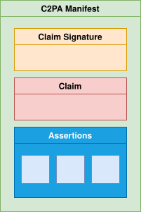

# C2PA Security Considerations

This work is licensed under a [Creative Commons Attribution 4.0 International License](https://creativecommons.org/licenses/by/4.0/).

## 1\. Introduction

This document provides information security considerations for technology described in the [C2PA core specification](../specs/C2PA_Specification.html.md). It complements security-related content in other C2PA documents. This document includes:

*   A summary of relevant security features of C2PA technology
    
*   Security considerations for practical use of C2PA technology
    
*   Threats to C2PA technology and respective treatment of those threats, including countermeasures
    

Analysis in this document does not assess security risk or likelihoods associated with threats or outcomes. These may vary based on a number of factors, such as the context in which C2PA technology is deployed and changes in the threat landscape. However, content in this document may be helpful in developing security risk and likelihood assessments related to use of C2PA technology.

> **IMPORTANT:**
> Content in this document is non-normative and does not specify requirements for complying with the C2PA specification.

While the C2PA endeavours to develop and maintain a comprehensive threat model and security considerations for C2PA technology, we expect this work to be ongoing as technology develops and the threat landscape evolves.

> **IMPORTANT:**
> This document is a work in progress.

### 1.1. Threat modelling process overview

The C2PA builds security into our designs as they are being developed, but also expects that security design and threat modelling will continue as the system, ecosystem, and threat landscape evolve.

To this end, the C2PA uses a focused threat modelling process to support development of a strong security and privacy design. Outcomes of the effort directly support development of documentation about explicit threats and security considerations while also facilitating security-oriented thinking throughout the design process.

The threat modelling process combines synchronous (i.e., live) threat modelling sessions with focused groups of Subject Matter Experts (SMEs) in the asynchronous development of content. The number of attendees in each synchronous session is kept small to promote efficient discussions, but all members of the C2PA have the opportunity to participate via either modality.

Like other security activities, we expect our threat modelling process to evolve with the C2PA ecosystem. Process documentation is considered a guide rather than a strict directive on how threat modelling works within the C2PA.

> **NOTE:**
> In this document _asset_ refers to C2PA assets and not [conventional threat model assets](https://cheatsheetseries.owasp.org/cheatsheets/Threat_Modeling_Cheat_Sheet.html#define-and-evaluate-your-assets).

#### 1.1.1. References

A variety of references and experiences are used to inform threat modelling and related security activities for the C2PA. This section provides a subset of public documents for reference.

*   [IETF on security considerations](https://datatracker.ietf.org/doc/html/rfc3552#page-26)
    
*   [IETF on privacy considerations (guidelines)](https://datatracker.ietf.org/doc/html/rfc6973#section-7)
    
*   [W3C security and privacy self-review questionnaire](https://www.w3.org/TR/security-privacy-questionnaire/)
    
*   [OAuth2 threat model (example)](https://datatracker.ietf.org/doc/html/rfc6819)
    
*   [Threat Modelling: Designing for Security](https://shostack.org/books/threat-modeling-book)
    
*   [OWASP Threat Modelling](https://owasp.org/www-community/Threat_Modeling)
    
*   [Microsoft Threat Modelling](https://www.microsoft.com/en-us/securityengineering/sdl/threatmodeling)
    

## 2\. Security features

This section summarizes C2PA features that support the [security model](#_security_model) specified later in this document. The [C2PA core specification](../specs/C2PA_Specification.html.md) should be considered the canonical reference for C2PA features. It supersedes summaries provided here.

### 2.1. Provenance model

C2PA enables consumers to reason about asset provenance. C2PA specifies a model for asset provenance based on the following definitions.

Provenance

The logical concept of understanding the history of an _asset_ and its interaction with _actors_ and other _assets_, as represented by the _provenance data_.

Provenance data

The set of _C2PA Manifest\_s for an \_asset_ and, in the case of a _composed asset_, its _ingredients_.

> **NOTE:**
> A _C2PA Manifest_ can reference other \_C2PA Manifest\_s.

Assertion

A data structure which represents a statement asserted by an _actor_ concerning the _asset_. This data is a part of the _C2PA Manifest_.

Claim

A digitally signed and tamper-evident data structure that references a set of _assertions_ by one or more _actors_, concerning an _asset_, and the information necessary to represent the _content binding_. If any _assertions_ were redacted, then a declaration to that effect is included. This data is a part of the _C2PA Manifest_.

Claim signature

The digital signature on the _claim_ using the private key of an _actor_. The _claim signature_ is a part of the _C2PA Manifest_.

C2PA Manifest

The set of information about the _provenance_ of an _asset_ based on the combination of one or more _assertions_ (including _content bindings_), a single _claim_, and a _claim signature_. A _C2PA Manifest_ is part of a _C2PA Manifest Store_.

> **NOTE:**
> A _C2PA Manifest_ can reference other \_C2PA Manifest\_s.

Origin

The _C2PA Manifest_ in the _provenance data_ which represents the software or device that initially created the _asset_.

> **NOTE:**
> Details on how one determines which _C2PA Manifest_ is the _origin_ are left for specification.

Active Manifest

The last manifest in the list of _C2PA Manifests_ inside of a _C2PA Manifest Store_ which is the one with the set of _content bindings_ that are able to be validated.

Figure 1. A C2PA Manifest and its constituent parts

### 2.2. Trust model

The basis of making trust decisions in C2PA, its [Trust Model](../specs/C2PA_Specification.html.md#_trust_model), is the identity of the actor associated with the cryptographic signing key used to sign the claim in the active manifest. The identity of a signatory is not necessarily a human actor, and the identity presented may be a pseudonym, completely anonymous, or pertain to a service or trusted hardware device with its own identity, including an application running inside such a service or trusted hardware. C2PA Manifests can be validated indefinitely regardless of whether the cryptographic credentials used to sign its contents are later expired or revoked.

In addition to identity, C2PA leverages trusted time-stamps to ensure the correctness of signing and revocation processes. A benefit of this approach is that revocation status can be optionally obtained when claims are generated (rather than when consumed), and revocation can be applied to subsets of signatures by time-stamp. See the [Trust Model section of the specification](../specs/C2PA_Specification.html.md#_trust_model) for more details.

### 2.3. Claim signatures

C2PA uses a combination of cryptographic hashes and signatures to ensure that any tampering of the asset provenance can be detected. C2PA does not offer any protection against the [complete removal of C2PA manifests from assets](#_threat_stripping_c2pa_manifests), but the design does aim to prevent any unauthorized tampering of either the digital asset content or the C2PA manifests themselves. The [C2PA Guidance document](../guidance/Guidance.html.md) for implementers offers direction about how soft bindings and manifest repositories could be used to address the removal situation.

Details on supported cryptographic hashing and signature schemes, as well as format details, are covered in the specification’s [Cryptography section](../specs/C2PA_Specification.html.md#_cryptography). As noted there, the C2PA maintains lists of supported algorithms and certificate types that aim to adhere to cryptographic and compatibility best practices.

Detail on how signing credentials relate to identity are included in the [Trust Model section](../specs/C2PA_Specification.html.md#_trust_model) of the specification. The [Validation section](../specs/C2PA_Specification.html.md#_validation) provides details on validating claims, which includes validating signatures.

### 2.4. Content bindings

Content bindings associate provenance data in C2PA Manifests with assets.

In the context of a C2PA Manifest, hard bindings provide a strict cryptographic binding between provenance and an asset; they aim to provide some useful guarantees against tampering. Soft bindings provide less strict binding between the provenance and an asset. They may associate C2PA provenance with multiple assets, and vice versa. The [soft binding section](../specs/C2PA_Specification.html.md#_soft_bindings) goes into details about how soft bindings can be used with C2PA Manifests.

C2PA Manifest Stores are usually embedded into assets but they may exist externally, such as when served as part of the same or linked HTTP connection. In addition, C2PA Manifest Stores may also be decoupled from assets, enabling the C2PA Manifest to be retrieved and processed separately from the asset.

### 2.5. Validation

Validation checks provenance claim signatures and performs supporting operations. The validation algorithm is described in detail in the [validation section of the C2PA specification](../specs/C2PA_Specification.html.md#_validation).

### 2.6. Protection of personal information

C2PA provides features that can be used to protect confidentiality of personal information while still establishing the provenance of an asset.

*   Anonymous or pseudo-anonymous identities may be used for signing claims.
    
*   Assertions that may contain sensitive information can be removed via [redaction](../specs/C2PA_Specification.html.md#_redaction_of_assertions).
    
*   Assertions can be customized for specific workflows, such as where specific information is required to remain encrypted end-to-end.
    
*   Manifests may include [W3C Verifiable Credentials](../specs/C2PA_Specification.html.md#_w3c_verifiable_credentials).
    

Note that confidentiality of personal information and other privacy-related concerns are addressed in the [Harms Considerations document](Harms_Modelling.html.md).

## 3\. Security model

The C2PA security model is focused on security of C2PA provenance data. While attackers may aim to compromise the security of other aspects of the system, this model assumes the pivotal goal is compromise of C2PA provenance.

The following principles should hold:

Integrity

Attempts to compromise the integrity of C2PA provenance data associated with a respective asset will be detected upon validation. This includes all data stored within C2PA Manifests.

For embedded C2PA Manifests, malicious association of an existing manifest with a differing asset is also tamper-evident. In addition, the following actions are tamper-evident for all manifests:

*   C2PA Manifest Store: Malicious addition or removal of a manifest.
    
*   C2PA Manifest: Malicious modification of an active or ingredient manifest.
    
*   Claims and claim signatures: Addition, removal, or modification of an existing claim in an existing C2PA Manifest.
    
*   Assertions: Addition, removal, or modification of assertions in the assertion store referenced by an existing claim.
    

Availability

An attacker may degrade availability of C2PA data, but C2PA should provide means to mitigate this impact.

For example: An attacker may strip manifests from C2PA-enabled assets altogether. Guidance is provided on how to mitigate the impact of this scenario.

While C2PA supports cloud-hosted information that is referenced from assertions, the validation algorithm makes retrieval of that information optional for validation in order that any network attacks (e.g, DDOS, tracking, etc.) cannot impact user experience.

Confidentiality

C2PA does not specify confidentiality properties for assets, provenance model primitives, private address books, or cryptographic secrets.

*   They may be kept confidential via other means. For example by transmitting assets via TLS. However, enforcing this confidentiality is considered out-of-scope for this specification.
    
*   Some private data, such as claim signing keys or private address books, must adhere to conventional confidentiality principles. Compromise of this private data could lead to indirect violation of other principles specified in this section. Enforcing confidentiality of this adjacent private data is considered out-of-scope for this specification.
    
*   C2PA does not specify Digital Rights Management (DRM) technology.
    
*   C2PA does not specify guarantees of confidentiality of personal information.
    
    *   However, C2PA provides features that can be used to protect confidentiality of personal information ([summary](#_protection_of_personal_information))
        
    *   Confidentiality of personal information and other privacy-related concerns are addressed in the [Harms Considerations document](Harms_Modelling.html.md).
        
        In general, these assertions are achieved through application of the [C2PA Trust Model](../specs/C2PA_Specification.html.md#_trust_model) to the claim generation process, and corresponding checks in the validation process.
        
    

## 4\. Threat model

This section documents information security threats to C2PA technology. Threats are described as threat scenarios and organized categorically by prospective attacker goals; where an attacker goal is what the attacker is trying to achieve, or the desired outcome of the threat scenario.

Each threat scenarios is described as follows:

*   Description: A short description of the threat scenario
    
*   Prerequisites: Relevant requirements for attempting an attack or threat scenario
    
*   Impact analysis: Summary of the impact of the threat scenario on the C2PA security model
    
*   Guidance: Any supplementary security guidance on addressing the threat scenario or treating potential residual security risk
    

> **NOTE:**
> This document refers to threat sources, agents, actors and other malicious entities commonly as attackers.

### 4.1. Threat and attack assumptions

The following assumptions are made about entities that may attack C2PA technology:

*   Attackers have full access to public assets and associated public metadata, including C2PA Manifests.
    
*   Attackers may attempt to access claim generator software (e.g., C2PA-enabled photo editing software) as a typical user.
    
*   Attackers do not have access to private keys referenced within the C2PA ecosystem (e.g., claim signing private keys, Time-stamping Authority private keys, etc.). They may, however, attempt to access these keys via exploitation techniques.
    
*   Attackers have the ability to publish assets to an impactful audience, for example, as a social media user.
    
*   Quantum computing cryptanalytic attacks are considered out-of-scope.
    

The following additional assumptions are made about the threat model:

*   Attacks that rely on bypassing conventional security models of non-C2PA technology are considered out-of-scope. For example:
    
    *   Attacks against the C2PA Validator as an architectural component within a user agent (e.g., web browser) are considered in-scope.
        
    *   A compromise of the C2PA validation logic via some non-C2PA attack vector within the user agent is considered out-of-scope, since this would typically require bypassing the security model of the user agent (e.g., escaping a web browser sandbox or compromising the host via other means).
        
    
*   Attacks across conventional trust boundaries are considered in-scope.
    
    *   For example, attacks against C2PA-enabled assets traversing the internet.
        
    

### 4.2. Threats

#### 4.2.1. Goal: Degrading access to provenance information

Threat scenarios in this category aim to prevent media consumers from reasoning about the provenance of assets. In terms of the security model, this is a compromise of availability of C2PA provenance data.

##### 4.2.1.1. Threat: Stripping C2PA Manifests

###### 4.2.1.1.1. Description

An attacker removes C2PA Manifests from an asset delivered with hard bindings. For example, by downloading C2PA-enabled media from a social media site, stripping the C2PA Manifest(s), and re-posting it.

###### 4.2.1.1.2. Prerequisites

Technical ability to strip provenance data from published or stored assets and deliver the stripped assets targeted users or systems. For example, via republishing to social media or on-path attacks.

###### 4.2.1.1.3. Impact analysis

It is possible for an attacker to remove metadata as described. Depending on the context, this could cause a user agent not to display provenance information associated with the asset.

###### 4.2.1.1.4. Security guidance

The impact of this threat scenario could be mitigated through use of manifest repositories, e.g., by making C2PA Manifests available to user agents when embedded manifests are missing.

Use of manifest repositories can introduce security and privacy issues. See the [Content binding security section](#_content_binding_security) for more information.

##### 4.2.1.2. Threat: Stripping data within C2PA Manifests

###### 4.2.1.2.1. Description

An attacker removes metadata from within C2PA Manifests(s) stored in a asset delivered with hard bindings, such as the assertion store, individual assertions, claims, claim signatures, etc. For example, by downloading C2PA-enabled media from a social media site, stripping the target C2PA metadata, and re-posting it.

###### 4.2.1.2.2. Prerequisites

Technical ability to strip provenance data from published or stored assets and deliver the stripped assets targeted users or systems. For example, via republishing to social media or on-path attacks.

###### 4.2.1.2.3. Impact analysis

It is possible for an attacker to remove metadata as described. However, [validation checks](../specs/C2PA_Specification.html.md#_validation) as implemented by C2PA validator will detect any complete or partial removal of metadata stored within C2PA Manifests due to the use of cryptographic hashes. Removal of an entire C2PA Manifest is possible, and described as a [distinct threat scenario](#_threat_stripping_c2pa_manifests).

This is similar to the case of stripping all C2PA metadata. However, in this scenario there is an added benefit that user agents can explicitly detect the attempt to remove metadata as part of the validation process.

###### 4.2.1.2.4. Security guidance

The impact of this threat scenario is mitigated through explicit detection of missing metadata through the standard C2PA validation process and factoring this into system behaviour. For example, a user agent would display the affected asset differently than a non-modified asset. (For more information about the user experience aspects, see [C2PA’s UX Guidance](../ux/UX_Recommendations.html.md))

The impact of this threat scenario could be also mitigated through use of manifest repositories, e.g., by making decoupled C2PA Manifests available to user agents when embedded metadata is missing.

Use of manifest repositories can introduce security and privacy issues. See the [Content binding security section](#_content_binding_security) for more information.

#### 4.2.2. Goal: Tamper with provenance information

Threat scenarios in this category aim to modify or spoof provenance information associated with C2PA-enabled assets, e.g., to present misleading provenance data to media consumers. This is considered a compromise of integrity of provenance data in terms of the C2PA security model.

##### 4.2.2.1. Threat: Copying C2PA metadata

###### 4.2.2.1.1. Description

An attacker copies valid, hard-bound C2PA metadata, such as assertions, claims, or entire C2PA Manifests, from one C2PA-enabled asset to another.

###### 4.2.2.1.2. Prerequisites

Technical ability to strip provenance data from published or stored assets and deliver the stripped assets targeted users or systems. For example, via republishing to social media or on-path attacks.

###### 4.2.2.1.3. Impact analysis

An attacker is able to perform the copying as described. However, C2PA hard bindings provide a cryptographic binding between assets and C2PA Manifests via claim signatures. Thus, [validation checks](../specs/C2PA_Specification.html.md#_validation) (e.g., as implemented by a user agent) will detect the replaced C2PA Manifests.

This is similar to the case of stripping all C2PA metadata. However, in this scenario there is an added benefit that user agents can explicitly detect the attempt to remove metadata as part of the validation process.

###### 4.2.2.1.4. Security guidance

The impact of this threat scenario could be mitigated through explicit detection of incorrect metadata as described here, and factoring this into system behaviour. For example, a user agent would display the affected asset differently than a non-modified asset. (For more information about the user experience aspects, see [C2PA’s UX Guidance](../ux/UX_Recommendations.html.md)).

The impact of this threat scenario could be also mitigated through use of manifest repositories, e.g., by making decoupled C2PA Manifests available to user agents when embedded metadata is missing.

Use of manifest repositories can introduce security and privacy issues. See the [Content binding security section](#_content_binding_security) for more information.

##### 4.2.2.2. Threat: Spoofing signed C2PA metadata via stolen key

###### 4.2.2.2.1. Description

An attacker compromises the confidentiality of a claim signing key and uses it to attach valid, malicious provenance to a asset.

###### 4.2.2.2.2. Prerequisites

Ability to read and use a valid C2PA claim signing key. For example by stealing it from a claim generation and signing system. Ability to copy, modify, or generate assets, add desired (valid) C2PA provenance metadata to them, and deliver them to targeted users or systems. For example, via republishing to social media or on-path attacks.

###### 4.2.2.2.3. Impact analysis

An attacker that is able to steal a signing key can spoof valid C2PA Manifests on arbitrary assets. This applies to both hard and soft bindings. Valid claim signatures will be limited to the exposed key; an attacker cannot impersonate other signers in this scenario. These manifests will pass validation checks. Further, an attacker will be able to continue to generate assets with spoofed provenance until the compromised credential is revoked, and revocation status is propagated to the targeted users/systems.

If the signer’s credential type does not support or provide a means for revocation, it may be necessary to remove the trust anchor associated with the signer’s credential from the respective C2PA trust list to effectively revoke the malicious manifests. In this case, all manifests associated with the trust anchor will be invalidated.

Revocation of the signing key associated with the malicious manifests may invalidate other manifests if signing keys are reused between claim generation / claim signing system users.

###### 4.2.2.2.4. Security guidance

Claim generators must adhere to best practices for securing keys in their respective operating environments. This includes using platform-specific best practices for key storage and management (e.g., hardware security modules, key management services), minimizing key reuse, and revoking keys when compromise is suspected. For more information on key management, see the [NIST Key Management Guidelines](https://csrc.nist.gov/Projects/Key-Management/Key-Management-Guidelines).

It is highly recommended that all signing credentials include revocation information.

##### 4.2.2.3. Threat: Spoofing signed C2PA metadata via misuse of claim generator

###### 4.2.2.3.1. Description

An attacker misuses a legitimate claim generator (e.g., photo editing service) to add misleading provenance to a C2PA-enabled asset.

###### 4.2.2.3.2. Prerequisites

Ability to access and exploit or misuse a claim generator system. For example, misuse of a claim generator may result in malicious additions of C2PA Manifests or Claims to assets; exploitation of vulnerabilities in claim generators may lead to modification or tampering with existing C2PA Manifest data added with the target claim generator’s signing key(s). Ability to deliver assets to targeted users. For example, via publishing to social media or on-path attacks.

###### 4.2.2.3.3. Impact analysis

An attacker may be able to misuse or exploit a claim signing system to create malicious C2PA Manifests. These can then be delivered to targeted users/systems. Note that valid claim signatures will be limited to credentials used by the targeted claim signing system; an attacker cannot impersonate other signers in this scenario.

If the signer’s credential type does not support or provide a means for revocation, it may be necessary to remove the trust anchor associated with the signer’s credential from the respective C2PA trust list to effectively revoke the malicious manifests. In this case, all manifests associated with the trust anchor will be invalidated.

Revocation of the signing key associated with the malicious manifests may invalidate other manifests if signing keys are reused between claim generation / claim signing system users.

###### 4.2.2.3.4. Security guidance

Claim generators must adhere to industry best practices for information security and anti-abuse practices, including leveraging available platform-specific features for deployment (e.g. [Android SafetyNet](https://developer.android.com/training/safetynet), [Apple DeviceCheck](https://developer.apple.com/documentation/devicecheck)). Likewise, claim generators should use platform-specific best practices for key storage and management. For example, usage of hardware security modules, key management services), minimizing key reuse, and revoking keys when compromise is suspected. For more information on key management, see the [NIST Key Management Guidelines](https://csrc.nist.gov/Projects/Key-Management/Key-Management-Guidelines).

It is highly recommended that all signing credentials include revocation information.

##### 4.2.2.4. Threat: Issuance of claim signing keys to malicious entity

###### 4.2.2.4.1. Description

An attacker causes a C2PA claim signing key issuer to issue a valid signing key to them. They then use this signing key to add misleading provenance to a C2PA-enabled media asset.

###### 4.2.2.4.2. Prerequisites

Ability to bypass unspecified processes for obtaining a claim signing key.

###### 4.2.2.4.3. Impact analysis

An attacker that is able to obtain a legitimate claim signing key can spoof valid C2PA Manifests on arbitrary media assets. These manifests will pass validation checks. Further, an attacker will be able to continue to generate media assets with spoofed provenance until the compromised credential is revoked, and revocation status is propagated to the targeted users/systems.

It may be necessary to remove the trust anchor associated with the signer’s credential from the respective C2PA trust list to effectively revoke malicious manifests. In this case, all manifests associated with the trust anchor will be invalidated.

###### 4.2.2.4.4. Security guidance

The C2PA does not currently specify requirements regarding issuance of claim signing keys. It is recommended that these processes be robust against exploitation and misuse. The [CAB Forum Baseline Requirements](https://cabforum.org/baseline-requirements/) provide a working example of security requirements for signing credential issuers.

##### 4.2.2.5. Threat: Swapping ingredients

###### 4.2.2.5.1. Description

An attacker finds a media asset with a C2PA Manifest Store that includes an ingredient manifest with a signature from valid, non-public, credentials. They replace the ingredient manifest with a malicious manifest.

###### 4.2.2.5.2. Prerequisites

Ability to discover media with susceptible ingredient manifest and generate a malicious replacement. And deliver the media asset to the target users/systems.

###### 4.2.2.5.3. Impact analysis

Validation of ingredients is optional, however, validation of the hash of the ingredient’s manifest at the time it was added to the active manifest as an ingredient is not. See the [Validation section of the C2PA specification](../specs/C2PA_Specification.html.md#_validation) for details.

While a C2PA validator is not expected to have access to the original, non-public, signing credential nor to the original ingredient asset, it can differentiate between the original and compromised provenance by checking the `hashed_uri` present in the ingredient assertion. Since the malicious manifest will not match the original, the validator is able to detect the attack.

###### 4.2.2.5.4. Security guidance

Claim generators should add [review ratings](../specs/C2PA_Specification.html.md#_review_ratings) to their assertion metadata to propagate their assessment of ingredients to downstream consumers. When this validation is performed on both media assets described in this scenario, downstream consumers will be able to differentiate between them.

##### 4.2.2.6. Threat: Binding malicious media asset to valid provenance via soft-binding collision

###### 4.2.2.6.1. Description

An attacker generates a malicious media asset whose soft binding matches the soft binding of a legitimate, target media asset. The attacker creates a decoupled, soft-bound manifest for the malicious media asset and injects it into a manifest repository. The malicious media asset is then delivered to the target/system user, which retrieves the legitimate C2PA Manifest via the common soft binding.

###### 4.2.2.6.2. Prerequisites

Ability to generate a colliding soft binding for a target media asset and publish the resulting manifest such that it will be retrieved by the target user/system for the target media asset. Also requires that access to be able to add manifests to a manifest repository.

###### 4.2.2.6.3. Impact analysis

Malicious media bound to legitimate C2PA provenance data is validated and presented to the target system/user.

###### 4.2.2.6.4. Security guidance

C2PA provides guidance on applying soft bindings, which may include algorithms for mitigating this type of attack. See the [content binding documentation](../guidance/Guidance.html.md) for details.

##### 4.2.2.7. Threat: Use valid W3C Verified Credentials to add authenticity to incorrect actor attribution

###### 4.2.2.7.1. Description

An attacker copies a valid W3C Verified Credential (VC) from an existing C2PA Manifest. The attacker then creates a separate, valid C2PA Manifest that includes the copied VC, misleading information, and a valid claim signature. The resulting manifest is presented to consumers.

###### 4.2.2.7.2. Prerequisites

*   Ability to copy a valid VC from an existing C2PA Manifest
    
*   Ability to generate and sign a claim that passes validation
    
*   Ability to deliver assets to consumer(s), for example via publishing to social media
    

###### 4.2.2.7.3. Impact analysis

Consumers are presented with UX that indicates the subject of copied VC is associated with the manipulated asset.

###### 4.2.2.7.4. Security guidance

User agents must make a clear separation between the signer of the Claim and any included W3C Verifiable Credentials. It must be clear that the association of those VCs to assertions, are made by the claim signer (i.e., the subject of the VC was not responsible for the association).

Claim generators and signing operations should adhere to security best practices.

##### 4.2.2.8. Threat: Binding valid media asset to malicious provenance via soft-binding collision

###### 4.2.2.8.1. Description

An attacker generates a dummy media asset whose soft binding matches the soft binding of another media asset. They then use a claim generator to create a valid, malicious C2PA claim(s), and a C2PA Manifest. They then publish the C2PA Manifest to a manifest repository. When the target media asset is validated, the malicious C2PA Manifest is retrieved via the common soft binding.

###### 4.2.2.8.2. Prerequisites

Ability to generate a colliding soft binding for a target media asset and publish the resulting manifest such that it will be retrieved by the target user/system for the target media asset.

###### 4.2.2.8.3. Impact analysis

Malicious provenance data bound to a legitimate media asset is validated and presented to the target system/user.

###### 4.2.2.8.4. Security guidance

C2PA provides guidance on applying soft bindings, which may include algorithms for mitigating this type of attack. See the [content binding documentation](../guidance/Guidance.html.md) for details.

#### 4.2.3. Goal: Exploit functionality introduced by C2PA

Threat scenarios in this category do not aim to break the C2PA security model. Rather, they aim to leverage C2PA functionality to perform systems attacks or exploitation. Note that the set of scenarios included here is not meant to be comprehensive; they focus on application of known exploitation techniques against behaviour explicitly referenced in the C2PA specification.
