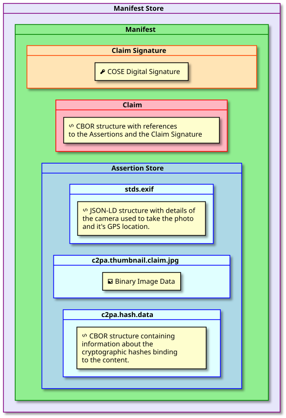
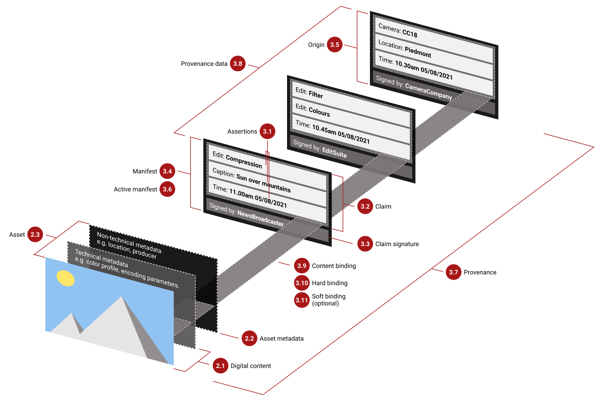
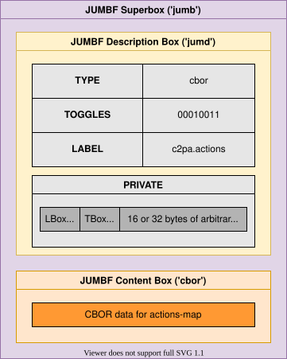
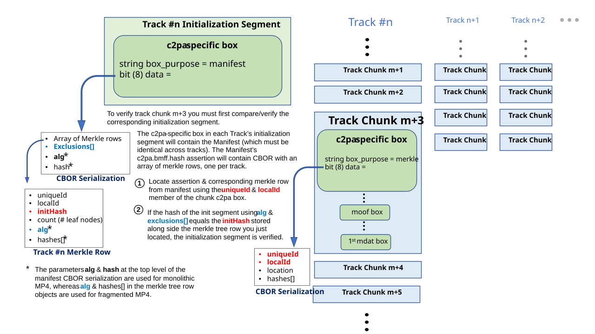
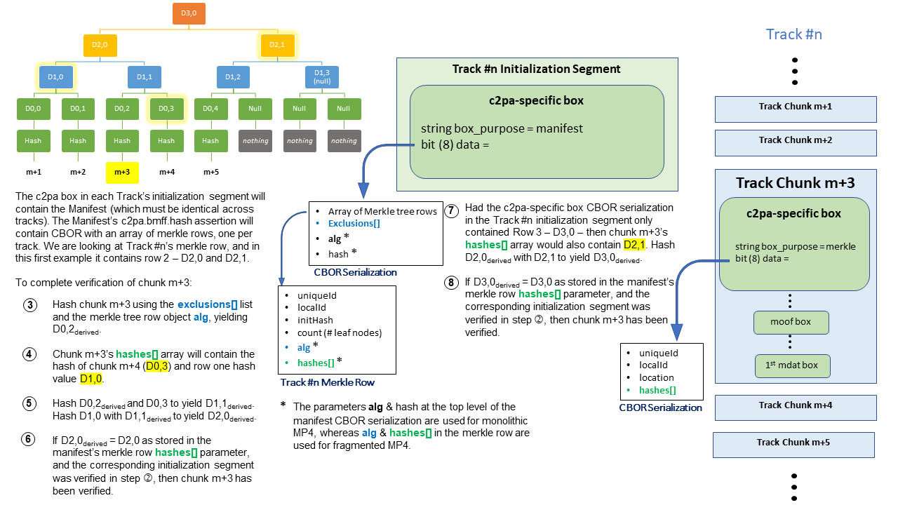
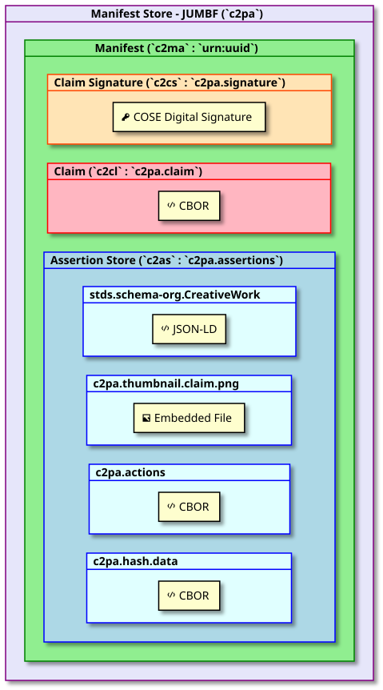
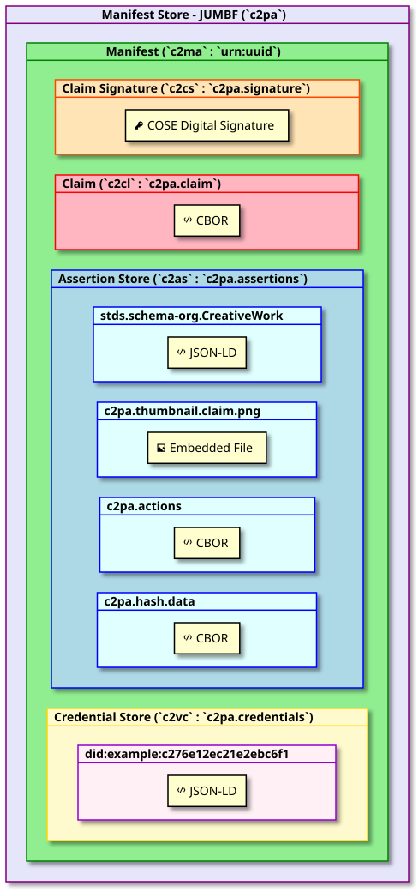
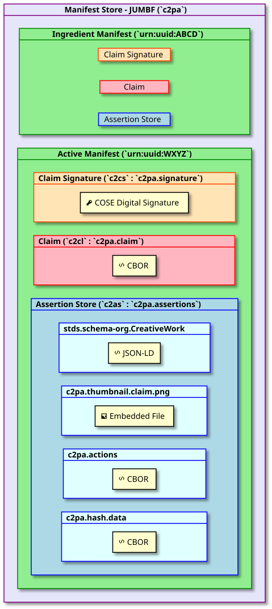

# C2PA Technical Specification

[](http://creativecommons.org/licenses/by/4.0/)

This work is licensed under a [Creative Commons Attribution 4.0 International License](http://creativecommons.org/licenses/by/4.0/).

* * *

THESE MATERIALS ARE PROVIDED “AS IS.” The parties expressly disclaim any warranties (express, implied, or otherwise), including implied warranties of merchantability, non-infringement, fitness for a particular purpose, or title, related to the materials. The entire risk as to implementing or otherwise using the materials is assumed by the implementer and user. IN NO EVENT WILL THE PARTIES BE LIABLE TO ANY OTHER PARTY FOR LOST PROFITS OR ANY FORM OF INDIRECT, SPECIAL, INCIDENTAL, OR CONSEQUENTIAL DAMAGES OF ANY CHARACTER FROM ANY CAUSES OF ACTION OF ANY KIND WITH RESPECT TO THIS DELIVERABLE OR ITS GOVERNING AGREEMENT, WHETHER BASED ON BREACH OF CONTRACT, TORT (INCLUDING NEGLIGENCE), OR OTHERWISE, AND WHETHER OR NOT THE OTHER MEMBER HAS BEEN ADVISED OF THE POSSIBILITY OF SUCH DAMAGE.

<a id="_introduction"></a>
## 1\. Introduction

<a id="_overview"></a>
### 1.1. Overview

With the increasing velocity of digital content and the increasing availability of powerful creation and editing techniques, establishing the provenance of media is critical to ensure transparency, understanding, and ultimately, trust.

We are witnessing extraordinary challenges to trust in media. As social platforms amplify the reach and influence of certain content via ever more complex and opaque algorithms, mis-attributed and mis-contextualized content spreads quickly. Whether inadvertent misinformation or deliberate deception via disinformation, inauthentic content is on the rise.

Currently, creators who wish to include metadata about their work (for example, authorship) cannot do so in a secure, tamper-evident and standardized way across platforms. Without this attribution information, publishers and consumers lack critical context for determining the authenticity of media.

Provenance empowers content creators and editors, regardless of their geographic location or degree of access to technology, to disclose information about who created or changed an asset, what was changed and how it was changed. Content with provenance provides indicators of authenticity so that consumers can have awareness of who has altered content and what exactly has been changed. This ability to provide provenance for creators, publishers and consumers is essential to facilitating trust online.

To address this issue at scale for publishers, creators and consumers, the Coalition for Content Provenance and Authenticity (C2PA) has developed this technical specification for providing content provenance and authenticity. It is designed to enable global, opt-in, adoption of digital provenance techniques through the creation of a rich ecosystem of digital provenance enabled applications for a wide range of individuals and organizations while meeting appropriate security requirements.

This specification has been, and continues to be, informed by scenarios, workflows and requirements gathered from industry experts and partner organizations, including the [Project Origin Alliance](https://www.originproject.info/) and the [Content Authenticity Initiative (CAI)](https://contentauthenticity.org/). It is also possible that regulatory bodies and governmental agencies could utilize this specification to establish standards for digital provenance.

<a id="_scope"></a>
### 1.2. Scope

This specification describes the technical aspects of the C2PA architecture; a model for storing and accessing cryptographically verifiable information whose trustworthiness can be assessed based on a defined [trust model](#_trust_model). Included in this document is information about how to create and process a C2PA Manifest and its components, including the use of digital signature technology for enabling tamper-evidence as well as establishing trust.

Prior to developing this specification, the C2PA created our [Guiding Principles](https://c2pa.org/principles/) that enabled us to remain focused on ensuring that the specification can be used in ways that respect privacy and personal control of data with a critical eye toward potential abuse and misuse. For example, the creators and publishers of the media assets always have control over whether provenance data is included as well as what specific pieces of data are included.

> **IMPORTANT:**
> From the overarching goals section of the guiding principles:
>
> > C2PA specifications SHOULD NOT provide value judgments about whether a given set of provenance data is 'good' or 'bad,' merely whether the assertions included within can be validated as associated with the underlying asset, correctly formed, and free from tampering.

It is important that the specification does not negatively impact content accessibility for consumers.

Other documents from the C2PA will address specific implementation considerations such as expected user experiences and details of our threat and harms modelling.

<a id="_technical_overview"></a>
### 1.3. Technical Overview

The C2PA information comprises a series of statements that cover areas such as asset creation, authorship, edit actions, capture device details, bindings to content and many other subjects. These statements, called [Assertions](#_assertion), make up the provenance of a given asset and represent a series of trust signals that can be used by a human to improve their view of trustworthiness concerning the asset. Assertions are wrapped up with additional information into a [digitally signed](#_digital_signatures) entity called a [Claim](#_claim).

The [W3C Verifiable Credentials](https://www.w3.org/TR/vc-data-model) of individual actors that are involved in the creation of the assertions can be added to the C2PA information to provide additional trust signals to the process of assessing trustworthiness of the asset.

These assertions, claims, credentials and signatures are all bound together into a verifiable unit called a [C2PA Manifest](#_c2pa_manifest) by a hardware or software component called a Claim Generator. The set of C2PA Manifests, as stored in the asset’s C2PA Manifest Store, represent its provenance data.


Figure 1. A C2PA Manifest and its constituent parts

<a id="_establishing_trust"></a>
### 1.4. Establishing Trust

The basis of making trust decisions in C2PA, our [Trust Model](#_trust_model), is the identity of the actor associated with the cryptographic signing key used to sign the claim in the Active Manifest. The identity of a signatory is not necessarily a human actor, and the identity presented may be a pseudonym, completely anonymous, or pertain to a service or trusted hardware device with its own identity, including an application running inside such a service or trusted hardware. C2PA Manifests can be validated indefinitely regardless of whether the cryptographic credentials used to sign its contents are later expired or revoked.

<a id="_an_example"></a>
### 1.5. An Example

A very common scenario will be a user (called an actor in the C2PA ecosystem) taking a photograph with their C2PA-enabled camera (or phone). In that instance, the camera would create a manifest containing some such assertions including information about the camera itself, a thumbnail of the image and some cryptographic hashes that bind the photograph to the manifest. These assertions would then be listed in the Claim, which would be digitally signed and then the entire manifest would be embedded into the output JPEG. This manifest would remain valid indefinitely.



Figure 2. Example C2PA Manifest of a Photograph

A Manifest Consumer, such as a C2PA Validator, could help users to establish the trustworthiness of the asset by first validating the digital signature and its associated credential. It can also check each of the assertions for validity and present the information contained in them, and the signature, to the user in a way that they can then make an informed decision about the trustworthiness of the digital content.

<a id="_design_goals"></a>
### 1.6. Design Goals

In the creation of the C2PA architecture, it was important to establish some clear goals for the work to ensure that the technology was usable across a wide spectrum of hardware and software implementations worldwide and accessible to all.

| Goal | Description |
| --- | --- |
| Privacy | Enable actors to control the privacy of their information, including identity, consumption data and information recorded in provenance |
| Responsibility | Ensure consumers can determine the provenance of an asset |
| Scalability | Enable creation/consumption/validation of media provenance at the same scale as media creation/consumption on the web |
| Extensibility | Ensure future metadata and credential providers are able to add their information without requiring input or approval from the C2PA |
| Interoperability | Ensure that differing implementations are able to operate with each other without ambiguity |
| Whole Workflow Applicability | Maintain the provenance of the asset across multiple tools, from creation through all subsequent modification and publication/distribution |
| Technology Minimalism | Create only the minimum required novel technology in the specification by relying on prior, well-established techniques |
| Security | Design to ensure that consumers can trust the integrity and source of provenance, and ensure the design is reviewed by experts |
| Content Ubiquity | Enable the inclusion of provenance for all common media types, including documents |
| Flexible Locality | Enable both online and offline (asset-only) storage and consumption/validation of provenance |
| Global Universality | Design for the needs of interested users throughout the world |
| Accessibility | Ensure that the technology can be used in a way that conform to recognized accessibility standards, such as WCAG |
| Harms and Misuse | Design to avert and mitigate potential harms, including threats to human rights and disproportionate risks to vulnerable groups |
| Evolving | Continuous review of the specification against these goals to ensure that they remain our priority |

<a id="_glossary"></a>
## 2\. Glossary

<a id="_introductory_terms"></a>
### 2.1. Introductory terms

<a id="_actor"></a>
#### 2.1.1. Actor

A human or non-human (hardware or software) that is participating in the C2PA ecosystem. For example: a camera (capture device), image editing software, cloud service or the person using such tools.

> **NOTE:**
> An organization or group of _actors_ may also be considered an _actor_ in the C2PA ecosystem.

<a id="_signer"></a>
#### 2.1.2. Signer

An _actor_ (human or non-human) whose credential’s private key is used to sign the _claim_. The _signer_ is identified by the subject of the credential.

<a id="_claim_generator"></a>
#### 2.1.3. Claim generator

The non-human (hardware or software) _actor_ that generates the _claim_ about an _asset_ as well as the _claim signature_, thus leading to the _asset_'s associated _manifest_.

<a id="_manifest_consumer"></a>
#### 2.1.4. Manifest consumer

An _actor_ who consumes an _asset_ with an associated _manifest_ for the purpose of obtaining the _provenance data_ from the _manifest_.

<a id="_validator"></a>
#### 2.1.5. Validator

A _manifest consumer_ whose role is to perform the actions described in [Chapter 15, _Validation_](#_validation).

<a id="_action"></a>
#### 2.1.6. Action

An operation performed by an _actor_ on an _asset._ For example, "create", "embed", or "apply filter".

<a id="_assets_and_content"></a>
### 2.2. Assets and Content

<a id="_digital_content"></a>
#### 2.2.1. Digital content

The portion of an _asset_ that represents the actual content, such as the pixels of an image, along with any additional technical metadata required to understand the content (e.g., a colour profile or encoding parameters).

<a id="_asset_metadata"></a>
#### 2.2.2. Asset metadata

The portion of an _asset_ that represents non-technical information about the _asset_ and its _digital content_, as may be stored via standards such as Exif or XMP.

<a id="_asset"></a>
#### 2.2.3. Asset

A file or stream of data containing _digital content_, _asset metadata_ and optionally, a _C2PA Manifest_.

> **NOTE:**
> For the purposes of this definition, we will extend the typical definition of "file" to include cloud-native and dynamically generated data.

<a id="_derived_asset"></a>
#### 2.2.4. Derived asset

A _derived asset_ is an _asset_ that is created by starting from an existing _asset_ and performing _actions_ to it that modify its _digital content_ and _asset metadata_.

**EXAMPLE:** An audio stream that has been shortened or a document where pages have been added.

<a id="_asset_rendition"></a>
#### 2.2.5. Asset rendition

A representation of an _asset_ (either as a part of an _asset_ or a completely new _asset_) where the _digital content_ has had a 'non-editorial transformation' _action_ (e.g., re-encoding or scaling) applied but where the _asset metadata_ has not been modified.

**EXAMPLE:** A video file that is re-encoded for reduced screen resolution or network bandwidth.

<a id="_composed_asset"></a>
#### 2.2.6. Composed asset

A composed asset is an _asset_ that is created by building up a collection of multiple parts or fragments of _digital content_ (referred to as ingredients) from one or more other _assets_. When starting from an existing _asset_, it is a special case of a _derived asset_ - however a _composed asset_ can also be one that starts from a "blank slate".

**EXAMPLES:**

*   A video created by importing existing video clips and audio segments into a "blank slate".
    
*   An image where another image is imported and super-imposed on top of the starting image.
    

<a id="_core_aspects_of_c2pa"></a>
### 2.3. Core Aspects of C2PA

<a id="_assertion"></a>
#### 2.3.1. Assertion

A data structure which represents a statement asserted by an _actor_ concerning the _asset_. This data is a part of the _C2PA Manifest_.

<a id="_claim"></a>
#### 2.3.2. Claim

A digitally signed and tamper-evident data structure that references a set of _assertions_ by one or more _actors_, concerning an _asset_, and the information necessary to represent the _content binding_. If any _assertions_ were redacted, then a declaration to that effect is included. This data is a part of the _C2PA Manifest_.

<a id="_claim_signature"></a>
#### 2.3.3. Claim signature

The digital signature on the _claim_ using the private key of an _actor_. The _claim signature_ is a part of the _C2PA Manifest_.

<a id="_c2pa_manifest"></a>
#### 2.3.4. C2PA Manifest

The set of information about the _provenance_ of an _asset_ based on the combination of one or more _assertions_ (including _content bindings_), a single _claim_, and a _claim signature_. A _C2PA Manifest_ is part of a _C2PA Manifest Store_.

> **NOTE:**
> A _C2PA Manifest_ can reference other _C2PA Manifest_s.

<a id="_c2pa_manifest_store"></a>
#### 2.3.5. C2PA Manifest Store

A collection of _C2PA Manifests_ that can either be embedded into an _asset_ or be external to its _asset_.

<a id="_origin"></a>
#### 2.3.6. Origin

The _C2PA Manifest_ in the _provenance data_ which represents the software or device that initially created the _asset_.

> **NOTE:**
> Details on how one determines which _C2PA Manifest_ is the _origin_ are left for specification.

<a id="_active_manifest"></a>
#### 2.3.7. Active Manifest

The last manifest in the list of _C2PA Manifests_ inside of a _C2PA Manifest Store_ which is the one with the set of _content bindings_ that are able to be validated.

<a id="_provenance"></a>
#### 2.3.8. Provenance

The logical concept of understanding the history of an _asset_ and its interaction with _actors_ and other _assets_, as represented by the _provenance data_.

<a id="_provenance_data"></a>
#### 2.3.9. Provenance data

The set of _C2PA Manifest_s for an _asset_ and, in the case of a _composed asset_, its _ingredients_.

> **NOTE:**
> A _C2PA Manifest_ can reference other _C2PA Manifest_s.

<a id="_authenticity"></a>
#### 2.3.10. Authenticity

A property of _digital content_ comprising a set of facts (_provenance data_ and _hard bindings_) that can be cryptographically verified as not having been tampered with.

<a id="_content_binding"></a>
#### 2.3.11. Content binding

Information that associates _digital content_ to a specific _C2PA Manifest_ associated with a specific _asset_, either as a _hard binding_ or a _soft binding_.

<a id="_hard_binding"></a>
#### 2.3.12. Hard binding

One or more cryptographic hashes that uniquely identifies either the entire _asset_ or a portion thereof.

<a id="_soft_binding"></a>
#### 2.3.13. Soft binding

A content identifier that is either (a) not statistically unique, such as a _fingerprint_, or (b) embedded as a _watermark_ in the identified _digital content_.

<a id="_trust_signals"></a>
#### 2.3.14. Trust signals

The collection of information that can inform an _actor’s_ judgment of the trustworthiness of an _asset_. These are in addition to the _signer_ of a _claim_, upon which the fundamental trust model relies.

<a id="_additional_terms"></a>
### 2.4. Additional Terms

<a id="_fingerprint"></a>
#### 2.4.1. Fingerprint

A set of inherent properties computable from _digital content_ that identifies the content or near duplicates of it.

**EXAMPLE:** An _asset_ can become separated from its _manifest_ due to removal or corruption of _asset_ metadata. A _fingerprint_ of the _digital content_ of the _asset_ could be used to search a database to recover the _asset_ with an intact _manifest_.

<a id="_watermark"></a>
#### 2.4.2. Watermark

Information incorporated into the _digital content_ (perceptibly or imperceptibly) of an _asset_ which can be used, for example, to uniquely identify the _asset_ or to store a reference to a _C2PA Manifest_.

<a id="_manifest_repository"></a>
#### 2.4.3. Manifest Repository

A repository into which _C2PA Manifests_ and _C2PA Manifest Stores_ can be placed, and which can be searched using a _content binding_.

<a id="_overview_2"></a>
### 2.5. Overview

This image shows how all these various elements come together to represent the C2PA architecture.



Figure 3. Elements of C2PA

<a id="_normative_references"></a>
## 3\. Normative References

<a id="_core_formats"></a>
### 3.1. Core Formats

*   [CBOR](https://tools.ietf.org/html/rfc8949)
    
*   [JSON](https://tools.ietf.org/html/rfc8259)
    
*   [JSON-LD](https://www.w3.org/TR/json-ld11/)
    
*   [JPEG universal metadata box format](https://www.iso.org/standard/73604.html) (JUMBF)
    
*   [ISO Base Media File Format](https://www.iso.org/standard/74428.html) (BMFF)
    

<a id="_schemas"></a>
### 3.2. Schemas

*   [CDDL](https://datatracker.ietf.org/doc/html/rfc8610)
    
*   [JSON Schema](https://json-schema.org/specification-links.html#2020-12)
    
*   [Dublin Core Metadata Initiative](https://www.dublincore.org/specifications/dublin-core/dces/)
    

<a id="_digital_electronic_signatures"></a>
### 3.3. Digital & Electronic Signatures

*   [X.509 Certificates](https://tools.ietf.org/html/rfc5280)
    
*   [JSON Web Algorithms](https://tools.ietf.org/html/rfc7518) (JWA)
    
*   [CBOR Object Signing and Encryption](https://tools.ietf.org/html/rfc8152) (COSE)
    
*   [Using RSA Algorithms with COSE Messages](https://tools.ietf.org/html/rfc8230)
    
*   [Online Certificate Status Protocol](https://tools.ietf.org/html/rfc6960) (OCSP)
    
*   [Internet X.509 PKI Time-Stamp Protocol](https://tools.ietf.org/html/rfc3161)
    
*   [CBOR Object Signing and Encryption (COSE): Header parameters for carrying and referencing X.509 certificates](https://datatracker.ietf.org/doc/draft-ietf-cose-x509/)
    
*   [Algorithms and Identifiers for the Internet X.509 Public Key Infrastructure Certificate and Certificate Revocation List (CRL) Profile](https://tools.ietf.org/html/rfc3279)
    
*   [Internet X.509 Public Key Infrastructure: Additional Algorithms and Identifiers for DSA and ECDSA](https://tools.ietf.org/html/rfc5758)
    
*   [Algorithm Identifiers for Ed25519, Ed448, X25519, and X448 for Use in the Internet X.509 Public Key Infrastructure](https://tools.ietf.org/html/rfc8410)
    
*   [PKCS #1: RSA Cryptography Specifications Version 2.2](https://tools.ietf.org/html/rfc8017)
    
*   [Edwards-Curve Digital Signature Algorithm (EdDSA)](https://tools.ietf.org/html/rfc8032)
    
*   [JSON Advanced Electronic Signatures](https://www.etsi.org/deliver/etsi_ts/119100_119199/11918201/01.01.01_60/ts_11918201v010101p.pdf) (JAdES)
    
*   [US Secure Hash Algorithms](https://datatracker.ietf.org/doc/html/rfc6234)
    

<a id="_other"></a>
### 3.4. Other

*   [eXtensible Metadata Platform](https://www.iso.org/standard/75163.html) (XMP)
    
*   [JSON-LD serialization of XMP](https://www.iso.org/standard/79384.html)
    
*   [IPTC Photo Metadata Standard](http://www.iptc.org/std/photometadata/specification/IPTC-PhotoMetadata)
    
*   [Exif](https://www.cipa.jp/std/documents/download_e.html?DC-008-Translation-2019-E)
    
*   [UUID](https://tools.ietf.org/html/rfc4122)
    

<a id="_standard_terms"></a>
## 4\. Standard Terms

The key words "MUST", "MUST NOT", "REQUIRED", "SHALL", "SHALL NOT", "SHOULD", "SHOULD NOT", "RECOMMENDED", "NOT RECOMMENDED", "MAY", and "OPTIONAL" in this document are to be interpreted as described in [BCP 14](https://tools.ietf.org/html/bcp14), [RFC 2119](https://tools.ietf.org/html/rfc2119), and [RFC 8174](https://tools.ietf.org/html/rfc8174) when they appear in any casing (upper, lower or mixed).

<a id="_version_history"></a>
## 5\. Version History

1.1 - September 2022

*   Define a mechanism to support salting box hashing
    
*   New `c2pa.hash.bmff.v2` assertion, with changes to hashing model, to improve security
    
*   Enable assertion metadata for the Claim
    
*   Replaced `claim_generator_hints` with `claim_generator_info`
    
*   Added a new assertion to support the concept of Endorsements
    
*   Improvements to the `c2pa.actions` assertion
    
*   All Error & Status Codes are now prefixed with `c2pa`
    
*   Define mechanism for redaction of W3C VC’s
    
*   Clarify validation of EKUs in certificates
    
*   Validation algorithm revised to reflect technical changes
    
*   Corrections to the CDDL and JSON schemas to match normative text
    
*   Revise figures to reflect changes
    
*   Various Editorial and Typographical Corrections
    
*   Update Normative References (incl. JUMBF & W3C VC Data Model)
    

1.0 - December 2021

*   Initial Release
    

<a id="_assertions"></a>
## 6\. Assertions

<a id="_general"></a>
### 6.1. General

It is expected that each of the actors in the system that creates or processes an asset will produce one or more assertions about when, where, and how the asset was originated or transformed. An assertion is labelled data, typically (though not required to be) in a CBOR-based structure which represents a declaration made by an actor about an asset. Some of these actors will be human and add human-generated information (e.g., copyright) while other actors are machines (software/hardware) providing the information they generated (e.g., camera type).

Some examples of assertions are:

*   Exif information (e.g. camera information such as maker, lens)
    
*   Actions performed on the asset (e.g., clipping, color correction)
    
*   Thumbnail of the asset or its ingredients
    
*   Content bindings (e.g., cryptographic hashes)
    

Certain assertions may be redacted by subsequent claims (see [Section 6.7, “Redaction of Assertions”](#_redaction_of_assertions)), but they cannot be modified once made as part of a claim.

<a id="_labels"></a>
### 6.2. Labels

Each assertion has a label defined either by the C2PA specifications or an external entity.

Labels are string values organized into namespaces using a period (`.`) as a separator. The namespace component of the label can be an entity, or a reference to a well-established standard (see ABNF below). The most common labels will be defined by the C2PA and will begin with `c2pa.`. Entity-specific labels shall begin with the Internet domain name for the entity similar to how Java packages are defined (e.g., `com.litware`, `net.fineartschool`). Well-established standards can use the "stds." prefix when describing their namespace. They are also versioned with a simple incrementing integer scheme (e.g., `c2pa.actions.v2`). If no version is provided, it is considered as `v1`. The list of publicly known labels can be found in [Chapter 18, _C2PA Standard Assertions_](#_c2pa_standard_assertions).

```abnf
namespaced-label = qualified-namespace label
qualified-namespace = entity / ( "stds."  std-name )
entity = 1*( DIGIT / ALPHA / "-" )
std-name = 1*( DIGIT / ALPHA / "-" )
label = 1*("." 1(ALPHA / "_" ) *( DIGIT / ALPHA / "_" ) )
```

The period-separated components of a label follow the variable naming convention (`[a-zA-Z_][a-zA-Z0-9_]*`) specified in the POSIX or C locale, with the restriction that the use of a repeated underscore character (`__`) is reserved for labelling multiple assertions of the same type.

<a id="_versioning"></a>
### 6.3. Versioning

When an assertion’s schema is changed, it should be done in a backwards-compatible manner. This means that new fields may be added and existing ones may be marked as deprecated (i.e., can be read, but never written). Existing fields shall not be removed. The label would then consist of an incremented version number, for example moving from `c2pa.hash.bmff` (deprecated) to `c2pa.hash.bmff.v2`.

Deprecated fields for C2PA standard assertions shall be indicated in [Chapter 18, _C2PA Standard Assertions_](#_c2pa_standard_assertions). Tools which enable actors to create assertions shall prevent the actor from inserting data into deprecated assertion fields.

In addition, there are situations where a non-backwards compatible change is required. In that case, instead of increasing the label’s version number, the assertion shall be given a new label. For example, `c2pa.ingredient` could be changed to the fictional `c2pa.component`.

<a id="_multiple_instances"></a>
### 6.4. Multiple Instances

Multiple assertions of the same type can occur in the same manifest, but since assertions are referenced by claims via their label, the assertion labels must be unique. This is accomplished by adding a double-underscore and a monotonically increasing index to the label. For example, if a manifest contains a single assertion of type `stds.schema-org.CreativeWork`, then the assertion label will be `stds.schema-org.CreativeWork`. If a manifest contains three assertions of this type, the labels will be `stds.schema-org.CreativeWork`, `stds.schema-org.CreativeWork__1` and `stds.schema-org.CreativeWork__2`.

When a label includes a version number, that version number is part of the label itself. As such, when there are multiple instances, the instance number continues to follow the label - e.g., `c2pa.ingredient.v2__2`.

<a id="_assertion_store"></a>
### 6.5. Assertion Store

The set of assertions referenced by a [claim](#_claims) in a manifest are collected together into a logical construct that is referred to as the _assertion store_. The assertions and assertion store shall be stored as described in [Section 11.1, “Use of JUMBF”](#_use_of_jumbf); in particular, the assertion store shall be located in the same C2PA Manifest box as the claim that refers to its assertions.

For each manifest, there is a single assertion store associated with it. However, as an asset may have multiple manifests associated with it, each one representing a specific series of assertions, there may be multiple assertion stores associated with an asset.

<a id="_embedded_vs_externally_stored_data"></a>
### 6.6. Embedded vs Externally-Stored Data

Some assertion data, due to its size or an infrequent need for it, may be externally hosted. Such data are not embedded in the assertion store, but instead are referenced by URI. This is accomplished through a cloud data assertion (see [Section 18.8, “Cloud Data”](#_cloud_data)). Unlike embedded assertion data, cloud data is not retrieved nor validated as part of manifest validation, and are only retrieved and validated when specifically needed by an application according to a different set of validation rules as described in [Section 15.7, “Validate the Assertions”](#_validate_the_assertions).

<a id="_redaction_of_assertions"></a>
### 6.7. Redaction of Assertions

Assertions that are present in an asset-embedded manifest may be removed from that asset’s manifest when the asset is [used as an ingredient](#_ingredient_storage). This process is called redaction.

Redaction involves removing either the entire assertion from the manifest’s assertion store or retaining the labelled assertion container but replacing its data with zeros (binary `\0` values). In addition, a record that something was removed must be added to the [claim](#_claims) in the form of a [URI reference](#_uri_references) to the redaction assertion in the `redacted_assertions` field of the claim.

> **NOTE:**
> Because each assertion’s [URI reference](#_uri_references) includes the assertion label, it is also known what type of information (e.g., thumbnail, IPTC metadata, etc.) was removed. This enables both humans and machines to apply rules to determine if the removal was acceptable.

Unless the redaction of the assertion also requires modification to the digital content, an [update manifest](#_update_manifests) shall be used to document the redaction as it makes a statement about the non-changes to the content.

Claims generators shall not redact assertions with a label of `c2pa.actions` as this assertion type represents essential information in understanding the history of an asset.

<a id="_unique_identifiers"></a>
## 7\. Unique Identifiers

Every asset that is referenced by the [claim](#_claims) shall be referenced via a unique identifier. In addition, these identifiers are used in various parts of a C2PA-enabled workflow, such as when identifying it as an [ingredient](#_ingredient) in a derived or composed asset.

<a id="_using_xmp"></a>
### 7.1. Using XMP

When an asset contains embedded XMP, that XMP shall include (at least) values for `xmpMM:DocumentID` and `xmpMM:InstanceID` as defined in [XMP Specification Part 2, 2.2](https://github.com/adobe/xmp-docs/blob/master/XMPSpecifications/XMPSpecificationPart2.pdf). If an asset does not contain XMP at the time a claim is made, and the type of the asset supports it, an embedded XMP packet may be created as part of the process, and the identifiers shall be added to it.

> **NOTE:**
> NOTE 1
>
> Some asset types are not suited for embedded XMP (e.g., text). It is possible to create XMP as a sidecar.

<a id="_other_identifiers"></a>
### 7.2. Other Identifiers

Instead of using XMP, a unique identifier for an asset could be a URI defined by standards such as [Decentralized Identifiers (DID)](https://www.w3.org/TR/did-core/), [Handle](http://www.handle.net/), [EIDR](https://www.eidr.org/) and [DOI](https://www.doi.org/).

Another standard unique identifier for an asset could be the cryptographic hash of the asset. When this method is used, the hash shall be represented using a standard [RFC 4122 UUID](https://tools.ietf.org/html/rfc4122) following the recommendations at [https://datatracker.ietf.org/doc/html/draft-thiemann-hash-urn-01](https://datatracker.ietf.org/doc/html/draft-thiemann-hash-urn-01) .

> **NOTE:**
> EDITORS NOTE
>
> Other methods may be defined here as they are developed.

<a id="_uri_references"></a>
### 7.3. URI References

All references to information in the manifest, whether stored internally to the asset (i.e., embedded) or stored externally to the asset (e.g., in the cloud), shall be referenced via JUMBF URI references as defined in [ISO 19566-5, C.2](https://www.iso.org/standard/73604.html). These URIs shall be used either as part of a `hashed_uri` or `hashed_ext_uri` data structure.

<a id="_hashed_uris"></a>
#### 7.3.1. Hashed URIs

A `hashed_uri` is used when the URI is for something embedded in the same manifest store.

```json
{
  "$schema": "http://json-schema.org/draft-07/schema",
  "$id": "http://ns.c2pa.org/hashed-uri/v1",
  "type": "object",
  "description": "The data structure used to store a reference to a local URL and its hash",
  "definitions": {
    "JUMBF_URI": {
      "$id": "#JUMBF_URI",
      "description": "JUMBF URI reference",
      "type": "string",
	  "pattern": "^self#jumbf=[\\w\\d][\\w\\d\\./:-]+[\\w\\d]$"
    }
  },
  "examples": [
    {
      "url": "self#jumbf=c2pa/urn:uuid:F9168C5E-CEB2-4faa-B6BF-329BF39FA1E4/c2pa.assertions/c2pa.actions",
      "alg": "sha256",
      "hash": "hoOspQQ1lFTy/4Tp8Epx670E5QW5NwkNR+2b30KFXug="
    }
  ],
  "required": ["url", "hash"],
  "properties": {
    "url": {
      "$ref": "#/definitions/JUMBF_URI",
      "description": "JUMBF URI reference"
    },
    "alg": {
      "type": "string",
      "minLength": 1,
      "description": "A string identifying the cryptographic hash algorithm used to compute all hashes in this claim, taken from the C2PA hash algorithm identifier list. If this field is absent, the hash algorithm is taken from an enclosing structure as defined by that structure. If both are present, the field in this structure is used. If no value is present in any of these places, this structure is invalid; there is no default."
    },
    "hash": {
      "type": "string",
      "minLength": 1,
      "description": "CBOR byte string containing the hash value"
    }
  },
  "additionalProperties": false
}
```

This specification provides an equivalent `hashed-uri-map` data structure for schemas defined using [CDDL](https://datatracker.ietf.org/doc/html/rfc8610):

```cddl
; The data structure used to store a reference to a URL within the same JUMBF and its hash. We use a socket/plug here to allow hashed-uri-map to be used in individual files without having the map defined in the same file
$hashed-uri-map /= {
  "url": url-regexp-type, ; JUMBF URI reference
  ? "alg": tstr .size (1..max-tstr-length), ; A string identifying the cryptographic hash algorithm used to compute all hashes in this claim, taken from the C2PA hash algorithm identifier list. If this field is absent, the hash algorithm is taken from an enclosing structure as defined by that structure. If both are present, the field in this structure is used. If no value is present in any of these places, this structure is invalid; there is no default.
  "hash": bstr, ;  byte string containing the hash value
}

; with CBOR Head (#) and tail ($) are introduced in regexp, so not needed explicitly
url-regexp-type  /= tstr .regexp "self#jumbf=[\\w\\d][\\w\\d\\.\/:-]+[\\w\\d]"
```

Because assertion stores shall be located in the same C2PA Manifest box as the claim that refers to them, only `self#jumbf` URIs are permitted. These `self#jumbf` URIs may be relative to the entire C2PA Manifest Store, in which case they shall start with a `/` (U+002F, Slash), or relative to the current C2PA Manifest. URIs shall not contain the sequence `..` (a pair of U+002E, Full Stop).

When referring to a resource that exists externally to the manifest store, a `hashed-ext-uri-map` data structure is used. This is described in [Section 18.8, “Cloud Data”](#_cloud_data).

**EXAMPLES:**

*   `self#jumbf=/c2pa/urn:uuid:f095f30e-6cd5-4bf7-8c44-ce8420ca9fb7/c2pa.assertions/c2pa.thumbnail.claim.jpeg` is relative to the entire store (since it starts with `/`),
    
*   `self#jumbf=c2pa.assertions/c2pa.thumbnail.claim.jpeg` would be relative to the manifest of the box containing the URI.
    

<a id="_hashing_jumbf_boxes"></a>
##### 7.3.1.1. Hashing JUMBF Boxes

When creating a URI reference to an assertion (i.e., as part of constructing a [Claim](#_claims)), a [W3C Verifiable Credential](#_w3c_verifiable_credentials) or other C2PA structure stored as a JUMBF box, the hash shall be performed over the contents of the structure’s JUMBF superbox, which includes both the JUMBF Description Box and all content boxes therein (but does not include the structure’s JUMBF superbox header).

> **NOTE:**
> More details on hashing can be found at [Section 13.1, “Hashing”](#_hashing).

As described in the forthcoming dated revision to JUMBF (ISO 19566-5:2022/3), a new `Private` field can be present as part of any JUMBF Description box. This C2PA specification defines the C2PA salt as a `Private` field whose value is a standard box consisting of:

*   a box length (LBox, as a 4-byte big-endian unsigned integer)
    
*   a box type (TBox, 4-byte big-endian unsigned integer, with a value of `c2sh` (for C2PA salt hash))
    
*   and payload data (consisting of randomly-generated binary data of either 16 or 32 bytes in length).
    



Figure 4. Example `c2pa.actions` assertion

<a id="_w3c_verifiable_credentials"></a>
## 8\. W3C Verifiable Credentials

<a id="_general_2"></a>
### 8.1. General

In some use cases, the actors in the system may wish to provide their own [W3C Verifiable Credential](https://www.w3.org/TR/vc-data-model/), as they exist at that moment in time, to the claim generator to have them associated with one or more assertions. These actors may be individuals, groups or organizations.

W3C Verifiable Credentials are used in this specification to decorate the actors identified in assertions with more information, potentially providing additional trust signals. Although these W3C Verifiable Credentials can include proofs of their own authenticity, they are **not** a mechanism for verifying that a particular actor authorised a claim, assertion or piece of metadata. Any validation or usage of the W3C Verifiable Credential is out of scope of this specification and has no bearing on the [C2PA Trust Model](#_trust_model).

For example, conveying a W3C Verifiable Credential for the actor identified as the `author` in an assertion might link that author’s ID with an email address, social media ID, or real name, or it might identify that actor as a member of a particular professional body, or provide other qualifications relevant to the actor’s involvement in the asset.

Such credentials shall be compliant with the [W3C Verifiable Credentials Data Model](https://www.w3.org/TR/vc-data-model/) using the [JSON-LD serialisation](https://www.w3.org/TR/vc-data-model/#json-ld) described there.

> **NOTE:**
> JSON-LD serialization is mandated as it is the most commonly used of the three syntaxes presented in section 6 of the W3C Verifiable Credentials specification. It is also the one that aligns best with its extensibility model, which could be useful to some implementers.

An example of a compliant credential for an individual might be one issued by the National Press Photographers Association (NPPA), which links an identifier for a person to their name ("John Doe") and a statement about their membership of the NPPA. It might look like:

```json
{
  "@context": [
    "https://www.w3.org/2018/credentials/v1",
    "http://schema.org"
  ],
  "type": [
    "VerifiableCredential",
    "NPPACredential"
  ],
  "issuer": "https://nppa.org/",
  "credentialSubject": {
    "id": "did:nppa:eb1bb9934d9896a374c384521410c7f14",
    "name": "John Doe",
    "memberOf": "https://nppa.org/"
  },
  "proof": {
    "type": "RsaSignature2018",
    "created": "2021-06-18T21:19:10Z",
    "proofPurpose": "assertionMethod",
    "verificationMethod": "did:nppa:eb1bb9934d9896a374c384521410c7f14#_Qq0UL2Fq651Q0Fjd6TvnYE-faHiOpRlPVQcY_-tA4A",
    "jws": "eyJhbGciOiJQUzI1NiIsImI2NCI6ZmFsc2UsImNyaXQiOlsiYjY0Il19
      DJBMvvFAIC00nSGB6Tn0XKbbF9XrsaJZREWvR2aONYTQQxnyXirtXnlewJMB
      Bn2h9hfcGZrvnC1b6PgWmukzFJ1IiH1dWgnDIS81BH-IxXnPkbuYDeySorc4
      QU9MJxdVkY5EL4HYbcIfwKj6X4LBQ2_ZHZIu1jdqLcRZqHcsDF5KKylKc1TH
      n5VRWy5WhYg_gBnyWny8E6Qkrze53MR7OuAmmNJ1m1nN8SxDrG6a08L78J0-
      Fbas5OjAQz3c17GY8mVuDPOBIOVjMEghBlgl3nOi1ysxbRGhHLEK4s0KKbeR
      ogZdgt1DkQxDFxxn41QWDw_mmMCjs9qxg0zcZzqEJw"
  }
}
```

A W3C Verifiable Credential used with C2PA shall contain only a single `credentialSubject` and that `credentialSubject` shall have an `id` value.

> **NOTE:**
> Although the example above and many examples in the W3C Verifiable Credentials data model specification use Decentralized Identifiers (DIDs) as the value of the `id` field, DIDs are not necessary for W3C Verifiable Credentials to be useful. Specifically, W3C Verifiable Credentials do not depend on DIDs and DIDs do not depend on W3C Verifiable Credentials. DID-based URLs are just one way to express identifiers associated with subjects, issuers, holders, credential status lists, cryptographic keys, and other machine-readable information associated with a W3C Verifiable Credential.

<a id="_vcstore"></a>
### 8.2. VCStore

The set of credentials in a manifest are collected together into a logical construct that is referred to as the **credential store** or **VCStore** (for short) and it shall be stored as described in [Section 11.1, “Use of JUMBF”](#_use_of_jumbf). Just as with the assertion store, the VCStore shall always be included/embedded in the JUMBF - it is not stored separately.

For each manifest, there is a VCStore associated with it. However, as an asset may have multiple manifests associated with it, there may be multiple VCStores associated with an asset.

<a id="_using_credentials"></a>
### 8.3. Using Credentials

Some assertions, such as [Creative Work](#_creative_work) and [Actions](#_actions), may contain references to Persons or Organisations which are responsible for various roles and responsibilities. These references to Actors are defined in [Section 18.17, “Common Data Model: Actor”](#_common_data_model_actor).

```json
{
  "@context": "http://schema.org/",
  "@type": "CreativeWork",
  "copyrightHolder": {
    "name": "BBC",
    "legalName": "British Broadcasting Corporation",
    "identifier": "https://www.bbc.co.uk/",
    "credential": [
      {
        "url": "self#jumbf=c2pa/urn:uuid:F9168C5E-CEB2-4faa-B6BF-329BF39FA1E4/c2pa.credentials/https://www.bbc.co.uk/",
        "alg": "sha256",
        "hash": "Auxjtmax46cC2N3Y9aFmBO9Jfay8LEwJWzBUtZ0sUM8gA"
      }
    ]
  },
  "copyrightYear": 2021,
  "copyrightNotice": "Copyright © 2021 BBC."
}
```

<a id="_credential_security_considerations"></a>
### 8.4. Credential Security Considerations

In most W3C Verifiable Credential workflows, the information about the subject (e.g., the cryptographic keys) is fetched on demand at the time of validation. While that is an acceptable model, it does open up a possible attack vector by providing an attacker with an externally-visible signal about what the validator is validating. Therefore, C2PA also supports having the information captured and embedded at the time of signature. This not only prevents leakage, but also makes it very clear what data the signer is asserting about the credential’s subject.

<a id="_redaction_of_credentials"></a>
### 8.5. Redaction of Credentials

Since a W3C Verifiable Credential can contain personally identifiable information, there may be workflows where it is necessary to remove/redact a W3C Verifiable Credential from the VCStore. To redact a W3C Verifiable Credential, a claim generator shall overwrite the contents of the credential in the W3C Credential Store with all zeroes, just as one would when [redacting an assertion](#_redaction_of_assertions), however, doing only that will cause validation failures later on since the `hashed_uri` to the W3C Verifiable Credential will fail to resolve causing a validation failure. To fully redact a W3C Verifiable Credential, the associated (referencing) assertion would also need to be redacted.

<a id="_binding_to_content"></a>
## 9\. Binding to Content

<a id="_overview_3"></a>
### 9.1. Overview

A key aspect to the [standard C2PA manifest](#_standard_manifests) is the presence of one or more data structures, called content bindings, that can uniquely identify portions of the asset. There are two types of bindings that are supported by C2PA - hard bindings and soft bindings. A hard binding (also known as a cryptographic binding) enables the validator to ensure that (a) this manifest belongs with this asset and (b) that the asset has not been modified, by determining values that can match only this asset and no other, not even other assets derived from it or renditions produced from it. A soft binding is computed from the digital content of an asset, rather than its raw bits. A soft binding is useful for identifying derived assets and asset renditions.

A single manifest shall not contain more than one assertion defining a hard binding.

<a id="_hard_bindings"></a>
### 9.2. Hard Bindings

<a id="_hashing_using_byte_ranges"></a>
#### 9.2.1. Hashing using byte ranges

The simplest type of hard binding that can be used to detect tampering is a cryptographic hashing algorithm, as described in [Section 13.1, “Hashing”](#_hashing), over some or all of the bytes of an asset. This approach can be used on any type of asset.

When using this form of hard binding, one or more [data hash assertions](#_data_hash) is used to define the range of bytes that are hashed (and those that are not). Because each data hash assertion defines a byte range and optional URL, it is flexible enough to be usable whether the asset is a single binary or represented in multiple chunks or portions, local or remote.

<a id="_hashing_a_bmff_formatted_asset"></a>
#### 9.2.2. Hashing a BMFF-formatted asset

If the asset is based on [ISO BMFF](https://www.iso.org/standard/74428.html) then a hard binding optimized for the box-based format (called [BMFF-based hash assertions](#_bmff_based_hash)) may be used instead.

For a monolithic MP4 file asset where the `mdat` box is validated as a unit, the assertion is validated nearly identically to a data hash assertion. It simply uses a box exclusion list instead of byte ranges to define the range of bytes that are hashed (and those that are not).

For a monolithic MP4 file asset where the `mdat` box is validated piecemeal or an asset composed of fragmented MP4 (fMP4) files, the assertion itself must be combined with chunk-specific hashing information which is located as specified in [Section 11.3.2, “Embedding manifests into BMFF-based assets”](#_embedding_manifests_into_bmff_based_assets). Validating a given chunk requires first validating the `merkle` field’s `initHash` over the corresponding initialization segment and then locating the correct entry in the `merkle` field’s `hashes` array and validating it against the hash of the chunk’s data plus (if needed) deriving the hash using the other `hashes` specified in the chunk’s C2PA-specific box.



Figure 5. Validating the initialization segment



Figure 6. Validating the chunk’s data

<a id="_asset_metadata_bindings"></a>
#### 9.2.3. Asset Metadata Bindings

In those workflows which embed asset metadata into the asset, such asset metadata should not be excluded by [data hash assertions](#_data_hash).

This means that by default all asset metadata (including Exif metadata and IPTC metadata in either IPTC-IIM or XMP format) will be included in the [data hash assertions](#_data_hash), but with no provenance information such as who made the claims.

To explicitly assert the same claims in a C2PA assertion with verifiable provenance, the Exif or IPTC fields should be copied to a `stds.exif` or `stds.iptc.photo-metadata` assertion, as appropriate (see [Section 18.14, “Exif Information”](#_exif_information) and [Section 18.15, “IPTC Photo Metadata”](#_iptc_photo_metadata)).

> **NOTE:**
> We recommend that existing Exif, IPTC-IIM and/or XMP asset metadata be left untouched in the asset. This will allow for compatibility with tools which do not yet support C2PA metadata.

<a id="_soft_bindings"></a>
### 9.3. Soft Bindings

Soft bindings are described using [soft binding assertions](#_soft_binding) such as via a perceptual hash computed from the digital content or a watermark embedded within the digital content. These soft bindings enable digital content to be matched even if the underlying bits differ, for example due to an asset rendition in a different resolution or encoding format. Additionally, should a C2PA manifest be removed from an asset, but a copy of that manifest remains in a provenance store elsewhere, the manifest and asset may be matched using available soft bindings.

Because they serve a different purpose, a soft binding shall not be used as a hard binding.

All soft bindings shall be generated using one of the algorithms listed as supported by this specification. This section is intended to provide:

*   A list of algorithms that are allowed for generating soft bindings of new content as well as required for validating or locating existing content (the allowed list), and
    
*   A list of algorithms that are required to be supported for validating or locating existing content but are not allowed for generating soft bindings of new content (the deprecated list).
    

<a id="_none_defined_in_1_0"></a>
#### 9.3.1. None Defined in 1.0

There are no soft binding algorithms defined in the approved list nor in the deprecated list in this version of the specification.

> **NOTE:**
> The C2PA is currently evaluating various soft binding algorithms. One of the many possible options includes the [ISCC - International Standard Content Code](https://iscc.codes/). The ISCC is an identifier and fingerprint for digital assets that supports all major content types (e.g., text, image, audio, video). The ISCC uses is similarity-preserving hashes generated both from metadata and content.

<a id="_future_requirements"></a>
#### 9.3.2. Future Requirements

This list of allowed algorithms will define the string algorithm identifier to be used as the algorithm identifier in the corresponding field and the content types over which it is applicable. In cases where there are different versions of an algorithm, each will be defined using different string algorithm identifiers. Any technical documentation sufficient for the soft binding algorithm to be uniquely identified and utilized, should be referenced.

Each algorithm should be defined along with the names and values of all parameters affecting the operation of that algorithm. When doing so, it shall describe the manner in which those parameters must be encoded within the `alg-params` field of the [soft binding assertion](#_soft_binding). An algorithm that is instantiated over a different parameter set will be considered a different algorithm.

Each algorithm may also define an encoding scheme for specifying the portion of digital content over which a soft binding is computed (namely, the `extent` field of the `scope` object within the [soft binding assertion](#_soft_binding)). An algorithm that encodes the `extent` differently will be considered a different algorithm.

It is recommended that the string identifiers for soft binding algorithms conform to how they are referred to in common practice.

<a id="_claims"></a>
## 10\. Claims

<a id="_overview_4"></a>
### 10.1. Overview

A **claim** gathers together all the assertions about an asset from an actor at a given time including the set of assertions for [binding to the content](#_binding_to_content). The claim is then cryptographically hashed and signed as described in [Section 10.3.2.4, “Signing a Claim”](#_signing_a_claim). A claim has all the same properties as an assertion including being assigned the label (`c2pa.claim`) and supporting the use of [assertion metadata](#_metadata_about_assertions).

<a id="_syntax"></a>
### 10.2. Syntax

The [CDDL Definition](https://datatracker.ietf.org/doc/html/rfc8610) for this type is:

```cddl
; CDDL schema for a claim map in C2PA
claim-map = {
  "claim_generator": tstr, ; A User-Agent string formatted as per http://tools.ietf.org/html/rfc7231#section-5.5.3, for including the name and version of the claims generator that created the claim
  "claim_generator_info": [1* generator-info-map],
  "signature": jumbf-uri-type, ; JUMBF URI reference to the signature of this claim
  "assertions": [1* $hashed-uri-map],
  "dc:format": tstr, ; media type of the asset
  "instanceID": tstr .size (1..max-tstr-length), ; uniquely identifies a specific version of an asset
  ? "dc:title": tstr .size (1..max-tstr-length), ; name of the asset,
  ? "redacted_assertions": [1* jumbf-uri-type], ; List of hashed URI references to the assertions of ingredient manifests being redacted
  ? "alg": tstr .size (1..max-tstr-length), ; A string identifying the cryptographic hash algorithm used to compute all data hash assertions listed in this claim unless otherwise overridden, taken from the C2PA data hash algorithm identifier registry. This provides the value for the 'alg' field in data-hash and hashed-uri structures contained in this claim
  ? "alg_soft": tstr .size (1..max-tstr-length), ; A string identifying the algorithm used to compute all soft binding assertions listed in this claim unless otherwise overridden, taken from the C2PA soft binding algorithm identifier registry."
  ? "metadata": $assertion-metadata-map, ; additional information about the assertion
}

jumbf-uri-type = tstr .regexp "self#jumbf=[\\w\\d][\\w\\d\\.\/:-]+[\\w\\d]"

generator-info-map = {
  "name": tstr .size (1..max-tstr-length), ; A human readable string naming the claim_generator	  ? "Sec-CH-UA": [1* tstr], ; A human readable string naming the claim_generator
  ? "version": tstr, ; A human readable string of the product's version	
  ? "icon": hashed-uri-map / $hashed-ext-uri-map, ; hashed URI to the icon (either embedded or remote)
  * tstr => any	  * tstr => any
}
```

An example in [CBOR-Diag](https://www.rfc-editor.org/rfc/rfc8949.html#name-diagnostic-notation) is shown below:

```json
{
  "alg" : "sha256",
  "claim_generator": "Joe's Photo Editor/2.0 (Windows 10)",
	"claim_generator_info" : [
		{
			"name": "Joe's Photo Editor",
			"version": "2.0",
			"schema.org.SoftwareApplication.operatingSystem": "Windows 10"
		}
	],
  "signature" : "self#jumbf=c2pa/urn:uuid:F9168C5E-CEB2-4faa-B6BF-329BF39FA1E4/c2pa.signature",
  "dc:format": "image/jpeg",
  "assertions" : [
    {
      "url": "self#jumbf=c2pa/urn:uuid:F9168C5E-CEB2-4faa-B6BF-329BF39FA1E4/c2pa.assertions/c2pa.hash.data",
      "hash": b64'U9Gyz05tmpftkoEYP6XYNsMnUbnS/KcktAg2vv7n1n8='
    },
    {
      "url": "self#jumbf=c2pa/urn:uuid:F9168C5E-CEB2-4faa-B6BF-329BF39FA1E4/c2pa.assertions/c2pa.thumbnail.claim.jpeg",
      "hash": b64'G5hfJwYeWTlflxOhmfCO9xDAK52aKQ+YbKNhRZeq92c='
    },
    {
      "url": "self#jumbf=c2pa/urn:uuid:F9168C5E-CEB2-4faa-B6BF-329BF39FA1E4/c2pa.assertions/c2pa.claim.ingredient",
      "hash": b64'Yzag4o5jO4xPyfANVtw7ETlbFSWZNfeM78qbSi8Abkk='
    }
  ],
  "redacted_assertions" : [
    "self#jumbf=c2pa/urn:uuid:5E7B01FC-4932-4BAB-AB32-D4F12A8AA322/c2pa.assertions/stds.exif"
  ]
}
```

The [Media Type](https://www.iana.org/assignments/media-types/media-types.xhtml) of the ingredient shall be declared in `dc:format`. If present, the value of `dc:title` shall be a human-readable name for the asset.

If the asset contains XMP, then the asset’s `xmpMM:InstanceID` should be used as the `instanceID`. When no XMP is available, then some other [unique identifier](#_unique_identifiers) for the asset shall be used as the value for `instanceID`.

> **NOTE:**
> Some field names, such as `dc:format`, have namespace prefixes as their names and definitions are taken directly from the XMP standard. However, their usage in C2PA does not require the use of XMP.

The `signature` field shall be present containing a [URI reference](#_uri_references) to a [claim signature](#_signing_a_claim).

The `assertions` field shall be present containing one or more [URI references](#_uri_references) to the [assertions](#_assertions) being made by this claim.

When present, the `redacted_assertions` field shall contain one or more [URI references](#_uri_references) to [redacted assertions](#_redaction_of_assertions).

<a id="_claim_generator_2"></a>
#### 10.2.1. Claim Generator

The `claim_generator` field is required and its value is a string that conforms to the User-Agent string format specified in section 5.5.3 of [HTTP/1.1 Semantics and Content](http://tools.ietf.org/html/rfc7231#section-5.5.3) to inform a manifest consumer about what software/hardware/system produced this Claim. Since the User-Agent string uses spaces to separate tokens, it is recommended to use an `_` (underscore, U+005F) to combine words inside a single token (e.g., "Joe’s Editor" → "Joe’s\_Editor").

<a id="_claim_generator_info"></a>
#### 10.2.2. Claim Generator Info

More detailed information about the claim generator shall be present as the value of `claim_generator_info`. For compatibility with version 1.0 of this standard, both `claim_generator` and `claim_generator_info` are required to be present.

A Manifest Consumer shall use the value of `claim_generator_info` in determining information about the claim generator for itself or for presentation in a UX. If only a `claim_generator` field is present, or both `claim_generator` and `claim_generator_hints` are present, the Manifest Consumer shall consider this a 1.0-compliant claim. In that case, it shall use the value of `claim_generator`, as is, for presentation in a UX.

> **NOTE:**
> In previous versions of this specification, there existed a `claim_generator_hints` object which allowed using the specific fields from [W3C’s proposed User Agent Client Hints specification](https://wicg.github.io/ua-client-hints/#http-ua-hints). However, the W3C chose to take that specification in a direction that is not aligned with C2PA and so that structure is no longer written into claims.

<a id="_generator_info_map"></a>
##### 10.2.2.1. Generator Info Map

When adding a `claim_generator_info` field, its value is an array of at least one `generator-info-map` object. Each object shall contain at least the `name` field and may optionally contain a `version` field and an `icon` field, though any other field is permitted, using the standard entity-specific labels' format described in [Section 6.2, “Labels”](#_labels). The first entry of the array shall represent the hardware/software that actually created the claim (aka the claim generator itself), while other entries may represent other hardware, software or libraries involved in the process in decreasing order of significance.

A claim generator may desire to provide a graphical representation of itself, referred here as an `icon`, to a manifest consumer that is presenting a user experience. The value of the `icon` object, if present, shall be a [hashed URI](#_hashed_uris).

> **NOTE:**
> As with the assertions array, the hash algorithm used for a [hashed URI](#_hashed_uris) is determined by the `alg` field present in the hashed URI, or when absent, by a `hash` field in the claim.

Example using claim generator info

```json
{
	"claim_generator": "Joe's_Photo_Editor/2.0 (Windows 10)",
	"claim_generator_info" : [
		{
			"name": "Joe's Photo Editor",
			"version": "2.0",
			"schema.org.SoftwareApplication.operatingSystem": "Windows 10",
			"icon": {
				"url": "http://cdn.examplephotoagency.com/logo.svg",
				"hash": "5bdec8169b4e4484b79aba44cee5c6bd"
			}
		},
		{
			"name": "Some C2PA SDK",
			"version": "1.5",
			"com.litware.url" : "https://www.litware.com/SDK"
		}
	]
}
```

<a id="_creating_a_claim"></a>
### 10.3. Creating a Claim

<a id="_creating_assertions"></a>
#### 10.3.1. Creating Assertions

Before the claim can be finalized, all [assertions](#_assertions) must be created and stored in a newly created [C2PA Assertion Store](#_c2pa_box_details) as described [later in this document](#_types_of_manifests).

When creating a standard manifest, it may not be possible to know all of the required binding information at the time of claim creation, in which case use the [multiple step processing method](#_multiple_step_processing) to setup and then later fill-in the information.

<a id="_preparing_the_claim"></a>
#### 10.3.2. Preparing the Claim

<a id="_adding_assertions_and_redactions"></a>
##### 10.3.2.1. Adding Assertions and Redactions

The claim shall contain the `assertions` field and its value is a list of all of the URI references for all assertions that were added to the assertion store that are being "claimed" by this claim. At least one of the assertions shall be either a [data hash assertion](#_data_hash) or a [BMFF-based hash assertion](#_bmff_based_hash).

If any assertions in ingredient claims are being redacted, their URI references shall be added to list which is the value of the `redacted_assertions` field.

<a id="_adding_ingredients"></a>
##### 10.3.2.2. Adding Ingredients

In many authoring scenarios, an actor does not create an entirely new asset but instead brings in other existing assets on which to create their work - either as a derived asset, a composed asset or an asset rendition. These existing assets are called ingredients and their use is documented in the provenance data through the use of an [ingredient assertion](#_ingredient). When an ingredient contains one or more C2PA manifests, those manifests must be inserted into this asset’s manifest store to ensure that the provenance data is kept intact. Such ingredient manifests are added to the JUMBF as described in [Section 11.1.1, “C2PA Box details”](#_c2pa_box_details).

<a id="_connecting_the_signature"></a>
##### 10.3.2.3. Connecting the Signature

The signature cannot be part of the signed payload, but since its label is pre-defined, then the full URI reference is also known. As such, we can include that in the claim by setting the value of the `signature` field of the claim to that URI reference.

> **NOTE:**
> This provides the explicit binding of the claim to its signature.

<a id="_signing_a_claim"></a>
##### 10.3.2.4. Signing a Claim

Producing the signature is specified in [Section 13.2, “Digital Signatures”](#_digital_signatures). The `payload` field of `Sig_structure` shall be the serialized CBOR of the claim document, and shall use detached content mode. The serialized `COSE_Sign1_Tagged` structure resulting from the digital signature procedure is written into the C2PA Claim Signature box.

<a id="_time_stamps"></a>
##### 10.3.2.5. Time-stamps

If possible, the signer should use a RFC3161-compliant Time Stamp Authority (TSA) ([RFC 3161 section 1](https://datatracker.ietf.org/doc/html/rfc3161)) to obtain a trusted time-stamp proving that the signature itself actually existed at a certain date and time and incorporate that into the `COSE_Sign1_Tagged` structure as a countersignature. A manifest may contain multiple time-stamps.

> **NOTE:**
> Signers are encouraged to obtain and include time-stamps to ensure their manifests will remain valid. As described in [Chapter 15, _Validation_](#_validation), manifests without time-stamps cease to be valid when the signing credential expires or becomes revoked.

All time-stamps shall be obtained as described in [RFC3161](https://tools.ietf.org/html/rfc3161) with the following additional requirements:

*   The `MessageImprint` of the `TimeStampReq` structure ([RFC 3161 section 2.4.1](https://datatracker.ietf.org/doc/html/rfc3161#section-2.4.1)) shall be computed by creating the `ToBeSigned` value in [RFC 8152 section 4.4](https://datatracker.ietf.org/doc/html/rfc8152#section-4.4) with the following values for elements of `Sig_structure`:
    
    *   The `context` element shall be `CounterSignature`.
        
    *   The `payload` element shall be as described in [Section 10.3.2.4, “Signing a Claim”](#_signing_a_claim).
        
    *   The remaining elements of `Sig_structure` are as described in [Section 13.2, “Digital Signatures”](#_digital_signatures).
        
    
*   The `ToBeSigned` value is then hashed using a hash algorithm from the allowed list in [Section 13.1, “Hashing”](#_hashing) that the TSA supports, and that hash algorithm and value are placed in the `MessageImprint`. If the TSA does not support any hash algorithms from the allowed list, it cannot be used for time-stamping.
    
    *   Where possible, the hash algorithm should use the same hash algorithm used in the digital signature of the claim.
        
    
*   The `certReq` boolean of the `TimeStampReq` structure shall be asserted in the request to the TSA, to ensure its certificate chain is provided in the response.
    

Time-stamps shall be stored in a COSE unprotected header whose label is the string `sigTst`. If no time-stamps are included, the header shall be absent. When present, the value of this header shall be a `tstContainer` defined by the following CDDL:

```cddl
; CBOR version of tstContainer and related structures based on JSON schema at https://forge.etsi.org/rep/esi/x19_182_JAdES/raw/v1.1.1/19182-jsonSchema.json
tstContainer = {
  "tstTokens": [1* tstToken]
}

tstToken = {
  "val": bstr
}
```

The content of the `TimeStampResp` structure received in reply from the TSA shall be stored as the value of the `val` property of an element of `tstTokens`.

> **NOTE:**
> The above definition is a CBOR adaptation of a subset of the schema from [JAdES section 5.3.4](https://www.etsi.org/deliver/etsi_ts/119100_119199/11918201/01.01.01_60/ts_11918201v010101p.pdf) and [its JSON schema](https://forge.etsi.org/rep/esi/x19_182_JAdES/raw/v1.1.1/19182-jsonSchema.json), except with the modification that the content of `val` is a byte string containing the content of the `TimeStampResp`, and not a Base64-encoded version of the same.

<a id="_credential_revocation_information"></a>
##### 10.3.2.6. Credential Revocation Information

If the signer’s credential type supports querying its online credential status, and the credential contains a pointer to a service to provide time-stamped credential status information, the signer should query the service, capture the response, and store it in the manner described for the signer’s credential type in the [Trust Model](#_trust_model). If credential revocation information is attached in this manner, a trusted time-stamp must also be obtained after signing, as described in [Section 10.3.2.5, “Time-stamps”](#_time_stamps).

<a id="_examples_of_claims"></a>
#### 10.3.3. Examples of Claims

<a id="_single_claim"></a>
##### 10.3.3.1. Single Claim

Here is a visual representation of an image containing a single claim with multiple assertions that have been embedded inside it.


Figure 7. A single claim with assertions

<a id="_multiple_claims"></a>
##### 10.3.3.2. Multiple Claims

In this example of creating a second claim for the [previous example](#_single_claim), one of the original assertions has been redacted from the previous claim. The visual representation for this scenario would look like:


Figure 8. Redacting assertions in a secondary claim

<a id="_multiple_step_processing"></a>
### 10.4. Multiple Step Processing

Some asset file formats require file offsets of the C2PA Manifest Store and asset content to be fixed before the manifest is signed, so that content bindings will correctly align with the content they authenticate. Unfortunately, the size of a manifest and its signature cannot be precisely known until after signing, which could cause file offsets to change. For example, in [JPEG-1](https://en.wikipedia.org/wiki/JPEG) files, the entire C2PA Manifest Store must appear in the file before the image data, and so its size will affect the file offsets of content being authenticated.

To accomplish this, a multiple step approach is taken, similar to how signatures in PDF are done.

<a id="_prepare_the_xmp"></a>
#### 10.4.1. Prepare the XMP

For those C2PA-enabled assets that contain embedded XMP, start by creating the XMP data stream and then serializing it into the asset in the standard location reserved for it in the format of the asset. The XMP stream may include the [active manifest reference](#_embedding_a_reference_to_the_active_manifest).

> **NOTE:**
> While it is possible to add the XMP data to the list of exclusions in a data hash assertion, doing so is not recommended as it would remove tamper detection of that asset metadata.

<a id="_create_content_bindings"></a>
#### 10.4.2. Create content bindings

When creating a [standard manifest](#_standard_manifests), its claim shall include one or more content binding assertions in its list of assertions to ensure that the asset is tamper-evident.

Create the data hash assertion and add it to the assertion store taking into account the following considerations.

In many cases, such as with JPEG-1, it is not possible to hash the asset in its entirety because the manifest will be embedded in the middle of the file, so the size or location manifest data will not be known at the time the asset hash is calculated. This circular dependency is avoided by allowing exclusion ranges to be specified during hashing. When exclusion ranges are specified, a single hash is performed, but only over the asset ranges that are not in any of the exclusions.

If a manifest is embedded in the center of a JPEG-1 file in an APP11 segment, then the claim creator may exclude the APP11 segment(s) from the hash calculation.

In order to prevent insertion attacks, it is desirable to have only a single exclusion range when possible. When the size or location (or both) of the manifest in the asset is not known, then the `start` and `length` values in the data hash assertion shall both be zero and the size of the `pad` value should be large enough to accommodate writing in the values in the second pass. At least 16 bytes is recommended. The value of the `pad` key shall consist of all 0x00’s.

<a id="_create_a_temporary_claim_and_signature"></a>
#### 10.4.3. Create a temporary Claim and Signature

Add the newly created data hash assertion reference to the claim’s assertion list providing a temporary hash value, such as empty spaces.

At this point, the temporary claim is complete and can be added to the C2PA Manifest being created.

Since the claim is only temporary at this time, it is not possible to sign it. To ensure the claim signature box contains a valid CBOR structure, create a temporary `COSE_Sign1_Tagged` structure as described in [RFC 8152 section 4.2](https://datatracker.ietf.org/doc/html/rfc8152#section-4.2). The `COSE_Sign1_Tagged` is a tag byte followed by a `COSE_Sign1` structure, which is a four-element CBOR array. Construct the array as follows:

*   The first element is the `protected` header bucket ([RFC 8152 section 3](https://datatracker.ietf.org/doc/html/rfc8152#section-3)). Create an empty bucket by placing a `bstr` of size 0 in this position.
    
*   The second element is the `unprotected` header bucket, which is a CBOR map. Create a map of 1 pair. Use the string `pad` as the label, and place a `bstr` of the desired padding size filled with zero bytes (0x00) as the value. A 25 kilobyte size is recommended for the initial size of this padding.
    
*   The third element is the `payload`. Place the value `nil` (CBOR major type 7, value 22) here.
    
*   The fourth element is `signature`. Place a `bstr` of size 0 here.
    

<a id="_complete_the_c2pa_manifest"></a>
#### 10.4.4. Complete the C2PA Manifest

At this point all of the boxes that comprise the entire C2PA Manifest for the asset are completed and can be (if not already) constructed into its final form. The asset’s C2PA Manifest, along with the manifests of any ingredients, are combined together to form the complete C2PA Manifest Store. The active manifest must be the last C2PA Manifest superbox in the C2PA Manifest Store superbox. The C2PA Manifest Store can then be embedded into the asset as discussed in [Section 11.3, “Embedding manifests into assets”](#_embedding_manifests_into_assets).

<a id="_going_back_and_filling_in"></a>
#### 10.4.5. Going back and filling in

Now that the C2PA Manifest Store has been embedded into the asset, the starting offset and the length of the active manifest can be updated in its data hash assertion. It is necessary that when doing so, you do not change the size of the assertion’s box, only its data. This is done by adjusting the value of the `pad` field to be the necessary length to "fill up" the remaining bytes.

> **NOTE:**
> Preferred/deterministic CBOR serialization of `pad` uses a variable length integer to specify the length of the encoded binary data. When the length goes from zero to 1 byte, or 1 to 2 bytes (etc.), the length of the resulting pad jumps by two bytes. This means that not all paddings can be expressed using a single padding field. For example, 24-byte and 26-byte pads can be created, but a 25-byte pad cannot. If this situation arises, the desired padding can be split between `pad` and `pad2`. For example, to make a 25-byte pad, a claim generator can encode 19 bytes into `pad` (resulting in an encoded length of 20 bytes), and 4 bytes into `pad2` (resulting in 5 bytes.)

Once the data hash assertion has been updated, it can be hashed and the hash written over the empty spaces that were used previously to hold the location.

The claim is now complete, and it can be hashed and signed as described in [Section 10.3.2.4, “Signing a Claim”](#_signing_a_claim), with the resultant signature filling the pre-allocated space. The `pad` header can then be shrunk as required so that the claim signature box remains the same size; because this header is unprotected, changing it does not invalidate the claim signature.

If the serialized `COSE_Sign1_Tagged` structure exceeds the reserved size of the C2PA Claim Signature box, multiple step processing must be repeated with a larger padding size chosen in [Section 10.4.3, “Create a temporary Claim and Signature”](#_create_a_temporary_claim_and_signature). Revocation information retrieved during the previous attempt should be reusable if it is still within its validity interval ([RFC 6960 section 4.2.2.1](https://datatracker.ietf.org/doc/html/rfc6960#section-4.2.2.1)), but a new time-stamp will be required on the new claim with the file offsets changed as the result of added padding.

<a id="_manifests"></a>
## 11\. Manifests

<a id="_use_of_jumbf"></a>
### 11.1. Use of JUMBF

In order to support many of the requirements of C2PA, C2PA Manifests needed to be stored (serialized) into a structured binary data store that enables some specific functionality including:

*   Ability to store multiple manifests (e.g., parents and ingredients) in a single container
    
*   Ability to refer to individual elements (both within and across manifests) via URIs
    
*   Ability to clearly identify the parts of an element to be hashed
    
*   Ability to store pre-defined data types used by C2PA (e.g., JSON and CBOR)
    
*   Ability to store arbitrary data formats (e.g., XML, JPEG, etc.)
    

In addition to supporting all of the requirements above, our chosen container format - [JUMBF, ISO 19566-5](https://www.iso.org/standard/73604.html) - is also natively supported by the JPEG family of formats and is compatible with the box-based model (i.e., [ISOBMFF, ISO 14496-12](https://www.iso.org/standard/68960.html)) used by many common image and video file formats. Using JUMBF enables all the same benefits (and a few extras, such as [URI References](#_uri_references)) while being able to work with classic image formats, such as JPEG/JFIF and PNG as well as 3D and document (e.g., PDF) formats. This serialized format shall be used also in formats that do not natively support JUMBF, or when C2PA Manifest Stores are stored separately from the asset, such as in a separate file or URI location.

> **NOTE:**
> Since most of the standard assertions, as well the claim signature, are serialized as CBOR, using CBOR for the entire C2PA Manifest was considered but not chosen because CBOR is not a container format. It could be used as one through having to re-define how CBOR would be used to provide the features natively supported by JUMBF.
>
> For example, to store a "blob of JSON" inside of CBOR, and know that it is JSON (and not some other format) would require designing a data structure for storing such things. Then the parent structure would need to be defined as to how to carry that structure. This same concept would also have to be done for each of the native features of JUMBF.
>
> While it would certainly be possible to re-implement all of the required functionality entirely in CBOR, it would be a lot of work and would not fully remove the need for a JUMBF/BMFF parser in all implementations.

A C2PA Manifest Consumer shall never process an assertion, assertion store, claim, claim signature or C2PA Manifest that is not contained inside of a C2PA Manifest Store. Additionally, when a C2PA Manifest Consumer encounters a JUMBF box or superbox whose UUID it does not recognize, it shall skip over (and ignore) its contents.

> **NOTE:**
> This means that the C2PA Manifest Consumer can process private boxes that it knows about, but ignore ones of which it is unaware.

<a id="_c2pa_box_details"></a>
#### 11.1.1. C2PA Box details

C2PA data is serialized into a JUMBF-compatible box structure, and the outermost box is referred to as the C2PA Manifest Store. An example C2PA Manifest Store, with a single C2PA Manifest, might look like this:



Figure 9. C2PA Manifest Store

The C2PA Manifest Store is a JUMBF superbox composed of a series of other JUMBF boxes and superboxes, each identified by their own UUID and label in their JUMBF Description box. The C2PA Manifest Store shall have a label of `c2pa`, a UUID of `0x63327061-0011-0010-8000-00AA00389B71` (`c2pa`) and shall contain one or more C2PA manifest superboxes, also known as C2PA Manifests. The C2PA Manifest Store may also contain JUMBF superboxes whose UUIDs are not defined in this specification.

> **NOTE:**
> Allowing other superboxes enables custom extensions to C2PA as well as enabling the addition of new boxes in future versions of this specification without breaking compatibility.

Each C2PA Manifest shall contain the data created at the time a claim is issued including the C2PA Assertion Store, a C2PA Claim, and a C2PA Claim Signature. It may also contain a [C2PA Credential Store](#_vcstore). A C2PA Manifest may also contain JUMBF superboxes whose UUIDs are not defined in this specification.

The UUID for each C2PA Manifest shall be either `0x63326D61-0011-0010-8000-00AA00389B71` (`c2ma`) or `0x6332756D-0011-0010-8000-00AA00389B71` (`c2um`) depending on the [type of manifest](#_types_of_manifests). In order to enable uniquely identifying each C2PA Manifest, they shall be labelled with a [RFC 4122, UUID](https://tools.ietf.org/html/rfc4122) optionally proceeded by an identifier of the claim generator and a `:`. An example label for the fictitious ACME claim generator might look like `acme:urn:uuid:F9168C5E-CEB2-4FAA-B6BF-329BF39FA1E4`.

The C2PA [Assertion Store](#_assertion_store) is a superbox that shall have a label of `c2pa.assertions` and a UUID of `0x63326173-0011-0010-8000-00AA00389B71` (`c2as`). It shall contain one or more JUMBF superboxes (called C2PA Assertion boxes) whose JUMBF type defines the BMFF type of the sub-boxes that contain the assertion data (see ISO 19566-5, Annex B, Table B.1 and ISO 19566-5/AMD-1, Annex B). These superboxes shall each have a label as defined in [Standard Assertions](#_c2pa_standard_assertions). The JUMBF Content Type (ISO 19566-5, Annex B) box(es) contained in each assertion superbox should be CBOR Content Type (`cbor`), JSON Content Type (`json`), Embedded File Content Type (`bfdb` & `bidb`) or UUID Content Type (`uuid`) though any Content Type defined in JUMBF and its amendments is permitted. The C2PA Assertion Store shall not contain any JUMBF boxes or superboxes that are not JUMBF Content Boxes.

> **NOTE:**
> Custom assertions containing other formats/serializations of data, such as encrypted data, are supported through the use of a UUID Content Box containing the custom UUID followed by the data (see ISO 19566-5, B.5).

The C2PA [Claim](#_claims) box shall have a label of `c2pa.claim`, a UUID of `0x6332636C-0011-0010-8000-00AA00389B71` (`c2cl`) and shall consist of a single CBOR Content Type box (`cbor`).

The C2PA [Claim Signature](#_digital_signatures) box shall have a label of `c2pa.signature`, a UUID of `0x63326373-0011-0010-8000-00AA00389B71` (`c2cs`) and shall consist of a single CBOR Content Type box (`cbor`).

<a id="_credential_storage"></a>
##### 11.1.1.1. Credential Storage

A C2PA Credential Store (VCStore) is a JUMBF superbox that shall contain only one or more JSON Content Type boxes (ISO 19566-5, Annex B.4). It shall not contain any other type of JUMBF box or superbox. It shall have a label of `c2pa.credentials` and a UUID of `0x63327663-0011-0010-8000-00AA00389B71` (`c2vc`).

When storing W3C Verifiable Credentials in a VCStore, each one shall be labelled with the value of the `id` field of the `credentialSubject` of the VC itself. Since the `id` is guaranteed to be unique, this ensures that the URI to that credential will be unique.



Figure 10. C2PA Manifest Store with W3C Verifiable Credentials

<a id="_ingredient_storage"></a>
##### 11.1.1.2. Ingredient Storage

When a C2PA Manifest includes [ingredient assertions](#_ingredient), and an ingredient contains a C2PA Manifest, that manifest shall be brought into this asset to ensure that the provenance data is kept intact. Such ingredient manifests are added to the C2PA Manifest Store as a peer of the C2PA Manifest for the asset itself.



Figure 11. C2PA Manifest Store With an Ingredient

<a id="_types_of_manifests"></a>
### 11.2. Types of Manifests

<a id="_commonalities"></a>
#### 11.2.1. Commonalities

All C2PA Manifests shall contain an [assertion store](#_assertion_store) with at least one [assertion](#_assertions), a [claim](#_claims) and a [claim signature](#_signing_a_claim). It may also contain a [credential store](#_vcstore).

<a id="_standard_manifests"></a>
#### 11.2.2. Standard Manifests

A standard C2PA Manifest (UUID: `0x63326D61-0011-0010-8000-00AA00389B71` (`c2ma`)) shall contain exactly one [hard binding to content](#_binding_to_content) assertion - either a `c2pa.hash.data`, `c2pa.hash.bmff` (deprecated), or `c2pa.hash.bmff.v2` based on the type of asset and version for which the manifest is destined. Because of this requirement, they are the predominant type of manifest that will be present in C2PA provenance data.

<a id="_update_manifests"></a>
#### 11.2.3. Update Manifests

There are, however, provenance workflows where additional assertions need to be added but the digital content is not changed. In these workflows, an Update Manifest (UUID: `0x6332756D-0011-0010-8000-00AA00389B71` (`c2um`)) can be used.

An Update Manifest shall not contain assertions of types `c2pa.hash.data`, `c2pa.hash.bmff`, or `c2pa.hash.bmff.v2` because the content has not changed and therefore the bindings need not be updated. If the hashes cover other types of potentially updatable information, such as XMP or IPTC metadata areas in the format, they too cannot be modified. In the case of a file offset hash (`c2pa.hash.data`), the C2PA Manifest Store has to continue to start at the same file offset after updating - only its length can change.

The Update Manifest shall not contain an assertion of type `c2pa.actions` because that assertion is defined to describe "changes to the digital content". It shall not contain a [Thumbnail assertion](#:_thumbnails) as that would imply changes to the content as well.

The Update Manifest shall contain exactly one `c2pa.ingredient` assertion that (a) includes a `c2pa_manifest` field with a value that is the [URI reference](#_uri_references) to that [C2PA Manifest](#_c2pa_box_details) that is being updated and (b) has the value of `parentOf` for the `relationship` field.

> **NOTE:**
> The ingredient’s C2PA Manifest (referenced via the `c2pa_manifest` field) can be either a standard manifest or an update manifest.

<a id="_embedding_manifests_into_assets"></a>
### 11.3. Embedding manifests into assets

<a id="_embedding_manifests_into_non_bmff_based_assets"></a>
#### 11.3.1. Embedding manifests into non-BMFF-based assets

A C2PA Manifest is embedded into an asset as part of the C2PA Manifest Store for that asset.

When embedding the C2PA Manifest Store into an asset, the location will vary based on the type of the asset. Here are some well-known types and the location to use:

JPEG

Refer to [Section 11.3.1.1, “Embedding manifests into JPEG”](#_embedding_manifests_into_jpeg) for more information.

PNG

Refer to [Section 11.3.1.2, “Embedding manifests into PNG”](#_embedding_manifests_into_png) for more information.

SVG

Refer to [Section 11.3.1.3, “Embedding manifests into SVG”](#_embedding_manifests_into_svg) for more information.

PDF

Refer to [Section 11.3.1.4, “Embedding manifests into PDFs”](#_embedding_manifests_into_pdfs) for more information.

FLAC

Refer to [Section 11.3.1.5, “Embedding manifests into ID3”](#_embedding_manifests_into_id3) for more information.

> **NOTE:**
> EDITORS NOTE
>
> C2PA is asking for feedback from the audio community if embedding the C2PA Manifest Store in an ID3v2 container will work with FLAC or if we will need to use the native FLAC container.

MP3

Refer to [Section 11.3.1.5, “Embedding manifests into ID3”](#_embedding_manifests_into_id3) for more information.

BMFF-based formats

The box specified in [Section 11.3.2, “Embedding manifests into BMFF-based assets”](#_embedding_manifests_into_bmff_based_assets).

> **NOTE:**
> A C2PA Manifest Store can be embedded in BMFF-based downloadable audio files using codecs such as the Advanced Audio Codec (AAC) or the Apple Lossless Audio Codec (ALAC).

Additional locations for other file formats will be added in the future.

> **NOTE:**
> Non-BMFF-based audio formats which are being considered for addition to this specification include MP3, Ogg Vorbis and the native container version of the Free Lossless Audio Codec (Native FLAC).

> **NOTE:**
> Many classic image formats such as GIF and BMP do not support the embedding of arbitrary data, so that the use of an [external manifest](#_external_manifests) is required.

<a id="_embedding_manifests_into_jpeg"></a>
##### 11.3.1.1. Embedding manifests into JPEG

The C2PA Manifest Store shall be embedded as the data contained in an **APP11** Marker as defined in [JPEG XT, ISO/IEC 18477-3](https://www.iso.org/standard/66071.html).

Since a single marker segment in JPEG-1 cannot be larger than 64K bytes, it is likely that multiple **APP11** segments will be required, and they shall be constructed as per the JPEG-1 standard and [ISO 19566-5, D.2](https://www.iso.org/standard/73604.html). When writing multiple segments, they shall be written in sequential order, and they shall be contiguous (i.e., one segment immediately following the next).

<a id="_embedding_manifests_into_png"></a>
##### 11.3.1.2. Embedding manifests into PNG

The C2PA Manifest Store shall be embedded using an ancillary, private, not safe to copy, chunk type of `'caBX'` (as per [PNG, 4.7.2](https://www.w3.org/TR/2003/REC-PNG-20031110/)). It is recommended that the `'caBX'` chuck precede the `'IDAT'` chunks.

> **NOTE:**
> Although PNG supports it, it’s considered bad-form to have a data block after the `'IDAT'` and before the `'IEND'`. (The exception being animated PNG blocks)

<a id="_embedding_manifests_into_svg"></a>
##### 11.3.1.3. Embedding manifests into SVG

[SVG](https://www.w3.org/TR/SVG11/) is an XML-based format that can exist either stand-alone or embedded into other text-based formats such as HTML. As such, it is necessary to Base64 encode the binary C2PA Manifest Store to perform the embedding. While this section describes how to do that, the use of an [external manifest](#_external_manifests) is preferred.

The C2PA Manifest Store shall be embedded as the Base64-encoded value of a `c2pa:manifest` element in the [`metadata` element](https://www.w3.org/TR/SVG11/metadata.html#MetadataElement) of the SVG.

An example might look like this (with the actual C2PA Manifest’s data left out)

```xml
<?xml version="1.0" standalone="yes"?>
<svg width="4in" height="3in" version="1.1"
    xmlns = 'http://www.w3.org/2000/svg'>
    <metadata>
        <c2pa:manifest>...Base64 data goes here...</c2pa:manifest>
    </metadata>
</svg>
```

<a id="_embedding_manifests_into_pdfs"></a>
##### 11.3.1.4. Embedding manifests into PDFs

The C2PA Manifest Store shall be embedded using an embedded file specification (ISO 32000, 7.11.3). The file specification dictionary shall have an `AFRelationship` key whose value is `C2PA_Manifest`. If the C2PA Manifest Store is embedded into an encrypted PDF, the embedded file stream shall use an `Identity` crypt filter.

The embedded file specification shall be the value (via indirect object) of the `AF` key in the document catalog dictionary. It shall also be referenced (via indirect object) either from the `EmbeddedFiles` NameTree (`/Catalog/Names/EmbeddedFiles`) or from a `FileAttachment` annotation. The annotation approach shall be used when adding a C2PA Manifest Store to a PDF that already has an existing PDF signature in order to avoid invalidating its `DocMDP` restrictions.

It is possible to add a PDF signature (certifying or approval) to a PDF following the inclusion of a C2PA Manifest Store, but only if the addition is known at the time of the creation of the active manifest. Since the PDF signature will change the contents of the PDF after the C2PA Manifest is signed, the size and location of value of its `Contents` key must be determined before C2PA signing and added to the list of exclusions in the `data.hash` assertion, so that the C2PA signature is not invalidated by the addition of the PDF signature.

> **NOTE:**
> Adding the PDF signature in addition to the C2PA’s claim signature improves compatibility with the existing PDF ecosystem.

<a id="_embedding_manifests_into_id3"></a>
##### 11.3.1.5. Embedding manifests into ID3

The C2PA Manifest Store shall be embedded into a ID3v2-compatible, compressed audio file (e.g., MP3 or FLAC) file as the Encapsulated object data of a General Encapsulated Object (GEOB) as defined in [https://id3.org/id3v2.3.0#General\_encapsulated\_object](https://id3.org/id3v2.3.0#General_encapsulated_object). The GEOB’s `MIME type` field shall be present and shall use the value for the media type for JUMBF as described in [Section 11.4, “External Manifests”](#_external_manifests).

<a id="_embedding_manifests_into_bmff_based_assets"></a>
#### 11.3.2. Embedding manifests into BMFF-based assets

<a id="_the_uuid_box_for_c2pa"></a>
##### 11.3.2.1. The `'uuid'` Box for C2PA

All BMFF-based C2PA assets, whether they are timed (e.g., videos with or without audio tracks), untimed (e.g., still photos) or mixed (e.g., live or animated photos) audiovisual media, shall use a `'uuid'` box that adheres to the following syntax and semantics defined below.

> **NOTE:**
> EDITORS NOTE
>
> The reason that a `'uuid'` box instead of a `'c2pa'` box is being used is that browsers based on Chromium will immediately fail playback when they encounter any unknown top-level boxes.

Some file formats that are BMFF-based and would be supported via this method include:

*   MPEG-4 code-points, either complete (`.mp4`) or fragmented (`.m4s`); downloadable audio files (`.m4a`)
    
*   HEIF (`.heif`, `.heic`)
    
*   AVIF (`.avif`)
    

<a id="_definition"></a>
###### 11.3.2.1.1. Definition

```none
Box Type: `'uuid'`
Extended Box Type: 0xD8, 0xFE, 0xC3, 0xD6, 0x1B, 0x0E, 0x48, 0x3C, 0x92, 0x97, 0x58, 0x28, 0x87, 0x7E, 0xC4, 0x81
Container: File
Mandatory: No
Quantity: Zero or more
```

The Coalition for Content Provenance and Authenticity (`'uuid'` with aforementioned uuid) box embeds provenance into BMFF. One such box contains a C2PA Manifest Store, and there may be one or more auxiliary boxes containing additional information required for validation.

<a id="_syntax_2"></a>
###### 11.3.2.1.2. Syntax

```none
aligned(8) class ContentProvenanceBox extends FullBox(`'uuid'`, extended_type = 0xD8 0xFE 0xC3 0xD6 0x1B 0x0E 0x48 0x3C 0x92 0x97 0x58 0x28 0x87 0x7E 0xC4 0x81, version = 0, 0) {
    string box_purpose;
    bit(8) data[];
}
```

<a id="_semantics"></a>
###### 11.3.2.1.3. Semantics

| box\_purpose | \[indicates purpose of box\] |
| --- | --- |
| data | \[depends on box\_purpose\] |

The box\_purpose and fields that depend on it are described below for each box purpose.

> **NOTE:**
> Regarding unique ids:
>
> There are cases, such as fragmented MP4 (fMP4), where the id for a subset of the asset, such as the track\_id field of the `'tkhd'` box, is only locally unique to a subset of the overall asset rather than globally unique to the asset.
>
> Because a globally unique id is required to determine what to hash, a unique id is included. This unique id does not equal any value from the original asset; each value is instead defined when the manifest is created. The unique id is then combined with an associated local id to form an id that’s globally unique to the entire asset.

<a id="_box_containing_the_manifest"></a>
##### 11.3.2.2. Box Containing the Manifest

The box containing the C2PA Manifest Store shall appear before the first `'mdat'` box in the file and before any `'moov'` box in the file. To accommodate major\_brand and compatible\_brand verification, it shall be placed after the `'ftyp'` box.

The fields in the corresponding box described above shall be set as follows.

| box\_purpose | For a C2PA Manifest Store, this value shall be `manifest`. |
| --- | --- |
| data | When box\_purpose is `manifest`, the first 8 bytes inside `'data'` shall be the absolute file byte offset to the first auxiliary `'uuid'` C2PA box with box\_purpose equal to `merkle`. If this file contains no such boxes, those 8 bytes shall be zero. Those 8 bytes shall be followed by the raw C2PA Manifest Store bytes followed by zero or more unused padding bytes. |

> **NOTE:**
> The `'data'` field inside the `'uuid'` box of type `manifest` includes the absolute file byte offset, manifest, and padding bytes. Padding bytes are NOT permitted OUTSIDE the `'uuid'` box unless they are contained in their own mp4 box such as a `'free'` box.

For fragmented MP4 (fMP4) files, an identical `'uuid'` C2PA box of type `manifest` shall be present in each initialization segment; the C2PA Manifest Store shall be identical.

<a id="_auxiliary_c2pa_boxes_for_large_and_fragmented_files"></a>
##### 11.3.2.3. Auxiliary `'c2pa'` Boxes for Large and Fragmented Files

Some files have one or more very large `'mdat'` boxes (e.g., large video or image files which may be downloaded and rendered progressively) or large numbers of independent 'mdat' boxes (e.g., fMP4 where each fragment can be downloaded independently).

In these cases, it is unreasonable to require a client to completely download all `'mdat'` box(es) before validating any portion of the asset. Avoiding that necessity is resolved by using multiple hashes.

For each large `'mdat'` box, subsets of the box have individual hashes that can be validated independently; how to determine these subsets is specified below. For fMP4 content where each `'mdat'` box can be downloaded independently, each fragment has its own individual hash.

In the simplest case, all of these hashes are stored in the active manifest. Each subset has an auxiliary `'uuid'` C2PA box that declares how to locate its hash in the active manifest; refer to the note regarding unique ids above for why this is the case.

However, for sufficiently large assets, including every subset’s hash in the manifest itself would increase the size of the C2PA Manifest Store to one or more megabytes.

Avoiding such a large C2PA Manifest Store for a large asset is achieved by using one or more Merkle trees.

*   For a large non-fragmented asset that contains one or more `'mdat'` boxes in a single large file, one Merkle tree is used for each `'mdat'` box.
    
*   For a large fragmented asset that contains a set of `'mdat'` boxes for a single track which may be spread across multiple files, one Merkle tree is used for each track.
    

In either case:

*   Each leaf node of any given Merkle tree is the subset’s hash.
    
*   The manifest stores one row of each Merkle tree.
    
*   The auxiliary `'uuid'` C2PA box that exists for each subset indicates which Merkle tree row in the active manifest it requires and which leaf node it represents. It also includes any additional hash(es) from the Merkle tree necessary to derive a hash in the active manifest’s Merkle tree row.
    

The selection of which Merkle tree row to store in the manifest creates a size tradeoff within the asset. Specifically, storing a single hash per Merkle tree in the manifest minimizes the size of the manifest but requires log2(subsets) to be stored in each subset-specific box. Each time the number of hashes stored in the manifest for a Merkle tree is doubled (by moving "down" one Merkle tree row), the number of hashes stored in each subset-specific box decreases by one. Thus, increasing the size of the manifest decreases the size of the entire asset and vice-versa, and since hashes for individual subsets are replicated across subsets as required to derive a manifest-specified hash, the tradeoff is not 1 to 1.

Making this size tradeoff is left up to the implementation creating the manifest; this spec neither mandates nor recommends that any specific Merkle tree row be stored in the manifest. That said, because the simplest case of storing all subset hashes in the manifest is equivalent to using a Merkle tree where the leaf nodes are stored in the manifest, the same Merkle tree construction is used for multiple hashes in all cases. That construction is defined as follows.

The portion of the manifest containing the BMFF Hash shall include the `merkle` field. Refer to [Section 9.2.2, “Hashing a BMFF-formatted asset”](#_hashing_a_bmff_formatted_asset) for more information.

For large `'mdat'` boxes that can be validated piecemeal, two or more auxiliary `'uuid'` C2PA boxes with box\_purpose set to `'merkle'` as described below shall be included in the single asset file. They shall follow the last `'mdat'` box in the file.

For timed-media where an `'stco'` or `'co64'` box is present, the hash used for a given leaf node in the Merkle tree shall be computed over an individual subset of samples as defined by that box.

For untimed-media where an `'iloc'` box is present (such as HEIF or AVIF), the hash used for a given leaf node in the Merkle tree shall be computed over an individual item as defined by that box.

Regardless of the subset-defining mechanism, all such auxiliary `'uuid'` C2PA boxes shall occur in the same sequence as the subsets they hash as specified by the `'stco'`, `'co64'`, or `'iloc'` box regardless of their location in the `'mdat'`. They shall also be grouped such that a single Merkle tree’s auxiliary `'uuid'` C2PA boxes are sequential with no intervening boxes.

> **NOTE:**
> EDITORS NOTE
>
> Are there other scenarios where an `'mdat'` can be large enough to be worth dividing where neither `'stco'`, `'co64'`, nor `'iloc'` is present? If so, what box(es) should be used to decide on subset division points?

For fMP4 assets which are split across multiple files:

*   One auxiliary `'uuid'` C2PA box with box\_purpose set to `'merkle'` as described below shall be included in each fragment file immediately preceding the `'moof'` box.
    
*   The hash used for a given leaf node in the Merkle tree shall be over all data in its containing single fragment file except data excluded by the exclusion list.
    

> **NOTE:**
> This specification does not enable support for fMP4 assets which are split across multiple files where individual fragment files contain more than one `'moof'` box and/or `'mdat'` box.

For fMP4 assets which are stored as a single flat MP4 file with a single `'moov'` for all tracks and then one `'moof'`/`'mdat'` pair for each fragment:

*   One auxiliary `'uuid'` C2PA box with box\_purpose set to `'merkle'` as described below shall be included immediately preceding each `'moof'` box.
    
*   The hash used for a given leaf node in the Merkle tree shall be over that `'moof'` box plus all data preceding the next `'moof'` box or over all data through the end of the file if there is no further `'moof'` box. The hash shall not cover data excluded by the exclusion list.
    

> **IMPORTANT:**
> Taking a c2pa-compliant fMP4 asset which is split across multiple files (i.e., has `'c2pa'` boxes of types `'manifest'` and `'merkle'`) and appending the individual files together will not produce a single file which is `'c2pa'` compliant (nor vice-versa). This is because which boxes are included in each `'merkle'` hash will be different in the two cases. If both forms are desirable, the second form shall consider the first form as an ingredient and the new manifest shall include both an 'Ingredient' assertion with relationship 'parentOf' and an 'Actions' assertion that includes an action of type 'c2pa.repackaged'.

Regardless of how the asset is structured, the fields in the corresponding box described above shall be set as follows.

| box\_purpose | For an auxiliary `'uuid'` C2PA box, this value shall be `merkle`. |
| --- | --- |
| data | When box\_purpose is `merkle`, this value shall contain raw CBOR bytes indicating how to validate a portion of the asset as defined as follows. If there are multiple auxiliary `'uuid'` C2PA boxes with box\_purpose `merkle` for a given Merkle tree in a single file, each shall be followed by sufficient padding bytes (zero or more) to make all auxiliary `'uuid'` C2PA boxes for that Merkle tree a fixed size. |

> **NOTE:**
> When there are more than one of these boxes in a single file, i.e., the case where there are large `'mdat'`(s) being validated piecemeal, a fixed size is required in order to enable a progressively downloading client to only download the boxes it needs to begin validation rather than the entire Merkle tree. Such a client can download enough of the first of these boxes based on the absolute file byte offset in the `active manifest` to determine if its uniqueId and localId match the 'mdat' it is trying to validate. If they do, it can determine the absolute file byte offset to the box it needs to validate by multiplying the subset number by that size then download just that box. Otherwise, it can determine the absolute file byte offset to the beginning of the next Merkle tree by multiplying that fixed size by the current Merkle tree’s total number of leaf nodes, and it can repeat this process until it locates the box it needs. The total download size for this subset of boxes is very small relative to the size of a single subset.

<a id="_schema_and_example"></a>
###### 11.3.2.3.1. Schema and Example

The [CDDL Definition](https://datatracker.ietf.org/doc/html/rfc8610) for this type is:

```cddl
; The data structure used to store sufficient information to validate a single 'mdat' box or 
; a portion of an 'mdat' box when a Merkle tree is used",
bmff-merkle-map = {
  "uniqueId": int, ; A unique integer used to differentiate local ids
  "localId": int, ; A local id indicating which 'mdat' box this entry pertains to.  This may not be globally unique
  "location": int, ; Zero-based index into the leaf-most Merkle tree row corresponding to this 'mdat' box or portion of this 'mdat' box
  ? "hashes": [1* bstr], ; An ordered array representing the set of additional hashes required to reach a hash in the Merkle tree specified in the manifest from leaf-most (peer of this node) to root-most (child of node in manifest).  Note that this array may not be present, e.g. if the manifest itself contains the leaf-most row of the Merkle tree.  Null hashes are not included in this array.  The algorithm used shall be determined using the `alg` field from the corresponding entry in the `merkle` field array in the BMFF hash structure.
}
```

An example in CBOR Diagnostic Format (`.cbordiag`) is shown below:

```json
{
  "hashes": [
    b64'TWVub3JhaA=='
  ],
  "localId": 4402,
  "location": 2203,
  "uniqueId": 1339
}
```

For files that use a `'tkhd'` box to indicate individual tracks, the localId in the preceding CBOR shall be set to the track\_id field of the `'tkhd'` box pertaining to the `'mdat'` being hashed.

> **NOTE:**
> EDITORS NOTE
>
> How do we handle the case where there are multiple `'mdat'` boxes for untimed media, e.g. a file that includes multiple image `'mdat'` boxes? How do we handle the case where there are multiple `'mdat'` boxes of different types, e.g. a file that has both audio/video `'mdat'` boxes as well as an image `'mdat'` box (e.g. for a thumbnail)? For scenarios such as these, a `'tkhd'` box alone cannot be used to reference the complete set of different `'mdat'` boxes when there are more than one; it may not be present at all. What box value(s) should be used for localId instead?

<a id="_dynamic_stream_generation"></a>
##### 11.3.2.4. Dynamic stream generation

Many adaptive bitrate streaming (ABR) implementations store a single version of an asset, e.g., as a flat MP4 or in another intermediate format, and generate individual asset streams using various codecs, bitrates, etc. at consumption time. As a result, such a server must either hash said streams and create a C2PA Manifest each time the content is consumed or, if generation is deterministic, create and cache the hashes and C2PA Manifests once and then embed them at consumption time.

This also means that such a server must have a signing identity of its own that will be trusted by validators or be able to sign the generated files on behalf of the content creator in a secure and trustworthy manner.

<a id="_exclusion_list_requirements"></a>
##### 11.3.2.5. Exclusion List Requirements

For all `c2pa.hash.bmff` (deprecated) and `c2pa.hash.bmff.v2` assertions, the following entries shall always appear on the exclusion list. Other entries are allowed but not required.

The entire `'uuid'` C2PA box shall be excluded. (The `'data'` field is ensuring that other `'uuid'` boxes are not excluded.)

```none
xpath = "/uuid"
data = [ { offset = 8, data = "2P7D1hsOSDySl1goh37EgQ==" } ]
```

The entire `'ftyp'` and `'mfra'` boxes shall be excluded.

```none
xpath = "/ftyp"
```

```none
xpath = "/mfra"
```

> **NOTE:**
> Previous versions of this specification included additional mandatory exclusions, but it was discovered that excluding them is insecure.

For all `c2pa.hash.bmff.v2` assertions where the bmff-hash-map includes both the `hash` field and `merkle` fields, the following entry shall appear on the exclusion list.

```none
xpath = "/mdat"
subset = { { 16, 0 } }
```

> **NOTE:**
> As indicated in the CDDL Definition above, the `c2pa.hash.bmff` assertion excludes the entire `'mdat'` box in this case, but it was discovered that excluding it is insecure.

> **NOTE:**
> As indicated in the CDDL Definition above, a relative byte offset or relative byte offset plus length that exceeds the length of the box is allowed; bytes beyond the end of the box are never hashed. For example, if the `mdat` box is only 12 bytes long, all of it is hashed and the aforementioned mandatory exclusion entry has no effect although it is still required.

<a id="_timed_media_streams_that_are_neither_audio_nor_video"></a>
##### 11.3.2.6. Timed-media streams that are neither audio nor video

Timed-media streams that are neither audio nor video, such as text streams for captions, that the claim generator wishes to make tamper evident shall be handled the same way as audio and video streams.

<a id="_external_references"></a>
##### 11.3.2.7. External references

Externally referenced content declared inside BMFF boxes, such as in a `'dref'`, `'url'`, or `'urn'` box, that the claim generator wishes to make tamper evident shall **not** exclude the referencing box and shall include a separate [cloud data assertion](#_cloud_data) for each external reference to be hashed.

<a id="_size_requirements"></a>
##### 11.3.2.8. Size requirements

If a BMFF-based asset uses 32-bit sizes or offsets in any box(es), e.g. the `'stco'` box, and adding boxes to conform to this specification will push the file size over 4 gigabytes, it is the responsibility of the manifest creator to edit the file to use appropriate sizes and offsets, e.g. by replacing the `'stco'` box with a `'co64'` box, before creating the manifest.

<a id="_external_manifests"></a>
### 11.4. External Manifests

In some cases, it may not be possible (or practical) to embed a C2PA Manifest Store in an asset. In those cases, keeping the C2PA Manifests externally to the asset is an acceptable model for providing providence to assets. The manifest should be stored in a location, referred to as a manifest repository, that is easily locatable by a manifest consumer working with the asset, such as [by reference or URI](#_by_reference_or_uri). As the C2PA Manifest Store is a JUMBF box, it shall be served with the JUMBF Media Type, `application/x-c2pa-manifest-store`.

> **NOTE:**
> Editors Note
>
> The C2PA is in the process of formally registering the media type with IANA.

Some common reasons to use an external manifest are:

*   It may not be technically possible, such as with a `.txt` file.
    
*   It may not be practical, such as when the size of the C2PA Manifest Store is larger than the asset’s digital content.
    
*   It may not be appropriate, such as when it would modify an asset that should not be modified. NOTE: a good example of this is creating a manifest for a pre-existing asset.
    

<a id="_embedding_a_reference_to_the_active_manifest"></a>
### 11.5. Embedding a Reference to the Active Manifest

If the asset has embedded XMP, it is recommended that the claim generator add a [**dcterms:provenance**](https://www.dublincore.org/specifications/dublin-core/dcmi-terms/#http://purl.org/dc/terms/provenance) key to the XMP, the value (a URI reference) being where to locate the Active Manifest. The URI shall either be a JUMBF URI for an embedded C2PA Manifest or a standard URI for any non-embedded scenarios, whether stored remotely or locally on the same storage system as the asset itself.

An example JUMBF URI would be stored as:

```xml
<dcterms:provenance>self#jumbf=c2pa/urn:uuid:F9168C5E-CEB2-4faa-B6BF-329BF39FA1E4</dcterms:provenance>
```

<a id="_entity_diagram"></a>
## 12\. Entity Diagram

The following diagram provides a look at how all of the pieces of the C2PA system integrate and relate to each other.


Figure 12. C2PA Entity Diagram

<a id="_cryptography"></a>
## 13\. Cryptography

<a id="_hashing"></a>
### 13.1. Hashing

All cryptographic hashes that are stored in a C2PA Manifest shall be generated using one of the hash algorithms as described in this section. This section defines both:

*   A list of hash algorithms that are allowed for generating hashes of new content as well as required for validating hashes of existing content (the allowed list), and
    
*   A list of hash algorithms that are required to be supported for validating hashes of existing content but are not allowed for generating hashes of new content (the deprecated list).
    

> **NOTE:**
> This section does not govern algorithms used for soft bindings as described in [Section 9.3, “Soft Bindings”](#_soft_bindings).

An algorithm must appear in no more than one list. An algorithm that is instantiated over multiple output lengths (such as the various lengths of SHA2) will each be considered different algorithms, and each instantiation must be listed separately. If an algorithm does not appear in either list, it is forbidden and must not be used or supported. Algorithms can be removed from the lists in order to implement forbidding an algorithm. For this reason, implementations must not support additional algorithms on an optional basis.

Implementers should consult this section in the current version of the specification when releasing software updates and ensure their supported algorithms conform to it.

These lists establish the allowed algorithms for creating hashes and a string algorithm identifier to be used as the algorithm identifier (usually called `alg`) in the corresponding field of C2PA data structures. The outputs of hash functions shall be stored as their binary values encoded into CBOR as byte strings (major type 2) with a declared length. Wherever a field contains the output of a hash function, an algorithm identifier string field shall be present within the same structure, or within an enclosing structure, to declare which algorithm was used. A hash algorithm identifier field should be present in exactly one of these places, but if more than one is present within the structure and its enclosing structures, the nearest identifier must be used. Nearest is defined first as an identifier that is a sibling field of the hash value, and then the immediately enclosing structure, up to the root structure.

The allowed list is:

*   SHA2-256 ("sha256")
    
*   SHA2-384 ("sha384")
    
*   SHA2-512 ("sha512")
    

> **NOTE:**
> The SHA-3 family of hash algorithms are not on the allowed list for consistency with the digital signature algorithm allowed list, because COSE has not yet established digital signature algorithms that use a SHA-3 algorithm as the hash algorithm. A future version of this specification will incorporate SHA-3 for hashing as well as COSE digital signature algorithms that use SHA-3 when they are available.

The deprecated list is empty.

<a id="_digital_signatures"></a>
### 13.2. Digital Signatures

All digital signatures that are stored in a C2PA Manifest shall be generated using one of the digital signature algorithms and key types listed as described in this section. This section defines both:

*   A list of digital signature algorithms and key types that are allowed for generating signatures of new content as well as required for validating signatures of existing content (the allowed list), and
    
*   A list of digital signature algorithms and key types that are required to be supported for validating signatures of existing content but are not allowed for generating signatures of new context (the deprecated list).
    

These lists establish the allowed algorithms and key types by referencing an algorithm identifier from the relevant standards that define algorithms for COSE and their mappings to CBOR identifiers, including but not limited to [RFC 8152](https://tools.ietf.org/html/rfc8152) and [RFC 8230](https://datatracker.ietf.org/doc/html/rfc8230/). These standards also specify the hash algorithm used in the signature scheme. Nothing in [Section 13.1, “Hashing”](#_hashing) shall apply to this use of hash algorithms; if a digital signature algorithm is present in the digital signature algorithm and key type registry, the use of its specified hash algorithm in the signature scheme shall be allowed and followed.

> **NOTE:**
> Parenthetical notes in the lists below are explainers provided only as an aid to the reader.

<a id="_signature_algorithms"></a>
#### 13.2.1. Signature Algorithms

The allowed list is:

*   `ES256` (ECDSA with SHA-256)
    
*   `ES384` (ECDSA with SHA-384)
    
*   `ES512` (ECDSA with SHA-512)
    
*   `PS256` (RSASSA-PSS using SHA-256 and MGF1 with SHA-256)
    
*   `PS384` (RSASSA-PSS using SHA-384 and MGF1 with SHA-384)
    
*   `PS512` (RSASSA-PSS using SHA-512 and MGF1 with SHA-512)
    
*   `EdDSA` (Edwards-Curve DSA)
    
    *   Ed25519 instance only. No other EdDSA instances are allowed.
        
    

The deprecated list is empty.

Implementations must check that keys provided for signing or verification operations are correct for the chosen algorithm, as required by [RFC 8152 section 8.1](https://datatracker.ietf.org/doc/html/rfc8152#section-8.1) for ECDSA, [RFC 8152 section 8.2](https://datatracker.ietf.org/doc/html/rfc8152#section-8.2) for EdDSA, and [RFC 8230 section 2](https://www.rfc-editor.org/rfc/rfc8230.html#section-2) and [section 4](https://www.rfc-editor.org/rfc/rfc8230.html#section-4) for RSASSA-PSS. These requirements are summarized here for convenience:

*   ECDSA requires elliptic curve keys on the P-256, P-384, or P-521 elliptic curves.
    
    *   Although it is recommended to use P-256 keys with `ES256`, P-384 keys with `ES384`, and P-521 keys with `ES512`, it is not required. Implementations must accept keys on any of these curves for all ECDSA algorithm choices.
        
    
*   Ed25519 requires elliptic curve keys on the X25519 elliptic curve.
    
*   RSASSA-PSS requires RSA keys with a modulus length of at least 2048 bits.
    

Implementations must refuse to generate or verify signatures with keys that are not correct for the algorithm choice. Implementations may refuse RSA keys with modulus length greater than 16384 bits.

<a id="_use_of_cose"></a>
#### 13.2.2. Use of COSE

The signature for the CBOR-encoded claim is produced by CBOR Object Signing and Encryption (COSE) as described in [RFC 8152](https://datatracker.ietf.org/doc/html/rfc8152#section-4.2) sections [4.2](https://datatracker.ietf.org/doc/html/rfc8152#section-4.2) and [4.4](https://datatracker.ietf.org/doc/html/rfc8152#section-4.4).

> **NOTE:**
> Payloads can either be present inside a COSE signature, or transported separately ("detached content" as described in [RFC 8152 section 4.1](https://datatracker.ietf.org/doc/html/rfc8152#section-4.1)). In "detached content" mode, the signed data is stored externally to the `COSE_Sign1_Tagged` structure, and the `payload` field of the `COSE_Sign1_Tagged` structure is always `nil`.

Regardless of whether the payload will be present in or detached from the `COSE_Sign1_Tagged` signature; the contents of the `payload` field of `Sig_structure` in memory, when constructed to compute or verify a digital signature, must be populated with that external data as described by the particular use of digital signature in this specification. The `payload` field of `Sig_structure` shall never be `nil`.

> **NOTE:**
> For example, when computing or verifying a claim signature, the `payload` field of the `Sig_structure` will contain the contents of the Claim JUMBF box, as described in [Section 10.3.2.4, “Signing a Claim”](#_signing_a_claim) and [Section 11.1, “Use of JUMBF”](#_use_of_jumbf).

<a id="_computing_the_signature"></a>
#### 13.2.3. Computing the Signature

*   The signature is computed or verified as described in [RFC 8152 section 4.4](https://datatracker.ietf.org/doc/html/rfc8152#section-4.4). The following additional requirements apply to the construction of `Sig_structure`:
    
    *   The value for the `context` element shall be `Signature1` except where a particular use of digital signatures in this specification specifies using `CounterSignature` instead. `Signature` shall not be used.
        
    *   The value for the `payload` element will be specified by each use of digital signatures in this specification.
        
    *   The `external_aad` element shall be a bstr of length zero. External authenticated data must not be used.
        
    *   The `alg` header specifying the signature algorithm shall be present in the `body_protected` element. [RFC 8152 section 3.1](https://datatracker.ietf.org/doc/html/rfc8152#section-3.1)
        
        > **NOTE:**
        > The `alg` header is a standard COSE header, and therefore is always included in the protected header map with the integer `1` as its label, as established in the [IANA COSE Header Parameters Registry](https://www.iana.org/assignments/cose/cose.xhtml#header-parameters). The literal string `alg` is never used as the label. The `sign_protected` element is always omitted when using `COSE_Sign1`.
        
    
*   All digital signatures in C2PA structures shall be a `COSE_Sign1_Tagged` structure as defined in [RFC 8152 section 4.2](https://datatracker.ietf.org/doc/html/rfc8152#section-4.2). `COSE_Sign1_Tagged` contains a `COSE_Sign1` structure. The following additional requirements apply to the construction of `COSE_Sign1_Tagged`:
    
    *   The same `alg` header in the `Sig_structure` above shall be present in the `protected` header bucket.
        
    *   The value for the `payload` field and whether the payload is present in the signature or detached will be specified by each use of digital signatures in this specification. When the `payload` is specified as detached, its value here must be `nil`. Conversely, when the payload is present in the signature, the binary contents of the payload are stored in this field as a `bstr`.
        
        > **NOTE:**
        > COSE defines `nil` to be major type 7, value 22 in [section 1.3](https://datatracker.ietf.org/doc/html/rfc8152#section-1.3) and uses this value exclusively for detached content. A byte array (major type 2) of length zero cannot be used to indicate detached content.
        
    

<a id="_signature_validation"></a>
#### 13.2.4. Signature Validation

When producing a signature, if the claim generator can also act as a validator, the claim generator should validate that the signing credential is acceptable according to [Chapter 14, _Trust Model_](#_trust_model) for the credential’s type, and produce a warning if it is not. The claim generator should still allow signing with that credential if so desired. This may be desirable if it is known the local claim generator’s validator has a different configuration than validators used by the expected audience of the asset.

When verifying a signature, an in-memory `Sig_structure` is generated. Its `body_protected` field is populated with the contents of the `protected` header bucket from the `COSE_Sign1_Tagged` structure (see [https://datatracker.ietf.org/doc/html/rfc8152#section-4.4](https://datatracker.ietf.org/doc/html/rfc8152#section-4.4)). For the `payload` field, if the payload was specified as present in the signature, it is populated from the `payload` field of the `COSE_Sign1_Tagged` structure. If the payload was specified as detached, the `payload` field of the `COSE_Sign1_Tagged` structure will be `nil`. In this case, the contents of the `payload` field of `Sig_structure` shall be populated from the same external source that was used in the generation of the signature. These are defined in the places where the digital signature is used in this specification.

<a id="_inclusion_of_signer_icons"></a>
#### 13.2.5. Inclusion of Signer Icons

A C2PA Manifest Consumer may wish to display an icon or logo for the signer. To locate such a graphic, it shall look inside the embedded certificate for a logotype as defined in [RFC 6170](https://www.rfc-editor.org/rfc/rfc6170.html). If no logotype is present, the Manifest Consumer may use icons or logos from other sources in an implementation-dependent manner.

> **NOTE:**
> The IETF is working on an update for RFC 6170 referred to as [RFC 3709-bis-04](https://www.ietf.org/archive/id/draft-ietf-lamps-rfc3709bis-04.txt). It is recommended that when this update is approved, that it be used instead.

<a id="_trust_model"></a>
## 14\. Trust Model

<a id="_overview_5"></a>
### 14.1. Overview


The above model shows, in yellow, green and red, the three entities specified in the trust model, which is concerned with trust in a signer’s identity. In dashed lines, below, is the consumer (who is not specified in the trust model), who uses the identity of the signer, along with other trust signals, to decide whether the assertions made about an asset are true.

<a id="_identity_of_signers"></a>
### 14.2. Identity of Signers

Identity in the trust model is the means by which a cryptographic signing key is associated with an actor for the basis of making trust decisions based on any structure (including, but not limited to, claims and manifests) signed with that key. The identity of a signatory is not necessarily a human actor, and the identity presented may be a pseudonym, completely anonymous, or pertain to a service or trusted hardware device with its own identity, including an application running inside such a service or trusted hardware.

The credential should be listed in the COSE unprotected headers of the `COSE_Sign1_Tagged` structure used for digital signatures in all C2PA manifests. The credential may appear in the protected headers, though as all credential types are themselves signed objects and so carry their own integrity protection, this is not necessary. Regardless, exactly one instance of an identity credential must appear in the union of the protected and unprotected headers. `COSE_Sign1_Tagged` structures with no credentials, or two or more credentials, must be rejected. Repeating the same credential more than once, including separately in the protected and unprotected headers, is also an instance of two or more credentials and must be rejected.

Each credential type will define the following data to be provided to the validator:

*   How the credential is stored in the header value,
    
*   How a trust chain is computed from the signer to an entry in the validator’s trust anchor store for C2PA signers,
    
*   The public key in the credential used to validate the signature, and
    
*   The time validity period of the credential.
    

The name of the header to indicate credential type, how the credential is stored in the header value, and how trust chains are constructed are specified for each credential type in [Section 14.4, “Credential Types”](#_credential_types).

<a id="_signer_credential_trust"></a>
### 14.3. Signer Credential Trust

As part of the validation of an asset, the signer’s credential is validated as being trusted to sign manifests. Credential types are defined in [Section 14.4, “Credential Types”](#_credential_types).

A validator shall maintain the following lists:

*   A list of X.509 certificate trust anchors for C2PA signers,
    
*   A list of accepted Extended Key Usage (EKU) values for C2PA signers, and
    
*   A list of X.509 certificate trust anchors for Time Stamp Authorities.
    

In this section, "user" refers to human actors that are using C2PA-compliant validators in consumption and authoring scenarios.

A validator should allow these trust anchor stores to be configured by the user, and should provide default options or offer lists maintained by external parties that the user may opt into to populate the validator’s trust anchor store for C2PA signers or Time Stamp Authorities.

A validator may also allow the user to create and maintain a private credential store of signing credentials for each credential type. This store is intended as an "address book" of credentials they have chosen to trust based on an out-of-band relationship. For example, a journalist may choose to add sources to their private credential store to facilitate accepting and validating media with C2PA provenance data attached, even though the sources themselves would have no reason to be on an externally-maintained trust list used broadly by the general public. Credentials in the private credential store may be self-issued, and may be anonymous or pseudonymous (that is, containing no identifying information about the signer, or information that only identifies by pseudonym). The private credential store shall only apply to validating signed C2PA manifests, and shall not apply to validating time-stamps. The private credential store shall only allow trust in signer certificates directly; entries in the private credential store cannot issue credentials and shall not be included as trust anchors during validation.

A validator must not be pre-configured with any entries in a private credential store.

A validator must only add entries to a private credential store in response to a user request to trust the credential. Similarly, a validator must only remove entries from a private credential store in response to a user request to stop trusting the credential.

<a id="_credential_types"></a>
### 14.4. Credential Types

Each credential type defined in this section may be used to sign C2PA manifests.

<a id="_x_509_certificates"></a>
#### 14.4.1. X.509 Certificates

X.509 Certificates are stored as defined by the draft specification [CBOR Object Signing and Encryption (COSE): Header parameters for carrying and referencing X.509 certificates (draft-ietf-cose-x509)](https://datatracker.ietf.org/doc/draft-ietf-cose-x509/) section 2. This is a draft at the time of publication of this specification, but a temporary integer label of 33 has been assigned by the IANA in the [IANA COSE Header Parameters Registry](https://www.iana.org/assignments/cose/cose.xhtml#header-parameters). To prepare for the future standardization of this header:

*   Claim generators shall write only the string `x5chain` as the label when inserting this header into a COSE signature.
    
*   Validators shall accept either the string `x5chain` or the integer 33 as the label for this header. If both labels are present, validators shall use the header with the string `x5chain` as the label and ignore the header with the integer label 33.
    

> **NOTE:**
> It will only be possible for both headers to be present in the unlikely event the IANA temporary assignment lapses, and the value 33 is assigned to another header type. Preferring the string label prevents a validator from misinterpreting the contents of a header with the integer label 33, if this happens.
>
> When `draft-ietf-cose-x509` is adopted as a standard and the IANA assignment is permanent, a future version of this specification will deprecate use of the string label and prefer the integer label for both claim generators and validators, in addition to adopting any changes to the standard. Validators will still have to support the string label to maintain compatibility with assets compliant with this version of this specification.

The definition of `x5chain` at time of this specification’s publication, taken from [revision 08](https://datatracker.ietf.org/doc/draft-ietf-cose-x509/08/), is copied below. The definition here shall be used in this specification.

> x5chain: This header parameter contains an ordered array of X.509 certificates. The certificates are to be ordered starting with the certificate containing the end-entity key followed by the certificate which signed it and so on. There is no requirement for the entire chain to be present in the element if there is reason to believe that the relying party already has, or can locate the missing certificates. This means that the relying party is still required to do path building, but that a candidate path is proposed in this header parameter.
> 
> The trust mechanism MUST process any certificates in this parameter as untrusted input. The presence of a self-signed certificate in the parameter MUST NOT cause the update of the set of trust anchors without some out-of-band confirmation. As the contents of this header parameter are untrusted input, the header parameter can be in either the protected or unprotected header bucket.
> 
> This header parameter allows for a single X.509 certificate or a chain of X.509 certificates to be carried in the message.
> 
> *   If a single certificate is conveyed, it is placed in a CBOR byte string.
>     
> *   If multiple certificates are conveyed, a CBOR array of byte strings is used, with each certificate being in its own byte string.
>     

When creating the `x5chain` header as part of signing, the signer’s certificate and all intermediate certificate authorities shall be included in the header’s value. The trust anchor’s certificate (also called the root certificate) should not be included.

The `subjectPublicKeyInfo` element of the first or only certificate will be the public key used to validate the signature. The `validity` element of the `tbsCertificate` sequence provides the time validity period of the certificate.

<a id="_certificate_profile"></a>
##### 14.4.1.1. Certificate Profile

This section defines the requirements to validate that an X.509 certificate is acceptable as a signing credential as described in [Section 15.4, “Validate the Signature”](#_validate_the_signature).

All certificates must fulfil the following requirements.

*   The `algorithm` field of the `signatureAlgorithm` field shall be one of the following values:
    
    `ecdsa-with-SHA256`
    
    [RFC 5758 section 3.2](https://datatracker.ietf.org/doc/html/rfc5758#section-3.2)
    
    `ecdsa-with-SHA384`
    
    [RFC 5758 section 3.2](https://datatracker.ietf.org/doc/html/rfc5758#section-3.2)
    
    `ecdsa-with-SHA512`
    
    [RFC 5758 section 3.2](https://datatracker.ietf.org/doc/html/rfc5758#section-3.2)
    
    `sha256WithRSAEncryption`
    
    [RFC 8017 appendix A.2.4](https://datatracker.ietf.org/doc/html/rfc8017#appendix-A.2.4)
    
    `sha384WithRSAEncryption`
    
    [RFC 8017 appendix A.2.4](https://datatracker.ietf.org/doc/html/rfc8017#appendix-A.2.4)
    
    `sha512WithRSAEncryption`
    
    [RFC 8017 appendix A.2.4](https://datatracker.ietf.org/doc/html/rfc8017#appendix-A.2.4)
    
    `id-RSASSA-PSS`
    
    [RFC 8017 appendix A.2.3](https://datatracker.ietf.org/doc/html/rfc8017#appendix-A.2.3)
    
    `id-Ed25519`
    
    [RFC 8410 section 3](https://datatracker.ietf.org/doc/html/rfc8410#section-3)
    
*   If the `algorithm` field of the `signatureAlgorithm` field is `id-RSASSA-PSS`, the `parameters` field is of type `RSASSA-PSS-params`. Its fields shall have the following requirements: [RFC 8017 section A.2.3](https://datatracker.ietf.org/doc/html/rfc8017#appendix-A.2.3)
    
    *   The `hashAlgorithm` field shall be present.
        
    *   The `algorithm` field of the `hashAlgorithm` field shall be one of the following values: [RFC 8017 appendix B.1](https://datatracker.ietf.org/doc/html/rfc8017#appendix-B.1)
        
        *   `id-sha256`
            
        *   `id-sha384`
            
        *   `id-sha512`
            
        
    *   The `maskGenAlgorithm` field shall be present.
        
    *   The `algorithm` field of the `parameters` field of the `maskGenAlgorithm` field shall be equal to the `algorithm` field of the `hashAlgorithm` field.
        
    
*   If the `algorithm` field of the `algorithm` field of the certificate’s `subjectPublicKeyInfo` is `id-ecPublicKey`, the `parameters` field shall be one of the following named curves: [RFC 5480 section 2.1.1.1](https://datatracker.ietf.org/doc/html/rfc5480#section-2.1.1.1)
    
    *   `prime256v1`
        
    *   `secp384r1`
        
    *   `secp521r1`
        
    
*   If the `algorithm` field of the `algorithm` field of the certificate’s `subjectPublicKeyInfo` is `rsaEncryption` or `rsaPSS`, the `modulus` field of the `parameters` field shall have a length of at least 2048 bits.
    

All certificates except those in the private credential store for X.509 certificates must fulfill the following additional requirements to be acceptable.

*   Version must be v3. [RFC 5280 section 4.1.2.1](https://datatracker.ietf.org/doc/html/rfc5280#section-4.1.2.1)
    
*   The `issuerUniqueID` and `subjectUniqueID` optional fields of the `TBSCertificate` sequence must not be present. [RFC 5280 section 4.1.2.8](https://datatracker.ietf.org/doc/html/rfc5280#section-4.1.2.8)
    
*   The Basic Constraints extension must follow [RFC 5280 section 4.2.1.9](https://datatracker.ietf.org/doc/html/rfc5280#section-4.2.1.9). In particular, it must be present with the `cA` boolean asserted if the certificate issues certificates, and not asserted if it does not.
    
*   The Authority Key Identifier extension must be present in any certificate that is not self-signed. [RFC 5280 section 4.2.1.1](https://datatracker.ietf.org/doc/html/rfc5280#section-4.2.1.1)
    
*   The Subject Key Identifier extension must be present in any certificate that acts as a CA. It should be present in end entity certificates. [RFC 5280 section 4.2.1.2](https://datatracker.ietf.org/doc/html/rfc5280#section-4.2.1.2)
    
*   The Key Usage extension must be present and should be marked as critical. Certificates used to sign C2PA manifests must assert the `digitalSignature` bit. The `keyCertSign` bit must only be asserted if the `cA` boolean is asserted in the Basic Constraints extension. [RFC 5280 section 4.2.1.3](https://datatracker.ietf.org/doc/html/rfc5280#section-4.2.1.3)
    
*   The Extended Key Usage (EKU) extension must be present and non-empty in any certificate where the Basic Constraints extension is absent or the `cA` boolean is not asserted. These are commonly called "end entity" or "leaf" certificates. [RFC 5280 section 4.2.1.12](https://datatracker.ietf.org/doc/html/rfc5280#section-4.2.1.12)
    
    *   The `anyExtendedKeyUsage` EKU (2.5.29.37.0) must not be present.
        
    *   If the configuration store contains a list of EKUs, a certificate that signs C2PA manifests must be valid for at least one of the listed purposes.
        
    *   If the configuration store does not contain a list of EKUs, a certificate that signs C2PA manifests must be valid for the `id-kp-emailProtection` (1.3.6.1.5.5.7.3.4) purpose.
        
        *   The `id-kp-emailProtection` purpose is not implicitly included by default if a list of EKUs has been configured. If desired, it must explicitly be added to the list in the configuration store.
            
        
    *   A certificate that signs time-stamping countersignatures must be valid for the `id-kp-timeStamping` (1.3.6.1.5.5.7.3.8) purpose.
        
    *   A certificate that signs OCSP responses for certificates must be valid for the `id-kp-OCSPSigning` (1.3.6.1.5.5.7.3.9) purpose.
        
    *   If a certificate is valid for either `id-kp-timeStamping` or `id-kp-OCSPSigning`, it must be valid for exactly one of those two purposes, and not valid for any other purpose.
        
    *   A certificate should not be valid for any other purposes outside of the purposes listed above, but the presence of any EKUs not mentioned in this profile and not in the list of EKUs in the configuration store shall not cause the certificate to be rejected.
        
    

<a id="_certificate_trust_chain"></a>
###### 14.4.1.1.1. Certificate Trust Chain

When validating a certificate as the signing credential, if the certificate is present in the private credential store for X.509 certificates, the certificate is accepted. The private credential store is not consulted when validating time-stamps.

If the certificate is not present in the private credential store, or the validator does not implement one, the trust chain shall be built and validated according to the procedure in [RFC 5280 section 6](https://datatracker.ietf.org/doc/html/rfc5280#section-6) for the particular purpose required (signing, time-stamping, or OCSP signing) and for the appropriate trust anchor store for that purpose. Any failure of that validation algorithm shall mean the chain must be rejected. The private credential store is never included when building certificate chains; certificates in the private credential store cannot act as CAs.

Only end entity certificates shall be used to sign C2PA manifests or time-stamps. A CA certificate must not be used for these purposes. Any CA certificate (where the `cA` boolean in the Basic Constraints extension is asserted) being used to validate a signature on a C2PA manifest, time-stamp, or OCSP response must be rejected.

A validator must ensure a signing certificate is authorized for the purpose for which it is being used, and reject certificates used for an unauthorized purpose. A certificate is authorized for a particular purpose if the purpose’s EKU Object Identifier (OID) is present in the Extended Key Usage extension of the certificate ([RFC 5280 section 4.2.1.12](https://datatracker.ietf.org/doc/html/rfc5280#section-4.2.1.12)). When validating a certificate chain used to sign a C2PA manifest, the signing certificate must have one of the accepted EKUs for C2PA signers if configured, or the `id-kp-emailProtection` (1.3.6.1.5.5.7.3.4) EKU if such a list is not configured. When validating a certificate chain used to sign a time-stamp, the signing certificate must have the `id-kp-timeStamping` (1.3.6.1.5.5.7.3.8) EKU. When validating a certificate chain used to sign an OCSP response, the signing certificate must have the `id-kp-OCSPSigning` (1.3.6.1.5.5.7.3.9) EKU.

Except for certificates accepted through the private credential store for X.509 certificates, a validator must verify a certificate’s compliance with the Certificate Profile, and reject certificates that do not comply. This includes requiring the presence of the Extended Key Usage extension, as well as a certificate being authorized for no more than one of the three purposes listed in this section: C2PA signing, time-stamp signing, or OCSP response signing.

> **NOTE:**
> As described in the Certificate Profile, Certification Authority (CA) certificates which issue certificates are not required to have an EKU extension, and usually will not. If one is present, it is ignored. This requirement only applies to end entity certificates signing C2PA manifests, time-stamps, or OCSP responses. CA certificates cannot be used for signing C2PA manifests, time-stamps, or OCSP responses.

<a id="_certificate_revocation"></a>
##### 14.4.1.2. Certificate Revocation

X.509 certificates support revocation status queries. C2PA uses the Online Certificate Status Protocol (OCSP) and OCSP stapling to implement revocation. C2PA does not use Certificate Revocation Lists (CRLs).

> **NOTE:**
> Using CRLs requires downloading the entire list of revoked certificates for each Certificate Authority encountered, which can be time-consuming. Although a CRL could be included in the same way an OCSP response is stapled, the potential size of a CRL relative to an OCSP response also makes this undesirable.

A conforming CA should include an AuthorityInfoAccess (AIA) extension ([RFC 5280 section 4.2.2.1](https://datatracker.ietf.org/doc/html/rfc5280#section-4.2.2.1)) to provide access information for an Online Certificate Status Protocol (OCSP) service operated by the CA.

If the certificate has an AIA extension, revocation information shall be stored in an unprotected header of the `COSE_Sign1` structure with the string label `rVals` and the value shall follow the following CDDL:

```cddl
; CBOR version of rVals and related structures based on JSON schema in https://www.etsi.org/deliver/etsi_ts/119100_119199/11918201/01.01.01_60/ts_11918201v010101p.pdf section 5.3.5.2
rVals = {
  "ocspVals": [1* bstr] 
}
```

> **NOTE:**
> The above definition is a CBOR adaptation of a subset of the schema from [JAdES section 5.3.5.2](https://www.etsi.org/deliver/etsi_ts/119100_119199/11918201/01.01.01_60/ts_11918201v010101p.pdf), which only stores OCSP responses, and stores them as binary strings.

Before signing a claim, if a signer’s certificate has the AIA extension, a signer should query the OCSP service indicated therein, capture the response, and store it in an element of the `ocspVals` array of the `rVals` header.

<a id="_validating_the_certificate_revocation_information"></a>
###### Validating the Certificate Revocation Information

A validator must follow the requirements of [RFC 6960](https://datatracker.ietf.org/doc/html/rfc6960), in particular [section 3](https://datatracker.ietf.org/doc/html/rfc6960#section-3), when constructing an OCSP query and accepting an OCSP response. If the response is not accepted, or contains a `certStatus` of `unknown`, nothing can be concluded about the certificate’s revocation status, and therefore:

*   If the unusable response is in an `rVals` header, the validator must proceed as if the header was absent.
    
*   If the unusable response is received in reply to an OCSP query at validation time, the validator must proceed as if it chose not to make the query.
    

An accepted OCSP response in the `rVals` header establishes that the signer’s certificate was not revoked at the time of signing if all of the following requirements are met:

*   The manifest has a valid time-stamp, and the attested time falls within the `(thisUpdate,nextUpdate)` interval of the response,
    
*   The `certStatus` field of the response is `good`, or `revoked` but with a `revocationReason` of `removeFromCRL`, and
    
*   The signer of the response is an "authorized responder" as defined by [RFC 6960 section 4.2.2.2](https://datatracker.ietf.org/doc/html/rfc6960#section-4.2.2.2).
    

> **NOTE:**
> The `removeFromCRL` is unique amongst the values of `revocationReason` because it is equivalent to a `good` response. Despite being a type of `revoked` response, this response indicates the certificate had temporarily been put "on hold" (the `certificateHold` reason) previously due to some concern about its integrity, but that the concern has been resolved and the issuer is stating the certificate remains trustworthy.

Validators must check the `revocationReason` of any `revoked` response to disambiguate the `removedFromCRL` case from an actual revocation.

If the `rVals` header is not present or does not contain an accepted OCSP response, or if the manifest does not have a time-stamp, but the certificate has an AIA extension, the validator may choose to query the OCSP responder, as described in [Section 15.6, “Validate the Credential Revocation Information”](#_validate_the_credential_revocation_information). If it does, and the response is accepted per the requirements of RFC 6960, it shall establish the signer’s certificate was not revoked at the time of signing if either of the following requirements is fulfilled:

*   The manifest has a valid time-stamp, and the attested time falls within the `(thisUpdate,nextUpdate)` interval of the response, or
    
*   The manifest does not have a valid time-stamp but the current time falls within the `(thisUpdate,nextUpdate)` interval of the response,
    

And both of the following requirements are fulfilled:

*   The `certStatus` field of the response is `good`, or `revoked` but with a `revocationReason` of `removeFromCRL`, and
    
*   The signer of the response is an "authorized responder" as defined by [RFC 6960 section 4.2.2.2](https://datatracker.ietf.org/doc/html/rfc6960#section-4.2.2.2).
    

If the `certStatus` field of the response is `revoked` but with a `revocationReason` that is not `removeFromCRL`, it shall establish the signer’s certificate was not revoked at the time of signing if both of the following requirements are met:

*   The manifest has a valid time-stamp, and the attested time falls within the `(thisUpdate,nextUpdate)` interval of the response, and
    
*   The `revocationTime` in the response is after the attested time-stamp.
    

Otherwise, the certificate shall be considered revoked at the time of signing and the claim shall be rejected.

<a id="_identity_in_assertions"></a>
### 14.5. Identity In Assertions

Some assertions (such as `stds.schema-org.CreativeWork`) allow a person’s identity to be associated in a defined way with the asset. This identity is purely scoped via the definition in each assertion and does not imply any larger involvement or responsibility for any assertion made in the claim, or the asset itself. All assertions, as stated below, are made by a signer.

<a id="_statements"></a>
### 14.6. Statements

A validator is a manifest consumer that will produce some [validation](#_validation) statements about that asset. The actor consuming the asset, usually through their user agent and its user interface, then has to interpret those statements to arrive at a set of conclusions of their own about the provenance of the asset they are consuming. These conclusions will be drawn from these statements, the set of trust relationships that consumer currently has with the actors in the asset, and the contents of the asset itself.

A validator can make the following true or false statements about the asset they are validating, and no more.

1.  The active manifest has not been modified since the active manifest was signed
    
2.  The portions of the asset that are covered by content bindings have not been modified since the active manifest was produced
    
3.  The claim was produced by a claim generator (typically software), and signed by an actor identified in the subject field of the signing credential
    
4.  The assertions of the active manifest are statements by the signer and their contents are not verified
    
5.  The assertions of the active manifest have not been modified since the active manifest was produced
    
6.  The assets referred to by ingredient assertions are not (necessarily) available at validation of the active manifest, and therefore their hashes cannot be validated
    
7.  The ingredient assertion may contain a `validationStatus` field that indicates the active manifest signer’s assessment of the validation state of the ingredient at the time of adding the ingredient
    
8.  The content of ingredient assertions, like all other assertions, is not independently validated
    

<a id="_endorsement"></a>
### 14.7. Endorsement

Endorsements are a way of indicating approval of three possible actions, `c2pa.published`, `c2pa.transcoded` and `c2pa.repackaged`, that could be applied to an asset in a C2PA manifest in which the asset is used as an ingredient.

For example, the signer of a C2PA Manifest may want to endorse another party who wishes to transcode its asset. The signer creates an endorsement that identifies the transcoder, and conveys the endorsement to them (in some method that is out-of-band from this specification). When the transcoder creates their asset containing the ingredient, they include the endorsement as a `c2pa.endorsement` assertion, which lets the manifest consumer know that the actions they performed have been endorsed.

Endorsements are made by signers, and describe the actor they are endorsing through the use of their signing credentials and a validity period. These endorsements are conveyed out-of-band from the endorser to the endorsee. When the endorsee is using an asset created by the endorser as an ingredient in their own asset, they shall include the endorsement in its C2PA Manifest.

Endorsements endorse the specific actions (described in [Section 15.9, “Validate the Endorsements”](#_validate_the_endorsements)) that may be taken by the endorsee, and are therefore valid for asset manifests that use only the specified actions. Actions are only endorsed by the signer of that action’s referenced ingredient; they cannot be endorsed across more than multiple C2PA Manifests in the asset’s provenance.

<a id="_endorsement_generation"></a>
#### 14.7.1. Endorsement Generation

Endorsements are COSE objects (see [Section 13.2, “Digital Signatures”](#_digital_signatures)), where the COSE payload is an "endorsement target" data structure encoded as CBOR, as shown below. The `endorseeCredential` field is an object with a single field, labelled according to the type of credential used to sign the endorsement. The label of this field indicates to validators the type of the credential present, so that they know how to decode, parse and validate the credential correctly. The following table details the format of each of the currently specified credential types:

<a id="_endorsement_credential_types"></a>
##### 14.7.1.1. Endorsement Credential Types

| Credential name | CBOR label | Value type | Compares To |
| --- | --- | --- | --- |
| Reserved | 0 |  |  |
| X.509 SubjectPublicKeyInfo | 1 | A [DER-encoded ASN.1 SubjectPublicKeyInfo](https://datatracker.ietf.org/doc/html/rfc5280#section-4.1) structure (as a CBOR `bstr`), from the _endorsee’s_ X.509 certificate that will be used for signing the claims of assets that this endorsement is expected to be used with. | The value of the credential shall be compared (bitwise identical) to the SubjectPublicKeyInfo structure of the certificate located in the `x5chain` or `33` (integer) COSE header of the active manifest Claim Signature (see [\[x\_509\_certificates\]](#x_509_certificates)) |

Endorsers shall place the credential of the signer they are endorsing and its type in the `endorseeCredential`. To limit the length of time that an endorser is lending their endorsement to another signer, the `notValidBefore` and `notValidAfter` fields contain ISO 8601 date times.

The CDDL schema for the endorsement target type is:

```cddl
endorsement-target-map = {
  "endorseeCredential" : public-credential,  ; A DER-encoded SubjectPublicKeyInfo containing the public key
  "notValidBefore": tdate, ; The date-time that this endorsement valid from, before this time it is not valid
  "notValidAfter": tdate ; The date-time that this endorsement expires and is no longer valid
}

public-credential = {
  $credential-type: any ; an extensible field allowing the specification of the credential payload
}

$credential-type /= 1 ; credentials with this type are a DER-encoded ASN.1 SubjectPublicKeyInfo structure, as a bstr (specification text for usage)
```

An example endorsement target is show below:

```json
{
  "endorseeCredential": {
    1: 'A DER-encoded SubjectPublicKeyInfo containing the public key of the signer to be endorsed'
  },
  "notValidBefore": 0("2021-03-21T20:04:00Z"),
  "notValidAfter": 0("2022-03-21T20:04:00Z")
}
```

To sign an endorsement, follow the procedure specified in [Section 13.2, “Digital Signatures”](#_digital_signatures), using the serialised CBOR `endorsement-target` object as the contents of the payload field. A signer shall not include a `x5chain` header and value, as endorsements are validated in the context of their use as an ingredient, and therefore use the signing credential of that ingredient manifest (see [Endorsement Validation](#_validate_the_endorsements)). The serialized `COSE_Sign1_Tagged` structure resulting from the digital signature procedure is the endorsement that may be conveyed to the signer identified in the `endorsment-target`, but the process for conveying it is out of scope of this specification.

<a id="_endorsement_storage"></a>
#### 14.7.2. Endorsement Storage

If the active manifest signer possesses an endorsement that it wishes to use to endorse an action performed by an actor, it can choose to embed the endorsement in the manifest it is generating. The procedure for the validation of such endorsements is covered in [Section 15.9, “Validate the Endorsements”](#_validate_the_endorsements). An endorsement is added as an [Section 18.13, “Endorsement Assertion”](#_endorsement_assertion) in the active manifest’s assertion store.

<a id="_validation"></a>
## 15\. Validation

The active manifest of an asset is valid only if all the steps in this section are successful. This validation must be completed before a validator presents a successful result to a human user or begins to render any content. Validating content as it is rendered to the user is described in [Section 15.11, “Validate the Asset’s Content”](#_validate_the_assets_content).

<a id="_status_codes"></a>
### 15.1. Status Codes

The validation algorithm outputs status codes to indicate successful or failed portions of the validation process. They are also used by [ingredient assertions](#_ingredient) to document the validation done on ingredients during the claim generation process.

The set of standard success and failure codes are defined below. Custom status codes are also permitted, when a claim generator has a need to record some process-specific status information. The code shall conform to the same syntax as [custom labels](#_labels), e.g. `com.litware`. When using custom labels, because they are not inherently success or failure codes, a boolean success or failure result must be returned as well. This is either part of the output of the validation algorithm when performing validation, or the value of the `success` boolean in the `validationStatus` object inside an ingredient assertion.

The [CDDL Definition](https://datatracker.ietf.org/doc/html/rfc8610) for status codes is included in the schema for the ingredient assertion at [Section 18.11.4, “Schema and Example”](#ingredient_schema).

<a id="_success_codes"></a>
#### 15.1.1. Success codes

| Value | Meaning | `url` Usage |
| --- | --- | --- |
| `claimSignature.validated` | The claim signature referenced in the ingredient’s claim validated. | C2PA Claim Signature Box |
| `signingCredential.trusted` | The signing credential is listed on the validator’s trust list. | C2PA Claim Signature Box |
| `timeStamp.trusted` | The time-stamp credential is listed on the validator’s trust list. | C2PA Claim Signature Box |
| `assertion.hashedURI.match` | The hash of the the referenced assertion in the ingredient’s manifest matches the corresponding hash in the assertion’s hashed URI in the claim. | C2PA Assertion |
| `assertion.dataHash.match` | Hash of a byte range of the asset matches the hash declared in the data hash assertion. | C2PA Assertion |
| `assertion.bmffHash.match` | Hash of a box-based asset matches the hash declared in the BMFF hash assertion. | C2PA Assertion |
| `assertion.accessible` | A non-embedded (remote) assertion was accessible at the time of validation. | C2PA Assertion |

<a id="_failure_codes"></a>
#### 15.1.2. Failure codes

| Value | Meaning | `url` Usage |
| --- | --- | --- |
| `claim.missing` | The referenced claim in the ingredient’s manifest cannot be found. | C2PA Claim Box |
| `claim.multiple` | More than one claim box is present in the manifest. | C2PA Claim Box |
| `claim.hardBindings.missing` | No hard bindings are present in the claim. | C2PA Claim Box |
| `claim.required.missing` | A required field is not present in the claim. | C2PA Claim Box |
| `claim.cbor.invalid` | The cbor of the claim is not valid | C2PA Claim Box |
| `ingredient.hashedURI.mismatch` | The hash of the the referenced ingredient claim in the manifest does not match the corresponding hash in the ingredient’s hashed URI in the claim. | C2PA Assertion |
| `claimSignature.missing` | The claim signature referenced in the ingredient’s claim cannot be found in its manifest. | C2PA Claim Signature Box |
| `claimSignature.mismatch` | The claim signature referenced in the ingredient’s claim failed to validate. | C2PA Claim Signature Box |
| `manifest.multipleParents` | The manifest has more than one ingredient whose `relationship` is `parentOf`. | C2PA Claim Box |
| `manifest.update.invalid` | The manifest is an update manifest, but it contains a disallowed assertion, such as a hard binding or actions assertions. | C2PA Claim Box |
| `manifest.update.wrongParents` | The manifest is an update manifest, but it contains either zero or multiple `parentOf` ingredients. | C2PA Claim Box |
| `signingCredential.untrusted` | The signing credential is not listed on the validator’s trust list. | C2PA Claim Signature Box |
| `signingCredential.invalid` | The signing credential is not valid for signing. | C2PA Claim Signature Box |
| `signingCredential.revoked` | The signing credential has been revoked by the issuer. | C2PA Claim Signature Box |
| `signingCredential.expired` | The signing credential has expired. | C2PA Claim Signature Box |
| `timeStamp.mismatch` | The time-stamp does not correspond to the contents of the claim. | C2PA Claim Signature Box |
| `timeStamp.untrusted` | The time-stamp credential is not listed on the validator’s trust list. | C2PA Claim Signature Box |
| `timeStamp.outsideValidity` | The signed time-stamp attribute in the signature falls outside the validity window of the signing certificate or the TSA’s certificate. | C2PA Claim Signature Box |
| `assertion.hashedURI.mismatch` | The hash of the the referenced assertion in the manifest does not match the corresponding hash in the assertion’s hashed URI in the claim. | C2PA Assertion |
| `assertion.missing` | An assertion listed in the ingredient’s claim is missing from the ingredient’s manifest. | C2PA Claim Box |
| `assertion.multipleHardBindings` | The manifest has more than one hard binding assertion. | C2PA Assertion Store Box |
| `assertion.undeclared` | An assertion was found in the ingredient’s manifest that was not explicitly declared in the ingredient’s claim. | C2PA Claim Box or C2PA Assertion |
| `assertion.inaccessible` | A non-embedded (remote) assertion was inaccessible at the time of validation. | C2PA Assertion |
| `assertion.notRedacted` | An assertion was declared as redacted in the ingredient’s claim but is still present in the ingredient’s manifest. | C2PA Assertion |
| `assertion.selfRedacted` | An assertion was declared as redacted by its own claim. | C2PA Claim Box |
| `assertion.required.missing` | A required field is not present in an assertion. | C2PA Assertion |
| `assertion.json.invalid` | The JSON(-LD) of an assertion is not valid | C2PA Assertion |
| `assertion.cbor.invalid` | The cbor of an assertion is not valid | C2PA Assertion |
| `assertion.action.ingredientMismatch` | An action that requires an associated ingredient either does not have one or the one specified cannot be located | C2PA Assertion |
| `assertion.action.redacted` | An `action` assertion was redacted when the ingredient’s claim was created. | C2PA Assertion |
| `assertion.dataHash.mismatch` | The hash of a byte range of the asset does not match the hash declared in the data hash assertion. | C2PA Assertion |
| `assertion.bmffHash.mismatch` | The hash of a box-based asset does not match the hash declared in a BMFF hash assertion. | C2PA Assertion |
| `assertion.cloud-data.hardBinding` | A hard binding assertion is in a cloud data assertion. | C2PA Assertion |
| `assertion.cloud-data.actions` | An update manifest contains a cloud data assertion referencing an actions assertion. | C2PA Assertion |
| `algorithm.unsupported` | The value of an `alg` header, or other header that specifies an algorithm used to compute the value of another field, is unknown or unsupported. | C2PA Claim Box or C2PA Assertion |
| `general.error` | A value to be used when there was an error not specifically listed here. | C2PA Claim Box or C2PA Assertion |

<a id="_locating_the_active_manifest"></a>
### 15.2. Locating the Active Manifest

The last C2PA Manifest superbox in the C2PA Manifest Store superbox is the active manifest, but locating the C2PA Manifest Store may involve looking in a number possible locations.

<a id="_embedded"></a>
#### 15.2.1. Embedded

The manifest consumer shall look inside the asset for an embedded C2PA Manifest Store in the [standard locations for embedding manifests](#_embedding_manifests_into_assets) to see if one is present.

If there are multiple C2PA Manifest Stores present in an asset, they shall all be considered as invalid and the validation should treat this as if no manifests were located. In the case where this asset is being added as an ingredient, none of these embedded C2PA manifests shall be included in the ingredient assertion.

<a id="_by_reference_or_uri"></a>
#### 15.2.2. By Reference or URI

If there is no embedded C2PA Manifest Store, the following attempts should be made to locate one at a remote location.

*   If the asset was retrieved via an HTTP connection, the manifest consumer should look in the header of the HTTP response for a `Link` header, as defined in [RFC 8288](https://datatracker.ietf.org/doc/html/rfc8288), containing a parameter of `rel=c2pa-manifest`. If present, a C2PA Manifest Store can be retrieved from that URI reference.
    

> **NOTE:**
> HTTP refers to the _Hypertext Transfer Protocol_ defined in [RFC 7230](https://tools.ietf.org/html/rfc7230), not the specific URL scheme `http://`.

*   If the asset has XMP and the XMP contains a `dcterms:provenance` key, the provided URI should be used to locate the active manifest.
    
*   If no C2PA Manifest Store has been located, the manifest consumer should look for files at the same path or URI, but with a filename extension of `.c2pa`. If the C2PA Manifest Store is not found, a manifest consumer may look in whatever additional places it deems most appropriate to locate it. For example, a child folder of a file system.
    

> **NOTE:**
> A manifest consumer is not restricted to only the above locations, it can choose to look in additional locations as well.

Information about the IANA media type for a C2PA Manifest Store can be found in the [external manifests section](#_external_manifests).

<a id="_validating_a_match"></a>
##### 15.2.2.1. Validating a Match

A manifest consumer may wish to validate that the located C2PA Manifest Store is indeed the one associated with asset.

If the C2PA Manifest Store was located then the hard binding assertion present in its active manifest shall be used to validate that it is the matching manifest and whether the asset has been modified without manifest updates. If the hard binding does not match, it is unknown if that is because of (a) modification of the asset or (b) the wrong C2PA Manifest Store was located. Accordingly, the manifest consumer shall treat this as a non-matching hard binding and reject the manifest with a failure code of `assertion.dataHash.mismatch` if a data hash assertion is used or `assertion.bmffHash.mismatch` if a BMFF hash assertion is used.

<a id="_locating_the_claim"></a>
### 15.3. Locating the Claim

Once an active manifest has been located, the claim is found by locating, within the active manifest, the JUMBF Superbox with a label of `c2pa.claim` and a UUID of `0x6332636C-0011-0010-8000-00AA00389B71` (`c2cl`). There shall only be one such box in the active manifest, if more than one is located, the manifest shall be rejected with a failure code of `claim.multiple`.

<a id="_validate_the_signature"></a>
### 15.4. Validate the Signature

Retrieve the URI reference for the signature from the value of the claim’s `signature` field and resolve the URI reference to obtain the COSE signature. The signature must be embedded in the same manifest as described in [Section 11.1.1, “C2PA Box details”](#_c2pa_box_details). If the signature URI does not refer to a location within the same C2PA Manifest box (a `self#jumbf` location), the claim must be rejected. If no such field is present or the URI cannot be resolved, then the claim must be rejected with a failure code of `claimSignature.missing`.

> **NOTE:**
> The signature and the claim need to be in the same manifest to be valid.

Validate that the credential used in the signature is acceptable according to [Chapter 14, _Trust Model_](#_trust_model) for the credential’s type. If a chain of trust cannot be built from the credential to an entry in the trust anchor list, the claim must be rejected with a failure code of `signingCredential.untrusted`. If the credential is not acceptable per the requirements of the credential’s type, then the claim must be rejected with a failure code of `signingCredential.invalid`. If the signature algorithm is not on the allowed or deprecated list in [Section 13.2, “Digital Signatures”](#_digital_signatures), then the claim must be rejected with a failure code of `algorithm.unsupported`. After confirming the credential type and signing algorithm are acceptable, validation should proceed according to the specified procedure in [Section 13.2, “Digital Signatures”](#_digital_signatures). If validation of the signature fails, then the claim must be rejected with a failure code of `claimSignature.mismatch`.

For the remainder of this chapter, headers refer to the union of the set of protected and unprotected header parameters in the COSE signature. Unless otherwise specified in [Section 13.2, “Digital Signatures”](#_digital_signatures) or [Section 14.4, “Credential Types”](#_credential_types), a header may appear in either bucket. [RFC8152 section 3](https://datatracker.ietf.org/doc/html/rfc8152#section-3) describes COSE headers.

<a id="_validate_the_time_stamp"></a>
### 15.5. Validate the Time-Stamp

If the `sigTst` header is not present, the claim is valid if the current time is within the validity period of the signer’s credential. If it is not, the claim must be rejected with a failure code of `signingCredential.expired`.

If the `sigTst` header is present, the claim is valid if the `tstTokens` array contains at least one `tstToken` whose `val` property is an RFC3161-compliant `TimeStampResp` which satisfies the following requirements:

*   The time-stamp contains a message imprint as described in [Section 10.3.2.5, “Time-stamps”](#_time_stamps) that matches the claim being validated. The claim must be rejected with a failure code of `timeStamp.mismatch` if it does not match.
    
*   The time attested by the Time Stamp Authority (TSA) falls within the validity period of the signing credential. The claim must be rejected with a failure code of `signingCredential.expired` if it does not.
    
*   The attested time falls within the validity period of the TSA’s signing certificate, The claim must be rejected with a failure code of `timeStamp.outsideValidity` if it does not.
    
*   A trust chain can be built to an entry in the TSA trust store as described in [Section 14.3, “Signer Credential Trust”](#_signer_credential_trust). Locating the TSA’s certificate in the `TimeStampResp` is described in [RFC 3161 section 2.4.1](https://datatracker.ietf.org/doc/html/rfc3161#section-2.4.1). The claim must be rejected with a failure code of `timeStamp.untrusted` if a trust chain cannot be built.
    

> **NOTE:**
> At this time, the revocation status of a Time Stamp Authority’s certificate is neither captured at signing time nor validated at validation time.

<a id="_validate_the_credential_revocation_information"></a>
### 15.6. Validate the Credential Revocation Information

If the signer’s credential type does not support revocation status, or the credential’s issuer did not provide a method to query its revocation status, the validator presumes the credential is not revoked.

If the signer’s credential type supports revocation, and the credential’s issuer provided a method to query its revocation status:

*   If the `rVals` header is present, its contents shall be validated as described in [Section 14.4, “Credential Types”](#_credential_types) for the signer credential type.
    
*   If the `rVals` header is not present, and the signer’s credential is considered valid by the requirements of [Section 15.4, “Validate the Signature”](#_validate_the_signature) and [Chapter 14, _Trust Model_](#_trust_model), a validator may choose to query the credential status method to determine if the credential is currently revoked.
    
    *   If the validator does not query the credential status, the validator shall presume the credential is not revoked.
        
    *   If the validator does query the credential status, it shall determine the status from the response as described in [Section 14.4, “Credential Types”](#_credential_types) for the signer’s credential type.
        
    

> **NOTE:**
> Querying the credential status method can reveal to an observer the identity of the asset being validated, and so this query is optional.

> **NOTE:**
> When a signer’s credential is revoked, this does not invalidate manifests that were signed before the time of revocation. The inclusion of the `rVals` header combined with a time-stamp provides proof that the signer’s credential was valid at the time of signing. Signers are encouraged to include revocation information and time-stamps to avoid the necessity of a query at validation time.

In all cases, if the credential is deemed revoked at the time of signing, the claim shall be rejected with a failure code of `signingCredential.revoked`.

<a id="_validate_the_assertions"></a>
### 15.7. Validate the Assertions

<a id="_validate_the_correct_assertions_for_the_type_of_manifest"></a>
#### 15.7.1. Validate the correct assertions for the type of manifest

Depending on the [type of manifest](#_types_of_manifests), there are assertions that are either required or forbidden. A validator shall check for required and not-permitted assertions.

1.  If it is a [standard manifest](#_standard_manifests)
    
    1.  Validate that there is at exactly one [hard binding to content](#_binding_to_content) assertion - either a `c2pa.hash.data`, a `c2pa.hash.bmff` (deprecated), or a `c2pa.hash.bmff.v2` based on the type of asset for which the manifest is destined. If no such assertion is present, the manifest must be rejected with a failure code of `claim.hardBindings.missing`. If there is more than one such assertion, the manifest must be rejected with a failure code of `assertion.multipleHardBindings`.
        
    2.  Validate that there are zero or one `c2pa.ingredient` assertions whose `relationship` is `parentOf`. If there is more than one, the manifest must be rejected with a failure code of `manifest.multipleParents`.
        
    
2.  If it is an [update manifest](#_update_manifests)
    
    1.  Validate that there are not any `c2pa.hash.data`, `c2pa.hash.bmff`, `c2pa.hash.bmff.v2`, `c2pa.actions` or [Thumbnail](#_thumbnails) assertions. If there are, the manifest must be rejected with a failure code of `manifest.update.invalid`.
        
    2.  Validate that there is exactly one `c2pa.ingredient` assertion and whose `relationship` is `parentOf`. If there is not (i.e., either it is missing, there are more than one, or the value of `relationship` is not `parentOf`), the manifest must be rejected with a failure code of `manifest.update.wrongParents`.
        
    

<a id="_preparing_the_list_of_redacted_assertions"></a>
#### 15.7.2. Preparing the list of redacted assertions

For each manifest, there may be a set of its assertions that were redacted from it. The list of those assertions is not found in the manifest itself but instead in a manifest that references it as an ingredient. Therefore a validator, when processing a claim, shall gather the set of redacted assertion for each ingredient manifest based on each `hashed_uri` listed in the `redacted_assertions` field. A claim’s `redacted_assertions` field shall never include a `hashed_uri` to any of its own assertions.

<a id="_assertion_validation"></a>
#### 15.7.3. Assertion Validation

Each assertion in the `assertions` field of the claim is a `hashed_uri` structure. For each assertion, the validator must:

1.  If the URI reference in the `url` field is in the [list of redacted assertions](#_preparing_the_list_of_redacted_assertions):
    
    1.  If the assertion’s label is `c2pa.actions`, the claim must be rejected with a failure code of `assertion.action.redacted` as `c2pa.actions` assertions shall not be redacted.
        
    2.  Otherwise, the redacted assertion is considered valid, and validation continues to the next assertion.
        
    
2.  For all other assertions:
    
    1.  Resolve the URI reference in the `url` field to obtain its data. If the URI does not refer to a location within the same C2PA Manifest Store (a `self#jumbf` location), the claim must be rejected. If the URI cannot be resolved and the data retrieved, the claim must be rejected with a failure code of `assertion.missing`.
        
        > **NOTE:**
        > A claim can refer to an assertion in a different C2PA Manifest box than the one it is in, provided that they are both in the same C2PA Manifest Store.
        
        1.  If the assertion’s label is `c2pa.cloud-data`:
            
            1.  If the `label` field of the external assertion is `c2pa.hash.data`, `c2pa.hash.bmff`, or `c2pa.hash.bmff.v2`, the claim must be rejected with a failure code of `assertion.cloud-data.hardBinding`.
                
            2.  If the manifest is an update manifest and the `label` field of the external assertion is `c2pa.actions`, the claim must be rejected with a failure code of `assertion.cloud-data.actions`.
                
            
        2.  Compute a hash of the data using the hash algorithm, determined by following the procedure described in [Section 13.1, “Hashing”](#_hashing):
            
            1.  If an `alg` field is present in the `hashed_uri` structure, that determines the hash algorithm.
                
            2.  If an `alg` field is not present in the `hashed_uri` structure, an `alg` field must be present in an enclosing structure, and the nearest instance present determines the hash algorithm.
                
            3.  If no `alg` field is found in any of these locations:
                
                1.  If an `alg` field is present in the claim, that determines the hash algorithm.
                    
                2.  If no `alg` field is present in the claim, the claim must be rejected with a failure code of `assertion.hashedURI.mismatch`.
                    
                
            
        3.  If the assertion’s label is `c2pa.actions`:
            
            1.  For each action in the `actions` list:
                
                1.  If the `action` field is `c2pa.opened`, `c2pa.placed`, `c2pa.removed`, `c2pa.repackaged`, or `c2pa.transcoded`:
                    
                    1.  Check the `ingredient` field that is a member of the `parameters` object for the presence of a JUMBF URI. If the JUMBF URI is not present, or cannot be resolved to the related ingredient assertion, the claim must be rejected with a failure code of `assertion.action.ingredientMismatch`.
                        
                    2.  Follow the JUMBF URI link in the `ingredient` field to the ingredient assertion. Check that the URI link resolves to an assertion in the active manifest. If it does not, the claim must be rejected with a failure code of `assertion.action.ingredientMismatch`.
                        
                    3.  For `c2pa.opened`, `c2pa.repackaged`, or `c2pa.transcoded`: Check that the value of the `relationship` field is `parentOf`. If it is not, the claim must be rejected with a failure code of `assertion.action.ingredientMismatch`.
                        
                    4.  For `c2pa.placed` or `c2pa.removed`: Check that the value of the `relationship` field is `componentOf`. If it is not, the claim must be rejected with a failure code of `assertion.action.ingredientMismatch`.
                        
                    5.  Check the `c2pa_manifest` field in the ingredient assertion for the presence of a hashed URI. If the hashed URI is not present, or cannot be resolved to a manifest, the claim must be rejected with a failure code of `assertion.action.ingredientMismatch`.
                        
                    
                
            
        4.  Locate the value of the `alg` field in the allowed list or the deprecated list in [Section 13.1, “Hashing”](#_hashing) to determine the hash algorithm. If it is not present in either list, the claim must be rejected with a failure code of `algorithm.unsupported`.
            
        5.  Compare the computed hash value with the value in the `hash` field. If they do not match, the claim must be rejected with a failure code of `assertion.hashedURI.mismatch`.
            
        6.  Otherwise, the assertion is valid and validation continues to the next assertion.
            
        
    

Then, for each element of the claim’s own `redacted_assertions` array, if any element of the claim’s `assertions` array has a `url` field equal to that value, the claim must be rejected with a failure code of `assertion.selfRedacted`. A claim cannot redact its own assertions, only those of its ingredients.

<a id="_validation_of_references"></a>
##### 15.7.3.1. Validation of References

Some assertions support referencing other information in the C2PA Manifest via the use of a `hashed_uri`, for example, references to items in the [W3C Credential Store](#_vcstore) or ingredient thumbnails. In those cases, when validation is taking place, and the destination of the `hashed_uri` cannot be located (i.e., that data isn’t present where it is supposed to be) then it shall be treated as a validation failure.

> **NOTE:**
> As described in [Chapter 8, _W3C Verifiable Credentials_](#_w3c_verifiable_credentials), any proofs present inside a W3C Verifiable Credential are not validated. Like all contents of an assertion, C2PA only guarantees the contents of the credential are integrity-protected.

<a id="_external_data_validation"></a>
#### 15.7.4. External Data Validation

The contents of a [cloud data assertion](#_cloud_data), which contains the URI references to and hashes of external data, are validated like any other assertion, but those references are not retrieved and validated as part of standard validation. A validator must first successfully validate a claim before attempting to retrieve external data listed in a cloud data assertion. A validator must not attempt to retrieve external data from a rejected claim. As the retrieval of external data is optional, the inability to retrieve or validate external data shall not cause a claim to become rejected.

If a validator chooses to retrieve any of the external data in a cloud data assertion, the validator must:

1.  First, determine the hash algorithm to be used.
    
    1.  If an `alg` field is present in the `hashed_ext_uri` structure, that determines the hash algorithm. If an `alg` field is not present, the validator must abort the attempt to retrieve the external data.
        
    2.  Locate the value of the `alg` field in the allowed list or the deprecated list in [Section 13.1, “Hashing”](#_hashing) to determine the hash algorithm. If it is not present in either list, the validator must abort the attempt to retrieve the external data.
        
        > **NOTE:**
        > The `alg` field is mandatory in `hashed_ext_uri`, so no recursive procedure to determine the hash algorithm is required.
        
    
2.  Resolve the URI reference in the `url` field to obtain its data. If the URI cannot be resolved and the data retrieved, the validator must abort the attempt to retrieve the external data.
    
3.  If the size of the retrieved data is not equal to the value of the `size` field, the validator must return a failure code of `assertion.hashedURI.mismatch` to the application and not provide the retrieved data.
    
4.  If the content type of the retrieved data, as determined by the `Content-Type` header of the HTTP response, is not equal to the value of the `content_type` field, the validator must return a failure code of `assertion.hashedURI.mismatch` to the application and not provide the retrieved data.
    
5.  Compute a hash of the data using the hash algorithm, determined by following the procedure described in [Section 13.1, “Hashing”](#_hashing):
    
    1.  Compare the computed hash value with the value in the `hash` field. If they do not match, the validator must return a failure code of `assertion.hashedURI.mismatch` to the application and not provide the retrieved data.
        
    2.  Otherwise, the retrieved data is successfully provided to the application.
        
    

<a id="_recursively_validating_integrity_of_ingredients"></a>
### 15.8. Recursively Validating Integrity of Ingredients

A validator must perform the above validation steps for the asset being presented and its manifest. If any of the above steps conclude the manifest is invalid, that manifest must be rejected with the indicated failure code.

An asset’s manifest may list one or more ingredients. For standard manifests, a validator may choose to optionally recurse through any ingredient manifests, however the `parentOf` ingredient of an update manifest shall be validated by the procedure below. There is no requirement that signers of ingredient manifests are trusted by the validator (except in the case of [endorsement validation](#_validate_the_endorsements)), and building of trust chains of signers of ingredients shall not be attempted. Instead, as the ingredient is included by the signer of the active manifest, and if the signer of the active manifest is accepted per the rules above, ingredient manifests will share in that trust for the purposes of this recursive validation. Applications should not display data from ingredient manifests with failed integrity checks. If the application chooses to display such data, it must flag the display with a warning about the failed integrity check, and that the data cannot be reliably attributed to the ingredient manifest’s signer nor to the asset’s manifest’s signer.

When ingredients are being added to an asset as part of an authoring workflow, the ingredient may undergo full validation and the results expressed in a [validation status](#_existing_manifests). In this scenario, the ingredient’s manifest is considered the active manifest for validation purposes, before the ingredient is added to another asset’s ingredients.

For consumption scenarios, it is expected that problems with ingredient manifests from a standard manifest would be ignored during normal consumption use but may be surfaced as a warning if a user opts to explore the provenance history. However, the `parentOf` ingredient of an update manifest shall be surfaced.

In authoring scenarios, it may be desirable to more prominently raise warnings so that a creator making use of such an asset with a flawed provenance history can make an informed decision of how to proceed.

If the manifest is an update manifest, or if a validator chooses to validate the ingredients of a standard manifest, then for each ingredient, it must recursively:

*   If the ingredient does not have a `c2pa_manifest` field
    
    1.  If the manifest is a standard manifest, then the ingredient is accepted.
        
    2.  If the manifest is an update manifest, then the claim must be rejected with a failure code of `manifest.update.wrongParents`.
        
    
*   If the ingredient does have a `c2pa_manifest` field:
    
    1.  Create an [list of redacted assertions](#_preparing_the_list_of_redacted_assertions) which is the concatenation of the claim’s `redacted_assertions` array with any pre-existing redacted assertions list from previous recursive calls. This list is therefore only the redacted assertions from the active manifest’s claim and any ingredients along the path to the current ingredient.
        
    2.  Resolve the URI reference in the `url` field to obtain the ingredient claim’s manifest. If the URI reference cannot be resolved, the ingredient claim is rejected with a failure code of `claim.missing`.
        
    3.  Determine the hash algorithm identifier as determined by following the procedure described in [Section 13.1, “Hashing”](#_hashing):
        
        1.  If an `alg` field is present in the `hashed_uri` structure, that determines the hash algorithm.
            
        2.  If an `alg` field is not present in the `hashed_uri` structure, an `alg` field must be present in an enclosing structure, and the nearest instance present determines the hash algorithm.
            
        3.  If no `alg` field is found in any of these locations, the claim must be rejected with a failure code of `ingredient.hashedURI.mismatch`.
            
        
    4.  Compute the hash of the ingredient manifest’s data using that algorithm.
        
    5.  Compare the computed hash with the value in the `hash` field. If the hashes are not equal, the claim must be rejected with a failure code of `ingredient.hashedURI.mismatch`.
        
    6.  If the ingredient contains a `validationStatus` field, each of the entries in the array shall be evaluated. If the `code` field of any `validationStatus` equals a failure code or has a `success` field with a value of `false`, as defined at [Section 15.1.2, “Failure codes”](#_failure_codes), the ingredient’s claim is admitted. An admitted manifest is treated like an accepted manifest, but with an explicit indication that it may contain validation errors that are known to the signer. If admitted in this way, the validator must present each `validationStatus` present in the `validationStatus` field array as part of any exploration of the provenance history. Validators should perform full validation if exploration of the provenance history of the ingredient is requested to indicate where there are validation errors.
        
        > **NOTE:**
        > The presence of a `validationStatus` with a failure code or with a `success` field with a value of `false` is an explicit statement by the signer that they acknowledged and have chosen to override validation errors in the ingredient’s claim itself.
        
    7.  Otherwise, validate the ingredient claim and assertions as described beginning in [Section 15.4, “Validate the Signature”](#_validate_the_signature), except skip establishing signer credential trust, as this is not applicable to ingredients.
        
        1.  When validating the assertions as described in [Section 15.7, “Validate the Assertions”](#_validate_the_assertions), provide a [list of redacted assertions](#_preparing_the_list_of_redacted_assertions) as an input.
            
        2.  The validator may optionally recursively validate the ingredient’s ingredients. If it does and those are accepted, the ingredient’s claim is accepted. If any are rejected, the ingredient’s claim is rejected. If the validator chooses not to recurse further, the ingredient’s claim is accepted.
            
        
    

<a id="_validate_the_endorsements"></a>
### 15.9. Validate the Endorsements

Endorsement validation shall only be attempted if the active manifest first meets a number of conditions:

*   An `actions` assertion is present in the assertion store
    
*   There is exactly one `ingredient` assertion
    

Retrieve the endorsement assertion in the active manifest, as described in [Section 18.13, “Endorsement Assertion”](#_endorsement_assertion). In order to provide resilience in the case of a claim generator unexpectedly adding multiple endorsement assertions to an assertion store, a validator may iterate through the validation process below with each endorsement, stopping the iteration immediately if an endorsement validates successfully.

For each `action` object in the [actions](#_actions) assertion:

1.  Check that the `action` field is set to `c2pa.published`, `c2pa.transcoded` or `c2pa.repackaged`. If any other action is present, fail the endorsement process for this manifest and do not proceed with further validation.
    
2.  Check the `ingredient` field that is a member of the `parameters` object for the presence of a JUMBF URI. If the JUMBF URI is not present, or cannot be resolved to the related ingredient assertion, skip endorsement for this action.
    
3.  Follow the JUMBF URI link in the `ingredient` field to the ingredient assertion. Check that the URI link resolves to an assertion in the active manifest. If it does not, skip endorsement for this action. Check that the `relationship` field is `parentOf`. If it is not, skip endorsement for this action.
    
4.  Check the `c2pa_manifest` field in the ingredient assertion for the presence of a hashed URI. If the hashed URI is not present, or cannot be resolved to a manifest, skip endorsement for this action.
    
5.  Follow the JUMBF URI link in the `c2pa_manifest` field to the ingredient’s manifest. Ensure that this _ingredient_ manifest has been validated according to [Section 15.8, “Recursively Validating Integrity of Ingredients”](#_recursively_validating_integrity_of_ingredients), but do not skip the establishing of signer credential trust. If it does not validate, skip endorsement for this action.
    
6.  Validate the endorsement as described in [Section 15.4, “Validate the Signature”](#_validate_the_signature), using the credential of the ingredient manifest signer. If a signing credential is present in the endorsement’s signature’s headers, it shall not be used for validation. If validation fails, skip this action.
    
7.  Validate the `endorsement-target` payload itself, following the steps below:
    
    1.  Compare the `endorseeCredential` to the credential of the active manifest signer, according to the table found in [Section 14.7.1.1, “Endorsement Credential Types”](#_endorsement_credential_types). If the comparison fails, skip this endorsement.
        
    2.  If the active manifest is timestamped, then the _time-stamp_ must fall within the endorsement’s validity time range. If it does not, skip this endorsement.
        
    3.  If the active manifest is not timestamped, then the _time of validation_ must fall within the endorsement’s validity time range. If it does not, skip this endorsement.
        
    4.  If validation fails, skip this endorsement. If validation succeeds, mark that action as _endorsed_.
        
    

When endorsement validation has completed, for each `actions` assertion in the active manifest where all actions are marked as _endorsed_, the `actions` assertion itself shall be marked as _endorsed_ in the validation results returned by the validator.

<a id="_visual_look_of_validation"></a>
### 15.10. Visual look of Validation

Here is a visual representation of the process of validating a claim (and its assertions).


Figure 13. Validating a Claim

<a id="_validate_the_assets_content"></a>
### 15.11. Validate the Asset’s Content

If the active manifest is an update manifest, its [Section 9.2, “Hard Bindings”](#_hard_bindings) are inherited from the `parentOf` ingredient’s manifest. If that manifest is also an update manifest, the search for a standard manifest shall recurse though the chain of ingredients. If no standard manifest is found, then the manifest shall be rejected with a failure code of `manifest.update.wrongParents`.

<a id="_validating_a_data_hash"></a>
#### 15.11.1. Validating a data hash

Once a standard manifest (and its bindings) has been located, the exclusion range(s) shall be extracted from the `c2pa.hash.data` assertion.

If any update manifests were encountered then the `length` value of the exclusion range whose `start` value is the offset of the start of the entire C2PA manifest store shall be treated as the current length of the entire C2PA manifest store plus any file format specific extras.

The hash algorithm (`alg`) specified in that `c2pa.hash.data` shall be computed over the bytes of the asset, minus those specified in the exclusion range(s).

If the resultant hash does not match the value of the `hash` field in the `c2pa.hash.data`, then the manifest shall be rejected with a failure code of `assertion.dataHash.mismatch`.

<a id="_hashing_of_jpeg_1_files"></a>
##### 15.11.1.1. Hashing of JPEG-1 files

In JPEG-1 files, the file format extras described above would include any `APP11` markers and their respective segment length bytes for `APP11` segments. Because the segment lengths are inside the exclusion range, a validator shall match the total length of the exclusion range with that of the total length of all `APP11` segments representing the C2PA Manifest to ensure that the length was not tampered with.

> **NOTE:**
> A JPEG-1 file can contain `APP11` segments for reasons other than C2PA (e.g., JPEG 360 or JPSec) and those are not included in these calculations.

<a id="_validating_a_bmff_hash"></a>
#### 15.11.2. Validating a BMFF-hash

For any portions of an asset rendered for presentation to a user, including but not limited to audio, video, or text, the corresponding hard binding corresponding to the rendered content must be validated in accordance with [Section 9.2, “Hard Bindings”](#_hard_bindings). If at any time content fails to be validated, the validator must clearly signal to the user that some of the content does not match the claim, and if possible, should indicate what part of the content did not validate. If any content is absent for which content bindings exist, discovery of this absence is also a validation failure. The validator must continue to report validation has failed, even if later portions of the content validate correctly.

For content that is not wholly available before rendering begins, such as during adaptive bitrate streaming (ABR) and progressive download, absence of not-yet-available portions of content is not considered a validation failure. As the content becomes available, the validator must validate each portion of the content before it is rendered as previously described. In addition, the validator must validate that the sequence of said content is the same as when the manifest was produced. Unless the player has explicitly signalled the validator that a discontinuity is expected (e.g., when the consumer performs a manual seek operation via the UI), the validator must clearly signal to the user that an unexpected discontinuity has occurred whenever the sequence does not match.

For content that is intentionally not being rendered as the claim generator originally intended, such as during fast-forward, rewind, or playback at a different speed, the validator may not be able to validate the content. In this case, the validator must clearly signal to the user that the content cannot be validated during the corresponding operation.

The `assertion.bmffHash.mismatch` failure code is used for all failures described in this section.

<a id="_user_experience"></a>
## 16\. User Experience

<a id="_approach"></a>
### 16.1. Approach

The C2PA intends to provide clear recommendations and guidance for implementers of provenance-enabled user experiences (UX). Developing these recommendations is an ongoing process that involves diverse stakeholders, with the results balancing uniformity and familiarity with utility and flexibility for users across contexts, platforms, and devices. These recommendations can be found in the [User experience guidance document](../ux/UX_Recommendations.html.md).

<a id="_principles"></a>
### 16.2. Principles

The UX recommendations aim to define best practices for presenting C2PA provenance to consumers. The recommendations strive to describe standard, readily recognizable experiences that:

*   provide asset creators a means to capture information and history about the content they are creating, and
    
*   provide asset consumers information and history about the content they are experiencing, thereby empowering them to understand where it came from and decide how much to trust it.
    

User interfaces designed for the consumption of C2PA provenance must be informed by the context of the asset. We have studied 4 primary user groups and a collection of contexts in which C2PA assets are encountered. These user groups have been defined in the [C2PA Guiding Principles](https://c2pa.org/principles/) as Consumers, Creators, Publishers and Verifiers (or Investigators). To serve the needs of each of these groups across common contexts, exemplary user interfaces are presented for many common cases. These are recommendations, not mandates, and we expect best practices to evolve.

<a id="_disclosure_levels"></a>
### 16.3. Disclosure Levels

Because the complete set of C2PA data for a given asset can be overwhelming to a user, we describe 4 levels of progressive disclosure which guide the designs:

*   Level 1: An indication that C2PA data is present and its cryptographic validation status.
    
*   Level 2: A summary of C2PA data available for a given asset. This level should provide enough information for the particular content, user, and context to allow the consumer to understand to a sufficient degree how the asset came to its current state.
    
*   Level 3: A detailed display of all relevant provenance data. Note that the relevance of certain items over others is contextual and determined by the UX implementer.
    
*   Level 4: For sophisticated, forensic investigatory usage, a tool capable of revealing all the granular detail of signatures and trust signals is recommended.
    

<a id="_public_review_feedback_and_evolution"></a>
### 16.4. Public Review, Feedback and Evolution

The team authoring the UX recommendations is cognizant of its limitations and potential biases, recognizing that feedback, review, user testing and ongoing evolution is a key requirement for success. The recommendations will therefore be an evolving document, informed by real world experiences deploying C2PA UX across a wide variety of applications and scenarios.

<a id="_information_security"></a>
## 17\. Information security

<a id="_threats_and_security_considerations"></a>
### 17.1. Threats and Security Considerations

This section provides a summary of information security considerations and processes for technology described in the C2PA core specification. More detailed content will be provided in future releases of C2PA material including the Guidance document.

<a id="_context"></a>
#### 17.1.1. Context

Information security is a principal concern of C2PA. C2PA maintains a threat model and security considerations for the C2PA specification. This effort complements other security-related work within C2PA. Associated documentation is currently in development and can be found at [Security Considerations](../../1.0/security/Security_Considerations.html.md).

The C2PA is developing security considerations documentation that includes:

*   A summary of relevant security features of C2PA technology
    
*   Security considerations for practical use of C2PA technology
    
*   Threats to C2PA technology and respective treatment of those threats, including countermeasures
    

<a id="_threat_modelling_process_overview"></a>
#### 17.1.2. Threat modelling process overview

The C2PA builds security into our designs as they are being developed, but also expects that security design and threat modelling will continue as the system, ecosystem, and threat landscape evolve.

To this end, the C2PA uses a focused threat modelling process to support development of a strong security and privacy design. Outcomes of the effort directly support development of explicit threats and security considerations documentation, but also facilitate security thinking throughout the design process.

The threat modelling process combines synchronous (live) threat modelling sessions consisting of focused groups of subject matter experts (SMEs) with asynchronous development of content. The number of attendees in each synchronous session is kept small to promote efficient discussions, but all members of the C2PA have the opportunity to participate via either modality.

Like other security activities, we expect our threat modelling process to evolve with the C2PA ecosystem. Process documentation is considered a guide rather than a strict directive on how threat modelling works within the C2PA.

<a id="_references"></a>
##### 17.1.2.1. References

A variety of references and experiences are used to inform threat modelling and related security activities for the C2PA. This section provides a subset of public documents for reference.

*   [IETF on security considerations](https://datatracker.ietf.org/doc/html/rfc3552#page-26)
    
*   [IETF on privacy considerations (guidelines)](https://datatracker.ietf.org/doc/html/rfc6973#section-7)
    
*   [W3C security and privacy self-review questionnaire](https://www.w3.org/TR/security-privacy-questionnaire/)
    
*   [OAuth2 threat model (example)](https://datatracker.ietf.org/doc/html/rfc6819)
    
*   [Threat modelling: Designing for Security](https://shostack.org/books/threat-modelling-book)
    
*   [OWASP Threat modelling](https://owasp.org/www-community/Threat_modelling)
    
*   [Microsoft Threat modelling](https://www.microsoft.com/en-us/securityengineering/sdl/threatmodelling)
    

<a id="_harms_misuse_and_abuse"></a>
### 17.2. Harms, Misuse, and Abuse

<a id="_introduction_2"></a>
#### 17.2.1. Introduction

The C2PA [Guiding Principles](https://c2pa.org/principles/) establish that C2PA specifications must be reviewed with a critical eye towards the potential abuse or misuse of the framework to cause unintended harms, threats to human rights, or disproportionate risks to vulnerable groups globally.

To ensure that the C2PA is meeting this aspect of its principles, the harms, misuse, and abuse assessment aims to identify and address potential concerns during the specifications development and as encountered in subsequent implementations.

In addition, the specifications are being reviewed to:

*   Anticipate and mitigate potential abuse and misuse;
    
*   Address common privacy concerns of its users; and
    
*   Consider the needs of users and stakeholders throughout the world.
    

<a id="_considerations"></a>
#### 17.2.2. Considerations

The harms, misuse, and abuse assessment is an ongoing process. The information presented in the [Harms Modelling documentation](../../1.0/security/Harms_Modelling.html.md) should not be considered the end result of a comprehensive evaluation, but as a basis for ongoing discussions centered on impacted communities, and aimed at mitigating potential abuse and misuse and protecting human rights.

There are two critical aspects of the approach:

Ongoing

The harms, misuse, and abuse assessment necessarily accompanies the design and development, as well as implementation and use-stages of the C2PA by continuously informing the specifications development process, the implementation and user-experience guides, sensitization efforts, the governance of the Coalition and potentially multilateral cooperation for the promotion of a diverse C2PA ecosystem that serves a broad range of global contexts.

Multi-disciplinary and diverse

The harms, misuse, and abuse assessment should be a collaborative effort that includes multi-disciplinary experts and a broad range of stakeholders with lived, practical and technical experience of the issues from diverse geographical locations, cultural backgrounds and individual identities.

<a id="_assessment"></a>
#### 17.2.3. Assessment

Harms modelling focuses on analysing how a socio-technical system might negatively impact users, other stakeholders or broader society, or otherwise create or reenforce structures of injustice, threats to human rights, or disproportionate risks to vulnerable groups globally. The process of harms modelling systematically requires combining knowledge about a system architecture and its user affordances with historical and contextual evidence about the impact of similar existing systems on different social groups and participatory consultation with a range of communities who may be implicated by the system. This combined information frames the ability to anticipate harm and proactively identify responses.

The [Harms Modelling documentation](../../1.0/security/Harms_Modelling.html.md) describes the framework and the process carried out to date, followed by the methodology, an overview of the assessment, an outline for public review and feedback, and due diligence actions being developed to accompany version 1.0 of these specifications, its implementations and evolution.

<a id="_due_diligence_actions"></a>
#### 17.2.4. Due Diligence Actions

The harms, misuse and abuse assessment has informed, and should continue to inform, the development of the C2PA technical specifications as well as its accompanying documentation:

*   [Guidance for implementers](../../1.0/guidance/Guidance.html.md)
    
*   [User experience guidance](../../1.0/ux/UX_Recommendations.html.md)
    
*   [Security Considerations](../../1.0/security/Security_Considerations.html.md)
    
*   Explainer
    

In addition, the harms, misuse and abuse assessment should inform the governance of the Coalition and guide potential multilateral cooperation for the promotion of a diverse C2PA ecosystem that pushes for the optimization of the benefits in terms of trust in media, user control and transparency that prompted the development of the C2PA specifications.

<a id="_c2pa_standard_assertions"></a>
## 18\. C2PA Standard Assertions

<a id="_introduction_3"></a>
### 18.1. Introduction

This section of the document lists the standard set of assertions for use by C2PA implementations, describing their syntax, usage, etc. To keep things simple, all example JUMBF URIs have been shortened for illustrative purposes - full URIs are necessary in the actual data.

All C2PA standardized assertions use the JSON JUMBF content type, the CBOR JUMBF content type, or the Embedded File content type from ISO 19566-5:AMD-1. Entity-specific assertions can be any of those, any of the other JUMBF content types from ISO 19566-5, B.1 (such as XML) or may create its own (as per the instructions in ISO 19566-5, Table B.1). The Codestream content type shall not be used for a C2PA assertion.

> **NOTE:**
> CBOR is not currently defined in 19566-5, but an upcoming update will define the type as `cbor`.

Unless otherwise mentioned, all assertions documented in this standard set of assertions shall be serialized as CBOR. For all assertions of type CBOR, their schemas shall be defined using [CDDL](https://datatracker.ietf.org/doc/html/rfc8610). For those defined using JSON, their schemas shall be defined using [JSON Schema](https://json-schema.org/specification-links.html#draft-7).

All assertions shall have a label as described in [Section 6.2, “Labels”](#_labels) and shall be versioned as described in [Section 6.3, “Versioning”](#_versioning).

<a id="_use_of_cbor"></a>
### 18.2. Use of CBOR

All CBOR encoded data in a C2PA Manifest shall comply with the ["Core Deterministic Encoding Requirements" of CBOR](https://www.rfc-editor.org/rfc/rfc8949.html#name-core-deterministic-encoding).

When converting JSON data, based on one of the JSON Schemas documented here, to CBOR for the purposes of including as a valid C2PA assertion, the following shall be done:

*   A JSON `null` shall be serialized as Null (major type 7, additional information 22).
    
*   A JSON `false` shall be serialized as False (major type 7, additional information 20).
    
*   A JSON `true` shall be serialized as True (major type 7, additional information 21).
    
*   A JSON number shall be serialized either as an integer (major type 0 or 1) or a floating-point value (major type 7, additional information 25 through 27).
    
*   A JSON string that does not have an alternate semantic type (e.g., date-time or uri) shall either be serialized as a fixed-length UTF-8 string (major type 3) without any null termination, if human consumable, or a byte string (major type 2) if not. For Base64-encoded strings, unless specified otherwise, they shall be encoded in CBOR as a byte string (major type 2) after decoding from Base64.
    
*   A JSON string that is identified as a `date-time` shall be serialized with [tag 0](https://www.rfc-editor.org/rfc/rfc8949.html#stringdatetimesect) (major type 6).
    
*   A JSON string that is identified as a `URI` shall be serialized with [tag 32](https://www.rfc-editor.org/rfc/rfc8949.html#stringdatetimesect) (major type 6).
    
*   A JSON array shall be serialized as an array (major type 4).
    
*   A JSON object shall be serialized as a map (major type 5), with each key being serialized as a UTF-8 string (major type 3).
    
*   If a JSON object contains a key that is defined (by a specific schema) as optional, then either the key with an associated value shall be included in the map or neither its key nor any value shall be included in the map.
    
*   Indefinite-length items (additional information 31) shall not be used. Accordingly, break codes (major type 7 and additional information value 31) shall not be used.
    
*   A JSON `null`, a JSON array of length zero, nor a JSON string of length zero shall be used unless they are (a) the value of a required (by a specific schema) key in a JSON object or (b) there are explicitly defined semantics (by a specific schema) for their usage.
    

> **NOTE:**
> The above list is based on an inversion of [section 6.1 of CBOR](https://www.rfc-editor.org/rfc/rfc8949.html#name-converting-from-cbor-to-jso) with additions from C2PA best practices.

<a id="_metadata_about_assertions"></a>
### 18.3. Metadata About Assertions

In many cases, it is useful or even necessary to provide additional information about an assertion, such as the date and time when it was generated or other data that may help manifest consumers to make informed decisions about the provenance or veracity of the assertion data.

> **NOTE:**
> A manifest consumer is not required to read any portion of assertion metadata. It can choose which, if any, fields it wishes to consume, perhaps even varying based on the assertion type to which it is applied.

Below shows the core schemas used inside other assertions.

In CDDL:

```cddl
;Describes additional information about an assertion, including a hashed-uri reference to it. We use a socket/plug here to allow hashed-uri-map to be used in individual files without having the map defined in the same file
$assertion-metadata-map /= {
  ? "reviewRatings": [1* rating-map], ; Ratings given to the assertion (may be empty)
  ? "dateTime":  tdate, ; The ISO 8601 date-time string when the assertion was created/generated
  ? "reference": $hashed-uri-map, ;hashed_uri reference to another assertion that this review is about
  ? "dataSource": source-map, ; A description of the source of the assertion data, selected from a predefined list
  ? "localizations" : [1* localization-data-entry] ; localizations for strings in the assertion
  * $$assertion-metadata-map-extension
}

$source-type /= "signer"
$source-type /= "claimGenerator.REE"
$source-type /= "claimGenerator.TEE"
$source-type /= "localProvider.REE"
$source-type /= "localProvider.TEE"
$source-type /= "remoteProvider.1stParty"
$source-type /= "remoteProvider.3rdParty"
$source-type /= "humanEntry.anonymous"
$source-type /= "humanEntry.identified"


source-map = {
  "type": $source-type, ; A value from among the enumerated list indicating whether the source of the assertion is a claim generator running in a rich execution environment (REE), a claim generator running in a trusted execution environment (TEE), a local data provider in REE (e.g. the location API from a mobile operating system), a local data running in a TEE (e.g. a trusted location trusted app from a chipset vendor), a remote data provider such as a server (e.g. Google's geolocation API service), entry by a human who wishes to remain anonymous, or a human who is credentialed with a W3C Verifiable Credential that's included in the asset.
  ? "details": tstr .size (1..max-tstr-length), ; A human readable string giving details about the source of the assertion data, e.g. the URL of the remote server that provided the data
  ? "actors" : [1* actor-map] ; array of hashed_uri references to W3C Verifiable Credentials
}

actor-map = {
  ? "identifier": tstr .size (1..max-tstr-length), ; An identifier for a human actor, used when the "type" is humanEntry.identified
  ? "credentials" : [1* $hashed-uri-map / $hashed-ext-uri-map] ; array of hashed_uri references to W3C Verifiable Credentials
}

int-range = 1..5

$review-code /= "actions.unknownActionsPerformed"
$review-code /= "actions.missing"
$review-code /= "actions.possiblyMissing"
$review-code /= "depthMap.sceneMismatch"
$review-code /= "ingredient.modified"
$review-code /= "ingredient.possiblyModified"
$review-code /= "thumbnail.primaryMismatch"
$review-code /= "stds.iptc.location.inaccurate"
$review-code /= "stds.schema-org.CreativeWork.misattributed"
$review-code /= "stds.schema-org.CreativeWork.missingAttribution"

rating-map = {
  "value":  int-range, ; "A value from 1 (worst) to 5 (best) of the rating of the item"
  ? "code": $review-code, ; A label-formatted string that describes the reason for the rating
  ? "explanation": tstr .size (1..max-tstr-length), ; A human readable string explaining why the rating is what it is
}

; The data structures used to store localization dictionaries
$localization-data-entry /= {
  * $$language-string
}

language-string /= tstr .size (1..max-tstr-length)
```

In JSON Schema:

```json
{
  "$schema": "http://json-schema.org/draft-07/schema",
  "$id": "http://ns.c2pa.org/assertion-metadata/v1",
  "type": "object",
  "description": "Assertion that describes additional information about an assertion, including a hashed-uri reference to it",
  "examples": [
    {
      "dataSource": {
        "type": "localProvider.REE",
        "details": "Dilip's Photo Editor for Windows v5.6"
      },
      "reviewRatings": [
        {
          "value": 2,
          "code" : "actions.unknownActionsPerformed",
          "explanation": "A 3rd party filter was used."
        }
      ],
      "dateTime": "2021-06-28T16:34:11.457Z"
    },
    {
      "reference": {
        "url": "self#jumbf=c2pa/urn:uuid:F9168C5E-CEB2-4faa-B6BF-329BF39FA1E4/c2pa.assertions/stds.schema-org.CreativeWork",
        "alg": "sha256",
        "hash": "hoOspQQ1lFTy/4Tp8Epx670E5QW5NwkNR+2b30KFXug="
      },
      "reviewRatings": [
        {
          "value": 1,
          "code": "stds.schema-org.CreativeWork.missingAttribution",
          "explanation": "Producer Thomas Chu was not credited."
        },
        {
          "value": 1,
          "code": "stds.schema-org.CreativeWork.misattributed",
          "explanation": "Editor of asset is Aswhini Viswanathan, not Stacey Higgs."
        }
      ],
      "localizations": [
        {
          "copyrightHolder.legalName": {
            "en-US": "British Broadcasting Corporation",
            "en-GB": "British Broadcasting Corporation",
            "es": "British Broadcasting Corporation",
            "fr": "British Broadcasting Corporation",
            "jp": "英国放送協会"
          }
        }
      ]
    }
  ],
  "definitions": {
    "ACTOR": {
      "type": "object",
      "properties": {
        "credentials": {
          "type": "array",
          "description": "An array of hashed uris to W3C Verifiable Credentials",
          "minItems": 1,
          "items": {
            "oneOf": [
              {
                "$ref": "http://ns.c2pa.org/hashed-uri/v1"
              },
              {
                "$ref": "http://ns.c2pa.org/hashed-ext-uri/v1"
              }
            ],
            "description": "hashed-uri reference to a W3C Verifiable Credential (VC) associated with the person or organization who entered the assertion content."
          }
        }
      },
      "identifier": {
        "type": "string",
        "description": "An identifier for a human actor, used when the 'type' is humanEntry.identified",
        "minLength": 1
      },
      "required": ["credentials"],
      "additionalProperties": false
    },
    "DATASOURCE": {
      "type": "object",
      "properties": {
        "type": {
          "enum": [
            "signer",
            "claimGenerator.REE",
            "claimGenerator.TEE",
            "localProvider.REE",
            "localProvider.TEE",
            "remoteProvider.1stParty",
            "remoteProvider.3rdParty",
            "humanEntry.anonymous",
            "humanEntry.identified`"
          ],
          "description": "A value from among the enumerated list indicating whether the source of the assertion is a claim generator running in a rich execution environment (REE), a claim generator running in a trusted execution environment (TEE), a local data provider in REE (e.g. the location API from a mobile operating system), a local data running in a TEE (e.g. a trusted location trusted app from a chipset vendor), a remote data provider such as a server (e.g. Google's geolocation API service), entry by a human who wishes to remain anonymous, or a human who is credentialed with a W3C Verifiable Credential that's included in the asset."
        },
        "details": {
          "type": "string",
          "description": "A human readable string giving details about the source of the assertion data, e.g. the URL of the remote server that provided the data"
        },
        "actors": {
          "type": "array",
          "description": "An array of the actors that undertook this action.",
          "minItems": 1,
          "items": {
            "type": "string",
            "minLength": 1,
            "$ref": "#/definitions/ACTOR",
            "description": "list of actors"
          }
        }
      },
      "anyOf": [
        {
          "not": {
            "properties": {
              "type": {
                "const": "humanEntry.credentialed"
              }
            },
            "required": ["type"]
          }
        },
        {
          "required": ["actors"]
        }
      ],
      "required": ["type"],
      "additionalProperties": false
    },
    "RATING": {
      "type": "object",
      "properties": {
        "value": {
          "type": "integer",
          "minimum": 1,
          "maximum": 5,
          "description": "A value from 1 (worst) to 5 (best) of the rating of the item"
        },
        "code": {
          "enum": [
            "actions.unknownActionsPerformed",
            "actions.missing",
            "actions.possiblyMissing",
            "depthMap.sceneMismatch",
            "ingredient.modified",
            "ingredient.possiblyModified",
            "thumbnail.primaryMismatch",
            "stds.iptc.location.inaccurate",
            "stds.schema-org.CreativeWork.misattributed",
            "stds.schema-org.CreativeWork.missingAttribution"
          ],
          "description": "A label-formatted string that describes the reason for the rating"
        },
        "explanation": {
          "type": "string",
          "minLength": 1,
          "description": "A human readable string explaining why the rating is what it is"
        }
      },
      "required": ["value"]
    },
    "LOCALIZATION_ENTRY": {
      "type": "object",
      "properties": {
        "^..[-A-Za-z]*$": {
          "type": "string",
          "description": "String for the value as describe by the BCP-47 code as the key",
          "minLength": 1
          }
      },
      "required": [],
      "additionalProperties": true
    }
  },
  "properties": {
    "dataSource": {
      "$ref": "#/definitions/DATASOURCE",
      "description": "A description of the source of the assertion data, selected from a predefined list"
    },
    "reviewRatings": {
      "type": "array",
      "description": "An array of review ratings",
      "minItems": 1,
      "items": {
        "$ref": "#/definitions/RATING",
        "description": "The rating given to the assertion"
      }
    },
    "dateTime": {
      "type": "string",
      "minLength": 1,
      "format": "date-time",
      "description": "The ISO 8601 date-time string when the assertion was created/generated"
    },
    "reference": {
      "$ref": "http://ns.c2pa.org/hashed-uri/v1",
      "description": "hashed_uri reference to another assertion that this review is about"
    },
    "localizations" : {
      "type": "array",
      "description": "An array of localizations",
      "minItems": 1,
      "items": {
        "$ref": "#/definitions/LOCALIZATION_ENTRY",
        "description": "The localization entries for a single string"
      }
    }
  },
  "required": [],
  "additionalProperties": true
}
```

In most cases, this assertion specific metadata will appear directly inside of other assertions (e.g., ingredients) as the value of their `metadata` field. However, sometimes it is necessary or desirable to store the assertion metadata in a separate, independent `assertion metadata` assertion, such as when an assertion is not in JSON or CBOR, such as thumbnails.

> **NOTE:**
> Since the claim is a special type of assertion, it too supports having assertion metadata.

The label for the `assertion metadata` assertion is `c2pa.assertion.metadata`.

<a id="_data_source"></a>
#### 18.3.1. Data Source

This `dataSource` field is an optional field that allows the claim signer to inform downstream manifest consumers about the source from which the assertion contents originated. If no `dataSource` is provided for a given assertion, the `dataSource` is considered to be the `Signer`.

> **NOTE:**
> By default, all assertions are sourced to the Signer, as the Trust Model is rooted in trust of the Signer. Where a different source is indicated, it will be a useful Trust Signal to a manifest consumer.

The value of the field is a `dataSource` object that is composed of three fields: `type`, `details`, and if applicable, `credential`.

The dataSource `type` field defines the type of the dataSource. It is assembled with labels in the format described in [Section 6.2, “Labels”](#_labels). The value can be one of the following specification-defined values, or entity-specific labels can be used as an extension mechanism.

| Value of `type` | Meaning |
| --- | --- |
| `signer` | The assertion contents came from the Signer |
| `claimGenerator.REE` | Assertion contents came from a claim generator running in a rich execution environment (REE), such as a desktop or mobile operating system |
| `claimGenerator.TEE` | Assertion contents came from a claim generator running in a trusted execution environment (TEE), such as a trusted OS |
| `localProvider.REE` | Assertion contents came from a data source running in an REE on the same physical computing device as the claim generator |
| `localProvider.TEE` | Assertion contents came from a data source running in a TEE on the same physical computing device as the claim generator |
| `remoteProvider` | Assertion contents came from a remote data source controlled by the signer or claim generator vendor |
| `remoteProvider.external` | Assertion contents came from an external, remote data source that is not the signer or claim generator vendor |
| `humanEntry.anonymous` | Assertion contents were entered by a human that wishes to remain anonymous |
| `humanEntry.identified` | Assertion contents were entered by an identified human actor(s), specified in the `actors` field of the `dataSource`. |

The `details` field is a human-readable string that provides additional information about the dataSource, e.g., the name of the API used to provide the assertion contents, or the URL of the server from which the contents were provided. For example, a broad location assertion source may have a `type` value of `remoteProvider.3rdParty`, with the `details` value set to `www.googleapis.com/geolocation/v1/geolocate`.

If the value of the `type` field is `humanEntry.identified`, then an `actors` field shall contain an array of one or more actor objects as defined in [Section 18.17, “Common Data Model: Actor”](#_common_data_model_actor).

<a id="_review_ratings"></a>
#### 18.3.2. Review Ratings

When present, the `reviewRatings` array provides a place for the claim generator to provide one or more `rating` objects on the quality (or lack thereof) of an assertion. A `reviewRatings` shall not be present if a `dataSource` object is present with a `type` field whose value is either `humanEntry.anonymous` or `humanEntry.credentialed`.

The `value` field of the `rating` object shall be present with any integer value from _1_ (worst) through _5_ (best). If present, the `explanation` field shall contain a human-consumable string description of the type of rating. In addition, an optional machine-readable `code` field which defines assertion-specific evaluation outcome codes may be provided. The value of the `code` field is assembled with labels in the format described in [Section 6.2, “Labels”](#_labels). The value can be one of the following specification-defined values, or entity-specific labels can be used as an extension mechanism.

| Value of `code` | Applicable Assertion | Meaning |
| --- | --- | --- |
| `actions.unknownActionsPerformed` | `c2pa.actions` | The `actions` assertion does not contain a full list of all actions performed in the authoring tool (e.g., because of the use of a 3rd party filter whose effect is unknown to the authoring tool). |
| `actions.placedIngredientNotFound` | `c2pa.actions` | The `actions` assertion being reviewed has a `placed` action without a resolvable `ingredient` URI. `value` should be `1`. |
| `ingredient.actionMissing` | `c2pa.ingredient` | The `ingredient` assertion being reviewed does not have at least one action that references it in its claim. `value` should be `1`. |
| `ingredient.notVisible` | `c2pa.ingredient` | The `ingredient` assertion being reviewed is not visible in the digital content bound to that manifest. `value` should be `1`. |
| `depthMap.sceneMismatch` | `c2pa.depthmap.GDepth` | The contents of the depth map assertion do not correspond to the scene portrayed in the primary presentation in the asset (e.g., because of a picture-of-picture attack). |
| `thumbnail.primaryMismatch` | `c2pa.thumbnail.claim` | The thumbnail’s contents do not match the contents of the primary presentation in the asset. |
| `stds.schema-org.CreativeWork.misattributed` | `stds.schema-org.CreativeWork` | One or more of the roles listed in a `CreativeWork` assertion is misattributed to the wrong actor (e.g., the wrong credit is given for the `editor` role). |
| `stds.schema-org.CreativeWork.missingAttribution` | `stds.schema-org.CreativeWork` | An attribution for a role in a `CreativeWork` assertion is missing (e.g., a person who played the role of `producer` is not credited). |
| `stds.iptc.location.inaccurate` | `stds.iptc` | The reported location is inaccurate (e.g., reported to be in New York, NY but appears to be in another city entirely). |

<a id="_references_2"></a>
#### 18.3.3. References

Because the `reference` field of the `assertion metadata` assertion is a standard [`hashed_uri`](#_uri_references), it is also possible to have an [`assertion metadata` assertion](#_metadata_about_assertions) refer to assertions in other manifests than the active one. For example, the active manifest could include an `assertion metadata` assertion that validates the `precise location` assertion present in an ingredient’s manifest.

> **NOTE:**
> Since the claim is a special type of assertion, this same method can be used to refer to claims in other manifests.

<a id="_datetime"></a>
#### 18.3.4. DateTime

If a `dateTime` field is present, its value shall be a date time string that complies with [ISO 8601](https://www.iso.org/iso-8601-date-and-time-format.html).

<a id="_localization"></a>
#### 18.3.5. Localization

It is important that consumers of C2PA manifests be able to understand the information in their native language, when possible. To this end, it is possible to add localization information for an assertion with a dictionary that is included in the assertion’s metadata.

<a id="_localization_dictionary"></a>
##### 18.3.5.1. Localization Dictionary

A localization dictionary consists of a single object, where each of its keys represent the translations using the [language indexing technique](https://www.w3.org/TR/json-ld/#language-indexing). If the value that requires translation is not associated with a top-level key, then "dot notation" (`.`) shall be used to reference keys nested in objects. An array indexing notation (`[n]`, `n>=0`) shall be used where a specific element in an array needs to be traversed. When the value requiring translation is itself an array, a specific element may be referenced. Some examples would be:

```json
{
  "dc:title": {
    "en-US": "Kevin's Five Cats",
    "en-GB": "Lord Kevin's Five Cats",
    "es-MX": "Los Cinco Gatos de Kevin",
    "es-ES": "Los Thinco Gatos de Kevin",
    "fr": "Les Cinq Chats de Kevin",
    "jp": "ケヴィンの５匹の猫"
  }
}
```

```json
{
  "copyrightHolder.legalName": {
    "en-US": "British Broadcasting Corporation",
    "en-GB": "British Broadcasting Corporation",
    "es": "British Broadcasting Corporation",
    "fr": "British Broadcasting Corporation",
    "jp": "英国放送協会"
  }
}
```

```json
{
  "authors[2].name": {
    "en-US": "John Doe",
    "en-GB": "Joe Bloggs"
  },
  "authors[2].aliases[0]": {
    "en-US": "John Smith",
    "en-GB": "Fred Bloggs"
  },
  "authors[2].aliases[1]": {
    "en-US": "John Q. Public",
    "en-GB": "Joe Public"
  }
}
```

Any such 3rd party keys or values are required to be namespaced in the same way as [Section 6.2, “Labels”](#_labels), e.g. `com.litware`. In order for a manifest consumer to display human-readable information about these keys and values, the claim generator should provide the strings via this localization approach.

The following example shows how this could be used for localizing custom [actions](#_actions), by using this in the assertion metadata of a `c2pa.actions` assertion.

```json
{
  "com.litware.blur": {
    "en-US": "Blur",
    "fr-FR": "Brouiller",
  },
  "com.litware.filter": {
    "en-US": "Filter",
    "es-ES": "Filtrar",
    "jp-JP": "フィルター"
  }
}
```

<a id="_standard_c2pa_assertion_summary"></a>
### 18.4. Standard C2PA Assertion Summary

The standard C2PA assertions are:

| Type | Assertion | Schema | Serialization |
| --- | --- | --- | --- |
| Assertion Metadata | c2pa.assertion.metadata | C2PA | CBOR |
| Data Hash | c2pa.hash.data | C2PA | CBOR |
| BMFF-based Hash v1 (deprecated) | c2pa.hash.bmff | C2PA | CBOR |
| BMFF-based Hash v2 | c2pa.hash.bmff.v2 | C2PA | CBOR |
| Soft Binding | c2pa.soft-binding | C2PA | CBOR |
| Cloud Data | c2pa.cloud-data | C2PA | CBOR |
| Thumbnail | c2pa.thumbnail.claim (claim creation time) c2pa.thumbnail.ingredient (importing an ingredient) | C2PA | Embedded File |
| Actions | c2pa.actions | C2PA | CBOR |
| Ingredient | c2pa.ingredient | C2PA | CBOR |
| GDepth Depthmap | c2pa.depthmap.GDepth | [https://developers.google.com/depthmap-metadata/reference](https://developers.google.com/depthmap-metadata/reference) | CBOR |
| Endorsement | cp2a.endorsement | C2PA | CBOR |
| Exif information | stds.exif | C2PA | JSON-LD |
| IPTC Photo Metadata | stds.iptc.photo-metadata | C2PA | JSON-LD |
| Claim Review | stds.schema-org.ClaimReview | Schema.org ClaimReview | JSON-LD |
| Creative Work | stds.schema-org.CreativeWork | Schema.org CreativeWork | JSON-LD |

<a id="_data_hash"></a>
### 18.5. Data Hash

Portion(s) of a non-BMFF-based asset that a claim generator wishes to uniquely identify with a hard binding (i.e., cryptographic hash) shall be described using data hash assertions. The types of hashes which can be created and stored in such an assertion are described in [Section 13.1, “Hashing”](#_hashing), and the value shall be present in the `hash` field.

Each data hash assertion defines a specified range of bytes over which the hash has been computed. By default, this range is the entire asset containing this assertion or the entire asset referred to by the `url` value in the assertion. If only a portion of the asset shall be hashed, then the range(s) to be excluded shall be present in the array value of the `exclusions` field.

> **NOTE:**
> The `url` value provides flexibility for hashing assets that may be represented in multiple chunks or portions, local or remote.

A Data Hash assertion shall have a label of `c2pa.hash.data`.

A Data Hash assertion must not appear in a [Cloud Data assertion](#_cloud_data).

<a id="_schema_and_example_2"></a>
#### 18.5.1. Schema and Example

The [CDDL Definition](https://datatracker.ietf.org/doc/html/rfc8610) for this type is:

```cddl
; Also check optionality within the hash-map
; The data structure used to store the cryptographic hash of some or all of the asset's data 
; and additional information required to compute the hash.
data-hash-map = {
  ? "exclusions": [1* EXCLUSION_RANGE-map],
  ? "alg":tstr .size (1..max-tstr-length), ; A string identifying the cryptographic hash algorithm used to compute the hash in this assertion, taken from the C2PA hash algorithm identifier list. If this field is absent, the hash algorithm is taken the `alg` value of the enclosing structure. If both are present, the field in this structure is used. If no value is present in any of these places, this structure is invalid; there is no default.
  "hash": bstr, ; byte string of the hash value
  "pad": bstr, ; zero-filled byte string used for filling up space
  ? "pad2": bstr, ; optional zero-filled byte string used for filling up space
  ? "name": tstr .size (1..max-tstr-length), ; (optional) a human-readable description of what this hash cover
  ? "url": uri, ; (optional) a file or http(s) URL to where the bytes that are being hashed can be found. 
              ; This is useful for cases where the data lives in a different file chunk or side-car than the claim.
}

EXCLUSION_RANGE-map = {
  "start": int, ; Starting byte of the range
  "length": int, ; Number of bytes of data to exclude
}
```

An example in CBOR Diagnostic Format (`.cbordiag`) is shown below:

```json
{
  "alg" : "sha256",
  "pad" : 'abc',
  "hash": 'Auxjtmax46cC2N3Y9aFmBO9Jfay8LEwJWzBUtZ0sUM8gA=',
  "name": "JUMBF manifest"
  "exclusions": [ 
    {
      "start": 9960,
      "length": 4213
    } 
  ],
}
```

Normally, the `start` and `length` values of an `exclusion` shall be written in their preferred serialization (i.e., "as short as possible"). However, when a data hash assertion needs to be created but the `start` and `length` values are not yet known, they shall be created "as large as possible", which would be as a 32-bit integer.

The `pad` value shall always be present but shall be a zero-filled byte string of length 0 unless used to replace (i.e., "pad") bytes during multiple pass processing. `pad2` is an optional zero-filled byte string that is used if the desired padding cannot be achieved with `pad`.

> **NOTE:**
> [Section 10.4, “Multiple Step Processing”](#_multiple_step_processing) describes how to fill in the correct values and adjust the padding.

<a id="_special_consideration_for_jpeg_1"></a>
#### 18.5.2. Special consideration for JPEG-1

When hashing a JPEG-1 (.jpg) file into which the C2PA Manifest will be embedded, the APP11 marker (`FFEB`) and the segment’s length (`Lp`) of all APP11 segments containing the JUMBF data shall be included in the exclusion range.

> **NOTE:**
> All the APP11 segments containing the C2PA Manifest JUMBF are contiguous so that only a single range is required.

<a id="_special_consideration_for_png"></a>
#### 18.5.3. Special consideration for PNG

When hashing a PNG (.png) file into which the C2PA Manifest will be embedded, it is important that the `Length` and the `'caBX'` (representing the chunk type) of the chunk containing the JUMBF data be included in the exclusion range.

<a id="_bmff_based_hash"></a>
### 18.6. BMFF-Based Hash

Portion(s) of a BMFF-based asset that a claim generator wishes to uniquely identify with a hard binding (i.e., cryptographic hash) shall be described using BMFF-based Hash assertions.

A BMFF-based Hash assertion shall have a label of `c2pa.hash.bmff` for v1 (deprecated) and `c2pa.hash.bmff.v2` for v2.

A BMFF-based Hash assertion must not appear in a [Cloud Data assertion](#_cloud_data).

To compute the hash specified in the value field of a BMFF hash, all bytes of the file are added to the hash excluding those BMFF boxes or subset\[s\] thereof which match any exclusion entry in the exclusions array.

Boxes that are included in their entirety also include their box headers in the input data contributed to the hash. Similarly, boxes that are excluded in their entirety also exclude their box headers from the input data contributed to the hash. When a box is partially excluded from the input data contributed to the hash through the use of a `subset` field in the exclusion specification, the portion(s) of the box to be excluded defined by the relative byte offsets in the `subset` field are offsets from the start of the box including the box headers, not offsets from the start of the box’s content.

In BMFF-based hash v1, for any root box not excluded in its entirety, the input data contributed to the hash for that box is comprised of `data`, where `data` is defined as the box’s contents, including headers, minus any exclusions.

In BMFF-based hash v2, for any root box not excluded in its entirety, the input data contributed to the hash for that box is comprised of the concatenation of the binary strings `offset || data`, where `offset` is defined as the absolute file offset of the box as an 8-byte integer in big-endian format, and `data` is defined as the box’s contents, including headers, minus any exclusions. In this definition, "||" represents the binary concatenation of the two.

There are two differences between BMFF-based hash v1 and v2.

*   The absolute file byte offset is included at the start of the input data contributed to the hash for any root box. This ensures that a root box included in the hash cannot change positions in the file.
    
*   The `mdat` box is no longer excluded in its entirety when the bmff-hash-map includes both the `hash` and `merkle` fields. Instead, a mandatory entry on the exclusion list excludes most of the box. Along with the first difference, this ensures that the `mdat` cannot change positions in the file.
    

A box matches an exclusion entry in the exclusions array if and only if all of the following conditions are met.

*   The box’s location in the file exactly matches the `exclusions-map` entry’s `xpath` field.
    
*   If `length` is specified in the `exclusions-map` entry, the box’s length exactly matches the `exclusions-map` entry’s `length` field. Note: The length includes the box headers.
    
*   If `version` is specified in the `exclusions-map` entry, the box is a FullBox and the box’s version exactly matches the `exclusions-map` entry’s `version` field.
    
*   If `flags` (byte array of exactly 3 bytes) is specified in the `exclusions-map` entry and the box is a FullBox. If `exact` is set to true or not specified, the box’s flags (bit(24), i.e., 3 bytes) also exactly matches the `exclusions-map` entry’s `flags` field. If `exact` is set to false, the bitwise-and of the box’s flags (bit(24), i.e., 3 bytes) with the `exclusions-map` entry’s `flags` field exactly matches the `exclusions-map` entry’s `flags` field (i.e., the box has at least those bits set but may also have additional bits set).
    
*   If `data` (array of objects) is specified in the `exclusions-map` entry, then for each item in the array, the box’s binary data at that item’s relative byte `offset` field exactly matches that item’s `bytes` field.
    

The `xpath` field’s string syntax shall be limited to the following strict subset.

*   Only abbreviated syntax shall be used.
    
*   Only full paths shall be used.
    
*   Only node selection via `node` or `node[integer]` shall be used.
    
*   Descendent syntax, i.e., `//`, shall NOT be used.
    
*   All nodes shall be BMFF `4cc` codes.
    

Complete Syntax:

```none
  xpath = '/' nodes
  nodes = node
        | node '/' nodes
  node = box4cc
       | box4cc '[' integer ']'
Where:
  box4cc is any 4cc allowed by ISO/IEC 14496-12 for a BMFF box.
  integer is any non-zero positive integer with no leading zeros.
```

A non-leaf xpath node shall only point to a container box that has no fields of its own (i.e., contains no data, only child boxes) and that does not inherit from FullBox. This ensures that a C2PA validator does not need to be aware of the syntax and semantics of unusual boxes that contain other boxes. If a child box of such an unusual box needs to be excluded in full or in part, the `exclusions-map` entry’s `xpath` field shall point to the unusual box itself and the `subset-map` field shall exclude the byte rang(es) containing the excluded child box data. For example, the `'sgpd'` box contains other boxes but is unusual in that it inherits from FullBox; as such, if excluding child box(es), in whole or in part, from `'sgpd'` is required, the assertion shall use an `xpath` field pointing to the `'sgpd'` itself (e.g., `/moof/traf/sgpd`) and shall use the `subset-map` field to exclude the desired bytes.

If the C2PA Manifest is embedded into the file, the box containing it shall be one of the entries in the exclusions array. Refer to [Section 11.3.2, “Embedding manifests into BMFF-based assets”](#_embedding_manifests_into_bmff_based_assets) for more information.

If a non-root excluded box is removed after the C2PA Manifest is created, it shall be replaced with a `'free'` box of the same size to ensure that the input data contributed to the hash for other boxes are not invalidated. If it is expected that a non-root excluded box may be added after the C2PA Manifest is created, then, at manifest creation time, a `'free'` box shall be inserted with sufficient space for the excluded box and that `'free'` box shall also be excluded by an exclusion entry using its full xpath. When the excluded box is added, the `'free'` box shall be shrunk (or removed) to make space for the added box.

Embedding C2PA data into a BMFF-based asset via MP4 boxes changes file offsets in other MP4 boxes and, in v2, the absolute file byte offsets being included in the input data contributed to the hash for any root box. Those boxes and offsets must be included in the input data contributed to the hash with their post-embed values, not their pre-embed values, or the BMFF-based Hash assertion will not validate.

> **NOTE:**
> Here are two possible ways an implementation can ensure that post-embed values for all file byte offsets are hashed.
>
> 1.  Use `'free'` boxes.
>     
>     1.  Determine reasonable maximum size(s) for the C2PA box(es) which will be embedded. All MP4 boxes for C2PA support unused padding bytes at the end, so it is fine to overestimate the size for the `'free'` boxes because any extra bytes will be ignored.
>         
>     2.  Insert `'free'` box(es) of said size(s) into the asset file(s) and update all offsets appropriately.
>         
>     3.  Perform hashing of the asset with "/free" on the exclusion list.
>         
>     4.  Create and sign the manifest. Create the C2PA box(es).
>         
>     5.  Overwrite the `'free'` box(es) with the C2PA box(es).
>         
>     
> 2.  Use a two-pass approach.
>     
>     1.  Compute the exact sizes of the BMFF-based Hash assertion and the `merkle` box(es) if any. The latter will require parsing the asset file(s) to determine the size of the Merkle tree.
>         
>     2.  Compute the exact size of the final manifest.
>         
>     3.  Perform hashing of the asset file(s). Update any box that includes any file offsets to correct values before including that box in the input data contributed to the hash. In v2, compute the input data contributed to the hash using `(offset || data)` using the updated absolute file offset as described above.
>         
>     4.  Create and sign the manifest. Create the C2PA box(es).
>         
>     5.  Insert the C2PA box(es).
>         
>     
>
> While the latter method is significantly more complex, it does enable correct hashing without any foreknowledge of the maximum manifest size. It also minimizes the final asset’s size. Common boxes (**not** exhaustive) with file offsets include `'iloc'`, `'stco'`, `'co64'`, `'tfhd'`, `'sidx'`, and `'saio'`.

<a id="_schema_and_example_3"></a>
#### 18.6.1. Schema and Example

The [CDDL Definition](https://datatracker.ietf.org/doc/html/rfc8610) for this type is:

```cddl
bmff-hash-map = {
  "exclusions": [1* exclusions-map],
  ? "alg": tstr .size (1..max-tstr-length), ; A string identifying the cryptographic hash algorithm used to compute this hash, taken from the C2PA hash algorithm identifier list. If this field is absent, the hash algorithm is taken from an enclosing structure as defined by that structure. If both are present, the field in this structure is used. If no value is present in any of these places, this structure is invalid; there is no default.
  ? "hash": bstr, ; For non-fragmented MP4, this shall be the hash of the entire BMFF file excluding boxes listed in the exclusions array.  For `c2pa.hash.bmff` (deprecated) assertions, if the merkle field is present, this hash also excludes all 'mdat' boxes.  For fragmented MP4, this field is required to be absent.
  ? "merkle": [1* merkle-map], ; A set of Merkle tree rows and the associated data required to enable verification of a single 'mdat' box, multiple 'mdat' boxes, and/or individual fragment files within the asset.
  ? "name": tstr .size (1..max-tstr-length), ; optional) a human-readable description of what this hash covers.
  ? "url": uri, ; (optional) a file or http(s) URL to where the bytes that are being hashed lived.  This is useful for cases where the data lives in a different file chunk or side-car than the claim.
}

;(optional) CBOR byte string of exactly 3 bytes.
flag-type = bytes

flag-t = flag-type .eq 3

exclusions-map = {
  "xpath": tstr, ; Location of box(es) to exclude from the hash starting from the root node as an xpath formatted string of version https://www.w3.org/TR/xpath-10/ with highly constrained syntax.
  ? "length": int, ; (optional) Length that a leafmost box must have to exclude from the hash.
  ? "data": [1* data-map], ; (optional) The data in the leafmost box at the specified relative byte offset must be identical to the specified data for the box to be excluded from the hash.
  ? "subset":[1* subset-map], ; (optional) Only this portion of the excluded box shall be excluded from the hash.  Each entry in the array must have a monotonically increasing relative byte offset.  No subset within the array may overlap.  The last entry may have a length of zero; this indicates that the remainder of the box from that relative byte offset onward is excluded.  A relative byte offset or relative byte offset plus length that exceeds the length of the box is allowed; bytes beyond the end of the box are never hashed.
  ? "version": int, ; (optional) Version that must be set in a leafmost box for the box to be excluded from the hash.  Shall only be specified for a box that inherits from FullBox.
  ? "flags": flag-t,  ; (optional) byte string of exactly 3 bytes.  The 24-bit flags that must be set in a leafmost box for the box to be excluded from the hash.  Shall only be specified for a box that inherits from FullBox.
  ? "exact": bool, ; (optional) indicates that flags must be an exact match.  If not specified, defaults to true.  Shall only be specified for a box that inherits from FullBox and when flags is also specified.
}

data-map = {
  "offset": int,
  "value" : bstr,
}
subset-map = {
  "offset": int,
  "length": int,
}

; Each entry in a map is a Merkle tree rows and the associated data required to enable validation of a single
; 'mdat' box or multiple 'mdat' boxes within the asset.",
merkle-map = {
  "uniqueId": int, ; 1-based unique id used to differentiate across files to determine which Merkle tree should be used to validate a given 'mdat' box.
  "localId": int, ; Local id used to differentiate across multiple 'mdat' boxes within a single file to determine which Merkle tree should be used to validate that 'mdat' box.
  "count": int, ; Number of leaf nodes in the Merkle tree.  Null nodes are not included in this count.
  ? "alg": tstr .size (1..max-tstr-length), ; A string identifying the cryptographic hash algorithm used to compute the hashes in this Merkle tree, taken from the C2PA hash algorithm identifier list. If this field is absent, the hash algorithm is taken the `alg` value of the enclosing structure as defined by that structure. If both are present, the field in this structure is used. If no value is present in any of these places, this structure is invalid; there is no default.
  ? "initHash": bstr, ; For fragmented MP4 assets which are split across multiple files, this field is required to be present and shall be the hash of the entire initialization segment file for chunks hashed by this Merkle tree excluding boxes listed in the exclusions array.  For fragmented MP4 assets which are stored as a single flat MP4 file, this field is required to be present and shall be the hash of all bytes preceding the first 'moof' box excluding boxes listed in the exclusions array.  For non-fragmented MP4, this field is required to be absent.
  "hashes": [1* bstr], ; An ordered array representing a single row of the Merkle tree which may be the leaf-most row, root row, or any intermediate row.  The depth of the row is implied by (shall be computed from) the number of items in this array.
}
```

An example in CBOR Diagnostic Format (`.cbordiag`) for a monolithic MP4 file asset where the `mdat` box is validated as a unit is shown below:

```json
{
  "hash": b64'EiAuxjtmax46cC2N3Y9aFmBO9Jfay8LEwJWzBUtZ0sUM8gA=',
  "name": "Example BMFF-hash object",
  "exclusions": [
    {
      "data": [
        {
          "value": b64'2P7D1hsOSDySl1goh37EgQ==',
          "offset": 8
        }
      ],
      "xpath": "/uuid"
    },
    {
      "xpath": "/ftyp"
    },
    {
      "xpath": "/mfra"
    },
    {
      "xpath": "/moov[1]/pssh"
    },
    {
      "xpath": "/emsg",
      "data": [
        {
          "value": b64'r3avWCpXHkmKHATFsV0Q5g==',
          "offset": 20
        }
      ]
    }
  ]
}
```

An example in CBOR Diagnostic Format (`.cbordiag`) for an asset composed of fragmented MP4 files is shown below:

```json
{
  "alg": "sha256",
  "name": "Example BMFF-hash object for fMP4",
  "merkle": [
    {
      "count": 23,
      "hashes": [ b64'HvWZOxKMfkSatRAygs8DJfnEEcN/G1BNi359NdIDxbQ=', b64'HvWZOxKMfkSatRAygs8DJfnEEcN/G1BNi359NdIDxbQ=' ],
      "localId": 19,
      "initHash": b64'Hf0IgeqbL0m+FTTLpUWwsDGR8pvhUR1AlwvaXjQ0qGY=',
      "uniqueId": 17
    },
    {
      "count": 69,
      "hashes": [ b64'9Zk7Eox+RJq1EDKCzwMl+cQRw38bUE2Lfn010gPFtB0=', b64'9Zk7Eox+RJq1EDKCzwMl+cQRw38bUE2Lfn010gPFtB0=', b64'mTsSjH5EmrUQMoLPAyX5xBHDfxtQTYt+fTXSA8W0Hf0=', b64'mTsSjH5EmrUQMoLPAyX5xBHDfxtQTYt+fTXSA8W0Hf0=', b64'OxKMfkSatRAygs8DJfnEEcN/G1BNi359NdIDxbQd/Qg=' ],
      "localId": 38,
      "initHash": b64'Hf0IgeqbL0m+FTTLpUWwsDGR8pvhUR1AlwvaXjQ0qGY=',
      "uniqueId": 34
    },
    {
      "count": 46,
      "hashes": [ b64'OxKMfkSatRAygs8DJfnEEcN/G1BNi359NdIDxbQd/Qg=' ],
      "localId": 57,
      "initHash": b64'Hf0IgeqbL0m+FTTLpUWwsDGR8pvhUR1AlwvaXjQ0qGY=',
      "uniqueId": 51
    }
  ],
  "exclusions": [
    {
      "data": [
        {
          "value": b64'2P7D1hsOSDySl1goh37EgQ==',
          "offset": 8
        }
      ],
      "xpath": "/uuid"
    },
    {
      "xpath": "/ftyp"
    },
    {
      "xpath": "/mfra"
    },
    {
      "xpath": "/moov[1]/pssh"
    },
    {
      "data": [
        {
          "value": b64'9Q==',
          "offset": 5
        },
        {
          "value": b64'UAJXD79SlkG9rfnmcsqTUA==',
          "offset": 20
        },
        {
          "value": b64'OxKM',
          "offset": 70
        }
      ],
      "flags": b64'ZDNx',
      "xpath": "/emsg",
      "length": 200,
      "subset": [
        {
          "length": 7,
          "offset": 5
        },
        {
          "length": 28,
          "offset": 20
        },
        {
          "length": 63,
          "offset": 45
        },
        {
          "length": 112,
          "offset": 80
        }
      ],
      "version": 1
    }
  ]
}
```

A pseudo-code implementation of this algorithm follows.

```none
offset = 0
While (offset < length of file)
	Starting at offset, locate the first byte of the first box that matches any entry in the exclusions array, call this first_excluded_byte
		If no such box is found, set first_excluded_byte = length of file
	Determine the length of that box, call this excluded_byte_count
		If no such box was found, set excluded_byte_count = 0
	To the hash, add all bytes between offset and first_excluded_byte minus one (inclusive)
	If first_excluded_byte < length of file and there exists a subset array within the exclusion that determined the value of first_excluded_byte
		set next_included_begin = first_excluded_byte
		For each entry in the subset array within the exclusion that determined the value of first_excluded_byte
			Set next_excluded_begin = this subset array entry's offset field plus first_excluded_byte
			If next_excluded_begin > next_included_begin
				To the hash, add all bytes between next_included_begin and next_excluded_begin minus one (inclusive)
			Set next_included_begin  = this subset array entry's length field plus next_excluded_begin
		If next_included_begin < first_excluded_byte + excluded_byte_count
			To the hash, add all bytes between next_included_begin and first_excluded_byte + excluded_byte_count minus one (inclusive)
	Set offset = first_excluded_byte + excluded_byte_count
```

<a id="_exclusion_list_profiles"></a>
#### 18.6.2. Exclusion list profiles

<a id="_basic_profile"></a>
##### 18.6.2.1. Basic profile

Typical untimed media (e.g., still photos) and timed media (e.g., videos with or without audio tracks, whether fragmented or not) need only include the mandatory exclusions listed in [Exclusion List Requirements](#_exclusion_list_requirements).

> **NOTE:**
> Editor’s Note
>
> Additional recommended exclusions for other types of media should be added here as needed.

<a id="_soft_binding_2"></a>
### 18.7. Soft Binding

If a claim generator wishes to provide a soft binding for the asset’s content, it shall be described using a soft binding assertion. The types of soft bindings which can be created and stored in such an assertion are described in [Section 9.3, “Soft Bindings”](#_soft_bindings).

> **NOTE:**
> The `url` value provides flexibility for hashing assets that may be represented in multiple chunks or portions, local or remote.

A Soft Binding assertion shall have a label of `c2pa.soft-binding`.

<a id="_schema_and_example_4"></a>
#### 18.7.1. Schema and Example

The [CDDL Definition](https://datatracker.ietf.org/doc/html/rfc8610) for this type is:

```cddl
;The data structure used to store one or more soft bindings across some or all of the asset's content
soft-binding-map = {
  "alg": tstr, ; A string identifying the soft binding algorithm and version of that algorithm used 
              ; to compute the value, taken from the C2PA soft binding algorithm identifier list. If this field is absent, the algorithm is taken from the `softbinding-alg` value of the enclosing structure. If both are present, the field in this structure is used. 
              ; If no value is present in any of these places, this structure is invalid; there is no default.
  "blocks": [1* soft-binding-block-map],
  "pad": bytes, ; zero-filled byte string used for filling up space
  ? "pad2": bytes, ; optional zero-filled byte string used for filling up space
  ? "name": tstr .size (1..max-tstr-length), ; (optional) a human-readable description of what this hash covers
  ? "alg-params": bstr, ; (optional) CBOR byte string describing parameters of the soft binding algorithm. 
                        ; If this field is absent, the algorithm is taken from the `softbinding-alg-params` 
                        ; value of the enclosing structure, if present."
  ? "url": uri, ; (optional) a file or http(s) URL to where the bytes that are being hashed lived. 
                ; This is useful for cases where the data lives in a different file chunk or side-car 
                ; than the claim.
}

soft-binding-block-map = {
  "scope": soft-binding-scope-map,
  "value": bstr, ; CBOR byte string describing, in algorithm specific format, 
                ; the value of the soft binding computed over this block of digital content"
}

soft-binding-scope-map = {
  ? "extent": bstr, ;CBOR byte string describing, in algorithm specific format, 
                    ; the part of the digital content over which the soft binding value has been computed"
  ? "timespan":soft-binding-timespan-map,
}

soft-binding-timespan-map = {
  "start": uint, ; Start of the time range (as milliseconds from media start) over which the soft binding value has been computed.
  "end": uint,   ; End of the time range (as milliseconds from media start) over which the soft binding value has been computed.
}
```

An example in CBOR Diagnostic Format (`.cbordiag`) is shown below:

```json
{
  "alg": "phash",
  "pad": h'00',
  "url": 32("http://example.c2pa.org/media.mp4"),
  "blocks": [
    {
      "scope": {
        "extent": b64'c2NvcGUxCg==',
        "timespan": {
          "end": 133016
          "start": 0,
        }
      },
      "value": b64'dmFsdWUxCg=='
    },
    {
      "scope": {
        "extent": b64'YzJOdmNHVXlDZz09==',
        "timespan": {
          "end": 245009  
          "start": 133017,
        }
      },
      "value": b64'ZG1Gc2RXVXlDZz09=='
    }
  ]
}
```

The soft binding algorithm used shall be present as the value of the `alg` field, and the blocks over which is was applied shall be listed in the `blocks` field. If the algorithm used requires any additional parameters, they should be present as the value of `alg-params`.

<a id="_cloud_data"></a>
### 18.8. Cloud Data

There are use cases where storing the data for the assertion remotely, such as in the cloud, is better than embedded inside the asset, especially when the data is large. For any such cases, it is possible to use a special type of assertion that serves as a reference to that information. For privacy and reliability reasons, data referenced through a Cloud Data assertion shall be considered optional: their contents should not be retrieved as part of manifest validation. A validator may retrieve the contents later to serve an application-dependent need, such as further exploration of the provenance history.

If [assertion metadata](#_metadata_about_assertions) is included as part of another assertion, then it too would be part of the information referenced from a Cloud Data assertion. It is also possible to store individual assertion metadata assertions remotely, just as with other assertion types.

A Cloud Data assertion shall have a label of `c2pa.cloud-data`.

A Cloud Data assertion must not refer to an assertion with the label `c2pa.hash.data`, `c2pa.hash.bmff` (deprecated), or `c2pa.hash.bmff.v2`.

<a id="_schema_and_example_5"></a>
#### 18.8.1. Schema and Example

The [CDDL Definition](https://datatracker.ietf.org/doc/html/rfc8610) for this type is:

```cddl
; Assertion that references the actual assertion stored in the cloud
cloud-data-map = {
  "label": tstr, ; label for the cloud-based assertion (eg.c2pa.actions)
  "size": size-type, ; Number of bytes of data
  "location": $hashed-ext-uri-map, ; a file or http(s) URL to where the bytes that are being hashed can be found
  "content_type": tstr .regexp "^[-\\w.]+/[-+\\w.]+$", ; media/MIME type for the data
  ? "metadata": $assertion-metadata-map,  ; additional information about the assertion
}

; size is minimum 1 in multiples of 1.0
size-type = int .ge 1
```

An example in CBOR Diagnostic Format (`.cbordiag`) is shown below:

```json
{
  "size": 98765,
  "label": "c2pa.thumbnail.claim.jpg",
  "location": {
    "url": "https://some.storage.us/foo",
    "hash": b64'zP84FPSremIrAQHlhw+hRYQdZp/+KggnD0W8opXlIQQ='
  },
  "content_type": "application/jpeg"
}
```

To allow external references to content, this type uses the `hashed-ext-uri` type which is a variation on the `hashed-uri` type used elsewhere in this specification. The CDDL definition for `hashed-ext-uri` is:

```cddl
; The data structure used to store a reference to an external URL and its hash. We use a socket/plug here to allow hashed-ext-uri-map to be used in individual files without having the map defined in the same file
$hashed-ext-uri-map /= {
  "url": ext-url-regexp-type, ; http/https URI reference
  "alg": tstr .size (1..max-tstr-length), ; A string identifying the cryptographic hash algorithm used to compute all hashes in this claim, taken from the C2PA hash algorithm identifier list. Unlike alg fields in other types, this field is mandatory here.
  "hash": bstr, ;  byte string containing the hash value
}

; with CBOR Head (#) and tail ($) are introduced in regexp, so not needed explicitly
ext-url-regexp-type  /= tstr .regexp "https?:\/\/[-a-zA-Z0-9@:%._\\+~#=]{2,256}\\.[a-z]{2,6}\\b[-a-zA-Z0-9@:%_\\+.~#?&//=]*"
```

> **NOTE:**
> In keeping with common practice, it is recommended that the `https` scheme be used to retrieve assertion data to protect the privacy of the data in transit, but `http` is also permitted because the data’s integrity is protected by the `hash` field and this privacy may not be required in all circumstances. Authors of manifests with cloud-hosted data should choose the scheme to suit their needs.

<a id="_thumbnail"></a>
### 18.9. Thumbnail

A **thumbnail** assertion provides an approximate visual representation of the asset at a specific event in the lifecycle of an asset. There are currently two specific events:

*   ingredient import and claim creation
    
*   each using a unique label for the assertion.
    

For thumbnails created at claim creation time, the Thumbnail assertion shall have a label that starts with `c2pa.thumbnail.claim` and be followed by the [IANA registry](https://www.iana.org/assignments/media-types/media-types.xhtml#image) image type (e.g., `c2pa.thumbnail.claim.png`). For each of these types of thumbnails, there can be only one per claim.

When importing an ingredient (see [Section 10.3.2.2, “Adding Ingredients”](#_adding_ingredients)), it is preferable to reference that ingredient’s own manifest-stored thumbnail. However, some ingredients may not include a thumbnail assertion, or even a manifest. In that case, a new thumbnail of the ingredient should be generated, and a new thumbnail assertion in the active manifest created. The Thumbnail assertion shall have a label that starts with `c2pa.thumbnail.ingredient` and be followed by an underscore (`_` (U+005F)) then a unique ID such as a simple monotonically increasing integer and ending with the image type. For example, an ingredient thumbnail of type `jpeg` could have label `c2pa.thumbnail.ingredient_1.jpg`.

The data in a thumbnail assertion is the bits of a file (such as a raster image) in whatever format is desired by the claim generator. The Embedded File content type (ISO 19566-5:AMD-1), `bfdb`, shall be used to contain the thumbnail’s data.

<a id="_actions"></a>
### 18.10. Actions

An **actions** assertion provides information on edits and other actions taken that affect the asset’s content. There will be an array of actions - each action declaring _what_ took place on the asset, _when_ it took place, along with possible other information such as what software performed the action.

An Actions assertion shall have a label of `c2pa.actions`, and there shall be no more than one Actions assertion per C2PA Manifest.

Actions are modelled after [XMP ResourceEvents](https://github.com/adobe/xmp-docs/blob/master/XMPNamespaces/XMPDataTypes/ResourceEvent.md).

For each action present in the array, the value of the `action` field shall be either a well-known common action name (`c2pa.resized`, `c2pa.edited`, etc.) or entity-specific action name (`adobe.ps.gaussian_blur`, etc.). The value of the `when` field should be the ISO 8601-compliant string of when the action was performed.

The set of defined names, prefixed with `c2pa.` are:

| Action | Meaning |
| --- | --- |
| c2pa.color\_adjustments | Changes to tone, saturation, etc. |
| c2pa.converted | The format of the asset was changed. |
| c2pa.created | The asset was first created, usually the asset’s origin. |
| c2pa.cropped | Areas of the asset’s "editorial" content were cropped out. |
| c2pa.drawing | Changes using drawing tools including brushes or eraser. |
| c2pa.edited | Generalized actions that would be considered 'editorial transformations' of the content. |
| c2pa.filtered | Changes to appearance with applied filters, styles, etc. |
| c2pa.opened | An existing asset was opened and is being set as the `parentOf` ingredient. |
| c2pa.orientation | Changes to the direction and position of content. |
| c2pa.placed | Added/Placed a `componentOf` ingredient into the asset. |
| c2pa.published | Asset is released to a wider audience. |
| c2pa.removed | A `componentOf` ingredient was removed. |
| c2pa.repackaged | A conversion of one packaging or container format to another. Content is repackaged without transcoding. This action is considered as a 'non-editorial transformation' of the `parentOf` ingredient. |
| c2pa.resized | Changes to content dimensions and/or file size |
| c2pa.transcoded | A conversion of one encoding to another, including resolution scaling, bitrate adjustment and encoding format change. This action is considered as a 'non-editorial transformation' of the `parentOf` ingredient. |
| c2pa.unknown | Something happened, but the claim\_generator cannot specify what. |

An action may include an `actors` key which can point to the identity of one or more human actor who performed the action as described in [Section 18.17, “Common Data Model: Actor”](#_common_data_model_actor).

When using a `c2pa.transcoded`, `c2pa.repackaged`, `c2pa.opened`, or a `c2pa.placed` action, the `ingredient` field in the `parameters` object shall contain the hashed JUMBF URI to the related ingredient assertion. A `c2pa.removed` action may have the hashed JUMBF URI to an ingredient, if that ingredient is from a different manifest than the active one.

<a id="_asset_renditions"></a>
#### 18.10.1. Asset Renditions

Asset renditions are a common occurrence when distributing media on the internet. These renditions are often created for the purpose of delivering media to consumers in differing connectivity, screen resolution, and other environments. We can use the `actions` assertion to help consuming actors understand the intention of certain claim creators to create asset renditions.

The presence of only the `c2pa.published`, `c2pa.transcoded` and/or `c2pa.repackaged` actions in a `c2pa.actions` assertion provides a signal to the manifest consumer that the signer is asserting that no "editorial" changes have happened between the ingredient asset(s) and this one. Editorial changes are those that alter the intent and/or meaning of the content.

> **NOTE:**
> These actions are the only ones supported as part of an [endorsement](#_endorsement_assertion).

The additional presence of a single "parentOf" ingredient provides a further signal to the manifest consumer that the signer is asserting that the asset has been derived directly from that parent.

<a id="_deprecated_actions"></a>
#### 18.10.2. Deprecated Actions

The following actions were part of previous versions of this specification and have since been deprecated. Accordingly, they shall no longer be written into `c2pa.actions` assertions but may appear in pre-existing C2PA Manifests.

*   c2pa.copied
    
*   c2pa.formatted
    
*   c2pa.version\_updated
    
*   c2pa.printed
    
*   c2pa.managed
    
*   c2pa.produced
    
*   c2pa.saved
    

<a id="_schema_and_example_6"></a>
#### 18.10.3. Schema and Example

The [CDDL Definition](https://datatracker.ietf.org/doc/html/rfc8610) for this type is:

```cddl
actions-map = {
  "actions" : [1* action-items-map],  ; list of actions
  ? "metadata": $assertion-metadata-map, ; additional information about the assertion
}


buuid = #6.37(bstr)

$action-choice /= "c2pa.color_adjustments"
$action-choice /= "c2pa.converted"
$action-choice /= "c2pa.copied"
$action-choice /= "c2pa.created"
$action-choice /= "c2pa.cropped"
$action-choice /= "c2pa.drawing"
$action-choice /= "c2pa.edited"
$action-choice /= "c2pa.filtered"
$action-choice /= "c2pa.formatted"
$action-choice /= "c2pa.managed"
$action-choice /= "c2pa.opened"
$action-choice /= "c2pa.orientation"
$action-choice /= "c2pa.produced"
$action-choice /= "c2pa.placed"
$action-choice /= "c2pa.printed"
$action-choice /= "c2pa.published"
$action-choice /= "c2pa.removed"
$action-choice /= "c2pa.repackaged"
$action-choice /= "c2pa.resized"
$action-choice /= "c2pa.saved"
$action-choice /= "c2pa.transcoded"
$action-choice /= "c2pa.unknown"
$action-choice /= "c2pa.version_updated"

actor-map = {
  ? "credentials": [1* $hashed-uri-map / $hashed-ext-uri-map],
  ? "identifier": tstr .size (1..max-tstr-length), ; An identifier for a human actor
}

action-items-map = {
  "action": $action-choice,
  ? "when": tdate, ; Timestamp of when the action occurred. 
  ? "softwareAgent": tstr .size (1..max-tstr-length), ;The software agent that performed the action.
  ? "changed": tstr .size (1..max-tstr-length), ; A semicolon-delimited list of the parts of the resource that were changed since the previous event history. If not present, presumed to be undefined. When tracking changes and the scope of the changed components is unknown, it should be assumed that anything might have changed.
  ? "instanceID": buuid, ; The value of the xmpMM:InstanceID property for the modified (output) resource
  ? "parameters": parameters-map, ; Additional parameters of the action. These will often vary by the type of action
  ? "actors": [1* actor-map], ; An array of the creators that undertook this action
}

parameters-map = {
  ? "ingredient": $hashed-uri-map, ; A hashed-uri to the ingredient assertion that this action acts on
  ? "description": tstr .size (1..max-tstr-length) ; Additional description of the action
  * tstr => any
}
```

An example in CBOR Diagnostic Format (`.cbordiag`) is shown below:

```json
{
  "actions": [
    {
      "when": 0("2020-02-11T09:00:00Z"),
      "action": "c2pa.filtered",
      "actors": [
        {
          "credentials": [
            {
              "url": "self#jumbf=c2pa/urn:uuid:F9168C5E-CEB2-4faa-B6BF-329BF39FA1E4/c2pa.credentials/Joe_Bloggs",
              "alg": "sha256",
              "hash": b64'hoOspQQ1lFTy/4Tp8Epx670E5QW5NwkNR+2b30KFXug='
            }
          ]
        }
      ]
      "changed": "change1;change2",
      "instanceID": 37(h'ed610ae51f604002be3dbf0c589a2f1f'),
      "softwareAgent": "Joe's Photo Editor 2020 for Windows",
    }
  ],
  "metadata": {
    "dateTime": 0("2021-06-28T16:34:11.457Z"),
    "reviewRating": [
      {
        "value": 1,
        "explanation": "Content bindings did not validate"
      }
    ]
  }
}
```

<a id="_ingredient"></a>
### 18.11. Ingredient

When assets are composed together, for example placing an image into a layer in Photoshop or an audio clip into a video in Premiere, it is important that information about any claim from the placed asset be recorded into the new asset to provide a way to understand the entire history of the new composed asset. This is also true when an existing asset is used to create a derived asset or asset rendition.

An Ingredient assertion shall have a label of `c2pa.ingredient`.

> **NOTE:**
> Since there will most likely be more than one ingredient assertion, the use of the monotonically increasing index in the label would be used (e.g., `c2pa.ingredient__1`, `c2pa.ingredient__2`).

<a id="_concept"></a>
#### 18.11.1. Concept

The concept of ingredients in C2PA is modelled on the XMP Ingredient and Pantry model, as described in the [Partner Guide to XMP for Dynamic Media](https://wwwimages2.adobe.com/content/dam/acom/en/devnet/xmp/pdfs/DynamicMediaXMPPartnerGuide.pdf) and [Asset Relationships in XMP](http://wwwimages.adobe.com/content/dam/acom/en/products/xmp/Pdfs/XMPAssetRelationships.pdf). That model relies on the fact that each asset used in the construction of a document has, at the time of inclusion, at least one [unique identifier](#_unique_identifiers).

If the ingredient being added contains XMP, then the asset’s `xmpMM:DocumentID` becomes the `documentID` field while the `xmpMM:InstanceID` becomes the `instanceID`. However, if the ingredient being added does not have any associated XMP, then it may be possible for the XMP to be created and added to the ingredient itself and the identifiers used as described above.

When it is not possible or desirable to create XMP for an ingredient, then some other [unique identifier](#_unique_identifiers) for the ingredient shall be used instead for the required values. In this situation, the `instanceID` field shall contain the unique identifier and the `documentID` field shall not be present.

<a id="_relationship"></a>
#### 18.11.2. Relationship

When adding an ingredient, its relationship to the current asset shall be described. These are the possible values of the `relationship` field and their meanings:

| Value | Meaning |
| --- | --- |
| `parentOf` | The current asset is a derived asset or asset rendition of this ingredient. This relationship value is also used with [update manifests](#_update_manifests). |
| `componentOf` | The current asset is composed of multiple parts, this ingredient being one of them. |

<a id="_title"></a>
#### 18.11.3. Title

The value of `dc:title` shall be a human-readable name for the ingredient, which may be taken either from the asset’s XMP or the asset’s name in a local or remote (e.g., cloud-based) filesystem. The [Media Type](https://www.iana.org/assignments/media-types/media-types.xhtml) of the ingredient shall be declared in `dc:format`.

<a id="ingredient_schema"></a>
#### 18.11.4. Schema and Example

The [CDDL Definition](https://datatracker.ietf.org/doc/html/rfc8610) for this type is:

```cddl
;Assertion that describes an ingredient used in the asset
ingredient-map = {
  "dc:title": tstr, ; name of the ingredient
  "dc:format": format-string, ; Media Type of the ingredient
  ? "documentID": tstr, ; value of the ingredient's `xmpMM:DocumentID`
  "instanceID": tstr, ; unique identifier, such as the value of the ingredient's `xmpMM:InstanceID`
  "relationship": $relation-choice, ; The relationship of this ingredient to the asset it is an ingredient of.
                                        ; For example, if an ingredient with a 'parentOf' relationship is added to
                                        ; an asset, then the asserter is stating that the current asset is a derived asset of the ingredient.
  ? "c2pa_manifest": $hashed-uri-map, ; hashed_uri reference to the C2PA Manifest of the ingredient
  ? "thumbnail": $hashed-uri-map, ; hashed_uri reference to an ingredient thumbnail
  ? "validationStatus": [1* $status-map] ; validation status of the ingredient
  ? "metadata": $assertion-metadata-map ; additional information about the assertion
}

format-string = tstr .regexp "^\\w+\/[-+.\\w]+$"
; Assertion that describes an ingredient used in the asset
$relation-choice /= "parentOf"
$relation-choice /= "componentOf"

; Success codes
$status-code /= "claimSignature.validated"
$status-code /= "signingCredential.trusted"
$status-code /= "timeStamp.trusted"
$status-code /= "assertion.hashedURI.match"
$status-code /= "assertion.dataHash.match"
$status-code /= "assertion.bmffHash.match"
$status-code /= "assertion.accessible"

; Failure codes
$status-code /= "claim.missing"
$status-code /= "claim.multiple"
$status-code /= "claim.hardBindings.missing"
$status-code /= "claim.required.missing"
$status-code /= "claim.cbor.invalid"
$status-code /= "ingredient.hashedURI.mismatch"
$status-code /= "claimSignature.missing"
$status-code /= "claimSignature.mismatch"
$status-code /= "manifest.multipleParents"
$status-code /= "manifest.update.invalid"
$status-code /= "manifest.update.wrongParents"
$status-code /= "signingCredential.untrusted"
$status-code /= "signingCredential.invalid"
$status-code /= "signingCredential.revoked"
$status-code /= "signingCredential.expired"
$status-code /= "timeStamp.mismatch"
$status-code /= "timeStamp.untrusted"
$status-code /= "timeStamp.outsideValidity"
$status-code /= "assertion.hashedURI.mismatch"
$status-code /= "assertion.missing"
$status-code /= "assertion.multipleHardBindings"
$status-code /= "assertion.undeclared"
$status-code /= "assertion.inaccessible"
$status-code /= "assertion.notRedacted"
$status-code /= "assertion.selfRedacted"
$status-code /= "assertion.required.missing"
$status-code /= "assertion.json.invalid"
$status-code /= "assertion.cbor.invalid"
$status-code /= "assertion.action.ingredientMismatch"
$status-code /= "assertion.action.redacted"
$status-code /= "assertion.dataHash.mismatch"
$status-code /= "assertion.bmffHash.mismatch"
$status-code /= "assertion.cloud-data.hardBinding"
$status-code /= "assertion.cloud-data.actions"
$status-code /= "algorithm.unsupported"
$status-code /= "general.error" ; when nothing else applies

status-map = {
  "code": $status-code, ; A label-formatted string that describes the status
  ? "url": url-regexp-type, ; JUMBF URI reference
  ? "explanation": tstr .size (1..max-tstr-length), ; A human readable string explaining the status
  ? "success": bool ; does the code reflect success (true) or failure (false)
}
```

An example in CBOR Diagnostic Format (`.cbordiag`) is shown below:

```json
{
  "dc:title": "image 1.jpg",
  "metadata": {
    "dateTime": 0("2021-06-28T16:49:32.874Z"),
    "reviewRating": [
      {
        "value": 5,
        "explanation": "Content bindings validated"
      }
    ]
  }
  "dc:format": "image/jpeg",
  "thumbnail" : {
      "url": "self#jumbf=cp2a/urn:uuid:F9168C5E-CEB2-4faa-B6BF-329BF39FA1E4/c2pa.thumbnail.ingredient_1.jpg",
      "hash": b64'UjRAYWiAq4lfCRDmksWAlDJN/XtHHFFwMWymsZsm3j8='
  },
  "documentID" : "uuid:87d51599-286e-43b2-9478-88c79f49c347",
  "instanceID" : "uuid:7b57930e-2f23-47fc-affe-0400d70b738d",
  "relationship": "parentOf",
  "c2pa_manifest" : {
      "url": "self#jumbf=c2pa/urn:uuid:5E7B01FC-4932-4BAB-AB32-D4F12A8AA322",
      "hash": b64'1kjJTO108b71cL95UxgfHD3eDgk9VrCedW8n3fYTRMk='
  },
}
```

<a id="_thumbnails"></a>
#### 18.11.5. Thumbnails

When adding an ingredient, it may be useful to also include a thumbnail of the ingredient to help establish the state of the ingredient at the time of import. For that purpose, an ingredient import thumbnail should be added as described in [Section 18.9, “Thumbnail”](#_thumbnail) and referenced herein via a URI reference.

<a id="_existing_manifests"></a>
#### 18.11.6. Existing manifests

If the ingredient has an existing C2PA Manifest Store, then all C2PA Manifests in the store (both standard and updates) shall be copied into the C2PA Manifest Store for the asset. The [URI reference](#_uri_references) to the ingredient’s active [C2PA Manifest](#_c2pa_box_details) shall be stored as the value of `c2pa_manifest`.

<a id="_ingredient_validation"></a>
##### 18.11.6.1. Ingredient validation

In addition, it is recommended that the C2PA validator validate the ingredient’s active C2PA Manifest and document the validation status in the `validationStatus` field. When present, the value of the `validationStatus` field shall contain at least one entry in the array.

Each object in the `validationStatus` array consists of a `code` value that describes the validation status of a specific part of the manifest along with an optional `success` boolean value representing if the code reflect success (true) or failure (false). A optional `url` field with a JUMBF URI reference to that element in the manifest may be present. Depending on the code, the `url` could be to a claim, a claim signature or a specific assertion. An optional description of the validation status may be present in the `explanation` field if there is a need for an additional human readable explanation.

Custom status codes are also permitted, when a claim generator has a need to record some process-specific status information. The code shall conform to the same syntax as [custom labels](#_labels), e.g. `com.litware` and the `validationStatus` object shall contain a `success` boolean. Status codes are defined in [Section 15.1, “Status Codes”](#_status_codes).

<a id="_depthmap"></a>
### 18.12. Depthmap

A Depthmap assertion provides a 3D description of the scene being captured by a camera. A Depthmap assertion may contain a pre-computed [depth map](https://en.wikipedia.org/wiki/Depth_map), or data which can later be used to compute a depth map by downstream ingestion or viewing software (e.g., left/right stereo images).

All Depthmap assertions shall have a label that starts with `c2pa.depthmap` and be followed by a third section that identifies the type of depth map.

C2PA Depthmap assertions shall be captured optically, not inferred from a single 2D image via, for example, a machine learning model.

<a id="_gdepth_depthmap"></a>
#### 18.12.1. GDepth Depthmap

A GDepth depth map assertion leverages the well-established [GDepth format](https://developers.google.com/depthmap-metadata/reference) to encode a pre-computed depth map.

A GDepth Depthmap assertion shall have a label of `c2pa.depthmap.GDepth`.

The schema for the data stored in this assertion should always mirror the schema at [https://developers.google.com/depthmap-metadata/reference](https://developers.google.com/depthmap-metadata/reference).

> **NOTE:**
> There is no need to worry about splitting up the GDepth data when it grows beyond 64KB, as that limit existed in XMP to accommodate APP1 segment size limitations.

<a id="_schema_and_example_7"></a>
#### 18.12.2. Schema and Example

The [CDDL Definition](https://datatracker.ietf.org/doc/html/rfc8610) for this type is:

```cddl
; Assertion that encodes a GDepth-formatted 3D depth map of the captured scene
depthmap-gdepth-map = {
  "GDepth:Format": format-type, ; The format that describes how to convert the depthmap data into a valid float-point depthmap. Current valid values are 'RangeInverse' and 'RangeLinear'
  "GDepth:Near": float, ; The near value of the depthmap in depth units
  "GDepth:Far": float,  ; The far value of the depthmap in depth units
  "GDepth:Mime": mime-type,  ;  The mime type for the base64 string describing the depth image content, e.g. 'image/jpeg' or 'image/png'",
  "GDepth:Data": base64-string-type,  ; The base64 encoded depth image. Please see GDepth encoding page at developers.google.com. The depthmap will be stretched-to-fit the corresponding color image
  ? "GDepth:Units": unit-type,   ; The units of the depthmap, e.g. 'm' for meters or 'mm' for millimeters
  ? "GDepth:MeasureType": depth-meas-type,  ; The type of depth measurement. Current valid values are 'OpticalAxis' and 'OpticRay
  ? "GDepth:ConfidenceMime": confidence-mime-type,  ; The mime type for the base64 string describing the confidence image content, e.g. 'image/png'.",
  ? "GDepth:Confidence": base64-string-type,   ; The base64 encoded confidence image. Please see GDepth encoding page at developers.google.com. The confidence map should have the same size as the depthmap
  ? "GDepth:Manufacturer": tstr .size (1..max-tstr-length),  ; The manufacturer of the device that created this depthmap
  ? "GDepth:Model": tstr .size (1..max-tstr-length),  ; The model of the device that created this depthmap
  ? "GDepth:Software": tstr .size (1..max-tstr-length), ; The software that created this depthmap
  ? "GDepth:ImageWidth": float, ; The width in pixels of the original color image associated to this depthmap. This is NOT the depthmap width. If present, apps must update this property when scaling, cropping or rotating the color image. Clients use this property to verify the integrity of the depthmap w.r.t. the color image
  ? "GDepth:ImageHeight": float, ; The height in pixels of the original color image associated to this depthmap. This is NOT the depthmap height. If present, apps must update this property when scaling, cropping or rotating the color image. Clients use this property to verify the integrity of the depthmap w.r.t. the color image
  ? "metadata": $assertion-metadata-map, ; additional information about the assertion
}

base64-string-type = tstr

$mime-choice /= "image/jpeg" 
$mime-choice /= "image/png"

mime-type = $mime-choice .default "image/jpeg"
confidence-mime-type = $mime-choice .default "image/png"

$format-choice /= "RangeInverse"
$format-choice /= "RangeLinear"

format-type = $format-choice .default "RangeInverse"

; Unit can be meter represented as "m" or could be millimeter represented as "mm"
$unit-choice /= "m"
$unit-choice /= "mm"
unit-type = $unit-choice .default "m"

$depth-meas-choice /= "OpticalAxis"
$depth-meas-choice /= "OpticRay"
depth-meas-type = $depth-meas-choice .default "OpticalAxis"
```

An example in CBOR Diagnostic Format (`.cbordiag`) is shown below:

```json
{
  "GDepth:Far": 878.7,
  "GDepth:Data": "hoOspQQ1lFTy/4Tp8Epx670E5QW5NwkNR+2b30KFXug=",
  "GDepth:Mime": "image/jpeg",
  "GDepth:Near": 29.3,
  "GDepth:Model": "CameraCompany Shooter S1",
  "GDepth:Units": "mm",
  "GDepth:Format": "RangeInverse",
  "GDepth:Software": "Truepic Foresight Firmware for QC QRD8250 v0.01",
  "GDepth:Confidence": "acdbpQQ1lFTy/4Tp8Epx670E5QW5NwkNR+2b30KFXug=",
  "GDepth:ImageWidth": 32.2,
  "GDepth:ImageHeight": 43.6
  "GDepth:MeasureType": "OpticalAxis",
  "GDepth:Manufacturer": "CameraCompany",
  "GDepth:ConfidenceMime": "image/png",
}
```

As defined by the GDepth specification, the following fields shall be present in all GDepth depth map assertions:

*   GDepth:Format
    
*   GDepth:Near
    
*   GDepth:Far
    
*   GDepth:Mime
    
*   GDepth:Data
    

<a id="_endorsement_assertion"></a>
### 18.13. Endorsement Assertion

An endorsement is a way of indicating approval for specific actions made on content after it has had a manifest attached (see [\[\_action\_endorsement\]](#_action_endorsement)). The Endorsement assertion is where an endorsement from the signer of an ingredient asset is stored. These endorsements are typically provided (out-of-band of this specification) by ingredient asset signers to actors those signers trust to perform the actions listed in [\[\_action\_endorsement\]](#_action_endorsement). They are used by a validator when assessing whether the actions of the active manifest are "endorsed" or not (see [endorsement validation](#_validate_the_endorsements)).

To attach an endorsement, a claim generator must ensure that:

*   only the actions listed in the [\[\_action\_endorsement\]](#_action_endorsement) section are present in the `actions` assertion
    
*   exactly one ingredient assertion is present in the assertion store, and,
    
*   that ingredient is the one referenced by the actions assertion’s `parameters.ingredient` field
    

An Endorsement assertion shall have a label of `c2pa.endorsement`, and there shall be at most one Endorsement assertion per manifest. The assertion contents shall be a `COSE_Sign1_Tagged` structure that is created as defined in [Section 14.7.1, “Endorsement Generation”](#_endorsement_generation).

<a id="_exif_information"></a>
### 18.14. Exif Information

The **Exif Information** assertion can be used to ensure that Exif information, for example about the capture device, is added to the asset in a way that can be validated cryptographically. It is preferable to copy this information from the `Exif` block or from the [Exif namespace](https://github.com/adobe/xmp-docs/blob/master/XMPNamespaces/exif.md) of the XMP block. Information should be copied to JSON-LD using the XMP field names specified in the [Exif 2.32 metadata for XMP](https://www.cipa.jp/std/documents/download_e.html?DC-010-2020_E) specification. When copying the information from XMP, the data shall be re-serialized according to the rules of the [JSON-LD serialization of XMP](https://www.iso.org/standard/79384.html).

An Exif Information assertion shall have a label of `stds.exif`.

Any property from the [latest version of the Exif specification (currently 2.32)](https://www.cipa.jp/std/documents/download_e.html?DC-008-Translation-2019-E) can be added to the stds.exif assertion, with the exception of the MakerNote (37500, 0x927c) field, the contents of which are vendor-specific.

This assertion should be used to assert the precise location associated with the content using the Exif GPS properties (those starting `exif:GPS`). For broad information about the location, see [Section 18.15, “IPTC Photo Metadata”](#_iptc_photo_metadata).

An example of an Exif Information assertion:

```json
{
  "@context" : {
    "dc": "http://purl.org/dc/elements/1.1/",
    "exifEX": "http://cipa.jp/exif/2.32/",
    "exif": "http://ns.adobe.com/exif/1.0/",
    "tiff": "http://ns.adobe.com/tiff/1.0/",
    "xmp": "http://ns.adobe.com/xap/1.0/",
    "rdf": "http://www.w3.org/1999/02/22-rdf-syntax-ns#"
  },
  "exif:GPSVersionID": "2.2.0.0",
  "exif:GPSLatitude": "39,21.102N",
  "exif:GPSLongitude": "74,26.5737W",
  "exif:GPSAltitudeRef": 0,
  "exif:GPSAltitude": "100963/29890",
  "exif:GPSTimeStamp": "2019-09-22T18:22:57Z",
  "exif:GPSSpeedRef": "K",
  "exif:GPSSpeed": "4009/161323",
  "exif:GPSImgDirectionRef": "T",
  "exif:GPSImgDirection": "296140/911",
  "exif:GPSDestBearingRef": "T",
  "exif:GPSDestBearing": "296140/911",
  "exif:GPSHPositioningError": "13244/2207",
  "exif:ExposureTime": "1/100",
  "exif:FNumber": 4.0,
  "exif:ColorSpace": 1,
  "exif:DigitalZoomRatio": 2.0,
  "tiff:Make": "CameraCompany",
  "tiff:Model": "Shooter S1",
  "exifEX:LensMake": "CameraCompany",
  "exifEX:LensModel": "17.0-35.0 mm",
  "exifEX:LensSpecification": { "@list": [ 1.55, 4.2, 1.6, 2.4 ] }
}
```

> **NOTE:**
> Although the redaction process works in such a way that only an entire assertion can be redacted (see [Section 6.7, “Redaction of Assertions”](#_redaction_of_assertions)), the use of an [update manifest](#_update_manifests) enables partial redaction by removing the original and then placing the new, reduced, versions in the update manifest. This new assertion would be presented in a [user experience](#_user_experience) in association with the signer of the update manifest and not with the signer of the C2PA Manifest that has been redacted.
>
> For example, an assertion containing both location data and camera information which may need to have the location data redacted which could be done through an update manifest with a new `stds.exif` assertion with only the camera information.

<a id="_iptc_photo_metadata"></a>
### 18.15. IPTC Photo Metadata

The [International Press Telecommunications Council](https://iptc.org/) defines a standard set of descriptive, administrative and rights metadata typically used by photographers, distributors, news organizations, archivists, and developers. Early versions of the standard used IPTC’s binary [Information Interchange Model (IPTC-IIM)](https://www.iptc.org/standards/iim/) format and later versions introduced XMP support for all IIM fields, plus a new set of fields which can only be expressed in XMP. Together, these are called the [IPTC Photo Metadata Standard](http://www.iptc.org/std/photometadata/specification/IPTC-PhotoMetadata).

The IPTC Photo Metadata assertion can be used to ensure that IPTC Photo Metadata, for example describing ownership, rights and descriptive metadata about an image, is added to the asset in a way that can be validated cryptographically.

It is preferable to copy this information from the IPTC-IIM or XMP block. Information should be copied to JSON-LD using the XMP field names specified in the [Exif 2.32 metadata for XMP](https://www.cipa.jp/std/documents/download_e.html?DC-010-2020_E) specification. When copying the information from XMP, the data shall be re-serialized according to the rules of the [JSON-LD serialization of XMP](https://www.iso.org/standard/79384.html).

IPTC Photo Metadata properties can be copied to the C2PA assertion store as an assertion with the label `stds.iptc.photo-metadata`. The data should be in JSON-LD format using the XMP field names and structures specified in the [IPTC Photo Metadata Specification](http://www.iptc.org/std/photometadata/specification/IPTC-PhotoMetadata#metadata-properties-2).

Any property from the [IPTC Photo Metadata Standard](http://www.iptc.org/std/photometadata/specification/IPTC-PhotoMetadata) can be added to the `stds.iptc.photo-metadata` assertion.

In particular, the Location Created property can be used to assert the broad location associated with an asset. To assert the precise GPS location associated with an asset, the [Exif information](#_exif_information) assertion should be used.

An example of an IPTC Photo Metadata assertion including location information:

```json
{
  "@context" : {
    "Iptc4xmpCore": "http://iptc.org/std/Iptc4xmpCore/1.0/xmlns/",
    "Iptc4xmpExt": "http://iptc.org/std/Iptc4xmpExt/2008-02-29/",
    "dc" : "http://purl.org/dc/elements/1.1/",
    "photoshop" : "http://ns.adobe.com/photoshop/1.0/",
    "plus" : "http://ns.useplus.org/ldf/xmp/1.0/",
    "xmp" : "http://ns.adobe.com/xap/1.0/",
    "xmpRights" : "http://ns.adobe.com/xap/1.0/rights/"
  },
  "photoshop:DateCreated": "Aug 31, 2022", (1)
  "dc:creator": [ "Julie Smith" ], (2)
  "dc:rights": "Copyright (C) 2022 Example Photo Agency. All Rights Reserved.", (3)
  "photoshop:Credit": [ "Julie Smith/Example Photo Agency via Example Distributor" ], (4)
  "plus:licensor": [ (5)
    {
      "plus:LicensorName": "Example Photo Agency",
      "plus:LicensorURL": "http://examplephotoagency.com/images/"
    }
  ],
  "xmpRights:WebStatement": "http://examplephotoagency.com/terms.html", (6)
  "xmpRights:UsageTerms": [
    "Not for online publication. Germany OUT" (7)
  ],
  "Iptc4xmpExt:LocationCreated": { (8)
    "Iptc4xmpExt:City": "San Francisco"
  },
  "Iptc4xmpExt:PersonInImage": [ (9)
    "Erika Fictional"
  ]
}
```

| **1** | [Date Created](https://www.iptc.org/std/photometadata/specification/IPTC-PhotoMetadata#date-created) |
| --- | --- |
| **2** | [Creator](https://www.iptc.org/std/photometadata/specification/IPTC-PhotoMetadata#creator) |
| **3** | [Copyright Notice](https://www.iptc.org/std/photometadata/specification/IPTC-PhotoMetadata#copyright-notice) |
| **4** | [Credit Line](https://www.iptc.org/std/photometadata/specification/IPTC-PhotoMetadata#credit-line) |
| **5** | [Licensor](https://www.iptc.org/std/photometadata/specification/IPTC-PhotoMetadata#licensor) |
| **6** | [Web Statement of Rights](https://www.iptc.org/std/photometadata/specification/IPTC-PhotoMetadata#web-statement-of-rights) |
| **7** | [Rights Usage Terms](https://www.iptc.org/std/photometadata/specification/IPTC-PhotoMetadata#rights-usage-terms) |
| **8** | [Location Created](https://www.iptc.org/std/photometadata/specification/IPTC-PhotoMetadata#location-created) |
| **9** | [Person Shown in the Image](https://www.iptc.org/std/photometadata/specification/IPTC-PhotoMetadata#person-shown-in-the-image) |

> **NOTE:**
> Although the redaction process works in such a way that only an entire assertion can be redacted (see [Section 6.7, “Redaction of Assertions”](#_redaction_of_assertions)), the use of an [update manifest](#_update_manifests) enables partial redaction by removing the original and then placing the new, reduced, versions in the update manifest. [User Experiences](#_user_experience) would present this new assertion with the signer of the update manifest and not with the signer of the C2PA Manifest that has been redacted.
>
> For example, an assertion containing location properties, creator name and other information may need to have the creator name redacted which could be done through an update manifest with a new `stds.iptc.photo-metadata` assertion with the other information still present.

<a id="_use_of_schema_org"></a>
### 18.16. Use of Schema.org

[Schema.org](https://schema.org/) is a collaborative, community activity with a mission to create, maintain, and promote schemas for structured data on the Internet. As such, they provide numerous JSON-based grammars that one may wish to include as an assertion. When using a schema.org type as a C2PA assertion, we require a full JSON-LD serialisation. Thus, the top-level `@context` field must have a value of `[http://schema.org](http://schema.org)`.

All Schema.org assertions shall have a label that starts with `schema.org` and be followed by the name of the schema that is being used. For example, `schema.org.ImageObject` can be used to include something extra about an image. Since schemas on [Schema.org](https://schema.org/) are not versioned as described [here](https://schema.org/docs/howwework.html), no version indicator is used in their labels.

<a id="_claim_review"></a>
#### 18.16.1. Claim Review

A schema that is used by the publishing community for web sites has [recently also been introduced for images](https://www.blog.google/products/search/bringing-fact-check-information-google-images/). A [ClaimReview](https://schema.org/ClaimReview) is used as 'A fact-checking review of claims made (or reported) in some creative work (referenced via itemReviewed).'

A ClaimReview assertion shall have a label of `stds.schema-org.ClaimReview`.

Inside the assertion (which, as described previously, is serialised as JSON-LD), the top-level `@type` field should be set to a value of `ClaimReview`.

> **NOTE:**
> The "Claim" in ClaimReview refers to a "claim made (or reported) in some creative work", not the C2PA claim. ClaimReview assertions can be used as a way to mark the current asset as a review of the claims of another work, not any specific part of the C2PA manifest. To provide a review of a specific assertion, use an [assertion metadata assertion](#_metadata_about_assertions). As an example: an image infographic has been assembled that fact-checks some other claim that is currently in public distribution. The image infographic includes a ClaimReview assertion which references the text of the claim its reviewing, a fact-checking rating of the claim, and zero to many links to other works (e.g., articles, videos, images) that are making that claim.

The reviewRating property inside the ClaimReview assertion is of type [Rating](https://schema.org/Rating). Depending on how an organisation does fact-checking reviews, it may have a numerical rating, a true or false, or some other textual description of how the asset has reviewed a claim. [https://www.claimreviewproject.com/user-guide](https://www.claimreviewproject.com/user-guide) provides a good guide on how to use the ClaimReview vocabulary.

> **NOTE:**
> The `reviewRating` property in a ClaimReview is not the same as the [`reviewRatings` field](#_review_ratings) in the assertion metadata.

A partial [JSON Schema](https://json-schema.org/) for this type is:

> **NOTE:**
> This schema does not validate all aspects of the referenced schema.org types (just the top-level ClaimReview and Review properties). Please refer to [https://schema.org](https://schema.org) for the details on referenced types, and [https://json-ld.org/](https://json-ld.org/) for how to reference them in the assertion.

```json
{
  "$schema": "http://json-schema.org/draft-07/schema",
  "$id": "http://ns.c2pa.org/claim_review/v1",
  "type": "object",
  "description": "Assertion that describes a fact-checking review of claims made (or reported) in some creative work (referenced via itemReviewed).",
  "examples": [
    {
      "@context": "http://schema.org",
      "@type": "ClaimReview",
      "claimReviewed": "The world is flat",
      "reviewRating": {
        "@type": "Rating",
        "ratingValue": "1",
        "bestRating": "5",
        "worstRating": "1",
        "ratingExplanation": "The world is not flat",
        "alternateName": "False"
      },
      "itemReviewed": {
        "@type": "CreativeWork",
        "author": {
          "@type": "Person",
          "name": "A N Other"
        },
        "headline": "Earth: Flat."
      }
    }
  ],
  "anyOf": [
    {
      "$ref": "https://json.schemastore.org/schema-org-thing.json"
    }
  ],
  "properties": {
    "claimReviewed": {
      "type": "string",
      "minLength": 1,
      "description": "A short summary of the specific claims reviewed in a ClaimReview."
    },
    "reviewAspect": {
      "type": "string",
      "minLength": 1,
      "description": "From http://schema.org/Review: This Review or Rating is relevant to this part or facet of the itemReviewed."
    },
    "reviewBody": {
      "type": "string",
      "minLength": 1,
      "description": "From http://schema.org/Review: The actual body of the review."
    },
    "reviewRating": {
      "description": "From http://schema.org/Review: The rating given in this review. Note that reviews can themselves be rated. The reviewRating applies to rating given by the review. The aggregateRating property applies to the review itself, as a creative work.",
      "anyOf": [
        {
          "$ref": "https://json.schemastore.org/jsonld#"
        }
      ]
    },
    "itemReviewed": {
      "description": "From http://schema.org/Review: The item that is being reviewed/rated.",
      "anyOf": [
        {
          "$ref": "https://json.schemastore.org/jsonld#"
        }
      ]
    }
  }
}
```

<a id="_creative_work"></a>
#### 18.16.2. Creative Work

Schema.org provides a well-known and well-deployed set of types and metadata fields. One of the core types is [CreativeWork](https://schema.org/CreativeWork), which is intended to describe any representation of creative effort. This assertion allows an asserter to provide various pieces of information about the asset, including who they are, and the date/time of publication.

A Creative Work assertion shall have a label of `stds.schema-org.CreativeWork`.

Inside the assertion (which, as described previously, is serialised as JSON-LD), the top-level `@type` field should be set to a value of `CreativeWork`. The JSON-LD document’s root subject is the bound asset of the claim that this assertion is part of.

A partial [JSON Schema](https://json-schema.org/) for this type is:

> **NOTE:**
> This schema does not validate all aspects of the schema.org types, a valid CreativeWork assertion is free to use any types or vocabulary specified by schema.org.

```json
{
  "$schema": "http://json-schema.org/draft-07/schema",
  "$id": "http://ns.c2pa.org/creative_work/v1",
  "type": "object",
  "description": "Assertion that describes the most generic kind of creative work, including books, movies, photographs, software programs, etc.",
  "examples": [
    {
      "@context": [
        "http://schema.org/",
        {
          "credential": null
        }
      ],
      "@type": "CreativeWork",
      "datePublished": "2021-05-20T23:02:36+00:00",
      "publisher": {
        "name": "BBC News",
        "publishingPrinciples": "https://www.bbc.co.uk/news/help-41670342",
        "logo": "https://m.files.bbci.co.uk/modules/bbc-morph-news-waf-page-meta/5.1.0/bbc_news_logo.png",
        "parentOrganization": {
          "name": "BBC",
          "legalName": "British Broadcasting Corporation"
        }
      },
      "url": "https://www.bbc.co.uk/news/av/world-europe-57194011",
      "identifier": "p09j7vzv",
      "producer": {
        "identifier": "https://en.wikipedia.org/wiki/Joe_Bloggs",
        "name": "Joe Bloggs",
        "credential": [
          {
            "url": "self#jumbf=c2pa/urn:uuid:F9168C5E-CEB2-4faa-B6BF-329BF39FA1E4/c2pa.credentials/Joe_Bloggs",
            "alg": "sha256",
            "hash": "Auxjtmax46cC2N3Y9aFmBO9Jfay8LEwJWzBUtZ0sUM8gA"
          }
        ]
      },
      "copyrightHolder": {
        "name": "BBC",
        "legalName": "British Broadcasting Corporation"
      },
      "copyrightYear": 2021,
      "copyrightNotice": "Copyright © 2021 BBC."
    }
  ],
  "anyOf": [
    {
      "$ref": "https://json.schemastore.org/schema-org-thing.json"
    }
  ],
  "properties": {
    "datePublished": {
      "type": "string",
      "minLength": 1,
      "format": "date-time",
      "description": "From http://schema.org/CreativeWork: Date of first broadcast/publication."
    },
    "publisher": {
      "description": "From http://schema.org/CreativeWork: The publisher of the creative work.",
      "$ref": "#/definitions/personOrgOrUri"
    },
    "identifier": {
      "$ref": "#/definitions/credential"
    },
    "producer": {
      "description": "From http://schema.org/CreativeWork: The person or organization who produced the work (e.g. music album, movie, tv/radio series etc.).",
      "$ref": "#/definitions/personOrgOrUri"
    },
    "creator": {
      "description": "From http://schema.org/CreativeWork: The creator/author of this CreativeWork.",
      "$ref": "#/definitions/personOrgOrUri"
    },
    "editor": {
      "description": "From http://schema.org/CreativeWork: Specifies the Person who edited the CreativeWork.",
      "anyOf": [
        {
          "$ref": "#/definitions/person"
        },
        {
          "$ref": "#/definitions/uri"
        }
      ]
    },
    "contributor": {
      "description": "From http://schema.org/CreativeWork: A secondary contributor to the CreativeWork or Event.",
      "$ref": "#/definitions/personOrgOrUri"
    },
    "copyrightHolder": {
      "description": "From http://schema.org/CreativeWork: The party holding the legal copyright to the CreativeWork.",
      "$ref": "#/definitions/personOrgOrUri"
    },
    "copyrightNotice": {
      "type": "string",
      "minLength": 1,
      "description": "From http://schema.org/CreativeWork: Text of a notice appropriate for describing the copyright aspects of this Creative Work, ideally indicating the owner of the copyright for the Work."
    },
    "copyrightYear": {
      "type": "integer",
      "description": "From http://schema.org/CreativeWork: The year during which the claimed copyright for the CreativeWork was first asserted."
    }
  },
  "definitions": {
    "credential": {
      "type": "array",
      "description": "W3C Verifiable Credentials (VC) associated with this actor.",
      "minItems": 1,
      "items": {
        "oneOf": [
          {
            "$ref": "http://ns.c2pa.org/hashed-uri/v1"
          },
          {
            "$ref": "http://ns.c2pa.org/hashed-ext-uri/v1"
          }
        ]
      }
    },
    "organization": {
      "type": "object",
      "description": "From http://schema.org/Organization: An organization such as a school, NGO, corporation, club, etc.",
      "properties": {
        "name": {
          "type": "string",
          "minLength": 1,
          "description": "The name of the Organization."
        },
        "legalName": {
          "type": "string",
          "minLength": 1,
          "description": "From http://schema.org/Organization: The official name of the organization, e.g. the registered company name."
        },
        "publishingPrinciples": {
          "type": "string",
          "minLength": 1,
          "format": "uri",
          "description": "From http://schema.org/Organization: The publishingPrinciples property indicates (typically via URL) a document describing the editorial principles of an Organization (or individual e.g. a Person writing a blog) that relate to their activities as a publisher, e.g. ethics or diversity policies."
        },
        "logo": {
          "type": "string",
          "minLength": 1,
          "format": "uri",
          "description": "From http://schema.org/Organization: An associated logo."
        },
        "parentOrganization": {
          "description": "From http://schema.org/Organization: The larger organization that this organization is a subOrganization of, if any.",
          "$ref": "#/definitions/organization"
        },
        "identifier": {
          "$ref": "#/definitions/credential"
        },
        "credential": {
          "$ref": "#/definitions/credential"
        }
      }
    },
    "person": {
      "type": "object",
      "description": "From http://schema.org/Organization: An organization such as a school, NGO, corporation, club, etc.",
      "properties": {
        "name": {
          "type": "string",
          "minLength": 1,
          "description": "The name of the Person."
        },
        "givenName": {
          "type": "string",
          "minLength": 1,
          "description": "From http://schema.org/Person: Given name. In the U.S., the first name of a Person."
        },
        "familyName": {
          "type": "string",
          "minLength": 1,
          "description": "Family name. In the U.S., the last name of a Person."
        },
        "identifier": {
          "$ref": "#/definitions/credential"
        },
        "credential": {
          "$ref": "#/definitions/credential"
        }
      }
    },
    "uri": {
      "type": "string",
      "minLength": 1,
      "format": "uri"
    },
    "identifier": {
      "type": "string",
      "minLength": 1,
      "description": "The identifier property represents any kind of identifier for any kind of Thing (in this case, an identifier for this CreativeWork)."
    },
    "personOrgOrUri": {
      "anyOf": [
        {
          "$ref": "#/definitions/organization"
        },
        {
          "$ref": "#/definitions/person"
        },
        {
          "$ref": "#/definitions/uri"
        }
      ]
    },
    "metadata": {
      "$ref": "http://ns.c2pa.org/assertion-metadata/v1",
      "description": "additional information about the assertion"
    }
  }
}
```

It is possible to associate identifying information about an actor with their specific role in the Creative Work as described [below](#_common_data_model_actor).

<a id="_common_data_model_actor"></a>
### 18.17. Common Data Model: Actor

An [actor](#_actor) object references a particular person or organisation. A valid actor object shall have either:

1.  an `identifier` field containing an identifier, or,
    
    > **NOTE:**
    > Since this field is a URL, it is possible to use various identity schemes such as [OpenID](https://openid.net/connect/), [WebID](https://www.w3.org/wiki/WebID) or [ISNI](https://isni.org/).
    
2.  a `credentials` or `credential` field containing at least one [`hashed_uri`](#_uri_references) to a [W3C Verifiable Credential](#_w3c_verifiable_credentials) in the [Credential Store](#_vcstore) that is associated with the actor, or,
    
    > **NOTE:**
    > Most references to a W3C Verifiable Credentials are via a `credentials` field, the Creative Work assertion uses a `credential` field in order to align with the `schema.org` model of singular field names.
    
3.  both (in which case, the `id` field in the `credentialSubject` W3C Verifiable Credential object should match the `identifier` field of the actor).
    

<a id="_open_topics"></a>
## 19\. Open Topics

There are a number of open topics that have not yet been addressed in this specification. They are briefly described below, organized by the relevant section of the specification.

<a id="_assertions_2"></a>
### 19.1. [Assertions](#_assertions)

*   Support for marking a previous claim or assertion as "retracted", a feature commonly used in the news publication industry.
    

<a id="_binding_to_content_2"></a>
### 19.2. [Binding to Content](#_binding_to_content)

*   Add support for the binding of live video streams, 3D formats and audio formats.
    
*   Addressing the case where servers make real-time modifications to content streamed to a client, potentially altering the cryptographic hash used to bind ISO BMFF content to a manifest.
    
*   Determining whether the box exclusion list used for hashing a BMFF-formatted asset in the fragmented MP4 case needs to support having each fragment have its own exclusion list (e.g. if the subset to hash must be fragment-specific).
    

<a id="_trust_model_2"></a>
### 19.3. [Trust Model](#_trust_model)

*   Supporting additional credential types for use in signing manifests.
    

<a id="_validation_2"></a>
### 19.4. [Validation](#_validation)

*   Design for how a video player can communicate with the media validator to indicate that a discontinuity in video playback is expected, perhaps due to seek, fast forward, or other types of "trick play".
    

<a id="_user_experience_2"></a>
### 19.5. [User Experience](#_user_experience)

*   Working with the W3C and browser vendors to define a standardized model for exposing the provenance data to user agents.
    

<a id="_patent_policy"></a>
## 20\. Patent Policy

The C2PA has adopted an open standard patent policy via W3C’s Patent Mode (2004):

**Licensing Commitment**. For materials other than source code or datasets developed by the Working Group, each Working Group Participant agrees to make available any of its Essential Claims, as defined in the W3C Patent Policy (available at [http://www.w3.org/Consortium/Patent-Policy-20040205](http://www.w3.org/Consortium/Patent-Policy-20040205)), under the W3C RF licensing requirements Section 5 ([http://www.w3.org/Consortium/Patent-Policy-20040205](http://www.w3.org/Consortium/Patent-Policy-20040205)), in Approved Deliverables adopted by that Working Group as if that Approved Deliverable was a W3C Recommendation. Source code developed by the Working Group is subject to the license set forth in the Working Group charter.

**For Exclusion**. Prior to the adoption of a Draft Deliverable as an Approved Deliverable, a Working Group Participant may exclude Essential Claims from its licensing commitments under this agreement by providing written notice of that intent to the Working Group chair (“Exclusion Notice”). The Exclusion Notice for issued patents and published applications must include the patent number(s) or title and application number(s), as the case may be, for each of the issued patent(s) or pending patent application(s) that the Working Group Participant wishes to exclude from the licensing commitment set forth in Section 1 of this patent policy. If an issued patent or pending patent application that may contain Essential Claims is not set forth in the Exclusion Notice, those Essential Claims shall continue to be subject to the licensing commitments under this agreement. The Exclusion Notice for unpublished patent applications must provide either: (i) the text of the filed application; or (ii) identification of the specific part(s) of the Draft Deliverable whose implementation makes the excluded claim an Essential Claim. If (ii) is chosen, the effect of the exclusion will be limited to the identified part(s) of the Draft Deliverable. The Working Group Chair will publish Exclusion Notices.
