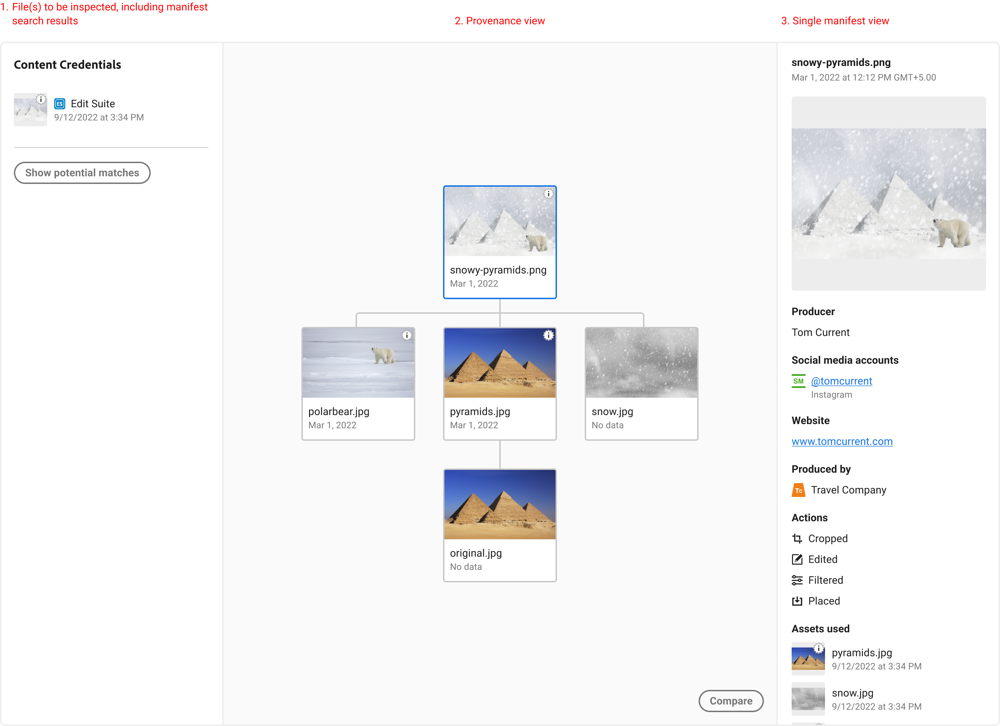
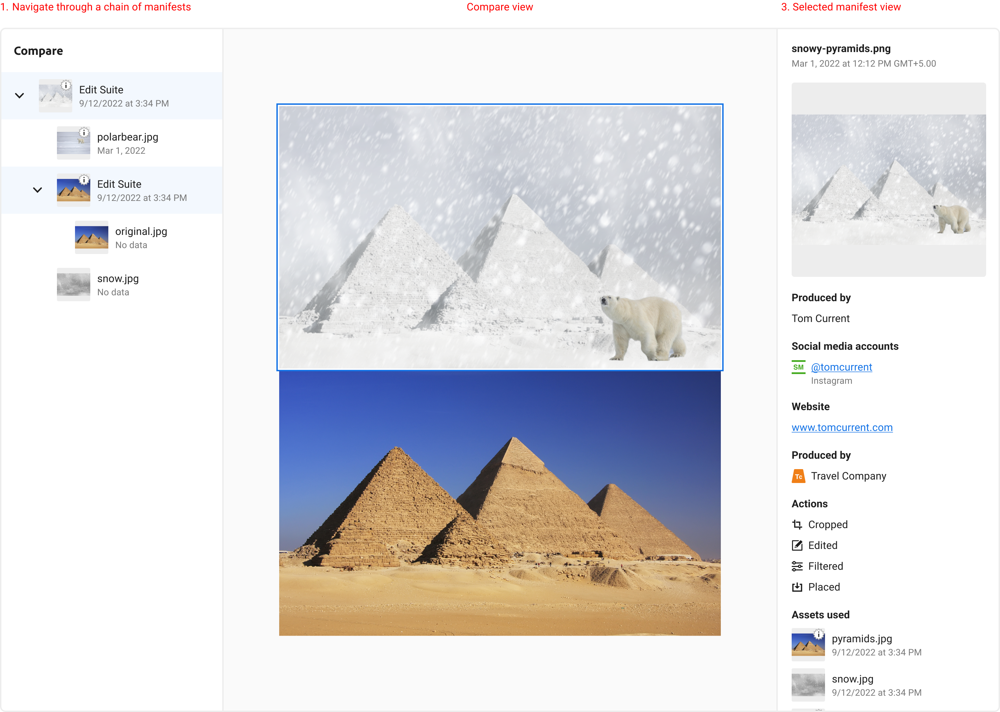
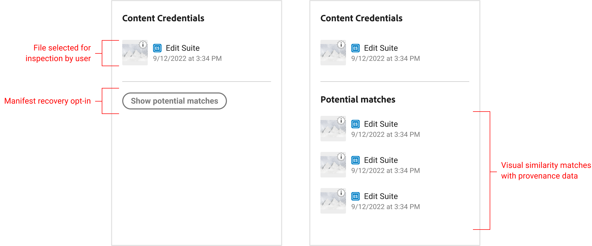
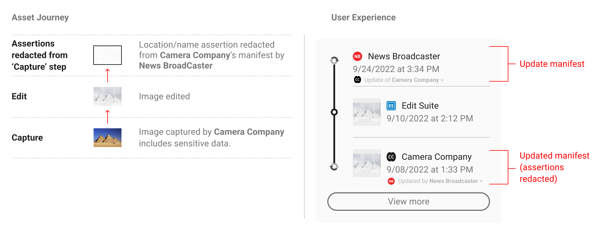
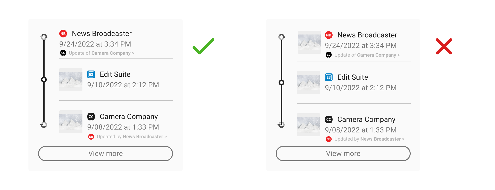
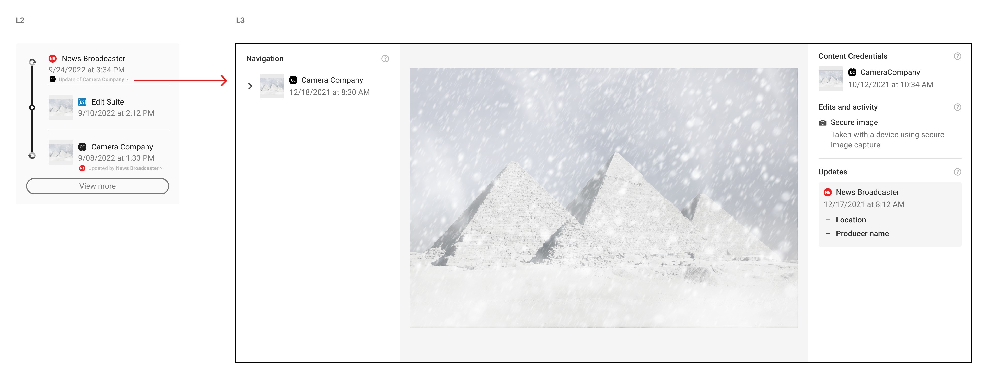
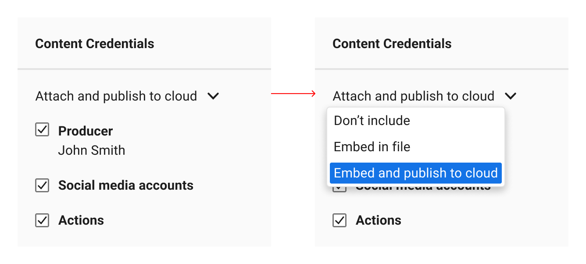
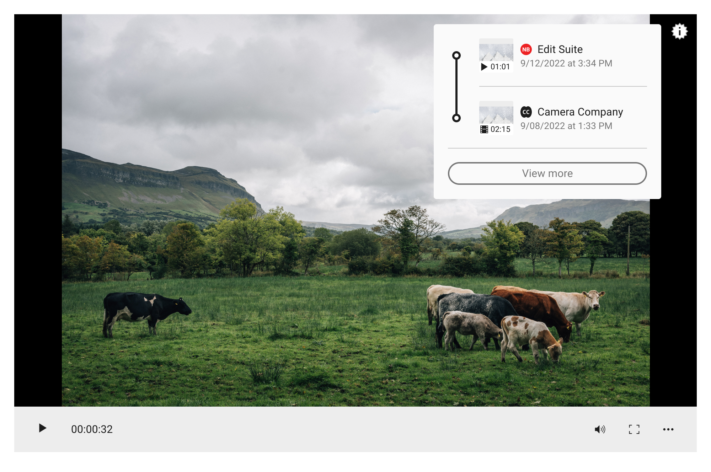
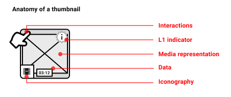

# C2PA User Experience Guidance for Implementers

This work is licensed under a [Creative Commons Attribution 4.0 International License](http://creativecommons.org/licenses/by/4.0/).

## 1\. Introduction

The C2PA intends to provide clear guidance for implementers of provenance-enabled user experiences (UX). Developing these recommendations is an ongoing process that involves diverse stakeholders. The results will balance uniformity and familiarity with utility and flexibility for users across contexts, platforms, and devices. Our intent is to present a comprehensive range of conventions for the user experience and evolve them based on feedback. Please reference the Glossary in the [C2PA Specifications](../specs/C2PA_Specification.html.md#_glossary) for clarifications on terminology used within this document. For general guidance on other areas of the specification, please see [Guidance for Implementors](#guidance:Guidance.adoc).

## 2\. Principles

The UX recommendations aim to define best practices for presenting C2PA provenance to consumers. The recommendations strive to describe standard, readily recognizable experiences that:

*   provide asset creators a means to capture information and history about the content they are creating, and
    
*   provide asset consumers information and history about the content they are experiencing, thereby empowering them to understand where it came from and decide how much to trust it.
    

User interfaces designed for the consumption of C2PA provenance must be informed by the context of the asset. C2PA have studied four primary user groups and a collection of contexts in which C2PA assets are encountered. These user groups have been defined in the [C2PA Guiding Principles](https://c2pa.org/principles/) as Consumers, Creators, Publishers and Verifiers (or Investigators). To serve the needs of each of these groups across common contexts, exemplary user interfaces are presented for many common cases. These are recommendations, not mandates, and we expect best practices to evolve.

### 2.1. Designing for trust

A unique aspect of this approach is that rather than attempt to determine the veracity of an asset for a user, it enables users themselves to judge by presenting the most salient and/or comprehensive provenance information. As such it is critical that users develop trust in the system itself, over the individual data presented. Exposing the C2PA Trust Model and Trust Signals in a way that balances transparency and intuitiveness is the critical design goal addressed here. There is no design pattern that can guarantee to engender trustworthiness across multiple contexts, and while a degree of contextual customization is anticipated, C2PA recommends all implementations adhere to the following general principles.

### 2.2. Quality

Implementations should be created using industry standard, robust user interface technologies.

### 2.3. Accessibility

Implementations should adhere to accepted, current accessibility standards to ensure no users are excluded. For an example of such criteria, see the [Web Content Accessibility Guidelines (WCAG)](https://www.w3.org/WAI/standards-guidelines/wcag/).

### 2.4. Consistency

Wherever suitable, UX patterns should match those outlined here. In the case that this would break contextual paradigms of the platform, lean on precedent whether in the OS or app design. Users should not have to learn new paradigms or terminology in different contexts in order to access the information.

### 2.5. Summary vs comprehensive

In many cases, a subset of the available information will be the most useful to a user in a given context. A link to the full information should always be made available, however.

### 2.6. Linked

Some data will assert an individual or organizational identity. Wherever possible, a link to information about the identity should be made available to allow the user to make a judgement on those actors' trustworthiness.

## 3\. Levels of information disclosure

Because the complete set of C2PA data for a given asset can be overwhelming to a user, C2PA describes four levels of progressive disclosure which guide the designs:

Figure 1. Disclosure levels

Level 1 (L1)

An indication that C2PA data is present and its cryptographic validation status.

Level 2 (L2)

A summary of C2PA data available for a given asset. Should provide enough information for the particular content, user, and context to allow the consumer to understand to a sufficient degree how the asset came to its current state.

Level 3 (L3)

A detailed display of all relevant provenance data. Note that the relevance of certain items over others is contextual and determined by the UX implementer.

Level 4 (L4)

For sophisticated, forensic investigatory usage, a standalone tool capable of revealing all the granular detail of signatures and trust signals is recommended. In addition to these standard levels, there will be common tools available for those interested in a full forensic view of the provenance data. This would reveal all available C2PA data across all manifests for an asset, including signature details.

## 4\. L1 – indicator of C2PA data

Figure 2. The L1 indicator

### 4.1. Appearance

Following the consistency principle, it is important in developing trust that users can learn to easily recognize the presence of the system and that their expectations are met regardless of context. As such, the L1 indicator should be consistent in its appearance across all contexts and devices to the degree that it clearly represents the presence of C2PA data. L1 can be applied using only the icon, the title, or both. If using the icon alone, ensure its appearance meets accessibility criteria so that consumers can easily identify its presence on or near the C2PA-enabled content. We recommend using the placeholder “information seal” icon and working title “Content Credentials” for recognition and learned understanding of C2PA-enabled content. We may make updates to the icon and product name in upcoming versions of this document as we gather findings from on-going user research.

For content recommendations see the [section on interface language](#interface-language).

### 4.2. Placement and interaction

For flexibility across implementations, there are several recommended placements for L1 indicators when C2PA-enabled content is present: on top of the content or somewhere close enough that its relationship to the content is clear. If L1 is positioned on top of the content, a hover state may be applied so as not to permanently obstruct the content below. Applications may differ depending on device, such as revealing L1 via long-press on mobile. Partially overlapping the L1 indicator over content is the most robust option to avoid potential misuse in the scenario that it has been purposefully added to content in a way meant to deceive. A new user experience guidance is recommended for initial implementation rollout to make clear how to identify L1 indicators.

Behaviour of L1 indicators should reveal L2 progressive disclosure, either via a hover or click interaction. Within L2 user interfaces, L1 can continue to be used to indicate the presence of C2PA-enabled ingredients.

### 4.3. Validation states

Figure 3. L1 validation states

In the event that the active manifest is invalid, a stateful indicator of data validation can be displayed. There are several scenarios when displaying a data validation state may be necessary. See Chapter 14, Validation in the [C2PA Technical Specifications](../specs/C2PA_Specification.html.md#_validation) for further information.

## 5\. L2 – provenance summaries

### 5.1. Minimum viable provenance

Figure 4. Minimum viable provenance display

If L1 indicates the presence of C2PA data, L2 is where consumers can begin to view and interact with the data. The minimum L2 user experience is defined as the display of nothing more than the base required C2PA manifest data: the signing entity, the claim generator and date. The signer is a top trust signal that allows the consumers to make their judgement trusting that the information available has been 'backed' by a legitimate entity. C2PA anticipates that additional varying assertion data will be included by implementers, and recommends including the manifest thumbnail, signer logo, and a link to L3 where consumers can find more provenance data if available.

L2 styles, fonts, etc. can be customized to fit the given context. Iconography and terminology used to describe assertions should be consistent wherever possible. C2PA anticipates the need for L2 generally to be space-efficient as it appears within the implementer’s context. Therefore it is suggested the data displayed be streamlined to provide enough information for the particular content, user, and context, allowing the consumer to understand to a sufficient degree how the asset came to its current state.

For content recommendations see the [section on interface language](#interface-language).

### 5.2. Depth versus breadth

L2 UI options are displayed along a spectrum from depth of information to breadth of provenance representation. In the figure below, the left side represents a single manifest summary and the right side represents the complete provenance summary depicting multiple manifests. However, the middle example shows a customized provenance summary wherein certain manifest assertions are highlighted. This flexibility allows implementers to show more depth for a given subset of manifests.

Figure 5. Provenance summary depth versus breadth

In order to summarize the data in a context-specific manner, it is recommended that consideration is given to what balance of **depth** and **breadth** of data will be most relevant to users. For example, if a given piece of content has only one manifest, consider displaying more of its assertion data, as in [Figure 6. A single manifest summary](#manifest-summary). If there are multiple manifests, then depicting the entire provenance summary may give users a more complete understanding of the content’s history, such as in [Figure 8. Provenance summary, three manifests](#provenance-summary). However, in all likelihood there will be many cases that fall in between, like in [Figure 12. Customized summary combinations](#provenance-combinations). The following sections will further document UI options along this spectrum.

### 5.3. Manifest summaries (depth)

Figure 6. A single manifest summary

A manifest summary only represents a single manifest. It could be the active manifest, as this is the most recent version tied to the C2PA-enabled content, or an ingredient manifest as determined by the implementer. The determination for displaying an ingredient manifest should be if there is substantive assertion data the implementer believes is more relevant to its audience than that of the active manifest. A shortcoming of displaying a single manifest summary is that it may not represent the complete history of the C2PA-enabled content, and may require consumers to navigate away from the implementer’s context to L3 to learn more.

### 5.4. Provenance summaries (breadth)

A provenance summary represents the collection of manifests related to the C2PA-enabled content. Manifests should be presented in the order that they are referenced via ingredient assertions, starting with the active manifest at the top and ending with the origin ingredients below. Origin ingredients represent the beginning of their respective history branches.

Figure 7. Provenance summary, two manifests

Summary displays should show at minimum the origin ingredients and active manifests, or if screen real estate allows, with at least one manifest in between.

Figure 8. Provenance summary, three manifests

In order to provide users with a succinct summary and to allow for limited screen real estate, the manifests in between origin and active can be collapsed and represented as a numerical count. C2PA recommends a baseline rule for collapsing manifests if the total number exceeds four. However, this threshold can be altered according to context. In keeping with the core recommendations, a link to the full set of data in L3 should always follow the summary list of manifests.

Figure 9. Provenance summary, four manifests

When multiple origins are present, either as multiple ingredients in a single manifest or across multiple manifests, they can be summarized in the origin section of the UI. The L1 indicator can be used as a badge on ingredient thumbnails to distinguish C2PA-enabled assets.

Figure 10. Provenance summary, two origins

L2 UI is flexible enough to allow for various combinations of manifest counts and origin assets.

Figure 11. Provenance summary, multiple origins and manifests

### 5.5. Combinatory summaries

Implementers should consider audience needs when weighing the balance of depth and breadth in combinatory summaries in order to concisely display the most complete and relevant representation of content provenance. For example, travel companies may opt to display location assertions from the origin manifest in a provenance summary so as to provide their users with key information. Similarly, a news publisher may choose to show action assertions from an ingredient manifest to disclose edits that occurred to published content.

Figure 12. Customized summary combinations

### 5.6. Validation states

#### 5.6.1. Incomplete states

There will be instances when C2PA-enabled content is incomplete data. Most commonly, this will happen if the content is edited without capturing C2PA data. In this event, the L2 and L3 UI should reflect when data is incomplete, as well as the manifest data that came before or after. A dotted line can be drawn between manifests to suggest the connection is not the same as between valid, intact manifests. Incomplete data should not automatically signal that one should discount the content as untrustworthy. For this reason, C2PA discourages the use of an indicator designed to trigger alarm, which should be reserved for more apparent tamper-evident use cases, in favour of a more descriptive and neutral indicator.

Figure 13. Incomplete data in the active manifest position

Figure 14. Incomplete data in an ingredient position

Following the established pattern of collapsing additional manifests, incomplete data can be called out via the text string to bring awareness to the questionable validity of ingredients.

Figure 15. Incomplete data collapsed

#### 5.6.2. Invalid states

There may be instances when C2PA-enabled content has been maliciously edited to tamper with C2PA data, or is signed by an untrusted entity. In this case, no additional prior data can be displayed.

Figure 16. Invalid data in the active manifest position

Figure 17. Invalid data in an ingredient position

## 6\. L3

### 6.1. Overview

L3 should provide asset consumers as complete and comprehensive an overview of all relevant provenance data as is possible. It is here where consumers can parse through the entire provenance history and see assertion information across each manifest associated with that asset.

Implementers should weigh the display of assertion information based on the needs of their anticipated audiences. Overly technical assertions or custom assertions from third-party implementers can be left to L4 displays only. The following types of assertions can be considered appropriate for L3 to display:

*   Identity information
    
*   Actions
    
*   Creative Work
    
*   Fields pertaining to copyright, descriptions, and usage rights
    
*   Exif information and related metadata
    

### 6.2. Navigation

Figure 18. L3 tree view

In the above image, we propose a tree structure that shows each manifest or non-C2PA enabled ingredient. Each item is selectable, and shows its manifest assertions to the right. Each asset’s entire provenance chain should be viewable, and each individual manifest or ingredient inspected.

### 6.3. Comparing manifests

Figure 19. Compare state

To understand changes between manifests over time, it may benefit users to have options to view two or more manifest ingredient thumbnails together for quick visual comparisons. This works well for static media like images, but will require different design solutions for temporal and non-visual media.

### 6.4. Manifest recovery

Figure 20. Manifest recovery

The L3 user experience should allow for any asset to be selected by the user locally or remotely, such as in the case where an asset is linked from an L2 display. Once selected, a manifest recovery search option can be available, which would allow users to select which "version" of the asset they want to see provenance information about. [Read more about embedding remote manifests.](#manifest-storage-options)

### 6.5. Redactions and updates

There are workflows where provenance data (assertions) need to be removed from previous manifests but the digital content (the media itself) is not changed. A potential scenario might be that an image capture manifest contains sensitive personal data (creator name, location) that needs to be removed before publishing an image as making that information public risks harm to the photographer. This would involve a redaction.

Redaction of data will always prompt a separate update manifest signed by the actor who performed the redaction. Update manifests signal that a change has been made, by who, to which manifest but that the media itself has not been altered. These should not be considered ‘edits’ of previous manifests and so it is recommended that UIs do not present them as such.

It is recommended that both the update manifest and the updated manifest (that where the redaction tool place) signify their state and reference one another. It is recommended that consistent patterns (language, iconography, interaction etc.) are used in the display of both manifests.

Figure 21. Redactions in L2

NB: For simplicity, both the update and the updated manifest are visible here within an L2 display. This will not always be the case however depending on how many steps there are in a provenance chain and the distance between the 2 manifests.

Note the lack of thumbnail image in the update manifest. Since update manifests do not involve changes to the digital content, they should not include any assertions that could suggest that i.e. actions, or a thumbnail.

Figure 22. No thumbnail in update manifest

It is up to individual implementations as to whether or not the details of the redaction are shown at L2, depending on use case. They must be displayed in L3 however where the additional context and a rationale for the additions can be given. For more on this see the [actions section of the technical specification](../specs/C2PA_Specification.html.md#_actions). Update manifests should contain onward journeys to L3 directing the user to the relevant manifest for closer review.

Figure 23. Journey from L2 to L3

NB It is not recommended that updates/redactions are indicated at L1.

## 7\. Creator experience

### 7.1. Opting in, privacy and data collection

In this section, the term _creator_ means a party creating _manifests_. This could be the maker of an original work, an editor, or anyone else utilizing C2PA-enabled tools to add to the provenance chain.

As per the [C2PA Guiding Principles](https://c2pa.org/principles/), C2PA implementations should provide a mechanism for creators of a given content to assert, in a verifiable manner, any information they wish to disclose about the creation of that content and any actions taken since the asset’s creation. As such, the creator experience requires the following:

*   A clear acknowledgement of creator consent before a C2PA implementation can begin accumulating data;
    
*   Disclosure or preview of the nature of information that is being recorded;
    
*   Creator control over recorded information, with particular sensitivity to the creator’s identity and process.
    

C2PA recommends an opt-in flow that concisely represents these requirements and can be opted-out of just as easily at any time. Once opted-in, creators should be able to distinguish between non-removable information as defined by the C2PA specifications and information that can be adjusted according to the user’s preferences.

### 7.2. Creator settings and manifest preview

Creators should be able to control the information in their assertions as much as is allowed by C2PA specifications. The [Harms Modelling document](../../1.0/security/Harms_Modelling.html.md) covers the reasoning behind why creator control is imperative. To provide coverage against harms and misuse, C2PA suggests the following types of assertions be manageable by the creator:

*   Identity information
    
*   Actions
    
*   Creative Work
    
*   Fields pertaining to copyright, descriptions, and usage rights
    
*   Exif information and related metadata
    

To be accommodating to the user’s preferences, C2PA recommends presenting a UI wherein these assertion categories can be toggled on or off on a per document basis. To assist the creator in understanding the tradeoffs they are making, C2PA also suggests displaying a manifest preview that concisely and accurately depicts what information will be added into the manifest.

### 7.3. Identity

The identity of the creator, or lack thereof, is an important assertion for the completion of a content’s provenance as it helps consumers understand who is responsible for what happened. It is important to restate that C2PA specifications do not require the identities of persons or organizations making any assertion about an asset to be documented. However, the challenge of validating identity when provided is beyond the scope of the C2PA specification at present. As such, C2PA recommends several tactics to help consumers understand the role of identity in C2PA provenance.

The first is to make clear when the creator’s identity is self-assigned. The second is to offer creators the ability to add social media or other verifiable accounts. These identity flows may lie outside of C2PA creator implementations, but when included, have the added benefit of providing a degree of proof for creators as well as links to their presence elsewhere on the internet.

When the creator decides to opt out of including their identity information, C2PA recommends promptly updating the manifest preview to reflect this change to give the creator immediate assurance their privacy is being protected.

### 7.4. Actions

Similar to the treatment of identity, some creators may want to reserve the right to not disclose the actions they’ve taken on a given piece of content. While some use cases, like photojournalism, should always show transparently what actions took place, this is less important for more creative and artistic applications. In some cases, creators may want to protect their particular creation process and should therefore be allowed to opt out of including actions in their manifests.

Granularity of actions is worth considering in creator implementations. In some cases, grouping actions into high level categories may be more understandable for consumers, versus presenting a list of detailed, creation-specific actions that may be unique to the implementation. C2PA recommends striking a balance between clarity and information overload based on the intended audience of the implementing platform.

### 7.5. Ingredients and their validation state

Ingredient assertions represent a form of non-removable information because they are the key to the establishment of the provenance of an asset and may themselves contain provenance. As such, ingredients are a requirement to be displayed in the manifest and its creator-side preview.

Validation of an ingredient’s manifest is equally important to convey to creators prior to producing a new manifest. Within the manifest preview UI, C2PA recommends displaying a list of ingredient thumbnails and their validation states to ensure the user working with those ingredients is aware of additional provenance data. This is particularly important for cases when ingredients are unable to validate or contain an invalid manifest. A clear example might be a news editor who receives a piece of user-generated content that purports to depict a controversial scene - alerting the editor to the validation state of that image will give them stronger assurances of whether that content is trustworthy.

### 7.6. Manifest storage options

It is important to provide clear guidance about the different manifest storage options available to creators. Creators want or need to know where their manifest data is being stored, either locally or remotely, when they export their content. The following options may be presented to creators regarding the location of their manifest data:

*   An option indicating that the manifest will only be directly attached to and stored as part of the exported file.
    
*   An option indicating that the manifest will both be directly attached to and stored as part of the exported file, and stored in a separate remote storage location.
    

Figure 24. Example of manifest storage settings

Describe each export action clearly and specifically. The action of storing remotely is more akin to “publishing to,” “storing in,” “saving to” remote storage or “publishing,” “storing,” “saving” remotely, compared to the action of storing locally or “attaching” a manifest to a file.

The tradeoffs between local and remote storage should be conveyed to creators, whether that be in-product or in separate documentation.

Attaching manifests to files directly generally keeps them more private. However, this comes at the expense of increased file sizes. Manifest data attached to files directly can also be stripped from those files when they are published on any platform online that processes uploaded files for size reductions.

Storing manifests remotely can generally make them more resilient, persistent, and recoverable, with the added benefit of not contributing to file size. However, because remote manifest recovery is achieved through searching for soft binding matches, remotely stored manifests and their respective content can potentially be viewed by anyone. This means that remote manifest storage is inherently less private.

### 7.7. Exporting

The [C2PA Implementation Guidance](#guidance:Guidance.adoc) recommends that a manifest be created for an asset when a significant event in the lifecycle of the asset takes place, such as its initial creation or an "export" operation from an editing tool. This is in part due to the underlying technical process of digitally signing the manifest, but also aligns with natural creation workflows. When a creator is ready to export their work, they should be able to decide whether or not to attach the accumulated assertion data to their content.

## 8\. Media formats

### 8.1. Video

Since video is a temporal medium, it poses significant challenges to distilling provenance data into simple, consumer-friendly displays. This is due to the potential for high volumes of composited ingredients of varying media formats, applied complex edit actions, spanning multiple software and people. These UX recommendations are focused on a starting point for video provenance and will address more complex uses over time.

#### 8.1.1. L1 in video player

A notable difference with video content is the necessity for a player for viewing. This limits the ways in which an L1 indicator of C2PA data can be placed on the content and interacted with, and may likely require an integration into the player itself. However, the L1 indicator may still be placed next to the video outside of the content.

Figure 25. Video L1

#### 8.1.2. Video L2 displays

Video L2 displays should largely follow the same patterns as described in [L2 – progressive disclosures](#L2 – progressive disclosures). However, for now we stop short of recommending the inclusion of ingredients or non-C2PA origin content due to the potential complexity of volume. Instead, we suggest showing a minimal manifest summary or provenance summary.

Figure 26. Video L2 minimum viable provenance

Figure 27. Video L2 provenance summary

An important detail for video UX is the L2 thumbnail displays. [Read more on thumbnails here.](#thumbnails) Specifically in the case of video, to help distinguish these assets from images, a filmstrip icon is added to the thumbnail to depict its media type. If the video asset containing the active manifest is playable, the media type icon should depict a play icon. However, even if the initial asset is a playable video, its ingredients may be static representations.

Figure 28. Video L2 thumbnails with duration

Time-based information like duration and time ranges can help users quickly understand at a high level where changes have been applied.

#### 8.1.3. Considerations for video provenance

Video assets present more complexities than their image counterparts. Videos may be comprised of a significant number of ingredients across multiple media types, so consideration to navigation across a provenance tree structure is warranted. It also may not be possible to show video thumbnails for the active manifest and its ingredients, since embedding video previews of these assets may lead to prohibitively large manifests.

Playback of video assets may also be hampered by the fact that browsers only support a subset of the video/audio codecs that C2PA does. Additionally, some of those codecs are patent-encumbered (e.g. H.265) so even if they are transcoded into web-friendly formats for viewing from a technical standpoint, there may be some issues from a legal standpoint.

#### 8.1.4. Next steps for video

We are developing UX guidelines for a provenance-based timeline, which we anticipate providing as part of L3 recommendations in the next version of this document. As the video containing the active manifest plays, different ingredients, actions, or other time-based assertion data could be highlighted in realtime for a more immersive experience. Similarly, time-coded assertions present another navigational method for exploring provenance information.

### 8.2. Thumbnails

Since provenance data can be added to any media type, ‘thumbnails’ here should be thought of in the broadest, multi-media sense. They should not necessarily be limited to static pixel based representations of all media types. A ‘snippet’ of audio for example could be considered all or part of a 'thumbnail’ for an audio file. Taking a multi-media, dynamic approach where possible should make thumbnails more helpful to users as they will be media appropriate. Implemented well, it will also help to aid accessibility.

Thumbnails serve different purposes in different contexts (simple recognition, parsing large media sets, promotion etc.) but in the context of provenance the guiding principles for their inclusion should be helping users to understand the history and attribution of media and to engender trust.

Amongst media types (image, video, audio, docs, 3D models etc.) single image thumbnails are unique in that they are (from a user’s perspective) simply a smaller version of the actual file - a ‘complete’ yet compact instance of the same media. In our context this can be helpful since it allows users to more easily interpret provenance chains by simply scanning through these approximations. This cannot be replicated with other more complex media types and so consideration should be given to how to create meaningful but succinct representations.

Depending on the media type, a meaningful ‘thumbnail’ can be comprised of more than one element (but does not need to include all). The below example uses video as an example but is intended to demonstrate how the different elements can be used to create a thumbnail of any kind.

Figure 29. Anatomy of a thumbnail

*   Interactions (i.e. hover or long press to skip through a sequence or swipe to rotate model)
    
*   Where relevant, an L1 indication of provenance
    
*   Some representation of the media (see below for different approaches)
    
*   Data (i.e. media duration for temporal media)
    
*   Relevant iconography
    

**Media representations**

| **PLACEHOLDER** | **PREVIEW** | **POSTER** |
| --- | --- | --- |
| A default, static media type representation (i.e. a file icon to represent text, a particular piece of haptic feedback pattern to denote audio etc.). This is distinct from iconography as it could be a fallback placeholder in the slot where **PREVIEW** or **POSTER** might sit | The representation is manually or automatically derived from the media according to some rule (i.e. the first frame of the video, the lead image in a document, a 3/4 angle shot of a model) this could sit on a scale of simple (i.e. frame x) to sophisticated (i.e. face detection, popular moments or a sample sequence that plays through via user interaction) | A separate piece of media is created by human and/or machine to represent the media. It may well contain elements/treatments not necessarily present in the media i.e. typography used as a title or stylistic rendering. |

Since the media, context and use case will vary we do not seek to dictate which approach is best however it is recommended that whatever approach is taken remains consistent across manifests when displaying provenance chains. Swapping between say, a **PREVIEW** and **POSTER** approach risks confusing users as to what media is being referred to. It is also recommended that whatever combination of elements (Representation, iconography, data, etc.) remains consistent across manifests.

It is recommended that for all media types, of the possible elements, alongside the appropriate **Media representation**, **Iconography** is always used. This should help to distinguish media types that may otherwise appear similar i.e. if an image was chosen to represent a document file it could be confused for an image file.

In the case of temporal media (audio/video/3D scene), it is also recommended that **duration data** is included. Duration could be helpful to a user when comparing manifests since changes to it could be meaningful. This is also a good example of the importance of consistency. If the duration is featured intermittently, this will not only make it harder to interpret, It could even result in the user mistaking some manifests as of a different media type since they have built a mental model of what to expect for a given type.

The table below sets out some suggestions for how the various elements might come together to form multi-faceted ‘thumbnails’ for different media types. In the case of iconography/interactions it is acknowledged that different platforms may have existing patterns and so examples here are for illustration only.

| **Media Type** | **Media Representation** | **Iconography** | **Data** | **Interactions (suggestions only)** |
| --- | --- | --- | --- | --- |
| Image (single) | Thumbnail image | n/a | n/a | Expand to inspect |
| Image (multi-picture) | Thumbnail images | TBD | No of images | Skip through images |
| Video | ‘Placeholder'/'Preview'/'Poster’ | i.e. Movie clip icon (to distinguish it from the full playable asset which would use the play icon) | Duration | Skip through key frames / Play sub section |
| Audio | ‘Placeholder'/'Preview'/'Poster’ | i.e. Speaker icon (to distinguish it from a playable asset which would use the play icon) | Duration | Play sub section |
| Document | ‘Placeholder'/'Preview'/'Poster’ | i.e. File icon | File size |  |
| 3D Model/scene | ‘Placeholder'/'Preview'/'Poster’ | i.e. Cube icon | Duration (if scene) | Rotate and zoom, 'Quick look' in AR |

\*A note on the ‘POSTER’ approach to media representation. This could require its own provenance chain, or it could be treated as an ingredient to the associated media and thus handled as just another sub-branch therein.

## 9\. Interface language

### 9.1. L1 interface language

It is important to align any interface language with the recommended terminology and phrases. This lets terminology retain the same meaning and weight across experiences, which is best for user comprehension. It also ensures the value and adoption of content provenance, thus making C2PA data easier to understand and promote across a large ecosystem.

For customization of UI elements, use the recommended terms or customize with user comprehension in mind.

In the following table, we recommend terminology for consumer-facing L1 UI:

**Table 1. L1 recommended content terms and descriptions**

| Term/phrase | Description | Usage notes |
| --- | --- | --- |
| Content credentials | Content provenance and attribution data | *   Use title case when referring to the system name and sentence case when referring to the data itself      *   As a reminder, this is a working title and is subject to change |
| Incomplete | Someone has changed this content without updating the content credentials, so there may be unexplained changes. | Consider pairing with a visual indicator that suggests users proceed with caution when viewing C2PA data |
| Invalid | Someone has changed or tampered with the content credentials, so the available data should be disregarded | Consider pairing with a visual indicator that conveys clear negativity and risk so users can understand the C2PA data should not be used to assess the content |

### 9.2. L2 interface language

Please refer to [L1 interface language](#l1-language) for a reminder of the importance of adhering to recommended terms and descriptions. The following table contains terminology for UI elements such as commonly used categories and validation states:

**Table 2. L2 recommended content terms and descriptions**

| Term/phrase | Description | Usage notes |
| --- | --- | --- |
| Content credentials | Content provenance and attribution data | *   Consider using as a UI header to contextualize C2PA data displays      *   As a reminder, this is a working title and is under discussion |
| Signed by / Signer | The signer is responsible for the trustworthiness of the content and its C2PA data | Must be displayed |
| Date and timestamp | The time and time zone at which the signer signed the manifest | *   Recommended inclusion to accompany signer      *   Appearance of formatting should be localized to consumer’s region |
| Edits and activity | Actions taken on the asset | Upcoming UX recommendations will attempt to standardize categorizations of actions for user comprehension |
| Assets used / Assets | Ingredients used in a given manifest | Recommended display for discrete manifest summaries |
| Produced by / Producer | The name and role of the person identified by the active manifest as its producer | *   Consider a customization or UI pattern to clarify how identity is being validated (see more in [creator identity](#identity))      *   This term is intended to represent a diverse range of roles, but can be customized based on the CreativeWork assertion |
| Content credentials are incomplete | Someone has changed this content without updating the content credentials, so there may be unexplained changes | Should follow L1 validation state |
| Content credentials are invalid | Someone has changed or tampered with the content credentials, so the available data should be disregarded | Should follow L1 validation state |
| Additional manifests | There are # additional manifests in this provenance line | Use to represent manifest count when there are four or more manifests in the provenance summary |
| Additional manifests and incomplete content credentials | There are # additional manifests in this provenance line, and some have incomplete data | Use to represent manifest count when there are four or more manifests in the provenance summary and one or more are incomplete |

### 9.3. User-facing edit and activity labels and descriptions

The [names and descriptions of C2PA actions](../specs/C2PA_Specification.html.md#_actions) have generally been written with implementers in mind. Users who are less familiar with the C2PA will benefit from clear labeling and descriptions of actions that capture as much of the related actions that may apply as possible.

Here we provide a matrix of current C2PA actions with recommended labels and optional descriptions for them in the "Edits and activity" section of consumer manifest UIs.

Note that when displaying C2PA actions ("Edits and activity") in a manifest, descriptions may accompany them in the UI or be made available in separate docuentation.

**Table 3. Recommended user-facing C2PA action labels and descriptions**

| C2PA action | Recommended label | Optional descriptio recommendation |
| --- | --- | --- |
| c2pa.color\_adjustments | Color or exposure edits | Adjusted properties like tone, saturation, curves, shadows, or highlights |
| c2pa.created | Created | Created a new file or content |
| c2pa.cropped | Cropped | Used cropping tools, reducing or expanding visible content area |
| c2pa.drawing | Drawing edits | Used tools like pencils, brushes, erasers, or shape, path, or pen tools |
| c2pa.edited | Other edits | Performed other edits which may or may not change appearance |
| c2pa.filtered | Filter or style edits | Used tools like filters, styles, or effects |
| c2pa.opened | Opened | Opened a pre-existing file |
| c2pa.orientation | Changed orientation | Changed position or orientation (rotated, flipped, etc.) |
| c2pa.placed | Imported | Added pre-existing content to this file |
| c2pa.resized | Resized | Changed dimensions or file size |
| c2pa.unknown | Unknown edits or activity | Performed edits or activity that couldn’t be recognized |
| c2pa.converted | Converted | Changed file format with transcoding |
| c2pa.transcoded | Transcoded | Converted from one file encoding to another, potentially affecting properties like resolution scale, bitrate, or encoding format |
| c2pa.repackaged | Repackaged | Changed container file format without transcoding |
| c2pa.removed | Removed | Removed content or files created or added during the editing process |
| c2pa.published | Published | Distributed this file on an online platform |

### 9.4. L2/L3 user-facing warnings and errors

When writing user-facing error or warning messages, space may be limited. Prioritize clearly stating what is wrong, missing, unavailable, etc., and providing next steps a user can take to potentially correct the situation when applicable. Explanation of **why** an error or warning occurred, or more detailed guidance on correction,may be left to separate help documentation provided through a "Learn more" link or similar.

Following are a few example messages for some of the most common types of issues and errors C2PA is aware of today, which you may use as a starting point and reference for your own implementations.

**Table 4. Example language for common L2/L3 warnings and errors**

| Problem | User-facing message |
| --- | --- |
| Manifest has been tampered with in a way that makes it invalid, or is otherwise inaccessible | Content Credential unavailable or invalid |
| Edits or activity occurred outside of C2PA-supported app or while C2PA feature was not enabled | Some edits or activity may not have been recorded. Learn more |
| Ingredient is of a file type that may contain multiple layers, some of which may not appear in its ingredient thumbnail | May contain layers that are hidden or not visible in this thumbnail \* Note that ingredient-specific messaging should be contextually located around the ingredient it refers to. For example, this message may appear in a tooltip attached to an icon near the ingredient’s name in the UI. |
| Connection issues with remote storage when retrieving manifest data | Some assertions may be temporarily missing or incomplete due to cloud storage connection issues. Learn more |
| Connection issues with remote storage when retrieving manifest | Content Credential temporarily unavailable due to cloud storage connection issues. Try viewing again later. |

### 9.5. Difficult terms and concepts, and possible alternatives

Some C2PA terms and concepts may be particularly unfamiliar, hard to grasp, or contentious for users, or be inherently lengthy to explain (running the risk that explanations will not be read and understood).

Here we list a few known examples and share possible alternatives. These suggestions are currently untested, but you may take them as directional guidance toward simpler, more user-friendly interface language.

**Table 5. Possible consumer-friendly alternatives to difficult terms and concepts**

| Term or concept | Possible alternative | Notes |
| --- | --- | --- |
| Signer, signed by (as labels) | *   Content Credentials issued by          *   As a label for the signer name, or as a label for a section about the signer’s identity and other details about the signature like when it occurred               *   Issued by          *   As a label within a "Content Credentials issued by" section to further specify the signer identity | Users and creators are generally unfamiliar with the concept of digital signatures as they pertain to C2PA manifests. A more descriptive phrase for "Signer" like "Content Credentials issued by," can better illustrate the importance of the identity listed. |
| Signer (description) | "This is the trusted organization, device, or individual that issued these Content Credentials and recorded the details shown." | This aligns with the guidance above regarding reframing "signer" as "Content Credentials issued by" |
| Assertion (description) | *   Details      *   Information | While it is not advised to label individual assertions as "assertions" in a manifest, the description or explanation of them is likely to come up in your implementation’s ecosystem. We propose referring to assertions as simply "information" or "details" within Content Credentials. |
| Producer, Produced by (label) | *   Output by          *   Output by: John Doe              *   "This content was output by John Doe"              *   "John Doe output this content" | Users may be hesitant to include identity assertions with content they don’t own or didn’t solely create. If you believe your users may share similar concerns, you can try using a more neutral term like "output by" which doesn’t carry the same possible implication of ownership that "produced by" might. |

## 10\. Communication and education

To ensure user comprehension, it is crucial that implementers consider how their audiences are introduced to C2PA provenance data and the value to be gained from engaging with it. We recommend providing creator and consumer educational experiences and strongly encourage the use of language consistent to what is provided in these guidelines. Keeping communication and education aligned is a key part of promoting comprehension, value, and adoption of C2PA data by implementers, creators, and consumers.

Depending on the implementer’s platform and audience, there are different ways to effectively incorporate education around C2PA data. We suggest utilizing standard UI elements like links, tooltips, and modals to provide users with opportunities to seek out more information regarding the implementation or a component piece within. Certain L2 UI elements, like assertion categories, may warrant additional explanations to ensure user comprehension. For larger and more detailed explanations, implementers should consider linking out to FAQs or dedicated information pages so audiences can learn more about C2PA from a native product voice. However, when making content customizations, make sure things like brand voice are not prioritized in sacrifice of clarity and user comprehension.

## 11\. Open issues

### 11.1. User research

Correctly identifying and displaying trust signals is of paramount concern for our overall user experience. C2PA strives to understand the value consumers will apply to content attribution through ongoing user research studies and usability testing.

### 11.2. Applications, use cases, and additional media formats

Pending user research, C2PA will provide implementors with recommended L2 customizations based on combinations of content, audiences, and platforms. Examples may include news publishers, social sites, e-commerce and retail, travel, and entertainment platforms. The recommendations for video UX will also continue to expand in scope and complexity, along with the introduction of other media formats like audio and streaming content.

## 12\. Public review, feedback and evolution

The team authoring the UX recommendations is cognizant of its limitations and potential biases, recognizing that feedback, review, user testing and ongoing evolution is a requirement for success. This guidance is therefore an evolving document, informed by real world experiences deploying C2PA UX across a wide variety of applications and scenarios.
