# C2PA User Experience Guidance for Implementers

This work is licensed under a [Creative Commons Attribution 4.0 International License](http://creativecommons.org/licenses/by/4.0/).

## 1\. Introduction

The C2PA intends to provide clear guidance for implementers of provenance-enabled user experiences (UX). Developing these recommendations is an ongoing process that involves diverse stakeholders. The results will balance uniformity and familiarity with utility and flexibility for users across contexts, platforms, and devices. Our intent is to present a comprehensive range of conventions for the user experience and evolve them based on feedback. Please reference the Glossary in the [C2PA Specifications](../specs/C2PA_Specification.html.md#_glossary) for clarifications on terminology used within this document. For general guidance on other areas of the specification, please see [Guidance for Implementors](../../1.3/guidance/Guidance.html.md).

## 2\. Principles

The UX recommendations aim to define best practices for presenting C2PA provenance to consumers. The recommendations strive to describe standard, readily recognizable experiences that:

*   provide asset creators a means to capture information and history about the content they are creating, and
    
*   provide asset consumers information and history about the content they are experiencing, thereby empowering them to understand where it came from and decide how much to trust it.
    

User interfaces designed for the consumption of C2PA provenance must be informed by the context of the asset. C2PA have studied four primary user groups and a collection of contexts in which C2PA assets are encountered. These user groups have been defined in the [C2PA Guiding Principles](https://c2pa.org/principles/) as Consumers, Creators, Publishers and Verifiers (or Investigators). To serve the needs of each of these groups across common contexts, exemplary user interfaces are presented for many common cases. These are recommendations, not mandates, and we expect best practices to evolve.

### 2.1. Designing for trust

A unique aspect of this approach is that rather than attempt to determine the veracity of an asset for a user, it enables users themselves to judge by presenting the most salient and/or comprehensive provenance information. As such it is critical that users develop trust in the system itself, over the individual data presented. Exposing the C2PA Trust Model and Trust Signals in a way that balances transparency and intuitiveness is the critical design goal addressed here. There is no design pattern that can guarantee to engender trustworthiness across multiple contexts, and while a degree of contextual customization is anticipated, C2PA recommends all implementations adhere to the following general principles.

### 2.2. Quality

Implementations should be created using industry standard, robust user interface technologies.

### 2.3. Accessibility

Implementations should adhere to accepted, current accessibility standards to ensure no users are excluded. For an example of such criteria, see the [Web Content Accessibility Guidelines (WCAG)](https://www.w3.org/WAI/standards-guidelines/wcag/).

### 2.4. Consistency

Wherever suitable, UX patterns should match those outlined here. In the case that this would break contextual paradigms of the platform, lean on precedent whether in the OS or app design. Users should not have to learn new paradigms or terminology in different contexts in order to access the information.

### 2.5. Summary vs comprehensive

In many cases, a subset of the available information will be the most useful to a user in a given context. A link to the full information should always be made available, however.

### 2.6. Linked

Some data will assert an individual or organizational identity. Wherever possible, a link to information about the identity should be made available to allow the user to make a judgement on those actors' trustworthiness.

## 3\. Levels of information disclosure

Because the complete set of C2PA data for a given asset can be overwhelming to a user, C2PA describes four levels of progressive disclosure which guide the designs:

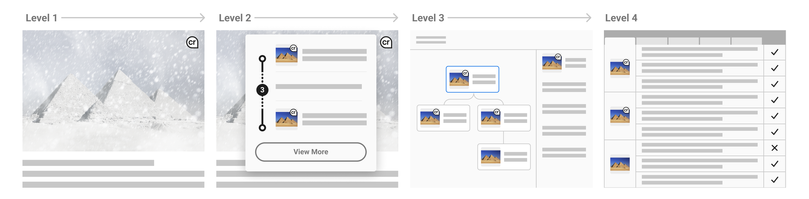

Figure 1. Disclosure levels

Level 1 (L1)

An indication that C2PA data is present and its cryptographic validation status.

Level 2 (L2)

A summary of C2PA data available for a given asset. Should provide enough information for the particular content, user, and context to allow the consumer to understand to a sufficient degree how the asset came to its current state.

Level 3 (L3)

A detailed display of all relevant provenance data. Note that the relevance of certain items over others is contextual and determined by the UX implementer.

Level 4 (L4)

For sophisticated, forensic investigatory usage, a standalone tool capable of revealing all the granular detail of signatures and trust signals is recommended. In addition to these standard levels, there will be common tools available for those interested in a full forensic view of the provenance data. This would reveal all available C2PA data across all manifests for an asset, including signature details.

## 4\. L1 – indicator of C2PA data

### 4.1. Introduction

C2PA requires the name "Content Credentials" to be used for provenance-enabled user experiences that follow the technical specification. It is critical that viewers of Content Credentials develop trust in the system itself, over the individual data presented. Therefore, implementors of Content Credentials must adhere to the proper usage of the Content Credentials name and visual marks to assure that each experience is consistent, coherent and cooperative.

Figure 2. Content Credentials logo and icon

The Content Credentials marks may be used in the following ways to provide consistency across the ecosystem:

*   Verifying and displaying Content Credentials on a website or web application
    
*   Creating and writing Content Credentials to supported file formats
    

### 4.2. Design and construction

The Content Credentials logo comprises an icon accompanied by a word mark set in Store Norsk Ja Medium, which is the cornerstone of the Content Credentials brand identity.

The icon shape is a pin, a metaphorical representation for applying (or “pinning”) Content Credentials to an asset, serves as an indicator of both the presence of C2PA data and its cryptographic validation status. It is also a navigation elements to reveal more C2PA information.

The icon is comprised of two lower-case characters, “cr,” which is a truncation of “credentials.” The characters are contained in an outlined circle with the lower-right corner angled to 90 degrees. Both the icon and brand word mark are set in Store Norske Ja Medium.

It’s proximity to other international attribution symbols, like copyright and Creative Commons, imbues the icon with a level of trust and authority. Its has been carefully considered and should not be altered or modified in any way.

#### 4.2.1. Correct usage of the icon

Figure 3. Correct usage of the icon

The pin must always be represented in the highest quality possible. It can be reproduced in high contrast gray scale values depending on its application.

In the event that the active manifest is invalid, a stateful indicator of data validation can be displayed. A secondary icon may be appended to the pin to indicate cryptographic status. There are several scenarios when displaying a data validation state may be necessary. See Chapter 14, Validation in the [C2PA Technical Specifications](../specs/C2PA_Specification.html.md#_validation) for further information.

#### 4.2.2. Incorrect usage of the icon

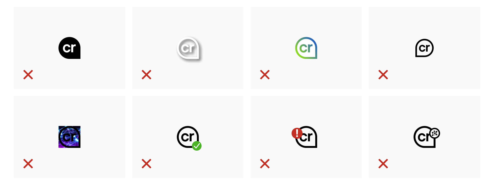

Figure 4. Incorrect usage of the icon

Unacceptable modifications include adding a solid interior fill, drop shadow, or applying other graphic alterations to the icon. Avoid using an outline-only pin on patterned background or images. Do not add a valid status, as the icon alone should already indicate the presence of a valid manifest. When adding a secondary mark for cryptographic validation, avoid placing the status indicator over the characters, or using other icons that do not convey cryptographic status.

### 4.3. Placement and interaction

Following the consistency principle, it is important in developing trust that users can learn to easily recognize the presence of the system and that their expectations are met regardless of context. As such, the L1 indicator should be consistent in its placement across all contexts and devices to the degree that it clearly represents the presence of C2PA data.

L1 can be applied using only the icon, the title, or both. If using the icon alone, ensure its appearance meets accessibility criteria so that consumers can easily identify its presence on or near the C2PA-enabled content.

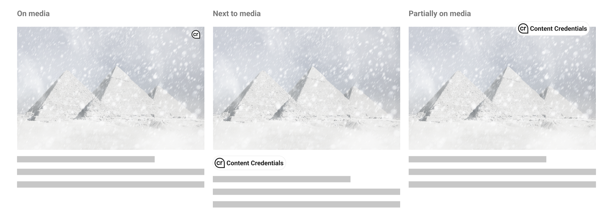

Figure 5. Placement options for the L1 indicator

For flexibility across implementations, there are several recommended placements for L1 indicators when C2PA-enabled content is present: on top of the content or somewhere close enough that its relationship to the content is clear. If L1 is positioned on top of the content, a hover state may be applied so as not to permanently obstruct the content below. Applications may differ depending on device, such as revealing L1 via long-press on mobile. Partially overlapping the L1 indicator over content is the most robust option to avoid potential misuse in the scenario that it has been purposefully added to content in a way meant to deceive. A new user experience guidance is recommended for initial implementation rollout to make clear how to identify L1 indicators.

Behaviour of L1 indicators should reveal L2 progressive disclosure, either via a hover or click interaction. Within L2 user interfaces, L1 can continue to be used to indicate the presence of C2PA-enabled ingredients.

## 5\. L2 – provenance summaries

### 5.1. Minimum viable provenance

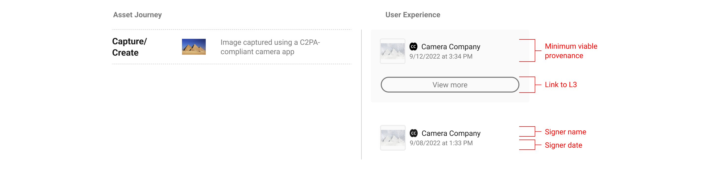

Figure 6. Minimum viable provenance display

If L1 indicates the presence of C2PA data, L2 is where consumers can begin to view and interact with the data. The minimum L2 user experience is defined as the display of nothing more than the base required C2PA manifest data: the signing entity, the claim generator and date. The signer is a top trust signal that allows the consumers to make their judgement trusting that the information available has been 'backed' by a legitimate entity. C2PA anticipates that additional varying assertion data will be included by implementers, and recommends including the manifest thumbnail, signer logo, and a link to L3 where consumers can find more provenance data if available.

L2 styles, fonts, etc. can be customized to fit the given context. Iconography and terminology used to describe assertions should be consistent wherever possible. C2PA anticipates the need for L2 generally to be space-efficient as it appears within the implementer’s context. Therefore it is suggested the data displayed be streamlined to provide enough information for the particular content, user, and context, allowing the consumer to understand to a sufficient degree how the asset came to its current state.

For content recommendations see the [section on interface language](#interface-language).

### 5.2. Depth versus breadth

L2 UI options are displayed along a spectrum from depth of information to breadth of provenance representation. In the figure below, the left side represents a single manifest summary and the right side represents the complete provenance summary depicting multiple manifests. However, the middle example shows a customized provenance summary wherein certain manifest assertions are highlighted. This flexibility allows implementers to show more depth for a given subset of manifests.

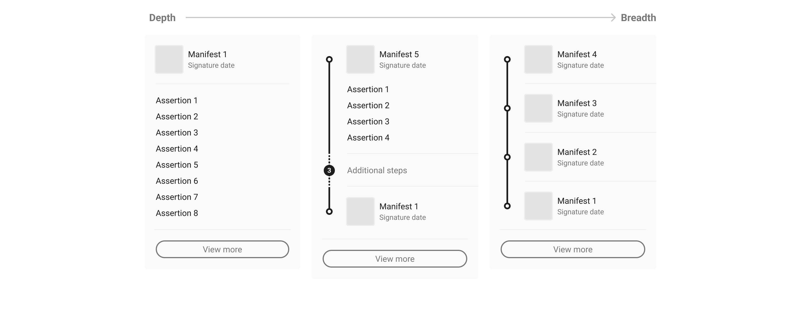

Figure 7. Provenance summary depth versus breadth

In order to summarize the data in a context-specific manner, it is recommended that consideration is given to what balance of **depth** and **breadth** of data will be most relevant to users. For example, if a given piece of content has only one manifest, consider displaying more of its assertion data, as in [Figure 6. A single manifest summary](#manifest-summary). If there are multiple manifests, then depicting the entire provenance summary may give users a more complete understanding of the content’s history, such as in [Figure 8. Provenance summary, three manifests](#provenance-summary). However, in all likelihood there will be many cases that fall in between, like in [Figure 12. Customized summary combinations](#provenance-combinations). The following sections will further document UI options along this spectrum.

### 5.3. Manifest summaries (depth)

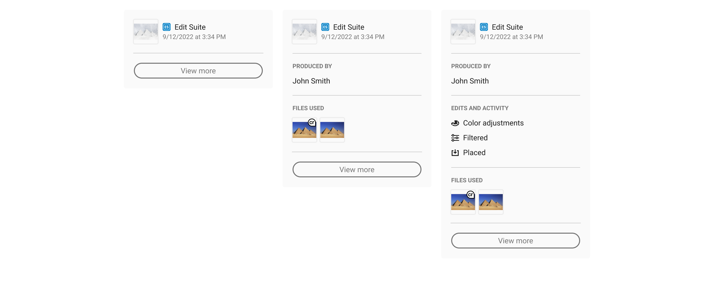

Figure 8. A single manifest summary

A manifest summary only represents a single manifest. It could be the active manifest, as this is the most recent version tied to the C2PA-enabled content, or an ingredient manifest as determined by the implementer. The determination for displaying an ingredient manifest should be if there is substantive assertion data the implementer believes is more relevant to its audience than that of the active manifest. A shortcoming of displaying a single manifest summary is that it may not represent the complete history of the C2PA-enabled content, and may require consumers to navigate away from the implementer’s context to L3 to learn more.

### 5.4. Provenance summaries (breadth)

A provenance summary represents the collection of manifests related to the C2PA-enabled content. Manifests should be presented in the order that they are referenced via ingredient assertions, starting with the active manifest at the top and ending with the origin ingredients below. Origin ingredients represent the beginning of their respective history branches.

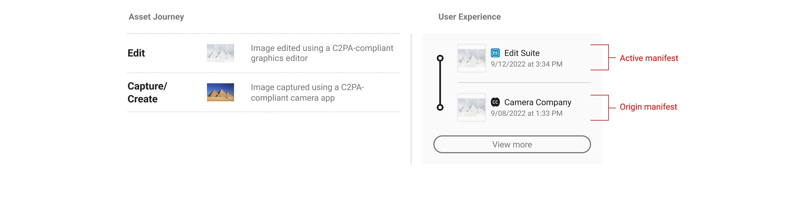

Figure 9. Provenance summary, two manifests

Summary displays should show at minimum the origin ingredients and active manifests, or if screen real estate allows, with at least one manifest in between.

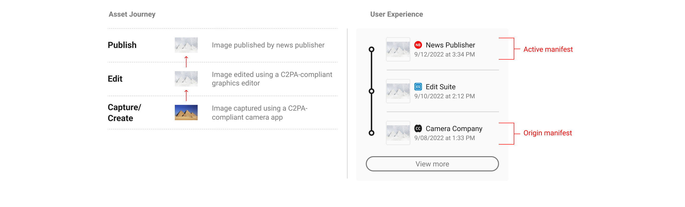

Figure 10. Provenance summary, three manifests

In order to provide users with a succinct summary and to allow for limited screen real estate, the manifests in between origin and active can be collapsed and represented as a numerical count. C2PA recommends a baseline rule for collapsing manifests if the total number exceeds four. However, this threshold can be altered according to context. In keeping with the core recommendations, a link to the full set of data in L3 should always follow the summary list of manifests.

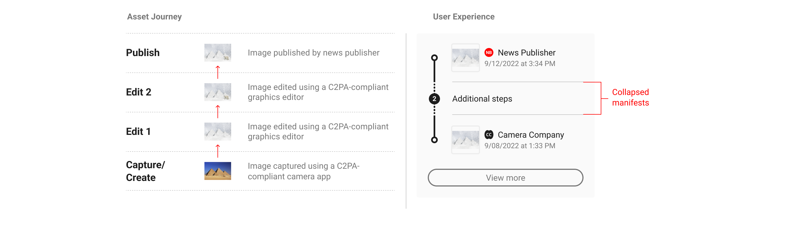

Figure 11. Provenance summary, four manifests

When multiple origins are present, either as multiple ingredients in a single manifest or across multiple manifests, they can be summarized in the origin section of the UI. The L1 indicator can be used as a badge on ingredient thumbnails to distinguish C2PA-enabled assets.

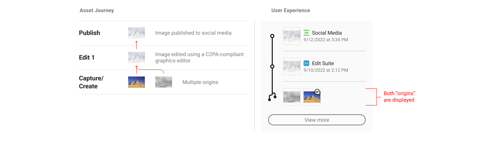

Figure 12. Provenance summary, two origins

L2 UI is flexible enough to allow for various combinations of manifest counts and origin assets.

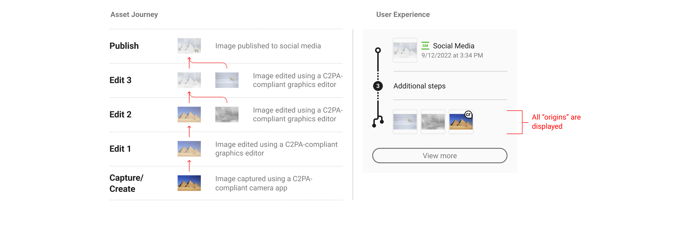

Figure 13. Provenance summary, multiple origins and manifests

### 5.5. Combinatory summaries

Implementers should consider audience needs when weighing the balance of depth and breadth in combinatory summaries in order to concisely display the most complete and relevant representation of content provenance. For example, travel companies may opt to display location assertions from the origin manifest in a provenance summary so as to provide their users with key information. Similarly, a news publisher may choose to show action assertions from an ingredient manifest to disclose edits that occurred to published content.

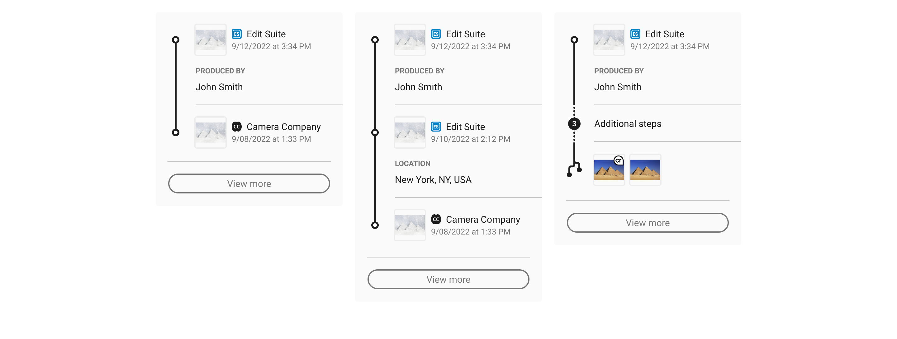

Figure 14. Customized summary combinations

### 5.6. Invalid states

There may be instances when C2PA-enabled content has been maliciously edited to tamper with C2PA data, or is signed by an untrusted entity. In this case, no additional prior data can be displayed.

For additional invalid states, see the [section on interface language](#interface-language).

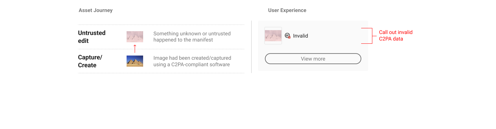

Figure 15. Invalid data in the active manifest position

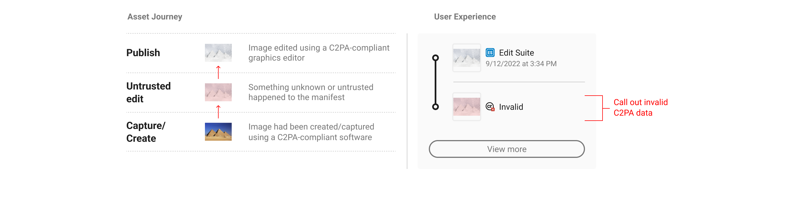

Figure 16. Invalid data in an ingredient position

## 6\. L3

### 6.1. Overview

L3 should provide asset consumers as complete and comprehensive an overview of all relevant provenance data as is possible. It is here where consumers can parse through the entire provenance history and see assertion information across each manifest associated with that asset.

Implementers should weigh the display of assertion information based on the needs of their anticipated audiences. Overly technical assertions or custom assertions from third-party implementers can be left to L4 displays only. The following types of assertions can be considered appropriate for L3 to display:

*   Identity information
    
*   Actions
    
*   Creative Work
    
*   Fields pertaining to copyright, descriptions, and usage rights
    
*   Exif information and related metadata
    

### 6.2. Navigation

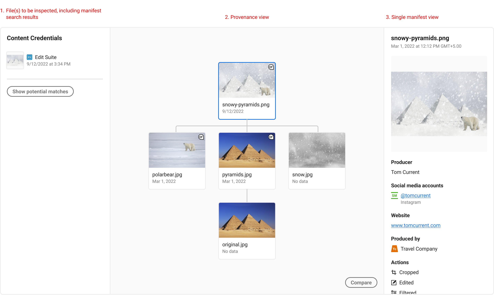

Figure 17. L3 tree view

In the above image, we propose a tree structure that shows each manifest or non-C2PA enabled ingredient. Each item is selectable, and shows its manifest assertions to the right. Each asset’s entire provenance chain should be viewable, and each individual manifest or ingredient inspected.

### 6.3. Comparing manifests

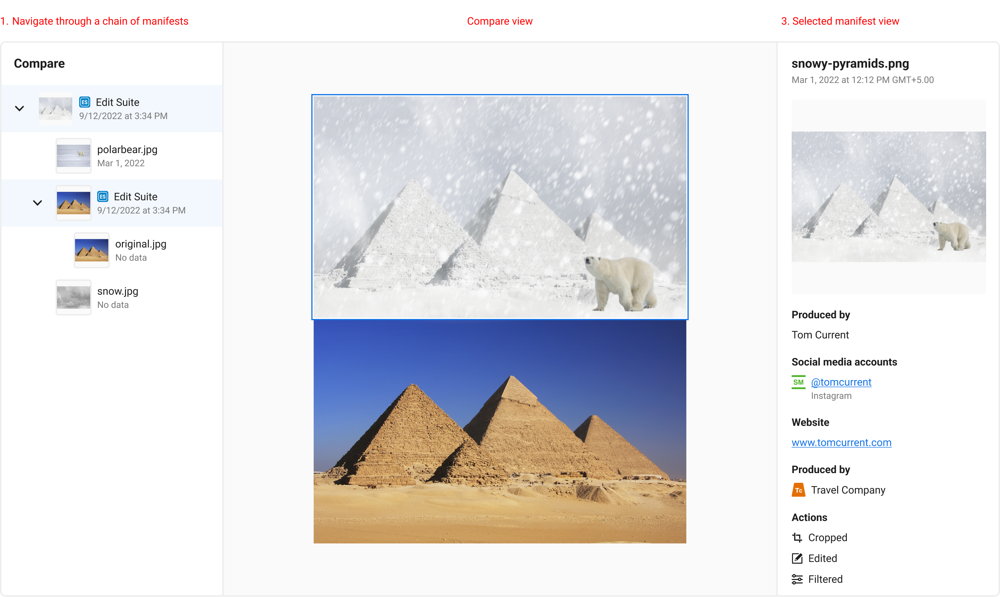

Figure 18. Compare state

To understand changes between manifests over time, it may benefit users to have options to view two or more manifest ingredient thumbnails together for quick visual comparisons. This works well for static media like images, but will require different design solutions for temporal and non-visual media.

### 6.4. Manifest recovery

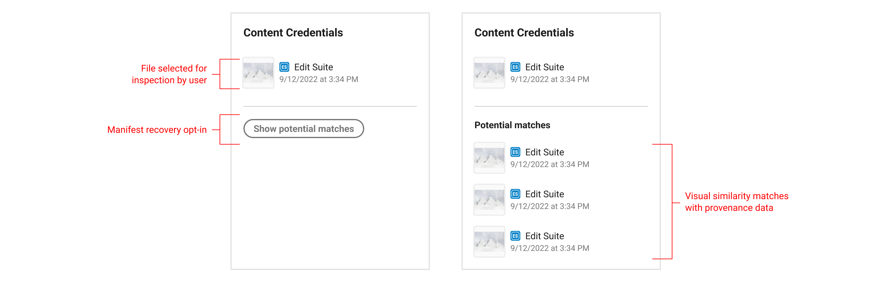

Figure 19. Manifest recovery

The L3 user experience should allow for any asset to be selected by the user locally or remotely, such as in the case where an asset is linked from an L2 display. Once selected, a manifest recovery search option can be available, which would allow users to select which "version" of the asset they want to see provenance information about. [Read more about embedding remote manifests.](#manifest-storage-options)

### 6.5. Redactions and updates

There are workflows where provenance data (assertions) need to be removed from previous manifests but the digital content (the media itself) is not changed. A potential scenario might be that an image capture manifest contains sensitive personal data (creator name, location) that needs to be removed before publishing an image as making that information public risks harm to the photographer. This would involve a redaction.

Redaction of data will always prompt a separate update manifest signed by the actor who performed the redaction. Update manifests signal that a change has been made, by who, to which manifest but that the media itself has not been altered. These should not be considered ‘edits’ of previous manifests and so it is recommended that UIs do not present them as such.

It is recommended that both the update manifest and the updated manifest (that where the redaction tool place) signify their state and reference one another. It is recommended that consistent patterns (language, iconography, interaction etc.) are used in the display of both manifests.

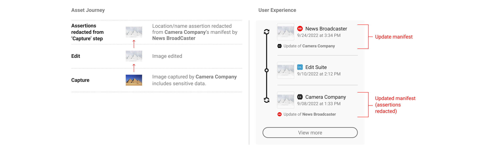

Figure 20. Redactions in L2

NB: For simplicity, both the update and the updated manifest are visible here within an L2 display. This will not always be the case however depending on how many steps there are in a provenance chain and the distance between the 2 manifests.

Note the lack of thumbnail image in the update manifest. Since update manifests do not involve changes to the digital content, they should not include any assertions that could suggest that i.e. actions, or a thumbnail.

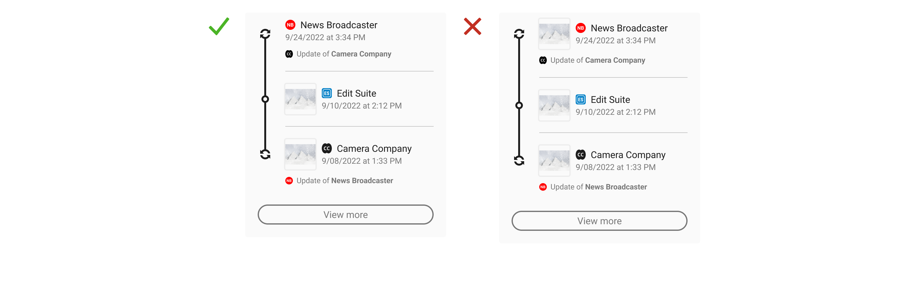

Figure 21. No thumbnail in update manifest

It is up to individual implementations as to whether or not the details of the redaction are shown at L2, depending on use case. They must be displayed in L3 however where the additional context and a rationale for the additions can be given. For more on this see the [actions section of the technical specification](../specs/C2PA_Specification.html.md#_actions). Update manifests should contain onward journeys to L3 directing the user to the relevant manifest for closer review.

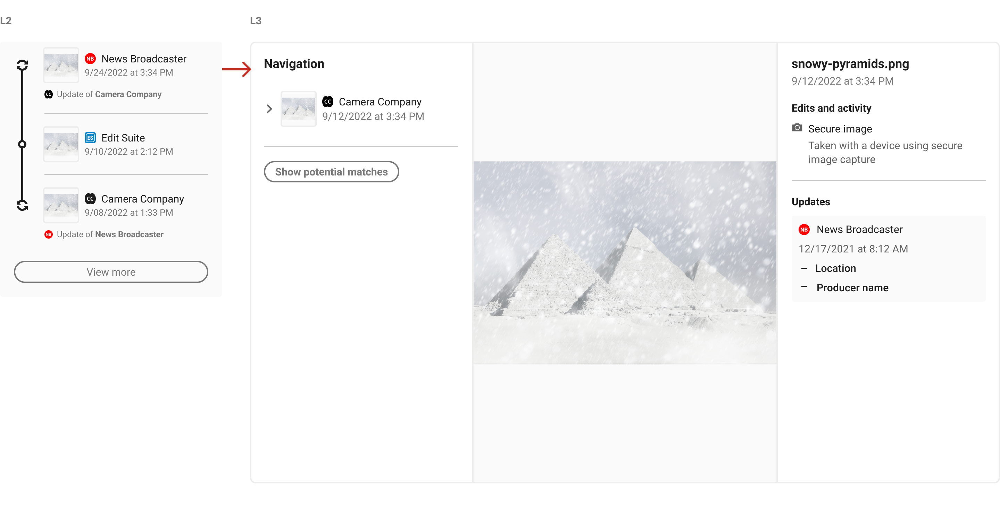

Figure 22. Journey from L2 to L3

NB It is not recommended that updates/redactions are indicated at L1.

## 7\. Creator experience

### 7.1. Opting in, privacy and data collection

In this section, the term _creator_ means a party creating _manifests_. This could be the maker of an original work, an editor, or anyone else utilizing C2PA-enabled tools to add to the provenance chain.

As per the [C2PA Guiding Principles](https://c2pa.org/principles/), C2PA implementations should provide a mechanism for creators of a given content to assert, in a verifiable manner, any information they wish to disclose about the creation of that content and any actions taken since the asset’s creation. As such, the creator experience requires the following:

*   A clear acknowledgement of creator consent before a C2PA implementation can begin accumulating data;
    
*   Disclosure or preview of the nature of information that is being recorded;
    
*   Creator control over recorded information, with particular sensitivity to the creator’s identity and process.
    

C2PA recommends an opt-in flow that concisely represents these requirements and can be opted-out of just as easily at any time. Once opted-in, creators should be able to distinguish between non-removable information as defined by the C2PA specifications and information that can be adjusted according to the user’s preferences.

### 7.2. Creator settings and manifest preview

Creators should be able to control the information in their assertions as much as is allowed by C2PA specifications. The [Harms Modelling document](../../1.0/security/Harms_Modelling.html.md) covers the reasoning behind why creator control is imperative. To provide coverage against harms and misuse, C2PA suggests the following types of assertions be manageable by the creator:

*   Identity information
    
*   Actions
    
*   Creative Work
    
*   Fields pertaining to copyright, descriptions, and usage rights
    
*   Exif information and related metadata
    

To be accommodating to the user’s preferences, C2PA recommends presenting a UI wherein these assertion categories can be toggled on or off on a per document basis. To assist the creator in understanding the tradeoffs they are making, C2PA also suggests displaying a manifest preview that concisely and accurately depicts what information will be added into the manifest.

### 7.3. Identity

The identity of the creator, or lack thereof, is an important assertion for the completion of a content’s provenance as it helps consumers understand who is responsible for what happened. It is important to restate that C2PA specifications do not require the identities of persons or organizations making any assertion about an asset to be documented. However, the challenge of validating identity when provided is beyond the scope of the C2PA specification at present. As such, C2PA recommends several tactics to help consumers understand the role of identity in C2PA provenance.

The first is to make clear when the creator’s identity is self-assigned. The second is to offer creators the ability to add social media or other verifiable accounts. These identity flows may lie outside of C2PA creator implementations, but when included, have the added benefit of providing a degree of proof for creators as well as links to their presence elsewhere on the internet.

When the creator decides to opt out of including their identity information, C2PA recommends promptly updating the manifest preview to reflect this change to give the creator immediate assurance their privacy is being protected.

### 7.4. Actions

Similar to the treatment of identity, some creators may want to reserve the right to not disclose the actions they’ve taken on a given piece of content. While some use cases, like photojournalism, should always show transparently what actions took place, this is less important for more creative and artistic applications. In some cases, creators may want to protect their particular creation process and should therefore be allowed to opt out of including actions in their manifests.

Granularity of actions is worth considering in creator implementations. In some cases, grouping actions into high level categories may be more understandable for consumers, versus presenting a list of detailed, creation-specific actions that may be unique to the implementation. C2PA recommends striking a balance between clarity and information overload based on the intended audience of the implementing platform.

### 7.5. Ingredients and their validation state

Ingredient assertions represent a form of non-removable information because they are the key to the establishment of the provenance of an asset and may themselves contain provenance. As such, ingredients are a requirement to be displayed in the manifest and its creator-side preview.

Validation of an ingredient’s manifest is equally important to convey to creators prior to producing a new manifest. Within the manifest preview UI, C2PA recommends displaying a list of ingredient thumbnails and their validation states to ensure the user working with those ingredients is aware of additional provenance data. This is particularly important for cases when ingredients are unable to validate or contain an invalid manifest. A clear example might be a news editor who receives a piece of user-generated content that purports to depict a controversial scene - alerting the editor to the validation state of that image will give them stronger assurances of whether that content is trustworthy.

### 7.6. Manifest storage options

It is important to provide clear guidance about the different manifest storage options available to creators. Creators want or need to know where their manifest data is being stored, either locally or remotely, when they export their content. The following options may be presented to creators regarding the location of their manifest data:

*   An option indicating that the manifest will only be directly attached to and stored as part of the exported file.
    
*   An option indicating that the manifest will both be directly attached to and stored as part of the exported file, and stored in a separate remote storage location.
    

Figure 23. Example of manifest storage settings

Describe each export action clearly and specifically. The action of storing remotely is more akin to “publishing to,” “storing in,” “saving to” remote storage or “publishing,” “storing,” “saving” remotely, compared to the action of storing locally or “attaching” a manifest to a file.

The tradeoffs between local and remote storage should be conveyed to creators, whether that be in-product or in separate documentation.

Attaching manifests to files directly generally keeps them more private. However, this comes at the expense of increased file sizes. Manifest data attached to files directly can also be stripped from those files when they are published on any platform online that processes uploaded files for size reductions.

Storing manifests remotely can generally make them more resilient, persistent, and recoverable, with the added benefit of not contributing to file size. However, because remote manifest recovery is achieved through searching for soft binding matches, remotely stored manifests and their respective content can potentially be viewed by anyone. This means that remote manifest storage is inherently less private.

### 7.7. Exporting

The [C2PA Implementation Guidance](../../1.3/guidance/Guidance.html.md) recommends that a manifest be created for an asset when a significant event in the lifecycle of the asset takes place, such as its initial creation or an "export" operation from an editing tool. This is in part due to the underlying technical process of digitally signing the manifest, but also aligns with natural creation workflows. When a creator is ready to export their work, they should be able to decide whether or not to attach the accumulated assertion data to their content.

## 8\. Media formats

### 8.1. Video

Since video is a temporal medium, it poses significant challenges to distilling provenance data into simple, consumer-friendly displays. This is due to the potential for high volumes of composited ingredients of varying media formats, applied complex edit actions, spanning multiple software and people. These UX recommendations are focused on a starting point for video provenance and will address more complex uses over time.

#### 8.1.1. Overview

**Video delivery methods**

There are two predominant ways video is delivered to devices over the web, these include:

1.  Dynamic video streaming (typically done via MPEG-DASH or HLS) where small video segments (also referred to as packets) are sent progressively to the browser. This allows for adaptive bitrate streaming, where the quality of the video can change on the fly depending on the viewer’s network conditions.
    
2.  As one single file (monolithic architecture), where all aspects of the video are managed in a single tightly integrated system. This approach is less flexible and therefore rarer.
    

For both approaches, the manifest can be validated on load and subsequently provenance data can be displayed. However, different UX treatment is required when it comes to the asset validation process as the video files (asset) are handled differently depending on the video delivery method as outlined above. See sections [validation process](#_validation_process) and [validation states](#_validation_states).

**Placement**

L1 and L2 information should be located within the video player as this will increase its visibility and association with the media. By doing this, C2PA data will also be available even when videos are embedded on third party platforms.

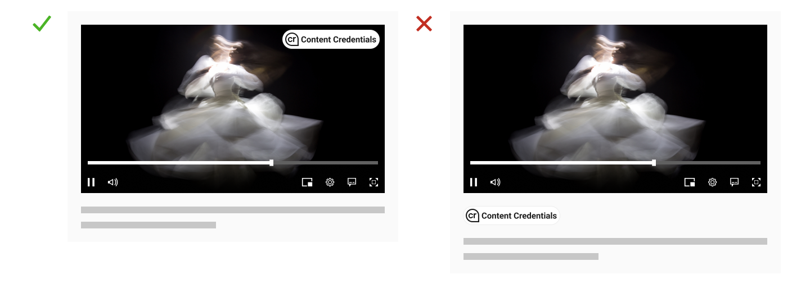

Figure 24. Example of correct and incorrect placement of L1 indicator.

**Manifests**

Videos can consist of numerous clips with many composited layers, called ingredients. Due to the limited space available in the interface it is recommended to prioritise and disclose ingredients that have valid content credentials. More work is required to investigate design patterns that support the exploration of a high number of ingredients.

**Validation States**

An invalid state is immutable; therefore, an invalid manifest or asset (whether a video segment for streaming, or the video file for monolithic architectures) will automatically result in an invalid video. Validation is conducted per session, for streaming this is continuously as video segments are received.

#### 8.1.2. L1 - indicator of C2PA data

##### 8.1.2.1. Appearance

If the video player doesn’t natively provide a background gradient where the indicator is to be positioned, it should be given its own background. This ensures its visibility remains constant for the entire length of the video.

Figure 25. L1 indicator should be visible throughout the video, therefore, a background is recommended.

For content recommendations see the [section on interface language](#_interface_language).

**Validation states**

In the event that the active manifest or content is invalid, a stateful indicator of data validation can be displayed. There are several scenarios when displaying a data validation state may be necessary. See sections [validation process](#_validation_process) and [validation states](#_validation_states).

Figure 26. The two validation states: valid and invalid, shown respectfully

##### 8.1.2.2. Placement

Place the L1 indicator directly on the video. This will help encourage users to associate the C2PA information with the content itself, while reducing confusion and incorrect associations with other content on the page. Another benefit is increased visibility by placing it higher in the information architecture; especially important when it comes to full screen videos where anything outside of the video container will not be visible. As best practice, it is suggested that where possible the indicator should be supported with its relevant label.

It is advised not to place the fully expanded L1 (using the icon and title) close to the timeline or lower down in the player as this is typically where subtitles sit.

Figure 27. Illustrative examples of L1 positioning within the video player. From left to right: a) Top right b)Bottom left c) Within controls.

##### 8.1.2.3. Interaction

The L1 Indicator should adhere to the existing interaction design pattern of the video player UI. For example, a video player UI typically goes through different visibility states during playback and on user interaction to ensure an unobtrusive viewing experience while maintaining easy control access. However, there will be times when this rule can be broken.

When communicating validation progress and states to the user, they should have clear visibility or knowledge of whether the validation process is ongoing, completed, or if invalidity was encountered. This ensures that the user remains informed and can take appropriate actions based on the validation state.

Ensuring an unaltered and undisturbed viewing experience is paramount, and any potential compromises should be kept minimal when possible, therefore:

1.  The L1 indicator must be displayed as soon as the page loads and C2PA information is available. This indicator should be overlaid on the video’s poster image. This means that when someone first navigates to the page, they should be able to immediately see the L1 indicator on top of the video poster image.
    
2.  When the process of validating the video is underway and no invalidities have been detected, the L1 indicator can behave like other elements of the video player’s UI. For example, it can fade out along with other controls (like play, pause, etc.) and then reappear when the user hovers or interacts with the video player.
    
3.  If the validation state changes at any point, this change must be made visible to the user straight away. This means, for instance if the validation process finishes, this information should be displayed to the user immediately.
    

#### 8.1.3. L2 - provenance summaries

##### 8.1.3.1. Appearance

Video L2 displays should largely follow the same patterns as described in [L2 – progressive disclosures](#_L2_progressive_disclosures). However, for now there is no recommendation on the inclusion of ingredients or non-C2PA origin content due to the potential complexity of volume. Instead, it is suggested to show a minimal manifest summary or provenance summary.

An important detail for video UX is the L2 thumbnail displays. [Read more on thumbnails here.](#_thumbnails) Specifically in the case of video, to help distinguish these assets from images, a filmstrip icon is added to the thumbnail to depict its media type. If the video asset containing the active manifest is playable, the media type icon should depict a play icon. However, even if the initial asset is a playable video, its ingredients may be static representations.

Time-based information like duration and time ranges can help users quickly understand at a high level where changes have been applied.

###### 8.1.3.1.1. Validated segments (for video streaming only)

Validated segments will have matching time codes that make it possible to communicate precise information. It is important to communicate invalid segments to assist consumers in decision-making and ensure transparency.

Many player timelines are already information heavy with progress, buffering, and chapter data. Thus, it is recommended to avoid adding more information to prevent confusing or overwhelming the user. However, linking a user interaction (like a hover state) with the timeline could help users understand their relationship and enhance information transfer. This approach can be used to provide validation progress and segment status information directly in the timeline, providing the user with more context. This solution, due to its limited accessibility and desktop-specific nature, should complement other approaches rather than being the sole strategy.

Figure 28. Illustrative example showing disclosure of invalid video segment on the timeline, activated on user interaction with L1.

Invalid segments can be communicated in written form by disclosing their time codes as part of the L2 summary. It is recommended to supplement this with a visual indicator in the timeline of the video player. An important consideration when doing this is to use color carefully, for example, showing an invalid segment in red on a natively red timeline may be confusing. Information should be encoded in distinct ways to reduce misunderstanding.

Further exploration could be dedicated to investigating alternative methods of encoding information, such as, form, shape, space, line, texture, or a combination of these.

##### 8.1.3.2. Placement

L2 information should be contained as part of the video player. The video should be visible alongside L2 information to support users in making comparative and contrastive assessments when interrogating the content and the data.

Some suggestions are provided below.

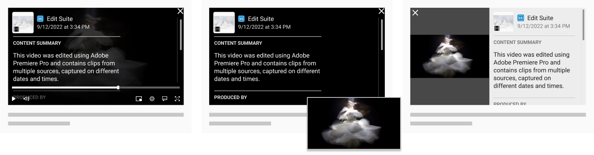

Figure 29. Three examples of L2 placement, from left to right: a) within the video player, b) exploiting PiP, c) split-frame layout.

*   As a video player overlay when user interacts with the C2PA indicator
    
*   Exploiting the Picture-in-Picture (PiP) feature to display information in the main video frame while video is presented in PiP window/overlay, or vice-versa.
    
*   Split-frame layout, where the main video frame is divided into two or more sections to showcase the video content and information side by side.
    

##### 8.1.3.3. Interaction

###### 8.1.3.3.1. Status Summaries for Invalid States

An invalid state should be surfaced to the user as soon as it is detected. There should be no distinction between an invalid manifest or an invalid asset; they are both equally invalid.

[Failure codes](../specs/C2PA_Specification.html.md#_failure_codes) `manifest.inaccessible` and `assertion.inaccessible` do not suggest invalidity and instead represent temporarily inaccessible information due to connection issues. These should be handled by the player as they are not considered validation issues.

Figure 30. Illustrative example of a L2 summary for an invalid state for streaming playback.

**Monolithic playback**

For videos that are contained in a monolithic architecture, as one single file, the asset validation happens in one instance alongside the manifest validation process. This allows for the complete manifest and asset validation status to be communicated on receipt of the video file and before playback. Any invalidity should be surfaced to the user before playback commences.

**Streaming playback**

Streaming presents some complexity as the asset validation process happens throughout playback resulting in the possibility for an invalid state to present at any time during the experience.

Studies indicate that people often multitask while viewing videos, at times listening more than watching. This could result in them overlooking a video’s invalid status. Given that invalid states are rare yet critical, it is recommended that the video playback should pause and the system status communicated along with a L2 summary that describes the invalidity. See section 8.1.5. Validation states.

Further research will be carried out to explore the spectrum of UX friction in relation to invalid states and what users consider an acceptable balance between delivering a positive user experience and communicating an invalid state.

###### 8.1.3.3.2. Active Manifest Data

There should be an easy and intuitive way for the user to view L2 information. Our recommendation is to link the L1 indicator to enable L2, hence creating a direct relationship between the two. Therefore L2 should be accessible by interacting with L1 as a minimum.

#### 8.1.4. Validation process

##### 8.1.4.1. Dynamic Video Streaming

For dynamic video streaming each segment is validated as it’s rendered. While the full video’s validation status can’t be reported, the status of individual segments can. Each segment can be validated, which, in human terms would appear to be immediate. Video streams inherently have different bitrates, opening up the possibility for the same segment to show conflicting validation statuses depending on the bitrate being played at the time. As soon as a segment is requested by the player, whether it is the first or multiple times afterwards, it’s validated. The UI should communicate that validation is conducted per viewing instance, not per video. The video delivery method is dynamic and could change at anytime, it is not advised to communicate or introduce a ‘completion’ state.

###### 8.1.4.1.1. **On page load**

Manifest validation occurs quickly on page load, any Manifest failures should be surfaced to the user at this point. Depending on the video player implimentation, different levels of information can be communicated about the asset:

*   **Lazy loading**: Players set to lazy load defer the loading of resources until they are needed, improving initial page load time and reducing bandwidth usage. User interaction is required for the asset validation process to initiate. Active Manifest data can be shown. If it is shown it should be clear that the content hasn’t yet been validated against this information, therefore there is some uncertainty.
    
*   **Preloading**: Players set to ‘preload’ fetch video resources ahead of time to eliminate waiting periods. In this scenario the initial segment or some segments may be downloaded before the user interacts. Active Manifest data can be shown and the validation status of these initial segments maybe communicated confidently.
    
*   **Autoplay**: Players set to autoplay don’t require user interaction to initiate playback, subsequently, the validation process will commence in parallel. Active Manifest data can be shown and the validation status of the rendered segments maybe communicated confidently and progressively inline with playback.
    

###### 8.1.4.1.2. During streaming

The Asset validation process is dependent on the video download speed. Video streaming involves progressively downloading and compiling small video chunks of the full video as one continuous stream. It is at this point that each segment is validated and their statuses can be communicated. Active Manifest data can be shown.

###### 8.1.4.1.3. User-video-player interactions and their impact on validation

*   **Trick play**: Video players allow users to easily move back and forth to specific moments in the video. When parts of the video are skipped these sections may not be validated, leading to uncertainty about their accuracy or validity. However, it is not recommended to attempt to communicate this uncertainty as it may create confusion to the user. What has not been viewed should be left as unknown.
    
*   **Adjusting video quality**: When a user adjusts the video quality (changes the bitrate), the new segments will be revalidated.
    

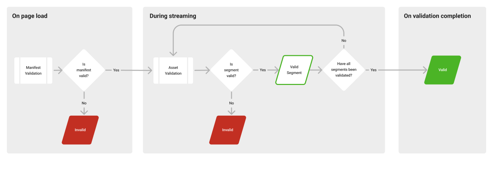

Figure 31. Flow showing a) when the manifest and asset validations happen during the video streaming experience b) the validation status logic across this journey.

##### 8.1.4.2. Monolithic videos

For videos that are contained in a monolithic architecture, as one single file, the asset validation happens in one instance alongside the manifest validation process. This allows for the full video validation status to be communicated on receipt of the video file and before playback.

#### 8.1.5. Validation states

| **Status (for implementers)** | **Notes (for implementers)** | **Viewer-facing status** | **Contextual messaging guidance (L2, modals, etc)** |
| --- | --- | --- | --- |
| **Invalid** | The video player has determined that the video’s Active Manifest and/or Asset hashes have not passed validation. This generally suggests that someone has changed or tampered with the manifest or video, so the available manifest data should be disregarded. Unknown failures should default to an Invalid state, as the severity of the failure is unknown. | Invalid | Indicate that there is a problem and that users should watch with caution, if they choose to proceed. Assess your ability to confirm and willingness to state when a video has been tampered with. However, an invalid status always means that the information in the Content Credentials should be disregarded, and this should be conveyed to users. **Example:** _**Watch with caution**: This video or its Content Credential may have been tampered with or contain unexpected changes. The video’s history can’t be confirmed and its Content Credentials should not be trusted._ |
| **Valid** | The video’s Active Manifest and all Asset hashes have passed validation by the video player’s validator. Implying a normal L2 interaction, no additional messaging is needed in a valid state. |  |  |

N.B. One single point of invalidity indicates that the video has been tampered with by a potentially bad actor with malicious intent, therefore the content content credentials should not be trusted. Invalid states occur infrequently on a very low proportion of videos.

#### 8.1.6. Open issues

Further research will be carried out to explore the spectrum of UX friction in relation to invalid states and what users consider an acceptable balance between delivering a positive user experience and communicating an invalid state.

### 8.2. Thumbnails

Since provenance data can be added to any media type, ‘thumbnails’ here should be thought of in the broadest, multi-media sense. They should not necessarily be limited to static pixel based representations of all media types. A ‘snippet’ of audio for example could be considered all or part of a 'thumbnail’ for an audio file. Taking a multi-media, dynamic approach where possible should make thumbnails more helpful to users as they will be media appropriate. Implemented well, it will also help to aid accessibility.

Thumbnails serve different purposes in different contexts (simple recognition, parsing large media sets, promotion etc.) but in the context of provenance the guiding principles for their inclusion should be helping users to understand the history and attribution of media and to engender trust.

Amongst media types (image, video, audio, docs, 3D models etc.) single image thumbnails are unique in that they are (from a user’s perspective) simply a smaller version of the actual file - a ‘complete’ yet compact instance of the same media. In our context this can be helpful since it allows users to more easily interpret provenance chains by simply scanning through these approximations. This cannot be replicated with other more complex media types and so consideration should be given to how to create meaningful but succinct representations.

Depending on the media type, a meaningful ‘thumbnail’ can be comprised of more than one element (but does not need to include all). The below example uses video as an example but is intended to demonstrate how the different elements can be used to create a thumbnail of any kind.

Figure 32. Anatomy of a thumbnail

*   Interactions (i.e. hover or long press to skip through a sequence or swipe to rotate model)
    
*   Where relevant, an L1 indication of provenance
    
*   Some representation of the media (see below for different approaches)
    
*   Data (i.e. media duration for temporal media)
    
*   Relevant iconography
    

**Media representations**

| **PLACEHOLDER** | **PREVIEW** | **POSTER** |
| --- | --- | --- |
| A default, static media type representation (i.e. a file icon to represent text, a particular piece of haptic feedback pattern to denote audio etc.). This is distinct from iconography as it could be a fallback placeholder in the slot where **PREVIEW** or **POSTER** might sit | The representation is manually or automatically derived from the media according to some rule (i.e. the first frame of the video, the lead image in a document, a 3/4 angle shot of a model) this could sit on a scale of simple (i.e. frame x) to sophisticated (i.e. face detection, popular moments or a sample sequence that plays through via user interaction) | A separate piece of media is created by human and/or machine to represent the media. It may well contain elements/treatments not necessarily present in the media i.e. typography used as a title or stylistic rendering. |

Since the media, context and use case will vary we do not seek to dictate which approach is best however it is recommended that whatever approach is taken remains consistent across manifests when displaying provenance chains. Swapping between say, a **PREVIEW** and **POSTER** approach risks confusing users as to what media is being referred to. It is also recommended that whatever combination of elements (Representation, iconography, data, etc.) remains consistent across manifests.

It is recommended that for all media types, of the possible elements, alongside the appropriate **Media representation**, **Iconography** is always used. This should help to distinguish media types that may otherwise appear similar i.e. if an image was chosen to represent a document file it could be confused for an image file.

In the case of temporal media (audio/video/3D scene), it is also recommended that **duration data** is included. Duration could be helpful to a user when comparing manifests since changes to it could be meaningful. This is also a good example of the importance of consistency. If the duration is featured intermittently, this will not only make it harder to interpret, It could even result in the user mistaking some manifests as of a different media type since they have built a mental model of what to expect for a given type.

The table below sets out some suggestions for how the various elements might come together to form multi-faceted ‘thumbnails’ for different media types. In the case of iconography/interactions it is acknowledged that different platforms may have existing patterns and so examples here are for illustration only.

| **Media Type** | **Media Representation** | **Iconography** | **Data** | **Interactions (suggestions only)** |
| --- | --- | --- | --- | --- |
| Image (single) | Thumbnail image | n/a | n/a | Expand to inspect |
| Image (multi-picture) | Thumbnail images | TBD | No of images | Skip through images |
| Video | ‘Placeholder'/'Preview'/'Poster’ | i.e. Movie clip icon (to distinguish it from the full playable asset which would use the play icon) | Duration | Skip through key frames / Play sub section |
| Audio | ‘Placeholder'/'Preview'/'Poster’ | i.e. Speaker icon (to distinguish it from a playable asset which would use the play icon) | Duration | Play sub section |
| Document | ‘Placeholder'/'Preview'/'Poster’ | i.e. File icon | File size |  |
| 3D Model/scene | ‘Placeholder'/'Preview'/'Poster’ | i.e. Cube icon | Duration (if scene) | Rotate and zoom, 'Quick look' in AR |

\*A note on the ‘POSTER’ approach to media representation. This could require its own provenance chain, or it could be treated as an ingredient to the associated media and thus handled as just another sub-branch therein.

## 9\. Interface language

### 9.1. L1 interface language

It is important to align any interface language with the recommended terminology and phrases. This lets terminology retain the same meaning and weight across experiences, which is best for user comprehension. It also ensures the value and adoption of content provenance, thus making C2PA data easier to understand and promote across a large ecosystem.

For customization of UI elements, use the recommended terms or customize with user comprehension in mind.

In the following table, we recommend terminology for consumer-facing L1 UI:

**Table 1. L1 recommended content terms and descriptions**

| Term/phrase | Description | Usage notes |
| --- | --- | --- |
| Content Credentials | Content provenance and attribution data | *   Use title case when referring to the system name and sentence case when referring to the data itself |
| Invalid | Someone has changed or tampered with the content credentials, so the available data should be disregarded | Consider pairing with a visual indicator that conveys clear negativity and risk so users can understand the C2PA data should not be used to assess the content |

### 9.2. L2 interface language

Please refer to [L1 interface language](#l1-language) for a reminder of the importance of adhering to recommended terms and descriptions. The following table contains terminology for UI elements such as commonly used categories and validation states:

**Table 2. L2 recommended content terms and descriptions**

| Term/phrase | Description | Usage notes |
| --- | --- | --- |
| Content Credentials | Content provenance and attribution data | *   Consider using as a UI header to contextualize C2PA data displays |
| Signed by / Signer | The signer is responsible for the trustworthiness of the content and its C2PA data | Must be displayed |
| Date and timestamp | The time and time zone at which the signer signed the manifest | *   Recommended inclusion to accompany signer      *   Appearance of formatting should be localized to consumer’s region |
| Edits and activity | Actions taken on the asset | Actions should map to standardized categorizations of C2PA actions |
| Assets used / Assets | Ingredients used in a given manifest | Recommended display for discrete manifest summaries |
| Produced by / Producer | The name and role of the person identified by the active manifest as its producer | *   Consider a customization or UI pattern to clarify how identity is being validated (see more in [creator identity](#identity))      *   This term is intended to represent a diverse range of roles, but can be customized based on the CreativeWork assertion |
| Content credentials are invalid | Someone has changed or tampered with the content credentials, so the available data should be disregarded | Should follow L1 validation state |
| Additional manifests | There are # additional manifests in this provenance line | Use to represent manifest count when there are four or more manifests in the provenance summary |

### 9.3. User-facing edit and activity labels and descriptions

The [names and descriptions of C2PA actions](../specs/C2PA_Specification.html.md#_actions) have generally been written with implementers in mind. Users who are less familiar with the C2PA will benefit from clear labeling and descriptions of actions that capture as much of the related actions that may apply as possible.

Here we provide a matrix of current C2PA actions with recommended labels and optional descriptions for them in the "Edits and activity" section of consumer manifest UIs.

Note that when displaying C2PA actions ("Edits and activity") in a manifest, descriptions may accompany them in the UI or be made available in separate docuentation.

**Table 3. Recommended user-facing C2PA action labels and descriptions**

| C2PA action | Recommended label | Optional descriptio recommendation |
| --- | --- | --- |
| c2pa.color\_adjustments | Color or exposure edits | Adjusted properties like tone, saturation, curves, shadows, or highlights |
| c2pa.created | Created | Created a new file or content |
| c2pa.cropped | Cropped | Used cropping tools, reducing or expanding visible content area |
| c2pa.drawing | Drawing edits | Used tools like pencils, brushes, erasers, or shape, path, or pen tools |
| c2pa.edited | Other edits | Performed other edits which may or may not change appearance |
| c2pa.filtered | Filter or style edits | Used tools like filters, styles, or effects |
| c2pa.opened | Opened | Opened a pre-existing file |
| c2pa.orientation | Changed orientation | Changed position or orientation (rotated, flipped, etc.) |
| c2pa.placed | Imported | Added pre-existing content to this file |
| c2pa.resized | Resized | Changed dimensions or file size |
| c2pa.unknown | Unknown edits or activity | Performed edits or activity that couldn’t be recognized |
| c2pa.converted | Converted | Changed file format with transcoding |
| c2pa.transcoded | Transcoded | Converted from one file encoding to another, potentially affecting properties like resolution scale, bitrate, or encoding format |
| c2pa.repackaged | Repackaged | Changed container file format without transcoding |
| c2pa.removed | Removed | Removed content or files created or added during the editing process |
| c2pa.published | Published | Distributed this file on an online platform |

### 9.4. L2/L3 user-facing warnings and errors

When writing user-facing error or warning messages, space may be limited. Prioritize clearly stating what is wrong, missing, unavailable, etc., and providing next steps a user can take to potentially correct the situation when applicable. Explanation of **why** an error or warning occurred, or more detailed guidance on correction,may be left to separate help documentation provided through a "Learn more" link or similar.

Following are a few example messages for some of the most common types of issues and errors C2PA is aware of today, which you may use as a starting point and reference for your own implementations.

**Table 4. Example language for common L2/L3 warnings and errors**

| Problem | User-facing message |
| --- | --- |
| Manifest has been tampered with in a way that makes it invalid, or is otherwise inaccessible | Content Credential unavailable or invalid |
| Edits or activity occurred outside of C2PA-supported app or while C2PA feature was not enabled | Some edits or activity may not have been recorded. Learn more |
| Ingredient is of a file type that may contain multiple layers, some of which may not appear in its ingredient thumbnail | May contain layers that are hidden or not visible in this thumbnail \* Note that ingredient-specific messaging should be contextually located around the ingredient it refers to. For example, this message may appear in a tooltip attached to an icon near the ingredient’s name in the UI. |
| Connection issues with remote storage when retrieving manifest data | Some assertions may be temporarily missing or invalid due to connection issues. |
| Connection issues with remote storage when retrieving manifest | Content Credential temporarily unavailable due to cloud storage connection issues. Try viewing again later. |

### 9.5. Difficult terms and concepts, and possible alternatives

Some C2PA terms and concepts may be particularly unfamiliar, hard to grasp, or contentious for users, or be inherently lengthy to explain (running the risk that explanations will not be read and understood).

Here we list a few known examples and share possible alternatives. These suggestions are currently untested, but you may take them as directional guidance toward simpler, more user-friendly interface language.

**Table 5. Possible consumer-friendly alternatives to difficult terms and concepts**

| Term or concept | Possible alternative | Notes |
| --- | --- | --- |
| Signer, signed by (as labels) | *   Content Credentials issued by          *   As a label for the signer name, or as a label for a section about the signer’s identity and other details about the signature like when it occurred               *   Issued by          *   As a label within a "Content Credentials issued by" section to further specify the signer identity | Users and creators are generally unfamiliar with the concept of digital signatures as they pertain to C2PA manifests. A more descriptive phrase for "Signer" like "Content Credentials issued by," can better illustrate the importance of the identity listed. |
| Signer (description) | "This is the trusted organization, device, or individual that issued these Content Credentials and recorded the details shown." | This aligns with the guidance above regarding reframing "signer" as "Content Credentials issued by" |
| Assertion (description) | *   Details      *   Information | While it is not advised to label individual assertions as "assertions" in a manifest, the description or explanation of them is likely to come up in your implementation’s ecosystem. We propose referring to assertions as simply "information" or "details" within Content Credentials. |
| Producer, Produced by (label) | *   Output by          *   Output by: John Doe              *   "This content was output by John Doe"              *   "John Doe output this content" | Users may be hesitant to include identity assertions with content they don’t own or didn’t solely create. If you believe your users may share similar concerns, you can try using a more neutral term like "output by" which doesn’t carry the same possible implication of ownership that "produced by" might. |

## 10\. Communication and education

To ensure user comprehension, it is crucial that implementers consider how their audiences are introduced to C2PA provenance data and the value to be gained from engaging with it. We recommend providing creator and consumer educational experiences and strongly encourage the use of language consistent to what is provided in these guidelines. Keeping communication and education aligned is a key part of promoting comprehension, value, and adoption of C2PA data by implementers, creators, and consumers.

Depending on the implementer’s platform and audience, there are different ways to effectively incorporate education around C2PA data. We suggest utilizing standard UI elements like links, tooltips, and modals to provide users with opportunities to seek out more information regarding the implementation or a component piece within. Certain L2 UI elements, like assertion categories, may warrant additional explanations to ensure user comprehension. For larger and more detailed explanations, implementers should consider linking out to FAQs or dedicated information pages so audiences can learn more about C2PA from a native product voice. However, when making content customizations, make sure things like brand voice are not prioritized in sacrifice of clarity and user comprehension.

## 11\. Open issues

### 11.1. User research

Correctly identifying and displaying trust signals is of paramount concern for our overall user experience. C2PA strives to understand the value consumers will apply to content attribution through ongoing user research studies and usability testing.

### 11.2. Applications, use cases, and additional media formats

Pending user research, C2PA will provide implementors with recommended L2 customizations based on combinations of content, audiences, and platforms. Examples may include news publishers, social sites, e-commerce and retail, travel, and entertainment platforms. The recommendations for video UX will also continue to expand in scope and complexity, along with the introduction of other media formats like audio and streaming content.

## 12\. Public review, feedback and evolution

The team authoring the UX recommendations is cognizant of its limitations and potential biases, recognizing that feedback, review, user testing and ongoing evolution is a requirement for success. This guidance is therefore an evolving document, informed by real world experiences deploying C2PA UX across a wide variety of applications and scenarios.
