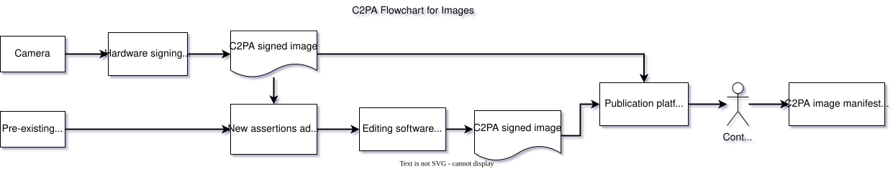

# C2PA Security Considerations

This work is licensed under a [Creative Commons Attribution 4.0 International License](https://creativecommons.org/licenses/by/4.0/).

## 1\. Introduction

This document provides information security considerations for technology described in the [C2PA core specification](../specs/C2PA_Specification.html.md). It complements security-related content in other C2PA documents. This document includes:

*   A summary of relevant security features of C2PA technology
    
*   Security considerations for practical use of C2PA technology
    
*   Threats to C2PA technology and respective treatment of those threats, including countermeasures
    

Analysis in this document does not assess security risk or likelihoods associated with threats or outcomes. These may vary based on a number of factors, such as the context in which C2PA technology is deployed and changes in the threat landscape. However, content in this document may be helpful in developing security risk and likelihood assessments related to use of C2PA technology.

> **IMPORTANT:**
> Content in this document is non-normative and does not specify requirements for complying with the C2PA specification.

While the C2PA endeavours to develop and maintain a comprehensive threat model and security considerations for C2PA technology, we expect this work to be ongoing as technology develops and the threat landscape evolves.

> **IMPORTANT:**
> This document is a work in progress.

### 1.1. Threat modelling process overview

The C2PA builds security into our designs as they are being developed, but also expects that security design and threat modelling will continue as the system, ecosystem, and threat landscape evolve.

To this end, the C2PA uses a focused threat modelling process to support development of a strong security and privacy design. Outcomes of the effort directly support development of documentation about explicit threats and security considerations while also facilitating security-oriented thinking throughout the design process.

The threat modelling process combines synchronous (i.e., live) threat modelling sessions with focused groups of Subject Matter Experts (SMEs) in the asynchronous development of content. The number of attendees in each synchronous session is kept small to promote efficient discussions, but all members of the C2PA have the opportunity to participate via either modality.

Like other security activities, we expect our threat modelling process to evolve with the C2PA ecosystem. Process documentation is considered a guide rather than a strict directive on how threat modelling works within the C2PA.

> **NOTE:**
> In this document _asset_ refers to C2PA assets and not [conventional threat model assets](https://cheatsheetseries.owasp.org/cheatsheets/Threat_Modeling_Cheat_Sheet.html#define-and-evaluate-your-assets).

#### 1.1.1. References

A variety of references and experiences are used to inform threat modelling and related security activities for the C2PA. This section provides a subset of public documents for reference.

*   [IETF on security considerations](https://datatracker.ietf.org/doc/html/rfc3552#page-26)
    
*   [IETF on privacy considerations (guidelines)](https://datatracker.ietf.org/doc/html/rfc6973#section-7)
    
*   [W3C security and privacy self-review questionnaire](https://www.w3.org/TR/security-privacy-questionnaire/)
    
*   [OAuth2 threat model (example)](https://datatracker.ietf.org/doc/html/rfc6819)
    
*   [Threat Modelling: Designing for Security](https://shostack.org/books/threat-modeling-book)
    
*   [OWASP Threat Modelling](https://owasp.org/www-community/Threat_Modeling)
    
*   [Microsoft Threat Modelling](https://www.microsoft.com/en-us/securityengineering/sdl/threatmodeling)
    

## 2\. Security features

This section summarizes C2PA features that support the [security model](#_security_model) specified later in this document. The [C2PA core specification](../specs/C2PA_Specification.html.md) should be considered the canonical reference for C2PA features. It supersedes summaries provided here.

### 2.1. Provenance model

C2PA enables consumers to reason about asset provenance. C2PA specifies a model for asset provenance based on the following definitions.

Provenance

The logical concept of understanding the history of an _asset_ and its interaction with _actors_ and other _assets_, as represented by the _provenance data_.

Provenance data

The set of _C2PA Manifest\_s for an \_asset_ and, in the case of a _composed asset_, its _ingredients_.

> **NOTE:**
> A _C2PA Manifest_ can reference other \_C2PA Manifest\_s.

Assertion

A data structure which represents a statement asserted by an _actor_ concerning the _asset_. This data is a part of the _C2PA Manifest_.

Claim

A digitally signed and tamper-evident data structure that references a set of _assertions_ by one or more _actors_, concerning an _asset_, and the information necessary to represent the _content binding_. If any _assertions_ were redacted, then a declaration to that effect is included. This data is a part of the _C2PA Manifest_.

Claim signature

The digital signature on the _claim_ using the private key of an _actor_. The _claim signature_ is a part of the _C2PA Manifest_.

C2PA Manifest

The set of information about the _provenance_ of an _asset_ based on the combination of one or more _assertions_ (including _content bindings_), a single _claim_, and a _claim signature_. A _C2PA Manifest_ is part of a _C2PA Manifest Store_.

> **NOTE:**
> A _C2PA Manifest_ can reference other \_C2PA Manifest\_s.

Origin

The _C2PA Manifest_ in the _provenance data_ which represents the software or device that initially created the _asset_.

> **NOTE:**
> Details on how one determines which _C2PA Manifest_ is the _origin_ are left for specification.

Active Manifest

The last manifest in the list of _C2PA Manifests_ inside of a _C2PA Manifest Store_ which is the one with the set of _content bindings_ that are able to be validated.

Figure 1. A C2PA Manifest and its constituent parts

### 2.2. Trust model

The basis of making trust decisions in C2PA, its [Trust Model](../specs/C2PA_Specification.html.md#_trust_model), is the identity of the claim generator associated with the cryptographic signing key used to sign the claim in the active manifest. The certificate for the claim generator is provided by a certificate authority (CA) that supports C2PA signing from the C2PA [Trust List](../specs/C2PA_Specification.html.md#_trust_lists). The C2PA maintains a Trust List of approved C2PA certificate authorities that all C2PA validators must recognize. This Trust List can be extended with additional certificate authorities for customized implementations.

C2PA leverages trusted time-stamps to ensure the correctness of signing and revocation processes. A benefit of this approach is that revocation status can be optionally obtained when claims are generated (rather than when consumed), and revocation can be applied to subsets of signatures by time-stamp. See the [Trust Model section of the specification](../specs/C2PA_Specification.html.md#_trust_lists) for more details.

C2PA Manifests can be validated indefinitely regardless of whether the cryptographic credentials used to sign its contents are later expired or revoked.

> **NOTE:**
> In version 2.0 of the C2PA specification, there were several significant changes to the Trust Model. The term [actor](../specs/C2PA_Specification.html.md#_2_0_january_2024) was reduced to no longer refer to humans or organizations. The C2PA specification now focuses on claim generators and claim signers. The C2PA specification continues to support the addition of identity assertions which could include a human actor, a pseudonym, completely anonymous, or pertain to a service or trusted hardware device with its own identity, including an application running inside such a service or trusted hardware. However, the C2PA specification no longer defines how identity must be expressed within an identity assertion. The security and validity of the information present within the identity assertion will be dependent on which identity specification was chosen by the creator of the identity assertion.

### 2.3. Claim signatures

C2PA uses a combination of cryptographic hashes and signatures to ensure that any tampering of the asset provenance can be detected. C2PA does not offer any protection against the [complete removal of C2PA manifests from assets](#_threat_stripping_c2pa_manifests), but the design does aim to prevent any unauthorized tampering of either the digital asset content or the C2PA manifests themselves. The [C2PA Guidance document](../../2.2/guidance/Guidance.html.md) for implementers offers direction about how soft bindings and manifest repositories could be used to address the removal situation.

Details on supported cryptographic hashing and signature schemes, as well as format details, are covered in the specification’s [Cryptography section](../specs/C2PA_Specification.html.md#_cryptography). As noted there, the C2PA maintains lists of supported algorithms and certificate types that aim to adhere to cryptographic and compatibility best practices.

Detail on how signing credentials relate to identity are included in the [Trust Model section](../specs/C2PA_Specification.html.md#_trust_model) of the specification. The [Validation section](../specs/C2PA_Specification.html.md#_validation) provides details on validating claims, which includes validating signatures.

### 2.4. Content bindings

Content bindings associate provenance data in C2PA Manifests with assets.

In the context of a C2PA Manifest, hard bindings provide a strict cryptographic binding between provenance and an asset; they aim to provide some useful guarantees against tampering. Soft bindings provide less strict binding between the provenance and an asset. They may associate C2PA provenance with multiple assets, and vice versa. The [soft binding section](../specs/C2PA_Specification.html.md#_soft_bindings) goes into details about how soft bindings can be used with C2PA Manifests.

C2PA Manifest Stores are usually embedded into assets but they may exist externally, such as when served as part of the same or linked HTTP connection. In addition, C2PA Manifest Stores may also be decoupled from assets, enabling the C2PA Manifest to be retrieved and processed separately from the asset.

### 2.5. Validation

Validation checks provenance claim signatures and performs supporting operations. The validation algorithm is described in detail in the [validation section of the C2PA specification](../specs/C2PA_Specification.html.md#_validation).

### 2.6. Protection of personal information

C2PA provides features that can be used to protect confidentiality of personal information while still establishing the provenance of an asset.

*   Anonymous or pseudo-anonymous identities may be used within identity assertions. In addition, identity assertions are optional and do not need to be included within a claim.
    
*   Assertions that may contain sensitive information can be removed via [redaction](../specs/C2PA_Specification.html.md#_redaction_of_assertions).
    
*   Assertions can be customized for specific workflows, such as where specific information is required to remain encrypted end-to-end.
    

Note that confidentiality of personal information and other privacy-related concerns are addressed in the [Harms Considerations document](Harms_Modelling.html.md).

## 3\. Security model

The C2PA security model is focused on security of C2PA provenance data. While attackers may aim to compromise the security of other aspects of the system, this model assumes the pivotal goal is compromise of C2PA provenance.

The following principles should hold:

Integrity

Attempts to compromise the integrity of C2PA provenance data associated with a respective asset will be detected upon validation. This includes all data stored within C2PA Manifests.

For embedded C2PA Manifests, malicious association of an existing manifest with a differing asset is also tamper-evident. In addition, the following actions are tamper-evident for all manifests:

*   C2PA Manifest Store: Malicious addition or removal of a manifest.
    
*   C2PA Manifest: Malicious modification of an active or ingredient manifest.
    
*   Claims and claim signatures: Addition, removal, or modification of an existing claim in an existing C2PA Manifest.
    
*   Assertions: Addition, removal, or modification of assertions in the assertion store referenced by an existing claim.
    

Availability

An attacker may degrade availability of C2PA data, but C2PA should provide means to mitigate this impact.

For example: An attacker may strip manifests from C2PA-enabled assets altogether. Guidance is provided on how to mitigate the impact of this scenario.

While C2PA supports cloud-hosted information that is referenced from assertions, the validation algorithm makes retrieval of that information optional for validation in order that any network attacks (e.g, DDOS, tracking, etc.) cannot impact user experience.

Confidentiality

C2PA does not specify confidentiality properties for assets, provenance model primitives, private address books, or cryptographic secrets.

*   They may be kept confidential via other means. For example by transmitting assets via TLS. However, enforcing this confidentiality is considered out-of-scope for this specification.
    
*   Some private data, such as claim signing keys or private address books, must adhere to conventional confidentiality principles. Compromise of this private data could lead to indirect violation of other principles specified in this section. Enforcing confidentiality of this adjacent private data is considered out-of-scope for this specification.
    
*   C2PA does not specify Digital Rights Management (DRM) technology.
    
*   C2PA does not specify guarantees of confidentiality of personal information.
    
    *   However, C2PA provides features that can be used to protect confidentiality of personal information ([summary](#_protection_of_personal_information))
        
    *   Confidentiality of personal information and other privacy-related concerns are addressed in the [Harms Considerations document](Harms_Modelling.html.md).
        
        In general, these assertions are achieved through application of the [C2PA Trust Model](../specs/C2PA_Specification.html.md#_trust_model) to the claim generation process, and corresponding checks in the validation process.
        
    

Non-repudiation

Manifests are signed with a digital signature to maintain the integrity of the data. This signature also provides the identity of the signing individual, organization, software system or hardware device. The content consumer will need to determine whether a certificate, and the associated certificate chain, is a trusted source.

To assist the content consumer, the validator is required to maintain a list of trust anchors to facilitate validation of the certificate chain. While the validator will trust the trust anchors in their list, a content consumer may need the ability to apply a additional criteria for trust for a given situation. Therefore, the content consumer will need to be able to view the trust anchors for the content. A validator may also allow the user to create and maintain a [private credential store](../specs/C2PA_Specification.html.md#_signer_credential_trust) of signing credentials for each credential type. This store is intended as an "address book" of credentials they have chosen to trust based on an out-of-band relationship.

Some validators may be purpose-built for validating content from a finite set of sources who use a finite set of trust anchors. In these situations, the validator has the option to include only the trust anchors for those sources. This can reduce the risk of any conflicts or confusion arising from trust anchors outside of the finite set having certificates similar to those of the intended sources.

## 4\. Threat model

This section documents information security threats to C2PA technology. Threats are described as threat scenarios and organized categorically by prospective attacker goals; where an attacker goal is what the attacker is trying to achieve, or the desired outcome of the threat scenario.

Each threat scenarios is described as follows:

*   Description: A short description of the threat scenario
    
*   Prerequisites: Relevant requirements for attempting an attack or threat scenario
    
*   Impact analysis: Summary of the impact of the threat scenario on the C2PA security model
    
*   Guidance: Any supplementary security guidance on addressing the threat scenario or treating potential residual security risk
    

> **NOTE:**
> This document refers to threat sources, agents, actors and other malicious entities commonly as attackers.

> **NOTE:**
> For simplicity and readability, this document uses images as the example asset type for the threat scenarios. However, these threats would apply to all supported asset types within the C2PA specification.

### 4.1. Workflow diagram

Below is simple workflow diagram that represents a common C2PA workflow. Since each implementation may vary, this workflow diagram is not representative of any specific implementation. For instance, C2PA supports multiple asset types, and this diagram only represents the creation and viewing of a signed image. The intent of this diagram is solely to provide a high-level starting point for discussion.

Figure 2. A C2PA workflow for images

### 4.2. Threat and attack assumptions

#### 4.2.1. Assumptions

The following assumptions are made about entities that may attack C2PA technology:

*   Attackers have full access to public assets and associated public metadata, including C2PA Manifests.
    
*   Attackers may attempt to access claim generator software (e.g., C2PA-enabled photo editing software) as a typical user.
    
*   Attackers do not have access to private keys referenced within the C2PA ecosystem (e.g., claim signing private keys, Time-stamping Authority private keys, etc.). They may, however, attempt to access these keys via exploitation techniques.
    
*   Attackers have the ability to publish assets to an impactful audience, for example, as a social media user.
    
*   Quantum computing cryptanalytic attacks are considered out-of-scope.
    

The following additional assumptions are made about the threat model:

*   Attacks that rely on bypassing conventional security models of non-C2PA technology are considered out-of-scope. For example:
    
    *   Attacks against the C2PA validator as an architectural component within a user agent (e.g., web browser) are considered in-scope.
        
    *   A compromise of the C2PA validation logic via some non-C2PA attack vector within the user agent is considered out-of-scope, since this would typically require bypassing the security model of the user agent (e.g. escaping a web browser sandbox or compromising the host via other means).
        
    
*   Attacks across conventional trust boundaries are considered in-scope.
    
    *   For example, attacks against C2PA-enabled assets traversing the internet.
        
    

#### 4.2.2. Attack targets

##### 4.2.2.1. Hardware layer:

Attacks against hardware implementations of C2PA would attempt to leverage the trust of the hardware manufacturer. For example, a camera lens sends digital information to the camera’s CPU to sign what was captured. A hardware attacker might inject their own data between the lens and the camera’s CPU to convince the camera to sign fake images.

##### 4.2.2.2. Cryptographic PKI

Attacks against a PKI infrastructure might leverage several techniques. A simple example of this attack would be creating a self-signed certificate that spoofs a legitimate certificate in an attempt to exploit a flaw in the validator’s implementation of trust list verification. Another example attack would be to socially engineer a certificate authority to sign content with another user’s credentials. These attacks could also include attacking the cryptographic algorithms used in the signature. Lastly, the attacker could attempt to steal a signing key either through compromising a signing service, compromising a user’s credentials to the signing service, or stealing the hardware used by the image creator. In addition to the guidance described below for specific threats, further cryptography recommendations are provided in the Trust section of the [Guidance for Implementers](../../1.4/guidance/Guidance.html.md#_trust).

##### 4.2.2.3. User interface

Attackers targeting the user interface would create malicious manifest data that targets the user interface in which the user views the rendered content credentials. In this scenario, the attackers would embed malicious data into the C2PA metadata. When an end-user uses a user interface to view the C2PA metadata, the malicious data would be extraced from the asset and presented to the end user. This data could attempt to confuse the end-user directly. For instance, the attacker might try to use [homoglyph attacks](https://en.wikipedia.org/wiki/IDN_homograph_attack) to confuse the end-user regarding the text that they are reading. Alternatively, the attacker might attempt to inject malicious data that could take control of the user interface and interfere with what is presented to the end-user. As an example, a flaw in a web-based user interface might allow the malicious manifest data to be interpreted as code by the web browser which would result in cross-site scripting. If the attacker’s malicious payload is interpeted as JavaScript by the web browser, then the attacker could manipulate the trusted user interface into presenting false information to the end-user.

##### 4.2.2.4. Consumers

Consumer attacks would focus on victimizing the human users of C2PA implementations. For instance, they might leverage how the C2PA specification allows remote manifests and references to other remote data to track and identify viewers of the content. When a person views Content Credentials, their client may make requests to these resources. If the remote resources are hosted by the attacker, the attacker could track which IP addresses have viewed specific assets. In countries where viewing certain types of content is prosecuted, this could result in the viewer’s life being put at risk. In addition, it may be possible to frame someone for viewing banned content. An attacker could take a safe image and embed a banned image containing remote C2PA metadata as an ingredient. While the user would only see the safe image, they would be flagged for looking at banned content when the manifests for the embedded ingredient are resolved.

##### 4.2.2.5. C2PA implementations

These attacks would focus on exploiting the software or hardware involved in C2PA Manifest processing. An example of this type of attack would be generating a C2PA Manifest with a sufficiently large payload to perform a buffer overflow. An attacker might also include malicious manifests that result in an image being misclassified by implementations that correlates C2PA information.

##### 4.2.2.6. The C2PA specification

These attackers would have a thorough understanding in the C2PA specification and look for potential flaws in the C2PA guidance. While every effort is made to ensure that C2PA guidance is secure, a threat model would not be complete without taking into account the possibility for a mistake in the guidance or a change in the threat landscape that undermines the core tenets of the specification. Similar specifications have improved with each new version as a result of issues identified in the previous version. The threat model must take into account the possibility that the C2PA specification will have an unforeseen issue requiring an update to the specification and potential action by the C2PA community.

##### 4.2.2.7. Community trust

One method for attacking the specification is to undermine people’s trust in the technology. For instance, frequent attacks spoofing information from C2PA Manifests, while not the direct fault of the specification, could wear on the community’s patience and trust of the technology. If these attacks result in frequent efforts on the part of the end-user to verify that the content is not a spoofing attack, then they will lose patience from the extra required effort and abandon the technology. Once the community abandons the technology, attackers can revert to their original techniques for creating disinformation. The community needs be aware of malicious disruptors in the community and work to minimize their impact.

##### 4.2.2.8. Misrepresentation and assumptions

These types of attacks are focused on human assumptions rather than technical attacks. For instance, one attack might be to take a photo of an image rendered by a high-definition television. The image captured by the device would be technically valid and realistic. However, without proper contextual information, a viewer of the image would assume that it was taken of a real event rather than a manufactured TV image. Similarly, there are also techniques for creating optical illusions for cameras. In these instances, the capture device correctly records and signs what came through the camera lens. However, the resulting image leads the viewer to a false conclusion about the event.

### 4.3. Threats

Threats within this section are grouped by the attacker’s goals. Each threat scenario includes a description, prerequisites, impact analysis, and security guidance.

*   [Section 4.3.1, “Goal: Degrading access to provenance information”](#_goal_degrading_access_to_provenance_information)
    
    *   [Section 4.3.1.1, “Threat: Stripping C2PA Manifests”](#_threat_stripping_c2pa_manifests)
        
    *   [Section 4.3.1.2, “Threat: Stripping data within C2PA Manifests”](#_threat_stripping_data_within_c2pa_manifests)
        
    
*   [Section 4.3.2, “Goal: Tamper with provenance information”](#_goal_tamper_with_provenance_information)
    
    *   [Section 4.3.2.1, “Threat: Copying C2PA metadata”](#_threat_copying_c2pa_metadata)
        
    *   [Section 4.3.2.2, “Threat: Spoofing signed C2PA metadata via a stolen key”](#_threat_spoofing_signed_c2pa_metadata_via_a_stolen_key)
        
    *   [Section 4.3.2.3, “Threat: Spoofing signed C2PA metadata via misuse of claim generator”](#_threat_spoofing_signed_c2pa_metadata_via_misuse_of_claim_generator)
        
    *   [Section 4.3.2.4, “Threat: Issuance of claim signing keys to malicious entity”](#_threat_issuance_of_claim_signing_keys_to_malicious_entity)
        
    *   [Section 4.3.2.5, “Threat: Swapping ingredients”](#_threat_swapping_ingredients)
        
    *   [Section 4.3.2.6, “Threat: Binding malicious media asset to valid provenance via soft-binding collision”](#_threat_binding_malicious_media_asset_to_valid_provenance_via_soft_binding_collision)
        
    *   [Section 4.3.2.7, “Threat: Binding valid media asset to malicious provenance via soft-binding collision”](#_threat_binding_valid_media_asset_to_malicious_provenance_via_soft_binding_collision)
        
    *   [Section 4.3.2.8, “Threat: Recovering redacted information”](#_threat_recovering_redacted_information)
        
    *   [Section 4.3.2.9, “Threat: Injection of conflicting assertion types”](#_threat_injection_of_conflicting_assertion_types)
        
    
*   [Section 4.3.3, “Goal: Gain control of the C2PA implementation or environment”](#_goal_gain_control_of_the_c2pa_implementation_or_environment)
    
    *   [Section 4.3.3.1, “Threat: Interfering with UI rendering of C2PA metadata”](#_threat_interfering_with_ui_rendering_of_c2pa_metadata)
        
    *   [Section 4.3.3.2, “Threat: Interference with the storage and organization of C2PA manifest data”](#_threat_interference_with_the_storage_and_organization_of_c2pa_manifest_data)
        
    *   [Section 4.3.3.3, “Threat: Exploitation of the application software”](#_threat_exploitation_of_the_application_software)
        
    *   [Section 4.3.3.4, “Threat: Exploitation of the hosting environment”](#_threat_exploitation_of_the_hosting_environment)
        
    *   [Section 4.3.3.5, “Threat: Interception and/or modification of traffic between two trusted sources”](#_threat_interception_andor_modification_of_traffic_between_two_trusted_sources)
        
    *   [Section 4.3.3.6, “Threat: Exploitation of older C2PA versions”](#_threat_exploitation_of_older_c2pa_versions)
        
    
*   [Section 4.3.4, “Goal: Targeting the human consumer of C2PA information”](#_goal_targeting_the_human_consumer_of_c2pa_information)
    
    *   [Section 4.3.4.1, “Threat: Tracking the human consumer of C2PA information”](#_threat_tracking_the_human_consumer_of_c2pa_information)
        
    *   [Section 4.3.4.2, “Threat: Name collision attacks”](#_threat_name_collision_attacks)
        
    *   [Section 4.3.4.3, “Threat: Assumed trust relationship between two identies”](#_threat_assumed_trust_relationship_between_two_identies)
        
    *   [Section 4.3.4.4, “Threat: Misuse of signed C2PA assets”](#_threat_misuse_of_signed_c2pa_assets)
        
    
*   [Section 4.3.5, “Goal: Identifying the human creator of content”](#_goal_identifying_the_human_creator_of_content)
    
    *   [Section 4.3.5.1, “Threat: Using a certificate or key to discover identity”](#_threat_using_a_certificate_or_key_to_discover_identity)
        
    

#### 4.3.1. Goal: Degrading access to provenance information

Threat scenarios in this category aim to prevent media consumers from reasoning about the provenance of assets. In terms of the security model, this is a compromise of availability of C2PA provenance data.

##### 4.3.1.1. Threat: Stripping C2PA Manifests

**Description**

An attacker removes C2PA Manifests from an asset delivered with hard bindings. For example, by downloading C2PA-enabled media from a social media site, stripping the C2PA Manifest(s), and re-posting it.

**Prerequisites**

Technical ability to strip provenance data from published or stored assets and deliver the stripped assets targeted users or systems. For example, via republishing to social media or on-path attacks.

**Impact analysis**

It is possible for an attacker to remove metadata as described. Depending on the context, this could cause a user agent not to display provenance information associated with the asset.

**Security guidance**

The impact of this threat scenario could be mitigated through use of manifest repositories, e.g., by making C2PA Manifests available to user agents when embedded manifests are missing.

Use of manifest repositories can introduce security and privacy issues. See the [Content binding security section](#_content_bindings) for more information.

##### 4.3.1.2. Threat: Stripping data within C2PA Manifests

**Description**

An attacker removes metadata from within C2PA Manifests(s) stored in a asset delivered with hard bindings, such as the assertion store, individual assertions, claims, claim signatures, etc. For example, by downloading C2PA-enabled media from a social media site, stripping the target C2PA metadata, and re-posting it.

**Prerequisites**

Technical ability to strip provenance data from published or stored assets and deliver the stripped assets targeted users or systems. For example, via republishing to social media or on-path attacks.

**Impact analysis**

It is possible for an attacker to remove information from inside of a C2PA Manifest as described. However, [validation checks](../specs/C2PA_Specification.html.md#_validation) as implemented by a C2PA validator will detect any complete or partial removal of data stored within C2PA Manifests due to the use of cryptographic hashes in the `hash-uri-map` structures stored within the claim. The data within the claim is protected by the claim signature. The `hashed-uri-map` structures within the Manifest Store are not a security protection which is why removal of an entire C2PA Manifest is possible, and described as a [distinct threat scenario](#_threat_stripping_c2pa_manifests).

This is similar to the case of stripping all C2PA metadata. However, in this scenario there is an added benefit that user agents can explicitly detect the attempt to remove metadata as part of the validation process.

**Security guidance**

The impact of this threat scenario is mitigated through explicit detection of missing metadata through the standard C2PA validation process and factoring this into system behaviour. For example, a user agent would display the affected asset differently than a non-modified asset. (For more information about the user experience aspects, see [C2PA’s UX Guidance](../ux/UX_Recommendations.html.md))

The impact of this threat scenario could be also mitigated through use of manifest repositories, e.g., by making decoupled C2PA Manifests available to user agents when embedded metadata is missing.

Use of manifest repositories can introduce security and privacy issues. See the [Content binding security section](#_content_bindings) for more information.

#### 4.3.2. Goal: Tamper with provenance information

Threat scenarios in this category aim to modify or spoof provenance information associated with C2PA-enabled assets, e.g., to present misleading provenance data to media consumers. This is considered a compromise of integrity of provenance data in terms of the C2PA security model.

##### 4.3.2.1. Threat: Copying C2PA metadata

**Description**

An attacker copies valid, hard-bound C2PA metadata, such as assertions, claims, or entire C2PA Manifests, from one C2PA-enabled asset to another.

**Prerequisites**

Technical ability to strip provenance data from published or stored assets and deliver the stripped assets targeted users or systems. For example, via republishing to social media or on-path attacks.

**Impact analysis**

An attacker is able to perform the copying as described. However, C2PA hard bindings provide a cryptographic binding between assets and C2PA Manifests via claim signatures. Thus, [validation checks](../specs/C2PA_Specification.html.md#_validation) (e.g., as implemented by a user agent) will detect the replaced C2PA Manifests.

This is similar to the case of stripping all C2PA metadata. However, in this scenario there is an added benefit that user agents can explicitly detect the attempt to remove metadata as part of the validation process.

**Security guidance**

The impact of this threat scenario could be mitigated through explicit detection of incorrect metadata as described here, and factoring this into system behaviour. For example, a user agent would display the affected asset differently than a non-modified asset. (For more information about the user experience aspects, see [C2PA’s UX Guidance](../ux/UX_Recommendations.html.md)).

The impact of this threat scenario could be also mitigated through use of manifest repositories, e.g., by making decoupled C2PA Manifests available to user agents when embedded metadata is missing.

Use of manifest repositories can introduce security and privacy issues. See the [Content binding security section](#_content_bindings) for more information.

##### 4.3.2.2. Threat: Spoofing signed C2PA metadata via a stolen key

**Description**

An attacker compromises the confidentiality of a claim signing key and uses it to attach valid, malicious provenance to a asset.

**Prerequisites**

Ability to read and use a valid C2PA claim signing key. For example by stealing it from a claim generation and signing system. Ability to copy, modify, or generate assets, add desired (valid) C2PA provenance metadata to them, and deliver them to targeted users or systems. For example, via republishing to social media or on-path attacks.

**Impact analysis**

An attacker that is able to steal a signing key can spoof valid C2PA Manifests on arbitrary assets. This applies to both hard and soft bindings. Valid claim signatures will be limited to the exposed key; an attacker cannot impersonate other signers in this scenario. These manifests will pass validation checks. Further, an attacker will be able to continue to generate assets with spoofed provenance until the compromised credential is revoked, and revocation status is propagated to the targeted users/systems.

If the signer’s credential type does not support or provide a means for revocation, it may be necessary to remove the trust anchor associated with the signer’s credential from the respective C2PA trust list to effectively revoke the malicious manifests. In this case, all manifests associated with the trust anchor will be invalidated.

Revocation of the signing key associated with the malicious manifests may invalidate other manifests if signing keys are reused between claim generation / claim signing system users.

**Security guidance**

Claim generators must adhere to best practices for securing keys in their respective operating environments. This includes using platform-specific best practices for key storage and management (e.g., hardware security modules, key management services), minimizing key reuse, and revoking keys when compromise is suspected. For more information on key management, see the [NIST Key Management Guidelines](https://csrc.nist.gov/Projects/Key-Management/Key-Management-Guidelines).

Signing keys should not be used for multiple purposes. For instance, the claim signing key should not be used for anything other than signing the claim itself. They also should not be used across multiple claim generation tools. This can reduce the harm caused by a leaked or compromised key. It is also highly recommended that all signing credentials include revocation information.

##### 4.3.2.3. Threat: Spoofing signed C2PA metadata via misuse of claim generator

**Description**

An attacker misuses a legitimate claim generator (e.g., photo editing service) to add misleading provenance to a C2PA-enabled asset.

**Prerequisites**

Ability to access and exploit or misuse a claim generator system. For example, misuse of a claim generator may result in malicious additions of C2PA Manifests, Assertions, or Claims to assets; exploitation of vulnerabilities in claim generators may lead to modification or tampering with existing C2PA Manifest data added with the target claim generator’s signing key(s). Ability to deliver assets to targeted users. For example, via publishing to social media or on-path attacks.

**Impact analysis**

An attacker may be able to misuse or exploit a claim signing system to create malicious C2PA Manifests that can then be delivered to targeted users/systems. For instance, assume that a camera manufacturer creates C2PA manifests for photos taken with their cameras. The goal of the camera’s implementation is only to support assertions related to the camera hardware and information collected by the camera at the time of capture. The camera manufacturer does not support adding any other assertions to their claims. An attacker may try to inject their own assertions into the camera’s claim signing process to make it appear as though their malicious assertions also originated from the camera manufacturer. For instance, if the camera manufacturer did not support identity-related assertions, then the attacker might try to inject an identity assertion with the hopes that consumers of the image would assume that the camera manufacturer validated that identity. The list of possible assertions that would be useful for an attacker to attempt to inject would be contextual to the specific service or device.

Note that valid claim signatures will be limited to credentials used by the targeted claim signing system; an attacker cannot impersonate other signers in this scenario.

If the signer’s credential type does not support or provide a means for revocation, it may be necessary to remove the trust anchor associated with the signer’s credential from the respective C2PA trust list to effectively revoke the malicious manifests. In this case, all manifests associated with the trust anchor will be invalidated.

Revocation of the signing key associated with the malicious manifests may invalidate other manifests if signing keys are reused between claim generation / claim signing system users.

**Security guidance**

Claim generators must adhere to industry best practices for information security and anti-abuse practices, including leveraging available platform-specific features for deployment (e.g. [Android Play Integrity](https://developer.android.com/google/play/integrity), [Apple DeviceCheck](https://developer.apple.com/documentation/devicecheck)). Likewise, claim generators should use platform-specific best practices for key storage and management. For example, usage of hardware security modules, key management services), minimizing key reuse, and revoking keys when compromise is suspected. For more information on key management, see the [NIST Key Management Guidelines](https://csrc.nist.gov/Projects/Key-Management/Key-Management-Guidelines).

Signing keys should not be used for multiple purposes. For instance, the claim signing key should not be used to also sign the values of assertions or actions. They also should not be used across multiple claim generation tools. This can reduce the harm caused by a leaked or compromised key. It is also highly recommended that all signing credentials include revocation information.

Whenever technically possible, the claim signing service should validate that the request originated from a trusted source. In addition, claim generators should add data validation logic that confirms that the supplied data does not include any unexpected or unsupported assertions. All supplied assertion types should match the allow list of supported types for that claim generator and there should only be the expected number of assertions for each assertion type. The allow list for a specific claim generator may be more specific than the [validation checks](../specs/C2PA_Specification.html.md#_validate_the_assertions) specified within the C2PA specification.

A claim signing service can optionally consider checking the values within the assertions when data validation is possible. These checks would not be intended to increase the public perception of the validity of the data. Instead, the data validation checks would help the claim generator to detect and limit abuse of their system by bad actors.

##### 4.3.2.4. Threat: Issuance of claim signing keys to malicious entity

**Description**

An attacker causes a C2PA claim signing key issuer to issue a valid signing key to them. They then use this signing key to add misleading provenance to a C2PA-enabled media asset.

**Prerequisites**

Ability to bypass unspecified processes for obtaining a claim signing key.

**Impact analysis**

An attacker that is able to obtain a legitimate claim signing key can spoof valid C2PA Manifests on arbitrary media assets. These manifests will pass validation checks. Further, an attacker will be able to continue to generate media assets with spoofed provenance until the compromised credential is revoked, and revocation status is propagated to the targeted users/systems.

It may be necessary to remove the trust anchor associated with the signer’s credential from the respective C2PA trust list to effectively revoke malicious manifests. In this case, all manifests associated with the trust anchor will be invalidated.

**Security guidance**

The C2PA does not currently specify requirements regarding issuance of claim signing keys. It is recommended that these processes be robust against exploitation and misuse. The [CAB Forum Baseline Requirements](https://cabforum.org/baseline-requirements/) provide a working example of security requirements for signing credential issuers.

##### 4.3.2.5. Threat: Swapping ingredients

**Description**

An attacker finds a media asset with a C2PA Manifest Store that includes an ingredient manifest with a signature from valid, non-public, credentials. They replace the ingredient manifest with a malicious manifest.

**Prerequisites**

Ability to discover media with susceptible ingredient manifest and generate a malicious replacement. And deliver the media asset to the target users/systems.

**Impact analysis**

Validation of ingredients is optional, however, validation of the hash of the ingredient’s manifest at the time it was added to the active manifest as an ingredient is not. See the [Validation section of the C2PA specification](../specs/C2PA_Specification.html.md#_validation) for details.

While a C2PA validator is not expected to have access to the original, non-public, signing credential nor to the original ingredient asset, it can differentiate between the original and compromised provenance by checking the `hashed_uri` present in the ingredient assertion. Since the malicious manifest will not match the original, the validator is able to detect the attack.

**Security guidance**

Claim generators should add [review ratings](../specs/C2PA_Specification.html.md#_review_ratings) to their assertion metadata to propagate their assessment of ingredients to downstream consumers. When this validation is performed on both media assets described in this scenario, downstream consumers will be able to differentiate between them.

##### 4.3.2.6. Threat: Binding malicious media asset to valid provenance via soft-binding collision

**Description**

An attacker generates a malicious media asset whose soft binding matches the soft binding of a legitimate, target media asset. The attacker creates a decoupled, soft-bound manifest for the malicious media asset and injects it into a manifest repository. The malicious media asset is then delivered to the target/system user, which retrieves the legitimate C2PA Manifest via the common soft binding.

**Prerequisites**

Ability to generate a colliding soft binding for a target media asset and publish the resulting manifest such that it will be retrieved by the target user/system for the target media asset. Also requires that access to be able to add manifests to a manifest repository.

**Impact analysis**

Malicious media bound to legitimate C2PA provenance data is validated and presented to the target system/user.

**Security guidance**

C2PA provides guidance on applying soft bindings, which may include algorithms for mitigating this type of attack. See the [content binding documentation](../specs/C2PA_Specification.html.md#_binding_to_content) for details.

##### 4.3.2.7. Threat: Binding valid media asset to malicious provenance via soft-binding collision

**Description**

An attacker generates a dummy media asset whose soft binding matches the soft binding of another media asset. They then use a claim generator to create a valid, malicious C2PA claim(s), and a C2PA Manifest. They then publish the C2PA Manifest to a manifest repository. When the target media asset is validated, the malicious C2PA Manifest is retrieved via the common soft binding.

**Prerequisites**

Ability to generate a colliding soft binding for a target media asset and publish the resulting manifest such that it will be retrieved by the target user/system for the target media asset.

**Impact analysis**

Malicious provenance data bound to a legitimate media asset is validated and presented to the target system/user.

**Security guidance**

C2PA provides guidance on applying soft bindings, which may include algorithms for mitigating this type of attack. See the [content binding documentation](../specs/C2PA_Specification.html.md#_binding_to_content) for details.

##### 4.3.2.8. Threat: Recovering redacted information

**Description**

Each manifest has a digital signature that includes a hash of the original content. An assertion is redacted by using zeroes to overwrite the relevant section of the manifest. However, the original hash remains a part of the image via the signature. The redaction information includes information on the type of data that was redacted from the original manifest. An attacker may try to guess what was originally contained within the assertion by brute-forcing the potential values until they find a value that matches the original hash. While many bytes will have been replaced with zeroes, the standardization of the formatting means that many of those bytes will be predictable. In addition, brute forcing of all possible values may not be necessary for certain situations. For instance, an attacker may just want to confirm whether the image was created using a short list of individuals that they are interested in. Therefore, they would only need to test whether author assertions with those values match the hash. Some data types, such as geolocation, have a finite set of overall values and even smaller set of likely values if you can make certain assumptions about where the photo might have been taken. Therefore, without mitigations, it might be possible to brute force the original values of certain redacted data types.

**Prerequisites**

The attacker needs to have access to a compute resource capable of brute-forcing the expected space of the redacted field that they are targeting. If a unique, cryptographically random [C2PA salt](../specs/C2PA_Specification.html.md#_hashing_jumbf_boxes) was included with the assertion, then brute-forcing the original value should not be feasible.

**Impact analysis**

The ability to recover redacted data would jeopardize any safety and security provided by the redaction.

**Security guidance**

A [C2PA salt](../specs/C2PA_Specification.html.md#_hashing_jumbf_boxes) must be included with each assertion. The salt must be cryptographically random, unique for each assertion, and either 16 or 32 bytes in length. This approach results in the attacker having to brute force both the combination of original value and the randomized salt corresponding to that value. The inclusion of randomized salt should make this technique infeasible.

##### 4.3.2.9. Threat: Injection of conflicting assertion types

**Description** For some workflows, a claim generator will have assertions that it creates within its own trusted environment, referred to as "created assertions." The claim generator may also accept assertions from clients outside of its environment, called "gathered assertions." An attacker may try to cause parsing errors or confusion in parsers by injecting gathered assertions that overlap with the created assertions. As an example, an untrusted client might try to send their own "claim\_generator" assertion with the intent that their gathered assertion value will override the created assertion value from the claim generator within a UI. An attacker may also try to confuse the claim generator parser by sending created assertion types within their gathered assertions.

**Prerequisites** The attacker must be able to send customized assertions to a claim generator. The claim generator needs to have a flaw where created assertions and gathered assertions are not properly separated. Alternatively, a Content Credentials UI must have a flaw where the gathered assertion values override the created assertion values or appear to have precdent over the created assertions values.

**Impact analysis** An attacker may be able to override the values within the created assertions with their own values. This can undermine the trust that the claim generator has with the community. End-users viewing C2PA data may be confused as to which values are correct.

**Security guidance** Claim generators should ensure that gathered assertions can never be inserted into the map of created assertions. Claim generators may choose to have a deny list blocking claim signing requests where it is clear that an attacker is sending assertions that conflict with their created assertions in order to prevent abuse within their environments. C2PA UI implementations should clearly seperate gathered assertions from created assertions within the UI so that end-users can distinguish between the two sources.

#### 4.3.3. Goal: Gain control of the C2PA implementation or environment

Threat scenarios in this category do not aim to break the C2PA security model. Instead, the attacks in this category aim to leverage C2PA functionality to perform systems attacks or exploitation. Note that the set of scenarios included here is not meant to be comprehensive; they focus on application of known exploitation techniques against behaviour explicitly referenced in the C2PA specification. It should be noted that the C2PA specification does not provide any requirements to validate what exists inside of an assertion. Therefore, C2PA implementations must verify that the data within an assertion is not a risk to their environments.

##### 4.3.3.1. Threat: Interfering with UI rendering of C2PA metadata

**Description**

A common attack for this category would be cross-site scripting. An attacker could inject malicious JavaScript into a claim. When a web user interface renders the claim details for an end-user, the malicious JavaScript within the claim may get executed by the web browser. This could result in manipulating the behaviour of the trusted user interface and misleading the end-user. Another attack in this category might be the injection of special characters that prevent the UI from displaying the full data included in the claim such as nulls or carriage returns. UI rendering attacks could also include the use of homoglyph attacks to confuse the end-user regarding the text that they are reading. Lastly, the attacker could try visual attacks where an image within the asset, such as a thumbnail or icon, is designed to confuse the end-user. For instance, the image could contain text such as, "Verified by …​" or a lock icon.

**Prerequisites**

The attacker needs to have access to a claim signing mechanism that will allow for arbitrary text within signed claims. This could be a self-signing mechanism if the targeted implementation does not limit content based on the certificate authority.

**Impact analysis**

The viewer of the claim metadata will be misled with regards to the validity of the image. As an example, if the malicious payload contained attacker controlled JavaScript that was interpreted by the web page displaying the C2PA metadata to the end-user, then the attacker could manipulate the UI so that the viewer would see fake signing information or incomplete claim information.

**Security guidance**

Prior to claim signing, signers can verify that the fields provided contain the expected characters, length, and format for the given field. When displaying Content Credentials, implementations can leverage output encoding to prevent special characters from being interpreted as code. In addition, attacker controlled data should be displayed in text fields that do support code execution and that can correctly handle data of unexpected lengths. For web applications, a Content Security Policy (CSP) can help mitigate certain types of attacks.

As an example, one of the potential vectors for this class of attack would an SVG file that contains malicious JavaScript. The C2PA specification currently supports SVG images as the primary asset or ingredient. In additon, the C2PA specification supports SVG files as the icon within the `generator-info-map`. Therefore, it is necessary to be cautious when rendering SVG files either directly or as part of supporting claim generator icons. Implementations should apply best practices to prevent the execution of JavaScript such as ensuring that the image is loaded from a separate domain from the UI, loading the file through the use of HTML `img` tags, and applying a Content Security Policy to prevent the execution of JavaScript within the SVG image.

##### 4.3.3.2. Threat: Interference with the storage and organization of C2PA manifest data

**Description**

Many organizations may try to index and store C2PA data for the purposes of search, data analytics, or similar functionality. An attacker may want to prioritize their image in the result by interfering with the classification of this image. A likely attack for this scenario would be SQL injection in order to manipulate the database of stored information.

**Prerequisites**

The attacker needs to have access to a claim signing mechanism that will allow for arbitrary text within signed claims. This could be a self-signing mechanism if the targeted implementation does not limit content based on the certificate authority.

**Impact analysis**

The implementation attempting to store and organize the data may become controlled by the attacker.

**Security guidance**

Implementations storing data within a database should follow the security best practices for their database solution. As an example, common best practices for SQL database include prepared statements and stored procedures. The implementation may also choose to implement data validation prior to storing the metadata and reject any images that have potentially malicious data.

##### 4.3.3.3. Threat: Exploitation of the application software

**Description**

Applications written in memory unsafe languages, such as C and C++, may be vulnerable to techniques such as buffer overflow, heap overflow, and use-after-free attacks. These vulnerabilities could be present in the main application or within the third-party libraries supporting the application. All applications, regardless of language, need to maintain any third-party libraries in use to ensure that they are fully patched. The malicious file may be the primary asset, a sub-asset such as a thumbnail, or a remote asset that is loaded after the intial asset is parsed. An attacker may try to confuse the parser by including remote or child assets that are of an unexpected data type. In addition, all applications may be vulnerable to flaws in the application logic resulting in attacker-controlled conditions.

**Prerequisites**

The attacker needs to have access to a claim signing mechanism that will allow for arbitrary text or the ability to manipulate the binary structures within signed claims. This could be a self-signing mechanism if the targeted implementation does not limit content based on the certificate authority. For web-based applications, this could also include the ability for the attacker to control the parameters sent within a web request.

**Impact analysis**

These types of attacks frequently lead to system compromise of the environment in which the application is running, such as an end-user’s desktop or mobile device. If the attacker controls the system, then the system can no longer be trusted for any function.

**Security guidance**

The implementation should consider using memory safe languages for its implementation. Data validation should be performed to ensure that inputs are of the proper length and format. An implementation may also choose to perform fuzzing to validate the software can robustly handle unexpected input. Have a process to ensure that third-party dependencies are kept up to date. Perform regular security testing of the software to identify any potential logic flaws in the implementation. If possible, conduct active monitoring of the environment to detect attack attempts. Additional information can be found in the Validation section of the [Guidance for Implementers](../../1.4/guidance/Guidance.html.md#_validation_security_practices) .

##### 4.3.3.4. Threat: Exploitation of the hosting environment

**Description**

An attacker may choose to target the infrastructure of the C2PA implementation. These attacks could include exploitation of misconfigurations within the hosting environment, exploitation of hosting provider, or network security vulnerabilities.

**Prerequisites**

The attacker needs to be able to identify a flaw in the implementation’s services or configuration that can be remotely exploited.

**Impact analysis**

The attacker could gain control of the hosting environment for the C2PA implementation making the C2PA implementation untrustworthy.

**Security guidance**

Implementations should ensure that they follow all hosting provider’s security best practices. Server software and hardware should be kept up to date. Conduct regular network penetration testing against the environment to ensure that no known vulnerabilities are present. In addition, ensure that there is active monitoring of the environment to detect any attacks. Mobile applications can verify the integrity of the host environment by using the operating system’s verified integrity APIs such as [Android Play Integrity](https://developer.android.com/google/play/integrity) and [Apple DeviceCheck](https://developer.apple.com/documentation/devicecheck)

##### 4.3.3.5. Threat: Interception and/or modification of traffic between two trusted sources

**Description**

An attacker may try to intercept and/or modify traffic between two trusted components. These types of attacks are known as "[adversary-in-the-middle](https://attack.mitre.org/techniques/T1557/)" (AitM) attacks. An attacker can try to position themselves between two nodes on a network, such as a desktop application and a server. Alternatively, an attacker could try to insert themselves between two trusted processes or two trusted hardware components on the same device. If they are successful, then the attacker could monitor communication traffic between the two nodes searching for any secrets that are in transit. In some scenarios, an attacker may be able to modify the request before it reaches the final destination. These types of attacks could allow an attacker to inject malicious content or modify trusted data within the C2PA metadata. Lastly, they may be able to replay requests between the two endpoints in order to cause sensitive actions to be repeated at their discretion.

**Prerequisites**

The attacker needs to have the ability to insert themselves along the path of communication between two endpoints. This may involve impersonating the destination, controlling a relay device such as a network router, or having the capability to monitor the path along which the request is sent. For some types of impersonation attacks, the attacker may need to have a malicious certificate or certificate authority added to the trust list of the device.

**Impact analysis**

The attacker could capture secret or sensitive data being sent between the two endpoints. If the attacker can modify the request or response before it reaches its destination, then the attacker could try to modify the victim’s asset or the included assertions before signing. Alternatively, the attacker could use the technique to get their own malicious content signed by the trusted claim signer. In the case of a replay attack, the attacker could cause the same sensitive action to be repeated multiple times. The goal of a replay attack will depend on the specifics of the system architecture. Possible goals could include the unintended re-use of a unique identifier, the leakage of sensitive information or system state over multiple requests, or the signing and time-stamping of additional, attacker-controlled content.

**Security guidance**

There are several different techniques to protect data in transit depending on the situation. Ensure that all communication between two nodes is encrypted whenever possible. When using TLS, verify the entire certificate chain to ensure that the attacker is not impersonating a certificate authority. Leverage protected channels that an attacker cannot access when available. Another possible technique is to ensure that each communication includes a unique identifier. The receiving system can check that the unique identifier has not already been processed in order to prevent the same action from being repeated multiple times by a replay attack.

##### 4.3.3.6. Threat: Exploitation of older C2PA versions

**Description**

The C2PA specification is an evolving standard. As new versions of the specification are released, the older versions may contain vulnerabilities that have been fixed in the newer versions. An attacker may try to exploit these vulnerabilities in implementations based on the older versions of the specification. In addition, the newer versions of the specification may contain important security enhancements that provide defense-in-depth against possible future attacks.

**Prerequisites**

The attacker needs to have the ability to identify the version of the C2PA specification that is being used by the target. The attacker also needs to have the ability to exploit the known vulnerabilities in the older version of the specification.

**Impact analysis**

The attacker could gain control of the C2PA implementation by exploiting the known vulnerabilities in the older version of the specification. The specific impact would depend on the version of the specification and the vulnerability. Theoretically, these types of vulernabilities might include the ability to bypass the validation checks, the ability to inject malicious content into the C2PA metadata, or the ability to impersonate a trusted signer.

**Security guidance**

C2PA implementations should have the operational infrastructure to keep their implementations updated to the latest version of the specification. This includes having a testing infrastructure that can validate that the changes will not cause any new issues for their environment. For implementations that are delivered to third-parties, the implementation should have a process to notify their customers of any updates and have an easy path for their customers to apply the update. Implementors also need to have a plan for when prior versions of the specification become deprecated.

#### 4.3.4. Goal: Targeting the human consumer of C2PA information

Threat scenarios in this category aim to confuse the human consumer trying to evaluate the information being presented to them. These attacks do not violate the technical requirements of the C2PA specification. However, a malicious entity is trying to present information that misleads, confuses, or otherwise tries to establish a trust with the consumer that the consumer wouldn’t normally want to provide. For instance, this category would include impersonation attacks where an attacker is trying to impersonate a trusted entity. In addition, this class of attacks could try to undermine the anonymity of the individual viewing the content.

##### 4.3.4.1. Threat: Tracking the human consumer of C2PA information

**Description**

In several places within the C2PA specification, there is support for loading remote content. These features include the ability to load remote C2PA manifests, remote ingredients, and remote claim generator icons. An attacker could use these features to track the viewer of the content when the remote content is retrieved by the C2PA user interface. This could violate the consumer’s right to privacy depending on the applicable laws. In addition, viewing certain types of content may be illegal in certain countries. An attacker could use this tracking to identify individuals who are viewing the content and then use that information to prosecute them. In addition, a person could be framed for viewing banned content by an attacker who embeds banned content as a hidden ingredient within what appears to be a safe image. The viewer would only see the safe image, but the attacker would be able to track the viewer based on the remote content that was retrieved when the ingredient data was processed. Another possible attack would be to use the remote content references to try to dynamically load malware onto the viewer’s system.

**Prerequisites**

The attacker needs the ability to generate signed, valid C2PA assets that includes remote references to content that they control. The attacker also needs to be able to monitor the requests made to the remote content.

**Impact analysis**

The privacy and anonymity of the consumer could be compromised. In addition, the consumer could be framed for viewing banned content.

**Security guidance**

When rendering C2PA metadata, clearly state whether remote content will be automatically loaded. If possible, provide the user with the ability to approve loading remote content each time it becomes necessary to access the data. This will allow the user to know when network requests related to the content are being made and to approve those network requests. If remote content is loaded, then consider using a trusted server to fetch the content for the end-user and then passing the data to end-user’s device. This would result in the trusted server’s IP address being shared with the remote site instead of the end-user’s IP address. For end-users, they would need to consent to the trusted server being aware of what content they are viewing and agree to how that data is handled by the trusted server. If the remote content is not necessary for the user to view the content, then it may be best to have a model where the remote content is not loaded at all or not loaded until the end-user explicity requests it.

##### 4.3.4.2. Threat: Name collision attacks

**Description**

An attacker tries to leverage the trust in a known entity by obtaining a certificate with the same, or similar, name. One method for this attack is for the attacker using a different certificate authority than the identity that they are trying to impersonate. For instance, assume that example.org’s identity is provided by Alice’s Trusted Certificate Authority. An attacker may try to request an example.org certificate from Bob’s Trusted Certificate Authority. Since Alice and Bob are two different certificate authorities, the collision goes unnoticed. The consumer of the C2PA manifest may be unaware of whether example.org uses Alice or Bob’s trusted CA for their certificates. Name collisions can also occur without malicious intent when dealing with human identity since many people have the same name. Lastly, an attacker may try to conduct a homoglyph attack where they use characters that look similar to the target’s name.

**Prerequisites**

The attacker needs to have the ability to request a certificate from a trusted certificate authority using the identity of the target. The attacker may also try to obtain a certificate that is visually similar to the target’s certificate using homoglyphs.

**Impact analysis**

The viewer of the claim metadata will be misled with regards to the author of the C2PA content. This can result in the viewer mistakenly assigning trust to something that they would consider untrusted.

**Security guidance**

When providing identity information to manifest consumers, provide the details of the full certificate chain. If possible, leverage the certificate hash or other available unique identifiers to verify that the certificate represents the expected identity. If possible, leverage certificate transparency logs to monitor for potential certificate collisions.

##### 4.3.4.3. Threat: Assumed trust relationship between two identies

**Description**

C2PA content can have multiple identities associated with it. However, those identities may not have a trust relationship. Assume that the base of the content is signed by a major, trusted news organization. Changes are then made to the content and those changes are signed by a malicious individual. The consumer of the content may assume that the malicious individual is associated with the trusted news organization, and therefore trust the content based on the news organization’s association with the content. The certificate used by the malicious individual may or may not include a common name that tries to assist in confusing the user regarding their relationship to the news organization.

**Prerequisites**

The attacker needs to have a valid certificate that is included in a trust list used by the platform presenting the C2PA metadata.

**Impact analysis**

The viewer of the claim metadata will be misled with regards to the association between the two groups and assign trust based on the more recognizable entity.

**Security guidance**

When architecting your organization’s signing workflow, consider making the brand signature the final signature over the entire content. If possible, ensure that the certificates used by employees of an organization share the same certificate authority. Another approach is to create an assertion that links the two identities. A user interface needs to clearly present all identities present within C2PA content, and the order in which those identities modified the content.

##### 4.3.4.4. Threat: Misuse of signed C2PA assets

**Description** Some organizations may choose to sign all images on their website. This may cause issues if images such as 1x1 tracking pixels or image-not-found icons are signed. An attacker may try to mislead the viewer by using those images as ingredients of a malicious image. Assume that an attacker wants end-users to believe that their malicious image is only a slight modification of a trusted image from the organization. When the human consumer looks at the provenance history in a UI, they will see the attacker’s image and the provenance will chain down to the organization’s image. The human consumer may not be able to see a 1x1 pixel in the UI. If the organization’s signed image was an image-not-found icon, then the human viewer would see a broken image icon. In either case, the consumer may assume that the provenance UI is having issues, and that the organization’s original image is not rendering correctly. If so, then the end-user may assume that the attacker’s image is the same as the original image if there are no assertions that indicate that the attacker made any changes.

**Prerequisites** The organization will need to have created signed images such as tracking pixels, transparent images, or image-not-found icons. The attacker will need to have located copies of those images. The attacker will need to have created a malicious image that they want to attribuge to the trusted organization. The attacker will also need a claim signer that will allow the embedding of an ingredient and the ability to control the assertions on their malicious image to imply that the attacker did not make any relevant changes to the original image.

**Impact analysis** Some end-users will be confused as to the origin of the attacker’s image resulting in their assumption that is the same, or nearly the same, as the organization’s image. This could result in the end-user being mislead into believing the original source of the image was the trusted organization. The final, malicious image will still have the attacker’s signature. However, the end-user may not know anything about the malicious actor and examining the history for additional context.

**Security guidance** Organizations should consider the types of images that they sign and the context in which an attacker might be able to use those images as ingredients in a malicious image. C2PA user interfaces displaying provenance information should have a plan for displaying small, transparent, or misleading images so that it is clear to the viewer that the image is present.

#### 4.3.5. Goal: Identifying the human creator of content

Threat scenarios in this category aim to discover the identity of the humans (or organisations) involved in the production (most often the capture) of C2PA-signed media, in situations where a human has not explicitly waived their desire for anonymity.

##### 4.3.5.1. Threat: Using a certificate or key to discover identity

**Description**

The core provenance mechanism in C2PA is that of the claim signature, where a private key associated with a certificate signs the contents of the claim within a manifest. In situations where a human is using a claim generator to sign a creation or modification activity on some digital content, it is possible that the claim generator signs with a certificate that is unique or rare within the overall C2PA ecosystem. Where the instance of that certificate or key used for signing is reasonably rare, malicious actors may be able to use that certificate as a method to uniquely identify the human along with correlating data, or at least the device itself. This can be a serious issue for individuals who need to maintain their anonymity for safety reasons.

This attack could occur in two possible directions. The first is the attacker using a collection of images created by the claim generator’s certificate, and cross-referencing the data to narrow down the list of possible humans who could have created those images. The other attack method would be for the attacker to gain access to the device with that certificate and confirm that the device’s certificates was used to create a given set of images. If they are able to confirm the device was involved, then they can correlate the device to the device’s owner.

**Prerequisites**

The certificate or key used for signing is only used by a reasonably small content production population in the context of the attack.

The attacker either needs access to: \* existing assets signed by the certificate being used to identify a human, where those assets, together, provide enough information to identify a human (e.g. a collection of images taken inside a particular neighbourhood, or of family members), or, \* access to the device being used to sign assets

**Impact analysis**

The privacy and anonymity of the consumer is compromised. In some contexts, this can lead to extreme human harm.

**Security guidance**

When designing certificate provisioning models and certificate policies, care should be taken to avoid the pre-requisites being available to attackers. Mitigations could include:

*   Use single-use certificates in combination with environments that provide cryptographically strong protection for the storage and deletion of the certificate after it is used.
    
*   Ensure that the public certificate and key combination for the claim generator is used by a sufficiently large enough population that it can’t be statistically determined to be unique to a given individual. A risk may also exist if the certificate can be associated with an organization in scenarios where being identified as a member of that organization could put anyone within the group at risk.
    
*   If a claim has been signed by a certificate that could put an individual or group at risk, then one option is to remove the manifest containing that claim signature. The information from the removed manifest can be transferred to a new claim signed by a claim signing certificate that would not put the party at risk. For instance, an at-risk journalist could have their manifest removed from an asset and the parent news organization could create a new claim using their claim generator with the same information. If the information putting the individual at risk is a single assertion and not the claim signature itself, then it is possible to redact individual assertions instead of the entire manifest.
    
*   At-risk individuals should be aware of what their claim generator logs with regards to signing actions and whether those logs would be accessible to the party putting them at risk.
    
*   If the claim signing system cannot provide guarantees of anonymity to at-risk individuals, then the claim signing system should make it clear to users of the system that they could be individually identified. This would allow at-risk individuals to find a service that can provide the safety guarantees for their situation.
    

## 5\. Revocation Planning

Every organization should have a plan for when a key becomes compromised. Even if a key is stored in an HSM, there is the possibility that attackers can gain access to the systems that are permitted to send requests to the HSM and trigger the HSM to sign their malicious content. Having a revocation plan in place prior to an incident can help ensure that an organization can respond quickly with minimum impact to their users. Revocation planning can be quite detailed and it is outside the scope of this document to provide guidance on every aspect of the process. Instead, this section provides an introduction to the basics that are relative to C2PA content.

### 5.1. How revocation works

A revocation of a key can be triggered by many types of events. For simplicity, this document will discuss three common scenarios.

1.  _Early planned retirement of a trusted key._ This can occur when an organization wants to change a property of an existing certificate by switching to a new certificate that meets the new requirements. For instance, an organization may want to upgrade the cryptographic algorithms used to secure their certifcate or change the values in the certificate’s subject fields. Another scenario where early revocation might occur is as part of an end-of-life (EOL) process for infrastructure that is no longer supported. By revoking certificates that are no longer in use, an organization can reduce the risks of an attacker gaining access to old key material. This is an optional step taken by some organizations to help ensure that their key material is not used after it is no longer needed. Depending on the design of the PKI heirarchy in use by the organization, this process could potentially involve the revocation of intermediate certificates in addition to leaf certificates.
    
2.  _Attackers gain access to the key material._ Another scenario is that malicious actors are able to gain access to the key which invalidates the key’s integrity. The attacker’s access can either be direct or indirect. Direct access is when the attackers are able to extract a copy of the private key. Indirect access occurs when the attackers gain access to systems that are permitted to send signing requests to a hardware security module (HSM). Access to these systems allow the attackers to sign their own content with the organization’s code signing key. When either of these attacks occur, the organization must revoke their key to protect the integrity of their organization.
    
3.  _The certificate authority (CA) is compromised._ This is the least common scenario. However, it is possible that the organization’s certificate authority becomes compromised and an intermediary certificate needs to be revoked. This can occur when a third-party certificate authority is breached. If the organization has its own intermediary certificate, then this event could happen if a data breach of the organization affects the intermediate certificate. Depending on the CA, revocations may be issued for all leaf certificates affected by the breach in addition to revocation of the intermediate certificate. While these events are rare, they are still a possibility that organizations should have a plan to address since it could result in the revocation of a large amount of content.
    

A revocation is a request made to the Certificate Authority (CA) to end the validity of the certificate prior to the certificate’s original expiration date. When the request is made as part of a normal operational process, such as the first scenario, the revocation is effective as of the date when the CA adds the certificate to its revocation list. This ensures that all content signed prior to the revocation date is still valid and trusted. Any attempts to sign content after the revocation date will result in untrusted content.

If the revocation is made due to a breach that compromises the key’s integrity, then there will be two dates involved in the revocation. The first date will be when the revocation information was created by the certificate authority. The second date will be the date when the organization believes that the key first became compromised. The second date is necessary because it typically takes an organization time to detect and report the breach. It must be assumed that the attackers were actively using the key during that time window. In this scenario, all content signed by the certificate after the key became compromised becomes untrusted. This ensures that any content signed between when the key became compromised and when it was reported to the CA is also considered to be untrusted.

As an example, let’s say that an organization is breached on February 1st. However, it takes the organization a month to detect the breach, recover their systems, and issue the revocation. Therefore, the revocation is created on March 1st and the date of the initial compromise for the key is considered to be February 1st. All content that was signed between February 1st and March 1st will be considered untrusted, regardless of whether it was created by the attackers or the key’s owner. In addition, any content signed with that certificate after March 1st will also be considered untrusted.

Sometimes an organization will choose not to time-stamp the content that they sign. A certificate revocation will result in any content signed without a time-stamp to be revoked. Since the revocation algorithm will not be able to determine whether or not the content was signed before or after the revocation, it will default to considering the content as untrusted.

### 5.2. Pre-planning

The first step in revocation planning starts before a key is even created. This includes plans for how many keys will be necessary, their scope and usage, their protection, and operational policies. A good key management plan can help minimize the impact of any unplanned need for key revocation.

1.  **Storage:** It is highly recommended that keys be stored in a Hardware Security Module (HSM). These devices can ensure that a private key, either uploaded or created by the system, can never be extracted from the system with the proper settings. This is true even for the HSM owner. HSMs provide several layers of protections. An attacker will never be able to steal a direct copy of the private key. Access to the key is controlled via authentication and authorization. In addition, all signing requests are logged which can allow a forensics team to determine when an attacker made requests to HSM system and the hashes of any binaries that were signed as a result.
    
2.  **Scope of usage:** Organizations that sign high volumes of content should split the signing of content across multiple keys, For instance, if an organization chooses to use a single key for all their signing needs, this creates the possibility that a revocation of that key due to a security breach will result in a large amount of content being revoked. As an example, assume that a system signs 1,000 images per day. An attacker compromises a key on the first of the month. It takes the company 7 days to detect the breach, clean up the environment, and rotate to a new key. During that time, in addition to the content that the attacker created, the 7,000 valid images created during that window would also be revoked. It is not possible to revoke individual pieces of content based on the hashes of the binaries that the attackers created with the HSMs. If the signing needs of an organization were instead split across multiple keys, then a revocation of any one of those keys would have a much smaller impact than the single key approach. If an organization has more than one claim generator, then the organization should have a different certificate for each claim generator.
    
3.  **Lifetime of the certificate:** Short-lived certificates that are only valid for days, hours, or minutes can help reduce the possibility of a valid certificate being stolen. For instance, some organizations may choose to generate short-lived certificates in higher risk scenarios. A client would indicate that they have content that is ready to sign, the claim generator would perform an authentication and authorization check to confirm that the client is allowed to use the service, and then the claim generating service would create a short-lived certificate for that signature or a defined time window for multiple signatures. These approaches often help to reduce the windows of opportunity that a malicious third-party has to successfully gain access to a valid certificate and key.
    
    However, it is important to note that this approach does not guarantee that the volume of content that an adversary can sign with a stolen key will be small. If an advanced adversary has planned ahead and already pre-generated the content that they want to sign with the stolen key, then the adversary can likely sign all of that content within the window of time that the key is valid. In this scenario, a revocation could apply to a large amount of malicious content but it would only affect a small number of valid users since the certificate was generated for a specific purpose.
    
    Short-lived certificates are a best practice in scenarios where signing requests are infrequent since certificates are only generated as needed and have no value outside of those short time windows. Short-lived certicates can also be at a technique to limit the number of impacted users when a revocation needs to occur because the certificate was generated for a specific set of content. However, short-lived certificates may not be practical for all scenarios since the overhead of generating and protecting the certificates at scale may be too high in some situations.
    
4.  **Time-stamps:** By applying time-stamps to signed content, it is possible to ensure that any content created prior to the breach remains trusted. If a revocation occurs and the content does not have a time-stamp for comparison against the revocation date, then the content will be assumed to be untrusted. Time-stamps also allow customers to have a secondary method to confirm whether their content will be affected in the event that a revocation deployment takes time to roll out.
    
5.  **OCSP Stapling:** Revocation checking behavior may depend on choices made during the content signing process. All C2PA content signers should ensure that their systems are not using revoked or expired certificates as described in [14.6.2](../specs/C2PA_Specification.html.md#x509_certificates). The OCSP response from that verification can be attached to the image using OCSP stapling techniques. This technique, along with time-stamps, will allow a downstream validator to confirm that the certificate was not revoked at the time the content was signed. This pre-check can be useful in streamlining downstream validation processes and assisting when the OCSP server is unavailable. For content that may be sensitive to view, this technique can also help reduce unnecessary network calls when viewing the content.
    
    However, OCSP stapling can have drawbacks since it is possible that the signing process occurred after the key’s compromise date but before the compromise was detected. Once the revocation is issued by the CA, the signed content would be considered to be revoked if a query is made to the OCSP server. However, the revocation check for that content may not occur until the OCSP response stapled to the content expires.
    
    OCSP stapling is optional within the C2PA specification, and organizations should balance the benefits and risks associated with OCSP stapling. If OCSP stapling is used, then organizations should also be careful when choosing the length of the validity period for the stapled response in order to balance the risks associated with a potentially delayed revocation check.
    
6.  **Pre-existing information stores** Any revocation plan should take into account places where the image or the C2PA metadata may be stored or cached. For instance, Content Delivery Networks (CDNs) may have caches of the images that persist and need to be cleared. In addition, an image’s watermark or digital fingerprint may have been stored by online services along with the original C2PA metadata. When a search is conducted via these online services, the original C2PA metadata with the revoked certificate may be returned. Planning for a revocation includes planning for how to handle situations when customers encounter older versions of the image based on the revoked certificate.
    
7.  **Policies and plans:** It is important to have documentation ahead of time for how to handle a revocation. Contact your certificate authority to understand their procedures and point of contact for a revocation. Revoking certificates once they are no longer planned to be used is a healthy practice that eliminates the risk of attackers being able to use those keys before their expiration date.
    
    For revocations associated with a data breach, it is likely that some valid content will get labeled as untrusted due to a revocation. Therefore, have a plan in place for how to rotate the keys and have a plan for any content that will need to be quickly re-signed by the new, valid certificate. Depending on the usage of the key and the window between compromise and revocation, this may be a process that needs to work at scale. In addition, content may need to replaced where it has been deployed. The ability to act quickly is necessary to minimize the impact for the organization and users.
    
8.  **Communications plans:** A communication plan is one type of policy and plan related to the above suggestions. However, this plan is being called out separately because the situation may be complicated. A revocation can cause confusion for content consumers who may not understand the errors that they are seeing. In addition, the content consumers may be consuming the content on a site that isn’t controlled by the entity whose certificate is revoked. It is also important to note that multiple audiences may need to be notified and provided messaging appropriate to their relationship with revoked certificates.
    
    Revocation in complex content workflows may also be confusing for content consumers. As an example, assume that the certificate that needs to be revoked was used in the middle of a processing chain. For this example, assume that the content processing chain is:
    
    A) An image was created and signed by a camera.  
    B) The organization’s tool was used to apply some edits to the photo.  
    C) Another tool was used to apply contextual labeling to the photo.  
    D) A fourth tool is used to apply some final production edits prior to publishing.  
    
    The final image from this workflow has manifests from all four steps in that process. When the certificate associated with step B is revoked, it affects all of organizations involved in steps C and D. If a content consumer looks at the manifest history, then it will show A is valid, B is revoked, C is valid, and D is valid. This will likely result in confusion for consumers of the content and the other organizations involved. Therefore, a robust communication plan will need to be in place. The communication plan should cover all potentially involved parties since each party may need different information. For instance, a communications plan may need to cover messaging to employees, customers, law enforcement, business partners and other key stakeholders.
    
    In addition, a communication plan should be familiar with the user experience that a content consumer will see when viewing content with a revoked certificate. While each C2PA implementation will have variations in the overall user experience, the C2PA User Experience Guidance documentation establishes a baseline model for consistency in the usage of icons and messages. A revoked certificate would be addressed by the [invalid states](../ux/UX_Recommendations.html.md#invalid_states) section of that document.
    
    For deployments using OCSP stapling, be prepared for questions regarding why some content may still appear to be valid after the revocation has been posted. The content may continue to appear valid until the OCSP stapling validity period expires. In addition, older versions of the C2PA metadata may have been stored in systems that track images based on digital fingerprints, watermarks, and C2PA metadata. Customers may come across the original C2PA metadata when searching these systems with the new image.
    

### 5.3. Revoking a certificate

All C2PA participants whose keys become compromised shall promptly issue a revocation request to their certificate authority. The disclosure to the CA shall include the reason for the revocation and the date that the key was considered compromised.

When re-signing valid C2PA content with the new certificate, there are a few different situations that may occur.

**Scenario:** There is a single manifest and the content was only signed by the organization for use by the same organization. Any downstream edits of the content were not approved or allowed by the organization.

In this scenario, the organization can strip the previous manifest and re-sign with a new manifest.

**Scenario:** There are multiple manifests, and the revoked certificate was used in an intermediary step in the process. As an example, we can use the structure previously mentioned in the communications plan:

A) An image was created and signed by the camera.  
B) The organization’s tool was used to apply some edits to the photo.  
C) Another tool was used to apply news organization labeling to the photo.  
D) A fourth tool is used to apply some final production edits prior to publishing.  

For this scenario, assume that the certificate associated with phase B is revoked. The organization has two options:

1.  Revert back to the version of the asset associated with the last valid manifest before the revoked manifest, and then restart the process from that point. This may or may not be technically possible depending on the changes that have occurred with the asset since that phase. In addition, this approach will depend on how important maintaining the original time-stamps are for the provenance of the content.
    
2.  Leave the content unchanged. Leverage your communications plan to inform consumers of the situation and how best to handle the revoked content. This approach would require a method for consumers to easily find your communications in the event that pro-active messaging directly to the consumers is possible.
    

## 6\. Additional Implementation Best Practices

This section includes best practice guidance for implementors of the C2PA specification. Every implementation is unique and therefore this information is not all-inclusive. This section is intended to provide best practices that are recommended to help ensure the security of the C2PA community.

### 6.1. Tracking, transparency, and privacy

Customers should have a clear understanding about how C2PA implementations function and their supported use cases. The C2PA specification can support a wide range of use cases ranging from anonymous journalism to basic attribution for creative artists. More complex use cases may require additional protections outside the scope of this specification. C2PA implementors should be transparent with customers about the use cases that they intend to support.

#### 6.1.1. Anonymity

##### 6.1.1.1. Anonymity of the C2PA author

One potential use case for C2PA is anonymous journalists who are at risk of physical harm if they are caught. Supporting this use case would involve protections outside of what is detailed in the C2PA specification such as legal response plans and specialized logging. If the solution is not designed to support the anonymous journalist use case, then those types of users should be able to easily discern that the solution is not appropriate for their needs.

##### 6.1.1.2. Opting into or out of C2PA metadata inclusion

Customers will need to know how to control the generation of C2PA metadata in their content. Accidental or unintentional inclusion of metadata could cause harm to at risk groups. For instance, children are often a specialized use case due to additional legal protections and potential threats. In addition, there may be abuse victims who need to control their ability to be tracked by those who could cause them harm. Providing transparency about how to disable C2PA tracking can help protect these users.

##### 6.1.1.3. Anonymity of the content viewer

Remote C2PA content credential references could be used to track viewers of a piece of content against their will. A malicious author might intentionally use remote references to track anyone who views the image to identify their perceived enemy. One protection option is to warn the user that the content has remote credentials and obtain confirmation as to whether they want that information retrieved. If consent is granted, consider proxying the fetching of that information for the end-user. This action would prevent the end-user’s IP address from being disclosed to the remote site. Regardless of implementation, it is encouraged to inform content consumers how data will be fetched. No data should ever be fetched over an insecure channel.

#### 6.1.2. Separation of identities

Content authors may need to be able to support multiple profiles for different use cases. Freelance artists and journalists may work for more than one employer and may need to split their identities to reflect their different employment situations. People may also want to split their professional and personal identities. Lastly, certain types of artists may want to publish using a pseudonym, such as a nom de plume or stage name. Therefore, provide clarity to end-users about how to best control their identities and the identity of their devices.

### 6.2. Incident response

It is likely that highly skilled and highly resourced adversaries will be targeting C2PA infrastructure. Therefore, C2PA implementations should have incident response plans for when they are targeted. Incident response plans should be prepared for all aspects of the C2PA implementation and ecosystem. A breach could occur in the implementation’s software or hosting environment. There could be a breach of an end-user, such as an account compromise. In addition, there could be a breach of C2PA dependency, such as a certificate authority. Practice executing the incident response plans on a regular basis to ensure that any attack can be quickly mitigated with minimal system impact.
