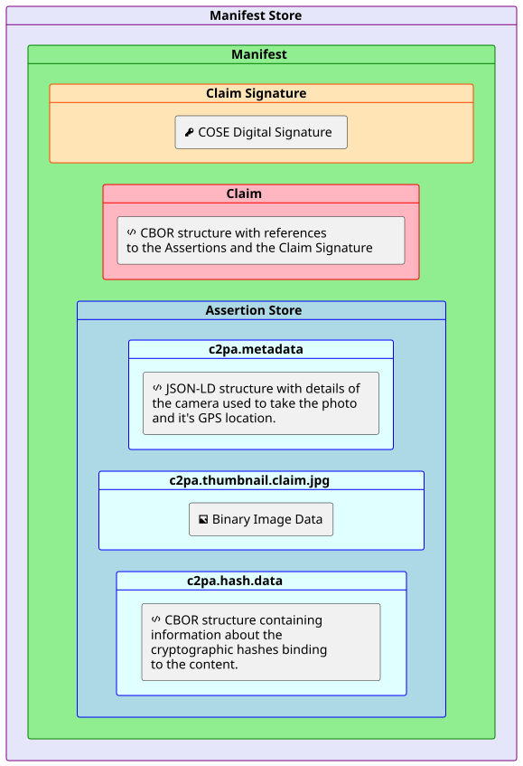
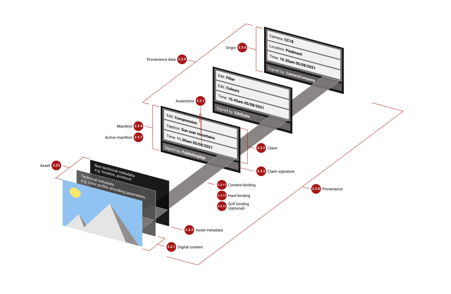
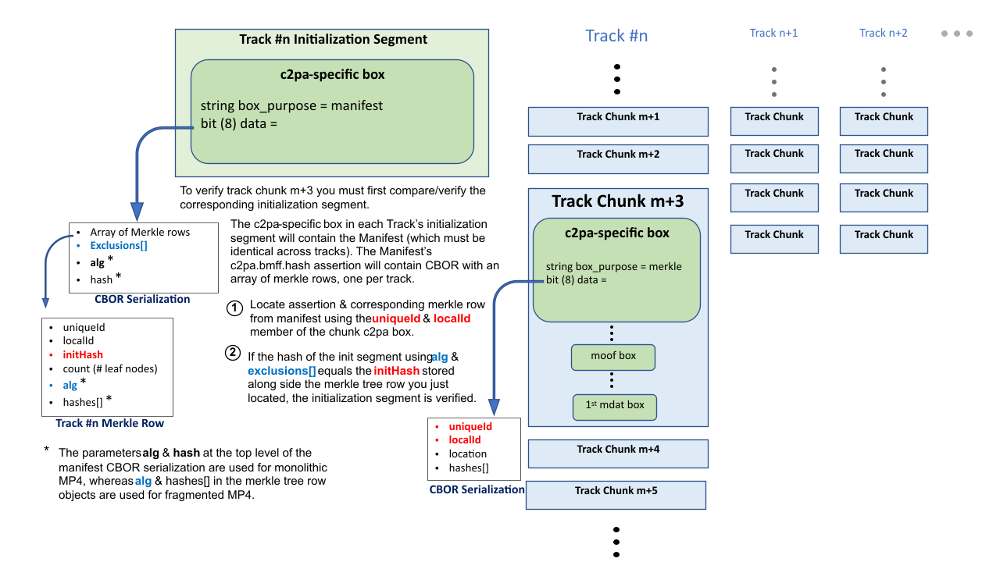
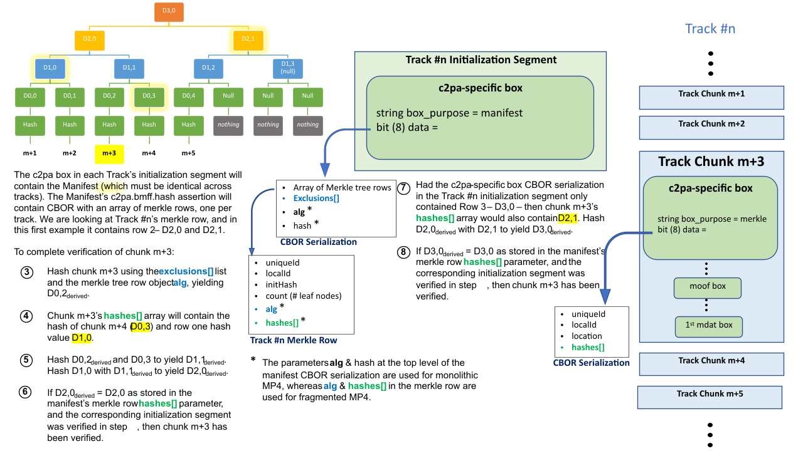
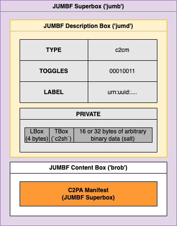
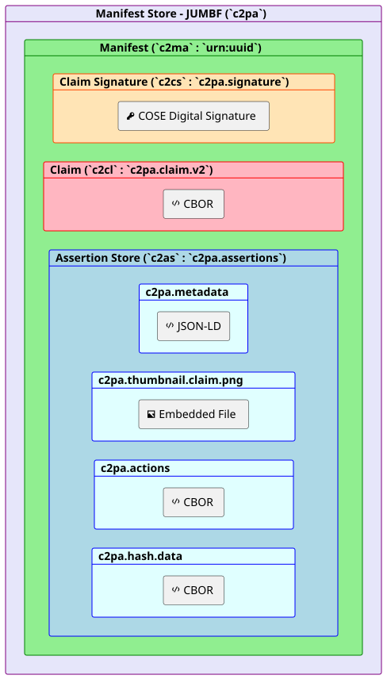
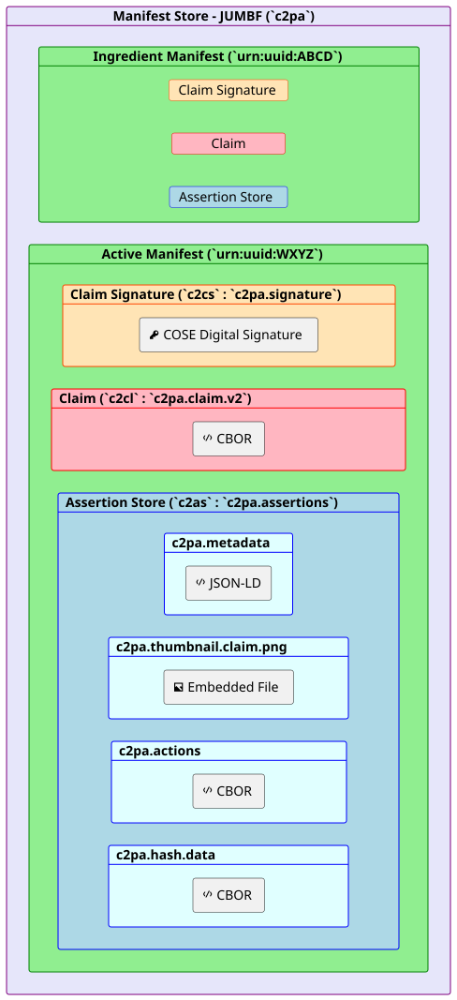
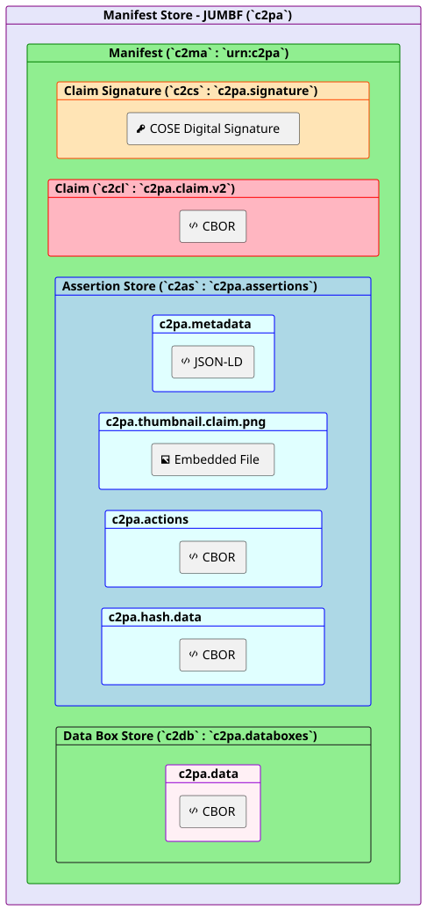
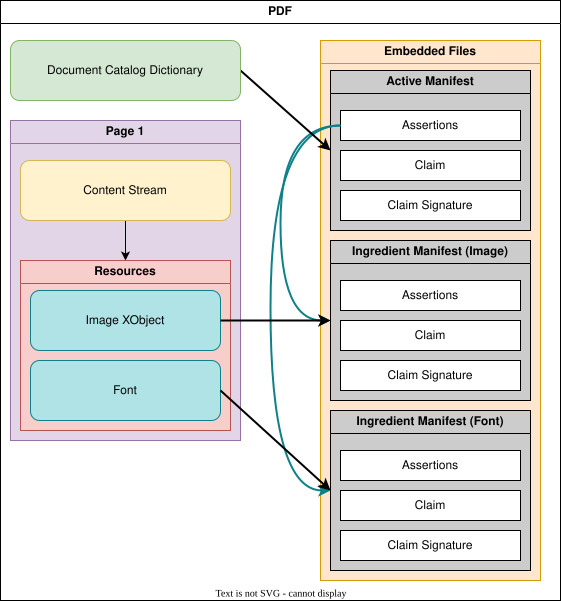
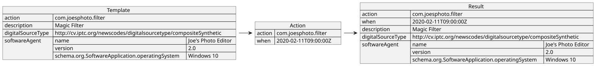

# Content Credentials : C2PA Technical Specification

[](http://creativecommons.org/licenses/by/4.0/)

This work is licensed under a [Creative Commons Attribution 4.0 International License](http://creativecommons.org/licenses/by/4.0/).

* * *

THESE MATERIALS ARE PROVIDED “AS IS.” The parties expressly disclaim any warranties (express, implied, or otherwise), including implied warranties of merchantability, non-infringement, fitness for a particular purpose, or title, related to the materials. The entire risk as to implementing or otherwise using the materials is assumed by the implementer and user. IN NO EVENT WILL THE PARTIES BE LIABLE TO ANY OTHER PARTY FOR LOST PROFITS OR ANY FORM OF INDIRECT, SPECIAL, INCIDENTAL, OR CONSEQUENTIAL DAMAGES OF ANY CHARACTER FROM ANY CAUSES OF ACTION OF ANY KIND WITH RESPECT TO THIS DELIVERABLE OR ITS GOVERNING AGREEMENT, WHETHER BASED ON BREACH OF CONTRACT, TORT (INCLUDING NEGLIGENCE), OR OTHERWISE, AND WHETHER OR NOT THE OTHER MEMBER HAS BEEN ADVISED OF THE POSSIBILITY OF SUCH DAMAGE.

<a id="_introduction"></a>
## 1\. Introduction

<a id="_overview"></a>
### 1.1. Overview

With the increasing velocity of digital content and the increasing availability of powerful creation and editing techniques, establishing the provenance of media is critical to ensure transparency, understanding, and ultimately, trust.

We are witnessing extraordinary challenges to trust in media. As social platforms amplify the reach and influence of certain content via ever more complex and opaque algorithms, mis-attributed and mis-contextualized content spreads quickly. Whether inadvertent misinformation or deliberate deception via disinformation, inauthentic content is on the rise.

Currently, those who wish to include metadata about their work cannot do so in a secure, tamper-evident and standardized way across platforms. Without this information coming from a recognized source, publishers and consumers lack critical context for determining the authenticity of media.

Provenance empowers content creators and editors, regardless of their geographic location or degree of access to technology, to disclose information about how an asset was created, how it was changed and what was changed. Each time an asset is changed, the existing provenance of the asset is preserved, with each new change being added to the provenance. In this way, content with provenance provides indicators of authenticity so that consumers can have awareness of altered content. Such provenance could include what has been changed and the source of those changes. This ability to provide provenance for creators, publishers and consumers is essential to facilitating trust online.

To address this issue at scale for publishers, creators and consumers, the Coalition for Content Provenance and Authenticity (C2PA) has developed this technical specification for providing content provenance and authenticity. It is designed to enable global, opt-in, adoption of digital provenance techniques through the creation of a rich ecosystem of digital provenance enabled applications for a wide range of individuals and organizations while meeting appropriate security requirements.

This specification has been, and continues to be, informed by scenarios, workflows and requirements gathered from industry experts and partner organizations, including the [Project Origin Alliance](https://www.originproject.info/) and the [Content Authenticity Initiative (CAI)](https://contentauthenticity.org/). It is also possible that regulatory bodies and governmental agencies could utilize this specification to establish standards for digital provenance.

<a id="_scope"></a>
### 1.2. Scope

This specification describes the technical aspects of the C2PA architecture; a model for storing and accessing cryptographically verifiable information whose trustworthiness can be assessed based on a defined [trust model](#_trust_model). Included in this document is information about how to create and process a C2PA Manifest and its components, including the use of digital signature technology for enabling tamper-evidence as well as establishing trust.

Prior to developing this specification, the C2PA created our [Guiding Principles](https://c2pa.org/principles/) that enabled us to remain focused on ensuring that the specification can be used in ways that respect privacy and personal control of data with a critical eye toward potential abuse and misuse. For example, the creators and publishers of the media assets always have control over whether provenance data is included as well as what specific pieces of data are included.

> **IMPORTANT:**
> From the overarching goals section of the guiding principles:
>
> > C2PA specifications SHOULD NOT provide value judgments about whether a given set of provenance data is 'good' or 'bad,' merely whether the assertions included within can be validated as associated with the underlying asset, correctly formed, and free from tampering.

It is important that the specification does not negatively impact content accessibility for consumers.

Other documents from the C2PA will address specific implementation considerations such as expected user experiences and details of our threat and harms modelling.

<a id="_technical_overview"></a>
### 1.3. Technical Overview

The C2PA information comprises a series of statements that cover areas such as asset creation, edit actions, capture device details, bindings to content and many other subjects. These statements, called [assertions](#_assertion), make up the provenance of a given asset and represent a series of trust signals that can be used by a human to improve their view of trustworthiness concerning the asset. Assertions are wrapped up with additional information into a [digitally signed](#_digital_signatures) entity called a [claim](#_claim). This claim is digitally signed by the [signer](#signer-definition), producing the [claim signature](#_claim_signature).

These assertions, claims, and the claim signature are all bound together into a verifiable unit called a [C2PA Manifest](#_c2pa_manifest) by a hardware or software component called a [claim generator](#claim-generator-definition). The set of C2PA Manifests, as stored in the asset’s Content Credential, represent its provenance data.


Figure 1. A C2PA Manifest and its constituent parts

<a id="_establishing_trust"></a>
### 1.4. Establishing Trust

The basis of making trust decisions in C2PA, our [trust model](#_trust_model), is the identity of the signer associated with the cryptographic signing key used to sign the claim in the Active Manifest. C2PA Manifests can be validated indefinitely regardless of whether the cryptographic credentials used to sign its contents are later expired or revoked.

<a id="_an_example"></a>
### 1.5. An Example

A very common scenario will be a user taking a photograph with their C2PA-enabled camera (or phone). In that instance, the camera would create a manifest containing some such assertions including information about the camera itself, a thumbnail of the image and some cryptographic hashes that bind the photograph to the manifest. These assertions would then be listed in the Claim, which would be digitally signed and then the entire C2PA Manifest would be embedded into the output JPEG. This C2PA Manifest would remain valid indefinitely.



Figure 2. Example C2PA Manifest of a Photograph

A Manifest Consumer, such as a C2PA Validator, could help users to establish the trustworthiness of the asset by first validating the digital signature and its associated credential. It can also check each of the assertions for validity and present the information contained in them, and the signature, to the user in a way that they can then make an informed decision about the trustworthiness of the digital content.

<a id="_design_goals"></a>
### 1.6. Design Goals

In the creation of the C2PA architecture, it was important to establish some clear goals for the work to ensure that the technology was usable across a wide spectrum of hardware and software implementations worldwide and accessible to all.

| Goal | Description |
| --- | --- |
| Privacy | Enable users to control the privacy of their information, including consumption data and information recorded in provenance |
| Responsibility | Ensure consumers can determine the provenance of an asset |
| Scalability | Enable creation/consumption/validation of media provenance at the same scale as media creation/consumption on the web |
| Extensibility | Ensure future metadata and credential providers are able to add their information without requiring input or approval from the C2PA |
| Interoperability | Ensure that differing implementations are able to operate with each other without ambiguity |
| Whole Workflow Applicability | Maintain the provenance of the asset across multiple tools, from creation through all subsequent modification and publication/distribution |
| Technology Minimalism | Create only the minimum required novel technology in the specification by relying on prior, well-established techniques |
| Security | Design to ensure that consumers can trust the integrity and source of provenance, and ensure the design is reviewed by experts |
| Content Ubiquity | Enable the inclusion of provenance for all common media types, including documents |
| Flexible Locality | Enable both online and offline (asset-only) storage and consumption/validation of provenance |
| Global Universality | Design for the needs of interested users throughout the world |
| Accessibility | Ensure that the technology can be used in a way that conform to recognized accessibility standards, such as WCAG |
| Harms and Misuse | Design to avert and mitigate potential harms, including threats to human rights and disproportionate risks to vulnerable groups |
| Evolving | Continuous review of the specification against these goals to ensure that they remain our priority |

<a id="_glossary"></a>
## 2\. Glossary

<a id="_introductory_terms"></a>
### 2.1. Introductory terms

<a id="_actor"></a>
#### 2.1.1. Actor

A human or non-human (hardware or software) that is participating in the C2PA ecosystem. For example: a camera (capture device), image editing software, cloud service or the person using such tools.

> **NOTE:**
> An organization or group of [actors](#_actor) may also be considered an [actor](#_actor) in the C2PA ecosystem.

<a id="claim-generator-definition"></a>
#### 2.1.2. Claim generator

The non-human (hardware or software) [actor](#_actor) that generates the [claim](#_claim) about an [asset](#_asset) as well as the [claim signature](#_claim_signature), thus leading to the [asset](#_asset)'s associated [C2PA Manifest](#_c2pa_manifest).

<a id="signer-definition"></a>
#### 2.1.3. Signer

The credential holder of a private key that is used to sign the [claim](#_claim). The [signer](#_signer) is identified by the subject of the credential.

<a id="_manifest_consumer"></a>
#### 2.1.4. Manifest consumer

An [actor](#_actor) who consumes an [asset](#_asset) with an associated [C2PA Manifest](#_c2pa_manifest) for the purpose of obtaining the [provenance data](#_provenance_data) from the [C2PA Manifest](#_c2pa_manifest).

<a id="_validator"></a>
#### 2.1.5. Validator

A [Manifest Consumer](#_manifest_consumer) whose role is to perform the actions described in [validation](#_validation).

<a id="_action"></a>
#### 2.1.6. Action

An operation performed by an [actor](#_actor) on an [asset](#_asset). For example, "create", "embed", or "apply filter".

<a id="_assets_and_content"></a>
### 2.2. Assets and Content

<a id="_digital_content"></a>
#### 2.2.1. Digital content

The portion of an [asset](#_asset) that represents the actual content, such as the pixels of an image, along with any additional technical metadata required to understand the content (e.g., a colour profile or encoding parameters).

<a id="_asset_metadata"></a>
#### 2.2.2. Asset metadata

Non-technical information about the [asset](#_asset) and its [digital content](#_digital_content).

<a id="_asset"></a>
#### 2.2.3. Asset

A file or stream of data containing [digital content](#_digital_content), [asset metadata](#_asset_metadata) and optionally, a [C2PA Manifest](#_c2pa_manifest).

> **NOTE:**
> For the purposes of this definition, we will extend the typical definition of "file" to include cloud-native and dynamically generated data.

<a id="_derived_asset"></a>
#### 2.2.4. Derived asset

A [derived asset](#_derived_asset) is an [asset](#_asset) that is created by starting from an existing [asset](#_asset) and performing [actions](#_action) to it that modify its [digital content](#_digital_content).

**EXAMPLE:** An audio stream that has been shortened or a document where pages have been added.

<a id="_asset_rendition"></a>
#### 2.2.5. Asset rendition

A representation of an [asset](#_asset) (either as a part of an [asset](#_asset) or a completely new [asset](#_asset)) where the [digital content](#_digital_content) has had a 'non-editorial transformation' [action](#_action) (e.g., re-encoding or scaling) applied.

**EXAMPLE:** A video file that is re-encoded for reduced screen resolution or network bandwidth.

<a id="_composed_asset"></a>
#### 2.2.6. Composed asset

A composed asset is an [asset](#_asset) that is created by building up a collection of multiple parts or fragments of [digital content](#_digital_content) (referred to as [ingredients](#_ingredient)) from one or more other [assets](#_asset). When starting from an existing [asset](#_asset), it is a special case of a [derived asset](#_derived_asset) - however a [composed asset](#_derived_asset) can also be one that starts from a "blank slate".

**EXAMPLES:**

*   A video created by importing existing video clips and audio segments into a "blank slate".
    
*   An image where another image is imported and super-imposed on top of the starting image.
    

<a id="_core_aspects_of_c2pa"></a>
### 2.3. Core Aspects of C2PA

<a id="_assertion"></a>
#### 2.3.1. Assertion

A data structure which represents a statement either made (or "created") by the [signer](#signer-definition) or simply gathered at claim generation-time, concerning the [asset](#_asset). This data is a part of the [C2PA Manifest](#_c2pa_manifest).

<a id="_claim"></a>
#### 2.3.2. Claim

A digitally signed and tamper-evident data structure that references a set of [assertions](#_assertion), concerning an [asset](#_asset), and the information necessary to represent the [content binding](#_content_binding). If any [assertions](#_assertion) were redacted, then a declaration to that effect is included. This data is a part of the [C2PA Manifest](#_c2pa_manifest).

<a id="claim-signature-definition"></a>
#### 2.3.3. Claim signature

The digital signature on the [claim](#_claim) using the private key of a [signer](#signer-definition). The [claim signature](#_claim_signature) is a part of the [C2PA Manifest](#_c2pa_manifest).

<a id="_c2pa_manifest"></a>
#### 2.3.4. C2PA Manifest

The set of information about the _provenance_ of an [asset](#_asset) based on the combination of one or more [assertions](#_assertion) (including [content bindings](#_binding_to_content)), a single [claim](#_claim), and a [claim signature](#_claim_signature). A [C2PA Manifest](#_c2pa_manifest) is part of a [C2PA Manifest Store](#_c2pa_manifest_store).

> **NOTE:**
> A [C2PA Manifest](#_c2pa_manifest) can reference other [C2PA Manifests](#_c2pa_manifest).

<a id="_c2pa_manifest_store"></a>
#### 2.3.5. C2PA Manifest Store

A collection of [C2PA Manifests](#_c2pa_manifest) that can either be embedded into an [asset](#_asset) or be external to its [asset](#_asset).

<a id="_content_credential"></a>
#### 2.3.6. Content Credential

This is the preferred, non-technical, term for a [C2PA Manifest](#_c2pa_manifest). The [C2PA Manifest Store](#_c2pa_manifest_store) therefore represents the Content Credentials of an asset.

Content Credentials also refers to the overall C2PA technology, and is therefore essentially treated as a plural noun. If a [C2PA Manifest](#_c2pa_manifest) is a Content Credential, then multiple [C2PA Manifest](#_c2pa_manifest) or the broader, universal concept is Content Credentials.

<a id="_active_manifest"></a>
#### 2.3.7. Active Manifest

The last manifest in the list of [C2PA Manifests](#_c2pa_manifest) inside of a [C2PA Manifest Store](#_c2pa_manifest_store) which is the one with the set of [content bindings](#_content_bindings) that are able to be validated.

<a id="_provenance"></a>
#### 2.3.8. Provenance

The logical concept of understanding the history of an [asset](#_asset) and its interaction with [actors](#_actor) and other [assets](#_asset), as represented by the [provenance data](#_provenance_data).

<a id="_provenance_data"></a>
#### 2.3.9. Provenance data

The set of [C2PA Manifests](#_c2pa_manifest) for an [asset](#_asset) and, in the case of a [composed asset](#_composed_asset), its [ingredients](#_ingredient).

> **NOTE:**
> A [C2PA Manifest](#_c2pa_manifest) can reference other [C2PA Manifests](#_c2pa_manifest).

<a id="_authenticity"></a>
#### 2.3.10. Authenticity

A property of [digital content](#_digital_content) comprising a set of facts (such as the [provenance data](#_provenance_data) and [hard bindings](#_hard_binding)) that can be cryptographically verified as not having been tampered with.

<a id="_content_binding"></a>
#### 2.3.11. Content binding

Information that associates [digital content](#_digital_content) to a specific [C2PA Manifest](#_c2pa_manifest) associated with a specific [asset](#_asset), either as a [hard binding](#_hard_binding) or a [soft binding](#_soft_binding).

<a id="_hard_binding"></a>
#### 2.3.12. Hard binding

One or more cryptographic hashes that uniquely identifies either the entire [asset](#_asset) or a portion thereof.

<a id="_soft_binding"></a>
#### 2.3.13. Soft binding

A content identifier that is either (a) not statistically unique, such as a [fingerprint](#_fingerprint), or (b) embedded as an [invisible watermark](#_invisible_watermark) in the identified [digital content](#_digital_content).

<a id="_trust_signals"></a>
#### 2.3.14. Trust signals

The collection of information that can inform a [Manifest Consumer’s](#_manifest_consumer) judgment of the trustworthiness of an [asset](#_asset). These are in addition to the [signer](#signer-definition) of a [claim](#_claim), upon which the fundamental trust model relies.

<a id="_c2pa_trust_list"></a>
#### 2.3.15. C2PA Trust List

A C2PA-managed list of X.509 certificate trust anchors that issue certificates to hardware & software [signers](#signer-definition) that are trusted to sign [claims](#_claim).

<a id="_additional_terms"></a>
### 2.4. Additional Terms

<a id="_fingerprint"></a>
#### 2.4.1. Fingerprint

A set of inherent properties computable from [digital content](#_digital_content) that identifies the content or near duplicates of it.

**EXAMPLE:** An [asset](#_asset) can become separated from its [C2PA Manifest](#_c2pa_manifest) due to removal or corruption of [asset](#_asset) metadata. A [fingerprint](#_fingerprint) of the [digital content](#_digital_content) of the [asset](#_asset) could be used to search a database to recover the [asset](#_asset) with an intact [C2PA Manifest](#_c2pa_manifest).

<a id="_invisible_watermark"></a>
#### 2.4.2. Invisible Watermark

Information incorporated in a substantially human imperceptible way into the [digital content](#_digital_content) of an [asset](#_asset) which can be used, for example, to uniquely identify the [asset](#_asset) or to store a reference to a [C2PA Manifest](#_c2pa_manifest).

<a id="_visible_watermark"></a>
#### 2.4.3. Visible Watermark

A perceptible component of the [digital content](#_digital_content) carrying some human consumable information about the provenance of the [asset](#_asset).

<a id="_manifest_repository"></a>
#### 2.4.4. Manifest Repository

A repository into which [C2PA Manifests](#_c2pa_manifest) and [C2PA Manifest Stores](#_c2pa_manifest_stores) can be placed, and which can be searched using a [content binding](#_content_binding).

<a id="_overview_2"></a>
### 2.5. Overview

This image shows how all these various elements come together to represent the C2PA architecture.



Figure 3. Elements of C2PA

<a id="_normative_references"></a>
## 3\. Normative References

<a id="_core_formats"></a>
### 3.1. Core Formats

*   [CBOR](https://tools.ietf.org/html/rfc8949)
    
*   [JSON](https://tools.ietf.org/html/rfc8259)
    
*   [JSON-LD](https://www.w3.org/TR/json-ld11/)
    
*   [JPEG universal metadata box format](https://www.iso.org/standard/73604.html) (JUMBF)
    

<a id="_schemas"></a>
### 3.2. Schemas

*   [CDDL](https://datatracker.ietf.org/doc/html/rfc8610)
    
*   [JSON Schema](https://json-schema.org/specification-links.html#2020-12)
    
*   [Dublin Core Metadata Initiative](https://www.dublincore.org/specifications/dublin-core/dces/)
    

<a id="_digital_electronic_signatures"></a>
### 3.3. Digital & Electronic Signatures

*   [X.509 Certificates](https://tools.ietf.org/html/rfc5280)
    
*   [JSON Web Algorithms](https://tools.ietf.org/html/rfc7518) (JWA)
    
*   [CBOR Object Signing and Encryption](https://tools.ietf.org/html/rfc8152) (COSE)
    
*   [Using RSA Algorithms with COSE Messages](https://tools.ietf.org/html/rfc8230)
    
*   [Online Certificate Status Protocol](https://tools.ietf.org/html/rfc6960) (OCSP)
    
*   [Internet X.509 PKI Time-Stamp Protocol](https://tools.ietf.org/html/rfc3161)
    
*   [CBOR Object Signing and Encryption (COSE): Header Parameters for Carrying and Referencing X.509 Certificates](https://datatracker.ietf.org/doc/html/rfc9360)
    
*   [Algorithms and Identifiers for the Internet X.509 Public Key Infrastructure Certificate and Certificate Revocation List (CRL) Profile](https://tools.ietf.org/html/rfc3279)
    
*   [Internet X.509 Public Key Infrastructure: Additional Algorithms and Identifiers for DSA and ECDSA](https://tools.ietf.org/html/rfc5758)
    
*   [Algorithm Identifiers for Ed25519, Ed448, X25519, and X448 for Use in the Internet X.509 Public Key Infrastructure](https://tools.ietf.org/html/rfc8410)
    
*   [PKCS #1: RSA Cryptography Specifications Version 2.2](https://tools.ietf.org/html/rfc8017)
    
*   [Edwards-Curve Digital Signature Algorithm (EdDSA)](https://tools.ietf.org/html/rfc8032)
    
*   [JSON Advanced Electronic Signatures](https://www.etsi.org/deliver/etsi_ts/119100_119199/11918201/01.01.01_60/ts_11918201v010101p.pdf) (JAdES)
    
*   [US Secure Hash Algorithms](https://datatracker.ietf.org/doc/html/rfc6234)
    
*   [X.509 Certificate General-Purpose Extended Key Usage (EKU) for Document Signing](https://www.rfc-editor.org/rfc/rfc9336)
    
*   [RFC 6170](https://www.rfc-editor.org/rfc/rfc6170.html)
    

<a id="_embeddable_formats"></a>
### 3.4. Embeddable Formats

*   [ISO Base Media File Format](https://www.iso.org/standard/74428.html) (BMFF)
    
*   [PDF 1.7](https://www.iso.org/standard/51502.html)
    
*   [PDF 2.0](https://www.iso.org/standard/75839.html)
    
*   [JPEG 1](https://www.iso.org/standard/18902.html)
    
*   [JPEG XT, ISO/IEC 18477-3](https://www.iso.org/standard/66071.html)
    
*   [PNG](https://www.w3.org/TR/2003/REC-PNG-20031110/)
    
*   [SVG](https://www.w3.org/TR/SVG11/)
    
*   [GIF](https://www.w3.org/Graphics/GIF/spec-gif89a.txt)
    
*   [ID3](https://id3.org/id3v2.3.0)
    
*   [Digital Negative or DNG](https://helpx.adobe.com/content/dam/help/en/photoshop/pdf/dng_spec_1_6_0_0.pdf)
    
*   [TIFF/EP](https://www.iso.org/standard/29377.html)
    
*   [TIFF v6](https://www.itu.int/itudoc/itu-t/com16/tiff-fx/docs/tiff6.pdf))
    
*   [RIFF](https://www.loc.gov/preservation/digital/formats/fdd/fdd000025.shtml)
    
*   [Multi-Picture Format (MPF)](https://www.cipa.jp/e/std/std-sec.html)
    
*   [Open Font Format](https://www.iso.org/standard/74461.html)
    
*   [OpenType](https://learn.microsoft.com/en-us/typography/opentype/spec/)
    

<a id="_other"></a>
### 3.5. Other

*   [eXtensible Metadata Platform](https://www.iso.org/standard/75163.html) (XMP)
    
*   [JSON-LD serialization of XMP](https://www.iso.org/standard/79384.html)
    
*   [IPTC Photo Metadata Standard](http://www.iptc.org/std/photometadata/specification/IPTC-PhotoMetadata)
    
*   [Exif](https://www.cipa.jp/std/documents/download_e.html?DC-008-Translation-2019-E)
    
*   [UUID](https://tools.ietf.org/html/rfc4122)
    
*   [ISO 8601](https://www.iso.org/iso-8601-date-and-time-format.html)
    
*   [RFC 2326](https://www.ietf.org/rfc/rfc2326.txt)
    
*   [Media Fragments](https://www.w3.org/TR/media-frags/)
    
*   [Web Annotation Data Model](https://www.w3.org/TR/annotation-model/)
    
*   [Brotli Compressed Data Format](https://datatracker.ietf.org/doc/html/rfc7932)
    

<a id="_standard_terms"></a>
## 4\. Standard Terms

The key words "MUST", "MUST NOT", "REQUIRED", "SHALL", "SHALL NOT", "SHOULD", "SHOULD NOT", "RECOMMENDED", "NOT RECOMMENDED", "MAY", and "OPTIONAL" in this document are to be interpreted as described in [BCP 14](https://tools.ietf.org/html/bcp14), [RFC 2119](https://tools.ietf.org/html/rfc2119), and [RFC 8174](https://tools.ietf.org/html/rfc8174) when they appear in any casing (upper, lower or mixed).

<a id="_version_history"></a>
## 5\. Version History

2.0 - January 2024

This version represents a significant departure from previous versions. It no longer has any references to actors as humans or organizations, they can only be hardware or software entities. This philosophical change led to the following functional changes in the specification:

*   Only X.509 certificates may be used for signing.
    
*   Improvements to the Validation & Trust Model sections
    
    *   Introduces the concepts of "well-formed" and "valid" C2PA Manifests
        
    *   Clarifies various aspects of the validation process
        
    
*   Refined metadata handling
    
    *   removed the deprecated Exif, IPTC and Schema.org metadata assertions
        
    *   defined a new general "metadata assertion" concept
        
    *   `c2pa.metadata` only allows a fixed set of schemas & values
        
    *   the process for creating `c2pa.metadata` is now documented in more detail
        
    *   XMP processing sections have been revamped to reflect relevant changes
        
    *   improved recommendations concerning hashing of standard metadata locations outside the manifest
        
    
*   Removed the "W3C Verifiable Credentials" section
    
    *   Removed any references to it and the VC Store.
        
    *   Removed the `actors` field from the actions assertion
        
    *   Removed identified humans from assertion metadata
        
    
*   Removed the "Training & Data Mining" assertion
    
*   Removed the "Endorsements" assertion
    

In addition, the following other changes were made to improve various aspects of the spec:

*   Version v2 version of the claim.
    
    *   Removes deprecated and unused fields
        
    *   Split `assertions` into `created_assertions` & `gathered_assertions`
        
    *   Only allows a single claim generator, which must be the signer
        
    *   More tightly connects it to the signing certificate
        
    *   `claim-generator-info` now has a specific `operating_system` field
        
    
*   Box-based hashing is now strongly recommended for any format that supports it
    
*   Removed the deprecated `c2pa.hash.bmff` assertion
    
*   Added a new `c2pa.watermarked` action
    
*   `c2pa.font` actions are now just `font` actions
    
    *   also `c2pa.font.info` is now just `font.info`
        
    
*   Cleaned up rendering of CDDL schemas
    
*   Updated some normative references & removed notes about future versions
    
*   Lots of editorial improvements including fixed links
    

1.4 - November 2023

*   Added support for embedding a C2PA Manifest into a ZIP-based format (e.g., EPUB, OOXML, ODF, OpenXPS)
    
*   Manifests can now be compressed into a special `brob` box.
    
*   Added support for multiple file, aka collection, hashing
    
*   Added new regions of interest for text-based formats (e.g., PDF, Office, EPUB, etc.)
    
*   Added new `c2pa.metadata` assertion to support Exif, IPTC, Schema.org and XMP
    
*   Major revision to TIFF embedding support
    
*   Added support for embedding C2PA Manifests inside of OpenType and TrueType fonts
    
*   Introduced support for object-level manifests in PDF
    
*   Extended the Link header support for embedded manifests
    
*   Clarified issues with box hashing
    
*   Clarified issues on signing including time stamping, PKIStatus & document signing EKU
    
*   Align with Exif 3.0
    
*   Improvements to the CDDL schemas
    
*   Many editorial improvements
    

1.3 - April 2023

*   New v2 version of the actions assertion with support for many new options
    
*   New v2 version of the ingredient assertion with support for embedded data
    
*   New asset reference & asset type assertions
    
*   New data boxes, for storing arbitrary data inside the Manifest
    
*   New generic box hash methodology for a more inclusive byte range hashing
    
*   New "Regions of Interest" data structures that can be applied to various assertions
    
*   Added document signing EKU as an alternative default EKU for C2PA signers when a validator is not configured with an EKU list
    
*   Added a new `digitalSourceType` field for use by C2PA
    
*   Added support for many new formats: MPF, WebP, AIFF, AVI, GIF
    
*   Updated Entity diagram to reflect additions since 1.0
    
*   Updated COSE header definition for X.509 certificates to RFC 9360
    
*   Updated the guidance on PDF embedding and its relationship to PDF signatures
    
*   Updated information about JUMBF hashing and JUMBF box toggles
    
*   Deprecated v1 of the BMFF Hash
    
*   Clarified use of the JUMBF Protection Box in a C2PA Manifest
    
*   Clarified C2PA-specific requirement that all intermediate X.509 certificates be included in COSE signatures
    
*   Clarified that time-stamps are valid indefinitely
    
*   LOTS of editorial improvements!!
    

1.2 - October 2022

*   Added details about how to embed a C2PA Manifest in DNG or TIFF
    
*   Added new `digitalSourceType` field to Actions
    
*   Changed `stds.iptc.photometadata` → `stds.iptc` to support IPTC video metadata
    
*   Clarified versioning of assertions when adding optional fields
    

1.1 - September 2022

*   Define a mechanism to support salting box hashing
    
*   New `c2pa.hash.bmff.v2` assertion, with changes to hashing model, to improve security
    
*   Enable assertion metadata for the Claim
    
*   Replaced `claim_generator_hints` with `claim_generator_info`
    
*   Added a new assertion to support the concept of Endorsements
    
*   Improvements to the `c2pa.actions` assertion
    
*   All Error & Status Codes are now prefixed with `c2pa`
    
*   Define mechanism for redaction of W3C VC’s
    
*   Clarify validation of EKUs in certificates
    
*   Validation algorithm revised to reflect technical changes
    
*   Corrections to the CDDL and JSON schemas to match normative text
    
*   Revise figures to reflect changes
    
*   Various Editorial and Typographical Corrections
    
*   Update Normative References (incl. JUMBF & W3C VC Data Model)
    

1.0 - December 2021

*   Initial Release
    

<a id="_assertions"></a>
## 6\. Assertions

<a id="_general"></a>
### 6.1. General

It is expected that each claim generator, used by actors in the system that creates or processes an asset, will create or assemble one or more assertions about when, where, and how the asset was originated or transformed. An assertion is labelled data, typically (though not required to be) in a CBOR-based structure which represents a declaration about an asset. Some of these assertions will contain human-generated information (e.g., alternate text for accessibility) while others will come from machines (software/hardware) providing the information they generated (e.g., camera type).

Some examples of assertions are:

*   Metadata (e.g. camera information such as maker or lens)
    
*   Actions performed on the asset (e.g., clipping, color correction)
    
*   Thumbnail of the asset or its ingredients
    
*   Content bindings (e.g., cryptographic hashes)
    

Certain assertions may be redacted by subsequent claims (see [Section 6.7, “Redaction of Assertions”](#_redaction_of_assertions)), but they cannot be modified once made as part of a claim.

<a id="_labels"></a>
### 6.2. Labels

Each assertion has a label defined either by the C2PA specifications or an external entity.

Labels are string values organized into namespaces using a period (`.`) as a separator. The namespace component of the label can be an entity, or a reference to a well-established standard (see ABNF below). The most common labels will be defined by the C2PA and will begin with `c2pa.`. Entity-specific labels shall begin with the Internet domain name for the entity similar to how Java packages are defined (e.g., `com.litware`, `net.fineartschool`). They are also versioned with a simple incrementing integer scheme (e.g., `c2pa.actions.v2`). If no version is provided, it is considered as `v1`. The list of publicly known labels can be found in [Chapter 18, _C2PA Standard Assertions_](#_c2pa_standard_assertions).

```abnf
namespaced-label = qualified-namespace label
qualified-namespace = entity / ( "stds."  std-name )
entity = 1*( DIGIT / ALPHA / "-" )
std-name = 1*( DIGIT / ALPHA / "-" )
label = 1*("." 1(ALPHA / "_" ) *( DIGIT / ALPHA / "_" ) )
```

The period-separated components of a label follow the variable naming convention (`[a-zA-Z_][a-zA-Z0-9_]*`) specified in the POSIX or C locale, with the restriction that the use of a repeated underscore character (`__`) is reserved for labelling multiple assertions of the same type.

<a id="_versioning"></a>
### 6.3. Versioning

When an assertion’s schema is changed, it should be done in a backwards-compatible manner. This means that new fields may be added and existing ones may be marked as deprecated (i.e., can be read, but never written). Existing fields shall not be removed. The label would then consist of an incremented version number, for example moving from `c2pa.hash.bmff` (deprecated) to `c2pa.hash.bmff.v2`.

Since the addition of optional fields can be done while maintaining backwards compatibility, such fields may be added to an existing assertion’s schema without a change to the version number.

> **IMPORTANT:**
> The schemas provided in this document, as well as the machine readable ones that can be downloaded from our website, should only be used for aids in understanding the syntax to be read or written. It is not necessary, nor it is recommended, for a Manifest Consumer to perform any form of schema validation when reading in assertions.

Deprecated fields for C2PA standard assertions shall be indicated in [Chapter 18, _C2PA Standard Assertions_](#_c2pa_standard_assertions). Claim generators shall not insert data into deprecated assertion fields when creating assertions.

In addition, there are situations where a non-backwards compatible change is required. In that case, instead of increasing the label’s version number, the assertion shall be given a new label. For example, `c2pa.ingredient` could be changed to the fictional `c2pa.component`.

<a id="_multiple_instances"></a>
### 6.4. Multiple Instances

Multiple assertions of the same type can occur in the same manifest, but since assertions are referenced by claims via their label, the assertion labels must be unique. This is accomplished by adding a double-underscore and a monotonically increasing index to the label. For example, if a manifest contains a single assertion of type `c2pa.metadata`, then the assertion label will be `c2pa.metadata`. If a manifest contains three assertions of this type, the labels will be `c2pa.metadata`, `c2pa.metadata__1` and `c2pa.metadata__2`.

When a label includes a version number, that version number is part of the label itself. As such, when there are multiple instances, the instance number continues to follow the label - e.g., `c2pa.ingredient.v2__2`.

<a id="_assertion_store"></a>
### 6.5. Assertion Store

The set of assertions referenced by a [claim](#_claims) in a manifest are collected together into a logical construct that is referred to as the _assertion store_. The assertions and assertion store shall be stored as described in [Section 11.1, “Use of JUMBF”](#_use_of_jumbf); in particular, the assertion store shall be located in the same C2PA Manifest box as the claim that refers to its assertions.

For each manifest, there is a single assertion store associated with it. However, as an asset may have multiple manifests associated with it, each one representing a specific series of assertions, there may be multiple assertion stores associated with an asset.

<a id="_embedded_vs_externally_stored_data"></a>
### 6.6. Embedded vs Externally-Stored Data

Some assertion data, due to its size or an infrequent need for it, may be externally hosted. Such data are not embedded in the assertion store, but instead are referenced by URI. This is accomplished through a cloud data assertion (see [Section 18.10, “Cloud Data”](#_cloud_data)). Unlike embedded assertion data, cloud data is not retrieved nor validated as part of manifest validation, and are only retrieved and validated when specifically needed by an application according to a different set of validation rules as described in [Section 15.7, “Validate the Assertions”](#_validate_the_assertions).

<a id="_redaction_of_assertions"></a>
### 6.7. Redaction of Assertions

Assertions that are present in an asset-embedded manifest may be removed from that asset’s manifest when the asset is [used as an ingredient](#_ingredient_storage). This process is called redaction.

Redaction involves removing either the entire assertion from the manifest’s assertion store or retaining the labelled assertion container but replacing its data with zeros (binary `\0` values). In addition, a record that something was removed must be added to the [claim](#_claims) in the form of a [URI reference](#_uri_references) to the redaction assertion in the `redacted_assertions` field of the claim. It is also strongly recommended that the claim generator should add a `c2pa.redaction` [action assertion](#_actions) with a `redacted` field as described in [Section 18.12.2, “Parameters”](#_parameters).

> **NOTE:**
> Because each assertion’s [URI reference](#_uri_references) includes the assertion label, it is also known what type of information (e.g., thumbnail, metadata, etc.) was removed. This enables both humans and machines to apply rules to determine if the removal was acceptable.

Unless the redaction of the assertion also requires modification to the digital content, an [update manifest](#_update_manifests) shall be used to document the redaction as it makes a statement about the non-changes to the content.

Claims generators shall not redact assertions with a label of `c2pa.actions` as this assertion type represents essential information in understanding the history of an asset.

<a id="_data_boxes"></a>
## 7\. Data Boxes

Data boxes provide a way to include arbitrary data into the C2PA Manifest that is referenced from an assertion, instead of embedding it directly into a field of the assertion as a binary string. These data boxes are placed in the [Data Box Store](#_data_storage) and each one will be a single CBOR Content Type box (`cbor`).

The data of a data box is provided directly as the value of the `data` field, which is a `bstr`, so any binary data can be provided. The type of the data shall be identified using the `dc:format` field, with a standard IANA media type.

> **NOTE:**
> [IANA structured suffixes](https://www.iana.org/assignments/media-type-structured-suffix/media-type-structured-suffix.xhtml), such as `+json` and `+zip`, are also supported as values of the `dc:format` field.

Sometimes, it may also be necessary to provide one or more [asset types](#_asset_type) as the value of the `data_types` field for more clarity on the format and usage of that data.

A data box shall have a label of `c2pa.data` and follows the [rules of assertion labels](#_multiple_instances) with respect to multiple instances.

<a id="_schema_and_example"></a>
### 7.1. Schema and Example

The schema for this type is defined by the `data-box-map` rule in the following [CDDL Definition](https://datatracker.ietf.org/doc/html/rfc8610):

```cddl
; box allowing for the storage of arbitrary data

data-box-map = {
  "dc:format": format-string, ; IANA media type of the data
  "data" : bstr, ; arbitrary text/binary data
  ? "data_types": [1* $asset-type-map],  ; additional information about the data's type
}
```

<a id="_unique_identifiers"></a>
## 8\. Unique Identifiers

Every asset that is referenced by the [claim](#_claims) shall be referenced via a unique identifier. In addition, these identifiers are used in various parts of a C2PA-enabled workflow, such as when identifying it as an [ingredient](#_ingredient) in a derived or composed asset.

<a id="_using_xmp_values"></a>
### 8.1. Using XMP values

When an asset contains embedded XMP which include values for `xmpMM:DocumentID` and/or `xmpMM:InstanceID` as defined in [XMP Specification Part 2, 2.2](https://github.com/adobe/xmp-docs/blob/master/XMPSpecifications/XMPSpecificationPart2.pdf), those values shall be included in a [metadata assertion](#_metadata) and should be used as identifiers for the asset.

<a id="_other_identifiers"></a>
### 8.2. Other Identifiers

Alternatively, instead of using the identifiers from XMP, a unique identifier for an asset could be a URI defined by standards such as [Decentralized Identifiers (DID)](https://www.w3.org/TR/did-core/), [Handle](http://www.handle.net/), or [DOI](https://www.doi.org/).

Another standard unique identifier for an asset could be the cryptographic hash of the asset. When this method is used, the hash shall be represented using a standard [RFC 4122 UUID](https://tools.ietf.org/html/rfc4122) following the recommendations at [https://datatracker.ietf.org/doc/html/draft-thiemann-hash-urn-01](https://datatracker.ietf.org/doc/html/draft-thiemann-hash-urn-01) .

> **NOTE:**
> EDITORS NOTE
>
> Other methods may be defined here as they are developed.

<a id="_uri_references"></a>
### 8.3. URI References

All references to information in the manifest, whether stored internally to the asset (i.e., embedded) or stored externally to the asset (e.g., in the cloud), shall be referenced via JUMBF URI references as defined in [ISO 19566-5, C.2](https://www.iso.org/standard/84635.html). These URIs shall be used either as part of a `hashed_uri` or `hashed_ext_uri` data structure.

When the reference is to a [compressed manifest](#_compressed_manifests), the JUMBF URI shall not contain anything about the `brob` box, but the URI to the manifest is treated as if the manifest was not compressed. This means that the URI would include the label of the `c2ma` or `c2um` box, but not the label of the `c2cm` box. In addition, the URI reference to a compressed manifest shall not include the label of the `brob` box - but only the label of the compressed manifest itself.

<a id="_hashed_uris"></a>
#### 8.3.1. Hashed URIs

<a id="_embedded"></a>
##### 8.3.1.1. Embedded

A `hashed_uri` is used when the URI is for something embedded in the same manifest store.

This specification provides an equivalent `hashed-uri-map` data structure for schemas defined using [CDDL](https://datatracker.ietf.org/doc/html/rfc8610):

```cddl
; The data structure used to store a reference to a URL within the same JUMBF and its hash. We use a socket/plug here to allow hashed-uri-map to be used in individual files without having the map defined in the same file
$hashed-uri-map /= {
  "url": url-regexp-type, ; JUMBF URI reference
  ? "alg": tstr .size (1..max-tstr-length), ; A string identifying the cryptographic hash algorithm used to compute all hashes in this claim, taken from the C2PA hash algorithm identifier list. If this field is absent, the hash algorithm is taken from an enclosing structure as defined by that structure. If both are present, the field in this structure is used. If no value is present in any of these places, this structure is invalid; there is no default.
  "hash": bstr, ;  byte string containing the hash value
}

; with CBOR Head (#) and tail ($) are introduced in regexp, so not needed explicitly
url-regexp-type  /= tstr .regexp "self#jumbf=[\\w\\d][\\w\\d\\.\/:-]+[\\w\\d]"
```

Because assertion stores shall be located in the same C2PA Manifest box as the claim that refers to them, only `self#jumbf` URIs are permitted. These `self#jumbf` URIs may be relative to the entire C2PA Manifest Store, in which case they shall start with a `/` (U+002F, Slash), or relative to the current C2PA Manifest. URIs shall not contain the sequence `..` (a pair of U+002E, Full Stop).

**EXAMPLES:**

*   `self#jumbf=/c2pa/urn:uuid:f095f30e-6cd5-4bf7-8c44-ce8420ca9fb7/c2pa.assertions/c2pa.thumbnail.claim.jpeg` is relative to the entire store (since it starts with `/`),
    
*   `self#jumbf=c2pa.assertions/c2pa.thumbnail.claim.jpeg` would be relative to the manifest of the box containing the URI.
    

<a id="_external"></a>
##### 8.3.1.2. External

When referring to a resource that exists externally to the manifest store, a `hashed-ext-uri-map` data structure is used. It is a variation on the `hashed-uri`, in that it references an external URI instead of a `self#jumbf`. The `hashed-ext-uri` data structure is defined by the `hashed-ext-uri-map` rule in the following CDDL:

```cddl
; The data structure used to store a reference to an external URL and its hash. 
; We use a socket/plug here to allow hashed-ext-uri-map to be used in individual files 
; without having the map defined in the same file
$hashed-ext-uri-map /= {
  "url": ext-url-regexp-type, ; http/https URI reference
  "alg": tstr .size (1..max-tstr-length), ; A string identifying the cryptographic hash algorithm used to compute the hash on this URI's data, taken from the C2PA hash algorithm identifier list. Unlike alg fields in other types, this field is mandatory here.
  "hash": bstr, ;  byte string containing the hash value
  ? "dc:format": format-string, ; IANA media type of the data
  ? "size": size-type, ; Number of bytes of data
  ? "data_types": [1* $asset-type-map],  ; additional information about the data's type
}

; with CBOR Head (#) and tail ($) are introduced in regexp, so not needed explicitly
ext-url-regexp-type  /= tstr .regexp "https?:\/\/[-a-zA-Z0-9@:%._\\+~#=]{2,256}\\.[a-z]{2,6}\\b[-a-zA-Z0-9@:%_\\+.~#?&//=]*"
```

> **NOTE:**
> In keeping with common practice, it is recommended that the `https` scheme be used to retrieve assertion data to protect the privacy of the data in transit, but `http` is also permitted because the data’s integrity is protected by the `hash` field and this privacy may not be required in all circumstances. Authors of manifests with external URIs should choose the scheme to suit their needs.

The optional `dc:format` field, when present, provides an alternative to the `Content-Type` field of the http(s) headers. If present, this field shall be used as the required format retrieved during any content negotiate/request. Sometimes, it may also be necessary to provide one or more [asset types](#_asset_type) as the value of the `data_types` field for more clarity on the format and usage of that data.

An optional `size` field is also provided to specify the size of the data to be retrieved. This may be useful to a Manifest Consumer as a hint as to whether to attempt downloading and/or for validation purposes, in addition to the hash.

<a id="_hashing_jumbf_boxes"></a>
##### 8.3.1.3. Hashing JUMBF Boxes

When creating a URI reference to an assertion (i.e., as part of constructing a [Claim](#_claims)) or other C2PA structure stored as a JUMBF box, the hash shall be performed over the contents of the structure’s JUMBF superbox, which includes both the JUMBF Description Box and all content boxes therein (but does not include the structure’s JUMBF superbox header).

> **NOTE:**
> More details on hashing can be found at [Section 11.3.4.2, “Hashing”](#_hashing).

As described in the latest version of JUMBF (ISO 19566-5:2023), a new `Private` field can be present as part of any JUMBF Description box. This C2PA specification defines the C2PA salt as a `Private` field whose value is a standard box consisting of:

*   a box length (LBox, as a 4-byte big-endian unsigned integer)
    
*   a box type (TBox, 4-byte big-endian unsigned integer, with a value of `c2sh` (for C2PA salt hash))
    
*   and payload data (consisting of randomly-generated binary data of either 16 or 32 bytes in length).
    


Figure 4. Example `c2pa.actions` assertion

<a id="_binding_to_content"></a>
## 9\. Binding to Content

<a id="_overview_3"></a>
### 9.1. Overview

A key aspect to the [standard C2PA manifest](#_standard_manifests) is the presence of one or more data structures, called content bindings, that can uniquely identify portions of the asset. There are two types of bindings that are supported by C2PA - hard bindings and soft bindings. A hard binding (also known as a cryptographic binding) enables the validator to ensure that (a) this manifest belongs with this asset and (b) that the asset has not been modified, by determining values that can match only this asset and no other, not even other assets derived from it or renditions produced from it. A soft binding is computed from the digital content of an asset, rather than its raw bits. A soft binding is useful for identifying derived assets and asset renditions.

A single manifest shall not contain more than one assertion defining a hard binding.

<a id="_hard_bindings"></a>
### 9.2. Hard Bindings

<a id="_hashing_using_byte_ranges"></a>
#### 9.2.1. Hashing using byte ranges

The simplest type of hard binding that can be used to detect tampering is a cryptographic hashing algorithm, as described in [Section 11.3.4.2, “Hashing”](#_hashing), over some or all of the bytes of an asset. This approach can be used on any type of asset, but should only be considered for formats that don’t support one of the forms of box-based hashing.

When using this form of hard binding, a [data hash assertion](#_data_hash) is used to define the range of bytes that are hashed (and those that are not). Because a data hash assertion defines a byte range, it is flexible enough to be usable whether the asset is a single binary or represented in multiple chunks or portions.

<a id="_hashing_using_a_general_box_hash"></a>
#### 9.2.2. Hashing using a general box hash

When an asset’s format is a non-BMFF-based box format, such as JPEG, PNG, GIF or others listed [here](#_handling_for_specific_formats), then a [general box hash](#_boxes_hash) assertion should be used. This assertion consists of an array of structures, each one listing one or more boxes (by their name/identifier) and a hash that covers that data of those boxes (and any possible data that may be present in the file between them), along with the algorithm used for [hashing](#_hashing).

<a id="_hashing_a_bmff_formatted_asset"></a>
#### 9.2.3. Hashing a BMFF-formatted asset

If the asset is based on [ISO BMFF](https://www.iso.org/standard/74428.html) then a hard binding optimized for the box-based format (called [BMFF-based hash assertions](#_bmff_based_hash)) may be used instead.

For a monolithic MP4 file asset where the `mdat` box is validated as a unit, the assertion is validated nearly identically to a data hash assertion. It simply uses a box exclusion list instead of byte ranges to define the range of bytes that are hashed (and those that are not).

For a monolithic MP4 file asset where the `mdat` box is validated piecemeal or an asset composed of fragmented MP4 (fMP4) files, the assertion itself must be combined with chunk-specific hashing information which is located as specified in [Section 11.3.3, “Embedding manifests into BMFF-based assets”](#_embedding_manifests_into_bmff_based_assets). Validating a given chunk requires first validating the `merkle` field’s `initHash` over the corresponding initialization segment and then locating the correct entry in the `merkle` field’s `hashes` array and validating it against the hash of the chunk’s data plus (if needed) deriving the hash using the other `hashes` specified in the chunk’s C2PA-specific box.



Figure 5. Validating the initialization segment



Figure 6. Validating the chunk’s data

<a id="_asset_metadata_bindings"></a>
#### 9.2.4. Asset Metadata Bindings

[Signers](#_c2pa_signer) of the C2PA Manifest are not required to sign the asset metadata not contained within the C2PA Manifest. In such a case, the asset metadata shall be excluded by [data hash assertions](#_data_hash) and their boxes shall not be listed by [general box hash assertions](#_general_boxes_hash) or [BMFF-based hash assertions](#_bmff_based_hash).

> **NOTE:**
> Not including asset metadata in a [data hash assertion](#_data_hash) is a security concern, which is why using a [general box hash assertion](#_general_boxes_hash), when possible, is preferred if not signing the asset metadata.

Any asset metadata values that are supported by the [common metadata assertion](#_metadata), as described in [Appendix A, _Implementation Details for `c2pa.metadata`_](#metadata_annex), and can be asserted by the signer should be copied into such an assertion and included in the C2PA Manifest.

<a id="_soft_bindings"></a>
### 9.3. Soft Bindings

Soft bindings are described using [soft binding assertions](#_soft_binding) such as via a perceptual hash computed from the digital content or a watermark embedded within the digital content. These soft bindings enable digital content to be matched even if the underlying bits differ, for example due to an asset rendition in a different resolution or encoding format. Additionally, should a C2PA manifest be removed from an asset, but a copy of that manifest remains in a provenance store elsewhere, the manifest and asset may be matched using available soft bindings.

Because they serve a different purpose, a soft binding shall not be used as a hard binding.

All soft bindings shall be generated using one of the algorithms listed as supported by this specification. This section is intended to provide:

*   A list of algorithms that are allowed for generating soft bindings of new content as well as required for validating or locating existing content (the allowed list), and
    
*   A list of algorithms that are required to be supported for validating or locating existing content but are not allowed for generating soft bindings of new content (the deprecated list).
    

<a id="_pre_defined"></a>
#### 9.3.1. Pre-defined

There are no soft binding algorithms defined in the approved list nor in the deprecated list in this version of the specification.

> **NOTE:**
> The C2PA is currently evaluating various soft binding algorithms. One of the many possible options includes the [ISCC - International Standard Content Code](https://iscc.codes/). The ISCC is an identifier and fingerprint for digital assets that supports all major content types (e.g., text, image, audio, video). The ISCC uses is similarity-preserving hashes generated both from metadata and content.

<a id="_future_requirements"></a>
#### 9.3.2. Future Requirements

This list of allowed algorithms will define the string algorithm identifier to be used as the algorithm identifier in the corresponding field and the content types over which it is applicable. In cases where there are different versions of an algorithm, each will be defined using different string algorithm identifiers. Any technical documentation sufficient for the soft binding algorithm to be uniquely identified and utilized, should be referenced.

Each algorithm should be defined along with the names and values of all parameters affecting the operation of that algorithm. When doing so, it shall describe the manner in which those parameters must be encoded within the `alg-params` field of the [soft binding assertion](#_soft_binding). An algorithm that is instantiated over a different parameter set will be considered a different algorithm.

Each algorithm may also define an encoding scheme for specifying the portion of digital content over which a soft binding is computed (namely, the `extent` field of the `scope` object within the [soft binding assertion](#_soft_binding)). An algorithm that encodes the `extent` differently will be considered a different algorithm.

It is recommended that the string identifiers for soft binding algorithms conform to how they are referred to in common practice.

<a id="_claims"></a>
## 10\. Claims

<a id="_overview_4"></a>
### 10.1. Overview

A **claim** gathers together all the assertions about an asset at a given time including the set of assertions for [binding to the content](#_binding_to_content). The claim is then cryptographically hashed and signed as described in [Section 10.3.2.4, “Signing a Claim”](#_signing_a_claim). A claim has all the same properties as an assertion including being assigned the label (`c2pa.claim.v2`) and supporting the use of [assertion metadata](#_metadata_about_assertions). It encoded as CBOR data, and such, shall comply with the ["Core Deterministic Encoding Requirements" of CBOR](https://www.rfc-editor.org/rfc/rfc8949.html#name-core-deterministic-encoding).

> **NOTE:**
> A previous version of this specification used the label `c2pa.claim`, which is now deprecated.

<a id="_syntax"></a>
### 10.2. Syntax

The schema for this type is defined by the `claim-map` rule in the following [CDDL Definition](https://datatracker.ietf.org/doc/html/rfc8610):

```cddl
; CDDL schema for a claim map in C2PA
claim-map = {
  "claim_generator": tstr, ; A User-Agent string formatted as per http://tools.ietf.org/html/rfc7231#section-5.5.3, for including the name and version of the claims generator that created the claim
  "claim_generator_info": [1* generator-info-map],
  "signature": jumbf-uri-type, ; JUMBF URI reference to the signature of this claim
  "assertions": [1* $hashed-uri-map],
  "dc:format": tstr, ; media type of the asset
  "instanceID": tstr .size (1..max-tstr-length), ; uniquely identifies a specific version of an asset
  ? "dc:title": tstr .size (1..max-tstr-length), ; name of the asset,
  ? "redacted_assertions": [1* jumbf-uri-type], ; List of hashed URI references to the assertions of ingredient manifests being redacted
  ? "alg": tstr .size (1..max-tstr-length), ; A string identifying the cryptographic hash algorithm used to compute all data hash assertions listed in this claim unless otherwise overridden, taken from the C2PA data hash algorithm identifier registry. This provides the value for the 'alg' field in data-hash and hashed-uri structures contained in this claim
  ? "alg_soft": tstr .size (1..max-tstr-length), ; A string identifying the algorithm used to compute all soft binding assertions listed in this claim unless otherwise overridden, taken from the C2PA soft binding algorithm identifier registry."
  ? "metadata": $assertion-metadata-map, ; additional information about the assertion
}

; CDDL schema for a claim map in C2PA
claim-map-v2 = {
  "instanceID": tstr .size (1..max-tstr-length), ; uniquely identifies a specific version of an asset
  "claim_generator_info": $generator-info-map, ; the claim generator of this claim
  "signature": jumbf-uri-type, ; JUMBF URI reference to the signature of this claim
  "created_assertions": [1* $hashed-uri-map],
  ? "gathered_assertions": [1* $hashed-uri-map],
  ? "dc:title": tstr .size (1..max-tstr-length), ; name of the asset,
  ? "redacted_assertions": [1* jumbf-uri-type], ; List of hashed URI references to the assertions of ingredient manifests being redacted
  ? "alg": tstr .size (1..max-tstr-length), ; A string identifying the cryptographic hash algorithm used to compute all data hash assertions listed in this claim unless otherwise overridden, taken from the C2PA data hash algorithm identifier registry. This provides the value for the 'alg' field in data-hash and hashed-uri structures contained in this claim
  ? "alg_soft": tstr .size (1..max-tstr-length), ; A string identifying the algorithm used to compute all soft binding assertions listed in this claim unless otherwise overridden, taken from the C2PA soft binding algorithm identifier registry."
  ? "metadata": $assertion-metadata-map, ; additional information about the assertion
}

jumbf-uri-type = tstr .regexp "self#jumbf=[\\w\\d][\\w\\d\\.\/:-]+[\\w\\d]"

generator-info-map = {
  "name": tstr .size (1..max-tstr-length), ; A human readable string naming the claim generator	  
  ? "version": tstr, ; A human readable string of the product's version	
  ? "icon": hashed-uri-map / $hashed-ext-uri-map, ; hashed URI to the icon (either embedded or remote)
  ? "operating_system": tstr, ; A human readable string of the operating system the claim generator is running on	
  * tstr => any
}
```

An example in [CBOR-Diag](https://www.rfc-editor.org/rfc/rfc8949.html#name-diagnostic-notation) is shown below:

```none
{
  "alg" : "sha256",
	"claim_generator_info" : [
		{
			"name": "Joe's Photo Editor",
			"version": "2.0",
			"operating_system": "Windows 10"
		}
	],
  "signature" : "self#jumbf=c2pa/urn:uuid:F9168C5E-CEB2-4faa-B6BF-329BF39FA1E4/c2pa.signature",
  "dc:format": "image/jpeg",
  "assertions" : [
    {
      "url": "self#jumbf=c2pa/urn:uuid:F9168C5E-CEB2-4faa-B6BF-329BF39FA1E4/c2pa.assertions/c2pa.hash.data",
      "hash": b64'U9Gyz05tmpftkoEYP6XYNsMnUbnS/KcktAg2vv7n1n8='
    },
    {
      "url": "self#jumbf=c2pa/urn:uuid:F9168C5E-CEB2-4faa-B6BF-329BF39FA1E4/c2pa.assertions/c2pa.thumbnail.claim.jpeg",
      "hash": b64'G5hfJwYeWTlflxOhmfCO9xDAK52aKQ+YbKNhRZeq92c='
    },
    {
      "url": "self#jumbf=c2pa/urn:uuid:F9168C5E-CEB2-4faa-B6BF-329BF39FA1E4/c2pa.assertions/c2pa.claim.v2.ingredient",
      "hash": b64'Yzag4o5jO4xPyfANVtw7ETlbFSWZNfeM78qbSi8Abkk='
    }
  ],
  "redacted_assertions" : [
    "self#jumbf=c2pa/urn:uuid:5E7B01FC-4932-4BAB-AB32-D4F12A8AA322/c2pa.assertions/c2pa.metadata"
  ]
}
```

If present, the value of `dc:title` shall be a human-readable name for the asset.

> **NOTE:**
> The `c2pa.claim` has a `dc:format` field which is no longer present in `c2pa.claim.v2`.

If the asset contains XMP, then the asset’s `xmpMM:InstanceID` should be used as the `instanceID`. When no XMP is available, then some other [unique identifier](#_unique_identifiers) for the asset shall be used as the value for `instanceID`.

> **NOTE:**
> Some field names, such as `dc:title`, have namespace prefixes as their names and definitions are taken directly from the XMP standard. However, their usage in C2PA does not require the use of XMP.

The `signature` field shall be present containing a [URI reference](#_uri_references) to a [claim signature](#_signing_a_claim).

The `created_assertions` field shall be present containing one or more [URI references](#_uri_references) to the [assertions](#_assertions) being made by this claim that were created by the claim generator. There shall be at least one assertion in this list that represents a hard binding - either a [data hash assertion](#_data_hash), a [general boxes hash assertion](#_general_box_hash), or a [BMFF-based hash assertion](#_bmff_based_hash).

When present, the `gathered_assertions` field shall contain one or more [URI references](#_uri_references) to assertions that have not been created by the claim generator but have been provided by other components in the workflow.

When present, the `redacted_assertions` field shall contain one or more [URI references](#_uri_references) to [redacted assertions](#_redaction_of_assertions).

<a id="_claim_generator_info"></a>
#### 10.2.1. Claim Generator Info

Detailed information about the claim generator shall be present as the value of `claim_generator_info`. A Manifest Consumer shall use the value of `claim_generator_info` in determining information about the claim generator for itself or for presentation in a UX.

> **NOTE:**
> The `c2pa.claim` has a `claim_generator` field, whose value is a simple string, which is no longer present in `c2pa.claim.v2`.

<a id="_generator_info_map"></a>
##### 10.2.1.1. Generator Info Map

When adding a `claim_generator_info` field, its value is a `generator-info-map` object which shall contain a `name` field. It may also contain a `version` field and/or an `icon` field, though any other field is permitted, using the standard entity-specific labels' format described in [Section 6.2, “Labels”](#_labels). The data in this object shall represent the non-human (hardware or software) [actor](#_actor) that actually generated the claim (aka the [claim generator](#claim-generator-definition) itself).

A claim generator may desire to provide a graphical representation of itself, referred here as an `icon`, to a Manifest Consumer that is presenting a user experience. The value of the `icon` field, if present, shall be a [hashed URI](#_hashed_uris).

> **NOTE:**
> As with the assertions array, the hash algorithm used for a [hashed URI](#_hashed_uris) is determined by the `alg` field present in the hashed URI, or when absent, by a `hash` field in the claim.

Example using claim generator info

```json
{
	"claim_generator_info" : {
		"name": "Joe's Photo Editor",
		"version": "2.0",
		"operating_system": "Windows 10",
		"icon": {
			"url": "http://cdn.examplephotoagency.com/logo.svg",
			"hash": "5bdec8169b4e4484b79aba44cee5c6bd"
		}
	}
}
```

<a id="_creating_a_claim"></a>
### 10.3. Creating a Claim

<a id="_creating_assertions"></a>
#### 10.3.1. Creating Assertions

Before the claim can be finalized, all [assertions](#_assertions) must be created and stored in a newly created [C2PA Assertion Store](#_c2pa_box_details) as described [later in this document](#_types_of_manifests).

When creating a standard manifest, it may not be possible to know all of the required binding information at the time of claim creation, in which case use the [multiple step processing method](#_multiple_step_processing) to setup and then later fill-in the information.

<a id="_preparing_the_claim"></a>
#### 10.3.2. Preparing the Claim

<a id="_adding_assertions_and_redactions"></a>
##### 10.3.2.1. Adding Assertions and Redactions

The claim shall contain the `created_assertions` field and may contain a `gathered_assertions` field. The combined values from those two fields represents a list of all of the URI references for all assertions that were added to the assertion store that are being "claimed" by this claim. At least one of the assertions in the `created_assertions` field’s value shall be either a [data hash assertion](#_data_hash), a [general boxes hash assertion](#_general_box_hash), or a [BMFF-based hash assertion](#_bmff_based_hash).

If any assertions in ingredient claims are being redacted, their URI references shall be added to list which is the value of the `redacted_assertions` field.

<a id="_adding_ingredients"></a>
##### 10.3.2.2. Adding Ingredients

In many authoring scenarios, an actor does not create an entirely new asset but instead brings in other existing assets on which to create their work - either as a derived asset, a composed asset or an asset rendition. These existing assets are called ingredients and their use is documented in the provenance data through the use of an [ingredient assertion](#_ingredient).

When an ingredient contains one or more C2PA manifests, those manifests must be inserted into this asset’s manifest store to ensure that the provenance data is kept intact. Such ingredient manifests are added to the JUMBF as described in [Section 11.1.4, “C2PA Box details”](#_c2pa_box_details). If an ingredient’s manifest is [remote](#_external_manifests), and the claim generator is unable to retrieve the manifest, it should use an error code of `manifest.inaccessible` to reflect that.

<a id="_connecting_the_signature"></a>
##### 10.3.2.3. Connecting the Signature

The signature cannot be part of the signed payload, but since its label is pre-defined, then the full URI reference is also known. As such, we can include that in the claim by setting the value of the `signature` field of the claim to that URI reference.

> **NOTE:**
> This provides the explicit binding of the claim to its signature.

<a id="_signing_a_claim"></a>
##### 10.3.2.4. Signing a Claim

Producing the signature is specified in [Section 13.2, “Digital Signatures”](#_digital_signatures). The `payload` field of `Sig_structure` shall be the serialized CBOR of the claim document, and shall use detached content mode. The serialized `COSE_Sign1_Tagged` structure resulting from the digital signature procedure is written into the C2PA Claim Signature box.

<a id="_time_stamps"></a>
##### 10.3.2.5. Time-stamps

If possible, the signer should use a RFC3161-compliant Time Stamp Authority (TSA) ([RFC 3161 section 1](https://datatracker.ietf.org/doc/html/rfc3161)) to obtain a trusted time-stamp proving that the signature itself actually existed at a certain date and time and incorporate that into the `COSE_Sign1_Tagged` structure as a countersignature. A manifest may contain multiple time-stamps.

> **NOTE:**
> Signers are encouraged to obtain and include time-stamps to ensure their manifests will remain valid. As described in [Chapter 15, _Validation_](#_validation), manifests without time-stamps cease to be valid when the signing credential expires or becomes revoked.

All time-stamps shall be obtained as described in [RFC3161](https://tools.ietf.org/html/rfc3161) with the following additional requirements:

*   The `MessageImprint` of the `TimeStampReq` structure ([RFC 3161 section 2.4.1](https://datatracker.ietf.org/doc/html/rfc3161#section-2.4.1)) shall be computed by creating the `ToBeSigned` value in [RFC 8152 section 4.4](https://datatracker.ietf.org/doc/html/rfc8152#section-4.4) with the following values for elements of `Sig_structure`:
    
    *   The `context` element shall be `CounterSignature`.
        
    *   The `payload` element shall be as described in [Section 10.3.2.4, “Signing a Claim”](#_signing_a_claim).
        
    *   The remaining elements of `Sig_structure` are as described in [Section 13.2.3, “Computing the Signature”](#_computing_the_signature).
        
    
*   The `ToBeSigned` value is then hashed using a hash algorithm from the allowed list in [Section 11.3.4.2, “Hashing”](#_hashing) that the TSA supports, and that hash algorithm and value are placed in the `MessageImprint`. If the TSA does not support any hash algorithms from the allowed list, it cannot be used for time-stamping.
    
    *   Where possible, the hash algorithm should use the same hash algorithm used in the digital signature of the claim.
        
    
*   The `certReq` boolean of the `TimeStampReq` structure shall be asserted in the request to the TSA, to ensure its certificate chain is provided in the response.
    

Time-stamps shall be stored in a COSE unprotected header whose label is the string `sigTst`. If no time-stamps are included, the header shall be absent. When present, the value of this header shall be a `tstContainer` defined by the following CDDL:

```cddl
; CBOR version of tstContainer and related structures based on JSON schema at https://forge.etsi.org/rep/esi/x19_182_JAdES/raw/v1.1.1/19182-jsonSchema.json
tstContainer = {
  "tstTokens": [1* tstToken]
}

tstToken = {
  "val": bstr
}
```

The content of the `TimeStampResp` structure received in reply from the TSA shall be stored as the value of the `val` property of an element of `tstTokens`.

> **NOTE:**
> The above definition is a CBOR adaptation of a subset of the schema from [JAdES section 5.3.4](https://www.etsi.org/deliver/etsi_ts/119100_119199/11918201/01.01.01_60/ts_11918201v010101p.pdf) and [its JSON schema](https://forge.etsi.org/rep/esi/x19_182_JAdES/raw/v1.1.1/19182-jsonSchema.json), except with the modification that the content of `val` is a byte string containing the content of the `TimeStampResp`, and not a Base64-encoded version of the same.

<a id="_credential_revocation_information"></a>
##### 10.3.2.6. Credential Revocation Information

If the signer’s credential supports querying its online credential status, and the credential contains a pointer to a service to provide time-stamped credential status information, the signer should query the service, capture the response, and store it in the manner described for [credentials](#_x509_certificates) in the [Trust Model](#_trust_model). If credential revocation information is attached in this manner, a trusted time-stamp must also be obtained after signing, as described in [Section 10.3.2.5, “Time-stamps”](#_time_stamps).

<a id="_examples_of_claims"></a>
#### 10.3.3. Examples of Claims

<a id="_single_claim"></a>
##### 10.3.3.1. Single Claim

Here is a visual representation of an image containing a single claim with multiple assertions that have been embedded inside it.


Figure 7. A single claim with assertions

<a id="_multiple_claims"></a>
##### 10.3.3.2. Multiple Claims

In this example of creating a second claim for the [previous example](#_single_claim), one of the original assertions has been redacted from the previous claim. The visual representation for this scenario would look like:


Figure 8. Redacting assertions in a secondary claim

<a id="_multiple_step_processing"></a>
### 10.4. Multiple Step Processing

Some asset file formats require file offsets of the C2PA Manifest Store and asset content to be fixed before the manifest is signed, so that content bindings will correctly align with the content they authenticate. Unfortunately, the size of a manifest and its signature cannot be precisely known until after signing, which could cause file offsets to change. For example, in [JPEG-1](https://en.wikipedia.org/wiki/JPEG) files, the entire C2PA Manifest Store must appear in the file before the image data, and so its size will affect the file offsets of content being authenticated.

To accomplish this, a multiple step approach is taken, similar to how signatures in PDF are done.

<a id="_create_content_bindings"></a>
#### 10.4.1. Create content bindings

When creating a [standard manifest](#_standard_manifests), its claim shall include one or more content binding assertions in its list of assertions to ensure that the asset is tamper-evident.

Create the data hash assertion and add it to the assertion store taking into account the following considerations.

In many cases, such as with JPEG-1, it is not possible to hash the asset in its entirety because the manifest will be embedded in the middle of the file, so the size or location manifest data will not be known at the time the asset hash is calculated. This circular dependency is avoided by allowing exclusion ranges to be specified during hashing. When exclusion ranges are specified, a single hash is performed, but only over the asset ranges that are not in any of the exclusions. The data present in an exclusion range shall only contain a C2PA Manifest and any padding.

If a manifest is embedded in the center of a JPEG-1 file in an APP11 segment, then the claim creator may exclude the APP11 segment(s) from the hash calculation.

In order to prevent insertion attacks, it is desirable to have only a single exclusion range when possible. When the size or location (or both) of the manifest in the asset is not known, then the `start` and `length` values in the data hash assertion shall both be zero and the size of the `pad` value should be large enough to accommodate writing in the values during the second pass. At least 16 bytes is recommended. The value of the `pad` key shall consist of all 0x00’s.

If padding is employed then the pad data could be changed without resulting in a validation failure. It is the responsibility of claim generators to ensure that changes to pad data (or any other excluded asset data) cannot change how the asset is interpreted.

> **NOTE:**
> In the case of JPEG-1 files, this can be achieved either by eliminating padding or by ensuring that the JFIF APP11/C2PA segments cannot be shortened of changed to a different segment type. This is accomplished by including all the C2PA manifest segment headers (APP11) and 2-byte length fields in the data-hash-map for all manifest-containing segments. This ensures that any data changed in the exclusion region will not be misinterpreted by JPEG processors.

<a id="_create_a_temporary_claim_and_signature"></a>
#### 10.4.2. Create a temporary Claim and Signature

Add the newly created data hash assertion reference to the claim’s assertion list providing a temporary hash value, such as empty spaces.

At this point, the temporary claim is complete and can be added to the C2PA Manifest being created.

Since the claim is only temporary at this time, it is not possible to sign it. To ensure the claim signature box contains a valid CBOR structure, create a temporary `COSE_Sign1_Tagged` structure as described in [RFC 8152 section 4.2](https://datatracker.ietf.org/doc/html/rfc8152#section-4.2). The `COSE_Sign1_Tagged` is a tag byte followed by a `COSE_Sign1` structure, which is a four-element CBOR array. Construct the array as follows:

*   The first element is the `protected` header bucket ([RFC 8152 section 3](https://datatracker.ietf.org/doc/html/rfc8152#section-3)). Create an empty bucket by placing a `bstr` of size 0 in this position.
    
*   The second element is the `unprotected` header bucket, which is a CBOR map. Create a map of 1 pair. Use the string `pad` as the label, and place a `bstr` of the desired padding size filled with zero bytes (0x00) as the value. A 25 kilobyte size is recommended for the initial size of this padding.
    
*   The third element is the `payload`. Place the value `nil` (CBOR major type 7, value 22) here.
    
*   The fourth element is `signature`. Place a `bstr` of size 0 here.
    

<a id="_complete_the_c2pa_manifest"></a>
#### 10.4.3. Complete the C2PA Manifest

At this point all of the boxes that comprise the entire C2PA Manifest for the asset are completed and can be (if not already) constructed into its final form. The asset’s C2PA Manifest, along with the manifests of any ingredients, are combined together to form the complete C2PA Manifest Store. The active manifest must be the last C2PA Manifest superbox in the C2PA Manifest Store superbox. The C2PA Manifest Store can then be embedded into the asset as discussed in [Section 11.3, “Embedding manifests into various file formats”](#_embedding_manifests_into_various_file_formats).

<a id="_going_back_and_filling_in"></a>
#### 10.4.4. Going back and filling in

Now that the C2PA Manifest Store has been embedded into the asset, the starting offset and the length of the active manifest can be updated in its data hash assertion. It is necessary that when doing so, you do not change the size of the assertion’s box, only its data. This is done by adjusting the value of the `pad` field to be the necessary length to "fill up" the remaining bytes.

> **NOTE:**
> Preferred/deterministic CBOR serialization of `pad` uses a variable length integer to specify the length of the encoded binary data. When the length goes from zero to 1 byte, or 1 to 2 bytes (etc.), the length of the resulting pad jumps by two bytes. This means that not all paddings can be expressed using a single padding field. For example, 24-byte and 26-byte pads can be created, but a 25-byte pad cannot. If this situation arises, the desired padding can be split between `pad` and `pad2`. For example, to make a 25-byte pad, a claim generator can encode 19 bytes into `pad` (resulting in an encoded length of 20 bytes), and 4 bytes into `pad2` (resulting in 5 bytes.)

Once the data hash assertion has been updated, it can be hashed and the hash written over the empty spaces that were used previously to hold the location.

The claim is now complete, and it can be hashed and signed as described in [Section 10.3.2.4, “Signing a Claim”](#_signing_a_claim), with the resultant signature filling the pre-allocated space. The `pad` header can then be shrunk as required so that the claim signature box remains the same size; because this header is unprotected, changing it does not invalidate the claim signature.

If the serialized `COSE_Sign1_Tagged` structure exceeds the reserved size of the C2PA Claim Signature box, multiple step processing must be repeated with a larger padding size chosen in [Section 10.4.2, “Create a temporary Claim and Signature”](#_create_a_temporary_claim_and_signature). Revocation information retrieved during the previous attempt should be reusable if it is still within its validity interval ([RFC 6960 section 4.2.2.1](https://datatracker.ietf.org/doc/html/rfc6960#section-4.2.2.1)), but a new time-stamp will be required on the new claim with the file offsets changed as the result of added padding.

<a id="_manifests"></a>
## 11\. Manifests

<a id="_use_of_jumbf"></a>
### 11.1. Use of JUMBF

<a id="_rationale"></a>
#### 11.1.1. Rationale

In order to support many of the requirements of C2PA, C2PA Manifests needed to be stored (serialized) into a structured binary data store that enables some specific functionality including:

*   Ability to store multiple manifests (e.g., parents and ingredients) in a single container
    
*   Ability to refer to individual elements (both within and across manifests) via URIs
    
*   Ability to clearly identify the parts of an element to be hashed
    
*   Ability to store pre-defined data types used by C2PA (e.g., JSON and CBOR)
    
*   Ability to store arbitrary data formats (e.g., XML, JPEG, etc.)
    

In addition to supporting all of the requirements above, our chosen container format - [JUMBF, ISO 19566-5](https://www.iso.org/standard/84635.html) - is also natively supported by the JPEG family of formats and is compatible with the box-based model (i.e., [ISOBMFF, ISO 14496-12](https://www.iso.org/standard/68960.html)) used by many common image and video file formats. Using JUMBF enables all the same benefits (and a few extras, such as [URI References](#_uri_references)) while being able to work with classic image formats, such as JPEG/JFIF and PNG as well as 3D and document (e.g., PDF) formats. This serialized format shall be used also in formats that do not natively support JUMBF, or when C2PA Manifest Stores are stored separately from the asset, such as in a separate file or URI location.

> **NOTE:**
> Since most of the standard assertions, as well the claim signature, are serialized as CBOR, using CBOR for the entire C2PA Manifest was considered but not chosen because CBOR is not a container format. It could be used as one through having to re-define how CBOR would be used to provide the features natively supported by JUMBF.
>
> For example, to store a "blob of JSON" inside of CBOR, and know that it is JSON (and not some other format) would require designing a data structure for storing such things. Then the parent structure would need to be defined as to how to carry that structure. This same concept would also have to be done for each of the native features of JUMBF.
>
> While it would certainly be possible to re-implement all of the required functionality entirely in CBOR, it would be a lot of work and would not fully remove the need for a JUMBF/BMFF parser in all implementations.

<a id="_processing_rules"></a>
#### 11.1.2. Processing Rules

A C2PA Manifest Consumer shall never process an assertion, assertion store, claim, claim signature or C2PA Manifest that is not contained inside of a C2PA Manifest Store. Additionally, when a C2PA Manifest Consumer encounters a JUMBF box or superbox whose UUID it does not recognize, it shall skip over (and ignore) its contents.

> **NOTE:**
> This means that the C2PA Manifest Consumer can process private boxes that it knows about, but ignore ones of which it is unaware.

If the _Requestable_ and _Label Present_ toggles are both set in the JUMBF Description box of any JUMBF box or superbox, that box or superbox shall be maintained in any updated C2PA Manifest Store.

> **NOTE:**
> Boxes with those toggles set are intended to be referenced via JUMBF URIs, and their removal could cause downstream workflows to fail.

<a id="_extensions"></a>
#### 11.1.3. Extensions

<a id="_compressed_boxes"></a>
##### 11.1.3.1. Compressed boxes

In order to support compressing manifests, a new `brob` content box is supported by C2PA. Based on a similar box in JPEG-XL (ISO 18181-2), the `brob` box is a content box whose contents are the [Brotli-compressed](https://datatracker.ietf.org/doc/html/rfc7932) bytes of either a [standard manifest](#_standard_manifests) or [update manifest](#_update_manifests), as described in the [compressed manifests](#_compressed_manifests) clause. The `brob` box shall have a UUID of `0x62726F62-0011-0010-8000-00AA00389B71` (`brob`).



Figure 9. Example of a compressed manifest

Hashing a compressed box is done in the same way as any other box, as described in [Section 8.3.1.3, “Hashing JUMBF Boxes”](#_hashing_jumbf_boxes).

> **NOTE:**
> This implies that given a `hashed_uri` reference from an ingredient assertion to a C2PA Manifest via the `c2pa_manifest` field, the hash is calculated using the same process as any other JUMBF superbox: over the JUMBF Description Box and the `brob` box with its compressed payload, but excluding the superbox’s header. The contents of the `brob` box are not decompressed first to calculate the hash.

<a id="_c2pa_box_details"></a>
#### 11.1.4. C2PA Box details

<a id="_jumbf_description_boxes"></a>
##### 11.1.4.1. JUMBF Description boxes

<a id="_labels_2"></a>
###### 11.1.4.1.1. Labels

As described in the JUMBF specification (ISO 19566-5, A.3), a label shall be stored as ISO/IEC 10646 characters in the UTF-8 encoding. Characters in the ranges U+0000 to U+001F inclusive and U+007F to U+009F inclusive, as well as the specific characters '/', ';', '?', and '#', are not permitted in the label. The label shall be null-terminated.

As labels used as part of JUMBF URIs, the characters U+FEFF, U+FFFF, and U+D800-U+DFFF shall also not be used.

<a id="_toggles"></a>
###### 11.1.4.1.2. Toggles

All JUMBF Description boxes (ISO 19566-5, A.3) used in a C2PA Manifest require a label, the _Label Present_ toggle (`xxxxxx1x`) shall be set. In addition, because JUMBF URIs are used to refer to boxes throughout the system (e.g., listing assertions, references to ingredients, etc.), the _Requestable_ toggle (`xxxxxx11`) shall be set.

When including a salt in a _PRIVATE_ box as described in [Section 8.3.1.3, “Hashing JUMBF Boxes”](#_hashing_jumbf_boxes), the _Private_ toggle (`xxx1xxxx`) shall also be set.

<a id="_manifest_store"></a>
##### 11.1.4.2. Manifest Store

C2PA data is serialized into a JUMBF-compatible box structure. The outermost box is referred to as the C2PA Manifest Store, also known as the Content Credentials. Here is an example C2PA Manifest Store with a single C2PA Manifest:



Figure 10. C2PA Manifest Store

The C2PA Manifest Store is a JUMBF superbox composed of a series of other JUMBF boxes and superboxes, each identified by their own UUID and label in their JUMBF Description box. The C2PA Manifest Store shall have a label of `c2pa`, a UUID of `0x63327061-0011-0010-8000-00AA00389B71` (`c2pa`) and shall contain one or more C2PA manifest superboxes, also known as C2PA Manifests. The C2PA Manifest Store may also contain JUMBF boxes and superboxes whose UUIDs are not defined in this specification.

> **NOTE:**
> Allowing other boxes and superboxes enables custom extensions to C2PA as well as enabling the addition of new boxes in future versions of this specification without breaking compatibility.

Each C2PA Manifest shall contain the data created at the time a claim is issued including the C2PA Assertion Store, a C2PA Claim, and a C2PA Claim Signature. A C2PA Manifest may also contain JUMBF boxes and superboxes whose UUIDs are not defined in this specification.

The UUID for each C2PA Manifest shall be either `0x63326D61-0011-0010-8000-00AA00389B71` (`c2ma`), `0x6332636D-0011-0010-8000-00AA00389B71` (`c2cm`) or `0x6332756D-0011-0010-8000-00AA00389B71` (`c2um`) depending on the [type of manifest](#_types_of_manifests). In order to enable uniquely identifying each C2PA Manifest, they shall be labelled with a [RFC 4122, UUID](https://tools.ietf.org/html/rfc4122) optionally proceeded by an identifier of the claim generator and a `:`. An example label for the fictitious ACME claim generator might look like `acme:urn:uuid:F9168C5E-CEB2-4FAA-B6BF-329BF39FA1E4`.

<a id="_assertion_store_2"></a>
##### 11.1.4.3. Assertion Store

The C2PA [Assertion Store](#_assertion_store) is a superbox that shall have a label of `c2pa.assertions` and a UUID of `0x63326173-0011-0010-8000-00AA00389B71` (`c2as`). It shall contain one or more JUMBF superboxes (called C2PA Assertion boxes) whose JUMBF type defines the BMFF type of the sub-boxes that contain the assertion data (see ISO 19566-5, Annex B, Table B.1 and ISO 19566-5/AMD-1, Annex B). These superboxes shall each have a label as defined in [Standard Assertions](#_c2pa_standard_assertions).

The JUMBF Content Type (ISO 19566-5, Annex B) box(es) contained in each assertion superbox should be CBOR Content Type (`cbor`), JSON Content Type (`json`), Embedded File Content Type (`bfdb` & `bidb`) or UUID Content Type (`uuid`) though any Content Type defined in JUMBF and its amendments is permitted. In addition, a JUMBF Protection Box as described in ISO 19566-4 may also be used.

The C2PA Assertion Store shall not contain any JUMBF boxes or superboxes that are not JUMBF Content Boxes.

> **NOTE:**
> Custom assertions containing other formats/serializations of data, such as encrypted data, are supported through the use of a UUID Content Box containing the custom UUID followed by the data (see ISO 19566-5, B.5).

<a id="_claim_and_claim_signature"></a>
##### 11.1.4.4. Claim and Claim Signature

The C2PA [Claim](#_claims) box shall have a label of `c2pa.claim.v2`, a UUID of `0x6332636C-0011-0010-8000-00AA00389B71` (`c2cl`) and shall consist of a single CBOR Content Type box (`cbor`).

The C2PA [Claim Signature](#_digital_signatures) box shall have a label of `c2pa.signature`, a UUID of `0x63326373-0011-0010-8000-00AA00389B71` (`c2cs`) and shall consist of a single CBOR Content Type box (`cbor`).

<a id="_ingredient_storage"></a>
##### 11.1.4.5. Ingredient Storage

When a C2PA Manifest includes [ingredient assertions](#_ingredient), and an ingredient contains a C2PA Manifest, that C2PA Manifest shall be included to ensure that the provenance data is kept intact. Such ingredient manifests are added to the C2PA Manifest Store as a peer of the C2PA Manifest for the asset itself.



Figure 11. C2PA Manifest Store With an Ingredient

<a id="_data_storage"></a>
##### 11.1.4.6. Data Storage

A C2PA Data Box Store is a JUMBF superbox that shall contain only one or more CBOR Content Type boxes (`cbor`). It shall not contain any other type of JUMBF box or superbox. It shall have a label of `c2pa.databoxes` and a UUID of `0x63326462-0011-0010-8000-00AA00389B71` (`c2db`).

The CBOR Content Type boxes shall have a label of `c2pa.data` (for [embedded data](#_embedded_data)).



Figure 12. C2PA Manifest Store with Data Boxes

<a id="_types_of_manifests"></a>
### 11.2. Types of Manifests

<a id="_commonalities"></a>
#### 11.2.1. Commonalities

All C2PA Manifests shall contain an [assertion store](#_assertion_store) with at least one [assertion](#_assertions), a [claim](#_claims) and a [claim signature](#_signing_a_claim).

<a id="_standard_manifests"></a>
#### 11.2.2. Standard Manifests

A standard C2PA Manifest (UUID: `0x63326D61-0011-0010-8000-00AA00389B71` (`c2ma`)) shall contain exactly one [hard binding to content](#_binding_to_content) assertion - either a `c2pa.hash.data`, `c2pa.hash.boxes`, `c2pa.hash.collection.data`, or `c2pa.hash.bmff.v2` based on the type of asset and version for which the manifest is destined. Because of this requirement, they are the predominant type of manifest that will be present in C2PA provenance data.

<a id="_update_manifests"></a>
#### 11.2.3. Update Manifests

There are, however, provenance workflows where additional assertions need to be added but the digital content is not changed. In these workflows, an Update Manifest (UUID: `0x6332756D-0011-0010-8000-00AA00389B71` (`c2um`)) can be used.

An Update Manifest shall not contain assertions of types `c2pa.hash.data`, `c2pa.hash.boxes`, `c2pa.hash.collection.data`, or `c2pa.hash.bmff.v2` because the content has not changed and therefore the bindings need not be updated. In the case of a file offset hash (`c2pa.hash.data`), the C2PA Manifest Store has to continue to start at the same file offset after updating - only its length can change.

The Update Manifest shall not contain an assertion of type `c2pa.actions` or `c2pa.actions.v2` because that assertion is defined to describe "changes to the digital content". It shall not contain a [thumbnail assertion](#:_thumbnails) as that would imply changes to the content as well.

The Update Manifest shall contain exactly one `c2pa.ingredient` assertion that (a) includes a `c2pa_manifest` field with a value that is the [URI reference](#_uri_references) to that [C2PA Manifest](#_c2pa_box_details) that is being updated and (b) has the value of `parentOf` for the `relationship` field.

> **NOTE:**
> The ingredient’s C2PA Manifest (referenced via the `c2pa_manifest` field) can be either a standard manifest or an update manifest.

<a id="_compressed_manifests"></a>
#### 11.2.4. Compressed Manifests

Standard and Update Manifests can be compressed, in their entirety, using the [Brotli compression algorithm](https://datatracker.ietf.org/doc/html/rfc7932) as described [above](#_compressed_boxes). For either type of manifest, the value of the `TYPE` field shall be `c2cm`, the value of the [label field](#_label) shall be the identical to the label of the compressed manifest superbox, and the contents of the `brob` content box shall be the compressed bytes of the entire manifest superbox. See [Figure 9, “Example of a compressed manifest”](#compressed_manifest_image) for an example of a compressed standard manifest.

> **IMPORTANT:**
> Any place in this specification that a standard or update manifest is referenced, a compressed standard or update manifest is also valid.

<a id="_embedding_manifests_into_various_file_formats"></a>
### 11.3. Embedding manifests into various file formats

<a id="_embedding_manifests_into_non_bmff_based_assets"></a>
#### 11.3.1. Embedding manifests into non-BMFF-based assets

A C2PA Manifest is embedded into an asset as part of the C2PA Manifest Store for that asset.

When embedding the C2PA Manifest Store into an asset, the location will vary based on the type of the asset. Here are some well-known types and the location to use:

JPEG

Refer to [Section 11.3.1.1, “Embedding manifests into JPEG”](#_embedding_manifests_into_jpeg) for more information.

PNG

Refer to [Section 11.3.1.2, “Embedding manifests into PNG”](#_embedding_manifests_into_png) for more information.

SVG

Refer to [Section 11.3.1.3, “Embedding manifests into SVG”](#_embedding_manifests_into_svg) for more information.

FLAC

Refer to [Section 11.3.1.4, “Embedding manifests into ID3”](#_embedding_manifests_into_id3) for more information.

MP3

Refer to [Section 11.3.1.4, “Embedding manifests into ID3”](#_embedding_manifests_into_id3) for more information.

> **NOTE:**
> EDITORS NOTE
>
> C2PA is asking for feedback from the audio community if embedding the C2PA Manifest Store in an ID3v2 container will work with FLAC or if we will need to use the native FLAC container.

GIF

Refer to [Section 11.3.1.7, “Embedding manifests into GIFs”](#_embedding_manifests_into_gifs) for more information.

DNG

Refer to [Section 11.3.1.5, “Embedding manifests into TIFF-based assets”](#_embedding_manifests_into_tiff_based_assets) for more information.

TIFF-based formats

Refer to [Section 11.3.1.5, “Embedding manifests into TIFF-based assets”](#_embedding_manifests_into_tiff_based_assets) for more information.

WAV & BWF

Refer to [Section 11.3.1.6, “Embedding manifests into RIFF-based assets”](#_embedding_manifests_into_riff_based_assets) for more information.

AVI

Refer to [Section 11.3.1.6, “Embedding manifests into RIFF-based assets”](#_embedding_manifests_into_riff_based_assets) for more information.

WebP

Refer to [Section 11.3.1.6, “Embedding manifests into RIFF-based assets”](#_embedding_manifests_into_riff_based_assets) for more information.

RIFF-based formats

Refer to [Section 11.3.1.6, “Embedding manifests into RIFF-based assets”](#_embedding_manifests_into_riff_based_assets) for more information.

BMFF-based formats

The box specified in [Section 11.3.3, “Embedding manifests into BMFF-based assets”](#_embedding_manifests_into_bmff_based_assets).

> **NOTE:**
> A C2PA Manifest Store can be embedded in BMFF-based downloadable audio files using codecs such as the Advanced Audio Codec (AAC) or the Apple Lossless Audio Codec (ALAC).

> **NOTE:**
> Non-BMFF-based audio formats which are being considered for addition to this specification include Ogg Vorbis and the native container version of the Free Lossless Audio Codec (Native FLAC).

> **NOTE:**
> Many classic image formats such as BMP do not support the embedding of arbitrary data, so that the use of an [external manifest](#_external_manifests) is required.

Fonts

Refer to [Section 11.3.1.8, “Embedding manifests into fonts”](#_embedding_manifests_into_fonts) for more information.

Additional locations for other file formats will be added in the future.

<a id="_embedding_manifests_into_jpeg"></a>
##### 11.3.1.1. Embedding manifests into JPEG

The C2PA Manifest Store shall be embedded as the data contained in an **APP11** Marker as defined in [JPEG XT, ISO/IEC 18477-3](https://www.iso.org/standard/66071.html).

Since a single marker segment in JPEG 1 cannot be larger than 64K bytes, it is likely that multiple **APP11** segments will be required, and they shall be constructed as per the JPEG 1 standard and [ISO 19566-5, D.2](https://www.iso.org/standard/84635.html). When writing multiple segments, they shall be written in sequential order, and they shall be contiguous (i.e., one segment immediately following the next).

<a id="_embedding_manifests_into_png"></a>
##### 11.3.1.2. Embedding manifests into PNG

The C2PA Manifest Store shall be embedded using an ancillary, private, not safe to copy, chunk type of `'caBX'` (as per [PNG, 4.7.2](https://www.w3.org/TR/2003/REC-PNG-20031110/)). It is recommended that the `'caBX'` chuck precede the `'IDAT'` chunks.

> **NOTE:**
> Although PNG supports it, it’s considered bad-form to have a data block after the `'IDAT'` and before the `'IEND'`. (The exception being animated PNG blocks)

<a id="_embedding_manifests_into_svg"></a>
##### 11.3.1.3. Embedding manifests into SVG

[SVG](https://www.w3.org/TR/SVG11/) is an XML-based format that can exist either stand-alone or embedded into other text-based formats such as HTML. As such, it is necessary to Base64 encode the binary C2PA Manifest Store to perform the embedding. While this section describes how to do that, the use of an [external manifest](#_external_manifests) is preferred.

The C2PA Manifest Store shall be embedded as the Base64-encoded value of a `c2pa:manifest` element in the [`metadata` element](https://www.w3.org/TR/SVG11/metadata.html#MetadataElement) of the SVG. Because XML, and SVG in particular, strongly recommend the declaration of a namespace prior to its use, a `xmlns:c2pa = "http://c2pa.org/manifest"` attribute declaration should be added to the `svg` element.

An example might look like this (with the actual C2PA Manifest’s data left out)

```xml
<?xml version="1.0" standalone="yes"?>
<svg width="4in" height="3in" version="1.1"
    xmlns = "http://www.w3.org/2000/svg"
    xmlns:c2pa = "http://c2pa.org/manifest">
    <metadata>
        <c2pa:manifest>...Base64 data goes here...</c2pa:manifest>
    </metadata>
</svg>
```

<a id="_embedding_manifests_into_id3"></a>
##### 11.3.1.4. Embedding manifests into ID3

The C2PA Manifest Store shall be embedded into a ID3v2-compatible, compressed audio file (e.g., MP3 or FLAC) file as the Encapsulated object data of a General Encapsulated Object (GEOB) as defined in [https://id3.org/id3v2.3.0](https://id3.org/id3v2.3.0#General_encapsulated_object). The GEOB’s `MIME type` field shall be present and shall use the value for the media type for JUMBF as described in [Section 11.4, “External Manifests”](#_external_manifests).

<a id="_embedding_manifests_into_tiff_based_assets"></a>
##### 11.3.1.5. Embedding manifests into TIFF-based assets

The [Digital Negative or DNG](https://helpx.adobe.com/content/dam/help/en/photoshop/pdf/dng_spec_1_6_0_0.pdf) format provides camera manufacturers to provide their camera raw formats in a standardized manner. DNG is based on which is based on [TIFF/EP](https://www.iso.org/standard/29377.html) (which is, itself, based on [TIFF](https://www.itu.int/itudoc/itu-t/com16/tiff-fx/docs/tiff6.pdf)).

The C2PA Manifest Store shall be embedded into a TIFF-compatible file (i.e., TIFF/EP, DNG or other TIFF-based RAW formats) as the data of a tag with ID 52545 (decimal) or 0xCD41 (hexadecimal), with a tag type of 7.

Although TIFF supports the concept of multiple pages or layers (via multiple IFD’s), there shall only be one C2PA Manifest Store for the entire asset - not one per IFD. As such, the C2PA Manifest Store shall be the only box present in the last IFD, the IFD immediately preceding the end of the file.

> **NOTE:**
> Previous versions of this specification required the use of IFD 0, but it was recognized that doing so restricted its use in TIFF-based RAW formats.

<a id="_embedding_manifests_into_riff_based_assets"></a>
##### 11.3.1.6. Embedding manifests into RIFF-based assets

The [RIFF (Resource Interchange File Format)](https://www.loc.gov/preservation/digital/formats/fdd/fdd000025.shtml) format provides a generic container format for storing data in tagged chunks. It is primarily used to store multimedia such as images, sound and video. It serves as the container format for [WAV](https://en.wikipedia.org/wiki/WAV), [BWF, Broadcast Wave](https://en.wikipedia.org/wiki/Broadcast_Wave_Format), [AVI](https://en.wikipedia.org/wiki/Audio_Video_Interleave) and [WebP](https://en.wikipedia.org/wiki/WebP).

> **NOTE:**
> RIFF is based on an older format called [IFF](https://en.wikipedia.org/wiki/Interchange_File_Format).

The C2PA Manifest Store shall be embedded into a RIFF-compatible file (i.e., WAV, AVI or WebP) as the data of a chunk with an identifier of `C2PA`.

For WebP, the C2PA chunk shall appear at the end of the RIFF chunk because of its strict chunk order. When working with other RIFF-based formats, such as WAV, BWF and AVI files, it is recommended to put the C2PA chunk early in the RIFF chunk when possible.

<a id="_embedding_manifests_into_gifs"></a>
##### 11.3.1.7. Embedding manifests into GIFs

The C2PA Manifest Store shall be broken into chunks of a size no greater than 255 bytes and embedded into contiguous data sub-blocks (as per [GIF, 15](https://www.w3.org/Graphics/GIF/spec-gif89a.txt)) within a C2PA-specialised Application Extension block (as per [GIF, 26](https://www.w3.org/Graphics/GIF/spec-gif89a.txt)), specified below.

> **NOTE:**
> In this C2PA Application Extension Block, the Application Authentication Code is not used to authenticate the application producing the block. Instead, it is used as a block version, and set initially at major version 1, minor version 0, and is encoded as specified below.

```none
Extension Introducer: 0x21
Application Extension Label: 0xFF
Block Size: 0xB
Application Identifier: 0x43, 0x32, 0x50, 0x41, 0x5F, 0x47, 0x49, 0x46 (“C2PA_GIF”)
Application Authentication Code: 0x010000 (0x[MajorVersion][MinorVersion]00)
Application Data: The C2PA Manifest Store, encoded as a series of data sub-blocks, each containing 1 byte size followed by up to 255 bytes of data
Block Terminator: 0x00 (added after the last data sub-block of the C2PA Manifest Store)
Quantity: One
```

This block shall be embedded after the header and prior to the first image descriptor box.

<a id="_embedding_manifests_into_fonts"></a>
##### 11.3.1.8. Embedding manifests into fonts

Fonts which conform to either [Open Font Format](https://www.iso.org/standard/74461.html) or the [OpenType](https://learn.microsoft.com/en-us/typography/opentype/spec/) specification may include a `C2PA` table. When present, this table may include an embedded manifest, a remote manifest URI, or both.

The `C2PA` table format is not yet defined in the [Open Font Format](https://www.iso.org/standard/74461.html) nor [OpenType](https://learn.microsoft.com/en-us/typography/opentype/spec/) specification; the following definition is preliminary:

<a id="_table_tag"></a>
###### 11.3.1.8.1. Table Tag

The C2PA table record will be identified by the following table tag: `C2PA`.

<a id="_table_record"></a>
###### 11.3.1.8.2. Table Record

The C2PA table provides full support for embedded and/or remote Manifest Stores:

| Type | Name | Description |
| --- | --- | --- |
| `uint16` | `majorVersion` | Specifies the major version of the C2PA font table. |
| `uint16` | `minorVersion` | Specifies the minor version of the C2PA font table. |
| `Offset32` | `activeManifestUriOffset` | Offset from the beginning of the C2PA font table to the section containing a URI to the active manifest. If a URI is not provided a NULL offset = 0x0000 should be used. |
| `uint16` | `activeManifestUriLength` | Length of URI in bytes. |
| `uint16` | `reserved` | Reserved for future use. |
| `Offset32` | `manifestStoreOffset` | Offset from the beginning of the C2PA font table to the section containing a C2PA Manifest Store. If a Manifest Store is not provided a NULL offset = 0x0000 should be used. |
| `uint32` | `manifestStoreLength` | Length of the C2PA Manifest Store data in bytes. |

The non-embedded C2PA manifest may be remote or locally on the same storage system. If the reference is a JUMBF URI, it should be a valid reference within the C2PA Manifest Store.

This use of a URI to a remote manifest store is analogous to the [method recommended for XMP-bearing formats](#_embedding_a_reference_to_the_active_manifest).

<a id="_embedding_manifests_into_pdfs"></a>
#### 11.3.2. Embedding manifests into PDFs

<a id="_general_2"></a>
##### 11.3.2.1. General

All C2PA Manifest Stores shall be embedded using embedded file streams (ISO 32000, 7.11.4). The file specification dictionary shall have an `AFRelationship` key (ISO 32000, 7.11.3) whose value is `C2PA_Manifest`. If a C2PA Manifest Store is embedded into an encrypted PDF, the embedded file stream shall use an `Identity` crypt filter.

<a id="_document_level_manifests"></a>
##### 11.3.2.2. Document-level Manifests

When adding a C2PA Manifest to the entire PDF, the document catalog dictionary shall contain an `AF` entry whose value is (an indirect reference to) the embedded file specification containing the active manifest. It shall also be referenced (via indirect object) either from the `EmbeddedFiles` NameTree (`/Catalog/Names/EmbeddedFiles`) or from a `FileAttachment` annotation. The annotation approach shall be used when adding a C2PA Manifest Store to a PDF that already has an existing PDF certifying signature in order to avoid invalidating its `DocMDP` restrictions.

> **NOTE:**
> The value of the `P` field in the DocMDP dictionary needs to be _3_ in order to add another C2PA Manifest. Values of _1_ or _2_ do not allow that type of modification.

In most other formats, there only exists a single C2PA Manifest Store that contains all of the C2PA Manifests for the asset. However, because of PDF’s "incremental update" feature, it is necessary to instead support multiple manifests in a single PDF. In this scenario, the C2PA Manifest Store found in the base PDF shall be considered the initial manifest and the one in the most recent update, the active manifest. A C2PA Manifest Consumer shall process all C2PA Manifests in all C2PA Manifest Stores as if they were contained in a single C2PA Manifest Store.

> **NOTE:**
> Because a JUMBF URI is always a full URI, meaning that it starts at a given C2PA Manifest, and all C2PA Manifests are considered to be contained in a single C2PA Manifest Store, using such a URI to refer to a `parentOf` ingredient across C2PA Manifest Stores in a PDF is acceptable.

It is necessary to know, when adding a new C2PA Manifest Store, if a PDF signature (certifying or approval) will also be applied. Since the PDF signature will change the data of the PDF after the C2PA Manifest is signed, the size and location of the PDF signature dictionary’s `Contents` key must be determined before C2PA signing. That range of bytes shall be added to the list of exclusions in the `c2pa.hash.data` assertion, so that the C2PA signature is not invalidated by the addition of the PDF signature. The PDF signature shall be over the entire PDF, including the associated C2PA Manifest Store.

> **NOTE:**
> Adding the PDF signature in addition to the C2PA’s claim signature improves compatibility with the existing PDF ecosystem.

<a id="_object_level_manifests"></a>
##### 11.3.2.3. Object-level Manifests

In addition to being able to provide provenance for the PDF itself, via document-level manifests, individual objects within a document may also have an associated C2PA Manifest Store. This is done by adding an `AF` entry to the object’s stream or dictionary. The value of the `AF` entry shall be an indirect reference to the embedded file specification containing the C2PA Manifest Store, embedded [as described above](#_general).

The most common uses for this feature are to provide provenance for embedded images - either as Image or Form XObjects and Fonts. It can also be used to provide provenance for specific pieces of content by adding the `AF` entry to the object (via property list) or a structure element, as described in the Associated Files clause of ISO 32000-2 (14.13.1).

It is recommended that any object-level manifest that is added be referenced from the active manifest as a `componentOf` ingredient. This will allow the C2PA Manifest Consumer to easily traverse the entire chain of provenance for the asset.

In general, any PDF stream or dictionary may have a C2PA Manifest attached to it as long as the stream or dictionary represents an actual information resource. When there is ambiguity about exactly which stream or dictionary may bear the `AF` entry, the manifest shall be attached as closely as possible to the object that actually stores the data resource described.

> **NOTE:**
> The C2PA Manifest describing a raster image would be attached to the Image XObject stream describing it, and the manifest for embedded font files would be attached to font file streams rather than to font dictionaries.

<a id="_example"></a>
##### 11.3.2.4. Example



Figure 13. Example of a PDF with multiple ingredient manifests

<a id="_embedding_manifests_into_bmff_based_assets"></a>
#### 11.3.3. Embedding manifests into BMFF-based assets

<a id="_the_uuid_box_for_c2pa"></a>
##### 11.3.3.1. The `'uuid'` Box for C2PA

All BMFF-based C2PA assets, whether they are timed (e.g., videos with or without audio tracks), untimed (e.g., still photos) or mixed (e.g., live or animated photos) audiovisual media, shall use a `'uuid'` box that adheres to the following syntax and semantics defined below.

> **NOTE:**
> EDITORS NOTE
>
> The reason that a `'uuid'` box instead of a `'c2pa'` box is being used is that browsers based on Chromium will immediately fail playback when they encounter any unknown top-level boxes.

Some file formats that are BMFF-based and would be supported via this method include:

*   MPEG-4 code-points, either complete (`.mp4`) or fragmented (`.m4s`); downloadable audio files (`.m4a`)
    
*   HEIF (`.heif`, `.heic`)
    
*   AVIF (`.avif`)
    

<a id="_definition"></a>
###### 11.3.3.1.1. Definition

```none
Box Type: `'uuid'`
Extended Box Type: 0xD8, 0xFE, 0xC3, 0xD6, 0x1B, 0x0E, 0x48, 0x3C, 0x92, 0x97, 0x58, 0x28, 0x87, 0x7E, 0xC4, 0x81
Container: File
Mandatory: No
Quantity: Zero or more
```

The Coalition for Content Provenance and Authenticity (`'uuid'` with aforementioned uuid) box embeds provenance into BMFF. One such box contains a C2PA Manifest Store, and there may be one or more auxiliary boxes containing additional information required for validation.

<a id="_syntax_2"></a>
###### 11.3.3.1.2. Syntax

```none
aligned(8) class ContentProvenanceBox extends FullBox(`'uuid'`, extended_type = 0xD8 0xFE 0xC3 0xD6 0x1B 0x0E 0x48 0x3C 0x92 0x97 0x58 0x28 0x87 0x7E 0xC4 0x81, version = 0, 0) {
    string box_purpose;
    bit(8) data[];
}
```

<a id="_semantics"></a>
###### 11.3.3.1.3. Semantics

| box\_purpose | \[indicates purpose of box\] |
| --- | --- |
| data | \[depends on box\_purpose\] |

The box\_purpose and fields that depend on it are described below for each box purpose.

> **NOTE:**
> Regarding unique ids:
>
> There are cases, such as fragmented MP4 (fMP4), where the id for a subset of the asset, such as the track\_id field of the `'tkhd'` box, is only locally unique to a subset of the overall asset rather than globally unique to the asset.
>
> Because a globally unique id is required to determine what to hash, a unique id is included. This unique id does not equal any value from the original asset; each value is instead defined when the manifest is created. The unique id is then combined with an associated local id to form an id that’s globally unique to the entire asset.

<a id="_box_containing_the_manifest"></a>
##### 11.3.3.2. Box Containing the Manifest

The box containing the C2PA Manifest Store shall appear before the first `'mdat'` box in the file and before any `'moov'` box in the file. To accommodate major\_brand and compatible\_brand verification, it shall be placed after the `'ftyp'` box.

The fields in the corresponding box described above shall be set as follows.

| box\_purpose | For a C2PA Manifest Store, this value shall be `manifest`. |
| --- | --- |
| data | When box\_purpose is `manifest`, the first 8 bytes inside `'data'` shall be the absolute file byte offset to the first auxiliary `'uuid'` C2PA box with box\_purpose equal to `merkle`. If this file contains no such boxes, those 8 bytes shall be zero. Those 8 bytes shall be followed by the raw C2PA Manifest Store bytes followed by zero or more unused padding bytes. |

> **NOTE:**
> The `'data'` field inside the `'uuid'` box of type `manifest` includes the absolute file byte offset, manifest, and padding bytes. Padding bytes are NOT permitted OUTSIDE the `'uuid'` box unless they are contained in their own mp4 box such as a `'free'` box.

For fragmented MP4 (fMP4) files, an identical `'uuid'` C2PA box of type `manifest` shall be present in each initialization segment; the C2PA Manifest Store shall be identical.

<a id="_auxiliary_c2pa_boxes_for_large_and_fragmented_files"></a>
##### 11.3.3.3. Auxiliary `'c2pa'` Boxes for Large and Fragmented Files

Some files have one or more very large `'mdat'` boxes (e.g., large video or image files which may be downloaded and rendered progressively) or large numbers of independent 'mdat' boxes (e.g., fMP4 where each fragment can be downloaded independently).

In these cases, it is unreasonable to require a client to completely download all `'mdat'` box(es) before validating any portion of the asset. Avoiding that necessity is resolved by using multiple hashes.

For each large `'mdat'` box, subsets of the box have individual hashes that can be validated independently; how to determine these subsets is specified below. For fMP4 content where each `'mdat'` box can be downloaded independently, each fragment has its own individual hash.

In the simplest case, all of these hashes are stored in the active manifest. Each subset has an auxiliary `'uuid'` C2PA box that declares how to locate its hash in the active manifest; refer to the note regarding unique ids above for why this is the case.

However, for sufficiently large assets, including every subset’s hash in the manifest itself would increase the size of the C2PA Manifest Store to one or more megabytes.

Avoiding such a large C2PA Manifest Store for a large asset is achieved by using one or more Merkle trees.

*   For a large non-fragmented asset that contains one or more `'mdat'` boxes in a single large file, one Merkle tree is used for each `'mdat'` box.
    
*   For a large fragmented asset that contains a set of `'mdat'` boxes for a single track which may be spread across multiple files, one Merkle tree is used for each track.
    

In either case:

*   Each leaf node of any given Merkle tree is the subset’s hash.
    
*   The manifest stores one row of each Merkle tree.
    
*   The auxiliary `'uuid'` C2PA box that exists for each subset indicates which Merkle tree row in the active manifest it requires and which leaf node it represents. It also includes any additional hash(es) from the Merkle tree necessary to derive a hash in the active manifest’s Merkle tree row.
    

The selection of which Merkle tree row to store in the manifest creates a size tradeoff within the asset. Specifically, storing a single hash per Merkle tree in the manifest minimizes the size of the manifest but requires log2(subsets) to be stored in each subset-specific box. Each time the number of hashes stored in the manifest for a Merkle tree is doubled (by moving "down" one Merkle tree row), the number of hashes stored in each subset-specific box decreases by one. Thus, increasing the size of the manifest decreases the size of the entire asset and vice-versa, and since hashes for individual subsets are replicated across subsets as required to derive a manifest-specified hash, the tradeoff is not 1 to 1.

Making this size tradeoff is left up to the implementation creating the manifest; this spec neither mandates nor recommends that any specific Merkle tree row be stored in the manifest. That said, because the simplest case of storing all subset hashes in the manifest is equivalent to using a Merkle tree where the leaf nodes are stored in the manifest, the same Merkle tree construction is used for multiple hashes in all cases. That construction is defined as follows.

The portion of the manifest containing the BMFF Hash shall include the `merkle` field. Refer to [Section 9.2.3, “Hashing a BMFF-formatted asset”](#_hashing_a_bmff_formatted_asset) for more information.

For large `'mdat'` boxes that can be validated piecemeal, two or more auxiliary `'uuid'` C2PA boxes with box\_purpose set to `'merkle'` as described below shall be included in the single asset file. They shall follow the last `'mdat'` box in the file.

For timed-media where an `'stco'` or `'co64'` box is present, the hash used for a given leaf node in the Merkle tree shall be computed over an individual subset of samples as defined by that box.

For untimed-media where an `'iloc'` box is present (such as HEIF or AVIF), the hash used for a given leaf node in the Merkle tree shall be computed over an individual item as defined by that box.

Regardless of the subset-defining mechanism, all such auxiliary `'uuid'` C2PA boxes shall meet the following requirements.

*   They shall be in the same sequence as the subsets they hash as specified by the `'stco'`, `'co64'`, or `'iloc'` box regardless of their location in the `'mdat'`.
    
*   They shall be grouped such that a single Merkle tree’s auxiliary `'uuid'` C2PA boxes are sequential with no intervening boxes.
    
*   The `location` value in the first box shall be set to 0, in the second box shall be set to 1, and shall increase sequentially thereafter.
    

> **NOTE:**
> EDITORS NOTE
>
> Are there other scenarios where an `'mdat'` can be large enough to be worth dividing where neither `'stco'`, `'co64'`, nor `'iloc'` is present? If so, what box(es) should be used to decide on subset division points?

For fMP4 assets which are split across multiple files:

*   One auxiliary `'uuid'` C2PA box with box\_purpose set to `'merkle'` as described below shall be included in each fragment file immediately preceding the `'moof'` box.
    
*   The hash used for a given leaf node in the Merkle tree shall be over all data in its containing single fragment file except data excluded by the exclusion list.
    

> **NOTE:**
> This specification does not enable support for fMP4 assets which are split across multiple files where individual fragment files contain more than one `'moof'` box and/or `'mdat'` box.

For fMP4 assets which are stored as a single flat MP4 file with a single `'moov'` for all tracks and then one `'moof'`/`'mdat'` pair for each fragment:

*   One auxiliary `'uuid'` C2PA box with box\_purpose set to `'merkle'` as described below shall be included immediately preceding each `'moof'` box.
    
*   The hash used for a given leaf node in the Merkle tree shall be over that `'moof'` box plus all data preceding the next `'moof'` box or over all data through the end of the file if there is no further `'moof'` box. The hash shall not cover data excluded by the exclusion list.
    

> **IMPORTANT:**
> Taking a c2pa-compliant fMP4 asset which is split across multiple files (i.e., has `'c2pa'` boxes of types `'manifest'` and `'merkle'`) and appending the individual files together will not produce a single file which is `'c2pa'` compliant (nor vice-versa). This is because which boxes are included in each `'merkle'` hash will be different in the two cases. If both forms are desirable, the second form shall consider the first form as an ingredient and the new manifest shall include both an ingredient assertion with relationship `parentOf` and an actions assertion that includes an action of type `c2pa.repackaged`.

Regardless of how the asset is structured, the fields in the corresponding box described above shall be set as follows.

| box\_purpose | For an auxiliary `'uuid'` C2PA box, this value shall be `merkle`. |
| --- | --- |
| data | When box\_purpose is `merkle`, this value shall contain raw CBOR bytes indicating how to validate a portion of the asset as defined as follows. If there are multiple auxiliary `'uuid'` C2PA boxes with box\_purpose `merkle` for a given Merkle tree in a single file, each shall be followed by sufficient padding bytes (zero or more) to make all auxiliary `'uuid'` C2PA boxes for that Merkle tree a fixed size. |

> **NOTE:**
> When there are more than one of these boxes in a single file, i.e., the case where there are large `'mdat'`(s) being validated piecemeal, a fixed size is required in order to enable a progressively downloading client to only download the boxes it needs to begin validation rather than the entire Merkle tree. Such a client can download enough of the first of these boxes based on the absolute file byte offset in the `active manifest` to determine if its uniqueId and localId match the 'mdat' it is trying to validate. If they do, it can determine the absolute file byte offset to the box it needs to validate by multiplying the subset number by that size then download just that box. Otherwise, it can determine the absolute file byte offset to the beginning of the next Merkle tree by multiplying that fixed size by the current Merkle tree’s total number of leaf nodes, and it can repeat this process until it locates the box it needs. The total download size for this subset of boxes is very small relative to the size of a single subset.

<a id="_schema_and_example_2"></a>
###### 11.3.3.3.1. Schema and Example

The schema for this type is defined by the `bmff-merkle-map` rule in the following [CDDL Definition](https://datatracker.ietf.org/doc/html/rfc8610):

```cddl
; The data structure used to store sufficient information to validate a single 'mdat' box or 
; a portion of an 'mdat' box when a Merkle tree is used",
bmff-merkle-map = {
  "uniqueId": int, ; A unique integer used to differentiate local ids
  "localId": int, ; A local id indicating which 'mdat' box this entry pertains to.  This may not be globally unique
  "location": int, ; Zero-based index into the leaf-most Merkle tree row corresponding to this 'mdat' box or portion of this 'mdat' box
  ? "hashes": [1* bstr], ; An ordered array representing the set of additional hashes required to reach a hash in the Merkle tree specified in the manifest from leaf-most (peer of this node) to root-most (child of node in manifest).  Note that this array may not be present, e.g. if the manifest itself contains the leaf-most row of the Merkle tree.  Null hashes are not included in this array.  The algorithm used shall be determined using the `alg` field from the corresponding entry in the `merkle` field array in the BMFF hash structure.
}
```

An example in CBOR Diagnostic Format (`.cbordiag`) is shown below:

```none
{
  "hashes": [
    b64'TWVub3JhaA=='
  ],
  "localId": 4402,
  "location": 2203,
  "uniqueId": 1339
}
```

For files that use a `'tkhd'` box to indicate individual tracks, the localId in the preceding CBOR shall be set to the track\_id field of the `'tkhd'` box pertaining to the `'mdat'` being hashed.

> **NOTE:**
> EDITORS NOTE
>
> How do we handle the case where there are multiple `'mdat'` boxes for untimed media, e.g. a file that includes multiple image `'mdat'` boxes? How do we handle the case where there are multiple `'mdat'` boxes of different types, e.g. a file that has both audio/video `'mdat'` boxes as well as an image `'mdat'` box (e.g. for a thumbnail)? For scenarios such as these, a `'tkhd'` box alone cannot be used to reference the complete set of different `'mdat'` boxes when there are more than one; it may not be present at all. What box value(s) should be used for localId instead?

<a id="_dynamic_stream_generation"></a>
##### 11.3.3.4. Dynamic stream generation

Many adaptive bitrate streaming (ABR) implementations store a single version of an asset, e.g., as a flat MP4 or in another intermediate format, and generate individual asset streams using various codecs, bitrates, etc. at consumption time. As a result, such a server must either hash said streams and create a C2PA Manifest each time the content is consumed or, if generation is deterministic, create and cache the hashes and C2PA Manifests once and then embed them at consumption time.

This implies that such a server must also be a [signer](#signer-definition) that will be trusted by validators.

<a id="_exclusion_list_requirements"></a>
##### 11.3.3.5. Exclusion List Requirements

For all `c2pa.hash.bmff.v2` assertions, the following entries shall always appear on the exclusion list. Other entries are allowed but not required.

The entire `'uuid'` C2PA box shall be excluded. (The `'data'` field is ensuring that other `'uuid'` boxes are not excluded.)

```none
xpath = "/uuid"
data = [ { offset = 8, data = b64'2P7D1hsOSDySl1goh37EgQ==' } ]
```

The entire `'ftyp'` and `'mfra'` boxes shall be excluded.

```none
xpath = "/ftyp"
```

```none
xpath = "/mfra"
```

> **NOTE:**
> Previous versions of this specification included additional mandatory exclusions, but it was discovered that excluding them is insecure.

For all `c2pa.hash.bmff.v2` assertions where the bmff-hash-map includes both the `hash` field and `merkle` fields, the following entry shall appear on the exclusion list.

```none
xpath = "/mdat"
subset = { { 16, 0 } }
```

> **NOTE:**
> As indicated in the CDDL Definition above, the `c2pa.hash.bmff` assertion excludes the entire `'mdat'` box in this case, but it was discovered that excluding it is insecure.

> **NOTE:**
> As indicated in the CDDL Definition above, a relative byte offset or relative byte offset plus length that exceeds the length of the box is allowed; bytes beyond the end of the box are never hashed. For example, if the `mdat` box is only 12 bytes long, all of it is hashed and the aforementioned mandatory exclusion entry has no effect although it is still required.

<a id="_timed_media_streams_that_are_neither_audio_nor_video"></a>
##### 11.3.3.6. Timed-media streams that are neither audio nor video

Timed-media streams that are neither audio nor video, such as text streams for captions, that the claim generator wishes to make tamper evident shall be handled the same way as audio and video streams.

<a id="_external_references"></a>
##### 11.3.3.7. External references

Externally referenced content declared inside BMFF boxes, such as in a `'dref'`, `'url'`, or `'urn'` box, that the claim generator wishes to make tamper evident shall **not** exclude the referencing box and shall include a separate [cloud data assertion](#_cloud_data) for each external reference to be hashed.

<a id="_size_requirements"></a>
##### 11.3.3.8. Size requirements

If a BMFF-based asset uses 32-bit sizes or offsets in any box(es), e.g. the `'stco'` box, and adding boxes to conform to this specification will push the file size over 4 gigabytes, it is the responsibility of the manifest creator to edit the file to use appropriate sizes and offsets, e.g. by replacing the `'stco'` box with a `'co64'` box, before creating the manifest.

<a id="_embedding_manifests_into_zip_based_formats"></a>
#### 11.3.4. Embedding manifests into ZIP-based formats

<a id="_general_3"></a>
##### 11.3.4.1. General

Because of its longevity and being an [openly published specification](https://pkware.cachefly.net/webdocs/casestudies/APPNOTE.TXT), many command file formats are really ZIP archives, but with a specific organization of the content files. This includes formats such as [EPUB](https://www.w3.org/TR/epub/), [Office Open XML](https://www.iso.org/standard/61796.html), [Open Document](https://www.iso.org/standard/66376.html) and [OpenXPS](https://www.ecma-international.org/publications-and-standards/standards/ecma-376/).

<a id="_hashing"></a>
##### 11.3.4.2. Hashing

<a id="_hashing_the_files"></a>
###### 11.3.4.2.1. Hashing the Files

A ZIP-based file format shall be hashed using a [collection data hash](#_collection_data_hash), where each file contained in the ZIP (except the C2PA Manifest itself) shall be included. The hash of each file in the collection is computed over the file’s compressed and/or encrypted content. The hash algorithm used is specified in the `alg` field of the [collection data hash](#_collection_data_hash) structure.

> **NOTE:**
> The reason that the hash is over the compressed/encrypted content is to enable validation without the need to decompress or have the decryption key. This is important for formats that can be encrypted, such as EPUB.

<a id="_hashing_the_zip_central_directory"></a>
###### 11.3.4.2.2. Hashing the ZIP Central Directory

As described in 4.3.12 of the ZIP AppNote, the Central Directory is an array of central directory headers - one per file in the ZIP archive. It is stored at the end of the ZIP archive and used to locate the files in the ZIP archive and necessary information/metadata about them. It is immediately followed by the End of Central Directory record (ZIP AppNote, 4.3.16), which contains information about the ZIP archive itself.

In order to prevent tampering with the ZIP Central Directory, such as adding new files or modifying information about the existing files, each "central directory header" in the ZIP Central Directory as well as the the "end of central directory record" shall be hashed. The hash is computed over the range of bytes from the first byte of the "central directory header" to the last byte of the "end of central directory record" using the hash algorithm specified in the `alg` field of the [collection data hash](#_collection_data_hash) structure.

> **NOTE:**
> The "central directory headers" are stored contiguously and then immediately followed by the "end of central directory record".

The resultant hash value shall be stored in the `zip_central_directory_hash` field of the [collection data hash](#_collection_data_hash) structure.

> **NOTE:**
> Using a specially named file in the list of files was considered, but was not accepted because of the two-pass scenario described below.

```cddl
; An array of URIs and their associated hashes
$collection-data-hash-map /= {
  "uris": [1* uri-hashed-data-map],
  "alg": tstr .size (1..max-tstr-length), ; A string identifying the cryptographic hash algorithm used to compute the hash on each entry of the `uris` array, taken from the C2PA hash algorithm identifier list. 
	? "zip_central_directory_hash" : bstr,
	}
}

; The data structure used to store a reference to a URI and its hash. 
$uri-hashed-data-map /= {
  "uri": relative-url-regexp-type, ; relative URI reference
  "hash": bstr, ;  byte string containing the hash value
  ? "size": size-type, ; Number of bytes of data
  ? "dc:format": format-string, ; IANA media type of the data
  ? "data_types": [1* $asset-type-map],  ; additional information about the data's type
}

; with CBOR Head (#) and tail ($) are introduced in regexp, so not needed explicitly
relative-url-regexp-type  /= tstr .regexp "[-a-zA-Z0-9@:%._\\+~#=]{2,256}\\.[a-z]{2,6}\\b[-a-zA-Z0-9@:%_\\+.~#?&//=]*"
```

Because the ZIP file must be completed prior to the completion of the C2PA Manifest, a two pass approach (as described for JPEG, BMFF and PDF) needs to be used. The first pass creates a ZIP file with a zero-filled `content_credential.c2pa` file, and computes the hash of the ZIP Central Directory. The second pass completes the C2PA Manifest including filling the value of the `zip_central_directory_hash` field.

One possible implementation of this two-pass approach would be:

*   create a ZIP with an zero-filled manifest store file (large enough to be replaced)
    
*   compute the hash of the ZIP Central Directory
    
*   add the hash to the `zip_central_directory_hash` field of the `collection-data-hash-map`
    
*   complete the manifest
    
*   overwrite the zero-filled `content_credential.c2pa` file with the completed manifest data
    

When creating the `content_credential.c2pa` file in the ZIP archive, it shall be stored (compression method 0) and not encrypted. Its `general purpose bit flag` and `crc-32` fields shall be set to 0. The date and time fields may be set to the time of creation of the ZIP archive, or set to 0. It may have a file comment.

<a id="_placement_of_the_manifest_store"></a>
##### 11.3.4.3. Placement of the Manifest Store

The C2PA Manifest Store shall be stored in the `META-INF` directory of the ZIP archive with a filename of `content_credential.c2pa` and a media type as recommended for [external manifests](#_external_manifests). The file shall be stored (compression method 0) and not encrypted.

<a id="_digitally_signing_zip_based_formats"></a>
##### 11.3.4.4. Digitally signing ZIP-based formats

<a id="_epub"></a>
###### 11.3.4.4.1. EPUB

EPUB’s digital signatures are based on [W3C XML DigSig Core](https://www.w3.org/TR/xmldsig-core1/), where each file that is signed is listed in the `<Manifest>` element of the `<Signature>` element. In addition, no support exists for signing the ZIP Central Directory. As such, EPUB native signing must take place before the introduction of the C2PA Manifest.

<a id="_office_open_xml"></a>
###### 11.3.4.4.2. Office Open XML

OOXML’s digital signatures are based on [W3C XML DigSig Core](https://www.w3.org/TR/xmldsig-core1/), where each file that is signed is listed as a `<Reference>` element in the `<Manifest>` element of the `<Signature>` element. In addition, no support exists for signing the ZIP Central Directory. As such, OOXML native signing must take place before the introduction of the C2PA Manifest.

> **NOTE:**
> OpenXPS is based on the same Open Packaging Convention (OPC) standard as OOXML, and as such, the same approach applies.

<a id="_external_manifests"></a>
### 11.4. External Manifests

In some cases, it may not be possible (or practical) to embed a C2PA Manifest Store in an asset. In those cases, keeping the C2PA Manifests externally to the asset is an acceptable model for providing providence to assets. The C2PA Manifest should be stored in a location, referred to as a manifest repository, that is easily locatable by a Manifest Consumer working with the asset, such as [by reference or URI](#_by_reference_or_uri). As the C2PA Manifest Store is a JUMBF box, it shall be served with the JUMBF Media Type, `application/c2pa`.

> **NOTE:**
> Previous versions of this specification used the media type `application/x-c2pa-manifest-store` for the C2PA Manifest Store. That media type is deprecated.

Some common reasons to use an external manifest are:

*   It may not be technically possible, such as with a `.txt` file.
    
*   It may not be practical, such as when the size of the C2PA Manifest Store is larger than the asset’s digital content.
    
*   It may not be appropriate, such as when it would modify an asset that should not be modified.
    
    > **NOTE:**
    > a good example of this is creating a manifest for a pre-existing asset.
    

<a id="_embedding_a_reference_to_an_external_manifest"></a>
### 11.5. Embedding a Reference to an external Manifest

If the asset has embedded XMP, and the C2PA Manifest will be stored externally, it is recommended that the claim generator add a [`dcterms:provenance`](https://www.dublincore.org/specifications/dublin-core/dcmi-terms/#http://purl.org/dc/terms/provenance) key to the XMP, the value (a URI reference) being where to locate the Active Manifest.

> **NOTE:**
> A previous version of this specification also recommended using this method for references to embedded manifests. Now this mechanism is only for external manifests.

Since fonts do not support XMP, an equivalent method for specifying a URI to a remote manifest store is described in [this clause on fonts](#_embedding_manifests_into_fonts).

<a id="_entity_diagram"></a>
## 12\. Entity Diagram

The following diagram provides a look at how all of the pieces of the C2PA system integrate and relate to each other.

![C2PA Entity Diagram](https://kroki.io/plantuml/svg/eNqlVE1v2zAMPdu_gmgPAQa0xi47eEOANt2GHroBa_6AYjG2UFkyJLldVvS_j5I_ZDtBM2AFglqU-PhIPjJdwY-f2685oHLCHUBYYAqYFMzCXhsoJLM2_WLdQeI6Dac7wUrDanhNobsOX_5vBcw5I3atQw_DoUZXaW6H629auY2WBLuTLQ7WW1Y8lUa3ind3B5RSv6QjZhdDsXrwqJBxNGNUAI_7KP4gfPw02ibBnoWW6OavfT6w05L35rfU_97SL1mfappILFHxNEk-wI2UYFAyJ7SylWgoO4NghSpbyQy0SiJR1K5C8yIs3TRYiL3Azvu7QVQghaKqGGwMWio2YL1DzpFnBfFhQtnw9pYKc_SUzk_IybBHg6rA7ukWfzsQCrJMOGpYYbOMCs4UEWk8USYBJdYEQO8pkz6fNFlBJTgCsSWi2o0Gpg7EqiEVuIpSs9fX12kSbgphCon9oXtSe_7GBjj2rAWHxugdxbPwIlxFYKUkzoXRL6QkRB_GPgnVMK8dn6E7NAjakEJSzy_I78ZadNTZJNlQVchIXyvwPOjfAzrGmWN0CJYHpsQeLTVTGyL3NkMxvgQB6W7ikmUDSJYFj9Ug_I1B7j-paq_eHNFuheJUDm-OxntVkoPw3fEx7hUNSx30EUPd9WGG87Zq651iQk6NQxIdnxF_I5moA_SYjI1Ov5CzItgiVPB4FKVirp2XY34TQLemtY7as_HQe1EwhxOe_eVW1PjoWN0suM3q3nEkMs842CNSrNJwZ_u6L6DmmfYNjZ3PstiecLlI-3wNjpl0_RwfjCVd2D1aWDbBGPSZ5_MKXF1d8TUs1JjGdPLcK8E_W091c-mX4GdHU5z7L8ihZoc45F6ExxDrqVDPIaTJoN0QuyffT9YJ7-mCWcEp32F63ndO56OZ53N9hDTGw2Xp12MHFT4JK67EBdAJQQW0i5qW18WpLr8LH_GJ40x9U9S4Tv6N60msoZr_AXGU5EkwL4Ee0HcxIi5GaAo5E9U5zAliWFJBH_0YLu7i0omP4nimSUwlzhTMxyQ28qzYA_ykcraLetzFd7QLI0zcsdNKxTVxdnx7nPOFODdM_Qo6UcG_R78lHQ==)

Figure 14. C2PA Entity Diagram

<a id="_cryptography"></a>
## 13\. Cryptography

<a id="_hashing_2"></a>
### 13.1. Hashing

All cryptographic hashes that are stored in a C2PA Manifest shall be generated using one of the hash algorithms as described in this section. This section defines both:

*   A list of hash algorithms that are allowed for generating hashes of new content as well as required for validating hashes of existing content (the allowed list), and
    
*   A list of hash algorithms that are required to be supported for validating hashes of existing content but are not allowed for generating hashes of new content (the deprecated list).
    

> **NOTE:**
> This section does not govern algorithms used for soft bindings as described in [Section 9.3, “Soft Bindings”](#_soft_bindings).

An algorithm must appear in no more than one list. An algorithm that is instantiated over multiple output lengths (such as the various lengths of SHA2) will each be considered different algorithms, and each instantiation must be listed separately. If an algorithm does not appear in either list, it is forbidden and must not be used or supported. Algorithms can be removed from the lists in order to implement forbidding an algorithm. For this reason, implementations must not support additional algorithms on an optional basis.

Implementers should consult this section in the current version of the specification when releasing software updates and ensure their supported algorithms conform to it.

These lists establish the allowed algorithms for creating hashes and a string algorithm identifier to be used as the algorithm identifier (usually called `alg`) in the corresponding field of C2PA data structures. The outputs of hash functions shall be stored as their binary values encoded into CBOR as byte strings (major type 2) with a declared length. Wherever a field contains the output of a hash function, an algorithm identifier string field shall be present within the same structure, or within an enclosing structure, to declare which algorithm was used. A hash algorithm identifier field should be present in exactly one of these places, but if more than one is present within the structure and its enclosing structures, the nearest identifier must be used. Nearest is defined first as an identifier that is a sibling field of the hash value, and then the immediately enclosing structure, up to the root structure.

The allowed list is:

*   SHA2-256 ("sha256")
    
*   SHA2-384 ("sha384")
    
*   SHA2-512 ("sha512")
    

> **NOTE:**
> The SHA-3 family of hash algorithms are not on the allowed list for consistency with the digital signature algorithm allowed list, because COSE has not yet established digital signature algorithms that use a SHA-3 algorithm as the hash algorithm. A future version of this specification will incorporate SHA-3 for hashing as well as COSE digital signature algorithms that use SHA-3 when they are available.

The deprecated list is empty.

<a id="_digital_signatures"></a>
### 13.2. Digital Signatures

All digital signatures that are stored in a C2PA Manifest shall be generated using one of the digital signature algorithms and key types listed as described in this section. This section defines both:

*   A list of digital signature algorithms and key types that are allowed for generating signatures for new claim signatures as well as required for validating existing claim signatures (the allowed list), and
    
*   A list of digital signature algorithms and key types that are required to be supported for validating existing claim signatures but are not allowed for generating new claim signatures (the deprecated list).
    

These lists establish the allowed algorithms and key types by referencing an algorithm identifier from the relevant standards that define algorithms for COSE and their mappings to CBOR identifiers, including but not limited to [RFC 8152](https://tools.ietf.org/html/rfc8152) and [RFC 8230](https://datatracker.ietf.org/doc/html/rfc8230/). These standards also specify the hash algorithm used in the signature scheme. Nothing in [Section 11.3.4.2, “Hashing”](#_hashing) shall apply to this use of hash algorithms; if a digital signature algorithm is present in the digital signature algorithm and key type registry, the use of its specified hash algorithm in the signature scheme shall be allowed and followed.

> **NOTE:**
> Parenthetical notes in the lists below are explainers provided only as an aid to the reader.

<a id="_signature_algorithms"></a>
#### 13.2.1. Signature Algorithms

The allowed list is:

*   `ES256` (ECDSA with SHA-256)
    
*   `ES384` (ECDSA with SHA-384)
    
*   `ES512` (ECDSA with SHA-512)
    
*   `PS256` (RSASSA-PSS using SHA-256 and MGF1 with SHA-256)
    
*   `PS384` (RSASSA-PSS using SHA-384 and MGF1 with SHA-384)
    
*   `PS512` (RSASSA-PSS using SHA-512 and MGF1 with SHA-512)
    
*   `EdDSA` (Edwards-Curve DSA)
    
    *   Ed25519 instance only. No other EdDSA instances are allowed.
        
    

The deprecated list is empty.

Implementations must check that keys provided for signing or verification operations are correct for the chosen algorithm, as required by [RFC 8152 section 8.1](https://datatracker.ietf.org/doc/html/rfc8152#section-8.1) for ECDSA, [RFC 8152 section 8.2](https://datatracker.ietf.org/doc/html/rfc8152#section-8.2) for EdDSA, and [RFC 8230 section 2](https://www.rfc-editor.org/rfc/rfc8230.html#section-2) and [section 4](https://www.rfc-editor.org/rfc/rfc8230.html#section-4) for RSASSA-PSS. These requirements are summarized here for convenience:

*   ECDSA requires elliptic curve keys on the P-256, P-384, or P-521 elliptic curves.
    
    *   Although it is recommended to use P-256 keys with `ES256`, P-384 keys with `ES384`, and P-521 keys with `ES512`, it is not required. Implementations must accept keys on any of these curves for all ECDSA algorithm choices.
        
    
*   Ed25519 requires elliptic curve keys on the X25519 elliptic curve.
    
*   RSASSA-PSS requires RSA keys with a modulus length of at least 2048 bits.
    

Implementations must refuse to generate or verify signatures with keys that are not correct for the algorithm choice. Implementations may refuse RSA keys with modulus length greater than 16384 bits.

<a id="_use_of_cose"></a>
#### 13.2.2. Use of COSE

The signature for the CBOR-encoded claim is produced by CBOR Object Signing and Encryption (COSE) as described in [RFC 8152](https://datatracker.ietf.org/doc/html/rfc8152#section-4.2) sections [4.2](https://datatracker.ietf.org/doc/html/rfc8152#section-4.2) and [4.4](https://datatracker.ietf.org/doc/html/rfc8152#section-4.4).

> **NOTE:**
> Payloads can either be present inside a COSE signature, or transported separately ("detached content" as described in [RFC 8152 section 4.1](https://datatracker.ietf.org/doc/html/rfc8152#section-4.1)). In "detached content" mode, the signed data is stored externally to the `COSE_Sign1_Tagged` structure, and the `payload` field of the `COSE_Sign1_Tagged` structure is always `nil`.

Regardless of whether the payload will be present in or detached from the `COSE_Sign1_Tagged` signature; the contents of the `payload` field of `Sig_structure` in memory, when constructed to compute or verify a digital signature, must be populated with that external data as described by the particular use of digital signature in this specification. The `payload` field of `Sig_structure` shall never be `nil`.

> **NOTE:**
> For example, when computing or verifying a claim signature, the `payload` field of the `Sig_structure` will contain the contents of the Claim JUMBF box, as described in [Section 10.3.2.4, “Signing a Claim”](#_signing_a_claim) and [Section 11.1, “Use of JUMBF”](#_use_of_jumbf).

<a id="_computing_the_signature"></a>
#### 13.2.3. Computing the Signature

*   The signature is computed or verified as described in [RFC 8152 section 4.4](https://datatracker.ietf.org/doc/html/rfc8152#section-4.4). The following additional requirements apply to the construction of `Sig_structure`:
    
    *   The value for the `context` element shall be `Signature1` except where a particular use of digital signatures in this specification specifies using `CounterSignature` instead. `Signature` shall not be used.
        
    *   The value for the `payload` element will be specified by each use of digital signatures in this specification.
        
    *   The `external_aad` element shall be a `bstr` of length zero. External authenticated data shall not be used.
        
    *   The `alg` header specifying the signature algorithm shall be present in the `body_protected` element. [RFC 8152 section 3.1](https://datatracker.ietf.org/doc/html/rfc8152#section-3.1)
        
        > **NOTE:**
        > The `alg` header is a standard COSE header, and therefore is always included in the protected header map with the integer `1` as its label, as established in the [IANA COSE Header Parameters Registry](https://www.iana.org/assignments/cose/cose.xhtml#header-parameters). The literal string `alg` is never used as the label. The `sign_protected` element is always omitted when using `COSE_Sign1`.
        
    
*   All digital signatures in C2PA structures shall be a `COSE_Sign1_Tagged` structure as defined in [RFC 8152 section 4.2](https://datatracker.ietf.org/doc/html/rfc8152#section-4.2). `COSE_Sign1_Tagged` contains a `COSE_Sign1` structure. The following additional requirements apply to the construction of `COSE_Sign1_Tagged`:
    
    *   The same `alg` header in the `Sig_structure` above shall be present in the `protected` header bucket.
        
    *   The value for the `payload` field and whether the payload is present in the signature or detached will be specified by each use of digital signatures in this specification. When the `payload` is specified as detached, its value here must be `nil`. Conversely, when the payload is present in the signature, the binary contents of the payload are stored in this field as a `bstr`.
        
        > **NOTE:**
        > COSE defines `nil` to be major type 7, value 22 in [section 1.3](https://datatracker.ietf.org/doc/html/rfc8152#section-1.3) and uses this value exclusively for detached content. A byte array (major type 2) of length zero cannot be used to indicate detached content.
        
    

<a id="_signature_validation"></a>
#### 13.2.4. Signature Validation

<a id="_trusted_credential"></a>
##### 13.2.4.1. Trusted Credential

When producing a signature, if the claim generator can also act as a validator, the claim generator should validate that the signing credential is acceptable according to [Chapter 14, _Trust Model_](#_trust_model) and produce a warning if it is not. The claim generator may still allow signing with that credential if so desired. This may be desirable if it is known that the local claim generator’s validator has a different configuration than validators used by the expected audience of the asset.

<a id="_cryptographic_validation"></a>
#### 13.2.5. Cryptographic validation

When verifying a signature, an in-memory `Sig_structure` is generated. Its `body_protected` field is populated with the contents of the `protected` header bucket from the `COSE_Sign1_Tagged` structure (see [https://datatracker.ietf.org/doc/html/rfc8152#section-4.4](https://datatracker.ietf.org/doc/html/rfc8152#section-4.4)). For the `payload` field, if the payload was specified as present in the signature, it is populated from the `payload` field of the `COSE_Sign1_Tagged` structure. If the payload was specified as detached, the `payload` field of the `COSE_Sign1_Tagged` structure will be `nil`. In this case, the contents of the `payload` field of `Sig_structure` shall be populated from the same external source that was used in the generation of the signature. These are defined in the places where the digital signature is used in this specification.

<a id="_inclusion_of_signer_icons"></a>
#### 13.2.6. Inclusion of Signer Icons

A C2PA Manifest Consumer may wish to display an icon or logo for the signer. To locate such a graphic, it shall look inside the embedded certificate for a logotype as defined in [RFC 9399](https://datatracker.ietf.org/doc/rfc9399/). If no logotype is present, the Manifest Consumer may use icons or logos from other sources in an implementation-dependent manner.

<a id="_trust_model"></a>
## 14\. Trust Model

> **NOTE:**
> In this section, "user" refers to human actors that are using C2PA-compliant validators in consumption and authoring scenarios.

<a id="_overview_5"></a>
### 14.1. Overview


The above model shows, in yellow, green and red, the three entities specified in the trust model, which is concerned with trust in a signer’s identity. In dashed lines, below, is the consumer (who is not specified in the trust model), who uses the identity of the signer, along with other trust signals, to decide whether the assertions made about an asset are true.

<a id="_identity_of_signers"></a>
### 14.2. Identity of Signers

Identity in the trust model is the means by which a cryptographic signing key (aka credential) is associated with the [signer](#signer-definition) for the basis of making trust decisions based on the [claim signature](#claim-signature-definition) or any structure (including, but not limited to, assertions and claims) signed with that key.

The credential shall be listed in the COSE protected headers of the `COSE_Sign1_Tagged` structure used for digital signatures in all C2PA manifests. Exactly one instance of an identity credential shall appear in the union of the protected and unprotected headers. `COSE_Sign1_Tagged` structures with no credentials, or two or more credentials, shall be rejected. Repeating the same credential more than once, including separately in the protected and unprotected headers, is also an instance of two or more credentials and shall be rejected.

> **NOTE:**
> Older versions of this specification also allowed the credential to appear in the COSE unprotected headers.

How the credential is stored in the header value, how trust chains are constructed are specified, and additional information can be found in [Section 14.6, “X.509 Certificates”](#x509_certificates).

<a id="_statements_by_a_validator"></a>
### 14.3. Statements by a Validator

A validator is a Manifest Consumer that will make some [validation](#_validation) statements about that asset. The actor consuming the asset, usually through their user agent and its user interface, then has to interpret those statements to arrive at a set of conclusions of their own about the provenance of the asset they are consuming. These conclusions will be drawn from these statements and the contents of the asset itself.

A validator can make the following true or false statements about the asset they are validating, and no more. The process for determining the validation state of each statement is described in the [validation section](#_validation).

<a id="_content_bindings"></a>
#### 14.3.1. Content Bindings

*   The portions of the asset that are covered by content bindings have not been modified since the active manifest was produced \[[Section 15.10, “Validate the Asset’s Content”](#_validate_the_assets_content)\].
    

<a id="_well_formed_manifest"></a>
#### 14.3.2. Well-formed Manifest

*   The active manifest has not been modified since the active manifest was signed \[[Section 13.2.5, “Cryptographic validation”](#_cryptographic_validation)\].
    
*   The claim was produced by a [claim generator](#claim-generator-definition) which is identified by the `claim_generator_info` field of the claim \[[Section 10.2.1, “Claim Generator Info”](#_claim_generator_info)\].
    
*   The assertions of the active manifest have not been modified since the active manifest was produced \[[Section 15.7, “Validate the Assertions”](#_validate_the_assertions)\].
    
*   Only those assertions allowed for the [specific type](#_types_of_manifests) of the active manifest are present \[[Section 15.7.3, “Assertion Validation”](#_assertion_validation)\].
    

<a id="_additional_statements"></a>
#### 14.3.3. Additional Statements

*   The assertions of the active manifest consist of statements created or gathered by the [claim generator](#_claim_generator) and the data contained inside them is not verified.
    
*   The assets referred to by ingredient assertions are not (necessarily) available at validation of the active manifest, and therefore their hashes cannot be validated.
    
*   The ingredient assertion may contain a `validationStatus` field that indicates the active manifest signer’s assessment of the validation state of the ingredient at the time of adding the ingredient.
    
*   The content of ingredient assertions, like all other assertions, is not independently validated.
    

<a id="_trusted_signer_credentials"></a>
#### 14.3.4. Trusted Signer Credentials

*   The credential of the signer of a C2PA manifest is trusted if, [after being validated](#_validate_the_signature), the signing credential receives the success code of `signingCredential.trusted` \[[Section 15.4, “Validate the Signature”](#_validate_the_signature)\] any associated time-stamp receives the success code of `timeStamp.trusted` \[[Section 15.5, “Validate the Time-Stamp”](#_validate_the_time_stamp)\], and the credential is not rejected with a failure code of `signingCredential.revoked` \[[Section 15.6, “Validate the Credential Revocation Information”](#_validate_the_credential_revocation_information)\].
    

<a id="_trust_lists"></a>
### 14.4. Trust Lists

<a id="_c2pa_signers"></a>
#### 14.4.1. C2PA Signers

A validator shall maintain the following lists for C2PA signers:

*   The list of X.509 certificate trust anchors provided by the C2PA (i.e., the C2PA Trust List).
    
*   A list of additional X.509 certificate trust anchors.
    
*   A list of accepted Extended Key Usage (EKU) values.
    

> **NOTE:**
> Some of these lists can be empty.

In addition to the list of trust anchors provided in the C2PA Trust List, a validator should allow a user to configure additional trust anchor stores, and should provide default options or offer lists maintained by external parties that the user may opt into to populate the validator’s trust anchor store for C2PA signers.

<a id="_time_stamp_authorities"></a>
#### 14.4.2. Time Stamp Authorities

A validator shall maintain a list of X.509 certificate trust anchors for Time Stamp Authorities, which shall be different than the lists [for C2PA signers](#_c2pa_signers).

> **NOTE:**
> This list can be empty.

A validator should allow a user to configure additional trust anchor stores, and should provide default options or offer lists maintained by external parties that the user may opt into to populate the validator’s trust anchor store for Time Stamp Authorities.

<a id="_private_credential_storage"></a>
#### 14.4.3. Private Credential Storage

A validator may also allow the user to create and maintain a private credential store of signing credentials. This store is intended as an "address book" of credentials they have chosen to trust based on an out-of-band relationship. If present, the private credential store shall only apply to validating signed C2PA manifests, and shall not apply to validating time-stamps. If present, the private credential store shall only allow trust in signer certificates directly; entries in the private credential store cannot issue credentials and shall not be included as trust anchors during validation.

A validator shall not be pre-configured with any entries in a private credential store.

A validator shall only add entries to a private credential store in response to a user request to trust the credential. Similarly, a validator shall only remove entries from a private credential store in response to a user request to stop trusting the credential.

<a id="_c2pa_valid_manifests"></a>
### 14.5. C2PA Valid Manifests

A C2PA Manifest shall be considered a C2PA Valid Manifest if both of these conditions are met:

1.  the claim signature receives the success code of `signingCredential.trusted` [after being validated](#_validate_the_signature).
    
2.  the C2PA Manifest is [well-formed](#_well_formed_manifest) having passed all steps of the [validation process](#_validation).
    

<a id="x509_certificates"></a>
### 14.6. X.509 Certificates

X.509 Certificates are stored as defined by [RFC 9360: CBOR Object Signing and Encryption (COSE): Header Parameters for Carrying and Referencing X.509 Certificates](https://datatracker.ietf.org/doc/html/rfc9360). For convenience, the definition of `x5chain` is copied below.

> **IMPORTANT:**
> This specification adds additional requirements beyond those of RFC 9360, which are listed after the quoted text. In particular, this specification requires all intermediate certificate authorities' certificates of the signer’s certificate chain to be included in the `x5chain` header, and requires claim generators to always place the `x5chain` header in the protected header bucket.

> x5chain: This header parameter contains an ordered array of X.509 certificates. The certificates are to be ordered starting with the certificate containing the end-entity key followed by the certificate that signed it, and so on. There is no requirement for the entire chain to be present in the element if there is reason to believe that the relying party already has, or can locate, the missing certificates. This means that the relying party is still required to do path building but that a candidate path is proposed in this header parameter.
> 
> The trust mechanism MUST process any certificates in this parameter as untrusted input. The presence of a self-signed certificate in the parameter MUST NOT cause the update of the set of trust anchors without some out-of-band confirmation. As the contents of this header parameter are untrusted input, the header parameter can be in either the protected or unprotected header bucket. Sending the header parameter in the unprotected header bucket allows an intermediary to remove or add certificates.
> 
> The end-entity certificate MUST be integrity protected by COSE. This can, for example, be done by sending the header parameter in the protected header, sending an 'x5chain' in the unprotected header combined with an 'x5t' in the protected header, or including the end-entity certificate in the external\_aad.
> 
> This header parameter allows for a single X.509 certificate or a chain of X.509 certificates to be carried in the message.
> 
> *   If a single certificate is conveyed, it is placed in a CBOR byte string.
>     
> *   If multiple certificates are conveyed, a CBOR array of byte strings is used, with each certificate being in its own byte string.
>     

The validator is only expected to have the certificates for its trust anchors. Therefore, when creating the `x5chain` header as part of signing, the claim generator shall include the signer’s certificate and all intermediate certificate authorities in the header’s value. The trust anchor’s certificate (also called the root certificate) should not be included.

The `subjectPublicKeyInfo` element of the first or only certificate will be the public key used to validate the signature. The `validity` element of the `tbsCertificate` sequence provides the time validity period of the certificate.

A previous version of this specification required claim generators to write the string label `x5chain` only to avoid the unlikely possibility that the integer label `33` would not be standardized. Integer label `33` has now been standardized, and this specification now adopts it as standard, and deprecates use of the string label. Therefore:

*   Claim generators should use only the integer `33` as the label when inserting this header into a COSE signature. Claim generators may continue to write the string label `x5chain` but this behaviour is now deprecated and claim generators should be updated to use the integer label only. Claim generators shall place this header only in the protected header bucket of the COSE signature as required above.
    
*   Validators shall accept either the string `x5chain` or the integer `33` as the label for this header. If both labels are present, validators shall use the header with the integer label `33` and ignore the header with the string `x5chain` as the label. Validators shall accept the header from either the protected or unprotected bucket, to maintain compatibility with previous versions of this specification. In compliance with [Section 14.2, “Identity of Signers”](#_identity_of_signers), if this header appears in both the protected and unprotected buckets with the same label, a validator must reject the claim signature as malformed due to the presence of multiple credentials.
    

<a id="_certificate_profile"></a>
#### 14.6.1. Certificate Profile

This section defines the requirements to validate that an X.509 certificate is acceptable as a signing credential as described in [Section 15.4, “Validate the Signature”](#_validate_the_signature).

All certificates must fulfill the following requirements.

*   The `algorithm` field of the `signatureAlgorithm` field shall be one of the following values:
    
    `ecdsa-with-SHA256`
    
    [RFC 5758 section 3.2](https://datatracker.ietf.org/doc/html/rfc5758#section-3.2)
    
    `ecdsa-with-SHA384`
    
    [RFC 5758 section 3.2](https://datatracker.ietf.org/doc/html/rfc5758#section-3.2)
    
    `ecdsa-with-SHA512`
    
    [RFC 5758 section 3.2](https://datatracker.ietf.org/doc/html/rfc5758#section-3.2)
    
    `sha256WithRSAEncryption`
    
    [RFC 8017 appendix A.2.4](https://datatracker.ietf.org/doc/html/rfc8017#appendix-A.2.4)
    
    `sha384WithRSAEncryption`
    
    [RFC 8017 appendix A.2.4](https://datatracker.ietf.org/doc/html/rfc8017#appendix-A.2.4)
    
    `sha512WithRSAEncryption`
    
    [RFC 8017 appendix A.2.4](https://datatracker.ietf.org/doc/html/rfc8017#appendix-A.2.4)
    
    `id-RSASSA-PSS`
    
    [RFC 8017 appendix A.2.3](https://datatracker.ietf.org/doc/html/rfc8017#appendix-A.2.3)
    
    `id-Ed25519`
    
    [RFC 8410 section 3](https://datatracker.ietf.org/doc/html/rfc8410#section-3)
    
*   If the `algorithm` field of the `signatureAlgorithm` field is `id-RSASSA-PSS`, the `parameters` field is of type `RSASSA-PSS-params`. Its fields shall have the following requirements: [RFC 8017 section A.2.3](https://datatracker.ietf.org/doc/html/rfc8017#appendix-A.2.3)
    
    *   The `hashAlgorithm` field shall be present.
        
    *   The `algorithm` field of the `hashAlgorithm` field shall be one of the following values: [RFC 8017 appendix B.1](https://datatracker.ietf.org/doc/html/rfc8017#appendix-B.1)
        
        *   `id-sha256`
            
        *   `id-sha384`
            
        *   `id-sha512`
            
        
    *   The `maskGenAlgorithm` field shall be present.
        
    *   The `algorithm` field of the `parameters` field of the `maskGenAlgorithm` field shall be equal to the `algorithm` field of the `hashAlgorithm` field.
        
    
*   If the `algorithm` field of the `algorithm` field of the certificate’s `subjectPublicKeyInfo` is `id-ecPublicKey`, the `parameters` field shall be one of the following named curves: [RFC 5480 section 2.1.1.1](https://datatracker.ietf.org/doc/html/rfc5480#section-2.1.1.1)
    
    *   `prime256v1`
        
    *   `secp384r1`
        
    *   `secp521r1`
        
    
*   If the `algorithm` field of the `algorithm` field of the certificate’s `subjectPublicKeyInfo` is `rsaEncryption` or `rsaPSS`, the `modulus` field of the `parameters` field shall have a length of at least 2048 bits.
    

All certificates except those in the private credential store for X.509 certificates must fulfill the following additional requirements to be acceptable.

*   Version must be `v3`. [RFC 5280 section 4.1.2.1](https://datatracker.ietf.org/doc/html/rfc5280#section-4.1.2.1)
    
*   The `issuerUniqueID` and `subjectUniqueID` optional fields of the `TBSCertificate` sequence must not be present. [RFC 5280 section 4.1.2.8](https://datatracker.ietf.org/doc/html/rfc5280#section-4.1.2.8)
    
*   The Basic Constraints extension must follow [RFC 5280 section 4.2.1.9](https://datatracker.ietf.org/doc/html/rfc5280#section-4.2.1.9). In particular, it must be present with the `cA` boolean asserted if the certificate issues certificates, and not asserted if it does not.
    
*   The Authority Key Identifier extension must be present in any certificate that is not self-signed. [RFC 5280 section 4.2.1.1](https://datatracker.ietf.org/doc/html/rfc5280#section-4.2.1.1)
    
*   The Subject Key Identifier extension must be present in any certificate that acts as a CA. It should be present in end entity certificates. [RFC 5280 section 4.2.1.2](https://datatracker.ietf.org/doc/html/rfc5280#section-4.2.1.2)
    
*   The Key Usage extension must be present and should be marked as critical. Certificates used to sign C2PA manifests must assert the `digitalSignature` bit. The `keyCertSign` bit must only be asserted if the `cA` boolean is asserted in the Basic Constraints extension. [RFC 5280 section 4.2.1.3](https://datatracker.ietf.org/doc/html/rfc5280#section-4.2.1.3)
    
*   The Extended Key Usage (EKU) extension must be present and non-empty in any certificate where the Basic Constraints extension is absent or the `cA` boolean is not asserted. These are commonly called "end entity" or "leaf" certificates. [RFC 5280 section 4.2.1.12](https://datatracker.ietf.org/doc/html/rfc5280#section-4.2.1.12)
    
    *   The `anyExtendedKeyUsage` EKU (2.5.29.37.0) must not be present.
        
    *   If the configuration store contains a list of EKUs, a certificate that signs C2PA manifests must be valid for at least one of the listed purposes.
        
    *   If the configuration store does not contain a list of EKUs, a certificate that signs C2PA manifests must be valid for the `id-kp-emailProtection` (1.3.6.1.5.5.7.3.4) purpose and/or the `id-kp-documentSigning` (1.3.6.1.5.5.7.3.36) purpose.
        
        *   The `id-kp-emailProtection` and `id-kp-documentSigning` purposes are not implicitly included by default if a list of EKUs has been configured. This only applies when no list has been configured.
            
        
    *   A certificate that signs time-stamping countersignatures must be valid for the `id-kp-timeStamping` (1.3.6.1.5.5.7.3.8) purpose.
        
    *   A certificate that signs OCSP responses for certificates must be valid for the `id-kp-OCSPSigning` (1.3.6.1.5.5.7.3.9) purpose.
        
    *   If a certificate is valid for either `id-kp-timeStamping` or `id-kp-OCSPSigning`, it must be valid for exactly one of those two purposes, and not valid for any other purpose.
        
    *   A certificate should not be valid for any other purposes outside of the purposes listed above, but the presence of any EKUs not mentioned in this profile and not in the list of EKUs in the configuration store shall not cause the certificate to be rejected.
        
    

<a id="_certificate_trust_chain"></a>
##### 14.6.1.1. Certificate Trust Chain

When validating a certificate as the signing credential, if the certificate is present in the private credential store for X.509 certificates, the certificate is accepted. The private credential store is not consulted when validating time-stamps.

If the certificate is not present in the private credential store, or the validator does not implement one, the trust chain shall be built and validated according to the procedure in [RFC 5280 section 6](https://datatracker.ietf.org/doc/html/rfc5280#section-6) for the particular purpose required (signing, time-stamping, or OCSP signing) and for the appropriate trust anchor store for that purpose. Any failure of that validation algorithm shall mean the chain must be rejected. The private credential store is never included when building certificate chains; certificates in the private credential store cannot act as CAs.

Only end entity certificates shall be used to sign C2PA Manifests or time-stamps. A CA certificate must not be used for these purposes. Any CA certificate (where the `cA` boolean in the Basic Constraints extension is asserted) being used to validate a signature on a C2PA Manifest, time-stamp, or OCSP response must be rejected.

A validator must ensure a signing certificate is authorized for the purpose for which it is being used, and reject certificates used for an unauthorized purpose. A certificate is authorized for a particular purpose if the purpose’s EKU Object Identifier (OID) is present in the Extended Key Usage extension of the certificate ([RFC 5280 section 4.2.1.12](https://datatracker.ietf.org/doc/html/rfc5280#section-4.2.1.12)). When validating a certificate chain used to sign a C2PA manifest, the signing certificate must have at least one of the accepted EKUs for C2PA signers if configured, or at least one of `id-kp-emailProtection` (1.3.6.1.5.5.7.3.4) and `id-kp-documentSigning` (1.3.6.1.5.5.7.3.36) EKUs if such a list is not configured. When validating a certificate chain used to sign a time-stamp, the signing certificate must have the `id-kp-timeStamping` (1.3.6.1.5.5.7.3.8) EKU. When validating a certificate chain used to sign an OCSP response, the signing certificate must have the `id-kp-OCSPSigning` (1.3.6.1.5.5.7.3.9) EKU.

> **IMPORTANT:**
> It is recommended that applications always configure a list of acceptable EKUs for C2PA signers, even when using the defaults.

Except for certificates accepted through the private credential store for X.509 certificates, a validator must verify a certificate’s compliance with the Certificate Profile, and reject certificates that do not comply. This includes requiring the presence of the Extended Key Usage extension, as well as a certificate being authorized for no more than one of the three purposes listed in this section: C2PA signing, time-stamp signing, or OCSP response signing.

> **NOTE:**
> As described in the Certificate Profile, Certification Authority (CA) certificates which issue certificates are not required to have an EKU extension, and usually will not. If one is present, it is ignored. This requirement only applies to end entity certificates signing C2PA manifests, time-stamps, or OCSP responses. CA certificates cannot be used for signing C2PA manifests, time-stamps, or OCSP responses.

<a id="_certificate_revocation"></a>
#### 14.6.2. Certificate Revocation

X.509 certificates support revocation status queries. C2PA uses the Online Certificate Status Protocol (OCSP) and OCSP stapling to implement revocation. C2PA does not use Certificate Revocation Lists (CRLs).

> **NOTE:**
> Using CRLs requires downloading the entire list of revoked certificates for each Certificate Authority encountered, which can be time-consuming. Although a CRL could be included in the same way an OCSP response is stapled, the potential size of a CRL relative to an OCSP response also makes this undesirable.

A conforming CA should include an AuthorityInfoAccess (AIA) extension ([RFC 5280 section 4.2.2.1](https://datatracker.ietf.org/doc/html/rfc5280#section-4.2.2.1)) to provide access information for an Online Certificate Status Protocol (OCSP) service operated by the CA.

If the certificate has an AIA extension, revocation information shall be stored in an unprotected header of the `COSE_Sign1` structure with the string label `rVals` and the value’s schema shall follow the `rVals` rule in the following CDDL:

```cddl
; CBOR version of rVals and related structures based on JSON schema in https://www.etsi.org/deliver/etsi_ts/119100_119199/11918201/01.01.01_60/ts_11918201v010101p.pdf section 5.3.5.2
rVals = {
  "ocspVals": [1* bstr] 
}
```

> **NOTE:**
> The above definition is a CBOR adaptation of a subset of the schema from [JAdES section 5.3.5.2](https://www.etsi.org/deliver/etsi_ts/119100_119199/11918201/01.01.01_60/ts_11918201v010101p.pdf), which only stores OCSP responses, and stores them as binary strings.

Before signing a claim, if a signer’s certificate has the AIA extension, a signer should query the OCSP service indicated therein, capture the response, and store it in an element of the `ocspVals` array of the `rVals` header.

<a id="_validating_the_certificate_revocation_information"></a>
###### Validating the Certificate Revocation Information

A validator must follow the requirements of [RFC 6960](https://datatracker.ietf.org/doc/html/rfc6960), in particular [section 3](https://datatracker.ietf.org/doc/html/rfc6960#section-3), when constructing an OCSP query and accepting an OCSP response. Validators shall ignore elements of the `ocspVals` field of the `rVals` header that are not accepted (as defined by RFC 6960) or contain a `certStatus` of `unknown`, and proceed as if those elements were not present. If all elements of the `ocspVals` field are ignored for this reason, validators shall proceed as if the `rVals` header was absent.

If a validator chooses to make an OCSP query at validation time, and the response is not accepted or contains a `certStatus` of `unknown`, the validator shall proceed as if it chose not to make the query.

An accepted OCSP response in the `rVals` header establishes that the signer’s certificate was not revoked at the time of signing if all of the following requirements are met:

*   The manifest has an attested time provided by a valid time-stamp,
    
*   There exists a `SingleResponse` in the `responses` array of the `tbsResponseData` field of the OCSP response such that:
    
    *   The attested time from the time-stamp:
        
        *   is earlier than `thisUpdate`, or
            
        *   falls within the `(thisUpdate,nextUpdate)` interval, if `nextUpdate` is present, or
            
        *   falls within the `(thisUpdate,producedAt)` interval where `producedAt` is the field in the containing `ResponseData`, if `nextUpdate` is not present,
            
        
    *   The `certStatus` field of the `SingleResponse` is `good`, or `revoked` but with a `revocationReason` of `removeFromCRL`,
        
    
*   The signer of the response is an "authorized responder" as defined by [RFC 6960 section 4.2.2.2](https://datatracker.ietf.org/doc/html/rfc6960#section-4.2.2.2).
    

> **NOTE:**
> The `removeFromCRL` is unique amongst the values of `revocationReason` because it is equivalent to a `good` response. Despite being a type of `revoked` response, this response indicates the certificate had temporarily been put "on hold" (the `certificateHold` reason) previously due to some concern about its integrity, but that the concern has been resolved and the issuer is stating the certificate remains trustworthy.

Validators must check the `revocationReason` of any `revoked` response to disambiguate the `removedFromCRL` case from an actual revocation.

If the `rVals` header is not present or does not contain an accepted OCSP response, or if the manifest does not have a time-stamp, but the certificate has an AIA extension, the validator may choose to query the OCSP responder, as described in [Section 15.6, “Validate the Credential Revocation Information”](#_validate_the_credential_revocation_information). If it does, and the response is accepted per the requirements of RFC 6960, it shall establish the signer’s certificate was not revoked at the time of signing if either of the following requirements is fulfilled:

*   The manifest has a valid time-stamp, and the attested time falls within the `(thisUpdate,nextUpdate)` interval of the response, or
    
*   The manifest does not have a valid time-stamp but the current time falls within the `(thisUpdate,nextUpdate)` interval of the response,
    

And both of the following requirements are fulfilled:

*   The `certStatus` field of the response is `good`, or `revoked` but with a `revocationReason` of `removeFromCRL`, and
    
*   The signer of the response is an "authorized responder" as defined by [RFC 6960 section 4.2.2.2](https://datatracker.ietf.org/doc/html/rfc6960#section-4.2.2.2).
    

If the `certStatus` field of the response is `revoked` but with a `revocationReason` that is not `removeFromCRL`, it shall establish the signer’s certificate was not revoked at the time of signing if both of the following requirements are met:

*   The manifest has a valid time-stamp, and the attested time falls within the `(thisUpdate,nextUpdate)` interval of the response, and
    
*   The `revocationTime` in the response is after the attested time-stamp.
    

Otherwise, the certificate shall be considered revoked at the time of signing and the claim shall be rejected.

<a id="_validation"></a>
## 15\. Validation

The active manifest of an asset is valid only if all the steps in this section are successful. This validation must be completed before a validator presents a successful result to a human user or begins to render any content. Validating content as it is rendered to the user is described in [Section 15.10, “Validate the Asset’s Content”](#_validate_the_assets_content).

<a id="_status_codes"></a>
### 15.1. Status Codes

The validation algorithm outputs status codes to indicate successful or failed portions of the validation process. They are also used by [ingredient assertions](#_ingredient) to document the validation done on ingredients during the claim generation process.

The set of standard success and failure codes are defined below. Custom status codes are also permitted, when a claim generator has a need to record some process-specific status information. The code shall conform to the same syntax as [custom labels](#_labels), e.g. `com.litware`. When using custom labels, because they are not inherently success or failure codes, a boolean success or failure result must be returned as well. This is either part of the output of the validation algorithm when performing validation, or the value of the `success` boolean in the `validationStatus` object inside an ingredient assertion.

The [CDDL Definition](https://datatracker.ietf.org/doc/html/rfc8610) for status codes is included in the schema for the ingredient assertion at [Section 18.13.5, “Schema and Example”](#ingredient_schema).

<a id="_success_codes"></a>
#### 15.1.1. Success codes

| Value | Meaning | `url` Usage |
| --- | --- | --- |
| `claimSignature.validated` | The claim signature referenced in the ingredient’s claim validated. | C2PA Claim Signature Box |
| `signingCredential.trusted` | The signing credential is trusted | C2PA Claim Signature Box |
| `signingCredential.notRevoked` | The signing credential was not revoked at the time of signing. | C2PA Claim Signature Box |
| `timeStamp.trusted` | The time-stamp credential is listed on the validator’s [list of trust anchors for time stamp authorities](#_time_stamp_authorities). | C2PA Claim Signature Box |
| `assertion.hashedURI.match` | The hash of the the referenced assertion in the ingredient’s manifest matches the corresponding hash in the assertion’s hashed URI in the claim. | C2PA Assertion |
| `assertion.dataHash.match` | Hash of a byte range of the asset matches the hash declared in the data hash assertion. | C2PA Assertion |
| `assertion.bmffHash.match` | Hash of a box-based asset matches the hash declared in the BMFF hash assertion. | C2PA Assertion |
| `assertion.boxesHash.match` | Hash of a box-based asset matches the hash declared in the general boxes hash assertion. | C2PA Assertion |
| `assertion.accessible` | A non-embedded (remote) assertion was accessible at the time of validation. | C2PA Assertion |

<a id="_failure_codes"></a>
#### 15.1.2. Failure codes

| Value | Meaning | `url` Usage |
| --- | --- | --- |
| `claim.missing` | The referenced claim in the ingredient’s manifest cannot be found. | C2PA Claim Box |
| `claim.multiple` | More than one claim box is present in the manifest. | C2PA Claim Box |
| `claim.hardBindings.missing` | No hard bindings are present in the claim. | C2PA Claim Box |
| `claim.required.missing` | A required field is not present in the claim. | C2PA Claim Box |
| `claim.cbor.invalid` | The cbor of the claim is not valid | C2PA Claim Box |
| `ingredient.hashedURI.mismatch` | The hash of the the referenced ingredient claim in the manifest does not match the corresponding hash in the ingredient’s hashed URI in the claim. | C2PA Assertion |
| `claimSignature.missing` | The claim signature referenced in the ingredient’s claim cannot be found in its manifest. | C2PA Claim Signature Box |
| `claimSignature.mismatch` | The claim signature referenced in the ingredient’s claim failed to validate. | C2PA Claim Signature Box |
| `manifest.multipleParents` | The manifest has more than one ingredient whose `relationship` is `parentOf`. | C2PA Claim Box |
| `manifest.update.invalid` | The manifest is an update manifest, but it contains a disallowed assertion, such as a hard binding or actions assertions. | C2PA Claim Box |
| `manifest.update.wrongParents` | The manifest is an update manifest, but it contains either zero or multiple `parentOf` ingredients. | C2PA Claim Box |
| `manifest.inaccessible` | A non-embedded (remote) manifest was inaccessible at the time of validation. | C2PA Claim Box |
| `manifest.compressed.invalid` | The compressed manifest was not valid. | C2PA Claim Box |
| `signingCredential.untrusted` | The signing credential is not listed on any of the validator’s [trust lists](#_c2pa_signers). | C2PA Claim Signature Box |
| `signingCredential.invalid` | The signing credential is not valid for signing. | C2PA Claim Signature Box |
| `signingCredential.revoked` | The signing credential has been revoked by the issuer. | C2PA Claim Signature Box |
| `signingCredential.expired` | The signing credential has expired. | C2PA Claim Signature Box |
| `timeStamp.mismatch` | The time-stamp does not correspond to the contents of the claim. | C2PA Claim Signature Box |
| `timeStamp.untrusted` | The time-stamp credential is not listed on the validator’s [trust lists](#_time_stamp_authorities). | C2PA Claim Signature Box |
| `timeStamp.outsideValidity` | The signed time-stamp attribute in the signature falls outside the validity window of the signing certificate or the TSA’s certificate. | C2PA Claim Signature Box |
| `assertion.hashedURI.mismatch` | The hash of the the referenced assertion in the manifest does not match the corresponding hash in the assertion’s hashed URI in the claim. | C2PA Assertion |
| `assertion.missing` | An assertion listed in the ingredient’s claim is missing from the ingredient’s manifest. | C2PA Claim Box |
| `assertion.multipleHardBindings` | The manifest has more than one hard binding assertion. | C2PA Assertion Store Box |
| `assertion.undeclared` | An assertion was found in the ingredient’s manifest that was not explicitly declared in the ingredient’s claim. | C2PA Claim Box or C2PA Assertion |
| `assertion.inaccessible` | A non-embedded (remote) assertion was inaccessible at the time of validation. | C2PA Assertion |
| `assertion.notRedacted` | An assertion was declared as redacted in the ingredient’s claim but is still present in the ingredient’s manifest. | C2PA Assertion |
| `assertion.selfRedacted` | An assertion was declared as redacted by its own claim. | C2PA Claim Box |
| `assertion.required.missing` | A required field is not present in an assertion. | C2PA Assertion |
| `assertion.json.invalid` | The JSON(-LD) of an assertion is not valid | C2PA Assertion |
| `assertion.cbor.invalid` | The cbor of an assertion is not valid | C2PA Assertion |
| `assertion.action.ingredientMismatch` | An action that requires an associated ingredient either does not have one or the one specified cannot be located | C2PA Assertion |
| `assertion.action.redacted` | An actions assertion was redacted when the ingredient’s claim was created. | C2PA Assertion |
| `assertion.action.redactionMismatch` | An action that requires an associated redaction either does not have one or the one specified cannot be located | C2PA Assertion |
| `assertion.dataHash.mismatch` | The hash of a byte range of the asset does not match the hash declared in the data hash assertion. | C2PA Assertion |
| `assertion.bmffHash.mismatch` | The hash of a box-based asset does not match the hash declared in a BMFF hash assertion. | C2PA Assertion |
| `assertion.boxesHash.mismatch` | The hash of a general box-like asset format does not match the hash declared in a general boxes hash assertion. | C2PA Assertion |
| `assertion.cloud-data.hardBinding` | A hard binding assertion is in a cloud data assertion. | C2PA Assertion |
| `assertion.cloud-data.actions` | An update manifest contains a cloud data assertion referencing an actions assertion. | C2PA Assertion |
| `assertion.boxesHash.unknownBox` | A box other than those expected was found | C2PA Assertion |
| `algorithm.unsupported` | The value of an `alg` header, or other header that specifies an algorithm used to compute the value of another field, is unknown or unsupported. | C2PA Claim Box or C2PA Assertion |
| `general.error` | A value to be used when there was an error not specifically listed here. | C2PA Claim Box or C2PA Assertion |

<a id="_locating_the_active_manifest"></a>
### 15.2. Locating the Active Manifest

The last C2PA Manifest superbox in the C2PA Manifest Store superbox is the active manifest, but locating the C2PA Manifest Store may involve looking in a number of possible locations.

<a id="_embedded_2"></a>
#### 15.2.1. Embedded

The C2PA Manifest Store shall be located by the Manifest Consumer embedded inside the asset at the [standard locations for embedding manifests](#_embedding_manifests_into_various_file_formats). However, if an asset was retrieved via an HTTP connection, a Manifest Consumer may look for a `Link` header, as described in the [Link Header](#_by_link_header) clause below, to determine if a C2PA Manifest Store is present.

> **NOTE:**
> Checking the `Link` header, if present, allows a Manifest Consumer to determine if a C2PA Manifest Store is present without having to download the entire asset. This is useful for assets that are large or that are streamed.

If there are multiple C2PA Manifest Stores present in an asset, they shall all be considered as invalid and the validation should treat this as if no manifests were located. In the case where this asset is being added as an ingredient, none of these embedded C2PA manifests shall be included in the ingredient assertion.

<a id="_special_considerations_for_pdf"></a>
##### 15.2.1.1. Special Considerations for PDF

PDF files support a technology called "incremental update", where information is appended to the end of the document instead of modifying the original. This requires that PDF files support multiple C2PA Manifest Stores - though there shall only be one per update section.

If there are multiple C2PA Manifest Stores present in a single update section, they shall all be considered as invalid and the validation should treat this as if no manifests were located. However, any C2PA Manifest Stores present in early updates of the PDF or of the original PDF, shall still be considered valid and processed accordingly.

<a id="_by_reference_or_uri"></a>
#### 15.2.2. By Reference or URI

If there is no embedded C2PA Manifest Store, the following attempts should be made to locate one at a remote location.

*   If the asset was retrieved via an HTTP connection, the [Link Header](#_by_link_header) clause below describes how to find a manifest via the `Link` header.
    
*   If the asset has any XMP in the standard asset locations (i.e., outside the C2PA Manifest) and that XMP contains a `dcterms:provenance` key, the provided URI should be used to locate the active manifest.
    
*   If the asset is a font with a `C2PA` table and its `activeManifestUriLength` is non-zero, then the indicated URI should be used to locate the active manifest.
    
*   If no C2PA Manifest Store has been located, the Manifest Consumer should look for files at the same path or URI, but with a filename extension of `.c2pa`. If the C2PA Manifest Store is not found, a Manifest Consumer may look in whatever additional places it deems most appropriate to locate it. For example, a child folder of a file system.
    

> **NOTE:**
> A Manifest Consumer is not restricted to only the above locations, it can choose to look in additional locations as well.

If a manifest was documented to exist in a remote location, but is not present there, or the location is not currently available (such as in an offline scenario), the `manifest.inaccessible` error code shall be used to report the situation.

Information about the IANA media type for a C2PA Manifest Store can be found in the [external manifests section](#_external_manifests).

<a id="_by_link_header"></a>
##### 15.2.2.1. By `Link` header

If the asset was retrieved via an HTTP connection, the Manifest Consumer should look in the header of the HTTP response for a `Link` header, as defined in [RFC 8288](https://datatracker.ietf.org/doc/html/rfc8288), containing a parameter of `rel=c2pa-manifest`. If present, a C2PA Manifest Store can be retrieved from that URI reference. The URI will be a standard `http` or `https` URI, but may include the [JUMBF URI](#_uri_references) fragment. If the URI includes the [JUMBF URI](#_uri_references) fragment, such as https://c2pa.org/image.jpg#jumbf=c2pa/urn:uuid:F9168C5E-CEB2-4faa-B6BF-329BF39FA1E4 it shall be to the active manifest within the C2PA Manifest Store that is embedded in that asset.

> **NOTE:**
> HTTP refers to the _Hypertext Transfer Protocol_ defined in [RFC 7230](https://tools.ietf.org/html/rfc7230), not the specific URL scheme `http://`.

<a id="_decompression"></a>
#### 15.2.3. Decompression

As described [previously](#_compressed_manifests), both standard and update manifests can be compressed. When a compressed manifest is encountered, a Manifest Consumer shall decompress it before proceeding with the standard validation process. If the data contained in the `brob` box of a compressed manifest is not either a standard or update manifest or if the decompression fails, the Manifest Consumer shall reject the manifest with a failure code of `manifest.compressed.invalid`.

<a id="_validating_a_match"></a>
#### 15.2.4. Validating a Match

A Manifest Consumer may wish to validate that the located C2PA Manifest Store is indeed the one associated with asset.

If the C2PA Manifest Store was located then the hard binding assertion present in its active manifest shall be used to validate that it is the matching manifest and whether the asset has been modified without manifest updates. If the hard binding does not match, it is unknown if that is because of (a) modification of the asset or (b) the wrong C2PA Manifest Store was located. Accordingly, the Manifest Consumer shall treat this as a non-matching hard binding and reject the manifest with a failure code of `assertion.dataHash.mismatch` if a data hash assertion is used, `assertion.boxesHash.mismatch` if a general boxes hash assertion is used, or `assertion.bmffHash.mismatch` if a BMFF hash assertion is used.

<a id="_locating_the_claim"></a>
### 15.3. Locating the Claim

Once the active manifest has been located, the claim is found by locating, within the active manifest, the JUMBF Superbox with a label of `c2pa.claim.v2` and a UUID of `0x6332636C-0011-0010-8000-00AA00389B71` (`c2cl`). There shall only be one such box in the active manifest, if more than one is located, the manifest shall be rejected with a failure code of `claim.multiple`.

<a id="_validate_the_signature"></a>
### 15.4. Validate the Signature

Retrieve the URI reference for the signature from the value of the claim’s `signature` field and resolve the URI reference to obtain the COSE signature. The signature must be embedded in the same manifest as described in [Section 11.1.4, “C2PA Box details”](#_c2pa_box_details). If the signature URI does not refer to a location within the same C2PA Manifest box (a `self#jumbf` location), the claim must be rejected. If no such field is present or the URI cannot be resolved, then the claim must be rejected with a failure code of `claimSignature.missing`.

> **NOTE:**
> The signature and the claim need to be in the same manifest to be valid.

Validate that the credential used in the signature is acceptable according to [Chapter 14, _Trust Model_](#_trust_model). If a chain of trust cannot be built from the credential to an entry in one of the trust anchor lists, the claim must be rejected with a failure code of `signingCredential.untrusted`. If the credential is not acceptable per [the requirements of the credential’s type](#x509_certificates), then the claim must be rejected with a failure code of `signingCredential.invalid`. If the signature algorithm is not on the allowed or deprecated list in [Section 13.2, “Digital Signatures”](#_digital_signatures), then the claim must be rejected with a failure code of `algorithm.unsupported`. After confirming the credential is an [X.509 certificate](#x509_certificates) and its signing algorithm is acceptable, validation should proceed according to the specified procedure in [Section 13.2, “Digital Signatures”](#_digital_signatures). If validation of the signature fails, then the claim must be rejected with a failure code of `claimSignature.mismatch`.

If the claim has not been rejected for any reason, then the claim signature shall be considered trusted and assigned a success code of `signingCredential.trusted`.

For the remainder of this chapter, headers refer to the union of the set of protected and unprotected header parameters in the COSE signature. Unless otherwise specified in [Section 13.2, “Digital Signatures”](#_digital_signatures) or [Section 14.6, “X.509 Certificates”](#x509_certificates), a header may appear in either bucket. [RFC8152 section 3](https://datatracker.ietf.org/doc/html/rfc8152#section-3) describes COSE headers.

<a id="_validate_the_time_stamp"></a>
### 15.5. Validate the Time-Stamp

If the `sigTst` header is present, the claim is valid if the `tstTokens` array contains at least one `tstToken` whose `val` property is an RFC3161-compliant `TimeStampResp` which satisfies the following requirements. To aid in diagnosing time-stamp problems, a validator should maintain a list called `timeStampStatusCodes` which is also described in the following requirements:

*   The value of the `status` field `PKIStatusInfo`, which is the value of the `status` field of the `TimeStampResp` must be either `granted` (0) or `grantedWithMods` (1). If it contains any other value, the time-stamp must be ignored, and the failure code `timeStamp.mismatch` should be added to `timeStampStatusCodes`.
    
*   The time-stamp contains a message imprint as described in [Section 10.3.2.5, “Time-stamps”](#_time_stamps) that matches the claim being validated. If it does not, the time-stamp must be ignored, and the failure code `timeStamp.mismatch` should be added to `timeStampStatusCodes`.
    
*   The time attested by the Time Stamp Authority (TSA) falls within the validity period of the signing credential. If it does not, the time-stamp must be ignored.
    
*   The attested time falls within the validity period of the TSA’s signing certificate. If it does not, the time-stamp must be ignored, and the failure code `timeStamp.outsideValidity` should be added to `timeStampStatusCodes`.
    
*   A trust chain can be built to an entry in the TSA trust store. If the TSA’s certificate cannot be located (as described in [RFC 3161 section 2.4.1](https://datatracker.ietf.org/doc/html/rfc3161#section-2.4.1)), the time-stamp must be ignored, the failure code `timeStamp.untrusted` should be added to `timeStampStatusCodes`.
    

> **NOTE:**
> Time-stamps remain valid even after the signing credential of the time-stamp authority expires, so long as the attested time falls within the time-stamp authority’s certificate’s validity period. This is a special type of trust extended only to time-stamp authorities. At time of validation, when a time-stamp is present, validators must use the attested time, and not the current time, when determining the time validity of the signing certificate and the time-stamp authority’s certificate.
>
> At this time, the revocation status of a Time Stamp Authority’s certificate is neither captured at signing time nor validated at validation time.

If the `sigTst` header is not present, or if it is present but no time-stamp tokens satisfy the above requirements, then the claim is valid if the current time at validation is within the validity period of the signer’s credential. If it is not, the claim must be rejected with a failure code of `signingCredential.expired`.

If the claim is rejected with a failure code of `signingCredential.expired`, and the `sigTst` header is present, and no time-stamp tokens satisfy the above requirements, and `timeStampStatusCodes` is non-empty, then the validator should also return `timeStampStatusCodes`.

A validator may stop processing further time-stamp tokens in the `tstTokens` array after validating that there exists one token that satisfies the above requirements. This is because there is no difference between one or multiple valid time-stamps being present.

<a id="_validate_the_credential_revocation_information"></a>
### 15.6. Validate the Credential Revocation Information

If the signer’s credential does not support revocation status, or the credential’s issuer did not provide a method to query its revocation status, the validator presumes the credential is not revoked.

If the signer’s credential supports revocation, and the credential’s issuer provided a method to query its revocation status:

*   If the `rVals` header is present, its contents shall be validated as described in [Section 14.6, “X.509 Certificates”](#x509_certificates).
    
*   If the `rVals` header is not present, and the signer’s credential is considered valid by the requirements of [Section 15.4, “Validate the Signature”](#_validate_the_signature) and [Chapter 14, _Trust Model_](#_trust_model), a validator may choose to query the credential status method to determine if the credential is currently revoked.
    
    *   If the validator does not query the credential status, the validator shall presume the credential is not revoked.
        
    *   If the validator does query the credential status, it shall determine the status from the response as described in [Section 14.6, “X.509 Certificates”](#x509_certificates).
        
    

> **NOTE:**
> Querying the credential status method can reveal to an observer the identity of the asset being validated, and so this query is optional.

> **NOTE:**
> When a signer’s credential is revoked, this does not invalidate manifests that were signed before the time of revocation. The inclusion of the `rVals` header combined with a time-stamp provides proof that the signer’s credential was valid at the time of signing. Signers are encouraged to include revocation information and time-stamps to avoid the necessity of a query at validation time.

In all cases, if the credential is deemed revoked at the time of signing, the claim shall be rejected with a failure code of `signingCredential.revoked`. If the validator is able to determine the credential was not revoked at the time of signing, it shall include the success code `signingCredential.notRevoked` when returning. The absence of either code indicates the validator could not determine the status either way, and is presuming the credential is not revoked.

<a id="_validate_the_assertions"></a>
### 15.7. Validate the Assertions

<a id="_validate_the_correct_assertions_for_the_type_of_manifest"></a>
#### 15.7.1. Validate the correct assertions for the type of manifest

Depending on the [type of manifest](#_types_of_manifests), there are assertions that are either required or forbidden. A validator shall check for required and not-permitted assertions.

1.  If it is a [standard manifest](#_standard_manifests)
    
    1.  Validate that there is exactly one [hard binding to content](#_binding_to_content) assertion - either a `c2pa.hash.data`, a `c2pa.hash.boxes`, a `c2pa.hash.collection.data`, or a `c2pa.hash.bmff.v2` based on the type of asset for which the manifest is destined. If no such assertion is present, the manifest must be rejected with a failure code of `claim.hardBindings.missing`. If there is more than one such assertion, the manifest must be rejected with a failure code of `assertion.multipleHardBindings`.
        
    2.  Validate that there are zero or one `c2pa.ingredient` assertions whose `relationship` is `parentOf`. If there is more than one, the manifest must be rejected with a failure code of `manifest.multipleParents`.
        
    
2.  If it is an [update manifest](#_update_manifests)
    
    1.  Validate that there are not any `c2pa.hash.data`, `c2pa.hash.boxes`, `c2pa.hash.collection.data`, `c2pa.hash.bmff.v2`, `c2pa.actions`, `c2pa.actions.v2` or [thumbnail](#_thumbnails) assertions. If there are, the manifest must be rejected with a failure code of `manifest.update.invalid`.
        
    2.  Validate that there is exactly one `c2pa.ingredient` assertion and whose `relationship` is `parentOf`. If there is not (i.e., either it is missing, there are more than one, or the value of `relationship` is not `parentOf`), the manifest must be rejected with a failure code of `manifest.update.wrongParents`.
        
    

<a id="_preparing_the_list_of_redacted_assertions"></a>
#### 15.7.2. Preparing the list of redacted assertions

For each manifest, there may be a set of its assertions that were redacted from it. The list of those assertions is not found in the manifest itself but instead in a manifest that references it as an ingredient. Therefore a validator, when processing a claim, shall gather the set of redacted assertions for each ingredient manifest based on each JUMBF URI listed in the `redacted_assertions` field. A claim’s `redacted_assertions` field shall never include a JUMBF URI to any of its own assertions.

<a id="_assertion_validation"></a>
#### 15.7.3. Assertion Validation

Each assertion in the `created_assertions` and `gathered_assertions` fields of the claim is a `hashed_uri` structure. For each assertion, the validator must:

1.  If the URI reference in the `url` field is in the [list of redacted assertions](#_preparing_the_list_of_redacted_assertions):
    
    1.  If the assertion’s label is `c2pa.actions` or `c2pa.actions.v2`, the claim must be rejected with a failure code of `assertion.action.redacted` as `c2pa.actions` and `c2pa.actions.v2` assertions shall not be redacted.
        
    2.  Otherwise, the redacted assertion is considered valid, and validation continues to the next assertion.
        
    
2.  For all other assertions:
    
    1.  Resolve the URI reference in the `url` field to obtain its data. If the URI does not refer to a location within the same C2PA Manifest Store (a `self#jumbf` location), the claim must be rejected. If the URI cannot be resolved and the data retrieved, the claim must be rejected with a failure code of `assertion.missing`.
        
        > **NOTE:**
        > A claim can refer to an assertion in a different C2PA Manifest box than the one it is in, provided that they are both in the same C2PA Manifest Store.
        
        1.  If the assertion’s label is `c2pa.cloud-data`:
            
            1.  If the `label` field of the external assertion is `c2pa.hash.data`, `c2pa.hash.boxes`, `c2pa.hash.collection.data`, `c2pa.hash.bmff.v2`, the claim must be rejected with a failure code of `assertion.cloud-data.hardBinding`.
                
            2.  If the manifest is an update manifest and the `label` field of the external assertion is `c2pa.actions` or `c2pa.actions.v2`, the claim must be rejected with a failure code of `assertion.cloud-data.actions`.
                
            
        2.  Determine the hash algorithm identifier as determined by following the procedure described in [Section 11.3.4.2, “Hashing”](#_hashing):
            
            1.  If an `alg` field is present in the `hashed_uri` structure, that determines the hash algorithm.
                
            2.  If an `alg` field is not present in the `hashed_uri` structure, an `alg` field must be present in an enclosing structure, and the nearest instance present determines the hash algorithm.
                
            3.  If no `alg` field is found in any of these locations:
                
                1.  If an `alg` field is present in the claim, that determines the hash algorithm.
                    
                2.  If no `alg` field is present in the claim, the claim must be rejected with a failure code of `assertion.hashedURI.mismatch`.
                    
                
            
        3.  If the assertion’s label is `c2pa.actions` or `c2pa.actions.v2`:
            
            1.  For each action in the `actions` list:
                
                1.  If the `action` field is `c2pa.opened`, `c2pa.placed`, `c2pa.removed`, `c2pa.repackaged`, or `c2pa.transcoded`:
                    
                    1.  Check the `ingredient` field that is a member of the `parameters` object for the presence of a JUMBF URI. If the JUMBF URI is not present, or cannot be resolved to the related ingredient assertion, the claim must be rejected with a failure code of `assertion.action.ingredientMismatch`.
                        
                    2.  Follow the JUMBF URI link in the `ingredient` field to the ingredient assertion. Check that the URI link resolves to an assertion in the active manifest. If it does not, the claim must be rejected with a failure code of `assertion.action.ingredientMismatch`.
                        
                    3.  For `c2pa.opened`, `c2pa.repackaged`, or `c2pa.transcoded`: Check that the value of the `relationship` field is `parentOf`. If it is not, the claim must be rejected with a failure code of `assertion.action.ingredientMismatch`.
                        
                    4.  For `c2pa.placed` or `c2pa.removed`: Check that the value of the `relationship` field is `componentOf`. If it is not, the claim must be rejected with a failure code of `assertion.action.ingredientMismatch`.
                        
                    5.  Check the `c2pa_manifest` field in the ingredient assertion for the presence of a hashed URI. If the hashed URI is not present, or cannot be resolved to a manifest, the claim must be rejected with a failure code of `assertion.action.ingredientMismatch`.
                        
                    
                2.  If the `action` field is `c2pa.redacted`:
                    
                    1.  Check the `redacted` field that is a member of the `parameters` object for the presence of a JUMBF URI. If the JUMBF URI is not present, or cannot be resolved to an assertion, the claim must be rejected with a failure code of `assertion.action.redactionMismatch`.
                        
                    
                
            
        4.  Locate the value of the `alg` field in the allowed list or the deprecated list in [Section 11.3.4.2, “Hashing”](#_hashing) to determine the hash algorithm. If it is not present in either list, the claim must be rejected with a failure code of `algorithm.unsupported`.
            
        5.  Compute the hash of the assertion using that algorithm and the procedure described in [Section 8.3.1.3, “Hashing JUMBF Boxes”](#_hashing_jumbf_boxes).
            
        6.  Compare the computed hash value with the value in the `hash` field. If they do not match, the claim must be rejected with a failure code of `assertion.hashedURI.mismatch`.
            
        7.  Otherwise, the assertion is valid and validation continues to the next assertion.
            
        
    

Then, for each element of the claim’s own `redacted_assertions` array, if any element of the claim’s `created_assertions` array or `gathered_assertions` array has a `url` field equal to that value, the claim must be rejected with a failure code of `assertion.selfRedacted`. A claim cannot redact its own assertions, only those of its ingredients.

<a id="_validation_of_references"></a>
##### 15.7.3.1. Validation of References

Some assertions and other structures support referencing other boxes in the C2PA Manifest via the use of a `hashed_uri`. For example, there can be various references [actions](#_actions), [ingredient](#_ingredients) and [thumbnail](#_thumbnails) assertions, and [Data Boxes](#_data_storage). In those cases, when validation is taking place, and the destination of the `hashed_uri` cannot be located (i.e., that data isn’t present where it is supposed to be) then it shall be treated as a validation failure.

<a id="_external_data_validation"></a>
#### 15.7.4. External Data Validation

The contents of a [cloud data assertion](#_cloud_data) contains the URI references to and hashes of external data, are validated like any other assertion, but those references are not retrieved and validated as part of standard validation. A validator must first successfully validate a claim before attempting to retrieve the external data referenced. A validator must not attempt to retrieve external data from a rejected claim. As the retrieval of external data is optional, the inability to retrieve or validate external data shall not cause a claim to become rejected.

If a validator chooses to retrieve any of the external data in a cloud data assertion, the validator must:

1.  First, determine the hash algorithm to be used.
    
    1.  If an `alg` field is present in the `hashed_ext_uri` structure, that determines the hash algorithm. If an `alg` field is not present, the validator must abort the attempt to retrieve the external data.
        
    2.  Locate the value of the `alg` field in the allowed list or the deprecated list in [Section 11.3.4.2, “Hashing”](#_hashing) to determine the hash algorithm. If it is not present in either list, the validator must abort the attempt to retrieve the external data.
        
        > **NOTE:**
        > The `alg` field is mandatory in `hashed_ext_uri`, so no recursive procedure to determine the hash algorithm is required.
        
    
2.  Resolve the URI reference in the `url` field to obtain its data. If the URI cannot be resolved and the data retrieved, the validator must abort the attempt to retrieve the external data.
    
3.  If the size of the retrieved data is not equal to the value of the `size` field, the validator must return a failure code of `assertion.hashedURI.mismatch` to the application and not provide the retrieved data.
    
4.  Validate that the content type returned in the `Content-Type` header of the HTTP response is equal to the declared content type. If they do not match, the validator must return a failure code of `assertion.hashedURI.mismatch` to the application and not provide the retrieved data. The declared content type is determined by:
    
    1.  For external data, the content type is determined by the `dc:format` field of the `hashed_ext_uri` structure. If the `dc:format` field is absent, content type validation is always successful.
        
    2.  For a cloud data assertion, if the `dc:format` field is present in its `location` field, that determines the content type and the value of the cloud data assertion’s `content_type` field is ignored. If `location` does not have a `dc:format` field, then the assertion’s `content_type` field determines the content type.
        
    
5.  Compute the hash of the data. For a cloud data assertion, use the hash algorithm and the procedure described in [Section 8.3.1.3, “Hashing JUMBF Boxes”](#_hashing_jumbf_boxes) on the retrieved content. For external data, use the hash algorithm and the exact retrieved content as input to the hash function.
    
    1.  Compare the computed hash value with the value in the `hash` field. If they do not match, the validator must return a failure code of `assertion.hashedURI.mismatch` to the application and not provide the retrieved data.
        
    2.  Otherwise, the retrieved data is successfully provided to the application.
        
    

<a id="_recursively_validating_integrity_of_ingredients"></a>
### 15.8. Recursively Validating Integrity of Ingredients

A validator must perform the above validation steps for the asset being presented and its manifest. If any of the above steps conclude the manifest is invalid, that manifest must be rejected with the indicated failure code.

An asset’s manifest may list one or more ingredients.

When processing a standard manifest, a validator may choose whether or not to recurse through any ingredient manifests found therein. Even if the validator chooses to recurse through the ingredients, it may not need to display or use any of the data from their manifests. In these cases, where the data is not used, then a validator may skip validation because it is not necessary. Only when there is a need to display or use the data from a manifest, shall the validator first validate the ingredient’s manifest.

For update manifests, the `parentOf` ingredient of an update manifest shall be validated by the procedure below.

There is no requirement that signers of ingredient manifests are trusted by the validator and building of trust chains of signers of ingredients shall not be attempted. Instead, as the ingredient is included by the signer of the active manifest, and if the signer of the active manifest is accepted per the rules above, ingredient manifests will inherit that trust for the purposes of this recursive validation. Applications should not display data from ingredient manifests with failed integrity checks. If the application chooses to display such data, it must flag the display with a warning about the failed integrity check, and that the data cannot be reliably attributed to the ingredient manifest’s signer nor to the asset’s manifest’s signer. Applications and data must not display data from ingredient manifests without first attempting validation.

When ingredients are being added to an asset as part of an authoring/editing workflow, the ingredient may undergo full validation. The results of that validation should be expressed in the ingredient’s [validation status](#_existing_manifests). When performing such validation before the ingredient is added to the asset, the ingredient’s manifest is considered the active manifest for the purposes of validation.

In authoring scenarios, it may be desirable to more prominently raise warnings so that a creator making use of such an asset with a flawed provenance history can make an informed decision of how to proceed.

If the manifest is an update manifest, or if a validator has cause to validate the ingredients of a standard manifest, then for each ingredient, it must recursively:

*   If the ingredient does not have a `c2pa_manifest` field
    
    1.  If the manifest is a standard manifest, then the ingredient is accepted.
        
    2.  If the manifest is an update manifest, then the claim must be rejected with a failure code of `manifest.update.wrongParents`.
        
    
*   If the ingredient does have a `c2pa_manifest` field:
    
    1.  Create an [list of redacted assertions](#_preparing_the_list_of_redacted_assertions) which is the concatenation of the claim’s `redacted_assertions` array with any pre-existing redacted assertions list from previous recursive calls. This list is therefore only the redacted assertions from the active manifest’s claim and any ingredients along the path to the current ingredient.
        
    2.  Resolve the URI reference in the `url` field to obtain the ingredient claim’s manifest. If the URI reference cannot be resolved, the ingredient claim is rejected with a failure code of `claim.missing`.
        
    3.  Determine the hash algorithm identifier as determined by following the procedure described in [Section 11.3.4.2, “Hashing”](#_hashing):
        
        1.  If an `alg` field is present in the `hashed_uri` structure, that determines the hash algorithm.
            
        2.  If an `alg` field is not present in the `hashed_uri` structure, an `alg` field must be present in an enclosing structure, and the nearest instance present determines the hash algorithm.
            
        3.  If no `alg` field is found in any of these locations, the claim must be rejected with a failure code of `ingredient.hashedURI.mismatch`.
            
        
    4.  Locate the value of the `alg` field in the allowed list or the deprecated list in [Section 11.3.4.2, “Hashing”](#_hashing) to determine the hash algorithm. If it is not present in either list, the claim must be rejected with a failure code of `algorithm.unsupported`.
        
    5.  Compute the hash of the ingredient manifest’s data using that algorithm and the procedure described in [Section 8.3.1.3, “Hashing JUMBF Boxes”](#_hashing_jumbf_boxes).
        
    6.  Compare the computed hash with the value in the `hash` field. If the hashes are not equal, the claim must be rejected with a failure code of `ingredient.hashedURI.mismatch`.
        
    7.  If the ingredient contains a `validationStatus` field, each of the entries in the array shall be evaluated. If the `code` field of any `validationStatus` equals a failure code or has a `success` field with a value of `false`, as defined at [Section 15.1.2, “Failure codes”](#_failure_codes), the ingredient’s claim is admitted. An admitted manifest is treated like an accepted manifest, but with an explicit indication that it may contain validation errors that are known to the signer. If admitted in this way, the validator must present each `validationStatus` present in the `validationStatus` field array as part of any exploration of the provenance history. Validators should perform full validation if exploration of the provenance history of the ingredient is requested to indicate where there are validation errors.
        
        > **NOTE:**
        > The presence of a `validationStatus` with a failure code or with a `success` field with a value of `false` is an explicit statement by the signer that they acknowledged and have chosen to override validation errors in the ingredient’s claim itself.
        
    8.  Otherwise, validate the ingredient claim and assertions as described beginning in [Section 15.4, “Validate the Signature”](#_validate_the_signature), except skip establishing signer credential trust, as this is not applicable to ingredients.
        
        1.  When validating the assertions as described in [Section 15.7, “Validate the Assertions”](#_validate_the_assertions), provide a [list of redacted assertions](#_preparing_the_list_of_redacted_assertions) as an input.
            
        2.  The validator may optionally recursively validate the ingredient’s ingredients. If it does and those are accepted, the ingredient’s claim is accepted. If any are rejected, the ingredient’s claim is rejected. If the validator chooses not to recurse further, the ingredient’s claim is accepted.
            
        
    

<a id="_visual_look_of_validation"></a>
### 15.9. Visual look of Validation

Here is a visual representation of the process of validating a claim (and its assertions).


Figure 15. Validating a Claim

<a id="_validate_the_assets_content"></a>
### 15.10. Validate the Asset’s Content

If the active manifest is an update manifest, its [Section 9.2, “Hard Bindings”](#_hard_bindings) are inherited from the `parentOf` ingredient’s manifest. If that manifest is also an update manifest, the search for a standard manifest shall recurse though the chain of ingredients. If no standard manifest is found, then the manifest shall be rejected with a failure code of `manifest.update.wrongParents`.

<a id="_validating_a_data_hash"></a>
#### 15.10.1. Validating a data hash

Once a standard manifest (and its bindings) has been located, the exclusion range(s) shall be extracted from the `c2pa.hash.data` assertion.

If any update manifests were encountered then the `length` value of the exclusion range whose `start` value is the offset of the start of the entire C2PA manifest store shall be treated as the current length of the entire C2PA manifest store plus any file format specific extras.

The hash algorithm (`alg`) specified in that `c2pa.hash.data` shall be computed over the bytes of the asset, minus those specified in the exclusion range(s).

If the hash algorithm specified in the `alg` field does not appear in the allowed or deprecated list in [Section 11.3.4.2, “Hashing”](#_hashing), then the manifest shall be rejected with a failure code of `algorithm.unsupported`. If the resultant hash does not match the value of the `hash` field in the `c2pa.hash.data`, then the manifest shall be rejected with a failure code of `assertion.dataHash.mismatch`.

The combination of exclusion ranges and padding values, especially padding needed to support multi-pass processing workflows, can enable an attacker to replace parts of that padding with arbitrary data that could impact the consumption of the asset without invalidating the hash. For this reason a validator shall ensure that the data contained within the exclusion range consists only of a C2PA Manifest Store and appropriate padding (e.g., zero’d data) in clearly marked `pad` fields or `free`/`skip` boxes. If a validator encounters any data that is not part of the C2PA Manifest Store or padding, then the manifest shall be rejected with a failure code of `assertion.dataHash.mismatch`.

If no error conditions were encountered, the validator shall add the success code `assertion.dataHash.match` to the list it eventually returns.

<a id="_hashing_of_jpeg_1_files"></a>
##### 15.10.1.1. Hashing of JPEG-1 files

In JPEG-1 files, the file format extras described above would include any `APP11` markers and their respective segment length bytes for `APP11` segments. Because the segment lengths are inside the exclusion range, a validator shall match the total length of the exclusion range with that of the total length of all `APP11` segments representing the C2PA Manifest to ensure that the length was not tampered with.

> **NOTE:**
> A JPEG-1 file can contain `APP11` segments for reasons other than C2PA (e.g., JPEG 360 or JPEG Privacy & Security) and those are not included in these calculations.

<a id="_validating_a_bmff_hash"></a>
#### 15.10.2. Validating a BMFF-hash

For any portions of an asset rendered for presentation to a user, including but not limited to audio, video, or text, the corresponding hard binding corresponding to the rendered content must be validated in accordance with [Section 9.2, “Hard Bindings”](#_hard_bindings). If at any time content fails to be validated, the validator must clearly signal to the user that some of the content does not match the claim, and if possible, should indicate what part of the content did not validate. If any content is absent for which content bindings exist, discovery of this absence is also a validation failure. The validator must continue to report validation has failed, even if later portions of the content validate correctly.

For content that is not wholly available before rendering begins, such as during adaptive bitrate streaming (ABR) and progressive download, absence of not-yet-available portions of content is not considered a validation failure. As the content becomes available, the validator must validate each portion of the content before it is rendered as previously described. In addition, the validator must validate that the sequence of said content is the same as when the manifest was produced. Unless the player has explicitly signalled the validator that a discontinuity is expected (e.g., when the consumer performs a manual seek operation via the UI), the validator must clearly signal to the user that an unexpected discontinuity has occurred whenever the sequence does not match. This includes validating that the `location` values for a given Merkle tree start at zero and increments by one for each following chunk; equivalently, the `location` value always indicates which chunk is being rendered.

For content that is intentionally not being rendered as the claim generator originally intended, such as during fast-forward, rewind, or playback at a different speed, the validator may not be able to validate the content. In this case, the validator must clearly signal to the user that the content cannot be validated during the corresponding operation.

If the hash algorithm specified in the `alg` field does not appear in the allowed or deprecated list in [Section 11.3.4.2, “Hashing”](#_hashing), then the manifest shall be rejected with a failure code of `algorithm.unsupported`. The `assertion.bmffHash.mismatch` failure code is used for all other failures described in this section. Otherwise, the validator shall add the success code `assertion.bmffHash.match` to the list it eventually returns.

<a id="_validating_a_general_box_hash"></a>
#### 15.10.3. Validating a general box hash

Once a standard manifest (and its bindings) has been located, the list of boxes to be validated shall be extracted from the `c2pa.hash.boxes` assertion. The boxes must appear in the asset in the same order that they appear in the array, including the box containing the C2PA Manifest. If there are any other boxes present in the asset, then the manifest shall be rejected with a failure code of `assertion.boxesHash.unknownBox`. If the boxes appear out of order, or any of the hash values do not match, then the manifest shall be rejected with a failure code of `assertion.boxesHash.mismatch`. Otherwise, the validator shall add the success code `assertion.boxesHash.match` to the list it eventually returns.

> **IMPORTANT:**
> JPEG Special Handling
>
> When validating a JPEG, a validator will need to check that each box identified with the special `C2PA` box identifier is indeed an `APP11` containing some or all of the C2PA Manifest Store. The C2PA Manifest Store can be identified by it being a JUMBF superbox with a label of `c2pa` and a UUID of `0x63327061-0011-0010-8000-00AA00389B71` as described in [Section 11.1.4.2, “Manifest Store”](#_manifest_store).
>
> If an `APP11` that is not part of the C2PA Manifest Store is present and not included in the list of hashed boxes, then the manifest shall be rejected with a failure code of `assertion.boxesHash.unknownBox`.

> **IMPORTANT:**
> Font Special Handling
>
> When validating a font, a validator will need to check that the box corresponding with the font’s `C2PA` table is present, and determine whether it contains an embedded manifest and/or a remote manifest URI.
>
> If any font tables are present which are not covered by any box, then the manifest shall be rejected with a failure code of `assertion.boxesHash.unknownBox`.

If the hash algorithm specified in any `alg` field does not appear in the allowed or deprecated list in [Section 11.3.4.2, “Hashing”](#_hashing), then the manifest shall be rejected with a failure code of `algorithm.unsupported`.

For each box listed in the `names` and `boxes` array, the specified hash algorithm shall be computed over the bytes of the box (along with any associated header). If there are multiple entries in a `names` array, the hash value for that range of boxes shall be computed from the start of the first box (in the range) until the end of the last box (in the range). This would include any arbitrary bytes that may be present between boxes.

If any resultant hash does not match the value of the `hash` field for those boxes, then the manifest shall be rejected with a failure code of `assertion.boxesHash.mismatch`.

<a id="_validating_a_collection_data_hash"></a>
#### 15.10.4. Validating a collection data hash

Validation of a collection data hash assertion (`c2pa.hash.collection.data`) that has been located in a standard manifest shall be performed by iterating over the array of `uris` in the `collection-data-hash-map`. For each `uri`, its hash shall be computing using the specific hash algorithm defined in the `alg` field.

In order to avoid any potential security concerns, a validator shall validate the URIs before use, ensuring that neither `.` nor `..` appear as part of the URI. If either of these are found in a URI, the manifest shall be rejected with a failure code of `assertion.collectionHash.invalidURI`.

If there are any files listed in the collection data hash assertion that are not found by the validator, then the manifest shall be rejected with a failure code of `assertion.collectionHash.incorrectFileCount`. If any of the resultant hash values do not match, then the manifest shall be rejected with a failure code of `assertion.collectionHash.mismatch`. Otherwise, the validator shall add the success code `assertion.collectionHash.match` to the list it eventually returns.

<a id="_extras_for_zip"></a>
##### 15.10.4.1. Extras for ZIP

In a ZIP file with an associated C2PA Manifest, the [collection data hash](#_collection_data_hash) contains the additional `zip_central_directory_hash` field. As described [earlier](#_hashing_the_zip_central_directory), this field contains a hash of every "central directory header" in the ZIP Central Directory as well as the the "end of central directory record" (which is the last part of a ZIP file). The hash algorithm used for this field is the same as the one used for the `hash` field in the `c2pa.hash.collection.data` assertion.

When validating a ZIP file, the validator shall check that the `zip_central_directory_hash` field is present and that the hash of the ZIP Central Directory and "end of central directory record" matches its value. If the hash does not match, then the manifest shall be rejected with a failure code of `assertion.collectionHash.mismatch`.

<a id="_user_experience"></a>
## 16\. User Experience

<a id="_approach"></a>
### 16.1. Approach

The C2PA intends to provide clear recommendations and guidance for implementers of provenance-enabled user experiences (UX). Developing these recommendations is an ongoing process that involves diverse stakeholders, with the results balancing uniformity and familiarity with utility and flexibility for users across contexts, platforms, and devices. These recommendations can be found in the [User experience guidance document](../../1.4/ux/UX_Recommendations.html.md).

<a id="_principles"></a>
### 16.2. Principles

The UX recommendations aim to define best practices for presenting C2PA provenance to consumers. The recommendations strive to describe standard, readily recognizable experiences that:

*   provide asset creators a means to capture information and history about the content they are creating, and
    
*   provide asset consumers information and history about the content they are experiencing, thereby empowering them to understand where it came from and decide how much to trust it.
    

User interfaces designed for the consumption of C2PA provenance must be informed by the context of the asset. We have studied 4 primary user groups and a collection of contexts in which C2PA assets are encountered. These user groups have been defined in the [C2PA Guiding Principles](https://c2pa.org/principles/) as Consumers, Creators, Publishers and Verifiers (or Investigators). To serve the needs of each of these groups across common contexts, exemplary user interfaces are presented for many common cases. These are recommendations, not mandates, and we expect best practices to evolve.

<a id="_disclosure_levels"></a>
### 16.3. Disclosure Levels

Because the complete set of C2PA data for a given asset can be overwhelming to a user, we describe 4 levels of progressive disclosure which guide the designs:

*   Level 1: An indication that C2PA data is present and its cryptographic validation status.
    
*   Level 2: A summary of C2PA data available for a given asset. This level should provide enough information for the particular content, user, and context to allow the consumer to understand to a sufficient degree how the asset came to its current state.
    
*   Level 3: A detailed display of all relevant provenance data. Note that the relevance of certain items over others is contextual and determined by the UX implementer.
    
*   Level 4: For sophisticated, forensic investigatory usage, a tool capable of revealing all the granular detail of signatures and trust signals is recommended.
    

<a id="_public_review_feedback_and_evolution"></a>
### 16.4. Public Review, Feedback and Evolution

The team authoring the UX recommendations is cognizant of its limitations and potential biases, recognizing that feedback, review, user testing and ongoing evolution is a key requirement for success. The recommendations will therefore be an evolving document, informed by real world experiences deploying C2PA UX across a wide variety of applications and scenarios.

<a id="_information_security"></a>
## 17\. Information security

<a id="_threats_and_security_considerations"></a>
### 17.1. Threats and Security Considerations

This section provides a summary of information security considerations and processes for technology described in the C2PA core specification. More detailed content will be provided in future releases of C2PA material including the Guidance document.

<a id="_context"></a>
#### 17.1.1. Context

Information security is a principal concern of C2PA. C2PA maintains a threat model and security considerations for the C2PA specification. This effort complements other security-related work within C2PA. Associated documentation is currently in development and can be found at [Security Considerations](../../1.0/security/Security_Considerations.html.md).

The C2PA is developing security considerations documentation that includes:

*   A summary of relevant security features of C2PA technology
    
*   Security considerations for practical use of C2PA technology
    
*   Threats to C2PA technology and respective treatment of those threats, including countermeasures
    

<a id="_threat_modelling_process_overview"></a>
#### 17.1.2. Threat modelling process overview

The C2PA builds security into our designs as they are being developed, but also expects that security design and threat modelling will continue as the system, ecosystem, and threat landscape evolve.

To this end, the C2PA uses a focused threat modelling process to support development of a strong security and privacy design. Outcomes of the effort directly support development of explicit threats and security considerations documentation, but also facilitate security thinking throughout the design process.

The threat modelling process combines synchronous (live) threat modelling sessions consisting of focused groups of subject matter experts (SMEs) with asynchronous development of content. The number of attendees in each synchronous session is kept small to promote efficient discussions, but all members of the C2PA have the opportunity to participate via either modality.

Like other security activities, we expect our threat modelling process to evolve with the C2PA ecosystem. Process documentation is considered a guide rather than a strict directive on how threat modelling works within the C2PA.

<a id="_references"></a>
##### 17.1.2.1. References

A variety of references and experiences are used to inform threat modelling and related security activities for the C2PA. This section provides a subset of public documents for reference.

*   [IETF on security considerations](https://datatracker.ietf.org/doc/html/rfc3552#page-26)
    
*   [IETF on privacy considerations (guidelines)](https://datatracker.ietf.org/doc/html/rfc6973#section-7)
    
*   [W3C security and privacy self-review questionnaire](https://www.w3.org/TR/security-privacy-questionnaire/)
    
*   [OAuth2 threat model (example)](https://datatracker.ietf.org/doc/html/rfc6819)
    
*   [Threat modelling: Designing for Security](https://shostack.org/books/threat-modelling-book)
    
*   [OWASP Threat modelling](https://owasp.org/www-community/Threat_modelling)
    
*   [Microsoft Threat modelling](https://www.microsoft.com/en-us/securityengineering/sdl/threatmodelling)
    

<a id="_harms_misuse_and_abuse"></a>
### 17.2. Harms, Misuse, and Abuse

<a id="_introduction_2"></a>
#### 17.2.1. Introduction

The C2PA [Guiding Principles](https://c2pa.org/principles/) establish that C2PA specifications must be reviewed with a critical eye towards the potential abuse or misuse of the framework to cause unintended harms, threats to human rights, or disproportionate risks to vulnerable groups globally.

To ensure that the C2PA is meeting this aspect of its principles, the harms, misuse, and abuse assessment aims to identify and address potential concerns during the specifications development and as encountered in subsequent implementations.

In addition, the specifications are being reviewed to:

*   Anticipate and mitigate potential abuse and misuse;
    
*   Address common privacy concerns of its users; and
    
*   Consider the needs of users and stakeholders throughout the world.
    

<a id="_considerations"></a>
#### 17.2.2. Considerations

The harms, misuse, and abuse assessment is an ongoing process. The information presented in the [Harms Modelling documentation](../../1.0/security/Harms_Modelling.html.md) should not be considered the end result of a comprehensive evaluation, but as a basis for ongoing discussions centered on impacted communities, and aimed at mitigating potential abuse and misuse and protecting human rights.

There are two critical aspects of the approach:

Ongoing

The harms, misuse, and abuse assessment necessarily accompanies the design and development, as well as implementation and use-stages of the C2PA by continuously informing the specifications development process, the implementation and user-experience guides, sensitization efforts, the governance of the Coalition and potentially multilateral cooperation for the promotion of a diverse C2PA ecosystem that serves a broad range of global contexts.

Multi-disciplinary and diverse

The harms, misuse, and abuse assessment should be a collaborative effort that includes multi-disciplinary experts and a broad range of stakeholders with lived, practical and technical experience of the issues from diverse geographical locations, cultural backgrounds and individual identities.

<a id="_assessment"></a>
#### 17.2.3. Assessment

Harms modelling focuses on analysing how a socio-technical system might negatively impact users, other stakeholders or broader society, or otherwise create or re-enforce structures of injustice, threats to human rights, or disproportionate risks to vulnerable groups globally. The process of harms modelling systematically requires combining knowledge about a system architecture and its user affordances with historical and contextual evidence about the impact of similar existing systems on different social groups and participatory consultation with a range of communities who may be implicated by the system. This combined information frames the ability to anticipate harm and proactively identify responses.

The [Harms Modelling documentation](../../1.0/security/Harms_Modelling.html.md) describes the framework and the process carried out to date, followed by the methodology, an overview of the assessment, an outline for public review and feedback, and due diligence actions being developed to accompany version 1.0 of these specifications, its implementations and evolution.

<a id="_due_diligence_actions"></a>
#### 17.2.4. Due Diligence Actions

The harms, misuse and abuse assessment has informed, and should continue to inform, the development of the C2PA technical specifications as well as its accompanying documentation:

*   [Guidance for implementers](../../1.3/guidance/Guidance.html.md)
    
*   [User experience guidance](../../1.4/ux/UX_Recommendations.html.md)
    
*   [Security Considerations](../../1.0/security/Security_Considerations.html.md)
    
*   [Explainer](../../1.3/explainer/Explainer.html.md)
    

In addition, the harms, misuse and abuse assessment should inform the governance of the Coalition and guide potential multilateral cooperation for the promotion of a diverse C2PA ecosystem that pushes for the optimization of the benefits in terms of trust in media, user control and transparency that prompted the development of the C2PA specifications.

<a id="_c2pa_standard_assertions"></a>
## 18\. C2PA Standard Assertions

<a id="_introduction_3"></a>
### 18.1. Introduction

This section of the document lists the standard set of assertions for use by C2PA implementations, describing their syntax, usage, etc. To keep things simple, all example JUMBF URIs have been shortened for illustrative purposes - full URIs are necessary in the actual data.

All C2PA standardized assertions use the JSON JUMBF content type, the CBOR JUMBF content type, or the Embedded File content type from ISO 19566-5. Entity-specific assertions can be any of those, any of the other JUMBF content types from ISO 19566-5, B.1 (such as XML) or may create its own (as per the instructions in ISO 19566-5, Table B.1). The Codestream content type shall not be used for a C2PA assertion.

Unless otherwise mentioned, all assertions documented in this standard set of assertions shall be serialized as CBOR. For all assertions of type CBOR, their schemas shall be defined using [CDDL](https://datatracker.ietf.org/doc/html/rfc8610). All assertions that are serialized as CBOR shall comply with the ["Core Deterministic Encoding Requirements" of CBOR](https://www.rfc-editor.org/rfc/rfc8949.html#name-core-deterministic-encoding). For those defined using JSON, their schemas shall be defined using the latest version of [JSON Schema](https://json-schema.org/specification-links.html).

All assertions shall have a label as described in [Section 6.2, “Labels”](#_labels) and shall be versioned as described in [Section 6.3, “Versioning”](#_versioning).

<a id="_regions_of_interest"></a>
### 18.2. Regions of Interest

In some use cases, a given assertion, such as an [actions assertion](#_actions), may only be relevant to a specific portion of an asset as opposed to the entire asset. In those cases, it is necessary to have a way to describe that region - whether it be temporal, spatial, textual or a combination of them. A `region` definition serves that purpose.

<a id="_common"></a>
#### 18.2.1. Common

The most important part of the `region` definition is the `range` field which is used to describe a temporal range, a spatial range, a textual range or a combination of them, for the region.

> **IMPORTANT:**
> While the specification allows for specifying a combination of ranges, it is not defined how a Manifest Consumer will use them. It is expected that the C2PA’s User Experience Task Force will take this up in the future.

A `region` may also contain one of more common fields:

`name`

a free-text string representing a human-readable name for the region which might be used in a user interface.

`identifier`

a free-text string representing a machine-readable, unique to this assertion, identifier for the region.

`type`

a value from a controlled vocabulary such as [https://cv.iptc.org/newscodes/imageregiontype/](https://cv.iptc.org/newscodes/imageregiontype/) or an entity-specific value (e.g., `com.litware.newType`) that represents the type of thing(s) depicted by a region.

`role`

a value from our controlled vocabulary or an entity-specific value (e.g., `com.litware.coolArea`) that represents the role of a region among other regions.

`description`

a free-text string.

<a id="_roles"></a>
##### 18.2.1.1. Roles

The following are the proposed values for the `role` field, which represents the "role" of a region among other regions of the same asset. They were derived from the IPTC [ImageRegionRole](https://cv.iptc.org/newscodes/imageregionrole).

```none
$role-choice /= "c2pa.areaOfInterest",  ; arbitrary area worth identifying
$role-choice /= "c2pa.cropped",         ; this area is all that is left after a crop action
$role-choice /= "c2pa.edited",          ; this area has had edits applied to it
$role-choice /= "c2pa.placed",          ; the area where an ingredient was placed/added
$role-choice /= "c2pa.redacted",        ; something in this area was redacted
$role-choice /= "c2pa.subjectArea",     ; area specific to a subject (human or not)
$role-choice /= "c2pa.deleted",         ; a range of information was removed/deleted
$role-choice /= "c2pa.styled",          ; styling was applied to this area
$role-choice /= "c2pa.watermarked",     ; invisible watermarking was applied to this area for the purpose of soft binding
```

<a id="_ranges"></a>
##### 18.2.1.2. Ranges

All ranges consist of a `type` field whose value is either "spatial", "temporal", "frame" or "textual". In addition, it shall contain one of the following fields whose data is an object consisting of the specific data for that range.

*   `shape` (for spatial)
    
*   `time` (for temporal)
    
*   `frame` (for temporal or textual)
    
*   `text` (for textual)
    

<a id="_spatial"></a>
##### 18.2.1.3. Spatial

Spatial ranges are described using a `shape` object. A `` shape` `` can be use to represent a rectangle, a circle or a polygon. It is modelled on the [Region Boundary Structure](http://www.iptc.org/std/photometadata/specification/IPTC-PhotoMetadata#region-boundary-structure) from the IPTC.

<a id="_temporal"></a>
##### 18.2.1.4. Temporal

Temporal ranges are described using a `time` object, which represents a range from a starting time to an ending time. If no `start` is provided, the range shall start at the beginning of the asset. If no `end` is provided, the range shall end at the end of the asset. If neither is provided, the range shall represent the entire asset.

Times are described using Normal Play Time (`npt`) as described in [RFC 2326](http://www.ietf.org/rfc/rfc2326.txt), as recommended in the [Media Fragments specification](https://www.w3.org/TR/media-frags/#media-fragment-syntax) from the W3C.

<a id="_frames"></a>
##### 18.2.1.5. Frames

A `frame` object defines a range using the starting and ending frames or pages (inclusive). If no `start` is provided, the range shall start at the beginning of the asset. If no `end` is provided, the range shall end at the end of the asset. If neither is provided, the range shall represent the entire asset.

Frames are represented as a single ordinal numbers, where `0` is the first frame.

> **NOTE:**
> Frames are typically used to represent page numbers of a document, such as PDF, although they may have uses in other media types, such as animation, video and audio. However, it is recommended that where possible, media types dealing with regions of interest over time use `temporal` ranges instead.

<a id="_textual"></a>
##### 18.2.1.6. Textual

A `text` object defines a range using a one or more URL fragment identifiers, as defined by the [W3C Web Annotation fragment selector](https://www.w3.org/TR/annotation-model/#fragment-selector). It may also refine the range using offsets to the starting and ending characters (inclusive). If no `start` is provided, the range shall start at the beginning of the fragment. If no `end` is provided, the range shall end at the end of the fragment. If neither is provided, the range shall represent the entire fragment.

When used singularly, the `fragment` entry of the `text-selector-map` represents the entirety of the specified textual range. However, the `text-selector-range-map` supports a pair of `text-selector-map` objects. The value of `selector` is the start of the range (or its entirely, if no `end` entry is present) and the value of `end` (if present) represents the end of a contiguous range. In addition, multiple pairs may be used to represent a range that is not contiguous.

<a id="_schema"></a>
#### 18.2.2. Schema

The schema for this type is defined by the `region-map` rule in the following [CDDL Definition](https://datatracker.ietf.org/doc/html/rfc8610):

```cddl
$role-choice /= "c2pa.areaOfInterest"  ; arbitrary area worth identifying
$role-choice /= "c2pa.cropped"         ; this area is all that is left after a crop action
$role-choice /= "c2pa.edited"          ; this area has had edits applied to it
$role-choice /= "c2pa.placed"          ; the area where an ingredient was placed/added
$role-choice /= "c2pa.redacted"        ; something in this area was redacted
$role-choice /= "c2pa.subjectArea"     ; area specific to a subject (human or not)
$role-choice /= "c2pa.deleted"         ; a range of information was removed/deleted
$role-choice /= "c2pa.styled"          ; styling was applied to this area
$role-choice /= "c2pa.watermarked"     ; watermarking was applied to this area for the purpose of soft binding

region-map = {
	"region":		[1* $range-map],		; definition of the range, one or more ranges
	? "name": tstr .size (1..max-tstr-length),  ; a free-text string representing a human-readable name for the region which might be used in a user interface.
	? "identifier": tstr .size (1..max-tstr-length),  ; a free-text string representing a machine-readable, unique to this assertion, identifier for the region.
	? "type": 	tstr .size (1..max-tstr-length),	; from a controlled list
	? "role": 	$role-choice, 	; from a controlled list 
	? "description": tstr .size (1..max-tstr-length),
	? "metadata": $assertion-metadata-map, ; additional information about the assertion
}

$range-choice /= "spatial"  	; a range identified by physical area
$range-choice /= "temporal"  	; a range identified by a time period
$range-choice /= "frame"  		; a range identified by a series of frames or pages
$range-choice /= "textual"  	; a range identified by a range of text

range-map = {
	"type": 	$range-choice,		; either "spatial", "temporal", "frame" or "textual"
	? "shape": 	$shape-map, 	  	; description of the shape of a spatial range 
	? "time": 	$time-map, 		  	; description of the time boundaries of a temporal range
	? "frame": 	$frame-map, 		; description of the frame boundaries of a temporal range
	? "text": 	$text-map, 			; description of the boundaries of a textual range
}

coordinate-map = {
	"x": float,		; coordinate along the x-axis
	"y": float,		; coordinate along the y-axis
}

$shape-choice /= "rectangle"  	; a rectangular shape
$shape-choice /= "circle"  		; a circular shape
$shape-choice /= "polygon"  	; a polygonal shape

$unit-choice /= "pixel"  	; units are in pixels
$unit-choice /= "percent"   ; units are in percent of the total size


shape-map = {
	"type": 	$shape-choice,			; either "rectangle", "circle" or "polygon"
	"unit":		$unit-choice,		  	; either "pixel" or "percent"
	"origin": 	$coordinate-map, 		; starting/origin coordinate of the shape. 
	? "width": 	float, 				    ; width for rectangles, diameter for circles (ignored for polygons)
	? "height":	float				    ; height for rectangles
	? "inside" : bool,            		; inside or outside the shape, default is `true`
	? "vertices":	[1* $coordinate-map]	; remaining points/vertices of the polygon
}

$time-choice /= "npt"  ; Normal Play Time

time-map = {
	"type": 	$time-choice,
	? "start": 	tstr .regexp "^(?:(?:([01]?\d|2[0-3]):)?([0-5]?\d):)?([0-5]?\d)(\.(\d{1,9}))?$", 	; start time (or beginning of asset if not present). 
	? "end": 	tstr .regexp "^(?:(?:([01]?\d|2[0-3]):)?([0-5]?\d):)?([0-5]?\d)(\.(\d{1,9}))?$", 	; end time (or end of asset if not present).
}

; this can be used for either frames of a video or pages of a document
frame-map = {
	? "start": 	int, 	; start frame (or beginning of asset if not present). 
	? "end": 	int		; end frame (or end of asset if not present). 
}

; this is modeled after the W3C Web Annotation selector model
text-selector-map = {
	"fragment": 	tstr,	; fragment identifier, as per RFC3023 or ISO 32000-2, Annex O
	? "start": 		int, 	; start character offset (or beginning of fragment if not present).
	? "end": 		int		; end character offset (or end of fragment if not present).
}

; one or two text-selector-maps used to identify the range
text-selector-range-map = {
	"selector": 	$text-selector-map, 	; start (or only) text selector
	? "end": 		$text-selector-map		; if present, represents the end of the text range
}

text-map = {
	"selectors": [1* $text-selector-range-map]	; array of (possibly discontinuous) ranges of text
}
```

A series of examples in CBOR Diagnostic Format (`.cbordiag`) are shown below:

```none
// example of a combined temporal and spatial range in a video //
{
  "region": [
    {
      "type": "temporal",
      "time": {
        "type": "npt",
        "start": "0",
        "end": "5.2"
      }
    },
    {
      "type": "spatial",
      "shape": {
        "type": "rectangle",
        "unit": "pixel",
        "origin": {
          "x": 10.0,
          "y": 10.0
        },
        "width": 200.0,
        "height": 112.0
      }
    }
  ],
  "name": "Animated Logo",
  "identifier": "logo-clip",
  "role": "c2pa.placed",
  "description": "5.2 seconds of the opening animated logo, in a rectangle 10 pixels down from the top and left, 200px by 112px"
}

// example of a textual range in a Word/DOCX file //
{
  "region": [
    {
      "type": "textual",
      "text" : {
        "selectors" : [
          [
            {
              "fragment" : "xpointer(/w:document/w:body/w:p/)"
            }
          ]
        ]
      }
    },
  ],
  "role": "c2pa.edited",
  "description": "AI assistant edited content"
}

// example of a textual range in a tagged PDF file //
{
  "region": [
    {
      "type": "textual",
      "text" : {
        "selectors" : [
          [
            {
              "selector" : {
                "fragment" : "path=/Document/Sect[0]/P[3]",
                "start" : 10,
                "end" : 20
              }
            }
          ]
        ]
      }
    },
  ],
  "role": "c2pa.redacted",
  "description": "Redaction performed as per FOIA request"
}

// example of a textual range in a non-tagged PDF file //
//  in this case, we can only specify a page & rectangular area //
{
  "region": [
    {
      "type": "textual",
      "text" : {
        "selectors" : [
          [
            {
              "selector" : {
                "fragment" : "page=1,rect=10,10,450,500",
                "start" : 10,
                "end" : 20
              }
            }
          ]
        ]
      }
    },
  ],
  "role": "c2pa.redacted",
  "description": "Redaction performed as per FOIA request"
}

// example of deletion of some pages from a PDF //
{
  "region": [
    {
      "type": "frame",
      "frame" : {
        "start" : 27,
        "end" : 30
      }
    },
  ],
  "role": "c2pa.deleted",
  "description": "unnecessary pages removed before distribution"
}

// example of a range of cells in Excel //
{
  "region": [
    {
      "type": "textual",
      "text" : {
        "selectors" : [
          [
            {
              "selector" : {
                "fragment" : "xpointer(Sheet1!A5:A10)",
              }
            }
          ],
          [
            {
              "selector" : {
                "fragment" : "xpointer(Sheet1!B5:B10)",
              }
            }
          ]
        ]
      }
    },
  ],
  "role": "c2pa.styled",
  "description": "applied some styling to a range of cells in Excel"
}

// example of a contiguous range of table cells //
{
  "region": [
    {
      "type": "textual",
      "text" : {
        "selectors" : [
          [
            {
              "selector" : {
                "fragment" : "xpointer(//table[1]/tr[1]/td[2])",
              },
              "end" : {
                "fragment" : "xpointer(//table[1]/tr[1]/td[4])",
              }
            }
          ]
		    ]
      }
    },
  ],
  "role": "c2pa.cleared",
  "description": "cleared some table cells"
}
```

<a id="_metadata_about_assertions"></a>
### 18.3. Metadata About Assertions

In many cases, it is useful or even necessary to provide additional information about an assertion, such as the date and time when it was generated or other data that may help manifest consumers to make informed decisions about the provenance or veracity of the assertion data.

> **NOTE:**
> A Manifest Consumer is not required to read any portion of assertion metadata. It can choose which, if any, fields it wishes to consume, perhaps even varying based on the assertion type to which it is applied.

Below shows the core schemas used inside other assertions.

In CDDL it is defined by the `assertion-metadata-map` rule in the following schema:

```cddl
;Describes additional information about an assertion, including a hashed-uri reference to it. We use a socket/plug here to allow hashed-uri-map to be used in individual files without having the map defined in the same file
$assertion-metadata-map /= {
  ? "dateTime":  tdate, ; The ISO 8601 date-time string when the assertion was created/generated
  ? "reviewRatings": [1* rating-map], ; Ratings given to the assertion (may be empty)
  ? "reference": $hashed-uri-map, ;hashed_uri reference to another assertion that this review is about
  ? "dataSource": source-map, ; A description of the source of the assertion data, selected from a predefined list
  ? "localizations" : [1* localization-data-entry] ; localizations for strings in the assertion
  ? "regionOfInterest" : $region-map ; describes a region of the asset where this assertion is relevant
  * $$assertion-metadata-map-extension
}

$source-type /= "signer"
$source-type /= "claimGenerator.REE"
$source-type /= "claimGenerator.TEE"
$source-type /= "localProvider.REE"
$source-type /= "localProvider.TEE"
$source-type /= "remoteProvider.1stParty"
$source-type /= "remoteProvider.3rdParty"
$source-type /= "humanEntry"
; the following two values of source-type are deprecated as of 2.0
$source-type /= "humanEntry.anonymous"
$source-type /= "humanEntry.identified"

source-map = {
  "type": $source-type, ; A value from among the enumerated list indicating whether the source of the assertion is a claim generator running in a rich execution environment (REE), a claim generator running in a trusted execution environment (TEE), a local data provider in REE (e.g. the location API from a mobile operating system), a local data running in a TEE (e.g. a trusted location trusted app from a chipset vendor), a remote data provider such as a server (e.g. Google's geolocation API service), or entry by a human.
  ? "details": tstr .size (1..max-tstr-length), ; A human readable string giving details about the source of the assertion data, e.g. the URL of the remote server that provided the data
  
  ; NOTE: an earlier version of this specification also included an "actors" field, however this was removed in version 2.0.
}

int-range = 1..5

$review-code /= "actions.unknownActionsPerformed"
$review-code /= "actions.missing"
$review-code /= "actions.possiblyMissing"
$review-code /= "depthMap.sceneMismatch"
$review-code /= "ingredient.modified"
$review-code /= "ingredient.possiblyModified"
$review-code /= "thumbnail.primaryMismatch"

; the following three values of review-code are deprecated as of 2.0
$review-code /= "stds.iptc.location.inaccurate"
$review-code /= "stds.schema-org.CreativeWork.misattributed"
$review-code /= "stds.schema-org.CreativeWork.missingAttribution"

rating-map = {
  "value":  int-range, ; "A value from 1 (worst) to 5 (best) of the rating of the item"
  ? "code": $review-code, ; A label-formatted string that describes the reason for the rating
  ? "explanation": tstr .size (1..max-tstr-length), ; A human readable string explaining why the rating is what it is
}

; The data structures used to store localization dictionaries
$localization-data-entry /= {
  * $$language-string
}

language-string /= tstr .size (1..max-tstr-length)
```

> **NOTE:**
> Editors Note
>
> I think we need a cbor-diag example here…​

In most cases, this assertion specific metadata will appear directly inside of other assertions (e.g., ingredients) as the value of their `metadata` field. However, sometimes it is necessary or desirable to store the assertion metadata in a separate, independent assertion metadata assertion, such as when an assertion is not in JSON or CBOR, such as thumbnails.

> **NOTE:**
> Since the claim is a special type of assertion, it too supports having assertion metadata.

The label for the assertion metadata assertion is `c2pa.assertion.metadata`.

<a id="_data_source"></a>
#### 18.3.1. Data Source

This `dataSource` field is an optional field that allows the claim signer to inform downstream Manifest Consumers about the source from which the assertion contents originated. If no `dataSource` is provided for a given assertion, the `dataSource` is considered to be the `Signer`.

> **NOTE:**
> By default, all assertions are sourced to the Signer, as the Trust Model is rooted in trust of the Signer. Where a different source is indicated, it will be a useful Trust Signal to a Manifest Consumer.

The value of the field is a `dataSource` object that is composed of two fields: `type` and `details`.

The dataSource `type` field defines the type of the dataSource. It is assembled with labels in the format described in [Section 6.2, “Labels”](#_labels). The value can be one of the following specification-defined values, or entity-specific labels can be used as an extension mechanism.

| Value of `type` | Meaning |
| --- | --- |
| `signer` | The assertion contents came from the Signer |
| `claimGenerator.REE` | Assertion contents came from a claim generator running in a rich execution environment (REE), such as a desktop or mobile operating system |
| `claimGenerator.TEE` | Assertion contents came from a claim generator running in a trusted execution environment (TEE), such as a trusted OS |
| `localProvider.REE` | Assertion contents came from a data source running in an REE on the same physical computing device as the claim generator |
| `localProvider.TEE` | Assertion contents came from a data source running in a TEE on the same physical computing device as the claim generator |
| `remoteProvider` | Assertion contents came from a remote data source controlled by the signer or claim generator vendor |
| `remoteProvider.external` | Assertion contents came from an external, remote data source that is not the signer or claim generator vendor |
| `humanEntry` | Assertion contents were entered by a human |

The `details` field is a human-readable string that provides additional information about the dataSource, e.g., the name of the API used to provide the assertion contents, or the URL of the server from which the contents were provided. For example, a broad location assertion source may have a `type` value of `remoteProvider.3rdParty`, with the `details` value set to `www.googleapis.com/geolocation/v1/geolocate`.

<a id="_review_ratings"></a>
#### 18.3.2. Review Ratings

When present, the `reviewRatings` array provides a place for the claim generator to provide one or more `rating` objects on the quality (or lack thereof) of an assertion. A `reviewRatings` shall not be present if a `dataSource` object is present with a `type` field whose value is either `humanEntry.anonymous` or `humanEntry.credentialed`.

The `value` field of the `rating` object shall be present with any integer value from _1_ (worst) through _5_ (best). If present, the `explanation` field shall contain a human-consumable string description of the type of rating. In addition, an optional machine-readable `code` field which defines assertion-specific evaluation outcome codes may be provided. The value of the `code` field is assembled with labels in the format described in [Section 6.2, “Labels”](#_labels). The value can be one of the following specification-defined values, or entity-specific labels can be used as an extension mechanism.

| Value of `code` | Applicable Assertion | Meaning |
| --- | --- | --- |
| `actions.unknownActionsPerformed` | `c2pa.actions` | The actions assertion does not contain a full list of all actions performed in the authoring tool (e.g., because of the use of a 3rd party filter whose effect is unknown to the authoring tool). |
| `actions.placedIngredientNotFound` | `c2pa.actions` | The actions assertion being reviewed has a `placed` action without a resolvable `ingredient` URI. `value` should be `1`. |
| `ingredient.actionMissing` | `c2pa.ingredient` | The ingredient assertion being reviewed does not have at least one action that references it in its claim. `value` should be `1`. |
| `ingredient.notVisible` | `c2pa.ingredient` | The ingredient assertion being reviewed is not visible in the digital content bound to that manifest. `value` should be `1`. |
| `depthMap.sceneMismatch` | `c2pa.depthmap.GDepth` | The contents of the depth map assertion do not correspond to the scene portrayed in the primary presentation in the asset (e.g., because of a picture-of-picture attack). |
| `thumbnail.primaryMismatch` | `c2pa.thumbnail.claim` | The thumbnail’s contents do not match the contents of the primary presentation in the asset. |

<a id="_references_2"></a>
#### 18.3.3. References

Because the `reference` field of the assertion metadata assertion is a standard [hashed\_uri](#_uri_references), it is also possible to have an [assertion metadata assertion](#_metadata_about_assertions) refer to assertions in other manifests than the active one. For example, the active manifest could include an `assertion metadata` assertion that validates the `c2pa.metadata` assertion present in an ingredient’s manifest.

> **NOTE:**
> Since the claim is a special type of assertion, this same method can be used to refer to claims in other manifests.

<a id="_datetime"></a>
#### 18.3.4. DateTime

If a `dateTime` field is present, its value shall be a date time string that complies with [ISO 8601](https://www.iso.org/iso-8601-date-and-time-format.html).

<a id="_region_of_interest"></a>
#### 18.3.5. Region of Interest

The assertion may be specific to only a portion of an asset - such as a range of frames in a video or a specific area on an image. Such a portion may be identified using a `regionOfInterest` field, whose value is a `region-map`.

<a id="_localization"></a>
#### 18.3.6. Localization

It is important that consumers of C2PA manifests be able to understand the information in their native language, when possible. To this end, it is possible to add localization information for an assertion with a dictionary that is included in the assertion’s metadata.

<a id="_localization_dictionary"></a>
##### 18.3.6.1. Localization Dictionary

A localization dictionary consists of a single object, where each of its keys represent the translations using the [language indexing technique](https://www.w3.org/TR/json-ld/#language-indexing). If the value that requires translation is not associated with a top-level key, then "dot notation" (`.`) shall be used to reference keys nested in objects. An array indexing notation (`[n]`, `n>=0`) shall be used where a specific element in an array needs to be traversed. When the value requiring translation is itself an array, a specific element may be referenced. Some examples would be:

```json
{
  "dc:title": {
    "en-US": "Kevin's Five Cats",
    "en-GB": "Lord Kevin's Five Cats",
    "es-MX": "Los Cinco Gatos de Kevin",
    "es-ES": "Los Thinco Gatos de Kevin",
    "fr": "Les Cinq Chats de Kevin",
    "jp": "ケヴィンの５匹の猫"
  }
}
```

```json
{
  "actions[0].softwareAgent": {
    "en-US": "Joe's Photo Editor",
    "en-GB": "Joe's Photo Editor",
    "es": "Editor de fotos de Joe",
    "fr": "L'éditeur de photos de Joe",
    "jp": "ジョーの写真編集者"
  }
}
```

Any such 3rd party keys or values are required to be namespaced in the same way as [Section 6.2, “Labels”](#_labels), e.g. `com.litware`. In order for a Manifest Consumer to display human-readable information about these keys and values, the claim generator should provide the strings via this localization approach.

The following example shows how this could be used for localizing custom [actions](#_actions), by using this in the assertion metadata of a `c2pa.actions` assertion.

```json
{
  "com.litware.blur": {
    "en-US": "Blur",
    "fr-FR": "Brouiller",
  },
  "com.litware.filter": {
    "en-US": "Filter",
    "es-ES": "Filtrar",
    "jp-JP": "フィルター"
  }
}
```

<a id="_standard_c2pa_assertion_summary"></a>
### 18.4. Standard C2PA Assertion Summary

The standard C2PA assertions are:

| Type | Assertion | Schema | Serialization |
| --- | --- | --- | --- |
| Assertion Metadata | c2pa.assertion.metadata | C2PA | CBOR |
| Asset Reference | c2pa.asset-ref | C2PA | CBOR |
| Data Hash | c2pa.hash.data | C2PA | CBOR |
| BMFF-based Hash v2 | c2pa.hash.bmff.v2 | C2PA | CBOR |
| General Box Hash | c2pa.hash.boxes | C2PA | CBOR |
| Collection Data Hash | c2pa.hash.collection.data | C2PA | CBOR |
| Soft Binding | c2pa.soft-binding | C2PA | CBOR |
| Cloud Data | c2pa.cloud-data | C2PA | CBOR |
| Thumbnail | c2pa.thumbnail.claim (claim creation time) c2pa.thumbnail.ingredient (importing an ingredient) | C2PA | Embedded File |
| Actions | c2pa.actions | C2PA | CBOR |
| Ingredient | c2pa.ingredient | C2PA | CBOR |
| Metadata | c2pa.metadata | C2PA | JSON-LD |
| GDepth Depthmap | c2pa.depthmap.GDepth | [https://developers.google.com/depthmap-metadata/reference](https://developers.google.com/depthmap-metadata/reference) | CBOR |
| Font Information | font.info | C2PA | CBOR |

<a id="_data_hash"></a>
### 18.5. Data Hash

The most common way to uniquely verify the integrity of portions of a non-BMFF-based asset is via the hard bindings (i.e., cryptographic hash) present in data hash assertions. However, for those formats that are "box like" but not compatible with BMFF, the [general box hash](#_general_boxes_hash) assertion is recommended.

The data hash assertion supports the creation and storage of hashes as described in [Section 11.3.4.2, “Hashing”](#_hashing), and the value shall be present in the `hash` field.

Each data hash assertion defines a specified range of bytes over which the hash has been computed. If only a portion of the asset shall be hashed, then the range(s) to be excluded shall be present in the array value of the `exclusions` field.

A previous version of this specification provided a `url` field to provide a pointer to where the hashed data can be located, but it was never used. This field is now deprecated in favour of the [asset reference assertion](#_asset_reference). Claim generators shall not add this field to a data hash assertion, and consumers shall ignore the field when present, except this shall not affect inclusion of the field as part of the content being validated as described in [Section 15.7.3, “Assertion Validation”](#_assertion_validation).

A Data Hash assertion shall have a label of `c2pa.hash.data`.

A Data Hash assertion must not appear in a [cloud data assertion](#_cloud_data).

<a id="_schema_and_example_3"></a>
#### 18.5.1. Schema and Example

The schema for this type is defined by the `data-hash-map` rule in the following [CDDL Definition](https://datatracker.ietf.org/doc/html/rfc8610):

```cddl
; Also check optionality within the hash-map
; The data structure used to store the cryptographic hash of some or all of the asset's data 
; and additional information required to compute the hash.
data-hash-map = {
  ? "exclusions": [1* EXCLUSION_RANGE-map],
  ? "alg":tstr .size (1..max-tstr-length), ; A string identifying the cryptographic hash algorithm used to compute the hash in this assertion, taken from the C2PA hash algorithm identifier list. If this field is absent, the hash algorithm is taken the `alg` value of the enclosing structure. If both are present, the field in this structure is used. If no value is present in any of these places, this structure is invalid; there is no default.
  "hash": bstr, ; byte string of the hash value
  "pad": bstr, ; zero-filled byte string used for filling up space
  ? "pad2": bstr, ; optional zero-filled byte string used for filling up space
  ? "name": tstr .size (1..max-tstr-length), ; (optional) a human-readable description of what this hash cover
  ? "url": uri, ; Unused and deprecated. Claim generators shall not add this field and consumers shall ignore it if present.
}

EXCLUSION_RANGE-map = {
  "start": int, ; Starting byte of the range
  "length": int, ; Number of bytes of data to exclude
}
```

An example in CBOR Diagnostic Format (`.cbordiag`) is shown below:

```none
{
  "alg" : "sha256",
  "pad" : '0000',
  "hash": 'Auxjtmax46cC2N3Y9aFmBO9Jfay8LEwJWzBUtZ0sUM8gA=',
  "name": "JUMBF manifest"
  "exclusions": [ 
    {
      "start": 9960,
      "length": 4213
    } 
  ],
}
```

Normally, the `start` and `length` values of an `exclusion` shall be written in their preferred serialization (i.e., "as short as possible"). However, when a data hash assertion needs to be created but the `start` and `length` values are not yet known, they shall be created "as large as possible", which would be as a 32-bit integer.

The `pad` value shall always be present but shall be a zero-filled byte string of length 0 unless used to replace (i.e., "pad") bytes during multiple pass processing. `pad2` is an optional zero-filled byte string that is used if the desired padding cannot be achieved with `pad`.

> **NOTE:**
> [Section 10.4, “Multiple Step Processing”](#_multiple_step_processing) describes how to fill in the correct values and adjust the padding.

<a id="_special_consideration_for_jpeg_1"></a>
#### 18.5.2. Special consideration for JPEG-1

When hashing a JPEG-1 (.jpg) file into which the C2PA Manifest will be embedded, the APP11 marker (`FFEB`) and the segment’s length (`Lp`) of all APP11 segments containing the JUMBF data shall be included in the exclusion range.

> **NOTE:**
> All the APP11 segments containing the C2PA Manifest JUMBF are contiguous so that only a single range is required.

<a id="_special_consideration_for_png"></a>
#### 18.5.3. Special consideration for PNG

When hashing a PNG (.png) file into which the C2PA Manifest will be embedded, it is important that the `Length` and the `'caBX'` (representing the chunk type) of the chunk containing the JUMBF data be included in the exclusion range.

<a id="_bmff_based_hash"></a>
### 18.6. BMFF-Based Hash

Portion(s) of a BMFF-based asset that a claim generator wishes to uniquely identify with a hard binding (i.e., cryptographic hash) shall be described using BMFF-based hash assertions.

A BMFF-based hash assertion shall have a label of `c2pa.hash.bmff.v2`.

> **NOTE:**
> Earlier versions of this standard also documented a `c2pa.hash.bmff` assertion.

> **IMPORTANT:**
> A validator or consumer shall not validate content authenticated by a `c2pa.hash.bmff` assertion. Instead, it shall report the content as unauthenticated, as if no manifest were present.

A BMFF-based hash assertion must not appear in a [cloud data assertion](#_cloud_data).

A previous version of this specification provided a `url` field to provide a pointer to where the hashed data can be located, but it was never used. This field is now deprecated in favor of the [asset reference assertion](#_asset_reference). Claim generators shall not add this field to a BMFF hash assertion, and consumers shall ignore the field when present, except this shall not affect inclusion of the field as part of the content being validated as described in [Section 15.7.3, “Assertion Validation”](#_assertion_validation).

To compute the hash specified in the value field of a BMFF hash, all bytes of the file are added to the hash excluding those BMFF boxes or subset\[s\] thereof which match any exclusion entry in the exclusions array.

Boxes that are included in their entirety also include their box headers in the input data contributed to the hash. Similarly, boxes that are excluded in their entirety also exclude their box headers from the input data contributed to the hash. When a box is partially excluded from the input data contributed to the hash through the use of a `subset` field in the exclusion specification, the portion(s) of the box to be excluded defined by the relative byte offsets in the `subset` field are offsets from the start of the box including the box headers, not offsets from the start of the box’s content.

In a `c2pa.hash.bmff.v2` assertion, for any root box not excluded in its entirety, the input data contributed to the hash for that box is comprised of the concatenation of the binary strings `offset || data`, where `offset` is defined as the absolute file offset of the box as an 8-byte integer in big-endian format, and `data` is defined as the box’s contents, including headers, minus any exclusions. In this definition, "||" represents the binary concatenation of the two. The offset shall not be included for Merkle tree hashes when the bmff-hash-map includes both the `hash` and `merkle` fields.

In addition, a `c2pa.hash.bmff.v2` assertion includes the following features:

*   The absolute file byte offset is included at the start of the input data contributed to the hash for any root box. This ensures that a root box included in the hash cannot change positions in the file.
    
*   The `mdat` box is no longer excluded in its entirety when the bmff-hash-map includes both the `hash` and `merkle` fields. Instead, a mandatory entry on the exclusion list excludes most of the box.
    

> **NOTE:**
> These two features ensure that the `mdat` cannot change positions in the file while also eliminating the need for the offset for each individual Merkle tree hash when the bmff-hash-map includes both the `hash` and `merkle` fields.

A box matches an exclusion entry in the exclusions array if and only if all of the following conditions are met.

*   The box’s location in the file exactly matches the `exclusions-map` entry’s `xpath` field.
    
*   If `length` is specified in the `exclusions-map` entry, the box’s length exactly matches the `exclusions-map` entry’s `length` field. Note: The length includes the box headers.
    
*   If `version` is specified in the `exclusions-map` entry, the box is a FullBox and the box’s version exactly matches the `exclusions-map` entry’s `version` field.
    
*   If `flags` (byte array of exactly 3 bytes) is specified in the `exclusions-map` entry and the box is a FullBox. If `exact` is set to true or not specified, the box’s flags (bit(24), i.e., 3 bytes) also exactly matches the `exclusions-map` entry’s `flags` field. If `exact` is set to false, the bitwise-and of the box’s flags (bit(24), i.e., 3 bytes) with the `exclusions-map` entry’s `flags` field exactly matches the `exclusions-map` entry’s `flags` field (i.e., the box has at least those bits set but may also have additional bits set).
    
*   If `data` (array of objects) is specified in the `exclusions-map` entry, then for each item in the array, the box’s binary data at that item’s relative byte `offset` field exactly matches that item’s `bytes` field.
    

The `xpath` field’s string syntax shall be limited to the following strict subset.

*   Only abbreviated syntax shall be used.
    
*   Only full paths shall be used.
    
*   Only node selection via `node` or `node[integer]` shall be used.
    
*   Descendent syntax, i.e., `//`, shall NOT be used.
    
*   All nodes shall be BMFF `4cc` codes.
    

Complete Syntax:

```none
  xpath = '/' nodes
  nodes = node
        | node '/' nodes
  node = box4cc
       | box4cc '[' integer ']'
Where:
  box4cc is any 4cc allowed by ISO/IEC 14496-12 for a BMFF box.
  integer is any non-zero positive integer with no leading zeros.
```

> **NOTE:**
> Any given exclusion entry may match zero or more boxes. It is not required that an exclusion entry match exactly one box.

A non-leaf xpath node shall only point to a container box that has no fields of its own (i.e., contains no data, only child boxes) and that does not inherit from FullBox. This ensures that a C2PA validator does not need to be aware of the syntax and semantics of unusual boxes that contain other boxes. If a child box of such an unusual box needs to be excluded in full or in part, the `exclusions-map` entry’s `xpath` field shall point to the unusual box itself and the `subset-map` field shall exclude the byte rang(es) containing the excluded child box data. For example, the `'sgpd'` box contains other boxes but is unusual in that it inherits from FullBox; as such, if excluding child box(es), in whole or in part, from `'sgpd'` is required, the assertion shall use an `xpath` field pointing to the `'sgpd'` itself (e.g., `/moof/traf/sgpd`) and shall use the `subset-map` field to exclude the desired bytes.

If the C2PA Manifest is embedded into the file, the box containing it shall be one of the entries in the exclusions array. Refer to [Section 11.3.3, “Embedding manifests into BMFF-based assets”](#_embedding_manifests_into_bmff_based_assets) for more information.

If a non-root excluded box is removed after the C2PA Manifest is created, it shall be replaced with a `'free'` box of the same size to ensure that the input data contributed to the hash for other boxes are not invalidated. If it is expected that a non-root excluded box may be added after the C2PA Manifest is created, then, at manifest creation time, a `'free'` box shall be inserted with sufficient space for the excluded box and that `'free'` box shall also be excluded by an exclusion entry using its full xpath. When the excluded box is added, the `'free'` box shall be shrunk (or removed) to make space for the added box.

Embedding C2PA data into a BMFF-based asset via MP4 boxes changes file offsets in other MP4 boxes as well as the absolute file byte offsets being included in the input data contributed to the hash for any root box. Those boxes and offsets must be included in the input data contributed to the hash with their post-embed values, not their pre-embed values, or the BMFF-based hash assertion will not validate.

> **NOTE:**
> Here are two possible ways an implementation can ensure that post-embed values for all file byte offsets are hashed.
>
> 1.  Use `'free'` boxes.
>     
>     1.  Determine reasonable maximum size(s) for the C2PA box(es) which will be embedded. All MP4 boxes for C2PA support unused padding bytes at the end, so it is fine to overestimate the size for the `'free'` boxes because any extra bytes will be ignored.
>         
>     2.  Insert `'free'` box(es) of said size(s) into the asset file(s) and update all offsets appropriately.
>         
>     3.  Perform hashing of the asset with "/free" on the exclusion list.
>         
>     4.  Create and sign the manifest. Create the C2PA box(es).
>         
>     5.  Overwrite the `'free'` box(es) with the C2PA box(es).
>         
>     
> 2.  Use a two-pass approach.
>     
>     1.  Compute the exact sizes of the BMFF-based hash assertion and the `merkle` box(es) if any. The latter will require parsing the asset file(s) to determine the size of the Merkle tree.
>         
>     2.  Compute the exact size of the final manifest.
>         
>     3.  Perform hashing of the asset file(s). Update any box that includes any file offsets to correct values before including that box in the input data contributed to the hash. Compute the input data contributed to the hash using `(offset || data)` using the updated absolute file offset as described above. As indicated above, the offset is not included in the data contributed for Merkle tree hashes when the bmff-hash-map includes both the `hash` and `merkle` fields.
>         
>     4.  Create and sign the manifest. Create the C2PA box(es).
>         
>     5.  Insert the C2PA box(es).
>         
>     
>
> While the latter method is significantly more complex, it does enable correct hashing without any foreknowledge of the maximum manifest size. It also minimizes the final asset’s size. Common boxes (**not** exhaustive) with file offsets include `'iloc'`, `'stco'`, `'co64'`, `'tfhd'`, `'sidx'`, and `'saio'`.

<a id="_schema_and_example_4"></a>
#### 18.6.1. Schema and Example

The schema for `c2pa.hash.bmff.v2` is defined by the `bmff-hash-map` rule in the following [CDDL Definition](https://datatracker.ietf.org/doc/html/rfc8610):

```cddl
bmff-hash-map = {
  "exclusions": [1* exclusions-map],
  ? "alg": tstr .size (1..max-tstr-length), ; A string identifying the cryptographic hash algorithm used to compute this hash, taken from the C2PA hash algorithm identifier list. If this field is absent, the hash algorithm is taken from an enclosing structure as defined by that structure. If both are present, the field in this structure is used. If no value is present in any of these places, this structure is invalid; there is no default.
  ? "hash": bstr, ; For non-fragmented MP4, this shall be the hash of the entire BMFF file excluding boxes listed in the exclusions array.  For `c2pa.hash.bmff` (deprecated) assertions, if the merkle field is present, this hash also excludes all 'mdat' boxes.  For fragmented MP4, this field is required to be absent.
  ? "merkle": [1* merkle-map], ; A set of Merkle tree rows and the associated data required to enable verification of a single 'mdat' box, multiple 'mdat' boxes, and/or individual fragment files within the asset.
  ? "name": tstr .size (1..max-tstr-length), ; optional) a human-readable description of what this hash covers.
  ? "url": uri, ; Unused and deprecated. Claim generators shall not add this field and consumers shall ignore it if present.
}

;(optional) CBOR byte string of exactly 3 bytes.
flag-type = bytes

flag-t = flag-type .eq 3

exclusions-map = {
  "xpath": tstr, ; Location of box(es) to exclude from the hash starting from the root node as an xpath formatted string of version https://www.w3.org/TR/xpath-10/ with highly constrained syntax.
  ? "length": int, ; (optional) Length that a leafmost box must have to exclude from the hash.
  ? "data": [1* data-map], ; (optional) The data in the leafmost box at the specified relative byte offset must be identical to the specified data for the box to be excluded from the hash.
  ? "subset":[1* subset-map], ; (optional) Only this portion of the excluded box shall be excluded from the hash.  Each entry in the array must have a monotonically increasing relative byte offset.  No subset within the array may overlap.  The last entry may have a length of zero; this indicates that the remainder of the box from that relative byte offset onward is excluded.  A relative byte offset or relative byte offset plus length that exceeds the length of the box is allowed; bytes beyond the end of the box are never hashed.
  ? "version": int, ; (optional) Version that must be set in a leafmost box for the box to be excluded from the hash.  Shall only be specified for a box that inherits from FullBox.
  ? "flags": flag-t,  ; (optional) byte string of exactly 3 bytes.  The 24-bit flags that must be set in a leafmost box for the box to be excluded from the hash.  Shall only be specified for a box that inherits from FullBox.
  ? "exact": bool, ; (optional) indicates that flags must be an exact match.  If not specified, defaults to true.  Shall only be specified for a box that inherits from FullBox and when flags is also specified.
}

data-map = {
  "offset": int,
  "value" : bstr,
}
subset-map = {
  "offset": int,
  "length": int,
}

; Each entry in a map is a Merkle tree rows and the associated data required to enable validation of a single
; 'mdat' box or multiple 'mdat' boxes within the asset.",
merkle-map = {
  "uniqueId": int, ; 1-based unique id used to differentiate across files to determine which Merkle tree should be used to validate a given 'mdat' box.
  "localId": int, ; Local id used to differentiate across multiple 'mdat' boxes within a single file to determine which Merkle tree should be used to validate that 'mdat' box.
  "count": int, ; Number of leaf nodes in the Merkle tree.  Null nodes are not included in this count.
  ? "alg": tstr .size (1..max-tstr-length), ; A string identifying the cryptographic hash algorithm used to compute the hashes in this Merkle tree, taken from the C2PA hash algorithm identifier list. If this field is absent, the hash algorithm is taken the `alg` value of the enclosing structure as defined by that structure. If both are present, the field in this structure is used. If no value is present in any of these places, this structure is invalid; there is no default.
  ? "initHash": bstr, ; For fragmented MP4 assets which are split across multiple files, this field is required to be present and shall be the hash of the entire initialization segment file for chunks hashed by this Merkle tree excluding boxes listed in the exclusions array.  For fragmented MP4 assets which are stored as a single flat MP4 file, this field is required to be present and shall be the hash of all bytes preceding the first 'moof' box excluding boxes listed in the exclusions array.  For non-fragmented MP4, this field is required to be absent.
  "hashes": [1* bstr], ; An ordered array representing a single row of the Merkle tree which may be the leaf-most row, root row, or any intermediate row.  The depth of the row is implied by (shall be computed from) the number of items in this array.
}
```

An example in CBOR Diagnostic Format (`.cbordiag`) for a monolithic MP4 file asset where the `mdat` box is validated as a unit is shown below:

```none
{
  "hash": b64'EiAuxjtmax46cC2N3Y9aFmBO9Jfay8LEwJWzBUtZ0sUM8gA=',
  "name": "Example `c2pa.hash.bmff.v2` assertion",
  "exclusions": [
    {
      "data": [
        {
          "value": b64'2P7D1hsOSDySl1goh37EgQ==',
          "offset": 8
        }
      ],
      "xpath": "/uuid"
    },
    {
      "xpath": "/ftyp"
    },
    {
      "xpath": "/mfra"
    },
    {
      "xpath": "/moov[1]/pssh"
    },
    {
      "xpath": "/emsg",
      "data": [
        {
          "value": b64'r3avWCpXHkmKHATFsV0Q5g==',
          "offset": 20
        }
      ]
    }
  ]
}
```

An example in CBOR Diagnostic Format (`.cbordiag`) for an asset composed of fragmented MP4 files is shown below:

```none
{
  "alg": "sha256",
  "name": "Example `c2pa.hash.bmff.v2` assertion for fMP4",
  "merkle": [
    {
      "count": 23,
      "hashes": [ b64'HvWZOxKMfkSatRAygs8DJfnEEcN/G1BNi359NdIDxbQ=', b64'HvWZOxKMfkSatRAygs8DJfnEEcN/G1BNi359NdIDxbQ=' ],
      "localId": 19,
      "initHash": b64'Hf0IgeqbL0m+FTTLpUWwsDGR8pvhUR1AlwvaXjQ0qGY=',
      "uniqueId": 17
    },
    {
      "count": 69,
      "hashes": [ b64'9Zk7Eox+RJq1EDKCzwMl+cQRw38bUE2Lfn010gPFtB0=', b64'9Zk7Eox+RJq1EDKCzwMl+cQRw38bUE2Lfn010gPFtB0=', b64'mTsSjH5EmrUQMoLPAyX5xBHDfxtQTYt+fTXSA8W0Hf0=', b64'mTsSjH5EmrUQMoLPAyX5xBHDfxtQTYt+fTXSA8W0Hf0=', b64'OxKMfkSatRAygs8DJfnEEcN/G1BNi359NdIDxbQd/Qg=' ],
      "localId": 38,
      "initHash": b64'Hf0IgeqbL0m+FTTLpUWwsDGR8pvhUR1AlwvaXjQ0qGY=',
      "uniqueId": 34
    },
    {
      "count": 46,
      "hashes": [ b64'OxKMfkSatRAygs8DJfnEEcN/G1BNi359NdIDxbQd/Qg=' ],
      "localId": 57,
      "initHash": b64'Hf0IgeqbL0m+FTTLpUWwsDGR8pvhUR1AlwvaXjQ0qGY=',
      "uniqueId": 51
    }
  ],
  "exclusions": [
    {
      "data": [
        {
          "value": b64'2P7D1hsOSDySl1goh37EgQ==',
          "offset": 8
        }
      ],
      "xpath": "/uuid"
    },
    {
      "xpath": "/ftyp"
    },
    {
      "xpath": "/mfra"
    },
    {
      "xpath": "/moov[1]/pssh"
    },
    {
      "data": [
        {
          "value": b64'9Q==',
          "offset": 5
        },
        {
          "value": b64'UAJXD79SlkG9rfnmcsqTUA==',
          "offset": 20
        },
        {
          "value": b64'OxKM',
          "offset": 70
        }
      ],
      "flags": b64'ZDNx',
      "xpath": "/emsg",
      "length": 200,
      "subset": [
        {
          "length": 7,
          "offset": 5
        },
        {
          "length": 28,
          "offset": 20
        },
        {
          "length": 63,
          "offset": 45
        },
        {
          "length": 112,
          "offset": 80
        }
      ],
      "version": 1
    }
  ]
}
```

A pseudo-code implementation of this algorithm follows.

```none
offset = 0
While (offset < length of file)
	Starting at offset, locate the first byte of the first box that matches any entry in the exclusions array, call this first_excluded_byte
		If no such box is found, set first_excluded_byte = length of file
	Determine the length of that box, call this excluded_byte_count
		If no such box was found, set excluded_byte_count = 0
	To the hash, add all bytes between offset and first_excluded_byte minus one (inclusive)
	If first_excluded_byte < length of file and there exists a subset array within the exclusion that determined the value of first_excluded_byte
		set next_included_begin = first_excluded_byte
		For each entry in the subset array within the exclusion that determined the value of first_excluded_byte
			Set next_excluded_begin = this subset array entry's offset field plus first_excluded_byte
			If next_excluded_begin > next_included_begin
				To the hash, add all bytes between next_included_begin and next_excluded_begin minus one (inclusive)
			Set next_included_begin  = this subset array entry's length field plus next_excluded_begin
		If next_included_begin < first_excluded_byte + excluded_byte_count
			To the hash, add all bytes between next_included_begin and first_excluded_byte + excluded_byte_count minus one (inclusive)
	Set offset = first_excluded_byte + excluded_byte_count
```

<a id="_exclusion_list_profiles"></a>
#### 18.6.2. Exclusion list profiles

<a id="_basic_profile"></a>
##### 18.6.2.1. Basic profile

Typical untimed media (e.g., still photos) and timed media (e.g., videos with or without audio tracks, whether fragmented or not) need only include the mandatory exclusions listed in [Exclusion List Requirements](#_exclusion_list_requirements).

> **NOTE:**
> Editor’s Note
>
> Additional recommended exclusions for other types of media should be added here as needed.

<a id="_general_boxes_hash"></a>
### 18.7. General Boxes Hash

A claim generator should use a general box hash assertion to verify the integrity, with a hard binding (i.e., cryptographic hash), of assets whose formats use a non-BMFF-based box format such as JPEG, PNG, or GIF.

A general box hash assertion shall have a label of `c2pa.hash.boxes`. Such an assertion consists of an array of structures, each one listing one or more boxes (by their name/identifier) and a hash that covers that data of those boxes (and any possible data that may be present in the file between them), along with the algorithm used for hashing. The boxes must appear in the assertion in the same order that they appear in the asset, including the box containing the C2PA Manifest. If there are any other boxes present in the asset, or if the boxes appear out of order the manifest will be rejected during validation as described in [Section 15.10.3, “Validating a general box hash”](#_validating_a_general_box_hash).

The creation of the hashes is described in [Section 11.3.4.2, “Hashing”](#_hashing), and the value shall be present in the `hash` field. The hash value for a range of boxes shall be computed from the start of the first box (in the range) until the end of the last box (in the range). This would include any arbitrary bytes that may be present between boxes.

> **NOTE:**
> When using a range of boxes, all data between the start of the first box and the end of the last box is included in the hash. However, when listing each box separately, additional data is not included, only data within the listed box.

The box containing the C2PA Manifest (e.g. `APP11` for JPEG, `caBX` for PNG, or `21FF` for GIF) shall also be listed, but in order to clearly identify it as the C2PA Manifest box, it shall have the name `C2PA` and the value of `hash` shall be the binary string `0` (a single byte with a value of 0).

The `pad` value shall always be present and shall be a zero-filled byte string unless it was replaced by something else during multiple pass processing, in which case no `pad` shall be present.

> **NOTE:**
> [Section 10.4, “Multiple Step Processing”](#_multiple_step_processing) describes how to fill in the correct values and adjust the padding.

A General Box Hash assertion shall not appear in a [Cloud Data assertion](#_cloud_data).

<a id="_handling_for_specific_formats"></a>
#### 18.7.1. Handling for specific formats

<a id="_jpeg_specific_handling"></a>
##### 18.7.1.1. JPEG-specific Handling

When working with JPEG, the `APP11` box is used for standards other than C2PA (i.e., JPEG 360). In those situations, all non-C2PA `APP11` boxes shall be included in the list of hashed boxes. The `APP11` boxes containing the C2PA Manifest Store shall be identified by `C2PA`. All other boxes shall be identified by the symbol found in [ISO 10918-1:1994, Table B.1](https://www.iso.org/standard/18902.html).

The C2PA Manifest Store can be identified by it being a JUMBF superbox with a label of `c2pa` and a UUID of `0x63327061-0011-0010-8000-00AA00389B71` as described in [Section 11.1.4.2, “Manifest Store”](#_manifest_store).

> **NOTE:**
> The Start of Scan box and Restart boxes, label of `SOS` and `RST[n]`, will include the entropy coded segments following the respective marker.

The [Multi-Picture Format (MPF)](https://www.cipa.jp/e/std/std-sec.html) extension to JPEG can also be supported using this method by listing all boxes contained in the file as they appear.

<a id="_png_specific_handling"></a>
##### 18.7.1.2. PNG-specific Handling

A PNG file always begins with an 8 byte header (`89 50 4E 47 0D 0A 1A 0A`). Including this in the hash will improve the integrity of the image. To include it, use the special value `PNGh` as the first box in the list of boxes and start hashing from the first byte of the image.

<a id="_tiff_specific_handling"></a>
##### 18.7.1.3. TIFF-specific Handling

A TIFF file always begins with an 8 byte header. Including this in the hash will improve the integrity of the image. To include it, use the special value `TIFh` as the first box in the list of boxes.

A TIFF file consists of one or more IFDs (image file directories) which are equivalent to "super boxes". Each IFD contains an array of entries called either 'IFD entries' or 'TIFF fields' which represent the "boxes". The `box-name` for each IFD entry shall be the value of the `Tag` field converted into a string of its decimal value.

Unlike other box-like formats, the data of an IFD entry may not be contained within the entry (unless it is 4 bytes in length or smaller) but instead will exist elsewhere in the file.

> **NOTE:**
> The length of the data of an IFD entry is determined by multiplying the number of data values (as determined in the `Count` field in the IFD entry) by the size each data value (as determined by the `Type` field in the IFD entry).

The hash of an IFD entry shall be computed over the 12 bytes of the IFD entry. If the length of the IFD entry is more than 4 bytes, then the hash shall be computed from the concatenation of those 12 bytes with the bytes of the file referenced by the entry starting at the byte offset specified in the `Value Offset` field of the IFD entry and going for the length of the data.

For some well known IFD entries - `StripOffsets` (273), `TileOffsets` (324), and `FreeOffsets` (288) - the data referenced by the IFD entry is itself a list of offsets to the actual data. In these cases, the data over which the hash is computed shall be the concatenation of the following in the order given:

1.  The 12 bytes of the IFD,
    
2.  The bytes starting at `Value Offset` of length `Count` times the size of `Type` containing the offsets, and
    
3.  For each offset in the order it appears, the bytes at that offset, with the length given by the type’s associated byte count entry: `StripByteCounts` (279), `TileByteCounts` (325) and `FreeByteCounts` (289), respectively.
    

> **NOTE:**
> The image data in a TIFF would therefore be hashed through this combination of "offsets" and "byte counts".

TIFF also supports SubIFDs, an IFD type that points to and therefore incorporates one or more IFDs by reference. These include not only the type called `SubIFD` (330), but also `EXIF` (34665), `GPS` (34853), and `Interoperability` (40965). For all of these IFD types, and any other IFD types which reference other IFDs in this manner, the data over which the hash is computed shall be the concatenation of the following in the order given:

1.  The 12 bytes of the IFD,
    
2.  Either:
    
    1.  If `N = 1`, the bytes starting at `Value Offset` of length of the size of `Type` containing the offset of the referenced IFD, or
        
    2.  If `N > 1`, the bytes starting at `Value Offset` of length of the size of `Type` containing the offset to the array of IFD offsets, concatenated with the bytes starting at that offset of length `Count` times the size of `Type` which contain the offsets to each "treed" IFD.
        
    
3.  For each referenced IFD, recursively compute the data for the hash for that IFD at that offset as specified in this section.
    

<a id="_gif_specific_handling"></a>
##### 18.7.1.4. GIF-specific Handling

The hash of a box containing a 'Packed Fields' attribute will also hash the optional data indicated by that attribute. For example, The Image Descriptor will include the Local Color Table block, and the Logical Screen Descriptor will include the Global Color Table block, if they exist.

For all boxes containing a block label, the naming convention shall be as follows: "<Block Label>".

For all extension blocks, the naming convention is as follows: "<Extension Introducer><Extension Label>".

The only other blocks that are not described by the above naming convention are:

*   The header will be marked with "GIF89a".
    
*   The Table Based Image Data will be marked with "TBID"
    
*   The Logical Screen Descriptor will be marked with "LSD"
    

For example:

*   Header: "GIF89a"
    
*   Trailer: "3B"
    
*   Image Descriptor: "2C"
    
*   Comment Extension: "21FE"
    

<a id="_font_specific_handling"></a>
##### 18.7.1.5. Font-specific Handling

The tables of a font correspond directly to the hash boxes, including the `C2PA` table.

Tables are always enumerated in the order they appear in the font’s table directory.

Note that the table directory itself is not part of the hashed content, and therefore not covered by any box.

The `checkSumAdjustment` value must be treated as zero (`0`) when computing the hash for the box containing the `head` table.

The grouping, or lack thereof, of Font tables in the generic box hash assertion is up to the claim generator.

Note: Fonts created for wide distribution may benefit from assigning each table to an individual box; in this way, if the font is re-packaged in another format, its hash will continue to validate correctly. By contrast, systems which generate large numbers of fonts automatically, such as a subsetter, may choose to combine tables into fewer boxes to streamline processing. In this case, the box hash(es) may not validate following a format transformation, due to the inclusion of inter-table padding.

Because font consumers must not react to tables they do not recognize, existing font-handling infrastructure will expect that the `head` table’s `checkSumAdjustment` value incorporate the final settled content of the `C2PA` table itself, including any local manifest in its entirety.

<a id="_schema_and_example_5"></a>
#### 18.7.2. Schema and Example

The schema for this type is defined by the `box-map` rule in the following [CDDL Definition](https://datatracker.ietf.org/doc/html/rfc8610):

```cddl
box-map = {
  "boxes": [1* box-hash-map],
  ? "alg":tstr .size (1..max-tstr-length), ; A string identifying the cryptographic hash algorithm used to compute the hash in this assertion, taken from the C2PA hash algorithm identifier list. If this field is absent, the hash algorithm is taken the `alg` value of the enclosing structure. If both are present, the field in this structure is used. If no value is present in any of these places, this structure is invalid; there is no default.
}

box-hash-map = {
  "names": [1* box-name], ; An array of strings representing the box identifiers in order of appearance (e.g., `APP0`, `IHDR`)
  ? "alg": tstr .size (1..max-tstr-length), ; A string identifying the cryptographic hash algorithm used to compute the hash in this assertion, taken from the C2PA hash algorithm identifier list. If this field is absent, the hash algorithm is taken the `alg` value of the enclosing structure. If both are present, the field in this structure is used. If no value is present in any of these places, this structure is invalid; there is no default.
  "hash": bstr, ; byte string of the hash value
  "pad": bstr, ; zero-filled byte string used for filling up space
}

box-name /= tstr .size (1..10)
```

Five examples in CBOR Diagnostic Format (`.cbordiag`) are shown below:

1.  JPEG
    
2.  PNG
    
3.  GIF
    
4.  DNG (TIFF), with a SubIFD
    
5.  TTF
    

```none
// JPEG Example //
{
  	"alg" : "sha256",
	"boxes": [
		{
			"names" : ["SOI", "APP0", "APP2"],
			"hash" : b64'...',
			"pad" : b64'',
		},
		{
			"names" : ["C2PA"],
			"hash" : 0,
			"pad" : b64'',
		},
		{
			"names" : ["DQT", "SOF0", "DHT", "SOS", "RST0", "RST1", "EOI"],
			"hash" : b64'...',
			"pad" : b64'',
		}
	]
}

// PNG Example //
{
  	"alg" : "sha256",
	"boxes": [
		{
			"names" : ["PNGh", "IHDR"],
			"hash" : b64'...',
			"pad" : b64'',
		},
		{
			"names" : ["C2PA"],
			"hash" : 0,
			"pad" : b64'',
		},
		{
			"names" : ["sBIT"],
			"hash" : b64'...',
			"pad" : b64'',
		},
		{
			"names" : ["zTXt"],
			"hash" : b64'...',
			"pad" : b64'',
		},
		{
			"names" : ["IDAT", "IEND"],
			"hash" : b64'...',
			"pad" : b64'',
		}
	]
}

// GIF Example //
{
  	"alg" : "sha256",
	"boxes": [
		{
			"names" : ["GIF89a", "LSD"]
			"hash" : b64'...',
			"pad" : b64'',
		},
		{
			"names" : ["2C", "TBID", "2C", "TBID"],
			"hash" : b64'...',
			"pad" : b64'',
		},
		{
			"names" : ["21FE"],
			"hash" : b64'...',
			"pad" : b64'',
		},
		{
			"names" : ["21F9"],
			"hash" : b64'...',
			"pad" : b64'',
		},
		{
			"names" : ["3B"],
			"hash" : b64'...',
			"pad" : b64'',
		},
	]
}

// TIFF/DNG Example //
{
  	"alg" : "sha256",
	"boxes": [
		{
			"names" : ["TIFh", "254", "256", "257", "258", "259", "262"],
			"hash" : b64'...',
			"pad" : b64'',
		},
		{
			"names" : ["273", "277", "278", "279", "284"],
			"hash" : b64'...',
			"pad" : b64'',
		},
		{
			// this is a SubIFD containing a secondary image //
			"names" : ["330", "254", "256", "257", "258", "259", "262", "277", "278", "279", "284"],
			"hash" : b64'...',
			"pad" : b64'',
		},
		{
			"names" : ["700", "34665"],
			"hash" : b64'...',
			"pad" : b64'',
		},
		{
			"names" : ["C2PA"],
			"hash" : 0,
			"pad" : b64'',
		}
	]
}

// TTF Example //
{
  	"alg" : "sha256",
	"boxes": [
		{
			"names" : ["C2PA"],
			"hash" : 0,
			"pad" : b64'',
		},
		{
			"names" : ["PCLT"],
			"hash" : b64'...',
			"pad" : b64'',
		},
		{
			"names" : ["cmap"],
			"hash" : b64'...',
			"pad" : b64'',
		},
		{
			"names" : ["cvt"],
			"hash" : b64'...',
			"pad" : b64'',
		},
		{
			"names" : ["fpgm"],
			"hash" : b64'...',
			"pad" : b64'',
		},
		{
			"names" : ["gasp"],
			"hash" : b64'...',
			"pad" : b64'',
		},
		{
			"names" : ["glyf"],
			"hash" : b64'...',
			"pad" : b64'',
		},
		{
			"names" : ["head"],
			"hash" : b64'...',
			"pad" : b64'',
		},
		{
			"names" : ["hhea"],
			"hash" : b64'...',
			"pad" : b64'',
		},
		{
			"names" : ["hmtx"],
			"hash" : b64'...',
			"pad" : b64'',
		},
		{
			"names" : ["loca"],
			"hash" : b64'...',
			"pad" : b64'',
		},
		{
			"names" : ["maxp"],
			"hash" : b64'...',
			"pad" : b64'',
		},
		{
			"names" : ["name"],
			"hash" : b64'...',
			"pad" : b64'',
		},
		{
			"names" : ["post"],
			"hash" : b64'...',
			"pad" : b64'',
		},
		{
			"names" : ["prep"],
			"hash" : b64'...',
			"pad" : b64'',
		}
	]
}
```

<a id="_collection_data_hash"></a>
### 18.8. Collection Data Hash

In workflows where it is known in advance that the C2PA Manifest will refer to a collection of assets, instead of a single asset, the collection data hash assertion is used as the method to specify the hard bindings (i.e., cryptographic hashes) for the assets in the collection.

> **NOTE:**
> If it is desired to describe each folder of the training data set of an AI/ML model, it could be done by having each folder be a separate ingredient of the complete training data set’s manifest.

A collection data hash assertion shall have a label of `c2pa.hash.collection.data`.

A collection data hash assertion shall not appear in a [cloud data assertion](#_cloud_data).

<a id="_schema_and_example_6"></a>
#### 18.8.1. Schema and Example

The schema for this type is defined by the `collection-data-hash-map` rule in the following [CDDL Definition](https://datatracker.ietf.org/doc/html/rfc8610):

```cddl
; An array of URIs and their associated hashes
$collection-data-hash-map /= {
  "uris": [1* uri-hashed-data-map],
  "alg": tstr .size (1..max-tstr-length), ; A string identifying the cryptographic hash algorithm used to compute the hash on each entry of the `uris` array, taken from the C2PA hash algorithm identifier list. 
	? "zip_central_directory_hash" : bstr,
	}
}

; The data structure used to store a reference to a URI and its hash. 
$uri-hashed-data-map /= {
  "uri": relative-url-regexp-type, ; relative URI reference
  "hash": bstr, ;  byte string containing the hash value
  ? "size": size-type, ; Number of bytes of data
  ? "dc:format": format-string, ; IANA media type of the data
  ? "data_types": [1* $asset-type-map],  ; additional information about the data's type
}

; with CBOR Head (#) and tail ($) are introduced in regexp, so not needed explicitly
relative-url-regexp-type  /= tstr .regexp "[-a-zA-Z0-9@:%._\\+~#=]{2,256}\\.[a-z]{2,6}\\b[-a-zA-Z0-9@:%_\\+.~#?&//=]*"
```

An example in CBOR Diagnostic Format (`.cbordiag`) is shown below:

```none
// example of a list of remote URLs //
{
	"alg" : "sha256",
	"uris": [
		{
			"uri": "photos/id/870.jpg"
			"hash": b64'+ddHMTUUEpuSF6dNaHFa9uFc1sSnY+O3l3MMPFvX5Ws=',
			"dc:format": "image/jpeg"
		},
		{
			"url": "deepmind/bigbigan-resnet50/1",
			"hash" : b64'...',
			"dc:format": "application/octet-stream",
			"data_types": [
				{
					"type": "c2pa.types.generator",
				},
				{
					"type": "c2pa.types.model.tensorflow",
					"version":  "1.0.0",
				},
				{
					"type": "c2pa.types.tensorflow.hubmodule",
					"version":  "1.0.0",
				}
			]
		}
	]
}

// example of a list of (relative) file URIs //
{
	"alg" : "sha256",
	"uris": [
		{
			"uri": "image1.png",
			"hash": b64'U9Gyz05tmpftkoEYP6XYNsMnUbnS/KcktAg2vv7n1n8='
		},
		{
			"uri": "document.pdf",
			"hash": b64'G5hfJwYeWTlflxOhmfCO9xDAK52aKQ+YbKNhRZeq92c='
		},
	]
}

// example of a list of relative paths inside an EPUB (which is a ZIP) //
{
	"alg" : "sha256",
	"uris": [
		{
			"uri": "mimetype"
			"hash": b64'+ZXhhbXBsZSBvZiBhIGxpc3Qgb2YgcmVsYXRpdmUgc8=',
			"dc:format": "text/text"
		},
		{
			"uri": "META-INF/container.xml"
			"hash": b64'+ddHMTUUEpuSF6dNaHFa9uFc1sSnY+O3l3MMPFvX5Ws=',
			"dc:format": "text/xml"
		},
		{
			"uri": "cover_page.svg",
			"hash": b64'U9Gyz05tmpftkoEYP6XYNsMnUbnS/KcktAg2vv7n1n8='
		},
		{
			"uri": "chapter1.html",
			"hash": b64'G5hfJwYeWTlflxOhmfCO9xDAK52aKQ+YbKNhRZeq92c='
		},
	]
}
```

<a id="_fields"></a>
#### 18.8.2. Fields

The `uris` field consists of an array of `uri-hashed-data-map` values that represents a collection of assets. The `alg` field, is as described in [Section 11.3.4.2, “Hashing”](#_hashing) and by having it here ensures that all content items in the list are hashed with the same algorithm.

For each `uri-hashed-data-map`, the `uri` field shall be present and shall be a valid relative URI. All URIs shall be considered as relative to the location of the manifest, regardless of whether that is local, in a container (e.g., ZIP) or in the cloud. As a relative URI can contain navigation elements (e.g., `../`), it is possible to refer to content items that are not in the same folder as the manifest - which would be a security issue. A claim generator shall validate or sanitize the URIs before use, ensuring that neither `.` nor `..` appear as part of the URI.

The `hash` field is a byte string representing of the valid hash value for the content item, as determined by the `alg` field. The hash shall be over all bytes (from 0 to n) of the content item - no exceptions.

The rest of the fields are identical to those of an [ingredient assertion](#_ingredient).

<a id="_hashing_the_members_of_the_collection"></a>
#### 18.8.3. Hashing the members of the collection

Each file in the collection is hashed individually using the specific hash algorithm defined in the `alg` field. The resultant hash value is stored in the `hash` field of the `uri-hashed-data-map` associated with the `uri` to the file.

> **NOTE:**
> Not all files in a given hierarchy need to be included in a hashed collection. This is useful in cases where there are files present that aren’t necessary to hash, but that also provides an opening for an adversary to add files without invalidating the binding.

<a id="_soft_binding_2"></a>
### 18.9. Soft Binding

If a claim generator wishes to provide a soft binding for the asset’s content, it shall be described using a soft binding assertion. The types of soft bindings which can be created and stored in such an assertion are described in [Section 9.3, “Soft Bindings”](#_soft_bindings).

A previous version of this specification provided a `url` field to provide a pointer to where the hashed data can be located, but it was never used. This field is now deprecated in favor of the [asset reference assertion](#_asset_reference). Claim generators shall not add this field to a soft binding assertion, and consumers shall ignore the field when present, except this shall not affect inclusion of the field as part of the content being validated as described in [Section 15.7.3, “Assertion Validation”](#_assertion_validation).

A soft binding assertion shall have a label of `c2pa.soft-binding`.

<a id="_schema_and_example_7"></a>
#### 18.9.1. Schema and Example

The schema for this type is defined by the `soft-binding-map` rule in the following [CDDL Definition](https://datatracker.ietf.org/doc/html/rfc8610):

```cddl
;The data structure used to store one or more soft bindings across some or all of the asset's content
soft-binding-map = {
  "alg": tstr, ; A string identifying the soft binding algorithm and version of that algorithm used 
              ; to compute the value, taken from the C2PA soft binding algorithm identifier list. If this field is absent, the algorithm is taken from the `softbinding-alg` value of the enclosing structure. If both are present, the field in this structure is used. 
              ; If no value is present in any of these places, this structure is invalid; there is no default.
  "blocks": [1* soft-binding-block-map],
  "pad": bytes, ; zero-filled byte string used for filling up space
  ? "pad2": bytes, ; optional zero-filled byte string used for filling up space
  ? "name": tstr .size (1..max-tstr-length), ; (optional) a human-readable description of what this hash covers
  ? "alg-params": bstr, ; (optional) CBOR byte string describing parameters of the soft binding algorithm. 
                        ; If this field is absent, the algorithm is taken from the `softbinding-alg-params` 
                        ; value of the enclosing structure, if present."
  ? "url": uri, ; Unused and deprecated. Claim generators shall not add this field and consumers shall ignore it if present.
}

soft-binding-block-map = {
  "scope": soft-binding-scope-map,
  "value": bstr, ; CBOR byte string describing, in algorithm specific format, 
                ; the value of the soft binding computed over this block of digital content"
}

soft-binding-scope-map = {
  ? "extent": bstr, ;CBOR byte string describing, in algorithm specific format, 
                    ; the part of the digital content over which the soft binding value has been computed"
  ? "timespan":soft-binding-timespan-map,
}

soft-binding-timespan-map = {
  "start": uint, ; Start of the time range (as milliseconds from media start) over which the soft binding value has been computed.
  "end": uint,   ; End of the time range (as milliseconds from media start) over which the soft binding value has been computed.
}
```

An example in CBOR Diagnostic Format (`.cbordiag`) is shown below:

```none
{
  "alg": "phash",
  "pad": h'00',
  "url": 32("http://example.c2pa.org/media.mp4"),
  "blocks": [
    {
      "scope": {
        "extent": b64'c2NvcGUxCg==',
        "timespan": {
          "end": 133016
          "start": 0,
        }
      },
      "value": b64'dmFsdWUxCg=='
    },
    {
      "scope": {
        "extent": b64'YzJOdmNHVXlDZz09==',
        "timespan": {
          "end": 245009  
          "start": 133017,
        }
      },
      "value": b64'ZG1Gc2RXVXlDZz09=='
    }
  ]
}
```

The soft binding algorithm used shall be present as the value of the `alg` field, and the blocks over which is was applied shall be listed in the `blocks` field. If the algorithm used requires any additional parameters, they should be present as the value of `alg-params`.

<a id="_cloud_data"></a>
### 18.10. Cloud Data

There are use cases where storing the data for the assertion remotely, such as in the cloud, is better than embedded inside the asset, especially when the data is large. For any such cases, it is possible to use a special type of assertion that serves as a reference to that information. For privacy and reliability reasons, data referenced through a cloud data assertion shall be considered optional: their contents should not be retrieved as part of manifest validation. A validator may retrieve the contents later to serve an application-dependent need, such as further exploration of the provenance history.

If [assertion metadata](#_metadata_about_assertions) is included as part of another assertion, then it too would be part of the information referenced from a cloud data assertion. It is also possible to store individual assertion metadata assertions remotely, just as with other assertion types.

A cloud data assertion shall have a label of `c2pa.cloud-data`.

A cloud data assertion must not refer to an assertion with the label `c2pa.hash.data`, `c2pa.hash.boxes`, `c2pa.hash.collection.data`, or `c2pa.hash.bmff.v2`.

<a id="_schema_and_example_8"></a>
#### 18.10.1. Schema and Example

The schema for this type is defined by the `cloud-data-map` rule in the following [CDDL Definition](https://datatracker.ietf.org/doc/html/rfc8610):

```cddl
; Assertion that references the actual assertion stored in the cloud
cloud-data-map = {
  "label": tstr, ; label for the cloud-based assertion (eg.c2pa.actions)
  "size": size-type, ; Number of bytes of data
  "location": $hashed-ext-uri-map, ; http(s) URL to where the cloud-hosted assertion can be found
  "content_type": tstr .regexp "^[-\\w.]+/[-+\\w.]+$", ; media/MIME type for the data
  ? "metadata": $assertion-metadata-map,  ; additional information about the assertion
}

; size is minimum 1 in multiples of 1.0
size-type = int .ge 1
```

An example in CBOR Diagnostic Format (`.cbordiag`) is shown below:

```none
{
  "size": 98765,
  "label": "c2pa.thumbnail.claim.jpg",
  "location": {
    "url": "https://some.storage.us/foo",
    "hash": b64'zP84FPSremIrAQHlhw+hRYQdZp/+KggnD0W8opXlIQQ='
  },
  "content_type": "application/jpeg"
}
```

<a id="_thumbnail"></a>
### 18.11. Thumbnail

A thumbnail assertion provides an approximate visual representation of the asset at a specific event in the lifecycle of an asset. There are currently two specific events:

*   ingredient import and claim creation
    
*   each using a unique label for the assertion.
    

For thumbnails created at claim creation time, the thumbnail assertion shall have a label that starts with `c2pa.thumbnail.claim` and be followed by the [IANA registry](https://www.iana.org/assignments/media-types/media-types.xhtml#image) image type (e.g., `c2pa.thumbnail.claim.png`). For each of these types of thumbnails, there can be only one per claim.

When importing an ingredient (see [Section 10.3.2.2, “Adding Ingredients”](#_adding_ingredients)), it is preferable to reference that ingredient’s own manifest-stored thumbnail. However, some ingredients may not include a thumbnail assertion, or even a manifest. In that case, a new thumbnail of the ingredient should be generated, and a new thumbnail assertion in the active manifest created. The thumbnail assertion shall have a label that starts with `c2pa.thumbnail.ingredient` and be followed by an underscore (`_` (U+005F)) then a unique ID such as a simple monotonically increasing integer and ending with the image type. For example, an ingredient thumbnail of type `jpeg` could have label `c2pa.thumbnail.ingredient_1.jpg`.

The data in a thumbnail assertion is the bits of a file (such as a raster image) in whatever format is desired by the claim generator. The Embedded File content type (ISO 19566-5:AMD-1), `bfdb`, shall be used to contain the thumbnail’s data.

<a id="_actions"></a>
### 18.12. Actions

An actions assertion provides information on edits and other actions taken that affect the asset’s content. There will be an array of actions - each action declaring _what_ took place on the asset, _when_ it took place, along with possible other information such as what software performed the action.

There are two versions of the actions assertion - the original v1 (which shall have a label of `c2pa.actions`) and the new and improved v2 (which shall have a label of `c2pa.actions.v2`). There shall be no more than one actions assertion of any version per C2PA Manifest. Actions are modelled after [XMP ResourceEvents](https://github.com/adobe/xmp-docs/blob/master/XMPNamespaces/XMPDataTypes/ResourceEvent.md), though contain a number of C2PA-specific adjustments.

v1 actions are fully specified in its `actions` array. However, in v2, an action may either be fully specified in an element of the `actions` array or it may be derived from an element in the `templates` array with the same action name.

For each action present in either the `actions` or `templates` arrays, the value of the `action` field shall be either a pre-defined action name (`c2pa.resized`, `c2pa.edited`, etc.) or entity-specific action name (`com.fabrikam.gaussianBlur`, etc.).

The set of pre-defined names, prefixed with `c2pa.` are:

| Action | Meaning |
| --- | --- |
| c2pa.color\_adjustments | Changes to tone, saturation, etc. |
| c2pa.converted | The format of the asset was changed. |
| c2pa.created | The asset was first created. |
| c2pa.cropped | Areas of the asset’s "editorial" content were cropped out. |
| c2pa.deleted | Areas of the asset’s "editorial" content were deleted. |
| c2pa.drawing | Changes using drawing tools including brushes or eraser. |
| c2pa.edited | Generalized actions that would be considered 'editorial transformations' of the content. |
| c2pa.edited.metadata | Modifications to a metadata assertion but not the asset’s content. |
| c2pa.filtered | Changes to appearance with applied filters, styles, etc. |
| c2pa.opened | An existing asset was opened and is being set as the `parentOf` ingredient. |
| c2pa.orientation | Changes to the direction and position of content. |
| c2pa.placed | Added/Placed a `componentOf` ingredient into the asset. |
| c2pa.published | Asset is released to a wider audience. |
| c2pa.redacted | One or more assertions were redacted |
| c2pa.removed | A `componentOf` ingredient was removed. |
| c2pa.repackaged | A conversion of one packaging or container format to another. Content is repackaged without transcoding. This action is considered as a 'non-editorial transformation' of the `parentOf` ingredient. |
| c2pa.resized | Changes to content dimensions and/or file size |
| c2pa.transcoded | A conversion of one encoding to another, including resolution scaling, bitrate adjustment and encoding format change. This action is considered as a 'non-editorial transformation' of the `parentOf` ingredient. |
| c2pa.unknown | Something happened, but the claim\_generator cannot specify what. |
| c2pa.watermarked | An invisible watermark was inserted into the digital content for the purpose of creating a soft binding. |

In addition, the following set of pre-defined names, prefixed with `font.` are used specifically for font assets:

> **NOTE:**
> An earlier version of this specification labelled these as `c2pa.font`, but that has been deprecated in favor of the shorter `font` prefix.

| Action | Meaning |
| --- | --- |
| font.charactersAdded | Characters or character sets added. |
| font.charactersDeleted | Characters or character sets deleted. |
| font.charactersModified | Characters or character sets added and deleted. |
| font.createdFromVariableFont | Font was instantiated, in whole or part, from a variable font. |
| font.edited | Font has suffered an editing action not described by any more-specific action. |
| font.hinted | Hinting applied. |
| font.merged | Font is a combination of antecedent fonts. |
| font.openTypeFeatureAdded | OpenType feature added to font. |
| font.openTypeFeatureModified | OpenType feature altered. |
| font.openTypeFeatureRemoved | OpenType feature removed from font. |
| font.subset | Font has been stripped down to support an arbitrary (sui generis) sub-group of characters. |

An action may include a free-text description, in the `description` field, of what an action does. This is most useful for non-standard actions, however, it could also be used as a way to provide additional information about a standard action. For example, a `c2pa.edited` action could have a `description` that says "Paintbrush tool".

If present, the `reason` field shall contain one of the standard values, or a custom value which conforms to the same syntax as [custom labels](#_labels), for the rationale behind the action.

*   `c2pa.PII.present`
    
*   `c2pa.invalid.data`
    
*   `c2pa.trade-secret.present`
    
*   `c2pa.government.confidential`
    

> **NOTE:**
> Although the `reason` field may be used for any actions, only redaction-focused `c2pa` values are defined at this time.

When using a `c2pa.redacted` action, the `reason` field shall contain the rationale for the redaction. Additional requirements for the `c2pa.redacted` action can be found in [Section 18.12.2, “Parameters”](#_parameters).

Also present may be the date and time when the action took place in the `when` field. If included, the value of the `when` field shall be compliant with [ISO 8601](https://www.iso.org/iso-8601-date-and-time-format.html).

> **NOTE:**
> The `when` field serves as a simple non-trusted timestamp. UTC-based times are recommended.

The software or hardware used to perform the action can be identified via the `softwareAgent` field. In a v1 action, this is a simple text string. However, for v2, `softwareAgent` uses the richer `generator-info-map` structure as described in [Section 10.2.1.1, “Generator Info Map”](#_generator_info_map).

> **NOTE:**
> This field is useful for when the `softwareAgent` is not the same program as the claim generator.

> **IMPORTANT:**
> An earlier version of this specification also included an `actors` field, however this was removed in version 2.0.

An action may include a `digitalSourceType` key, whose value shall be one of the terms [defined by the IPTC](https://cv.iptc.org/newscodes/digitalsourcetype/) or a C2PA specific value from the list below:

`c2pa.trainedAlgorithmicData`

Data that is the result of algorithmically using a model derived from sampled content and data. Differs from trainedAlgorithmicMedia in that the result isn’t a media type (e.g., image or video) but is a data format (e.g., CSV, pickle)

> **NOTE:**
> One common use case for the `digitalSourceType` key is in conjunction with the `c2pa.created` action to provide a way to specify how the media item was created - such as "digital capture", "digitised from negative" or "trained algorithmic media".

For "trained algorithmic" assets and data, such as those created by Generative AI, one or more [ingredients](#_ingredients) may be added to the C2PA Manifest to provide info about the inputs that led to the production of the asset. They can be referenced from a `c2pa.placed` or `c2pa.created` action as shown [below](#generative_example).

<a id="_changes"></a>
#### 18.12.1. Changes

The action may be specific to only a portion of an asset - such as a range of frames in a video or a specific area on an image. In v1, the value was a simple text string. For v2, they are identified using a `changes` field, whose value is a `region-map` as described in [Section 18.2, “Regions of Interest”](#_regions_of_interest).

<a id="_parameters"></a>
#### 18.12.2. Parameters

An action may include a `parameters` key that provides for the specification of some action-specific information via some pre-defined as well as the open-ended inclusion of any other keys (and their associated values). This is useful for providing extra information that would be useful to a specific workflow or C2PA Manifest Consumer.

When using a `c2pa.transcoded`, `c2pa.repackaged`, `c2pa.opened`, or a `c2pa.placed` action, the `ingredient` field (for v1) or `ingredients` field (for v2) in the `parameters` object shall contain the hashed JUMBF URI to one or more related ingredient assertion. A `c2pa.removed` action may have the hashed JUMBF URI to an ingredient, if that ingredient is from a different manifest than the active one.

As an example, the `c2pa.created` action for an image created by a Generative AI model, might look like this, in CBOR Diagnostic Format (`.cbordiag`):

```none
// an actions assertion used to describe output of Generative AI //
{
  "actions": [
    {
      "action": "c2pa.created",
      "when": 0("2023-02-11T09:00:00Z"),
      "softwareAgent" : {
          "name": "Joe's Photo Editor",
          "version": "2.0",
          "schema.org.SoftwareApplication.operatingSystem": "Windows 10"
      },
      "digitalSourceType": "http://cv.iptc.org/newscodes/digitalsourcetype/trainedAlgorithmicMedia",
      "parameters" : {
        "ingredients" : [ 
          {
            "url": "self#jumbf=c2pa/joe-ed:urn:uuid:ABCD/c2pa.assertions/c2pa.ingredient__1", 
            "alg": "sha256",
            "hash" : b64'...',
          },
          {
            "url": "self#jumbf=c2pa/joe-ed:urn:uuid:EFGH/c2pa.assertions/c2pa.ingredient__2", 
            "alg": "sha256",
            "hash" : b64'...',
          }
        ]
      }
    }
  ]
}
```

When using a `c2pa.redacted` action, the `redacted` field in the `parameters` object shall contain the hashed JUMBF URI to the assertion that has been redacted.

<a id="_action_templates"></a>
#### 18.12.3. Action Templates

The elements of the `templates` array, in a v2 action, are described using a combination of common elements about actions, along with some template-specific values. These values are combined with actions of the same name, by a C2PA Manifest Consumer, to get a full picture of an action.

For example, given the following action & template, in CBOR Diagnostic Format (`.cbordiag`):

```none
{
  "actions": [
    {
      "action": "com.joesphoto.filter",
      "when": 0("2020-02-11T09:00:00Z")
    },
    {
      "action": "c2pa.edited",
      "when": 0("2020-02-11T09:10:00Z")
    },
    {
      "action": "com.joesphoto.filter",
      "when": 0("2020-02-11T09:20:00Z")
    },
    {
      "action": "c2pa.cropped",
      "when": 0("2020-02-11T09:30:00Z")
    }
  ],
  "templates": [{
		"action": "com.joesphoto.filter",
		"description": "Magic Filter",
		"digitalSourceType": "http://cv.iptc.org/newscodes/digitalsourcetype/compositeSynthetic",
    "softwareAgent" : {
        "name": "Joe's Photo Editor",
        "version": "2.0",
        "schema.org.SoftwareApplication.operatingSystem": "Windows 10"
    }
  }]
}
```

A C2PA Manifest Consumer shall take the values from the template and overlay (i.e., replacing any with the same name) the values from the action itself.



Figure 16. Actions Template Flow

A template may include a `templateParameters` key that allows the inclusion of any other keys (and their associated values). This is useful for providing extra information that would be useful to a specific workflow or C2PA Manifest Consumer.

<a id="_icons"></a>
##### 18.12.3.1. Icons

A template may also include an icon - an image (raster or vector) that can be used in the C2PA Manifest Consumer’s user experience to provide some graphic representation of the action. Since a Manifest Consumer will know about all the defined actions, such icons shall only be present in templates for entity-specific actions.

It is strongly recommend that the data for the icon be embedded in the C2PA Manifest using an [embedded data box](#_embedded_data). However, referencing via an external URI can be done instead through a `hashed-ext-uri`, though a Manifest Consumer is not required to resolve the URI.

<a id="_localizations"></a>
#### 18.12.4. Localizations

If the `metadata` of an actions assertion contains a [Section 18.3.6.1, “Localization Dictionary”](#_localization_dictionary) for a template, then the localizations shall also apply to any action based on that template.

<a id="_watermarking"></a>
#### 18.12.5. Watermarking

When using a `c2pa.watermarked` action, a [soft binding assertion](#_soft_binding) must also be included in the C2PA Manifest to describe the inserted watermark.

<a id="_related_actions"></a>
#### 18.12.6. Related Actions

When a series of actions are related to each other, usually taking place at the same time, it can be useful to associate them accordingly. The `related` field, in the v2 action, provides a place to list the additional actions that are related. Each related action should be a subset of the primary action, only including those fields that differ. Just as with an action template, the values are merged with those of the primary action, by a C2PA Manifest Consumer to get a full picture of each related action.

<a id="_asset_renditions"></a>
#### 18.12.7. Asset Renditions

Asset renditions are a common occurrence when distributing media on the internet. These renditions are often created for the purpose of delivering media to consumers in differing connectivity, screen resolution, and other environments. We can use the `actions` assertion to help consuming actors understand the intention of certain claim creators to create asset renditions.

The presence of only the `c2pa.published`, `c2pa.transcoded` and/or `c2pa.repackaged` actions in a `c2pa.actions` assertion provides a signal to the Manifest Consumer that the signer is asserting that no "editorial" changes have happened between the ingredient asset(s) and this one. Editorial changes are those that alter the intent and/or meaning of the content.

The additional presence of a single "parentOf" ingredient provides a further signal to the Manifest Consumer that the signer is asserting that the asset has been derived directly from that parent.

<a id="_deprecated_actions"></a>
#### 18.12.8. Deprecated Actions

The following actions were part of previous versions of this specification and have since been deprecated. Accordingly, they shall no longer be written into `c2pa.actions` assertions but may appear in pre-existing C2PA Manifests.

*   c2pa.copied
    
*   c2pa.formatted
    
*   c2pa.version\_updated
    
*   c2pa.printed
    
*   c2pa.managed
    
*   c2pa.produced
    
*   c2pa.saved
    

<a id="_schema_and_example_9"></a>
#### 18.12.9. Schema and Example

The schema for `c2pa.actions` is defined by the `actions-map` rule, and the schema for `c2pa.actions.v2` is defined by the `actions-map-v2` rule in the following [CDDL Definition](https://datatracker.ietf.org/doc/html/rfc8610):

```cddl
actions-map = {
  "actions" : [1* action-items-map],  ; list of actions
  ? "metadata": $assertion-metadata-map, ; additional information about the assertion
}


buuid = #6.37(bstr)

$action-choice /= "c2pa.color_adjustments"
$action-choice /= "c2pa.converted"
$action-choice /= "c2pa.copied"
$action-choice /= "c2pa.created"
$action-choice /= "c2pa.cropped"
$action-choice /= "c2pa.drawing"
$action-choice /= "c2pa.edited"
$action-choice /= "c2pa.edited.metadata"
$action-choice /= "c2pa.filtered"
$action-choice /= "c2pa.formatted"
$action-choice /= "c2pa.managed"
$action-choice /= "c2pa.opened"
$action-choice /= "c2pa.orientation"
$action-choice /= "c2pa.produced"
$action-choice /= "c2pa.placed"
$action-choice /= "c2pa.printed"
$action-choice /= "c2pa.published"
$action-choice /= "c2pa.redacted"
$action-choice /= "c2pa.removed"
$action-choice /= "c2pa.repackaged"
$action-choice /= "c2pa.resized"
$action-choice /= "c2pa.saved"
$action-choice /= "c2pa.transcoded"
$action-choice /= "c2pa.watermarked"
$action-choice /= "c2pa.unknown"
$action-choice /= "c2pa.version_updated"
$action-choice /= "font.edited"
$action-choice /= "font.subset"
$action-choice /= "font.createdFromVariableFont"
$action-choice /= "font.charactersAdded"
$action-choice /= "font.charactersDeleted"
$action-choice /= "font.charactersModified"
$action-choice /= "font.hinted"
$action-choice /= "font.openTypeFeatureAdded"
$action-choice /= "font.openTypeFeatureModified"
$action-choice /= "font.openTypeFeatureRemoved"
$action-choice /= "font.merged"
$action-choice /= tstr .regexp "([\\da-zA-Z_-]+\\.)+[\\da-zA-Z_-]+"

action-items-map = {
  "action": $action-choice,
  ? "when": tdate, ; Timestamp of when the action occurred. 
  ? "softwareAgent": tstr .size (1..max-tstr-length), ;The software agent that performed the action.
  ? "changed": tstr .size (1..max-tstr-length), ; A semicolon-delimited list of the parts of the resource that were changed since the previous event history. If not present, presumed to be undefined. When tracking changes and the scope of the changed components is unknown, it should be assumed that anything might have changed.
  ? "instanceID": buuid, ; The value of the xmpMM:InstanceID property for the modified (output) resource
  ? "parameters": parameters-map, ; Additional parameters of the action. These will often vary by the type of action
  ? "digitalSourceType": tstr .size (1..max-tstr-length), ; One of the defined source types at https://cv.iptc.org/newscodes/digitalsourcetype/

  ; NOTE: an earlier version of this specification also included an "actors" field, however this was removed in version 2.0.
}

parameters-map = {
  ? "ingredient": $hashed-uri-map, ; A hashed-uri to the ingredient assertion that this action acts on
  ? "description": tstr .size (1..max-tstr-length) ; Additional description of the action
  * tstr => any
}


; Version 2 (v2) of the actions assertion

$action-reason /= "c2pa.PII.present"
$action-reason /= "c2pa.invalid.data"
$action-reason /= "c2pa.tradesecret.present"
$action-reason /= "c2pa.government.confidential"
$action-reason /= tstr .regexp "([\\da-zA-Z_-]+\\.)+[\\da-zA-Z_-]+"

actions-map-v2 = {
  "actions" : [1* action-items-map-v2],     ; list of actions
  ? "templates": [1* $action-template-map-v2], ; list of templates for the actions
  ? "metadata": $assertion-metadata-map,    ; additional information about the assertion
}

action-common-map-v2 = {
  "action": $action-choice,
  ? "softwareAgent": $generator-info-map, ; Description of the software/hardware that did the action
  ? "description": tstr .size (1..max-tstr-length), ; Additional description of the action, important for custom actions
  ? "digitalSourceType": tstr .size (1..max-tstr-length), ; One of the defined source types at https://cv.iptc.org/newscodes/digitalsourcetype/ or in this specification
}

action-items-map-v2 = {
  action-common-map-v2, ; start with the common set of items

  ? "when": tdate, ; Timestamp of when the action occurred. 
  ? "changed": [1* region-map], ; A list of the regions of interest of the resource that were changed. If not present, presumed to be undefined. 
  ? "related": [1* action-items-map-v2], ; List of related actions
  ? "reason": $action-reason, ; the reason why this action was performed, required when the action is `c2pa.redacted`
  ? "parameters": parameters-map-v2 ; Additional parameters of the action. These will often vary by the type of action

  ; NOTE: an earlier version of this specification also included an "actors" field, however this was removed in version 2.0.
}

action-template-map-v2 = {
  action-common-map-v2, ; start with the common set of items
  ? "icon": $hashed-uri-map / $hashed-ext-uri-map,  ; hashed_uri reference to a data box or a hashed_ext_uri to external data
  ? "templateParameters": parameters-common-map-v2 ; Additional parameters of the template.
}

parameters-common-map-v2 = {
  * tstr => any
}

parameters-map-v2 = {
  ? "instanceID": buuid, ; The value of the xmpMM:InstanceID property for the modified (output) resource
  ? "redacted": $jumbf-uri-type, ; A JUMBF URI to the redacted assertion, required when the action is `c2pa.redacted`
  ? "ingredients": [1* $hashed-uri-map], ; A list of hashed JUMBF URI(s) to the ingredient (v2) assertion(s) that this action acts on
  parameters-common-map-v2  ; anything from the common parameters
}
```

Standard actions specific to font assets are described in:

```cddl
; Maps, ranges and parameters for font-specific actions.

; Multiple font actions work with respect to ranges of Unicode values.
font-unicode-range-map = {
  "start": uint, ; Inclusive start 
  "stop": uint, ; Inclusive end
}

; Font parameter used by font.subset, font.charactersAdded, 
; font.charactersDeleted, and font.charactersModified.
font-parameter-unicode-ranges-map = {
  "ranges": [1* font-unicode-range-map] ; Array of unicode ranges 
}

; Ranges for font instantiation parameters
font-weight-range = 1..1000 ; Valid weights or thickness for the font. 400 is normal.
font-width-range = 0.0..1000.0 ; Percentage of normal from 0% to 1000%.  100% is normal width.
font-slant-range = -90.0..90.0 ; Angle of slant with 0 degrees being no slant.

; Font parameters used when creating an instance of a font from a variable font.
; The different 'variation axis` for the fonts are detailed here.  The tag
; names for the different axes are in parenthesis in the comments for each
; parameter.
font-parameter-created-from-variable-font-map = {
  ? "weight": font-weight-range, ; Weight(wght) or thickness of the font to be instantiated.
  ? "width": font-width-range, ; Width(wdth) or narrowness of the letterforms of font to be instantiated.
  ? "italic": bool, ; Get the italic(ital) version of the font.
  ? "slant": font-slant-range, ; The slant(slnt) angle of the font.
  ? "optical-size": int / float, ; The optical size(opsz) of the font, typically you want to match the font size requested.
  * tstr => any ; Name and type of the custom axes.
}
```

An example of a v2 action, in CBOR Diagnostic Format (`.cbordiag`), is shown below:

```none
{
  "actions": [
    {
      "action": "c2pa.filtered",
      "when": 0("2020-02-11T09:00:00Z"),
      "parameters": {
        "instanceID": 37(h'ed610ae51f604002be3dbf0c589a2f1f')
      },
      "softwareAgent" : {
          "name": "Joe's Photo Editor",
          "version": "2.0",
          "schema.org.SoftwareApplication.operatingSystem": "Windows 10"
      }
    },
    {
      "action": "c2pa.cropped",
      "when": 0("2020-02-11T09:30:00Z")
    }
  ],
  "metadata": {
    "dateTime": 0("2021-06-28T16:34:11.457Z"),
    "reviewRatings": [
      {
        "value": 1,
        "explanation": "Content bindings did not validate"
      }
    ]
  }
}
```

<a id="_ingredient"></a>
### 18.13. Ingredient

When assets are composed together, for example placing an image into a layer in Photoshop or an audio clip into a video in Premiere, it is important that information about any claim from the placed asset be recorded into the new asset to provide a way to understand the entire history of the new composed asset. This is also true when an existing asset is used to create a derived asset or asset rendition.

Another common use for an ingredient is to describe some assets or data that was used as input to a process, such as the training or inference requests associated with an AI/ML model.

There are two versions of the ingredients assertion - the original v1 (which shall have a label of `c2pa.ingredient`) and the new and improved v2 (which shall have a label of `c2pa.ingredient.v2`).

> **NOTE:**
> Since there will most likely be more than one ingredient assertion, the use of the monotonically increasing index in the label would be used (e.g., `c2pa.ingredient.v2__1`, `c2pa.ingredient.v2\__2`).

<a id="_concept"></a>
#### 18.13.1. Concept

The concept of ingredients in C2PA was modelled on the XMP Ingredient and Pantry model, as described in the [Partner Guide to XMP for Dynamic Media](https://github.com/adobe/XMP-Toolkit-SDK/blob/main/docs/DynamicMediaXMPPartnerGuide.pdf) and [Asset Relationships in XMP](http://wwwimages.adobe.com/content/dam/acom/en/products/xmp/Pdfs/XMPAssetRelationships.pdf). That model relies on the fact that each asset used in the construction of a document has, at the time of inclusion, at least one [unique identifier](#_unique_identifiers). However, there are many instances where such an identifier does not exist, so in the v2 version of the ingredient assertion all identifiers are now optional.

<a id="_establishing_unique_identifiers"></a>
##### 18.13.1.1. Establishing unique identifiers

If a claim generator is to provide [unique identifiers](#_unique_identifiers) for an ingredient, then the following recommendations shall be followed.

If the ingredient being added contains a C2PA Manifest, and that C2PA Manifest contains a `c2pa.metadata` assertion, the following actions shall be taken.

*   If the `c2pa.metadata` assertion contains an `xmpMM:DocumentID` entry, that entry shall become the `documentID` field of this assertion.
    
*   If the `c2pa.metadata` assertion contains an `xmpMM:InstanceID` entry, that entry shall become the `instanceID` field of this assertion.
    

If the ingredient does not have a C2PA Manifest or that C2PA Manifest does not contain a `c2pa.metadata` assertion, then some other [unique identifier](#_unique_identifiers) for the ingredient shall be used instead. In this situation, the `instanceID` field shall contain the unique identifier and the `documentID` field shall not be present.

<a id="_relationship"></a>
#### 18.13.2. Relationship

When adding an ingredient, its relationship to the current asset shall be described. These are the possible values of the `relationship` field and their meanings:

| Value | Meaning |
| --- | --- |
| `parentOf` | The current asset is a derived asset or asset rendition of this ingredient. This relationship value is also used with [update manifests](#_update_manifests). |
| `componentOf` | The current asset is composed of multiple parts, this ingredient being one of them. |
| `inputTo` | This ingredient was used as input to a computational process, such as an AI/ML model, that led to the creation or modification of this asset. |

<a id="_title"></a>
#### 18.13.3. Title

The value of `dc:title` shall be a human-readable name for the ingredient, which may be taken either from the asset’s XMP or the asset’s name in a local or remote (e.g., cloud-based) filesystem. If the ingredient does not have a specific name, then a description of the ingredient may be used instead.

<a id="_format"></a>
#### 18.13.4. Format

The [Media Type](https://www.iana.org/assignments/media-types/media-types.xhtml) of the ingredient shall be declared in `dc:format`. When describing a [multi-file ingredient](#_multi_file_ingredients), such as the data set of an AI/ML model, the `dc:format` field shall be set to [`multipart/mixed`](https://datatracker.ietf.org/doc/html/rfc2046).

<a id="ingredient_schema"></a>
#### 18.13.5. Schema and Example

The [CDDL Definition](https://datatracker.ietf.org/doc/html/rfc8610) for this type is:

```cddl
;Assertion that describes an ingredient used in the asset
ingredient-map = {
  "dc:title": tstr, ; name of the ingredient
  "dc:format": format-string, ; Media Type of the ingredient
  ? "documentID": tstr, ; value of the ingredient's `xmpMM:DocumentID`
  "instanceID": tstr, ; unique identifier, such as the value of the ingredient's `xmpMM:InstanceID`
  "relationship": $relation-choice, ; The relationship of this ingredient to the asset it is an ingredient of.
                                        ; For example, if an ingredient with a 'parentOf' relationship is added to
                                        ; an asset, then the asserter is stating that the current asset is a derived asset of the ingredient.
  ? "c2pa_manifest": $hashed-uri-map, ; hashed_uri reference to the C2PA Manifest of the ingredient
  ? "thumbnail": $hashed-uri-map, ; hashed_uri reference to an ingredient thumbnail
  ? "validationStatus": [1* $status-map] ; validation status of the ingredient
  ? "metadata": $assertion-metadata-map ; additional information about the assertion
}

; Version 2 (v2) of the ingredient assertion
; Assertion that describes an ingredient used in the asset
ingredient-map-v2 = {
  "dc:title": tstr, ; name of the ingredient
  "dc:format": format-string, ; Media Type of the ingredient
  "relationship": $relation-choice, ; The relationship of this ingredient to the asset it is an ingredient of.
                                        ; For example, if an ingredient with a 'parentOf' relationship is added to
                                        ; an asset, then the asserter is stating that the current asset is a derived asset of the ingredient.
  ? "documentID": tstr, ; value of the ingredient's `xmpMM:DocumentID`
  ? "instanceID": tstr, ; unique identifier, such as the value of the ingredient's `xmpMM:InstanceID`
  ? "data" : $hashed-uri-map / $hashed-ext-uri-map, ; hashed_uri reference to a data box or a hashed_ext_uri to external data
  ? "c2pa_manifest": $hashed-uri-map, ; hashed_uri reference to the C2PA Manifest of the ingredient
  ? "thumbnail": $hashed-uri-map, ; hashed_uri reference to a thumbnail in a data box
  ? "validationStatus": [1* $status-map] ; validation status of the ingredient
  ? "description": tstr .size (1..max-tstr-length) ; Additional description of the ingredient
  ? "informational_URI": tstr .size (1..max-tstr-length) ; URI to an informational page about the ingredient or its data
  ? "metadata": $assertion-metadata-map ; additional information about the assertion
}


format-string = tstr .regexp "^\\w+\/[-+.\\w]+$"

; Choices that describe the reason for how the ingredient is related to the asset
$relation-choice /= "parentOf"
$relation-choice /= "componentOf"
$relation-choice /= "inputTo"

; Success codes
$status-code /= "claimSignature.validated"
$status-code /= "signingCredential.trusted"
$status-code /= "signingCredential.notRevoked"
$status-code /= "timeStamp.trusted"
$status-code /= "assertion.hashedURI.match"
$status-code /= "assertion.dataHash.match"
$status-code /= "assertion.bmffHash.match"
$status-code /= "assertion.boxesHash.match"
$status-code /= "assertion.collectionHash.match"
$status-code /= "assertion.accessible"

; Failure codes
$status-code /= "claim.missing"
$status-code /= "claim.multiple"
$status-code /= "claim.hardBindings.missing"
$status-code /= "claim.required.missing"
$status-code /= "claim.cbor.invalid"
$status-code /= "ingredient.hashedURI.mismatch"
$status-code /= "claimSignature.missing"
$status-code /= "claimSignature.mismatch"
$status-code /= "manifest.compressed.invalid"
$status-code /= "manifest.inaccessible"
$status-code /= "manifest.multipleParents"
$status-code /= "manifest.update.invalid"
$status-code /= "manifest.update.wrongParents"
$status-code /= "signingCredential.untrusted"
$status-code /= "signingCredential.invalid"
$status-code /= "signingCredential.revoked"
$status-code /= "signingCredential.expired"
$status-code /= "timeStamp.mismatch"
$status-code /= "timeStamp.untrusted"
$status-code /= "timeStamp.outsideValidity"
$status-code /= "assertion.hashedURI.mismatch"
$status-code /= "assertion.missing"
$status-code /= "assertion.multipleHardBindings"
$status-code /= "assertion.undeclared"
$status-code /= "assertion.inaccessible"
$status-code /= "assertion.notRedacted"
$status-code /= "assertion.selfRedacted"
$status-code /= "assertion.required.missing"
$status-code /= "assertion.json.invalid"
$status-code /= "assertion.cbor.invalid"
$status-code /= "assertion.action.ingredientMismatch"
$status-code /= "assertion.action.redactionMismatch"
$status-code /= "assertion.action.redacted"
$status-code /= "assertion.dataHash.mismatch"
$status-code /= "assertion.bmffHash.mismatch"
$status-code /= "assertion.boxesHash.mismatch"
$status-code /= "assertion.boxesHash.unknownBox"
$status-code /= "assertion.cloud-data.hardBinding"
$status-code /= "assertion.cloud-data.actions"
$status-code /= "assertion.collectionHash.mismatch"
$status-code /= "assertion.collectionHash.incorrectFileCount"
$status-code /= "assertion.collectionHash.invalidURI"
$status-code /= "algorithm.unsupported"
$status-code /= "general.error" ; when nothing else applies

; custom status codes
$status-code /= tstr .regexp "([\\da-zA-Z_-]+\\.)+[\\da-zA-Z_-]+"

status-map = {
  "code": $status-code, ; A label-formatted string that describes the status
  ? "url": url-regexp-type, ; JUMBF URI reference
  ? "explanation": tstr .size (1..max-tstr-length), ; A human readable string explaining the status
  ? "success": bool ; does the code reflect success (true) or failure (false)
}
```

An example in CBOR Diagnostic Format (`.cbordiag`) is shown below:

```none
{
  "dc:title": "image 1.jpg",
  "metadata": {
    "dateTime": 0("2021-06-28T16:49:32.874Z"),
    "reviewRatings": [
      {
        "value": 5,
        "explanation": "Content bindings validated"
      }
    ]
  }
  "dc:format": "image/jpeg",
  "thumbnail" : {
      "url": "self#jumbf=c2pa/urn:uuid:F9168C5E-CEB2-4faa-B6BF-329BF39FA1E4/c2pa.thumbnail.ingredient_1.jpg",
      "hash": b64'UjRAYWiAq4lfCRDmksWAlDJN/XtHHFFwMWymsZsm3j8='
  },
  "documentID" : "uuid:87d51599-286e-43b2-9478-88c79f49c347",
  "instanceID" : "uuid:7b57930e-2f23-47fc-affe-0400d70b738d",
  "relationship": "parentOf",
  "c2pa_manifest" : {
      "url": "self#jumbf=c2pa/urn:uuid:5E7B01FC-4932-4BAB-AB32-D4F12A8AA322",
      "hash": b64'1kjJTO108b71cL95UxgfHD3eDgk9VrCedW8n3fYTRMk='
  },
}
```

<a id="_description"></a>
#### 18.13.6. Description

An ingredient may include a free-text description, in the `description` field, of what an the ingredient is or is used for. This is useful for situations where neither the title nor the format is sufficient.

<a id="_ingredient_data"></a>
#### 18.13.7. Ingredient Data

<a id="_standard_usage"></a>
##### 18.13.7.1. Standard Usage

In certain use cases, such as Generative AI, it may be important to have ingredients where the data of the ingredient is provided - either embedded into the manifest or via a URL that references the data. This is accomplished through the `data` field in the ingredient which uses a `hashed-uri` to point to a [data box](#_embedded_data) or a `hashed-ext-uri` to point to an external reference.

> **NOTE:**
> Using a [data box](#_embedded_data) implies that its content will be embedded in the manifest, and any future C2PA Manifest that contains this asset as an ingredient. Claim Generators should take the size of this field into consideration when choosing whether to embed data.

An example of some ingredients with data, in CBOR Diagnostic Format (`.cbordiag`), are shown below:

```none
// prompt's data box //
{
  "dc:format": "text/plain",
  "data" : 'pirate with bird on shoulder'
  "data_types": [{
    "type": "c2pa.types.generator.prompt",
  }]
}

// ingredient (prompt) //
{
  "dc:title": "prompt",
  "dc:format": "text/plain",
  "relationship": "inputTo",
  "data": {
    "url" : "self#jumbf=c2pa.databoxes/c2pa.data",
    "alg" : "sha256",
    "hash" : b64'...',
  }
}


// ingredient (model) //
{
  "dc:title": "model",
  "dc:format": "application/octet-stream",
  "relationship": "inputTo",
  "data": {
    "url": "https://tfhub.dev/deepmind/bigbigan-resnet50/1?tf-hub-format=compressed",
    "alg" : "sha256",
    "hash" : b64'...',
    "dc:format": "application/octet-stream",
    "data_types": [
      {
        "type": "c2pa.types.generator",
      },
      {
        "type": "c2pa.types.model.tensorflow",
        "version":  "1.0.0",
      },
      {
        "type": "c2pa.types.tensorflow.hubmodule",
        "version":  "1.0.0",
      }
    ]
  },
  "description": "Unsupervised BigBiGAN image generation & representation learning model trained on ImageNet with a smaller (ResNet-50) encoder architecture.",
  "informational_URI": "https://tfhub.dev/deepmind/bigbigan-resnet50/1",
}
```

<a id="_multi_file_ingredients"></a>
##### 18.13.7.2. Multi-file Ingredients

In some cases, an ingredient may be represented as a set of multiple files, such as the training data set for an AI/ML model. It is recommended that in those instances that the [C2PA Manifest](#_existing_manifests) be included in the ingredient assertion and that the manifest for the full data set include an [asset reference assertion](#_asset_reference) that references where to find those files.

> **NOTE:**
> This method is well suited for when working with a collection of assets where all of the files are not contained in the same hierarchy.

<a id="_informational_url"></a>
#### 18.13.8. Informational URL

When it is necessary to provide a URL to a web page with information about the ingredient, such as detailed information about a AI/ML model, it can be placed as the value of the `informational_URI` field of the ingredient assertion.

> **IMPORTANT:**
> The `informational_URI` is not an authenticated link to the content of the ingredient itself, but something more generally of interest to a human user.

<a id="_thumbnails"></a>
#### 18.13.9. Thumbnails

When adding an ingredient, it may be useful to also include a thumbnail of the ingredient to help establish the state of the ingredient at the time of import. For that purpose, a thumbnail should be added as a [data box](#_embedded_data) and referenced herein via a hashed-uri reference.

Manifest Consumers should support the [thumbnail assertion](#_thumbnail) recommended by earlier versions of this specification. Claim Generators shall use [data boxes](#_embedded_data) when creating C2PA Manifests.

<a id="_existing_manifests"></a>
#### 18.13.10. Existing manifests

If the ingredient has an existing C2PA Manifest Store, then all C2PA Manifests in the store (both standard and updates) shall be copied into the C2PA Manifest Store for the asset. The [URI reference](#_uri_references) to the ingredient’s active [C2PA Manifest](#_c2pa_box_details) shall be stored as the value of `c2pa_manifest`.

> **NOTE:**
> A C2PA Manifest Store may contain JUMBF boxes or superboxes that are not C2PA Manifests. They need not be copied as part of this process.

Since an asset may not have its C2PA Manifest Store embedded, but instead [refer to it externally](#_embedding_a_reference_to_the_active_manifest), and it cannot be retrieved by the claim generator, a status code of `manifest.inaccessible` shall be added to `validationStatus` as described below.

<a id="_ingredient_validation"></a>
##### 18.13.10.1. Ingredient validation

In addition, it is recommended that the C2PA validator validate the ingredient’s active C2PA Manifest and document the validation status in the `validationStatus` field. When present, the value of the `validationStatus` field shall contain at least one entry in the array.

Each object in the `validationStatus` array consists of a `code` value that describes the validation status of a specific part of the manifest along with an optional `success` boolean value representing if the code reflect success (true) or failure (false). A optional `url` field with a JUMBF URI reference to that element in the manifest may be present. Depending on the code, the `url` could be to a claim, a claim signature or a specific assertion. An optional description of the validation status may be present in the `explanation` field if there is a need for an additional human readable explanation.

Custom status codes are also permitted, when a claim generator has a need to record some process-specific status information. The code shall conform to the same syntax as [custom labels](#_labels), e.g. `com.litware` and the `validationStatus` object shall contain a `success` boolean. Status codes are defined in [Section 15.1, “Status Codes”](#_status_codes).

<a id="_metadata"></a>
### 18.14. Metadata

In earlier versions of this specification, there were individual assertions for each metadata standard (e.g., IPTC, EXIF). In this version, there now exists a category of assertions that can be used to represent metadata, in a standardized serialization. Having the metadata in an assertion establishes that the metadata in that assertion is significant, because it has been explicitly included in the C2PA Manifest, and signed by a specific signer - thus enabling cryptographic validation and attribution of the data. In addition, by using a common serialization, it enables manifest consumers to process it in a consistent manner.

> **NOTE:**
> These assertions could represent existing standards or they could be private specifications.

<a id="_common_requirements"></a>
#### 18.14.1. Common Requirements

A metadata assertion shall have a label which ends in the string `.metadata`, and is preceded by either the standard `c2pa` identifier or any other provided that it conforms to the same syntax as [custom labels](#_labels). For example, a `com.litware.metadata` assertion would be valid.

Each metadata assertion shall contain a single JSON content type box containing the [JSON-LD](https://www.w3.org/TR/json-ld11/) serialization of one or more metadata values. The `@context` property within the JSON-LD object shall be included, and used to provide context / namespaces for the metadata standards being specified. The recommended procedure to create this JSON-LD object is to first create an [XMP Data Model](https://www.iso.org/standard/57421.html) representation of the metadata and then serialize that to JSON-LD using the [JSON-LD serialization of XMP](https://www.iso.org/standard/79384.html). The JSON-LD would then be stored as a JSON content type box.

<a id="_the_c2pa_metadata_assertion"></a>
#### 18.14.2. The `c2pa.metadata` assertion

This specification defines one metadata assertion, whose label is `c2pa.metadata`, which is used to represent a subset of common metadata schemas that may be used in any C2PA Manifest. The metadata fields that may be included in this assertion are documented in [Appendix A, _Implementation Details for `c2pa.metadata`_](#metadata_annex).

> **NOTE:**
> Custom labelled metadata assertions can contain any values from any schemas.

An example of an `c2pa.metadata` assertion for an image:

```json
{
	"@context" : {
		"exif": "http://ns.adobe.com/exif/1.0/",
		"exifEX": "http://cipa.jp/exif/2.32/",
		"tiff": "http://ns.adobe.com/tiff/1.0/",
		"Iptc4xmpCore": "http://iptc.org/std/Iptc4xmpCore/1.0/xmlns/",
		"Iptc4xmpExt": "http://iptc.org/std/Iptc4xmpExt/2008-02-29/",
		"dc" : "http://purl.org/dc/elements/1.1/",
		"photoshop" : "http://ns.adobe.com/photoshop/1.0/"
	},
	"photoshop:DateCreated": "Aug 31, 2022", 
	"Iptc4xmpExt:DigitalSourceType": "https://cv.iptc.org/newscodes/digitalsourcetype/digitalCapture",
	"Iptc4xmpExt:LocationCreated": { 
	  "Iptc4xmpExt:City": "San Francisco"
	},
	"Iptc4xmpExt:PersonInImage": [ 
	  "Erika Fictional"
	],
	"Iptc4xmpCore:AltTextAccessibility": "Photo of Erika Fictional standing in front of the Golden Gate Bridge at sunset.",
	"exif:GPSVersionID": "2.2.0.0",
	"exif:GPSLatitude": "39,21.102N",
	"exif:GPSLongitude": "74,26.5737W",
	"exif:GPSAltitudeRef": 0,
	"exif:GPSAltitude": "100963/29890",
	"exif:GPSTimeStamp": "2019-09-22T18:22:57Z",
	"exif:GPSSpeedRef": "K",
	"exif:GPSSpeed": "4009/161323",
	"exif:GPSImgDirectionRef": "T",
	"exif:GPSImgDirection": "296140/911",
	"exif:GPSDestBearingRef": "T",
	"exif:GPSDestBearing": "296140/911",
	"exif:GPSHPositioningError": "13244/2207",
	"exif:ExposureTime": "1/100",
	"exif:FNumber": 4.0,
	"exif:ColorSpace": 1,
	"exif:DigitalZoomRatio": 2.0,
	"tiff:Make": "CameraCompany",
	"tiff:Model": "Shooter S1",
	"exifEX:LensMake": "CameraCompany",
	"exifEX:LensModel": "17.0-35.0 mm",
	"exifEX:LensSpecification": { "@list": [ 1.55, 4.2, 1.6, 2.4 ] }
  
}
```

An example of an `c2pa.metadata` assertion for a PDF:

```json
{
	"@context" : {
	  "dc" : "http://purl.org/dc/elements/1.1/",
	  "xmp" : "http://ns.adobe.com/xap/1.0/",
	  "pdf" : "http://ns.adobe.com/pdf/1.3/",
	  "pdfx": "http://ns.adobe.com/pdfx/1.3/"
	},
	"dc:created": "2015 February 3", 
	"dc:title": [
		"This is a test file"
	],
	"xmp:CreatorTool": "TeX",
	"pdf:Producer": "pdfTeX-1.40.14",
	"pdf:Trapped": "Unknown",
	"pdfx:PTEX.Fullbanner": "This is pdfTeX, Version 3.1415926-2.5-1.40.14 (TeX Live 2013) kpathsea version 6.1.1"
}
```

> **NOTE:**
> Although the redaction process works in such a way that only an entire assertion can be redacted (see [Section 6.7, “Redaction of Assertions”](#_redaction_of_assertions)), the use of an [update manifest](#_update_manifests) enables partial redaction by removing the original and then placing the new, reduced, versions in the update manifest. This new assertion would be presented in a [user experience](#_user_experience) in association with the signer of the update manifest and not with the signer of the C2PA Manifest that has been redacted.
>
> For example, a metadata assertion containing both location data and camera information which may need to have the location data redacted which could be done through an update manifest with a new metadata assertion containing only the camera information.

<a id="_asset_reference"></a>
### 18.15. Asset Reference

This assertion is used to indicate one or more locations where a copy of the asset may be obtained. Such locations shall each be described using an asset reference assertion. The location shall be expressed via a URI. The URI may be to either a single asset or it may reference a directory. In the latter case, it serves to provide the location for a collection of assets, that would be hashed via a [collection data hash](#_collection_data_hash).

> **NOTE:**
> Expressing a `uri` provides flexibility to source the asset from web locations or distributed filesystems such as IPFS (see [https://docs.ipfs.tech/how-to/address-ipfs-on-web/#subdomain-gateway](https://docs.ipfs.tech/how-to/address-ipfs-on-web/#subdomain-gateway) for the latter).

An asset reference assertion shall have a label of `c2pa.asset-ref`.

The timestamp within the assertion metadata provides a basis for determining the freshness of the link described as the reference.

<a id="_schema_and_example_10"></a>
#### 18.15.1. Schema and Example

The schema for this type is defined by the `asset-ref-map` rule in the following [CDDL Definition](https://datatracker.ietf.org/doc/html/rfc8610):

```cddl
;The asset reference assertion (ARA) describes where a copy of the asset may be obtained.
asset-ref-map = {
  "references": [1* ara-reference-block-map]
}

ara-reference-block-map = {
  "reference": ara-reference-uri-map,
  ? "description": tstr, ; Human readable description of the location.
}

ara-reference-uri-map = {
  "uri": tstr, ; URI reference a location where a copy of the asset may be obtained from
}
```

An example in CBOR Diagnostic Format (`.cbordiag`) is shown below:

```none
{
  "references": [
    {
      "description": "A copy of the asset on the web",
      "reference": {
          "uri": "https://some.storage.us/foo"
        }
    },
    {
      "description": "A copy of the asset on IPFS",
      "reference": {
          "uri": "ipfs://cid"
        }
    }
  ]
}
```

<a id="_asset_type"></a>
### 18.16. Asset Type

The asset type assertion provides a way to more completely describe an asset, specifically additional context on how to parse or otherwise process it. Although both [claims](#_claim) and [ingredients](#_ingredients) must include a valid ([IANA Media Type](https://www.iana.org/assignments/media-types/media-types.xhtml)) in the `dc:format` field, there are many file formats for assets that cannot be completely described by a single Media Type value.

For example, the `dc:format` field may specify that an asset is a text ([text/plain](https://www.iana.org/assignments/media-types/media-types.xhtml#text)) or binary ([application/octet-stream](https://www.iana.org/assignments/media-types/media-types.xhtml#application)) asset, and the asset type assertion would then provide the necessary additions to enable determining the exact type or format of the asset and possibly the version of that asset type.

The asset type assertion shall have a label of `c2pa.asset-type`. There shall be at most one asset type assertion in a C2PA Manifest.

The asset type assertion has a single required field; the `types` field, whose value is an array of one or more asset types. These types can either come from the following table or be an entity-specific type (e.g., com.litware.types.abc), provided that they conform to the same syntax as [custom labels](#_labels). If relevant, the version of the asset (e.g., the version of a dataset or model) can be documented in the `version` field.

> **NOTE:**
> As C2PA is adopted to provide provenance for AI/ML (i.e., artificial intelligence/machine learning) assets in the future, the C2PA Manifest may be embedded in the model and dataset assets, and the asset type assertion will be used to specify the type of these model and dataset assets.

| C2PA Type | Description of C2PA Type of the Asset |
| --- | --- |
| c2pa.types.dataset | AI/ML dataset which can be processed by multiple AI/ML frameworks or is not described by any other value |
| c2pa.types.dataset.jax | JAX dataset |
| c2pa.types.dataset.keras | Keras dataset |
| c2pa.types.dataset.ml\_net | ML.NET dataset |
| c2pa.types.dataset.mxnet | MXNet dataset |
| c2pa.types.dataset.onnx | ONNX dataset |
| c2pa.types.dataset.openvino | OpenVINO dataset |
| c2pa.types.dataset.pytorch | PyTorch dataset |
| c2pa.types.dataset.tensorflow | TensorFlow dataset |
| c2pa.types.model | AI/ML model which is not described by any other model type |
| c2pa.types.model.jax | JAX model |
| c2pa.types.model.keras | Keras model |
| c2pa.types.model.ml\_net | ML.NET model |
| c2pa.types.model.mxnet | MXNet model |
| c2pa.types.model.onnx | ONNX model |
| c2pa.types.model.openvino.parameter | OpenVINO model parameter |
| c2pa.types.model.openvino.topology | OpenVINO model topology |
| c2pa.types.model.pytorch | PyTorch model |
| c2pa.types.model.tensorflow | TensorFlow model |
| c2pa.types.numpy | Stored using the serialized NumPy format |
| c2pa.types.protobuf | Stored using the Protocol Buffer format |
| c2pa.types.pickle | Stored using the Python pickle format |
| c2pa.types.savedmodel | Stored using the TensorFlow SavedModel format |

<a id="_schema_and_example_11"></a>
#### 18.16.1. Schema and Example

The schema for this type is defined by the `asset-types` rule in the following [CDDL Definition](https://datatracker.ietf.org/doc/html/rfc8610):

```cddl
; The asset type assertion provides a way to more completely describe an asset 
; specifically additional context on how to parse or otherwise process it
; when its dc:format is insufficient. 
; It can also be used to describe externally referenced or related assets such as AI/ML models.

$type-choice /= "c2pa.types.classifier"
$type-choice /= "c2pa.types.cluster"
$type-choice /= "c2pa.types.dataset"
$type-choice /= "c2pa.types.dataset.jax"
$type-choice /= "c2pa.types.dataset.keras"
$type-choice /= "c2pa.types.dataset.ml_net"
$type-choice /= "c2pa.types.dataset.mxnet"
$type-choice /= "c2pa.types.dataset.onnx"
$type-choice /= "c2pa.types.dataset.openvino"
$type-choice /= "c2pa.types.dataset.pytorch"
$type-choice /= "c2pa.types.dataset.tensorflow"
$type-choice /= "c2pa.types.format.numpy"
$type-choice /= "c2pa.types.format.protobuf"
$type-choice /= "c2pa.types.format.pickle"
$type-choice /= "c2pa.types.generator"
$type-choice /= "c2pa.types.generator.prompt"
$type-choice /= "c2pa.types.generator.seed"
$type-choice /= "c2pa.types.model"
$type-choice /= "c2pa.types.model.jax"
$type-choice /= "c2pa.types.model.keras"
$type-choice /= "c2pa.types.model.ml_net"
$type-choice /= "c2pa.types.model.mxnet"
$type-choice /= "c2pa.types.model.onnx"
$type-choice /= "c2pa.types.model.openvino"
$type-choice /= "c2pa.types.model.openvino.parameter"
$type-choice /= "c2pa.types.model.openvino.topology"
$type-choice /= "c2pa.types.model.pytorch"
$type-choice /= "c2pa.types.model.tensorflow"
$type-choice /= "c2pa.types.regressor"
$type-choice /= "c2pa.types.tensorflow.hubmodule"
$type-choice /= "c2pa.types.tensorflow.savedmodel"
$type-choice /= tstr .regexp "([\\da-zA-Z_-]+\\.)+[\\da-zA-Z_-]+"

asset-type-map = {
  "type": $type-choice, ; one of the listed choices or a custom value
  ? "version": tstr .regexp "^(0|[1-9]\\d*)\\.(0|[1-9]\\d*)\\.(0|[1-9]\\d*)(?:-((?:0|[1-9]\\d*|\\d*[a-zA-Z-][0-9a-zA-Z-]*)(?:\\.(?:0|[1-9]\\d*|\\d*[a-zA-Z-][0-9a-zA-Z-]*))*))?(?:\\+([0-9a-zA-Z-]+(?:\\.[0-9a-zA-Z-]+)*))?$"
}

asset-types = {
  "types": [1* asset-type-map] ; An array of asset-type-map elements specifying a collection of types related to the asset
  ? "metadata": $assertion-metadata-map ; additional information about the assertion
}
```

An example in CBOR Diagnostic Format (`.cbordiag`) is shown below. In this example, the asset is a TensorFlow model file of version 2.11.0 which is stored in the SavedModel format.

```none
{
  "types":
  [
    {
      "type": "c2pa.types.model.tensorflow",
      "version": "2.11.0"
    },
    {
      "type": "c2pa.types.savedmodel",
      "version": "2.11.0"
    }
  ]
}
```

<a id="_details_on_selection_of_a_value_for_type"></a>
#### 18.16.2. Details on selection of a value for `type`

If an asset’s exact type is specified in the [IANA registry application type](https://www.iana.org/assignments/media-types/media-types.xhtml#application) or [IANA registry text type](https://www.iana.org/assignments/media-types/media-types.xhtml#text), including JSON, CSV, and XML types, this information shall be included in the claim’s `dc:format` field.

For example, if the asset is a CSV formatted text file, the `dc:format` field would be `text/csv`.

These existing Dublin Core formats are not specified as C2PA standard asset type assertion types, but an asset type assertion may be included to provide additional information about the asset’s type. Some existing Dublin Core types that are commonly used in a Claim with an asset type assertion are specified in the following table.

| dc:format Value | Description of Dublin Core Type of the Asset |
| --- | --- |
| application/json | Stored using the JSON format |
| application/gzip | Stored using the GZIP format |
| application/vnd.rar | Stored using the RAR format |
| application/zip | Stored using the ZIP format |
| application/octet-stream | Stored using an arbitrary binary format |
| text/csv | Stored using the CSV format |
| text/plain | Stored using the plain text format |
| text/tab-separated-values | Stored using the tab-separated-values (TSV) text format |
| text/xml | Stored using the XML format |

[IANA structured suffixes](https://www.iana.org/assignments/media-type-structured-suffix/media-type-structured-suffix.xhtml), such as `+json` and `+zip`, are also supported in the C2PA Claim’s `dc:format` field to specify additional types.

Some dc:format types are commonly used but are not specified in the [IANA registry](https://www.iana.org/assignments/media-types/media-types.xhtml). The following `dc:format` values are valid for C2PA assets.

| dc:format Value | Description of Dublin Core Type of the Asset |
| --- | --- |
| application/x-hdf5 | Stored using the HDF5 format |
| application/x-7z-compressed | Stored using the 7Z format |

<a id="_depthmap"></a>
### 18.17. Depthmap

A depthmap assertion provides a 3D description of the scene being captured by a camera. A depthmap assertion may contain a pre-computed [depth map](https://en.wikipedia.org/wiki/Depth_map), or data which can later be used to compute a depth map by downstream ingestion or viewing software (e.g., left/right stereo images).

All depthmap assertions shall have a label that starts with `c2pa.depthmap` and be followed by a third section that identifies the type of depth map.

C2PA depthmap assertions shall be captured optically, not inferred from a single 2D image via, for example, a machine learning model.

<a id="_gdepth_depthmap"></a>
#### 18.17.1. GDepth Depthmap

A GDepth depth map assertion leverages the well-established [GDepth format](https://developers.google.com/depthmap-metadata/reference) to encode a pre-computed depth map.

A GDepth depthmap assertion shall have a label of `c2pa.depthmap.GDepth`.

The schema for the data stored in this assertion should always mirror the schema at [https://developers.google.com/depthmap-metadata/reference](https://developers.google.com/depthmap-metadata/reference).

> **NOTE:**
> There is no need to worry about splitting up the GDepth data when it grows beyond 64KB, as that limit existed in XMP to accommodate APP1 segment size limitations.

<a id="_schema_and_example_12"></a>
#### 18.17.2. Schema and Example

The schema for this type is defined by the `depthmap-gdepth-map` rule in the following [CDDL Definition](https://datatracker.ietf.org/doc/html/rfc8610):

```cddl
; Assertion that encodes a GDepth-formatted 3D depth map of the captured scene
depthmap-gdepth-map = {
  "GDepth:Format": format-type, ; The format that describes how to convert the depthmap data into a valid float-point depthmap. Current valid values are 'RangeInverse' and 'RangeLinear'
  "GDepth:Near": float, ; The near value of the depthmap in depth units
  "GDepth:Far": float,  ; The far value of the depthmap in depth units
  "GDepth:Mime": mime-type,  ;  The mime type for the base64 string describing the depth image content, e.g. 'image/jpeg' or 'image/png'",
  "GDepth:Data": base64-string-type,  ; The base64 encoded depth image. Please see GDepth encoding page at developers.google.com. The depthmap will be stretched-to-fit the corresponding color image
  ? "GDepth:Units": unit-type,   ; The units of the depthmap, e.g. 'm' for meters or 'mm' for millimeters
  ? "GDepth:MeasureType": depth-meas-type,  ; The type of depth measurement. Current valid values are 'OpticalAxis' and 'OpticRay
  ? "GDepth:ConfidenceMime": confidence-mime-type,  ; The mime type for the base64 string describing the confidence image content, e.g. 'image/png'.",
  ? "GDepth:Confidence": base64-string-type,   ; The base64 encoded confidence image. Please see GDepth encoding page at developers.google.com. The confidence map should have the same size as the depthmap
  ? "GDepth:Manufacturer": tstr .size (1..max-tstr-length),  ; The manufacturer of the device that created this depthmap
  ? "GDepth:Model": tstr .size (1..max-tstr-length),  ; The model of the device that created this depthmap
  ? "GDepth:Software": tstr .size (1..max-tstr-length), ; The software that created this depthmap
  ? "GDepth:ImageWidth": float, ; The width in pixels of the original color image associated to this depthmap. This is NOT the depthmap width. If present, apps must update this property when scaling, cropping or rotating the color image. Clients use this property to verify the integrity of the depthmap w.r.t. the color image
  ? "GDepth:ImageHeight": float, ; The height in pixels of the original color image associated to this depthmap. This is NOT the depthmap height. If present, apps must update this property when scaling, cropping or rotating the color image. Clients use this property to verify the integrity of the depthmap w.r.t. the color image
  ? "metadata": $assertion-metadata-map, ; additional information about the assertion
}

base64-string-type = tstr

$mime-choice /= "image/jpeg" 
$mime-choice /= "image/png"

mime-type = $mime-choice .default "image/jpeg"
confidence-mime-type = $mime-choice .default "image/png"

$format-choice /= "RangeInverse"
$format-choice /= "RangeLinear"

format-type = $format-choice .default "RangeInverse"

; Unit can be meter represented as "m" or could be millimeter represented as "mm"
$unit-choice /= "m"
$unit-choice /= "mm"
unit-type = $unit-choice .default "m"

$depth-meas-choice /= "OpticalAxis"
$depth-meas-choice /= "OpticRay"
depth-meas-type = $depth-meas-choice .default "OpticalAxis"
```

An example in CBOR Diagnostic Format (`.cbordiag`) is shown below:

```none
{
  "GDepth:Far": 878.7,
  "GDepth:Data": "hoOspQQ1lFTy/4Tp8Epx670E5QW5NwkNR+2b30KFXug=",
  "GDepth:Mime": "image/jpeg",
  "GDepth:Near": 29.3,
  "GDepth:Model": "CameraCompany Shooter S1",
  "GDepth:Units": "mm",
  "GDepth:Format": "RangeInverse",
  "GDepth:Software": "Truepic Foresight Firmware for QC QRD8250 v0.01",
  "GDepth:Confidence": "acdbpQQ1lFTy/4Tp8Epx670E5QW5NwkNR+2b30KFXug=",
  "GDepth:ImageWidth": 32.2,
  "GDepth:ImageHeight": 43.6
  "GDepth:MeasureType": "OpticalAxis",
  "GDepth:Manufacturer": "CameraCompany",
  "GDepth:ConfidenceMime": "image/png",
}
```

As defined by the GDepth specification, the following fields shall be present in all GDepth depth map assertions:

*   GDepth:Format
    
*   GDepth:Near
    
*   GDepth:Far
    
*   GDepth:Mime
    
*   GDepth:Data
    

<a id="_font_information"></a>
### 18.18. Font Information

A Font Information assertion can be used to ensure that basic font metadata, such as the name, format, creator attribution, and licensing, are added to the asset in a manner which may be validated cryptographically.

A Font Information assertion shall have a label of `font.info`, and there shall be at most one Font Information assertion per manifest.

<a id="_schema_and_example_13"></a>
#### 18.18.1. Schema and Example

The schema for this type is defined by the `font-info-map` rule in the following [CDDL Definition](https://datatracker.ietf.org/doc/html/rfc8610):

```cddl
; Assertion data for font.info assertion.
font-info-map = {
  "fullName": tstr, ; The full name of the font.
  ; A version in the semantic versioning (semver) format.
  ? "version": tstr .regexp "^(0|[1-9]\\d*)\\.(0|[1-9]\\d*)\\.(0|[1-9]\\d*)(?:-((?:0|[1-9]\\d*|\\d*[a-zA-Z-][0-9a-zA-Z-]*)(?:\\.(?:0|[1-9]\\d*|\\d*[a-zA-Z-][0-9a-zA-Z-]*))*))?(?:\\+([0-9a-zA-Z-]+(?:\\.[0-9a-zA-Z-]+)*))?$", 
  ? "versionUrl": ext-url-regexp-type, ; A URL to the release notes associated with this version of the font.
  ? "releaseDate": tdate, ; The date this version of the font was released or published.
  "familyName": tstr, ; The Font Family.
  "style": $font-style, ; The style of the font, e.g. italic or regular.
  "weight": font-weight-map, ; The weight of the font with name and value.
  ; The PostScript name, ID 6, from the font 'name' table.
  "postScriptName": tstr .regexp "^(?!.*[\\[\\]\\(\\)\\{\\}<>\\/%])[!-~]{1,63}$", ; Characters from ASCII 33-126 except the following: [](){}<>/%
  "format": $font-format-choice, ; The format of this font.
  "copyrightNotice": tstr, ; The copyright associated with this font.
  ? "copyrightHolder": font-entity-map, ; The entity that holds the copyright to the font.
  ? "copyrightYears": [1* font-copyright-year-range], ; The years for which the holder asserts copyright.
  ? "designers": [1* font-designer-map], ; The individuals that designed the font. 
  ? "designFoundry": font-entity-map, ; The foundry that designed the font.
  ? "sourceFoundry": font-entity-map, ; The foundry that distributes the font.
  ? "identifier": tstr, ; Internal identier of font for foundry or vendor use.
}

; Font Formats
$font-format-choice /= "TrueType"
$font-format-choice /= "OpenType"

; Copyright year range
font-copyright-year-range = 1..9999

; Font weight range
font-weight-range = 1..1000

; Font weight class descriptors
$font-weight-class /= "Microline"
$font-weight-class /= "Hairline"
$font-weight-class /= "UltraThin"
$font-weight-class /= "ExtraThin"
$font-weight-class /= "Thin"
$font-weight-class /= "UltraLight"
$font-weight-class /= "ExtraLight"
$font-weight-class /= "Light"
$font-weight-class /= "SemiLight"
$font-weight-class /= "Book"
$font-weight-class /= "Normal"
$font-weight-class /= "Regular"
$font-weight-class /= "Medium"
$font-weight-class /= "DemiBold"
$font-weight-class /= "SemiBold"
$font-weight-class /= "Bold"
$font-weight-class /= "Heavy"
$font-weight-class /= "ExtraBold"
$font-weight-class /= "UltraBold"
$font-weight-class /= "SemiBlack"
$font-weight-class /= "Black"
$font-weight-class /= "ExtraBlack"
$font-weight-class /= "UltraBlack"
$font-weight-class /= "MegaBlack"

; The font style
$font-style /= "Normal"
$font-style /= "Italic"
$font-style /= "Oblique"
$font-style /= "Roman"
$font-style /= "Regular"

; Data for a font weight
font-weight-map = {
  "class": $font-weight-class, ; The descriptive name of the weight class, e.g. bold or thin.
  "value": font-weight-range, ; The value of the weight.
}

; Data for an entity with a name and credentials
font-entity-map = {
  "name": tstr, ; The name of the person or foundry.
  ? "url": ext-url-regexp-type, ; A URL for additional information about this person or foundry.
}

; Data for a font designer
font-designer-map = {
  "person": font-entity-map, ; The person who designed the font.
  ? "foundry": font-entity-map, ; The name of the foundry with which the designer was associated when contributing to the font design.
  ? "contribution": tstr, ; A description of what the designer contributed to the font. For example, 'All the Latin and Arabic characters'.
  ? "startDate": tdate, ; "When the designer started to contribute to the font design.
  ? "endDate": tdate, ; When the designer ended contributions to the font design.
}
```

A basic example in CBOR Diagnostic Format (`.cbordiag`), containing only required fields, is shown below:

```none
{
    "fullName": "Example Two Italic",
    "familyName": "ExampleTwo",
    "style": "Italic",
    "weight": {
        "class": "Regular",
        "value": 400
    },
    "postScriptName": "Example-Two-Italic",
    "format": "TrueType",
    "copyrightNotice": "Copyright 2011 The Example Two Project Authors (https://www.example.com/lifonts/Example-Two), with Reserved Font Name 'Example Two'.",
    "copyrightHolder": {
        "name": "Fabrikam"
    },
    "designers": [
        {
            "person": {
              "name": "John Doe",
              "url": "https://fabrikam.example.com/jdoefonts"
            }
        }
    ]
}
```

This extended example demonstrates optional fields as well:

```none
{
    "fullName": "Example Font Bold Italic",
    "version": "7.0.4-beta",
    "versionUrl": "https://fabrikam.example.com/release/efbi/7.0",
    "familyName": "ExampleFont",
    "style": "Italic",
    "weight": {
        "class": "Bold",
        "value": 700
    },
    "postScriptName": "ExampleFont-BoldItalic",
    "format": "OpenType",
    "copyrightNotice": "© 2017 Fabrikam, Inc. All Rights Reserved.",
    "copyrightHolder": {
        "name": "Fabrikam Inc."
    },
    "copyrightYears": [
        1982,
        2017
    ],
    "designers": [
        {
            "person": {
              "name": "John Doe",
              "url": "https://fabrikam.example.com/browse/designers/john-doe"
            },
            "foundry": {
               "name": "Fabrikam Fonts"
            },
            "contribution": "Ligatures."
        },
        {
            "person": {
              "name": "Jane Doe"
            },
            "foundry": {
                "name": "Fabrikam Fonts"
            },
            "contribution": "All characters."
        }
    ],
    "designFoundry": {
        "name": "Fabrikam Fonts",
        "url": "https://fabrikam.example.com"
    },
    "sourceFoundry": {
        "name": "Fonts Direct 2 U",
        "url": "https://fd2u.example.com"
    },
    "identifier": "ExampleFont Bold Italic (Fabrikam)"
}
```

<a id="_patent_policy"></a>
## 19\. Patent Policy

The C2PA has adopted an open standard patent policy via W3C’s Patent Mode (2004):

**Licensing Commitment**. For materials other than source code or datasets developed by the Working Group, each Working Group Participant agrees to make available any of its Essential Claims, as defined in the W3C Patent Policy (available at [http://www.w3.org/Consortium/Patent-Policy-20040205](http://www.w3.org/Consortium/Patent-Policy-20040205)), under the W3C RF licensing requirements Section 5 ([http://www.w3.org/Consortium/Patent-Policy-20040205](http://www.w3.org/Consortium/Patent-Policy-20040205)), in Approved Deliverables adopted by that Working Group as if that Approved Deliverable was a W3C Recommendation. Source code developed by the Working Group is subject to the license set forth in the Working Group charter.

**For Exclusion**. Prior to the adoption of a Draft Deliverable as an Approved Deliverable, a Working Group Participant may exclude Essential Claims from its licensing commitments under this agreement by providing written notice of that intent to the Working Group chair (“Exclusion Notice”). The Exclusion Notice for issued patents and published applications must include the patent number(s) or title and application number(s), as the case may be, for each of the issued patent(s) or pending patent application(s) that the Working Group Participant wishes to exclude from the licensing commitment set forth in Section 1 of this patent policy. If an issued patent or pending patent application that may contain Essential Claims is not set forth in the Exclusion Notice, those Essential Claims shall continue to be subject to the licensing commitments under this agreement. The Exclusion Notice for unpublished patent applications must provide either: (i) the text of the filed application; or (ii) identification of the specific part(s) of the Draft Deliverable whose implementation makes the excluded claim an Essential Claim. If (ii) is chosen, the effect of the exclusion will be limited to the identified part(s) of the Draft Deliverable. The Working Group Chair will publish Exclusion Notices.

<a id="metadata_annex"></a>
## Appendix A: Implementation Details for `c2pa.metadata`

The `c2pa.metadata` assertion shall only contain the subset of schemas and their fields as described below. However [custom metadata assertions](#_common_requirements) can contain any values from these or other schemas.

The values present in a `c2pa.metadata` assertion may be unique to the metadata assertion or they may be taken from the standard "metadata blocks" of the asset format. In either case, they shall be serialized according to the rules of [JSON-LD serialization of XMP](https://www.iso.org/standard/79384.html) as described [here](#_common_requirements).

<a id="_completely_supported_schemas"></a>
### A.1. Completely Supported Schemas

The following schemas/namespaces are supported in full by any signer:

*   [XMP Basic](https://developer.adobe.com/xmp/docs/XMPNamespaces/xmp/) - [http://ns.adobe.com/xap/1.0/](http://ns.adobe.com/xap/1.0/)
    
*   [XMP Media Management](https://developer.adobe.com/xmp/docs/XMPNamespaces/xmpMM/) - [http://ns.adobe.com/xap/1.0/mm/](http://ns.adobe.com/xap/1.0/mm/)
    
*   [XMP Paged-Text](https://developer.adobe.com/xmp/docs/XMPNamespaces/xmpTPg/) - [http://ns.adobe.com/xap/1.0/t/pg/](http://ns.adobe.com/xap/1.0/t/pg/)
    
*   [Camera Raw](https://developer.adobe.com/xmp/docs/XMPNamespaces/crs/) - [http://ns.adobe.com/camera-raw-settings/1.0/](http://ns.adobe.com/camera-raw-settings/1.0/)
    
*   [PDF](https://developer.adobe.com/xmp/docs/XMPNamespaces/pdf/) - [http://ns.adobe.com/pdf/1.3/](http://ns.adobe.com/pdf/1.3/)
    

<a id="_partially_supported_schemas"></a>
### A.2. Partially Supported Schemas

The following schemas/namespaces are only supported in part.

*   [Dublin Core (DC)](https://developer.adobe.com/xmp/docs/XMPNamespaces/dc/) - [http://purl.org/dc/elements/1.1/](http://purl.org/dc/elements/1.1/)
    
*   [IPTC Core](http://iptc.org/std/photometadata/specification/IPTC-PhotoMetadata-2023.1.html#iptc-core-schema-1-4-specifications) - [http://iptc.org/std/Iptc4xmpCore/1.0/xmlns/](http://iptc.org/std/Iptc4xmpCore/1.0/xmlns/)
    
*   [IPTC Extension](https://www.iptc.org/std/photometadata/specification/IPTC-PhotoMetadata#iptc-extension-schema-1-8-specifications) - [http://iptc.org/std/Iptc4xmpExt/2008-02-29/](http://iptc.org/std/Iptc4xmpExt/2008-02-29/)
    
*   [Exif](https://developer.adobe.com/xmp/docs/XMPNamespaces/exif/) - [http://ns.adobe.com/exif/1.0/](http://ns.adobe.com/exif/1.0/)
    
*   [ExifEx](https://exiv2.org/tags-xmp-exifEX.html) - [http://cipa.jp/exif/1.0/exifEX](http://cipa.jp/exif/1.0/exifEX)
    
*   [Photoshop](https://developer.adobe.com/xmp/docs/XMPNamespaces/photoshop/) - [http://ns.adobe.com/photoshop/1.0/](http://ns.adobe.com/photoshop/1.0/)
    
*   [TIFF](https://developer.adobe.com/xmp/docs/XMPNamespaces/tiff/) - [http://ns.adobe.com/tiff/1.0/](http://ns.adobe.com/tiff/1.0/)
    
*   [XMP Dynamic Media](https://developer.adobe.com/xmp/docs/XMPNamespaces/xmpDM/) - [http://ns.adobe.com/xmp/1.0/DynamicMedia/](http://ns.adobe.com/xmp/1.0/DynamicMedia/)
    
*   [PLUS](http://ns.useplus.org/LDF/ldf-XMPSpecification) - [http://ns.useplus.org/ldf/xmp/1.0/](http://ns.useplus.org/ldf/xmp/1.0/)
    

<a id="_dublin_core_dc"></a>
#### A.2.1. Dublin Core (DC)

Only the following Dublin Core (`dc`) properties are supported:

*   `dc:coverage`
    
*   `dc:date`
    
*   `dc:format`
    
*   `dc:identifier`
    
*   `dc:language`
    
*   `dc:relation`
    
*   `dc:type`
    

<a id="_iptc_core"></a>
#### A.2.2. IPTC Core

Only the following IPTC Core (`Iptc4xmpCore`) properties are supported:

*   `Iptc4xmpCore:Scene`
    

> **NOTE:**
> Some IPTC Core properties have been superseded by newer versions in the IPTC Extension schema.

<a id="_iptc_extension"></a>
#### A.2.3. IPTC Extension

Only the following IPTC Extension (`Iptc4xmpExt`) properties are supported:

*   `Iptc4xmpExt:DigImageGUID`
    
*   `Iptc4xmpExt:DigitalSourceType`
    
*   `Iptc4xmpExt:EventId`
    
*   `Iptc4xmpExt:Genre`
    
*   `Iptc4xmpExt:ImageRating`
    
*   `Iptc4xmpExt:ImageRegion`
    
*   `Iptc4xmpExt:RegistryId`
    
*   `Iptc4xmpExt:LocationCreated`
    
*   `Iptc4xmpExt:LocationShown`
    
*   `Iptc4xmpExt:MaxAvailHeight`
    
*   `Iptc4xmpExt:MaxAvailWidth`
    

For more information about these, see [https://www.iptc.org/std/photometadata/specification/IPTC-PhotoMetadata#xmp-namespaces-and-identifiers-2](https://www.iptc.org/std/photometadata/specification/IPTC-PhotoMetadata#xmp-namespaces-and-identifiers-2).

<a id="_exif"></a>
#### A.2.4. Exif

Only the following Exif properties are supported:

| *   `exif:ApertureValue`      *   `exif:BrightnessValue`      *   `exif:CFAPattern`      *   `exif:ColorSpace`      *   `exif:CompressedBitsPerPixel`      *   `exif:Contrast`      *   `exif:CustomRendered`      *   `exif:DateTimeDigitized`      *   `exif:DateTimeOriginal`      *   `exif:DeviceSettingDescription`      *   `exif:DigitalZoomRatio`      *   `exif:ExifVersion`      *   `exif:ExposureBiasValue`      *   `exif:ExposureIndex`      *   `exif:ExposureMode`      *   `exif:ExposureProgram`      *   `exif:ExposureTime`      *   `exif:FileSource`      *   `exif:Flash`      *   `exif:FlashEnergy`      *   `exif:FlashpixVersion`      *   `exif:FNumber`      *   `exif:FocalLength`      *   `exif:FocalLengthIn35mmFilm`      *   `exif:FocalPlaneResolutionUnit`      *   `exif:FocalPlaneXResolution`      *   `exif:FocalPlaneYResolution` | *   `exif:GainControl`      *   `exif:ImageUniqueID`      *   `exif:ISOSpeedRatings`      *   `exif:LightSource`      *   `exif:MaxApertureValue`      *   `exif:MeteringMode`      *   `exif:OECF`      *   `exif:PixelXDimension`      *   `exif:PixelYDimension`      *   `exif:RelatedSoundFile`      *   `exif:Saturation`      *   `exif:SceneCaptureType`      *   `exif:SceneType`      *   `exif:SensingMethod`      *   `exif:Sharpness`      *   `exif:ShutterSpeedValue`      *   `exif:SpatialFrequencyResponse`      *   `exif:SpectralSensitivity`      *   `exif:SubjectArea`      *   `exif:SubjectDistance`      *   `exif:SubjectDistanceRange`      *   `exif:SubjectLocation`      *   `exif:WhiteBalance` | *   `exif:GPSAltitude`      *   `exif:GPSAltitudeRef`      *   `exif:GPSDestBearing`      *   `exif:GPSDestBearingRef`      *   `exif:GPSDestDistance`      *   `exif:GPSDestDistanceRef`      *   `exif:GPSDestLatitude`      *   `exif:GPSDestLongitude`      *   `exif:GPSDifferential`      *   `exif:GPSDOP`      *   `exif:GPSImgDirection`      *   `exif:GPSImgDirectionRef`      *   `exif:GPSLatitude`      *   `exif:GPSLongitude`      *   `exif:GPSMapDatum`      *   `exif:GPSMeasureMode`      *   `exif:GPSProcessingMethod`      *   `exif:GPSSatellites`      *   `exif:GPSSpeed`      *   `exif:GPSSpeedRef`      *   `exif:GPSStatus`      *   `exif:GPSTimeStamp`      *   `exif:GPSTrack`      *   `exif:GPSTrackRef`      *   `exif:GPSVersionID` |
| --- | --- | --- |

<a id="_exifex"></a>
#### A.2.5. ExifEx

Only the following ExifEx properties are supported:

*   `exifEX:Gamma`
    
*   `exifEX:PhotographicSensitivity`
    
*   `exifEX:SensitivityType`
    
*   `exifEX:StandardOutput-Sensitivity`
    
*   `exifEX:RecommendedExposureIndex`
    
*   `exifEX:ISOSpeed`
    
*   `exifEX:ISOSpeedLatitudeyyy`
    
*   `exifEX:ISOSpeedLatitudezzz`
    
*   `exifEX:BodySerialNumber`
    
*   `exifEX:LensSpecification`
    
*   `exifEX:LensMake`
    
*   `exifEX:LensModel`
    
*   `exifEX:LensSerialNumber`
    
*   `exifEX:InteroperabilityIndex`
    

For more information about these, see [https://www.cipa.jp/std/documents/download\_e.html?DC-010-2020\_E](https://www.cipa.jp/std/documents/download_e.html?DC-010-2020_E).

<a id="_photoshop"></a>
#### A.2.6. Photoshop

Only the following Photoshop properties are supported:

*   `photoshop:ColorMode`
    
*   `photoshop:DocumentAncestors`
    
*   `photoshop:History`
    
*   `photoshop:ICCProfile`
    
*   `photoshop:TextLayers`
    
*   `photoshop:Category`
    
*   `photoshop:City`
    
*   `photoshop:Country`
    
*   `photoshop:DateCreated`
    
*   `photoshop:State`
    
*   `photoshop:SupplementalCategories`
    
*   `photoshop:TransmissionReference`
    
*   `photoshop:Urgency`
    

<a id="_tiff"></a>
#### A.2.7. TIFF

Only the following TIFF properties are supported:

*   `tiff:BitsPerSample`
    
*   `tiff:Compression`
    
*   `tiff:DateTime`
    
*   `tiff:ImageLength`
    
*   `tiff:ImageWidth`
    
*   `tiff:Make`
    
*   `tiff:Model`
    
*   `tiff:Orientation`
    
*   `tiff:PhotometricInterpretation`
    
*   `tiff:PlanarConfiguration`
    
*   `tiff:PrimaryChromaticities`
    
*   `tiff:ReferenceBlackWhite`
    
*   `tiff:ResolutionUnit`
    
*   `tiff:SamplesPerPixel`
    
*   `tiff:Software`
    
*   `tiff:TransferFunction`
    
*   `tiff:WhitePoint`
    
*   `tiff:XResolution`
    
*   `tiff:YResolution`
    
*   `tiff:YCbCrCoefficients`
    
*   `tiff:YCbCrPositioning`
    
*   `tiff:YCbCrSubSampling`
    

<a id="_xmp_dynamic_media"></a>
#### A.2.8. XMP Dynamic Media

Only the following XMP Dynamic Media (`xmpDM`) properties are supported:

| *   `xmpDM:absPeakAudioFilePath`      *   `xmpDM:album`      *   `xmpDM:altTapeName`      *   `xmpDM:altTimecode`      *   `xmpDM:audioChannelType`      *   `xmpDM:audioCompressor`      *   `xmpDM:audioSampleRate`      *   `xmpDM:audioSampleType`      *   `xmpDM:beatSpliceParams`      *   `xmpDM:cameraAngle`      *   `xmpDM:cameraLabel`      *   `xmpDM:cameraModel`      *   `xmpDM:cameraMove`      *   `xmpDM:comment`      *   `xmpDM:contributedMedia`      *   `xmpDM:duration`      *   `xmpDM:fileDataRate`      *   `xmpDM:genre`      *   `xmpDM:good`      *   `xmpDM:instrument`      *   `xmpDM:introTime`      *   `xmpDM:key`      *   `xmpDM:logComment`      *   `xmpDM:loop` | *   `xmpDM:numberOfBeats`      *   `xmpDM:markers`      *   `xmpDM:outCue`      *   `xmpDM:projectName`      *   `xmpDM:projectRef`      *   `xmpDM:pullDown`      *   `xmpDM:relativePeakAudioFilePath`      *   `xmpDM:relativeTimestamp`      *   `xmpDM:releaseDate`      *   `xmpDM:resampleParams`      *   `xmpDM:scaleType`      *   `xmpDM:scene`      *   `xmpDM:shotDate`      *   `xmpDM:shotDay`      *   `xmpDM:shotLocation`      *   `xmpDM:shotName`      *   `xmpDM:shotNumber`      *   `xmpDM:shotSize`      *   `xmpDM:speakerPlacement`      *   `xmpDM:startTimecode`      *   `xmpDM:stretchMode` | *   `xmpDM:takeNumber`      *   `xmpDM:tapeName`      *   `xmpDM:tempo`      *   `xmpDM:timeScaleParams`      *   `xmpDM:timeSignature`      *   `xmpDM:trackNumber`      *   `xmpDM:Tracks`      *   `xmpDM:videoAlphaMode`      *   `xmpDM:videoAlphaPremultipleColor`      *   `xmpDM:videoAlphaUnityIsTransparent`      *   `xmpDM:videoColorSpace`      *   `xmpDM:videoCompressor`      *   `xmpDM:videoFieldOrder`      *   `xmpDM:videoFrameRate`      *   `xmpDM:videoFrameSize`      *   `xmpDM:videoPixelAspectRatio`      *   `xmpDM:videoPixelDepth`      *   `xmpDM:partOfCompilation`      *   `xmpDM:lyrics`      *   `xmpDM:discNumber` |
| --- | --- | --- |

<a id="_plus"></a>
#### A.2.9. PLUS

Only the following PLUS properties are supported:

*   `plus:Version`
    
*   `plus:ImageType`
    
*   `plus:FileNameAsDelivered`
    
*   `plus:ImageFileFormatAsDelivered`
    
*   `plus:ImageFileSizeAsDelivered`
    
*   `plus:FirstPublicationDate`
    

For more information about these, see [http://ns.useplus.org/LDF/ldf-XMPSpecification](http://ns.useplus.org/LDF/ldf-XMPSpecification).
