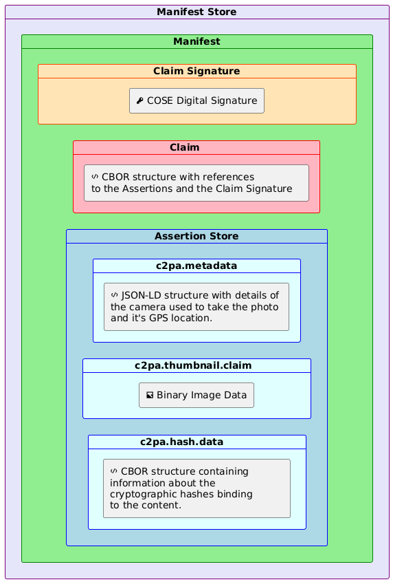
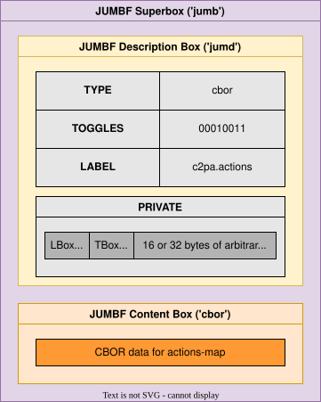
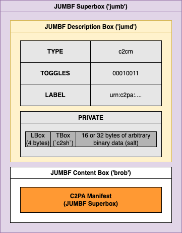
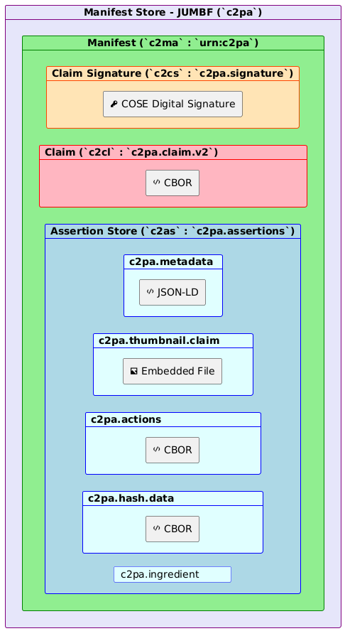
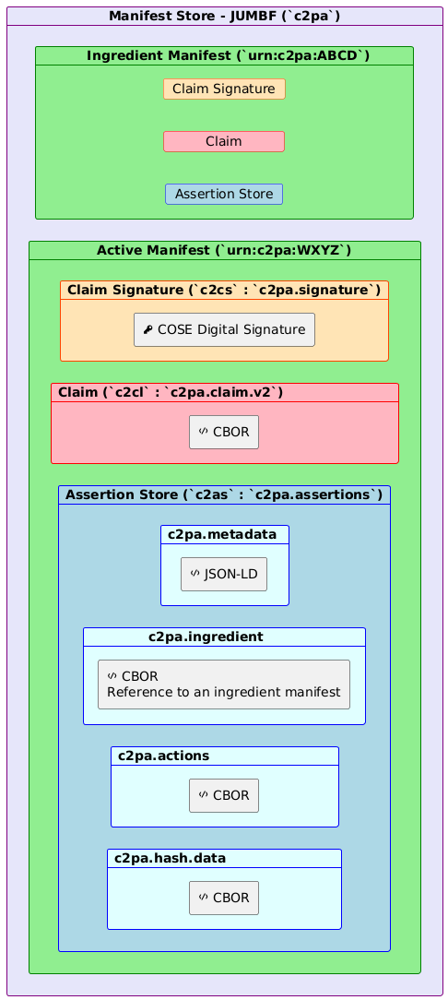
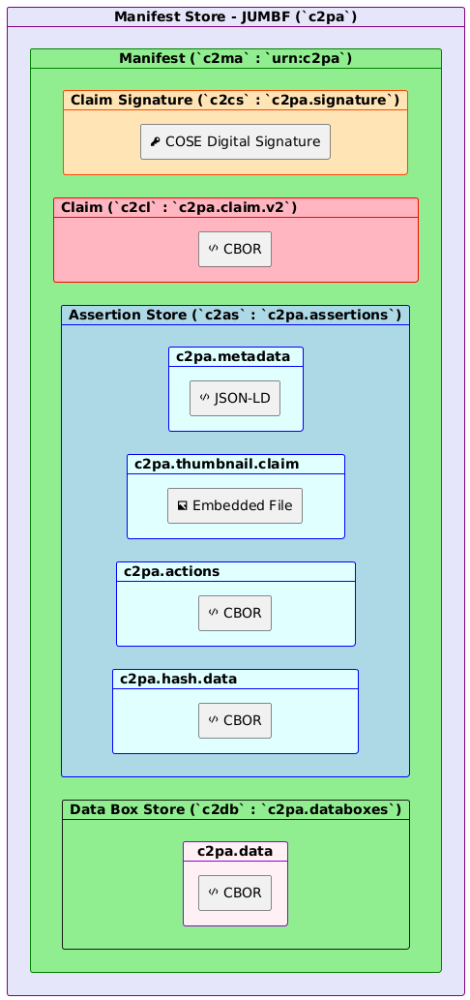
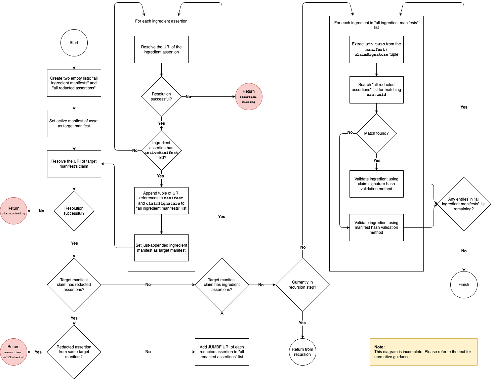
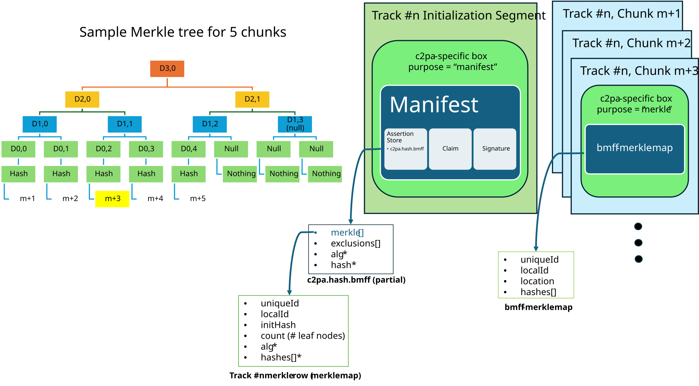
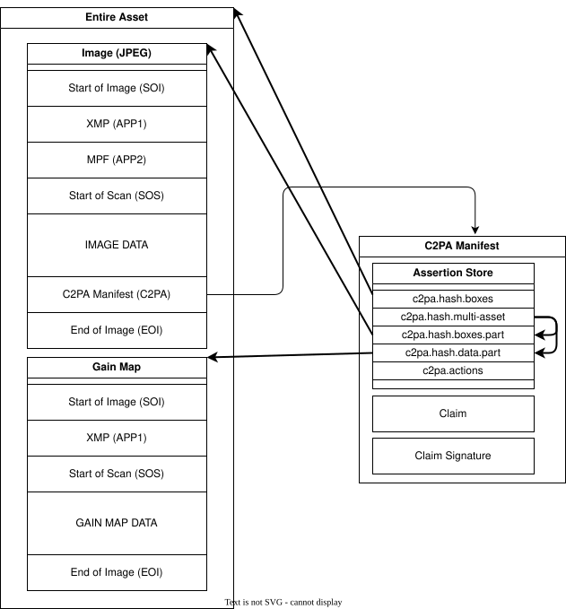
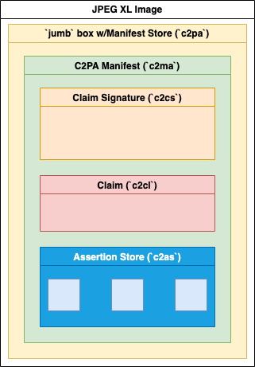

# Content Credentials

<a id="foreword"></a>
## Foreword

ISO (the International Organization for Standardization) is a worldwide federation of national standards bodies (ISO member bodies). The work of preparing International Standards is normally carried out through ISO technical committees. Each member body interested in a subject for which a technical committee has been established has the right to be represented on that committee. International organizations, governmental and non-governmental, in liaison with ISO, also take part in the work. ISO collaborates closely with the International Electrotechnical Commission (IEC) on all matters of electrotechnical standardization.

The procedures used to develop this document and those intended for its further maintenance are described in the ISO/IEC Directives, Part 1. In particular the different approval criteria needed for the different types of ISO documents should be noted. This document was drafted in accordance with the editorial rules of the ISO/IEC Directives, Part 2 (see www.iso.org/directives).

Attention is drawn to the possibility that some of the elements of this document may be the subject of patent rights. ISO shall not be held responsible for identifying any or all such patent rights. Details of any patent rights identified during the development of the document will be in the Introduction or on the ISO list of patent declarations received (see www.iso.org/patents) or both.

Any trade name used in this document is information given for the convenience of users and does not constitute an endorsement.

For an explanation on the voluntary nature of standards, the meaning of ISO specific terms and expressions related to conformity assessment, as well as information about ISO’s adherence to the World Trade Organization (WTO) principles in the Technical Barriers to Trade (TBT) see the following URL: www.iso.org/iso/foreword.html.

This document was prepared by Technical Committee ISO/TC 171, _ISO TC 171_, Subcommittee SC 2, _Document file formats, EDMS systems and authenticity of information_.

A list of all parts in the ISO 0000 series can be found on the ISO website.

<a id="_introduction"></a>
## Introduction

With the increasing velocity of digital content and the increasing availability of powerful creation and editing techniques, establishing the provenance of media is critical to ensure transparency, understanding, and ultimately, trust.

We are witnessing extraordinary challenges to trust in media. As social platforms amplify the reach and influence of certain content via ever more complex and opaque algorithms, mis-attributed and mis-contextualized content spreads quickly. Whether inadvertent misinformation or deliberate deception via disinformation, inauthentic content is on the rise.

Currently, those who wish to include metadata about their work cannot do so in a secure, tamper-evident and standardized way across platforms. Without this information coming from a recognized source, publishers and consumers lack critical context for determining the authenticity of media.

Provenance empowers content creators and editors, regardless of their geographic location or degree of access to technology, to disclose information about how an asset was created, how it was changed and what was changed. Each time an asset is changed, the existing provenance of the asset is preserved, with each new change being added to the provenance. In this way, content with provenance provides indicators of authenticity so that consumers can have awareness of altered content. Such provenance can include what has been changed and the source of those changes. This ability to provide provenance for creators, publishers and consumers is essential to facilitating trust online.

To address this issue at scale for publishers, creators and consumers, this document has been developed for providing content provenance and authenticity. It is designed to enable global, opt-in, adoption of digital provenance techniques through the creation of a rich ecosystem of digital provenance enabled applications for a wide range of individuals and organizations while meeting appropriate security requirements.

<a id="_scope"></a>
## Scope

This document describes the technical aspects of the C2PA architecture known as Content Credentials. It is a model for storing and accessing cryptographically verifiable information whose trustworthiness can be assessed based on a defined trust model. Included in this document is information about how to create and process a C2PA Manifest and its components, including the use of digital signature technology for enabling tamper-evidence as well as establishing trust.

<a id="_normative_references"></a>
## Normative references

The following documents are referred to in the text in such a way that some or all of their content constitutes requirements of this document. For dated references, only the edition cited applies. For undated references, the latest edition of the referenced document (including any amendments) applies.

*   \[ISO/IEC 646:1991\] _Information technology — ISO 7-bit coded character set for information interchange_
    
*   \[ISO 8601-1:2019\], _Date and time — Representations for information interchange — Part 1: Basic rules_
    
*   \[ISO/IEC 10646\] _Information technology — Universal Coded Character Set (UCS)_
    
*   \[ISO/IEC 10918-1:1994\], _Information technology — Digital compression and coding of continuous-tone still images: Requirements and guidelines_
    
*   \[ISO 12234-2:2001\], _Electronic still-picture imaging — Removable memory — Part 2: TIFF/EP image data format_
    
*   \[ISO/IEC 14496-12:2022\], _Information technology — Coding of audio-visual objects — Part 12: ISO base media file format_
    
*   \[ISO/IEC 14496-22:2019\], _Information technology — Coding of audio-visual objects — Part 22: Open Font Format_
    
*   \[ISO/IEC 15444-2:2023\], _Information technology — JPEG 2000 image coding system — Part 2: Extensions_
    
*   \[ISO 16684-1:2019\], _Graphic technology — Extensible metadata platform (XMP) — Part 1: Data model, serialization and core properties_
    
*   \[ISO 16684-2\], _Graphic technology — Extensible metadata platform (XMP) — Part 2: Description of XMP schemas using RELAX NG_
    
*   \[ISO 16684-3\], _Graphic technology — Extensible metadata platform (XMP) — Part 3: JSON-LD serialization of XMP_
    
*   \[ISO/IEC 18181-2:2024\], _Information technology — JPEG XL image coding system — Part 2: File format_
    
*   \[ISO/IEC 18477-1:2024\], _Information technology — Scalable compression and coding of continuous-tone still images — Part 1: Core coding system specification_
    
*   \[ISO/IEC 18477-3:2023\], _Information technology — Scalable compression and coding of continuous-tone still images — Part 3: Box file format_
    
*   \[ISO/IEC 19566-4:2020\], _Information technologies — JPEG systems — Part 4: Privacy and security_
    
*   \[ISO/IEC 19566-5:2023\], _Information technologies — JPEG systems — Part 5: JPEG universal metadata box format (JUMBF)_
    
*   \[ISO 32000-1:2008\], _Document management — Portable document format — Part 1: PDF 1.7_
    
*   \[ISO 32000-2:2020\], _Document management — Portable document format — Part 2: PDF 2.0_
    
*   \[RFC 2326\], _Real Time Streaming Protocol (RTSP)_, [https://tools.ietf.org/html/rfc2326](https://tools.ietf.org/html/rfc2326)
    
*   \[RFC 2630\], _Cryptographic Message Syntax_, [https://tools.ietf.org/html/rfc2630](https://tools.ietf.org/html/rfc2630)
    
*   \[RFC 3161\], _Internet X.509 Public Key Infrastructure Time-Stamp Protocol (TSP)_, [https://tools.ietf.org/html/rfc3161](https://tools.ietf.org/html/rfc3161)
    
*   \[RFC 3279\], _Algorithms and Identifiers for the Internet X.509 Public Key Infrastructure Certificate and Certificate Revocation List (CRL) Profile_, [https://tools.ietf.org/html/rfc3279](https://tools.ietf.org/html/rfc3279)
    
*   \[RFC 3339\], _Date and Time on the Internet: Timestamps_, [https://tools.ietf.org/html/rfc3339](https://tools.ietf.org/html/rfc3339)
    
*   \[RFC 4122\], _A Universally Unique IDentifier (UUID) URN Namespace_, [https://tools.ietf.org/html/rfc4122](https://tools.ietf.org/html/rfc4122)
    
*   \[RFC 5280\], _Internet X.509 Public Key Infrastructure Certificate and Certificate Revocation List (CRL) Profile_, [https://tools.ietf.org/html/rfc5280](https://tools.ietf.org/html/rfc5280)
    
*   \[RFC 5480\], _Elliptic Curve Cryptography Subject Public Key Information_, [https://tools.ietf.org/html/rfc5480](https://tools.ietf.org/html/rfc5480)
    
*   \[RFC 5646\], _Tags for Identifying Languages_, [https://tools.ietf.org/html/rfc5646](https://tools.ietf.org/html/rfc5646)
    
*   \[RFC 5758\], _Internet X.509 Public Key Infrastructure: Additional Algorithms and Identifiers for DSA and ECDSA_, [https://tools.ietf.org/html/rfc5758](https://tools.ietf.org/html/rfc5758)
    
*   \[RFC 6066\], _Transport Layer Security (TLS) Extensions: Extension Definitions_, [https://tools.ietf.org/html/rfc6066](https://tools.ietf.org/html/rfc6066)
    
*   \[RFC 6234\], _US Secure Hash Algorithms (SHA and SHA-based HMAC and HKDF)_, [https://tools.ietf.org/html/rfc6234](https://tools.ietf.org/html/rfc6234)
    
*   \[RFC 6960\], _X.509 Internet Public Key Infrastructure Online Certificate Status Protocol - OCSP_, [https://tools.ietf.org/html/rfc6960](https://tools.ietf.org/html/rfc6960)
    
*   \[RFC 7518\], _JSON Web Algorithms (JWA)_, [https://tools.ietf.org/html/rfc7518](https://tools.ietf.org/html/rfc7518)
    
*   \[RFC 7932\], _Brotli Compressed Data Format_, [https://tools.ietf.org/html/rfc7932](https://tools.ietf.org/html/rfc7932)
    
*   \[RFC 8017\], _PKCS #1: RSA Cryptography Specifications Version 2.2_, [https://tools.ietf.org/html/rfc8017](https://tools.ietf.org/html/rfc8017)
    
*   \[RFC 8032\], _Edwards-Curve Digital Signature Algorithm (EdDSA)_, [https://tools.ietf.org/html/rfc8032](https://tools.ietf.org/html/rfc8032)
    
*   \[RFC 8141\], _Uniform Resource Names (URNs)_, [https://tools.ietf.org/html/rfc8141](https://tools.ietf.org/html/rfc8141)
    
*   \[RFC 8152\], _CBOR Object Signing and Encryption (COSE)_, [https://tools.ietf.org/html/rfc8152](https://tools.ietf.org/html/rfc8152)
    
*   \[RFC 8230\], _Using RSA Algorithms with CBOR Object Signing and Encryption (COSE) Messages_, [https://tools.ietf.org/html/rfc8230](https://tools.ietf.org/html/rfc8230)
    
*   \[RFC 8288\], _Web Linking_, [https://tools.ietf.org/html/rfc8288](https://tools.ietf.org/html/rfc8288)
    
*   \[RFC 8410\], _Algorithm Identifiers for Ed25519, Ed448, X25519, and X448 for Use in the Internet X.509 Public Key Infrastructure_, [https://tools.ietf.org/html/rfc8410](https://tools.ietf.org/html/rfc8410)
    
*   \[RFC 8610\], _Concise Data Definition Language (CDDL)_, [https://tools.ietf.org/html/rfc8610](https://tools.ietf.org/html/rfc8610)
    
*   \[RFC 8949\], \_Concise Binary Object Representation (CBOR) \_, [https://tools.ietf.org/html/rfc8949](https://tools.ietf.org/html/rfc8949)
    
*   \[RFC 9336\], _X.509 Certificate General-Purpose Extended Key Usage (EKU) for Document Signing_, [https://tools.ietf.org/html/rfc9336](https://tools.ietf.org/html/rfc9336)
    
*   \[RFC 9360\], _CBOR Object Signing and Encryption (COSE): Header Parameters for Carrying and Referencing X.509 Certificates_, [https://tools.ietf.org/html/rfc9360](https://tools.ietf.org/html/rfc9360)
    
*   \[RFC 9399\], _Internet X.509 Public Key Infrastructure: Logotypes in X.509 Certificates_, [https://tools.ietf.org/html/rfc9399](https://tools.ietf.org/html/rfc9399)
    
*   \[RFC 9562\], _Universally Unique IDentifiers (UUIDs)_, [https://tools.ietf.org/html/rfc9562](https://tools.ietf.org/html/rfc9562)
    
*   \[W3C REC GIF\], _GRAPHICS INTERCHANGE FORMAT(sm) Version 89a_, [https://www.w3.org/Graphics/GIF/spec-gif89a.txt](https://www.w3.org/Graphics/GIF/spec-gif89a.txt)
    
*   \[W3C REC json-ld11\], _JSON-LD 1.1_, [https://www.w3.org/TR/json-ld11/](https://www.w3.org/TR/json-ld11/)
    
*   \[W3C REC media-frags\], _Media Fragments URI 1.0 (basic)_, [https://www.w3.org/TR/media-frags/](https://www.w3.org/TR/media-frags/)
    
*   \[W3C REC PNG\], _Portable Network Graphics (PNG) Specification (Second Edition)_, [https://www.w3.org/TR/2003/REC-PNG-20031110/](https://www.w3.org/TR/2003/REC-PNG-20031110/)
    
*   \[W3C REC SVG\], _Scalable Vector Graphics (SVG) 1.1 (Second Edition)_, [https://www.w3.org/TR/SVG11/](https://www.w3.org/TR/SVG11/)
    
*   \[W3C REC annotation-model\], _Web Annotation Data Model_, [https://www.w3.org/TR/annotation-model/](https://www.w3.org/TR/annotation-model/)
    
*   \[DNG\], _Digital Negative (DNG) Specification_, [https://helpx.adobe.com/content/dam/help/en/photoshop/pdf/dng\_spec\_1\_6\_0\_0.pdf](https://helpx.adobe.com/content/dam/help/en/photoshop/pdf/dng_spec_1_6_0_0.pdf)
    
*   \[Dublin Core\], _Dublin Core™ Metadata Element Set, Version 1.1: Reference Description_, [https://www.dublincore.org/specifications/dublin-core/dces/](https://www.dublincore.org/specifications/dublin-core/dces/)
    
*   \[Exif\], _CIPA DC- 008-Translation- 2019 Exchangeable image file format for digital still cameras: Exif Version 2.32_, [https://www.cipa.jp/std/documents/download\_e.html?DC-008-Translation-2019-E](https://www.cipa.jp/std/documents/download_e.html?DC-008-Translation-2019-E)
    
*   \[IPTC Photo Metadata Standard\], _IPTC Photo Metadata Standard 2024.1_, [https://www.iptc.org/std/photometadata/specification/IPTC-PhotoMetadata](https://www.iptc.org/std/photometadata/specification/IPTC-PhotoMetadata)
    
*   \[ID3\], _ID3_, [https://id3.org/id3v2.3.0](https://id3.org/id3v2.3.0)
    
*   \[JSON Schema\], _JSON Schema: A Media Type for Describing JSON Documents_, [https://json-schema.org/draft/2020-12/json-schema-core](https://json-schema.org/draft/2020-12/json-schema-core)
    
*   \[MPF\], _Multi-Picture Format (MPF)_, [https://www.cipa.jp/e/std/std-sec.html](https://www.cipa.jp/e/std/std-sec.html)
    
*   \[OpenType\], _OpenType® Specification Version 1.9_, [https://learn.microsoft.com/en-us/typography/opentype/spec/](https://learn.microsoft.com/en-us/typography/opentype/spec/)
    
*   \[RIFF\], _Resource Interchange File Format_, [https://www.loc.gov/preservation/digital/formats/fdd/fdd000025.shtml](https://www.loc.gov/preservation/digital/formats/fdd/fdd000025.shtml)
    
*   \[TIFF\] _TIFF v6_, [https://www.itu.int/itudoc/itu-t/com16/tiff-fx/docs/tiff6.pdf](https://www.itu.int/itudoc/itu-t/com16/tiff-fx/docs/tiff6.pdf)
    
*   \[URN Namespace for Identifiers\], _A URN Namespace For Identifiers Based on Cryptographic Hashes_, [https://datatracker.ietf.org/doc/html/draft-thiemann-hash-urn-01](https://datatracker.ietf.org/doc/html/draft-thiemann-hash-urn-01)
    
*   \[XMP Specification Part 2\], _XMP Specification Part 2: Additional Properties_, Adobe Inc., [https://github.com/adobe/XMP-Toolkit-SDK/blob/main/docs/XMPSpecificationPart2.pdf](https://github.com/adobe/XMP-Toolkit-SDK/blob/main/docs/XMPSpecificationPart2.pdf)
    

<a id="_terms_and_definitions"></a>
## Terms and definitions

<a id="actor-definition"></a>
### actor

human or non-human (hardware or software) that is participating in the C2PA ecosystem. For example: a camera (capture device), image editing software, cloud service or the person using such tools

> **NOTE:**
> An organization or group of {{actor}}s may also be considered an {{actor}} in the C2PA ecosystem.

<a id="claim-generator-definition"></a>
### claim generator

non-human (hardware or software) {{actor}} that generates the {{claim}} about an {{asset}} as well as the {{claim signature}}, thus leading to the {{asset}}'s associated {{C2PA Manifest}}

<a id="signer-definition"></a>
### signer

credential holder of a private key that is used to sign the {{claim}}. The {{signer}} is identified by the subject of the credential

<a id="_manifest_consumer"></a>
### manifest consumer

{{actor}} who consumes an {{asset}} with an associated {{C2PA Manifest}} for the purpose of obtaining the {{provenance data}} from the {{C2PA Manifest}}

<a id="_validator"></a>
### validator

{{manifest consumer}} that performs {{C2PA Manifest}} validation

<a id="_action"></a>
### action

operation performed by an {{actor}} on an {{asset}}. For example, "create", "embed", or "apply filter"

<a id="_digital_content"></a>
### digital content

portion of an {{asset}} that represents the actual content, such as the pixels of an image, along with any additional technical metadata required to understand the content (e.g., a colour profile or encoding parameters)

<a id="_asset_metadata"></a>
### asset metadata

Non-technical information about the {{asset}} and its {{digital content}}

<a id="_asset"></a>
### asset

file or stream of data containing {{digital content}}, {{asset metadata}} and optionally, a {{C2PA Manifest}}

> **NOTE:**
> For the purposes of this definition, we will extend the typical definition of "file" to include cloud-native and dynamically generated data.

<a id="_derived_asset"></a>
### derived asset

{{asset}} that is created by starting from an existing {{asset}} and performing {{action}}s to it that modify its {{digital content}}

**EXAMPLE:** An audio stream that has been shortened or a document where pages have been added.

<a id="_asset_rendition"></a>
### asset rendition

representation of an {{asset}} (either as a part of an {{asset}} or a completely new {{asset}}) where the {{digital content}} has had a 'non-editorial transformation' {{action}} (e.g., re-encoding or scaling) applied

**EXAMPLE:** A video file that is re-encoded for reduced screen resolution or network bandwidth.

<a id="_composed_asset"></a>
### composed asset

{{asset}} that is created by building up a collection of multiple parts or fragments of {{digital content}} (referred to as ingredients) from one or more other {{asset}}s. When starting from an existing {{asset}}, it is a special case of a {{derived asset}} - however a {{composed asset}} can also be one that starts from a "blank slate"

**EXAMPLES:**

*   A video created by importing existing video clips and audio segments into a "blank slate".
    
*   An image where another image is imported and super-imposed on top of the starting image.
    

<a id="editorial-transformation-definition"></a>
### editorial transformation

type of transformation that alters either the intent or meaning or both of the {{digital content}}.

<a id="assertion-definition"></a>
### assertion

data structure which represents a statement either made (or "created") by the {{signer}} or simply gathered at claim generation-time, concerning the {{asset}}. This data is a part of the {{C2PA Manifest}}

<a id="claim-definition"></a>
### claim

digitally signed and tamper-evident data structure that references a set of {{assertion}}s, concerning an {{asset}}, and the information necessary to represent the {{content binding}}. If any {{assertion}}s were redacted, then a declaration to that effect is included. This data is a part of the {{C2PA Manifest}}

<a id="claim-signature-definition"></a>
### claim signature

digital signature on the {{claim}} using the private key of a {{signer}}. The {{claim signature}} is a part of the {{C2PA Manifest}}

<a id="c2pa-manifest-definition"></a>
### C2PA Manifest

set of information about the _provenance_ of an {{asset}} based on the combination of one or more {{assertion}}s (including {{content binding}}s), a single {{claim}}, and a {{claim signature}}. A {{C2PA Manifest}} is part of a {{C2PA Manifest Store}}

> **NOTE:**
> A {{C2PA Manifest}} can reference other {{C2PA Manifest}}s.

<a id="_c2pa_manifest_store"></a>
### C2PA Manifest Store

collection of {{C2PA Manifest}}s that can either be embedded into an {{asset}} or be external to its {{asset}}

<a id="_content_credential"></a>
### Content Credential

preferred, non-technical, term for a {{C2PA Manifest}}. The {{C2PA Manifest Store}} therefore represents the Content Credentials of an asset

> **NOTE:**
> Content Credentials also refers to the overall C2PA technology, and is therefore essentially treated as a plural noun. If a {{C2PA Manifest}} is a Content Credential, then multiple {{C2PA Manifest}} or the broader, universal concept is Content Credentials

<a id="_active_manifest"></a>
### active manifest

last manifest in the list of {{C2PA Manifest}}s inside of a {{C2PA Manifest Store}} which is the one with the set of {{content binding}}s that are able to be validated

<a id="_provenance"></a>
### provenance

logical concept of understanding the history of an {{asset}} and its interaction with {{actor}}s and other {{asset}}s, as represented by the {{provenance data}}

<a id="_provenance_data"></a>
### provenance data

set of {{C2PA Manifest}}s for an {{asset}} and, in the case of a {{composed asset}}, its ingredients

> **NOTE:**
> A {{C2PA Manifest}} can reference other {{C2PA Manifest}}s

<a id="_authenticity"></a>
### authenticity

property of {{digital content}} comprising a set of facts (such as the {{provenance data}} and {{hard binding}}s) that can be cryptographically verified as not having been tampered with

<a id="_content_binding"></a>
### content binding

Information that associates {{digital content}} to a specific {{C2PA Manifest}} associated with a specific {{asset}}, either as a {{hard binding}} or a {{soft binding}}

<a id="_hard_binding"></a>
### hard binding

One or more cryptographic hashes that uniquely identifies either the entire {{asset}} or a portion thereof

<a id="_soft_binding"></a>
### soft binding

content identifier that is either (a) not statistically unique, such as a {{fingerprint}}, or (b) embedded as an {{invisible watermark}} in the identified {{digital content}}

<a id="_trust_signals"></a>
### trust signals

collection of information that can inform a {{manifest consumer}}'s judgment of the trustworthiness of an {{asset}}. These are in addition to the {{signer}} upon which the fundamental trust model relies

<a id="_c2pa_trust_list"></a>
### C2PA Trust List

C2PA-managed list of X.509 certificate trust anchors that issue certificates to hardware and software {{signer}}s that are trusted to sign {{claim}}s

<a id="_fingerprint"></a>
### fingerprint

set of inherent properties computable from {{digital content}} that identifies the content or near duplicates of it

**EXAMPLE:** An {{asset}} becomes separated from its {{C2PA Manifest}} due to removal or corruption of {{asset}} metadata. A {{fingerprint}} of the {{digital content}} of the {{asset}} is used to search a database to recover the {{asset}} with an intact {{C2PA Manifest}}

<a id="_invisible_watermark"></a>
### invisible watermark

Information incorporated in a substantially human imperceptible way into the {{digital content}} of an {{asset}} which can be used, for example, to uniquely identify the {{asset}} or to store a reference to a {{C2PA Manifest}}

<a id="_visible_watermark"></a>
### visible watermark

perceptible component of the {{digital content}} carrying some human consumable information about the provenance of the {{asset}}

<a id="_manifest_repository"></a>
### manifest repository

repository into which {{C2PA Manifest}}s and {{C2PA Manifest Store}}s can be placed, and which can be searched using a {{content binding}}

<a id="_durable_content_credential"></a>
### durable Content Credential

a {{Content Credential}} for which there exists one or more {{soft binding}}s that enable its discovery in a {{manifest repository}}.

<a id="_notation"></a>
## Notation

<a id="_technical_overview"></a>
## Technical Overview

<a id="_overview"></a>
### Overview

The C2PA information comprises a series of statements that cover areas such as asset creation, edit actions, capture device details, bindings to content and many other subjects. These statements, called assertions, make up the provenance of a given asset and represent a series of trust signals that can be used by a human to improve their view of trustworthiness concerning the asset. Assertions are wrapped up with additional information into a digitally signed entity called a claim. This claim is digitally signed by the claim generator on behalf of the [signer](#signer-definition), using the signer’s signing credential, producing the claim signature.

These assertions, claims, and the claim signature are all bound together into a verifiable unit called a C2PA Manifest (see [A C2PA Manifest and its constituent parts](#manifest-parts)) by a hardware or software component called a claim generator. The set of C2PA Manifests, as stored in the asset’s Content Credential, represent its provenance data.


Figure 1. A C2PA Manifest and its constituent parts

<a id="_establishing_trust"></a>
### Establishing Trust

The basis of making trust decisions in C2PA, our [trust model](#_trust_model), is the identity of the signer associated with the cryptographic signing key used to sign a claim in a C2PA Manifest. The claim signatures of C2PA Manifests, when combined with trusted time-stamps, can undergo the validation process indefinitely to determine if claims were signed while the signing credentials were valid and not revoked.

<a id="_an_example"></a>
### An Example

A very common scenario will be a user taking a photograph with their C2PA-enabled camera (or phone). In that instance, the camera would create a manifest containing some assertions including information about the camera itself, a thumbnail of the image and some cryptographic hashes that bind the photograph to the manifest. These assertions would then be listed in the Claim, which would be digitally signed and then the entire C2PA Manifest (see [Example C2PA Manifest of a Photograph](#Photo_Manifest)) would be embedded into the output JPEG. This C2PA Manifest would remain valid indefinitely.



Figure 2. Example C2PA Manifest of a Photograph

A Manifest Consumer, such as a C2PA validator, helps users to establish the trustworthiness of the asset by first validating the digital signature and its associated credential. It also checks each of the assertions for validity and presents the information contained in them, and the signature, to the user in a way that they can then make an informed decision about the trustworthiness of the digital content.

<a id="_design_goals"></a>
### Design Goals

In the creation of the C2PA architecture, it was important to establish some clear goals for the work to ensure that the technology was usable across a wide spectrum of hardware and software implementations worldwide and accessible to all. Those goals can be found in [C2PA Design Goals](#design-goals).

**Table 1. C2PA Design Goals**

| Goal | Description |
| --- | --- |
| Privacy | Enable users to control the privacy of their information, including consumption data and information recorded in provenance |
| Responsibility | Ensure consumers can determine the provenance of an asset |
| Scalability | Enable creation/consumption/validation of media provenance at the same scale as media creation/consumption on the web |
| Extensibility | Ensure future metadata and credential providers are able to add their information without requiring input or approval from the C2PA |
| Interoperability | Ensure that differing implementations are able to operate with each other without ambiguity |
| Whole Workflow Applicability | Maintain the provenance of the asset across multiple tools, from creation through all subsequent modification and publication/distribution |
| Technology Minimalism | Create only the minimum required novel technology in the specification by relying on prior, well-established techniques |
| Security | Design to ensure that consumers can trust the integrity and source of provenance, and ensure the design is reviewed by experts |
| Content Ubiquity | Enable the inclusion of provenance for all common media types, including documents |
| Flexible Locality | Enable both online and offline (asset-only) storage and consumption/validation of provenance |
| Global Universality | Design for the needs of interested users throughout the world |
| Accessibility | Ensure that the technology can be used in a way that conforms to recognized accessibility standards, such as WCAG |
| Harms and Misuse | Design to avert and mitigate potential harms, including threats to human rights and disproportionate risks to vulnerable groups |
| Evolving | Continuous review of the specification against these goals to ensure that they remain our priority |

<a id="_assertions"></a>
## 1\. Assertions

<a id="_general"></a>
### 1.1. General

It is expected that each claim generator, used by actors in the system that creates or processes an asset, will create or assemble one or more assertions about when, where, and how the asset was originated or transformed. An assertion is labelled data, typically (though not required to be) in a CBOR-based structure which represents a declaration about an asset. Some of these assertions will contain human-generated information (e.g., alternate text for accessibility) while others will come from machines (software/hardware) providing the information they generated (e.g., camera type).

Some examples of assertions are:

*   metadata (e.g., camera information such as maker or lens);
    
*   actions performed on the asset (e.g., clipping, color correction);
    
*   thumbnail of the asset or its ingredients;
    
*   content bindings (e.g., cryptographic hashes).
    

Certain assertions may be redacted by subsequent claims (see [Redaction of Assertions](#_redaction_of_assertions)), but they cannot be modified once made as part of a claim.

<a id="_labels"></a>
### 1.2. Labels

<a id="_namespacing"></a>
#### 1.2.1. Namespacing

String values in C2PA data structures may be organized into namespaces using a period (`.`) as a separator. The C2PA namespace, `c2pa`, shall be the beginning of any string value defined in this specification. Entity-specific namespaces shall begin with the Internet domain name for the entity similar to how Java packages are defined (e.g., `com.litware`, `net.fineartschool`).

The period-separated components of an entity-specific namespace shall follow the variable naming convention (`[a-zA-Z0-9][a-zA-Z0-9_-]*`) specified in the POSIX or C locale, as defined in the ABNF below ([ABNF for Namespaces](#abnf_for_namespaces)).

ABNF for Namespaces

```abnf
qualified-namespace = "c2pa" / entity
entity = entity-component *( "." entity-component )
entity-component = 1( DIGIT / ALPHA ) *( DIGIT / ALPHA / "-" / "_" )
```

<a id="_label_naming"></a>
#### 1.2.2. Label Naming

Each assertion has a label defined either by the C2PA specifications or an external entity. These labels are strings which are namespaced, as described in the preceding clause or by an entity. The most common labels will be defined in the `c2pa` namespace, but labels may use any namespace that follows the conventions. Labels are also versioned with a simple incrementing integer scheme (e.g., `c2pa.actions.v2`). If no version is provided, it is considered as `v1`. The list of publicly known labels can be found in [C2PA Standard Assertions](#_c2pa_standard_assertions).

ABNF for Assertion Labels

```abnf
namespaced-label = qualified-namespace label
qualified-namespace = "c2pa" / entity
entity = entity-component *( "." entity-component )
entity-component = 1( DIGIT / ALPHA ) *( DIGIT / ALPHA / "-" / "_" )
label = 1*( "." label-component )
label-component = 1( DIGIT / ALPHA ) *( DIGIT / ALPHA / "-" / "_" )
```

The period-separated components of a label follow the variable naming convention (`[a-zA-Z][a-zA-Z0-9_-]*`) specified in the POSIX or C locale, with the restriction that the use of a repeated underscore character (`__`) is reserved for labelling multiple assertions of the same type.

<a id="_versioning"></a>
### 1.3. Versioning

When an assertion’s schema is changed, it should be done in a backwards-compatible manner. This means that new fields may be added and existing ones may be marked as deprecated (i.e., can be read, but never written). Existing fields shall not be removed. The label would then consist of an incremented version number, for example moving from `c2pa.action` (deprecated) to `c2pa.action.v2`.

Since the addition of optional fields can be done while maintaining backwards compatibility, such fields may be added to an existing assertion’s schema without a change to the version number.

Deprecated fields for C2PA standard assertions shall be indicated in [C2PA Standard Assertions](#_c2pa_standard_assertions). Claim generators shall not insert data into deprecated assertion fields when creating assertions.

In those situations where a non-backwards compatible change is required, instead of increasing the label’s version number, the assertion shall be given a new label.

> **NOTE:**
> For example, `c2pa.ingredient` could be changed to the fictional `c2pa.component`.

<a id="_multiple_instances"></a>
### 1.4. Multiple Instances

Multiple assertions of the same type can occur in the same manifest, but since assertions are referenced by claims via their label, the assertion labels are required to be unique. This is accomplished by adding a double-underscore and a monotonically increasing index to the label. For example, if a manifest contains a single assertion of type `c2pa.metadata`, then the assertion label will be `c2pa.metadata`. If a manifest contains three assertions of this type, the labels will be `c2pa.metadata`, `c2pa.metadata__1` and `c2pa.metadata__2`.

When a label includes a version number, that version number is part of the label itself. As such, when there are multiple instances, the instance number continues to follow the label - e.g., `c2pa.ingredient.v2__2`.

<a id="_schema_validation"></a>
### 1.5. Schema Validation

The schemas provided in this document, as well as the machine readable ones that are downloaded-able from the C2PA website, should only be used for aids in understanding the syntax to be read or written. It is not necessary, nor it is recommended, for a validator to perform any form of schema validation.

<a id="_assertion_store"></a>
### 1.6. Assertion Store

The set of assertions referenced by a [claim](#_claims) in a manifest are collected together into a logical construct that is referred to as the _assertion store_. The assertions and assertion store shall be stored as described in [Use of JUMBF](#_use_of_jumbf); in particular, each assertion referenced in a claim’s `created_assertions` or `gathered_assertions` (but not [`redacted_assertions`](#_redaction_of_assertions)) shall be present in the assertion store located in the same C2PA Manifest as the claim.

In each manifest, there is a single assertion store. However, as an asset may have multiple manifests associated with it, each one representing a specific series of assertions, there may be multiple assertion stores associated with an asset.

<a id="_embedded_vs_externally_stored_data"></a>
### 1.7. Embedded vs Externally-Stored Data

Some assertion data, due to its size or an infrequent need for it, may be externally hosted. Such data are not embedded in the assertion store, but instead are referenced by URI. This is accomplished through a cloud data assertion (see [Cloud Data](#_cloud_data)). Unlike embedded assertion data, cloud data is not retrieved nor validated as part of manifest validation, and are only retrieved and validated when specifically needed by an application according to a different set of validation rules as described in [Validate the Assertions](#_validate_the_assertions).

<a id="_redaction_of_assertions"></a>
### 1.8. Redaction of Assertions

Assertions that are present in an asset-embedded manifest may be removed from that asset’s manifest when the asset is [used as an ingredient](#_ingredient_storage). This process is called redaction.

Redaction involves either removing the entire assertion from the manifest’s assertion store or retaining the labelled assertion container but replacing the JUMBF Content boxes within that assertion with a single UUID Content box whose `ID` field has a value of `CAA98EEE-9D4D-F80E-86AD-4DFFCA263973` (called the C2PA Redaction UUID) and whose `DATA` field contains only zeros (binary `0x00` values).

In addition, a record that something was removed shall be added to the [claim](#_claims) in the form of a [URI reference](#_uri_references) to the redacted assertion in the `redacted_assertions` field of the claim. It is also strongly recommended that the claim generator should add a `c2pa.redacted` [action assertion](#_actions) with a `redacted` field as described in [Parameters](#_parameters).

When redacting an ingredient assertion that references a C2PA Manifest, the associated manifest shall be removed from the C2PA Manifest Store if no other references to it remain after redacting.

> **NOTE:**
> Because each assertion’s [URI reference](#_uri_references) includes the assertion label, it is also known what type of information (e.g., thumbnail, metadata, etc.) was removed. This enables both humans and machines to apply rules to determine if the removal was acceptable.

Unless the redaction of the assertion also requires modification to the digital content, an [update manifest](#_update_manifests) shall be used to document the redaction as it makes a statement about the non-changes to the content.

Claim generators shall not redact assertions with a label of `c2pa.actions` or `c2pa.actions.v2` as this assertion type represents essential information in understanding the history of an asset. They shall also not redact any [hard binding to content](#_binding_to_content) assertion - either a `c2pa.hash.data`, `c2pa.hash.boxes`, `c2pa.hash.collection.data`, `c2pa.hash.bmff.v2` (deprecated), or `c2pa.hash.bmff.v3`, as these assertions are necessary for determining the integrity of the asset.

> **NOTE:**
> When assertions are redacted in an ingredient manifest that is referenced via either of the deprecated ingredient assertions (`c2pa.ingredient` or `c2pa.ingredient.v2`), validation of that assertion will fail (as described in [Ingredient Assertion Validation](#_ingredient_assertion_validation)), because only `c2pa.ingredient.v3` assertions support the claim signature hash validation method, described in [Claim Signature Hash Validation Method](#_claim_signature_hash_validation_method).

<a id="_specifications_of_time_in_assertions"></a>
### 1.9. Specifications of time in assertions

The default specification for a date and/or time value in an assertion is the date/time format and serialized in CBOR as tag number `0` ([\[RFC 8949\]](#RFC8949), 3.4.1) and represented in CDDL as type `tdate`.

There is one case, as described when [adding a claimed time of signing](#_adding_a_claimed_time_of_signing), where the time is represented as a special type of CBOR date/time.

Additionally there is the [time-stamp assertion](#timestamp_assertion), which uses the standard time-stamping formats as described in [the signing process](#_signing_a_claim).

The reason why there are different types of date & time representations is to allow for the most appropriate representation, based on existing standards in use, for each specific use case.

<a id="_data_boxes"></a>
## 2\. Data Boxes

> **IMPORTANT:**
> This section is retained for historical purposes. The concept of a data box has been deprecated in favour of a standard assertion that uses a standard JUMBF Embedded File content type box to contain the data. For more information, see [\[\_data\_box\]](#_data_box).

<a id="_general_2"></a>
### 2.1. General

Data boxes provide a way to include arbitrary data into the C2PA Manifest that is referenced from an assertion, instead of embedding it directly into a field of the assertion as a binary string. These data boxes are placed in the [Data Box Store](#_data_storage) and each one will be a single CBOR Content Type box (`cbor`).

The data of a data box is provided directly as the value of the `data` field, which is a `bstr`, so any binary data can be provided. The type of the data shall be identified using the `dc:format` field, with a standard IANA media type.

> **NOTE:**
> IANA structured suffixes ([https://www.iana.org/assignments/media-type-structured-suffix/media-type-structured-suffix.xhtml](https://www.iana.org/assignments/media-type-structured-suffix/media-type-structured-suffix.xhtml)), such as `+json` and `+zip`, are also supported as values of the `dc:format` field.

Sometimes, it may also be necessary to provide one or more [asset types](#_asset_type) as the value of the `data_types` field for more clarity on the format and usage of that data.

A data box shall have a label of `c2pa.data` and follows the [rules of assertion labels](#_multiple_instances) with respect to multiple instances.

<a id="_schema_and_example"></a>
### 2.2. Schema and Example

The schema for this type is defined by the `data-box-map` rule in the [CDDL Definition](#RFC8610) in [CDDL for data box](#cddl_for_data_box).:

CDDL for data box

```cddl
; box allowing for the storage of arbitrary data

data-box-map = {
  "dc:format": format-string, ; IANA media type of the data
  "data" : bstr, ; arbitrary text/binary data
  ? "data_types": [1* $asset-type-map],  ; additional information about the data's type
}
```

<a id="_unique_identifiers"></a>
## 3\. Unique Identifiers

<a id="manifest-identifier"></a>
### 3.1. Uniquely Identifying C2PA Manifests and Assets

Every C2PA Manifest is uniquely identified and referenced by a Uniform Resource Name [URN](#RFC8141) from the `c2pa` URN namespace, and a C2PA asset is uniquely identified by the `c2pa` URN value of its active manifest. The ABNF for the C2PA URN is described by [ABNF for C2PA URN](#abnf_for_urn).

A `c2pa` URN shall consist of two mandatory and two optional components, in the following order, with colons (`:`) between each section.

*   URN identifier (`urn:c2pa`): REQUIRED.
    
*   UUID v4, in string representation (as per RFC 9562, section 4): REQUIRED.
    
*   Claim Generator identifier string : OPTIONAL.
    
*   Version and Reason string (as described below) : OPTIONAL.
    

When present, the "Claim Generator identifier" string shall consist of no more than 32 characters from the ASCII range (as per RFC 20), but which are not Control Characters (RFC 20, 5.2) or Graphic Characters (RFC 20, 5.3).

When present, the "Version and Reason" string shall consist of a positive integer, followed by an underscore (`_`) and then another positive integer. The details of each of these values and how they are to be used is described in [Versioning Manifests Due to Conflicts](#_versioning_manifests_due_to_conflicts). In addition, when a "Version and Reason" string is present, a "Claim Generator identifier" string shall also be present but it may be empty.

ABNF for C2PA URN

```abnf
c2pa_urn = c2pa-namespace UUID [claim-generator [version-reason]]

c2pa-namespace = "urn:c2pa:"

; this definition is taken from RFC 9562
UUID     =  4hexOctet "-"
			2hexOctet "-"
			2hexOctet "-"
			2hexOctet "-"
			6hexOctet
hexOctet = HEXDIG HEXDIG
DIGIT    = %x30-39
HEXDIG   = DIGIT / "A" / "B" / "C" / "D" / "E" / "F"

; ASCII, but not Control Characters or Graphic Characters
visible-char-except-space = %x21-7E / %x80-FF

; claim-generator-identifier is a string of 0 to 32 visible-char-except-space characters
; this means that an empty string is valid
claim-generator = ":" claim-generator-identifier
claim-generator-identifier = 0*32visible-char-except-space

; version-reason is a string consisting of a positive integer 
; followed by an underscore and a positive integer
version-reason = ":" version "_" reason
version = 1*DIGIT
reason = 1*DIGIT
```

Examples:

*   `urn:c2pa:F9168C5E-CEB2-4FAA-B6BF-329BF39FA1E4`
    
*   `urn:c2pa:F9168C5E-CEB2-4FAA-B6BF-329BF39FA1E4:acme`
    
*   `urn:c2pa:F9168C5E-CEB2-4FAA-B6BF-329BF39FA1E4:acme:2_1`
    
*   `urn:c2pa:F9168C5E-CEB2-4FAA-B6BF-329BF39FA1E4::2_1`
    

This `c2pa` URN identifier is used in various parts of a C2PA-enabled workflow, such as when identifying an asset as an [ingredient](#ingredient_assertion) in a derived or composed asset.

<a id="_versioning_manifests_due_to_conflicts"></a>
### 3.2. Versioning Manifests Due to Conflicts

Situations may arise where it is necessary to re-label a C2PA Manifest due to a conflict of identifiers. For example, if a claim generator had already added an ingredient manifest into the asset’s C2PA Manifest Store, then later added another ingredient which had a manifest with the same label in its manifest store, but this latter version of the manifest was different due, for example, to a manipulation of one of its assertion values. In such a case, the modified version of the ingredient manifest needs to be copied into the asset’s C2PA Manifest Store, and shall be re-labeled.

To re-label a manifest:

*   If the current URN does not contain a "Claim Generator identifier string", then the claim generator shall append a `:`.
    
*   In all cases, the claim generator shall append a `:` to the URN followed by a monotonically increasing integer, starting with 1, followed by an underscore (`_`) and then an integer from the list below representing the reason for the re-labeling.
    
    *   1: Conflict with another C2PA Manifest
        
    

For example, if the claim generator has to re-label a C2PA Manifest for the second time due to a conflict, the appended string would be `:2_1`.

<a id="_identifying_non_c2pa_assets"></a>
### 3.3. Identifying Non-C2PA Assets

When working with assets that do not contain a C2PA Manifest, but the asset contains embedded XMP which include values for `xmpMM:DocumentID` and/or `xmpMM:InstanceID` as defined in [XMP Specification Part 2, clause=2.2](#XMP), those values shall be used as identifiers for the asset.

When working with assets that do not contain a C2PA Manifest and do not contain embedded XMP, the claim generator may use any method of its choosing to provide it with a unique identifier.

<a id="_uri_references"></a>
### 3.4. URI References

<a id="_standard_uris"></a>
#### 3.4.1. Standard URIs

All references to information in the manifest, whether stored internally to the asset (i.e., embedded) or stored externally to the asset (e.g., in the cloud), shall be referenced via JUMBF URI references as defined in [\[ISO/IEC 19566-5:2023\]](#ISO19566-5), C.2. These URIs are normally used either as part of a `hashed_uri` or `hashed_ext_uri` data structure.

When the reference is to a [compressed manifest](#_compressed_manifests), the JUMBF URI shall not contain anything about the `brob` box, but the URI to the manifest is treated as if the manifest was not compressed. This means that the URI would include the label of the `c2ma` or `c2um` box, but not the label of the `c2cm` box. In addition, the URI reference to a compressed manifest shall not include the label of the `brob` box - but only the label of the compressed manifest itself.

When resolving an internal JUMBF URI reference, if any label in the path is ambiguous due to multiple child boxes having the same label, a validator shall treat the reference as unresolved.

<a id="_hashed_uris"></a>
#### 3.4.2. Hashed URIs

<a id="_embedded"></a>
##### 3.4.2.1. Embedded

A `hashed_uri` is used when the URI is for something embedded in the same C2PA Manifest Store.

This specification provides an equivalent `hashed-uri-map` data structure (in [CDDL for hashed URI](#hashed-uri-map)) for schemas using a [CDDL Definition](#RFC8610):

CDDL for hashed URI

```cddl
; The data structure used to store a reference to a URL within the same JUMBF and its hash. We use a socket/plug here to allow hashed-uri-map to be used in individual files without having the map defined in the same file
$hashed-uri-map /= {
  "url": jumbf-uri-type, ; JUMBF URI reference
  ? "alg": tstr .size (1..max-tstr-length), ; A string identifying the cryptographic hash algorithm used to compute all hashes in this claim, taken from the C2PA hash algorithm identifier list. If this field is absent, the hash algorithm is taken from an enclosing structure as defined by that structure. If both are present, the field in this structure is used. If no value is present in any of these places, this structure is invalid; there is no default.
  "hash": bstr, ;  byte string containing the hash value
}

; with CBOR Head (#) and tail ($) are introduced in regexp, so not needed explicitly
jumbf-uri-type  /= tstr .regexp "self#jumbf=[\\w\\d\/][\\w\\d\\.\/:-]+[\\w\\d]"
```

Because assertion stores shall be located in the same C2PA Manifest box as the claim that refers to them, only `self#jumbf` URIs are permitted. These `self#jumbf` URIs may be relative to the entire C2PA Manifest Store, in which case they shall start with a `/` (U+002F, Slash), or relative to the current C2PA Manifest. URIs shall not contain the sequence `..` (a pair of U+002E, Full Stop).

Example 1. Example `self#jumbf` URIs

The following are examples of valid `self#jumbf` URIs:

*   `self#jumbf=/c2pa/urn:c2pa:F095F30E-6CD5-4BF7-8C44-CE8420CA9FB7/c2pa.assertions/c2pa.thumbnail.claim` is relative to the entire store (since it starts with `/`);
    
*   `self#jumbf=c2pa.assertions/c2pa.thumbnail.claim` would be relative to the manifest of the box containing the URI.
    

<a id="hashed-ext-uri"></a>
##### 3.4.2.2. External

When referring to a resource that exists externally to the C2PA Manifest Store, a `hashed-ext-uri-map` data structure is used. It is a variation on the `hashed-uri`, in that it references an external URI instead of a `self#jumbf`. The `hashed-ext-uri` data structure is defined by the `hashed-ext-uri-map` rule in the following CDDL in [CDDL for hashed external URI](#hashed-ext-uri-map):

CDDL for hashed external URI

```cddl
; The data structure used to store a reference to an external URL and its hash. 
; We use a socket/plug here to allow hashed-ext-uri-map to be used in individual files 
; without having the map defined in the same file
$hashed-ext-uri-map /= {
  "url": ext-url-type, ; http/https URI reference
  "alg": tstr .size (1..max-tstr-length), ; A string identifying the cryptographic hash algorithm used to compute the hash on this URI's data, taken from the C2PA hash algorithm identifier list. Unlike alg fields in other types, this field is mandatory here.
  "hash": bstr, ;  byte string containing the hash value
  ? "dc:format": format-string, ; IANA media type of the data
  ? "size": size-type, ; Number of bytes of data
  ? "data_types": [1* $asset-type-map],  ; additional information about the data's type
}

; with CBOR Head (#) and tail ($) are introduced in regexp, so not needed explicitly
ext-url-type  /= tstr .regexp "https?:\/\/[-a-zA-Z0-9@:%._\\+~#=]{2,256}\\.[a-z]{2,6}\\b[-a-zA-Z0-9@:%_\\+.~#?&//=]*"
```

In keeping with common practice, it is recommended that the `https` scheme be used to retrieve assertion data to protect the privacy of the data in transit, but `http` is also permitted because the data’s integrity is protected by the `hash` field and this privacy may not be required in all circumstances. Authors of manifests with external URIs should choose the scheme to suit their needs.

The optional `dc:format` field, when present, provides an alternative to the `Content-Type` field of the http(s) headers. If present, this field shall be used as the required format retrieved during any content negotiate/request. Sometimes, it may also be necessary to provide one or more [asset types](#_asset_type) as the value of the `data_types` field for more clarity on the format and usage of that data.

An optional `size` field is also provided to specify the size of the data to be retrieved. This may be useful to a validator as a hint in addition to the hash.

> **NOTE:**
> It could be used to provide information about whether to perform downloading or validation or both.

<a id="_hashing_jumbf_boxes"></a>
##### 3.4.2.3. Hashing JUMBF Boxes

When creating a URI reference to any JUMBF box (e.g., [assertions](#_assertions) and [data boxes](#_data_boxes)), the hash shall be performed over the contents of the structure’s JUMBF superbox, which includes both the JUMBF Description Box and all content boxes therein (but does not include the structure’s JUMBF superbox header).

> **NOTE:**
> More details on hashing can be found at [Hashing](#_hashing).

As described in the latest version of JUMBF ([\[ISO/IEC 19566-5:2023\]](#ISO19566-5)), and shown in [Example `c2pa.actions` assertion](#example-actions-assertion), a new `Private` field can be present as part of any JUMBF Description box. This C2PA specification defines the C2PA salt as a `Private` field whose value is a standard box consisting of:

*   a box length (LBox, as a 4-byte big-endian unsigned integer);
    
*   a box type (TBox, 4-byte big-endian unsigned integer, with a value of `c2sh` (for C2PA salt hash));
    
*   and payload data (consisting of randomly-generated binary data of either 16 or 32 bytes in length).
    



Figure 3. Example `c2pa.actions` assertion

<a id="_binding_to_content"></a>
## 4\. Binding to Content

<a id="_overview_2"></a>
### 4.1. Overview

A key aspect to the [standard C2PA manifest](#_standard_manifests) is the presence of one or more data structures, called content bindings, that can uniquely identify portions of the asset. There are two types of bindings that are supported by C2PA - hard bindings and soft bindings. A hard binding (also known as a cryptographic binding) enables the validator to ensure that (a) this manifest belongs with this asset and (b) that the asset has not been modified, by determining values that can match only this asset and no other, not even other assets derived from it or renditions produced from it. A soft binding is computed from the digital content of an asset, rather than its raw bits. A soft binding is useful for identifying derived assets and asset renditions.

A single manifest shall not contain more than one assertion defining a hard binding but may contain zero or more assertions defining soft bindings.

<a id="_hard_bindings"></a>
### 4.2. Hard Bindings

<a id="_hashing_using_byte_ranges"></a>
#### 4.2.1. Hashing using byte ranges

The simplest type of hard binding that can be used to detect tampering is a cryptographic hashing algorithm, as described in [Hashing](#_hashing), over some or all of the bytes of an asset. This approach can be used on any type of asset, but should only be considered for formats that don’t support one of the forms of box-based hashing.

When using this form of hard binding, a [data hash assertion](#_data_hash) is used to define the range of bytes that are hashed (and those that are not). Because a data hash assertion defines a byte range, it is flexible enough to be usable whether the asset is a single binary or represented in multiple chunks or portions.

<a id="_hashing_using_a_general_box_hash"></a>
#### 4.2.2. Hashing using a general box hash

When an asset’s format is a non-BMFF-based box format, such as JPEG, PNG, GIF or others listed [here](#_handling_for_specific_formats), then a [general box hash](#_general_box_hash) assertion should be used. This assertion consists of an array of structures, each one listing one or more boxes (by their name/identifier) and a hash that covers that data of those boxes (and any possible data that may be present in the file between them), along with the algorithm used for [hashing](#_hashing).

<a id="_hashing_a_bmff_formatted_asset"></a>
#### 4.2.3. Hashing a BMFF-formatted asset

If the asset is based on [ISO BMFF](https://www.iso.org/standard/74428.html) then a hard binding optimized for the box-based format (called [BMFF-based hash assertions](#_bmff_based_hash)) may be used instead.

For a monolithic MP4 file asset where the `mdat` box is validated as a unit, the assertion is validated nearly identically to a data hash assertion. It simply uses a box exclusion list instead of byte ranges to define the range of bytes that are hashed (and those that are not).

For fragmented MP4 (fMP4) files, the assertion itself shall be combined with chunk-specific hashing information which is located as specified in [Embedding manifests into BMFF-based assets](#_embedding_manifests_into_bmff_based_assets).

<a id="_hashing_a_collection"></a>
#### 4.2.4. Hashing a Collection

In workflows where the C2PA Manifest will refer to a collection of assets, instead of a single asset, the [collection data hash assertion](#_collection_data_hash) shall be used as the method to specify the hard bindings for the assets in the collection.

> **NOTE:**
> For example, a collection data hash assertion can be used to describe each folder of a training data set for an AI/ML model.

<a id="_asset_metadata_bindings"></a>
#### 4.2.5. Asset Metadata Bindings

The claim generator may exclude asset metadata (i.e., metadata outside a C2PA Manifest such as EXIF or XMP) from the content binding. To do so, it shall use the applicable exclusion mechanisms for [data hash assertions](#_data_hash), [general box hash assertions](#_general_box_hash), or [BMFF-based hash assertions](#_bmff_based_hash).

> **NOTE:**
> Excluded asset metadata are not attributed to the signer.

Any asset metadata values that are supported by the [common metadata assertion](#_metadata), as described in [Implementation Details for `c2pa.metadata`](#metadata_annex), and can be asserted by the signer should be copied into such an assertion and included in the C2PA Manifest.

<a id="_soft_bindings"></a>
### 4.3. Soft Bindings

<a id="_general_3"></a>
#### 4.3.1. General

Soft bindings are described using [soft binding assertions](#soft_binding_assertion) such as a fingerprint computed from the digital content or an invisible watermark embedded within the digital content. These soft bindings enable digital content to be matched even if the underlying bits differ.

> **NOTE:**
> For example, an asset rendition in a different resolution or encoding format.

Additionally, if a C2PA manifest is removed from an asset, but a copy of that manifest remains in a provenance store elsewhere, the manifest and asset may be matched using available soft bindings.

Because they serve a different purpose, a soft binding shall not be used as a hard binding.

<a id="_list_of_allowed_soft_binding_algorithms"></a>
#### 4.3.2. List of Allowed Soft Binding Algorithms

All soft bindings shall be generated using one of the algorithms listed in the [soft binding algorithm list](#_soft_binding_algorithm_list) as supported by this specification.

<a id="_claims"></a>
## 5\. Claims

<a id="_overview_3"></a>
### 5.1. Overview

A **claim** gathers together all the assertions about an asset at a given time including the set of assertions for [binding to the content](#_binding_to_content). The claim is then cryptographically hashed and signed as described in [Signing a Claim](#_signing_a_claim). A claim has all the same properties as an assertion including being assigned the label (`c2pa.claim.v2`) but it does not support the use of [assertion metadata](#_metadata_about_assertions). A claim is encoded as CBOR data, and such, shall comply with the Core Deterministic Encoding Requirements of CBOR (see [\[RFC 8949\]](#RFC8949), clause 4.2.1).

Validators should accept the label `c2pa.claim` and associated `claim-map` for the Claim, but claim generators shall not produce such a claim, instead the label `c2pa.claim.v2` shall be used.

<a id="_syntax"></a>
### 5.2. Syntax

<a id="_schema"></a>
#### 5.2.1. Schema

The schema for this type is defined by the `claim-map-v2` and `claim-map` rules in the following [CDDL Definition](#RFC8610) for claims with labels `c2pa.claim.v2` and `c2pa.claim`, respectively:

```cddl
; CDDL schema for a claim map in C2PA
claim-map = {
  "claim_generator": tstr, ; A User-Agent string formatted as per http://tools.ietf.org/html/rfc7231#section-5.5.3, for including the name and version of the claims generator that created the claim
  "claim_generator_info": [1* generator-info-map],
  "signature": jumbf-uri-type, ; JUMBF URI reference to the signature of this claim
  "assertions": [1* $hashed-uri-map],
  "dc:format": tstr, ; media type of the asset
  "instanceID": tstr .size (1..max-tstr-length), ; uniquely identifies a specific version of an asset
  ? "dc:title": tstr .size (1..max-tstr-length), ; name of the asset,
  ? "redacted_assertions": [1* jumbf-uri-type], ; List of JUMBF URI references to the assertions of ingredient manifests being redacted
  ? "alg": tstr .size (1..max-tstr-length), ; A string identifying the cryptographic hash algorithm used to compute all data hash assertions listed in this claim unless otherwise overridden, taken from the C2PA data hash algorithm identifier registry. This provides the value for the 'alg' field in data-hash and hashed-uri structures contained in this claim
  ? "alg_soft": tstr .size (1..max-tstr-length), ; A string identifying the algorithm used to compute all soft binding assertions listed in this claim unless otherwise overridden, taken from the C2PA soft binding algorithm identifier registry."
  ? "metadata": $assertion-metadata-map, ; additional information about the assertion
}

; CDDL schema for a claim map in C2PA
claim-map-v2 = {
  "instanceID": tstr .size (1..max-tstr-length), ; uniquely identifies a specific version of an asset
  "claim_generator_info": $generator-info-map, ; the claim generator of this claim
  "signature": jumbf-uri-type, ; JUMBF URI reference to the signature of this claim
  "created_assertions": [1* $hashed-uri-map],
  ? "gathered_assertions": [1* $hashed-uri-map],
  ? "dc:title": tstr .size (1..max-tstr-length), ; name of the asset,
  ? "redacted_assertions": [1* jumbf-uri-type], ; List of JUMBF URI references to the assertions of ingredient manifests being redacted
  ? "alg": tstr .size (1..max-tstr-length), ; A string identifying the cryptographic hash algorithm used to compute all data hash assertions listed in this claim unless otherwise overridden, taken from the C2PA data hash algorithm identifier registry. This provides the value for the 'alg' field in data-hash and hashed-uri structures contained in this claim
  ? "alg_soft": tstr .size (1..max-tstr-length), ; A string identifying the algorithm used to compute all soft binding assertions listed in this claim unless otherwise overridden, taken from the C2PA soft binding algorithm identifier registry."
  ? "metadata": $assertion-metadata-map, ; (DEPRECATED) additional information about the assertion
}

generator-info-map = {
  "name": tstr .size (1..max-tstr-length), ; A human readable string naming the claim generator	  
  ? "version": tstr, ; A human readable string of the product's version	
  ? "icon": $hashed-uri-map / $hashed-ext-uri-map, ; hashed URI to the icon (either embedded or remote)
  ? "operating_system": tstr, ; A human readable string of the operating system the claim generator is running on	
  * tstr => any
}
```

An example of the `claim-map-v2` structure in CBOR diagnostic notation ([\[RFC 8949\]](#RFC8949), clause 8):

```none
{
  "alg" : "sha256",
  "claim_generator_info" : {
    "name": "Joe's Photo Editor",
    "version": "2.0",
    "operating_system": "Windows 10"
  },
  "signature" : "self#jumbf=c2pa.signature",
  "created_assertions" : [
    {
      "url": "self#jumbf=c2pa.assertions/c2pa.hash.data",
      "hash": b64'U9Gyz05tmpftkoEYP6XYNsMnUbnS/KcktAg2vv7n1n8='
    },
    {
      "url": "self#jumbf=c2pa.assertions/c2pa.thumbnail.claim",
      "hash": b64'G5hfJwYeWTlflxOhmfCO9xDAK52aKQ+YbKNhRZeq92c='
    },
    {
      "url": "self#jumbf=c2pa.assertions/c2pa.ingredient.v3",
      "hash": b64'Yzag4o5jO4xPyfANVtw7ETlbFSWZNfeM78qbSi8Abkk='
    }
  ],
  "redacted_assertions" : [
    "self#jumbf=/c2pa/urn:c2pa:5E7B01FC-4932-4BAB-AB32-D4F12A8AA322/c2pa.assertions/c2pa.metadata"
  ]
}
```

<a id="_fields"></a>
#### 5.2.2. Fields

If present, the value of `dc:title` shall be a human-readable name for the asset.

> **NOTE:**
> The `c2pa.claim` has a `dc:format` field which is no longer present in `c2pa.claim.v2`.

If the asset contains XMP, then the asset’s `xmpMM:InstanceID` should be used as the `instanceID`. When no XMP is available, then some other [unique identifier](#_unique_identifiers) for the asset shall be used as the value for `instanceID`.

> **NOTE:**
> Some field names, such as `dc:title`, have namespace prefixes as their names and definitions are taken directly from the XMP standard. However, their usage in C2PA does not require the use of XMP.

The `signature` field shall be present containing a [URI reference](#_uri_references) to a [claim signature](#_signing_a_claim).

The `created_assertions` field shall be present and it shall contain one or more [URI references](#_uri_references) to [assertions](#_assertions) being made by this claim. In a standard manifest, it shall contain, at minimum, a reference to an assertion that represents a [hard binding](#_hard_bindings) and a reference to an [actions assertion](#_actions).

> **NOTE:**
> All `created_assertions` are attributed to the signer as the [Trust Model](#_trust_model) is rooted in the trust of the signer.

When present, the `gathered_assertions` field shall contain one or more [URI references](#_uri_references) to assertions that have been provided to the claim generator by other components in the workflow.

> **NOTE:**
> By putting an assertion into this list, the claim generator is declaring that the assertion is part of the claim, but it was not sourced from the claim generator and is not attributed to the signer. For example, assertions containing information entered by a human actor would be listed in `gathered_assertions`.

When present, the `redacted_assertions` field shall contain one or more [URI references](#_uri_references) to [redacted assertions](#_redaction_of_assertions).

<a id="_claim_generator_info"></a>
#### 5.2.3. Claim Generator Info

<a id="_general_4"></a>
##### 5.2.3.1. General

Detailed information about the claim generator shall be present as the value of `claim_generator_info`. A Manifest Consumer shall use the value of `claim_generator_info` in determining information about the claim generator for itself or for presentation in a UX.

> **NOTE:**
> The `c2pa.claim` has a `claim_generator` field, whose value is a simple string, which is no longer present in `c2pa.claim.v2`.

<a id="_generator_info_map"></a>
##### 5.2.3.2. Generator Info Map

When adding a `claim_generator_info` field, its value is a `generator-info-map` object which shall contain a `name` field. It may also contain either a `version` field or an `icon` field or both. In addition, any other field is permitted, using the standard entity-specific namespacing described in [Namespacing](#_namespacing). The data in this object shall represent the non-human (hardware or software) actor that actually generated the claim (aka the claim generator itself).

A claim generator may desire to provide a graphical representation of itself, referred here as an `icon`, to a Manifest Consumer that is presenting a user experience. The value of the `icon` field, if present, shall be a [hashed URI](#_hashed_uris). This hashed URI shall be to an [embedded data assertion](#_embedded_data) whose label is `c2pa.icon` and follows the [rules of assertion labels](#_multiple_instances) with respect to multiple instances. Manifest Consumers should also support the [data box](#_data_boxes) approach recommended by earlier versions of this specification.

> **NOTE:**
> As with the assertions array, the hash algorithm used for a [hashed URI](#_hashed_uris) is determined by the `alg` field present in the hashed URI, or when absent, by an `alg` field in the claim.

Example using claim generator info

```json
{
	"claim_generator_info" : {
		"name": "Joe's Photo Editor",
		"version": "2.0",
		"operating_system": "Windows 10",
		"icon": {
			"url": "http://cdn.examplephotoagency.com/logo.svg",
			"hash": "5bdec8169b4e4484b79aba44cee5c6bd"
		}
	}
}
```

<a id="_creating_a_claim"></a>
### 5.3. Creating a Claim

<a id="_creating_assertions"></a>
#### 5.3.1. Creating Assertions

Before the claim can be finalized, all [assertions](#_assertions) need to be created and stored in a newly created [C2PA Assertion Store](#_c2pa_box_details) as described [later in this document](#_types_of_manifests).

When creating a standard manifest, it may not be possible to know all of the required binding information at the time of claim creation, in which case use the [multiple step processing method](#_multiple_step_processing) to setup and then later fill-in the information.

<a id="_preparing_the_claim"></a>
#### 5.3.2. Preparing the Claim

<a id="_adding_assertions_and_redactions"></a>
##### 5.3.2.1. Adding Assertions and Redactions

The claim shall contain a `created_assertions` field and may contain a `gathered_assertions` field. The combined values from those two fields represent a list of all of the URI references for all assertions that were added to the assertion store that are being "claimed" by this claim. In a standard manifest, the `created_assertions` field’s value shall include at least one assertion that represents a [hard binding](#_hard_bindings).

If any assertions in ingredient claims are being redacted, their URI references shall be added to list which is the value of the `redacted_assertions` field.

<a id="_adding_ingredients"></a>
##### 5.3.2.2. Adding Ingredients

In many authoring scenarios, an actor does not create an entirely new asset but instead brings in other existing assets on which to create their work - either as a derived asset, a composed asset or an asset rendition. These existing assets are called ingredients and their use is documented in the provenance data through the use of an [ingredient assertion](#ingredient_assertion).

When an ingredient contains one or more C2PA manifests, those manifests shall be inserted into this asset’s C2PA Manifest Store to ensure that the provenance data is kept intact. Such ingredient manifests are added to the JUMBF as described in [C2PA Box details](#_c2pa_box_details). If a manifest with the same unique identifier is already present in the C2PA Manifest Store, the two shall be compared (via hashing). If they are identical, the new manifest shall be ignored. If they are different, the new manifest shall be added to the store after changing its unique identifier to a new value as described in [Unique Identifiers](#_unique_identifiers).

If an ingredient’s manifest is [remote](#_external_manifests), and the claim generator is unable to retrieve the manifest, it should use an error code of `manifest.inaccessible` to reflect that.

<a id="_connecting_the_signature"></a>
##### 5.3.2.3. Connecting the Signature

The signature cannot be part of the signed payload, but since its label is pre-defined, then the full URI reference is also known. As such, we can include that in the claim by setting the value of the `signature` field of the claim to that URI reference.

> **NOTE:**
> This provides the explicit binding of the claim to its signature.

<a id="_signing_a_claim"></a>
##### 5.3.2.4. Signing a Claim

Producing the signature is specified in [Digital Signatures](#_digital_signatures).

For both types of manifests, standard and update, the `payload` field of `Sig_structure` shall be the serialized CBOR of the claim document, and shall use detached content mode.

The serialized `COSE_Sign1_Tagged` structure resulting from the digital signature procedure is written into the C2PA Claim Signature box.

<a id="_time_stamps"></a>
##### 5.3.2.5. Time-stamps

<a id="_use_of_rfc_3161"></a>
###### 5.3.2.5.1. Use of RFC 3161

If possible, the claim generator should use a RFC 3161-compliant Time Stamp Authority (TSA) ([\[RFC 3161\]](#RFC3161)) to obtain a trusted time-stamp proving that the signature itself actually existed at a certain date and time and incorporate that into the `COSE_Sign1_Tagged` structure as a countersignature.

Claim generators are encouraged to obtain and include time-stamps to ensure their manifests will remain valid. As described in [Validation](#validation-clause), manifests without time-stamps cease to be valid when the signing credential expires or becomes revoked. A manifest shall contain only one time-stamp.

<a id="_choosing_the_payload"></a>
###### 5.3.2.5.2. Choosing the Payload

When the same value for the `payload` field in the time-stamp as was used in the `Sig_signature` as described in [Signing a Claim](#_signing_a_claim), that payload is henceforth referred to as a "v1 payload" in a "v1 time-stamp" and is considered deprecated. A claim generator shall not create one, but a validator shall process one if present.

The "v2 payload", of the "v2 time-stamp", is the value of the `signature` field of the `COSE_Sign1_Tagged` structure created as part of [Signing a Claim](#_signing_a_claim). A "v2 payload" shall be used by claim generators performing a time-stamping operation.

> **NOTE:**
> The value of the `signature` field includes the entire serialized `bstr`, including the bytes that indicate the major type and the length (not just the string itself).

<a id="_obtaining_the_time_stamp"></a>
###### 5.3.2.5.3. Obtaining the time-stamp

All time-stamps shall be obtained as described in [\[RFC 3161\]](#RFC3161) with the following additional requirements:

*   The `MessageImprint` of the `TimeStampReq` structure ([\[RFC 3161\]](#RFC3161), section 2.4.1) shall be computed by creating the `ToBeSigned` value in [\[RFC 8152\]](#RFC8152), section 4.4, with the following values for elements of `Sig_structure`:
    
    *   The `context` element shall be `CounterSignature`.
        
    *   The `payload` element shall be the value described by [Choosing the Payload](#_choosing_the_payload).
        
    *   The remaining elements of `Sig_structure` are as described in [Computing the Signature](#_computing_the_signature).
        
    
*   The `ToBeSigned` value is then hashed using a hash algorithm from the allowed list in [Hashing](#_hashing) that the TSA supports, and that hash algorithm and value are placed in the `MessageImprint`. If the TSA does not support any hash algorithms from the allowed list, it cannot be used for time-stamping.
    
    *   Where possible, the hash algorithm should use the same hash algorithm used in the digital signature of the claim.
        
    
*   The `certReq` boolean of the `TimeStampReq` structure shall be asserted in the request to the TSA, to ensure its certificate chain is provided in the response.
    

<a id="_storing_the_time_stamp"></a>
###### 5.3.2.5.4. Storing the time-stamp

v1 time-stamps (deprecated) are stored in a COSE unprotected header whose label is the string `sigTst`. If present, the value of this header shall be a `tstContainer` defined by [CDDL for `tstContainer`](#tstContainer-CDDL). The content of the `TimeStampResp` structure received in reply from the TSA shall be stored as the value of the `val` property of an element of `tstTokens`.

v2 time-stamps shall be stored in a COSE unprotected header whose label is the string `sigTst2`. When present, the value of this header shall be a `tstContainer` defined by [CDDL for `tstContainer`](#tstContainer-CDDL). The value of the `timeStampToken` field of the `TimeStampResp` structure received in reply from the TSA shall be stored as the value of the `val` property of an element of `tstTokens`. It shall be formatted as a DER-encoded [\[RFC 3161\]](#RFC3161) `TimeStampToken` wrapped in a CBOR byte string.

> **NOTE:**
> A v2 time-stamp is equivalent to the "CTT" model of [COSE Header parameter for RFC 3161 Time-Stamp Tokens Draft](https://datatracker.ietf.org/doc/draft-ietf-cose-tsa-tst-header-parameter/). It requires that the complete signature structure be completed prior to time-stamping, thus enabling the time-stamp to serve as a countersignature on the entire signature structure, including the actual certificate.

If no time-stamps are included, then neither header (`sigTst` nor `sigTst2`) shall be present in the COSE unprotected header.

Example 2. CDDL for `tstContainer`

```cddl
; CBOR version of tstContainer and related structures based on JSON schema at 
; https://forge.etsi.org/rep/esi/x19_182_JAdES/raw/v1.1.1/19182-jsonSchema.json
tstContainer = {
  "tstTokens": [1* tstToken]
}

tstToken = {
  "val": bstr
}
```

> **NOTE:**
> The above definition is a CBOR adaptation of a subset of the schema from [\[ETSI TS 119 182-1 V1.1.1\]](#JADES), section 5.3.4 and [its JSON schema](https://forge.etsi.org/rep/esi/x19_182_JAdES/raw/v1.1.1/19182-jsonSchema.json), except with the modification that the content of `val` is a byte string and not a Base64-encoded string.

<a id="_credential_revocation_information"></a>
##### 5.3.2.6. Credential Revocation Information

If the signer’s credential supports querying its online credential status, and the credential contains a pointer to a service to provide time-stamped credential status information, the claim generator should query the service, capture the response, and store it in the manner described for credentials in the [Trust Model](#_trust_model). If credential revocation information is attached in this manner, a trusted time-stamp shall also be obtained after signing, as described in [Time-stamps](#_time_stamps).

<a id="_examples_of_claims"></a>
#### 5.3.3. Examples of Claims

<a id="_single_claim"></a>
##### 5.3.3.1. Single Claim

Here is a visual representation of an image containing a single claim with multiple assertions that have been embedded inside it.


Figure 4. A single claim with assertions

<a id="_multiple_claims"></a>
##### 5.3.3.2. Multiple Claims

In this example of creating a second claim for the [previous example](#_single_claim), one of the original assertions has been redacted from the previous claim. The visual representation for this scenario would look like:


Figure 5. Redacting assertions in a secondary claim

<a id="_multiple_step_processing"></a>
### 5.4. Multiple Step Processing

Some asset file formats require file offsets of the C2PA Manifest Store and asset content to be fixed before the manifest is signed, so that content bindings will correctly align with the content they authenticate. Unfortunately, the size of a manifest and its signature cannot be precisely known until after signing, which could cause file offsets to change.

As an example, in [JPEG 1](https://en.wikipedia.org/wiki/JPEG) files, the entire C2PA Manifest Store is required to appear in the file before the image data, and so its size will affect the file offsets of content being authenticated.

To accomplish this, a multiple step approach shall be taken, similar to how signatures in PDF are done.

<a id="_create_content_bindings"></a>
#### 5.4.1. Create content bindings

When creating a [standard manifest](#_standard_manifests), its claim shall include one or more content binding assertions in its list of assertions to ensure that the asset is tamper-evident.

Create the data hash assertion and add it to the assertion store taking into account the following considerations.

In many cases, such as with JPEG 1, it is not possible to hash the asset in its entirety because the manifest will be embedded in the middle of the file, so the size or location of manifest data will not be known at the time the asset hash is computed. This circular dependency is avoided by allowing exclusion ranges to be specified during hashing. When exclusion ranges are specified, a single hash is performed, but only over the asset ranges that are not in any of the exclusions.

If a manifest is embedded in the center of a JPEG 1 file in an APP11 segment, then the claim creator may exclude the APP11 segment(s) from the hash calculation.

In order to prevent insertion attacks, it is desirable to have only a single exclusion range when possible. When the size or location (or both) of the manifest in the asset is not known, then the `start` and `length` values in the data hash assertion shall both be zero and the size of the `pad` value should be large enough to accommodate writing in the values during the second pass. At least 16 bytes is recommended. The value of the `pad` key shall consist of all 0x00’s.

If padding is employed, it is possible that the pad data could be changed without resulting in a validation failure. Claim generators shall ensure that changes to pad data (or any other excluded asset data) cannot change how the asset is interpreted.

> **NOTE:**
> In the case of JPEG 1 files, this can be achieved either by eliminating padding or by ensuring that the `JFIF APP11/C2PA` segments cannot be shortened of changed to a different segment type. This is accomplished by including all the C2PA manifest segment headers (APP11) and 2-byte length fields in the data-hash-map for all manifest-containing segments. Doing so ensures that any data changed in the exclusion region will not be misinterpreted by JPEG processors.

<a id="_create_a_temporary_claim_and_signature"></a>
#### 5.4.2. Create a temporary Claim and Signature

Add the newly created data hash assertion reference to the claim’s assertion list providing a temporary hash value, such as empty spaces.

At this point, the temporary claim is complete and can be added to the C2PA Manifest being created.

Since the claim is only temporary at this time, it is not possible to sign it. To ensure the claim signature box contains a valid CBOR structure, create a temporary `COSE_Sign1_Tagged` structure as described in [\[RFC 8152\]](#RFC8152), section 4.2. The `COSE_Sign1_Tagged` is a tag byte followed by a `COSE_Sign1` structure, which is a four-element CBOR array. Construct the array as follows:

*   The first element is the `protected` header bucket ([\[RFC 8152\]](#RFC8152), section 3). Create an empty bucket by placing a `bstr` of size 0 in this position.
    
*   The second element is the `unprotected` header bucket, which is a CBOR map. Create a map of 1 pair. Use the string `pad` as the label, and place a `bstr` of the desired padding size filled with zero bytes (0x00) as the value. A 25 kilobyte size is recommended for the initial size of this padding.
    
*   The third element is the `payload`. Place the value `nil` (CBOR major type 7, value 22) here.
    
*   The fourth element is `signature`. Place a `bstr` of size 0 here.
    

<a id="_complete_the_c2pa_manifest"></a>
#### 5.4.3. Complete the C2PA Manifest

At this point all of the boxes that comprise the entire C2PA Manifest for the asset are completed and can be (if not already) constructed into its final form. The asset’s C2PA Manifest, along with the manifests of any ingredients, are combined together to form the complete C2PA Manifest Store. The active manifest is required to be the last C2PA Manifest superbox in the C2PA Manifest Store superbox. The C2PA Manifest Store can then be embedded into the asset as discussed in [Embedding manifests into various file formats](#_embedding_manifests_into_various_file_formats).

<a id="_going_back_and_filling_in"></a>
#### 5.4.4. Going back and filling in

Now that the C2PA Manifest Store has been embedded into the asset, the starting offset and the length of the active manifest can be updated in its data hash assertion. It is necessary that when doing so, you do not change the size of the assertion’s box, only its data. This is done by adjusting the value of the `pad` field to be the necessary length to "fill up" the remaining bytes.

> **NOTE:**
> Preferred/deterministic CBOR serialization of `pad` uses a variable length integer to specify the length of the encoded binary data. When the length goes from zero to 1 byte, or 1 to 2 bytes (etc.), the length of the resulting pad jumps by two bytes. This means that not all paddings can be expressed using a single padding field. For example, 24-byte and 26-byte pads can be created, but a 25-byte pad cannot. If this situation arises, the desired padding can be split between `pad` and `pad2`. For example, to make a 25-byte pad, a claim generator can encode 19 bytes into `pad` (resulting in an encoded length of 20 bytes), and 4 bytes into `pad2` (resulting in 5 bytes.)

Once the data hash assertion has been updated, it can be hashed and the hash written over the empty spaces that were used previously to hold the location.

The claim is now complete, and it can be hashed and signed as described in [Signing a Claim](#_signing_a_claim), with the resultant signature filling the pre-allocated space. The `pad` header can then be shrunk as required so that the claim signature box remains the same size; because this header is unprotected, changing it does not invalidate the claim signature.

If the serialized `COSE_Sign1_Tagged` structure exceeds the reserved size of the C2PA Claim Signature box, multiple step processing shall be repeated with a larger padding size chosen in [Create a temporary Claim and Signature](#_create_a_temporary_claim_and_signature). Revocation information retrieved during the previous attempt should be reusable if it is still within its validity interval ([\[RFC 6960\]](#RFC6960), section 4.2.2.1), but a new time-stamp will be required on the new claim with the file offsets changed as the result of added padding.

A C2PA Manifest may contain assertions defined outside of this specification, and they could depend on file layout. As such, the claim generator may no longer be able to change the file layout and/or offsets in a data hash assertion. In this case, claim generators should use padding prior to assertion creation to ensure that the file layout need not change once the assertion has been finalized.

<a id="_manifests"></a>
## 6\. Manifests

<a id="_use_of_jumbf"></a>
### 6.1. Use of JUMBF

<a id="_rationale"></a>
#### 6.1.1. Rationale

In order to support many of the requirements of C2PA, C2PA Manifests needed to be stored (serialized) into a structured binary data store that enables some specific functionality including:

*   Ability to store multiple manifests (e.g., parents and ingredients) in a single container.
    
*   Ability to refer to individual elements (both within and across manifests) via URIs.
    
*   Ability to clearly identify the parts of an element to be hashed.
    
*   Ability to store pre-defined data types used by C2PA (e.g., JSON and CBOR).
    
*   Ability to store arbitrary data formats (e.g., XML, JPEG, etc.).
    

In addition to supporting all of the requirements above, our chosen container format - [\[ISO/IEC 19566-5:2023\]](#ISO19566-5) (JUMBF) - is also natively supported by the JPEG family of formats and is compatible with the box-based model (i.e., [ISOBMFF, ISO 14496-12](https://www.iso.org/standard/68960.html)) used by many common image and video file formats. Using JUMBF enables all the same benefits (and a few extras, such as [URI References](#_uri_references)) while being able to work with classic image formats, such as JPEG/JFIF and PNG as well as 3D and document (e.g., PDF) formats. This serialized format shall be used also in formats that do not natively support JUMBF, or when C2PA Manifest Stores are stored separately from the asset, such as in a separate file or URI location.

> **NOTE:**
> Since most of the standard assertions, as well the claim signature, are serialized as CBOR, using CBOR for the entire C2PA Manifest was considered but not chosen because CBOR is not a container format.
>
> For example, to store a "blob of JSON" inside of CBOR, and know that it is JSON (and not some other format) would necessitate designing a data structure for storing such things. Then the parent structure would need to be defined as to how to carry that structure. This same concept would also have to be done for each of the native features of JUMBF.
>
> While it would certainly be possible to re-implement all of the required functionality entirely in CBOR, it would be a lot of work and would not fully remove the need for a JUMBF/BMFF parser in all implementations.

<a id="_processing_rules"></a>
#### 6.1.2. Processing Rules

A C2PA Manifest Consumer shall never process an assertion, assertion store, claim, claim signature or C2PA Manifest that is not contained inside of a C2PA Manifest Store. Additionally, when a C2PA Manifest Consumer encounters a JUMBF box or superbox whose JUMBF type UUID it does not recognize, it shall skip over (and ignore) its contents.

> **NOTE:**
> This means that the C2PA Manifest Consumer can process private boxes that it knows about, but ignore ones of which it is unaware.

If the _Requestable_ and _Label Present_ toggles are both set in the JUMBF Description box of any JUMBF box or superbox, that box or superbox shall be maintained in any updated C2PA Manifest Store.

> **NOTE:**
> Boxes with those toggles set are intended to be referenced via JUMBF URIs, and their removal could cause downstream workflows to fail.

<a id="_extensions"></a>
#### 6.1.3. Extensions

<a id="_general_5"></a>
##### 6.1.3.1. General

This section describes extensions to the JUMBF specification ([\[ISO/IEC 19566-5:2023\]](#ISO19566-5)) required by this specification.

<a id="_compressed_boxes"></a>
##### 6.1.3.2. Compressed boxes

In order to support compressing manifests, a new `brob` content box is supported by C2PA. Based on a similar box in JPEG-XL ([\[ISO/IEC 18181-2:2024\]](#ISO18181-2)), the `brob` box is a content box whose contents are the [Brotli-compressed](https://datatracker.ietf.org/doc/html/rfc7932) bytes of either a [standard manifest](#_standard_manifests) or [update manifest](#_update_manifests), as described in the [compressed manifests](#_compressed_manifests) clause. The `brob` box shall have box ID of `0x62726F62` (`brob`).



Figure 6. Example of a compressed manifest

Hashing a compressed box is done in the same way as any other box, as described in [Hashing JUMBF Boxes](#_hashing_jumbf_boxes).

> **NOTE:**
> This implies that given a `hashed_uri` reference from an ingredient assertion to a C2PA Manifest via the `activeManifest` field, the hash is computed using the same process as any other JUMBF superbox: over the JUMBF Description Box and the `brob` box with its compressed payload, but excluding the superbox’s header. The contents of the `brob` box are not decompressed first to compute the hash.

<a id="_c2pa_box_details"></a>
#### 6.1.4. C2PA Box details

<a id="_jumbf_description_boxes"></a>
##### 6.1.4.1. JUMBF Description boxes

<a id="_labels_2"></a>
###### 6.1.4.1.1. Labels

As described in the JUMBF specification ([clause=A.3](#ISO19566-5)), a label shall be stored as ISO/IEC 10646 characters in the UTF-8 encoding. Characters in the ranges U+0000 to U+001F inclusive and U+007F to U+009F inclusive, as well as the specific characters '/', ';', '?', and '#', are not permitted in the label. The label shall be null-terminated.

As labels used as part of JUMBF URIs, the characters U+FEFF, U+FFFF, and U+D800-U+DFFF shall also not be used.

<a id="_toggles"></a>
###### 6.1.4.1.2. Toggles

All JUMBF Description boxes ([clause=A.3](#ISO19566-5)) used in a C2PA Manifest require a label, the _Label Present_ toggle (`xxxxxx1x`) shall be set. In addition, because JUMBF URIs are used to refer to boxes throughout the system (e.g., listing assertions, references to ingredients, etc.), the _Requestable_ toggle (`xxxxxx11`) shall be set.

When including a salt in a _PRIVATE_ box as described in [Hashing JUMBF Boxes](#_hashing_jumbf_boxes), the _Private_ toggle (`xxx1xxxx`) shall also be set.

<a id="_manifest_store"></a>
##### 6.1.4.2. Manifest Store

C2PA data is serialized into a JUMBF-compatible box structure. The outermost box is referred to as the C2PA Manifest Store, also known as the Content Credentials. [C2PA Manifest Store](#example_manifest_store) is an example C2PA Manifest Store with a single C2PA Manifest:



Figure 7. C2PA Manifest Store

The C2PA Manifest Store is a JUMBF superbox composed of a series of other JUMBF boxes and superboxes, each identified by their own JUMBF type UUID and label in their JUMBF Description box. The C2PA Manifest Store shall have a label of `c2pa`, a JUMBF type UUID of `63327061-0011-0010-8000-00AA00389B71` (`c2pa`) and shall contain one or more C2PA manifest superboxes, also known as C2PA Manifests. The C2PA Manifest Store may also contain JUMBF boxes and superboxes whose JUMBF type UUIDs are not defined in this specification.

> **NOTE:**
> Allowing other boxes and superboxes enables custom extensions to C2PA as well as enabling the addition of new boxes in future versions of this specification without breaking compatibility.

Each C2PA Manifest shall contain the data created at the time a claim is issued including the C2PA Assertion Store, a C2PA Claim, and a C2PA Claim Signature. A C2PA Manifest may also contain JUMBF boxes and superboxes whose JUMBF type UUIDs are not defined in this specification.

The JUMBF type UUID for each C2PA Manifest shall be either `63326D61-0011-0010-8000-00AA00389B71` (`c2ma`), `6332636D-0011-0010-8000-00AA00389B71` (`c2cm`) or `6332756D-0011-0010-8000-00AA00389B71` (`c2um`) depending on the [type of manifest](#_types_of_manifests). The C2PA Manifest box shall be labelled with a `urn:c2pa` value computed as described in [Unique Identifiers](#_unique_identifiers).

<a id="_assertion_store_2"></a>
##### 6.1.4.3. Assertion Store

The C2PA [Assertion Store](#_assertion_store) is a superbox that shall have a label of `c2pa.assertions` and a JUMBF type UUID of `63326173-0011-0010-8000-00AA00389B71` (`c2as`). It shall contain one or more JUMBF superboxes (called C2PA Assertion boxes) whose JUMBF type defines the type of the sub-boxes that contain the assertion data ([annex=B](#ISO19566-5)). These superboxes shall each have a label as defined in [Standard Assertions](#_c2pa_standard_assertions) and shall contain a JUMBF Description Box, one or more JUMBF Content Boxes and possibly a Padding Box ([clause=A.4](#ISO19566-5)).

The JUMBF Content Type ([annex=B](#ISO19566-5)) box(es) contained in each assertion superbox should be CBOR Content Type (`cbor`), JSON Content Type (`json`), Embedded File Content Type (`bfdb` & `bidb`) or UUID Content Type (`uuid`) though any Content Type defined in JUMBF ([\[ISO/IEC 19566-5:2023\]](#ISO19566-5)) and its amendments is permitted. In addition, a JUMBF Protection Box as described in [\[ISO/IEC 19566-4:2020\]](#ISO19566-4) may also be used.

> **NOTE:**
> Custom assertions containing other formats/serializations of data, such as encrypted data, are supported through the use of a UUID Content Box containing the custom UUID followed by the data ([\[ISO/IEC 19566-5:2023\]](#ISO19566-5), B.5).

<a id="_claim_and_claim_signature"></a>
##### 6.1.4.4. Claim and Claim Signature

The C2PA [Claim](#_claims) box shall have a label of `c2pa.claim.v2`, a JUMBF type UUID of `6332636C-0011-0010-8000-00AA00389B71` (`c2cl`) and shall consist of a single CBOR Content Type box (`cbor`).

The C2PA [Claim Signature](#_digital_signatures) box shall have a label of `c2pa.signature`, a JUMBF type UUID of `63326373-0011-0010-8000-00AA00389B71` (`c2cs`) and shall consist of a single CBOR Content Type box (`cbor`).

<a id="_ingredient_storage"></a>
##### 6.1.4.5. Ingredient Storage

When a C2PA Manifest includes [ingredient assertions](#ingredient_assertion), and an ingredient contains a C2PA Manifest, that C2PA Manifest shall be included to ensure that the provenance data is kept intact. Such ingredient manifests are added to the C2PA Manifest Store as a peer of the C2PA Manifest for the asset itself.



Figure 8. C2PA Manifest Store With an Ingredient

<a id="_data_storage"></a>
##### 6.1.4.6. Data Storage

> **IMPORTANT:**
> This section is retained for historical purposes. The concept of a data box has been deprecated in favor of a standard assertion that uses a standard JUMBF Embedded File content type box to contain the data. For more information about the embedded data assertion, see [Embedded Data](#_embedded_data).

A C2PA Data Box Store is a JUMBF superbox that shall contain only one or more CBOR Content Type boxes (`cbor`). It shall not contain any other type of JUMBF box or superbox. It shall have a label of `c2pa.databoxes` and a JUMBF type UUID of `63326462-0011-0010-8000-00AA00389B71` (`c2db`).

The CBOR Content Type boxes shall have a label of `c2pa.data` (for [embedded data](#_data_boxes)).



Figure 9. C2PA Manifest Store with Data Boxes

<a id="_types_of_manifests"></a>
### 6.2. Types of Manifests

<a id="_commonalities"></a>
#### 6.2.1. Commonalities

All C2PA Manifests shall contain an [assertion store](#_assertion_store) with at least one [assertion](#_assertions), a [claim](#_claims) and a [claim signature](#_signing_a_claim).

<a id="_standard_manifests"></a>
#### 6.2.2. Standard Manifests

A standard C2PA Manifest (JUMBF type UUID: `63326D61-0011-0010-8000-00AA00389B71` (`c2ma`)) shall contain exactly one [hard binding to content](#_binding_to_content) assertion - either a `c2pa.hash.data`, `c2pa.hash.boxes`, `c2pa.hash.collection.data`, `c2pa.hash.bmff.v2` (deprecated), or `c2pa.hash.bmff.v3` based on the type of asset and version for which the manifest is destined. Because of this requirement, they are the predominant type of manifest that will be present in C2PA provenance data.

Manifest Consumers shall also accept standard C2PA Manifests specified with JUMBF type UUID `63326D64-0011-0010-8000-00AA00389B71` (c2md), but claim generators shall not create manifests with this JUMBF type UUID.

> **NOTE:**
> A standard C2PA Manifest can be located either as the active manifest or as an ingredient manifest.

<a id="_update_manifests"></a>
#### 6.2.3. Update Manifests

There are, however, provenance workflows where additional assertions need to be added but the digital content is not changed. In these workflows, an Update Manifest (JUMBF type UUID: `6332756D-0011-0010-8000-00AA00389B71` (`c2um`)) should be used.

An Update Manifest shall not contain assertions of types `c2pa.hash.data`, `c2pa.hash.boxes`, `c2pa.hash.collection.data`, `c2pa.hash.bmff.v2` (deprecated), or `c2pa.hash.bmff.v3` because the content has not changed and therefore the bindings need not be updated. In the case of a file offset hash (`c2pa.hash.data`), the C2PA Manifest Store has to continue to start at the same file offset after updating - only its length may change. In addition, it shall not contain a `c2pa.hash.multi-asset` assertion.

An Update Manifest may contain assertions of type `c2pa.actions` or `c2pa.actions.v2`, provided that the value of the `action` field of each action present in the `actions` array of these assertions shall only be one of the following values:

*   `c2pa.edited.metadata`
    
*   `c2pa.opened`
    
*   `c2pa.published`
    
*   `c2pa.redacted`
    

An Update Manifest shall not contain an assertion of type `c2pa.actions` or `c2pa.actions.v2` that contains an `action` field outside of this list.

An Update Manifest may contain either a [time-stamp assertion](#timestamp_assertion), a [certificate status assertion](#certificate_status_assertion) or both.

> **NOTE:**
> This is the replacement approach for the deprecated [time-stamp manifests](#_time_stamp_manifests) feature.

An Update Manifest shall not contain a [thumbnail assertion](#thumbnail_assertion).

> **NOTE:**
> The reason for these requirements is that an `action` field outside of this list or a thumbnail implies changes to the digital content.

The Update Manifest shall contain exactly one `c2pa.ingredient.v3` assertion that (a) includes both `activeManifest` and `claimSignature` fields with values that are the [URI references](#_uri_references) to the C2PA Manifest and Claim Signature respectively (or one `c2pa.ingredient.v2` or `c2pa.ingredient` that includes a `c2pa_manifest` field) of the asset that is being updated and (b) has the value of `parentOf` for the `relationship` field.

> **NOTE:**
> The ingredient’s C2PA Manifest can be either a standard manifest or an update manifest.

<a id="_compressed_manifests"></a>
#### 6.2.4. Compressed Manifests

Standard and Update Manifests can be compressed, in their entirety, using the [Brotli compression algorithm](https://datatracker.ietf.org/doc/html/rfc7932) as described [above](#_compressed_boxes). For either type of manifest, the value of the `TYPE` field shall be `c2cm`, the value of the [label field](#_labels) shall be the identical to the label of the compressed manifest superbox, and the contents of the `brob` content box shall be the compressed bytes of the entire manifest superbox. See [Example of a compressed manifest](#compressed_manifest_image) for an example of a compressed standard manifest.

Any place in this specification that a standard or update manifest is referenced, a compressed standard or update manifest is also valid.

<a id="time_stamp_manifests"></a>
#### 6.2.5. Time-Stamp Manifests (HISTORICAL)

> **IMPORTANT:**
> This feature has been deprecated in favor of the [time-stamp assertion](#timestamp_assertion) and is not to be written by claim generators nor read by manifest consumers. Instead, a [time-stamp assertion](#timestamp_assertion) is used to accomplish the same goals.

> **NOTE:**
> The information below is retained for historical purposes.

In some provenance workflows, a standard or update manifest is created offline, where it is not possible to obtain a trusted time-stamp (as per [\[RFC 3161\]](#RFC3161)) from a TSA at the time of signing. In order to accommodate this, it is possible to use a Time-Stamp Manifest (JUMBF type UUID: `6332746D-0011-0010-8000-00AA00389B71` (`c2tm`)) to add the time-stamp in a later operation when a TSA can be contacted.

<a id="_embedding_manifests_into_various_file_formats"></a>
### 6.3. Embedding manifests into various file formats

A C2PA Manifest can be embedded into a variety of file formats covering media types including images, videos, audio, fonts, and documents. [Embedding manifests](#embedding_annex) provides the technical details on how to embed C2PA Manifests into each specifically supported file format.

> **NOTE:**
> Many classic image formats such as BMP do not support the embedding of arbitrary data, so the use of an [external manifest](#_external_manifests) is required.

<a id="_external_manifests"></a>
### 6.4. External Manifests

In some cases, it may not be possible (or practical) to embed a C2PA Manifest Store in an asset. In those cases, keeping the C2PA Manifests externally to the asset is an acceptable model for providing provenance to assets. The C2PA Manifest should be stored in a location, referred to as a manifest repository, that is easily locatable by a Manifest Consumer working with the asset, such as [by reference or URI](#_by_reference_or_uri). As the C2PA Manifest Store is a JUMBF box, it shall be served with the JUMBF Media Type, `application/c2pa`.

Some common reasons to use an external manifest are:

*   It may not be technically possible, such as with a `.txt` file.
    
*   It may not be practical, such as when the size of the C2PA Manifest Store is larger than the asset’s digital content.
    
*   It may not be appropriate, such as when it would modify an asset that should not be modified.
    
    > **NOTE:**
    > a good example of this is creating a manifest for a pre-existing asset.
    

<a id="_embedding_a_reference_to_an_external_manifest"></a>
### 6.5. Embedding a Reference to an external Manifest

If the asset has embedded XMP, and the C2PA Manifest will be stored externally, it is recommended that the claim generator add a [`dcterms:provenance`](https://www.dublincore.org/specifications/dublin-core/dcmi-terms/#http://purl.org/dc/terms/provenance) key to the XMP, the value (a URI reference) being where to locate the active manifest.

Since fonts do not support XMP, an equivalent method for specifying a URI to a remote C2PA Manifest Store is described in [this clause on fonts](#_embedding_manifests_into_fonts).

<a id="_entity_diagram"></a>
## 7\. Entity Diagram

[C2PA Entity Diagram](#entity-diagram) provides a look at how all of the pieces of the C2PA system integrate and relate to each other.

![C2PA Entity Diagram](https://kroki.io/plantuml/svg/eNqlVF1r2zAUfbZ_xSV9CAxas5c9eCXQptvoQzdY8wcU68YWlSUjyc2y0f--K_lDdhKawQqh1r1X55z7pXQJ339svuSAygl3AGGBKWBSMAs7baCQzNr01rqDxFUaTg-ClYbV8CeFzh2-_N8SmHNGbFuHHoZDja7S3A7ur1q5tZYEu5UtDtZ7VryURreKd74DSqn36YjZcShWDzcqZBzNyArgcZ_Fb4SPn0bbhOxVaIluHu3zga2WvDe_pf73lt5mfappIrFExdMk-QB3UoJByZzQylaioewMghWqbCUz0CqJJFG7Cs1eWPI0WIidwO72N4OoQApFVTHYGLRUbMB6i5wjzwrSw4SyIfaeCnMSSucX5GTYoUFVYBe6wV8OhIIsE44aVtgso4IzRUIaL5RJQIk1AVA8ZdLnkyZLqARHILUkVLvRwNSBVDU0Ba6i1OzNzU2aBE8hTCGxP3QhtddvbIBjr1pwaIzeEp-FvXAVgZWSNBdG72mSED2NfRGqYX52fIbu0CBoQxOSen1h_O6sRUedTZI1VYWM9LUEr4P-PaFjnDlGh2B5Ykrs0FIztSFxbzMU40sQkB4mV7JsAMmy6Y17oTil7OOj8VGVBrnwHaBtWEyOI8EiMDwqWpU6TEckeuhJhvOmauutYkJOjUMKnZqReS2ZqAP0yGTjpZ_IWRFsESrceBalYq6dF2PuCZl08KOtS2JjWuuoY2vPtxMFczgR3zs3osZnx-rmSPCsFYFjsEAwdRR3pPoVB09Ej5UdfHbenhFsVpK-75MCXK7GKVXX8zFgLO6R3aOFRycYw5zm-Tzt6-trvoKjqUyj3jz3M-HDVtPZuvKP4WdH25z7L8ihZoe47MQ2TGe42VP3-3Hm9vSZWMK5u8MOvH85nS9Yns_bBx5wPFyV_pHroMInYcWH7QjoTL8D2qKmJ2hxrkfvwkd80jgbjilqfBT-TetZrKGa_wFxkuRZMD8CPeAUr9vc0Mt-4I98cdFjUFyENIm0cXphPpCx6BcHM8BPsrQd62nF35kzGGHiuzYtVFzIS3oGnMuFuDT4_bKfqeBf5rX49A==?id=entity-diagram)

Figure 10. C2PA Entity Diagram

<a id="_cryptography"></a>
## 8\. Cryptography

<a id="_hashing"></a>
### 8.1. Hashing

All cryptographic hashes that are applied as per the technical requirements of this specification shall be generated using one of the hash algorithms as described in this section. This section defines both:

*   A list of hash algorithms that are allowed for generating hashes of new content as well as required for validating hashes of existing content (the allowed list);
    
*   A list of hash algorithms that are required to be supported for validating hashes of existing content but are not allowed for generating hashes of new content (the deprecated list).
    

> **NOTE:**
> This section does not govern algorithms used for soft bindings as described in [Soft Binding](#soft_binding_assertion).

> **NOTE:**
> This section does not govern algorithms used by custom assertions that are defined outside of this specification.

An algorithm shall appear in no more than one list. An algorithm that is instantiated over multiple output lengths (such as the various lengths of SHA2) will each be considered different algorithms, and each instantiation shall be listed separately. If an algorithm does not appear in either list, it is forbidden and shall not be used or supported. Algorithms can be removed from the lists in order to implement forbidding an algorithm. For this reason, implementations shall not support additional algorithms on an optional basis.

Implementers should consult this section in the current version of the specification when releasing software updates and ensure their supported algorithms conform to it.

These lists establish the allowed algorithms for creating hashes and a string algorithm identifier to be used as the algorithm identifier (usually called `alg`) in the corresponding field of C2PA data structures. The outputs of hash functions shall be stored as their binary values encoded into CBOR as byte strings (major type 2) with a declared length. Wherever a field contains the output of a hash function, an algorithm identifier string field shall be present within the same structure, or within an enclosing structure, or in the `claim-map` or `claim-map-v2` structure to declare which algorithm was used. A hash algorithm identifier field should be present in exactly one of these places, but if more than one is present within the structure and its enclosing structures, the nearest identifier shall be used. Nearest is defined first as an identifier that is a sibling field of the hash value, and then the immediately enclosing structure, up to the root structure. If no identifier is present in any of these places, then the `alg` field from the `claim-map` or `claim-map-v2` structure shall be used.

The allowed list is:

*   SHA2-256 ("sha256");
    
*   SHA2-384 ("sha384");
    
*   SHA2-512 ("sha512").
    

> **NOTE:**
> The SHA-3 family of hash algorithms are not on the allowed list for consistency with the digital signature algorithm allowed list, because COSE has not yet established digital signature algorithms that use a SHA-3 algorithm as the hash algorithm.

The deprecated list is empty.

<a id="_digital_signatures"></a>
### 8.2. Digital Signatures

All digital signatures applied as per the technical requirements of this specification shall be generated using one of the digital signature algorithms and key types listed as described in this section. This section defines both:

*   A list of digital signature algorithms and key types that are allowed for generating signatures for new claim signatures as well as required for validating existing claim signatures (the allowed list);
    
*   A list of digital signature algorithms and key types that are required to be supported for validating existing claim signatures but are not allowed for generating new claim signatures (the deprecated list).
    

> **NOTE:**
> This section does not govern digital signatures used by custom assertions that are defined outside of this specification.

These lists establish the allowed algorithms and key types by referencing an algorithm identifier from the relevant standards that define algorithms for COSE and their mappings to CBOR identifiers, including but not limited to [\[RFC 8152\]](#RFC8152) and [\[RFC 8230\]](#RFC8230). These standards also specify the hash algorithm used in the signature scheme. Nothing in [Hashing](#_hashing) shall apply to this use of hash algorithms; if a digital signature algorithm is present in the digital signature algorithm and key type [below](#_signature_algorithms), the use of its specified hash algorithm in the signature scheme shall be allowed and followed.

> **NOTE:**
> Parenthetical notes in the lists below are explainers provided only as an aid to the reader.

<a id="_signature_algorithms"></a>
#### 8.2.1. Signature Algorithms

The allowed list is:

*   ES256 (ECDSA with SHA-256);
    
*   ES384 (ECDSA with SHA-384);
    
*   ES512 (ECDSA with SHA-512);
    
*   PS256 (RSASSA-PSS using SHA-256 and MGF1 with SHA-256);
    
*   PS384 (RSASSA-PSS using SHA-384 and MGF1 with SHA-384);
    
*   PS512 (RSASSA-PSS using SHA-512 and MGF1 with SHA-512);
    
*   EdDSA (Edwards-Curve DSA).
    
    *   Ed25519 instance only. No other EdDSA instances are allowed.
        
    

The deprecated list is empty.

Implementations are required to check that keys provided for signing or verification operations are correct for the chosen algorithm, as required by [\[RFC 8152\]](#RFC8152), section 8.1 for ECDSA, [\[RFC 8152\]](#RFC8152), section 8.2 for EdDSA, and [RFC 8230 section 2](https://www.rfc-editor.org/rfc/rfc8230.html#section-2) and [section 4](https://www.rfc-editor.org/rfc/rfc8230.html#section-4) for RSASSA-PSS.

These requirements are summarized here for convenience:

*   ECDSA requires elliptic curve keys on the P-256, P-384, or P-521 elliptic curves.
    
    *   Although it is recommended to use P-256 keys with `ES256`, P-384 keys with `ES384`, and P-521 keys with `ES512`, it is not required. Implementations shall accept keys on any of these curves for all ECDSA algorithm choices.
        
    
*   Ed25519 requires elliptic curve keys on the edwards25519 elliptic curve.
    
*   RSASSA-PSS requires RSA keys with a modulus length of at least 2048 bits.
    

Implementations shall refuse to generate or verify signatures with keys that are not correct for the algorithm choice. Implementations may refuse RSA keys with modulus length greater than 16384 bits.

<a id="_use_of_cose"></a>
#### 8.2.2. Use of COSE

The signature for the CBOR-encoded claim is produced by CBOR Object Signing and Encryption (COSE) as described in [\[RFC 8152\]](#RFC8152), sections 4.2 and 4.4.

> **NOTE:**
> Payloads can either be present inside a COSE signature, or transported separately ("detached content" as described in [\[RFC 8152\]](#RFC8152), section 4.1). In "detached content" mode, the signed data is stored externally to the `COSE_Sign1_Tagged` structure, and the `payload` field of the `COSE_Sign1_Tagged` structure is always `nil`.

Regardless of whether the payload will be present in or detached from the `COSE_Sign1_Tagged` signature; the contents of the `payload` field of `Sig_structure` in memory, when constructed to compute or verify a digital signature, shall be populated with that external data as described by the particular use of digital signature in this specification. The `payload` field of `Sig_structure` shall never be `nil`.

When computing or verifying the signature of a standard or update manifest, the `payload` field of the `Sig_structure` will contain the contents of the claim JUMBF box, as described in [Signing a Claim](#_signing_a_claim) and [Use of JUMBF](#_use_of_jumbf).

<a id="_computing_the_signature"></a>
#### 8.2.3. Computing the Signature

The signature is computed or verified as described in [\[RFC 8152\]](#RFC8152), section 4.4. The following additional requirements apply to the construction of `Sig_structure`:

*   The value for the `context` element shall be `Signature1` except where a particular use of digital signatures in this specification specifies using `CounterSignature` instead. `Signature` shall not be used.
    
*   The value for the `payload` element will be specified by each use of digital signatures in this specification.
    
*   The `external_aad` element shall be a `bstr` of length zero. External authenticated data shall not be used.
    
*   The `alg` header specifying the signature algorithm shall be present in the `body_protected` element as defined in [\[RFC 8152\]](#RFC8152), section 3.1.
    
    > **NOTE:**
    > The `alg` header is a standard COSE header, and therefore is always included in the protected header map with the integer `1` as its label, as established in the [IANA COSE Header Parameters Registry](https://www.iana.org/assignments/cose/cose.xhtml#header-parameters). The literal string `alg` is never used as the label. The `sign_protected` element is always omitted when using `COSE_Sign1`.
    

All digital signatures in C2PA structures shall be a `COSE_Sign1_Tagged` structure as defined in [\[RFC 8152\]](#RFC8152), section 4.2. `COSE_Sign1_Tagged` contains a `COSE_Sign1` structure. The following additional requirements apply to the construction of `COSE_Sign1_Tagged`:

*   The same `alg` header in the `Sig_structure` above shall be present in the `protected` header bucket.
    
*   The value for the `payload` field and whether the payload is present in the signature or detached will be specified by each use of digital signatures in this specification. When the `payload` is specified as detached, its value here shall be `nil`. Conversely, when the payload is present in the signature, the binary contents of the payload are stored in this field as a `bstr`.
    

> **NOTE:**
> COSE defines `nil` to be major type 7, value 22 in [\[RFC 8152\]](#RFC8152), section 1.3, and uses this value exclusively for detached content. A byte array (major type 2) of length zero cannot be used to indicate detached content.

<a id="_adding_a_claimed_time_of_signing"></a>
#### 8.2.4. Adding a claimed time of signing

A claim generator may also wish to establish a "claimed time of signing" by adding an `iat` protected header, whose value is a `NumericDate`. If present, it shall represent the time at which the signature was generated.

> **NOTE:**
> A `NumericDate` is a CBOR numeric date (as described in [\[RFC 8949\]](#RFC8949), section 3.4.2) but with the leading tag 1 (epoch-based date/time) omitted. It is not used anywhere else in this specification.

> **NOTE:**
> This recommendation is based on in-process updates to [\[ETSI TS 119 182-1 V1.1.1\]](#JADES) for providing a non-trusted time-stamp that is not used for certificate validity checking, but could be used in a user experience. It could be useful in scenarios where the claim generator is not able to access a trusted time source, but still wants to provide a time of signing.

<a id="_signature_validation"></a>
#### 8.2.5. Signature Validation

When producing a signature, if the claim generator can also act as a validator, the claim generator should validate that the signing credential is acceptable according to [Trust Model](#_trust_model) and produce a warning if it is not. The claim generator may still allow signing with that credential if so desired. This may be desirable if it is known that the local claim generator’s validator has a different configuration than validators used by the expected audience of the asset.

<a id="_cryptographic_validation"></a>
#### 8.2.6. Cryptographic validation

When verifying a signature, an in-memory `Sig_structure` is generated. Its `body_protected` field is populated with the contents of the `protected` header bucket from the `COSE_Sign1_Tagged` structure ([\[RFC 8152\]](#RFC8152), section 4.4). For the `payload` field, if the payload was specified as present in the signature, it is populated from the `payload` field of the `COSE_Sign1_Tagged` structure. If the payload was specified as detached, the `payload` field of the `COSE_Sign1_Tagged` structure will be `nil`. In this case, the contents of the `payload` field of `Sig_structure` shall be populated from the same external source that was used in the generation of the signature. These are defined in the places where the digital signature is used in this specification.

<a id="_inclusion_of_signer_icons"></a>
#### 8.2.7. Inclusion of signer icons

A C2PA Manifest Consumer may wish to display an icon or logo for the signer. To locate such a graphic, it shall look inside the embedded certificate for a logotype as defined in [\[RFC 9399\]](#RFC9399). If no logotype is present, the Manifest Consumer may use icons or logos from other sources in an implementation-dependent manner.

<a id="_trust_model"></a>
## 9\. Trust Model

> **NOTE:**
> In this section, "user" refers to human actors that are using C2PA-compliant validators in consumption and authoring scenarios.

<a id="_overview_4"></a>
### 9.1. Overview


Figure 11. C2PA Trust Model Diagram

[C2PA Trust Model Diagram](#trust-model-diagram) shows, in yellow, green and red, the three entities specified in the trust model, which is concerned with trust in a signer’s identity. In dashed lines, below, is the consumer (who is not specified in the trust model), who uses the identity of the signer, along with other trust signals, to decide whether the assertions made about an asset are true.

<a id="_identity_of_signers"></a>
### 9.2. Identity of Signers

Identity in the trust model is the means by which a cryptographic signing key (aka credential) is associated with the signer for the basis of making trust decisions based on the claim signature or any structure (including, but not limited to, assertions and claims) signed with that key.

The credential shall be listed in the COSE protected headers of the `COSE_Sign1_Tagged` structure used for digital signatures in all C2PA manifests. Exactly one instance of an identity credential shall appear in the union of the protected and unprotected headers. `COSE_Sign1_Tagged` structures with no credentials, or two or more credentials, shall be rejected. Repeating the same credential more than once, including separately in the protected and unprotected headers, is also an instance of two or more credentials and shall be rejected.

How the credential is stored in the header value, how trust chains are constructed are specified, and additional information can be found in [X.509 Certificates](#x509_certificates).

<a id="_validation_states"></a>
### 9.3. Validation states

<a id="_general_6"></a>
#### 9.3.1. General

A validator is a Manifest Consumer that will make some [validation](#validation-clause) statements about that asset and its associated active manifest. The process for retrieving these statements is described in the [validation section](#validation-clause). The actor consuming the asset, usually through their user agent and its user interface, then has to interpret those statements to arrive at a set of conclusions of their own about the provenance of the asset they are consuming. These conclusions will be drawn from those statements and the contents of the asset itself.

<a id="_manifest_states"></a>
#### 9.3.2. Manifest States

Based on these statements, a C2PA Manifest may be one of the following:

*   [Well-Formed](#_well_formed_manifest)
    
*   [Valid](#_valid_manifest)
    
*   [Trusted](#_trusted_manifest)
    

> **NOTE:**
> Any Trusted manifest is also Valid, and any Valid manifest is also Well-Formed.

<a id="_asset_states"></a>
#### 9.3.3. Asset States

If a validator reports that the portions of the asset that are covered by content bindings have not been modified since the active manifest was produced \[[Validate the Asset’s Content](#_validate_the_assets_content)\], and its active manifest is either [Valid](#_valid_manifest) or [Trusted](#_trusted_manifest), then the asset itself is a Valid asset.

<a id="_well_formed_manifest"></a>
#### 9.3.4. Well-Formed Manifest

A C2PA Manifest is Well-Formed if validation determines that each of the following is true:

*   The manifest’s contents abide by the normative requirements of this specification, that are validated via the [validation process](#_validation_process).
    
*   Only those assertions allowed for the [specific type](#_types_of_manifests) of the manifest are present \[[Validate the correct assertions for the type of manifest](#_validate_the_correct_assertions_for_the_type_of_manifest)\].
    
*   The assertions of the manifest meet all the requirements for assertions \[[Assertion Validation](#_assertion_validation)\].
    
*   Any ingredients present in the manifest meet all the requirements for ingredients \[[Validate the Ingredients](#_validate_the_ingredients)\].
    

<a id="_valid_manifest"></a>
#### 9.3.5. Valid Manifest

A C2PA Manifest is Valid if validation determines that each of the following is true:

*   The manifest is Well-Formed \[[Well-Formed Manifest](#_well_formed_manifest)\].
    
*   The manifest has not been modified since the manifest was signed \[[Cryptographic validation](#_cryptographic_validation)\].
    
*   The claim signature receives a success code of `claimSignature.validated` \[[Validate the Signature](#_validate_the_signature)\].
    
*   Validation of the claim signature validity period receives the success code of `claimSignature.insideValidity` \[[Validate the Time-Stamp](#_validate_the_time_stamp)\].
    
*   The credential of the signer of the C2PA Manifest is not rejected with a failure code of `signingCredential.ocsp.revoked`, or `signingCredential.ocsp.unknown` \[[Validate the Credential Revocation Information](#_validate_the_credential_revocation_information)\].
    

If a C2PA Manifest is Valid, then the manifest’s claim can be attributed to the claim generator which is identified by the `claim_generator_info` field of the claim \[[Claim Generator Info](#_claim_generator_info)\].

<a id="_trusted_manifest"></a>
#### 9.3.6. Trusted Manifest

A C2PA Manifest is Trusted if validation determines that each of the following is true:

*   The manifest is Valid \[[Valid Manifest](#_valid_manifest)\].
    
*   The signing credential of the C2PA Manifest receives the success code of `signingCredential.trusted` \[[Validate the Signature](#_validate_the_signature)\].
    

<a id="_trust_lists"></a>
### 9.4. Trust Lists

<a id="_c2pa_signers"></a>
#### 9.4.1. C2PA Signers

A validator shall maintain the following information for evaluating C2PA signers:

*   A list of accepted Extended Key Usage (EKU) values.
    
*   For each accepted EKU value, a list of X.509 certificate trust anchors.
    

For the `c2pa-kp-claimSigning` (1.3.6.1.4.1.62558.2.1) EKU, the list of trust anchors shall include, but need not be limited to, the signer trust anchors provided by C2PA (i.e., the C2PA Trust List).

> **NOTE:**
> Some of these lists can be empty.

In addition to the list of trust anchors for the `c2pa-kp-claimSigning` EKU provided in the C2PA Trust List, a validator should allow a user to configure additional trust anchors for that EKU and/or for other EKUs (e.g., `id-kp-emailProtection` (1.3.6.1.5.5.7.3.4) or `id-kp-documentSigning` (1.3.6.1.5.5.7.3.36)). A validator should provide default options or offer lists maintained by external parties that the user may opt into to populate the validator’s trust anchor store for C2PA signers.

> **NOTE:**
> Previous versions of this specification required the presence of `id-kp-emailProtection` or `id-kp-documentSigning` EKUs, so including at least one of those two EKUs in a signer’s certificate, together with `c2pa-kp-claimSigning`, can improve compatibility with older validators.

<a id="_time_stamping_authorities"></a>
#### 9.4.2. Time Stamping Authorities

A validator shall maintain a list of X.509 certificate trust anchors for Time Stamping Authorities (TSAs), which shall be separate from the lists [for C2PA signers](#_c2pa_signers). This list shall include, but need not be limited to, the Time Stamping Authority trust anchors provided by the C2PA (i.e., the C2PA TSA Trust List).

> **NOTE:**
> This list can be empty.

In addition to the list of trust anchors provided in the C2PA TSA Trust List, a validator should allow a user to configure additional TSA trust anchor stores, and should provide default options or offer lists maintained by external parties that the user may opt into to populate the validator’s trust anchor store for Time Stamping Authorities.

<a id="_private_credential_storage"></a>
#### 9.4.3. Private Credential Storage

A validator may also allow the user to create and maintain a private credential store of signing credentials. This store is intended as an "address book" of credentials they have chosen to trust based on an out-of-band relationship. If present, the private credential store shall only apply to validating signed C2PA manifests, and shall not apply to validating time-stamps. If present, the private credential store shall only allow trust in signer credentials directly; entries in the private credential store cannot issue credentials and shall not be included as trust anchors during validation.

A validator shall not be pre-configured with any entries in a private credential store.

A validator shall only add entries to a private credential store in response to a user request to trust the credential. Similarly, a validator shall only remove entries from a private credential store in response to a user request to stop trusting the credential.

<a id="x509_certificates"></a>
### 9.5. X.509 Certificates

X.509 Certificates are stored as defined by [\[RFC 9360\]](#RFC9360) (_CBOR Object Signing and Encryption (COSE): Header Parameters for Carrying and Referencing X.509 Certificates_). For convenience, the definition of `x5chain` is copied below.

This specification adds additional requirements beyond those of [\[RFC 9360\]](#RFC9360), which are listed after the quoted text. In particular, this specification requires all intermediate certificate authorities' certificates of the signer’s certificate chain to be included in the `x5chain` header, and requires claim generators to always place the `x5chain` header in the protected header bucket.

> x5chain: This header parameter contains an ordered array of X.509 certificates. The certificates are to be ordered starting with the certificate containing the end-entity key followed by the certificate that signed it, and so on. There is no requirement for the entire chain to be present in the element if there is reason to believe that the relying party already has, or can locate, the missing certificates. This means that the relying party is still required to do path building but that a candidate path is proposed in this header parameter.
> 
> The trust mechanism MUST process any certificates in this parameter as untrusted input. The presence of a self-signed certificate in the parameter MUST NOT cause the update of the set of trust anchors without some out-of-band confirmation. As the contents of this header parameter are untrusted input, the header parameter can be in either the protected or unprotected header bucket. Sending the header parameter in the unprotected header bucket allows an intermediary to remove or add certificates.
> 
> The end-entity certificate MUST be integrity protected by COSE. This can, for example, be done by sending the header parameter in the protected header, sending an 'x5chain' in the unprotected header combined with an 'x5t' in the protected header, or including the end-entity certificate in the external\_aad.
> 
> This header parameter allows for a single X.509 certificate or a chain of X.509 certificates to be carried in the message.
> 
> *   If a single certificate is conveyed, it is placed in a CBOR byte string.
>     
> *   If multiple certificates are conveyed, a CBOR array of byte strings is used, with each certificate being in its own byte string.
>     

The validator is only expected to have the certificates for its trust anchors. Therefore, when creating the `x5chain` header as part of signing, the claim generator shall include the signer’s certificate and all intermediate certificate authorities in the header’s value. The trust anchor’s certificate (also called the root certificate) should not be included.

The `subjectPublicKeyInfo` element of the first or only certificate will be the public key used to validate the signature. The `validity` element of the `tbsCertificate` sequence provides the time validity period of the certificate.

Integer label `33` has now been standardized, and this specification now adopts it as standard, and deprecates use of the string label. Therefore:

*   Claim generators should use only the integer `33` as the label when inserting this header into a COSE signature. Claim generators may continue to write the string label `x5chain` but this behaviour is now deprecated and claim generators should be updated to use the integer label only. Claim generators shall place this header only in the protected header bucket of the COSE signature as required above.
    
*   Validators shall accept either the string `x5chain` or the integer `33` as the label for this header. If both labels are present, validators shall use the header with the integer label `33` and ignore the header with the string `x5chain` as the label. Validators shall accept the header from either the protected or unprotected bucket. In compliance with [Identity of Signers](#_identity_of_signers), if this header appears in both the protected and unprotected buckets with the same label, a validator shall reject the claim signature as malformed due to the presence of multiple credentials.
    

<a id="_certificate_profiles"></a>
#### 9.5.1. Certificate Profiles

<a id="_general_requirements"></a>
##### 9.5.1.1. General Requirements

This section defines the requirements to validate that an X.509 certificate is acceptable as a signing credential as described in [Validate the Signature](#_validate_the_signature).

All certificates shall fulfill the following requirements.

*   The `algorithm` field of the `signatureAlgorithm` field shall be one of the following values:
    
    `ecdsa-with-SHA256`
    
    [clause=3.2](#RFC5758)
    
    `ecdsa-with-SHA384`
    
    [clause=3.2](#RFC5758)
    
    `ecdsa-with-SHA512`
    
    [clause=3.2](#RFC5758)
    
    `sha256WithRSAEncryption`
    
    [annex=A, clause=2.4](#RFC8017)
    
    `sha384WithRSAEncryption`
    
    [annex=A, clause=2.4](#RFC8017)
    
    `sha512WithRSAEncryption`
    
    [annex=A, clause=2.4](#RFC8017)
    
    `id-RSASSA-PSS`
    
    [annex=A, clause=2.3](#RFC8017)
    
    `id-Ed25519`
    
    [RFC 8410 section 3](https://datatracker.ietf.org/doc/html/rfc8410#section-3)
    
*   If the `algorithm` field of the `signatureAlgorithm` field is `id-RSASSA-PSS`, the `parameters` field is of type `RSASSA-PSS-params`. Its fields shall have the following requirements as defined in [annex=A, clause=2.3](#RFC8017):
    
    *   The `hashAlgorithm` field shall be present.
        
    *   The `algorithm` field of the `hashAlgorithm` field shall be one of the following values as defined in [annex=B, clause=1](#RFC8017):
        
        *   `id-sha256`.
            
        *   `id-sha384`.
            
        *   `id-sha512`.
            
        
    *   The `maskGenAlgorithm` field shall be present.
        
    *   The `algorithm` field of the `parameters` field of the `maskGenAlgorithm` field shall be equal to the `algorithm` field of the `hashAlgorithm` field.
        
    
*   If the `algorithm` field of the `algorithm` field of the certificate’s `subjectPublicKeyInfo` is `id-ecPublicKey`, the `parameters` field shall be one of the following named curves from [clause=2.1.1.1](#RFC5480):
    
    *   `prime256v1`.
        
    *   `secp384r1`.
        
    *   `secp521r1`.
        
    
*   If the `algorithm` field of the `algorithm` field of the certificate’s `subjectPublicKeyInfo` is `rsaEncryption` or `id-RSASSA-PSS`, the `modulus` field of the `parameters` field shall have a length of at least 2048 bits.
    

All certificates except those in the private credential store for X.509 certificates shall fulfil the following additional requirements to be acceptable.

*   Version shall be `v3` as per [\[RFC 5280\]](#RFC5280), section 4.1.2.1.
    
*   The `issuerUniqueID` and `subjectUniqueID` optional fields of the `TBSCertificate` sequence shall not be present, as per [\[RFC 5280\]](#RFC5280), section 4.1.2.8.
    
*   The Basic Constraints extension shall follow [\[RFC 5280\]](#RFC5280), section 4.2.1.9. In particular, one of the following shall be true:
    
    *   If the certified public key can be used to verify certificate signatures, the Basic Constraints extension shall be present with the `cA` boolean asserted.
        
    *   If the certified public key cannot be used to verify certificate signatures, either the Basic Constraints extension shall be absent or the `cA` boolean in the extension shall not be asserted and the `keyCertSign` bit in the key usage extension shall not be asserted.
        
    
*   The Authority Key Identifier extension shall be present in any certificate that is not self-signed, as per [\[RFC 5280\]](#RFC5280), section 4.2.1.1.
    
*   As prescribed in [\[RFC 5280\]](#RFC5280), section 4.2.1.2, the Subject Key Identifier extension shall be present in any certificate that acts as a CA. It should be present in end entity certificates.
    
*   As prescribed in [\[RFC 5280\]](#RFC5280), section 4.2.1.3, the Key Usage extension shall be present and should be marked as critical. Certificates used to sign C2PA manifests shall assert the `digitalSignature` bit. The `keyCertSign` bit shall only be asserted if the `cA` boolean is asserted in the Basic Constraints extension.
    
*   The Extended Key Usage (EKU) extension shall be present and non-empty in any certificate where the Basic Constraints extension is absent or the `cA` boolean is not asserted, as per [\[RFC 5280\]](#RFC5280), section 4.2.1.12. These are commonly called "end entity" or "leaf" certificates.
    
    *   The `anyExtendedKeyUsage` EKU (2.5.29.37.0) shall not be present.
        
    *   A certificate that signs time-stamping countersignatures shall be valid for the `id-kp-timeStamping` (1.3.6.1.5.5.7.3.8) purpose.
        
    *   A certificate that signs OCSP responses for certificates shall be valid for the `id-kp-OCSPSigning` (1.3.6.1.5.5.7.3.9) purpose.
        
    *   If a certificate is valid for either `id-kp-timeStamping` or `id-kp-OCSPSigning`, it shall be valid for exactly one of those two purposes, and not valid for any other purpose.
        
    *   A certificate should not be valid for any other purposes outside of the purposes listed above, but the presence of any EKUs not mentioned in this profile and not in the list of EKUs in the configuration store shall not cause the certificate to be rejected.
        
    

<a id="_certificate_trust_chain"></a>
##### 9.5.1.2. Certificate Trust Chain

When validating a certificate as the signing credential, if the certificate is present in the private credential store for X.509 certificates, the certificate is accepted. The private credential store is not consulted when validating time-stamps.

If the certificate is not present in the private credential store, or the validator does not implement one, the trust chain shall be built and validated according to the procedure in [\[RFC 5280\]](#RFC5280), section 6 for the particular purpose required (signing, time-stamping, or OCSP signing) and for the appropriate trust anchor store for that purpose. Any failure of that validation algorithm shall mean the chain shall be rejected. The private credential store is never included when building certificate chains; certificates in the private credential store cannot act as CAs.

Only end entity certificates shall be used to sign C2PA Claims or time-stamps. A CA certificate shall not be used for these purposes. Any CA certificate (where the `cA` boolean in the Basic Constraints extension is asserted) being used to validate a signature on a C2PA Claim, time-stamp, or OCSP response shall be rejected with a failure code of `signingCredential.untrusted`.

A validator shall ensure a signing certificate is authorized for the purpose for which it is being used, and reject certificates used for an unauthorized purpose. A certificate is authorized for a particular purpose if the purpose’s EKU Object Identifier (OID) is present in the Extended Key Usage extension of the certificate ([\[RFC 5280\]](#RFC5280), section 4.2.1.12).

When validating a certificate used to sign a C2PA Claim, the signing certificate shall have at least one of the EKUs for which the validator has an associated list of trust anchors (see [C2PA Signers](#_c2pa_signers)), and the validator shall use only the trust anchors it associates with EKUs present in the certificate.

When validating a certificate chain used to sign a time-stamp, the signing certificate shall have the `id-kp-timeStamping` (1.3.6.1.5.5.7.3.8) EKU.

When validating a certificate chain used to sign an OCSP response, the signing certificate shall have the `id-kp-OCSPSigning` (1.3.6.1.5.5.7.3.9) EKU.

Except for certificates accepted through the private credential store for X.509 certificates, a validator shall verify a certificate’s compliance with the Certificate Profile, and reject certificates that do not comply. This includes requiring the presence of the Extended Key Usage extension, as well as a certificate being authorized for no more than one of the three purposes listed in this section: C2PA signing, time-stamp signing, or OCSP response signing.

As described in the Certificate Profile, Certification Authority (CA) certificates which issue certificates are not required to have an EKU extension, and usually will not. If one is present, it shall be ignored. This requirement only applies to end entity certificates signing C2PA manifests, time-stamps, or OCSP responses. CA certificates shall not be used for signing C2PA manifests, time-stamps, or OCSP responses.

<a id="_certificate_revocation"></a>
#### 9.5.2. Certificate Revocation

X.509 certificates support revocation status queries. A claim generator should use the Online Certificate Status Protocol (OCSP, [\[RFC 6960\]](#RFC6960)) and OCSP stapling (as originally conceptualized in [clause=8](#RFC6066), but implemented as described in this clause) to implement revocation. The claim generator shall not use Certificate Revocation Lists (CRLs, [\[RFC 5280\]](#RFC5280)). \`\`

> **NOTE:**
> Using CRLs requires downloading the entire list of revoked certificates for each Certificate Authority encountered, which can be time-consuming. Although a CRL could be included in the same way an OCSP response is stapled, the potential size of a CRL relative to an OCSP response also makes this undesirable.

A conforming CA should include an AuthorityInfoAccess (AIA) extension ([\[RFC 5280\]](#RFC5280), section 4.2.2.1) in their issued certificates to provide access information for the OCSP service operated by the CA.

If the certificate has an AIA extension, revocation information shall be stored in an unprotected header of the `COSE_Sign1` structure with the string label `rVals` and the value’s schema shall follow the `rVals` rule in [CDDL for `rVals`](#rVals-cddl):

Example 3. CDDL for `rVals`

```cddl
; CBOR version of rVals and related structures based on JSON schema in https://www.etsi.org/deliver/etsi_ts/119100_119199/11918201/01.01.01_60/ts_11918201v010101p.pdf section 5.3.5.2
rVals = {
  "ocspVals": [1* bstr] 
}
```

> **NOTE:**
> The above definition is a CBOR adaptation of a subset of the schema from [\[ETSI TS 119 182-1 V1.1.1\]](#JADES), section 5.3.5.2, which only stores OCSP responses, and stores them as binary strings.

Before signing a claim, if a signer’s certificate has the AIA extension, a claim generator should query the OCSP service indicated therein, capture the response, and store it in an element of the `ocspVals` array of the `rVals` header. The claim generator should do the same for any intermediate CA certificates it includes with the claim signature.

Upon receipt of the claim, stapled OCSP responses shall be validated according to section 3.2 of [\[RFC 6960\]](#RFC6960).

The process for validating the revocation status of a certificate after a claim has been signed is described in more detail in [Validate the Credential Revocation Information](#_validate_the_credential_revocation_information).

<a id="validation-clause"></a>
## 10\. Validation

<a id="_validation_process"></a>
### 10.1. Validation Process

<a id="_description"></a>
#### 10.1.1. Description

Validation of a C2PA Manifest is a multi-step process that involves validating the assertions, claim & associated claim signature contained within it along with (for active manifests, only) validation of any associated hard bindings. This validation process is performed by a validator, which is a hardware or software actor that implements the validation algorithms described in this clause.

<a id="_phases_of_validation"></a>
#### 10.1.2. Phases of Validation

These phases, which are listed in no particular order, are described in the following clauses:

*   [Validate the Assertions](#_validate_the_assertions): Validation of the assertions.
    
*   [Validate the Ingredients](#_validate_the_ingredients): Validation of the ingredients, if any.
    
*   [Validate the Time-Stamp](#_validate_the_time_stamp): Validation of the time-stamp.
    
*   [Validate the Credential Revocation Information](#_validate_the_credential_revocation_information): Validation of the credential revocation information.
    
*   [Validate the Signature](#_validate_the_signature): Validation of the claim signature.
    
*   [Validate the Asset’s Content](#_validate_the_assets_content): Validation of the content of the asset.
    

As described in [Validation states](#_validation_states), a C2PA Manifest may be considered as [Well-Formed](#_well_formed_manifest), [Valid](#_valid_manifest) or [Trusted](#_trusted_manifest) based on the results of these steps.

<a id="_visual_representation"></a>
#### 10.1.3. Visual Representation

[Validating a Claim](#Claim_Validation) is a visual representation of the process of validating a C2PA Manifest.


Figure 12. Validating a Claim

> **NOTE:**
> If there are any discrepancies between the visual representation and the text, the text is considered authoritative.

<a id="_returning_validation_results"></a>
### 10.2. Returning Validation Results

<a id="_general_7"></a>
#### 10.2.1. General

The validation algorithm shall return a consolidated set of validation results for the all manifests in the asset’s C2PA Manifest Store, including the active manifest as well all other manifests in the C2PA Manifest Store that are referenced via ingredient assertions.

Validation results are expressed via a standard set of success, informational, and failure codes, as defined below in [Standard Status Codes](#_standard_status_codes). Custom status codes are also permitted, when a claim generator has a need to record some process-specific status information. Custom codes shall conform to the same syntax as [entity-specific namespaces](#_namespacing), e.g. `com.litware`.

When a claim generator adds an ingredient asset via an ingredient assertion, it shall act as a validator, and perform the full validation algorithm described in this section on the ingredient. The claim generator shall record the validation results of the ingredient, per the following [CDDL Definition](#RFC8610) schema, as the value of the `validationResults` field in the [ingredient assertion](#ingredient_assertion).

CDDL for Validation Results

```cddl
; Validation codes

; Success codes
$status-code /= "assertion.accessible"
$status-code /= "assertion.bmffHash.match"
$status-code /= "assertion.boxesHash.match"
$status-code /= "assertion.collectionHash.match"
$status-code /= "assertion.dataHash.match"
$status-code /= "assertion.hashedURI.match"
$status-code /= "claimSignature.insideValidity"
$status-code /= "claimSignature.validated"
$status-code /= "ingredient.claimSignature.validated"
$status-code /= "ingredient.manifest.validated"
$status-code /= "signingCredential.ocsp.notRevoked"
$status-code /= "signingCredential.trusted"
$status-code /= "timeStamp.trusted"
$status-code /= "timeStamp.validated"

; Informational codes
$status-code /= "ingredient.unknownProvenance"
$status-code /= "manifest.unknownProvenance"
$status-code /= "signingCredential.ocsp.inaccessible"
$status-code /= "signingCredential.ocsp.skipped"
$status-code /= "timeOfSigning.insideValidity"
$status-code /= "timeOfSigning.outsideValidity"
$status-code /= "timeStamp.malformed"
$status-code /= "timeStamp.mismatch"
$status-code /= "timeStamp.outsideValidity"
$status-code /= "timeStamp.untrusted"
$status-code /= "assertion.dataHash.additionalExclusionsPresent"

; Failure codes
$status-code /= "algorithm.deprecated"
$status-code /= "algorithm.unsupported"
$status-code /= "assertion.action.ingredientMismatch"
$status-code /= "assertion.action.malformed"
$status-code /= "assertion.action.redacted"
$status-code /= "assertion.action.redactionMismatch"
$status-code /= "assertion.bmffHash.malformed"
$status-code /= "assertion.bmffHash.mismatch"
$status-code /= "assertion.boxesHash.mismatch"
$status-code /= "assertion.boxesHash.malformed"
$status-code /= "assertion.boxesHash.unknownBox"
$status-code /= "assertion.cloud-data.hardBinding"
$status-code /= "assertion.cloud-data.actions"
$status-code /= "assertion.cloud-data.hardBinding"
$status-code /= "assertion.cloud-data.malformed"
$status-code /= "assertion.collectionHash.incorrectFileCount"
$status-code /= "assertion.collectionHash.invalidURI"
$status-code /= "assertion.collectionHash.malformed"
$status-code /= "assertion.collectionHash.mismatch"
$status-code /= "assertion.dataHash.malformed"
$status-code /= "assertion.dataHash.mismatch"
$status-code /= "assertion.hashedURI.mismatch"
$status-code /= "assertion.inaccessible"
$status-code /= "assertion.ingredient.malformed"
$status-code /= "assertion.json.invalid"
$status-code /= "assertion.missing"
$status-code /= "assertion.multipleHardBindings"
$status-code /= "assertion.notRedacted"
$status-code /= "assertion.outsideManifest"
$status-code /= "assertion.selfRedacted"
$status-code /= "assertion.undeclared"
$status-code /= "claim.cbor.invalid"
$status-code /= "claim.hardBindings.missing"
$status-code /= "claim.malformed"
$status-code /= "claim.missing"
$status-code /= "claim.multiple"
$status-code /= "claimSignature.missing"
$status-code /= "claimSignature.mismatch"
$status-code /= "claimSignature.outsideValidity"
$status-code /= "general.error" ; when nothing else applies
$status-code /= "hashedURI.missing"
$status-code /= "hashedURI.mismatch"
$status-code /= "ingredient.claimSignature.missing"
$status-code /= "ingredient.claimSignature.mismatch"
$status-code /= "ingredient.manifest.missing"
$status-code /= "ingredient.manifest.mismatch"
$status-code /= "manifest.compressed.invalid"
$status-code /= "manifest.inaccessible"
$status-code /= "manifest.multipleParents"
$status-code /= "manifest.timestamp.invalid"
$status-code /= "manifest.timestamp.wrongParents"
$status-code /= "manifest.update.invalid"
$status-code /= "manifest.update.wrongParents"
$status-code /= "signingCredential.invalid"
$status-code /= "signingCredential.ocsp.revoked"
$status-code /= "signingCredential.ocsp.unknown"
$status-code /= "signingCredential.untrusted"

; custom status codes
$status-code /= tstr .regexp "([\\da-zA-Z_-]+\\.)+[\\da-zA-Z_-]+"

status-map = {
  "code": $status-code,         ; A label-formatted string that describes the status
  ? "url": jumbf-uri-type,     ; JUMBF URI reference to the JUMBF box to which this status code applies
  ? "explanation": tstr .size (1..max-tstr-length), ; A human readable string explaining the status
  ? "success": bool             ; DEPRECATED. Does the code reflect success (true) or failure (false)
}

status-codes-map = {
    "success": [* $status-map],          ; an array of validation success codes. May be empty.
    "informational": [* $status-map],    ; an array of validation informational codes. May be empty.
    "failure": [* $status-map]           ; an array of validation failure codes. May be empty.
}

; Objects containing validation results for a manifest and its ingredients

validation-results-map = {
    ? "activeManifest": $status-codes-map, ; Validation status codes for the ingredient's active manifest. Present if ingredient is a C2PA asset. Not present if the ingredient is not a C2PA asset.
    ? "ingredientDeltas": [* $ingredient-delta-validation-result-map] ; List of any changes/deltas between the current and previous validation results for each ingredient's manifest. Present if the the ingredient is a C2PA asset.
}

ingredient-delta-validation-result-map = {
    "ingredientAssertionURI": jumbf-uri-type,  ; JUMBF URI reference to the ingredient assertion 
    "validationDeltas": $status-codes-map       ; Validation results for the ingredient's active manifest
}
```

<a id="_standard_status_codes"></a>
#### 10.2.2. Standard Status Codes

<a id="_success_codes"></a>
##### 10.2.2.1. Success codes

**Table 2. Validation success codes**

| Value | Meaning | `url` Usage |
| --- | --- | --- |
| `assertion.accessible` | A non-embedded (remote) assertion was accessible at the time of validation. | C2PA Assertion |
| `assertion.bmffHash.match` | Hash of a box-based asset matches the hash declared in the BMFF hash assertion. | C2PA Assertion |
| `assertion.boxesHash.match` | Hash of a box-based asset matches the hash declared in the general box hash assertion. | C2PA Assertion |
| `assertion.collectionHash.match` | Hashes of all the assets contained in a collection matches the hashes declared in the collection data hash assertion. | C2PA Assertion |
| `assertion.dataHash.match` | Hash of a byte range of the asset matches the hash declared in the data hash assertion. | C2PA Assertion |
| `assertion.hashedURI.match` | The hash of the referenced assertion matches the corresponding hash in the assertion’s hashed URI in the claim. | C2PA Assertion |
| `assertion.multiAssetHash.match` | The hash of one part of a multi-asset hash assertion matches the corresponding hash in the assertion’s multi-asset-hash-map. | C2PA Assertion |
| `claimSignature.insideValidity` | The claim signature referenced in the claim was created within the validity period of the signing credential | C2PA Claim Signature Box |
| `claimSignature.validated` | The claim signature referenced in the claim validated. | C2PA Claim Signature Box |
| `ingredient.claimSignature.validated` | The hash of the ingredient’s C2PA Claim Signature box was successfully validated. | C2PA Assertion |
| `ingredient.manifest.validated` | The hash of the ingredient’s C2PA Manifest box was successfully validated. | C2PA Assertion |
| `signingCredential.ocsp.notRevoked` | The signing credential was not revoked at the time of signing. | C2PA Claim Signature Box |
| `signingCredential.trusted` | The signing credential is trusted | C2PA Claim Signature Box |
| `timeStamp.trusted` | The time-stamp credential is listed on the validator’s [list of trust anchors for time stamp authorities](#_time_stamp_authorities). | C2PA Claim Signature Box |
| `timeStamp.validated` | The time-stamp is well-formed, has a message imprint that matches the Claim Signature, and was created within the validity period of the time-stamp credential. | C2PA Claim Signature Box |

<a id="_informational_codes"></a>
##### 10.2.2.2. Informational codes

**Table 3. Validation informational codes**

| Value | Meaning | `url` Usage |
| --- | --- | --- |
| `algorithm.deprecated` | The algorithm has been deprecated. | C2PA Claim Box or C2PA Assertion |
| `ingredient.unknownProvenance` | The ingredient does not have a C2PA Manifest. | C2PA Assertion |
| `signingCredential.ocsp.inaccessible` | The validator attempted to perform an online OCSP check, but did not receive a response. | C2PA Claim Signature Box |
| `signingCredential.ocsp.skipped` | The validator chose not to perform an online OCSP check. | C2PA Claim Signature Box |
| `timeOfSigning.insideValidity` | The claimed time of signing (in the `iat` header of the signature) is within the validity period of the signer’s certificate chain and before the time in any corresponding trusted time-stamp. | C2PA Claim Signature Box |
| `timeOfSigning.outsideValidity` | The claimed time of signing (in the `iat` header of the signature) is outside the validity period of the signer’s certificate chain or later than the time in a corresponding trusted time-stamp. | C2PA Claim Signature Box |
| `timeStamp.malformed` | The time-stamp response included in the claim signature header is not properly formed, as per RFC 3161 | C2PA Claim Signature Box |
| `timeStamp.mismatch` | The time-stamp does not correspond to the contents of the claim. | C2PA Claim Signature Box |
| `timeStamp.outsideValidity` | The signed time-stamp attribute in the signature was created outside the validity period of the TSA’s certificate. | C2PA Claim Signature Box |
| `timeStamp.untrusted` | The time-stamp credential is not listed on the validator’s TSA [trust lists](#_time_stamp_authorities). | C2PA Claim Signature Box |

<a id="_failure_codes"></a>
##### 10.2.2.3. Failure codes

**Table 4. Validation failure codes**

| Value | Meaning | `url` Usage |
| --- | --- | --- |
| `algorithm.unsupported` | The algorithm is unspecified or unsupported. | C2PA Claim Box or C2PA Assertion |
| `assertion.action.ingredientMismatch` | An action that requires an associated ingredient either does not have one or the one specified cannot be located | C2PA Assertion |
| `assertion.action.malformed` | An actions assertion is malformed. | C2PA Assertion |
| `assertion.action.redacted` | An actions assertion was redacted when the claim was created. | C2PA Assertion |
| `assertion.action.redactionMismatch` | An action that requires an associated redaction either does not have one or the one specified cannot be located | C2PA Assertion |
| `assertion.bmffHash.malformed` | A BMFF hash assertion is malformed. | C2PA Assertion |
| `assertion.bmffHash.mismatch` | The hash of a box-based asset does not match the hash declared in a BMFF hash assertion. | C2PA Assertion |
| `assertion.boxesHash.malformed` | The general box hash assertion is malformed. | C2PA Assertion |
| `assertion.boxesHash.mismatch` | The hash of a general box-like asset format does not match the hash declared in a general box hash assertion. | C2PA Assertion |
| `assertion.boxesHash.unknownBox` | A box other than those expected was found | C2PA Assertion |
| `assertion.cloud-data.actions` | An update manifest contains a cloud data assertion referencing an actions assertion. | C2PA Assertion |
| `assertion.cloud-data.hardBinding` | A hard binding assertion is in a cloud data assertion. | C2PA Assertion |
| `assertion.cloud-data.malformed` | The cloud-data assertion was incomplete | C2PA Assertion |
| `assertion.cbor.invalid` | The cbor of an assertion is not valid | C2PA Assertion |
| `assertion.collectionHash.incorrectFileCount` | An asset that was listed in the collection data hash assertion is missing from the collection. | C2PA Assertion |
| `assertion.collectionHash.invalidURI` | A URI of an asset in the collection data hash assertion contains the file part '..' or '.'. | C2PA Assertion |
| `assertion.collectionHash.malformed` | The collection hash assertion was incomplete | C2PA Assertion |
| `assertion.collectionHash.mismatch` | A hash of an asset in the collection does not match hash declared in the collection data hash assertion. | C2PA Assertion |
| `assertion.dataHash.malformed` | A data hash assertion is malformed. | C2PA Assertion |
| `assertion.dataHash.mismatch` | The hash of a byte range of the asset does not match the hash declared in the data hash assertion. | C2PA Assertion |
| `assertion.dataHash.redacted` | A hard binding assertion was redacted when the claim was created. | C2PA Assertion |
| `assertion.hashedURI.mismatch` | The hash of the the referenced assertion in the manifest does not match the corresponding hash in the assertion’s hashed URI in the claim. | C2PA Assertion |
| `assertion.inaccessible` | A non-embedded (remote) assertion was inaccessible at the time of validation. | C2PA Assertion |
| `assertion.ingredient.malformed` | The ingredient assertion was incomplete | C2PA Assertion |
| `assertion.json.invalid` | The JSON(-LD) of an assertion is not valid | C2PA Assertion |
| `assertion.missing` | An assertion listed in the manifest’s claim is missing from the asset’s manifest. | C2PA Claim Box |
| `assertion.multiAssetHash.malformed` | A multi-asset hash assertion is malformed. | C2PA Assertion |
| `assertion.multiAssetHash.missingPart` | A required part of the multi-part asset cannot be located. | C2PA Assertion |
| `assertion.multiAssetHash.mismatch` | The hash of a part of a multi-part asset does not match the hash declared in the mutli-asset hash assertion. | C2PA Assertion |
| `assertion.multipleHardBindings` | The manifest has more than one hard binding assertion. | C2PA Assertion Store Box |
| `assertion.notRedacted` | An assertion was declared as redacted in the claim but is still present in the manifest. | C2PA Assertion |
| `assertion.outsideManifest` | An assertion listed in the claim is not in the same C2PA Manifest as the claim | C2PA Claim Box |
| `assertion.selfRedacted` | An assertion was declared as redacted by its own claim. | C2PA Claim Box |
| `assertion.timestamp.malformed` | The time-stamp assertion is malformed. | C2PA Assertion |
| `assertion.undeclared` | An assertion was found in the manifest that was not explicitly declared in the claim. | C2PA Assertion |
| `claim.cbor.invalid` | The cbor of the claim is not valid. | C2PA Claim Box |
| `claim.hardBindings.missing` | No hard bindings are present. | C2PA Claim Box |
| `claim.malformed` | The data/fields of the referenced claim in the manifest are not correct. | C2PA Claim Box |
| `claim.missing` | The referenced claim in the manifest cannot be found. | C2PA Claim Box |
| `claim.multiple` | More than one claim box is present in the manifest. | C2PA Claim Box |
| `claimSignature.missing` | The claim signature referenced in the claim cannot be found in its manifest. | C2PA Claim Signature Box |
| `claimSignature.mismatch` | The claim signature referenced in the claim failed to validate. | C2PA Claim Signature Box |
| `claimSignature.outsideValidity` | The claim signature referenced in the claim was created outside the validity period of the signing credential. | C2PA Claim Signature Box |
| `general.error` | A value to be used when there was an error not specifically listed here. | C2PA Claim Box or C2PA Assertion |
| `hashedURI.missing` | The data pointed to by a `hashed_uri` cannot be located | C2PA Assertion |
| `hashedURI.mismatch` | The hash of a given `hashed_uri` does not match the corresponding hash of the destination URI’s data | C2PA Assertion |
| `ingredient.claimSignature.missing` | The referenced ingredient C2PA Claim Signature was not found. | C2PA Assertion |
| `ingredient.claimSignature.mismatch` | The hash of an embedded C2PA Manifest’s C2PA Claim Signature does not match the hash declared in the `hashed_uri` value of the `claimSignature` field in the ingredient assertion. | C2PA Assertion |
| `ingredient.manifest.missing` | The referenced ingredient C2PA Manifest was not found. | C2PA Assertion |
| `ingredient.manifest.mismatch` | The hash of an embedded C2PA Manifest does not match the hash declared in the `hashed_uri` value of the `activeManifest` field in the ingredient assertion. | C2PA Assertion |
| `manifest.compressed.invalid` | The compressed manifest was not valid. | C2PA Claim Box |
| `manifest.inaccessible` | A non-embedded (remote) manifest was inaccessible at the time of validation. | C2PA Claim Box |
| `manifest.multipleParents` | The manifest has more than one ingredient whose `relationship` is `parentOf`. | C2PA Claim Box |
| `manifest.timestamp.invalid` | The manifest is a time-stamp manifest, but it contains a disallowed (non-ingredient) assertion. | C2PA Claim Box |
| `manifest.timestamp.wrongParents` | The manifest is an time-stamp manifest, but it contains either zero or multiple `parentOf` ingredients. | C2PA Claim Box |
| `manifest.update.invalid` | The manifest is an update manifest, but it contains a disallowed assertion, such as a hard binding or actions assertions. | C2PA Claim Box |
| `manifest.update.wrongParents` | The manifest is an update manifest, but it contains either zero or multiple `parentOf` ingredients. | C2PA Claim Box |
| `signingCredential.invalid` | The signing credential is not valid for signing. | C2PA Claim Signature Box |
| `signingCredential.ocsp.revoked` | The OCSP response indicates that the signing credential has been revoked by the issuer. | C2PA Claim Signature Box |
| `signingCredential.ocsp.unknown` | The OCSP response contains an `unknown` status for the signing credential | C2PA Claim Signature Box |
| `signingCredential.untrusted` | The signing credential is not listed on any of the validator’s applicable [trust lists](#_c2pa_signers). | C2PA Claim Signature Box |

<a id="_displaying_manifest_information"></a>
### 10.3. Displaying Manifest Information

Manifest Consumers should not display data from manifests which are not [Valid](#_valid_manifest) nor from assets which are not [Valid](#_asset_states). If the Manifest Consumer chooses to display such data, it shall include as part of the display:

*   a warning about the lack of validity,
    
*   a warning that the data shall not be attributed to the manifest’s signer, and in the case of an ingredient manifest, additional not to the asset’s manifest’s signer.
    

> **NOTE:**
> In authoring scenarios, it is desirable to more prominently raise warnings so that a creator can make an informed decision about how to proceed with an asset that is not Valid or that has a flawed provenance history .

<a id="_determining_the_hashing_algorithm"></a>
### 10.4. Determining the hashing algorithm

<a id="_for_hashed_uris"></a>
#### 10.4.1. For Hashed URIs

Various parts of the C2PA Manifest utilize a `hashed_uri` structure for encapsulating a URI, its hash and (optionally) the algorithm used to compute the hash. If there is an `alg` field in the `hashed_uri` structure, it shall be used as the hashing algorithm. If the `alg` field is not present in the `hashed_uri` structure, the hash algorithm shall be determined by evaluating the nearest enclosing structure that contains an `alg` field. If no `alg` field is found in any of these locations, the value of the `alg` field in the claim shall be used as the hash algorithm. If no `alg` field is present in any of these locations, the claim shall be rejected with a failure code of `algorithm.unsupported`.

<a id="_for_hashed_ext_uris"></a>
#### 10.4.2. For Hashed Ext URIs

Some parts of a C2PA Manifest utilize a `hashed_ext_uri` structure for encapsulating an external URI, its hash and the algorithm used to compute the hash. If there is an `alg` field in the `hashed_ext_uri` structure, it shall be used as the hashing algorithm. If the `alg` field is not present in the `hashed_ext_uri` structure, the failure code of `algorithm.unsupported` shall be used.

> **NOTE:**
> The `alg` field is mandatory in `hashed_ext_uri`, so no recursive procedure to determine the hash algorithm is necessary.

<a id="_algorithm_validation"></a>
#### 10.4.3. Algorithm validation

Once the hashing algorithm is determined, it shall be compared to the values in the allowed list or the deprecated list in [Hashing](#_hashing). If it is not present in either list, the claim shall be rejected with a failure code of `algorithm.unsupported`. If the algorithm is present in the deprecated list, the claim shall be issued an informational code of `algorithm.deprecated`.

<a id="_locating_the_active_manifest"></a>
### 10.5. Locating the Active Manifest

<a id="_general_8"></a>
#### 10.5.1. General

The last C2PA Manifest superbox in the C2PA Manifest Store superbox shall be considered the active manifest, but locating the C2PA Manifest Store may involve looking in a number of possible locations.

<a id="_embedded_2"></a>
#### 10.5.2. Embedded

<a id="_general_9"></a>
##### 10.5.2.1. General

The C2PA Manifest Store shall be located by the validator embedded inside the asset at the [standard locations for embedding manifests](#_embedding_manifests_into_various_file_formats). However, if an asset was retrieved via an HTTP connection, a validator may look for a `Link` header, as described in the [Link Header](#_by_link_header) clause below, to determine if a C2PA Manifest Store is present.

> **NOTE:**
> Checking the `Link` header, if present, allows a validator to determine if a C2PA Manifest Store is present without having to download the entire asset. This is useful for assets that are large or that are streamed.

If there are multiple C2PA Manifest Stores present in an asset, they shall all be considered as invalid and the validation should treat this as if no manifests were located. In the case where this asset is being added as an ingredient, none of these embedded C2PA Manifests shall be included in the ingredient assertion.

<a id="_special_considerations_for_pdf"></a>
##### 10.5.2.2. Special Considerations for PDF

PDF files support a technology called "incremental update", where information is appended to the end of the document instead of modifying the original. This requires that PDF files support multiple C2PA Manifest Stores - though there shall only be one per update section.

If there are multiple C2PA Manifest Stores present in a single update section, they shall all be considered as invalid and the validation should treat this as if no manifests were located. However, any C2PA Manifest Stores present in early updates of the PDF or of the original PDF, shall still be considered valid and processed accordingly.

<a id="_by_reference_or_uri"></a>
#### 10.5.3. By Reference or URI

<a id="_by_reference"></a>
##### 10.5.3.1. By Reference

If there is no embedded C2PA Manifest Store, the following attempts should be made to locate one at a remote location.

*   If the asset was retrieved via an HTTP connection, the [Link Header](#_by_link_header) clause below describes how to find a manifest via the `Link` header.
    
*   If the asset has any XMP in the standard asset locations (i.e., outside the C2PA Manifest) and that XMP contains a `dcterms:provenance` key, the provided URI should be used to locate the active manifest.
    
*   If the asset is a font with a `C2PA` table and its `activeManifestUriLength` is non-zero, then the indicated URI should be used to locate the active manifest.
    
*   If no C2PA Manifest Store has been located, the validator should look for files at the same path or URI, but with a filename extension of `.c2pa`. If the C2PA Manifest Store is not found, a validator may look in whatever additional places it deems most appropriate to locate it. For example, a child folder of a file system.
    

> **NOTE:**
> A validator is not restricted to only the above locations, it can choose to look in additional locations as well.

If a manifest was documented to exist in a remote location, but is not present there, or the location is not currently available (such as in an offline scenario), the `manifest.inaccessible` error code shall be used to report the situation.

Information about the IANA media type for a C2PA Manifest Store can be found in the [external manifests section](#_external_manifests).

<a id="_by_link_header"></a>
##### 10.5.3.2. By `Link` header

If the asset was retrieved via an HTTP connection, the validator should look in the header of the HTTP response for a `Link` header, as defined in [\[RFC 8288\]](#RFC8288), containing a parameter of `rel=c2pa-manifest`. If present, a C2PA Manifest Store can be retrieved from that URI reference. The URI will be a standard `http` or `https` URI, such as https://c2pa.org/image.c2pa.

It is also possible to use the link relation to refer to the C2PA Manifest Store that is embedded inside an asset through the use of a [JUMBF URI](#_uri_references) fragment. The URI would include a [JUMBF URI](#_uri_references) fragment, to the C2PA Manifest Store superbox https://c2pa.org/image.jpg#jumbf=c2pa. References to specific C2PA Manifests within the C2PA Manifest Store are not permitted and the validator shall ignore any `childlabel` portion of the [JUMBF URI](#_uri_references) fragment.

> **NOTE:**
> HTTP refers to the _Hypertext Transfer Protocol_ defined in [\[RFC 7230\]](#RFC7230), not the specific URL scheme `http://`.

<a id="_decompression"></a>
#### 10.5.4. Decompression

As described [previously](#_compressed_manifests), both standard and update manifests can be compressed. When a compressed manifest is encountered, a validator shall decompress it before proceeding with the standard validation process. If the data contained in the `brob` box of a compressed manifest is not either a standard or update manifest or if the decompression fails, the validator shall reject the manifest with a failure code of `manifest.compressed.invalid`.

<a id="_validating_a_match"></a>
#### 10.5.5. Validating a Match

A validator may wish to validate that the located C2PA Manifest Store is indeed the one associated with asset.

If the C2PA Manifest Store was located then the hard binding assertion present in its active manifest shall be used to validate that it is the matching manifest and whether the asset has been modified without manifest updates. If the hard binding does not match, it is unknown if that is because of (a) modification of the asset or (b) the wrong C2PA Manifest Store was located. Accordingly, the validator shall treat this as a non-matching hard binding and reject the manifest with a failure code of `assertion.dataHash.mismatch` if a data hash assertion is used, `assertion.boxesHash.mismatch` if a general box hash assertion is used, `assertion.collectionHash.mismatch` if a collection data hash assertion is used, or `assertion.bmffHash.mismatch` if a BMFF hash assertion is used.

<a id="_locating_and_validating_the_claim"></a>
### 10.6. Locating and Validating the Claim

<a id="_locating"></a>
#### 10.6.1. Locating

Once the manifest to be validated has been located (hereafter referred to as the "current manifest"), the claim is found by locating, within the current manifest, the JUMBF Superbox with a label of `c2pa.claim.v2` (or `c2pa.claim` for files with older claim structures) and a JUMBF type UUID of `6332636C-0011-0010-8000-00AA00389B71` (`c2cl`). Note that the JUMBF type UUID is the same for both the new (with `c2pa.claim.v2` label) and old (with `c2pa.claim` label) claim formats. There shall only be one such box in the current manifest. If more than one is located, the C2PA Manifest shall be rejected with a failure code of `claim.multiple`.

<a id="_validating"></a>
#### 10.6.2. Validating

If the content of the claim is not well-formed CBOR, the claim shall be rejected with a failure code of `claim.cbor.invalid`.

> **NOTE:**
> Well-formed CBOR is defined in [\[RFC 8949\]](#RFC8949), Appendix C.

For a "c2pa.claim.v2", the following fields are expected to be present in the CBOR object. If any are absent, then the claim shall be rejected with a failure code of `claim.malformed`.

*   `instanceID`
    
*   `signature`
    
*   `created_assertions`
    
*   `claim_generator_info`
    

If the `claim_generator_info` field does not contain a `name` field, the claim shall be rejected with a failure code of `claim.malformed`.

If there is an `icon` field in the `generator-info-map` referenced by the `claim_generator_info` field of the `claim-map` or `claim-map-v2`, then its value shall be validated as described in [Validation of References](#_validation_of_references).

<a id="_validate_the_signature"></a>
### 10.7. Validate the Signature

Retrieve the URI reference for the signature from the value of the claim’s `signature` field and resolve the URI reference to obtain the COSE signature. The signature shall be embedded in the same manifest as described in [C2PA Box details](#_c2pa_box_details). If the signature URI does not refer to a location within the same C2PA Manifest box (a `self#jumbf` location), the claim shall be rejected. If no such field is present or the URI cannot be resolved, then the claim shall be rejected with a failure code of `claimSignature.missing`.

If the signature and the claim are not contained in the same C2PA Manifest, that C2PA Manifest shall not be considered valid.

For all types of C2PA Manifests, the validation of the credential used in the signature shall be performed according to [Trust Model](#_trust_model).

If the credential is not acceptable per [the requirements of the credential’s type](#x509_certificates), then the claim shall be rejected with a failure code of `signingCredential.invalid`. If the signature algorithm is not on the allowed or deprecated list in [Digital Signatures](#_digital_signatures), then the claim shall be rejected with a failure code of `algorithm.unsupported`.

It is then necessary to verify a chain of trust from the credential to an entry in one of the applicable trust anchor lists. If this chain of trust cannot be verified, the claim shall be rejected with a failure code of `signingCredential.untrusted`; otherwise, the claim signature shall be assigned a success code of `signingCredential.trusted`.

If the claim has not yet been rejected, validation shall proceed according to the specified procedure in [Digital Signatures](#_digital_signatures). If validation of the signature fails, then the claim shall be rejected with a failure code of `claimSignature.mismatch`. Otherwise, the claim signature shall be assigned a success code of `claimSignature.validated`.

For the remainder of this chapter, headers refer to the union of the set of protected and unprotected header parameters in the COSE signature. Unless otherwise specified in [Digital Signatures](#_digital_signatures) or [X.509 Certificates](#x509_certificates), a header may appear in either bucket. COSE headers are described in [\[RFC 8152\]](#RFC8152), section 3.

<a id="_validate_the_time_stamp"></a>
### 10.8. Validate the Time-Stamp

<a id="_obtaining_the_timestamptoken"></a>
#### 10.8.1. Obtaining the TimeStampToken

<a id="_embedded_in_the_claim_signature"></a>
##### 10.8.1.1. Embedded in the Claim Signature

If either the `sigTst` or `sigTst2` header is present, then the `tstTokens` array is expected to contain a single `tstToken`. If the header contains more than one `tstToken`, the validator shall issue a `timestamp.malformed` informational code and ignore the time-stamps.

A validator that supports `sigTst` shall perform the following procedures to validate the time-stamp response:

*   Retrieve the `val` property from the `tstToken`, which shall be an RFC3161-compliant `TimeStampResp` (time-stamp response).
    
*   Check the value of the `status` field `PKIStatusInfo`, which is the value of the `status` field of `TimeStampResp`.
    
    *   If it contains any value other than `0` (`granted`) or `1` (`grantedWithMods`), the validator shall issue a `timeStamp.malformed` informational code and ignore that time-stamp.
        
    *   If it is either `0` (`granted`) or `1` (`grantedWithMods`), continue with the rest of the time-stamp validation process as described below.
        
    
*   Retrieve the value of the `timeStampToken` field of the `TimeStampResp` for use in the remainder of the validation process.
    

A validator for `sigTst2` shall retrieve the `val` property from the `tstToken`, which shall be an RFC3161-compliant `timeStampToken` (TimeStampToken, TST).

<a id="_referenced_by_a_time_stamp_assertion"></a>
##### 10.8.1.2. Referenced by a time-stamp assertion

If a validator has already located a TimeStampToken in a `sigTst` or `sigTst2` header, that passes validation (as per [Validating the TimeStampToken](#_validating_the_timestamptoken)), then it shall skip this step. When no such header exists or the TimeStampToken located there did not pass validation, this step shall be followed.

If a validator had previously located any [time-stamp assertions](#timestamp_assertion), which were then maintained in a mapping of C2PA Manifest identifiers to TimeStampTokens, then the validator shall check if the current C2PA Manifest’s identifier is present in the mapping. If it is, the validator shall use the TimeStampToken associated with the identifier in the mapping for the TimeStampToken in the validation process described in [Validating the TimeStampToken](#_validating_the_timestamptoken). If more than one TimeStampToken for that identifier is found in the mapping, the validator shall try each one until one successfully passes validation (and then should ignore the others). If the identifier does not appear in the mapping, no error is raised, as it simply means that there is no TimeStampToken associated with this C2PA Manifest in the current context.

<a id="_validating_the_timestamptoken"></a>
#### 10.8.2. Validating the TimeStampToken

All validators shall continue the process as follows:

*   If the signature algorithm in the `timeStampToken` is not on the allowed or deprecated list in [Digital Signatures](#_digital_signatures), then the validator shall issue a `timestamp.untrusted` informational code and ignore the time-stamp.
    
*   Validate the signature in the `timeStampToken`, as described in [\[RFC 2630\]](#RFC2630), Section 5.6. If the signature is not valid, then the validator shall issue a `timestamp.mismatch` informational code and ignore the time-stamp.
    
*   If the `timeStampToken` does not contain a `messageImprint` field, the validator shall issue a `timestamp.malformed` informational code and ignore the time-stamp.
    
*   If the message imprint hash algorithm is not on the allowed or deprecated list in [Hashing](#_hashing), then the validator shall issue a `timestamp.untrusted` informational code and ignore the time-stamp.
    
*   Validate that the value of the `messageImprint` field (in the `timeStampToken`), matches either the claim (v1, `sigTst`) or `COSE_Sign1_Tagged` structure’s `signature` field (v2, `sigTst2`) of the C2PA Manifest being validated, as described in [Choosing the Payload](#_choosing_the_payload). If the values do not match, the validator shall issue a `timestamp.mismatch` informational code and ignore the time-stamp.
    
*   Validate that the `certificates` field of the `timeStampToken` is present, the TSA’s certificate can be found in the provided set of certificates in this field, and it is possible to build a trust chain from the TSA’s certificate to an entry in C2PA TSA Trust List (or other list of trust anchors present in the validator for this purpose). If the certificate cannot be located or a trust chain cannot be constructed, the validator shall issue a `timestamp.untrusted` informational code and ignore the time-stamp.
    
*   Validate that the attested time, as found in the `genTime` field (in the `timeStampToken`), falls within the validity period of the TSA’s signing certificate and all CA certificates up to the trust anchor. If it does not, the validator shall issue a `timestamp.outsideValidity` informational code and ignore the time-stamp.
    
*   If the time-stamp validation does not stop or fail due to any of the above conditions, then the validator shall issue the success codes of `timeStamp.trusted` and `timeStamp.validated`.
    
*   If the validator issued both `timeStamp.trusted` and `timeStamp.validated` success codes, then the validator shall validate that the time attested by the Time Stamp Authority (TSA), as found in the `genTime` field (in the `timeStampToken`), falls within the validity period of the claim signing certificate and all CA certificates up to the trust anchor. If it does not, the validator shall reject the claim with a `claimSignature.outsideValidity` failure code.
    

> **NOTE:**
> Time-stamps remain valid even after the signing credential of the time-stamp authority expires, so long as the attested time falls within the time-stamp authority’s certificate’s validity period. This is a special type of trust extended only to time-stamp authorities.

At time of validation, when a time-stamp is present, trusted, and validated, validators shall use the attested time, and not the current time, when determining the time validity of the signing certificate and the time-stamp authority’s certificate.

> **NOTE:**
> This document does not require that the revocation status of a Time Stamp Authority’s certificate be captured at signing time nor validated at validation time.

If neither the `sigTst` nor the `sigTst2` headers are present, or if at least one of them is present but their time-stamp token does not satisfy the above requirements, then the C2PA Manifest is valid if the current time at validation is within the validity period of the signer’s certificate and all CA certificates up to the trust anchor. If it is, the validator shall return a success code of `claimSignature.insideValidity`. If it is not, the C2PA Manifest shall be rejected with a failure code of `claimSignature.outsideValidity`.

<a id="_validating_the_claimed_time_of_signing"></a>
#### 10.8.3. Validating the "claimed time of signing"

A validator may choose to validate the "claimed time of signing" as attested by the value present in the `iat` protected header. If the `iat` header is present, the validator may validate that the attested time falls within the validity period of the signer’s certificate and all CA certificates up to the trust anchor, and not later than the time attested by any associated trusted time-stamp. If the validator does the validation of this value, and it falls inside the validity period, the validator shall return the `timeOfSigning.insideValidity` informational code, but if it falls outside the validity period, then the validator shall return the `timeOfSigning.outsideValidity` informational code.

<a id="_validate_the_credential_revocation_information"></a>
### 10.9. Validate the Credential Revocation Information

The validator shall attempt to discover the revocation status of the signer’s certificate and all CA certificates that are part of the trust chain.

For CA certificates, the validator should determine revocation status as indicated in the Authority Information Access (AIA) extension as described in [\[RFC 5280\]](#RFC5280), section 4.2.2.1. The validator should make use of relevant OCSP responses included in the C2PA Manifest if the AIA extension indicates that OCSP is available.

If the validator determines that a CA certificate was revoked at the time indicated in a trusted time-stamp, or at the current time if no trusted time-stamp is present, then the claim signature shall be rejected with a failure status of `signingCredential.untrusted`.

For the signer’s certificate, the validator shall use the following process.

*   If a certificate does not support revocation status, or the certificate issuer did not provide a method to query its revocation status, the validator shall treat the credential as not revoked.
    
*   If the claim generator "stapled" OCSP responses in the `rVals` header of the `COSE_Sign1` structure, the validator shall decode and validate the stapled OCSP responses as described in [Determining revocation through OCSP responses in the C2PA Manifest Store](#ocsp_stapled).
    
*   If subsequent claim generators added [certificate status assertions](#certificate_status_assertion) in other C2PA Manifests in the C2PA Manifest Store, the validator shall use those OCSP response(s) in the validation process described in [Determining revocation through OCSP responses in the C2PA Manifest Store](#ocsp_stapled). If more than one OCSP response for the certificate is found, the validator shall try each one until one successfully passes validation (and then should ignore the others).
    

If no revocation information was found in the C2PA Manifest Store, and the validator is online, and the validator desires to verify the revocation status for the certificate, then the validator shall attempt to determine the revocation status of the certificate by querying the OCSP responder as described in [Determining revocation from online OCSP response](#ocsp_online).

<a id="ocsp_stapled"></a>
#### 10.9.1. Determining revocation through OCSP responses in the C2PA Manifest Store

A validator shall decode OCSP responses per the requirements of [\[RFC 6960\]](#RFC6960), in particular requirements 1 through 4 of section 3.2. If an OCSP response is accepted, and if all of the following requirements are met, then this establishes that the relevant certificate was not revoked at the time of signing.

*   The claim signature has an attested time provided by a valid signed time-stamp.
    
*   There exists a `SingleResponse` in the `responses` array of the `tbsResponseData` field of the OCSP response such that all of the following conditions hold:
    
    *   The current time is no earlier than `thisUpdate`.
        
    *   The attested time from the time-stamp:
        
        *   is earlier than `thisUpdate`, or
            
        *   falls within the `(thisUpdate,nextUpdate)` interval, if `nextUpdate` is present, or
            
        *   falls within the `(thisUpdate,producedAt + 24 hours)` interval where `producedAt` is the field in the containing `ResponseData`, if `nextUpdate` is not present.
            
        
    *   The `certStatus` field of the `SingleResponse` is `good`, or `revoked` but with a `revocationReason` of `removeFromCRL`.
        
        > **NOTE:**
        > The `removeFromCRL` is unique amongst the values of `revocationReason` because it is equivalent to a `good` response. Despite being a type of `revoked` response, this response indicates the certificate had temporarily been put "on hold" (the `certificateHold` reason) previously due to some concern about its integrity, but that the concern has been resolved and the issuer is stating the certificate remains trustworthy (see [\[RFC 5280\]](#RFC5280)).
        
    
*   The OCSP signer of the response is an "authorized responder" as defined by [\[RFC 6960\]](#RFC6960), section 4.2.2.2.
    

Validators shall check the `revocationReason` of any `revoked` response to disambiguate the `removedFromCRL` case from an actual revocation.

If the above conditions are met for any OCSP response in the C2PA Manifest Store, then the certificate shall be considered not revoked at the time of signing, and the validator shall issue a `signingCredential.ocsp.notRevoked` success code.

Otherwise, an OCSP response in the C2PA Manifest Store meets all of the above conditions except that the `certStatus` field is `revoked`, the certificate shall be considered revoked at the time of signing and the claim shall be rejected with a `signingCredential.ocsp.revoked` failure code.

<a id="ocsp_online"></a>
#### 10.9.2. Determining revocation from online OCSP response

If, for a given certificate, no OCSP response in the C2PA Manifest Store satisfies the conditions in [Determining revocation through OCSP responses in the C2PA Manifest Store](#ocsp_stapled), or if the claim signature does not have a time-stamp, the validator may choose to query the OCSP responder, per [\[RFC 6960\]](#RFC6960), with the responder `accessLocation` found via [\[RFC 6960\]](#RFC6960), section 3.1.

> **NOTE:**
> Querying the credential status method can reveal to an observer the identity of the asset being validated, and so this query is optional.

If the validator chooses not to perform an online OCSP check, it shall issue a `signingCredential.ocsp.skipped` informational code.

If the validator attempts to query the OCSP responder but is unable to receive a response, the validator shall issue a `signingCredential.ocsp.inaccessible` informational code.

If a response is received and accepted per the requirements 1 - 4 of [\[RFC 6960\]](#RFC6960), section 3.2, it shall establish the signer’s certificate was not revoked at the time of signing if either of the following requirements is fulfilled:

*   The claim signature has a valid time-stamp, and the attested time falls within the `(thisUpdate,nextUpdate)` interval of the response, or
    
*   The claim signature does not have a valid time-stamp but the current real-world time falls within the `(thisUpdate,nextUpdate)` interval of the response,
    

And both of the following requirements are fulfilled:

*   The `certStatus` field of the response is `good`, or `revoked` but with a `revocationReason` of `removeFromCRL`, and
    
*   The OCSP signer of the response is an "authorized responder" as defined by [\[RFC 6960\]](#RFC6960), section 4.2.2.2.
    

If the `certStatus` field of the response is `revoked` but with a `revocationReason` that is not `removeFromCRL`, it shall establish the signer’s certificate was not revoked at the time of signing if both of the following requirements are met:

*   The manifest has a valid time-stamp, and the attested time falls within the `(thisUpdate,nextUpdate)` interval of the response, and
    
*   The `revocationTime` in the response is after the attested time-stamp.
    

If the above conditions are met, the certificate shall be considered not revoked at the time of signing, and the validator shall issue a `signingCredential.ocsp.notRevoked` success code.

Otherwise:

*   If the `certStatus` field of the response is `unknown`, the claim shall be rejected with a `signingCredential.ocsp.unknown` failure code.
    
*   Else, the certificate shall be considered revoked at the time of signing and the claim shall be rejected with a `signingCredential.ocsp.revoked` failure code.
    

<a id="_validate_the_assertions"></a>
### 10.10. Validate the Assertions

<a id="_validate_the_correct_assertions_for_the_type_of_manifest"></a>
#### 10.10.1. Validate the correct assertions for the type of manifest

<a id="_general_10"></a>
##### 10.10.1.1. General

Depending on the [type of manifest](#_types_of_manifests), there are assertions that are either required or forbidden. A validator shall check for required and not-permitted assertions.

<a id="_standard_manifest_assertions"></a>
##### 10.10.1.2. Standard Manifest Assertions

If it is a [standard manifest](#_standard_manifests):

1.  Validate that there is exactly one [hard binding to content](#_binding_to_content) assertion - either a `c2pa.hash.data`, a `c2pa.hash.boxes`, a `c2pa.hash.collection.data`, `c2pa.hash.bmff.v2` (deprecated), or a `c2pa.hash.bmff.v3`. If no such assertion is present, the manifest shall be rejected with a failure code of `claim.hardBindings.missing`. If there is more than one such assertion, the manifest shall be rejected with a failure code of `assertion.multipleHardBindings`.
    
2.  Validate that there are zero or one `c2pa.ingredient` assertions whose `relationship` is `parentOf`. If there is more than one, the manifest shall be rejected with a failure code of `manifest.multipleParents`.
    
3.  Validate that either a `c2pa.created` or `c2pa.opened` action is contained in exactly one actions assertion.
    

<a id="_update_manifest_assertions"></a>
##### 10.10.1.3. Update Manifest Assertions

If it is an [update manifest](#_update_manifests):

1.  Validate that exactly one ingredient assertion is present and that its `relationship` is `parentOf`. If there is not (i.e., either it is missing, there are more than one, or the value of `relationship` is not `parentOf`), the manifest shall be rejected with a failure code of `manifest.update.wrongParents`.
    
2.  Validate that there are no `c2pa.hash.data`, `c2pa.hash.boxes`, `c2pa.hash.collection.data`, `c2pa.hash.bmff.v2` (deprecated), `c2pa.hash.bmff.v3`, or [thumbnail](#thumbnail_assertion) assertions. If there are, the manifest shall be rejected with a failure code of `manifest.update.invalid`.
    
3.  Validate that there are no `c2pa.hash.multi-asset` assertions. If there are, the manifest shall be rejected with a failure code of `manifest.update.invalid`.
    
4.  If there is one or more `c2pa.actions` or `c2pa.actions.v2` assertions, validate that the `action` field of each action found in the `actions` array of any such assertion is one of the supported values specified in [Update Manifests](#_update_manifests). If it is not, the manifest shall be rejected with a failure code of `manifest.update.invalid`.
    

<a id="_preparing_the_list_of_redacted_assertions"></a>
#### 10.10.2. Preparing the list of redacted assertions

A validator, when processing a claim, shall gather the set of redacted assertions for each ingredient’s manifest (if present) based on each JUMBF URI listed in its `redacted_assertions` field. A claim’s `redacted_assertions` field shall never include a JUMBF URI to any of its own assertions.

> **NOTE:**
> Assertions can be redacted from ingredient assets at any point in the final asset’s provenance history, and not necessarily by the claim generator that first uses an ingredient asset as an ingredient.

For more details, refer to the [Performing explicit validation](#_performing_explicit_validation) section.

<a id="_assertion_validation"></a>
#### 10.10.3. Assertion Validation

<a id="_general_11"></a>
##### 10.10.3.1. General

Each assertion in the `created_assertions` and `gathered_assertions` fields of the claim (and in the `assertions` field of a v1 claim) is a `hashed_uri` structure. For each assertion, the validator shall first determine if the URI reference in the `url` field is in the [list of redacted assertions](#_preparing_the_list_of_redacted_assertions).

> **NOTE:**
> Even though the assertions listed in the `gathered_assertions` field were not created by the claim generator, they are still part of the Claim and are therefore also validated according to this validation algorithm.

If it is in the list of redacted assertions, then if the assertion’s label is `c2pa.actions` or `c2pa.actions.v2`, the claim shall be rejected with a failure code of `assertion.action.redacted` as `c2pa.actions` and `c2pa.actions.v2` assertions shall not be redacted. If it is in the list of redacted assertions, then if the assertion’s label is a [hard binding to content](#_binding_to_content) assertion - either a `c2pa.hash.data`, `c2pa.hash.boxes`, `c2pa.hash.collection.data`, `c2pa.hash.bmff.v2` (deprecated), or `c2pa.hash.bmff.v3` - the claim shall be rejected with a failure code of `assertion.dataHash.redacted` as these types of assertions shall not be redacted. Otherwise, the redacted assertion is considered valid, and validation continues [based on the type of assertion](#_specific_assertion_validation).

For all other assertions (not found in the list of redacted assertions), resolve the URI reference in the `url` field to obtain its data. If the URI does not refer to a location within the same C2PA Manifest (a `self#jumbf` location), the claim shall be rejected with a failure code of `assertion.outsideManifest`. If the URI cannot be resolved and the data retrieved, the claim shall be rejected with a failure code of `assertion.missing`.

Follow the procedure in [Determining the hashing algorithm](#_determining_the_hashing_algorithm) to determine the hash algorithm and any possible failure codes. Compute the hash of the assertion using that algorithm and the procedure described in [Hashing JUMBF Boxes](#_hashing_jumbf_boxes), and compare the computed hash value with the value in the `hash` field. If they do not match, the claim shall be rejected with a failure code of `assertion.hashedURI.mismatch`. Otherwise, a success code of `assertion.hashedURI.match` shall be recorded.

If the content of a standard assertion is not well-formed CBOR or is non-conforming JSON, the claim shall be rejected with a failure code of `assertion.cbor.invalid` or `assertion.json.invalid`.

> **NOTE:**
> Well-formed CBOR is defined in [\[RFC 8949\]](#RFC8949), Appendix C.

> **NOTE:**
> [\[RFC 8259\]](#RFC8259), Clause 2, defines the grammar that JSON data conforms to.

If an assertion that is present in the assertion store is not referenced by an element of either the `created_assertions` or `gathered_assertions` arrays in the claim (or the `assertions` array in the v1 claim), the claim shall be rejected with a failure code of `assertion.undeclared`.

For each URI in the claim’s `redacted_assertions` array, if the URI points into the claim’s own manifest, the claim shall be rejected with a failure code of `assertion.selfRedacted`. A claim is not permitted to redact its own assertions.

<a id="_specific_assertion_validation"></a>
##### 10.10.3.2. Specific Assertion Validation

For each assertion, the validator shall check the assertion’s label and if it is listed below, the validator shall perform the specific validation steps for that assertion type. If the assertion’s label is not listed below, then that type of assertion does not require any additional validation steps beyond those already described.

*   `c2pa.cloud-data`, [`c2pa.cloud-data` validation](#_c2pa_cloud_data_validation)
    
*   `c2pa.actions` or `c2pa.actions.v2`, [`c2pa.actions` validation](#_c2pa_actions_validation)
    
*   `c2pa.metadata`, [`c2pa.metadata` validation](#_c2pa_metadata_validation)
    

> **NOTE:**
> Ingredient assertions (`c2pa.ingredient` or `c2pa.ingredient.v2` or `c2pa.ingredient.v3`) are subject to additional validation at a different point in the validation process (see [Validate the Ingredients](#_validate_the_ingredients)).

If the value of any field of a standard assertion is a `hashed_uri` or `hashed_ext_uri`, the validator shall perform the steps described in [Validation of References](#_validation_of_references), except for the `activeManifest` field in `c2pa.ingredient.v3`, for which special validation behavior is specified in [Ingredient Assertion Validation](#_ingredient_assertion_validation).

<a id="_c2pa_cloud_data_validation"></a>
###### 10.10.3.2.1. `c2pa.cloud-data` validation

If the assertion’s label is `c2pa.cloud-data`:

1.  Check that the assertion contains the following fields: `label`, `size`, `location` and `content_type`. If any of those fields are missing, the claim shall be rejected with a failure code of `assertion.cloud-data.malformed`.
    
2.  If the `label` field of the external assertion is `c2pa.hash.data`, `c2pa.hash.boxes`, `c2pa.hash.collection.data`, `c2pa.hash.bmff.v2` (deprecated), `c2pa.hash.bmff.v3`, the claim shall be rejected with a failure code of `assertion.cloud-data.hardBinding`.
    
3.  If the manifest is an update manifest and the `label` field of the external assertion is `c2pa.actions` or `c2pa.actions.v2`, the claim shall be rejected with a failure code of `assertion.cloud-data.actions`.
    
4.  The `location` field shall be validated according to [Validation of External References](#_validation_of_external_references).
    

<a id="_c2pa_actions_validation"></a>
###### 10.10.3.2.2. `c2pa.actions` validation

If the assertion’s label is `c2pa.actions` or `c2pa.actions.v2`:

1.  Ensure that it has an `actions` field. If not, the claim shall be rejected with a failure code of `assertion.action.malformed`.
    
2.  For each action in the `actions` list:
    
    1.  If the `action` field is either `c2pa.created` or `c2pa.opened`, then the claim shall be rejected with a failure code of `assertion.action.malformed` unless all of the following are true:
        
        1.  the assertion is the first actions assertion in the `created_assertions` or `gathered_assertions` array (of a v2 claim), or the first actions assertion in the `assertions` array of a v1 claim, and
            
        2.  the action is the first element in the `actions` array in this assertion.
            
        
    2.  If the `action` field is `c2pa.opened`, `c2pa.placed`, or `c2pa.removed`:
        
        1.  If the action has no `parameters` field, or that field’s value is empty, the claim shall be rejected with a failure code of `assertion.action.ingredientMismatch`.
            
        2.  If the action’s `parameters` field contains no `ingredients` field (or `ingredient` field for `c2pa.actions`), the claim shall be rejected with a failure code of `assertion.action.ingredientMismatch`.
            
        3.  If the value of the `ingredients` field is not an array with at least one element, the claim shall be rejected with a failure code of `assertion.action.ingredientMismatch`.
            
        4.  Check references to ingredient assertions:
            
            1.  For `c2pa.opened`: Check that the `ingredients` field (or `ingredient` field for `c2pa.actions`) contains exactly one valid hashed URI that can be resolved to an ingredient assertion in the current manifest whose `relationship` field is `parentOf`. If not, then the claim shall be rejected with a failure code of `assertion.action.ingredientMismatch`.
                
            2.  For `c2pa.placed`: Check that the `ingredients` field (or `ingredient` field for `c2pa.actions`) contains one or more valid hashed URIs, each of which can be resolved to an ingredient assertion in the current manifest whose `relationship` field is `componentOf`. If not, then the claim shall be rejected with a failure code of `assertion.action.ingredientMismatch`.
                
            3.  For `c2pa.removed`: Check that the `ingredients` field (or `ingredient` field for `c2pa.actions`) contains one or more valid hashed URIs, each of which can be resolved to an ingredient assertion in another manifest whose `relationship` field is `componentOf`. If not, then the claim shall be rejected with a failure code of `assertion.action.ingredientMismatch`.
                
            
        
    3.  If the `action` field is `c2pa.transcoded` or `c2pa.repackaged`:
        
        1.  If the `ingredients` field (or `ingredient` field for `c2pa.actions`) is present, check that each element of that field is a valid hashed URI that can be resolved to an ingredient assertion in the current manifest with relationship `parentOf`. If not, then the claim shall be rejected with a failure code of `assertion.action.ingredientMismatch`.
            
        
    4.  If the `action` field is `c2pa.redacted`:
        
        1.  Check the `redacted` field that is a member of the `parameters` object for the presence of a JUMBF URI. If the JUMBF URI is not present, or cannot be resolved to an assertion, the claim shall be rejected with a failure code of `assertion.action.redactionMismatch`.
            
        
    5.  If there is a `softwareAgent` field in the `action-common-map-v2` or one or more `softwareAgents` listed in the `softwareAgents` field of the `actions-map-v2`:
        
        1.  If there is an `icon` field in the `generator-info-map`, then it shall be validated as described in [Validation of References](#_validation_of_references).
            
        
    6.  For each template in the `templates` list:
        
        1.  If there is an `icon` field in the `action-template-map-v2`, then it shall be validated as described in [Validation of References](#_validation_of_references).
            
        
    

<a id="_c2pa_metadata_validation"></a>
###### 10.10.3.2.3. `c2pa.metadata` validation

If the assertion’s label is `c2pa.metadata`, the validator shall ensure that the assertion does not contain fields outside the [allowed list](#metadata_annex). If any field contained in the assertion is not in the allowed list, the claim shall be rejected with a failure code of `assertion.metadata.disallowed`.

> **NOTE:**
> This validation requirement will necessitate a validator parsing the JSON-LD data contained in the assertion.

<a id="_c2pa_time_stamp_validation"></a>
###### 10.10.3.2.4. `c2pa.time-stamp` validation

If the assertion’s label is `c2pa.time-stamp`, the validator shall ensure that the assertion is well-formed CBOR consisting of a single map (Major type `5`) with at least one key/value pair. If this is not the case, the claim shall be rejected with a failure code of `assertion.timestamp.malformed`.

Since validation of the time-stamp token is performed as described in [Validating the TimeStampToken](#_validating_the_timestamptoken), the validator needs to store the time-stamp token (and its associated C2PA Manifest identifier) for later use.

<a id="_validation_of_references"></a>
##### 10.10.3.3. Validation of References

Some C2PA standard assertions support referencing other boxes in the C2PA Manifest via the use of a `hashed_uri` and `hashed_ext_uri`. For example, there can be various references in [actions](#_actions), [ingredient](#ingredient_assertion), and [thumbnail](#thumbnail_assertion) assertions.

For all `hashed_uri` and `hashed_ext_uri` fields in standard assertions, except for the `activeManifest` field in `c2pa.ingredient.v3` (for which special validation behavior is specified in [Ingredient Assertion Validation](#_ingredient_assertion_validation)), the validator shall perform the following validation: . For a `hashed_ext_uri` whose resource the validator chooses to retrieve, the validator shall perform the steps described in [Validation of External References](#_validation_of_external_references). . For a `hashed_uri`, the validator shall perform the steps described below.

The destination of a `hashed_uri` is found in its `url` field. If the field is not present or the destination cannot be located (i.e., that data isn’t present where it is supposed to be) then it shall be treated as a validation failure with code `hashedURI.missing`.

If the destination can be located, then proceed as follows: . Follow the procedure in [Determining the hashing algorithm](#_determining_the_hashing_algorithm) to determine the hash algorithm and any possible failure codes. . Ensure that the `hash` field is present in the `hashed_uri` structure. If it is not, the claim shall be rejected with a failure code of `hashedURI.mismatch`. . Compute the hash of the assertion using the determined hash algorithm and the procedure described in [Hashing JUMBF Boxes](#_hashing_jumbf_boxes). . Compare the computed hash value with the value in the `hash` field. If they do not match, the claim shall be rejected with a failure code of `hashedURI.mismatch`.

<a id="_external_data_validation"></a>
#### 10.10.4. External Data Validation

<a id="_general_12"></a>
##### 10.10.4.1. General

The contents of a [cloud data assertion](#_cloud_data) contains the URI references to and hashes of external data, are validated like any other assertion, but those references are not retrieved and validated as part of standard validation. A validator shall first successfully validate a claim before attempting to retrieve the external data referenced. A validator shall not attempt to retrieve external data from a rejected claim. As the retrieval of external data is optional, the inability to retrieve or validate external data shall not cause a claim to become rejected.

If a validator chooses to retrieve any of the external data in a cloud data assertion, the validator shall performs the steps described in [Validation of External References](#_validation_of_external_references).

<a id="_validation_of_external_references"></a>
##### 10.10.4.2. Validation of External References

The following procedure shall be used to validate the external data referenced in a cloud data assertion:

1.  Resolve the URI reference in the `url` field to obtain its data. If the `url` field is not present or the URI cannot be resolved and the data retrieved, the validator shall abort the attempt to retrieve the external data.
    
2.  If the size of the retrieved data is not equal to the value of the `size` field, the validator shall return a failure code of `assertion.hashedURI.mismatch` to the application and not provide the retrieved data.
    
3.  Validate that the content type returned in the `Content-Type` header of the HTTP response is equal to the declared content type. If they do not match, the validator shall return a failure code of `assertion.hashedURI.mismatch` to the application and not provide the retrieved data. The declared content type is determined by:
    
    1.  For external data, the content type is determined by the `dc:format` field of the `hashed_ext_uri` structure. If the `dc:format` field is absent, content type validation is always successful.
        
    2.  For a cloud data assertion, if the `dc:format` field is present in its `location` field, that determines the content type and the value of the cloud data assertion’s `content_type` field is ignored. If `location` does not have a `dc:format` field, then the assertion’s `content_type` field determines the content type.
        
    
4.  Determine the hash algorithm to be used as specified in [For Hashed Ext URIs](#_for_hashed_ext_uris) or possible failure codes.
    
5.  Compute the hash of the data using the determined hash algorithm and the procedure described in [Hashing JUMBF Boxes](#_hashing_jumbf_boxes) on the retrieved content. For external data, use the hash algorithm and the exact retrieved content as input to the hash function.
    
    1.  Compare the computed hash value with the value in the `hash` field. If the `hash` field is not present or they do not match, the validator shall return a failure code of `assertion.hashedURI.mismatch` to the application and not provide the retrieved data.
        
    2.  Otherwise, the validator shall record a success code of `assertion.hashedURI.match` and provide the retrieved data to the application.
        
    

<a id="_validate_the_ingredients"></a>
### 10.11. Validate the Ingredients

<a id="_explanation"></a>
#### 10.11.1. Explanation

A validator shall perform the [validation steps](#_validation_process) for the asset being presented and its active manifest. If any of the steps conclude the active manifest is invalid, that manifest shall be rejected with the indicated failure code.

An asset’s active manifest may list one or more ingredients, through the use of [ingredient assertions](#ingredient_assertion). Some of those ingredients may have their own manifests associated with them, and some of those manifests may themselves have ingredients and ingredient manifests.

<a id="_processing_ingredient_manifests"></a>
#### 10.11.2. Processing Ingredient Manifests

<a id="_standard_manifests_in_an_ingredient"></a>
##### 10.11.2.1. Standard Manifests in an ingredient

When processing a [standard manifest](#_standard_manifests), a validator shall validate each ingredient (regardless of the value of its `relationship` field), as described [below](#_ingredient_assertion_validation).

<a id="_update_manifests_in_an_ingredient"></a>
##### 10.11.2.2. Update Manifests in an ingredient

For [update manifests](#_update_manifests), the `parentOf` ingredient of the update manifest shall be validated as described [below](#_ingredient_assertion_validation).

<a id="_time_stamp_manifests_in_an_ingredient"></a>
##### 10.11.2.3. Time-Stamp Manifests in an ingredient

> **IMPORTANT:**
> This feature has been deprecated in favour of the [time-stamp assertion](#timestamp_assertion). The information below is retained for historical purposes.

Any [time-stamp manifests](#_time_stamp_manifests) found in an ingredient shall be ignored.

<a id="_ingredient_assertion_validation"></a>
#### 10.11.3. Ingredient Assertion Validation

<a id="_validation_overview"></a>
##### 10.11.3.1. Validation Overview



Figure 13. Ingredient Validation

The flowchart in [Ingredient Validation](#validation_flow) describes the process of validating any ingredient assertions contained in a given C2PA Manifest.

> **NOTE:**
> If there are any discrepancies between the visual representation and the text, the text is considered authoritative.

<a id="_performing_explicit_validation"></a>
##### 10.11.3.2. Performing explicit validation

If the `relationship` field is not present in an ingredient assertion, the assertion shall be rejected with a failure code of `assertion.ingredient.malformed`.

The value of the `relationship` field shall be one of the following: `parentOf`, `inputTo`, or `componentOf`. If the value of the `relationship` field is not one of these, the assertion shall be rejected with a failure code of `assertion.ingredient.malformed`.

<a id="_performing_recursive_validation"></a>
##### 10.11.3.3. Performing recursive validation

The validator shall recursively validate all ingredient manifests in the asset, for example using a depth-first search as described below. A validator need not implement the algorithm exactly as described, but the results of the validation shall be equivalent to the results of this algorithm.

1.  Create two empty lists:
    
    1.  A list to hold the `hashed_uri` values of all ingredient manifests used in the asset, anywhere in its lineage.
        
    2.  A list to hold the JUMBF URIs of all redacted assertions in the asset, anywhere in its lineage.
        
    
2.  Set the active manifest of the asset being validated as the target manifest
    
3.  Begin recursion.
    
4.  Locate the claim, as described in [Locating and Validating the Claim](#_locating_and_validating_the_claim). If unable to, reject claim with a `claim.missing` failure code.
    
5.  If the claim of the target manifest contains a `redacted_assertions` field, check the JUMBF URI of each redacted assertion.
    
    1.  If the redacted assertion is from the target manifest, reject the claim with an `assertion.selfRedacted` failure code.
        
    2.  Otherwise, append the JUMBF URI of the redacted assertion to the list of all redacted assertions.
        
    
6.  If the claim of the target manifest includes ingredient assertions:
    
    1.  For each ingredient assertion:
        
        1.  Attempt to resolve the hashed URI of the ingredient assertion. If the URI does not resolve, or the hash does not match, or the assertion’s JUMBF Content boxes contain only zeros, skip to the next ingredient assertion.
            
        2.  If the ingredient assertion has an `activeManifest` field (or `c2pa_manifest` field in a v1 or v2 ingredient assertion):
            
            1.  Append a tuple that includes the following values to the list of all ingredient manifests:
                
                *   The `hashed_uri` value of the `activeManifest` (or `c2pa_manifest`) field in the ingredient assertion
                    
                *   The `hashed_uri` value of the `claimSignature` field in the ingredient assertion
                    
                
            2.  Set the just-appended ingredient manifest as the target manifest, and repeat the process as above from the "Begin recursion" step.
                
            
        3.  If the ingredient assertion does not have an `activeManifest` (or `c2pa_manifest`) field, record an `ingredient.unknownProvenance` informational code unless the value of the `relationship` field is `inputTo`, and then skip to the next ingredient assertion until they are all exhausted. At that point, return from the current recursion level.
            
        
    
7.  If the claim of the target manifest does not include ingredient assertions, return from the current recursion level.
    
8.  End recursion.
    

Having compiled a list of all ingredient manifests and a list of all redacted assertions, the validator shall perform the following validation algorithm:

1.  For each ingredient manifest in the list of all ingredient manifests:
    
    1.  Extract the [manifest label](#manifest-identifier) from the ingredient manifest JUMBF URI from each tuple
        
    2.  Search the list of all redacted assertions for assertions with a matching [manifest label](#manifest-identifier)
        
    3.  If one or more matching redacted assertions are found:
        
        1.  Validate the ingredient using the claim signature hash validation method, described in [Claim Signature Hash Validation Method](#_claim_signature_hash_validation_method).
            
        
    4.  If no matching redacted assertions are found:
        
        1.  Validate the ingredient using either the manifest hash validation method, described in [Manifest Hash Validation Method](#_manifest_hash_validation_method), or the claim signature hash validation method, described in [Claim Signature Hash Validation Method](#_claim_signature_hash_validation_method).
            
        
    5.  If the ingredient assertion contains a `validationResults` field:
        
        1.  For each entry in the value of the `validationResults` field, if an equivalent entry was not returned as part of the validation process, return it as part of the validation results.
            
        2.  If there are any entries returned as part of the validation process that are not present in the `validationResults` field, return it as part of the validation results.
            
        
    6.  If no `validationResults` field is present and the ingredient assertion is a v3 ingredient assertion with the `activeManifest` field present, then return the failure code `assertion.ingredient.malformed`.
        
    

Validators should ignore any additional C2PA Manifests that appear in the C2PA Manifest Store but are not in the list of ingredient manifests.

> **NOTE:**
> Ignoring additional C2PA Manifests supports compatibility with custom assertions and future constructs that may reference C2PA Manifests in ways that the validator does not recognize.

<a id="_claim_signature_hash_validation_method"></a>
###### 10.11.3.3.1. Claim Signature Hash Validation Method

This method includes a full validation of the ingredient’s claim, like that performed for the active manifest, except that content bindings are not evaluated:

1.  Resolve the URI reference in the `url` value of the `claimSignature` field to obtain the ingredient’s claim signature box. If the URI reference cannot be resolved, or the `claimSignature` field is not present, the ingredient claim is rejected with a failure code of `ingredient.claimSignature.missing`.
    
2.  Determine the hash algorithm identifier (or possible failure code) by following the procedure in [Determining the hashing algorithm](#_determining_the_hashing_algorithm).
    
3.  Compute the hash of the ingredient claim signature box using that algorithm and the procedure described in [Hashing JUMBF Boxes](#_hashing_jumbf_boxes).
    
4.  Compare the computed hash with the value in the `hash` field.
    
    1.  If the hashes are not equal or the `hash` field is not present:
        
        1.  Reject the claim with a failure code of `ingredient.claimSignature.mismatch`.
            
        
    2.  If the hashes are equal, issue a `ingredient.claimSignature.validated`.
        
        1.  Validate the claim signature, time-stamp, and credential revocation information as per [Validate the Signature](#_validate_the_signature), [Validate the Time-Stamp](#_validate_the_time_stamp), and [Validate the Credential Revocation Information](#_validate_the_credential_revocation_information).
            
        2.  For each URI in the list of redacted assertions with a matching [manifest label](#manifest-identifier), if the referenced assertion is present and any JUMBF Content box or padding box within it contains anything other than zero or more `0x00` bytes, the claim shall be rejected with a failure code of `assertion.notRedacted`.
            
        3.  Validate each non-redacted assertion per [Validate the Assertions](#_validate_the_assertions), except for the hard binding assertions, which cannot be validated for ingredients.
            
        
    

When using the claim signature hash validation method, the validator shall not record hash mismatch failure codes for the `activeManifest` field.

> **NOTE:**
> The reason for this is that if redactions affect the referenced manifest, it is possible that the hash for this field would not match.

<a id="_manifest_hash_validation_method"></a>
###### 10.11.3.3.2. Manifest Hash Validation Method

An ingredient manifest that has not been changed due to redaction can be validated faster if the current validator trusts the previous claim generator’s validation results:

1.  Resolve the URI reference in the `url` value of the `activeManifest` field to obtain the ingredient’s manifest box. If the `url` field is not present or the URI reference cannot be resolved, the ingredient claim is rejected with a failure code of `ingredient.manifest.missing`.
    
2.  Determine the hash algorithm identifier (or possible failure code) by following the procedure in [Determining the hashing algorithm](#_determining_the_hashing_algorithm).
    
3.  Compute the hash of the ingredient manifest box using that algorithm and the procedure described in [Hashing JUMBF Boxes](#_hashing_jumbf_boxes).
    
4.  Compare the computed hash with the value in the `hash` field.
    
    1.  If the hashes are not equal or the `hash` field is not present:
        
        1.  Reject the claim with a failure code of `ingredient.manifest.mismatch`.
            
        
    2.  If the hashes are equal, the ingredient is fully validated and a `ingredient.manifest.validated` success code is issued.
        
    

<a id="_validate_the_assets_content"></a>
### 10.12. Validate the Asset’s Content

The asset’s content shall be validated using the [hard binding](#_hard_bindings) in the active manifest if the active manifest is a standard manifest. If the active manifest is an update manifest, the hard binding shall be found in the `parentOf` ingredient’s manifest, or if that manifest is also an update manifest, by following the chain of `parentOf` ingredients to the first standard manifest. If no standard manifest is found, or the standard manifest has no hard binding, then the active manifest’s claim shall be rejected with a failure code of `claim.hardBindings.missing`.

An asset may also be composed of multiple parts, where each part has its own associated hash (see [Multi-Asset Hash](#_multi_asset_hash)) which may be validated separately. For example, an asset may consist of separate static image & video parts, each of which can be validated separately.

<a id="_validating_a_data_hash"></a>
#### 10.12.1. Validating a data hash

<a id="_general_13"></a>
##### 10.12.1.1. General

Once a standard manifest (and its bindings) has been located, the exclusion range(s) shall be extracted from the `c2pa.hash.data` assertion.

If the ending byte offset of one exclusion range (`start` + `length`) is greater than the starting byte offset of the next exclusion range in the array, or a `start` or `length` value is negative, then the manifest shall be rejected with a failure code of `assertion.dataHash.malformed`.

If any update manifests were encountered then the `length` value of the exclusion range whose `start` value is the offset of the start of the entire C2PA Manifest Store shall be treated as the current length of the entire C2PA Manifest Store plus any file format specific extras.

The hash algorithm (`alg`) specified in that `c2pa.hash.data` shall be computed over the bytes of the asset, except for those specified in the exclusion range(s). If the end of an exclusion range falls beyond the end of the asset, then the manifest shall be rejected with a failure code of `assertion.dataHash.mismatch`.

If the hash algorithm specified in the `alg` field does not appear in the allowed or deprecated list in [Hashing](#_hashing), then the manifest shall be rejected with a failure code of `algorithm.unsupported`. If the `hash` field is not present, then the manifest shall be rejected with a failure code of `assertion.dataHash.mismatch`.

The combination of exclusion ranges and padding values, especially padding needed to support multi-pass processing workflows, may enable an attacker to replace parts of that padding with arbitrary data that could impact the consumption of the asset without invalidating the hash. For this reason a validator shall ensure that the data contained within the exclusion range including a C2PA Manifest Store consists only of the C2PA Manifest Store and appropriate padding (e.g., zero’d data) in clearly marked pad fields or free/skip boxes. Within other exclusion ranges than above C2PA Manifest Store, all or part of the asset metadata may also be included as described in [Asset Metadata Bindings](#_asset_metadata_bindings). If a validator encounters any data other than those permitted above, then the manifest shall be rejected with a failure code of `assertion.dataHash.mismatch`. If a validator encounters exclusion ranges other than that for the C2PA Manifest Store and appropriate padding (e.g., zero’d data) in clearly marked pad fields or free/skip boxes, an informational code `assertion.dataHash.additionalExclusionsPresent` shall be set.

If no error conditions were encountered, the validator shall add the success code `assertion.dataHash.match` to the list it eventually returns.

If the hash computed over all the asset’s data (minus any exclusion ranges) does not match the value of the `hash` field in the `c2pa.hash.data`, then the validator shall look for presence of a [multi-asset hash assertion](#_multi_asset_hash). If one is present, it shall be validated as described in [Validating a multi-asset hash](#_validating_a_multi_asset_hash), but if one is not present, the manifest shall be rejected with a failure code of `assertion.dataHash.mismatch`.

<a id="_hashing_of_jpeg_1_files"></a>
##### 10.12.1.2. Hashing of JPEG 1 files

In JPEG 1 files, the file format extras described above would include any `APP11` markers and their respective segment length bytes for `APP11` segments. Because the segment lengths are inside the exclusion range, a validator shall match the total length of the exclusion range with that of the total length of all `APP11` segments representing the C2PA Manifest to ensure that the length was not tampered with.

> **NOTE:**
> A JPEG 1 file can contain `APP11` segments for reasons other than C2PA (e.g., JPEG 360 or JPEG Privacy and Security) and those are not included in these calculations.

<a id="_validating_a_bmff_hash"></a>
#### 10.12.2. Validating a BMFF-hash

For any portions of an asset rendered for presentation to a user, including but not limited to audio, video, or text, the corresponding hard binding corresponding to the rendered content shall be validated in accordance with [Hard Bindings](#_hard_bindings). If the standard hard binding does not validate, and a multi-asset hash assertion is present, it shall be validated as described in [\[validating\_a\_multi\_asset\_hash\]](#validating_a_multi_asset_hash). If at any time content fails to be validated, the validator shall clearly signal to the user that some of the content does not match the claim, and if possible, should indicate what part of the content did not validate. If any content is absent for which content bindings exist, discovery of this absence is also a validation failure. The validator shall continue to report validation has failed, even if later portions of the content validate correctly.

For content that is not wholly available before rendering begins, such as during adaptive bitrate streaming (ABR) and progressive download, absence of not-yet-available portions of content is not considered a validation failure. As the content becomes available, the validator shall validate each portion of the content before it is rendered as previously described. In addition, the validator shall validate that the sequence of said content is the same as when the manifest was produced. Unless the player has explicitly signalled the validator that a discontinuity is expected (e.g., when the consumer performs a manual seek operation via the UI), the validator shall clearly signal to the user that an unexpected discontinuity has occurred whenever the sequence does not match. This includes validating that the `location` values for a given Merkle tree start at zero and increments by one for each following chunk; equivalently, the `location` value always indicates which chunk is being rendered.

For content that is to be validated during playback via progressive download, the leaf nodes of the merkle tree may align to synchronization points of the video track in the `'mdat'` (e.g., the RAP points random access points). When the `'variableBlockSizes'` are setup to achieve such alignment, validation during linear playback or seeking to desired playback time can be both achieved via the same sequence. The desired blocks shall be fetched, validated and the tracks within them selected for rendering.

For content that is intentionally not being rendered as the claim generator originally intended, such as during fast-forward, rewind, or playback at a different speed, the validator may not be able to validate the content. In this case, the validator shall clearly signal to the user that the content cannot be validated during the corresponding operation.

For content with [C2PA ContentProvenanceBox](#_embedding_manifests_into_bmff_based_assets) with `box_purpose` set to `update` presence, the active manifest is first searched in the [C2PA ContentProvenanceBox](#_embedding_manifests_into_bmff_based_assets) with `box_purpose` set to `update` then in the [C2PA ContentProvenanceBox](#_embedding_manifests_into_bmff_based_assets) with `box_purpose` set to `original`. If the active manifest is in the [C2PA ContentProvenanceBox](#_embedding_manifests_into_bmff_based_assets) with `box_purpose` set to `update`, trace the ingredient parent chain (looking in either [C2PA ContentProvenanceBox](#_embedding_manifests_into_bmff_based_assets) with `box_purpose` set to `update` or `original` as needed) until the first non update manifest is found. The BMFF hash of this manifest content shall be validated in accordance with [Hard Bindings](#_hard_bindings). The addition of an [C2PA ContentProvenanceBox](#_embedding_manifests_into_bmff_based_assets) with `box_purpose` set to `update` should not affect the hash calculation since it was added to the end of the file not changing any offsets.

If the `bmff-hash-map` does not contain an `exclusions` field or that field’s value is not of type array with at least one entry, then the manifest shall be rejected with a failure code of `assertion.bmffHash.malformed`.

Determine the hash algorithm identifier (or possible failure code) by following the procedure in [Determining the hashing algorithm](#_determining_the_hashing_algorithm).

If the ending byte offset of one `subset` range (`offset` + `length`) is greater than the `offset` value of the next range in the array, or an `offset` or `length` value is negative, then the manifest shall be rejected with a failure code of `assertion.bmffHash.malformed`. The `assertion.bmffHash.mismatch` failure code is used for all other failures described in this section. Otherwise, the validator shall add the success code `assertion.bmffHash.match` to the list it eventually returns.

If the BMFF hashing process produces a `assertion.bmffHash.mismatch` failure code, then the validator shall look for presence of a [multi-asset hash assertion](#_multi_asset_hash). If one is present, the `assertion.bmffHash.mismatch` failure code shall not be issued, and instead the multi-asset hash assertion shall be validated as described in [Validating a multi-asset hash](#_validating_a_multi_asset_hash); otherwise, the manifest shall be rejected with a failure code of `assertion.bmffHash.mismatch`.

<a id="_non_fragmented_asset_using_merkle_tree"></a>
##### 10.12.2.1. Non-fragmented asset using merkle tree

If the `merkle` field in the `bmff-hash-map` is present, the validator shall validate the Merkle tree. If the `fixedBlockSize` and `variableBlockSizes` in `bmff-merkle-map` are not present, the whole payload of the `mdat` is treated as a single leaf node for hash calculation. If the `fixedBlockSize` is present and if `variableBlockSizes` is not present, the payload of the `mdat` is divided into fixed-length blocks, each block is treated as a leaf node. If the final block exceeds the end of the mdat payload, the size of the last block should be set to extend only to the end of the mdat payload. If the `variableBlockSize` is present and if `fixedBlockSizes` is not present, the payload of the `mdat` is divided into sizes defined by the array of `variableBlockSizes`. If the number of elements is not equal to `count` or sum of the values is not equal to size of payload of mdat, then the manifest shall be rejected with a failure code of `assertion.bmffHash.malformed`. If the `fixedBlockSize` and `variableBlockSizes` in `bmff-merkle-map` are present, then the manifest shall be rejected with a failure code of `assertion.bmffHash.malformed`.

If the `count` in the `bmff-merkle-map` is equal to the number of elements of `hashes` in the `bmff-merkle-map` and if the hash of leaf node doesn’t match the element of `hashes` in the `bmff-merkle-map`, then the manifest shall be rejected with a failure code of `assertion.bmffHash.mismatch` If the `count` in the `bmff-merkle-map` is smaller than the number of elements of `hashes` in the `bmff-merkle-map` and if the auxiliary `uuid` C2PA box doesn’t exist as described in [Auxiliary `'c2pa'` Boxes for Large and Fragmented Files](#_auxiliary_c2pa_boxes_for_large_and_fragmented_files), then the manifest shall be rejected with a failure code of `assertion.bmffHash.malformed`. If the hash calculated from the auxiliary `uuid` C2PA box and leaf node doesn’t match the element of `hashes` in the `bmff-merkle-map`, then the manifest shall be rejected with a failure code of `assertion.bmffHash.mismatch`. If the `count` in the `bmff-merkle-map` is bigger than the number of elements of `hashes` in the `bmff-merkle-map`, then the manifest shall be rejected with a failure code of `assertion.bmffHash.malformed`.

<a id="_fragmented_asset_using_merkle_tree"></a>
##### 10.12.2.2. Fragmented asset using Merkle tree

If the `merkle` field in the `bmff-hash-map` is present, the validator shall validate the Merkle tree. If the auxiliary `uuid` C2PA box doesn’t exist as described in [Auxiliary `'c2pa'` Boxes for Large and Fragmented Files](#_auxiliary_c2pa_boxes_for_large_and_fragmented_files), then the manifest shall be rejected with a failure code of `assertion.bmffHash.malformed`. If the hash calculated from the auxiliary `uuid` C2PA box and leaf node doesn’t match the element of `hashes` in the `bmff-merkle-map` is not equal, then the manifest shall be rejected with a failure code of `assertion.bmffHash.mismatch`

<a id="_validating_a_general_box_hash"></a>
#### 10.12.3. Validating a general box hash

Once a standard manifest (and its bindings) has been located, the list of boxes to be validated shall be extracted from the `boxes` field of the `box-map` structure stored in the `c2pa.hash.boxes` assertion. If no such field is present, then the manifest shall be rejected with a failure code of `assertion.boxesHash.malformed`.

The boxes shall appear in the asset in the same order that they appear in the `boxes` array, including the box containing the C2PA Manifest. If there are any other boxes present in the asset, then the manifest shall be rejected with a failure code of `assertion.boxesHash.unknownBox`. If the boxes appear out of order, then the manifest shall be rejected with a failure code of `assertion.boxesHash.mismatch`.

If the hash value for any box does not match, and that box does not have an `excluded` field with a value of `true`, then the manifest shall be rejected with a failure code of `assertion.boxesHash.mismatch`. Otherwise, the validator shall add the success code `assertion.boxesHash.match` to the list it eventually returns.

If the hash algorithm specified in any `alg` field does not appear in the allowed or deprecated list in [Hashing](#_hashing), or an `alg` field does not appear in either the `box-map` or any specific `box-hash-map`, then the manifest shall be rejected with a failure code of `algorithm.unsupported`.

If any `box-hash-map` in the `boxes` array does not contain a `names` field, then the manifest shall be rejected with a failure code of `assertion.boxesHash.malformed`.

For each box listed in the `names` and `boxes` array, the specified hash algorithm shall be computed over the bytes of the box (along with any associated header). If there are multiple entries in a `names` array, the hash value for that range of boxes shall be computed from the start of the first box (in the range) until the end of the last box (in the range). This would include any arbitrary bytes that may be present between boxes.

If the `hash` field is not present, or any resultant hash does not match the value of the `hash` field for those boxes, then the manifest shall be rejected with a failure code of `assertion.boxesHash.mismatch`. If the box hashing process produces a `assertion.boxesHash.mismatch` failure code, then the validator shall look for presence of a [multi-asset hash assertion](#_multi_asset_hash). If one is present, it shall be validated as described in [Validating a multi-asset hash](#_validating_a_multi_asset_hash), but if one is not present, the manifest shall be rejected with a failure code of `assertion.boxesHash.mismatch`.

<a id="_jpeg_special_handling"></a>
##### 10.12.3.1. JPEG Special Handling

When validating a JPEG, a validator shall check that each box identified with the special `C2PA` box identifier is indeed an `APP11` containing some or all of the C2PA Manifest Store. The C2PA Manifest Store is identified by it being a JUMBF superbox with a label of `c2pa` and a JUMBF type UUID of `63327061-0011-0010-8000-00AA00389B71` as described in [Manifest Store](#_manifest_store).

If an `APP11` that is not part of the C2PA Manifest Store is present and not included in the list of hashed boxes, then the manifest shall be rejected with a failure code of `assertion.boxesHash.unknownBox`.

<a id="_font_special_handling"></a>
##### 10.12.3.2. Font Special Handling

When validating a font, a validator shall check that the box corresponding with the font’s `C2PA` table is present, and determine whether it contains an embedded manifest, a remote manifest URI or both.

If any font tables are present which are not covered by any box, then the manifest shall be rejected with a failure code of `assertion.boxesHash.unknownBox`.

<a id="_validating_a_multi_asset_hash"></a>
#### 10.12.4. Validating a multi-asset hash

If the standard validation of the asset’s hard binding fails, and the asset contains a multi-asset hash assertion, then the validator shall proceed to validate the multi-asset hash assertion. If more than one multi-asset hash assertion is present, then the manifest shall be rejected with a failure code of `assertion.multiAssetHash.malformed`.

Validation of the multi-asset hash assertion (`c2pa.hash.multi-asset`) shall be performed by iterating over the array of `parts` in the `multi-asset-hash-map`. If the `parts` field is not present, or it is present with a value that is an empty array, then the manifest shall be rejected with a failure code of `assertion.multiAssetHash.malformed`.

For each part, the validator shall ensure that it contains both valid a `locator` and a valid `hashAssertion` field. If either of these are missing, then the manifest shall be rejected with a failure code of `assertion.multiAssetHash.malformed`.

If the locator is `byte-offset-locator`, then the validator shall ensure that the `byteOffset` and `length` fields are present, non-negative and do not go beyond the total length of the asset. If either of these are missing, negative or too large, then the manifest shall be rejected with a failure code of `assertion.multiAssetHash.malformed`.

If the locator is represented by a `bmffBox`, then the validator shall ensure that the specified box is present in the asset. If the box is not present, then the manifest shall be rejected with a failure code of `assertion.multiAssetHash.malformed`.

Given a valid locator and hash, the validator shall attempt to locate the part using the locator information. If it is not present, and the `optional` field is either not present or present with a value of `false`, then the manifest shall be rejected with a failure code of `assertion.multiAssetHash.missingPart`. If the `optional` field is present with a value of `true`, then the validator shall skip over this part and continue with the next part.

> **NOTE:**
> Discarding certain parts may prevent a validator from being able to unambiguously identify the remaining parts. In most cases, only one or more parts at the end of the file, rather than any parts in the middle, can be discarded effectively.

If the located parts are overlapping or do not, in aggregate, cover every byte of the asset, then the manifest shall be rejected with a failure code of `assertion.multiAssetHash.malformed`.

For each located part, the validator shall compute the hash of the part using the specified algorithm & methodology (i.e., data hash, general box hash, or BMFF hash) over the bytes of the part. If the resultant hash does not match the value present in the hard binding assertion referenced from the `hashAssertion` field, then the manifest shall be rejected with a failure code of `assertion.multiAssetHash.mismatch`.

If the hash assertion for each located part validates successfully, then the validator shall record the success code `assertion.multiAssetHash.match` and shall not record any failure codes associated with the asset’s hard binding.

<a id="_validating_a_collection_data_hash"></a>
#### 10.12.5. Validating a collection data hash

<a id="_general_14"></a>
##### 10.12.5.1. General

Validation of a collection data hash assertion (`c2pa.hash.collection.data`) that has been located in a standard manifest shall be performed by iterating over the array of `uris` in the `collection-data-hash-map`. If there is no `uris` field present, then the manifest shall be rejected with a failure code of `assertion.collectionHash.malformed`.

The specific hash algorithm to use shall be determined from the value of the `alg` field, and processed as specified in [Algorithm validation](#_algorithm_validation). If there is no `alg` field present, then the manifest shall be rejected with a failure code of `assertion.collectionHash.malformed`.

For each `uri-hashed-data-map` in the `uris` array, the validator shall ensure that it contains both a `uri` and a `hash` field. If either of these fields are missing, then the manifest shall be rejected with a failure code of `assertion.collectionHash.malformed`.

In order to avoid any potential security concerns, a validator shall validate the URIs (i.e., the value of the `uri` field) before use, ensuring that neither `.` nor `..` appear as part of the URI. If either of these are found in a URI, the manifest shall be rejected with a failure code of `assertion.collectionHash.invalidURI`.

For the asset retrieved from the URI, its hash shall be computing using the specified algorithm over all bytes of its data. If the resultant hash does not match the value of the `hash` field, then the manifest shall be rejected with a failure code of `assertion.collectionHash.mismatch`. Otherwise, the validator shall add the success code `assertion.collectionHash.match` to the list it eventually returns.

If there are any files listed in the collection data hash assertion that are not found by the validator, then the manifest shall be rejected with a failure code of `assertion.collectionHash.incorrectFileCount`.

<a id="_extras_for_zip"></a>
##### 10.12.5.2. Extras for ZIP

In a ZIP file with an associated C2PA Manifest, the [collection data hash](#_collection_data_hash) contains the additional `zip_central_directory_hash` field. As described [earlier](#_hashing_the_zip_central_directory), this field contains a hash of every "central directory header" in the ZIP Central Directory as well as the the "end of central directory record" (which is the last part of a ZIP file). The hash algorithm used for this field is the same as the one used for the `hash` field in the `c2pa.hash.collection.data` assertion.

When validating a ZIP file, the validator shall check that the `zip_central_directory_hash` field is present and that the hash of the ZIP Central Directory and "end of central directory record" matches its value. If the hash does not match, then the manifest shall be rejected with a failure code of `assertion.collectionHash.mismatch`.

<a id="_c2pa_standard_assertions"></a>
## 11\. C2PA Standard Assertions

<a id="_introduction_2"></a>
### 11.1. Introduction

This section of the document lists the standard set of assertions for use by C2PA implementations, describing their syntax, usage, etc. To keep things simple, all example JUMBF URIs have been shortened for illustrative purposes - full URIs are necessary in the actual data.

All assertions shall have a label as described in [Labels](#_labels) and shall be versioned as described in [Versioning](#_versioning).

All C2PA standardized assertions use the JSON JUMBF content type, the CBOR JUMBF content type, or the Embedded File content type from [\[ISO/IEC 19566-5:2023\]](#ISO19566-5). Entity-specific assertions can be any of those, any of the other JUMBF content types from [annex=B](#ISO19566-5) (such as XML) or may create its own (as per the instructions in [\[ISO/IEC 19566-5:2023\]](#ISO19566-5), Table B.1). The Codestream content type shall not be used for a C2PA assertion.

Unless otherwise mentioned, all assertions documented in this standard set of assertions shall be serialized as CBOR. All assertions that are serialized as CBOR shall comply with the Core Deterministic Encoding Requirements of CBOR (see [\[RFC 8949\]](#RFC8949), clause 4.2.1) and their schemas shall be defined using a [CDDL Definition](#RFC8610).

> **NOTE:**
> All CDDLs are considered as non-normative.

For those defined using JSON, their schemas shall be defined using the latest version of [JSON Schema](https://json-schema.org/specification-links.html).

<a id="_regions_of_interest"></a>
### 11.2. Regions of Interest

<a id="_description_2"></a>
#### 11.2.1. Description

In some use cases, a given assertion, such as an [actions assertion](#_actions), may only be relevant to a specific portion of an asset as opposed to the entire asset. In those cases, it is necessary to have a way to describe that region - whether it be temporal, spatial, textual or a combination of them. A `region` definition serves that purpose.

<a id="_common"></a>
#### 11.2.2. Common

The most important part of the `region` definition is the `range` field which is used to describe a temporal range, a spatial range, a frame range, a textual range or a combination of them, for the region.

> **NOTE:**
> While the specification allows for specifying a combination of ranges, it is not defined how a Manifest Consumer will use them.

A `region` may also contain one of more common fields:

`name`

a free-text string representing a human-readable name for the region which might be used in a user interface.

`identifier`

a free-text string representing a machine-readable, unique to this assertion, identifier for the region.

`type`

a value from a controlled vocabulary such as [https://cv.iptc.org/newscodes/imageregiontype/](https://cv.iptc.org/newscodes/imageregiontype/) or an entity-specific value (e.g., `com.litware.newType`) that represents the type of thing(s) depicted by a region.

`description`

a free-text string.

Older versions of this specification included a `role` field. This field has been deprecated and shall no longer be included when generating a region of interest.

<a id="_ranges"></a>
##### 11.2.2.1. Ranges

All ranges consist of a `type` field whose value is either "spatial", "temporal", "frame", "textual" or "identified". In addition, it shall contain one of the following fields whose data is an object consisting of the specific data for that range:

*   `shape` (for spatial);
    
*   `time` (for temporal);
    
*   `frame` (for temporal or textual);
    
*   `text` (for textual);
    
*   `item` (for specifically identified items).
    

<a id="_spatial"></a>
##### 11.2.2.2. Spatial

Spatial ranges are described using a `shape` object. A `shape` can be use to represent a rectangle, a circle or a polygon. It is modelled on the [Region Boundary Structure](http://www.iptc.org/std/photometadata/specification/IPTC-PhotoMetadata#region-boundary-structure) from the IPTC.

<a id="_temporal"></a>
##### 11.2.2.3. Temporal

Temporal ranges are described using a `time` object, which represents a range from a starting time to an ending time. Times are described either using Normal Play Time (`npt`) as described in [\[RFC 2326\]](#RFC2326) (as recommended in [\[W3C REC media-frags\]](#MEDIAFRAG)), or a "Wall Clock Time" using the Internet profile of [\[ISO 8601-1:2019\]](#ISO8601) as described in [\[RFC 3339\]](#RFC3339).

> **NOTE:**
> "Wall Clock Time" is useful in scenarios where the media asset represents activity that took place during a specific date and time period, such as a news broadcast or a live event.

If no `type` field is provided, the range is assumed to be in `npt` format. If no `start` field is provided, the range shall start at the beginning of the asset. If no `end` field is provided, the range shall end at the end of the asset. If neither is provided, the range shall represent the entire asset.

<a id="_frames"></a>
##### 11.2.2.4. Frames

A `frame` object defines a range using the starting and ending frames or pages (inclusive). If no `start` is provided, the range shall start at the beginning of the asset. If no `end` is provided, the range shall end at the end of the asset. If neither is provided, the range shall represent the entire asset.

Frames are represented as a single ordinal numbers, where `0` is the first frame.

While frames are typically used to represent page numbers of a document, such as PDF, they may have uses in other media types, such as animation, video and audio. It is recommended that where possible, media types dealing with regions of interest over time use `temporal` ranges instead.

<a id="_textual"></a>
##### 11.2.2.5. Textual

A `text` object defines a range using a one or more URL fragment identifiers, as defined by the [Web Annotation Fragment Selector](#WEBANNOT). It may also refine the range using offsets to the starting and ending characters (inclusive). If no `start` is provided, the range shall start at the beginning of the fragment. If no `end` is provided, the range shall end at the end of the fragment. If neither is provided, the range shall represent the entire fragment.

When used singularly, the `fragment` entry of the `text-selector-map` represents the entirety of the specified textual range. However, the `text-selector-range-map` supports a pair of `text-selector-map` objects. The value of `selector` is the start of the range (or its entirely, if no `end` entry is present) and the value of `end` (if present) represents the end of a contiguous range. In addition, multiple pairs may be used to represent a range that is not contiguous.

<a id="_identified"></a>
##### 11.2.2.6. Identified

An `item` object defines a a media track, media item, or other discrete content item in the asset, allowing the claim generator to indicate assertions that apply to only a subset of the content carried in the asset’s file container. For example, it could be used to indicate that only the audio track of a video file is relevant.

The media or content item is identified by an `identifier` string whose value should match the typical item identification naming scheme in that specific container format. For example, the value of `identifier` should be `track_id` for MP4 files, and `item_ID` for HEIF files. The value of the `identifier` is then provided in the `value` field. For example, a `value` of `2` with an `identifier` of `track_id` in an MP4 video file container would indicate an assertion related to the second media track in the file (which could be the audio track).

Another use for identified ranges is to indicate a specific region by a known semantic value. For example, the [Foundational Model of Anatomy](https://bioportal.bioontology.org/ontologies/FMA) could be used to identify a specific region of a human body. In such a case, the `identifier` shall be the URL or URI to where to locate the schema (though not necessary directly to a machine readable one).

<a id="_schema_2"></a>
#### 11.2.3. Schema

The schema for this type is defined by the `region-map` rule in the following [CDDL Definition](#RFC8610):

```cddl
region-map = {
	"region":		[1* $range-map],		; definition of the range, one or more ranges
	? "name": tstr .size (1..max-tstr-length),  ; a free-text string representing a human-readable name for the region which could be used in a user interface.
	? "identifier": tstr .size (1..max-tstr-length),  ; a free-text string representing a machine-readable, unique to this assertion, identifier for the region.
	? "type": 	tstr .size (1..max-tstr-length),	; from a controlled list
	? "role": 	$role-choice, 	; DEPRECATED 
	? "description": tstr .size (1..max-tstr-length), ; human readable description of the region
	? "metadata": $assertion-metadata-map, ; additional information about the assertion
}

$range-choice /= "spatial"  	; a range identified by physical area
$range-choice /= "temporal"  	; a range identified by a time period
$range-choice /= "frame"  		; a range identified by a series of frames or pages
$range-choice /= "textual"  	; a range identified by a range of text
$range-choice /= "identified"  	; a range identified by a specific identifier and value

range-map = {
	"type": 	$range-choice,		; either "spatial", "temporal", "frame", "textual" or "identified"
	? "shape": 	$shape-map, 	  	; description of the shape of a spatial range 
	? "time": 	$time-map, 		  	; description of the time boundaries of a temporal range
	? "frame": 	$frame-map, 		; description of the frame boundaries of a temporal range
	? "text": 	$text-map, 			; description of the boundaries of a textual range
	? "item": 	$item-map, 			; description of the boundaries of an identified range
}

coordinate-map = {
	"x": float,		; coordinate along the x-axis
	"y": float,		; coordinate along the y-axis
}

$shape-choice /= "rectangle"  	; a rectangular shape
$shape-choice /= "circle"  		; a circular shape
$shape-choice /= "polygon"  	; a polygonal shape

$unit-choice /= "pixel"  	; units are in pixels
$unit-choice /= "percent"   ; units are in percent of the total size


shape-map = {
	"type": 	$shape-choice,			; either "rectangle", "circle" or "polygon"
	"unit":		$unit-choice,		  	; either "pixel" or "percent"
	"origin": 	$coordinate-map, 		; starting/origin coordinate of the shape. 
	? "width": 	float, 				    ; width for rectangles, diameter for circles (ignored for polygons)
	? "height":	float				    ; height for rectangles
	? "inside" : bool,            		; inside or outside the shape, default is `true`
	? "vertices":	[1* $coordinate-map]	; remaining points/vertices of the polygon
}

; npt and utc start and end times have different regex formats
time-map = npt-time-map / wall-clock-time-map

npt-time-map = {
	? "type": 	"npt"; if not present, assume "npt" time map
	? "start": 	tstr .regexp "^(?:(?:([01]?\d|2[0-3]):)?([0-5]?\d):)?([0-5]?\d)(\.(\d{1,9}))?$", 	; start time (or beginning of asset if not present). 
	? "end": 	tstr .regexp "^(?:(?:([01]?\d|2[0-3]):)?([0-5]?\d):)?([0-5]?\d)(\.(\d{1,9}))?$", 	; end time (or end of asset if not present).
}

wall-clock-time-map = {
	"type": 	"wallClock"; required to be present for "wall-clock" time map
	? "start": 	tstr .regexp "^(\d{4})-(\d{2})-(\d{2})T(\d{2}):(\d{2}):(\d{2})(\.\d+)?(([+-]\d{2}:\d{2})|Z)$", 	; start time (or beginning of asset if not present). 
	? "end": 	tstr .regexp "^(\d{4})-(\d{2})-(\d{2})T(\d{2}):(\d{2}):(\d{2})(\.\d+)?(([+-]\d{2}:\d{2})|Z)$", 	; end time (or end of asset/live edge if not present).
}

; this can be used for either frames of a video or pages of a document
frame-map = {
	? "start": 	int, 	; start frame (or beginning of asset if not present). 
	? "end": 	int		; end frame (or end of asset if not present). 
}

; this is modeled after the W3C Web Annotation selector model
text-selector-map = {
	"fragment": 	tstr,	; fragment identifier, as per RFC3023 or ISO 32000-2, Annex O
	? "start": 		int, 	; start character offset (or beginning of fragment if not present).
	? "end": 		int		; end character offset (or end of fragment if not present).
}

; one or two text-selector-maps used to identify the range
text-selector-range-map = {
	"selector": 	$text-selector-map, 	; start (or only) text selector
	? "end": 		$text-selector-map		; if present, represents the end of the text range
}

text-map = {
	"selectors": [1* $text-selector-range-map]	; array of (possibly discontinuous) ranges of text
}

item-map = {
	"identifier":	tstr .size (1..max-tstr-length),	; the container-specific term used to identify items, such as "track_id" for MP4 or "item_ID" for HEIF
	"value":		tstr .size (1..max-tstr-length),	; the value of the identifier, e.g. a value of "2" for an identifier of "track_id" would imply track 2 of the asset
}

; These values are deprecated
$role-choice /= "c2pa.areaOfInterest"  ; arbitrary area worth identifying
$role-choice /= "c2pa.cropped"         ; this area is all that is left after a crop action
$role-choice /= "c2pa.edited"          ; this area has had edits applied to it
$role-choice /= "c2pa.placed"          ; the area where an ingredient was placed/added
$role-choice /= "c2pa.redacted"        ; something in this area was redacted
$role-choice /= "c2pa.subjectArea"     ; area specific to a subject (human or not)
$role-choice /= "c2pa.deleted"         ; a range of information was removed/deleted
$role-choice /= "c2pa.styled"          ; styling was applied to this area
$role-choice /= "c2pa.watermarked"     ; watermarking was applied to this area for the purpose of soft binding
```

<a id="_examples"></a>
#### 11.2.4. Examples

A series of examples in CBOR diagnostic notation ([\[RFC 8949\]](#RFC8949), clause 8) are shown below:

```none
// example of a combined temporal and spatial range in a video //
{
  "region": [
    {
      "type": "temporal",
      "time": {
        "type": "npt",
        "start": "0",
        "end": "5.2"
      }
    },
    {
      "type": "spatial",
      "shape": {
        "type": "rectangle",
        "unit": "pixel",
        "origin": {
          "x": 10.0,
          "y": 10.0
        },
        "width": 200.0,
        "height": 112.0
      }
    }
  ],
  "name": "Animated Logo",
  "identifier": "logo-clip",
  "description": "5.2 seconds of the opening animated logo, in a rectangle 10 pixels down from the top and left, 200px by 112px"
}

// example of a textual range in a Word/DOCX file //
{
  "region": [
    {
      "type": "textual",
      "text" : {
        "selectors" : [
          [
            {
              "fragment" : "xpointer(/w:document/w:body/w:p/)"
            }
          ]
        ]
      }
    },
  ],
  "description": "AI assistant edited content"
}

// example of a textual range in a tagged PDF file //
{
  "region": [
    {
      "type": "textual",
      "text" : {
        "selectors" : [
          [
            {
              "selector" : {
                "fragment" : "path=/Document/Sect[0]/P[3]",
                "start" : 10,
                "end" : 20
              }
            }
          ]
        ]
      }
    },
  ],
  "description": "Redaction performed as per FOIA request"
}

// example of a textual range in a non-tagged PDF file //
//  in this case, we can only specify a page & rectangular area //
{
  "region": [
    {
      "type": "textual",
      "text" : {
        "selectors" : [
          [
            {
              "selector" : {
                "fragment" : "page=1,rect=10,10,450,500",
                "start" : 10,
                "end" : 20
              }
            }
          ]
        ]
      }
    },
  ],
  "description": "Redaction performed as per FOIA request"
}

// example of deletion of some pages from a PDF //
{
  "region": [
    {
      "type": "frame",
      "frame" : {
        "start" : 27,
        "end" : 30
      }
    },
  ],
  "description": "unnecessary pages removed before distribution"
}

// example of a range of cells in Excel //
{
  "region": [
    {
      "type": "textual",
      "text" : {
        "selectors" : [
          [
            {
              "selector" : {
                "fragment" : "xpointer(Sheet1!A5:A10)",
              }
            }
          ],
          [
            {
              "selector" : {
                "fragment" : "xpointer(Sheet1!B5:B10)",
              }
            }
          ]
        ]
      }
    },
  ],
  "description": "applied some styling to a range of cells in Excel"
}

// example of a contiguous range of table cells //
{
  "region": [
    {
      "type": "textual",
      "text" : {
        "selectors" : [
          [
            {
              "selector" : {
                "fragment" : "xpointer(//table[1]/tr[1]/td[2])",
              },
              "end" : {
                "fragment" : "xpointer(//table[1]/tr[1]/td[4])",
              }
            }
          ]
		    ]
      }
    },
  ],
  "description": "cleared some table cells"
}

// example of a range of a specific track of a video //
{
  "region": [
    {
      "type": "temporal",
      "time": {
        "type": "npt",
        "start": "0",
        "end": "5.2"
      }
    },
    {
      "type": "identified",
      "item": {
        "identifier": "track_id",
        "value": "2"   
      } 
    }
  ],
  "description": "enhanced some of the audio track"
}


// example of specifying that the eyes were changed throughout the entire asset //
{
  "region" : [
    {
      "type" : "temporal",
      "time" : {},
    },
    {
      "type" : "identified",
      "item" : {
        "identifier" : "https://bioportal.bioontology.org/ontologies/FMA",
        "value" : "set of eyeballs"
      },
    }
  ]
  "description": "made sure he looks like he was sleeping during the entire meeting"
}
```

<a id="_metadata_about_assertions"></a>
### 11.3. Metadata About Assertions

<a id="_description_3"></a>
#### 11.3.1. Description

In many cases, it is useful or even necessary to provide additional information about an assertion, such as the date and time when it was generated or other data that may help Manifest Consumers to make informed decisions about the provenance or veracity of the assertion data.

> **NOTE:**
> A Manifest Consumer is not required to read any portion of assertion metadata. It can choose which, if any, fields it wishes to consume, perhaps even varying based on the assertion type to which it is applied.

Below shows the core schemas used inside other assertions.

The [CDDL Definition](#RFC8610) for the `assertion-metadata-map` rule is found in [CDDL for Assertion Metadata](#assertion-metadata-cddl):

CDDL for Assertion Metadata

```cddl
;Describes additional information about an assertion, including a hashed-uri reference to it. We use a socket/plug here to allow hashed-uri-map to be used in individual files without having the map defined in the same file
$assertion-metadata-map /= {
  ? "dateTime":  tdate, ; The RFC 3339 date-time string when the assertion was created/generated
  ? "reviewRatings": [1* rating-map], ; Ratings given to the assertion (may be empty)
  ? "reference": $hashed-uri-map, ;hashed_uri reference to another assertion that this review is about
  ? "dataSource": source-map, ; A description of the source of the assertion data, selected from a predefined list
  ? "localizations" : [1* localization-data-entry] ; localizations for strings in the assertion
  ? "regionOfInterest" : $region-map ; describes a region of the asset where this assertion is relevant
}

$source-type /= "signer"
$source-type /= "claimGenerator.REE"
$source-type /= "claimGenerator.TEE"
$source-type /= "localProvider.REE"
$source-type /= "localProvider.TEE"
$source-type /= "remoteProvider.1stParty"
$source-type /= "remoteProvider.3rdParty"
$source-type /= "humanEntry"
; the following two values of source-type are deprecated as of 2.0
$source-type /= "humanEntry.anonymous"
$source-type /= "humanEntry.identified"

  
; NOTE: an earlier version of this specification also included an "actors" field, however this was removed in version 2.0.
source-map = {
  "type": $source-type, ; A value from among the enumerated list indicating whether the source of the assertion is a claim generator running in a rich execution environment (REE), a claim generator running in a trusted execution environment (TEE), a local data provider in REE (e.g. the location API from a mobile operating system), a local data running in a TEE (e.g. a trusted location trusted app from a chipset vendor), a remote data provider such as a server (e.g. Google's geolocation API service), or entry by a human.
  ? "details": tstr .size (1..max-tstr-length), ; A human readable string giving details about the source of the assertion data, e.g. the URL of the remote server that provided the data
}

int-range = 1..5

$review-code /= "actions.unknownActionsPerformed"
$review-code /= "actions.missing"
$review-code /= "actions.possiblyMissing"
$review-code /= "depthMap.sceneMismatch"
$review-code /= "ingredient.modified"
$review-code /= "ingredient.possiblyModified"
$review-code /= "thumbnail.primaryMismatch"

; the following three values of review-code are deprecated as of 2.0
$review-code /= "stds.iptc.location.inaccurate"
$review-code /= "stds.schema-org.CreativeWork.misattributed"
$review-code /= "stds.schema-org.CreativeWork.missingAttribution"

rating-map = {
  "value":  int-range, ; "A value from 1 (worst) to 5 (best) of the rating of the item"
  ? "code": $review-code, ; A label-formatted string that describes the reason for the rating
  ? "explanation": tstr .size (1..max-tstr-length), ; A human readable string explaining why the rating is what it is
}

; The data structures used to store localization dictionaries
$localization-data-entry /= {
  * $$language-string
}

language-string /= tstr .size (1..max-tstr-length)
```

An example in CBOR diagnostic notation ([\[RFC 8949\]](#RFC8949), clause 8):

```none
{
  "reference": {
      "url": "self#jumbf=c2pa.assertions/c2pa.metadata",
      "alg": "sha256",
      "hash": b64'hoOspQQ1lFTy/4Tp8Epx670E5QW5NwkNR+2b30KFXug='
    },
  "dataSource": {
    "type": "localProvider.REE",
    "details": "EXIF GPS data provided by operating system geolocation API"
  }
}
```

In most cases, this assertion specific metadata will appear directly inside of other assertions (e.g., ingredients) as the value of their `metadata` field. However, sometimes it is necessary or desirable to store the assertion metadata in a separate, independent assertion metadata assertion, such as when an assertion is not in JSON or CBOR, such as thumbnails.

The label for the assertion metadata assertion is `c2pa.assertion.metadata`.

<a id="_data_source"></a>
#### 11.3.2. Data Source

This `dataSource` field is an optional field that allows the claim generator to inform downstream Manifest Consumers about the source from which the assertion contents originated. If no `dataSource` is provided for a given assertion, the `dataSource` is considered to be the `signer`.

> **NOTE:**
> By default, all `created_assertions` are attributed to the signer, as the Trust Model is rooted in the trust of the signer, which is usually also the claim generator.

The value of the field is a `dataSource` object that is composed of two fields: `type` and `details`.

The dataSource `type` field defines the type of the dataSource. It is assembled with labels in the format described in [Labels](#_labels). The value can be one of the following specification-defined values from [Data source types](#data-source-types), or [entity-specific namespaces](#_namespacing) can be used as an extension mechanism.

**Table 5. Data source types**

| Value of `type` | Meaning |
| --- | --- |
| `signer` | The assertion contents came from the signer |
| `claimGenerator.REE` | Assertion contents came from a claim generator running in a rich execution environment (REE), such as a desktop or mobile operating system |
| `claimGenerator.TEE` | Assertion contents came from a claim generator running in a trusted execution environment (TEE), such as a trusted OS |
| `localProvider.REE` | Assertion contents came from a data source running in an REE on the same physical computing device as the claim generator |
| `localProvider.TEE` | Assertion contents came from a data source running in a TEE on the same physical computing device as the claim generator |
| `remoteProvider` | Assertion contents came from a remote data source controlled by the signer or claim generator vendor |
| `remoteProvider.external` | Assertion contents came from an external, remote data source that is not the signer or claim generator vendor |
| `humanEntry` | Assertion contents were entered by a human |

The `details` field is a human-readable string that provides additional information about the dataSource, e.g., the name of the API used to provide the assertion contents, or the URL of the server from which the contents were provided. For example, a broad location assertion source may have a `type` value of `remoteProvider.3rdParty`, with the `details` value set to `www.googleapis.com/geolocation/v1/geolocate`.

<a id="_review_ratings"></a>
#### 11.3.3. Review Ratings

When present, the `reviewRatings` array provides a place for the claim generator to provide one or more `rating` objects on the quality (or lack thereof) of an assertion. A `reviewRatings` shall not be present if a `dataSource` object is present with a `type` field whose value is either `humanEntry.anonymous` or `humanEntry.credentialed`.

The `value` field of the `rating` object shall be present with any integer value from _1_ (worst) through _5_ (best). If present, the `explanation` field shall contain a human-consumable string description of the type of rating. In addition, an optional machine-readable `code` field which defines assertion-specific evaluation outcome codes may be provided. The value of the `code` field is defined using the same format described in [Labels](#_labels). The value can be one of the following specification-defined values from [Values of `code` field](#code-values), or [entity-specific namespaces](#_namespacing) can be used as an extension mechanism.

**Table 6. Values of `code` field**

| Value of `code` | Applicable Assertion | Meaning |
| --- | --- | --- |
| `actions.unknownActionsPerformed` | `c2pa.actions` | The actions assertion does not contain a full list of all actions performed in the authoring tool (e.g., because of the use of a 3rd party filter whose effect is unknown to the authoring tool). |
| `actions.placedIngredientNotFound` | `c2pa.actions` | The actions assertion being reviewed has a `placed` action without a resolvable `ingredient` URI. `value` should be `1`. |
| `ingredient.actionMissing` | `c2pa.ingredient` | The ingredient assertion being reviewed does not have at least one action that references it in its claim. `value` should be `1`. |
| `ingredient.notVisible` | `c2pa.ingredient` | The ingredient assertion being reviewed is not visible in the digital content bound to that manifest. `value` should be `1`. |
| `depthMap.sceneMismatch` | `c2pa.depthmap.GDepth` | The contents of the depth map assertion do not correspond to the scene portrayed in the primary presentation in the asset (e.g., because of a picture-of-picture attack). |
| `thumbnail.primaryMismatch` | `c2pa.thumbnail.claim` | The thumbnail’s contents do not match the contents of the primary presentation in the asset. |

<a id="_references"></a>
#### 11.3.4. References

Because the `reference` field of the assertion metadata assertion is a standard [hashed\_uri](#_uri_references), it is also possible to have an [assertion metadata assertion](#_metadata_about_assertions) refer to assertions in other manifests than the active one. For example, the active manifest may include an `assertion metadata` assertion that validates the `c2pa.metadata` assertion present in an ingredient’s manifest.

> **NOTE:**
> Since the claim is a special type of assertion, this same method can be used to refer to claims in other manifests.

<a id="_datetime"></a>
#### 11.3.5. DateTime

If a `dateTime` field is present, its value shall be a date time string that complies with CBOR date/times ([\[RFC 8949\]](#RFC8949), 3.4.1).

<a id="_region_of_interest"></a>
#### 11.3.6. Region of Interest

The assertion may be specific to only a portion of an asset - such as a range of frames in a video or a specific area on an image. Such a portion may be identified using a `regionOfInterest` field, whose value is a `region-map` object (as defined in [Regions of Interest](#_regions_of_interest)).

<a id="_localization"></a>
#### 11.3.7. Localization

<a id="_general_15"></a>
##### 11.3.7.1. General

It is important that consumers of C2PA manifests be able to understand the information in their native language, when possible. To this end, it is possible to add localization information for an assertion with a dictionary that is included in the assertion’s metadata.

<a id="_localization_dictionary"></a>
##### 11.3.7.2. Localization Dictionary

A localization dictionary shall consist of a single object, where each of its keys represent the translations using the language indexing technique from [\[W3C REC json-ld11\]](#JSONLD). If the value that requires translation is not associated with a top-level key, then "dot notation" (`.`) shall be used to reference keys nested in objects. Array indexing notation (`[n]`, `n>=0`) shall be used where a specific element in an array needs to be traversed. When the value requiring translation is itself an array, a specific element may be referenced. Some examples are shown in [Examples of Localization Dictionaries](#localization-dictionary-examples):

Example 4. Examples of Localization Dictionaries

```json
{
  "dc:title": {
    "en-US": "Kevin's Five Cats",
    "en-GB": "Lord Kevin's Five Cats",
    "es-MX": "Los Cinco Gatos de Kevin",
    "es-ES": "Los Thinco Gatos de Kevin",
    "fr": "Les Cinq Chats de Kevin",
    "jp": "ケヴィンの５匹の猫"
  }
}
```

```json
{
  "actions[0].softwareAgent": {
    "en-US": "Joe's Photo Editor",
    "en-GB": "Joe's Photo Editor",
    "es": "Editor de fotos de Joe",
    "fr": "L'éditeur de photos de Joe",
    "jp": "ジョーの写真編集者"
  }
}
```

Any such 3rd party keys or values are required to be namespaced in the same way as [Namespacing](#_namespacing), e.g. `com.litware`. In order for a Manifest Consumer to display human-readable information about these keys and values, the claim generator should provide the strings via this localization approach.

[Localized Actions](#localized-actions) shows its use in localizing custom [actions](#_actions), by using it in the assertion metadata of a `c2pa.actions` assertion.

Localized Actions

```json
{
  "com.litware.blur": {
    "en-US": "Blur",
    "fr-FR": "Brouiller",
  },
  "com.litware.filter": {
    "en-US": "Filter",
    "es-ES": "Filtrar",
    "jp-JP": "フィルター"
  }
}
```

<a id="_standard_c2pa_assertion_summary"></a>
### 11.4. Standard C2PA Assertion Summary

The standard C2PA assertions are listed in [Standard C2PA assertions](#standard-assertions):

**Table 7. Standard C2PA assertions**

| Type | Assertion | Schema | Serialization |
| --- | --- | --- | --- |
| [Actions](#_actions) | c2pa.actions, c2pa.actions.v2 | C2PA | CBOR |
| [Assertion Metadata](#_metadata_about_assertions) | c2pa.assertion.metadata | C2PA | CBOR |
| [Asset Reference](#_asset_reference) | c2pa.asset-ref | C2PA | CBOR |
| [Asset Type](#_asset_type) | c2pa.asset-type (deprecated), c2pa.asset-type.v2 | C2PA | CBOR |
| [BMFF-based Hash](#_bmff_based_hash) | c2pa.hash.bmff (removed), c2pa.hash.bmff.v2 (deprecated), c2pa.hash.bmff.v3 | C2PA | CBOR |
| [Certificate Status](#certificate_status_assertion) | c2pa.certificate-status | C2PA | CBOR |
| [Cloud Data](#_cloud_data) | c2pa.cloud-data | C2PA | CBOR |
| [Collection Data Hash](#_collection_data_hash) | c2pa.hash.collection.data | C2PA | CBOR |
| [Data Hash](#_data_hash) | c2pa.hash.data | C2PA | CBOR |
| [Depthmap](#_depthmap) | c2pa.depthmap.GDepth | [https://developers.google.com/depthmap-metadata/reference](https://developers.google.com/depthmap-metadata/reference) | CBOR |
| [Embedded Data](#_embedded_data) | c2pa.embedded-data | C2PA | JUMBF Embedded File |
| [Font Information](#_font_information) | font.info | C2PA | CBOR |
| [General Box Hash](#_general_box_hash) | c2pa.hash.boxes | C2PA | CBOR |
| [Ingredient](#ingredient_assertion) | c2pa.ingredient, c2pa.ingredient.v2, c2pa.ingredient.v3 | C2PA | JUMBF Embedded File |
| [Metadata](#_metadata) | c2pa.metadata | C2PA | JSON-LD |
| [Multi-Asset Hash](#_multi_asset_hash) | c2pa.hash.multi-asset | C2PA | CBOR |
| [Soft Binding](#soft_binding_assertion) | c2pa.soft-binding | C2PA | CBOR |
| [Thumbnail](#thumbnail_assertion) | c2pa.thumbnail.claim (claim creation time), c2pa.thumbnail.ingredient (importing an ingredient) | C2PA | Embedded File |
| [Time-stamps](#timestamp_assertion) | c2pa.time-stamp | C2PA | CBOR |

<a id="_data_hash"></a>
### 11.5. Data Hash

<a id="_description_4"></a>
#### 11.5.1. Description

The most common way to uniquely verify the integrity of portions of a non-BMFF-based asset is via the hard bindings (i.e., cryptographic hash) present in data hash assertions. However, for those formats that are "box like" but not compatible with BMFF, the [general box hash](#_general_box_hash) assertion is recommended.

The data hash assertion supports the creation and storage of hashes as described in [Hashing](#_hashing), and the value shall be present in the `hash` field.

Each data hash assertion defines a specified range of bytes over which the hash has been computed. If only a portion of the asset shall be hashed, then the range(s) to be excluded shall be present in the array value of the `exclusions` field. These excluded ranges shall be ordered by increasing start position and shall not overlap.

For data hash exclusion ranges, the range shall begin and end within the same logical unit (e.g., box, segment, object) and shall not overlap with any header or length field associated with that unit, except for freebox or pad data. It is the responsibility of the claim generator to define exclusion ranges in a way that ensures that whatever data an attacker might place in those ranges cannot materially affect the interpretation of the asset. Furthermore, the claim generator shall ensure the exclusion range only contains content from C2PA Manifest Store, or asset metadata (e.g., EXIF, IPTC metadata). Example metadata that could be skipped can be unverified user name or image rotation information.

A data hash assertion shall have a label of `c2pa.hash.data`.

A data hash assertion shall not appear in a [cloud data assertion](#_cloud_data).

A data hash assertion shall not be used with a [compressed manifest](#_compressed_manifests).

> **NOTE:**
> This restriction exists to address a technical incompatibility between the two.

<a id="_schema_and_example_2"></a>
#### 11.5.2. Schema and Example

The schema for this type is defined by the `data-hash-map` rule in the following [CDDL Definition](#RFC8610):

```cddl
; Also check optionality within the hash-map
; The data structure used to store the cryptographic hash of some or all of the asset's data 
; and additional information required to compute the hash.
data-hash-map = {
  ? "exclusions": [1* EXCLUSION_RANGE-map], ; Ranges have monotonically increasing `start` values, and no two ranges may overlap.
  ? "alg":tstr .size (1..max-tstr-length), ; A string identifying the cryptographic hash algorithm used to compute the hash in this assertion, taken from the C2PA hash algorithm identifier list. If this field is absent, the hash algorithm is taken the `alg` value of the enclosing structure. If both are present, the field in this structure is used. If no value is present in any of these places, this structure is invalid; there is no default.
  "hash": bstr, ; byte string of the hash value
  "pad": bstr, ; zero-filled byte string used for filling up space
  ? "pad2": bstr, ; optional zero-filled byte string used for filling up space
  ? "name": tstr .size (1..max-tstr-length), ; (optional) a human-readable description of what this hash cover
  ? "url": uri, ; Unused and deprecated. 
}

EXCLUSION_RANGE-map = {
  "start": uint, ; Starting byte of the range
  "length": uint, ; Number of bytes of data to exclude
}
```

An example in CBOR diagnostic notation ([\[RFC 8949\]](#RFC8949), clause 8) is shown below:

```none
{
  "alg" : "sha256",
  "pad" : '0000',
  "hash": 'Auxjtmax46cC2N3Y9aFmBO9Jfay8LEwJWzBUtZ0sUM8gA=',
  "name": "JUMBF manifest"
  "exclusions": [ 
    {
      "start": 9960,
      "length": 4213
    } 
  ],
}
```

Normally, the `start` and `length` values of an `exclusion` shall be written in their preferred serialization (i.e., "as short as possible"). However, when a data hash assertion needs to be created but the `start` and `length` values are not yet known, they shall be created "as large as possible", which would be as a 32-bit integer.

The `pad` value shall always be present but shall be a zero-filled byte string of length 0 unless used to replace (i.e., "pad") bytes during multiple pass processing. `pad2` is an optional zero-filled byte string that is used if the desired padding cannot be achieved with `pad`.

> **NOTE:**
> [Multiple Step Processing](#_multiple_step_processing) describes how to fill in the correct values and adjust the padding.

<a id="_special_consideration_for_jpeg_1"></a>
#### 11.5.3. Special consideration for JPEG 1

When hashing a JPEG 1 (.jpg) file into which the C2PA Manifest will be embedded, the APP11 marker (`FFEB`) and the segment’s length (`Lp`) of all APP11 segments containing the JUMBF data shall be included in the exclusion range.

> **NOTE:**
> All the APP11 segments containing the C2PA Manifest JUMBF are contiguous so that only a single range is required.

<a id="_special_consideration_for_png"></a>
#### 11.5.4. Special consideration for PNG

When hashing a PNG (.png) file into which the C2PA Manifest will be embedded, it is important that the `Length` and the `'caBX'` (representing the chunk type) of the chunk containing the JUMBF data be included in the exclusion range.

<a id="_bmff_based_hash"></a>
### 11.6. BMFF-Based Hash

<a id="_description_5"></a>
#### 11.6.1. Description

Portion(s) of a BMFF-based asset that a claim generator wishes to uniquely identify with a hard binding (i.e., cryptographic hash) shall be described using BMFF-based hash assertions.

A BMFF-based hash assertion shall have a label of `c2pa.hash.bmff.v3`.

> **NOTE:**
> Earlier versions of this standard also documented `c2pa.hash.bmff` and `c2pa.hash.bmff.v2` assertions.

Validators shall ignore any `c2pa.hash.bmff` assertions, processing the manifest as if the assertion were not present.

A BMFF-based hash assertion shall not appear in a [cloud data assertion](#_cloud_data).

<a id="_hash_computation"></a>
#### 11.6.2. Hash Computation

To compute the hash specified in the value field of a BMFF hash, all bytes of the file are added to the hash excluding those BMFF boxes or subset\[s\] thereof which match any exclusion entry in the `exclusions` array.

Boxes that are included in their entirety also include their box headers in the input data contributed to the hash. Similarly, boxes that are excluded in their entirety also exclude their box headers from the input data contributed to the hash. When a box is partially excluded from the input data contributed to the hash through the use of a `subset` field in the exclusion specification, the portion(s) of the box to be excluded defined by the relative byte offsets in the `subset` field are offsets from the start of the box including the box headers, not offsets from the start of the box’s content. These `subset` ranges shall be ordered by increasing `offset` value and shall not overlap.

In a `c2pa.hash.bmff.v2` (deprecated) and `c2pa.hash.bmff.v3` assertion, for any root box not excluded in its entirety, the input data contributed to the hash for that box is comprised of the concatenation of the binary strings `offset || data`, where `offset` is defined as the absolute file offset of the box as an 8-byte integer in big-endian format, and `data` is defined as the box’s contents, including headers, minus any exclusions. In this definition, "||" represents the binary concatenation of the two. The offset shall not be included for Merkle tree hashes when the bmff-hash-map includes both the `hash` and `merkle` fields.

In addition, `c2pa.hash.bmff.v2` (deprecated) and `c2pa.hash.bmff.v3` assertions include the following features:

*   The absolute file byte offset is included at the start of the input data contributed to the hash for any root box. This ensures that a root box included in the hash cannot change positions in the file.
    
*   The `mdat` box is no longer excluded in its entirety when the bmff-hash-map includes both the `hash` and `merkle` fields. Instead, a mandatory entry on the exclusion list excludes most of the box.
    

> **NOTE:**
> These two features ensure that the `mdat` cannot change positions in the file while also eliminating the need for the offset for each individual Merkle tree hash when the bmff-hash-map includes both the `hash` and `merkle` fields.

A box matches an exclusion entry in the `exclusions` array if and only if all of the following conditions are met:

*   The box’s location in the file matches the `exclusions-map` entry’s `xpath` field. For example, exclusion xpath `/foo/bar[2]` would match locations `/foo[3]/bar[2]` and `/foo[2]/bar[2]`, but not `/foo[3]/bar[1]` or `/foo[3]/bar[2]/baz[1]`.
    
*   If `length` is specified in the `exclusions-map` entry, the box’s length exactly matches the `exclusions-map` entry’s `length` field. Note: The length includes the box headers.
    
*   If `version` is specified in the `exclusions-map` entry, the box is a FullBox and the box’s version exactly matches the `exclusions-map` entry’s `version` field.
    
*   If `flags` (byte array of exactly 3 bytes) is specified in the `exclusions-map` entry and the box is a FullBox. If `exact` is set to true or not specified, the box’s flags (bit(24), i.e., 3 bytes) also exactly matches the `exclusions-map` entry’s `flags` field. If `exact` is set to false, the bitwise-and of the box’s flags (bit(24), i.e., 3 bytes) with the `exclusions-map` entry’s `flags` field exactly matches the `exclusions-map` entry’s `flags` field (i.e., the box has at least those bits set but may also have additional bits set).
    
*   If `data` (array of objects) is specified in the `exclusions-map` entry, then for each item in the array, the box’s binary data at that item’s relative byte `offset` field exactly matches that item’s `bytes` field.
    

The `xpath` field’s string syntax shall be limited to the following strict subset.

*   Only abbreviated syntax shall be used.
    
*   Only full paths shall be used.
    
*   Only node selection via `node` or `node[integer]` shall be used.
    
*   Descendent syntax, i.e., `//`, shall NOT be used.
    
*   All nodes shall be BMFF `4cc` codes.
    

Example 5. Complete Syntax for `xpath` Field

```none
  xpath = '/' nodes
  nodes = node
        | node '/' nodes
  node = box4cc
       | box4cc '[' integer ']'
Where:
  box4cc is any 4cc allowed by ISO/IEC 14496-12 for a BMFF box.
  integer is any non-zero positive integer with no leading zeros.
```

Any given exclusion entry may match zero or more boxes. It is not required that an exclusion entry match exactly one box.

A non-leaf xpath node shall only point to a container box that has no fields of its own (i.e., contains no data, only child boxes) and that does not inherit from FullBox. This ensures that a C2PA validator does not need to be aware of the syntax and semantics of unusual boxes that contain other boxes. If a child box of such an unusual box needs to be excluded in full or in part, the `exclusions-map` entry’s `xpath` field shall point to the unusual box itself and the `subset-map` field shall exclude the byte range(s) containing the excluded child box data. For example, the `'sgpd'` box contains other boxes but is unusual in that it inherits from FullBox; as such, if excluding child box(es), in whole or in part, from `'sgpd'` is required, the assertion shall use an `xpath` field pointing to the `'sgpd'` itself (e.g., `/moof/traf/sgpd`) and shall use the `subset-map` field to exclude the desired bytes.

If the C2PA Manifest is embedded into the file, the box containing it shall be one of the entries in the `exclusions` array. Refer to [Embedding manifests into BMFF-based assets](#_embedding_manifests_into_bmff_based_assets) for more information.

If a non-root excluded box is removed after the C2PA Manifest is created it shall be replaced with a `'free'` box of the same size to ensure that the input data contributed to the hash for other boxes are not invalidated. If C2PA Manifest store size is reduced by using compressed manifest after the C2PA Manifest is created, a `'free'` box shall be inserted in its place to ensure the offsets remain the same. If it is expected that a non-root excluded box may be added after the C2PA Manifest is created, then at manifest creation time, a `'free'` box shall be inserted with sufficient space for the excluded box and that `'free'` box shall also be excluded by an exclusion entry using its full xpath. When the excluded box is added or the C2PA Manifest store size is increased, the `'free'` box shall be shrunk (or removed) to compensate for the added data. However if there is insufficient space in the `'free'` box, a standard manifest shall be used.

Embedding C2PA data into a BMFF-based asset via MP4 boxes changes file offsets in other MP4 boxes as well as the absolute file byte offsets being included in the input data contributed to the hash for any root box. Those boxes and offsets shall be included in the input data contributed to the hash with their post-embed values, not their pre-embed values, or the BMFF-based hash assertion will not validate.

There are three possible ways an implementation can ensure that post-embed values for all file byte offsets are hashed:

1.  Use `'free'` boxes.
    
    1.  Determine reasonable maximum size(s) for the C2PA box(es) which will be embedded. All MP4 boxes for C2PA support unused padding bytes at the end, so it is fine to overestimate the size for the `'free'` boxes because any extra bytes will be ignored.
        
    2.  Insert `'free'` box(es) of said size(s) into the asset file(s) and update all offsets appropriately.
        
    3.  Perform hashing of the asset with "/free" on the exclusion list.
        
    4.  Create and sign the manifest. Create the C2PA box(es).
        
    5.  Overwrite the `'free'` box(es) with the C2PA box(es).
        
    
2.  Use a two-pass approach.
    
    1.  Compute the exact sizes of the BMFF-based hash assertion and the `merkle` box(es) if any. The latter will require parsing the asset file(s) to determine the size of the Merkle tree.
        
    2.  Compute the exact size of the final manifest.
        
    3.  Perform hashing of the asset file(s). Update any box that includes any file offsets to correct values before including that box in the input data contributed to the hash. Compute the input data contributed to the hash using `(offset || data)` using the updated absolute file offset as described above. As indicated above, the offset is not included in the data contributed for Merkle tree hashes when the bmff-hash-map includes both the `hash` and `merkle` fields.
        
    4.  Create and sign the manifest. Create the C2PA box(es).
        
    5.  Insert the C2PA box(es).
        
    
3.  Place updated Manifest Store at end of BMFF file.
    
    1.  Set original manifest store `box_purpose` from `manifest` to `original`.
        
    2.  Create and sign the manifest.
        
    3.  Create [C2PA ContentProvenanceBox](#_embedding_manifests_into_bmff_based_assets) with `box_purpose` set to `update`.
        
    4.  Insert updatedManifest into [C2PA ContentProvenanceBox](#_embedding_manifests_into_bmff_based_assets).
        
    5.  Insert the [C2PA ContentProvenanceBox](#_embedding_manifests_into_bmff_based_assets) at end of BMFF file.
        
    6.  If a standard manifest is added when an update manifest store is present, the update manifest store contents are moved to the 'original' manifest.
        
    7.  The updated manifest store is then removed from the end of the file, allowing backward compatibility with a single manifest for common use-cases.
        
    8.  The 'original' manifest store `box_purpose` is changed back to `manifest` and the standard manifest is added as normal.
        
    

> **NOTE:**
> The `box_purpose` field is not included within the hash and can change without invalidating any existing hash. Likewise, appending the new [C2PA ContentProvenanceBox](#_embedding_manifests_into_bmff_based_assets) is not invalidating existing hashes.

While the two-pass approach method is significantly more complex, it does enable correct hashing without any foreknowledge of the maximum manifest size. It also minimizes the final asset’s size. Common boxes (**not** exhaustive) with file offsets include `'iloc'`, `'stco'`, `'co64'`, `'tfhd'`, `'sidx'`, and `'saio'`.

The option of placing updated Manifests at the end of the BMFF file allows updates when there is not a large enough `'free'` box or when the two-pass approach complexity is not desired. This option also supports chunk offsets in atom 'stco' boxes with partial data offset information.

<a id="_schema_and_example_3"></a>
#### 11.6.3. Schema and Example

The schema for the `c2pa.hash.bmff.v2` (deprecated) and `c2pa.hash.bmff.v3` assertions are defined by the `bmff-hash-map` rule in the following [CDDL Definition](#RFC8610):

```cddl
bmff-hash-map = {
  "exclusions": [1* exclusions-map],
  ? "alg": tstr .size (1..max-tstr-length), ; A string identifying the cryptographic hash algorithm used to compute this hash, taken from the C2PA hash algorithm identifier list. If this field is absent, the hash algorithm is taken from an enclosing structure as defined by that structure. If both are present, the field in this structure is used. If no value is present in any of these places, this structure is invalid; there is no default.
  ? "hash": bstr, ; For non-fragmented MP4, this is the hash of the entire BMFF file excluding boxes listed in the exclusions array.  For fragmented MP4, this field is required to be absent.
  ? "merkle": [1* merkle-map], ; A set of Merkle tree rows and the associated data required to enable verification of a single 'mdat' box, multiple 'mdat' boxes, and/or individual fragment files within the asset.
  ? "name": tstr .size (1..max-tstr-length), ; optional) a human-readable description of what this hash covers.
  ? "url": uri, ; Unused and deprecated. 
}

;(optional) CBOR byte string of exactly 3 bytes.
flag-type = bytes

flag-t = flag-type .eq 3

exclusions-map = {
  "xpath": tstr, ; Location of box(es) to exclude from the hash starting from the root node as an xpath formatted string of version https://www.w3.org/TR/xpath-10/ with highly constrained syntax.
  ? "length": uint, ; (optional) Length that a leafmost box must have to exclude from the hash.
  ? "data": [1* data-map], ; (optional) The data in the leafmost box at the specified relative byte offset must be identical to the specified data for the box to be excluded from the hash.
  ? "subset":[1* subset-map], ; (optional) Only this portion of the excluded box is excluded from the hash.  Each entry in the array must have a monotonically increasing relative byte offset.  No subset within the array may overlap.  The last entry may have a length of zero; this indicates that the remainder of the box from that relative byte offset onward is excluded.  A relative byte offset or relative byte offset plus length that exceeds the length of the box is allowed; bytes beyond the end of the box are never hashed.
  ? "version": int, ; (optional) Version that must be set in a leafmost box for the box to be excluded from the hash.  Only specified for a box that inherits from FullBox.
  ? "flags": flag-t,  ; (optional) byte string of exactly 3 bytes.  The 24-bit flags that must be set in a leafmost box for the box to be excluded from the hash.  Only specified for a box that inherits from FullBox.
  ? "exact": bool, ; (optional) indicates that flags must be an exact match.  If not specified, defaults to true.  Only specified for a box that inherits from FullBox and when flags is also specified.
}

data-map = {
  "offset": uint,
  "value" : bstr,
}
subset-map = {
  "offset": uint,
  "length": uint,
}

; Each entry in a map is a Merkle tree rows and the associated data required to enable validation of a single
; 'mdat' box or multiple 'mdat' boxes within the asset.",
merkle-map = {
  "uniqueId": int, ; 1-based unique id used to differentiate across files to determine which Merkle tree should be used to validate a given 'mdat' box.
  "localId": int, ; A local id indicating Merkle tree.
  "count": int, ; Number of leaf nodes in the Merkle tree.  Null nodes are not included in this count.
  ? "alg": tstr .size (1..max-tstr-length), ; A string identifying the cryptographic hash algorithm used to compute the hashes in this Merkle tree, taken from the C2PA hash algorithm identifier list. If this field is absent, the hash algorithm is taken the `alg` value of the enclosing structure as defined by that structure. If both are present, the field in this structure is used. If no value is present in any of these places, this structure is invalid; there is no default.
  ? "initHash": bstr, ; For fragmented MP4 assets which are split across multiple files, this field is required to be present and is the hash of the entire initialization segment file for chunks hashed by this Merkle tree excluding boxes listed in the exclusions array.  For fragmented MP4 assets which are stored as a single flat MP4 file, this field is required to be present and is the hash of all bytes preceding the first 'moof' box excluding boxes listed in the exclusions array.  For non-fragmented MP4, this field is required to be absent.
  "hashes": [1* bstr], ; An ordered array representing a single row of the Merkle tree which may be the leaf-most row, root row, or any intermediate row.  The depth of the row is implied by (is computed from) the number of items in this array.
  ? "fixedBlockSize": uint, ; For non-fragmented MP4 assets where the mdat box is validated piecewise, this field can be present. This field is the non-negative size in bytes of a given leaf node in the Merkle tree. For fragmented MP4, this field is not present.
  ? "variableBlockSizes": [1* int], ; For non-fragmented MP4 assets where the mdat box is validated piecewise, this field can be present. Each entry in the array corresponds to the non-negative size in bytes of a given leaf node in the Merkle tree. The number of elements is equal to `count` and sum of the values is equal to size of payload of mdat. For fragmented MP4, this field is not present.
}
```

An example in CBOR diagnostic notation ([\[RFC 8949\]](#RFC8949), clause 8) for a monolithic MP4 file asset where the `mdat` box is validated as a unit is shown below:

```none
{
  "hash": b64'EiAuxjtmax46cC2N3Y9aFmBO9Jfay8LEwJWzBUtZ0sUM8gA=',
  "name": "Example `c2pa.hash.bmff.v2` assertion",
  "exclusions": [
    {
      "data": [
        {
          "value": b64'2P7D1hsOSDySl1goh37EgQ==',
          "offset": 8
        }
      ],
      "xpath": "/uuid"
    },
    {
      "xpath": "/ftyp"
    },
    {
      "xpath": "/mfra"
    },
    {
      "xpath": "/moov[1]/pssh"
    },
    {
      "xpath": "/emsg",
      "data": [
        {
          "value": b64'r3avWCpXHkmKHATFsV0Q5g==',
          "offset": 20
        }
      ]
    }
  ]
}
```

An example in CBOR diagnostic notation ([\[RFC 8949\]](#RFC8949), clause 8) for an asset composed of fragmented MP4 files is shown below:

```none
{
  "alg": "sha256",
  "name": "Example `c2pa.hash.bmff.v3` assertion for fMP4",
  "merkle": [
    {
      "count": 23,
      "hashes": [ b64'HvWZOxKMfkSatRAygs8DJfnEEcN/G1BNi359NdIDxbQ=', b64'HvWZOxKMfkSatRAygs8DJfnEEcN/G1BNi359NdIDxbQ=' ],
      "localId": 19,
      "initHash": b64'Hf0IgeqbL0m+FTTLpUWwsDGR8pvhUR1AlwvaXjQ0qGY=',
      "uniqueId": 17
    },
    {
      "count": 69,
      "hashes": [ b64'9Zk7Eox+RJq1EDKCzwMl+cQRw38bUE2Lfn010gPFtB0=', b64'9Zk7Eox+RJq1EDKCzwMl+cQRw38bUE2Lfn010gPFtB0=', b64'mTsSjH5EmrUQMoLPAyX5xBHDfxtQTYt+fTXSA8W0Hf0=', b64'mTsSjH5EmrUQMoLPAyX5xBHDfxtQTYt+fTXSA8W0Hf0=', b64'OxKMfkSatRAygs8DJfnEEcN/G1BNi359NdIDxbQd/Qg=' ],
      "localId": 38,
      "initHash": b64'Hf0IgeqbL0m+FTTLpUWwsDGR8pvhUR1AlwvaXjQ0qGY=',
      "uniqueId": 34
    },
    {
      "count": 46,
      "hashes": [ b64'OxKMfkSatRAygs8DJfnEEcN/G1BNi359NdIDxbQd/Qg=' ],
      "localId": 57,
      "initHash": b64'Hf0IgeqbL0m+FTTLpUWwsDGR8pvhUR1AlwvaXjQ0qGY=',
      "uniqueId": 51
    }
  ],
  "exclusions": [
    {
      "data": [
        {
          "value": b64'2P7D1hsOSDySl1goh37EgQ==',
          "offset": 8
        }
      ],
      "xpath": "/uuid"
    },
    {
      "xpath": "/ftyp"
    },
    {
      "xpath": "/mfra"
    },
    {
      "xpath": "/moov[1]/pssh"
    },
    {
      "data": [
        {
          "value": b64'9Q==',
          "offset": 5
        },
        {
          "value": b64'UAJXD79SlkG9rfnmcsqTUA==',
          "offset": 20
        },
        {
          "value": b64'OxKM',
          "offset": 70
        }
      ],
      "flags": b64'ZDNx',
      "xpath": "/emsg",
      "length": 200,
      "subset": [
        {
          "length": 7,
          "offset": 5
        },
        {
          "length": 28,
          "offset": 20
        },
        {
          "length": 63,
          "offset": 45
        },
        {
          "length": 112,
          "offset": 80
        }
      ],
      "version": 1
    }
  ]
}


{
  "alg": "sha256",
  "name": "Example `c2pa.hash.bmff.v3` assertion for non-fragmented MP4",
  "merkle": [
    {
      "count": 3,
      "hashes": [ b64'HvWZOxKMfkSatRAygs8DJfnEEcN/G1BNi359NdIDxbQ=', b64'HvWZOxKMfkSatRAygs8DJfnEEcN/G1BNi359NdIDxbQ=' ],
      "variableBlockSizes": [ 100, 30, 20 ],
      "localId": 19,
      "initHash": b64'Hf0IgeqbL0m+FTTLpUWwsDGR8pvhUR1AlwvaXjQ0qGY=',
      "uniqueId": 17
    }
  ],
  "exclusions": [
    {
      "data": [
        {
          "value": b64'2P7D1hsOSDySl1goh37EgQ==',
          "offset": 8
        }
      ],
      "xpath": "/uuid"
    },
    {
      "xpath": "/ftyp"
    },
    {
      "xpath": "/mfra"
    },
    {
      "xpath": "/moov[1]/pssh"
    },
    {
      "data": [
        {
          "value": b64'9Q==',
          "offset": 5
        },
        {
          "value": b64'UAJXD79SlkG9rfnmcsqTUA==',
          "offset": 20
        },
        {
          "value": b64'OxKM',
          "offset": 70
        }
      ],
      "flags": b64'ZDNx',
      "xpath": "/emsg",
      "length": 200,
      "subset": [
        {
          "length": 7,
          "offset": 5
        },
        {
          "length": 28,
          "offset": 20
        },
        {
          "length": 63,
          "offset": 45
        },
        {
          "length": 112,
          "offset": 80
        }
      ],
      "version": 1
    }
  ]
}
```

A pseudo-code implementation of this algorithm is in [Pseudo-code for BMFF-based hash assertion](#bmff-hash-assertion-algorithm).

Example 6. Pseudo-code for BMFF-based hash assertion

```none
offset = 0
While (offset < length of file)
	Starting at offset, locate the first byte of the first box that matches any entry in the exclusions array, call this first_excluded_byte
		If no such box is found, set first_excluded_byte = length of file
	Determine the length of that box, call this excluded_byte_count
		If no such box was found, set excluded_byte_count = 0
	To the hash, add all bytes between offset and first_excluded_byte minus one (inclusive)
	If first_excluded_byte < length of file and there exists a subset array within the exclusion that determined the value of first_excluded_byte
		set next_included_begin = first_excluded_byte
		For each entry in the subset array within the exclusion that determined the value of first_excluded_byte
			Set next_excluded_begin = this subset array entry's offset field plus first_excluded_byte
			If next_excluded_begin > next_included_begin
				To the hash, add all bytes between next_included_begin and next_excluded_begin minus one (inclusive)
			Set next_included_begin  = this subset array entry's length field plus next_excluded_begin
		If next_included_begin < first_excluded_byte + excluded_byte_count
			To the hash, add all bytes between next_included_begin and first_excluded_byte + excluded_byte_count minus one (inclusive)
	Set offset = first_excluded_byte + excluded_byte_count
```

A example of generating a hash for the Merkle map is in [A suggested example of a merkle map](#bmff-merkle-hash-example).

Example 7. A suggested example of a merkle map

```none
If the fields `fixedBlockSize` and `variableBlockSizes` are not present
	To the hash, add all bytes between begin_address and last address of mdat payload
If the `fixedBlockSize` field is present and the `variableBlockSizes` field is not present
	While (1)
		next_address = begin_address + fixedBlockSize
		If next_address > last address of the mdat payload
			next_address = last address of the mdat payload plus one
			hash_complete = true
		To the hash, add all bytes between begin_address and next_address minus one (inclusive)
		If hash_complete is true
			break
		begin_address = next_address
If the `variableBlockSizes` field is present and the `fixedBlockSize` field is not present
	For (blockSize in variableBlockSizes)
		next_address = begin_address + blockSize
		If next_address > last address of the mdat payload
			next_address = last address of the mdat payload plus one
			hash_complete = true
		To the hash, add all bytes between begin_address and next_address minus one (inclusive)
		If hash_complete is true
			break
		begin_address = next_address
```

<a id="_exclusion_list_profiles"></a>
#### 11.6.4. Exclusion list profiles

<a id="_general_16"></a>
##### 11.6.4.1. General

This section describes a set of pre-defined, named, profiles of extensions lists.

<a id="_basic_profile"></a>
##### 11.6.4.2. Basic profile

Typical untimed media (e.g., still photos) and timed media (e.g., videos with or without audio tracks, whether fragmented or not) need only include the mandatory exclusions listed in [Exclusion List Requirements](#_exclusion_list_requirements).

<a id="_fragmented_bmff_entity_diagram"></a>
#### 11.6.5. Fragmented BMFF Entity Diagram

[Fragmented BMFF Entity Diagram](#bmff-entity-diagram) shows the relationship for C2PA objects comprising a fragmented BMFF manifest.

![Fragmented BMFF Entity Diagram](https://kroki.io/plantuml/svg/eNqdVsFu4zYQPZtfMXAKBChgC-2hBzUIkOw2bQ5uD0nRw3axoKWRRIQiVZKO413k33eGlGQpDhKgBgyQw-GbNzOPY4tz-POv-99yQBNUOIDyIA1IraSHyjootPReXPhw0Hgp4u6jkrWTLXwTkI7jij_nIENwarsLyDAltBgaW_rh-Maa8MFqgt3qHQ7Wa1k81M7uTJnODqi13YsRM8Uwsh1uNChLdGNUAMa9U18RfvpltE2CPSqrMcy9OR_YWl325mfB32dxkfWpioXGGk0pFosf4UprcKhlUNb4RnWUnUPwytQ7LR3sjEaiaEODbq88nXRYqEphuv27QzSglaGqOOwceio2YLvFssQyK4iPVMZH32sqzIkr7R-wJEOFDk2ByfUenwIoA1mmAjWs8FlGBZeGiHRMVGpAjS0BkD9l0ucjFufQqBKB2BJRG0aDNAdi1ZEKQkOp-fV6LRbxpFCu0NhvkkvL_J2PcPLRqhI6Z7cUz8NehYbAak2cC2f3pCREDuMflOkka4czDIcOwTpSiGB-UX5X3mMA0t7y3pEs4MzArVFBUX5fY_XhDmtOaUntX3Djip87-aWvd_Fla58g2f8NvI5Uup3rLHVl2UqjKvRhSfXj3BYfqPQExjfE4nnGwsVoFGTxUQY5XMiyDQZZkiXL-Ibob1xvbm7-kL6J1JnSuqHdettWVWS6wKdC7zzLRxAQE5S6Hpbsy-ssa9E9aPz0mdBpHzV_DLKJhxvZxSjJddXKbtk_hZ1R_-3wNkm6h9a2kHpuKuiphamBmUy2igrOuUxtzBD9p8_MZqjSpq_mXbD0GJjSYIFoSolfFUE94nByrOOtqR2WirCGM59K-hI-oQwdichj-7RU7Wxzp2ojw45diKmYqurGyaicubpG61nbS-p1Qb0qp9iBEzFNArMs5l1jRaz-d-vYxFWY2rIsNYeqR5GNDfSybQe2ehH9m_jbp0c_BIsjuo9Cd6BStBfsUVjnsAhwJAqVs228LS62l3OF924X2faS5qKTh_XIxKm6CSdc8nxIhFjdE-a4pflClaO2w75RRdNLHgJNUKFRVokZTS1TeqZMg4qmS9_D98OmSlHQfxqayJRIMvTMEYaBqwIMUzk9zkdJc9kzIpegZ0UDz1YxaNRnyPP5k1itVpcvXslZzb8FvwYa3XlcQg7H-S-OOs9zHjsJYhwub96Guczz_IdTJQ9oR1W8jcmUZgnk-fw9wzTFd7MbHAll9p4jynHovg0zVCPPk-wShTGh9y9P9DC-hBnGxH7Gf1QSGK8Ia_oj_Iqo9SnYYH4T6ztnwQlz?id=bmff-entity-diagram)

Figure 14. Fragmented BMFF Entity Diagram

<a id="_validation"></a>
#### 11.6.6. Validation

Validating a given chunk requires first validating the `merkle-map` field’s `initHash` over the corresponding initialization segment and then locating the correct entry in the `merkle-map` field’s `hashes` array and validating it against the hash of the chunk’s data, and if needed, deriving that hash using the Merkle proof from the `hashes` specified in the chunk’s `bmff-merkle-map`.



Figure 15. Validating intitialization segment and a chunk’s data example

To verify track chunk **m+3** you must first verify the corresponding initialization segment. The c2pa-specific manifest box in each Track’s initialization segment will contain the Manifest store. If the asset contains multiple initialization segments then the Manifest store must be identical in each. This allows validators to verify a Track belong to the larger set. The active manifest’s `c2pa.bmff.hash` assertion will contain a `merkle` field with an array of `merkle-map` objects, one per track.

<a id="_steps"></a>
##### 11.6.6.1. Steps

1.  From the `bmff-merkle-map` in chunk’s c2pa-specific merkle box obtain the `uniqueld` & `localld`. Use the `uniqueId` and `localId` to find a matching `merkle-map` from the `c2pa.bmff.hash` assertion `merkle` array in the init segment.
    
2.  If the hash of the init segment using the `c2pa.bmff.hash` `exclusions` and the `merkle-map` `alg` equals the `initHash` inside the `merkle-map` you just located, the initialization segment is verified.
    
    > **NOTE:**
    > The parameters `alg` & `hash` at the top level of the `bmff-hash-map` are used for monolithic MP4, whereas `alg` & `hashes` in the `merkle-map` are used for fragmented MP4.
    
    To complete verification of chunk **m+3**: We are looking at Track #n’s `merkle-map` found in step 1, and in this example it contains row 2 of the Merkle tree - **D2,0** and **D2,1**.
    
3.  Hash chunk **m+3** using the `c2pa.hash.bmff` `exclusions` array and the `alg` from the `merkle-map`, yielding **D0,2(derived)**.
    
4.  Chunk **m+3**'s `bmff-merkle-map` `hashes` array (Merkle proof) will contain the hash of chunk m+4 **(D0,3)** and row one hash value **D1,0**.
    
5.  Hash **D0,2(derived)** and **D0,3** to yield **D1,1(derived)**. Hash **D1,0** with **D1,1(derived)** to yield **D2,0(derived)**.
    
6.  If **D2,0(derived)** = **D2,0** as stored in the assertion `merkle-map` `hashes` parameter, and the corresponding initialization segment was verified in step 2, then chunk m+3 has been verified.
    

<a id="_general_box_hash"></a>
### 11.7. General Box Hash

<a id="_description_6"></a>
#### 11.7.1. Description

A claim generator should use a general box hash assertion to verify the integrity, with a hard binding (i.e., cryptographic hash), of assets whose formats use a non-BMFF-based box format such as JPEG, PNG, or GIF.

A general box hash assertion shall have a label of `c2pa.hash.boxes`. Such an assertion consists of an array of structures, each one listing one or more boxes (by their name/identifier) and a hash that covers that data of those boxes (and any possible data that may be present in the file between them), along with the algorithm used for hashing. The boxes shall appear in the assertion in the same order that they appear in the asset, including the box containing the C2PA Manifest. If there are any other boxes present in the asset that are not explicitly included in this assertion, or if the boxes appear out of order, the manifest will be rejected during validation as described in [Validating a general box hash](#_validating_a_general_box_hash).

A box may also have an `excluded` field, which is a boolean value indicating whether a validator can ignore this box (and associated hash) during validation. If this field is absent, or the field is present and its value is `false`, the box shall be hashed and the values compared. For boxes that have an `excluded` field with a value of `true`, the claim generator should include an accurate hash for compatibility with older validators that do not recognize the `excluded` field. If the claim generator is not concerned with backwards compatibility, it should write the binary string `00` (a single byte with a value of 0) for the hash.

In the case where there are multiple instances of the same box type, such as multiple `APP1` segments in a JPEG 1 file, each instance shall be listed separately in the assertion. JPEG segments that are fragments sharing the same segment identifier are also listed as separate boxes, with the exception of the segments comprising the C2PA Manifest Store (as described below).

The creation of the hashes is described in [Hashing](#_hashing), and the value shall be present in the `hash` field. The hash value for a range of boxes shall be computed from the start of the first box (in the range) until the end of the last box (in the range). This would include any arbitrary bytes that may be present between boxes.

> **NOTE:**
> When using a range of boxes, all data between the start of the first box and the end of the last box is included in the hash. However, when listing each box separately, additional data is not included, only data within the listed box.

The box containing the C2PA Manifest Store (e.g. `caBX` for PNG, or `21FF` for GIF) shall also be listed in its own array. In order to clearly identify it as the C2PA Manifest box, it shall have the name `C2PA` and the value of `hash` shall be the binary string `00` (a single byte with a value of 0). The C2PA Manifest Store shall be represented as a single box, even in the case of a JPEG file where the box is fragmented across multiple `APP11` marker segments.

> **NOTE:**
> As validators are often used in combination with output of file parsers, it is a security best practice to hash all of the file content outside of the C2PA Manifest Store. This will ensure the integrity of the media and the linked manifest.

The `pad` value shall always be present and shall be a zero-filled byte string unless it was replaced by something else during multiple pass processing, in which case no `pad` shall be present.

> **NOTE:**
> [Multiple Step Processing](#_multiple_step_processing) describes how to fill in the correct values and adjust the padding.

A General Box Hash assertion shall not appear in a [Cloud Data assertion](#_cloud_data).

<a id="_special_handling_of_multi_part_assets"></a>
#### 11.7.2. Special handling of multi-part assets

To support file formats that consist of multiple parts (as described in [Multi-Asset Hash](#_multi_asset_hash)), one additional logical box is defined for cases where the data of one or more parts comes after the box-based data of the primary part. This box shall be labelled `c2pa.after` (for arbitrary data beyond the end of the box structure). The `c2pa.after` box, if present, shall be the last box listed, and its hash shall be computed from the byte following the last box until the end of the physical file.

The hard binding assertion, which covers the whole asset, shall be the only assertion that can include a `c2pa.after` box. A hash assertion for an individual part shall cover only the contents of that part itself, and not any other part.

<a id="_handling_for_specific_formats"></a>
#### 11.7.3. Handling for specific formats

<a id="_jpeg_specific_handling"></a>
##### 11.7.3.1. JPEG-specific Handling

When working with JPEG, the `APP11` box is used for standards other than C2PA (i.e., JPEG 360). In those situations, all non-C2PA `APP11` boxes shall be included in the list of hashed boxes. The `APP11` boxes containing the C2PA Manifest Store shall be identified by `C2PA`. All other boxes shall be identified by the symbol found in [Table=B.1](#ISO10918).

The C2PA Manifest Store can be identified by it being a JUMBF superbox with a label of `c2pa` and a JUMBF type UUID of `63327061-0011-0010-8000-00AA00389B71` as described in [Manifest Store](#_manifest_store).

> **NOTE:**
> The Start of Scan box and Restart boxes, label of `SOS` and `RST[n]`, will include the entropy coded segments following the respective marker.

The [\[MPF\]](#MPF) extension to JPEG can also be supported using this method by listing all boxes contained in the file as they appear, assuming there is no data between the `EOI` of one Individual Image and the `SOI` of the next. The `boxes` list would enumerate the segments from each Individual Image in the MPF in sequence (`SOI`, …​, `EOI`, `SOI`, …​, `EOI`, …​). However, if the claim generator plans to treat the MPF file as a multi-part asset, then the `c2pa.after` box shall be used to hash the additional parts that follow the `EOI` of the first Individual Image (the primary part).

<a id="_png_specific_handling"></a>
##### 11.7.3.2. PNG-specific Handling

A PNG file always begins with an 8 byte header (`89 50 4E 47 0D 0A 1A 0A`). To include it, use the special value `PNGh` as the first box in the list of boxes and start hashing from the first byte of the image.

<a id="_tiff_specific_handling"></a>
##### 11.7.3.3. TIFF-specific Handling

A TIFF file always begins with an 8 byte header. To include it, use the special value `TIFh` as the first box in the list of boxes.

A TIFF file consists of one or more IFDs (image file directories) which are equivalent to "super boxes". Each IFD contains an array of entries called either 'IFD entries' or 'TIFF fields' which represent the "boxes". The `box-name` for each IFD entry shall be the value of the `Tag` field converted into a string of its decimal value.

Unlike other box-like formats, the data of an IFD entry may not be contained within the entry (unless it is 4 bytes in length or smaller) but instead will exist elsewhere in the file.

> **NOTE:**
> The length of the data of an IFD entry is determined by multiplying the number of data values (as determined in the `Count` field in the IFD entry) by the size each data value (as determined by the `Type` field in the IFD entry).

The hash of an IFD entry shall be computed over the 12 bytes of the IFD entry. If the length of the IFD entry is more than 4 bytes, then the hash shall be computed from the concatenation of those 12 bytes with the bytes of the file referenced by the entry starting at the byte offset specified in the `Value Offset` field of the IFD entry and going for the length of the data.

For some well known IFD entries - `StripOffsets` (273), `TileOffsets` (324), and `FreeOffsets` (288) - the data referenced by the IFD entry is itself a list of offsets to the actual data. In these cases, the data over which the hash is computed shall be the concatenation of the following in the order given:

1.  The 12 bytes of the IFD,
    
2.  The bytes starting at `Value Offset` of length `Count` times the size of `Type` containing the offsets, and
    
3.  For each offset in the order it appears, the bytes at that offset, with the length given by the type’s associated byte count entry: `StripByteCounts` (279), `TileByteCounts` (325) and `FreeByteCounts` (289), respectively.
    

> **NOTE:**
> The image data in a TIFF would therefore be hashed through this combination of "offsets" and "byte counts".

TIFF also supports SubIFDs, an IFD type that points to and therefore incorporates one or more IFDs by reference. These include not only the type called `SubIFD` (330), but also `EXIF` (34665), `GPS` (34853), and `Interoperability` (40965). For all of these IFD types, and any other IFD types which reference other IFDs in this manner, the data over which the hash is computed shall be the concatenation of the following in the order given:

1.  The 12 bytes of the IFD,
    
2.  Either:
    
    1.  If `N = 1`, the bytes starting at `Value Offset` of length of the size of `Type` containing the offset of the referenced IFD, or
        
    2.  If `N > 1`, the bytes starting at `Value Offset` of length of the size of `Type` containing the offset to the array of IFD offsets, concatenated with the bytes starting at that offset of length `Count` times the size of `Type` which contain the offsets to each "treed" IFD.
        
    
3.  For each referenced IFD, recursively compute the data for the hash for that IFD at that offset as specified in this section.
    

<a id="_gif_specific_handling"></a>
##### 11.7.3.4. GIF-specific Handling

The hash of a box containing a 'Packed Fields' attribute will also hash the optional data indicated by that attribute. For example, The Image Descriptor will include the Local Color Table block, and the Logical Screen Descriptor will include the Global Color Table block, if they exist.

For all boxes containing a block label, the naming convention shall be as follows: "<Block Label>".

For all extension blocks, the naming convention is as follows: "<Extension Introducer><Extension Label>".

The only other blocks that are not described by the above naming convention are:

*   The header will be marked with "GIF89a".
    
*   The Table Based Image Data will be marked with "TBID".
    
*   The Logical Screen Descriptor will be marked with "LSD".
    

For example:

*   Header: "GIF89a".
    
*   Trailer: "3B".
    
*   Image Descriptor: "2C".
    
*   Comment Extension: "21FE".
    

<a id="_riff_specific_handling"></a>
##### 11.7.3.5. RIFF-specific Handling

RIFF file chunks may be nested in a tree structure of arbitrary depth. The root of this structure consists of one or more **L0** chunks, each with the chunk identifier of `RIFF`. These `RIFF` chunks are defined with the following structure:

*   Bytes 0-3: Chunk identifier, always `RIFF`.
    
*   Bytes 4-7: Chunk length (minus 8 bytes for the chunk identifier and chunk length fields).
    
*   Bytes 8-11: Media type identifier.
    
*   Bytes 12-n: Chunk data (all **L1** chunks).
    

After the media type identifier, the `RIFF` chunk may contain one or more **L1** sub-chunks, each with the following structure:

*   Bytes 0-3: Chunk identifier.
    
*   Bytes 4-7: Chunk length (minus 8 bytes for the chunk identifier and chunk length fields).
    
*   Bytes 8-n: Chunk data.
    
*   Byte n+1: Padding byte (if necessary).
    

A special chunk identifier of `LIST` may be used to nest chunks within an **L1** chunk. These `LIST` chunks mimic the structure of **L0** `RIFF` chunks:

*   Bytes 0-3: Chunk identifier, always `LIST`.
    
*   Bytes 4-7: Chunk length (minus 8 bytes for the chunk identifier and chunk length fields).
    
*   Bytes 8-11: List type identifier.
    
*   Bytes 12-n: Chunk data (all **L2** chunks).
    
*   Byte n+1: Padding byte (if necessary).
    

For the purposes of calculating a general box hash, each **L0** chunk shall be treated as a single box with a size of exactly 12 bytes, and a box name equal to the media type identifier (bytes 8-11). Each non-`LIST` **L1** chunk shall be treated as a box with a name equal to the chunk identifier (bytes 0-3) and content extending from the beginning of the chunk identifier (byte 0) to the padding byte, if any, inclusive. Each `LIST` **L1** chunk shall be treated as a box with a name equal to the list type identifier (bytes 8-11) and content extending from the beginning of the chunk identifier (byte 0) to the padding byte, if any, inclusive. All chunks nested within a `LIST` **L1** chunk (**L2** and higher) shall be treated as a part of the `LIST` **L1** chunk’s content and hashed as a single box.

In all cases, padding bytes shall be treated as part of the preceding chunk’s content, and shall be included in the hash for that box.

<a id="_font_specific_handling"></a>
##### 11.7.3.6. Font-specific Handling

The tables of a font correspond directly to the hash boxes, including the `C2PA` table.

Tables are always enumerated in the order they appear in the font’s table directory.

Note that the table directory itself is not part of the hashed content, and therefore not covered by any box.

The `checkSumAdjustment` value shall be treated as zero (`0`) when computing the hash for the box containing the `head` table.

The grouping, or lack thereof, of Font tables in the general box hash assertion is up to the claim generator.

Note: Fonts created for wide distribution may benefit from assigning each table to an individual box; in this way, if the font is re-packaged in another format, its hash will continue to validate correctly. By contrast, systems which generate large numbers of fonts automatically, such as a subsetter, may choose to combine tables into fewer boxes to streamline processing. In this case, the box hash(es) may not validate following a format transformation, due to the inclusion of inter-table padding.

Because font consumers shall not react to tables they do not recognize, existing font-handling infrastructure will expect that the `head` table’s `checkSumAdjustment` value incorporate the final settled content of the `C2PA` table itself, including any local manifest in its entirety.

<a id="_schema_and_example_4"></a>
#### 11.7.4. Schema and Example

The schema for this type is defined by the `box-map` rule in the [CDDL Definition](#RFC8610) in [CDDL for Box Hash](#cddl_for_box_hash):

CDDL for Box Hash

```cddl
box-map = {
  "boxes": [1* box-hash-map],
  ? "alg":tstr .size (1..max-tstr-length), ; A string identifying the cryptographic hash algorithm used to compute the hash in this assertion, taken from the C2PA hash algorithm identifier list. If this field is absent, the hash algorithm is taken the `alg` value of the enclosing structure. If both are present, the field in this structure is used. If no value is present in any of these places, this structure is invalid; there is no default.
}

box-hash-map = {
  "names": [1* box-name], ; An array of strings representing the box identifiers in order of appearance (e.g., `APP0`, `IHDR`)
  ? "alg": tstr .size (1..max-tstr-length), ; A string identifying the cryptographic hash algorithm used to compute the hash in this assertion, taken from the C2PA hash algorithm identifier list. If this field is absent, the hash algorithm is taken the `alg` value of the enclosing structure. If both are present, the field in this structure is used. If no value is present in any of these places, this structure is invalid; there is no default.
  "hash": bstr, ; byte string of the hash value
  ? "excluded": bool, ; A boolean value indicating whether a validator can ignore this box ( & associated hash) during validation. If this field is absent, the box is hashed and the values compared.
  "pad": bstr, ; zero-filled byte string used for filling up space
}

box-name /= tstr .size (1..10)
```

Five examples in CBOR diagnostic notation ([\[RFC 8949\]](#RFC8949), clause 8) are shown in [Example Box Hash](#example_box_hash):

1.  JPEG;
    
2.  PNG;
    
3.  GIF;
    
4.  DNG (TIFF), with a SubIFD;
    
5.  TTF.
    

Example Box Hash

```none
// JPEG Example //
{
  	"alg" : "sha256",
	"boxes": [
		{
			"names" : ["SOI", "APP0", "APP2"],
			"hash" : b64'...',
			"pad" : b64'',
		},
		{
			"names" : ["C2PA"],
			"hash" : b64'AA==',
			"pad" : b64'',
		},
		{
			"names" : ["DQT", "SOF0", "DHT", "SOS", "RST0", "RST1", "EOI"],
			"hash" : b64'...',
			"pad" : b64'',
		}
	]
}

// PNG Example //
// with the XMP box excluded //
{
  	"alg" : "sha256",
	"boxes": [
		{
			"names" : ["PNGh", "IHDR"],
			"hash" : b64'...',
			"pad" : b64'',
		},
		{
			"names" : ["C2PA"],
			"hash" : b64'AA==',
			"pad" : b64'',
		},
		{
			"names" : ["sBIT"],
			"hash" : b64'...',
			"pad" : b64'',
		},
		{
			"names" : ["iTXt"],
			"hash" : b64'...',
			"excluded": true,
			"pad" : b64'',
		},
		{
			"names" : ["IDAT", "IEND"],
			"hash" : b64'...',
			"pad" : b64'',
		}
	]
}

// GIF Example //
{
  	"alg" : "sha256",
	"boxes": [
		{
			"names" : ["GIF89a", "LSD"]
			"hash" : b64'...',
			"pad" : b64'',
		},
		{
			"names" : ["2C", "TBID", "2C", "TBID"],
			"hash" : b64'...',
			"pad" : b64'',
		},
		{
			"names" : ["21FE"],
			"hash" : b64'...',
			"pad" : b64'',
		},
		{
			"names" : ["21F9"],
			"hash" : b64'...',
			"pad" : b64'',
		},
		{
			"names" : ["3B"],
			"hash" : b64'...',
			"pad" : b64'',
		},
	]
}

// TIFF/DNG Example //
{
  	"alg" : "sha256",
	"boxes": [
		{
			"names" : ["TIFh", "254", "256", "257", "258", "259", "262"],
			"hash" : b64'...',
			"pad" : b64'',
		},
		{
			"names" : ["273", "277", "278", "279", "284"],
			"hash" : b64'...',
			"pad" : b64'',
		},
		{
			// this is a SubIFD containing a secondary image //
			"names" : ["330", "254", "256", "257", "258", "259", "262", "277", "278", "279", "284"],
			"hash" : b64'...',
			"pad" : b64'',
		},
		{
			"names" : ["700", "34665"],
			"hash" : b64'...',
			"pad" : b64'',
		},
		{
			"names" : ["C2PA"],
			"hash" : b64'AA==',
			"pad" : b64'',
		}
	]
}

// TTF Example //
{
  	"alg" : "sha256",
	"boxes": [
		{
			"names" : ["C2PA"],
			"hash" : b64'AA==',
			"pad" : b64'',
		},
		{
			"names" : ["PCLT"],
			"hash" : b64'...',
			"pad" : b64'',
		},
		{
			"names" : ["cmap"],
			"hash" : b64'...',
			"pad" : b64'',
		},
		{
			"names" : ["cvt"],
			"hash" : b64'...',
			"pad" : b64'',
		},
		{
			"names" : ["fpgm"],
			"hash" : b64'...',
			"pad" : b64'',
		},
		{
			"names" : ["gasp"],
			"hash" : b64'...',
			"pad" : b64'',
		},
		{
			"names" : ["glyf"],
			"hash" : b64'...',
			"pad" : b64'',
		},
		{
			"names" : ["head"],
			"hash" : b64'...',
			"pad" : b64'',
		},
		{
			"names" : ["hhea"],
			"hash" : b64'...',
			"pad" : b64'',
		},
		{
			"names" : ["hmtx"],
			"hash" : b64'...',
			"pad" : b64'',
		},
		{
			"names" : ["loca"],
			"hash" : b64'...',
			"pad" : b64'',
		},
		{
			"names" : ["maxp"],
			"hash" : b64'...',
			"pad" : b64'',
		},
		{
			"names" : ["name"],
			"hash" : b64'...',
			"pad" : b64'',
		},
		{
			"names" : ["post"],
			"hash" : b64'...',
			"pad" : b64'',
		},
		{
			"names" : ["prep"],
			"hash" : b64'...',
			"pad" : b64'',
		}
	]
}
```

<a id="_collection_data_hash"></a>
### 11.8. Collection Data Hash

<a id="_description_7"></a>
#### 11.8.1. Description

In workflows where it is known in advance that the C2PA Manifest will refer to a collection of assets, instead of a single asset, the collection data hash assertion shall be used as the method to specify the hard bindings (i.e., cryptographic hashes) for the assets in the collection.

> **NOTE:**
> It is possible to describe each folder of the training data set of an AI/ML model by having each folder be a separate ingredient of the complete training data set’s manifest.

A collection data hash assertion shall have a label of `c2pa.hash.collection.data`.

A collection data hash assertion shall not appear in a [cloud data assertion](#_cloud_data).

<a id="_schema_and_example_5"></a>
#### 11.8.2. Schema and Example

The schema for this type is defined by the `collection-data-hash-map` rule in the following [CDDL Definition](#RFC8610):

```cddl
; An array of URIs and their associated hashes
$collection-data-hash-map /= {
  "uris": [1* uri-hashed-data-map],
  "alg": tstr .size (1..max-tstr-length), ; A string identifying the cryptographic hash algorithm used to compute the hash on each entry of the `uris` array, taken from the C2PA hash algorithm identifier list. 
	? "zip_central_directory_hash" : bstr,
}

; The data structure used to store a reference to a URI and its hash. 
$uri-hashed-data-map /= {
  "uri": relative-url-type, ; relative URI reference
  "hash": bstr, ;  byte string containing the hash value
  ? "size": size-type, ; Number of bytes of data
  ? "dc:format": format-string, ; IANA media type of the data
  ? "data_types": [1* $asset-type-map],  ; additional information about the data's type
}

; with CBOR Head (#) and tail ($) are introduced in regexp, so not needed explicitly
relative-url-type  /= tstr .regexp "[-a-zA-Z0-9@:%._\\+~#=]{2,256}\\.[a-z]{2,6}\\b[-a-zA-Z0-9@:%_\\+.~#?&//=]*"
```

An example in CBOR diagnostic notation ([\[RFC 8949\]](#RFC8949), clause 8) is shown below:

```none
// example of a list of remote URLs //
{
	"alg" : "sha256",
	"uris": [
		{
			"uri": "photos/id/870.jpg"
			"hash": b64'+ddHMTUUEpuSF6dNaHFa9uFc1sSnY+O3l3MMPFvX5Ws=',
			"dc:format": "image/jpeg"
		},
		{
			"url": "deepmind/bigbigan-resnet50/1",
			"hash" : b64'...',
			"dc:format": "application/octet-stream",
			"data_types": [
				{
					"type": "c2pa.types.generator",
				},
				{
					"type": "c2pa.types.model.tensorflow",
					"version":  "1.0.0",
				},
				{
					"type": "c2pa.types.tensorflow.hubmodule",
					"version":  "1.0.0",
				}
			]
		}
	]
}

// example of a list of (relative) file URIs //
{
	"alg" : "sha256",
	"uris": [
		{
			"uri": "image1.png",
			"hash": b64'U9Gyz05tmpftkoEYP6XYNsMnUbnS/KcktAg2vv7n1n8='
		},
		{
			"uri": "document.pdf",
			"hash": b64'G5hfJwYeWTlflxOhmfCO9xDAK52aKQ+YbKNhRZeq92c='
		},
	]
}

// example of a list of relative paths inside an EPUB (which is a ZIP) //
{
	"alg" : "sha256",
	"uris": [
		{
			"uri": "mimetype"
			"hash": b64'+ZXhhbXBsZSBvZiBhIGxpc3Qgb2YgcmVsYXRpdmUgc8=',
			"dc:format": "text/text"
		},
		{
			"uri": "META-INF/container.xml"
			"hash": b64'+ddHMTUUEpuSF6dNaHFa9uFc1sSnY+O3l3MMPFvX5Ws=',
			"dc:format": "text/xml"
		},
		{
			"uri": "cover_page.svg",
			"hash": b64'U9Gyz05tmpftkoEYP6XYNsMnUbnS/KcktAg2vv7n1n8='
		},
		{
			"uri": "chapter1.html",
			"hash": b64'G5hfJwYeWTlflxOhmfCO9xDAK52aKQ+YbKNhRZeq92c='
		},
	]
}
```

<a id="_fields_2"></a>
#### 11.8.3. Fields

The `uris` field consists of an array of `uri-hashed-data-map` values that represents a collection of assets. The `alg` field, is as described in [Hashing](#_hashing) and by having it here ensures that all content items in the list are hashed with the same algorithm.

For each `uri-hashed-data-map`, the `uri` field shall be present and shall be a valid relative URI. All URIs shall be considered as relative to the location of the manifest, regardless of whether that is local, in a container (e.g., ZIP) or in the cloud. As a relative URI can contain navigation elements (e.g., `../`), it is possible to refer to content items that are not in the same folder as the manifest - which would be a security issue. A claim generator shall validate or sanitize the URIs before use, ensuring that neither `.` nor `..` appear as part of the URI.

The `hash` field is a byte string representing of the valid hash value for the content item, as determined by the `alg` field. The hash shall be over all bytes (from 0 to n) of the content item - no exceptions.

The rest of the fields are identical to those of an [ingredient assertion](#ingredient_assertion).

<a id="_hashing_the_members_of_the_collection"></a>
#### 11.8.4. Hashing the members of the collection

Each file in the collection shall be hashed individually using the specific hash algorithm defined in the `alg` field. The resultant hash value shall be stored in the `hash` field of the `uri-hashed-data-map` associated with the `uri` to the file.

Not all files in a given hierarchy are required to be included in a hashed collection.

> **NOTE:**
> While this is useful in cases where there are files present that aren’t necessary to hash, it also provides an opening for an adversary to add files without invalidating the binding.

<a id="_multi_asset_hash"></a>
### 11.9. Multi-Asset Hash

<a id="_description_8"></a>
#### 11.9.1. Description

There exist a number of file formats that are composed of multiple parts, where each part is itself a valid file format, such as when multiple individual images are aggregated into a single file. Some examples include:

*   CIPA [Multi-Picture](https://www.cipa.jp/std/documents/download_e.html?CIPA_DC-007-2025_E) Format (MPF)
    
*   Android [Ultra HDR](https://developer.android.com/media/platform/hdr-image-format) format (which uses MPF)
    
*   [ISO 21496](https://www.iso.org/standard/86775.html) HDR (which uses MPF)
    
*   [Android Motion Photo](https://developer.android.com/media/platform/motion-photo-format) format (which doesn’t use MPF, but can exist alongside MPF in the same file)
    

In some cases, it may be desirable or even required to verify the integrity of each individual part of the file, rather than just the file as a whole. Accordingly, the current set of hard binding assertions are not sufficient to separately verify the integrity of each part. Additionally, the individual parts may have their own C2PA Manifests that need to be recorded. The multi-asset hash assertion is used to provide this functionality.

One additional unique case is where an individual part is optional - meaning that it is possible that it can/will be removed as part of a workflow that does not involve a trusted signer - but the ability to verify the integrity of the rest of the file is still desired.

<a id="_details"></a>
#### 11.9.2. Details

A multi-asset hash assertion shall have a label of `c2pa.hash.multi-asset`. Although it contains hashes and modifies the handling of the hard binding, it is not considered a hard binding.

A multi-asset hash assertion shall not appear in a [cloud data assertion](#_cloud_data).

A multi-asset hash assertion should not be used with a [compressed manifest](#_compressed_manifests).

> **NOTE:**
> It is not clear if there exists a technical incompatibility between the two, so it is recommended to avoid using them together until further evaluation is complete.

Each part, including the primary part, shall be represented as a `part-hash-map` object within the `parts` array. The `location` field shall contain a `locator` object that describes the location of the part within the file. The `locator` object shall contain either a `bmffBox` field or `byteOffset` and `length` fields. The `byteOffset` field shall contain the byte offset (from the physical start of the file) of the part within the file, and the `length` shall contain the length of the part in bytes. The `bmffBox` field shall contain the BMFF box of the part, when the part is contained with the primary part but as a specific BMFF box (e.g., `mpvd` as used by Motion Photo). For a part described by a `bmffBox` field, the content of the part shall be considered the payload of that box only, excluding the box header.

The parts within the `parts` array shall be listed in the order in which they appear in the file, and the parts shall be contiguous, non-overlapping, and cover every byte of the asset.

> **NOTE:**
> Appearance in the file is defined as their sequential order as they would be located if starting from byte 0 and scanning through to the last byte of the file.

The `hashAssertion` field shall contain a hashed URI to the hash assertion for the part. A part’s hash assertion shall be a standard hard binding assertion (e.g., `c2pa.hash.data`), but the label shall have the string `.part` and any [multiple instance identifier](#_multiple_instances) appended. For example, `c2pa.hash.data.part__2`.

> **NOTE:**
> Adding these label suffixes makes it clear that hard binding assertions for parts are not considered standard hard binding assertions and thus there can exist multiple instances of them within a C2PA Manifest.

The `optional` field shall be a boolean indicating if the presence of the part is optional - the default is `false` if not present.

If a part has its own C2PA Manifest, which is not self-contained within that part (e.g., individual frames in a multi-frame asset), then it is recommended to store that C2PA Manifest into the asset’s Manifest Store and create a `componentOf` ingredient to reference it.

<a id="_schema_and_example_6"></a>
#### 11.9.3. Schema and Example

The schema for this type is defined by the `multi-asset-hash-map` rule in the following [CDDL Definition](#RFC8610):

```cddl
multi-asset-hash-map = {
  "parts": [* part-hash-map] ; An array of one or more hashes for individual parts of the multi-part file
}

byte-range-locator = (
  "byteOffset": uint 	; The byte offset of the part within the file
  "length": uint 		; The length of the part
)

; this is a special CDDL map of choices (meaning that only one of the following can be present)
locator-map = {
  byte-range-locator // 	; The byte offset & length of the part within the file
  "bmffBox": tstr 		; An XPath to the BMFF box of the part
}

part-hash-map = {
  "location" : locator-map, ; The location of the part within the file
  "hashAssertion": $hashed-uri-map, ; hashed_uri to the hash assertion of the part
  ? "optional": bool, ; If the part is optional and can be discarded
}
```

An example in CBOR diagnostic notation ([\[RFC 8949\]](#RFC8949), clause 8) is shown below:

```none
// multi-asset-hash assertion //
// The asset (of 33,333 bytes) comprises a JPEG part in bytes [0,11111) and another
// part in bytes [11111,33333).
{
  "parts" : [
    {
      "location": {
        "byteOffset": 0,
        "length": 11111
      },
      "hashAssertion": "self#jumbf=c2pa.assertions/c2pa.hash.boxes.part"
    },
    {
      "location": {
        "byteOffset": 11111,
        "length": 22222
      },
      "hashAssertion": "self#jumbf=c2pa.assertions/c2pa.hash.data.part"
    }
  ]
}

// c2pa.hash.boxes.part - box hash for the first part of the asset //
{
  "alg" : "sha256",
  "boxes": [
    {
      "names" : ["SOI", "APP0", "APP2"],
      "hash" : b64'...',
      "pad" : b64'',
    },
    {
      "names" : ["C2PA"],
      "hash" : b64'AA==',
      "pad" : b64'',
    },
    {
      "names" : ["DQT", "SOF0", "DHT", "SOS", "RST0", "RST1", "EOI"],
      "hash" : b64'...',
      "pad" : b64'',
    }
  ]
}

// c2pa.hash.data.part - data hash for the second part of the asset //
{
  "alg" : "sha256",
  "pad" : '0000',
  "hash" : b64'...',
}

// c2pa.hash.boxes - overall asset hash, covering the whole two-part asset //
{
  "alg" : "sha256",
  "boxes": [
    {
      "names" : ["SOI", "APP0", "APP2"],
      "hash" : b64'...',
      "pad" : b64''
    },
    {
      "names" : ["C2PA"],
      "hash" : b64'AA==',
      "pad" : b64''
    },
    {
      "names" : ["DQT", "SOF0", "DHT", "SOS", "RST0", "RST1", "EOI"],
      "hash" : b64'...',
      "pad" : b64''
    },
    {
      "names" : ["c2pa.after"],
      "hash" : b64'...',
      "pad" : b64''
    }
  ]
}
```

Such a sample multi-asset hash assertion might be included in an image, as shown in [\[\_multi\_asset\_hdr\_image\]](#_multi_asset_hdr_image).



Figure 16. Example of a multi-asset hash assertion used for an HDR gain map

<a id="soft_binding_assertion"></a>
### 11.10. Soft Binding

<a id="_description_9"></a>
#### 11.10.1. Description

If a claim generator will be providing a soft binding for the asset’s content, it shall be described using a soft binding assertion. The types of soft bindings which may be created and stored in such an assertion are described in [Soft Binding](#soft_binding_assertion).

A soft binding assertion shall have a label of `c2pa.soft-binding`.

<a id="_schema_and_example_7"></a>
#### 11.10.2. Schema and Example

The schema for this type is defined by the `soft-binding-map` rule in the following [CDDL Definition](#RFC8610):

```cddl
;Align regions-of-interest object structure in soft-binding assertions with that used for other purposes
;# include regions-of-interest 

;The data structure used to store one or more soft bindings across some or all of the asset's content
soft-binding-map = {
  "alg": tstr, ; A string identifying the soft binding algorithm and version of that algorithm used to compute the value, taken from the C2PA soft binding algorithm list. If this field is absent, the algorithm is taken from the `alg_soft` value of the enclosing structure. If both are present, the field in this structure is used.  If no value is present in any of these places, this structure is invalid; there is no default.
  "blocks": [1* soft-binding-block-map],
  "pad": bytes, ; zero-filled byte string used for filling up space
  ? "pad2": bytes, ; optional zero-filled byte string used for filling up space
  ? "name": tstr .size (1..max-tstr-length), ; (optional) a human-readable description of what this hash covers
  ? "alg-params": bstr, ; (optional) CBOR byte string describing parameters of the soft binding algorithm. 
  ? "url": uri, ; Unused and deprecated. 
}

soft-binding-block-map = {
  "scope": soft-binding-scope-map,
  "value": bstr, ; CBOR byte string describing, in algorithm specific format, the value of the soft binding computed over this block of digital content"
}

soft-binding-scope-map = {
  ? "extent": bstr, ;deprecated, CBOR byte string describing, in algorithm specific format,  the part of the digital content over which the soft binding value has been computed"
  ? "timespan":soft-binding-timespan-map,
  ? "region": region-map, ; CBOR object defined in regions-of-interest.cddl
}

soft-binding-timespan-map = {
  "start": uint, ; Start of the time range (as milliseconds from media start) over which the soft binding value has been computed.
  "end": uint,   ; End of the time range (as milliseconds from media start) over which the soft binding value has been computed.
}
```

An example in CBOR diagnostic notation ([\[RFC 8949\]](#RFC8949), clause 8) is shown below:

```none
{
  "alg": "phash",
  "pad": h'00',
  "url": 32("http://example.c2pa.org/media.mp4"),
  "blocks": [
    {
      "scope": {
        "timespan": {
          "end": 133016
          "start": 0,
        }
      },
      "value": b64'dmFsdWUxCg=='
    },
    {
      "scope": {
        "timespan": {
          "end": 245009  
          "start": 133017,
        }
      },
      "value": b64'ZG1Gc2RXVXlDZz09=='
    }
  ]
}
```

<a id="_requirements"></a>
#### 11.10.3. Requirements

The soft binding algorithm used shall be present as the value of the `alg` field, and the blocks over which is was applied shall be listed in the `blocks` field. If the algorithm used requires any additional parameters, they should be present as the value of `alg-params`.

The `scope` field may contain either a `region` or `timespan` field to describe the portion of digital content that the soft binding has been computed over. The `region` field, when present, contains a `region-map` object (as defined in [Regions of Interest](#_regions_of_interest)). The `timespan` field, when present, describes the time interval over which the soft binding was computed in milliseconds from the start of the content.

<a id="_soft_binding_algorithm_list"></a>
#### 11.10.4. Soft Binding Algorithm List

The soft binding algorithm list is a machine readable list of permissible values for the `alg` field. The `alg` field shall correspond to the `alg` field of an algorithm present in that list. The format of `alg-params` and `value` fields are algorithm specific and described via a human readable information page referenced by `informationalUrl` within the entry for `alg` in the list.

The list is maintained as a JSON document by the C2PA at the following location: [https://github.com/c2pa-org/softbinding-algorithm-list](https://github.com/c2pa-org/softbinding-algorithm-list)

Entries in the soft binding algorithm list that have a `deprecated` field of `true` shall be considered deprecated and shall not be used to create soft binding assertions in manifests. Soft binding algorithms marked deprecated may be used for resolving soft bindings but this behaviour is discouraged.

The JSON schema for entries within the soft binding algorithm list is shown below:

```none
{
    "$schema": "https://json-schema.org/draft/2020-12/schema",
    "type": "object",
    "properties": {
        "identifier": {
            "type": "integer",
            "minimum": 0,
            "maximum": 65535,
            "description": "This identifier will be assigned when the soft binding algorithm is added to the list."
        },
        "deprecated": {
            "type": "boolean",
            "default": false,
            "description": "Indicates whether this soft binding algorithm is deprecated. Deprecated algorithms shall not be used for creating soft bindings.  Deprecated algorithms may be used for resolving soft bindings but this behaviour is discouraged."
        },
        "alg": {
            "type": "string",
            "pattern": "(c2pa\\.|[A-Za-z0-9\\-\\.]+)",
            "description": "Entity-specific namespace as specified for C2PA Assertions labels that shall begin with the Internet domain name for the entity similar to how Java packages are defined (e.g., `com.example.algo1`, `net.example.algos.algo2`)"
        },
        "type": {
            "type": "string",
            "enum": [
                "watermark",
                "fingerprint"
            ],
            "description": "Type of soft binding implemented by this algorithm."
        },
        "decodedMediaTypes": {
            "type": "array",
            "minItems": 1,
            "items": {
                "type": "string",
                "enum": [
                    "application",
                    "audio",
                    "image",
                    "model",
                    "text",
                    "video"
                ],
                "description": "IANA top level media type (rendered) for which this soft binding algorithm applies."
            }
        },
        "encodedMediaTypes": {
            "type": "array",
            "minItems": 1,
            "items": {
                "type": "string",
                "description": "IANA media type for which this soft binding algorithm applies, e.g., application/pdf",
                "pattern": "^([a-zA-Z0-9\\-]+\\/[a-zA-Z0-9\\-\\+]+(?:\\.[a-zA-Z0-9\\-\\+]+)*)$"
            }
        },
        "entryMetadata": {
            "type": "object",
            "properties": {
                "description": {
                    "type": "string",
                    "description": "Human readable description of the algorithm."
                },
                "dateEntered": {
                    "type": "string",
                    "format": "date-time",
                    "description": "Date of entry for this algorithm."
                },
                "contact": {
                    "type": "string",
                    "format": "email"
                },
                "informationalUrl": {
                    "type": "string",
                    "format": "uri",
                    "description": "A web page containing more details about the algorithm."
                }
            },
            "required": [
                "description",
                "dateEntered",
                "contact",
                "informationalUrl"
            ]
        },
        "softBindingResolutionApis": {
            "type": "array",
            "items": {
                "type": "string",
                "format": "uri"
            },
            "description": "A list of Soft Binding Resolution APIs supporting this algorithm."
        }
    },
    "required": [
        "identifier",
        "alg",
        "type",
        "entryMetadata"
    ],
    "oneOf": [
        {
            "required": [
                "decodedMediaTypes"
            ]
        },
        {
            "required": [
                "encodedMediaTypes"
            ]
        }
    ]
}
```

An JSON example of a entry in the soft binding algorithm list is shown below:

```none
{
    "identifier": 1,
    "deprecated": false,
    "alg": "com.example.product",
    "type": "watermark",
    "decodedMediaTypes": [
        "audio",
        "video",
        "text",
        "image"
    ],
    "entryMetadata": {
        "description": "Foo Inc.'s watermarking algorithm version 1.2",
        "dateEntered": "2024-04-23T18:25:43.511Z",
        "contact": "foo.bar@example.com",
        "informationalUrl": "https://example.com/wmdetails"
    },
    "softBindingResolutionApis": [
        "https://resolver.example.com/endpoint",
        "eip155:1:0xd4d871419714b778ebec2e22c7c53572b12341234"
    ]
}
```

The unique name of the algorithm is given in the `alg` field, and corresponds to the string that shall be used in the `alg` field a soft binding assertion that uses that algorithm. The name shall follow the [namespacing](#_namespacing) requirements and represent the owner of the algorithm. A unique numeric identifier is also assigned for each algorithm. If different versions of an algorithm are provided, then each shall have a separate entry in the Soft Binding Algorithm List.

The type of the algorithm shall be either 'watermark' or 'fingerprint' to represent that the algorithm is an invisible watermark, or a fingerprint.

The deprecation status of the algorithm is given in the `deprecated` field. A validator should not resolve any soft bindings that use deprecated algorithms. C2PA Manifests shall not be written using deprecated soft bindings.

The soft binding algorithm list entry shall contain a list of supported media types either as `encodedMediaTypes` or as `decodedMediaTypes`. The supported media types for `decodedMediaTypes` shall correspond to one more of the top-level IANA media types comprising of: "application", "audio", "image", "model", "text", "video". The supported media types for `encodedMediaTypes` shall correspond to one more of the registered IANA subtypes of a `decodedMediaType` listed in the preceding sentence. These IANA top-level and subtypes are listed at [https://www.iana.org/assignments/media-types/media-types.xhtml](https://www.iana.org/assignments/media-types/media-types.xhtml)

Additional information shall accompany each entry in the soft binding algorithm list, within the `entryMetadata` field. These are a human readable description of the algorithm (`description`), and the date it was proposed for entry into the soft binding algorithm list (`dateEntered`).

The contact details of the owner of the entry shall be provided as an email address (`contact`, required). An informational URL (`informationalUrl`, required) shall be provided that references a human readable page describing characteristics of the soft binding algorithm. The information at that page is unconstrained but might include details such as how to interpret the `value` field in the soft binding registry, which is encoded in an algorithm specific form.

<a id="_soft_binding_resolution_api"></a>
#### 11.10.5. Soft Binding Resolution API

The soft binding resolution API is a Web API providing a standard way of retrieving C2PA Manifest stores from a soft binding resolution API endpoint given a soft binding value, a manifest identifier, or an asset. The soft binding algorithm list entry may contain a list of URIs of soft binding resolution APIs in the `softBindingResolutionApis` field. If several URIs are given then any may be used for a soft binding resolution.

The API specification and documentation is available [here](#softbinding:softbinding-resolution-api.adoc).

<a id="_validating_soft_binding_matches"></a>
##### 11.10.5.1. Validating Soft Binding Matches

A common use for soft bindings is to discover the active manifest, from a manifest repository, for an asset whose C2PA Manifest is absent or invalid.

Discovery of the C2PA Manifest shall be performed using one, or a combination of, algorithms identified by the `alg` field within the C2PA Soft Binding Algorithm List. The list is maintained as a JSON document by the C2PA at the following location: [https://github.com/c2pa-org/softbinding-algorithm-list](https://github.com/c2pa-org/softbinding-algorithm-list)

If a C2PA Manifest is found in a manifest repository, and that manifest contains one or more soft binding assertions, then the matcher shall ensure that all soft binding assertions in the located manifest match the soft bindings used to perform the discovery.

A soft binding assertion shall be considered a match if both the algorithm identifier (`alg`) and the value (`value`) described within the assertion match the algorithm identifier (`alg`) and value (`value`) used to perform the match. Matching is performed in the manner prescribed by the specified algorithm.

<a id="_cloud_data"></a>
### 11.11. Cloud Data

<a id="_description_10"></a>
#### 11.11.1. Description

There are use cases where storing the data for the assertion remotely, such as in the cloud, is better than embedded inside the asset, especially when the data is large. For any such cases, it is possible to use a special type of assertion that serves as a reference to that information. For privacy and reliability reasons, data referenced through a cloud data assertion shall be considered optional: their contents should not be retrieved as part of manifest validation. A validator may retrieve the contents later to serve an application-dependent need, such as further exploration of the provenance history.

If [assertion metadata](#_metadata_about_assertions) is included as part of another assertion, then it too would be part of the information referenced from a cloud data assertion. It is also possible to store individual assertion metadata assertions remotely, just as with other assertion types.

A cloud data assertion shall have a label of `c2pa.cloud-data`.

A cloud data assertion shall not refer to an assertion with the label `c2pa.hash.data`, `c2pa.hash.boxes`, `c2pa.hash.collection.data`, `c2pa.hash.bmff.v2` (deprecated), or `c2pa.hash.bmff.v3`.

<a id="_schema_and_example_8"></a>
#### 11.11.2. Schema and Example

The schema for this type is defined by the `cloud-data-map` rule in the following [CDDL Definition](#RFC8610):

```cddl
; Assertion that references the actual assertion stored in the cloud
cloud-data-map = {
  "label": tstr, ; label for the cloud-based assertion (eg.c2pa.actions)
  "size": size-type, ; Number of bytes of data
  "location": $hashed-ext-uri-map, ; http(s) URL to where the cloud-hosted assertion can be found
  "content_type": tstr .regexp "^[-\\w.]+/[-+\\w.]+$", ; media/MIME type for the data
  ? "metadata": $assertion-metadata-map,  ; additional information about the assertion
}

; size is minimum 1 in multiples of 1.0
size-type = int .ge 1
```

An example in CBOR diagnostic notation ([\[RFC 8949\]](#RFC8949), clause 8) is shown below:

```none
{
  "size": 98765,
  "label": "c2pa.thumbnail.claim",
  "location": {
    "url": "https://some.storage.us/foo",
    "hash": b64'zP84FPSremIrAQHlhw+hRYQdZp/+KggnD0W8opXlIQQ='
  },
  "content_type": "application/jpeg"
}
```

<a id="_embedded_data"></a>
### 11.12. Embedded Data

<a id="_description_11"></a>
#### 11.12.1. Description

In previous versions of this specification, a concept of a data box as a special type of JUMBF box was used as a way to enable the arbitrary embedding of data into a C2PA Manifest, such as for thumbnails, icons and `inputTo` ingredients. It was determined that doing this via a new type of box introduced unnecessary complexities and missing functionality - such as the inability to redact data boxes. Accordingly, that concept has been deprecated in favor of a standard assertion which uses a standard JUMBF Embedded File content type box to contain the data.

An embedded data assertion shall have a label that starts with `c2pa.embedded-data` and follows the [rules of assertion labels](#_multiple_instances) with respect to multiple instances. Additionally, some other assertion types will be technically equivalent to a embedded data assertion, but will have their own unique labels (e.g., `c2pa.thumbnail.claim`).

<a id="_technical_details"></a>
#### 11.12.2. Technical Details

Since the embedded data assertion is based on a JUMBF Embedded File content type box, it’s Embedded File Description box shall contain an IANA media type (e.g., `image/png`) as the value of the _MEDIA TYPE_ field, and may contain a file name as the value of the _FILE NAME_ field. It shall not have the `External` toggle bit set.

> **NOTE:**
> IANA structured suffixes ([https://www.iana.org/assignments/media-type-structured-suffix/media-type-structured-suffix.xhtml](https://www.iana.org/assignments/media-type-structured-suffix/media-type-structured-suffix.xhtml)), such as `+json` and `+zip`, are also supported as values of the _MEDIA TYPE_ field.

The Binary Data box of the embedded data assertion shall be the bits of a file (such as a raster image or text prompt) in whatever format is desired by the claim generator, but matches the media type specified in the Embedded File Description box.

<a id="thumbnail_assertion"></a>
### 11.13. Thumbnail

<a id="_description_12"></a>
#### 11.13.1. Description

A thumbnail assertion provides an approximate visual representation of the asset at a specific event in the lifecycle of an asset. There are currently two specific events:

*   ingredient import and claim creation;
    
*   each using a unique label for the assertion.
    

<a id="_claim_thumbnails"></a>
##### 11.13.1.1. Claim Thumbnails

For thumbnails created at claim creation time, the thumbnail assertion shall have the label `c2pa.thumbnail.claim`. There shall be no more than one thumbnail assertion with this label in a C2PA Manifest.

Previous versions of this specification required that the IANA registry media type of the thumbnail be included in the label name (e.g., `c2pa.thumbnail.claim.png`). This naming convention has been deprecated.

<a id="_ingredient_thumbnails"></a>
##### 11.13.1.2. Ingredient Thumbnails

When importing an ingredient (see [Adding Ingredients](#_adding_ingredients)), one should reference that ingredient’s own manifest-stored thumbnail. However, some ingredients may not include a thumbnail assertion, or even a manifest. In that case, a new thumbnail of the ingredient should be generated, and a new thumbnail assertion in the active manifest created.

The thumbnail assertion for an ingredient shall have a label that starts with `c2pa.thumbnail.ingredient` and follows the [rules of assertion labels](#_multiple_instances) with respect to multiple instances. For example, an ingredient thumbnail might have the label `c2pa.thumbnail.ingredient__1`.

Previous versions of this specification required that the IANA registry media type of the thumbnail be included in the label name (e.g., `c2pa.thumbnail.claim.png`). This naming convention has been deprecated.

Previous versions of this specification required a `_1` suffix for the first instance, and required a single underscore. The current specification, by adopting consistent naming with all assertions, uses `c2pa.thumbnail.ingredient` for the first instance, `c2pa.thumbnail.ingredient__1` for the second, etc. The previous naming convention has been deprecated.

<a id="_technical_details_2"></a>
##### 11.13.1.3. Technical Details

A thumbnail assertion is an [embedded data assertion](#_embedded_data) but with a special label identifying this specific use case.

<a id="_actions"></a>
### 11.14. Actions

<a id="_description_13"></a>
#### 11.14.1. Description

An actions assertion provides information on edits and other actions taken that affect the asset’s content. There will be an array of actions - each action declaring _what_ took place on the asset and (optionally) _when_ it took place, along with possible other information such as what software performed the action. Except where noted in [Mandatory presence of at least one actions assertion](#_mandatory_presence_of_at_least_one_actions_assertion), the order of actions in this array is unspecified, and does not imply the order in which actions were performed.

There are two versions of the actions assertion - the original v1 (which shall have a label of `c2pa.actions`) and the new and improved v2 (which shall have a label of `c2pa.actions.v2`). Actions are modelled after [XMP Resource Events](#XMP), but with a number of C2PA-specific adjustments.

v1 actions are fully specified in its `actions` array. However, in v2, an action may either be fully specified in an element of the `actions` array or it may be derived from an element in the `templates` array with the same action name.

For each action present in either the `actions` or `templates` arrays, the value of the `action` field shall be either a pre-defined action name (`c2pa.resized`, `c2pa.edited`, etc.) or entity-specific action name (`com.fabrikam.gaussianBlur`, etc.).

The set of pre-defined names, prefixed with `c2pa.` are listed in [List of pre-defined actions](#list-of-actions):

**Table 8. List of pre-defined actions**

| Action | Meaning |
| --- | --- |
| c2pa.addedText | (visible) Textual content was inserted into the asset, such as on a text layer or as a caption. |
| c2pa.adjustedColor | Changes to tone, saturation, etc. |
| c2pa.changedSpeed | Reduced or increased playback speed of a video or audio track |
| c2pa.color\_adjustments | \[DEPRECATED\] Changes to tone, saturation, etc. |
| c2pa.converted | The format of the asset was changed. |
| c2pa.created | The asset was first created. |
| c2pa.cropped | Areas of the asset’s digital content were cropped out. |
| c2pa.deleted | Areas of the asset’s digital content were deleted. |
| c2pa.drawing | Changes using drawing tools including brushes or eraser. |
| c2pa.dubbed | Changes were made to audio, usually one or more tracks of a composite asset. |
| c2pa.edited | Generalized actions that would be considered [editorial transformations](#editorial_transformation_definition) of the content. |
| c2pa.edited.metadata | Modifications to asset metadata or a metadata assertion but not the asset’s digital content. |
| c2pa.enhanced | Applied enhancements such as noise reduction, multi-band compression, or sharpening that represent [non-editorial transformations](#editorial_transformation_definition) of the content. |
| c2pa.filtered | Changes to appearance with applied filters, styles, etc. |
| c2pa.opened | An existing asset was opened and is being set as the `parentOf` ingredient. |
| c2pa.orientation | Changes to the direction and position of content. |
| c2pa.placed | Added/Placed one or more `componentOf` ingredient(s) into the asset. |
| c2pa.published | Asset is released to a wider audience. |
| c2pa.redacted | One or more assertions were redacted |
| c2pa.removed | A `componentOf` ingredient was removed. |
| c2pa.repackaged | A conversion of one packaging or container format to another. Content is repackaged without transcoding. This action is considered as a [non-editorial transformation](#editorial_transformation_definition) of the `parentOf` ingredient. |
| c2pa.resized | Changes to either content dimensions, its file size or both |
| c2pa.transcoded | A conversion of one encoding to another, including resolution scaling, bitrate adjustment and encoding format change. This action is considered as a [non-editorial transformation](#editorial_transformation_definition) of the `parentOf` ingredient. |
| c2pa.translated | Changes to the language of the content. |
| c2pa.trimmed | Removal of a temporal range of the content. |
| c2pa.unknown | Something happened, but the claim\_generator cannot specify what. |
| c2pa.watermarked | An invisible watermark was inserted into the digital content for the purpose of creating a soft binding. |

In addition, the following set of pre-defined names (in [List of font actions](#font-actions)), prefixed with `font.` are used specifically for font assets:

> **NOTE:**
> An earlier version of this specification labelled these as `c2pa.font`, but that has been deprecated in favour of the shorter `font` prefix.

**Table 9. List of font actions**

| Action | Meaning |
| --- | --- |
| font.charactersAdded | Characters or character sets added. |
| font.charactersDeleted | Characters or character sets deleted. |
| font.charactersModified | Characters or character sets added and deleted. |
| font.createdFromVariableFont | Font was instantiated, in whole or part, from a variable font. |
| font.edited | Font has suffered an editing action not described by any more-specific action. |
| font.hinted | Hinting applied. |
| font.merged | Font is a combination of antecedent fonts. |
| font.openTypeFeatureAdded | OpenType feature added to font. |
| font.openTypeFeatureModified | OpenType feature altered. |
| font.openTypeFeatureRemoved | OpenType feature removed from font. |
| font.subset | Font has been stripped down to support an arbitrary (sui generis) sub-group of characters. |

<a id="_mandatory_presence_of_at_least_one_actions_assertion"></a>
#### 11.14.2. Mandatory presence of at least one actions assertion

There shall be at least one actions assertion present in either the `created_assertions` or `gathered_assertions` array of the Claim of a [standard C2PA Manifest](#_standard_manifests). Furthermore:

*   If the asset was created _de novo_ (for example, as a result of performing a `File → New` operation in a creative tool, capturing a photo or video, or generating the media by a generative AI model), then the `actions` array in the first `c2pa.actions` assertion in either the `created_assertions` or `gathered_assertions` array of the Claim shall have a `c2pa.created` action as its first element.
    
    *   For all assets, a corresponding `digitalSourceType` field, with an appropriate value, shall be recorded with the `c2pa.created` action, to indicate the nature of the asset at its inception. If the asset is created with no digital content, then the `digitalSourceType` field shall have the value `[http://c2pa.org/digitalsourcetype/empty](http://c2pa.org/digitalsourcetype/empty)`.
        
    
*   If the asset was created by opening an existing asset as a `parentOf` [ingredient](#_relationship) for editing, then the `actions` array in the first `c2pa.actions` assertion in either the `created_assertions` or `gathered_assertions` array of the Claim shall have a `c2pa.opened` action as its first element. No `digitalSourceType` field is required in conjunction with a `c2pa.opened` action.
    

> **NOTE:**
> This requirement does not apply to [Update Manifests](#_update_manifests).

> **NOTE:**
> When recording any actions in `gathered_assertions`, bear in mind that these assertions are not attributed to the signer (see [Claims](#_claims)).

The full set of actions assertions in a C2PA Manifest shall contain no more than one action whose type is either `c2pa.created` or `c2pa.opened`. If one of these actions appears within `created_assertions`, then neither shall appear within `gathered_assertions`, and if one appears within `gathered_assertions`, then neither shall appear within `created_assertions`.

EXAMPLE: A generative AI model generates a video in response to a text prompt. The resulting video asset’s active manifest would have a `c2pa.actions` assertion starting with a `c2pa.created` action, itself having a value of `[http://cv.iptc.org/newscodes/digitalsourcetype/trainedAlgorithmicMedia](http://cv.iptc.org/newscodes/digitalsourcetype/trainedAlgorithmicMedia)` in the corresponding `digitalSourceType` field.

EXAMPLE: A user opens Emily’s Mobile Poster Maker to create an image for a social media post. The user selects a template, then begins customizing it, importing some existing photos in the process. The resulting image asset’s active manifest would have a `c2pa.actions` assertion starting with a `c2pa.created` action and no `digitalSourceType` field, indicating that this began as a new file. It would also have a `c2pa.placed` action for each photo that the user imported, each pointing to a corresponding ingredient assertion where a `componentOf` relationship is indicated. Finally, it will have additional actions recorded for other operations the user performs.

EXAMPLE: The media desk at a newspaper wants to edit a photo that was captured by a photojournalist with a C2PA-enabled camera. The media editor opens the photo and applies crop and vignette operations. The resulting edited photo asset’s active manifest has a `c2pa.actions` assertion with a `c2pa.opened` action pointing to an ingredient assertion for the original photo, where a `parentOf` relationship is indicated. It would also have actions for the cropping and vignette edits.

<a id="_all_actions_included"></a>
#### 11.14.3. All actions included

The `actions-map-v2` can include a field, `allActionsIncluded`, which is a boolean value. If `allActionsIncluded` is present and has a value of true, then the claim generator is stating that only those actions listed in the actions assertion were performed on the asset. If `allActionsIncluded` is not present or has a value of false, then a Manifest Consumer may assume that other actions were performed but were not listed.

<a id="_fields_in_the_actions_assertion"></a>
#### 11.14.4. Fields in the actions assertion

<a id="_description_14"></a>
##### 11.14.4.1. Description

An action may include a free-text description, in the `description` field, of what an action does. This is most useful for non-standard actions, however, it may also be used as a way to provide additional information about a standard action. For example, a `c2pa.edited` action could have a `description` that says "Paintbrush tool".

<a id="_reason"></a>
##### 11.14.4.2. Reason

If present, the `reason` field shall contain one of these standard values, or a custom value which conforms to the same syntax as [entity-specific namespacing](#_namespacing), for the rationale behind the action:

*   `c2pa.PII.present`;
    
*   `c2pa.invalid.data`;
    
*   `c2pa.trade-secret.present`;
    
*   `c2pa.government.confidential`.
    

> **NOTE:**
> Although the `reason` field can be used for any actions, only redaction-focused `c2pa` values are defined at this time.

When using a `c2pa.redacted` action, the `reason` field shall contain the rationale for the redaction. Additional requirements for the `c2pa.redacted` action can be found in [Parameters](#_parameters).

<a id="_when"></a>
##### 11.14.4.3. When

Also present may be the date and time when the action took place in the `when` field. If included, the value of the `when` field shall be compliant with CBOR date/times ([\[RFC 8949\]](#RFC8949), 3.4.1).

> **NOTE:**
> The `when` field serves as a simple non-trusted time-stamp. UTC-based times are recommended.

<a id="_softwareagent"></a>
##### 11.14.4.4. SoftwareAgent

The software or hardware used to perform the action can be identified via the `softwareAgent` field. In a v1 action, this is a simple text string. However, for v2, `softwareAgent` uses the richer `generator-info-map` structure as described in [Generator Info Map](#_generator_info_map). When multiple softwareAgents are used, as described in [SoftwareAgents](#_softwareagents), then the `softwareAgentIndex` field shall be used to reference the softwareAgent by its 0-based index in the `softwareAgents` array. A given action shall only have one `softwareAgent` or `softwareAgentIndex` field.

> **NOTE:**
> These fields are useful for when the `softwareAgent` is not the same program as the claim generator.

> **NOTE:**
> An earlier version of this specification also included an `actors` field, however this was removed in version 2.0.

<a id="_digital_source_type"></a>
##### 11.14.4.5. Digital Source Type

An action may include a `digitalSourceType` key, whose value shall be one of the terms [defined by the IPTC](http://cv.iptc.org/newscodes/digitalsourcetype/) or a C2PA specific value from the list below:

`[http://c2pa.org/digitalsourcetype/empty](http://c2pa.org/digitalsourcetype/empty)`

Media whose digital content is effectively empty, such as a blank canvas or zero-length video.

`[http://c2pa.org/digitalsourcetype/trainedAlgorithmicData](http://c2pa.org/digitalsourcetype/trainedAlgorithmicData)`

Data that is the result of algorithmically using a model derived from sampled content and data. Differs from `[http://cv.iptc.org/newscodes/digitalsourcetype/trainedAlgorithmicMedia](http://cv.iptc.org/newscodes/digitalsourcetype/trainedAlgorithmicMedia)` in that the result isn’t a media type (e.g., image or video) but is a data format (e.g., CSV, pickle)

> **NOTE:**
> One common use case for the `digitalSourceType` key is in conjunction with the `c2pa.created` action to provide a way to specify how the media item was created - such as "digital capture", "digitised from negative" or "trained algorithmic media".

For "trained algorithmic" assets and data, such as those created by Generative AI, one or more [ingredients](#ingredient_assertion) may be added to the C2PA Manifest to provide info about the inputs that led to the production of the asset. They can be referenced from a `c2pa.placed` or `c2pa.created` action as shown in [Example of an action for Generative AI](#generative_example).

<a id="_changes"></a>
##### 11.14.4.6. Changes

The action may be specific to only a portion of an asset - such as a range of frames in a video or a specific area on an image. In v1, the value was a simple text string. For v2, they are identified using a `changes` field, whose value is an array of `region-map` objects (as defined in [Regions of Interest](#_regions_of_interest)).

<a id="_parameters"></a>
##### 11.14.4.7. Parameters

An action may include a `parameters` key that provides for the specification of some action-specific information via some pre-defined as well as the open-ended inclusion of any custom fields (and their associated values). Custom fields shall conform to the same syntax as [entity-specific namespacing](#_namespacing), e.g. `com.litware.someFieldName`.

> **NOTE:**
> This is useful for providing extra information that would be useful to a specific workflow or C2PA Manifest Consumer.

A claim generator that performs the same action over and over, with the same parameters & settings, may use the `multipleInstances` field to indicate that the action was performed multiple times or not. If the `multipleInstances` field is not present, then it is unknown whether the action was performed multiple times.

When using a `c2pa.opened` or `c2pa.placed` action, the `ingredient` field (for v1) or `ingredients` field (for v2) in the `parameters` object shall contain the hashed JUMBF URIs to one or more related ingredient assertions. In a `c2pa.removed` action, this field shall contain the hashed JUMBF URI to a `componentOf` ingredient assertion in a different manifest. In some cases, only a portion of an ingredient is relevant to the action, in such cases the ingredient assertion should contain [assertion metadata](#_metadata_about_assertions) containing a `regionOfInterest` field which would be used to specify the relevant regions of the ingredient (as described in [Ingredient Metadata](#_ingredient_metadata)).

> **NOTE:**
> In previous versions of this specification, `c2pa.transcoded` and `c2pa.repackaged` actions were required to reference the `parentOf` ingredient assertion referenced by the preceding `c2pa.opened` action; claim generators can do so for compatibility with older validators.

When using a `c2pa.translated` action, the `sourceLanguage` and `targetLanguage` fields in the `parameters` object shall contain [\[RFC 5646\]](#RFC5646) language codes.

Example 8. Example of an action for Generative AI

The `c2pa.created` action for an image created by a Generative AI model, could look like this, in CBOR diagnostic notation ([\[RFC 8949\]](#RFC8949), clause 8):

```none
// an actions assertion used to describe output of Generative AI //
{
  "actions": [
    {
      "action": "c2pa.created",
      "when": 0("2023-02-11T09:00:00Z"),
      "softwareAgent" : {
          "name": "Joe's Photo Editor",
          "version": "2.0",
          "operating_system": "Windows 10"
      },
      "digitalSourceType": "http://cv.iptc.org/newscodes/digitalsourcetype/trainedAlgorithmicMedia",
      "parameters" : {
        "ingredients" : [ 
          {
            "url": "self#jumbf=c2pa.assertions/c2pa.ingredient.v3", 
            "alg": "sha256",
            "hash" : b64'...',
          },
          {
            "url": "self#jumbf=c2pa.assertions/c2pa.ingredient.v3__1", 
            "alg": "sha256",
            "hash" : b64'...',
          }
        ]
      }
    }
  ]
}
```

When using a `c2pa.redacted` action, the `redacted` field in the `parameters` object shall contain the JUMBF URI to the assertion that has been redacted.

<a id="_watermarking"></a>
#### 11.14.5. Watermarking

When using a `c2pa.watermarked` action, a [soft binding assertion](#soft_binding_assertion) shall also be included in the C2PA Manifest to describe the inserted watermark.

<a id="_action_templates"></a>
#### 11.14.6. Action Templates

<a id="_templates"></a>
##### 11.14.6.1. Templates

The elements of the `templates` array, in a v2 action, are described using a combination of common elements about actions, along with some template-specific values. These values are combined by a C2PA Manifest Consumer with actions of the same name, or with all actions (if the value of the `action` field is the special **value), to get a full picture of an action. If there are multiple templates that apply to the same action, then the values are merged starting with the** template (if present) and then applied in the order they appear in the `templates` array.

Example 9. Action template example

An action and template, in CBOR diagnostic notation ([\[RFC 8949\]](#RFC8949), clause 8):

```none
// example of a single template applied to multiple actions //
{
    "actions": [
        {
            "action": "com.joesphoto.filter",
            "when": 0("2020-02-11T09:00:00Z")
        },
        {
            "action": "c2pa.edited",
            "when": 0("2020-02-11T09:10:00Z")
        },
        {
            "action": "com.joesphoto.filter",
            "when": 0("2020-02-11T09:20:00Z")
        },
        {
            "action": "c2pa.cropped",
            "when": 0("2020-02-11T09:30:00Z")
        }
    ],
    "templates": [{
        "action": "com.joesphoto.filter",
        "description": "Magic Filter",
        "digitalSourceType": "http://cv.iptc.org/newscodes/digitalsourcetype/compositeSynthetic",
        "softwareAgent" : {
            "name": "Joe's Photo Editor",
            "version": "2.0",
            "operating_system": "Windows 10"
        }
    }]
}

// example of using the special all actions/`*` template, for all actions //
{
    "actions": [
        {
            "action": "c2pa.created",
            "when": 0("2024-03-09T20:04Z")
        },
        {
            "action": "c2pa.edited",
            "when": 0("2025-02-11T09:10:00Z")
        },
        {
            "action": "c2pa.cropped",
            "when": 0("2025-02-11T09:30:00Z")
        }
    ],
    "templates": [{
        "action": "*",
        "digitalSourceType": "http://cv.iptc.org/newscodes/digitalsourcetype/humanEdits",
        "softwareAgent" : {
            "name": "Jane's Human Authoring Tool",
            "version": "1.0"
        }
    }]
}
```

A C2PA Manifest Consumer shall take the values from the template and overlay the values from the action itself, which will lead to replacing any with the same name.


Figure 17. Actions Template Flow

A template may include a `templateParameters` key that allows the inclusion of any other keys (and their associated values). This is useful for providing extra information that would be useful to a specific workflow or C2PA Manifest Consumer.

<a id="_softwareagents"></a>
##### 11.14.6.2. SoftwareAgents

If multiple softwareAgents were used, they can be listed in the `softwareAgents` field instead. This field is an array of `generator-info-map` objects, each of which describes a different software or hardware which can then be referenced by its index via the `softwareAgentIndex` field of a given action or template.

Example 10. Software Agents example

An example of specifying multiple agents across multiple actions, in CBOR diagnostic notation ([\[RFC 8949\]](#RFC8949), clause 8):

```none
{
    "actions": [
        {
            "action": "com.joesphoto.magic-avatar",
            "when": 0("2020-02-11T09:00:00Z"),
			"softwareAgentIndex" : 0
        },
        {
            "action": "c2pa.edited",
            "when": 0("2020-02-11T09:10:00Z")
			"softwareAgentIndex" : 1
        },
        {
            "action": "com.joesphoto.beauty-filter",
            "when": 0("2020-02-11T09:20:00Z"),
			"softwareAgentIndex" : 0
        },
        {
            "action": "com.joesphoto.all-smiles",
            "when": 0("2020-02-11T09:40:00Z"),
			"softwareAgentIndex" : 0
        },
        {
            "action": "c2pa.cropped",
            "when": 0("2020-02-11T09:30:00Z")
			"softwareAgentIndex" : 1
        },
        {
            "action": "com.joesphoto.green-screen",
            "when": 0("2020-02-11T09:50:00Z"),
			"softwareAgentIndex" : 0
        }
    ],
    "softwareAgents": [
        {
			"name": "Joe's AI Filter",
			"version": "1.0",
			"operating_system": "Windows 10"
        }
        {
			"name": "Joe's Photo Editor",
			"version": "2.0",
			"operating_system": "Windows 10"
        }
    ]
}
```

<a id="_icons"></a>
##### 11.14.6.3. Icons

A template may also include an icon - an image (raster or vector) that can be used in the C2PA Manifest Consumer’s user experience to provide some graphic representation of the action. Since a Manifest Consumer will know about all the defined actions, such icons shall only be present in templates for entity-specific actions.

The value of the `icon` field, if present, shall be a [hashed URI](#_hashed_uris). This hashed URI shall be to either a [embedded data assertion](#_embedded_data) or to a [cloud data assertion](#_cloud_data). If a embedded data assertion is used, then its label shall be `c2pa.icon` and shall follow the [rules of assertion labels](#_multiple_instances) with respect to multiple instances.

> **NOTE:**
> This `icon` field is identical in structure to the `icon` field in the [Generator Info Map](#_generator_info_map) of the Claim.

Manifest Consumers should also support the [data box](#_data_boxes) approach recommended by earlier versions of this specification.

<a id="_localizations"></a>
#### 11.14.7. Localizations

If the `metadata` of an actions assertion contains a [localization dictionary](#_localization_dictionary) for a template, then the localizations shall also apply to any action based on that template.

<a id="_related_actions"></a>
#### 11.14.8. Related Actions

When a series of actions are related to each other, usually taking place at the same time, it can be useful to associate them accordingly. The `related` field, in the v2 action, provides a place to list the additional actions that are related. Each related action should be a subset of the primary action, only including those fields that differ. Just as with an action template, the values are merged with those of the primary action, by a C2PA Manifest Consumer to get a full picture of each related action.

<a id="_asset_renditions"></a>
#### 11.14.9. Asset Renditions

Asset renditions are a common occurrence when distributing media on the internet. These renditions are often created for the purpose of delivering media to consumers in differing connectivity, screen resolution, and other environments. We can use the `actions` assertion to help consuming actors understand the intention of certain claim creators to create asset renditions.

The presence of only `c2pa.published`, `c2pa.transcoded` and `c2pa.repackaged` actions in a `c2pa.actions` assertion provides a signal to the Manifest Consumer that the signer is asserting that no [editorial changes](#editorial_transformation_definition) to the digital content have happened between the ingredient asset(s) and this one.

The additional presence of a single "parentOf" ingredient provides a further signal to the Manifest Consumer that the signer is asserting that the asset has been derived directly from that parent.

<a id="_soft_binding_lookup"></a>
#### 11.14.10. Soft Binding Lookup

When performing either a `c2pa.opened` or `c2pa.placed` action with an asset that does not contain a C2PA Manifest, the claim generator may use a soft binding lookup to find the C2PA Manifest for that asset. If successful, the claim generator should add the located C2PA Manifest as the value of the `activeManifest` field in the ingredient assertion. If it does so, then the ingredient assertion shall also contain a `softBindingsMatched` field with a value of true and a `softBindingAlgorithmsMatched` whose value contains at least one entry in the array.

> **NOTE:**
> Adding these fields indicates to the C2PA Manifest consumer that soft binding lookup was used.

> **NOTE:**
> Since most soft binding recovered manifests will contain a hard binding assertion that does not match the asset being looked up, it is to be expected that validation failures will be reported in the ingredient assertion.

An example of an ingredient action showing that its manifest was retrieved via soft binding, in CBOR diagnostic notation ([\[RFC 8949\]](#RFC8949), clause 8):

```none
// an ingredient assertion that had its manifest recovered via soft-binding //
{
  "dc:title": "image 1.jpg",
  "dc:format": "image/jpeg",
  "relationship": "parentOf",
  "softBindingsMatched": true,
  "softBindingAlgorithmsMatched": [
    "com.foo.watermark.1"
  ]
  "activeManifest": {
      "url": "self#jumbf=/c2pa/urn:c2pa:5E7B01FC-4932-4BAB-AB32-D4F12A8AA322",
      "hash": b64'1kjJTO108b71cL95UxgfHD3eDgk9VrCedW8n3fYTRMk='
  },
}


// an actions assertion pointing to the ingredient //
{
  "actions": [
    {
      "action": "c2pa.opened",
      "when": 0("2025-04-07T09:00:00Z"),
      "softwareAgent": {
        "name": "Joe's Photo Editor",
        "version": "2.0",
        "operating_system": "Windows 10"
      },
      "parameters": {
        "ingredients": [
          {
            "url": "self#jumbf=c2pa.assertions/c2pa.ingredient.v3",
            "alg": "sha256",
            "hash": "b64'...'"
          }
        ]
      }
    }
  ]
}
```

<a id="_deprecated_actions"></a>
#### 11.14.11. Deprecated Actions

The following actions are deprecated:

*   `c2pa.copied`;
    
*   `c2pa.formatted`;
    
*   `c2pa.version_updated`;
    
*   `c2pa.printed`;
    
*   `c2pa.managed`;
    
*   `c2pa.produced`;
    
*   `c2pa.saved`.
    

They shall no longer be written into `c2pa.actions` or `c2pa.actions.v2` assertions but may appear in pre-existing C2PA Manifests.

<a id="_schema_and_example_9"></a>
#### 11.14.12. Schema and Example

The schema for `c2pa.actions` is defined by the `actions-map` rule, and the schema for `c2pa.actions.v2` is defined by the `actions-map-v2` rule in the following [CDDL Definition](#RFC8610):

CDDL for Actions

```cddl
actions-map = {
  "actions" : [1* action-items-map],  ; list of actions
  ? "metadata": $assertion-metadata-map, ; additional information about the assertion
}

$action-choice /= "c2pa.addedText"
$action-choice /= "c2pa.adjustedColor"
$action-choice /= "c2pa.changedSpeed"
$action-choice /= "c2pa.color_adjustments"
$action-choice /= "c2pa.converted"
$action-choice /= "c2pa.copied"
$action-choice /= "c2pa.created"
$action-choice /= "c2pa.cropped"
$action-choice /= "c2pa.deleted"
$action-choice /= "c2pa.drawing"
$action-choice /= "c2pa.dubbed"
$action-choice /= "c2pa.edited"
$action-choice /= "c2pa.edited.metadata"
$action-choice /= "c2pa.filtered"
$action-choice /= "c2pa.formatted"
$action-choice /= "c2pa.managed"
$action-choice /= "c2pa.opened"
$action-choice /= "c2pa.orientation"
$action-choice /= "c2pa.produced"
$action-choice /= "c2pa.placed"
$action-choice /= "c2pa.printed"
$action-choice /= "c2pa.published"
$action-choice /= "c2pa.redacted"
$action-choice /= "c2pa.removed"
$action-choice /= "c2pa.repackaged"
$action-choice /= "c2pa.resized"
$action-choice /= "c2pa.saved"
$action-choice /= "c2pa.transcoded"
$action-choice /= "c2pa.translated"
$action-choice /= "c2pa.trimmed"
$action-choice /= "c2pa.unknown"
$action-choice /= "c2pa.version_updated"
$action-choice /= "c2pa.watermarked"
$action-choice /= "font.edited"
$action-choice /= "font.subset"
$action-choice /= "font.createdFromVariableFont"
$action-choice /= "font.charactersAdded"
$action-choice /= "font.charactersDeleted"
$action-choice /= "font.charactersModified"
$action-choice /= "font.hinted"
$action-choice /= "font.openTypeFeatureAdded"
$action-choice /= "font.openTypeFeatureModified"
$action-choice /= "font.openTypeFeatureRemoved"
$action-choice /= "font.merged"
$action-choice /= tstr .regexp "([\\da-zA-Z_-]+\\.)+[\\da-zA-Z_-]+"

buuid = #6.37(bstr)

; NOTE: an earlier version of this specification also included an "actors" field, however this was removed in version 2.0.
action-items-map = {
  "action": $action-choice,
  ? "when": tdate, ; time-stamp of when the action occurred. 
  ? "softwareAgent": tstr .size (1..max-tstr-length), ;The software agent that performed the action.
  ? "changed": tstr .size (1..max-tstr-length), ; A semicolon-delimited list of the parts of the resource that were changed since the previous event history. If not present, presumed to be undefined. When tracking changes and the scope of the changed components is unknown, it can be assumed that anything could have changed.
  ? "instanceID": buuid, ; The value of the xmpMM:InstanceID property for the modified (output) resource
  ? "parameters": parameters-map, ; Additional parameters of the action. These will often vary by the type of action
  ? "digitalSourceType": tstr .size (1..max-tstr-length), ; One of the defined source types at https://cv.iptc.org/newscodes/digitalsourcetype/
}

parameters-map = {
  ? "ingredient": $hashed-uri-map, ; A hashed-uri to the ingredient assertion that this action acts on
  ? "description": tstr .size (1..max-tstr-length) ; Additional description of the action
  * tstr => any
}


; Version 2 (v2) of the actions assertion

$action-reason /= "c2pa.PII.present"
$action-reason /= "c2pa.invalid.data"
$action-reason /= "c2pa.tradesecret.present"
$action-reason /= "c2pa.government.confidential"
$action-reason /= tstr .regexp "([\\da-zA-Z_-]+\\.)+[\\da-zA-Z_-]+"

actions-map-v2 = {
  "actions" : [1* action-item-map-v2],     ; list of actions
  ? "templates": [1* $action-template-map-v2], ; list of templates for the actions
  ? "softwareAgents": [1* $generator-info-map], ; A list of of the software/hardware that did the action
  ? "metadata": $assertion-metadata-map,    ; additional information about the assertion
  ? "allActionsIncluded": bool              ; If present & true, indicates that no actions took place that were not included in the actions list.
}

action-common-map-v2 = {
  ? "softwareAgent": $generator-info-map, ; Description of the software/hardware that did the action
  ? "softwareAgentIndex": int, ; 0-based index into the softwareAgents array in the actions-map-2
  ? "description": tstr .size (1..max-tstr-length), ; Additional description of the action, important for custom actions
  ? "digitalSourceType": tstr .size (1..max-tstr-length), ; One of the defined source types at https://cv.iptc.org/newscodes/digitalsourcetype/ or in this specification
}

; NOTE: an earlier version of this specification also included an "actors" field, however this was removed in version 2.0.
action-item-map-v2 = {
  "action": $action-choice ,  ; the type of action
  action-common-map-v2, ; now additional common items
  ? "when": tdate, ; time-stamp of when the action occurred. 
  ? "changes": [1* region-map], ; A list of the regions of interest of the resource that were changed. If not present, presumed to be undefined. 
  ? "related": [1* action-item-map-v2], ; List of related actions
  ? "reason": $action-reason, ; the reason why this action was performed, required when the action is `c2pa.redacted`
  ? "parameters": parameters-map-v2 ; Additional parameters of the action. These will often vary by the type of action
}

action-template-map-v2 = {
  "action": $action-choice / "*", ; templates support the additional special "*" option
  action-common-map-v2,       ; additional common items
  ? "icon": $hashed-uri-map,  ; hashed_uri reference to an embedded data assertion
  ? "templateParameters": parameters-common-map-v2 ; Additional parameters of the template.
}

parameters-common-map-v2 = (
  * tstr => any
)

parameters-map-v2 = {
  ? "redacted": $jumbf-uri-type, ; A JUMBF URI to the redacted assertion, required when the action is `c2pa.redacted`
  ? "ingredients": [1* $hashed-uri-map], ; A list of hashed JUMBF URI(s) to the ingredient (v2 or v3) assertion(s) that this action acts on
  ? "sourceLanguage": tstr .size (1..max-tstr-length), ; BCP-47 code of the source language of a `c2pa.translated` action
  ? "targetLanguage": tstr .size (1..max-tstr-length), ; BCP-47 code of the target language of a `c2pa.translated` action
  ? "multipleInstances": bool, ; was this action performed multiple times
  parameters-common-map-v2,  ; anything from the common parameters
}
```

Standard actions specific to font assets are described in:

CDDL for Font actions

```cddl
; Maps, ranges and parameters for font-specific actions.

; Multiple font actions work with respect to ranges of Unicode values.
font-unicode-range-map = {
  "start": uint, ; Inclusive start 
  "stop": uint, ; Inclusive end
}

; Font parameter used by font.subset, font.charactersAdded, 
; font.charactersDeleted, and font.charactersModified.
font-parameter-unicode-ranges-map = {
  "ranges": [1* font-unicode-range-map] ; Array of unicode ranges 
}

; Ranges for font instantiation parameters
font-weight-range = 1..1000 ; Valid weights or thickness for the font. 400 is normal.
font-width-range = 0.0..1000.0 ; Percentage of normal from 0% to 1000%.  100% is normal width.
font-slant-range = -90.0..90.0 ; Angle of slant with 0 degrees being no slant.

; Font parameters used when creating an instance of a font from a variable font.
; The different 'variation axis` for the fonts are detailed here.  The tag
; names for the different axes are in parenthesis in the comments for each
; parameter.
font-parameter-created-from-variable-font-map = {
  ? "weight": font-weight-range, ; Weight(wght) or thickness of the font to be instantiated.
  ? "width": font-width-range, ; Width(wdth) or narrowness of the letterforms of font to be instantiated.
  ? "italic": bool, ; Get the italic(ital) version of the font.
  ? "slant": font-slant-range, ; The slant(slnt) angle of the font.
  ? "optical-size": int / float, ; The optical size(opsz) of the font, typically you want to match the font size requested.
  * tstr => any ; Name and type of the custom axes.
}
```

Example 11. Example of an v2 action

An example of a v2 action, in CBOR diagnostic notation ([\[RFC 8949\]](#RFC8949), clause 8), is shown below:

```none
{
  "actions": [
    {
      "action": "c2pa.filtered",
      "when": 0("2020-02-11T09:00:00Z"),
      "parameters": {
        "instanceID": 37(h'ed610ae51f604002be3dbf0c589a2f1f')
      },
      "softwareAgent" : {
          "name": "Joe's Photo Editor",
          "version": "2.0",
          "operating_system": "Windows 10"
      }
    },
    {
      "action": "c2pa.cropped",
      "when": 0("2020-02-11T09:30:00Z")
    }
  ],
  "metadata": {
    "dateTime": 0("2021-06-28T16:34:11.457Z"),
    "reviewRatings": [
      {
        "value": 1,
        "explanation": "Content bindings did not validate"
      }
    ]
  }
}
```

<a id="ingredient_assertion"></a>
### 11.15. Ingredient

<a id="_description_15"></a>
#### 11.15.1. Description

When assets are composed together, for example placing an image into a layer in an image editing tool or an audio clip into a video in a video editing tool, it is important that information about any claim from the placed asset be recorded into the new asset to provide a way to understand the entire history of the new composed asset. This is also true when an existing asset is used to create a derived asset or asset rendition.

Another common use for an ingredient is to describe some assets or data that were used as input to a process, such as the training or inference requests associated with an AI/ML model.

There are three versions of the ingredients assertion - the original v1 (which shall have a label of `c2pa.ingredient`), the improved v2 (which shall have a label of `c2pa.ingredient.v2`), and the further-refined v3 (which shall have a label of `c2pa.ingredient.v3`), which addresses the issue of validating ingredients after redaction.

> **NOTE:**
> Since there will most likely be more than one ingredient assertion, the use of the monotonically increasing index in the label would be used (e.g., `c2pa.ingredient.v3`, `c2pa.ingredient.v3__1`, `c2pa.ingredient.v3__2`).

<a id="_establishing_unique_identifiers"></a>
#### 11.15.2. Establishing unique identifiers

If the ingredient being added contains a C2PA Manifest, then its unique identifier shall be taken from the [manifest label](#manifest-identifier) of the JUMBF superbox containing the ingredient’s active C2PA Manifest, and it is not necessary to provide the optional `instanceID` field of the ingredient assertion. When the claim generator provides the optional `instanceID` field of the ingredient assertion, then the value of the unique identifier shall be determined as specified by [Identifying Non-C2PA Assets](#_identifying_non_c2pa_assets).

> **NOTE:**
> A claim generator can provide an `instanceID` field in the ingredient assertion even if the ingredient has a C2PA Manifest.

<a id="_relationship"></a>
#### 11.15.3. Relationship

When adding an ingredient, its relationship to the current asset shall be described. The possible values of the `relationship` field and their meanings are shown in [Ingredient Relationships](#ingredient-relationships).

**Table 10. Ingredient Relationships**

| Value | Meaning |
| --- | --- |
| `parentOf` | The current asset is a derived asset or asset rendition of this ingredient. This relationship value is also used with [update manifests](#_update_manifests). |
| `componentOf` | The current asset is composed of multiple parts, this ingredient being one of them. |
| `inputTo` | This ingredient was used as input to a computational process, such as an AI/ML model, that led to the creation or modification of this asset. |

When adding an ingredient assertion, a claim generator shall add a `c2pa.actions` assertion (see [Actions](#_actions)), if one does not already exist in the active manifest. Depending on the type of ingredient, one of the following new entries shall be added to the `actions` array of a `c2pa.actions` assertion.

*   When adding an ingredient with a `parentOf` relationship, a `c2pa.opened` action shall be added to the `actions` array.
    
*   When adding an ingredient with a `componentOf` relationship, a `c2pa.placed` action shall be added to the `actions` array.
    

This requirement only applies to [Standard Manifests](#_standard_manifests), since recording actions is only supported in that manifest type.

<a id="_title"></a>
#### 11.15.4. Title

If present, the value of `dc:title` shall be a human-readable name for the ingredient, which may be taken either from the asset’s XMP or the asset’s name in a local or remote (e.g., cloud-based) filesystem. If the ingredient does not have a specific name, then a description of the ingredient may be used instead.

<a id="_format"></a>
#### 11.15.5. Format

If present, the value of `dc:format` shall be the IANA Media Type for the ingredient. It is recommended that a claim generator should provide this field and it shall contain a valid value. When describing a [multi-file ingredient](#_multi_file_ingredients), such as the data set of an AI/ML model, the `dc:format` field shall be set to `multipart/mixed`.

<a id="ingredient_schema"></a>
#### 11.15.6. Schema and Example

The [CDDL Definition](#RFC8610) for this type is:

```cddl
; Assertion that describes an ingredient used in the asset
ingredient-map = {
  "dc:title": tstr, ; name of the ingredient
  "dc:format": format-string, ; Media Type of the ingredient
  ? "documentID": tstr, ; value of the ingredient's `xmpMM:DocumentID`
  "instanceID": tstr, ; unique identifier, such as the value of the ingredient's `xmpMM:InstanceID`
  "relationship": $relation-choice, ; The relationship of this ingredient to the asset it is an ingredient of.
  ? "c2pa_manifest": $hashed-uri-map, ; hashed_uri reference to the C2PA Manifest of the ingredient
  ? "thumbnail": $hashed-uri-map, ; hashed_uri reference to an ingredient thumbnail
  ? "validationStatus": [1* $status-map] ; validation status of the ingredient
  ? "metadata": $assertion-metadata-map ; additional information about the assertion
}

; Version 2 (v2) of the ingredient assertion
; Assertion that describes an ingredient used in the asset
ingredient-map-v2 = {
  "dc:title": tstr, ; name of the ingredient
  "dc:format": format-string, ; Media Type of the ingredient
  "relationship": $relation-choice, ; The relationship of this ingredient to the asset it is an ingredient of.
  ? "documentID": tstr, ; value of the ingredient's `xmpMM:DocumentID`
  ? "instanceID": tstr, ; unique identifier, such as the value of the ingredient's `xmpMM:InstanceID`
  ? "data" : $hashed-uri-map / $hashed-ext-uri-map, ; hashed_uri reference to an embedded data assertion or a hashed_ext_uri to external data
  ? "data_types": [1* $asset-type-map],  ; additional information about the data's type to the ingredient V2 structure.
  ? "c2pa_manifest": $hashed-uri-map, ; hashed_uri reference to the C2PA Manifest of the ingredient
  ? "thumbnail": $hashed-uri-map, ; hashed_uri reference to a thumbnail in a embedded data assertion
  ? "validationStatus": [1* $status-map] ; validation status of the ingredient
  ? "description": tstr .size (1..max-tstr-length) ; Additional description of the ingredient
  ? "informational_URI": tstr .size (1..max-tstr-length) ; URI to an informational page about the ingredient or its data
  ? "metadata": $assertion-metadata-map ; additional information about the assertion
}

; Version 3 (v3) of the ingredient assertion
; Assertion that describes an ingredient used in the asset
ingredient-map-v3 = {
  ? "dc:title": tstr, ; name of the ingredient
  ? "dc:format": format-string, ; Media Type of the ingredient
  "relationship": $relation-choice, ; The relationship of this ingredient to the asset it is an ingredient of.
  ? "validationResults": $validation-results-map, ; Results from the claim generator performing full validation on the ingredient asset
  ? "instanceID": tstr, ; unique identifier such as the value of the ingredient's `xmpMM:InstanceID`
  ? "data" : $hashed-uri-map / $hashed-ext-uri-map, ; hashed_uri reference to an embedded data assertion or a hashed_ext_uri to external data
  ? "dataTypes": [1* $asset-type-map],  ; additional information about the data's type to the ingredient V3 structure
  ? "activeManifest": $hashed-uri-map, ; hashed_uri to the box corresponding to the active manifest of the ingredient
  ? "claimSignature": $hashed-uri-map, ; hashed_uri to the Claim Signature box in the C2PA Manifest of the ingredient
  ? "thumbnail": $hashed-uri-map, ; hashed_uri reference to a thumbnail in a embedded data assertion
  ? "description": tstr .size (1..max-tstr-length), ; Additional description of the ingredient
  ? "informationalURI": tstr .size (1..max-tstr-length), ; URI to an informational page about the ingredient or its data
  ? "softBindingsMatched": bool, ; Whether soft bindings were matched
  ? "softBindingAlgorithmsMatched": [1* tstr] ; Array of algorithm names used for discovering the active manifest
  ? "metadata": $assertion-metadata-map ; additional information about the assertion
}

format-string = tstr .regexp "^\\w+\/[-+.\\w]+$"

; Choices that describe the reason for how the ingredient is related to the asset
$relation-choice /= "parentOf"
$relation-choice /= "componentOf"
$relation-choice /= "inputTo"
```

An example in CBOR diagnostic notation ([\[RFC 8949\]](#RFC8949), clause 8):

```none
{
  "dc:title": "image 1.jpg",
  "metadata": {
    "dateTime": 0("2021-06-28T16:49:32.874Z"),
    "reviewRatings": [
      {
        "value": 5,
        "explanation": "Content bindings validated"
      }
    ]
  }
  "dc:format": "image/jpeg",
  "thumbnail": {
      "url": "self#jumbf=c2pa.assertions/c2pa.thumbnail.ingredient",
      "hash": b64'UjRAYWiAq4lfCRDmksWAlDJN/XtHHFFwMWymsZsm3j8='
  },
  "relationship": "parentOf",
  "activeManifest": {
      "url": "self#jumbf=/c2pa/urn:c2pa:5E7B01FC-4932-4BAB-AB32-D4F12A8AA322",
      "hash": b64'1kjJTO108b71cL95UxgfHD3eDgk9VrCedW8n3fYTRMk='
  },
  "claimSignature": {
      "url": "self#jumbf=/c2pa/urn:c2pa:5E7B01FC-4932-4BAB-AB32-D4F12A8AA322/c2pa.signature",
      "hash": b64'85KAvU3+3YgtIjj6IV0fzKwj8si/85+gevVSK2Iw+S0='
  },
  "validationResults": {
    "activeManifest": {
      "success": [
      {
        "code": "claimSignature.validated",
        "url": "self#jumbf=/c2pa/urn:c2pa:5E7B01FC-4932-4BAB-AB32-D4F12A8AA322/c2pa.signature"
      },{
        "code": "signingCredential.trusted",
        "url": "self#jumbf=/c2pa/urn:c2pa:5E7B01FC-4932-4BAB-AB32-D4F12A8AA322/c2pa.signature"
      },{
        "code": "timeStamp.validated",
        "url": "self#jumbf=/c2pa/urn:c2pa:5E7B01FC-4932-4BAB-AB32-D4F12A8AA322/c2pa.signature"
      },{
        "code": "timeStamp.trusted",
        "url": "self#jumbf=/c2pa/urn:c2pa:5E7B01FC-4932-4BAB-AB32-D4F12A8AA322/c2pa.signature"
      },{
        "code": "assertion.hashedURI.match",
        "url": "self#jumbf=/c2pa/urn:c2pa:5E7B01FC-4932-4BAB-AB32-D4F12A8AA322/c2pa.assertions/c2pa.ingredient.v3"
      }
      ],
      "informational": [{
        "code": "signingCredential.ocsp.skipped",
        "url": "self#jumbf=/c2pa/urn:c2pa:5E7B01FC-4932-4BAB-AB32-D4F12A8AA322/c2pa.signature"
      }],
      "failure": []
    },
    "ingredientDeltas": [{
      "ingredientAssertionURI": "self#jumbf=/c2pa/urn:c2pa:5E7B01FC-4932-4BAB-AB32-D4F12A8AA322/c2pa.assertions/c2pa.ingredient.v3",
      "validationDeltas": {
        "success": [],
        "informational": [],
        "failure": [{
          "code": "assertion.hashedURI.mismatch",
          "url": "self#jumbf=/c2pa/urn:c2pa:F095F30E-6CD5-4BF7-8C44-CE8420CA9FB7/c2pa.assertions/c2pa.metadata"
      }]
      }
    },{
      "ingredientAssertionURI": "self#jumbf=/c2pa/urn:c2pa:F095F30E-6CD5-4BF7-8C44-CE8420CA9FB7/c2pa.assertions/c2pa.ingredient.v3",
      "validationDeltas": {
        "success": [],
        "informational": [],
        "failure": [{
          "code": "signingCredential.untrusted",
          "url": "self#jumbf=/c2pa/urn:c2pa:72C28A7C-7F5B-4301-B373-3183C10AF7C5/c2pa.signature"
      }]
      }
    }
    ]
  }
}
```

<a id="_description_field"></a>
#### 11.15.7. Description field

An ingredient may include a free-text description, in the `description` field, of what an the ingredient is or is used for. This is useful for situations where neither the title nor the format is sufficient.

<a id="_ingredient_data"></a>
#### 11.15.8. Ingredient Data

<a id="_standard_usage"></a>
##### 11.15.8.1. Standard Usage

In certain use cases, such as Generative AI, it may be important to have ingredients where the data of the ingredient is provided - either embedded into the C2PA Manifest or via a URL that references the data. This is accomplished through the `data` field in the ingredient, which uses a `hashed-uri` to point to an [embedded data assertion](#_embedded_data) or a `hashed-ext-uri` to point to an external reference.

> **NOTE:**
> Previous versions of this specification allowed the `hashed_uri` to point to a [data box](#_data_boxes).

Using an [embedded data assertion](#_embedded_data) implies that its content will be embedded in this C2PA Manifest and in any future C2PA Manifest (unless redacted) that contains this asset as an ingredient. Claim generators should take the size of this field into consideration when choosing whether to embed data.

Example 12. Example of ingredients with data

An example of some ingredients with data, in CBOR diagnostic notation ([\[RFC 8949\]](#RFC8949), clause 8):

```none
// prompt's data box //
{
  "dc:format": "text/plain",
  "data" : 'pirate with bird on shoulder'
  "dataTypes": [{
    "type": "c2pa.types.generator.prompt",
  }]
}

// ingredient (prompt) //
{
  "dc:title": "prompt",
  "dc:format": "text/plain",
  "relationship": "inputTo",
  "data": {
    "url": "self#jumbf=c2pa.assertions/c2pa.embedded-data", 
    "alg" : "sha256",
    "hash" : b64'...',
  }
}


// ingredient (model) //
{
  "dc:title": "model",
  "dc:format": "application/octet-stream",
  "dataTypes": [
    {
      "type": "c2pa.types.generator",
    },
    {
      "type": "c2pa.types.model.tensorflow",
      "version":  "1.0.0",
    },
    {
      "type": "c2pa.types.tensorflow.hubmodule",
      "version":  "1.0.0",
    }
  ],
  "relationship": "inputTo",
  "data": {
    "url": "https://tfhub.dev/deepmind/bigbigan-resnet50/1?tf-hub-format=compressed",
    "alg" : "sha256",
    "hash" : b64'...',
  },
  "description": "Unsupervised BigBiGAN image generation & representation learning model trained on ImageNet with a smaller (ResNet-50) encoder architecture.",
  "informationalURI": "https://tfhub.dev/deepmind/bigbigan-resnet50/1",
}
```

There are also use cases where it is important to identify information about the ingredient’s data but it is neither possible to embed it nor provide a valid URL - for example, when describing the use of a private/internal AI model. For those cases, an [asset type](#_asset_type), as the value of the `data_types` field, can be provided for more clarity on the format and description of that data.

Example 13. Example of ingredients with data\_types

An example of an ingredient without a hashed uri, in CBOR diagnostic notation ([\[RFC 8949\]](#RFC8949), clause 8):

```none
// ingredient (private model) //
{
	"dc:title": "model",
	"dc:format": "application/octet-stream",
	"relationship": "inputTo",
	"dataTypes": [
		{
			"type": "c2pa.types.generator",
		},
		{
			"type": "c2pa.types.model.tensorflow",
			"version":  "1.5.0",
		}
	],
	"description": "Joe's private generative AI model",
	"informationalURI": "https://www.example.com/joes-model-info.html"
}
```

<a id="_multi_file_ingredients"></a>
##### 11.15.8.2. Multi-file Ingredients

In some cases, an ingredient may be represented as a set of multiple files, such as the training data set for an AI/ML model. It is recommended that in those instances that the [C2PA Manifest](#_existing_manifests) be included in the ingredient assertion and that the C2PA Manifest for the full data set include an [asset reference assertion](#_asset_reference) that references where to find those files.

> **NOTE:**
> This method is well suited for when working with a collection of assets where all of the files are not contained in the same hierarchy.

<a id="_informational_uri"></a>
#### 11.15.9. Informational URI

When it is necessary to provide a URL to a web page with information about the ingredient, such as detailed information about an AI/ML model, it should be placed as the value of the `informationalURI` field of the ingredient assertion.

> **NOTE:**
> The `informationalURI` is not an authenticated link to the content of the ingredient itself, but something more generally of interest to a human user.

> **NOTE:**
> Older (and deprecated) versions of the ingredient assertion named this field `informational_URI`.

<a id="_thumbnails"></a>
#### 11.15.10. Thumbnails

When adding an ingredient, it may be useful to also include a thumbnail of the ingredient to help establish the state of the ingredient at the time of import. For that purpose, a thumbnail shall be added as a [thumbnail assertion](#thumbnail_assertion) and referenced herein via a hashed-uri reference.

Manifest Consumers should also support the [data box](#_data_boxes) approach recommended by earlier versions of this specification.

<a id="_existing_manifests"></a>
#### 11.15.11. Existing manifests

<a id="_general_17"></a>
##### 11.15.11.1. General

If the ingredient has an existing C2PA Manifest Store, then all C2PA Manifests in the ingredient’s C2PA Manifest Store that have undergone validation, and that do not already exist in the asset’s C2PA Manifest Store, shall be copied by the claim generator into the asset’s C2PA Manifest Store, except as outlined in [Copying existing manifests](#_copying_existing_manifests) or when directed not to do so (for example via user input or via configuration).

The claim generator should also copy into the asset’s C2PA Manifest Store any additional C2PA Manifests that were not validated, as well as any additional JUMBF boxes and superboxes appearing in the C2PA Manifest Store that are not recognized as C2PA Manifests.

> **NOTE:**
> Copying these additional elements supports compatibility with custom assertions and future constructs that may reference elements of the C2PA Manifest Store in ways that the claim generator does not recognize.

<a id="_copying_existing_manifests"></a>
#### 11.15.12. Copying existing manifests

<a id="_determining_the_need"></a>
##### 11.15.12.1. Determining the need

To determine whether or not an existing manifest from the ingredient’s C2PA Manifest Store needs to be copied into the asset’s C2PA Manifest Store, the claim generator shall:

1.  Validate the ingredient per the process described in [Ingredient validation](#_ingredient_validation). In case of validation failures, the claim generator may skip the rest of these steps if directed to do so (for example, via user input or via configuration).
    
2.  For each manifest in the ingredient’s C2PA Manifest Store, compare its [URN identifier](#_unique_identifiers) with the URN identifiers of each C2PA Manifest already present in the asset’s C2PA Manifest Store.
    
    1.  If a match is found, compute and compare the hash of the manifest box from ingredient’s C2PA Manifest Store to the hash of the matching manifest box from the asset’s C2PA Manifest Store
        
        1.  If the hashes match, then the claim generator shall not copy the manifest from the ingredient’s C2PA Manifest Store to the asset’s C2PA Manifest Store.
            
        2.  If the hashes do not match:
            
            1.  The claim generator shall check if any assertions from either manifest were redacted (optionally utilizing the list of redactions compiled in the [Performing explicit validation](#_performing_explicit_validation) process).
                
                1.  If the validator is able to determine that the hashes differ only due to redaction, then:
                    
                    1.  If all redactions were applied against the manifest already present in the asset’s C2PA Manifest Store, then the claim generator shall not copy the manifest from the ingredient’s C2PA Manifest Store into the asset’s C2PA Manifest Store.
                        
                    2.  If all redactions were applied against the manifest from the ingredient’s Manifest Store, then the claim generator shall replace the manifest in the asset’s C2PA Manifest Store with the manifest from the ingredient’s C2PA Manifest Store.
                        
                    3.  If different redactions were applied against both the C2PA Manifest from the ingredient’s C2PA Manifest Store and the asset’s C2PA Manifest Store, then the claim generator shall redact as many assertions as needed from the existing manifest in the asset’s C2PA Manifest Store to result in a union of the two sets of redactions.
                        
                    
                2.  In all other cases, then the claim generator shall copy the manifest from the ingredient’s C2PA Manifest Store, re-label it with an updated URN per the process described in [Unique Identifiers](#_unique_identifiers), and insert the re-labeled version into the asset’s C2PA Manifest Store.
                    
                
            
        
    

> **NOTE:**
> The process for determining whether the hashes differ only due to redaction is left up to the validator.

<a id="_examples_2"></a>
##### 11.15.12.2. Examples

**EXAMPLE:** Consider a claim generator `D` that is importing ingredients. It begins by importing ingredient `B`, which itself has an ingredient Manifest `A`. After validating both manifests, claim generator `D` copies Manifests `B` and `A` into Asset `D` 's C2PA Manifest Store. Then it imports ingredient `C`, which also includes a redacted version of Manifest `A`. After validating Manifest `C` and the redacted Manifest `A`, it compares the hashes of both versions of Manifest `A`. Knowing that the version of Manifest `A` in ingredient `C` was redacted, claim generator `D` over-writes the version of Manifest `A` already present in asset `D` 's C2PA Manifest Store with the redacted version of Manifest `A` from ingredient `C`.

**EXAMPLE:** Consider the same scenario as above, except that the version of Manifest `A` in ingredient `C` failed validation because one of its assertions failed a hash comparison. In this situation, Claim generator `D` copies Manifest `A` from ingredient `C`, re-labels it with a new URN, and places the re-labeled copy in asset `D` 's C2PA Manifest Store.

> **NOTE:**
> A C2PA Manifest Store can contain JUMBF boxes or superboxes that are not C2PA Manifests. They need not be copied as part of this process.

<a id="_adding_manifest_references_to_the_ingredient_assertion"></a>
##### 11.15.12.3. Adding manifest references to the ingredient assertion

If the active manifest of the ingredient has been copied into the asset’s C2PA Manifest Store, then a [URI reference](#_uri_references) to the ingredient’s active [C2PA Manifest box](#_c2pa_box_details) shall be stored as the value of the `activeManifest` field in the ingredient assertion, and an additional [URI reference](#_uri_references) to the active Manifest’s [C2PA Claim Signature box](#_c2pa_box_details) shall be stored as the value of `claimSignature`.

For a C2PA Manifest present in the C2PA Manifest Store, ``hashed_uri`s shall be used as the values for both of the ingredient assertion’s `activeManifest`` and `claimSignature` fields.

> **NOTE:**
> Providing both values enables efficient ingredient validation and also supports validation if one of the ingredient’s assertions were redacted.

<a id="_ingredient_validation"></a>
##### 11.15.12.4. Ingredient validation

<a id="_general_18"></a>
###### 11.15.12.4.1. General

In addition, when the ingredient assertion references a C2PA Manifest, the claim generator shall also act as a validator, performing validation of the ingredient as described in [validation steps](#_validation_process). The result of that validation - all [success codes](#_success_codes), [informational codes](#_informational_codes), and [failure codes](#_failure_codes) - shall be used in populating the ingredient assertion’s `validationResults` or `validationStatus` field as described below. This field is required to be present so that it can be used in future validations.

> **NOTE:**
> The presence of a `validationStatus` (ingredient v2) or `validationResults` (ingredient v3) with a failure status is considered an explicit statement by the claim generator that an actor has acknowledged validation errors in the ingredient’s C2PA Claim itself and has chosen to proceed with incorporating the ingredient.
>
> As described in [Displaying Manifest Information](#_displaying_manifest_information), it is desirable for a claim generator to prominently raise warnings so that an actor making use of an asset with a flawed provenance history is making an informed decision of how to proceed.

<a id="_v2_ingredient_assertions_deprecated"></a>
###### 11.15.12.4.2. V2 ingredient assertions (DEPRECATED)

In a v2 ingredient assertion with no `c2pa_manifest` field, the `validationStatus` field is optional, but if present may contain an empty array.

In a v2 ingredient assertion with `c2pa_manifest` field, each object in the `validationStatus` array consists of a `code` field whose value describes the validation status of a specific part of the manifest along with an optional `success` field whose boolean value indicates whether the code reflects success (true) or failure (false). An optional description of the validation status may be present in the `explanation` field if there is a need for an additional human readable explanation. In addition, each `status-map` object has a `url` field which should contain, in the case of failures, a JUMBF URI reference to the specific element in the manifest about which the status refers. Depending on the code, the `url` will be to a C2PA Claim, a C2PA Claim Signature or a specific C2PA Assertion. Status codes are defined in [Standard Status Codes](#_standard_status_codes).

Custom status codes are permitted when a claim generator has a need to record some process-specific status information. The code shall conform to the same syntax as [entity-specific namespaces](#_namespacing) (e.g. `com.litware.malformedFrobber`) and the `validationStatus` object shall contain a `success` boolean.

<a id="_v3_ingredient_assertions"></a>
###### 11.15.12.4.3. V3 ingredient assertions

In a v3 ingredient assertion with no `activeManifest` field, the `validationResults` field shall not be present.

In a v3 ingredient assertion with an `activeManifest` field, the `validationResults` field shall contain a `validation-results-map` object which in turn contains:

1.  In `activeManifest`, full validation results for the ingredient’s active manifest.
    
2.  In `ingredientDeltas`, delta validation results for every ingredient assertion, that contains an `activeManifest` field, in every manifest in the ingredient’s C2PA Manifest Store. The delta validation results for an ingredient assertion shall contain the following:
    
    1.  In `ingredientAssertionURI`, the URI of the ingredient assertion.
        
    2.  In `validationDeltas`, the validation results for the manifest referenced by the ingredient assertion, omitting any status values present in the `activeManifest` field of the `validationResults` field in the ingredient assertion (or for v1 or v2 ingredient assertions, the `validationStatus` field). This status value comparison shall consider the status type (success, informational, or failure), `code`, and `url`, ignoring other fields.
        
    

**EXAMPLE:** Consider a multi-ingredient Manifest `E` with a complex lineage. Claim generator `E` adds Manifest `C` and Manifest `D` as ingredients via ingredient assertions. Manifest `C` itself has Manifest `A` and Manifest `B` added via ingredient assertions. Manifest `D` also has Manifest `A` added via an ingredient assertion. When adding Manifest `C`, claim generator `E` creates an ingredient assertion with a `validationResults` object that stores validation results for the active manifest of `C` in `activeManifest`, and delta validation results for manifests `A` and `B` in `ingredientDeltas`. The `ingredientDeltas` array will have two elements: one for the delta results compared against the `activeManifest` object in the `validationResults` object in Manifest `C` 's ingredient assertion of Manifest `B` (with a `hashed-uri` link to said ingredient assertion in Manifest `C`), and another element of the same attributes but for Manifest `C` 's ingredient assertion of Manifest `A`. And likewise when adding Manifest `D`, claim generator `E` creates an ingredient assertion which stores `validationResults` for both the `activeManifest` of `D`, as well as `ingredientDeltas` with a single array element containing delta validation results compared against the `activeManifest` object in the `validationResults` object in Manifest `D` 's ingredient assertion of Manifest `A`.

> **NOTE:**
> While this is an intentionally contrived example, it is designed to elucidate the expectation of how the `validationResults` data structure is to be used.

Each validation result (as described using a `status-codes-map`), consists of an array of `success`, `informational`, and `failure` codes. Each code is represented as a `status-map` object which shall contain a `code` field with the status code. In addition, it may contain a `url` field with a JUMBF URI reference to the specific element in the manifest about which the status refers, and an optional `explanation` field with a human-readable explanation of the status. Status codes are defined in [Standard Status Codes](#_standard_status_codes).

Custom status codes are permitted when a claim generator has a need to record some process-specific status information. The code shall conform to the same syntax as [entity-specific namespaces](#_namespacing) (e.g. `com.litware.malformedFrobber`).

<a id="_ingredient_metadata"></a>
#### 11.15.13. Ingredient Metadata

As described in [assertion metadata](#_metadata_about_assertions), the `metadata` field of the ingredient assertion may contain metadata about the ingredient, such as the date and time when it was generated or other data that may help Manifest Consumers to make informed decisions about the provenance or veracity of the assertion data.

One common use for the `metadata` field is when only a portion of an ingredient is used in the creation or editing of an asset. In such cases, the `metadata` field should contain a `regionOfInterest` field (as described in [Region of Interest](#_region_of_interest)) which describes the relevant portions of the ingredient that were used. An example of this can be found in [Example of ingredient with metadata containing regions](#ingredient-metadata).

> **NOTE:**
> Although the field contains only a single region of interest, the `region-map` object can specify multiple regions as the values of its `region` field. This would be useful when multiple parts of a single ingredient are involved.

Example 14. Example of ingredient with metadata containing regions

An example of an ingredient containing a region of interest in its metadata, in CBOR diagnostic notation ([\[RFC 8949\]](#RFC8949), clause 8):

```none
{
  "dc:title": "someVideo.mp4",
  "metadata": {
	"regionOfInterest" : {
  		"description": "10 seconds of audio",
		"region": [
			{
				"type": "temporal",
				"time": {
					"type": "npt",
					"start": "10",
					"end": "20"
				}
			},
			{
				"type": "identified",
				"item": {
					"identifier": "track_id",
					"value": "3"   
				} 
			}
		]
	}
  }
  "dc:format": "video/mp4",
  "relationship": "componentOf",
  "activeManifest" : {
      "url": "self#jumbf=/c2pa/urn:c2pa:98782815-5116-4d78-93de-3f5d8b4f4615",
      "hash": b64'TEWww2UCIR/e8mmR0XvzkFVZYTJ59Q8Ip4nkYxrS/Ys='
  },
  "claimSignature" : {
      "url": "self#jumbf=/c2pa/urn:c2pa:98782815-5116-4d78-93de-3f5d8b4f4615/c2pa.signature",
      "hash": b64'ICJkYzpmb3JtYXQiOiAiaW1hZ2UvanBlZyIsCiAgImR='
  },
  "validationResults": { ... }
}
```

<a id="_soft_bindings_2"></a>
#### 11.15.14. Soft Bindings

An active manifest may include a C2PA Manifest as an ingredient (via a `parentOf` relationship) that was discovered using a soft binding lookup. If the Claim Generator does include such a C2PA Manifest, then it shall include a `softBindingsMatched` field indicating true, and a `softBindingAlgorithmsMatched` field containing an array of strings (of soft binding algorithm names that were used to discover the ingredient C2PA Manifest). The algorithm names shall be listed with the C2PA Soft Binding Algorithm List as identified within the `alg` field of entries in that list.

<a id="_metadata"></a>
### 11.16. Metadata

<a id="_description_16"></a>
#### 11.16.1. Description

In earlier versions of this specification, there were individual assertions for each metadata standard (e.g., IPTC, EXIF). In this version, there now exists a category of assertions that shall be used to represent metadata, in a standardized serialization. Having the metadata in an assertion establishes that the metadata in that assertion is significant, because it has been explicitly included in the C2PA Manifest, and signed by a specific signer - thus enabling cryptographic validation and attribution of the data. In addition, by using a common serialization, it enables manifest consumers to process it in a consistent manner.

> **NOTE:**
> These assertions can represent existing standards or they can be private specifications.

<a id="_common_requirements"></a>
#### 11.16.2. Common Requirements

A metadata assertion shall have a label which ends in the string `.metadata`, and is preceded by either the standard `c2pa` identifier or any other provided that it conforms to the same syntax as [entity-specific namespaces](#_namespacing). For example, a `com.litware.metadata` assertion would be valid.

Each metadata assertion shall contain a single JSON content type box containing the [\[W3C REC json-ld11\]](#JSONLD) serialization of one or more metadata values. The `@context` property within the JSON-LD object shall be included, and used to provide context / namespaces for the metadata standards being specified. The recommended procedure to create this JSON-LD object is to first create an [XMP Data Model](#XMP) representation of the metadata and then serialize that to JSON-LD according to [\[ISO 16684-3\]](#ISO16684-3). The JSON-LD would then be stored as a JSON content type box.

<a id="_the_c2pa_metadata_assertion"></a>
#### 11.16.3. The `c2pa.metadata` assertion

This specification defines one metadata assertion, whose label is `c2pa.metadata`, which is used to represent a subset of common metadata schemas that may be used in any C2PA Manifest. The metadata fields that may be included in this assertion are documented in [Implementation Details for `c2pa.metadata`](#metadata_annex).

> **NOTE:**
> Custom labelled metadata assertions can contain any values from any schemas.

Example 15. `c2pa.metadata` assertion for an image

An example of an `c2pa.metadata` assertion for an image:

```json
{
	"@context" : {
		"exif": "http://ns.adobe.com/exif/1.0/",
		"exifEX": "http://cipa.jp/exif/2.32/",
		"tiff": "http://ns.adobe.com/tiff/1.0/",
		"Iptc4xmpExt": "http://iptc.org/std/Iptc4xmpExt/2008-02-29/",
		"photoshop" : "http://ns.adobe.com/photoshop/1.0/"
	},
	"photoshop:DateCreated": "Aug 31, 2022", 
	"Iptc4xmpExt:DigitalSourceType": "http://cv.iptc.org/newscodes/digitalsourcetype/digitalCapture",
	"exif:GPSVersionID": "2.2.0.0",
	"exif:GPSLatitude": "39,21.102N",
	"exif:GPSLongitude": "74,26.5737W",
	"exif:GPSAltitudeRef": 0,
	"exif:GPSAltitude": "100963/29890",
	"exif:GPSTimeStamp": "18:22:57",
	"exif:GPSDateStamp": "2019:09:22",
	"exif:GPSSpeedRef": "K",
	"exif:GPSSpeed": "4009/161323",
	"exif:GPSImgDirectionRef": "T",
	"exif:GPSImgDirection": "296140/911",
	"exif:GPSDestBearingRef": "T",
	"exif:GPSDestBearing": "296140/911",
	"exif:GPSHPositioningError": "13244/2207",
	"exif:ExposureTime": "1/100",
	"exif:FNumber": 4.0,
	"exif:ColorSpace": 1,
	"exif:DigitalZoomRatio": 2.0,
	"tiff:Make": "CameraCompany",
	"tiff:Model": "Shooter S1",
	"exifEX:LensMake": "CameraCompany",
	"exifEX:LensModel": "17.0-35.0 mm",
	"exifEX:LensSpecification": { "@list": [ 1.55, 4.2, 1.6, 2.4 ] }
  
}
```

Example 16. `c2pa.metadata` assertion for a PDF

An example of an `c2pa.metadata` assertion for a PDF:

```json
{
	"@context" : {
	  "dc" : "http://purl.org/dc/elements/1.1/",
	  "xmp" : "http://ns.adobe.com/xap/1.0/",
	  "pdf" : "http://ns.adobe.com/pdf/1.3/",
	  "pdfx": "http://ns.adobe.com/pdfx/1.3/"
	},
	"dc:created": "2015 February 3", 
	"dc:title": [
		"This is a test file"
	],
	"xmp:CreatorTool": "TeX",
	"pdf:Producer": "pdfTeX-1.40.14",
	"pdf:Trapped": "Unknown",
	"pdfx:PTEX.Fullbanner": "This is pdfTeX, Version 3.1415926-2.5-1.40.14 (TeX Live 2013) kpathsea version 6.1.1"
}
```

<a id="_redaction_of_c2pa_metadata"></a>
#### 11.16.4. Redaction of `c2pa.metadata`

Although the redaction process works in such a way that only an entire assertion could be redacted (see [Redaction of Assertions](#_redaction_of_assertions)), the use of an [update manifest](#_update_manifests) enables partial redaction by removing the original and then placing the new, reduced, versions in the update manifest. This new assertion would be presented in a user experience in association with the signer of the update manifest and not with the signer of the C2PA Manifest that has been redacted.

For example, a metadata assertion containing both location data and camera information which needs to have the location data redacted could be done through an update manifest with a new metadata assertion containing only the camera information.

<a id="timestamp_assertion"></a>
### 11.17. Time-stamps

<a id="_description_17"></a>
#### 11.17.1. Description

In some provenance workflows, a standard or update manifest is created offline, where it is not possible to obtain a trusted time-stamp (as per [\[RFC 3161\]](#RFC3161)) from a TSA at the time of signing. However, in such cases those signing certificates will expire after a certain period of time, thus leading to an invalid C2PA Manifest.

To prevent that expiration, a trusted time-stamp can be added at a later point in time (provided the certificate has not yet expired) providing for a "proof of existence" for that C2PA Manifest and (in the case of the active manifest) its associated asset. This time-stamp assertion is used to provide a trusted time-stamp for such C2PA Manifests.

<a id="_schema_and_example_10"></a>
#### 11.17.2. Schema and Example

The schema for this type is defined by the `time-stamp-map` rule in the following [CDDL Definition](#RFC8610):

```cddl
; The data structures used to store an array of
; manifest URNs to time-stamp "blobs"
$time-stamp-map /= {
  * $$time-stamp-entry => bstr
}

time-stamp-entry /= tstr .regexp "^urn:c2pa:[\\da-zA-Z_-]+$"
```

An example in CBOR diagnostic notation ([\[RFC 8949\]](#RFC8949), clause 8) is shown below:

```none
{
  "urn:c2pa:d61c74e0-ce26-4439-b92d-690dcce6b58e" : h'...',
  "urn:c2pa:ab8c2751-8711-455a-9a8b-37143bfc92c2" : h'...'
}
```

<a id="_requirements_2"></a>
#### 11.17.3. Requirements

A time-stamp assertion shall have a label of `c2pa.time-stamp`, and there shall be at most one time-stamp assertion per C2PA Manifest.

The time-stamp assertion consists of a CBOR map (defined as a `time-stamp-map`) which shall contain at least one key-value pair (defined as a `time-stamp-entry`). The key shall be the C2PA Manifest URN, as defined [here](#_uniquely_identifying_c2pa_manifests_and_assets), for the C2PA Manifest that is being time-stamped, and the value shall be a CBOR byte string whose contents are described in the following paragraph.

The value for each `time-stamp-entry` shall be the same binary data found in the `timeStampToken` field of the `TimeStampResp` structure received in reply from an RFC 3161-compliant Time Stamp Authority (TSA) ([\[RFC 3161\]](#RFC3161)) using detached content mode. The `TimeStampResp` itself shall be obtained using the same process as described in [Obtaining the time-stamp](#_obtaining_the_time_stamp), with the exception that the value of `payload` shall be the value of the `signature` field of the `COSE_Sign1_Tagged` structure contained in the C2PA Claim Signature box of the C2PA Manifest that is being time-stamped.

<a id="certificate_status_assertion"></a>
### 11.18. Certificate Status

<a id="_description_18"></a>
#### 11.18.1. Description

In some provenance workflows, a standard or update manifest is created offline, where it is not possible to obtain the revocation information (via OCSP) at the time of signing. Without that information available during the validation process, a validator may need to go online to determine the revocation status of the certificate. This assertion is used to provide the trusted certificate status for such C2PA Manifests, by adding the information after the fact.

<a id="_schema_and_example_11"></a>
#### 11.18.2. Schema and Example

The schema for this type is defined by the `cert-status-map` rule in the following [CDDL Definition](#RFC8610):

```cddl
certificate-status-map = {
  "ocspVals": [1* bstr] 
}
```

An example in CBOR Diagnostic Format (`.cbordiag`) is shown below:

```none
{
  "ocspVals" : [
    h'...',
    h'...'
  ]
}
```

<a id="_requirements_3"></a>
#### 11.18.3. Requirements

A certificate status assertion shall have a label of `c2pa.certificate-status`, and a C2PA Manifest shall contain at most one certificate status assertion.

The certificate status assertion consists of a CBOR map (defined as a `certificate-status-map`) and shall contain at least one entry in the `ocspVals` array. As described in [Certificate Revocation](#_certificate_revocation), the claim generator queries the OCSP service indicated by the signing certificate, captures the response, and shall store it the same binary format as used when it is stored as an element of the `ocspVals` array of the `rVals` header (see [CDDL for `rVals`](#rVals-cddl)).

<a id="_asset_reference"></a>
### 11.19. Asset Reference

<a id="_description_19"></a>
#### 11.19.1. Description

This assertion is used to indicate one or more locations where a copy of the asset may be obtained. Such locations shall each be described using an asset reference assertion. The location shall be expressed via a URI. The URI may be to either a single asset or it may reference a directory. In the latter case, it serves to provide the location for a collection of assets, that would be hashed via a [collection data hash](#_collection_data_hash).

> **NOTE:**
> Expressing a `uri` provides flexibility to source the asset from web locations or distributed filesystems such as IPFS (see [https://docs.ipfs.tech/how-to/address-ipfs-on-web/#subdomain-gateway](https://docs.ipfs.tech/how-to/address-ipfs-on-web/#subdomain-gateway) for the latter).

An asset reference assertion shall have a label of `c2pa.asset-ref`.

The time-stamp within the assertion metadata provides a basis for determining the freshness of the link described as the reference.

<a id="_schema_and_example_12"></a>
#### 11.19.2. Schema and Example

The schema for this type is defined by the `asset-ref-map` rule in the following [CDDL Definition](#RFC8610):

```cddl
;The asset reference assertion (ARA) describes where a copy of the asset may be obtained.
asset-ref-map = {
  "references": [1* ara-reference-block-map]
}

ara-reference-block-map = {
  "reference": ara-reference-uri-map,
  ? "description": tstr, ; Human readable description of the location.
}

ara-reference-uri-map = {
  "uri": tstr, ; URI reference a location where a copy of the asset may be obtained from
}
```

An example in CBOR diagnostic notation ([\[RFC 8949\]](#RFC8949), clause 8) is shown below:

```none
{
  "references": [
    {
      "description": "A copy of the asset on the web",
      "reference": {
          "uri": "https://some.storage.us/foo"
        }
    },
    {
      "description": "A copy of the asset on IPFS",
      "reference": {
          "uri": "ipfs://cid"
        }
    }
  ]
}
```

<a id="_asset_type"></a>
### 11.20. Asset Type

<a id="_description_20"></a>
#### 11.20.1. Description

The asset type assertion provides a way to more completely describe an asset, specifically additional context on how to parse or otherwise process it. This assertion allows for specifying an IANA Media Type value and/or additional type information, since many assets have formats that cannot be completely described by a single Media Type value.

The asset type assertion shall have a label of `c2pa.asset-type.v2`. There shall be at most one asset type assertion in a C2PA Manifest.

> **NOTE:**
> Earlier versions of this standard documented a `c2pa.asset-type` assertion, which is now deprecated.

If present, the value of the `dc:format` field shall be the [IANA Media Type](https://www.iana.org/assignments/media-types/media-types.xhtml) of the asset.

If present, the value of the `types` field shall be an array of zero or more maps (`asset-type-map`) specifying types associated with the asset. The value of the `type` field in this map shall either come from [Asset type values](#asset-types) or use an [entity-specific namespace](#_namespacing) (e.g., `com.litware.types.abc`), conforming to the syntax defined for assertion labels in [Label Naming](#_label_naming). If relevant, the version of the asset (e.g., the version of a dataset or model) can be documented in the `version` field in the `asset-type-map`.

> **NOTE:**
> As C2PA is adopted to provide provenance for AI/ML (i.e., artificial intelligence/machine learning) assets in the future, the C2PA Manifest can be embedded in the model and dataset assets, and the asset type assertion used to specify the type of these model and dataset assets.

**Table 11. Asset type values**

| C2PA Type | Description of C2PA Type of the Asset |
| --- | --- |
| c2pa.types.dataset | AI/ML dataset which can be processed by multiple AI/ML frameworks or is not described by any other value |
| c2pa.types.dataset.jax | JAX dataset |
| c2pa.types.dataset.keras | Keras dataset |
| c2pa.types.dataset.ml\_net | ML.NET dataset |
| c2pa.types.dataset.mxnet | MXNet dataset |
| c2pa.types.dataset.onnx | ONNX dataset |
| c2pa.types.dataset.openvino | OpenVINO dataset |
| c2pa.types.dataset.pytorch | PyTorch dataset |
| c2pa.types.dataset.tensorflow | TensorFlow dataset |
| c2pa.types.model | AI/ML model which is not described by any other model type |
| c2pa.types.model.jax | JAX model |
| c2pa.types.model.keras | Keras model |
| c2pa.types.model.ml\_net | ML.NET model |
| c2pa.types.model.mxnet | MXNet model |
| c2pa.types.model.onnx | ONNX model |
| c2pa.types.model.openvino.parameter | OpenVINO model parameter |
| c2pa.types.model.openvino.topology | OpenVINO model topology |
| c2pa.types.model.pytorch | PyTorch model |
| c2pa.types.model.tensorflow | TensorFlow model |
| c2pa.types.numpy | Stored using the serialized NumPy format |
| c2pa.types.protobuf | Stored using the Protocol Buffer format |
| c2pa.types.pickle | Stored using the Python pickle format |
| c2pa.types.savedmodel | Stored using the TensorFlow SavedModel format |

<a id="_schema_and_example_13"></a>
#### 11.20.2. Schema and Example

The schema for this type is defined by the `asset-types` rule in the following [CDDL Definition](#RFC8610):

```cddl
; The asset type assertion provides a way to describe the type or format of an asset,
; specifically additional context on how to parse or otherwise process it. 
; It can also be used to describe externally referenced or related assets such as AI/ML models.

$type-choice /= "c2pa.types.classifier"
$type-choice /= "c2pa.types.cluster"
$type-choice /= "c2pa.types.dataset"
$type-choice /= "c2pa.types.dataset.jax"
$type-choice /= "c2pa.types.dataset.keras"
$type-choice /= "c2pa.types.dataset.ml_net"
$type-choice /= "c2pa.types.dataset.mxnet"
$type-choice /= "c2pa.types.dataset.onnx"
$type-choice /= "c2pa.types.dataset.openvino"
$type-choice /= "c2pa.types.dataset.pytorch"
$type-choice /= "c2pa.types.dataset.tensorflow"
$type-choice /= "c2pa.types.format.numpy"
$type-choice /= "c2pa.types.format.protobuf"
$type-choice /= "c2pa.types.format.pickle"
$type-choice /= "c2pa.types.generator"
$type-choice /= "c2pa.types.generator.prompt"
$type-choice /= "c2pa.types.generator.seed"
$type-choice /= "c2pa.types.model"
$type-choice /= "c2pa.types.model.jax"
$type-choice /= "c2pa.types.model.keras"
$type-choice /= "c2pa.types.model.ml_net"
$type-choice /= "c2pa.types.model.mxnet"
$type-choice /= "c2pa.types.model.onnx"
$type-choice /= "c2pa.types.model.openvino"
$type-choice /= "c2pa.types.model.openvino.parameter"
$type-choice /= "c2pa.types.model.openvino.topology"
$type-choice /= "c2pa.types.model.pytorch"
$type-choice /= "c2pa.types.model.tensorflow"
$type-choice /= "c2pa.types.regressor"
$type-choice /= "c2pa.types.tensorflow.hubmodule"
$type-choice /= "c2pa.types.tensorflow.savedmodel"
$type-choice /= tstr .regexp "([\\da-zA-Z_-]+\\.)+[\\da-zA-Z_-]+"

asset-type-map = {
  "type": $type-choice, ; one of the listed choices or a custom value
  ? "version": tstr .regexp "^(0|[1-9]\\d*)\\.(0|[1-9]\\d*)\\.(0|[1-9]\\d*)(?:-((?:0|[1-9]\\d*|\\d*[a-zA-Z-][0-9a-zA-Z-]*)(?:\\.(?:0|[1-9]\\d*|\\d*[a-zA-Z-][0-9a-zA-Z-]*))*))?(?:\\+([0-9a-zA-Z-]+(?:\\.[0-9a-zA-Z-]+)*))?$"
}

asset-types = {
  ? "dc:format": format-string, ; IANA media type of the asset
  ? "types": [* asset-type-map], ; a collection of types related to the asset
  ? "metadata": $assertion-metadata-map ; additional information about the assertion
}
```

An example in CBOR diagnostic notation ([\[RFC 8949\]](#RFC8949), clause 8) is shown below. In this example, the asset is a TensorFlow model file of version 2.11.0 which is stored in the SavedModel format.

```none
{
  "types":
  [
    {
      "type": "c2pa.types.model.tensorflow",
      "version": "2.11.0"
    },
    {
      "type": "c2pa.types.savedmodel",
      "version": "2.11.0"
    }
  ]
}
```

<a id="_details_on_selection_of_a_value_for_type"></a>
#### 11.20.3. Details on selection of a value for `type`

If an asset’s exact type is specified in the [IANA registry application type](https://www.iana.org/assignments/media-types/media-types.xhtml#application) or [IANA registry text type](https://www.iana.org/assignments/media-types/media-types.xhtml#text), including JSON, CSV, and XML types, this information should be included in the asset type assertion `dc:format` field.

For example, if the asset is a CSV formatted text file, the `dc:format` field would be `text/csv`.

An asset type assertion may contain both a Dublin Core format and a C2PA standard or custom asset type to provide additional information about the asset’s type. Some existing Dublin Core types that are commonly used in an asset type assertion in combination with other asset types are specified in [Common DC formats](#common-dc-formats).

**Table 12. Common DC formats**

| dc:format Value | Description of Dublin Core Type of the Asset |
| --- | --- |
| application/json | Stored using the JSON format |
| application/gzip | Stored using the GZIP format |
| application/vnd.rar | Stored using the RAR format |
| application/zip | Stored using the ZIP format |
| application/octet-stream | Stored using an arbitrary binary format |
| text/csv | Stored using the CSV format |
| text/plain | Stored using the plain text format |
| text/tab-separated-values | Stored using the tab-separated-values (TSV) text format |
| text/xml | Stored using the XML format |

[IANA structured suffixes](https://www.iana.org/assignments/media-type-structured-suffix/media-type-structured-suffix.xhtml), such as `+json` and `+zip`, are also supported in the C2PA Claim’s `dc:format` field to specify additional types.

Some dc:format types are commonly used but are not specified in the [IANA registry](https://www.iana.org/assignments/media-types/media-types.xhtml). The following `dc:format` values are valid for C2PA assets, as shown in [Additional formats](#extra-dc-formats).

**Table 13. Additional formats**

| dc:format Value | Description of Dublin Core Type of the Asset |
| --- | --- |
| application/x-hdf5 | Stored using the HDF5 format |
| application/x-7z-compressed | Stored using the 7Z format |

<a id="_depthmap"></a>
### 11.21. Depthmap

<a id="_description_21"></a>
#### 11.21.1. Description

A depthmap assertion provides a 3D description of the scene being captured by a camera. A depthmap assertion may contain a pre-computed [depth map](https://en.wikipedia.org/wiki/Depth_map), or data which can later be used to compute a depth map by downstream ingestion or viewing software (e.g., left/right stereo images).

All depthmap assertions shall have a label that starts with `c2pa.depthmap` and be followed by a third section that identifies the type of depth map.

C2PA depthmap assertions shall be captured optically, not inferred from a single 2D image via, for example, a machine learning model.

<a id="_gdepth_depthmap"></a>
#### 11.21.2. GDepth Depthmap

A GDepth depth map assertion leverages the well-established [GDepth format](https://developers.google.com/depthmap-metadata/reference) to encode a pre-computed depth map.

A GDepth depthmap assertion shall have a label of `c2pa.depthmap.GDepth`.

The schema for the data stored in this assertion shall always mirror the schema at [https://developers.google.com/depthmap-metadata/reference](https://developers.google.com/depthmap-metadata/reference).

> **NOTE:**
> There are no concerns with splitting up the GDepth data when it grows beyond 64KB, as that limit existed in XMP to accommodate `APP1` segment size limitations.

<a id="_schema_and_example_14"></a>
#### 11.21.3. Schema and Example

The schema for this type is defined by the `depthmap-gdepth-map` rule in the following [CDDL Definition](#RFC8610):

```cddl
; Assertion that encodes a GDepth-formatted 3D depth map of the captured scene
depthmap-gdepth-map = {
  "GDepth:Format": format-type, ; The format that describes how to convert the depthmap data into a valid float-point depthmap. Current valid values are 'RangeInverse' and 'RangeLinear'
  "GDepth:Near": float, ; The near value of the depthmap in depth units
  "GDepth:Far": float,  ; The far value of the depthmap in depth units
  "GDepth:Mime": mime-type,  ;  The mime type for the base64 string describing the depth image content, e.g. 'image/jpeg' or 'image/png'",
  "GDepth:Data": base64-string-type,  ; The base64 encoded depth image. See GDepth encoding page at developers.google.com. The depthmap will be stretched-to-fit the corresponding color image
  ? "GDepth:Units": unit-type,   ; The units of the depthmap, e.g. 'm' for meters or 'mm' for millimeters
  ? "GDepth:MeasureType": depth-meas-type,  ; The type of depth measurement. Current valid values are 'OpticalAxis' and 'OpticRay
  ? "GDepth:ConfidenceMime": confidence-mime-type,  ; The mime type for the base64 string describing the confidence image content, e.g. 'image/png'.",
  ? "GDepth:Confidence": base64-string-type,   ; The base64 encoded confidence image. See GDepth encoding page at developers.google.com. The confidence map should have the same size as the depthmap
  ? "GDepth:Manufacturer": tstr .size (1..max-tstr-length),  ; The manufacturer of the device that created this depthmap
  ? "GDepth:Model": tstr .size (1..max-tstr-length),  ; The model of the device that created this depthmap
  ? "GDepth:Software": tstr .size (1..max-tstr-length), ; The software that created this depthmap
  ? "GDepth:ImageWidth": float, ; The width in pixels of the original color image associated to this depthmap. This is NOT the depthmap width. If present, apps must update this property when scaling, cropping or rotating the color image. Clients use this property to verify the integrity of the depthmap w.r.t. the color image
  ? "GDepth:ImageHeight": float, ; The height in pixels of the original color image associated to this depthmap. This is NOT the depthmap height. If present, apps must update this property when scaling, cropping or rotating the color image. Clients use this property to verify the integrity of the depthmap w.r.t. the color image
  ? "metadata": $assertion-metadata-map, ; additional information about the assertion
}

base64-string-type = tstr

$mime-choice /= "image/jpeg" 
$mime-choice /= "image/png"

mime-type = $mime-choice .default "image/jpeg"
confidence-mime-type = $mime-choice .default "image/png"

$format-choice /= "RangeInverse"
$format-choice /= "RangeLinear"

format-type = $format-choice .default "RangeInverse"

; Unit can be meter represented as "m" or could be millimeter represented as "mm"
$unit-choice /= "m"
$unit-choice /= "mm"
unit-type = $unit-choice .default "m"

$depth-meas-choice /= "OpticalAxis"
$depth-meas-choice /= "OpticRay"
depth-meas-type = $depth-meas-choice .default "OpticalAxis"
```

An example in CBOR diagnostic notation ([\[RFC 8949\]](#RFC8949), clause 8) is shown below:

```none
{
  "GDepth:Far": 878.7,
  "GDepth:Data": "hoOspQQ1lFTy/4Tp8Epx670E5QW5NwkNR+2b30KFXug=",
  "GDepth:Mime": "image/jpeg",
  "GDepth:Near": 29.3,
  "GDepth:Model": "CameraCompany Shooter S1",
  "GDepth:Units": "mm",
  "GDepth:Format": "RangeInverse",
  "GDepth:Software": "Truepic Foresight Firmware for QC QRD8250 v0.01",
  "GDepth:Confidence": "acdbpQQ1lFTy/4Tp8Epx670E5QW5NwkNR+2b30KFXug=",
  "GDepth:ImageWidth": 32.2,
  "GDepth:ImageHeight": 43.6
  "GDepth:MeasureType": "OpticalAxis",
  "GDepth:Manufacturer": "CameraCompany",
  "GDepth:ConfidenceMime": "image/png",
}
```

As defined by the GDepth specification, the following fields shall be present in all GDepth depth map assertions:

*   GDepth:Format;
    
*   GDepth:Near;
    
*   GDepth:Far;
    
*   GDepth:Mime;
    
*   GDepth:Data.
    

<a id="_font_information"></a>
### 11.22. Font Information

<a id="_description_22"></a>
#### 11.22.1. Description

A Font Information assertion is used to ensure that basic font metadata, such as the name, format, creator attribution, and licensing, are added to the asset in a manner which may be validated cryptographically.

A Font Information assertion shall have a label of `font.info`, and there shall be at most one Font Information assertion per manifest.

<a id="_schema_and_example_15"></a>
#### 11.22.2. Schema and Example

The schema for this type is defined by the `font-info-map` rule in the following [CDDL Definition](#RFC8610):

```cddl
; Assertion data for font.info assertion.
font-info-map = {
  "fullName": tstr, ; The full name of the font.
  ; A version in the semantic versioning (semver) format.
  ? "version": tstr .regexp "^(0|[1-9]\\d*)\\.(0|[1-9]\\d*)\\.(0|[1-9]\\d*)(?:-((?:0|[1-9]\\d*|\\d*[a-zA-Z-][0-9a-zA-Z-]*)(?:\\.(?:0|[1-9]\\d*|\\d*[a-zA-Z-][0-9a-zA-Z-]*))*))?(?:\\+([0-9a-zA-Z-]+(?:\\.[0-9a-zA-Z-]+)*))?$", 
  ? "versionUrl": ext-url-type, ; A URL to the release notes associated with this version of the font.
  ? "releaseDate": tdate, ; The date this version of the font was released or published.
  "familyName": tstr, ; The Font Family.
  "style": $font-style, ; The style of the font, e.g. italic or regular.
  "weight": font-weight-map, ; The weight of the font with name and value.
  ; The PostScript name, ID 6, from the font 'name' table.
  "postScriptName": tstr .regexp "^(?!.*[\\[\\]\\(\\)\\{\\}<>\\/%])[!-~]{1,63}$", ; Characters from ASCII 33-126 except the following: [](){}<>/%
  "format": $font-format-choice, ; The format of this font.
  "copyrightNotice": tstr, ; The copyright associated with this font.
  ? "copyrightHolder": font-entity-map, ; The entity that holds the copyright to the font.
  ? "copyrightYears": [1* font-copyright-year-range], ; The years for which the holder asserts copyright.
  ? "designers": [1* font-designer-map], ; The individuals that designed the font. 
  ? "designFoundry": font-entity-map, ; The foundry that designed the font.
  ? "sourceFoundry": font-entity-map, ; The foundry that distributes the font.
  ? "identifier": tstr, ; Internal identier of font for foundry or vendor use.
}

; Font Formats
$font-format-choice /= "TrueType"
$font-format-choice /= "OpenType"

; Copyright year range
font-copyright-year-range = 1..9999

; Font weight range
font-weight-range = 1..1000

; Font weight class descriptors
$font-weight-class /= "Microline"
$font-weight-class /= "Hairline"
$font-weight-class /= "UltraThin"
$font-weight-class /= "ExtraThin"
$font-weight-class /= "Thin"
$font-weight-class /= "UltraLight"
$font-weight-class /= "ExtraLight"
$font-weight-class /= "Light"
$font-weight-class /= "SemiLight"
$font-weight-class /= "Book"
$font-weight-class /= "Normal"
$font-weight-class /= "Regular"
$font-weight-class /= "Medium"
$font-weight-class /= "DemiBold"
$font-weight-class /= "SemiBold"
$font-weight-class /= "Bold"
$font-weight-class /= "Heavy"
$font-weight-class /= "ExtraBold"
$font-weight-class /= "UltraBold"
$font-weight-class /= "SemiBlack"
$font-weight-class /= "Black"
$font-weight-class /= "ExtraBlack"
$font-weight-class /= "UltraBlack"
$font-weight-class /= "MegaBlack"

; The font style
$font-style /= "Normal"
$font-style /= "Italic"
$font-style /= "Oblique"
$font-style /= "Roman"
$font-style /= "Regular"

; Data for a font weight
font-weight-map = {
  "class": $font-weight-class, ; The descriptive name of the weight class, e.g. bold or thin.
  "value": font-weight-range, ; The value of the weight.
}

; Data for an entity with a name and credentials
font-entity-map = {
  "name": tstr, ; The name of the person or foundry.
  ? "url": ext-url-type, ; A URL for additional information about this person or foundry.
}

; Data for a font designer
font-designer-map = {
  "person": font-entity-map, ; The person who designed the font.
  ? "foundry": font-entity-map, ; The name of the foundry with which the designer was associated when contributing to the font design.
  ? "contribution": tstr, ; A description of what the designer contributed to the font. For example, 'All the Latin and Arabic characters'.
  ? "startDate": tdate, ; "When the designer started to contribute to the font design.
  ? "endDate": tdate, ; When the designer ended contributions to the font design.
}
```

A basic example in CBOR diagnostic notation ([\[RFC 8949\]](#RFC8949), clause 8), containing only required fields, is shown below:

```none
{
    "fullName": "Example Two Italic",
    "familyName": "ExampleTwo",
    "style": "Italic",
    "weight": {
        "class": "Regular",
        "value": 400
    },
    "postScriptName": "Example-Two-Italic",
    "format": "TrueType",
    "copyrightNotice": "Copyright 2011 The Example Two Project Authors (https://www.example.com/lifonts/Example-Two), with Reserved Font Name 'Example Two'.",
    "copyrightHolder": {
        "name": "Fabrikam"
    },
    "designers": [
        {
            "person": {
              "name": "John Doe",
              "url": "https://fabrikam.example.com/jdoefonts"
            }
        }
    ]
}
```

This extended example demonstrates optional fields as well:

```none
{
    "fullName": "Example Font Bold Italic",
    "version": "7.0.4-beta",
    "versionUrl": "https://fabrikam.example.com/release/efbi/7.0",
    "familyName": "ExampleFont",
    "style": "Italic",
    "weight": {
        "class": "Bold",
        "value": 700
    },
    "postScriptName": "ExampleFont-BoldItalic",
    "format": "OpenType",
    "copyrightNotice": "© 2017 Fabrikam, Inc. All Rights Reserved.",
    "copyrightHolder": {
        "name": "Fabrikam Inc."
    },
    "copyrightYears": [
        1982,
        2017
    ],
    "designers": [
        {
            "person": {
              "name": "John Doe",
              "url": "https://fabrikam.example.com/browse/designers/john-doe"
            },
            "foundry": {
               "name": "Fabrikam Fonts"
            },
            "contribution": "Ligatures."
        },
        {
            "person": {
              "name": "Jane Doe"
            },
            "foundry": {
                "name": "Fabrikam Fonts"
            },
            "contribution": "All characters."
        }
    ],
    "designFoundry": {
        "name": "Fabrikam Fonts",
        "url": "https://fabrikam.example.com"
    },
    "sourceFoundry": {
        "name": "Fonts Direct 2 U",
        "url": "https://fd2u.example.com"
    },
    "identifier": "ExampleFont Bold Italic (Fabrikam)"
}
```

<a id="embedding_annex"></a>
## Appendix A: Embedding manifests

<a id="_supported_formats"></a>
### A.1. Supported Formats

A C2PA Manifest is embedded into an asset as part of the C2PA Manifest Store for that asset.

When embedding the C2PA Manifest Store into an asset, the location will vary based on the type or format of the asset. Here are some well-known file formats and the location for the C2PA Manifest Store in each:

JPEG

Refer to [Embedding manifests into JPEG](#_embedding_manifests_into_jpeg) for more information.

JPEG-XL

Refer to [Embedding manifests into JPEG XL](#_embedding_manifests_into_jpeg_xl) for more information.

PNG

Refer to [Embedding manifests into PNG](#_embedding_manifests_into_png) for more information.

SVG

Refer to [Embedding manifests into SVG](#_embedding_manifests_into_svg) for more information.

FLAC

Refer to [Embedding manifests into ID3](#_embedding_manifests_into_id3) for more information.

MP3

Refer to [Embedding manifests into ID3](#_embedding_manifests_into_id3) for more information.

GIF

Refer to [Embedding manifests into GIFs](#_embedding_manifests_into_gifs) for more information.

DNG

Refer to [Embedding manifests into TIFF-based assets](#_embedding_manifests_into_tiff_based_assets) for more information.

TIFF-based formats

Refer to [Embedding manifests into TIFF-based assets](#_embedding_manifests_into_tiff_based_assets) for more information.

WAV and BWF

Refer to [Embedding manifests into RIFF-based assets](#_embedding_manifests_into_riff_based_assets) for more information.

AVI

Refer to [Embedding manifests into RIFF-based assets](#_embedding_manifests_into_riff_based_assets) for more information.

WebP

Refer to [Embedding manifests into RIFF-based assets](#_embedding_manifests_into_riff_based_assets) for more information.

Other RIFF-based formats

Refer to [Embedding manifests into RIFF-based assets](#_embedding_manifests_into_riff_based_assets) for more information.

Fonts

Refer to [Embedding manifests into fonts](#_embedding_manifests_into_fonts) for more information.

PDF

Refer to [Embedding manifests into PDFs](#_embedding_manifests_into_pdfs) for more information.

EPUB

Refer to [Embedding manifests into ZIP-based formats](#_embedding_manifests_into_zip_based_formats) for more information.

OOXML

Refer to [Embedding manifests into ZIP-based formats](#_embedding_manifests_into_zip_based_formats) for more information.

Open Document

Refer to [Embedding manifests into ZIP-based formats](#_embedding_manifests_into_zip_based_formats) for more information.

OpenXPS

Refer to [Embedding manifests into ZIP-based formats](#_embedding_manifests_into_zip_based_formats) for more information.

Other ZIP-based formats

Refer to [Embedding manifests into ZIP-based formats](#_embedding_manifests_into_zip_based_formats) for more information.

MP4

Refer to [Embedding manifests into BMFF-based assets](#_embedding_manifests_into_bmff_based_assets) for more information.

MOV

Refer to [Embedding manifests into BMFF-based assets](#_embedding_manifests_into_bmff_based_assets) for more information.

AAC

Refer to [Embedding manifests into BMFF-based assets](#_embedding_manifests_into_bmff_based_assets) for more information.

ALAC

Refer to [Embedding manifests into BMFF-based assets](#_embedding_manifests_into_bmff_based_assets) for more information.

HEIF

Refer to [Embedding manifests into BMFF-based assets](#_embedding_manifests_into_bmff_based_assets) for more information.

Other BMFF-based formats

The box specified in [Embedding manifests into BMFF-based assets](#_embedding_manifests_into_bmff_based_assets).

<a id="_embedding_manifests_in_multi_part_assets"></a>
### A.2. Embedding manifests in multi-part assets

When embedding a C2PA Manifest into a multi-part asset ("multi-asset"), there shall be a C2PA Manifest Store embedded into the primary part of the asset (which contains the active manifest), though additional parts may also contain their own C2PA Manifest Stores. The active manifest of the primary part shall contain a [multi-asset hash assertion](#_multi_asset_hash) that describes the location and hash of each part within the asset and should describe the provenance of the whole multi-part asset.

<a id="_embedding_manifests_into_non_bmff_based_assets"></a>
### A.3. Embedding manifests into non-BMFF-based assets

<a id="_embedding_manifests_into_jpeg"></a>
#### A.3.1. Embedding manifests into JPEG

The C2PA Manifest Store shall be embedded as the data contained in an **APP11** marker segment as defined in [JPEG XT, ISO/IEC 18477-3](https://www.iso.org/standard/66071.html).

Since a single marker segment in JPEG 1 cannot be larger than 64K bytes, it is likely that multiple **APP11** segments will be required, and they shall be constructed as per the JPEG 1 standard and [\[ISO/IEC 19566-5:2023\]](#ISO19566-5), D.2. When writing multiple segments, they shall be written in sequential order, and they shall be contiguous (i.e., one segment immediately following the next).

<a id="_embedding_manifests_into_png"></a>
#### A.3.2. Embedding manifests into PNG

The C2PA Manifest Store shall be embedded using an ancillary, private, not safe to copy, chunk type of `'caBX'` (as per [PNG, 4.7.2](https://www.w3.org/TR/2003/REC-PNG-20031110/)). It is recommended that the `'caBX'` chunk precede the `'IDAT'` chunks.

> **NOTE:**
> Although PNG supports it, it’s considered bad-form to have a data block after the `'IDAT'` and before the `'IEND'`. (The exception being animated PNG blocks)

<a id="_embedding_manifests_into_svg"></a>
#### A.3.3. Embedding manifests into SVG

[SVG](https://www.w3.org/TR/SVG11/) is an XML-based format that can exist either stand-alone or embedded into other text-based formats such as HTML. As such, it is necessary to Base64 encode the binary C2PA Manifest Store to perform the embedding. While this section describes how to do that, the use of an [external manifest](#_external_manifests) is preferred.

The C2PA Manifest Store shall be embedded as the Base64-encoded value of a `c2pa:manifest` element in the [`metadata` element](https://www.w3.org/TR/SVG11/metadata.html#MetadataElement) of the SVG. Because XML, and SVG in particular, strongly recommend the declaration of a namespace prior to its use, a `xmlns:c2pa = "http://c2pa.org/manifest"` attribute declaration should be added to the `svg` element.

Example 17. Example of a C2PA Manifest Store in an SVG

An example of a C2PA Manifest Store in an SVG (with the actual C2PA Manifest’s data left out).

```xml
<?xml version="1.0" standalone="yes"?>
<svg width="4in" height="3in" version="1.1"
    xmlns = "http://www.w3.org/2000/svg"
    xmlns:c2pa = "http://c2pa.org/manifest">
    <metadata>
        <c2pa:manifest>...Base64 data goes here...</c2pa:manifest>
    </metadata>
</svg>
```

<a id="_embedding_manifests_into_id3"></a>
#### A.3.4. Embedding manifests into ID3

The C2PA Manifest Store shall be embedded into a ID3v2-compatible, compressed audio file (e.g., MP3 or FLAC) file as the Encapsulated object data of a General Encapsulated Object (GEOB) as defined in [https://id3.org/id3v2.3.0](https://id3.org/id3v2.3.0#General_encapsulated_object). The GEOB’s `MIME type` field shall be present and shall use the value for the media type for JUMBF as described in [External Manifests](#_external_manifests).

<a id="_embedding_manifests_into_tiff_based_assets"></a>
#### A.3.5. Embedding manifests into TIFF-based assets

The [Digital Negative or DNG](https://helpx.adobe.com/content/dam/help/en/photoshop/pdf/dng_spec_1_6_0_0.pdf) format provides camera manufacturers to provide their camera raw formats in a standardized manner. DNG is based on which is based on [TIFF/EP](https://www.iso.org/standard/29377.html) (which is, itself, based on [TIFF](https://www.itu.int/itudoc/itu-t/com16/tiff-fx/docs/tiff6.pdf)).

The C2PA Manifest Store shall be embedded into a TIFF-compatible file (i.e., TIFF/EP, DNG or other TIFF-based RAW formats) as the data of a tag with ID 52545 (decimal) or 0xCD41 (hexadecimal), with a tag type of 7.

Although TIFF supports the concept of multiple pages or layers (via multiple IFD’s), there shall only be one C2PA Manifest Store for the entire asset - not one per IFD. As such, the C2PA Manifest Store shall be the only box present in the last IFD, the IFD immediately preceding the end of the file.

<a id="_embedding_manifests_into_riff_based_assets"></a>
#### A.3.6. Embedding manifests into RIFF-based assets

The [RIFF (Resource Interchange File Format)](https://www.loc.gov/preservation/digital/formats/fdd/fdd000025.shtml) format provides a generic container format for storing data in tagged chunks. It is primarily used to store multimedia such as images, sound and video. It serves as the container format for [WAV](https://en.wikipedia.org/wiki/WAV), [BWF, Broadcast Wave](https://en.wikipedia.org/wiki/Broadcast_Wave_Format), [AVI](https://en.wikipedia.org/wiki/Audio_Video_Interleave) and [WebP](https://en.wikipedia.org/wiki/WebP).

> **NOTE:**
> RIFF is based on an older format called [IFF](https://en.wikipedia.org/wiki/Interchange_File_Format).

The C2PA Manifest Store shall be embedded into a RIFF-compatible file (i.e., WAV, AVI or WebP) as the data of a chunk with an identifier of `C2PA`. For compatibility reasons, this C2PA chunk shall appear at the end of the RIFF chunk.

<a id="_embedding_manifests_into_gifs"></a>
#### A.3.7. Embedding manifests into GIFs

The C2PA Manifest Store shall be broken into chunks of a size no greater than 255 bytes and embedded into contiguous data sub-blocks (as per [GIF, 15](https://www.w3.org/Graphics/GIF/spec-gif89a.txt)) within a C2PA-specialised Application Extension block (as per [GIF, 26](https://www.w3.org/Graphics/GIF/spec-gif89a.txt)), specified below.

> **NOTE:**
> In this C2PA Application Extension Block, the Application Authentication Code is not used to authenticate the application producing the block. Instead, it is used as a block version, and set initially at major version 1, minor version 0, and is encoded as specified below.

```none
Extension Introducer: 0x21
Application Extension Label: 0xFF
Block Size: 0xB
Application Identifier: 0x43, 0x32, 0x50, 0x41, 0x5F, 0x47, 0x49, 0x46 (“C2PA_GIF”)
Application Authentication Code: 0x010000 (0x[MajorVersion][MinorVersion]00)
Application Data: The C2PA Manifest Store, encoded as a series of data sub-blocks, each containing 1 byte size followed by up to 255 bytes of data
Block Terminator: 0x00 (added after the last data sub-block of the C2PA Manifest Store)
Quantity: One
```

This block shall be embedded after the header and prior to the first image descriptor box.

<a id="_embedding_manifests_into_jpeg_xl"></a>
#### A.3.8. Embedding manifests into JPEG XL

As described in [clause=4](#ISO18181-2), JPEG XL supports two different formats for the data. It may use a box structure that is compatible with JPEG 2000 and JPEG XS or it may be a direct JPEG XL codestream without the box structure. A JPEG XL file that uses the box structure shall contain at most one JUMBF (`jumb`) superbox ([clause=9.3](#ISO18181-2)) containing a C2PA Manifest JUMBF Box, which contains the C2PA Manifest as described in [Manifest Store](#_manifest_store). A JPEG XL file that is only a codestream is unable to include an embedded C2PA Manifest.



Figure 18. A C2PA Manifest embedded in a JPEG XL image

<a id="_embedding_manifests_into_fonts"></a>
#### A.3.9. Embedding manifests into fonts

Fonts which conform to either [Open Font Format](https://www.iso.org/standard/74461.html) or the [OpenType](https://learn.microsoft.com/en-us/typography/opentype/spec/) specification may include a `C2PA` table. When present, this table may include an embedded manifest, a remote manifest URI, or both.

The `C2PA` table format is not yet defined in the [Open Font Format](https://www.iso.org/standard/74461.html) nor [OpenType](https://learn.microsoft.com/en-us/typography/opentype/spec/) specification; the following definition is preliminary:

<a id="_table_tag"></a>
##### A.3.9.1. Table Tag

The C2PA table record will be identified by the following table tag: `C2PA`.

<a id="_table_record"></a>
##### A.3.9.2. Table Record

The C2PA table provides full support for a Manifest Stores to be either embedded or remote or both. The table record is defined as follows:

**Table 14. C2PA table record**

| Type | Name | Description |
| --- | --- | --- |
| `uint16` | `majorVersion` | Specifies the major version of the C2PA font table. |
| `uint16` | `minorVersion` | Specifies the minor version of the C2PA font table. |
| `Offset32` | `activeManifestUriOffset` | Offset from the beginning of the C2PA font table to the section containing a URI to the active manifest. If a URI is not provided a NULL offset = 0x0000 should be used. |
| `uint16` | `activeManifestUriLength` | Length of URI in bytes. |
| `uint16` | `reserved` | Reserved for future use. |
| `Offset32` | `manifestStoreOffset` | Offset from the beginning of the C2PA font table to the section containing a C2PA Manifest Store. If a Manifest Store is not provided a NULL offset = 0x0000 should be used. |
| `uint32` | `manifestStoreLength` | Length of the C2PA Manifest Store data in bytes. |

The non-embedded C2PA manifest may be remote or locally on the same storage system. If the reference is a JUMBF URI, it should be a valid reference within the C2PA Manifest Store.

<a id="_embedding_manifests_into_pdfs"></a>
### A.4. Embedding manifests into PDFs

<a id="_general_19"></a>
#### A.4.1. General

All C2PA Manifest Stores shall be embedded using embedded file streams (ISO 32000, 7.11.4). The embedded file specification dictionary shall have a `Subtype` key whose value is `application/c2pa` and an `AFRelationship` key (ISO 32000, 7.11.3) whose value is `C2PA_Manifest`. If a C2PA Manifest Store is embedded into an encrypted PDF, the embedded file stream shall use an `Identity` crypt filter.

<a id="_document_level_manifests"></a>
#### A.4.2. Document-level Manifests

<a id="_adding_the_manifest_to_a_pdf"></a>
##### A.4.2.1. Adding the Manifest to a PDF

When adding a C2PA Manifest to the entire PDF, the document catalog dictionary shall contain an `AF` entry whose value is an indirect reference to the embedded file specification containing the active manifest. That embedded file specification shall also be referenced, via indirect object, either from the `EmbeddedFiles` NameTree (`/Catalog/Names/EmbeddedFiles`) or from a `FileAttachment` annotation. The annotation approach shall be used when adding a C2PA Manifest Store to a PDF that already has an existing PDF certifying signature in order to avoid invalidating its `DocMDP` restrictions.

> **NOTE:**
> Values of _1_ or _2_ of the `P` field in the DocMDP dictionary do not allow this type of modification. Only a value of _3_ does.

In most other formats, there only exists a single C2PA Manifest Store that contains all of the C2PA Manifests for the asset. However, because of PDF’s "incremental update" feature, it is necessary to instead support multiple manifests in a single PDF. In this scenario, the C2PA Manifest Store found in the base PDF shall be considered the initial manifest and the one in the most recent update, the active manifest. A C2PA Manifest Consumer shall process all C2PA Manifests in all C2PA Manifest Stores as if they were contained in a single C2PA Manifest Store.

> **NOTE:**
> Because a JUMBF URI is always a full URI, meaning that it starts at a given C2PA Manifest, and all C2PA Manifests are considered to be contained in a single C2PA Manifest Store, using such a URI to refer to a `parentOf` ingredient across C2PA Manifest Stores in a PDF is acceptable.

<a id="_compatibility_with_pdf_signatures"></a>
##### A.4.2.2. Compatibility with PDF Signatures

It is necessary to know, when adding a new C2PA Manifest Store, if a PDF signature (certifying or approval) will also be applied. Since the PDF signature will change the data of the PDF after the C2PA Manifest is signed, the size and location of the PDF signature dictionary’s `Contents` key shall be determined before C2PA signing. That range of bytes shall be added to the list of exclusions in the `c2pa.hash.data` assertion, so that the C2PA signature is not invalidated by the addition of the PDF signature. The PDF signature shall be over the entire PDF, including the associated C2PA Manifest Store.

> **NOTE:**
> Adding the PDF signature in addition to the C2PA’s claim signature improves compatibility with the existing PDF ecosystem.

<a id="_object_level_manifests"></a>
#### A.4.3. Object-level Manifests

In addition to being able to provide provenance for the PDF itself, via document-level manifests, individual objects within a document may also have an associated C2PA Manifest Store. This is done by adding an `AF` entry to the object’s stream or dictionary. The value of the `AF` entry shall be an indirect reference to the embedded file specification containing the C2PA Manifest Store, embedded [as described above](#_general).

The most common uses for this feature are to provide provenance for embedded images - either as Image or Form XObjects and Fonts. It can also be used to provide provenance for specific pieces of content by adding the `AF` entry to the object (via property list) or a structure element, as described in the Associated Files clause of ISO 32000-2 (14.13.1).

It is recommended that any object-level manifest that is added be referenced from the active manifest as a `componentOf` ingredient. This will allow the C2PA Manifest Consumer to easily traverse the entire chain of provenance for the asset.

In general, any PDF stream or dictionary may have a C2PA Manifest attached to it as long as the stream or dictionary represents an actual information resource. When there is ambiguity about exactly which stream or dictionary may bear the `AF` entry, the manifest shall be attached as closely as possible to the object that actually stores the data resource described.

> **NOTE:**
> The C2PA Manifest describing a raster image would be attached to the Image XObject stream describing it, and the manifest for embedded font files would be attached to font file streams rather than to font dictionaries.

<a id="_example"></a>
#### A.4.4. Example


Figure 19. Example of a PDF with multiple ingredient manifests

<a id="_embedding_manifests_into_bmff_based_assets"></a>
### A.5. Embedding manifests into BMFF-based assets

<a id="_the_uuid_box_for_c2pa"></a>
#### A.5.1. The `'uuid'` Box for C2PA

All BMFF-based C2PA assets, whether they are timed (e.g., videos with or without audio tracks), untimed (e.g., still photos) or mixed (e.g., live or animated photos) audiovisual media, shall use a `'uuid'` box that adheres to the following syntax and semantics defined below.

> **NOTE:**
> The reason that a `'uuid'` box instead of a `'c2pa'` box is being used is that browsers based on Chromium will immediately fail playback when they encounter any unknown top-level boxes.

Some file formats that are BMFF-based and would be supported via this method include:

*   MPEG-4 code-points, either complete (`.mp4`) or fragmented (`.m4s`); downloadable audio files (`.m4a`);
    
*   HEIF (`.heif`, `.heic`);
    
*   AVIF (`.avif`).
    

<a id="_definition"></a>
##### A.5.1.1. Definition

```none
Box Type: 'uuid'
Extended Box Type: 0xD8, 0xFE, 0xC3, 0xD6, 0x1B, 0x0E, 0x48, 0x3C, 0x92, 0x97, 0x58, 0x28, 0x87, 0x7E, 0xC4, 0x81
Container: File
Mandatory: No
Quantity: Zero or more
```

C2PA’s `'uuid'` box embeds provenance into BMFF. One such box contains a C2PA Manifest Store, and there may be one or more auxiliary boxes containing additional information required for validation.

<a id="_syntax_2"></a>
##### A.5.1.2. Syntax

```none
aligned(8) class ContentProvenanceBox extends FullBox('uuid', extended_type = 0xD8 0xFE 0xC3 0xD6 0x1B 0x0E 0x48 0x3C 0x92 0x97 0x58 0x28 0x87 0x7E 0xC4 0x81, version = 0, 0) {
    string box_purpose;
    bit(8) data[];
}
```

<a id="_regarding_unique_ids"></a>
##### A.5.1.3. Regarding unique IDs

There are cases, such as fragmented MP4 (fMP4), where the ID for a subset of the asset, such as the track\_id field of the `'tkhd'` box, is only locally unique to a subset of the overall asset rather than globally unique to the asset.

Because a globally unique ID is needed to determine what to hash, a unique ID is included. This unique ID does not equal any value from the original asset; each value is instead defined when the manifest is created. The unique ID is then combined with an associated local ID to form an ID that’s globally unique to the entire asset.

<a id="_semantics"></a>
#### A.5.2. Semantics

The purpose of each box (`box_purpose`) and the fields that depend on it (`data`) are described below for each box.

<a id="_box_containing_the_manifest"></a>
#### A.5.3. Box Containing the Manifest

The box containing the C2PA Manifest Store shall appear before the first `'mdat'` box in the file and before any `'moov'` box in the file. To accommodate major\_brand and compatible\_brand verification, it shall be placed after the `'ftyp'` box. When the active manifest of an asset is an update manifest, the previous standard C2PA Manifest Store is located as indicated above with `box_purpose` changed to `original`. The updated C2PA Manifest Store shall exist as the last box of the file with `box_purpose` set to `update`.

The fields in the corresponding box described above shall be set as follows.

box\_purpose

For a C2PA Manifest Store, this value shall be `manifest`, `original` or `update`.

data

When box\_purpose is `manifest`, the first 8 bytes inside `'data'` shall be the absolute file byte offset to the first auxiliary `'uuid'` C2PA box with box\_purpose equal to `merkle`. If this file contains no such boxes, those 8 bytes shall be zero. Those 8 bytes shall be followed by the raw C2PA Manifest Store bytes followed by zero or more unused padding bytes. When `box_purpose` is `original`, that indicates another C2PA box whose `box_purpose` value is set to `update` is present. The `'data'` within this `original` box is unchanged. When `box_purpose` is `update`, the C2PA Manifest Store shall only contain update manifests.

> **NOTE:**
> The `'data'` field inside the `'uuid'` box of type `manifest` or `original` includes the absolute file byte offset, manifest, and padding bytes. The original and manifest boxes are identical apart from value of box\_purpose and as such hash bindings are not changed. No data hashed data is moved by appending 'update' box.

Padding bytes are not permitted outside the `'uuid'` box unless they are contained in their own mp4 box such as a `'free'` box.

For fragmented MP4 (fMP4) files, an identical `'uuid'` C2PA box of type `manifest` shall be present in each initialization segment; the C2PA Manifest Store shall be identical.

<a id="_auxiliary_c2pa_boxes_for_large_and_fragmented_files"></a>
#### A.5.4. Auxiliary `'c2pa'` Boxes for Large and Fragmented Files

<a id="_general_20"></a>
##### A.5.4.1. General

Some files have one or more very large `'mdat'` boxes (e.g., large video or image files which may be downloaded and rendered progressively) or large numbers of independent 'mdat' boxes (e.g., fMP4 where each fragment can be downloaded independently).

In these cases, it is unreasonable to require a client to completely download all `'mdat'` box(es) before validating any portion of the asset. Avoiding that necessity is resolved by using multiple hashes.

For each large `'mdat'` box, subsets of the box have individual hashes that can be validated independently; how to determine these subsets is specified below. For fMP4 content where each `'mdat'` box can be downloaded independently, each fragment has its own individual hash.

In the simplest case, all of these hashes are stored in the active manifest. Each subset has an auxiliary `'uuid'` C2PA box that declares how to locate its hash in the active manifest; refer to the note regarding unique IDs above for why this is the case.

However, for sufficiently large assets, including every subset’s hash in the manifest itself would increase the size of the C2PA Manifest Store to one or more megabytes.

Avoiding such a large C2PA Manifest Store for a large asset is achieved by using one or more Merkle trees.

*   For a large non-fragmented asset that contains one or more `'mdat'` boxes in a single large file, one Merkle tree is used for each `'mdat'` box.
    
*   For a large fragmented asset that contains a set of `'mdat'` boxes for a single track which may be spread across multiple files, one Merkle tree is used for each track.
    

In either case:

*   Each leaf node of any given Merkle tree is the subset’s hash.
    
*   The manifest stores one row of each Merkle tree.
    
*   The auxiliary `'uuid'` C2PA box that exists for each subset indicates which Merkle tree row in the active manifest it requires and which leaf node it represents. It also includes any additional hash(es) from the Merkle tree necessary to derive a hash in the active manifest’s Merkle tree row.
    

The selection of which Merkle tree row to store in the manifest creates a size tradeoff within the asset. Specifically, storing a single hash per Merkle tree in the manifest minimizes the size of the manifest but requires log2(subsets) to be stored in each subset-specific box. Each time the number of hashes stored in the manifest for a Merkle tree is doubled (by moving "down" one Merkle tree row), the number of hashes stored in each subset-specific box decreases by one. Thus, increasing the size of the manifest decreases the size of the entire asset and vice-versa, and since hashes for individual subsets are replicated across subsets as required to derive a manifest-specified hash, the tradeoff is not 1 to 1.

Making this size tradeoff is left up to the implementation creating the manifest; this spec neither mandates nor recommends that any specific Merkle tree row be stored in the manifest. That said, because the simplest case of storing all subset hashes in the manifest is equivalent to using a Merkle tree where the leaf nodes are stored in the manifest, the same Merkle tree construction is used for multiple hashes in all cases. That construction is defined as follows.

The portion of the manifest containing the BMFF Hash shall include the `merkle` field. Refer to [Hashing a BMFF-formatted asset](#_hashing_a_bmff_formatted_asset) for more information.

<a id="_non_fragmented_asset_that_can_be_validated_piecewise"></a>
###### A.5.4.1.1. Non-fragmented asset that can be validated piecewise

If the manifest contains a non-leaf row of the merkle tree, two or more auxiliary `'uuid'` C2PA boxes with `box_purpose` set to `'merkle'` as described below shall be included in the file. They are not required to be included in the file if the manifest contains the leaf row of the merkle tree. If they exists, they shall follow the last `'mdat'` box in the file.

The hash used for a given leaf node in the merkle tree shall be computed from the subset of payload of the `'mdat'`. The `'mdat'` is divided into sizes defined by `'fixedBlockSize'` or the array of `'variableBlockSizes'` found in the `bmff-merkle-map`, and sum of the `'variableBlockSizes'` shall be equal to size of the `'mdat'` payload.

All such auxiliary `'uuid'` C2PA boxes shall meet the following requirements.

*   They shall be in the same sequence as the subsets they hash as specified by the `'variableBlockSizes'` field.
    
*   They shall be grouped such that a single merkle tree’s auxiliary `'uuid'` C2PA boxes are sequential with no intervening boxes.
    
*   The `location` value in the first box shall be set to 0, in the second box shall be set to 1, and shall increase sequentially thereafter.
    

<a id="_fragmented_asset"></a>
###### A.5.4.1.2. Fragmented asset

For fMP4 assets which are split across multiple files:

*   One auxiliary `'uuid'` C2PA box with `box_purpose` set to `'merkle'` as described below shall be included in each fragment file immediately preceding the `'moof'` box.
    
*   The hash used for a given leaf node in the Merkle tree shall be over all data in its containing single fragment file except data excluded by the exclusion list.
    

> **NOTE:**
> This specification does not enable support for fMP4 assets which are split across multiple files where individual fragment files contain more than one `'moof'` box or `'mdat'` box or both.

For fMP4 assets which are stored as a single flat MP4 file with a single `'moov'` for all tracks and then one `'moof'`/`'mdat'` pair for each fragment:

*   One auxiliary `'uuid'` C2PA box with `box_purpose` set to `'merkle'` as described below shall be included immediately preceding each `'moof'` box.
    
*   The hash used for a given leaf node in the Merkle tree shall be over that `'moof'` box plus all data preceding the next `'moof'` box or over all data through the end of the file if there is no further `'moof'` box. The hash shall not cover data excluded by the exclusion list.
    

Taking a C2PA-compliant fMP4 asset which is split across multiple files (i.e., has `'c2pa'` boxes of types `'manifest'` and `'merkle'`) and appending the individual files together will not produce a single file which is C2PA-compliant (nor vice-versa). This is because which boxes are included in each `'merkle'` hash will be different in the two cases. If both forms are desirable, the second form shall consider the first form as an ingredient and the new manifest shall include both an ingredient assertion with relationship `parentOf` and an actions assertion that includes an action of type `c2pa.repackaged`.

<a id="_box_containing_the_merkle_auxiliary"></a>
###### A.5.4.1.3. Box containing the merkle auxiliary

Regardless of how the asset is structured, the fields in the corresponding box described above shall be set as follows.

box\_purpose

For an auxiliary `'uuid'` C2PA box, this value shall be `merkle`.

data

When `box_purpose` is `merkle`, this value shall contain raw CBOR bytes indicating how to validate a portion of the asset as defined as follows. If there are multiple auxiliary `'uuid'` C2PA boxes with `box_purpose` `merkle` for a given Merkle tree in a single file, each shall be followed by sufficient padding bytes (zero or more) to make all auxiliary `'uuid'` C2PA boxes for that Merkle tree a fixed size.

> **NOTE:**
> When there are more than one of these boxes in a single file, i.e., the case where there are large `'mdat'`(s) being validated piecemeal, a fixed size is needed in order to enable a progressively downloading client to only download the boxes it needs to begin validation rather than the entire Merkle tree. Such a client can download enough of the first of these boxes based on the absolute file byte offset in the `active manifest` to determine if its uniqueId and localId match the 'mdat' it is trying to validate. If they do, it can determine the absolute file byte offset to the box it needs to validate by multiplying the subset number by that size then download just that box. Otherwise, it can determine the absolute file byte offset to the beginning of the next Merkle tree by multiplying that fixed size by the current Merkle tree’s total number of leaf nodes, and it can repeat this process until it locates the box it needs. The total download size for this subset of boxes is very small relative to the size of a single subset.

<a id="_schema_and_example_16"></a>
##### A.5.4.2. Schema and Example

The schema for this type is defined by the `bmff-merkle-map` rule in the following [CDDL Definition](#RFC8610):

```cddl
; The data structure used to store sufficient information to validate a single 'mdat' box or 
; a portion of an 'mdat' box when a Merkle tree is used",
bmff-merkle-map = {
  "uniqueId": int, ; A unique integer used to differentiate local ids
  "localId": int, ; A local id indicating Merkle tree.
  "location": int, ; Zero-based index into the leaf-most Merkle tree row corresponding to this 'mdat' box or portion of this 'mdat' box
  ? "hashes": [1* bstr], ; An ordered array representing the set of additional hashes required to reach a hash in the Merkle tree specified in the manifest from leaf-most (peer of this node) to root-most (child of node in manifest).  Note that this array may not be present, e.g. if the manifest itself contains the leaf-most row of the Merkle tree.  Null hashes are not included in this array.  The algorithm used is determined using the `alg` field from the corresponding entry in the `merkle` field array in the BMFF hash structure.
}
```

An example in CBOR diagnostic notation ([\[RFC 8949\]](#RFC8949), clause 8) is shown below:

```none
{
  "hashes": [
    b64'TWVub3JhaA=='
  ],
  "localId": 4402,
  "location": 2203,
  "uniqueId": 1339
}
```

For non-fragmented asset, the `localId` field in the `bmff-merkle-map` shall indicate the `'mdat'` box. This is a zero-based index indicating the order of 'mdat' within the file. For fragmented asset, the `localId` field in the `bmff-merkle-map` shall be set to the `track_id` field of the `'tkhd'` box pertaining to the `'mdat'` being hashed.

<a id="_dynamic_stream_generation"></a>
#### A.5.5. Dynamic stream generation

Many adaptive bitrate streaming (ABR) implementations store a single version of an asset, e.g., as a flat MP4 or in another intermediate format, and generate individual asset streams using various codecs, bitrates, etc. at consumption time. As a result, such a server shall either hash said streams and create a C2PA Manifest each time the content is consumed or, if generation is deterministic, create and cache the hashes and C2PA Manifests once and then embed them at consumption time.

<a id="_exclusion_list_requirements"></a>
#### A.5.6. Exclusion List Requirements

For all `c2pa.hash.bmff.v2` (deprecated) and `c2pa.hash.bmff.v3` assertions, the entries in [Always excluded boxes](#always-excluded-boxes) shall always appear on the exclusion list. Other entries are allowed but not required.

The entire `'uuid'` C2PA box shall be excluded. (The `'data'` field is ensuring that other `'uuid'` boxes are not excluded.)

Example 18. Always excluded boxes

```none
xpath = "/uuid"
data = [ { offset = 8, data = b64'2P7D1hsOSDySl1goh37EgQ==' } ]
```

The entire `'ftyp'` and `'mfra'` boxes shall be excluded.

```none
xpath = "/ftyp"
```

```none
xpath = "/mfra"
```

For all `c2pa.hash.bmff.v2` (deprecated) and `c2pa.hash.bmff.v3` assertions where the bmff-hash-map includes both the `hash` field and `merkle` fields, the entry in [Additional always excluded boxes](#always-excluded-boxes-2) shall appear on the exclusion list.

Example 19. Additional always excluded boxes

```none
xpath = "/mdat"
subset = { { 16, 0 } }
```

> **NOTE:**
> As indicated in the CDDL Definition above, the `c2pa.hash.bmff` assertion excludes the entire `'mdat'` box in this case, but it was discovered that excluding it is insecure.

As indicated in the CDDL Definition above, a relative byte offset or relative byte offset plus length that exceeds the length of the box is permitted; bytes beyond the end of the box shall never bed hashed. For example, if the `mdat` box is only 12 bytes long, all of it is hashed and the aforementioned mandatory exclusion entry has no effect although it is still required.

<a id="_timed_media_streams_that_are_neither_audio_nor_video"></a>
#### A.5.7. Timed-media streams that are neither audio nor video

Timed-media streams that are neither audio nor video, such as text streams for captions, that the claim generator wishes to make tamper evident shall be handled the same way as audio and video streams.

<a id="_external_references"></a>
#### A.5.8. External references

Externally referenced content declared inside BMFF boxes, such as in a `'dref'`, `'url'`, or `'urn'` box, that the claim generator wishes to make tamper evident shall **not** exclude the referencing box and shall include a separate [cloud data assertion](#_cloud_data) for each external reference to be hashed.

<a id="_size_requirements"></a>
#### A.5.9. Size requirements

If a BMFF-based asset uses 32-bit sizes or offsets in any box(es), e.g. the `'stco'` box, and adding boxes to conform to this specification will push the file size over 4 gigabytes, it is the responsibility of the manifest creator to edit the file to use appropriate sizes and offsets, e.g. by replacing the `'stco'` box with a `'co64'` box, before creating the manifest.

<a id="_embedding_manifests_into_zip_based_formats"></a>
### A.6. Embedding manifests into ZIP-based formats

<a id="_general_21"></a>
#### A.6.1. General

Because of its longevity and being an [openly published specification](https://pkware.cachefly.net/webdocs/casestudies/APPNOTE.TXT), many command file formats are really ZIP archives, but with a specific organization of the content files. This includes formats such as [EPUB](https://www.w3.org/TR/epub/), [Office Open XML](https://www.iso.org/standard/61796.html), [Open Document](https://www.iso.org/standard/66376.html) and [OpenXPS](https://www.ecma-international.org/publications-and-standards/standards/ecma-376/).

<a id="_hashing_2"></a>
#### A.6.2. Hashing

<a id="_hashing_the_files"></a>
##### A.6.2.1. Hashing the Files

A ZIP-based file format shall be hashed using a [collection data hash](#_collection_data_hash), where each file contained in the ZIP (except the C2PA Manifest itself) shall be included. The hash of each file in the collection is computed over the file’s `local file header` followed by the compressed and/or encrypted content, and any data description if present. The hash algorithm used shall be specified in the `alg` field of the [collection data hash](#_collection_data_hash) structure.

> **NOTE:**
> The reason that the hash is over the compressed/encrypted content is to enable validation without the need to decompress or have the decryption key. This is important for formats that can be encrypted, such as EPUB.

<a id="_hashing_the_zip_central_directory"></a>
##### A.6.2.2. Hashing the ZIP Central Directory

As described in 4.3.12 of the ZIP AppNote, the Central Directory is an array of central directory headers - one per file in the ZIP archive. It is stored at the end of the ZIP archive and used to locate the files in the ZIP archive and necessary information/metadata about them. It is immediately followed by the End of Central Directory record (ZIP AppNote, 4.3.16), which contains information about the ZIP archive itself.

In order to prevent tampering with the ZIP Central Directory, such as adding new files or modifying information about the existing files, each "central directory header" in the ZIP Central Directory as well as the the "end of central directory record" shall be hashed. The hash is computed over the range of bytes from the first byte of the "central directory header" to the last byte of the "end of central directory record" using the hash algorithm specified in the `alg` field of the [collection data hash](#_collection_data_hash) structure.

> **NOTE:**
> The "central directory headers" are stored contiguously and then immediately followed by the "end of central directory record".

The resultant hash value shall be stored in the `zip_central_directory_hash` field of the [collection data hash](#_collection_data_hash) structure.

> **NOTE:**
> Using a specially named file in the list of files was considered, but was not accepted because of the two-pass scenario described below.

```cddl
; An array of URIs and their associated hashes
$collection-data-hash-map /= {
  "uris": [1* uri-hashed-data-map],
  "alg": tstr .size (1..max-tstr-length), ; A string identifying the cryptographic hash algorithm used to compute the hash on each entry of the `uris` array, taken from the C2PA hash algorithm identifier list. 
	? "zip_central_directory_hash" : bstr,
}

; The data structure used to store a reference to a URI and its hash. 
$uri-hashed-data-map /= {
  "uri": relative-url-type, ; relative URI reference
  "hash": bstr, ;  byte string containing the hash value
  ? "size": size-type, ; Number of bytes of data
  ? "dc:format": format-string, ; IANA media type of the data
  ? "data_types": [1* $asset-type-map],  ; additional information about the data's type
}

; with CBOR Head (#) and tail ($) are introduced in regexp, so not needed explicitly
relative-url-type  /= tstr .regexp "[-a-zA-Z0-9@:%._\\+~#=]{2,256}\\.[a-z]{2,6}\\b[-a-zA-Z0-9@:%_\\+.~#?&//=]*"
```

Because the ZIP file needs to be completed prior to the completion of the C2PA Manifest, a two pass approach (as described for JPEG, BMFF and PDF) shall be used. The first pass creates a ZIP file with a zero-filled `content_credential.c2pa` file, and computes the hash of the ZIP Central Directory. The second pass completes the C2PA Manifest including filling the value of the `zip_central_directory_hash` field.

One possible implementation of this two-pass approach would be:

*   create a ZIP with an zero-filled C2PA Manifest Store file (large enough to be replaced);
    
*   compute the hash of the ZIP Central Directory;
    
*   add the hash to the `zip_central_directory_hash` field of the `collection-data-hash-map`;
    
*   complete the manifest ;
    
*   overwrite the zero-filled `content_credential.c2pa` file with the completed manifest data.
    

When creating the `content_credential.c2pa` file in the ZIP archive, it shall be stored (compression method 0) and not encrypted. Its `general purpose bit flag` and `crc-32` fields shall be set to 0. The date and time fields may be set to the time of creation of the ZIP archive, or set to 0. It may have a file comment.

<a id="_placement_of_the_manifest_store"></a>
#### A.6.3. Placement of the Manifest Store

The C2PA Manifest Store shall be stored in the `META-INF` directory of the ZIP archive with a filename of `content_credential.c2pa` and a media type as recommended for [external manifests](#_external_manifests). The file shall be stored (compression method 0) and not encrypted.

<a id="_digitally_signing_zip_based_formats"></a>
#### A.6.4. Digitally signing ZIP-based formats

<a id="_epub"></a>
##### A.6.4.1. EPUB

EPUB’s digital signatures are based on [W3C XML DigSig Core](https://www.w3.org/TR/xmldsig-core1/), where each file that is signed is listed in the `<Manifest>` element of the `<Signature>` element. In addition, no support exists for signing the ZIP Central Directory. As such, EPUB native signing shall take place before the introduction of the C2PA Manifest.

<a id="_office_open_xml"></a>
##### A.6.4.2. Office Open XML

OOXML’s digital signatures are based on [W3C XML DigSig Core](https://www.w3.org/TR/xmldsig-core1/), where each file that is signed is listed as a `<Reference>` element in the `<Manifest>` element of the `<Signature>` element. In addition, no support exists for signing the ZIP Central Directory. As such, OOXML native signing shall take place before the introduction of the C2PA Manifest.

> **NOTE:**
> OpenXPS is based on the same Open Packaging Convention (OPC) standard as OOXML, and as such, the same approach applies.

<a id="metadata_annex"></a>
## Appendix B: Implementation Details for `c2pa.metadata`

The `c2pa.metadata` assertion shall only contain the subset of schemas and their fields as described below. However [custom metadata assertions](#_common_requirements) may contain any values from these or other schemas.

> **NOTE:**
> A machine readable list of all the valid schemas and their fields can be found on the [C2PA Specification Website](https://c2pa.org/specifications/specifications/2.1/specs/C2PA_Specification.html).

The values present in a `c2pa.metadata` assertion may be unique to the metadata assertion or they may be taken from the standard "metadata blocks" of the asset format. In either case, they shall be serialized according to the rules of [\[ISO 16684-3\]](#ISO16684-3) as described [here](#_common_requirements).

<a id="_completely_supported_schemas"></a>
### B.1. Completely Supported Schemas

The following schemas/namespaces, in [Completely supported schemas](#fully-supported-schemas), are supported in full by any signer:

**Table 15. Completely supported schemas**

| Name | Namespace |
| --- | --- |
| [XMP Basic](https://developer.adobe.com/xmp/docs/XMPNamespaces/xmp/) | http://ns.adobe.com/xap/1.0/ |
| [XMP Media Management](https://developer.adobe.com/xmp/docs/XMPNamespaces/xmpMM/) | http://ns.adobe.com/xap/1.0/mm/ |
| [XMP Paged-Text](https://developer.adobe.com/xmp/docs/XMPNamespaces/xmpTPg/) | http://ns.adobe.com/xap/1.0/t/pg/ |
| [Camera Raw](https://developer.adobe.com/xmp/docs/XMPNamespaces/crs/) | http://ns.adobe.com/camera-raw-settings/1.0/ |
| [PDF](https://developer.adobe.com/xmp/docs/XMPNamespaces/pdf/) | http://ns.adobe.com/pdf/1.3/ |

<a id="_partially_supported_schemas"></a>
### B.2. Partially Supported Schemas

The following schemas/namespaces, in [Partially supported schemas](#partially-supported-schemas), are only supported in part.

**Table 16. Partially supported schemas**

| Name | Namespace |
| --- | --- |
| [Dublin Core (DC)](https://developer.adobe.com/xmp/docs/XMPNamespaces/dc/) | http://purl.org/dc/elements/1.1/ |
| [IPTC Core](http://iptc.org/std/photometadata/specification/IPTC-PhotoMetadata-2023.1.html#iptc-core-schema-1-4-specifications) | http://iptc.org/std/Iptc4xmpCore/1.0/xmlns/ |
| [IPTC Extension](https://www.iptc.org/std/photometadata/specification/IPTC-PhotoMetadata#iptc-extension-schema-1-8-specifications) | http://iptc.org/std/Iptc4xmpExt/2008-02-29/ |
| [Exif](https://developer.adobe.com/xmp/docs/XMPNamespaces/exif/) | http://ns.adobe.com/exif/1.0/ |
| [ExifEx](https://exiv2.org/tags-xmp-exifEX.html) | http://cipa.jp/exif/1.0/exifEX |
| [Photoshop](https://developer.adobe.com/xmp/docs/XMPNamespaces/photoshop/) | http://ns.adobe.com/photoshop/1.0/ |
| [TIFF](https://developer.adobe.com/xmp/docs/XMPNamespaces/tiff/) | http://ns.adobe.com/tiff/1.0/ |
| [XMP Dynamic Media](https://developer.adobe.com/xmp/docs/XMPNamespaces/xmpDM/) | http://ns.adobe.com/xmp/1.0/DynamicMedia/ |
| [PLUS](http://ns.useplus.org/LDF/ldf-XMPSpecification) | http://ns.useplus.org/ldf/xmp/1.0/ |

<a id="_dublin_core_dc"></a>
#### B.2.1. Dublin Core (DC)

Only the following Dublin Core (`dc`) properties are supported:

*   `dc:coverage`
    
*   `dc:date`
    
*   `dc:format`
    
*   `dc:identifier`
    
*   `dc:language`
    
*   `dc:relation`
    
*   `dc:type`
    

<a id="_iptc_core"></a>
#### B.2.2. IPTC Core

Only the following IPTC Core (`Iptc4xmpCore`) properties are supported:

*   `Iptc4xmpCore:Scene`
    

> **NOTE:**
> Some IPTC Core properties have been superseded by newer versions in the IPTC Extension schema.

<a id="_iptc_extension"></a>
#### B.2.3. IPTC Extension

Only the following IPTC Extension (`Iptc4xmpExt`) properties are supported:

*   `Iptc4xmpExt:DigImageGUID`
    
*   `Iptc4xmpExt:DigitalSourceType`
    
*   `Iptc4xmpExt:EventId`
    
*   `Iptc4xmpExt:Genre`
    
*   `Iptc4xmpExt:ImageRating`
    
*   `Iptc4xmpExt:ImageRegion`
    
*   `Iptc4xmpExt:RegistryId`
    
*   `Iptc4xmpExt:LocationCreated`
    
*   `Iptc4xmpExt:LocationShown`
    
*   `Iptc4xmpExt:MaxAvailHeight`
    
*   `Iptc4xmpExt:MaxAvailWidth`
    

For more information about these, refer to [https://www.iptc.org/std/photometadata/specification/IPTC-PhotoMetadata#xmp-namespaces-and-identifiers-2](https://www.iptc.org/std/photometadata/specification/IPTC-PhotoMetadata#xmp-namespaces-and-identifiers-2).

<a id="_exif"></a>
#### B.2.4. Exif

Only the following Exif properties, in [Supported Exif Properties](#exif-properties), are supported:

**Table 17. Supported Exif Properties**

| *   `exif:ApertureValue`      *   `exif:BrightnessValue`      *   `exif:CFAPattern`      *   `exif:ColorSpace`      *   `exif:CompressedBitsPerPixel`      *   `exif:Contrast`      *   `exif:CustomRendered`      *   `exif:DateTimeDigitized`      *   `exif:DateTimeOriginal`      *   `exif:DeviceSettingDescription`      *   `exif:DigitalZoomRatio`      *   `exif:ExifVersion`      *   `exif:ExposureBiasValue`      *   `exif:ExposureIndex`      *   `exif:ExposureMode`      *   `exif:ExposureProgram`      *   `exif:ExposureTime`      *   `exif:FileSource`      *   `exif:Flash`      *   `exif:FlashEnergy`      *   `exif:FlashpixVersion`      *   `exif:FNumber`      *   `exif:FocalLength`      *   `exif:FocalLengthIn35mmFilm`      *   `exif:FocalPlaneResolutionUnit`      *   `exif:FocalPlaneXResolution`      *   `exif:FocalPlaneYResolution` | *   `exif:GainControl`      *   `exif:ImageUniqueID`      *   `exif:ISOSpeedRatings`      *   `exif:LightSource`      *   `exif:MaxApertureValue`      *   `exif:MeteringMode`      *   `exif:OECF`      *   `exif:OffsetTimeOriginal`      *   `exif:PixelXDimension`      *   `exif:PixelYDimension`      *   `exif:RelatedSoundFile`      *   `exif:Saturation`      *   `exif:SceneCaptureType`      *   `exif:SceneType`      *   `exif:SensingMethod`      *   `exif:Sharpness`      *   `exif:ShutterSpeedValue`      *   `exif:SpatialFrequencyResponse`      *   `exif:SpectralSensitivity`      *   `exif:SubjectArea`      *   `exif:SubjectDistance`      *   `exif:SubjectDistanceRange`      *   `exif:SubjectLocation`      *   `exif:WhiteBalance` | *   `exif:GPSAltitude`      *   `exif:GPSAltitudeRef`      *   `exif:GPSDateStamp`      *   `exif:GPSDestBearing`      *   `exif:GPSDestBearingRef`      *   `exif:GPSDestDistance`      *   `exif:GPSDestDistanceRef`      *   `exif:GPSDestLatitude`      *   `exif:GPSDestLongitude`      *   `exif:GPSDifferential`      *   `exif:GPSDOP`      *   `exif:GPSHPositioningError`      *   `exif:GPSImgDirection`      *   `exif:GPSImgDirectionRef`      *   `exif:GPSLatitude`      *   `exif:GPSLongitude`      *   `exif:GPSMapDatum`      *   `exif:GPSMeasureMode`      *   `exif:GPSProcessingMethod`      *   `exif:GPSSatellites`      *   `exif:GPSSpeed`      *   `exif:GPSSpeedRef`      *   `exif:GPSStatus`      *   `exif:GPSTimeStamp`      *   `exif:GPSTrack`      *   `exif:GPSTrackRef`      *   `exif:GPSVersionID` |
| --- | --- | --- |

<a id="_exifex"></a>
#### B.2.5. ExifEx

Only the following ExifEx properties are supported:

*   `exifEX:BodySerialNumber`
    
*   `exifEX:Gamma`
    
*   `exifEX:InteroperabilityIndex`
    
*   `exifEX:ISOSpeed`
    
*   `exifEX:ISOSpeedLatitudeyyy`
    
*   `exifEX:ISOSpeedLatitudezzz`
    
*   `exifEX:LensMake`
    
*   `exifEX:LensModel`
    
*   `exifEX:LensSerialNumber`
    
*   `exifEX:LensSpecification`
    
*   `exifEX:PhotographicSensitivity`
    
*   `exifEX:RecommendedExposureIndex`
    
*   `exifEX:SensitivityType`
    
*   `exifEX:StandardOutput-Sensitivity`
    

For more information about these, refer to [https://www.cipa.jp/std/documents/download\_e.html?DC-010-2020\_E](https://www.cipa.jp/std/documents/download_e.html?DC-010-2020_E).

<a id="_photoshop"></a>
#### B.2.6. Photoshop

Only the following Photoshop properties are supported:

*   `photoshop:Category`
    
*   `photoshop:City`
    
*   `photoshop:ColorMode`
    
*   `photoshop:Country`
    
*   `photoshop:DateCreated`
    
*   `photoshop:DocumentAncestors`
    
*   `photoshop:History`
    
*   `photoshop:ICCProfile`
    
*   `photoshop:State`
    
*   `photoshop:SupplementalCategories`
    
*   `photoshop:TextLayers`
    
*   `photoshop:TransmissionReference`
    
*   `photoshop:Urgency`
    

<a id="_tiff"></a>
#### B.2.7. TIFF

Only the following TIFF properties are supported:

*   `tiff:BitsPerSample`
    
*   `tiff:Compression`
    
*   `tiff:DateTime`
    
*   `tiff:ImageLength`
    
*   `tiff:ImageWidth`
    
*   `tiff:Make`
    
*   `tiff:Model`
    
*   `tiff:Orientation`
    
*   `tiff:PhotometricInterpretation`
    
*   `tiff:PlanarConfiguration`
    
*   `tiff:PrimaryChromaticities`
    
*   `tiff:ReferenceBlackWhite`
    
*   `tiff:ResolutionUnit`
    
*   `tiff:SamplesPerPixel`
    
*   `tiff:Software`
    
*   `tiff:TransferFunction`
    
*   `tiff:WhitePoint`
    
*   `tiff:XResolution`
    
*   `tiff:YResolution`
    
*   `tiff:YCbCrCoefficients`
    
*   `tiff:YCbCrPositioning`
    
*   `tiff:YCbCrSubSampling`
    

<a id="_xmp_dynamic_media"></a>
#### B.2.8. XMP Dynamic Media

Only the following XMP Dynamic Media (`xmpDM`) properties, in [XMP Dynamic Media properties](#xmpDM-properties), are supported:

**Table 18. XMP Dynamic Media properties**

| *   `xmpDM:absPeakAudioFilePath`      *   `xmpDM:album`      *   `xmpDM:altTapeName`      *   `xmpDM:altTimecode`      *   `xmpDM:audioChannelType`      *   `xmpDM:audioCompressor`      *   `xmpDM:audioSampleRate`      *   `xmpDM:audioSampleType`      *   `xmpDM:beatSpliceParams`      *   `xmpDM:cameraAngle`      *   `xmpDM:cameraLabel`      *   `xmpDM:cameraModel`      *   `xmpDM:cameraMove`      *   `xmpDM:comment`      *   `xmpDM:contributedMedia`      *   `xmpDM:duration`      *   `xmpDM:fileDataRate`      *   `xmpDM:genre`      *   `xmpDM:good`      *   `xmpDM:instrument`      *   `xmpDM:introTime`      *   `xmpDM:key`      *   `xmpDM:logComment`      *   `xmpDM:loop` | *   `xmpDM:numberOfBeats`      *   `xmpDM:markers`      *   `xmpDM:outCue`      *   `xmpDM:projectName`      *   `xmpDM:projectRef`      *   `xmpDM:pullDown`      *   `xmpDM:relativePeakAudioFilePath`      *   `xmpDM:relativeTimestamp`      *   `xmpDM:releaseDate`      *   `xmpDM:resampleParams`      *   `xmpDM:scaleType`      *   `xmpDM:scene`      *   `xmpDM:shotDate`      *   `xmpDM:shotDay`      *   `xmpDM:shotLocation`      *   `xmpDM:shotName`      *   `xmpDM:shotNumber`      *   `xmpDM:shotSize`      *   `xmpDM:speakerPlacement`      *   `xmpDM:startTimecode`      *   `xmpDM:stretchMode` | *   `xmpDM:takeNumber`      *   `xmpDM:tapeName`      *   `xmpDM:tempo`      *   `xmpDM:timeScaleParams`      *   `xmpDM:timeSignature`      *   `xmpDM:trackNumber`      *   `xmpDM:Tracks`      *   `xmpDM:videoAlphaMode`      *   `xmpDM:videoAlphaPremultipleColor`      *   `xmpDM:videoAlphaUnityIsTransparent`      *   `xmpDM:videoColorSpace`      *   `xmpDM:videoCompressor`      *   `xmpDM:videoFieldOrder`      *   `xmpDM:videoFrameRate`      *   `xmpDM:videoFrameSize`      *   `xmpDM:videoPixelAspectRatio`      *   `xmpDM:videoPixelDepth`      *   `xmpDM:partOfCompilation`      *   `xmpDM:lyrics`      *   `xmpDM:discNumber` |
| --- | --- | --- |

<a id="_plus"></a>
#### B.2.9. PLUS

Only the following PLUS properties are supported:

*   `plus:FileNameAsDelivered`
    
*   `plus:FirstPublicationDate`
    
*   `plus:ImageFileFormatAsDelivered`
    
*   `plus:ImageFileSizeAsDelivered`
    
*   `plus:ImageType`
    
*   `plus:Version`
    

For more information about these, refer to [http://ns.useplus.org/LDF/ldf-XMPSpecification](http://ns.useplus.org/LDF/ldf-XMPSpecification).

<a id="versioning_annex"></a>
## Appendix C: Considerations for Deprecation

<a id="_status_of_constructs"></a>
### C.1. Status of Constructs

The table below lists constructs whose status has changed as this specification has evolved.

The following status values are used:

DEPRECATED

Construct is deprecated (claim generators are required not to produce it; validators are encouraged to accept it).

UNDEFINED

Construct is not defined (validators are required to ignore it).

<blank>

Construct is fully supported (validators are required to accept it).

**Table 19. Status of constructs**

| Construct | Type | v1.3 | v1.4 | v2.0 | v2.1 | v2.2 |
| --- | --- | --- | --- | --- | --- | --- |
| Time-Stamp manifest | Manifest | UNDEFINED | UNDEFINED | UNDEFINED |  | UNDEFINED |
| `urn:uuid` namespace | Label |  |  |  | DEPRECATED | DEPRECATED |
| `urn:c2pa` namespace | Label | UNDEFINED | UNDEFINED | UNDEFINED |  |  |
| `c2pa.data` (Data Box) | Label |  |  |  |  | DEPRECATED |
| `c2pa.databoxes` (Data Box Store) | Label |  |  |  |  | DEPRECATED |
| `sigTst` timestamp | Time-stamp |  |  |  | DEPRECATED | DEPRECATED |
| `sigTst2` timestamp | Time-stamp | UNDEFINED | UNDEFINED | UNDEFINED |  |  |
| `c2pa.claim` | Assertion |  |  | DEPRECATED | DEPRECATED | DEPRECATED |
| `c2pa.claim.v2` | Assertion | UNDEFINED | UNDEFINED |  |  |  |
| `c2pa.actions` | Assertion |  |  |  |  |  |
| `c2pa.actions.v2` | Assertion |  |  |  |  |  |
| `c2pa.asset-type` | Assertion |  |  |  |  | DEPRECATED |
| `c2pa.asset-type.v2` | Assertion | UNDEFINED | UNDEFINED | UNDEFINED | UNDEFINED |  |
| `c2pa.certificate-status` | Assertion | UNDEFINED | UNDEFINED | UNDEFINED | UNDEFINED |  |
| `c2pa.embedded-data` | Assertion | UNDEFINED | UNDEFINED | UNDEFINED | UNDEFINED |  |
| `c2pa.font.info` | Assertion | UNDEFINED |  | DEPRECATED | DEPRECATED | DEPRECATED |
| `c2pa.hash.bmff` | Assertion | DEPRECATED | DEPRECATED | UNDEFINED | UNDEFINED | UNDEFINED |
| `c2pa.hash.bmff.v2` | Assertion |  |  |  | DEPRECATED | DEPRECATED |
| `c2pa.hash.bmff.v3` | Assertion | UNDEFINED | UNDEFINED | UNDEFINED |  |  |
| `c2pa.hash.collection.data` | Assertion | UNDEFINED |  |  |  |  |
| `c2pa.hash.multi-asset` | Assertion | UNDEFINED | UNDEFINED | UNDEFINED | UNDEFINED |  |
| `c2pa.ingredient` | Assertion |  |  | DEPRECATED | DEPRECATED | DEPRECATED |
| `c2pa.ingredient.v2` | Assertion |  |  |  | DEPRECATED | DEPRECATED |
| `c2pa.ingredient.v3` | Assertion | UNDEFINED | UNDEFINED | UNDEFINED |  |  |
| `stds.metadata` | Assertion | UNDEFINED |  | DEPRECATED | DEPRECATED | DEPRECATED |
| `c2pa.metadata` | Assertion | UNDEFINED | UNDEFINED |  |  |  |
| `c2pa.thumbnail.claim` | Assertion | UNDEFINED | UNDEFINED | UNDEFINED | UNDEFINED |  |
| `c2pa.thumbnail.claim.*` | Assertion |  |  |  |  | DEPRECATED |
| `c2pa.thumbnail.ingredient` | Assertion | UNDEFINED | UNDEFINED | UNDEFINED | UNDEFINED |  |
| `c2pa.thumbnail.ingredient.*` | Assertion |  |  |  |  | DEPRECATED |
| `c2pa.time-stamp` | Assertion | UNDEFINED | UNDEFINED | UNDEFINED | UNDEFINED |  |
| `font.info` | Assertion | UNDEFINED | UNDEFINED |  |  |  |
| `stds.iptc` | Assertion |  | DEPRECATED | DEPRECATED | DEPRECATED | DEPRECATED |
| `stds.exif` | Assertion |  | DEPRECATED | DEPRECATED | DEPRECATED | DEPRECATED |
| `stds.schema-org` | Assertion |  | DEPRECATED | DEPRECATED | DEPRECATED | DEPRECATED |
| `role` in `region-map` | Field |  |  |  | DEPRECATED | DEPRECATED |
| `actors` in `action-items-map-v2` | Field |  |  | DEPRECATED | DEPRECATED | DEPRECATED |
| `softwareAgents` in `actions-map-v2` | Field | UNDEFINED | UNDEFINED | UNDEFINED |  |  |
| `softwareAgentIndex` in `action-common-map-v2` | Field | UNDEFINED | UNDEFINED |  |  |  |
| `changed` in `action-items-map-v2` | Field |  |  |  | DEPRECATED | DEPRECATED |
| `changes` in `action-items-map-v2` | Field | UNDEFINED | UNDEFINED | UNDEFINED |  |  |
| `instanceID` in `parameters-map-v2` | Field |  |  |  | DEPRECATED | DEPRECATED |
| `sourceLanguage` in `parameters-map-v2` | Field | UNDEFINED | UNDEFINED | UNDEFINED |  |  |
| `targetLanguage` in `parameters-map-v2` | Field | UNDEFINED | UNDEFINED | UNDEFINED |  |  |
| `c2pa.trainedAlgorithmicData` | DigitalSourceType |  |  |  |  | DEPRECATED |
| `[http://c2pa.org/digitalsourcetype/trainedAlgorithmicData](http://c2pa.org/digitalsourcetype/trainedAlgorithmicData)` | DigitalSourceType | UNDEFINED | UNDEFINED | UNDEFINED | UNDEFINED |  |
| `[http://c2pa.org/digitalsourcetype/empty](http://c2pa.org/digitalsourcetype/empty)` | DigitalSourceType | UNDEFINED | UNDEFINED | UNDEFINED | UNDEFINED |  |

<a id="_bibliography"></a>
## Bibliography

*   \[RFC 7230\] _Hypertext Transfer Protocol (HTTP/1.1): Message Syntax and Routing_, [https://tools.ietf.org/html/rfc7230](https://tools.ietf.org/html/rfc7230)
    
*   \[RFC 8259\], _The JavaScript Object Notation (JSON) Data Interchange Format_, [https://tools.ietf.org/html/rfc8259](https://tools.ietf.org/html/rfc8259)
    
*   \[ETSI TS 119 182-1 V1.1.1\], _Electronic Signatures and Infrastructures (ESI); JAdES digital signatures; Part 1: Building blocks and JAdES baseline signatures_, [https://www.etsi.org/deliver/etsi\_ts/119100\_119199/11918201/01.01.01\_60/ts\_11918201v010101p.pdf](https://www.etsi.org/deliver/etsi_ts/119100_119199/11918201/01.01.01_60/ts_11918201v010101p.pdf)
    
*   \[Structured Syntax Suffixes\] _Structured Syntax Suffixes_, [https://www.iana.org/assignments/media-type-structured-suffix/media-type-structured-suffix.xhtml](https://www.iana.org/assignments/media-type-structured-suffix/media-type-structured-suffix.xhtml)
