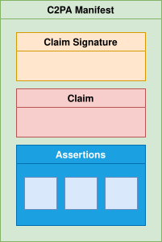
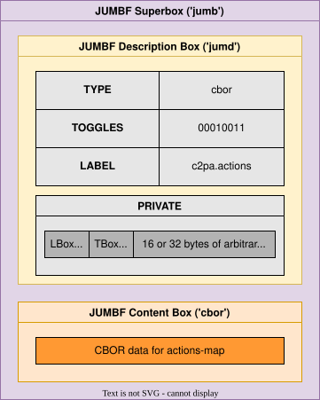
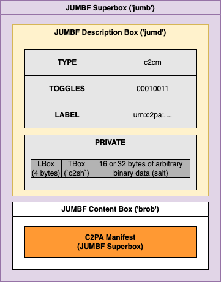
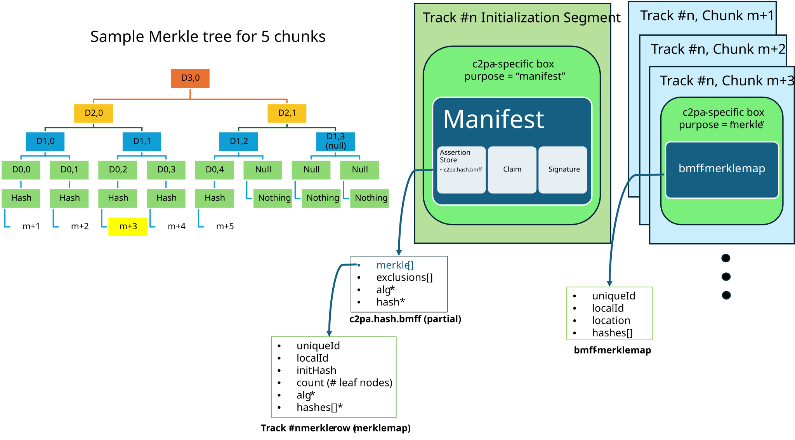
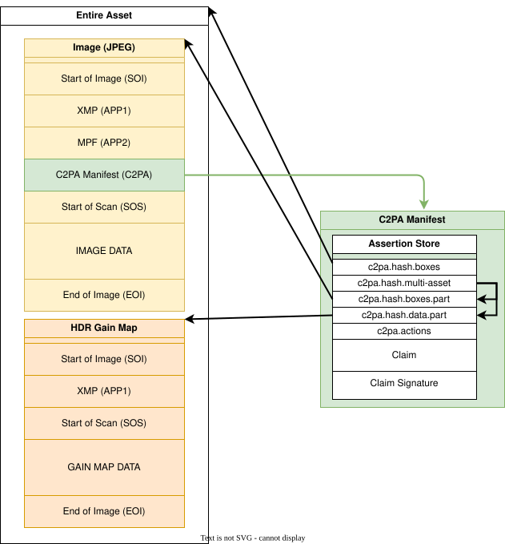
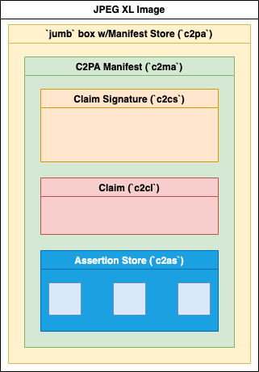
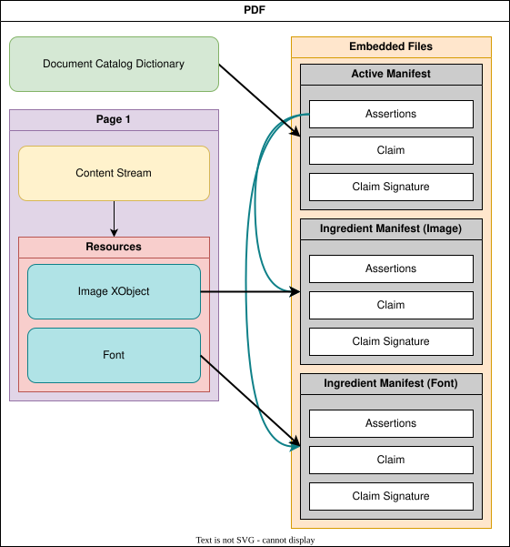

# Content Credentials

<a id="foreword"></a>
## Foreword

ISO (the International Organization for Standardization) is a worldwide federation of national standards bodies (ISO member bodies). The work of preparing International Standards is normally carried out through ISO technical committees. Each member body interested in a subject for which a technical committee has been established has the right to be represented on that committee. International organizations, governmental and non-governmental, in liaison with ISO, also take part in the work. ISO collaborates closely with the International Electrotechnical Commission (IEC) on all matters of electrotechnical standardization.

The procedures used to develop this document and those intended for its further maintenance are described in the ISO/IEC Directives, Part 1. In particular the different approval criteria needed for the different types of ISO documents should be noted. This document was drafted in accordance with the editorial rules of the ISO/IEC Directives, Part 2 (see www.iso.org/directives).

Attention is drawn to the possibility that some of the elements of this document may be the subject of patent rights. ISO shall not be held responsible for identifying any or all such patent rights. Details of any patent rights identified during the development of the document will be in the Introduction or on the ISO list of patent declarations received (see www.iso.org/patents) or both.

Any trade name used in this document is information given for the convenience of users and does not constitute an endorsement.

For an explanation on the voluntary nature of standards, the meaning of ISO specific terms and expressions related to conformity assessment, as well as information about ISO’s adherence to the World Trade Organization (WTO) principles in the Technical Barriers to Trade (TBT) see the following URL: www.iso.org/iso/foreword.html.

This document was prepared by Technical Committee ISO/TC 171, _ISO TC 171_, Subcommittee SC 2, _Document file formats, EDMS systems and authenticity of information_.

A list of all parts in the ISO 0000 series can be found on the ISO website.

<a id="_introduction"></a>
## Introduction

With the increasing velocity of digital content and the increasing availability of powerful creation and editing techniques, establishing the provenance of media is critical to ensure transparency, understanding, and ultimately, trust.

We are witnessing extraordinary challenges to trust in media. As social platforms amplify the reach and influence of certain content via ever more complex and opaque algorithms, mis-attributed and mis-contextualized content spreads quickly. Whether inadvertent misinformation or deliberate deception via disinformation, inauthentic content is on the rise.

Currently, those who wish to include metadata about their work cannot do so in a secure, tamper-evident and standardized way across platforms. Without this information coming from a recognized source, publishers and consumers lack critical context for determining the authenticity of media.

Provenance empowers content creators and editors, regardless of their geographic location or degree of access to technology, to disclose information about how an asset was created, how it was changed and what was changed. Each time an asset is changed, the existing provenance of the asset is preserved, with each new change being added to the provenance. In this way, content with provenance provides indicators of authenticity so that consumers can have awareness of altered content. Such provenance can include what has been changed and the source of those changes. This ability to provide provenance for creators, publishers and consumers is essential to facilitating trust online.

To address this issue at scale for publishers, creators and consumers, this document has been developed for providing content provenance and authenticity. It is designed to enable global, opt-in, adoption of digital provenance techniques through the creation of a rich ecosystem of digital provenance enabled applications for a wide range of individuals and organizations while meeting appropriate security requirements.

<a id="_scope"></a>
## Scope

This document describes the technical aspects of the C2PA architecture known as Content Credentials. It is a model for storing and accessing cryptographically verifiable information whose trustworthiness can be assessed based on a defined trust model. Included in this document is information about how to create and process a C2PA Manifest and its components, including the use of digital signature technology for enabling tamper-evidence as well as establishing trust.

<a id="_normative_references"></a>
## Normative references

The following documents are referred to in the text in such a way that some or all of their content constitutes requirements of this document. For dated references, only the edition cited applies. For undated references, the latest edition of the referenced document (including any amendments) applies.

*   \[ISO 8601-1:2019\], _Date and time — Representations for information interchange — Part 1: Basic rules_
    
*   \[ISO/IEC 10918-1:1994\], _Information technology — Digital compression and coding of continuous-tone still images: Requirements and guidelines_
    
*   \[ISO 12234-2:2001\], _Electronic still-picture imaging — Removable memory — Part 2: TIFF/EP image data format_
    
*   \[ISO/IEC 13818-1\], _Information technology — Generic coding of moving pictures and associated audio information — Part 1: Systems_, [https://www.iso.org/standard/91403.html](https://www.iso.org/standard/91403.html)
    
*   \[ISO 14064-1:2018\], _Greenhouse gases — Part 1: Specification with guidance at the organization level for quantification and reporting of greenhouse gas emissions and removals_, [https://www.iso.org/standard/66453.html](https://www.iso.org/standard/66453.html)
    
*   \[ISO/IEC 14496-12:2022\], _Information technology — Coding of audio-visual objects — Part 12: ISO base media file format_, [https://www.iso.org/standard/83102.html](https://www.iso.org/standard/83102.html)
    
*   \[ISO/IEC 14496-22:2019\], _Information technology — Coding of audio-visual objects — Part 22: Open Font Format_
    
*   \[ISO/IEC 15444-2:2023\], _Information technology — JPEG 2000 image coding system — Part 2: Extensions_
    
*   \[ISO 16684-1:2019\], _Graphic technology — Extensible metadata platform (XMP) — Part 1: Data model, serialization and core properties_
    
*   \[ISO 16684-3\], _Graphic technology — Extensible metadata platform (XMP) — Part 3: JSON-LD serialization of XMP_
    
*   \[ISO/IEC 18181-2:2024\], _Information technology — JPEG XL image coding system — Part 2: File format_
    
*   \[ISO/IEC 18477-3:2023\], _Information technology — Scalable compression and coding of continuous-tone still images — Part 3: Box file format_
    
*   \[ISO/IEC 19566-4:2020\], _Information technologies — JPEG systems — Part 4: Privacy and security_
    
*   \[ISO/IEC 19566-5:2023\], _Information technologies — JPEG systems — Part 5: JPEG universal metadata box format (JUMBF)_
    
*   \[ISO/IEC TR 20226:2025\], _Information technology — Green IT — Energy consumption measurement methodology for ICT and smart office equipment_, [https://www.iso.org/standard/86177.html](https://www.iso.org/standard/86177.html)
    
*   \[ISO/IEC 23000-19:2023\], _Information technology — Multimedia application format (MPEG-A) — Part 19: Common media application format (CMAF) for segmented media_, [https://www.iso.org/standard/85623.html](https://www.iso.org/standard/85623.html)
    
*   \[ISO/IEC 23009-9:2022\], _Information technology — Dynamic adaptive streaming over HTTP (DASH) — Part 9: Redundant encoding and packaging for segmented live media (REaP)_, [https://www.iso.org/standard/85639.html](https://www.iso.org/standard/85639.html)
    
*   \[ISO 28500:2017\], _Information and documentation — WARC file format_, [https://www.iso.org/standard/68004.html](https://www.iso.org/standard/68004.html)
    
*   \[ISO 32000-1:2008\], _Document management — Portable document format — Part 1: PDF 1.7_
    
*   \[ISO 32000-2:2020\], _Document management — Portable document format — Part 2: PDF 2.0_
    
*   \[RFC 2397\], _The "data" URL scheme_, [https://www.rfc-editor.org/rfc/rfc2397](https://www.rfc-editor.org/rfc/rfc2397)
    
*   \[RFC 3161\], _Internet X.509 Public Key Infrastructure Time-Stamp Protocol (TSP)_, [https://www.rfc-editor.org/rfc/rfc3161](https://www.rfc-editor.org/rfc/rfc3161)
    
*   \[RFC 3339\], _Date and Time on the Internet: Timestamps_, [https://www.rfc-editor.org/rfc/rfc3339](https://www.rfc-editor.org/rfc/rfc3339)
    
*   \[RFC 3533\], _The Ogg Vorbis Format_, [https://www.rfc-editor.org/rfc/rfc3533](https://www.rfc-editor.org/rfc/rfc3533)
    
*   \[RFC 4287\], _The Atom Syndication Format_, [https://www.rfc-editor.org/rfc/rfc4287](https://www.rfc-editor.org/rfc/rfc4287)
    
*   \[RFC 4648\], _The Base16, Base32, and Base64 Data Encodings_, [https://www.rfc-editor.org/rfc/rfc4648](https://www.rfc-editor.org/rfc/rfc4648)
    
*   \[RFC 5280\], _Internet X.509 Public Key Infrastructure Certificate and Certificate Revocation List (CRL) Profile_, [https://www.rfc-editor.org/rfc/rfc5280](https://www.rfc-editor.org/rfc/rfc5280)
    
*   \[RFC 5480\], _Elliptic Curve Cryptography Subject Public Key Information_, [https://www.rfc-editor.org/rfc/rfc5480](https://www.rfc-editor.org/rfc/rfc5480)
    
*   \[RFC 5646\], _Tags for Identifying Languages_, [https://www.rfc-editor.org/rfc/rfc5646](https://www.rfc-editor.org/rfc/rfc5646)
    
*   \[RFC 5652\], _Cryptographic Message Syntax (CMS)_, [https://www.rfc-editor.org/rfc/rfc5652](https://www.rfc-editor.org/rfc/rfc5652)
    
*   \[RFC 5758\], _Internet X.509 Public Key Infrastructure: Additional Algorithms and Identifiers for DSA and ECDSA_, [https://www.rfc-editor.org/rfc/rfc5758](https://www.rfc-editor.org/rfc/rfc5758)
    
*   \[RFC 6066\], _Transport Layer Security (TLS) Extensions: Extension Definitions_, [https://www.rfc-editor.org/rfc/rfc6066](https://www.rfc-editor.org/rfc/rfc6066)
    
*   \[RFC 6901\], _JavaScript Object Notation (JSON) Pointer_, [https://www.rfc-editor.org/rfc/rfc6901](https://www.rfc-editor.org/rfc/rfc6901)
    
*   \[RFC 6960\], _X.509 Internet Public Key Infrastructure Online Certificate Status Protocol - OCSP_, [https://www.rfc-editor.org/rfc/rfc6960](https://www.rfc-editor.org/rfc/rfc6960)
    
*   \[RFC 7826\], _Real-Time Streaming Protocol Version 2.0_, [https://www.rfc-editor.org/rfc/rfc7826](https://www.rfc-editor.org/rfc/rfc7826)
    
*   \[RFC 7932\], _Brotli Compressed Data Format_, [https://www.rfc-editor.org/rfc/rfc7932](https://www.rfc-editor.org/rfc/rfc7932)
    
*   \[RFC 8017\], _PKCS #1: RSA Cryptography Specifications Version 2.2_, [https://www.rfc-editor.org/rfc/rfc8017](https://www.rfc-editor.org/rfc/rfc8017)
    
*   \[RFC 8141\], _Uniform Resource Names (URNs)_, [https://www.rfc-editor.org/rfc/rfc8141](https://www.rfc-editor.org/rfc/rfc8141)
    
*   \[RFC 8230\], _Using RSA Algorithms with CBOR Object Signing and Encryption (COSE) Messages_, [https://www.rfc-editor.org/rfc/rfc8230](https://www.rfc-editor.org/rfc/rfc8230)
    
*   \[RFC 8259\], _The JavaScript Object Notation (JSON) Data Interchange Format_, [https://www.rfc-editor.org/rfc/rfc8259](https://www.rfc-editor.org/rfc/rfc8259)
    
*   \[RFC 8288\], _Web Linking_, [https://www.rfc-editor.org/rfc/rfc8288](https://www.rfc-editor.org/rfc/rfc8288)
    
*   \[RFC 8392\], _CBOR Web Tokens (CWT)_, [https://www.rfc-editor.org/rfc/rfc8392](https://www.rfc-editor.org/rfc/rfc8392)
    
*   \[RFC 8410\], _Algorithm Identifiers for Ed25519, Ed448, X25519, and X448 for Use in the Internet X.509 Public Key Infrastructure_, [https://www.rfc-editor.org/rfc/rfc8410](https://www.rfc-editor.org/rfc/rfc8410)
    
*   \[RFC 8610\], _Concise Data Definition Language (CDDL)_, [https://www.rfc-editor.org/rfc/rfc8610](https://www.rfc-editor.org/rfc/rfc8610)
    
*   \[RFC 8949\], \_Concise Binary Object Representation (CBOR) \_, [https://www.rfc-editor.org/rfc/rfc8949](https://www.rfc-editor.org/rfc/rfc8949)
    
*   \[RFC 9052\], _CBOR Object Signing and Encryption (COSE): Structures and Process_, [https://www.rfc-editor.org/rfc/rfc9052](https://www.rfc-editor.org/rfc/rfc9052)
    
*   \[RFC 9053\], _CBOR Object Signing and Encryption (COSE): Initial Algorithms_, [https://www.rfc-editor.org/rfc/rfc9053](https://www.rfc-editor.org/rfc/rfc9053)
    
*   \[RFC 9110\], _HTTP Semantics_, [https://www.rfc-editor.org/rfc/rfc9110](https://www.rfc-editor.org/rfc/rfc9110)
    
*   \[RFC 9360\], _CBOR Object Signing and Encryption (COSE): Header Parameters for Carrying and Referencing X.509 Certificates_, [https://www.rfc-editor.org/rfc/rfc9360](https://www.rfc-editor.org/rfc/rfc9360)
    
*   \[RFC 9399\], _Internet X.509 Public Key Infrastructure: Logotypes in X.509 Certificates_, [https://www.rfc-editor.org/rfc/rfc9399](https://www.rfc-editor.org/rfc/rfc9399)
    
*   \[RFC 9562\], _Universally Unique IDentifiers (UUIDs)_, [https://www.rfc-editor.org/rfc/rfc9562](https://www.rfc-editor.org/rfc/rfc9562)
    
*   \[RFC 9580\], _OpenPGP_, [https://www.rfc-editor.org/rfc/rfc9580](https://www.rfc-editor.org/rfc/rfc9580)
    
*   \[RFC 9864\], _Fully-Specified Algorithms for JSON Object Signing and Encryption (JOSE) and CBOR Object Signing and Encryption (COSE)_, [https://www.rfc-editor.org/rfc/rfc9864](https://www.rfc-editor.org/rfc/rfc9864)
    
*   \[RFC 9881\], _Internet X.509 Public Key Infrastructure: Algorithm Identifiers for the Module-Lattice-Based Digital Signature Algorithm (ML-DSA)_, [https://www.rfc-editor.org/rfc/rfc9881](https://www.rfc-editor.org/rfc/rfc9881)
    
*   \[RFC 9964\], _Module-Lattice-Based Digital Signature Algorithm (ML-DSA) for JSON Object Signing and Encryption (JOSE) and CBOR Object Signing and Encryption (COSE)_, [https://www.rfc-editor.org/rfc/rfc9964](https://www.rfc-editor.org/rfc/rfc9964)
    
*   \[ETSI TS 119 602 V1.1.1\], _Electronic Signatures and Trust Infrastructures (ESI); Lists of trusted entities; Data model_, [https://www.etsi.org/deliver/etsi\_ts/119600\_119699/119602/01.01.01\_60/ts\_119602v010101p.pdf](https://www.etsi.org/deliver/etsi_ts/119600_119699/119602/01.01.01_60/ts_119602v010101p.pdf)
    
*   \[ETSI TS 119 612 V2.4.1\], _Electronic Signatures and Infrastructures (ESI); Trusted Lists_, [https://www.etsi.org/deliver/etsi\_ts/119600\_119699/119612/02.04.01\_60/ts\_119612v020401p.pdf](https://www.etsi.org/deliver/etsi_ts/119600_119699/119612/02.04.01_60/ts_119612v020401p.pdf)
    
*   \[ETSI EN 319 102-1 V1.4.1\], _Electronic Signatures and Trust Infrastructures (ESI); Procedures for Creation and Validation of AdES Digital Signatures; Part 1: Creation and Validation_, [https://www.etsi.org/deliver/etsi\_en/319100\_319199/31910201/01.04.01\_60/en\_31910201v010401p.pdf](https://www.etsi.org/deliver/etsi_en/319100_319199/31910201/01.04.01_60/en_31910201v010401p.pdf)
    
*   \[W3C REC GIF\], _GRAPHICS INTERCHANGE FORMAT(sm) Version 89a_, [https://www.w3.org/Graphics/GIF/spec-gif89a.txt](https://www.w3.org/Graphics/GIF/spec-gif89a.txt)
    
*   \[W3C HTML\], _HTML Living Standard_, [https://www.w3.org/TR/html/](https://www.w3.org/TR/html/)
    
*   \[ETSI TS 119 182-1 V1.1.1\], _Electronic Signatures and Infrastructures (ESI); JAdES digital signatures; Part 1: Building blocks and JAdES baseline signatures_, [https://www.etsi.org/deliver/etsi\_ts/119100\_119199/11918201/01.01.01\_60/ts\_11918201v010101p.pdf](https://www.etsi.org/deliver/etsi_ts/119100_119199/11918201/01.01.01_60/ts_11918201v010101p.pdf)
    
*   \[W3C REC json-ld11\], _JSON-LD 1.1_, [https://www.w3.org/TR/json-ld11/](https://www.w3.org/TR/json-ld11/)
    
*   \[W3C REC media-frags\], _Media Fragments URI 1.0 (basic)_, [https://www.w3.org/TR/media-frags/](https://www.w3.org/TR/media-frags/)
    
*   \[W3C REC png-3\], _Portable Network Graphics (PNG) Specification (Third Edition)_, [https://www.w3.org/TR/png-3/](https://www.w3.org/TR/png-3/)
    
*   \[W3C REC SVG\], _Scalable Vector Graphics (SVG) 1.1 (Second Edition)_, [https://www.w3.org/TR/SVG11/](https://www.w3.org/TR/SVG11/)
    
*   \[W3C REC ttml2\], _Timed Text Markup Language 2 (TTML2)_, [https://www.w3.org/TR/ttml2/](https://www.w3.org/TR/ttml2/)
    
*   \[W3C REC annotation-model\], _Web Annotation Data Model_, [https://www.w3.org/TR/annotation-model/](https://www.w3.org/TR/annotation-model/)
    
*   \[W3C WebVTT\], _WebVTT: The Web Video Text Tracks Format_, [https://www.w3.org/TR/webvtt1/](https://www.w3.org/TR/webvtt1/)
    
*   \[W3C REC xmldsig-core1\], _XML Signature Syntax and Processing Version 1.1_, [https://www.w3.org/TR/xmldsig-core1/](https://www.w3.org/TR/xmldsig-core1/)
    
*   \[DNG\], _Digital Negative (DNG) Specification, Version 1.7.1.0_, [https://helpx.adobe.com/content/dam/help/en/camera-raw/digital-negative/jcr\_content/root/content/flex/items/position/position-par/download\_section\_733958301/download-1/DNG\_Spec\_1\_7\_1\_0.pdf](https://helpx.adobe.com/content/dam/help/en/camera-raw/digital-negative/jcr_content/root/content/flex/items/position/position-par/download_section_733958301/download-1/DNG_Spec_1_7_1_0.pdf)
    
*   \[Dublin Core\], _Dublin Core™ Metadata Element Set, Version 1.1: Reference Description_, [https://www.dublincore.org/specifications/dublin-core/dces/](https://www.dublincore.org/specifications/dublin-core/dces/)
    
*   \[Enhanced RTMP V2\], _Enhanced RTMP (V2)_, Veovera Software Organization, [https://veovera.org/docs/enhanced/enhanced-rtmp-v2.html](https://veovera.org/docs/enhanced/enhanced-rtmp-v2.html)
    
*   \[Exif\], _CIPA DC- 008-Translation- 2026 Exchangeable image file format for digital still cameras: Exif Version 3.1_, [https://www.cipa.jp/std/documents/download\_e.html?CIPA\_DC-008-2026-E](https://www.cipa.jp/std/documents/download_e.html?CIPA_DC-008-2026-E)
    
*   \[Exif metadata for XMP\], _CIPA DC- 010- 2026 Exif metadata for XMP: Published 2026 Edition_, [https://www.cipa.jp/std/documents/download\_e.html?CIPA\_DC-010-2026](https://www.cipa.jp/std/documents/download_e.html?CIPA_DC-010-2026)
    
*   \[IPTC Photo Metadata Standard\], _IPTC Photo Metadata Standard 2025.1_, [https://www.iptc.org/std/photometadata/specification/IPTC-PhotoMetadata-2025.1.html](https://www.iptc.org/std/photometadata/specification/IPTC-PhotoMetadata-2025.1.html)
    
*   \[ID3\], _ID3_, [https://id3.org/id3v2.3.0](https://id3.org/id3v2.3.0)
    
*   \[JSON Schema\], _JSON Schema: A Media Type for Describing JSON Documents_, [https://json-schema.org/draft/2020-12/json-schema-core](https://json-schema.org/draft/2020-12/json-schema-core)
    
*   \[MPF\], _Multi-Picture Format (MPF)_, [https://www.cipa.jp/std/documents/download\_e.html?CIPA\_DC-007-2025\_E](https://www.cipa.jp/std/documents/download_e.html?CIPA_DC-007-2025_E)
    
*   \[OpenType\], _OpenType® Specification Version 1.9.1_, [https://learn.microsoft.com/en-us/typography/opentype/spec/](https://learn.microsoft.com/en-us/typography/opentype/spec/)
    
*   \[Apache Parquet\], _Apache Parquet File Format_, [https://parquet.apache.org/docs/file-format/](https://parquet.apache.org/docs/file-format/)
    
*   \[ONNX\], _Open Neural Network Exchange Intermediate Representation Specification, Version 10_, [https://onnx.ai/onnx/repo-docs/IR.html#versioning](https://onnx.ai/onnx/repo-docs/IR.html#versioning)
    
*   \[Protocol Buffers\], _Protocol Buffers Language Guide (proto3)_, Google LLC, 2024, [https://protobuf.dev/programming-guides/proto3/](https://protobuf.dev/programming-guides/proto3/)
    
*   \[RIFF\], _Resource Interchange File Format_, [https://www.loc.gov/preservation/digital/formats/fdd/fdd000025.shtml](https://www.loc.gov/preservation/digital/formats/fdd/fdd000025.shtml)
    
*   \[RTMP\], _Adobe’s Real Time Messaging Protocol_, Adobe Systems Incorporated, 21 December 2012, [https://veovera.org/docs/legacy/rtmp-v1-0-spec.pdf](https://veovera.org/docs/legacy/rtmp-v1-0-spec.pdf)
    
*   \[SMF\], _Standard MIDI Files 1.0_, MIDI Manufacturers Association, [https://midi.org/standard-midi-files](https://midi.org/standard-midi-files)
    
*   \[SafeTensors\], _SafeTensors Format Specification, Version 0.4_, Hugging Face, 2024, [https://huggingface.co/docs/safetensors/index](https://huggingface.co/docs/safetensors/index)
    
*   \[TIFF\] _TIFF v6_, [https://www.itu.int/itudoc/itu-t/com16/tiff-fx/docs/tiff6.pdf](https://www.itu.int/itudoc/itu-t/com16/tiff-fx/docs/tiff6.pdf)
    
*   \[Unicode Standard Ch. 23\], _The Unicode Standard, Chapter 23: Special Areas and Format Characters (Variation Selectors)_, [https://www.unicode.org/versions/latest/ch23.pdf](https://www.unicode.org/versions/latest/ch23.pdf)
    
*   \[UAX #15\], _Unicode Standard Annex #15: Unicode Normalization Forms_, [https://www.unicode.org/reports/tr15/](https://www.unicode.org/reports/tr15/)
    
*   \[XMP Specification Part 2\], _XMP Specification Part 2: Additional Properties_, Adobe Inc., [https://github.com/adobe/XMP-Toolkit-SDK/blob/main/docs/XMPSpecificationPart2.pdf](https://github.com/adobe/XMP-Toolkit-SDK/blob/main/docs/XMPSpecificationPart2.pdf)
    

<a id="_terms_and_definitions"></a>
## Terms and definitions

<a id="actor-definition"></a>
### actor

human or non-human (hardware or software) that is participating in the C2PA ecosystem. For example: a camera (capture device), image editing software, cloud service or the person using such tools

> **NOTE:**
> An organization or group of {{actor}}s may also be considered an {{actor}} in the C2PA ecosystem.

<a id="claim-generator-definition"></a>
### claim generator

non-human (hardware or software) {{actor}} that generates the {{claim}} about an {{asset}} as well as the {{claim signature}}, thus leading to the {{asset}}'s associated {{C2PA Manifest}}

<a id="signer-definition"></a>
### signer

credential holder of a private key that is used to sign the {{claim}}. The {{signer}} is identified by the subject of the credential

<a id="_manifest_consumer"></a>
### manifest consumer

{{actor}} who consumes an {{asset}} with an associated {{C2PA Manifest}} for the purpose of obtaining the {{provenance data}} from the {{C2PA Manifest}}

<a id="_validator"></a>
### validator

{{manifest consumer}} that performs {{C2PA Manifest}} validation

<a id="_action"></a>
### action

operation performed by an {{actor}} on an {{asset}}. For example, "create", "embed", or "apply filter"

<a id="_digital_content"></a>
### digital content

portion of an {{asset}} that represents the actual content, such as the pixels of an image, along with any additional technical metadata required to understand the content (e.g., a colour profile or encoding parameters)

<a id="_asset_metadata"></a>
### asset metadata

Non-technical information about the {{asset}} and its {{digital content}}

<a id="_asset"></a>
### asset

file or stream of data containing {{digital content}}, {{asset metadata}} and optionally, a {{C2PA Manifest}}

> **NOTE:**
> For the purposes of this definition, we will extend the typical definition of "file" to include cloud-native and dynamically generated data.

<a id="_derived_asset"></a>
### derived asset

{{asset}} that is created by starting from an existing {{asset}} and performing {{action}}s to it that modify its {{digital content}}

**EXAMPLE:** An audio stream that has been shortened or a document where pages have been added.

<a id="_asset_rendition"></a>
### asset rendition

representation of an {{asset}} (either as a part of an {{asset}} or a completely new {{asset}}) where the {{digital content}} has had a 'non-editorial transformation' {{action}} (e.g., re-encoding or scaling) applied

**EXAMPLE:** A video file that is re-encoded for reduced screen resolution or network bandwidth.

<a id="_composed_asset"></a>
### composed asset

{{asset}} that is created by building up a collection of multiple parts or fragments of {{digital content}} (referred to as ingredients) from one or more other {{asset}}s. When starting from an existing {{asset}}, it is a special case of a {{derived asset}} - however a {{composed asset}} can also be one that starts from a "blank slate"

**EXAMPLES:**

*   A video created by importing existing video clips and audio segments into a "blank slate".
    
*   An image where another image is imported and super-imposed on top of the starting image.
    

<a id="editorial-transformation-definition"></a>
### editorial transformation

type of transformation that alters either the intent or meaning or both of the {{digital content}}.

> **NOTE:**
> Every editorial transformation is a {{perceptible transformation}}, but not every {{perceptible transformation}} is editorial

<a id="perceptible-transformation-definition"></a>
### perceptible transformation

A type of transformation that alters how the [digital content](#_digital_content) is perceived by humans under normal conditions.

<a id="assertion-definition"></a>
### assertion

data structure which represents a statement either made (or "created") by the {{signer}} or simply gathered at claim generation-time, concerning the {{asset}}. This data is a part of the {{C2PA Manifest}}

<a id="claim-definition"></a>
### claim

digitally signed and tamper-evident data structure that references a set of {{assertion}}s, concerning an {{asset}}, and the information necessary to represent the {{content binding}}. If any {{assertion}}s were redacted, then a declaration to that effect is included. This data is a part of the {{C2PA Manifest}}

<a id="claim-signature-definition"></a>
### claim signature

digital signature on the {{claim}} using the private key of a {{signer}}. The {{claim signature}} is a part of the {{C2PA Manifest}}

<a id="c2pa-manifest-definition"></a>
### C2PA Manifest

set of information about the _provenance_ of an {{asset}} based on the combination of one or more {{assertion}}s (including {{content binding}}s), a single {{claim}}, and a {{claim signature}}. A {{C2PA Manifest}} is part of a {{C2PA Manifest Store}}

> **NOTE:**
> A {{C2PA Manifest}} can reference other {{C2PA Manifest}}s.

<a id="_c2pa_manifest_store"></a>
### C2PA Manifest Store

collection of {{C2PA Manifest}}s that can either be embedded into an {{asset}} or be external to its {{asset}}

<a id="_content_credential"></a>
### Content Credential

preferred, non-technical, term for a {{C2PA Manifest}}. The {{C2PA Manifest Store}} therefore represents the Content Credentials of an asset

> **NOTE:**
> Content Credentials also refers to the overall C2PA technology, and is therefore essentially treated as a plural noun. If a {{C2PA Manifest}} is a Content Credential, then multiple {{C2PA Manifest}} or the broader, universal concept is Content Credentials

<a id="_active_manifest"></a>
### active manifest

last manifest in the list of {{C2PA Manifest}}s inside of a {{C2PA Manifest Store}} which is the one with the set of {{content binding}}s that are able to be validated

<a id="_provenance"></a>
### provenance

logical concept of understanding the history of an {{asset}} and its interaction with {{actor}}s and other {{asset}}s, as represented by the {{provenance data}}

<a id="_provenance_data"></a>
### provenance data

set of {{C2PA Manifest}}s for an {{asset}} and, in the case of a {{composed asset}}, its ingredients

> **NOTE:**
> A {{C2PA Manifest}} can reference other {{C2PA Manifest}}s

<a id="_authenticity"></a>
### authenticity

property of {{digital content}} comprising a set of facts (such as the {{provenance data}} and {{hard binding}}s) that can be cryptographically verified as not having been tampered with

<a id="_content_binding"></a>
### content binding

Information that associates {{digital content}} to a specific {{C2PA Manifest}} associated with a specific {{asset}}, either as a {{hard binding}} or a {{soft binding}}

<a id="_hard_binding"></a>
### hard binding

One or more cryptographic hashes that uniquely identifies either the entire {{asset}} or a portion thereof

<a id="_soft_binding"></a>
### soft binding

content identifier that is either (a) not statistically unique, such as a {{fingerprint}}, or (b) embedded as an {{invisible watermark}} in the identified {{digital content}}

<a id="_trust_signals"></a>
### trust signals

collection of information that can inform a {{manifest consumer}}'s judgment of the trustworthiness of an {{asset}}. These are in addition to the {{signer}} upon which the fundamental trust model relies

<a id="_c2pa_trust_list"></a>
### C2PA Trust List

C2PA-managed list of X.509 certificate trust anchors that issue certificates to hardware and software {{signer}}s that are trusted to sign {{claim}}s

<a id="_fingerprint"></a>
### fingerprint

set of inherent properties computable from {{digital content}} that identifies the content or near duplicates of it

**EXAMPLE:** An {{asset}} becomes separated from its {{C2PA Manifest}} due to removal or corruption of {{asset}} metadata. A {{fingerprint}} of the {{digital content}} of the {{asset}} is used to search a database to recover the {{asset}} with an intact {{C2PA Manifest}}

<a id="_invisible_watermark"></a>
### invisible watermark

Information incorporated in a substantially human imperceptible way into the {{digital content}} of an {{asset}} which can be used, for example, to uniquely identify the {{asset}} or to store a reference to a {{C2PA Manifest}}

<a id="_visible_watermark"></a>
### visible watermark

perceptible component of the {{digital content}} carrying some human consumable information about the provenance of the {{asset}}

<a id="_manifest_repository"></a>
### manifest repository

repository into which {{C2PA Manifest}}s and {{C2PA Manifest Store}}s can be placed, and which can be searched using a {{content binding}}

<a id="_durable_content_credential"></a>
### durable Content Credential

a {{Content Credential}} for which there exists one or more {{soft binding}}s that enable its discovery in a {{manifest repository}}.

<a id="_notation"></a>
## Notation

<a id="_technical_overview"></a>
## Technical Overview

<a id="_overview"></a>
### Overview

The C2PA information comprises a series of statements that cover areas such as asset creation, edit actions, capture device details, bindings to content and many other subjects. These statements, called assertions, make up the provenance of a given asset and represent a series of trust signals that can be used by a human to improve their view of trustworthiness concerning the asset. Assertions are wrapped up with additional information into a digitally signed entity called a claim. This claim is digitally signed by the claim generator on behalf of the [signer](#signer-definition), using the signer’s signing credential, producing the claim signature.

These assertions, claims, and the claim signature are all bound together into a verifiable unit called a C2PA Manifest (see [A C2PA Manifest and its constituent parts](#manifest-parts)) by a hardware or software component called a claim generator. The set of C2PA Manifests, as stored in the asset’s Content Credential, represent its provenance data.



Figure 1. A C2PA Manifest and its constituent parts

<a id="_establishing_trust"></a>
### Establishing Trust

The basis of making trust decisions in C2PA, our [trust model](#_trust_model), is the identity of the signer associated with the cryptographic signing key used to sign a claim in a C2PA Manifest. The claim signatures of C2PA Manifests, when combined with trusted time stamps, can undergo the validation process indefinitely to determine if claims were signed while the signing credentials were valid and not revoked.

<a id="_an_example"></a>
### An Example

A very common scenario will be a user taking a photograph with their C2PA-enabled camera (or phone). In that instance, the camera would create a manifest containing some assertions including information about the camera itself, a thumbnail of the image and some cryptographic hashes that bind the photograph to the manifest. These assertions would then be listed in the Claim, which would be digitally signed and then the entire C2PA Manifest (see [Example C2PA Manifest of a Photograph](#Photo_Manifest)) would be embedded into the output JPEG. This C2PA Manifest would remain valid indefinitely.

![Example C2PA Manifest of a Photograph](https://kroki.io/plantuml/svg/eNq1Vk1v2zAMPce_guthOTXAhh2LAm26DRu2tqiBXYZiYGQ61qIPQ5LbGUP_-yi5bZxMbosB0yWRxPdEPlE0C-AxB1TK3nrQ8pc0a7hBJ23nwa5-kggepAEEzzuKoJK4dqiLiEuoHwOoKAam0EgPoXOG4XXNUwLsgtUYpIC1s10bT1j1MF_MB2KDmhLYU0gT36Kgklp0GKwDYw09sDeyosTpWxvGa2h6IN2GPjpg1n6xWBSzsX0gRzb0LW3PS5tCOqFG84FEk16R88UsrW3BD3740KsYdHJ7I030VUNFNXYqfLAmnPMhUNrOCf5BFuPS2WK2NRVWtxyXCSUzETjWGaO-iVFRHSBYcHLdBFY87kprih0CdNXRkXjb4vEx_E6w2cq6itzSKlbtsnMt081mKxSbqLupho0veEOGzYrZXZZQTxB-dEQmxxedvN_MM96ICUarqhwhaWuWjaxrO0E5RXiGbvNNWkXhibhPVeebKVfR55kZRFOxD3s5vn9hW_Y4KaRQeb4rqqboLqXZTNJNuHfhOBUpT_rVCoFcCgbOOZwN5eBVYonEEFMS0MPBVzSyJh-g5FdMB7CXrSOA3gUMpnrXdGQufDKH58ZSodRQyrVBLkj0rP1w7kiV8Xh8obAs4Tsrw-Po9Yb6Y1helO9ZiLUMqLbH_cVwvbNyV2RDU9nQhkie9Fo95zU7nYMfvRa2Ig7i9OKKy5rrRNLqVoaG0TUXPiPIZ6FcoWJpPfGeXKxPfC2mSkt7yv-TFDjc8iP7OI0wf0cJeRCzbKEpYIUBo_2E9a4-J28mBBqL9Lm8OD_8cravU8WHSRU_eJMMURXB3wSH0Hmqkna4Gb5NbWODnURGTWWYe_h4WYKyAqMYi6z59V-re9JuRdpbi5KFptMrw4EsRC7dXq7k2yeVlBrXLOWpNOh6-BRnXLgD_oeIGvTNImbBE0_nZSG9e0Fy7L0gwV0AShO7hFQsZtLU1ul0fYAr24V4-fd7wvVtsFxJ24bbpOg3eVhJU23h968t0nLb8PIEyM-Gf3cP_Ux6boffudupyFynvuPwONWjRwMuTTkDX_wBH27CdQ==?id=Photo_Manifest)

Figure 2. Example C2PA Manifest of a Photograph

A Manifest Consumer, such as a C2PA validator, helps users to establish the trustworthiness of the asset by first validating the digital signature and its associated credential. It also checks each of the assertions for validity and presents the information contained in them, and the signature, to the user in a way that they can then make an informed decision about the trustworthiness of the digital content.

<a id="_design_goals"></a>
### Design Goals

In the creation of the C2PA architecture, it was important to establish some clear goals for the work to ensure that the technology was usable across a wide spectrum of hardware and software implementations worldwide and accessible to all. Those goals can be found in [C2PA Design Goals](#design-goals).

**Table 1. C2PA Design Goals**

| Goal | Description |
| --- | --- |
| Privacy | Enable users to control the privacy of their information, including consumption data and information recorded in provenance |
| Responsibility | Ensure consumers can determine the provenance of an asset |
| Scalability | Enable creation/consumption/validation of media provenance at the same scale as media creation/consumption on the web |
| Extensibility | Ensure future metadata and credential providers are able to add their information without requiring input or approval from the C2PA |
| Interoperability | Ensure that differing implementations are able to operate with each other without ambiguity |
| Whole Workflow Applicability | Maintain the provenance of the asset across multiple tools, from creation through all subsequent modification and publication/distribution |
| Technology Minimalism | Create only the minimum required novel technology in the specification by relying on prior, well-established techniques |
| Security | Design to ensure that consumers can trust the integrity and source of provenance, and ensure the design is reviewed by experts |
| Content Ubiquity | Enable the inclusion of provenance for all common media types, including documents |
| Flexible Locality | Enable both online and offline (asset-only) storage and consumption/validation of provenance |
| Global Universality | Design for the needs of interested users throughout the world |
| Accessibility | Ensure that the technology can be used in a way that conforms to recognized accessibility standards, such as WCAG |
| Harms and Misuse | Design to avert and mitigate potential harms, including threats to human rights and disproportionate risks to vulnerable groups |
| Evolving | Continuous review of the specification against these goals to ensure that they remain our priority |

<a id="_entity_diagram"></a>
## 1\. Entity Diagram

[C2PA Entity Diagram](#entity-diagram) provides a look at how all of the pieces of the C2PA system integrate and relate to each other.

![C2PA Entity Diagram](https://kroki.io/plantuml/svg/eNqlVEtvEzEQPmd_xSg9REJKV3DgsKBKtAXEAZBobghFznqSjOq1V7bTElD_O2Pvw7tJaJCItIo9j2--eXiyGXz5unhfAGpPfg_kQGgQioSDtbFQKuFc9tb5vcKrLN5uSWysqOB3Bo06nsJvBsJ7S6udxwAjoUK_NdJ16g9G-xujGHaldthJr0V5v7Fmp2Wj26NS5jHrMZsYWlSdxxaFRNtHBQi4d_QL4eXrXjYI9kBGoR9bh3xgZZRsxU9Z-J6yt3mbajZRuEEts8nkBbxTCiwq4clot6Was7MIjvRmp4SFnVbIFI3fon0kx5oaS1oTNt4fLaIGRZqrYrG26LjYgNUKpUSZl8xHkHbR9poLc2TK93uULFijRV1iY7rAnx5IQ56T54aVLs-54EIzkToQFQpQYcUAbM-ZtPlkkxlsSSIwWyZqfC8Qes-sap4Cv-XU3OXlZTaJmpJsqbC9NCZV4G9dhBMPhiTU1qw4noNH8lsG2yjmXFrzyJOEGMK4e9K1CLMTMvT7GsFYnpAs8Ivj98459PD9-8VShNOPH9zlyeSGK8QGfJpB4MR_n9ELKbzgS5R8FprW6LixxjLRpxGiDeXoUeOtRb4dQOR5B5rnQ4Rr0pLLEf3Lhsly1cgalGT6SW8sSgo94_czHVx7GtOAQ73iiNEnzc-uipOWiN22pLr7YrurVlqQGgq7EjTse043SlDVkA-nNkzPxyWAbyhFGWUJNnrf0UYLvxsXdqyJ-TahellMNQadu042l7gmTYOEF3bnPE_KTeCzplJ4HCTaKhdU4Z0XVX2Q3KjtkUMngSiaNom_qsWyahVLFxRdGTjfB-x8UtzUuU7nxkPRhznCPyxwO5GDcp6v7XH4v8UZ1KJvX7S13W1p1mnI3JFXiM_LlF1cPB01KNjGZ1kU42rP53N5BQcPL0uJF0UY22B2NXwYF2H3v_G8vIpwggIqsU-7jaN1Dy56tqHbFXDCe7gVZ3DKt3vWzztn4x1SFOPZgADYXy42Yac3UPHIWGmPHwCdGKaINuVW7qenmv0sfMJnjqMpG6KmvfdvXE9iddX8D4ijJE-ChRFoAYd4zUKJvWxfzoEu7Z9klF5UNklh0_TCeCBT0c8OZoQfZOmaqMcVf2bOoIdJ63ZYqPSKz_HpcM4X4tzgtzvgRAX_AARdUe8=?id=entity-diagram)

Figure 3. C2PA Entity Diagram

An [asset](#_asset) embeds a [C2PA Manifest Store](#_c2pa_manifest_store) which holds one or more [C2PA Manifests](#_c2pa_manifest); the last of these is the [active manifest](#_active_manifest), whose [content bindings](#_content_binding) are validated against the asset’s digital content. Within each manifest, the [assertion store](#assertion-store-arch) collects the [assertions](#_assertion) (including any [ingredient assertions](#ingredient_assertion) and the [content binding](#_content_binding)); the [claim](#_claim) references those assertions by URI and is cryptographically signed by the [claim signature](#claim-signature-definition). Green lines denote containment (one component is structurally embedded within another); blue lines denote logical references between components.

For the full structural description of each component see [Manifests](#_manifests), [Assertions](#_assertions), [Claims](#_claims), and [Binding to Content](#_binding_to_content).

<a id="_assertions"></a>
## 2\. Assertions

<a id="_general"></a>
### 2.1. General

It is expected that each claim generator, used by actors in the system that creates or processes an asset, will create or assemble one or more assertions about when, where, and how the asset was originated or transformed. An assertion is labelled data, typically (though not required to be) in a CBOR-based structure which represents a declaration about an asset. Some of these assertions will contain human-generated information (e.g., alternate text for accessibility) while others will come from machines (software/hardware) providing the information they generated (e.g., camera type).

Some examples of assertions are:

*   metadata (e.g., camera information such as maker or lens);
    
*   actions performed on the asset (e.g., clipping, colour correction);
    
*   thumbnail of the asset or its ingredients;
    
*   content bindings (e.g., cryptographic hashes).
    

Certain assertions may be redacted by subsequent claims (see [Redaction of Assertions](#_redaction_of_assertions)), but they cannot be modified once made as part of a claim.

<a id="assertion_labels"></a>
### 2.2. Labels

<a id="_namespacing"></a>
#### 2.2.1. Namespacing

String values in C2PA data structures may be organized into namespaces using a period (`.`) as a separator. The C2PA namespace, `c2pa`, shall be the beginning of any string value defined in this specification. In addition to the `c2pa` namespace, the [C2PA namespace registry](https://github.com/c2pa-org/reserved-namespaces/blob/main/namespaces.yml) lists other top-level namespaces.

Entity-specific namespaces, meaning any namespace other than `c2pa` or those on the registry, shall begin with the Internet domain name for the entity, beginning with a valid [IANA top-level domain](https://data.iana.org/TLD/tlds-alpha-by-domain.txt), similar to how Java packages are defined (e.g., `com.litware`, `net.fineartschool`).

> **NOTE:**
> The purpose of the entity-specific namespace is to avoid collisions between labels defined by different entities. For example, if two different entities define a label called `metadata`, the use of that format for entity-specific namespaces allows them to be easily distinguished as `com.litware.metadata` and `net.fineartschool.metadata`.

The period-separated components of an entity-specific namespace shall follow the variable naming convention (`[a-zA-Z0-9][a-zA-Z0-9_-]*`) specified in the POSIX or C locale, as defined in the ABNF below ([ABNF for Namespaces](#abnf_for_namespaces)).

ABNF for Namespaces

```abnf
qualified-namespace = "c2pa" / registered-namespace / entity
registered-namespace = <a namespace listed in the C2PA namespace registry>
entity = entity-component *( "." entity-component )
entity-component = 1( DIGIT / ALPHA ) *( DIGIT / ALPHA / "-" / "_" )
```

<a id="_label_naming"></a>
#### 2.2.2. Label Naming

Each assertion has a label defined either by the C2PA specifications or an external entity. These labels are strings which are namespaced, as described in the preceding clause or by an entity. The most common labels will be defined in the `c2pa` namespace, but labels may use any namespace that follows the conventions. Labels are also versioned with a simple incrementing integer scheme (e.g., `c2pa.actions.v2`). If no version is provided, it is considered as `v1`. The list of publicly known labels can be found in [C2PA Standard Assertions](#_c2pa_standard_assertions).

ABNF for Assertion Labels

```abnf
namespaced-label = qualified-namespace label
qualified-namespace = "c2pa" / entity
entity = entity-component *( "." entity-component )
entity-component = 1( DIGIT / ALPHA ) *( DIGIT / ALPHA / "-" / "_" )
label = 1*( "." label-component )
label-component = 1( DIGIT / ALPHA ) *( DIGIT / ALPHA / "-" / "_" )
```

The period-separated components of a label follow the variable naming convention (`[a-zA-Z][a-zA-Z0-9_-]*`) specified in the POSIX or C locale, with the restriction that the use of a repeated underscore character (`__`) is reserved for labelling multiple assertions of the same type.

<a id="_versioning"></a>
### 2.3. Versioning

When an assertion’s schema is changed, it should be done in a backwards-compatible manner. This means that new fields may be added and existing ones may be marked as deprecated (i.e., can be read, but never written). Existing fields shall not be removed. The label would then consist of an incremented version number, for example moving from `c2pa.actions` (deprecated) to `c2pa.actions.v2`.

Since the addition of optional fields can be done while maintaining backwards compatibility, such fields may be added to an existing assertion’s schema without a change to the version number.

Deprecated fields for C2PA standard assertions shall be indicated in [C2PA Standard Assertions](#_c2pa_standard_assertions). Claim generators shall not insert data into deprecated assertion fields when creating assertions.

In those situations where a non-backwards compatible change is required, instead of increasing the label’s version number, the assertion shall be given a new label.

> **NOTE:**
> For example, `c2pa.ingredient` could be changed to the fictional `c2pa.component`.

<a id="_multiple_instances"></a>
### 2.4. Multiple Instances

Multiple assertions of the same type can occur in the same manifest, but since assertions are referenced by claims via their label, the assertion labels are required to be unique. This is accomplished by adding a double-underscore and a monotonically increasing index to the label. For example, if a manifest contains a single assertion of type `c2pa.metadata`, then the assertion label will be `c2pa.metadata`. If a manifest contains three assertions of this type, the labels will be `c2pa.metadata`, `c2pa.metadata__1` and `c2pa.metadata__2`.

When a label includes a version number, that version number is part of the label itself. As such, when there are multiple instances, the instance number continues to follow the label - e.g., `c2pa.ingredient.v2__2`.

<a id="schema-validation"></a>
### 2.5. Schema Validation

The schemas provided in this document, as well as the machine readable ones that can be downloaded from the C2PA website, should be used by claim generators to ensure that the assertions they create are consistent with the expected structures. These schemas can also be used as aids in understanding the syntax to be read or written. Validators should not validate inputs against these schemas.

<a id="assertion-store-arch"></a>
### 2.6. Assertion Store

The set of assertions referenced by a [claim](#_claims) in a manifest are collected together into a logical construct that is referred to as the _assertion store_. The assertions and assertion store shall be stored as described in [Serialization](#_serialization); in particular, each assertion referenced in a claim’s `created_assertions` or `gathered_assertions` (but not [`redacted_assertions`](#_redaction_of_assertions)) shall be present in the assertion store located in the same C2PA Manifest as the claim.

In each manifest, there is a single assertion store. However, as an asset may have multiple manifests associated with it, each one representing a specific series of assertions, there may be multiple assertion stores associated with an asset.

Each assertion in the assertion store should include a randomly-generated salt in the private `c2sh` box within its JUMBF Description Box, as documented in [Hashing JUMBF Boxes](#_hashing_jumbf_boxes), so that subsequent generators can [redact assertions](#_redaction_of_assertions) securely.

<a id="_embedded_vs_externally_stored_data"></a>
### 2.7. Embedded vs Externally-Stored Data

Some assertion data, due to its size or an infrequent need for it, may be externally hosted. Such data are not embedded in the assertion store, but instead are referenced by URI. This is accomplished through either a [cloud data](#_cloud_data) assertion for remotely-stored C2PA assertions (JUMBF) or an [external reference](#external_reference_assertion) assertion for either remotely stored assertion or non-assertion data. In both cases, the externally hosted data is not retrieved nor validated as part of manifest validation, and is only retrieved and validated when specifically needed by an application according to a different set of validation rules as described in [Validate the Assertions](#_validate_the_assertions).

<a id="_redaction_of_assertions"></a>
### 2.8. Redaction of Assertions

Assertions that are present in an asset-embedded manifest may be removed from that asset’s manifest when the asset is [used as an ingredient](#_ingredient_storage). This process is called redaction.

Redaction shall be performed either by removing the entire assertion from the manifest’s assertion store or by replacing its content, as described in [Redacted Assertion Representation](#_redacted_assertion_representation).

In addition, a record that something was removed shall be added to the [claim](#_claims) in the form of a [URI reference](#_uri_references) to the redacted assertion in the `redacted_assertions` field of the claim. It is also strongly recommended that the claim generator should add a `c2pa.redacted` [action](#_actions) with a `redacted` field as described in [Parameters](#_parameters).

When redacting an ingredient assertion that references a C2PA Manifest, the associated manifest shall be removed from the C2PA Manifest Store if no other references to it remain after redacting.

> **NOTE:**
> Because each assertion’s [URI reference](#_uri_references) includes the assertion label, it is also known what type of information (e.g., thumbnail, metadata, etc.) was removed. This enables both humans and machines to apply rules to determine if the removal was acceptable.

Unless the assertion redaction is accompanied by changes to the data covered by [content bindings](#_binding_to_content), an [update manifest](#_update_manifests) should be used to document the redaction, to indicate that [digital content](#_digital_content) was not changed.

Claim generators shall not redact assertions with a label of `c2pa.actions` or `c2pa.actions.v2` as this assertion type represents essential information in understanding the history of an asset. When creating an [update manifest](#_update_manifests), the claim generator shall not redact the [hard binding to content](#_binding_to_content) assertion that applies to the current asset.

> **NOTE:**
> How a validator handles redacted assertions, including the representation described in [Redacted Assertion Representation](#_redacted_assertion_representation), is described in [Validate the Assertions](#_validate_the_assertions).

<a id="_specifications_of_time_in_assertions"></a>
### 2.9. Specifications of time in assertions

The default specification for a date/time value in an assertion is the date/time format which is serialized in CBOR as tag number `0` ([\[RFC 8949\]](#RFC8949), 3.4.1) and represented in CDDL as type `tdate`.

> **NOTE:**
> CBOR Tag 0 is described in [\[RFC 8949\]](#RFC8949) as "the date-time production in [\[RFC 3339\]](#RFC3339), as refined by Section 3.3 of [\[RFC 4287\]](#RFC4287), representing the point in time described there". This means that the presence of either an explicit timezone or `Z` (for UTC) is required.

Time values in this specification have different evidentiary meanings:

*   The standard use of time records the signer’s claim of the time in question.
    
*   A [claimed time of signing](#_adding_a_claimed_time_of_signing) specifically records the time (or interval) of signing, as claimed by the signer. It is not independently authoritative.
    
*   A [trusted time stamp](#timestamp_assertion) contains evidence from a Time-Stamping Authority (TSA) about the data submitted to that TSA. Its meaning and validation are defined by the time stamp profile and do not replace the semantics of other time fields.
    

Claim generator provided timestamp fields use `generator-lower-bound-time-type` or `generator-upper-bound-time-type`. A value may be either a direct `tdate` or a map containing a `tdate` in `value` and an optional `timeStampType`. A direct `tdate`, or a map without `timeStampType`, shall be interpreted as `absolute`.

`absolute` indicates recorded time. `lowerBound` indicates a lower bound on the recorded time but makes no guarantee about the actual time. `upperBound` indicates an upper bound on the recorded time but makes no guarantee about the actual time. When provided on corresponding start and end fields, lower and upper bounds bracket the range within which the actual process or action occurred.

There is one case, as described when [adding a claimed time of signing](#_adding_a_claimed_time_of_signing), where the time is represented as a CBOR tag number `1` ([\[RFC 8949\]](#RFC8949), 3.4.2) (as the number of seconds from 1970-01-01T00:00Z).

Additionally there is the [time stamp assertion](#timestamp_assertion), which uses the standard time-stamping formats as described in [the signing process](#_signing_a_claim).

The reason why there are different types of date & time representations is to allow for the most appropriate representation, based on existing standards in use, for each specific use case.

<a id="_unique_identifiers"></a>
## 3\. Unique Identifiers

<a id="manifest-identifier"></a>
### 3.1. Uniquely Identifying C2PA Manifests and Assets

Every C2PA Manifest is uniquely identified and referenced by a Uniform Resource Name [URN](#RFC8141) from the `c2pa` URN namespace, and a C2PA asset is uniquely identified by the `c2pa` URN value of its active manifest. The ABNF for the C2PA URN is described by [ABNF for C2PA URN](#abnf_for_urn).

A `c2pa` URN shall consist of two mandatory and two optional components, in the following order, with colons (`:`) between each section.

*   URN identifier (`urn:c2pa`): REQUIRED.
    
*   UUID v4, in string representation (as per [UUID](#RFC9562), section 4): REQUIRED.
    
*   Claim Generator identifier string : OPTIONAL.
    
*   Version and Reason string (as described below) : OPTIONAL.
    

When present, the "Claim Generator identifier" string shall consist of no more than 32 characters from the ASCII range (as per RFC 20), but which are not Control Characters (RFC 20, 5.2) or Graphic Characters (RFC 20, 5.3).

When present, the "Version and Reason" string shall consist of a positive integer, followed by an underscore (`_`) and then another positive integer. The details of each of these values and how they are to be used is described in [Versioning Manifests Due to Conflicts](#_versioning_manifests_due_to_conflicts). In addition, when a "Version and Reason" string is present, a "Claim Generator identifier" string shall also be present but it may be empty.

ABNF for C2PA URN

```abnf
c2pa_urn = c2pa-namespace UUID [claim-generator [version-reason]]

c2pa-namespace = "urn:c2pa:"

; this definition is taken from RFC 9562
UUID     =  4hexOctet "-"
			2hexOctet "-"
			2hexOctet "-"
			2hexOctet "-"
			6hexOctet
hexOctet = HEXDIG HEXDIG
DIGIT    = %x30-39
HEXDIG   = DIGIT / "A" / "B" / "C" / "D" / "E" / "F"

; ASCII, but not Control Characters or Graphic Characters
visible-char-except-space = %x21-7E / %x80-FF

; claim-generator-identifier is a string of 0 to 32 visible-char-except-space characters
; this means that an empty string is valid
claim-generator = ":" claim-generator-identifier
claim-generator-identifier = 0*32visible-char-except-space

; version-reason is a string consisting of a positive integer 
; followed by an underscore and a positive integer
version-reason = ":" version "_" reason
version = 1*DIGIT
reason = 1*DIGIT
```

Examples:

*   `urn:c2pa:F9168C5E-CEB2-4FAA-B6BF-329BF39FA1E4`
    
*   `urn:c2pa:F9168C5E-CEB2-4FAA-B6BF-329BF39FA1E4:acme`
    
*   `urn:c2pa:F9168C5E-CEB2-4FAA-B6BF-329BF39FA1E4:acme:2_1`
    
*   `urn:c2pa:F9168C5E-CEB2-4FAA-B6BF-329BF39FA1E4::2_1`
    

This `c2pa` URN identifier is used in various parts of a C2PA-enabled workflow, such as when identifying an asset as an [ingredient](#ingredient_assertion) in a derived or composed asset.

<a id="_versioning_manifests_due_to_conflicts"></a>
### 3.2. Versioning Manifests Due to Conflicts

Situations may arise where it is necessary to re-label a C2PA Manifest due to a conflict of identifiers. For example, if a claim generator had already added an ingredient manifest into the asset’s C2PA Manifest Store, then later added another ingredient which had a manifest with the same label in its manifest store, but this latter version of the manifest was different due, for example, to a manipulation of one of its assertion values. In such a case, the modified version of the ingredient manifest needs to be copied into the asset’s C2PA Manifest Store, and shall be re-labeled.

To re-label a manifest:

*   If the current URN does not contain a "Claim Generator identifier string", then the claim generator shall append a `:`.
    
*   In all cases, the claim generator shall append a `:` to the URN followed by a monotonically increasing integer, starting with 1, followed by an underscore (`_`) and then an integer from the list below representing the reason for the re-labeling.
    
    *   1: Conflict with another C2PA Manifest
        
    

For example, if the claim generator has to re-label a C2PA Manifest for the second time due to a conflict, the appended string would be `:2_1`.

<a id="_identifying_non_c2pa_assets"></a>
### 3.3. Identifying Non-C2PA Assets

When working with assets that do not contain a C2PA Manifest, but the asset contains embedded XMP which include values for `xmpMM:DocumentID` and/or `xmpMM:InstanceID` as defined in [XMP Specification Part 2, clause=2.2](#XMP), those values shall be used as identifiers for the asset.

When working with assets that do not contain a C2PA Manifest and do not contain embedded XMP, the claim generator may use any method of its choosing to provide it with a unique identifier.

<a id="_uri_references"></a>
### 3.4. URI References

<a id="_standard_uris"></a>
#### 3.4.1. Standard URIs

All references to information in the manifest, whether stored internally to the asset (i.e., embedded) or stored externally to the asset (e.g., in the cloud), shall be referenced via JUMBF URI references as defined in [\[ISO/IEC 19566-5:2023\]](#ISO19566-5), C.2. These URIs are normally used either as part of a `hashed_uri` or `hashed_ext_uri` data structure.

> **NOTE:**
> [Unique Identifiers for Actions](#unique-identifiers-for-actions) describes an extension to standard JUMBF URIs to allow for the referencing of individual fields within a CBOR Content Type Box. This extension is only for use in that context, and is not a general extension to JUMBF URIs.

When the reference is to a [compressed manifest](#_compressed_manifests), the JUMBF URI shall not contain anything about the `brob` box, but the URI to the manifest is treated as if the manifest was not compressed. This means that the URI would include the label of the `c2ma` or `c2um` box, but not the label of the `c2cm` box. In addition, the URI reference to a compressed manifest shall not include the label of the `brob` box - but only the label of the compressed manifest itself.

When resolving an internal JUMBF URI reference, if any label in the path is ambiguous due to multiple child boxes having the same label, a validator shall treat the reference as unresolved.

<a id="_hashed_uris"></a>
#### 3.4.2. Hashed URIs

<a id="_embedded"></a>
##### 3.4.2.1. Embedded

A `hashed_uri` is used when the URI is for something embedded in the same C2PA Manifest Store.

This specification provides an equivalent `hashed-uri-map` data structure for schemas using a [CDDL Definition](#RFC8610) (see [\[cddl\_annex\_hashed\_uri\]](#cddl_annex_hashed_uri) for the complete normative schema):

CDDL for hashed URI

```cddl
; The data structure used to store a reference to a URL within the same JUMBF
; and its hash. We use a socket/plug here to allow hashed-uri-map to be used in
; individual files without having the map defined in the same file
$hashed-uri-map /= {
  "url": jumbf-uri-type, ; JUMBF URI reference

  ; A string identifying the cryptographic hash algorithm used to compute all
  ; hashes in this claim, taken from the C2PA hash algorithm identifier list. If
  ; this field is absent, the hash algorithm is taken from an enclosing
  ; structure as defined by that structure. If both are present, the field in
  ; this structure is used. If no value is present in any of these places, this
  ; structure is invalid; there is no default.
  ? "alg": tstr .size (1..max-tstr-length),
  "hash": bstr, ; byte string containing the hash value
}

; with CBOR Head (#) and tail ($) are introduced in regexp, so not needed
; explicitly
; added support for `&cbor=` extensions in 2.5
jumbf-uri-type  /= tstr .regexp "self#jumbf=[A-Za-z0-9/][A-Za-z0-9./:&=-]*[A-Za-z0-9/]"
```

Because assertion stores shall be located in the same C2PA Manifest box as the claim that refers to them, only `self#jumbf` URIs are permitted. These `self#jumbf` URIs may be relative to the entire C2PA Manifest Store, in which case they shall start with a `/` (U+002F, Slash), or relative to the current C2PA Manifest. URIs shall not contain the sequence `..` (a pair of U+002E, Full Stop).

Example 1. Example `self#jumbf` URIs

The following are examples of valid `self#jumbf` URIs:

*   `self#jumbf=/c2pa/urn:c2pa:F095F30E-6CD5-4BF7-8C44-CE8420CA9FB7/c2pa.assertions/c2pa.thumbnail.claim` is relative to the entire store (since it starts with `/`);
    
*   `self#jumbf=c2pa.assertions/c2pa.thumbnail.claim` would be relative to the manifest of the box containing the URI.
    

<a id="hashed-ext-uri"></a>
##### 3.4.2.2. External

When referring to a resource that exists externally to the C2PA Manifest Store, a `hashed-ext-uri-map` data structure is used. It is a variation on the `hashed-uri`, in that it references an external URI instead of a `self#jumbf`. The `hashed-ext-uri` data structure is defined by the `hashed-ext-uri-map` rule in the following [CDDL Definition](#RFC8610) (see [\[cddl\_annex\_hashed\_ext\_uri\]](#cddl_annex_hashed_ext_uri) for the complete normative schema):

CDDL for hashed external URI

```cddl
; The data structure used to store a reference to an external URL and its hash.
; We use a socket/plug here to allow hashed-ext-uri-map to be used in individual
; files without having the map defined in the same file
$hashed-ext-uri-map /= {
  "url": ext-url-type, ; http/https URL

  ; A string identifying the cryptographic hash algorithm used to compute the
  ; hash on this URI's data, taken from the C2PA hash algorithm identifier list.
  ; Unlike alg fields in other types, this field is mandatory here.
  "alg": tstr .size (1..max-tstr-length),
  "hash": bstr, ; byte string containing the hash value
  ? "dc:format": format-string, ; IANA media type of the data
  ? "size": size-type, ; Number of bytes of data

  ; additional information about the data's type
  ? "data_types": [1* asset-type-map],
}

; with CBOR Head (#) and tail ($) are introduced in regexp, so not needed
; explicitly
ext-url-type  /= tstr .regexp "https?:\/\/[-a-zA-Z0-9@:%._\\+~#=]{2,256}\\.[a-z]{2,6}\\b[-a-zA-Z0-9@:%_\\+.~#?&//=]*"
```

In keeping with common practice, it is recommended that the `https` scheme be used to retrieve assertion data to protect the privacy of the data in transit, but `http` is also permitted because the data’s integrity is protected by the `hash` field and this privacy may not be required in all circumstances. Authors of manifests with external URIs should choose the scheme to suit their needs.

The optional `dc:format` field, when present, provides an alternative to the `Content-Type` field of the http(s) headers. If present, this field shall be used as the required format retrieved during any content negotiate/request. Sometimes, it may also be necessary to provide one or more [asset types](#_asset_type) as the value of the `data_types` field for more clarity on the format and usage of that data.

An optional `size` field is also provided to specify the size of the data to be retrieved. This may be useful to a validator as a hint in addition to the hash.

> **NOTE:**
> It could be used to provide information about whether to perform downloading or validation or both.

<a id="_hashing_jumbf_boxes"></a>
##### 3.4.2.3. Hashing JUMBF Boxes

When creating a URI reference to any JUMBF box (e.g., [assertions](#_assertions) and [data boxes](#_data_boxes)), the hash shall be performed over the contents of the structure’s JUMBF superbox, which includes both the JUMBF Description Box and all content boxes therein (but does not include the structure’s JUMBF superbox header).

> **NOTE:**
> More details on hashing can be found at [Hashing](#_hashing).

As described in the latest version of JUMBF ([\[ISO/IEC 19566-5:2023\]](#ISO19566-5)), and shown in [Example `c2pa.actions` assertion](#example-actions-assertion), a new `Private` field can be present as part of any JUMBF Description box. This C2PA specification defines the C2PA salt as a `Private` field whose value is a standard box consisting of:

*   a box length (LBox, as a 4-byte big-endian unsigned integer);
    
*   a box type (TBox, 4-byte big-endian unsigned integer, with a value of `c2sh` (for C2PA salt hash));
    
*   and payload data (consisting of randomly-generated binary data of either 16 or 32 bytes in length).
    



Figure 4. Example `c2pa.actions` assertion

<a id="_claims"></a>
## 4\. Claims

<a id="_overview_2"></a>
### 4.1. Overview

A **claim** gathers together all the assertions about an asset at a given time including the set of assertions for [binding to the content](#_binding_to_content). The claim is then cryptographically hashed and signed as described in [Signing a Claim](#_signing_a_claim). A claim is encoded as a JUMBF superbox with the label `c2pa.claim.v2` and a CBOR payload, which shall comply with the Core Deterministic Encoding Requirements of CBOR (see [\[RFC 8949\]](#RFC8949), clause 4.2.1).

Validators should accept the label `c2pa.claim` and associated `claim-map` for the Claim, but claim generators shall not produce such a claim, instead the label `c2pa.claim.v2` shall be used.

<a id="_syntax"></a>
### 4.2. Syntax

<a id="_schema"></a>
#### 4.2.1. Schema

The schema for this type is defined by the `claim-map-v2` and `claim-map` rules in the following [CDDL Definition](#RFC8610) for claims with labels `c2pa.claim.v2` and `c2pa.claim`, respectively (see [\[cddl\_annex\_claim\]](#cddl_annex_claim) for the complete normative schema):

```cddl
; CDDL schema for a claim map in C2PA
claim-map-v2 = {
  ; uniquely identifies a specific version of an asset
  "instanceID": tstr .size (1..max-tstr-length),

  ; the claim generator of this claim
  "claim_generator_info": generator-info-map,

  ; JUMBF URI reference to the signature of this claim
  "signature": jumbf-uri-type,
  "created_assertions": [1* $hashed-uri-map],
  ? "gathered_assertions": [1* $hashed-uri-map],

  ; name of the asset (metadata assertion preferred)
  ? "dc:title": tstr .size (1..max-tstr-length),

  ; List of JUMBF URI references to the assertions of ingredient manifests being
  ; redacted
  ? "redacted_assertions": [1* jumbf-uri-type],

  ; A string identifying the cryptographic hash algorithm used to compute all
  ; data hash assertions listed in this claim unless otherwise overridden, taken
  ; from the C2PA data hash algorithm identifier registry. This provides the
  ; value for the 'alg' field in data-hash and hashed-uri structures contained
  ; in this claim
  ? "alg": tstr .size (1..max-tstr-length),

  ; A string identifying the algorithm used to compute all soft binding
  ; assertions listed in this claim unless otherwise overridden, taken from the
  ; C2PA soft binding algorithm identifier registry."
  ? "alg_soft": tstr .size (1..max-tstr-length),

  ; (DEPRECATED) The version of the specification used to produce this claim
  ; (SemVer)
  ? "specVersion": semver-string,

  ; (DEPRECATED) additional information about the assertion
  ? "metadata": $assertion-metadata-map,
}

; (DEPRECATED) CDDL schema for a claim map in C2PA
claim-map = {
  ; A User-Agent string formatted as per
  ; http://tools.ietf.org/html/rfc7231#section-5.5.3, for including the name and
  ; version of the claims generator that created the claim
  "claim_generator": tstr,
  "claim_generator_info": [1* generator-info-map],

  ; JUMBF URI reference to the signature of this claim
  "signature": jumbf-uri-type,
  "assertions": [1* $hashed-uri-map],
  "dc:format": tstr, ; media type of the asset

  ; uniquely identifies a specific version of an asset
  "instanceID": tstr .size (1..max-tstr-length),
  ? "dc:title": tstr .size (1..max-tstr-length), ; name of the asset

  ; List of JUMBF URI references to the assertions of ingredient manifests being
  ; redacted
  ? "redacted_assertions": [1* jumbf-uri-type],

  ; A string identifying the cryptographic hash algorithm used to compute all
  ; data hash assertions listed in this claim unless otherwise overridden, taken
  ; from the C2PA data hash algorithm identifier registry. This provides the
  ; value for the 'alg' field in data-hash and hashed-uri structures contained
  ; in this claim
  ? "alg": tstr .size (1..max-tstr-length),

  ; A string identifying the algorithm used to compute all soft binding
  ; assertions listed in this claim unless otherwise overridden, taken from the
  ; C2PA soft binding algorithm identifier registry."
  ? "alg_soft": tstr .size (1..max-tstr-length),

  ; additional information about the assertion
  ? "metadata": $assertion-metadata-map,
}

generator-info-map = {
  ; A human readable string naming the claim generator
  "name": tstr .size (1..max-tstr-length),
  ? "version": tstr, ; A human readable string of the product's version

  ; hashed URI to the icon (either embedded or remote)
  ? "icon": $hashed-uri-map / $hashed-ext-uri-map,

  ; A human readable string of the operating system the claim generator is
  ; running on
  ? "operating_system": tstr,

  ; The version of the specification used to produce this manifest (SemVer)
  ? "specVersion": semver-string,
  * tstr => any
}
```

An example of the `claim-map-v2` structure in CBOR diagnostic notation ([\[RFC 8949\]](#RFC8949), clause 8):

```none
{
  "instanceID": "urn:uuid:5E7B01FC-4932-4BAB-AB32-D4F12A8AA322",
  "alg" : "sha256",
  "claim_generator_info" : {
    "name": "Acme C2PA SDK",
    "version": "2.0"
  },
  "signature" : "self#jumbf=c2pa.signature",
  "created_assertions" : [
    {
      "url": "self#jumbf=c2pa.assertions/c2pa.hash.data",
      "hash": b64'U9Gyz05tmpftkoEYP6XYNsMnUbnS/KcktAg2vv7n1n8='
    },
    {
      "url": "self#jumbf=c2pa.assertions/c2pa.thumbnail.claim",
      "hash": b64'G5hfJwYeWTlflxOhmfCO9xDAK52aKQ+YbKNhRZeq92c='
    },
    {
      "url": "self#jumbf=c2pa.assertions/c2pa.ingredient.v3",
      "hash": b64'Yzag4o5jO4xPyfANVtw7ETlbFSWZNfeM78qbSi8Abkk='
    }
  ],
  "redacted_assertions" : [
    "self#jumbf=/c2pa/urn:c2pa:5E7B01FC-4932-4BAB-AB32-D4F12A8AA322/c2pa.assertions/c2pa.metadata"
  ]
}
```

<a id="_fields"></a>
#### 4.2.2. Fields

The `alg` field shall contain the hash algorithm used to compute the hash for any hashed-uri, hard binding assertion, or hash assertion that does not explicitly define it. The value of this field, if present, shall be a string that is one of the allowed hash algorithms as defined in [Hashing](#_hashing). If the `alg` field is not present, then each hashed-uri, each hard binding assertion, and each hash assertion shall explicitly declare which hashing algorithm is to be used.

If present, the value of `dc:title` shall be a human-readable name for the asset. However, instead of setting `dc:title`, claim generators should create a [metadata assertion](#_metadata) containing the `dc:title` field.

> **NOTE:**
> The `c2pa.claim` has a `dc:format` field which is no longer present in `c2pa.claim.v2`.

If the asset contains XMP, then the asset’s `xmpMM:InstanceID` should be used as the `instanceID`. When no XMP is available, then some other [unique identifier](#_unique_identifiers) for the asset shall be used as the value for `instanceID`.

> **NOTE:**
> Some field names, such as `dc:title`, have namespace prefixes as their names and definitions are taken directly from the XMP standard. However, their usage in C2PA does not require the use of XMP.

The `signature` field shall be present and it shall contain an **absolute** [URI reference](#_uri_references) to the [claim signature](#_signing_a_claim) in the same C2PA Manifest.

The `created_assertions` field shall be present and it shall contain one or more [URI references](#_uri_references) to [assertions](#_assertions) being made by this claim. In a standard manifest, it shall contain, at minimum, a reference to an assertion that represents a [hard binding](#_hard_bindings).

> **NOTE:**
> All `created_assertions` are attributed to the signer as the [Trust Model](#_trust_model) is rooted in the trust of the signer.

When present, the `gathered_assertions` field shall contain one or more [URI references](#_uri_references) to assertions that have been provided to the claim generator by other components in the workflow.

> **NOTE:**
> By putting an assertion into this list, the claim generator is declaring that the assertion is part of the claim, but it was not sourced from the claim generator and is not attributed to the signer. For example, assertions containing information entered by a human actor or [external references](#external_reference_assertion) would be listed in `gathered_assertions`.

When present, the `redacted_assertions` field shall contain one or more [URI references](#_uri_references) to [redacted assertions](#_redaction_of_assertions).

> **IMPORTANT:**
> Previous versions of this specification had a `specVersion` field in the claim, but that field has been moved to the `claim_generator_info` field as described in [Claim Generator Info](#_claim_generator_info). The `specVersion` field in the claim is now deprecated.

<a id="_claim_generator_info"></a>
#### 4.2.3. Claim Generator Info

<a id="_general_2"></a>
##### 4.2.3.1. General

Detailed information about the claim generator shall be present as the value of `claim_generator_info`. A Manifest Consumer shall use the value of `claim_generator_info` in determining information about the claim generator for itself or for presentation in a UX.

> **NOTE:**
> The `c2pa.claim` has a `claim_generator` field, whose value is a simple string, which is no longer present in `c2pa.claim.v2`.

<a id="_generator_info_map"></a>
##### 4.2.3.2. Generator Info Map

When adding a `claim_generator_info` field, its value is a `generator-info-map` object which shall contain a `name` field. It may also contain either a `version` field or an `icon` field or both. In addition, any other field is permitted, using the standard entity-specific namespacing described in [Namespacing](#_namespacing). The data in this object shall represent the non-human (hardware or software) actor that actually generated the claim (aka the claim generator itself).

A claim generator may desire to provide a graphical representation of itself, referred here as an `icon`, to a Manifest Consumer that is presenting a user experience. The value of the `icon` field, if present, shall be a [hashed URI](#_hashed_uris). This hashed URI shall be to an [embedded data assertion](#_embedded_data) whose label is `c2pa.icon` and follows the [rules of assertion labels](#_multiple_instances) with respect to multiple instances. Manifest Consumers should also support the [data box](#_data_boxes) approach recommended by earlier versions of this specification.

> **NOTE:**
> As with the assertions array, the hash algorithm used for a [hashed URI](#_hashed_uris) is determined by the `alg` field present in the hashed URI, or when absent, by an `alg` field in the claim.

A `specVersion` field should be present, and if so, shall contain a SemVer formatted `specVersion` field representing the version of this specification used as the normative reference by the Claim Generator to create this C2PA Manifest (e.g., "2.4.0" for version 2.4). Validators should treat this field as purely informational and should not change their validation logic based on this value.

Example using claim generator info

```json
{
	"claim_generator_info" : {
		"name": "Acme C2PA SDK",
		"version": "2.0",
		"icon": {
			"url": "http://cdn.examplephotoagency.com/logo.svg",
			"hash": "5bdec8169b4e4484b79aba44cee5c6bd"
		},
		"specVersion": "2.4.0"
	}
}
```

<a id="_creating_a_claim"></a>
### 4.3. Creating a Claim

<a id="_creating_assertions"></a>
#### 4.3.1. Creating Assertions

Before the claim can be finalized, all [assertions](#_assertions) need to be created and stored in a newly created [C2PA Assertion Store](#_assertion_store_contents) as described [later in this document](#_types_of_manifests).

When creating a standard manifest, it may not be possible to know all of the required binding information at the time of claim creation, in which case use the [multiple step processing method](#_multiple_step_processing) to setup and then later fill-in the information.

<a id="_preparing_the_claim"></a>
#### 4.3.2. Preparing the Claim

<a id="_adding_assertions_and_redactions"></a>
##### 4.3.2.1. Adding Assertions and Redactions

The claim shall contain a `created_assertions` field and may contain a `gathered_assertions` field. The combined values from those two fields represent a list of all of the URI references for all assertions that were added to the assertion store that are being "claimed" by this claim. In a standard manifest, the `created_assertions` field’s value shall include at least one assertion that represents a [hard binding](#_hard_bindings).

If any assertions in ingredient claims are being redacted, their URI references shall be added to list which is the value of the `redacted_assertions` field.

<a id="_adding_ingredients"></a>
##### 4.3.2.2. Adding Ingredients

In many authoring scenarios, an actor does not create an entirely new asset but instead brings in other existing assets on which to create their work - either as a derived asset, a composed asset or an asset rendition. These existing assets are called ingredients and their use is documented in the provenance data through the use of an [ingredient assertion](#ingredient_assertion).

When an ingredient contains one or more C2PA manifests, those manifests should be inserted into this asset’s C2PA Manifest Store to help ensure that the provenance data is kept intact. Such ingredient manifests are added to the JUMBF as described in [Ingredient Storage](#_ingredient_storage). If a manifest with the same unique identifier is already present in the C2PA Manifest Store, the two shall be compared. If they are identical, the new manifest shall be ignored. If they are different, the new manifest shall be added to the store after changing its unique identifier to a new value as described in [Unique Identifiers](#_unique_identifiers).

If an ingredient’s manifest is [remote](#_external_manifests), and the claim generator is unable to retrieve the manifest, it should use an error code of `manifest.inaccessible` to reflect that.

<a id="_connecting_the_signature"></a>
##### 4.3.2.3. Connecting the Signature

The signature cannot be part of the signed payload, but since its label is pre-defined, then the full URI reference is also known. As such, we can include that in the claim by setting the value of the `signature` field of the claim to that URI reference.

> **NOTE:**
> This provides the explicit binding of the claim to its signature.

<a id="_signing_a_claim"></a>
##### 4.3.2.4. Signing a Claim

Producing the signature is specified in [Digital Signatures](#_digital_signatures).

For both types of manifests, standard and update, the `payload` field of `Sig_structure` shall be the serialized CBOR of the claim document, and shall use detached content mode.

The serialized `COSE_Sign1_Tagged` structure resulting from the digital signature procedure is written into the C2PA Claim Signature box.

<a id="_time_stamps"></a>
##### 4.3.2.5. Time Stamps

<a id="_use_of_rfc_3161"></a>
###### 4.3.2.5.1. Use of RFC 3161

If possible, the claim generator should use a RFC 3161-compliant Time Stamping Authority (TSA) ([\[RFC 3161\]](#RFC3161)) to obtain a trusted time stamp proving that the signature itself actually existed at a certain date and time and incorporate that into the `COSE_Sign1_Tagged` structure as a countersignature.

Claim generators are encouraged to obtain and include time stamps to ensure their manifests will remain valid. As described in [Validation](#validation-clause), manifests without time stamps cease to be valid when the signing credential expires or becomes revoked. A manifest shall contain only one time stamp.

<a id="_choosing_the_payload"></a>
###### 4.3.2.5.2. Choosing the Payload

When the same value for the `payload` field in the time stamp as was used in the `Sig_signature` as described in [Signing a Claim](#_signing_a_claim), that payload is henceforth referred to as a "v1 payload" in a "v1 time stamp" and is considered deprecated. A claim generator shall not create one, but a validator shall process one if present.

The "v2 payload", of the "v2 time stamp", is the value of the `signature` field of the `COSE_Sign1_Tagged` structure created as part of [Signing a Claim](#_signing_a_claim). A "v2 payload" shall be used by claim generators performing a time stamping operation.

> **NOTE:**
> The value of the `signature` field includes the entire serialized `bstr`, including the bytes that indicate the major type and the length (not just the string itself).

<a id="_obtaining_the_time_stamp"></a>
###### 4.3.2.5.3. Obtaining the time stamp

All time stamps shall be obtained as described in [\[RFC 3161\]](#RFC3161) with the following additional requirements:

*   The `MessageImprint` of the `TimeStampReq` structure ([\[RFC 3161\]](#RFC3161), section 2.4.1) shall be computed by creating the `ToBeSigned` value in [\[RFC 9052\]](#RFC9052), section 4.4, with the following values for elements of `Sig_structure`:
    
    *   The `context` element shall be `CounterSignature`.
        
    *   The `payload` element shall be the value described by [Choosing the Payload](#_choosing_the_payload).
        
    *   The remaining elements of `Sig_structure` are as described in [Computing the Signature](#_computing_the_signature).
        
    
*   The `ToBeSigned` value is then hashed using a hash algorithm from the allowed list in [Hashing](#_hashing) that the TSA supports, and that hash algorithm and value are placed in the `MessageImprint`. If the TSA does not support any hash algorithms from the allowed list, it cannot be used for time stamping.
    
    *   Where possible, the hash algorithm should use the same hash algorithm used in the digital signature of the claim.
        
    
*   The `certReq` boolean of the `TimeStampReq` structure shall be asserted in the request to the TSA, to ensure its certificate chain is provided in the response.
    

<a id="_storing_the_time_stamp"></a>
###### 4.3.2.5.4. Storing the time stamp

v1 time stamps (deprecated) are stored in a COSE unprotected header whose label is the string `sigTst`. If present, the value of this header shall be a `tstContainer` defined by [\[cddl\_annex\_tst\_container\]](#cddl_annex_tst_container). The content of the `TimeStampResp` structure received in reply from the TSA shall be stored as the value of the `val` property of an element of `tstTokens`.

v2 time stamps shall be stored in a COSE unprotected header whose label is the string `sigTst2`. When present, the value of this header shall be a `tstContainer` defined by [\[cddl\_annex\_tst\_container\]](#cddl_annex_tst_container). The value of the `timeStampToken` field of the `TimeStampResp` structure received in reply from the TSA shall be stored as the value of the `val` property of an element of `tstTokens`. It shall be formatted as a DER-encoded [\[RFC 3161\]](#RFC3161) `TimeStampToken` wrapped in a CBOR byte string.

> **NOTE:**
> A v2 time stamp is equivalent to the "CTT" model of [COSE Header parameter for RFC 3161 Time-Stamp Tokens Draft](https://datatracker.ietf.org/doc/draft-ietf-cose-tsa-tst-header-parameter/). It requires that the complete signature structure be completed prior to time stamping, thus enabling the time stamp to serve as a countersignature on the entire signature structure, including the actual certificate.

If no time stamps are included, then neither header (`sigTst` nor `sigTst2`) shall be present in the COSE unprotected header.

The `tstContainer` schema is defined in the following [CDDL Definition](#RFC8610) (see [\[cddl\_annex\_tst\_container\]](#cddl_annex_tst_container) for the complete normative schema):

```cddl
; CBOR version of tstContainer and related structures based on JSON schema at
; https://forge.etsi.org/rep/esi/x19_182_JAdES/raw/v1.1.1/19182-jsonSchema.json
tstContainer = {
  "tstTokens": [1* tstToken]
}

tstToken = {
  "val": bstr
}
```

> **NOTE:**
> The `tstContainer` schema (see [\[cddl\_annex\_tst\_container\]](#cddl_annex_tst_container)) is a CBOR adaptation of a subset of the schema from [\[ETSI TS 119 182-1 V1.1.1\]](#JADES), section 5.3.4 and [its JSON schema](https://forge.etsi.org/rep/esi/x19_182_JAdES/raw/v1.1.1/19182-jsonSchema.json), except with the modification that the content of `val` is a byte string and not a Base64-encoded string.

<a id="_credential_revocation_information"></a>
##### 4.3.2.6. Credential Revocation Information

If the signer’s credential supports querying its online credential status, and the credential contains a pointer to a service that provides credential status information with a time stamp, the claim generator should query the service, capture the response, and store it in the manner described for credentials in the [Trust Model](#_trust_model). If credential revocation information is attached in this manner, a trusted time stamp shall also be obtained after signing, as described in [Time Stamps](#_time_stamps).

<a id="_examples_of_claims"></a>
#### 4.3.3. Examples of Claims

<a id="_single_claim"></a>
##### 4.3.3.1. Single Claim

Here is a visual representation of an image containing a single claim with multiple assertions that have been embedded inside it.


Figure 5. A single claim with assertions

<a id="_multiple_claims"></a>
##### 4.3.3.2. Multiple Claims

In this example of creating a second claim for the [previous example](#_single_claim), one of the original assertions has been redacted from the previous claim. The visual representation for this scenario would look like:


Figure 6. Redacting assertions in a secondary claim

<a id="_manifests"></a>
## 5\. Manifests

<a id="_overview_3"></a>
### 5.1. Overview

Within C2PA, individual statements about an asset are declared as [assertions](#_assertions). A C2PA Manifest is a container that bundles together an [assertion store](#assertion-store-arch) holding those assertions, a [claim](#_claims) that hashes the assertions and provides information about the [claim generator](#claim-generator-definition), and a [claim signature](#_digital_signatures) over that claim. The C2PA Manifest that describes the asset is called the [active manifest](#_active_manifest). Because assets can be built from [ingredients](#_adding_ingredients) that have their own manifests, there may be multiple manifests associated with the asset. These C2PA Manifests are collected into a single container called the [C2PA Manifest Store](#_manifest_store).

A [standard C2PA Manifest](#_standard_manifests) includes a [hard binding](#_binding_to_content) that cryptographically associates the C2PA Manifest with the asset.

> **NOTE:**
> This means that copying or linking a C2PA Manifest to a different asset is detectable and will fail validation.

The technical details of how the various parts of a C2PA Manifest are serialized can be seen in [Serialization](#_serialization).

<a id="_manifest_store"></a>
### 5.2. Manifest Store

A C2PA Manifest Store contains one or more C2PA Manifests, the last of which is designated the [active manifest](#_active_manifest).

The C2PA Manifest Store is a JUMBF ([\[ISO/IEC 19566-5:2023\]](#ISO19566-5)) superbox. See [Serialization](#_serialization) for more details.

[C2PA Manifest Store](#example_manifest_store) is an example C2PA Manifest Store with a single C2PA Manifest:


Figure 7. C2PA Manifest Store

<a id="_types_of_manifests"></a>
### 5.3. Types of Manifests

<a id="_common"></a>
#### 5.3.1. Common

All C2PA Manifests shall contain an [assertion store](#assertion-store-arch), a [claim](#_claims) and a [claim signature](#_signing_a_claim).

<a id="_standard_manifests"></a>
#### 5.3.2. Standard Manifests

A standard C2PA Manifest shall contain exactly one [hard binding to content](#_binding_to_content) assertion.

<a id="_update_manifests"></a>
#### 5.3.3. Update Manifests

In a workflow where additional assertions need to be added to an existing C2PA Manifest, but no changes are made to the [digital content](#_digital_content) or other data covered by [content bindings](#_binding_to_content), an Update Manifest should be used.

An Update Manifest shall not contain assertions of types `c2pa.hash.data`, `c2pa.hash.boxes`, `c2pa.hash.collection.data`, `c2pa.hash.segment`, `c2pa.hash.bmff.v3`, or `c2pa.hash.multi-asset`, because the content has not changed and therefore the bindings need not be updated.

In cases where the existing content binding (e.g., a data hash) identifies the C2PA Manifest Store location using a file offset and length, the C2PA Manifest Store shall start at the same file offset after updating, but its length may change.

An Update Manifest may contain assertions of type `c2pa.actions` or `c2pa.actions.v2`, provided that the value of the `action` field of each action present in the `actions` array of these assertions shall only be one of the following values:

*   `c2pa.edited.metadata`
    
*   `c2pa.opened`
    
*   `c2pa.published`
    
*   `c2pa.redacted`
    

An Update Manifest shall not contain a [thumbnail assertion](#thumbnail_assertion).

> **NOTE:**
> The reason for these requirements is that an `action` field outside of this list or a thumbnail implies changes to the digital content.

The Update Manifest shall contain exactly one `c2pa.ingredient.v3` assertion that (a) includes both `activeManifest` and `claimSignature` fields with values that are the [URI references](#_uri_references) to the C2PA Manifest and Claim Signature respectively of the asset that is being updated and (b) has the value of `parentOf` for the `relationship` field.

> **NOTE:**
> The ingredient’s C2PA Manifest can be either a standard manifest or an update manifest.

<a id="_ingredient_storage"></a>
### 5.4. Ingredient Storage

When a C2PA Manifest includes [ingredient assertions](#ingredient_assertion), and an ingredient contains a C2PA Manifest Store, the C2PA Manifests it contains are normally included in the C2PA Manifest Store of the new asset to ensure that the provenance data is kept intact, as described in [Adding Ingredients](#_adding_ingredients).

![C2PA Manifest Store With an Ingredient](https://kroki.io/plantuml/svg/eNqdlclu2zAQhs_SU0xzqJNDDDTtKQgCeGmKBtkQozuKekyNZNYUKZC0W6Pwu5ekLEtOJaMtDzbE4Xzz8-cWg2s9QCHUDwM5_8llBivUXC0NqNl3YtYAl4BgXEQQJBwzjXns80LWtzIpjkuSnXMDdqmlS09T90mAS6tytJxBptWy8BVma-j1eyVYYk4h2ZANH6ZARhMqUKNVGqSSVNHnPKHANIWyzT6Ua6C8sGsvQGam3-_HUXO8JU3Krguq64Ug45qJxncJySmfkTZxFPrq5EqHsWvhJx1kL7j0WnNIKMWlsFdK2jtXBCZqqZn7Q2fGg1ZxVA9lKi_cvKSdOBKBdj6j9zcQBaUWrALNs7l1jvsoVzLeA6BOLi7YWYGXl_ArpEUzpRPSIyWcaw9LXThcFM2QLbzvMikDN7gi6YbF0aYVmHcA32gi2cbzIrfBduKKdRCVSNqAlCs5mvM0VR3ILuAY9eI9V4LsgXkPxdLMu6SiaSe7JOqaexlr4_0PbbTGTiOZaOc9UtKFe-By0YnrkHev3VakduitYgzdVVAyezAur4NngeLB4LckoIGjW5Q8JWNh4k4xwSlcv7sdXsHx1I-YnhzBk-27I3C_CQMCdu2tzDQl3B0Y2HGPp-6aOfeM88FwNJ6eVINLdL6PbuKZCfiRQJ7DhGcS3Y1FZVrDlapt2iFiT2MJ21PQWK_DKCz1DIwh7U96aVkJwUN6NvG-dTvnBu7GWFGrVx8-fvpc2b_1KIqibXq7M2HRmJnCOYTV65sqUoG2rjlQtLvLYDSBL6Eruni-oPUljO4nr92WybhFUdPDkK_-1--pWopoSAkCRC2A-d7-6qxe9Kdtbwme6KplMZWQ0zW8f-xQ0b40QQ82DMEqbipHsHYkoI7CuJwsJmgxyGsMaagbvKjk7fRdT-7vTm_GZW_QuBXZRPP6iDQs6Khx9keNnQdR9Eipe_Cke7rcI4QSGuR8u6EOS8HwXhnobgekvTwgravgHM28H3z993qv_qJe-Nk_fpv4NwkjnEs=)

Figure 8. C2PA Manifest Store With an Ingredient

> **NOTE:**
> C2PA previously supported a Data Box Store (`c2pa.databoxes`). See [\[\_data\_box\_store\]](#_data_box_store) in [\[deprecated\_constructs\_annex\]](#deprecated_constructs_annex) for historical information.

<a id="_serialization"></a>
### 5.5. Serialization

The C2PA Manifest Store and individual C2PA Manifests are serialized using the JPEG Universal Metadata Box Format ([\[ISO/IEC 19566-5:2023\]](#ISO19566-5), JUMBF). This serialized format shall be used also in formats that do not natively support JUMBF, or when C2PA Manifest Stores are stored separately from the asset, such as in a separate file or URI location. The following type, label, and content requirements shall apply:

**Table 2. C2PA JUMBF boxes**

| Item | JUMBF type UUID | JUMBF Label | Contents |
| --- | --- | --- | --- |
| C2PA Manifest Store | `63327061-0011-0010-8000-00AA00389B71` (`c2pa`) | `c2pa` | One or more C2PA Manifest superboxes (`c2ma`, `c2um`, `c2cm`, or `c2md`), the last of which is the [active manifest](#_active_manifest). Additionally may contain [unrecognized boxes](#_unrecognized_boxes). |
| C2PA Standard Manifest | `63326D61-0011-0010-8000-00AA00389B71` (`c2ma`) | See [Unique Identifiers](#_unique_identifiers) | Exactly one each of a C2PA Assertion Store, a C2PA Claim, and a C2PA Claim Signature. Additionally may contain [unrecognized boxes](#_unrecognized_boxes). |
| C2PA Update Manifest | `6332756D-0011-0010-8000-00AA00389B71` (`c2um`) | See [Unique Identifiers](#_unique_identifiers) | Exactly one each of a C2PA Assertion Store, a C2PA Claim, and a C2PA Claim Signature. Additionally may contain [unrecognized boxes](#_unrecognized_boxes). |
| C2PA Compressed Manifest | `6332636D-0011-0010-8000-00AA00389B71` (`c2cm`) | Identical to the label of the compressed manifest | See [Compressed Manifests](#_compressed_manifests) |
| C2PA Standard Manifest (deprecated type) | `63326D64-0011-0010-8000-00AA00389B71` (`c2md`) | See [Unique Identifiers](#_unique_identifiers) | Exactly one each of a C2PA Assertion Store, a C2PA Claim, and a C2PA Claim Signature. Additionally may contain [unrecognized boxes](#_unrecognized_boxes). |
| C2PA Assertion Store | `63326173-0011-0010-8000-00AA00389B71` (`c2as`) | `c2pa.assertions` | See [Assertion Store Contents](#_assertion_store_contents) |
| C2PA Claim | `6332636C-0011-0010-8000-00AA00389B71` (`c2cl`) | `c2pa.claim.v2` | A single CBOR Content Type box (`cbor`) with contents as described in [Claim](#_claims) |
| C2PA Claim Signature | `63326373-0011-0010-8000-00AA00389B71` (`c2cs`) | `c2pa.signature` | A single CBOR Content Type box (`cbor`) with contents as described in [Claim Signature](#_digital_signatures) |

The boxes defined in [C2PA JUMBF boxes](#table_c2pa_jumbf_boxes) shall satisfy the requirements in [Toggles](#_toggles) and [Labels](#jumbf_labels). Manifest Consumers shall accept `c2md` superboxes as standard C2PA Manifests, but claim generators shall not create such manifests.

<a id="_assertion_store_contents"></a>
#### 5.5.1. Assertion Store Contents

The [C2PA Assertion Store](#assertion-store-arch) is a JUMBF superbox that shall have the label and type given in [C2PA JUMBF boxes](#table_c2pa_jumbf_boxes). It shall contain one or more JUMBF superboxes (called C2PA Assertion boxes) whose JUMBF type defines the type of the sub-boxes that contain the assertion data ([annex=B](#ISO19566-5)). These superboxes shall each have a label as defined in [Standard Assertions](#_c2pa_standard_assertions) and shall contain a JUMBF Description Box, one or more JUMBF Content Boxes and possibly a Padding Box ([clause=A.4](#ISO19566-5)).

The JUMBF Content Type ([annex=B](#ISO19566-5)) box(es) contained in each assertion superbox should be CBOR Content Type (`cbor`), JSON Content Type (`json`), Embedded File Content Type (`bfdb` & `bidb`) or UUID Content Type (`uuid`) though any Content Type defined in JUMBF ([\[ISO/IEC 19566-5:2023\]](#ISO19566-5)) and its amendments is permitted. In addition, a JUMBF Protection Box as described in [\[ISO/IEC 19566-4:2020\]](#ISO19566-4) may also be used.

> **NOTE:**
> Custom assertions containing other formats/serializations of data, such as encrypted data, are supported through the use of a UUID Content Box containing the custom UUID followed by the data ([\[ISO/IEC 19566-5:2023\]](#ISO19566-5), B.5).

<a id="_compressed_manifests"></a>
#### 5.5.2. Compressed Manifests

Both [standard](#_standard_manifests) and [update](#_update_manifests) C2PA Manifests can be compressed, in their entirety. To support this, C2PA defines a new `brob` JUMBF content box, based on a similar box in JPEG-XL ([\[ISO/IEC 18181-2:2024\]](#ISO18181-2)). The `brob` box shall have box ID of `0x62726F62` (`brob`).

For either type of manifest, the value of the `TYPE` field shall be `c2cm`, the value of the [label field](#jumbf_labels) shall be identical to the label of the compressed manifest superbox, and the contents of the `brob` content box shall be the [\[RFC 7932\]](#RFC7932) (Brotli-compressed) bytes of the entire manifest superbox. See [Example of a compressed manifest](#compressed_manifest_image) for an example of a compressed standard manifest.



Figure 9. Example of a compressed manifest

Hashing a compressed box is done in the same way as any other box, as described in [Hashing JUMBF Boxes](#_hashing_jumbf_boxes).

> **NOTE:**
> This implies that given a `hashed_uri` reference from an ingredient assertion to a C2PA Manifest via the `activeManifest` field, the hash is computed using the same process as any other JUMBF superbox: over the JUMBF Description Box and the `brob` box with its compressed payload, but excluding the superbox’s header. The contents of the `brob` box are not decompressed first to compute the hash.

Any place in this specification that a standard or update manifest is referenced, a compressed standard or update manifest is also valid.

<a id="_general_c2pa_jumbf_requirements"></a>
#### 5.5.3. General C2PA JUMBF Requirements

<a id="_processing_rules"></a>
##### 5.5.3.1. Processing Rules

A C2PA Manifest Consumer shall never process an assertion, assertion store, claim, claim signature or C2PA Manifest that is not contained inside of a C2PA Manifest Store. Additionally, when a C2PA Manifest Consumer encounters a JUMBF box or superbox whose JUMBF type UUID it does not recognize, it shall skip over (and ignore) its contents.

> **NOTE:**
> This means that the C2PA Manifest Consumer can process private boxes that it knows about, but ignore ones of which it is unaware.

<a id="_toggles"></a>
##### 5.5.3.2. Toggles

All JUMBF Description boxes ([clause=A.3](#ISO19566-5)) used in a C2PA Manifest require a label and so the _Label Present_ toggle (`xxxxxx1x`) shall be set. In addition, because JUMBF URIs are used to refer to boxes throughout the system (e.g., listing assertions, references to ingredients, etc.), the _Requestable_ toggle (`xxxxxx11`) shall be set.

When including a salt in a _PRIVATE_ box as described in [Hashing JUMBF Boxes](#_hashing_jumbf_boxes), the _Private_ toggle (`xxx1xxxx`) shall also be set.

<a id="jumbf_labels"></a>
##### 5.5.3.3. Labels

As described in the JUMBF specification ([clause=A.3](#ISO19566-5)), a label shall be stored as Unicode characters in the UTF-8 encoding and shall be null-terminated. Characters in the ranges U+0000 to U+001F inclusive and U+007F to U+009F inclusive, as well as the specific characters '/', ';', '?', and '#', are not permitted in the label.

Because labels are used as part of JUMBF URIs, the characters U+FEFF, U+FFFF, and U+D800-U+DFFF shall also not be used.

<a id="_unrecognized_boxes"></a>
##### 5.5.3.4. Unrecognized Boxes

The C2PA Manifest Store (`c2pa`) and C2PA Manifest (`c2ma`, `c2um`, `c2cm`, and `c2md`) may also contain JUMBF boxes and superboxes that satisfy the requirements in [Toggles](#_toggles) and [Labels](#jumbf_labels) and whose JUMBF type UUIDs are not defined in this specification.

> **NOTE:**
> Allowing other boxes and superboxes enables custom extensions to C2PA as well as enabling the addition of new boxes in future versions of this specification without breaking compatibility.

If the _Requestable_ and _Label Present_ toggles are both set in the JUMBF Description box of any JUMBF box or superbox, that box or superbox shall be maintained in any updated C2PA Manifest Store.

> **NOTE:**
> Boxes with those toggles set are intended to be referenced via JUMBF URIs, and their removal could cause downstream workflows to fail.

<a id="_jumbf_rationale"></a>
#### 5.5.4. JUMBF Rationale

In order to support many of the requirements of C2PA, C2PA Manifests needed to be stored (serialized) into a structured binary data store that enables some specific functionality including:

*   Ability to store multiple manifests (e.g., parents and ingredients) in a single container.
    
*   Ability to refer to individual elements (both within and across manifests) via URIs.
    
*   Ability to clearly identify the parts of an element to be hashed.
    
*   Ability to store pre-defined data types used by C2PA (e.g., JSON and CBOR).
    
*   Ability to store arbitrary data formats (e.g., XML, JPEG, etc.).
    

In addition to supporting all of the requirements above, our chosen container format - [\[ISO/IEC 19566-5:2023\]](#ISO19566-5) (JUMBF) - is also natively supported by the JPEG family of formats and is compatible with the box-based model (i.e., [\[ISO/IEC 14496-12:2022\]](#ISO14496-12)) used by many common image and video file formats. Using JUMBF enables all the same benefits (and a few extras, such as [URI References](#_uri_references)) while being able to work with classic image formats, such as JPEG/JFIF and PNG as well as 3D and document (e.g., PDF) formats.

> **NOTE:**
> Since most of the standard assertions, as well the claim signature, are serialized as CBOR, using CBOR for the entire C2PA Manifest was considered but not chosen because CBOR is not a container format.
>
> For example, to store a "blob of JSON" inside of CBOR, and know that it is JSON (and not some other format) would necessitate designing a data structure for storing such things. Then the parent structure would need to be defined as to how to carry that structure. This same concept would also have to be done for each of the native features of JUMBF.
>
> While it would certainly be possible to re-implement all of the required functionality entirely in CBOR, it would be a lot of work and would not fully remove the need for a JUMBF/BMFF parser in all implementations.

<a id="_embedding"></a>
### 5.6. Embedding

A C2PA Manifest Store can be embedded into a variety of file formats covering media types including images, videos, audio, fonts, and documents. [Embedding manifests](#embedding_annex) provides the technical details on how to embed C2PA Manifests into each specifically supported file format.

> **NOTE:**
> Many classic image formats such as BMP do not support the embedding of arbitrary data, so the use of an [external manifest](#_external_manifests) is required.

<a id="_multiple_step_processing"></a>
### 5.7. Multiple Step Processing

Some asset file formats require file offsets of the C2PA Manifest Store and asset content to be fixed before the manifest is signed, so that content bindings will correctly align with the content they authenticate. Unfortunately, the size of a manifest and its signature cannot be precisely known until after signing, which could cause file offsets to change.

As an example, in [JPEG 1](https://en.wikipedia.org/wiki/JPEG) files, the entire C2PA Manifest Store is required to appear in the file before the image data, and so its size will affect the file offsets of content being authenticated.

To accomplish this, a multiple step approach shall be taken, similar to how signatures in PDF are done.

<a id="_create_content_bindings"></a>
#### 5.7.1. Create content bindings

When creating a [standard manifest](#_standard_manifests), its claim shall include one or more content binding assertions in its list of assertions to ensure that the asset is tamper-evident.

Create the data hash assertion and add it to the assertion store taking into account the following considerations.

In many cases, such as with JPEG 1, it is not possible to hash the asset in its entirety because the manifest will be embedded in the middle of the file, so the size or location of manifest data will not be known at the time the asset hash is computed. This circular dependency is avoided by allowing exclusion ranges to be specified during hashing. When exclusion ranges are specified, a single hash is performed, but only over the asset ranges that are not in any of the exclusions.

If a manifest is embedded in the center of a JPEG 1 file in an APP11 segment, then the claim creator may exclude the APP11 segment(s) from the hash calculation.

In order to prevent insertion attacks, it is desirable to have only a single exclusion range when possible. When the size or location (or both) of the manifest in the asset is not known, then the `start` and `length` values in the data hash assertion shall both be zero and the size of the `pad` value should be large enough to accommodate writing in the values during the second pass. At least 16 bytes is recommended. The value of the `pad` key shall consist of all 0x00’s.

If padding is employed, it is possible that the pad data could be changed without resulting in a validation failure. Claim generators shall ensure that changes to pad data (or any other excluded asset data) cannot change how the asset is interpreted.

> **NOTE:**
> In the case of JPEG 1 files, this can be achieved either by eliminating padding or by ensuring that the `JFIF APP11/C2PA` segments cannot be shortened or changed to a different segment type. This is accomplished by including all the C2PA manifest segment headers (APP11) and 2-byte length fields in the data-hash-map for all manifest-containing segments. Doing so ensures that any data changed in the exclusion region will not be misinterpreted by JPEG processors.

<a id="_create_a_temporary_claim_and_signature"></a>
#### 5.7.2. Create a temporary Claim and Signature

Add the newly created data hash assertion reference to the claim’s assertion list providing a temporary hash value, such as empty spaces.

At this point, the temporary claim is complete and can be added to the C2PA Manifest being created.

Since the claim is only temporary at this time, it is not possible to sign it. To ensure the claim signature box contains a valid CBOR structure, create a temporary `COSE_Sign1_Tagged` structure as described in {8152}, section 4.2. The `COSE_Sign1_Tagged` is a tag byte followed by a `COSE_Sign1` structure, which is a four-element CBOR array. Construct the array as follows:

*   The first element is the `protected` header bucket ({8152}, section 3). Create an empty bucket by placing a `bstr` of size 0 in this position.
    
*   The second element is the `unprotected` header bucket, which is a CBOR map. Create a map of 1 pair. Use the string `pad` as the label, and place a `bstr` of the desired padding size filled with zero bytes (0x00) as the value. A 25 kilobyte size is recommended for the initial size of this padding.
    
*   The third element is the `payload`. Place the value `nil` (CBOR major type 7, value 22) here.
    
*   The fourth element is `signature`. Place a `bstr` of size 0 here.
    

<a id="_complete_the_c2pa_manifest"></a>
#### 5.7.3. Complete the C2PA Manifest

At this point all of the boxes that comprise the entire C2PA Manifest for the asset are completed and can be (if not already) constructed into its final form. The asset’s C2PA Manifest, along with the manifests of any ingredients, are combined together to form the complete C2PA Manifest Store. The active manifest is required to be the last C2PA Manifest superbox in the C2PA Manifest Store superbox. The C2PA Manifest Store can then be embedded into the asset as discussed in [Embedding manifests](#embedding_annex).

<a id="_going_back_and_filling_in"></a>
#### 5.7.4. Going back and filling in

Now that the C2PA Manifest Store has been embedded into the asset, the starting offset and the length of the active manifest can be updated in its data hash assertion. It is necessary that when doing so, you do not change the size of the assertion’s box, only its data. This is done by adjusting the value of the `pad` field to be the necessary length to "fill up" the remaining bytes.

> **NOTE:**
> Preferred/deterministic CBOR serialization of `pad` uses a variable length integer to specify the length of the encoded binary data. When the length goes from zero to 1 byte, or 1 to 2 bytes (etc.), the length of the resulting pad jumps by two bytes. This means that not all paddings can be expressed using a single padding field. For example, 24-byte and 26-byte pads can be created, but a 25-byte pad cannot. If this situation arises, the desired padding can be split between `pad` and `pad2`. For example, to make a 25-byte pad, a claim generator can encode 19 bytes into `pad` (resulting in an encoded length of 20 bytes), and 4 bytes into `pad2` (resulting in 5 bytes.)

Once the data hash assertion has been updated, it can be hashed and the hash written over the empty spaces that were used previously to hold the location.

The claim is now complete, and it can be hashed and signed as described in [Signing a Claim](#_signing_a_claim), with the resultant signature filling the pre-allocated space. The `pad` header can then be shrunk as required so that the claim signature box remains the same size; because this header is unprotected, changing it does not invalidate the claim signature.

If the serialized `COSE_Sign1_Tagged` structure exceeds the reserved size of the C2PA Claim Signature box, multiple step processing shall be repeated with a larger padding size chosen in [Create a temporary Claim and Signature](#_create_a_temporary_claim_and_signature). Revocation information retrieved during the previous attempt should be reusable if it is still within its validity interval ([\[RFC 6960\]](#RFC6960), section 4.2.2.1), but a new time stamp will be required on the new claim with the file offsets changed as the result of added padding.

A C2PA Manifest may contain assertions defined outside of this specification, and they could depend on file layout. As such, the claim generator may no longer be able to change the file layout and/or offsets in a data hash assertion. In this case, claim generators should use padding prior to assertion creation to ensure that the file layout need not change once the assertion has been finalized.

<a id="_external_manifests"></a>
### 5.8. External Manifests

In some cases, it may not be possible (or practical) to embed a C2PA Manifest Store in an asset. In those cases, keeping the C2PA Manifests externally to the asset is an acceptable model for providing provenance to assets. The C2PA Manifest should be stored in a location, referred to as a manifest repository, that is easily locatable by a Manifest Consumer working with the asset, such as [by reference or URI](#manifests-by-reference). As the C2PA Manifest Store is a JUMBF box, it shall be served with the Media Type for C2PA Manifest Stores, `application/c2pa`.

Some common reasons to use external manifests are:

*   Embedding may not be technically possible, for example because the file format has no defined embedding.
    
*   Embedding may not be practical, such as when the size of the C2PA Manifest Store is larger than the asset’s digital content.
    
*   Embedding may not be appropriate, such as when it would modify an asset that cannot be modified (e.g., because the asset has already been shared).
    

<a id="_embedding_a_reference_to_an_external_manifest"></a>
#### 5.8.1. Embedding a Reference to an external Manifest

If the asset has embedded XMP, and the C2PA Manifest Store will be stored externally, it is recommended that the claim generator add a [`dcterms:provenance`](https://www.dublincore.org/specifications/dublin-core/dcmi-terms/#http://purl.org/dc/terms/provenance) key to the XMP, the value (a URI reference) being where to locate the C2PA Manifest Store.

Since fonts do not support XMP, an equivalent method for specifying a URI to a remote C2PA Manifest Store is described in [this clause on fonts](#_embedding_manifests_into_fonts).

<a id="_cryptography"></a>
## 6\. Cryptography

<a id="_hashing"></a>
### 6.1. Hashing

All cryptographic hashes used in the creation and validation of C2PA Manifests (and their contents) as per the technical requirements of this specification shall be generated using one of the hash algorithms as described in this section. This section defines both:

*   A list of hash algorithms that generators should use for generating hashes of new content and that validators shall support for validating hashes of existing content (the allowed list);
    
*   A list of hash algorithms that validators should support for validating hashes of existing content but that generators shall not produce (the deprecated list).
    

> **NOTE:**
> This section does not govern algorithms used for soft bindings as described in [Soft Binding](#soft_binding_assertion).

> **NOTE:**
> This section does not govern algorithms used by custom assertions that are defined outside of this specification.

An algorithm shall appear in no more than one list. An algorithm that is instantiated over multiple output lengths (such as the various lengths of SHA2) will each be considered different algorithms, and each instantiation shall be listed separately. If an algorithm does not appear in either list, it is forbidden and shall not be used or supported. Algorithms can be removed from the lists in order to implement forbidding an algorithm. For this reason, implementations shall not support additional algorithms on an optional basis.

Implementers should consult this section in the current version of the specification when releasing software updates and ensure their supported algorithms conform to it.

These lists establish the allowed algorithms for creating hashes and a string algorithm identifier to be used as the algorithm identifier (usually called `alg`) in the corresponding field of C2PA data structures. The outputs of hash functions shall be stored as their binary values encoded into CBOR as byte strings (major type 2) with a declared length. Wherever a field contains the output of a hash function, an algorithm identifier string field shall be present within the same structure, or within an enclosing structure, or in the `claim-map` or `claim-map-v2` structure to declare which algorithm was used. A hash algorithm identifier field should be present in exactly one of these places, but if more than one is present within the structure and its enclosing structures, the nearest identifier shall be used. Nearest is defined first as an identifier that is a sibling field of the hash value, and then the immediately enclosing structure, up to the root structure. If no identifier is present in any of these places, then the `alg` field from the `claim-map` or `claim-map-v2` structure shall be used.

The allowed list is:

*   SHA2-256 ("sha256");
    
*   SHA2-384 ("sha384");
    
*   SHA2-512 ("sha512").
    

> **NOTE:**
> The SHA-3 family of hash algorithms are not on the allowed list for consistency with the digital signature algorithm allowed list, because COSE has not yet established digital signature algorithms that use a SHA-3 algorithm as the hash algorithm.

The deprecated list is empty.

<a id="_binding_to_content"></a>
### 6.2. Binding to Content

<a id="_overview_4"></a>
#### 6.2.1. Overview

A key aspect to the [standard C2PA manifest](#_standard_manifests) is the presence of one or more data structures, called content bindings, that can uniquely identify portions of the asset. There are two types of bindings that are supported by C2PA - hard bindings and soft bindings. A hard binding (also known as a cryptographic binding) enables the validator to ensure that (a) this manifest belongs with this asset and (b) that the asset has not been modified, by determining values that can match only this asset and no other, not even other assets derived from it or renditions produced from it. A soft binding is computed from the [digital content](#_digital_content) of an asset, rather than its raw bits. A soft binding is useful for identifying derived assets and asset renditions.

A single manifest shall not contain more than one assertion defining a hard binding but may contain zero or more assertions defining soft bindings.

<a id="_hard_bindings"></a>
#### 6.2.2. Hard Bindings

Every hard binding assertion is built from the hash algorithms defined in [Hashing](#_hashing). The specific hard binding assertion used depends on the format and structure of the asset, as described below.

<a id="_hashing_using_byte_ranges"></a>
##### 6.2.2.1. Hashing using byte ranges

The simplest type of hard binding that can be used to detect tampering is a cryptographic hashing algorithm, as described in [Hashing](#_hashing), over some or all of the bytes of an asset. This approach can be used on any type of asset, but should only be considered for formats that don’t support one of the forms of box-based hashing.

When using this form of hard binding, a [data hash assertion](#_data_hash) is used to define the range of bytes that are hashed (and those that are not). Because a data hash assertion defines a byte range, it is flexible enough to be usable whether the asset is a single binary or represented in multiple chunks or portions. For live media contributed over [\[Enhanced RTMP V2\]](#ERTMP), a data hash assertion is used to bind a C2PA Manifest to the stream’s codec configuration, as described in [Initialization data binding](#ertmp_init_binding).

<a id="_hashing_using_a_general_box_hash"></a>
##### 6.2.2.2. Hashing using a general box hash

When an asset’s format is a non-BMFF-based box format, such as JPEG 1, PNG, GIF or others listed [here](#_handling_for_specific_formats), then a [general box hash](#_general_box_hash) assertion should be used. This assertion consists of an array of structures, each one listing one or more boxes (by their name/identifier) and a hash that covers that data of those boxes (and any possible data that may be present in the file between them), along with the algorithm used for [hashing](#_hashing).

<a id="_hashing_a_bmff_formatted_asset"></a>
##### 6.2.2.3. Hashing a BMFF-formatted asset

If the asset is based on [\[ISO/IEC 14496-12:2022\]](#ISO14496-12) then a hard binding optimized for the box-based format (called [BMFF-based hash assertions](#_bmff_based_hash)) may be used instead.

For a monolithic MP4 file asset where the `mdat` box is validated as a unit, the assertion is validated nearly identically to a data hash assertion. It simply uses a box exclusion list instead of byte ranges to define the range of bytes that are hashed (and those that are not).

For fragmented MP4 (fMP4) files, the assertion itself shall be combined with chunk-specific hashing information which is located as specified in [Embedding manifests into BMFF-based assets](#_embedding_manifests_into_bmff_based_assets).

The details on how to hash individual segments for live media can be found [here](#live-media).

<a id="_hashing_unstructured_text_assets"></a>
##### 6.2.2.4. Hashing unstructured text assets

For unstructured text assets that have a C2PA Manifest embedded using Unicode Variation Selectors as described in [Embedding Manifests into Unstructured Text](#embedding_manifests_into_unstructured_text), a [data hash assertions](#_data_hash) shall be used. This assertion provides a hard binding mechanism specifically designed for text content where the C2PA Manifest is embedded as a sequence of non-rendering Unicode characters, and its hashing follows the text-specific normalization rules defined in [Validating a text data hash](#validating_a_text_data_hash).

<a id="_hashing_structured_text_assets"></a>
##### 6.2.2.5. Hashing structured text assets

For structured text assets that have a C2PA Manifest associated using ASCII armour-style delimiters as described in [Embedding Manifests into Structured Text](#embedding_manifests_into_structured_text), a [data hash assertion](#_data_hash) shall be used. The exclusion range covers the manifest block so that the hash is computed over the file content without the manifest reference. Details of the hard binding are defined in [Hard Binding](#structured_text_hard_binding).

<a id="_hashing_append_only_text_assets"></a>
##### 6.2.2.6. Hashing append-only text assets

For files that are written only by appending complete lines to the end of the file, such as application logs, event logs and JSON Lines streams, as described in [Embedding manifests into append-only text files](#_embedding_manifests_into_append_only_text_files), a [segment hash assertion](#_segment_hash) shall be used. Each such assertion is a hard binding over one bounded segment of the file rather than over the file as a whole, and the segments are linked into a chain of checkpoints so that the complete history of the file can be verified.

<a id="_hashing_a_collection"></a>
##### 6.2.2.7. Hashing a Collection

In workflows where the C2PA Manifest will refer to a collection of assets, instead of a single asset, the [collection data hash assertion](#_collection_data_hash) shall be used as the method to specify the hard bindings for the assets in the collection.

> **NOTE:**
> For example, a collection data hash assertion can be used to describe each folder of a training data set for an AI/ML model.

<a id="_hashing_assets_with_multiple_parts"></a>
##### 6.2.2.8. Hashing assets with multiple parts

For file formats that aggregate multiple distinct parts, such as [\[MPF\]](#MPF) or Android Ultra HDR, where the integrity of each part must be independently verifiable, the [multi-asset hash assertion](#_multi_asset_hash) shall be used alongside the hard binding assertion for the file as a whole, recording a hash for each part. A multi-asset hash assertion modifies how a hard binding is validated but is not itself considered a hard binding.

<a id="asset_metadata_bindings"></a>
##### 6.2.2.9. Binding Non-C2PA Asset Metadata

One of the capabilities of a hard binding is that it can exclude parts of an asset, for various reasons. However, a Claim Generator should, where possible, include asset metadata (i.e., metadata outside a C2PA Manifest such as EXIF or XMP) in the hard binding, in order to protect its integrity throughout the asset’s lifecycle.

> **NOTE:**
> Only signed C2PA created\_assertions are attributed to the signer. Any asset metadata outside of this specific mechanism, whether included in hard bindings or not, is not attributed to the signer by this specification. For example, the signer is not responsible for the accuracy of a GPS location appearing in EXIF metadata, even if that metadata is covered by the hard binding. However, if the GPS EXIF metadata are serialized in a `c2pa.metadata` assertion that is included in `created_assertions`, that is an explicit signal from the signer that it is asserting the GPS location associated with the asset.

Any asset metadata values that are supported by the [common metadata assertion](#_metadata), as described in [Implementation Details for `c2pa.metadata`](#metadata_annex), and can be asserted by the signer, should be copied into such an assertion and included in the C2PA Manifest.

<a id="_soft_bindings"></a>
#### 6.2.3. Soft Bindings

<a id="_general_3"></a>
##### 6.2.3.1. General

Soft bindings are described using [soft binding assertions](#soft_binding_assertion) such as a fingerprint computed from the [digital content](#_digital_content) or an invisible watermark embedded within the digital content. These soft bindings enable digital content to be matched even if the underlying bits differ.

> **NOTE:**
> For example, an asset rendition in a different resolution or encoding format.

Additionally, if a C2PA manifest is removed from an asset, but a copy of that manifest remains in a provenance store elsewhere, the manifest and asset may be matched using available soft bindings.

Because they serve a different purpose, a soft binding shall not be used as a hard binding.

<a id="_referenced_list_of_soft_binding_algorithms"></a>
##### 6.2.3.2. Referenced List of Soft Binding Algorithms

Soft bindings are generated by an algorithm named in the \`alg' field of the [soft binding assertion](#soft_binding_assertion). The algorithm name should be among those algorithms listed in the [soft binding algorithm list](#_soft_binding_algorithm_list) as supported by this specification.

<a id="_digital_signatures"></a>
### 6.3. Digital Signatures

All claim signatures shall be generated using one of the digital signature algorithms and key types listed as described in this section. This section defines both:

*   A list of digital signature algorithms and key types that generators should use for new claim signatures and that validators shall support for validating existing claim signatures (the allowed list);
    
*   A list of digital signature algorithms and key types that validators should support for validating existing claim signatures but that generators shall not use for creating new claim signatures (the deprecated list).
    

> **NOTE:**
> This section does not govern digital signatures used by custom assertions that are defined outside of this specification. It also does not govern time stamps.

These lists establish the allowed algorithms and key types by referencing an algorithm identifier from the relevant standards that define algorithms for COSE and their mappings to CBOR identifiers, including but not limited to [\[RFC 9052\]](#RFC9052), [\[RFC 9053\]](#RFC9053), [\[RFC 8230\]](#RFC8230), and [\[RFC 9964\]](#RFC9964). These standards also specify the hash algorithm used in the signature scheme. Nothing in [Hashing](#_hashing) shall apply to this use of hash algorithms; if a digital signature algorithm is present in the digital signature algorithm and key type [below](#_signature_algorithms), the use of its specified hash algorithm in the signature scheme shall be allowed and followed.

> **NOTE:**
> Parenthetical notes in the lists below are explainers provided only as an aid to the reader.

<a id="_signature_algorithms"></a>
#### 6.3.1. Signature Algorithms

The allowed list is:

*   ES256 (ECDSA with SHA-256);
    
*   ES384 (ECDSA with SHA-384);
    
*   ES512 (ECDSA with SHA-512);
    
*   ESP256 (ECDSA with SHA-256, fully-specified equivalent of `ES256`);
    
*   ESP384 (ECDSA with SHA-384, fully-specified equivalent of `ES384`);
    
*   ESP512 (ECDSA with SHA-512, fully-specified equivalent of `ES512`);
    
*   PS256 (RSASSA-PSS using SHA-256 and MGF1 with SHA-256);
    
*   PS384 (RSASSA-PSS using SHA-384 and MGF1 with SHA-384);
    
*   PS512 (RSASSA-PSS using SHA-512 and MGF1 with SHA-512);
    
*   EdDSA (Edwards-Curve DSA).
    
    *   Ed25519 instance only. No other EdDSA instances are allowed.
        
    
*   ML-DSA-44 (Module-Lattice-Based Digital Signature Algorithm, parameter set 44, COSE algorithm identifier `-48`);
    
*   ML-DSA-65 (Module-Lattice-Based Digital Signature Algorithm, parameter set 65, COSE algorithm identifier `-49`);
    
*   ML-DSA-87 (Module-Lattice-Based Digital Signature Algorithm, parameter set 87, COSE algorithm identifier `-50`).
    

The deprecated list is empty.

> **NOTE:**
> ML-DSA is a post-quantum digital signature algorithm standardized in [\[FIPS 204\]](#FIPS204) and registered for use with COSE in [\[RFC 9964\]](#RFC9964). ML-DSA signatures are substantially larger than those produced by the classical algorithms above: approximately 2420 bytes for ML-DSA-44, 3309 bytes for ML-DSA-65, and 4627 bytes for ML-DSA-87. Public keys are likewise larger (1312, 1952, and 2592 bytes respectively). Claim generators selecting an ML-DSA parameter set can weigh the resulting impact on C2PA Manifest size against the desired post-quantum security level.

> **NOTE:**
> `ESP256`, `ESP384`, and `ESP512` are "fully-specified" algorithm identifiers registered in [\[RFC 9864\]](#RFC9864). Unlike `ES256`, `ES384`, and `ES512`, which do not by themselves indicate a specific elliptic curve, `ESP256`, `ESP384`, and `ESP512` each unambiguously bind a hash algorithm to a single elliptic curve, matching the pairings required below: `ESP256` to P-256, `ESP384` to P-384, and `ESP512` to P-521. They are otherwise cryptographically equivalent to `ES256`, `ES384`, and `ES512` respectively.

> **NOTE:**
> This section identifies the algorithm used for the C2PA claim signature (the COSE signature). It does not limit or identify the algorithm used to sign X.509 certificates. The algorithm a Certificate Authority uses to sign a certificate (`signatureAlgorithm` in the certificate) is a separate matter governed by [General Requirements](#certificate-requirements). A certificate signed by a CA using RSASSA-PKCS1-v1\_5 (`sha256WithRSAEncryption` and similar) is permitted to contain a public key whose corresponding private key signs C2PA claims using RSASSA-PSS, as required by this section.

Implementations shall check that keys provided for signing or verification operations are correct for the chosen algorithm, as required by [\[RFC 9053\]](#RFC9053), section 2.1 for ECDSA, [\[RFC 9053\]](#RFC9053), section 2.2 for EdDSA, [\[RFC 8230\]](#RFC8230), section 2 and section 4 for RSASSA-PSS, and [\[RFC 9964\]](#RFC9964), section 7.3 and section 7.4 for ML-DSA.

These requirements are summarized here for convenience:

*   ECDSA requires elliptic curve keys on the P-256, P-384, or P-521 elliptic curves.
    
    *   P-256 keys shall be used with `ES256` or `ESP256`, P-384 keys with `ES384` or `ESP384`, and P-521 keys with `ES512` or `ESP512`. Validators may reject other pairings of these curves with ECDSA algorithms.
        
    
*   Ed25519 requires elliptic curve keys on the edwards25519 elliptic curve.
    
*   RSASSA-PSS requires RSA keys with a modulus length of at least 2048 bits.
    
*   ML-DSA requires a key whose parameter set matches the chosen algorithm identifier: ML-DSA-44 keys with `-48`, ML-DSA-65 keys with `-49`, and ML-DSA-87 keys with `-50`.
    

Implementations shall refuse to generate or verify signatures with keys that are not correct for the algorithm choice. Implementations may refuse RSA keys with modulus length greater than 16384 bits.

For live media streaming implementations, which are addressed in [Live Media](#live-media), deterministic signature algorithms should be used so that media segment caching is not negatively impacted. For example, workflows that implement [\[ISO/IEC 23009-9:2022\]](#ISO23009-9) (REaP) or similar mechanisms would be negatively impacted if non-deterministic signatures were used as duplicate media content would be packaged in unique segments, reducing the effectiveness of segment caching.

<a id="_use_of_cose"></a>
#### 6.3.2. Use of COSE

The signature for the CBOR-encoded claim is produced by CBOR Object Signing and Encryption (COSE) as described in [\[RFC 9052\]](#RFC9052), sections 4.2 and 4.4.

> **NOTE:**
> Payloads can either be present inside a COSE signature, or transported separately ("detached content" as described in [\[RFC 9052\]](#RFC9052), section 4.1). In "detached content" mode, the signed data is stored externally to the `COSE_Sign1_Tagged` structure, and the `payload` field of the `COSE_Sign1_Tagged` structure is always `nil`.

Regardless of whether the payload will be present in or detached from the `COSE_Sign1_Tagged` signature; the contents of the `payload` field of `Sig_structure` in memory, when constructed to compute or verify a digital signature, shall be populated with that external data as described by the particular use of digital signature in this specification. The `payload` field of `Sig_structure` shall never be `nil`.

When computing or verifying the signature of a standard or update manifest, the `payload` field of the `Sig_structure` will contain the contents of the claim JUMBF box, as described in [Signing a Claim](#_signing_a_claim) and [Serialization](#_serialization).

<a id="_computing_the_signature"></a>
#### 6.3.3. Computing the Signature

The signature is computed or verified as described in [\[RFC 9052\]](#RFC9052), section 4.4. The following additional requirements apply to the construction of `Sig_structure`:

*   The value for the `context` element shall be `Signature1` except where a particular use of digital signatures in this specification specifies using `CounterSignature` instead. `Signature` shall not be used.
    
*   The value for the `payload` element will be specified by each use of digital signatures in this specification.
    
*   The `external_aad` element shall be a `bstr` of length zero. External authenticated data shall not be used.
    
*   The `alg` header specifying the signature algorithm shall be present in the `body_protected` element as defined in [\[RFC 9052\]](#RFC9052), section 3.1.
    
    > **NOTE:**
    > The `alg` header is a standard COSE header, and therefore is always included in the protected header map with the integer `1` as its label, as established in the [IANA COSE Header Parameters Registry](https://www.iana.org/assignments/cose/cose.xhtml#header-parameters). The literal string `alg` is never used as the label. The `sign_protected` element is always omitted when using `COSE_Sign1`.
    

All digital signatures in C2PA structures shall be a `COSE_Sign1_Tagged` structure as defined in [\[RFC 9052\]](#RFC9052), section 4.2. `COSE_Sign1_Tagged` contains a `COSE_Sign1` structure. The following additional requirements apply to the construction of `COSE_Sign1_Tagged`:

*   The same `alg` header in the `Sig_structure` above shall be present in the `protected` header bucket.
    
*   The value for the `payload` field and whether the payload is present in the signature or detached will be specified by each use of digital signatures in this specification. When the `payload` is specified as detached, its value here shall be `nil`. Conversely, when the payload is present in the signature, the binary contents of the payload are stored in this field as a `bstr`.
    

> **NOTE:**
> COSE defines `nil` to be major type 7, value 22 in [\[RFC 9052\]](#RFC9052), section 1.3, and uses this value exclusively for detached content. A byte array (major type 2) of length zero cannot be used to indicate detached content.

<a id="_adding_a_claimed_time_of_signing"></a>
#### 6.3.4. Adding a claimed time of signing

A claim generator may also wish to establish a "claimed time of signing" by adding an `iat` protected header, whose value is a `NumericDate`. If present, it shall represent the time at which the signature was generated.

> **NOTE:**
> A `NumericDate` is a CBOR numeric date (as described in [\[RFC 8949\]](#RFC8949), section 3.4.2) but with the leading tag 1 (epoch-based date/time) omitted. It is not used anywhere else in this specification.

> **NOTE:**
> This recommendation is based on in-process updates to [\[ETSI TS 119 182-1 V1.1.1\]](#JADES) for providing a claim generator provided timestamp that is not used for certificate validity checking, but could be used in a user experience. It could be useful in scenarios where the claim generator is not able to access a trusted time source, but still wants to provide a time of signing.

<a id="_signature_validation"></a>
#### 6.3.5. Signature Validation

When producing a signature, if the claim generator can also act as a validator, the claim generator should validate that the signing credential is acceptable according to [Trust Model](#_trust_model) and produce a warning if it is not. The claim generator may still allow signing with that credential if so desired. This may be desirable if it is known that the local claim generator’s validator has a different configuration than validators used by the expected audience of the asset.

<a id="_cryptographic_validation"></a>
#### 6.3.6. Cryptographic validation

When verifying a signature, an in-memory `Sig_structure` is generated. Its `body_protected` field is populated with the contents of the `protected` header bucket from the `COSE_Sign1_Tagged` structure ([\[RFC 9052\]](#RFC9052), section 4.4). For the `payload` field, if the payload was specified as present in the signature, it is populated from the `payload` field of the `COSE_Sign1_Tagged` structure. If the payload was specified as detached, the `payload` field of the `COSE_Sign1_Tagged` structure will be `nil`. In this case, the contents of the `payload` field of `Sig_structure` shall be populated from the same external source that was used in the generation of the signature. These are defined in the places where the digital signature is used in this specification.

<a id="_inclusion_of_signer_icons"></a>
#### 6.3.7. Inclusion of signer icons

A C2PA Manifest Consumer may wish to display an icon or logo for the signer. To locate such a graphic, it shall look inside the embedded certificate for a logotype as defined in [\[RFC 9399\]](#RFC9399). If no logotype is present, the Manifest Consumer may use icons or logos from other sources in an implementation-dependent manner.

<a id="_trust_model"></a>
## 7\. Trust Model

> **NOTE:**
> In this section, "user" refers to human actors that are using C2PA-compliant validators in consumption and authoring scenarios.

<a id="_overview_5"></a>
### 7.1. Overview


Figure 10. C2PA Trust Model Diagram

[C2PA Trust Model Diagram](#trust-model-diagram) shows, in yellow, green and red, the three entities specified in the trust model, which is concerned with trust in a signer’s identity. In dashed lines, below, is the consumer (who is not specified in the trust model), who uses the identity of the signer, along with other trust signals, to decide whether the assertions made about an asset are true.

<a id="_identity_of_signers"></a>
### 7.2. Identity of Signers

Identity in the trust model is the means by which a cryptographic signing key (aka credential) is associated with the signer for the basis of making trust decisions based on the claim signature or any structure (including, but not limited to, assertions and claims) signed with that key.

The credential shall be listed in the COSE protected headers of the `COSE_Sign1_Tagged` structure used for digital signatures in all C2PA manifests. Exactly one instance of an identity credential shall appear in the union of the protected and unprotected headers. `COSE_Sign1_Tagged` structures with no credentials, or two or more credentials, shall be rejected. Repeating the same credential more than once, including separately in the protected and unprotected headers, is also an instance of two or more credentials and shall be rejected. An exception is the case where the same X.509 certificate chain is present under both the string label `x5chain` and the integer label `33`, as described in [X.509 Certificates](#x509_certificates); in that case the two labels shall be treated as a single credential.

How the credential is stored in the header value, how trust chains are constructed are specified, and additional information can be found in [X.509 Certificates](#x509_certificates).

<a id="_validation_states"></a>
### 7.3. Validation states

<a id="_general_4"></a>
#### 7.3.1. General

A validator is a Manifest Consumer that will make some [validation](#validation-clause) statements about that asset and its associated active manifest. The process for retrieving these statements is described in the [validation section](#validation-clause). The actor consuming the asset, usually through their user agent and its user interface, then has to interpret those statements to arrive at a set of conclusions of their own about the provenance of the asset they are consuming. These conclusions will be drawn from those statements and the contents of the asset itself.

<a id="_manifest_states"></a>
#### 7.3.2. Manifest States

Based on these statements, a C2PA Manifest may be one of the following:

*   [Well-Formed](#_well_formed_manifest)
    
*   [Valid](#_valid_manifest)
    
*   [Trusted](#_trusted_manifest)
    

> **NOTE:**
> Any Trusted manifest is also Valid, and any Valid manifest is also Well-Formed.

<a id="_asset_states"></a>
#### 7.3.3. Asset States

If a validator reports that the portions of the asset that are covered by content bindings have not been modified since the active manifest was produced \[[Validate the Asset’s Content](#_validate_the_assets_content)\], and its active manifest is either [Valid](#_valid_manifest) or [Trusted](#_trusted_manifest), then the asset itself is a Valid asset.

<a id="_well_formed_manifest"></a>
#### 7.3.4. Well-Formed Manifest

A C2PA Manifest is Well-Formed if validation determines that each of the following is true:

*   The manifest’s contents abide by the normative requirements of this specification, that are validated via the [validation process](#_validation_process).
    
*   Only those assertions allowed for the [specific type](#_types_of_manifests) of the manifest are present \[[Validate the correct assertions for the type of manifest](#_validate_the_correct_assertions_for_the_type_of_manifest)\].
    
*   The assertions of the manifest meet all the requirements for assertions \[[Assertion Validation](#_assertion_validation)\].
    
*   Any ingredients present in the manifest meet all the requirements for ingredients \[[Validate the Ingredients](#_validate_the_ingredients)\].
    

<a id="_valid_manifest"></a>
#### 7.3.5. Valid Manifest

A C2PA Manifest is Valid if validation determines that each of the following is true:

*   The manifest is Well-Formed \[[Well-Formed Manifest](#_well_formed_manifest)\].
    
*   The manifest has not been modified since the manifest was signed \[[Cryptographic validation](#_cryptographic_validation)\].
    
*   The claim signature receives a success code of `claimSignature.validated` \[[Validate the Signature](#_validate_the_signature)\].
    
*   Validation of the claim signature validity period receives the success code of `claimSignature.insideValidity` \[[Validate the Time Stamp](#_validate_the_time_stamp)\].
    
*   The credential of the signer of the C2PA Manifest is not rejected with a failure code of `signingCredential.ocsp.revoked` \[[Validate the Credential Revocation Information](#_validate_the_credential_revocation_information)\].
    

If a C2PA Manifest is Valid, then the manifest’s claim can be attributed to the claim generator which is identified by the `claim_generator_info` field of the claim \[[Claim Generator Info](#_claim_generator_info)\].

<a id="_trusted_manifest"></a>
#### 7.3.6. Trusted Manifest

A C2PA Manifest is Trusted if validation determines that each of the following is true:

*   The manifest is Valid \[[Valid Manifest](#_valid_manifest)\].
    
*   The signing credential of the C2PA Manifest receives the success code of `signingCredential.trusted` \[[Validate the Signature](#_validate_the_signature)\].
    

<a id="_trust_lists"></a>
### 7.4. Trust Lists

<a id="_c2pa_signers"></a>
#### 7.4.1. C2PA Signers

A validator shall maintain the following information for evaluating C2PA signers:

*   A list of accepted Extended Key Usage (EKU) values.
    
*   For each accepted EKU value, a list of "trust anchor configurations".
    

An individual trust anchor configuration shall include the X.509 certificate for that trust anchor. Additionally, the configuration should include a "notBefore" date/time, before which there is no trust for that trust anchor configuration. If the trust for that trust anchor configuration has ended, it should also include a "notAfter" date/time, after which there is no trust for that configuration.

If a "notBefore" date/time is present, the trust anchor configuration shall not be used for claim signatures whose timestamp (or current time, if no timestamp is present) is before that date/time. If a "notAfter" date/time is present, the trust anchor configuration shall not be used for claim signatures whose timestamp (or current time, if no timestamp is present) is after that date/time.

For the `c2pa-kp-claimSigning` (1.3.6.1.4.1.62558.2.1) EKU, the list of trust anchor configurations shall include, but need not be limited to, the signer trust anchor configurations provided by C2PA (i.e., the C2PA Trust List).

> **NOTE:**
> Some of these lists can be empty.

In addition to the list of trust anchor configurations for the `c2pa-kp-claimSigning` EKU provided in the C2PA Trust List, a validator should allow a user to configure additional trust anchor configurations for that EKU and/or for other EKUs (e.g., `id-kp-emailProtection` (1.3.6.1.5.5.7.3.4) or `id-kp-documentSigning` (1.3.6.1.5.5.7.3.36)). A validator should provide default options or offer lists maintained by external parties that the user may opt into to populate the validator’s trust anchor store for C2PA signers.

> **NOTE:**
> Previous versions of this specification required the presence of `id-kp-emailProtection` or `id-kp-documentSigning` EKUs, so including at least one of those two EKUs in a signer’s certificate, together with `c2pa-kp-claimSigning`, can improve compatibility with older validators.

<a id="time-stamp-authorities"></a>
#### 7.4.2. Time Stamping Authorities

A validator shall maintain a list of trust anchor configurations for Time Stamping Authorities (TSAs), which shall be separate from the lists [for C2PA signers](#_c2pa_signers).

An individual TSA trust anchor configuration shall include the X.509 certificate for that trust anchor. Additionally, the configuration should include a "notBefore" date/time, before which there is no trust for that trust anchor configuration. If the trust for that trust anchor configuration has ended, it should also include a "notAfter" date/time, after which there is no trust for that configuration.

If a "notBefore" date/time is present, the trust anchor configuration shall not be used for time-stamps asserting times before that date/time. If a "notAfter" date/time is present, the trust anchor configuration shall not be used for time-stamps asserting times after that date/time.

The list shall include, but need not be limited to, the Time Stamping Authority trust anchors provided by the C2PA (i.e., the C2PA TSA Trust List).

In addition to the list of trust anchors provided in the C2PA TSA Trust List, a validator should allow a user to configure additional TSA trust anchor stores, and may provide default options or offer lists maintained by external parties that the user may opt into to populate the validator’s trust anchor store for Time Stamping Authorities.

<a id="_private_credential_storage"></a>
#### 7.4.3. Private Credential Storage

A validator may also allow the user to create and maintain a private credential store of signing credentials. This store is intended as an "address book" of credentials they have chosen to trust based on an out-of-band relationship. If present, the private credential store shall only apply to validating signed C2PA manifests, and shall not apply to validating time stamps. If present, the private credential store shall only allow trust in signer credentials directly; entries in the private credential store cannot issue credentials and shall not be included as trust anchors during validation.

A validator shall not be pre-configured with any entries in a private credential store.

A validator shall only add entries to a private credential store in response to a user request to trust the credential. Similarly, a validator shall only remove entries from a private credential store in response to a user request to stop trusting the credential.

<a id="x509_certificates"></a>
### 7.5. X.509 Certificates

X.509 Certificates are stored as defined by [\[RFC 9360\]](#RFC9360) (_CBOR Object Signing and Encryption (COSE): Header Parameters for Carrying and Referencing X.509 Certificates_). For convenience, the definition of `x5chain` is copied below.

This specification adds additional requirements beyond those of [\[RFC 9360\]](#RFC9360), which are listed after the quoted text. In particular, this specification requires all intermediate certificate authorities' certificates of the signer’s certificate chain to be included in the `x5chain` header, and requires claim generators to always place the `x5chain` header in the protected header bucket.

> x5chain: This header parameter contains an ordered array of X.509 certificates. The certificates are to be ordered starting with the certificate containing the end-entity key followed by the certificate that signed it, and so on. There is no requirement for the entire chain to be present in the element if there is reason to believe that the relying party already has, or can locate, the missing certificates. This means that the relying party is still required to do path building but that a candidate path is proposed in this header parameter.
> 
> The trust mechanism MUST process any certificates in this parameter as untrusted input. The presence of a self-signed certificate in the parameter MUST NOT cause the update of the set of trust anchors without some out-of-band confirmation. As the contents of this header parameter are untrusted input, the header parameter can be in either the protected or unprotected header bucket. Sending the header parameter in the unprotected header bucket allows an intermediary to remove or add certificates.
> 
> The end-entity certificate MUST be integrity protected by COSE. This can, for example, be done by sending the header parameter in the protected header, sending an 'x5chain' in the unprotected header combined with an 'x5t' in the protected header, or including the end-entity certificate in the external\_aad.
> 
> This header parameter allows for a single X.509 certificate or a chain of X.509 certificates to be carried in the message.
> 
> *   If a single certificate is conveyed, it is placed in a CBOR byte string.
>     
> *   If multiple certificates are conveyed, a CBOR array of byte strings is used, with each certificate being in its own byte string.
>     

The validator is only expected to have the certificates for its trust anchors. Therefore, when creating the `x5chain` header as part of signing, the claim generator shall include the signer’s certificate and all intermediate certificate authorities in the header’s value. The trust anchor’s certificate (also called the root certificate) should not be included.

The `subjectPublicKeyInfo` element of the first or only certificate will be the public key used to validate the signature. The `validity` element of the `tbsCertificate` sequence provides the time validity period of the certificate.

Integer label `33` has now been standardized, and this specification now adopts it as standard, and deprecates use of the string label. Therefore:

*   Claim generators shall use only the integer `33` as the label when inserting this header into a COSE signature. Use of the string label `x5chain` is deprecated (see [\[\_string\_label\_x5chain\]](#_string_label_x5chain)). Claim generators shall place this header only in the protected header bucket of the COSE signature as required above.
    
*   Validators shall accept either the string `x5chain` or the integer `33` as the label for this header. If both labels are present, this shall be treated as a single credential for the purpose of [Identity of Signers](#_identity_of_signers); validators shall use the header with the integer label `33` and ignore the header with the string `x5chain` as the label. Validators shall accept the header from either the protected or unprotected bucket. In compliance with [Identity of Signers](#_identity_of_signers), if this header appears in both the protected and unprotected buckets with the same label, a validator shall reject the claim signature as malformed due to the presence of multiple credentials.
    

<a id="_certificate_profiles"></a>
#### 7.5.1. Certificate Profiles

<a id="certificate-requirements"></a>
##### 7.5.1.1. General Requirements

This section defines the requirements to validate that an X.509 certificate is acceptable as a signing credential as described in [Validate the Signature](#_validate_the_signature).

All C2PA Claim signing certificates shall fulfill the following requirements. The requirements do not apply to TSA, OCSP or CA certificates in certificate chains.

> **NOTE:**
> The `signatureAlgorithm` field identifies the algorithm the issuing Certificate Authority (CA) used to sign the certificate itself. This is distinct from the algorithm used for the C2PA claim signature, which is governed by [Signature Algorithms](#_signature_algorithms). RSASSA-PKCS1-v1\_5 algorithms (`sha256WithRSAEncryption` and similar) are permitted here as CA certificate signature algorithms but are not permitted for signing C2PA claims.

*   The `algorithm` field of the `signatureAlgorithm` field shall be one of the following values:
    
    `ecdsa-with-SHA256`
    
    [clause=3.2](#RFC5758)
    
    `ecdsa-with-SHA384`
    
    [clause=3.2](#RFC5758)
    
    `ecdsa-with-SHA512`
    
    [clause=3.2](#RFC5758)
    
    `sha256WithRSAEncryption`
    
    [annex=A, clause=2.4](#RFC8017)
    
    `sha384WithRSAEncryption`
    
    [annex=A, clause=2.4](#RFC8017)
    
    `sha512WithRSAEncryption`
    
    [annex=A, clause=2.4](#RFC8017)
    
    `id-RSASSA-PSS`
    
    [annex=A, clause=2.3](#RFC8017)
    
    `id-Ed25519`
    
    [\[RFC 8410\]](#RFC8410), section 3
    
    `id-ml-dsa-44`
    
    [\[RFC 9881\]](#RFC9881), section 3
    
    `id-ml-dsa-65`
    
    [\[RFC 9881\]](#RFC9881), section 3
    
    `id-ml-dsa-87`
    
    [\[RFC 9881\]](#RFC9881), section 3
    
*   If the `algorithm` field of the `signatureAlgorithm` field is `id-RSASSA-PSS`, the `parameters` field is of type `RSASSA-PSS-params`. Its fields shall have the following requirements as defined in [annex=A, clause=2.3](#RFC8017):
    
    *   The `hashAlgorithm` field shall be present.
        
    *   The `algorithm` field of the `hashAlgorithm` field shall be one of the following values as defined in [annex=B, clause=1](#RFC8017):
        
        *   `id-sha256`.
            
        *   `id-sha384`.
            
        *   `id-sha512`.
            
        
    *   The `maskGenAlgorithm` field shall be present.
        
    *   The `algorithm` field of the `parameters` field of the `maskGenAlgorithm` field shall be equal to the `algorithm` field of the `hashAlgorithm` field.
        
    
*   If the `algorithm` field of the `signatureAlgorithm` field is `id-ml-dsa-44`, `id-ml-dsa-65`, or `id-ml-dsa-87`, the `parameters` field shall be absent, as required by [\[RFC 9881\]](#RFC9881), section 3.
    
*   If the `algorithm` field of the `algorithm` field of the certificate’s `subjectPublicKeyInfo` is `id-ecPublicKey`, the `parameters` field shall be one of the following named curves from [clause=2.1.1.1](#RFC5480):
    
    *   `prime256v1`.
        
    *   `secp384r1`.
        
    *   `secp521r1`.
        
    
*   If the `algorithm` field of the `algorithm` field of the certificate’s `subjectPublicKeyInfo` is `rsaEncryption` or `id-RSASSA-PSS`, the `modulus` field of the `parameters` field shall have a length of at least 2048 bits.
    
*   If the `algorithm` field of the `algorithm` field of the certificate’s `subjectPublicKeyInfo` is `id-ml-dsa-44`, `id-ml-dsa-65`, or `id-ml-dsa-87`, the `parameters` field shall be absent, and the `subjectPublicKey` field shall contain an ML-DSA public key encoded as defined in [\[RFC 9881\]](#RFC9881), section 4.
    

All certificates except those in the private credential store for X.509 certificates shall fulfil the following additional requirements to be acceptable.

*   Version shall be `v3` as per [\[RFC 5280\]](#RFC5280), section 4.1.2.1.
    
*   The `issuerUniqueID` and `subjectUniqueID` optional fields of the `TBSCertificate` sequence shall not be present, as per [\[RFC 5280\]](#RFC5280), section 4.1.2.8.
    
*   The Basic Constraints extension shall follow [\[RFC 5280\]](#RFC5280), section 4.2.1.9. In particular, one of the following shall be true:
    
    *   If the certified public key is used to sign certificates, the Basic Constraints extension shall be present with the `cA` boolean asserted.
        
    *   If the certified public key is used to sign C2PA Claims, time stamps, or OCSP responses, the `cA` boolean in the Basic Constraints extension shall not be asserted, and the `keyCertSign` boolean in the key usage extension shall not be asserted. Only end entity certificates shall be used to sign C2PA Claims, time stamps, and OCSP responses.
        
    
*   The Authority Key Identifier extension shall be present in any certificate that is not self-signed, as per [\[RFC 5280\]](#RFC5280), section 4.2.1.1.
    
*   As prescribed in [\[RFC 5280\]](#RFC5280), section 4.2.1.2, the Subject Key Identifier extension shall be present in any certificate that acts as a CA. It should be present in end entity certificates.
    
*   As prescribed in [\[RFC 5280\]](#RFC5280), section 4.2.1.3, the Key Usage extension shall be present and should be marked as critical. Certificates used to sign C2PA manifests shall assert the `digitalSignature` bit. The `keyCertSign` bit shall only be asserted if the `cA` boolean is asserted in the Basic Constraints extension.
    
*   The Extended Key Usage (EKU) extension shall be present and non-empty in any certificate where the Basic Constraints extension is absent or the `cA` boolean is not asserted, as per [\[RFC 5280\]](#RFC5280), section 4.2.1.12. These are commonly called "end entity" or "leaf" certificates.
    
    *   The `anyExtendedKeyUsage` EKU (2.5.29.37.0) shall not be present.
        
    *   A certificate that signs time stamp countersignatures shall be valid for the `id-kp-timeStamping` (1.3.6.1.5.5.7.3.8) purpose.
        
    *   A certificate that signs OCSP responses for certificates shall be valid for the `id-kp-OCSPSigning` (1.3.6.1.5.5.7.3.9) purpose.
        
    *   If a certificate is valid for either `id-kp-timeStamping` or `id-kp-OCSPSigning`, it shall be valid for exactly one of those two purposes, and not valid for any other purpose.
        
    *   A certificate should not be valid for any other purposes outside of the purposes listed above, but the presence of any EKUs not mentioned in this profile and not in the list of EKUs in the configuration store shall not cause the certificate to be rejected.
        
    

<a id="_certificate_trust_chain"></a>
##### 7.5.1.2. Certificate Trust Chain

When validating a certificate as the signing credential, if the certificate is present in the private credential store for X.509 certificates, the certificate is accepted. The private credential store is not consulted when validating time stamps.

If the certificate is not present in the private credential store, or the validator does not implement one, the trust chain shall be built and validated according to the procedure in [\[RFC 5280\]](#RFC5280), section 6 for the particular purpose required (signing, time stamping, or OCSP signing) and for the appropriate trust anchor store for that purpose. Any failure of that validation algorithm shall mean the chain shall be rejected. The private credential store is never included when building certificate chains; certificates in the private credential store cannot act as CAs.

A validator shall ensure a signing certificate is authorized for the purpose for which it is being used, and reject certificates used for an unauthorized purpose. A certificate is authorized for a particular purpose if the purpose’s EKU Object Identifier (OID) is present in the Extended Key Usage extension of the certificate ([\[RFC 5280\]](#RFC5280), section 4.2.1.12).

When validating a certificate used to sign a C2PA Claim, the signing certificate shall have at least one of the EKUs for which the validator has an associated list of trust anchors (see [C2PA Signers](#_c2pa_signers)), and the validator shall use only the trust anchors it associates with EKUs present in the certificate.

Except for certificates accepted through the private credential store for X.509 certificates, a validator shall verify a certificate’s compliance with the Certificate Profile, and reject certificates that do not comply. This includes requiring the presence of the Extended Key Usage extension, as well as a certificate being authorized for no more than one of the three purposes listed in this section: C2PA signing, time stamp signing, or OCSP response signing.

As described in the Certificate Profile, Certification Authority (CA) certificates are not required to have an EKU extension, and usually will not. If one is present, then the validator shall ignore it.

<a id="_certificate_revocation"></a>
#### 7.5.2. Certificate Revocation

X.509 certificates support revocation status queries. A claim generator should use the Online Certificate Status Protocol (OCSP, [\[RFC 6960\]](#RFC6960)) and OCSP stapling (as originally conceptualized in [clause=8](#RFC6066), but implemented as described in this clause) to implement revocation. The claim generator shall not use Certificate Revocation Lists (CRLs, [\[RFC 5280\]](#RFC5280)).

> **NOTE:**
> Using CRLs requires downloading the entire list of revoked certificates for each Certificate Authority encountered, which can be time-consuming. Although a CRL could be included in the same way an OCSP response is stapled, the potential size of a CRL relative to an OCSP response also makes this undesirable.

A conforming CA should include an AuthorityInfoAccess (AIA) extension ([\[RFC 5280\]](#RFC5280), section 4.2.2.1) in their issued certificates to provide access information for the OCSP service operated by the CA.

If the certificate has an AIA extension, revocation information shall be stored in an unprotected header of the `COSE_Sign1` structure with the string label `rVals` and the value’s schema shall follow the `rVals` rule in the following [CDDL Definition](#RFC8610) (see [\[cddl\_annex\_rvals\]](#cddl_annex_rvals) for the complete normative schema):

```cddl
; CBOR version of rVals and related structures based on JSON schema in
; https://www.etsi.org/deliver/etsi_ts/119100_119199/11918201/01.01.01_60/ts_11918201v010101p.pdf
; section 5.3.5.2
rVals = {
  "ocspVals": [1* bstr]
}
```

Before signing a claim, if a signer’s certificate has the AIA extension, a claim generator should query the OCSP service indicated therein, capture the response, and store it in an element of the `ocspVals` array of the `rVals` header. The claim generator should do the same for any intermediate CA certificates it includes with the claim signature.

Upon receipt of the claim, stapled OCSP responses shall be validated according to section 3.2 of [\[RFC 6960\]](#RFC6960).

The process for validating the revocation status of a certificate after a claim has been signed is described in more detail in [Validate the Credential Revocation Information](#_validate_the_credential_revocation_information).

<a id="validation-clause"></a>
## 8\. Validation

<a id="_validation_process"></a>
### 8.1. Validation Process

<a id="_description"></a>
#### 8.1.1. Description

Validation of a C2PA Manifest is a multi-step process that involves validating the assertions, claim & associated claim signature contained within it along with (for active manifests, only) validation of any associated hard bindings. This validation process is performed by a validator, which is a hardware or software actor that implements the validation algorithms described in this clause.

<a id="_phases_of_validation"></a>
#### 8.1.2. Phases of Validation

These phases, which are listed in no particular order, are described in the following clauses:

*   [Validate the Assertions](#_validate_the_assertions): Validation of the assertions.
    
*   [Validate the Ingredients](#_validate_the_ingredients): Validation of the ingredients, if any.
    
*   [Validate the Time Stamp](#_validate_the_time_stamp): Validation of the time stamp.
    
*   [Validate the Credential Revocation Information](#_validate_the_credential_revocation_information): Validation of the credential revocation information.
    
*   [Validate the Signature](#_validate_the_signature): Validation of the claim signature.
    
*   [Validate the Asset’s Content](#_validate_the_assets_content): Validation of the content of the asset.
    

As described in [Validation states](#_validation_states), a C2PA Manifest may be considered as [Well-Formed](#_well_formed_manifest), [Valid](#_valid_manifest) or [Trusted](#_trusted_manifest) based on the results of these steps.

<a id="_visual_representation"></a>
#### 8.1.3. Visual Representation

[Validating a Claim](#Claim_Validation) is a visual representation of the process of validating a C2PA Manifest.


Figure 11. Validating a Claim

> **NOTE:**
> If there are any discrepancies between the visual representation and the text, the text is considered authoritative.

<a id="_returning_validation_results"></a>
### 8.2. Returning Validation Results

<a id="_general_5"></a>
#### 8.2.1. General

The validation algorithm shall return a consolidated set of validation results, per the [CDDL Definition](#RFC8610) schema in [Validation Structures](#_validation_structures), for the all manifests in the asset’s C2PA Manifest Store, including the active manifest as well all other manifests in the C2PA Manifest Store that are referenced via ingredient assertions.

Validation results include a standard set of success, informational, and failure codes, as defined in [Standard Validation Status Codes](#validation_codes_annex). Custom status codes are also permitted, when a claim generator has a need to record some process-specific status information. Custom codes shall conform to the same syntax as [entity-specific namespaces](#_namespacing), e.g. `com.litware`.

When a claim generator adds an ingredient asset via an ingredient assertion, it shall act as a validator, and perform the full validation algorithm described in this section on the ingredient. The claim generator shall record the validation results of the ingredient, per the [CDDL Definition](#RFC8610) schema in [Validation Structures](#_validation_structures), as the value of the `validationResults` field in the [ingredient assertion](#ingredient_assertion).

The validation results may contain a SemVer formatted `specVersion` field which represents the version of this specification that was used as the basis for the validation procedure. It may also contain either a `trustListUri` field (DEPRECATED) or a `trustListUris` field, identifying the trust list(s) that were used to [validate the claim signature](#_validate_the_signature); see [\[trust-list-validation\]](#trust-list-validation) for the structure of the `trustListUris` field and its defined `type` values.

<a id="_validation_structures"></a>
#### 8.2.2. Validation Structures

The following [CDDL Definition](#RFC8610) schema defines the data structures used for validation results (see [\[cddl\_annex\_validation\_result\_structs\]](#cddl_annex_validation_result_structs) for the complete normative schema):

CDDL for Validation Results

```cddl
; custom status codes
$status-code /= tstr .regexp "([\\da-zA-Z_-]+\\.)+[\\da-zA-Z_-]+"

status-map = {
  "code": $status-code,         ; A label-formatted string that describes the status

  ; At most one of "url" and "resourceUrl" may be present.
  ; "url": JUMBF URI reference to the JUMBF box to which this status code applies.
  ; "resourceUrl": the "url" or "uri" value of the specific entry (for example, in a
  ; linked resource integrity assertion) to which this status code applies.
  (
    ? "url": jumbf-uri-type //
    ? "resourceUrl": tstr .size (1..max-tstr-length)
  ),

  ? "explanation": tstr .size (1..max-tstr-length), ; A human readable string explaining the status
  ? "success": bool             ; DEPRECATED. Does the code reflect success (true) or failure (false)
}

status-codes-map = {
    "success": [* status-map],          ; an array of validation success codes. May be empty.
    "informational": [* status-map],    ; an array of validation informational codes. May be empty.
    "failure": [* status-map]           ; an array of validation failure codes. May be empty.
}

; Objects containing validation results for a manifest and its ingredients

; Definition of a SemVer formatted regex (used in a few places)
semver-string = tstr .regexp "^(0|[1-9]\\d*)\\.(0|[1-9]\\d*)\\.(0|[1-9]\\d*)(?:-((?:0|[1-9]\\d*|\\d*[a-zA-Z-][0-9a-zA-Z-]*)(?:\\.(?:0|[1-9]\\d*|\\d*[a-zA-Z-][0-9a-zA-Z-]*))*))?(?:\\+([0-9a-zA-Z-]+(?:\\.[0-9a-zA-Z-]+)*))?$" ; Matches a SemVer version string.

; A trust list used to validate certificates in the trust chain, identified by URI and type
trust-list-uri-map = {
    "uri": tstr .size (1..max-tstr-length), ; URI identifying the trust list
    "type": tstr .regexp "([\\da-zA-Z_-]+\\.)+[\\da-zA-Z_-]+" ; label identifying the type of trust list (e.g. a C2PA-defined type such as `c2pa.trustList` or `c2pa.tsaTrustList, or a custom type using reverse-domain notation)
    ? "identifier": tstr .size (1..max-tstr-length) ; A unique identifier for a specific instance of the trust list, which may be a version number, a hash, or other unique identifier
}

validation-results-map = {
    ? "activeManifest": status-codes-map, ; Validation status codes for the ingredient's active manifest. Present if ingredient is a C2PA asset. Not present if the ingredient is not a C2PA asset.
    ? "ingredientDeltas": [* ingredient-delta-validation-result-map], ; List of any changes/deltas between the current and previous validation results for each ingredient's manifest. Present if ingredient is a C2PA asset.
    ? "specVersion": semver-string, ; The version of the specification against which the validation was performed (SemVer formatted string)
    ? (
        "trustListUri": tstr .size (1..max-tstr-length) ; DEPRECATED. URI to the trust list that was used to validate certificates
        //
        "trustListUris": [+ trust-list-uri-map] ; trust list(s) used to validate the certificates in the trust chain
      )
}

ingredient-delta-validation-result-map = {
    "ingredientAssertionURI": jumbf-uri-type,  ; JUMBF URI reference to the ingredient assertion
    "validationDeltas": status-codes-map       ; Validation results for the ingredient's active manifest
}
```

<a id="_displaying_manifest_information"></a>
### 8.3. Displaying Manifest Information

Manifest Consumers should not display data from manifests which are not [Valid](#_valid_manifest) nor from assets which are not [Valid](#_asset_states). If the Manifest Consumer chooses to display such data, it shall include as part of the display:

*   a warning about the lack of validity,
    
*   a warning that the data shall not be attributed to the manifest’s signer, and in the case of an ingredient manifest, additional not to the asset’s manifest’s signer.
    

> **NOTE:**
> In authoring scenarios, it is desirable to more prominently raise warnings so that a creator can make an informed decision about how to proceed with an asset that is not Valid or that has a flawed provenance history .

<a id="_determining_the_hashing_algorithm"></a>
### 8.4. Determining the hashing algorithm

<a id="_for_hard_binding_assertions"></a>
#### 8.4.1. For hard binding assertions

Each hard binding assertion has an `alg` field that specifies the hashing algorithm used to compute the hash of the asset. If the `alg` field is present, it shall be used as the hashing algorithm for the hard binding assertion. If no `alg` field is present in the hard binding assertion, the value of the `alg` field in the Claim shall be used as the hash algorithm. If no `alg` field is present in the Claim, the Claim shall be rejected with a failure code of `algorithm.unsupported`.

<a id="_for_hashed_uris"></a>
#### 8.4.2. For Hashed URIs

Various parts of the C2PA Manifest utilize a `hashed_uri` structure for encapsulating a URI, its hash and (optionally) the algorithm used to compute the hash. If there is an `alg` field in the `hashed_uri` structure, it shall be used as the hashing algorithm. If the `alg` field is not present in the `hashed_uri` structure, the hash algorithm shall be determined by evaluating the nearest enclosing structure that contains an `alg` field. If no `alg` field is found in any of these locations, the value of the `alg` field in the claim shall be used as the hash algorithm. If no `alg` field is present in any of these locations, the claim shall be rejected with a failure code of `algorithm.unsupported`.

<a id="_for_hashed_ext_uris"></a>
#### 8.4.3. For Hashed Ext URIs

Some parts of a C2PA Manifest utilize a `hashed_ext_uri` structure for encapsulating an external URI, its hash and the algorithm used to compute the hash. If there is an `alg` field in the `hashed_ext_uri` structure, it shall be used as the hashing algorithm. If the `alg` field is not present in the `hashed_ext_uri` structure, the failure code of `algorithm.unsupported` shall be used.

> **NOTE:**
> The `alg` field is mandatory in `hashed_ext_uri`, so no recursive procedure to determine the hash algorithm is necessary.

<a id="_algorithm_validation"></a>
#### 8.4.4. Algorithm validation

Once the hashing algorithm is determined, it shall be compared to the values in the allowed list or the deprecated list in [Hashing](#_hashing). If it is not present in either list, the claim shall be rejected with a failure code of `algorithm.unsupported`. If the algorithm is present in the deprecated list, the claim shall be issued an informational code of `algorithm.deprecated`.

<a id="_locating_the_active_manifest"></a>
### 8.5. Locating the Active Manifest

<a id="_general_6"></a>
#### 8.5.1. General

The last C2PA Manifest superbox in the C2PA Manifest Store superbox shall be considered the active manifest, but locating the C2PA Manifest Store may involve looking in a number of possible locations.

Locating the C2PA Manifest Store is a prerequisite to validation and is not itself associated with a validation status code. If no C2PA Manifest Store can be located by the methods described below, the asset shall be treated as if no manifests were located. Where an embedding method admits only a single C2PA Manifest Store within a given location, more than one in that location shall likewise be treated as if no manifests were located. The per-format considerations that follow apply these rules to specific embedding methods.

> **NOTE:**
> An implementation may provide additional information about why no manifests were located, such as the presence of more than one C2PA Manifest Store. How that information is surfaced is out of scope for this specification.

<a id="_embedded_2"></a>
#### 8.5.2. Embedded

<a id="_general_7"></a>
##### 8.5.2.1. General

The C2PA Manifest Store shall be located by the validator embedded inside the asset at the [standard locations for embedding manifests](#_embedding). If no embedded C2PA Manifest Store is found, and if an asset was retrieved via an HTTP connection, a validator may look for a `Link` header, as described in the [Link Header](#_by_link_header) clause below, to determine if a C2PA Manifest Store is present.

> **NOTE:**
> Checking the `Link` header, if present, allows a validator to determine if a C2PA Manifest Store is present without having to download the entire asset. This is useful for assets that are large or that are streamed.

If there are multiple C2PA Manifest Stores embedded in an asset, they shall all be considered as invalid and the validation should treat this as if no manifests were located. In the case where this asset is being added as an ingredient, none of these embedded C2PA Manifests shall be included in the ingredient assertion.

If an asset has both an embedded C2PA Manifest Store and a `Link` header indicating the presence of a remote C2PA Manifest Store, the embedded C2PA Manifest Store shall be considered the active manifest and the remote C2PA Manifest Store shall be ignored.

If the embedded C2PA Manifest Store is encrypted, or is otherwise located within an encrypted region of the asset, such that the validator is unable to read its contents, the validator shall reject the manifest with a failure code of `manifest.inaccessible.encrypted`.

> **NOTE:**
> Some file formats provide a mechanism for a C2PA Manifest Store to remain readable even when the rest of the asset is encrypted - for example, the `Identity` crypt filter described in [Embedding manifests into PDFs](#_embedding_manifests_into_pdfs). A C2PA Manifest Store embedded using such a mechanism is not considered encrypted for the purposes of this clause.

If the embedded C2PA Manifest Store is readable but its contents cannot be interpreted as a valid C2PA Manifest Store — for example, due to a malformed JUMBF structure, or an unsupported or unrecognized box format — the validator shall reject the manifest with a failure code of `manifest.inaccessible.malformed`.

<a id="locating_active_manifest_pdf_special"></a>
##### 8.5.2.2. Special Considerations for PDF

PDF files support a technology called "incremental update", where information is appended to the end of the document instead of modifying the original. This requires that PDF files support multiple C2PA Manifest Stores - though there shall only be one per update section.

If there are multiple C2PA Manifest Stores present in a single update section, they shall all be considered as invalid and the validation should treat this as if no manifests were located. However, any C2PA Manifest Stores present in early updates of the PDF or of the original PDF, shall still be considered valid and processed accordingly.

<a id="_special_considerations_for_html"></a>
##### 8.5.2.3. Special Considerations for HTML

For HTML-based assets, the C2PA Manifest Store shall be located by following the procedure defined in [Embedding Manifests into HTML](#embedding_manifests_into_html). If more than one C2PA manifest element is present in the `head` element — more than one `script` element with `type="application/c2pa"`, both a `script` element and a `link` element referencing a C2PA Manifest Store, or otherwise — the asset shall be treated as if no manifests were located.

<a id="_special_considerations_for_structured_text"></a>
##### 8.5.2.4. Special Considerations for Structured Text

For assets consisting of structured text, the C2PA Manifest Store shall be located by following the procedure defined in [Embedding Manifests into Structured Text](#embedding_manifests_into_structured_text). The validator shall read the file in binary mode and search for the `-----BEGIN C2PA MANIFEST-----` and `-----END C2PA MANIFEST-----` delimiters. If the delimiters are not found, only one delimiter is found, or more than one manifest block is found, the asset shall be treated as if no manifests were located.

If a manifest block is found, the validator shall extract the manifest reference between the delimiters. The validator shall trim leading and trailing whitespace (U+0020, U+0009, U+000A, U+000D) from the extracted reference before further processing. The trimmed reference shall be resolved as follows:

1.  If the manifest reference is a `data:` URI, verify that the media type is `application/c2pa` and the encoding is `base64`. If valid, decode the Base64 data to obtain the C2PA Manifest Store. Otherwise, treat the asset as if no manifests were located.
    
2.  If the manifest reference is a URI, resolve it following the procedure defined in [By Reference or URI](#manifests-by-reference). Retrieval of external manifest stores is optional; if the validator does not retrieve the manifest store, the asset shall be treated as if no manifests were located.
    
3.  Otherwise, treat the asset as if no manifests were located.
    

<a id="_locating_append_only_text"></a>
##### 8.5.2.5. Special Considerations for Append-Only Text Files

For append-only plain-text files and JSONL streams, the C2PA Manifest Store shall be located by following the procedure defined in [Embedding manifests into append-only text files](#_embedding_manifests_into_append_only_text_files). The validator shall:

1.  Read the file in binary mode and scan from the end, line by line, for the last complete sentinel line. For plain-text files, this is a line beginning with `-----BEGIN C2PA CHECKPOINT-----` and ending with `-----END C2PA CHECKPOINT-----`; for JSONL files, a line that is a JSON object containing a `c2pa:checkpoint` member.
    
2.  If no such line is found, or if the last candidate line is malformed, the asset shall be treated as if no manifests were located and the validator shall report `manifest.appendOnlyText.noSentinel`.
    
3.  Extract the manifest reference from the sentinel line, trimming leading and trailing whitespace (U+0020, U+0009, U+000A, U+000D), and resolve it as follows:
    
    *   If the manifest reference is a `data:` URI, verify that the media type is `application/c2pa` and the encoding is `base64`. If valid, decode the Base64 data to obtain the C2PA Manifest Store. Otherwise, treat the asset as if no manifests were located and report `manifest.appendOnlyText.noSentinel`.
        
    *   If the manifest reference is a URI, resolve it following the procedure defined in [By Reference or URI](#manifests-by-reference). If the C2PA Manifest Store cannot be retrieved, report `manifest.inaccessible`.
        
    

The C2PA Manifest Store located by this procedure is that of the active checkpoint. The remaining checkpoints in the file are located by following the chain, as described in [Validating a segment hash](#_validating_a_segment_hash).

<a id="_special_considerations_for_unstructured_text"></a>
##### 8.5.2.6. Special Considerations for Unstructured Text

For assets consisting of unstructured text, the C2PA Manifest Store shall be located by following the procedure defined in [Embedding Manifests into Unstructured Text](#embedding_manifests_into_unstructured_text). If no valid `C2PATextManifestWrapper` is found, or more than one valid `C2PATextManifestWrapper` is found, the asset shall be treated as if no manifests were located.

<a id="_special_considerations_for_tiff"></a>
##### 8.5.2.7. Special Considerations for TIFF

For assets consisting of TIFF based format, the C2PA Manifest Store shall be located in either the first IFD or the last IFD.

<a id="locating_active_manifest_warc"></a>
##### 8.5.2.8. Special Considerations for WARC

For WARC files, the C2PA Manifest Store shall be located by following the procedure defined in [Embedding manifests into WARC files](#embedding_manifests_into_warc). The validator shall scan the file for a record whose `WARC-Type` is `c2pa-provenance` and whose `Content-Type` is `application/c2pa`. If no such record is found, the file does not contain a C2PA Manifest Store. If more than one such record is present, the asset shall be treated as if no manifests were located. If exactly one C2PA manifest record is found, the validator shall extract the C2PA Manifest Store from its block.

> **NOTE:**
> When a companion CDX or CDXJ index is available, a validator may use it to locate the C2PA manifest record without scanning the entire file.

<a id="manifests-by-reference"></a>
#### 8.5.3. By Reference or URI

<a id="_by_reference"></a>
##### 8.5.3.1. By Reference

If there is no embedded C2PA Manifest Store, the following attempts should be made to locate one at a remote location. Once a C2PA Manifest Store is located, the validation process should proceed with that manifest as the active manifest (and therefore not continue looking for additional manifests). The following attempts should be made in order:

*   If the asset was retrieved via an HTTP connection, the [Link Header](#_by_link_header) clause below describes how to find a manifest via the `Link` header.
    
*   If the asset has any XMP in the standard asset locations (i.e., outside the C2PA Manifest) and that XMP contains a `dcterms:provenance` key, the provided URI should be used to locate the active manifest.
    
*   If the asset is a font with a `C2PA` table and its `activeManifestUriLength` is non-zero, then the indicated URI should be used to locate the active manifest.
    
*   If no C2PA Manifest Store has been located, the validator should look for files at the same path or URI, but with the added filename extension of `.c2pa`. If not found, the validator may also look for a file with the same filename with the extension replaced by `.c2pa`. For example, if the asset is located at `image.jpg`, the validator should look for a C2PA Manifest Store at `image.jpg.c2pa` and then `image.c2pa`.
    
*   If the asset is an entry within an archive or packaging format, such as ZIP or TAR, the validator should look for another entry within that same archive, at the same absolute path as the asset’s entry, but with the added filename extension of `.c2pa`. If not found, the validator may also look for a file with the same filename with the extension replaced by `.c2pa`.
    

If the C2PA Manifest Store has not found by any of the above methods, a validator may look in whatever additional places it deems most appropriate to locate it.

If a manifest was documented to exist in a remote location, but is not present there, or the location is not currently available (such as in an offline scenario), the `manifest.inaccessible` error code shall be used to report the situation.

If a C2PA Manifest Store is retrieved from a remote location but is encrypted such that the validator is unable to read its contents, the validator shall reject the manifest with a failure code of `manifest.inaccessible.encrypted`.

If a C2PA Manifest Store is retrieved from a remote location but its contents cannot be interpreted as a valid C2PA Manifest Store, the validator shall reject the manifest with a failure code of `manifest.inaccessible.malformed`.

Information about the IANA media type for a C2PA Manifest Store can be found in the [external manifests section](#_external_manifests).

<a id="_by_link_header"></a>
##### 8.5.3.2. By `Link` header

If the asset was retrieved via an HTTP connection, the validator should look in the header of the HTTP response for a `Link` header, as defined in [\[RFC 8288\]](#RFC8288), containing a parameter of `rel=c2pa-manifest`. If present, a C2PA Manifest Store can be retrieved from that URI reference. The URI will be a standard `http` or `https` URI, such as https://c2pa.org/image.c2pa.

It is also possible to use the link relation to refer to the C2PA Manifest Store that is embedded inside an asset through the use of a [JUMBF URI](#_uri_references) fragment. The URI would include a [JUMBF URI](#_uri_references) fragment, to the C2PA Manifest Store superbox https://c2pa.org/image.jpg#jumbf=c2pa. References to specific C2PA Manifests within the C2PA Manifest Store are not permitted and the validator shall ignore any `childlabel` portion of the [JUMBF URI](#_uri_references) fragment.

> **NOTE:**
> HTTP refers to the _Hypertext Transfer Protocol_ defined in [\[RFC 9110\]](#RFC9110), not the specific URL scheme `http://`.

<a id="_decompression"></a>
#### 8.5.4. Decompression

As described [previously](#_compressed_manifests), both standard and update manifests can be compressed. When a compressed manifest is encountered, a validator shall decompress it before proceeding with the standard validation process. If the data contained in the `brob` box of a compressed manifest is not either a standard or update manifest or if the decompression fails, the validator shall reject the manifest with a failure code of `manifest.compressed.invalid`.

<a id="_validating_a_match"></a>
#### 8.5.5. Validating a Match

A validator may wish to validate that the located C2PA Manifest Store is indeed the one associated with asset.

If the C2PA Manifest Store was located then the hard binding assertion present in its active manifest shall be used to validate that it is the matching manifest and whether the asset has been modified without manifest updates. If the hard binding does not match, it is unknown if that is because of (a) modification of the asset or (b) the wrong C2PA Manifest Store was located. Accordingly, the validator shall treat this as a non-matching hard binding and reject the manifest with a failure code of `assertion.dataHash.mismatch` if a data hash assertion is used, `assertion.boxesHash.mismatch` if a general box hash assertion is used, `assertion.collectionHash.mismatch` if a collection data hash assertion is used, `assertion.segmentHash.mismatch` if a segment hash assertion is used, or `assertion.bmffHash.mismatch` if a BMFF hash assertion is used.

<a id="validating_the_claim"></a>
### 8.6. Locating and Validating the Claim

<a id="_locating"></a>
#### 8.6.1. Locating

Once the manifest to be validated has been located (hereafter referred to as the "current manifest"), the claim is found by locating, within the current manifest, the JUMBF Superbox with a label of `c2pa.claim.v2` (or `c2pa.claim` for files with older claim structures) and a JUMBF type UUID of `6332636C-0011-0010-8000-00AA00389B71` (`c2cl`). Note that the JUMBF type UUID is the same for both the new (with `c2pa.claim.v2` label) and old (with `c2pa.claim` label) claim formats. There shall only be one such box in the current manifest. If more than one is located, the C2PA Manifest shall be rejected with a failure code of `claim.multiple`.

<a id="_validating"></a>
#### 8.6.2. Validating

If the content of the claim is not well-formed CBOR, the claim shall be rejected with a failure code of `claim.cbor.invalid`.

> **NOTE:**
> Well-formed CBOR is defined in [\[RFC 8949\]](#RFC8949), Appendix C.

For a "c2pa.claim.v2", the following fields are expected to be present in the CBOR object. If any are absent, then the claim shall be rejected with a failure code of `claim.malformed`.

*   `instanceID`
    
*   `signature`
    
*   `created_assertions`
    
*   `claim_generator_info`
    

If the `claim_generator_info` field does not contain a `name` field, the claim shall be rejected with a failure code of `claim.malformed`.

If there is an `icon` field in the `generator-info-map` referenced by the `claim_generator_info` field of the `claim-map` or `claim-map-v2`, then its value shall be validated as described in [Validation of References](#_validation_of_references).

<a id="_validate_the_signature"></a>
### 8.7. Validate the Signature

The validator shall retrieve the URI reference for the signature from the value of the claim’s `signature` field and resolve the URI reference to obtain the COSE signature. If the `signature` field is not present, or the URI cannot be resolved, or the URI does not resolve to a location within the same C2PA Manifest box (as the claim), then the claim shall be rejected with a failure code of `claimSignature.missing`.

For all types of C2PA Manifests, the validation of the credential used in the signature shall be performed according to [Trust Model](#_trust_model).

If the credential is not acceptable per [the requirements of the credential’s type](#x509_certificates), then the claim shall be rejected with a failure code of `signingCredential.invalid`. If the signature algorithm is not on the allowed or deprecated list in [Digital Signatures](#_digital_signatures), then the claim shall be rejected with a failure code of `algorithm.unsupported`.

Before a chain of trust to a trust anchor is established, the validator shall first determine if a [valid time stamp](#_validate_the_time_stamp) is present. Then, a chain of trust should be verified from the credential to a trust anchor configuration in one of the applicable trust anchor lists. If a "notBefore" date/time is present in a trust anchor configuration, that configuration shall not validate claim signatures whose time stamp (or current time, if no time stamp is present) is before that date/time. If a "notAfter" date/time is present, that configuration shall not validate claim signatures whose time stamp (or current time, if no time stamp is present) is after that date/time.

If a chain of trust cannot be verified, the claim shall be rejected with a failure code of `signingCredential.untrusted`; otherwise, the claim signature shall be assigned a success code of `signingCredential.trusted`.

If the claim has not yet been rejected, validation shall proceed according to the specified procedure in [Digital Signatures](#_digital_signatures). If validation of the signature fails, then the claim shall be rejected with a failure code of `claimSignature.mismatch`. Otherwise, the claim signature shall be assigned a success code of `claimSignature.validated`.

For the remainder of this chapter, headers refer to the union of the set of protected and unprotected header parameters in the COSE signature. Unless otherwise specified in [Digital Signatures](#_digital_signatures) or [X.509 Certificates](#x509_certificates), a header may appear in either bucket. COSE headers are described in [\[RFC 9052\]](#RFC9052), section 3.

<a id="_validate_the_time_stamp"></a>
### 8.8. Validate the Time Stamp

<a id="_obtaining_the_timestamptoken"></a>
#### 8.8.1. Obtaining the TimeStampToken

<a id="_embedded_in_the_claim_signature"></a>
##### 8.8.1.1. Embedded in the Claim Signature

If either the `sigTst` or `sigTst2` header is present, then the `tstTokens` array is expected to contain a single `tstToken`. If the header contains more than one `tstToken`, the validator shall issue a `timeStamp.malformed` informational code and ignore the time stamps.

A validator that supports `sigTst` shall perform the following procedures to validate the time stamp response:

*   Retrieve the `val` property from the `tstToken`, which shall be an RFC3161-compliant `TimeStampResp` (time stamp response).
    
*   Check the value of the `status` field `PKIStatusInfo`, which is the value of the `status` field of `TimeStampResp`.
    
    *   If it contains any value other than `0` (`granted`) or `1` (`grantedWithMods`), the validator shall issue a `timeStamp.malformed` informational code and ignore that time stamp.
        
    *   If it is either `0` (`granted`) or `1` (`grantedWithMods`), continue with the rest of the time stamp validation process as described below.
        
    
*   Retrieve the value of the `timeStampToken` field of the `TimeStampResp` for use in the remainder of the validation process.
    

A validator for `sigTst2` shall retrieve the `val` property from the `tstToken`, which shall be an RFC3161-compliant `timeStampToken` (TimeStampToken, TST).

<a id="_referenced_by_a_time_stamp_assertion"></a>
##### 8.8.1.2. Referenced by a time stamp assertion

If a validator has already located a TimeStampToken in a `sigTst` or `sigTst2` header, that passes validation (as per [Validating the TimeStampToken](#_validating_the_timestamptoken)), then it shall skip this step. When no such header exists or the TimeStampToken located there did not pass validation, this step shall be followed.

If a validator had previously located any [time stamp assertions](#timestamp_assertion), which were then maintained in a mapping of C2PA Manifest identifiers to TimeStampTokens, then the validator shall check if the current C2PA Manifest’s identifier is present in the mapping. If it is, the validator shall use the TimeStampToken associated with the identifier in the mapping for the TimeStampToken in the validation process described in [Validating the TimeStampToken](#_validating_the_timestamptoken). If more than one TimeStampToken for that identifier is found in the mapping, the validator shall try each one until one successfully passes validation (and then should ignore the others). If the identifier does not appear in the mapping, no error is raised, as it simply means that there is no TimeStampToken associated with this C2PA Manifest in the current context.

<a id="_validating_the_timestamptoken"></a>
#### 8.8.2. Validating the TimeStampToken

All validators shall continue the process as follows:

*   If the signature algorithm in the `timeStampToken` is not on the allowed or deprecated list in [Digital Signatures](#_digital_signatures), then the validator shall issue a `timeStamp.untrusted` informational code and ignore the time stamp.
    
*   Validate the signature in the `timeStampToken`, as described in [\[RFC 5652\]](#RFC5652), Section 5.6. If the signature is not valid, then the validator shall issue a `timeStamp.mismatch` informational code and ignore the time stamp.
    
*   If the `timeStampToken` does not contain a `messageImprint` field, the validator shall issue a `timeStamp.malformed` informational code and ignore the time stamp.
    
*   If the message imprint hash algorithm is not on the allowed or deprecated list in [Hashing](#_hashing), then the validator shall issue a `timeStamp.untrusted` informational code and ignore the time stamp.
    
*   Validate that the value of the `messageImprint` field (in the `timeStampToken`), matches either the claim (v1, `sigTst`) or `COSE_Sign1_Tagged` structure’s `signature` field (v2, `sigTst2`) of the C2PA Manifest being validated, as described in [Choosing the Payload](#_choosing_the_payload). If the values do not match, the validator shall issue a `timeStamp.mismatch` informational code and ignore the time stamp.
    
*   Validate that the `certificates` field of the `timeStampToken` is present, the TSA’s certificate can be found in the provided set of certificates in this field, and it is possible to build a trust chain from the TSA’s certificate to an entry in C2PA TSA Trust List (or other list of trust anchors present in the validator for this purpose). If the certificate cannot be located or a trust chain cannot be constructed, the validator shall issue a `timeStamp.untrusted` informational code and ignore the time stamp. If the validator determines that a certificate is invalid it may additionally return the informational code `timeStamp.credentialInvalid`.
    
*   Validate that the attested time, as found in the `genTime` field (in the `timeStampToken`), falls within the validity period of the TSA’s signing certificate and all CA certificates up to the trust anchor. If it does not, the validator shall issue a `timeStamp.outsideValidity` informational code and ignore the time stamp.
    
*   If the time stamp validation does not stop or fail due to any of the above conditions, then the validator shall issue the success codes of `timeStamp.trusted` and `timeStamp.validated`.
    
*   If the validator issued both `timeStamp.trusted` and `timeStamp.validated` success codes, then the validator shall validate that the time attested by the Time Stamping Authority (TSA), as found in the `genTime` field (in the `timeStampToken`), falls within the validity period of the claim signing certificate and all CA certificates up to the trust anchor. If it does not, the validator shall reject the claim with a `claimSignature.outsideValidity` failure code.
    

> **NOTE:**
> A time-stamp that fails one of the checks above does not necessarily (by itself) cause the C2PA Manifest to be rejected. Unlike time-stamp validation regimes such as [\[ETSI EN 319 102-1 V1.4.1\]](#ETSI319102-1), section 5.6, where a time-stamp is a mandatory element of the claim being validated, a time-stamp in a C2PA Manifest is optional supplementary evidence: its only role is to let the validator substitute a trusted attested time for the current time when checking the validity period of the signing and time-stamping certificates (see [Trust Model](#_trust_model)).
>
> Each such failure is still recorded via its informational code (e.g., `timeStamp.malformed`, `timeStamp.mismatch`, `timeStamp.untrusted`), so it appears in the validation results rather than being silently dropped. "Ignoring" the time-stamp means only that the validator proceeds as if no time-stamp were present, falling back to the current-time-based validity check described below.

> **NOTE:**
> Time stamps remain valid even after the signing credential of the time stamp authority expires, so long as the attested time falls within the time stamp authority’s certificate’s validity period. This is a special type of trust extended only to time stamp authorities.

At time of validation, when a time stamp is present, trusted, and validated, validators shall use the attested time, and not the current time, when determining the time validity of the signing certificate and the time stamp authority’s certificate.

> **NOTE:**
> This document does not require that the revocation status of a Time Stamping Authority’s certificate be captured at signing time nor validated at validation time.

If neither the `sigTst` nor the `sigTst2` headers are present, or if at least one of them is present but their time stamp token does not satisfy the above requirements, then the C2PA Manifest is valid if the current time at validation is within the validity period of the signer’s certificate and all CA certificates up to the trust anchor. If it is, the validator shall return a success code of `claimSignature.insideValidity`. If it is not, the C2PA Manifest shall be rejected with a failure code of `claimSignature.outsideValidity`.

<a id="_validating_the_claimed_time_of_signing"></a>
#### 8.8.3. Validating the "claimed time of signing"

A validator may choose to validate the "claimed time of signing" as attested by the value present in the `iat` protected header. If the `iat` header is present, the validator may validate that the attested time falls within the validity period of the signer’s certificate and all CA certificates up to the trust anchor, and not later than the time attested by any associated trusted time stamp. If the validator does the validation of this value, and it falls inside the validity period, the validator shall return the `timeOfSigning.insideValidity` informational code, but if it falls outside the validity period, then the validator shall return the `timeOfSigning.outsideValidity` informational code.

<a id="_validate_the_credential_revocation_information"></a>
### 8.9. Validate the Credential Revocation Information

Discovery of the revocation status of the signer’s certificate and all CA certificates that are part of the trust chain is important to determining whether a given certificate is considered valid and trusted.

For CA certificates, the validator should determine revocation status as indicated in the Authority Information Access (AIA) extension as described in [\[RFC 5280\]](#RFC5280), section 4.2.2.1. The validator should make use of relevant OCSP responses included in the C2PA Manifest if the AIA extension indicates that OCSP is available.

If the validator determines that a CA certificate was revoked at the time indicated in a trusted time stamp, or at the current time if no trusted time stamp is present, then the claim signature shall be rejected with a failure status of `signingCredential.untrusted`.

For the signer’s certificate, the validator shall use the following process.

*   If a certificate does not support revocation status, or the certificate issuer did not provide a method to query its revocation status, the validator shall treat the credential as not revoked.
    
*   If the claim generator "stapled" OCSP responses in the `rVals` header of the `COSE_Sign1` structure, the validator shall decode and validate the stapled OCSP responses as described in [Determining revocation through OCSP responses in the C2PA Manifest Store](#ocsp_stapled).
    
*   If subsequent claim generators added [certificate status assertions](#certificate_status_assertion) in other C2PA Manifests in the C2PA Manifest Store, the validator shall use those OCSP response(s) in the validation process described in [Determining revocation through OCSP responses in the C2PA Manifest Store](#ocsp_stapled). If more than one OCSP response for the certificate is found, the validator shall try each one until one successfully passes validation (and then should ignore the others).
    

If no revocation information was found in the C2PA Manifest Store, and the validator is online, then the validator should attempt to determine the revocation status of the certificate by querying the OCSP responder as described in [Determining revocation from online OCSP response](#ocsp_online).

<a id="ocsp_stapled"></a>
#### 8.9.1. Determining revocation through OCSP responses in the C2PA Manifest Store

A validator shall decode OCSP responses per the requirements of [\[RFC 6960\]](#RFC6960), in particular requirements 1 through 4 of section 3.2. If an OCSP response is accepted, and if all of the following requirements are met, then this establishes that the relevant certificate was not revoked at the time of signing.

*   The claim signature has an attested time provided by a valid signed time stamp.
    
*   There exists a `SingleResponse` in the `responses` array of the `tbsResponseData` field of the OCSP response such that all of the following conditions hold:
    
    *   The current time is no earlier than `thisUpdate`.
        
    *   The attested time from the time stamp:
        
        *   is earlier than `thisUpdate`, or
            
        *   falls within the `(thisUpdate,nextUpdate)` interval, if `nextUpdate` is present, or
            
        *   falls within the `(thisUpdate,producedAt + 24 hours)` interval where `producedAt` is the field in the containing `ResponseData`, if `nextUpdate` is not present.
            
        
    *   The `certStatus` field of the `SingleResponse` is `good`.
        
    
*   The OCSP signer of the response is an "authorized responder" as defined by [\[RFC 6960\]](#RFC6960), section 4.2.2.2.
    

If the above conditions are met for any OCSP response in the C2PA Manifest Store, then the validator shall either issue a `signingCredential.ocsp.notRevoked` success code, indicating that the certificate is considered not revoked at the time of signing, or (for additional assurance) perform an online OCSP check as described in [Determining revocation from online OCSP response](#ocsp_online).

Otherwise, if an OCSP response in the C2PA Manifest Store meets all of the above conditions except that the `certStatus` field is `revoked`, the certificate shall be considered revoked and the claim shall be rejected with a `signingCredential.ocsp.revoked` failure code.

<a id="ocsp_online"></a>
#### 8.9.2. Determining revocation from online OCSP response

If, for a given certificate, no OCSP response in the C2PA Manifest Store satisfies the conditions in [Determining revocation through OCSP responses in the C2PA Manifest Store](#ocsp_stapled), or if the claim signature does not have a time stamp, the validator may choose to query the OCSP responder, per [\[RFC 6960\]](#RFC6960), with the responder `accessLocation` found via [\[RFC 6960\]](#RFC6960), section 3.1.

> **NOTE:**
> Querying the credential status method can reveal to an observer the identity of the asset being validated, and so this query is optional.

If the validator chooses not to perform an online OCSP check, it shall issue a `signingCredential.ocsp.skipped` informational code.

If the validator attempts to query the OCSP responder but is unable to receive a response, the validator shall issue a `signingCredential.ocsp.inaccessible` informational code.

If a response is received and accepted per the requirements 1 - 4 of [\[RFC 6960\]](#RFC6960), section 3.2, it shall establish the signer’s certificate was not revoked at the time of signing if either of the following requirements is fulfilled:

*   The claim signature has a valid time stamp, and the attested time falls within the `(thisUpdate,nextUpdate)` interval of the response, or
    
*   The claim signature does not have a valid time stamp but the current real-world time falls within the `(thisUpdate,nextUpdate)` interval of the response,
    

And both of the following requirements are fulfilled:

*   The `certStatus` field of the response is `good`, or `revoked` but with a `revocationReason` of `removeFromCRL`, and
    
*   The OCSP signer of the response is an "authorized responder" as defined by [\[RFC 6960\]](#RFC6960), section 4.2.2.2.
    

If the `certStatus` field of the response is `revoked` but with a `revocationReason` that is not `removeFromCRL`, it shall establish the signer’s certificate was not revoked at the time of signing if both of the following requirements are met:

*   The manifest has a valid time stamp, and the attested time falls within the `(thisUpdate,nextUpdate)` interval of the response, and
    
*   The `revocationTime` in the response is after the attested time stamp.
    

If the above conditions are met, the certificate shall be considered not revoked at the time of signing, and the validator shall issue a `signingCredential.ocsp.notRevoked` success code.

Otherwise:

*   If the `certStatus` field of the response is `unknown`, a `signingCredential.ocsp.unknown` informational code shall be recorded.
    
*   Else, the certificate shall be considered revoked and the claim shall be rejected with a `signingCredential.ocsp.revoked` failure code.
    

<a id="_validate_the_assertions"></a>
### 8.10. Validate the Assertions

<a id="_validate_the_correct_assertions_for_the_type_of_manifest"></a>
#### 8.10.1. Validate the correct assertions for the type of manifest

<a id="_general_8"></a>
##### 8.10.1.1. General

Depending on the [type of manifest](#_types_of_manifests), there are assertions that are either required or forbidden. A validator shall check for required and not-permitted assertions.

<a id="_standard_manifest_assertions"></a>
##### 8.10.1.2. Standard Manifest Assertions

If it is a [standard manifest](#_standard_manifests):

1.  Validate that there is exactly one [hard binding to content](#_binding_to_content) assertion - either a `c2pa.hash.data`, a `c2pa.hash.boxes`, a `c2pa.hash.collection.data`, a `c2pa.hash.segment`, `c2pa.hash.bmff.v2` (deprecated), or a `c2pa.hash.bmff.v3`. If no such assertion is present, the manifest shall be rejected with a failure code of `claim.hardBindings.missing`. If there is more than one such assertion, the manifest shall be rejected with a failure code of `assertion.multipleHardBindings`.
    
2.  Validate that there are zero or one `c2pa.ingredient` assertions whose `relationship` is `parentOf`. If there is more than one, the manifest shall be rejected with a failure code of `manifest.multipleParents`.
    
3.  Validate that at least one actions assertion is present in either `created_assertions` or `gathered_assertions`. If there is none, the manifest shall be rejected with a failure code of `claim.actions.missing`.
    
4.  Validate that a `c2pa.created` or `c2pa.opened` action is present in either the first actions assertion in `created_assertions` or the first actions assertion in `gathered_assertions`, and not both. If none is present, or if more than one is present, the manifest shall be rejected with a failure code of `assertion.action.malformed`.
    

<a id="_update_manifest_assertions"></a>
##### 8.10.1.3. Update Manifest Assertions

If it is an [update manifest](#_update_manifests):

1.  Validate that exactly one ingredient assertion is present and that its `relationship` is `parentOf`. If there is not (i.e., either it is missing, there are more than one, or the value of `relationship` is not `parentOf`), the manifest shall be rejected with a failure code of `manifest.update.wrongParents`.
    
2.  Validate that there are no `c2pa.hash.data`, `c2pa.hash.boxes`, `c2pa.hash.collection.data`, `c2pa.hash.segment`, `c2pa.hash.bmff.v2` (deprecated), `c2pa.hash.bmff.v3`, or [thumbnail](#thumbnail_assertion) assertions. If there are, the manifest shall be rejected with a failure code of `manifest.update.invalid`.
    
3.  Validate that there are no `c2pa.hash.multi-asset` assertions. If there are, the manifest shall be rejected with a failure code of `manifest.update.invalid`.
    
4.  If there are one or more `c2pa.actions` or `c2pa.actions.v2` assertions, validate that the `action` field of each action found in the `actions` array of any such assertion is one of the supported values specified in [Update Manifests](#_update_manifests). If it is not, the manifest shall be rejected with a failure code of `manifest.update.invalid`.
    

<a id="_preparing_the_list_of_redacted_assertions"></a>
#### 8.10.2. Preparing the list of redacted assertions

A validator, when processing a claim, shall gather the set of redacted assertions for each ingredient’s manifest (if present) based on each JUMBF URI listed in its `redacted_assertions` field. A claim’s `redacted_assertions` field shall never include a JUMBF URI to any of its own assertions.

> **NOTE:**
> Assertions can be redacted from ingredient assets at any point in the final asset’s provenance history, and not necessarily by the claim generator that first uses an ingredient asset as an ingredient.

For more details, refer to the [Performing explicit validation](#_performing_explicit_validation) section.

<a id="_redacted_assertion_representation"></a>
#### 8.10.3. Redacted Assertion Representation

A redacted assertion may be represented in the assertion store either by being removed entirely, or by having its labelled assertion container retained with the JUMBF Content boxes within it replaced by a single UUID Content box whose `ID` field has a value of `CAA98EEE-9D4D-F80E-86AD-4DFFCA263973` (called the C2PA Redaction UUID) and whose `DATA` field contains only zeros (binary `0x00` values).

A validator shall accept either representation as a validly redacted assertion, as described in [Assertion Validation](#_assertion_validation).

<a id="_assertion_validation"></a>
#### 8.10.4. Assertion Validation

<a id="_general_9"></a>
##### 8.10.4.1. General

Each assertion in the `created_assertions` and `gathered_assertions` fields of the claim (and in the `assertions` field of a v1 claim) is a `hashed_uri` structure. For each assertion, the validator shall first determine if the URI reference in the `url` field is in the [list of redacted assertions](#_preparing_the_list_of_redacted_assertions).

> **NOTE:**
> Even though the assertions listed in the `gathered_assertions` field were not created by the claim generator, they are still part of the Claim and are therefore also validated according to this validation algorithm.

If it is in the list of redacted assertions, then if the assertion’s label is `c2pa.actions` or `c2pa.actions.v2`, the claim shall be rejected with a failure code of `assertion.action.redacted`. Otherwise, the redacted assertion (represented as described in [Redacted Assertion Representation](#_redacted_assertion_representation)) is considered valid, and validation continues [based on the type of assertion](#_specific_assertion_validation).

For all other assertions (not found in the list of redacted assertions), resolve the URI reference in the `url` field to obtain its data. If the URI does not refer to a location within the same C2PA Manifest (a `self#jumbf` location), the claim shall be rejected with a failure code of `assertion.outsideManifest`. If the URI cannot be resolved and the data retrieved, the claim shall be rejected with a failure code of `assertion.missing`.

Follow the procedure in [Determining the hashing algorithm](#_determining_the_hashing_algorithm) to determine the hash algorithm and any possible failure codes. Compute the hash of the assertion using that algorithm and the procedure described in [Hashing JUMBF Boxes](#_hashing_jumbf_boxes), and compare the computed hash value with the value in the `hash` field. If they do not match, the claim shall be rejected with a failure code of `assertion.hashedURI.mismatch`. Otherwise, a success code of `assertion.hashedURI.match` shall be recorded.

If the content of a standard assertion is not well-formed CBOR or is non-conforming JSON, the claim shall be rejected with a failure code of `assertion.cbor.invalid` or `assertion.json.invalid`.

> **NOTE:**
> Well-formed CBOR is defined in [\[RFC 8949\]](#RFC8949), Appendix C.

> **NOTE:**
> [\[RFC 8259\]](#RFC8259), Clause 2, defines the grammar that JSON data conforms to.

If an assertion that is present in the assertion store is not referenced by an element of either the `created_assertions` or `gathered_assertions` arrays in the claim (or the `assertions` array in the v1 claim), the claim shall be rejected with a failure code of `assertion.undeclared`.

For each URI in the claim’s `redacted_assertions` array, if the URI points into the claim’s own manifest, the claim shall be rejected with a failure code of `assertion.selfRedacted`. A claim is not permitted to redact its own assertions.

For those assertions that support [assertion metadata](#_metadata_about_assertions) (via a `metadata` field), if the `metadata` field is present, the validator shall not perform any validation on the contents of that structure, except for the following check: if both `processStart` and `processEnd` are present, validate that the time value represented by `processStart` is less than or equal to the time value represented by `processEnd`. If not, the claim shall be rejected with a failure code of `assertion.metadata.malformed`.

> **NOTE:**
> These fields are checked to be consistent with a similar check performed on `whenStart` and `whenEnd` for action assertions.

<a id="_specific_assertion_validation"></a>
##### 8.10.4.2. Specific Assertion Validation

For each assertion, the validator shall check the assertion’s label and if it is listed below, the validator shall perform the specific validation steps for that assertion type. If the assertion’s label is not listed below, then that type of assertion does not require any additional validation steps beyond those already described.

*   `c2pa.cloud-data`, [`c2pa.cloud-data` validation](#_c2pa_cloud_data_validation)
    
*   `c2pa.external-reference`, [`c2pa.external-reference` validation](#_c2pa_external_reference_validation)
    
*   `c2pa.actions` or `c2pa.actions.v2`, [`c2pa.actions` validation](#_c2pa_actions_validation)
    
*   `c2pa.linked-resource-integrity`, [`c2pa.linked-resource-integrity` validation](#_c2pa_linked_resource_integrity_validation)
    
*   `c2pa.metadata`, [`c2pa.metadata` validation](#_c2pa_metadata_validation)
    
*   `c2pa.session-keys`, [`c2pa.session-keys` validation](#_c2pa_session_keys_validation)
    
*   `c2pa.time-stamp`, [`c2pa.time-stamp` validation](#_c2pa_time_stamp_validation)
    
*   `c2pa.alternative-content-representation`, [`c2pa.alternative-content-representation` validation](#alternative_content_representation_validation)
    

> **NOTE:**
> Ingredient assertions (`c2pa.ingredient` or `c2pa.ingredient.v2` or `c2pa.ingredient.v3`) are subject to additional validation at a different point in the validation process (see [Validate the Ingredients](#_validate_the_ingredients)).

If the value of any field of a standard assertion is a `hashed_uri` or `hashed_ext_uri`, the validator shall perform the steps described in [Validation of References](#_validation_of_references), except for the `activeManifest` field in `c2pa.ingredient.v3` and the entries of the `externalResources` array in `c2pa.linked-resource-integrity`, for which special validation behavior is specified in [Ingredient Assertion Validation](#_ingredient_assertion_validation) and [`c2pa.linked-resource-integrity` validation](#_c2pa_linked_resource_integrity_validation) respectively.

<a id="_c2pa_cloud_data_validation"></a>
###### 8.10.4.2.1. `c2pa.cloud-data` validation

If the assertion’s label is `c2pa.cloud-data`:

1.  Check that the assertion contains the following fields: `label`, `size`, and `location`. If any of those fields are missing, the claim shall be rejected with a failure code of `assertion.cloud-data.malformed`.
    
2.  If the `label` field of the external assertion is any of the following values, the claim shall be rejected with a failure code of `assertion.cloud-data.hardBinding`.
    
    1.  `c2pa.hash.bmff.v2` (deprecated)
        
    2.  `c2pa.hash.bmff.v3`
        
    3.  `c2pa.hash.boxes`
        
    4.  `c2pa.hash.collection.data`
        
    5.  `c2pa.hash.data`
        
    6.  `c2pa.hash.multi-asset`
        
    7.  `c2pa.hash.segment`
        
    
3.  If the manifest is an update manifest and the `label` field of the external assertion is `c2pa.actions` or `c2pa.actions.v2`, the claim shall be rejected with a failure code of `assertion.cloud-data.actions`.
    
4.  If the `label` field of the external assertion is any of the following values, the claim shall be rejected with a failure code of `assertion.cloud-data.malformed`.
    
    1.  `c2pa.actions` (deprecated)
        
    2.  `c2pa.actions.v2`
        
    3.  `c2pa.cloud-data`
        
    4.  `c2pa.ingredient` (deprecated)
        
    5.  `c2pa.ingredient.v2` (deprecated)
        
    6.  `c2pa.ingredient.v3`
        
    
5.  The `location` field shall be validated according to [Validation of External References](#_validation_of_external_references).
    
6.  If the data for the external assertion is retrieved (from the specified `location`), the label of the JUMBF box retrieved from that location shall match the value of the `label` field in the `c2pa.cloud-data` assertion. If it does not, the claim shall be rejected with a failure code of `assertion.cloud-data.labelMismatch`.
    

<a id="_c2pa_external_reference_validation"></a>
###### 8.10.4.2.2. `c2pa.external-reference` validation

If the assertion’s label is `c2pa.external-reference`:

1.  Check that the assertion contains a `location` field with a `url` field. If it is missing, the claim shall be rejected with a failure code of `assertion.external-reference.malformed`.
    
2.  If the `location` field contains one of `alg` or `hash` but not both, the claim shall be rejected with a failure code of `assertion.external-reference.malformed`.
    
3.  If the `location` field contains both `alg` and `hash` (hashed variant) and the data is retrieved from the URI in the `location` field, the validator shall compute the hash of the retrieved data and compare it against the hash in the `location` field. If they do not match, the validator shall report a failure code of `assertion.external-reference.hashMismatch`.
    
4.  If the `label` field is present and its value is any of the following, the claim shall be rejected with a failure code of `assertion.external-reference.malformed`:
    
    1.  `c2pa.actions` (deprecated)
        
    2.  `c2pa.actions.v2`
        
    3.  `c2pa.cloud-data`
        
    4.  `c2pa.external-reference`
        
    5.  `c2pa.hash.bmff.v2` (deprecated)
        
    6.  `c2pa.hash.bmff.v3`
        
    7.  `c2pa.hash.boxes`
        
    8.  `c2pa.hash.collection.data`
        
    9.  `c2pa.hash.data`
        
    10.  `c2pa.hash.multi-asset`
         
    11.  `c2pa.hash.segment`
         
    12.  `c2pa.ingredient` (deprecated)
         
    13.  `c2pa.ingredient.v2` (deprecated)
         
    14.  `c2pa.ingredient.v3`
         
    
5.  If the `label` field is present and the data is retrieved from the URI in the `location` field, the label of the retrieved JUMBF box shall match the value of the `label` field. If it does not, the validator shall report a failure code of `assertion.external-reference.labelMismatch`.
    

<a id="_c2pa_linked_resource_integrity_validation"></a>
###### 8.10.4.2.3. `c2pa.linked-resource-integrity` validation

If the assertion’s label is `c2pa.linked-resource-integrity`:

1.  Check that the assertion appears in the claim’s `created_assertions` array. If it does not, the claim shall be rejected with a failure code of `assertion.linkedResourceIntegrity.notCreated`.
    
2.  Check that the assertion’s `resources` field is an object containing either a non-empty `externalResources` array, or a non-empty `relativeResources` array together with an `alg` field. If the `resources` field is missing or matches neither of these shapes, the claim shall be rejected with a failure code of `assertion.linkedResourceIntegrity.malformed`.
    
3.  Every success, informational, or failure code reported under this procedure for a specific entry in the `externalResources` or `relativeResources` array shall include a `resourceUrl` field in its status result, set to the value of that entry’s `url` or `uri` field.
    
4.  For each well-formed entry in the `externalResources` or `relativeResources` array, the validator shall report exactly one terminal code for that entry, as determined by the steps below: an informational code of `assertion.linkedResourceIntegrity.skipped` if a validator does not attempt to retrieve its data; otherwise, if a validator attempts to retrieve its data, exactly one of a success code of `assertion.linkedResourceIntegrity.match`, or an informational code of `assertion.linkedResourceIntegrity.inaccessible`, `assertion.linkedResourceIntegrity.sizeMismatch`, `assertion.linkedResourceIntegrity.formatMismatch`, or `assertion.linkedResourceIntegrity.hashMismatch`. None of these codes, when reported under this procedure, shall cause the claim to be rejected.
    
5.  If `resources` contains an `externalResources` array:
    
    1.  For each entry in the `externalResources` array, check that `url`, `alg`, and `hash` fields are all present. If any are missing, the claim shall be rejected with a failure code of `assertion.linkedResourceIntegrity.malformed`.
        
    2.  For each entry in the `externalResources` array whose data a validator chooses to retrieve, the validator shall perform the resolution, size-comparison, content-type-comparison, algorithm-determination, and hash-comparison steps described in [Validation of External References](#_validation_of_external_references), except that:
        
        1.  If the URI cannot be resolved or the data otherwise cannot be obtained, including when the validator aborts the attempt by applying a countermeasure described in [Retrieval Security](#_retrieval_security), the validator shall report an informational code of `assertion.linkedResourceIntegrity.inaccessible` as the terminal code for that entry.
            
        2.  If the size-comparison step would return a failure code of `assertion.hashedURI.mismatch`, the validator shall instead report an informational code of `assertion.linkedResourceIntegrity.sizeMismatch` for that entry.
            
        3.  If the content-type-comparison step would return a failure code of `assertion.hashedURI.mismatch`, the validator shall instead report an informational code of `assertion.linkedResourceIntegrity.formatMismatch` for that entry.
            
        4.  If the hash-comparison step would return a failure code of `assertion.hashedURI.mismatch`, the validator shall instead report an informational code of `assertion.linkedResourceIntegrity.hashMismatch` for that entry.
            
        5.  Otherwise, the validator shall report a success code of `assertion.linkedResourceIntegrity.match` for that entry.
            
        
    
6.  If `resources` contains a `relativeResources` array:
    
    1.  For each entry in the `relativeResources` array, check that `uri` and `hash` fields are both present. If either is missing, the claim shall be rejected with a failure code of `assertion.linkedResourceIntegrity.malformed`.
        
    2.  The shared `alg` field shall be validated as described in [Algorithm validation](#_algorithm_validation). If it is not present in either the allowed list or the deprecated list, the claim shall be rejected with a failure code of `algorithm.unsupported`. If it is present in the deprecated list, the validator shall report an informational code of `algorithm.deprecated`.
        
    3.  Before use, a validator shall percent-decode the value of each entry’s `uri` field and validate the decoded URI, ensuring that no path segment of the decoded URI (i.e., a substring delimited by `/`) is exactly `..`. If this is found, the manifest shall be rejected with a failure code of `assertion.linkedResourceIntegrity.invalidURI`. A path segment that is exactly `.` is permitted, as it does not enable traversal outside the base location.
        
    4.  For each entry in the `relativeResources` array whose data a validator chooses to retrieve:
        
        1.  If the URI cannot be resolved or the data otherwise cannot be obtained, the validator shall report an informational code of `assertion.linkedResourceIntegrity.inaccessible` for that entry.
            
        2.  If the `size` field is present and the size of the retrieved data does not equal its value, the validator shall report an informational code of `assertion.linkedResourceIntegrity.sizeMismatch` for that entry.
            
        3.  If the `dc:format` field is present and the media type of the retrieved data does not match its value, the validator shall report an informational code of `assertion.linkedResourceIntegrity.formatMismatch` for that entry.
            
        4.  Otherwise, the hash of the retrieved data shall be computed using the determined algorithm over the decoded content of the resource, after any transfer or content encoding has been removed but before any character decoding, parsing, normalization, or other transformation. If the resultant hash does not match the value of the `hash` field, the validator shall report an informational code of `assertion.linkedResourceIntegrity.hashMismatch` for that entry.
            
        5.  Otherwise, the validator shall report a success code of `assertion.linkedResourceIntegrity.match` for that entry.
            
        
    

<a id="_c2pa_actions_validation"></a>
###### 8.10.4.2.4. `c2pa.actions` validation

If the assertion’s label is `c2pa.actions` or `c2pa.actions.v2`:

The `when`, `whenStart`, and `whenEnd` fields are claim generator provided timestamps annotate the time within which an action occurred. Validators shall apply the syntax and internal-consistency checks below but shall not compare these fields with an external time source.

1.  Ensure that it has an `actions` field. If not, the claim shall be rejected with a failure code of `assertion.action.malformed`.
    
2.  For each action in the `actions` list:
    
    1.  If the assertion’s label is `c2pa.actions.v2` and `when` is present together with `whenStart` or `whenEnd`, the claim shall be rejected with a failure code of `assertion.action.malformed`.
        
    2.  If the assertion’s label is `c2pa.actions.v2` and both `whenStart` and `whenEnd` are present, validate that the time value represented by `whenStart` is less than or equal to the time value represented by `whenEnd`. If not, the claim shall be rejected with a failure code of `assertion.action.malformed`.
        
    3.  If the `action` field is either `c2pa.created` or `c2pa.opened`, then the claim shall be rejected with a failure code of `assertion.action.malformed` unless all of the following are true:
        
        1.  the assertion is the first actions assertion in the `created_assertions` or `gathered_assertions` array (of a v2 claim), or the first actions assertion in the `assertions` array of a v1 claim, and
            
        2.  the action is the first element in the `actions` array in this assertion.
            
        
    4.  If the `action` field is `c2pa.opened`, `c2pa.placed`, or `c2pa.removed`:
        
        1.  If the action has no `parameters` field, or that field’s value is empty, the claim shall be rejected with a failure code of `assertion.action.ingredientMismatch`.
            
        2.  If the action’s `parameters` field contains no `ingredients` field (or `ingredient` field for `c2pa.actions`), the claim shall be rejected with a failure code of `assertion.action.ingredientMismatch`.
            
        3.  If the value of the `ingredients` field is not an array with at least one element, the claim shall be rejected with a failure code of `assertion.action.ingredientMismatch`.
            
        4.  Check references to ingredient assertions:
            
            1.  For `c2pa.opened`: Check that the `ingredients` field (or `ingredient` field for `c2pa.actions`) contains exactly one valid hashed URI, which resolves either to an ingredient assertion in the current manifest whose `relationship` field is `parentOf`, or to a redacted ingredient assertion in the current manifest (in the [list of redacted assertions](#_preparing_the_list_of_redacted_assertions)). If not, then the claim shall be rejected with a failure code of `assertion.action.ingredientMismatch`.
                
            2.  For `c2pa.placed`: Check that the `ingredients` field (or `ingredient` field for `c2pa.actions`) contains one or more valid hashed URIs, each of which resolves either to an ingredient assertion in the current manifest whose `relationship` field is `componentOf`, or to a redacted ingredient assertion in the current manifest (in the [list of redacted assertions](#_preparing_the_list_of_redacted_assertions)). If not, then the claim shall be rejected with a failure code of `assertion.action.ingredientMismatch`.
                
            3.  For `c2pa.opened` or `c2pa.placed`, in a v2 claim: Check that each resolved (non-redacted) ingredient assertion is listed in the same field of the claim (`created_assertions` or `gathered_assertions`) as this actions assertion. If not, then an informational code of `assertion.action.ingredientLocationMismatch` shall be returned.
                
            4.  For `c2pa.removed`: Check that the `ingredients` field (or `ingredient` field for `c2pa.actions`) contains one or more valid hashed URIs, each of which resolves either to an ingredient assertion in **another** manifest whose `relationship` field is `componentOf`, or to a redacted ingredient assertion in **another** manifest (in the [list of redacted assertions](#_preparing_the_list_of_redacted_assertions)). If not, then the claim shall be rejected with a failure code of `assertion.action.ingredientMismatch`.
                
            5.  For `c2pa.deleted`: If the `ingredients` field is present, check that it contains one or more valid hashed URIs, each of which resolves either to an ingredient assertion in **another** manifest whose `relationship` field is `componentOf`, or to a redacted ingredient assertion in **another** manifest (in the [list of redacted assertions](#_preparing_the_list_of_redacted_assertions)). If not, then the claim shall be rejected with a failure code of `assertion.action.ingredientMismatch`.
                
            
        
    5.  If the `action` field is `c2pa.transcoded` or `c2pa.repackaged`:
        
        1.  If the `ingredients` field (or `ingredient` field for `c2pa.actions`) is present, check that each element of that field is a valid hashed URI that resolves either to an ingredient assertion in the current manifest whose `relationship` field is `parentOf`, or to a redacted ingredient assertion in the current manifest (in the [list of redacted assertions](#_preparing_the_list_of_redacted_assertions)). If not, then the claim shall be rejected with a failure code of `assertion.action.ingredientMismatch`.
            
        
    6.  If the `action` field is `c2pa.redacted`:
        
        1.  Check the `redacted` field that is a member of the `parameters` object for the presence of a JUMBF URI. If the JUMBF URI is not present, or cannot be resolved to an assertion, the claim shall be rejected with a failure code of `assertion.action.redactionMismatch`.
            
        
    7.  If there is a `softwareAgent` field in the `action-common-map-v2` or one or more `softwareAgents` listed in the `softwareAgents` field of the `actions-map-v2`:
        
        1.  If there is an `icon` field in the `generator-info-map`, then it shall be validated as described in [Validation of References](#_validation_of_references).
            
        
    8.  If the action’s `parameters` field exists and contains a `relatedAssertions` field:
        
        1.  If the value of `relatedAssertions` is not an array with at least one element, the claim shall be rejected with a failure code of `assertion.action.malformed`.
            
        2.  For each element of the `relatedAssertions` array:
            
            1.  Validate the hashed URI as described in [Validation of References](#_validation_of_references).
                
            2.  Resolve the hashed URI to locate the referenced assertion.
                
            3.  If the referenced assertion cannot be resolved, or does not resolve to an assertion (which may or may not be redacted) within the current manifest, the claim shall be rejected with a failure code of `assertion.action.malformed`.
                
            4.  If the referenced assertion is of type `c2pa.ingredient`, `c2pa.ingredient.v2`, `c2pa.ingredient.v3`, `c2pa.actions`, or `c2pa.actions.v2`, the claim shall be rejected with a failure code of `assertion.action.malformed`.
                
            5.  If the referenced assertion has been redacted (it can be found in the [list of redacted assertions](#_preparing_the_list_of_redacted_assertions)), the informational code `assertion.redacted` shall be recorded.
                
            
        
    9.  If the `action` field is either `c2pa.watermarked` \[DEPRECATED\] or `c2pa.watermarked.bound`:
        
        1.  Verify that there is also a [`c2pa.soft-binding` assertion](#soft_binding_assertion) present in the manifest. If there is not, the claim shall be rejected with a failure code of `assertion.action.softBindingMissing`.
            
        
    10.  For each template in the `templates` list:
         
         1.  If there is an `icon` field in the `action-template-map-v2`, then it shall be validated as described in [Validation of References](#_validation_of_references).
             
         
    

<a id="_c2pa_metadata_validation"></a>
###### 8.10.4.2.5. `c2pa.metadata` validation

No assertion-specific validation is required for `c2pa.metadata`.

Previous versions of this specification required validators to check metadata against the [allowed list](#metadata_annex). While generators are [still required](#_the_c2pa_metadata_assertion) to limit provided metadata to this set of fields, validators should not reject assertions containing unlisted fields, to support forward compatibility as the allowed list evolves.

<a id="_c2pa_session_keys_validation"></a>
###### 8.10.4.2.6. `c2pa.session-keys` validation

If the assertion’s label is `c2pa.session-keys`, the validator shall ensure that the `signerBinding` signature is correct (which indicates that the session key private key is known to the Signer). This is done by verifying that the `signerBinding` signature successfully validates (using the session key), and that the payload of the signature is the Signer’s end-entity certificate . Session keys are only valid if the `signerBinding` signature is successfully validated.

<a id="_c2pa_time_stamp_validation"></a>
###### 8.10.4.2.7. `c2pa.time-stamp` validation

If the assertion’s label is `c2pa.time-stamp`, the validator shall ensure that the assertion is well-formed CBOR consisting of a single map (Major type `5`) with at least one key/value pair. If this is not the case, the claim shall be rejected with a failure code of `assertion.timestamp.malformed`.

Since validation of the time stamp token is performed as described in [Validating the TimeStampToken](#_validating_the_timestamptoken), the validator needs to store the time stamp token (and its associated C2PA Manifest identifier) for later use.

<a id="alternative_content_representation_validation"></a>
###### 8.10.4.2.8. `c2pa.alternative-content-representation` validation

If the assertion’s label is `c2pa.alternative-content-representation`, a validator shall perform the following steps:

1.  If the `type` field is `exif.originalPreservationImage`, the validator shall proceed to the original preservation image representation validation defined in `original-preservation-image-representation validation`.
    

**original-preservation-image-representation validation**

1.  Check that no more than one `c2pa.alternative-content-representation` assertion where the `type` field is `exif.originalPreservationImage` is present in the active manifest. If more than one is found, the active manifest shall be rejected with a failure code of `assertion.alternativeContentRepresentation.malformed`.
    
2.  The `original-preservation-image-params` contains either the `multiAssetPartIndex` field or the `embeddedOriginalPreservationImage` field. If both fields are present, or neither is present, the assertion shall be rejected with a failure code of `assertion.alternativeContentRepresentation.malformed`.
    
3.  If the `multiAssetPartIndex` field is present and parameters is present in the active manifest:
    
    1.  If the active manifest does not include a `c2pa.hash.multi-asset` assertion, the assertion shall be rejected with a failure code of `assertion.alternativeContentRepresentation.malformed`.
        
    2.  The `multiAssetPartIndex` field shall be a valid zero-based index for an element within the parts array of the located c2pa.hash.multi-asset assertion. If the index is out of bounds (i.e., greater than or equal to the total length of the parts array), the assertion shall be rejected with a failure code of `assertion.alternativeContentRepresentation.malformed`.
        
    
4.  If the `embeddedOriginalPreservationImage` field is present:
    
    1.  Resolve the URI reference in the `embeddedOriginalPreservationImage` field to obtain the data of this embedded data assertion.
        
    2.  The `embeddedOriginalPreservationImage` field shall be a hashed-uri-map structure, and its hash field shall be present. If this hash field is missing, the assertion shall be rejected with a failure code of `assertion.alternativeContentRepresentation.malformed`.
        
    3.  Compute the hash of the resolved embedded data using the determined algorithm. If the computed hash does not match the hash value provided in the `embeddedOriginalPreservationImage` field, the assertion shall be rejected with a failure code of `assertion.alternativeContentRepresentation.hashMismatch`.
        
    
5.  If no failure codes are encountered during the validation of the `c2pa.alternative-content-representation` assertion, a success code of `assertion.alternativeContentRepresentation.match` shall be recorded.
    

<a id="_validation_of_references"></a>
##### 8.10.4.3. Validation of References

Some C2PA standard assertions support referencing other boxes in the C2PA Manifest via the use of a `hashed_uri` and `hashed_ext_uri`. For example, there can be various references in [actions](#_actions), [ingredient](#ingredient_assertion), [linked resource integrity](#linked_resource_integrity_assertion), and [thumbnail](#thumbnail_assertion) assertions.

For all `hashed_uri` and `hashed_ext_uri` fields in standard assertions, except for the `activeManifest` field in `c2pa.ingredient.v3` (for which special validation behaviour is specified in [Ingredient Assertion Validation](#_ingredient_assertion_validation)) and the entries of the `externalResources` array in `c2pa.linked-resource-integrity` (for which special validation behaviour is specified in [`c2pa.linked-resource-integrity` validation](#_c2pa_linked_resource_integrity_validation)), the validator shall perform the following validation: . For a `hashed_ext_uri` whose resource the validator chooses to retrieve, the validator shall perform the steps described in [Validation of External References](#_validation_of_external_references). . For a `hashed_uri`, the validator shall perform the steps described below.

The destination of a `hashed_uri` is found in its `url` field. If the field is not present or the destination cannot be located (i.e., that data isn’t present where it is supposed to be) then it shall be treated as a validation failure with code `hashedURI.missing`.

If the destination can be located, then proceed as follows: . Follow the procedure in [Determining the hashing algorithm](#_determining_the_hashing_algorithm) to determine the hash algorithm and any possible failure codes. . Ensure that the `hash` field is present in the `hashed_uri` structure. If it is not, the claim shall be rejected with a failure code of `hashedURI.mismatch`. . Compute the hash of the assertion using the determined hash algorithm and the procedure described in [Hashing JUMBF Boxes](#_hashing_jumbf_boxes). . Compare the computed hash value with the value in the `hash` field. If they do not match, the claim shall be rejected with a failure code of `hashedURI.mismatch`.

<a id="_external_data_validation"></a>
#### 8.10.5. External Data Validation

<a id="_general_10"></a>
##### 8.10.5.1. General

A [cloud data](#_cloud_data) assertion or a hashed [external reference](#external_reference_assertion) assertion contains URI references to (and hashes of) externally hosted data. Those references are not retrieved and validated as part of standard validation. A validator shall first successfully validate a claim before attempting to retrieve the external data referenced. A validator shall not attempt to retrieve external data from a rejected claim. As the retrieval of external data is optional, the inability to retrieve or validate external data shall not cause a claim to be rejected.

If a validator chooses to retrieve any of the external data in a cloud data or hashed external reference assertion, the validator shall perform the steps described in [Validation of External References](#_validation_of_external_references), and may apply the countermeasures described in [Retrieval Security](#_retrieval_security). If successful, retrieved externally hosted assertions (identified by a `label` field) shall be validated as if the same assertion were embedded.

<a id="_validation_of_external_references"></a>
##### 8.10.5.2. Validation of External References

The following procedure shall be used to validate the external data referenced in a cloud data or hashed external reference assertion. Network retrieval performed as part of this procedure may apply the countermeasures described in [Retrieval Security](#_retrieval_security).

1.  Resolve the URI reference in the `url` field and retrieve its data. If the `url` field is not present, the validator aborts the attempt by applying a countermeasure described in [Retrieval Security](#_retrieval_security), or the URI otherwise cannot be resolved and the data retrieved, the validator shall abort the attempt to retrieve the external data and shall not perform the remaining steps.
    
2.  Determine the retrieved representation of the response as described in [Retrieved representation](#_retrieved_representation). If the length of the retrieved representation is not equal to the value of the `size` field, the validator shall return a failure code of `assertion.hashedURI.mismatch` to the application and not provide the retrieved data.
    
3.  Validate that the media type of the retrieved representation, as declared in the `Content-Type` header of the HTTP response, is equal to the declared content type. If they do not match, the validator shall return a failure code of `assertion.hashedURI.mismatch` to the application and not provide the retrieved data. The declared content type is determined by:
    
    1.  For external data, the content type is determined by the `dc:format` field of the `hashed_ext_uri` or `unhashed_ext_uri` structure. If the `dc:format` field is absent, content type validation is always successful.
        
    2.  For a cloud data assertion, if the `dc:format` field is not present in its `location` field, the media type shall default to `application/jumbf`. The `content_type` field in the cloud data assertion, if present, shall be ignored.
        
    
4.  For a `hashed_ext_uri`, determine the hash algorithm to be used as specified in [For Hashed Ext URIs](#_for_hashed_ext_uris) or possible failure codes.
    
    1.  Compute the hash of the retrieved representation using the determined hash algorithm and the procedure described in [Hashing JUMBF Boxes](#_hashing_jumbf_boxes).
        
    2.  Compare the computed hash value with the value in the `hash` field. If the `hash` field is not present or they do not match, the validator shall return a failure code of `assertion.hashedURI.mismatch` to the application and not provide the retrieved data.
        
    3.  Otherwise, the validator shall record a success code of `assertion.hashedURI.match` and provide the retrieved data to the application.
        
    

<a id="_retrieval_security"></a>
##### 8.10.5.3. Retrieval Security

A validator performing network retrieval under [Validation of External References](#_validation_of_external_references) (or any other clause that references this section) may apply the countermeasures described in this section before and during each retrieval attempt, regardless of which assertion type initiated the retrieval.

Where network retrieval is performed on the validator’s behalf by a platform that the validator does not control, and the validator is therefore unable to apply one or more of the countermeasures described in this section, the validator may perform the retrieval through a component that can apply them, such as a server-side service operated for the validator, or may decline to perform the retrieval.

> **NOTE:**
> A validator that runs as a web page within a web browser is an example. Such a validator typically cannot observe the addresses to which a host name resolves, cannot enforce its own redirect limit on cross-origin redirects, and cannot prevent the browser from attaching browser-managed proxy credentials. Because retrieval of external data is optional, not performing the retrieval does not cause a claim to be rejected (see [External Data Validation](#_external_data_validation)).

<a id="_permitted_schemes_and_identifiers"></a>
###### 8.10.5.3.1. Permitted schemes and identifiers

A validator may limit automated retrieval performed under this procedure to the `https` URI scheme, and may decline to dereference other schemes (such as `file` or `ftp`) and non-network identifiers.

> **NOTE:**
> Unencrypted `http` is discouraged by standard industry practice.

A validator may reject a URI whose authority component contains a `userinfo` subcomponent (i.e. `user:password@host`) before a retrieval attempt is made.

<a id="_credential_handling"></a>
###### 8.10.5.3.2. Credential handling

A validator may omit ambient credentials — such as cookies, `Authorization` headers, proxy credentials, or client certificates — from a retrieval request unless the operator has explicitly configured those credentials for the specific origin (scheme, host, and port) being retrieved. A validator may also withhold credentials attached for one origin from a different origin reached by way of a redirect (see [Redirect handling](#_redirect_handling)).

<a id="_address_validation_and_connection_binding"></a>
###### 8.10.5.3.3. Address validation and connection binding

Before opening a connection, a validator may resolve the target host to one or more candidate IP addresses and check each candidate against an address policy. Under such a policy, unless the operator has explicitly configured the validator to permit a particular address or range, a validator may disallow a candidate address that is a loopback address (IPv4 `127.0.0.0/8` or IPv6 `::1`), a link-local address (IPv4 `169.254.0.0/16` or IPv6 `fe80::/10`), a private-use address (IPv4 `10.0.0.0/8`, `172.16.0.0/12`, or `192.168.0.0/16`), a unique-local address (IPv6 `fc00::/7`), or any other address not routable on the public internet. If every candidate address is disallowed, the validator may abort the retrieval.

> **NOTE:**
> Operator configuration allows a validator deployed within an enterprise, where assets and their C2PA Manifests reference resources on a private network, to retrieve those resources, while validators that process content from untrusted sources retain the restriction. The restriction exists because the URI being retrieved is supplied by the C2PA Manifest author rather than by the operator of the validator.

Because checking a resolved address is not sufficient on its own, a validator that applies an address policy may also establish the connection to one of the specific candidate addresses that passed the check, and may verify that the address of the peer the connection was actually made to is the same address that was checked, before sending any request data. Such a validator may treat any address resolved by a separate, later name resolution — whether performed by the validator itself, an underlying network library, or an intermediary such as a forward or transparent proxy — as a candidate address subject to the same policy, applied to the address actually connected to rather than to a previously checked hostname.

Where the operator has explicitly configured the validator to perform retrieval through a proxy that resolves names on the validator’s behalf, the validator may delegate the name resolution, address checking, and connection binding described in this section to that proxy, which can apply an equivalent address policy to the address to which it actually connects. The address of such a proxy, which can be a loopback or private-use address, is not a candidate address and is not subject to the address policy described in this section.

> **NOTE:**
> Some tunnelling services and local resolvers return synthetic addresses drawn from private-use or other non-publicly-routable ranges in place of the target’s actual address. An operator using such a service can permit the relevant range through the operator configuration described above.

> **NOTE:**
> Retrieving external data can disclose, to network observers and to the operators of the DNS resolvers and servers involved, the hostname being requested and therefore the validator’s interest in a particular asset. Using an encrypted DNS transport, or retrieving through an operator-configured proxy that performs name resolution remotely, reduces this disclosure. Because retrieval of external data is optional, a validator can also choose not to retrieve it (see [External Data Validation](#_external_data_validation)).

<a id="_redirect_handling"></a>
###### 8.10.5.3.4. Redirect handling

A validator may limit the number of HTTP redirects it will follow for a single validation operation (see [Resource limits](#_resource_limits)), and may refuse to follow a redirect from an HTTPS URI to an HTTP URI. If the redirect limit is exceeded or a downgrade redirect is encountered, the validator may abort the retrieval.

Before a redirected request is sent, a validator may apply the countermeasures in [Permitted schemes and identifiers](#_permitted_schemes_and_identifiers), [Credential handling](#_credential_handling), and [Address validation and connection binding](#_address_validation_and_connection_binding) to the redirect’s target URI, exactly as it would to the initial request, rather than sending the redirected request and evaluating them against the response it returns.

<a id="_retrieved_representation"></a>
###### 8.10.5.3.5. Retrieved representation

For the purposes of the declared-size, media-type, and hash checks in [Validation of External References](#_validation_of_external_references), the retrieved representation of a response consists of the response body bytes after removing any HTTP transfer coding (e.g. chunked transfer encoding) and any `Content-Encoding` (e.g. `gzip`, `br`, `deflate`), and before any character-set decoding, parsing, normalization, or other transformation of those bytes. Declared size comparison, media type validation, and hash computation shall all be performed against this same representation.

<a id="_resource_limits"></a>
###### 8.10.5.3.6. Resource limits

For the purposes of this section, a _retrieval attempt_ is a single request-response exchange, including a request made to a redirect target, and a _validation operation_ is the complete process of resolving, retrieving, decoding, and validating the data referenced by one `hashed_ext_uri`, `unhashed_ext_uri`, or cloud data `location`, including all redirects followed for that reference.

A validator may enforce, for each validation operation:

*   a maximum number of redirects, as described in [Redirect handling](#_redirect_handling);
    
*   a maximum number of encoded bytes read from the network before decoding;
    
*   a maximum number of decoded representation bytes, as described in [Retrieved representation](#_retrieved_representation), enforced separately from the encoded-byte limit;
    
*   a maximum decompression nesting depth, when the response declares more than one chained `Content-Encoding`; and
    
*   a single deadline for the operation, covering DNS resolution, redirect handling, connection establishment, data transfer, content decoding, and validation of the retrieved data.
    

Across all validation operations performed while validating a single claim, a validator may also enforce a maximum total number of retrieval attempts and a maximum number of validation operations performed concurrently.

If a limit that the validator enforces is exceeded, the validator may abort the retrieval and discard any partial data.

> **NOTE:**
> The `size` field in `c2pa.cloud-data` and `hashed_ext_uri` structures provides an a priori bound on decoded representation bytes that a validator can apply as a read limit before or during retrieval, avoiding the need to buffer the entire response before checking its length.

<a id="_validate_the_ingredients"></a>
### 8.11. Validate the Ingredients

<a id="_explanation"></a>
#### 8.11.1. Explanation

A validator shall perform the [validation steps](#_validation_process) for the asset being presented and its active manifest. If any of the steps conclude the active manifest is invalid, that manifest shall be rejected with the indicated failure code.

An asset’s active manifest may list one or more ingredients, through the use of [ingredient assertions](#ingredient_assertion). Some of those ingredients may have their own manifests associated with them, and some of those manifests may themselves have ingredients and ingredient manifests.

<a id="_processing_ingredient_manifests"></a>
#### 8.11.2. Processing Ingredient Manifests

<a id="_standard_manifests_in_an_ingredient"></a>
##### 8.11.2.1. Standard Manifests in an ingredient

When processing a [standard manifest](#_standard_manifests), a validator shall validate each ingredient (regardless of the value of its `relationship` field), as described [below](#_ingredient_assertion_validation).

<a id="_update_manifests_in_an_ingredient"></a>
##### 8.11.2.2. Update Manifests in an ingredient

For [update manifests](#_update_manifests), the `parentOf` ingredient of the update manifest shall be validated as described [below](#_ingredient_assertion_validation).

<a id="time_stamp_manifests"></a>
##### 8.11.2.3. Time Stamp Manifests in an ingredient

> **IMPORTANT:**
> This feature has been deprecated in favour of the [time stamp assertion](#timestamp_assertion). The information below is retained for historical purposes.

Any [time stamp manifests](#time_stamp_manifests) found in an ingredient shall be ignored.

<a id="_ingredient_assertion_validation"></a>
#### 8.11.3. Ingredient Assertion Validation

<a id="_validation_overview"></a>
##### 8.11.3.1. Validation Overview

![Ingredient Validation](https://kroki.io/mermaid/svg/eNqdVk1v4zYQPUe_YqA9OAHsIMnuXpw2qTepgQDZReFkCxRGUDDSKGJDk65I2QnW_e8dUpRE2XKQ9iKbX48zb97McDQaRYYbgWO4kU8Fphylgd-Z4CkzXEmYCrVOclYYGME1GsYFplGKOin40m4YwwRSPw9ZszlTBfAWcNUADkGVRnBJi4AsyWlXylc8LZkAbXBJYzA5wrJQCWp9HEV_l1i8jiFhEl5VCQv2jKAk0i5mgGtYqAIbE4aw5ibvRb6MCsywQEm44wjIn80oGpH_rdX3XyJdPj4VbJkTHdxwOtpyQWcAUl5g4pihzXbiztDJeex-gs3xA4xGF3CVY_I8Q-HmdM6Xv_wAnbMl8Z1ytlCSLBbsEcUY4hsNRbBz8NNjcZFxFCmRgZpovIz_cVfugNqrNt_UBqZEwunhPJ7hX2RlxcWAaY2F3XrcRuR4wQTFaIHpIH44egP1D9Sb2i18vyODHU9IAiVWQri0Y-9LH3THnbP_6c5eYOfRVYG0dsu10VF0EIzmcTUAs1aAi6V5hWrXwekRMCECVdPc2RGFLGWJIfE3dun4IUKZRq2WZpiUheYrhN8qWRPIrppCM6ylB1_wiUt_Vsl57MYBWKg2B-c-3VNOhbcqIeArwfiiDVuOL23Iqh0u8xK7zUbIZyIJ-wkN5Z3kGWrj4xZA-nAZmKpSplXUPm5HzaEeL7jzvQnSNopH8FKsiJ00vFJs7IIVV7X0Z8v5AKpU8Ua760JW9kA6eu5QZPXS27Jm8rUn4JYsTRijpsCkdaqG0K36LEOf9utaB4caqnaQbIJM0vRe1bNWOPOYpvo0CYeCluHsKCRl53hbs9puoN-g5Fqhbvkm8hNRpliJpyn-rRGdAhbc0PgzQ1MW0hJjfyEr1AJIyIWFKRpJC1yhID8O_LaRtfobvpgWcv81LgA-DYO1eezn6t6xa37I3C6Ao26GWokVfp_d7MkzvwEGOdM5Cbgs-ABUZjncx5rnrIV2_m6umJSUczXgpo-AzpmLjR_WCTahyrPCrz6v3xPlwLyc0aXUkgesg-LTsA50G4buZU3Ad5rO1B7_L70FLG_wMwy4XJbmXg06Iuu51gnAKb9lq02dwMW64vnUObWpc3CHZqLvXUmc0_-uULZr5UObZd27fNlpoDq42yW7vzs7oqwUapf2JUDfoYr8W_X0XT5LtZYk5xVKRpWLqhJNWzab3lpu7xmQ17bbOlh6IiUqxbpMuU_XFHffhFqnTxorwF9lGjQ2GrXp7dOsizGvs1PSdG92uvfW5is9BjcdZrudeMrlO950oXUuGvVjohZSUBMJ2r5VW4XWe7deC40odN2jrKq2XkENvnPGzZI3ZWJdn8fBs9zPZaXwdPUj3MhVhWE7zufDDsTUPZht3BxFVMG1vsYMMpov6UmdcSHGH6bX1-fVWvW4HLo3mft-dN9P7vu5PnYeIPnkvbNEebrqfF6yNCVuxifDBYWJS_rj75tOh9oU6hnHH05OTvz_0ZqnJh-fLl9qY3akPex78A3Drjnc7gfDnhIx3JMzoS_n_wJyAZDP?id=validation_flow)

Figure 12. Ingredient Validation

The flowchart in [Ingredient Validation](#validation_flow) describes the process of validating any ingredient assertions contained in a given C2PA Manifest.

> **NOTE:**
> If there are any discrepancies between the visual representation and the text, the text is considered authoritative.

<a id="_performing_explicit_validation"></a>
##### 8.11.3.2. Performing explicit validation

If the `relationship` field is not present in an ingredient assertion, the assertion shall be rejected with a failure code of `assertion.ingredient.malformed`.

The value of the `relationship` field shall be one of the following: `parentOf`, `inputTo`, or `componentOf`. If the value of the `relationship` field is not one of these, the assertion shall be rejected with a failure code of `assertion.ingredient.malformed`.

If both an `activeManifest` and a `digitalSourceType` field are present, the assertion shall be rejected with a failure code of `assertion.ingredient.malformed`.

If both an `activeManifest` and a `relatedAssertions` field are present, the assertion shall be rejected with a failure code of `assertion.ingredient.malformed`.

If a `relatedAssertions` field is present:

1.  If the value of `relatedAssertions` is not an array with at least one element, the assertion shall be rejected with a failure code of `assertion.ingredient.malformed`.
    
2.  For each element of the `relatedAssertions` array:
    
    1.  Validate the hashed URI as described in [Validation of References](#_validation_of_references).
        
    2.  Resolve the hashed URI to locate the referenced assertion.
        
    3.  If the referenced assertion cannot be resolved, or does not resolve to an assertion (which may or may not be redacted) within the same C2PA Manifest as the ingredient assertion, the assertion shall be rejected with a failure code of `assertion.ingredient.malformed`.
        
    4.  If the referenced assertion is of type `c2pa.ingredient`, `c2pa.ingredient.v2`, `c2pa.ingredient.v3`, `c2pa.actions`, or `c2pa.actions.v2`, the assertion shall be rejected with a failure code of `assertion.ingredient.malformed`.
        
    5.  If the referenced assertion’s label, disregarding any [multiple-instance suffix](#_multiple_instances), does not end with `.ingredient`, the assertion shall be rejected with a failure code of `assertion.ingredient.malformed`.
        
    6.  If the referenced assertion has been redacted (it can be found in the [list of redacted assertions](#_preparing_the_list_of_redacted_assertions)), the informational code `assertion.redacted` shall be recorded.
        
    

<a id="_performing_recursive_validation"></a>
##### 8.11.3.3. Performing recursive validation

The validator shall recursively validate all ingredient manifests in the asset, for example using a depth-first search as described below. A validator need not implement the algorithm exactly as described, but the results of the validation shall be equivalent to the results of this algorithm.

1.  Create two empty lists:
    
    1.  A list to hold the `hashed_uri` values of all ingredient manifests used in the asset, anywhere in its lineage.
        
    2.  A list to hold the JUMBF URIs of all redacted assertions in the asset, anywhere in its lineage.
        
    
2.  Set the active manifest of the asset being validated as the target manifest
    
3.  Begin recursion.
    
4.  Locate the claim, as described in [Locating and Validating the Claim](#validating_the_claim). If unable to, reject claim with a `claim.missing` failure code.
    
5.  If the claim of the target manifest contains a `redacted_assertions` field, check the JUMBF URI of each redacted assertion.
    
    1.  If the redacted assertion is from the target manifest, reject the claim with an `assertion.selfRedacted` failure code.
        
    2.  Otherwise, append the JUMBF URI of the redacted assertion to the list of all redacted assertions.
        
    
6.  If the claim of the target manifest includes ingredient assertions:
    
    1.  For each ingredient assertion:
        
        1.  Attempt to resolve the hashed URI of the ingredient assertion. If the URI does not resolve, or the hash does not match, or the assertion’s JUMBF Content boxes contain only zeros, skip to the next ingredient assertion.
            
        2.  If the ingredient assertion has an `activeManifest` field (or `c2pa_manifest` field in a v1 or v2 ingredient assertion):
            
            1.  Append a tuple that includes the following values to the list of all ingredient manifests:
                
                *   The `hashed_uri` value of the `activeManifest` (or `c2pa_manifest`) field in the ingredient assertion
                    
                *   The `hashed_uri` value of the `claimSignature` field in the ingredient assertion
                    
                
            2.  Set the just-appended ingredient manifest as the target manifest, and repeat the process as above from the "Begin recursion" step.
                
            
        3.  If the ingredient assertion has a `validationResults` field, return each status code within it as part of the validation results.
            
        4.  Skip to the next ingredient assertion until they are all exhausted. At that point, return from the current recursion level.
            
        
    
7.  If the claim of the target manifest does not include ingredient assertions, return from the current recursion level.
    
8.  End recursion.
    

Having compiled a list of all ingredient manifests and a list of all redacted assertions, the validator shall perform the following validation algorithm:

1.  For each ingredient manifest in the list of all ingredient manifests:
    
    1.  Extract the [manifest label](#manifest-identifier) from the ingredient manifest JUMBF URI from each tuple
        
    2.  Search the list of all redacted assertions for assertions with a matching [manifest label](#manifest-identifier)
        
    3.  If one or more matching redacted assertions are found:
        
        1.  Validate the ingredient using the claim signature hash validation method, described in [Claim Signature Hash Validation Method](#_claim_signature_hash_validation_method).
            
        
    4.  If no matching redacted assertions are found:
        
        1.  Validate the ingredient using either the manifest hash validation method, described in [Manifest Hash Validation Method](#_manifest_hash_validation_method), or the claim signature hash validation method, described in [Claim Signature Hash Validation Method](#_claim_signature_hash_validation_method).
            
        
    5.  If the ingredient assertion contains a `validationResults` field:
        
        1.  For each entry in the value of the `validationResults` field, if an equivalent entry was not returned as part of the validation process, return it as part of the validation results.
            
        2.  If there are any entries returned as part of the validation process that are not present in the `validationResults` field, return it as part of the validation results.
            
        
    6.  If no `validationResults` field is present and the ingredient assertion is a v3 ingredient assertion with the `activeManifest` field present, then return the failure code `assertion.ingredient.malformed`.
        
    

Validators should ignore any additional C2PA Manifests that appear in the C2PA Manifest Store but are not in the list of ingredient manifests.

> **NOTE:**
> Ignoring additional C2PA Manifests supports compatibility with custom assertions and future constructs that may reference C2PA Manifests in ways that the validator does not recognize.

<a id="_claim_signature_hash_validation_method"></a>
###### 8.11.3.3.1. Claim Signature Hash Validation Method

This method includes a full validation of the ingredient’s claim, like that performed for the active manifest, except that content bindings are not evaluated:

1.  Resolve the URI reference in the `url` value of the `claimSignature` field to obtain the ingredient’s claim signature box. If the URI reference cannot be resolved, or the `claimSignature` field is not present, the ingredient claim is rejected with a failure code of `ingredient.claimSignature.missing`.
    
2.  Determine the hash algorithm identifier (or possible failure code) by following the procedure in [Determining the hashing algorithm](#_determining_the_hashing_algorithm).
    
3.  Compute the hash of the ingredient claim signature box using that algorithm and the procedure described in [Hashing JUMBF Boxes](#_hashing_jumbf_boxes).
    
4.  Compare the computed hash with the value in the `hash` field.
    
    1.  If the hashes are not equal or the `hash` field is not present:
        
        1.  Reject the claim with a failure code of `ingredient.claimSignature.mismatch`.
            
        
    2.  If the hashes are equal, issue a `ingredient.claimSignature.validated`.
        
        1.  Validate the claim signature, time stamp, and credential revocation information as per [Validate the Signature](#_validate_the_signature), [Validate the Time Stamp](#_validate_the_time_stamp), and [Validate the Credential Revocation Information](#_validate_the_credential_revocation_information).
            
        2.  For each URI in the list of redacted assertions with a matching [manifest label](#manifest-identifier), if the referenced assertion is present and any JUMBF Content box or padding box within it contains anything other than zero or more `0x00` bytes (see [Redacted Assertion Representation](#_redacted_assertion_representation)), the claim shall be rejected with a failure code of `assertion.notRedacted`.
            
        3.  Validate each non-redacted assertion per [Validate the Assertions](#_validate_the_assertions), except for the hard binding assertions, which cannot be validated for ingredients.
            
        
    

When using the claim signature hash validation method, the validator shall not record hash mismatch failure codes for the `activeManifest` field.

> **NOTE:**
> The reason for this is that if redactions affect the referenced manifest, it is possible that the hash for this field would not match.

> **NOTE:**
> When assertions are redacted in an ingredient manifest that is referenced via either of the deprecated ingredient assertions (`c2pa.ingredient` or `c2pa.ingredient.v2`), validation of that assertion will fail (as described in [Ingredient Assertion Validation](#_ingredient_assertion_validation)), because only `c2pa.ingredient.v3` assertions have a `claimSignature` field and can therefore use the claim signature hash validation method, which is necessary for validating manifests with redacted assertions.

<a id="_manifest_hash_validation_method"></a>
###### 8.11.3.3.2. Manifest Hash Validation Method

An ingredient manifest that has not been changed due to redaction can be validated faster if the current validator trusts the previous claim generator’s validation results:

1.  Resolve the URI reference in the `url` value of the `activeManifest` field to obtain the ingredient’s manifest box. If the `url` field is not present or the URI reference cannot be resolved, the ingredient claim is rejected with a failure code of `ingredient.manifest.missing`.
    
2.  Determine the hash algorithm identifier (or possible failure code) by following the procedure in [Determining the hashing algorithm](#_determining_the_hashing_algorithm).
    
3.  Compute the hash of the ingredient manifest box using that algorithm and the procedure described in [Hashing JUMBF Boxes](#_hashing_jumbf_boxes).
    
4.  Compare the computed hash with the value in the `hash` field.
    
    1.  If the hashes are not equal or the `hash` field is not present:
        
        1.  Reject the claim with a failure code of `ingredient.manifest.mismatch`.
            
        
    2.  If the hashes are equal, the ingredient is fully validated and a `ingredient.manifest.validated` success code is issued.
        
    

<a id="_validate_the_assets_content"></a>
### 8.12. Validate the Asset’s Content

The asset’s content shall be validated using the [hard binding](#_hard_bindings) in the active manifest if the active manifest is a standard manifest. If the active manifest is an update manifest, the hard binding shall be found in the `parentOf` ingredient’s manifest, or if that manifest is also an update manifest, by following the chain of `parentOf` ingredients to the first standard manifest. If no standard manifest is found, or the standard manifest has no hard binding in `created_assertions`, then the active manifest’s claim shall be rejected with a failure code of `claim.hardBindings.missing`.

An asset may also be composed of multiple parts, where each part has its own associated hash (see [Multi-Asset Hash](#_multi_asset_hash)) which may be validated separately. For example, an asset may consist of separate static image & video parts, each of which can be validated separately.

<a id="_validating_a_data_hash"></a>
#### 8.12.1. Validating a data hash

<a id="_general_11"></a>
##### 8.12.1.1. General

Once a standard manifest (and its bindings) has been located, the exclusion range(s) shall be extracted from the `c2pa.hash.data` assertion.

If the ending byte offset of one exclusion range (`start` + `length`) is greater than the starting byte offset of the next exclusion range in the array, or a `start` or `length` value is negative, then the manifest shall be rejected with a failure code of `assertion.dataHash.malformed`.

If any update manifests were encountered then the `length` value of the exclusion range whose `start` value is the offset of the start of the entire C2PA Manifest Store shall be treated as the current length of the entire C2PA Manifest Store plus any file format specific extras. The difference between this new length and the length specified in the exclusion represents an adjustment value. Any other exclusion ranges that occur after this C2PA exclusion range must be modified to reflect the fact that all content after the C2PA Manifest Store has been shifted; the `start` value of each subsequent exclusion range must be incremented by the adjustment value.

Follow the procedure in [Determining the hashing algorithm](#_determining_the_hashing_algorithm) to determine the hash algorithm and any possible failure codes. The hash shall be computed over the bytes of the asset, except for those specified in the exclusion range(s). If the end of an exclusion range falls beyond the end of the asset, then the manifest shall be rejected with a failure code of `assertion.dataHash.mismatch`.

If the hash algorithm specified in the `alg` field does not appear in the allowed or deprecated list in [Hashing](#_hashing), then the manifest shall be rejected with a failure code of `algorithm.unsupported`. If the `hash` field is not present, then the manifest shall be rejected with a failure code of `assertion.dataHash.mismatch`.

A validator shall ensure that the data contained within the exclusion range containing the C2PA Manifest Store consists of only the C2PA Manifest Store and any appropriate padding (e.g., zero’d data) in clearly marked pad fields or free/skip boxes. If a validator encounters any data other than what is permitted, then the manifest shall be rejected with a failure code of `assertion.dataHash.mismatch`.

If a validator encounters exclusion ranges other than for just the C2PA Manifest Store and appropriate padding (e.g., zero’d data), such as for all or part of the asset metadata (as described in [Binding Non-C2PA Asset Metadata](#asset_metadata_bindings)), the informational code `assertion.dataHash.additionalExclusionsPresent` shall be issued.

> **NOTE:**
> The combination of exclusion ranges and padding values, especially padding needed to support multi-pass processing workflows, may enable an attacker to replace parts of that padding with arbitrary data that could impact the consumption of the asset without invalidating the hash.

The validator shall ignore the presence and contents of `pad` and `pad2` fields.

If no error conditions were encountered, the validator shall add the success code `assertion.dataHash.match` to the list it eventually returns.

If the hash computed over all the asset’s data (minus any exclusion ranges) does not match the value of the `hash` field in the `c2pa.hash.data`, then the validator shall look for presence of a [multi-asset hash assertion](#_multi_asset_hash). If one is present, it shall be validated as described in [Validating a multi-asset hash](#validating_a_multi_asset_hash), but if one is not present, the manifest shall be rejected with a failure code of `assertion.dataHash.mismatch`.

<a id="_hashing_of_jpeg_1_files"></a>
##### 8.12.1.2. Hashing of JPEG 1 files

In JPEG 1 files, the file format extras described above would include any `APP11` markers and their respective segment length bytes for `APP11` segments. Because the segment lengths are inside the exclusion range, a validator shall match the total length of the exclusion range with that of the total length of all `APP11` segments representing the C2PA Manifest to ensure that the length was not tampered with.

> **NOTE:**
> A JPEG 1 file can contain `APP11` segments for reasons other than C2PA (e.g., JPEG 360 or JPEG Privacy and Security) and those are not included in these calculations.

<a id="_hashing_of_unstructured_text"></a>
##### 8.12.1.3. Hashing of Unstructured Text

<a id="validating_a_text_data_hash"></a>
###### 8.12.1.3.1. Validating a text data hash

For assets consisting of unstructured text with an embedded `C2PATextManifestWrapper`, validators shall perform the following when validating a `c2pa.hash.data` hard binding:

1.  Locate all valid `C2PATextManifestWrapper` instances as described in [Locating the manifest in unstructured text](#text_manifest_detection_algorithm).
    
    1.  When decoding a wrapper, a validator shall accept a decoded byte stream whose length is greater than or equal to `manifestLength + 13` (the header size). The manifest bytes are extracted using `manifestLength`; trailing bytes are padding and shall be ignored.
        
    
2.  Identify the wrapper(s) whose byte range matches the exclusion range(s) specified in the `exclusions` field of the `c2pa.hash.data` assertion. The byte range of a wrapper includes any trailing padding bytes.
    
3.  If no wrapper matches the `exclusions`, reject with `assertion.dataHash.malformed`.
    
4.  Remove the wrapper bytes from the text according to the exclusion range(s), including any padding.
    
5.  Normalize the remaining text to NFC (Normalization Form Canonical Composition).
    
6.  Encode the normalized text as UTF-8 bytes.
    
7.  Compute the hash over these bytes using the algorithm specified by the `alg` field of the `c2pa.hash.data` assertion (see [Determining the hashing algorithm](#_determining_the_hashing_algorithm) and [Algorithm validation](#_algorithm_validation)).
    
8.  Compare the computed hash with the `hash` value stored in the `c2pa.hash.data` assertion.
    
    1.  If the hashes match, record the success code `assertion.dataHash.match`.
        
    2.  If the hashes do not match, reject with the failure code `assertion.dataHash.mismatch`.
        
    

<a id="_validation_result_codes"></a>
###### 8.12.1.3.2. Validation Result Codes

Standard result codes for text validation:

*   `assertion.dataHash.match`: Data hash validation succeeded
    
*   `assertion.dataHash.mismatch`: Data hash does not match, indicating tampering
    
*   `assertion.dataHash.malformed`: The data hash assertion is malformed (e.g., invalid exclusion ranges)
    

<a id="_partial_text_extraction"></a>
###### 8.12.1.3.3. Partial Text Extraction

If unstructured text carrying a manifest is only partially copied, the `C2PATextManifestWrapper` may be truncated or absent. A truncated or absent wrapper cannot be decoded, so the asset is treated as if no manifests were located, consistent with the manifest store location procedure. A validator may indicate to the user that the content appears to be a fragment of a larger asset.

<a id="validating_a_structured_text_data_hash"></a>
##### 8.12.1.4. Hashing of Structured Text

For structured text assets, the data hash shall be computed over the raw bytes of the file with the manifest block excluded via the exclusion range in the data hash assertion. The validator shall follow the general data hash validation procedure defined in [Hard Bindings](#_hard_bindings).

> **NOTE:**
> Structured text hashing operates on the raw bytes of the file without Unicode normalization. Structured text files are byte-stable on disk, unlike clipboard-portable unstructured text. Applying NFC normalization would create false hash mismatches for files containing legitimate NFD content (e.g., filenames or identifiers in YAML or source code). The byte boundaries of the manifest block are determined by the ASCII delimiters, making exclusion range computation unambiguous.

<a id="_hashing_of_onnx_files"></a>
##### 8.12.1.5. Hashing of ONNX files

For ONNX files, the data hash shall be computed over the raw bytes of the serialized `ModelProto` with the Base64-encoded `c2pa:manifest` value bytes excluded via the exclusion range in the data hash assertion. The validator shall follow the general data hash validation procedure defined in [Hard Bindings](#_hard_bindings).

A validator shall verify that exactly one `StringStringEntryProto` entry with a `key` of `c2pa:manifest` exists in the `ModelProto.metadata_props` list. If more than one such entry is encountered, the asset shall be treated as if no manifests were located.

The validator shall verify that the exclusion range corresponds to the byte offset and length of the Base64-encoded manifest value within the serialized file.

<a id="_hashing_of_safetensors_files"></a>
##### 8.12.1.6. Hashing of SafeTensors files

For SafeTensors files, the data hash shall be computed over the raw bytes of the complete file (8-byte header length field + JSON header + tensor data) with the Base64-encoded `c2pa:manifest` value bytes excluded via the exclusion range in the data hash assertion. The validator shall follow the general data hash validation procedure defined in [Hard Bindings](#_hard_bindings).

A validator shall verify that exactly one `c2pa:manifest` key exists in the `__metadata__` object of the JSON header. If more than one such key is encountered, the asset shall be treated as if no manifests were located.

The validator shall verify that the 8-byte header length field is consistent with the actual byte length of the JSON header. If the header length field does not match the actual header byte length, the validator shall reject the asset with a failure code of `assertion.dataHash.malformed`.

<a id="_validating_a_bmff_hash"></a>
#### 8.12.2. Validating a BMFF-hash

For any portions of an asset rendered for presentation to a user, including but not limited to audio, video, or text, the corresponding hard binding corresponding to the rendered content shall be validated in accordance with [Hard Bindings](#_hard_bindings). If the standard hard binding does not validate, and a multi-asset hash assertion is present, it shall be validated as described in [Validating a multi-asset hash](#validating_a_multi_asset_hash). If at any time content fails to be validated, the validator shall clearly signal to the user that some of the content does not match the claim, and if possible, should indicate what part of the content did not validate. If any content is absent for which content bindings exist, discovery of this absence is also a validation failure. The validator shall continue to report validation has failed, even if later portions of the content validate correctly.

For content that is not wholly available before rendering begins, such as during adaptive bitrate streaming (ABR) and progressive download, absence of not-yet-available portions of content is not considered a validation failure. As the content becomes available, the validator shall validate each portion of the content before it is rendered as previously described. In addition, the validator shall validate that the sequence of said content is the same as when the manifest was produced. Unless the player has explicitly signalled the validator that a discontinuity is expected (e.g., when the consumer performs a manual seek operation via the UI), the validator shall clearly signal to the user that an unexpected discontinuity has occurred whenever the sequence does not match. This includes validating that the `location` values for a given Merkle tree start at zero and increments by one for each following chunk; equivalently, the `location` value always indicates which chunk is being rendered.

For content that is to be validated during playback via progressive download, the leaf nodes of the merkle tree may align to synchronization points of the video track in the `'mdat'` (e.g., the RAP points random access points). When the `'variableBlockSizes'` are setup to achieve such alignment, validation during linear playback or seeking to desired playback time can be both achieved via the same sequence. The desired blocks shall be fetched, validated and the tracks within them selected for rendering.

For content that is intentionally not being rendered as the claim generator originally intended, such as during fast-forward, rewind, or playback at a different speed, the validator may not be able to validate the content. In this case, the validator shall clearly signal to the user that the content cannot be validated during the corresponding operation.

For content with [C2PA ContentProvenanceBox](#_embedding_manifests_into_bmff_based_assets) with `box_purpose` set to `update` presence, the active manifest is first searched in the [C2PA ContentProvenanceBox](#_embedding_manifests_into_bmff_based_assets) with `box_purpose` set to `update` then in the [C2PA ContentProvenanceBox](#_embedding_manifests_into_bmff_based_assets) with `box_purpose` set to `original`. If the active manifest is in the [C2PA ContentProvenanceBox](#_embedding_manifests_into_bmff_based_assets) with `box_purpose` set to `update`, trace the ingredient parent chain (looking in either [C2PA ContentProvenanceBox](#_embedding_manifests_into_bmff_based_assets) with `box_purpose` set to `update` or `original` as needed) until the first non update manifest is found. The BMFF hash of this manifest content shall be validated in accordance with [Hard Bindings](#_hard_bindings). The addition of an [C2PA ContentProvenanceBox](#_embedding_manifests_into_bmff_based_assets) with `box_purpose` set to `update` should not affect the hash calculation since it was added to the end of the file not changing any offsets.

If the `bmff-hash-map` does not contain an `exclusions` field or that field’s value is not of type array with at least one entry, then the manifest shall be rejected with a failure code of `assertion.bmffHash.malformed`.

If the BMFF asset is fragmented and the `bmff-hash-map` contains both the `hash` and `merkle` fields, then the manifest shall be rejected with a failure code of `assertion.bmffHash.malformed`.

If a validator encounters exclusion ranges other the required exclusions (as described in [Exclusion List Requirements](#_exclusion_list_requirements)), `free`, or `skip`, the informational code `assertion.bmffHash.additionalExclusionsPresent` shall be issued.

The validator shall ignore the presence and contents of `pad` and `pad2` fields.

Determine the hash algorithm identifier (or possible failure code) by following the procedure in [Determining the hashing algorithm](#_determining_the_hashing_algorithm).

If the ending byte offset of one `subset` range (`offset` + `length`) is greater than the `offset` value of the next range in the array, or an `offset` or `length` value is negative, then the manifest shall be rejected with a failure code of `assertion.bmffHash.malformed`. The `assertion.bmffHash.mismatch` failure code is used for all other failures described in this section. Otherwise, the validator shall add the success code `assertion.bmffHash.match` to the list it eventually returns.

If the BMFF hashing process produces a `assertion.bmffHash.mismatch` failure code, then the validator shall look for presence of a [multi-asset hash assertion](#_multi_asset_hash). If one is present, the `assertion.bmffHash.mismatch` failure code shall not be issued, and instead the multi-asset hash assertion shall be validated as described in [Validating a multi-asset hash](#validating_a_multi_asset_hash); otherwise, the manifest shall be rejected with a failure code of `assertion.bmffHash.mismatch`.

<a id="_non_fragmented_asset_using_merkle_tree"></a>
##### 8.12.2.1. Non-fragmented asset using Merkle tree

If the `bmff-hash-map.merkle` field is present, the validator shall [validate the Merkle tree](#bmff-validation). If the `merkle-map.fixedBlockSize` and `merkle-map.variableBlockSizes` fields are not present, the whole payload of the `mdat` is treated as a single leaf node for hash calculation. If the `fixedBlockSize` is present and if `variableBlockSizes` is not present, the payload of the `mdat` is divided into fixed-length blocks, and each block is treated as a leaf node. If the final block exceeds the end of the mdat payload, the size of the last block should be set to extend only to the end of the mdat payload. If the `variableBlockSize` is present and if `fixedBlockSizes` is not present, the payload of the `mdat` is divided into sizes defined by the array of `variableBlockSizes`. If the number of elements is not equal to `count` or sum of the values is not equal to size of payload of mdat, then the manifest shall be rejected with a failure code of `assertion.bmffHash.malformed`. If the `merkle-map.fixedBlockSize` and `merkle-map.variableBlockSizes` fields are present, then the manifest shall be rejected with a failure code of `assertion.bmffHash.malformed`.

*   If `merkle-map.count` is equal to the number of elements of `merkle-map.hashes`, and if the hash of a leaf node doesn’t match the corresponding element of `merkle-map.hashes`, then the manifest shall be rejected with a failure code of `assertion.bmffHash.mismatch`.
    
*   If `merkle-map.count` is larger than the number of elements of `merkle-map.hashes`, and if the auxiliary `uuid` C2PA box doesn’t exist as described in [Auxiliary `'c2pa'` Boxes for Large and Fragmented Files](#_auxiliary_c2pa_boxes_for_large_and_fragmented_files), then the manifest shall be rejected with a failure code of `assertion.bmffHash.malformed`. If the hash calculated from the auxiliary `uuid` C2PA box and leaf node doesn’t match the corresponding element of `merkle-map.hashes`, then the manifest shall be rejected with a failure code of `assertion.bmffHash.mismatch`.
    
*   If `merkle-map.count` is smaller than the number of calculated leaf nodes (either the number of auxiliary uuid C2PA boxes or the number of leaf node `merkle-map.hashes`), then the manifest shall be rejected with a failure code of `assertion.bmffHash.malformed`.
    

<a id="_fragmented_asset_using_merkle_tree"></a>
##### 8.12.2.2. Fragmented asset using Merkle tree

If the `bmff-hash-map.merkle` field is present, the validator shall [validate the Merkle tree](#bmff-validation). If the auxiliary `uuid` C2PA box doesn’t exist as described in [Auxiliary `'c2pa'` Boxes for Large and Fragmented Files](#_auxiliary_c2pa_boxes_for_large_and_fragmented_files), then the manifest shall be rejected with a failure code of `assertion.bmffHash.malformed`. If the hash calculated from the auxiliary `uuid` C2PA box and leaf node doesn’t match the corresponding element of `merkle-map.hashes`, then the manifest shall be rejected with a failure code of `assertion.bmffHash.mismatch`

<a id="_validating_a_general_box_hash"></a>
#### 8.12.3. Validating a general box hash

Once a standard manifest (and its bindings) has been located, the list of boxes to be validated shall be extracted from the `boxes` field of the `box-map` structure stored in the `c2pa.hash.boxes` assertion. If no such field is present, then the manifest shall be rejected with a failure code of `assertion.boxesHash.malformed`.

The boxes shall appear in the asset in the same order that they appear in the `boxes` array, including the box containing the C2PA Manifest. If there are any other boxes present in the asset, then the manifest shall be rejected with a failure code of `assertion.boxesHash.unknownBox`. If the boxes appear out of order, then the manifest shall be rejected with a failure code of `assertion.boxesHash.mismatch`.

The hash algorithm for each `box-hash-map` shall be determined by its `alg` field, or if that is not present, by the `alg` field in the containing `box-map`, or if that is not present, by the `alg` field in the Claim. If the hash algorithm is not specified in any of these places, or does not appear in the allowed or deprecated list in [Hashing](#_hashing), then the manifest shall be rejected with a failure code of `algorithm.unsupported`.

Refer to `boxIndex` to determine which box the exclusion ranges indicated in the `exclusions` field correspond to. If the box indicated by `boxIndex` does not exist, the manifest shall be rejected with a failure code of `assertion.boxesHash.malformed`. The `start` that indicates the beginning of an exclusion range specifies an offset measured from the start of the box indicated by `boxIndex`. If the ending byte offset of one exclusion range (`start` + `length`) is greater than the starting byte offset of the next exclusion range in the array, or a `start` or `length` value is negative, then the manifest shall be rejected with a failure code of `assertion.boxesHash.malformed`.

The validator shall ignore the presence and contents of `pad` and `pad2` fields.

Follow the procedure in [Determining the hashing algorithm](#_determining_the_hashing_algorithm) to determine the hash algorithm and any possible failure codes. The hash shall be computed over the bytes of the asset, except for the ranges specified in the `exclusions` field and any boxes where `excluded` field is `true`. If the end of an exclusion range falls beyond the end of the box that contains the exclusion range, then the manifest shall be rejected with a failure code of `assertion.boxesHash.mismatch`.

The combination of exclusion ranges and padding values, especially padding needed to support multi-pass processing workflows, may enable an attacker to replace parts of that padding with arbitrary data that could impact the consumption of the asset without invalidating the hash. For this reason a validator shall ensure that the data contained within the exclusion range including a C2PA Manifest Store consists only of the C2PA Manifest Store and appropriate padding (e.g., zero’d data) in clearly marked pad fields or free/skip boxes. Within other exclusion ranges than above C2PA Manifest Store, all or part of the asset metadata may also be included as described in [Binding Non-C2PA Asset Metadata](#asset_metadata_bindings). If a validator encounters any data other than those permitted above, then the manifest shall be rejected with a failure code of `assertion.boxesHash.mismatch`. If a validator encounters exclusion ranges other than that for the C2PA Manifest Store and appropriate padding (e.g., zero’d data) in clearly marked pad fields or free/skip boxes, an informational code `assertion.boxesHash.additionalExclusionsPresent` shall be set.

If the hash value for any box does not match, and that box does not have an `excluded` field with a value of `true`, then the manifest shall be rejected with a failure code of `assertion.boxesHash.mismatch`.

If any `box-hash-map` in the `boxes` array does not contain a `names` field, then the manifest shall be rejected with a failure code of `assertion.boxesHash.malformed`.

For each box listed in the `names` and `boxes` array, the specified hash algorithm shall be computed over the bytes of the box (along with any associated header). If there are multiple entries in a `names` array, the hash value for that range of boxes shall be computed from the start of the first box (in the range) until the end of the last box (in the range). This would include any arbitrary bytes that may be present between boxes.

If the `hash` field is not present, or any resultant hash does not match the value of the `hash` field for those boxes, then the manifest shall be rejected with a failure code of `assertion.boxesHash.mismatch`. If the box hashing process produces a `assertion.boxesHash.mismatch` failure code, then the validator shall look for presence of a [multi-asset hash assertion](#_multi_asset_hash). If one is present, it shall be validated as described in [Validating a multi-asset hash](#validating_a_multi_asset_hash), but if one is not present, the manifest shall be rejected with a failure code of `assertion.boxesHash.mismatch`.

Otherwise, the validator shall add the success code `assertion.boxesHash.match` to the list it eventually returns.

<a id="_jpeg_1_special_handling"></a>
##### 8.12.3.1. JPEG 1 Special Handling

When validating a JPEG 1 asset, a validator shall check that each box identified with the special `C2PA` box identifier is indeed an `APP11` containing some or all of the C2PA Manifest Store. The C2PA Manifest Store is identified by it being a JUMBF superbox with a label of `c2pa` and a JUMBF type UUID of `63327061-0011-0010-8000-00AA00389B71` as described in [Serialization](#_serialization).

If an `APP11` that is not part of the C2PA Manifest Store is present and not included in the list of hashed boxes, then the manifest shall be rejected with a failure code of `assertion.boxesHash.unknownBox`.

<a id="_jpeg_xl_special_handling"></a>
##### 8.12.3.2. JPEG-XL Special Handling

When validating JPEG-XL the C2PA Manifest Store is a top level JUMBF box (JUMB). The box containing the C2PA Manifest Store shall be identified with the special `C2PA` box identifier. The C2PA Manifest Store is identified by it being a JUMBF superbox with a label of `c2pa` and a JUMBF type UUID of `63327061-0011-0010-8000-00AA00389B71` as described in [Serialization](#_serialization).

<a id="_font_special_handling"></a>
##### 8.12.3.3. Font Special Handling

When validating a font, a validator shall check that the box corresponding with the font’s `C2PA` table is present, and determine whether it contains an embedded manifest, a remote manifest URI or both.

If any font tables are present which are not covered by any box, then the manifest shall be rejected with a failure code of `assertion.boxesHash.unknownBox`.

<a id="validating_a_multi_asset_hash"></a>
#### 8.12.4. Validating a multi-asset hash

If the standard validation of the hard binding in the standard manifest fails, and the standard manifest contains a multi-asset hash assertion in `created_assertions`, then the validator shall proceed to validate the multi-asset hash assertion. If more than one multi-asset hash assertion is present, then the manifest shall be rejected with a failure code of `assertion.multiAssetHash.malformed`.

Validation of the multi-asset hash assertion (`c2pa.hash.multi-asset`) shall be performed by iterating over the array of `parts` in the `multi-asset-hash-map`. If the `parts` field is not present, or it is present with a value that is an empty array, then the manifest shall be rejected with a failure code of `assertion.multiAssetHash.malformed`.

For each part, the validator shall ensure that it contains both valid a `locator` and a valid `hashAssertion` field. If either of these are missing, then the manifest shall be rejected with a failure code of `assertion.multiAssetHash.malformed`.

If the locator is a `byte-offset-locator`, then the validator shall ensure that the `byteOffset` and `length` fields are present and non-negative. If these conditions are not met, then the manifest shall be rejected with a failure code of `assertion.multiAssetHash.malformed`.

If the locator is a `bmffBox`, then the validator shall ensure that the specified box is present in the asset. If the box is not present, then the manifest shall be rejected with a failure code of `assertion.multiAssetHash.malformed`.

Given a valid locator and hash, the validator shall attempt to locate the part using the locator information. If it is not present, and the `optional` field is either not present or present with a value of `false`, then the manifest shall be rejected with a failure code of `assertion.multiAssetHash.missingPart`. If the `optional` field is present with a value of `true`, then the validator shall skip over this part and continue with the next part.

> **NOTE:**
> Discarding certain parts may prevent a validator from being able to unambiguously identify the remaining parts. In most cases, only one or more parts at the end of the file, rather than any parts in the middle, can be discarded effectively.

If the located parts are overlapping or do not, in aggregate, cover every byte of the asset, then the manifest shall be rejected with a failure code of `assertion.multiAssetHash.malformed`.

For each located part, the validator shall compute the hash of the part using the specified algorithm & methodology (i.e., data hash, general box hash, or BMFF hash) over the bytes of the part. Any uses of absolute byte offsets in a part’s hash assertion (e.g., the `start` value in a data hash exclusion range) shall be interpreted relative to the beginning of that part. If the part is truncated (shorter than the length in the locator), or the resultant hash does not match the value present in the hard binding assertion referenced from the `hashAssertion` field, then the manifest shall be rejected with a failure code of `assertion.multiAssetHash.mismatch`.

If the hash assertion for each located part validates successfully, then the validator shall record the success code `assertion.multiAssetHash.match` and shall not record any failure codes associated with the asset’s hard binding.

<a id="_validating_a_collection_data_hash"></a>
#### 8.12.5. Validating a collection data hash

<a id="_general_12"></a>
##### 8.12.5.1. General

Validation of a collection data hash assertion (`c2pa.hash.collection.data`) that has been located in a standard manifest shall be performed by iterating over the array of `uris` in the `collection-data-hash-map`. If there is no `uris` field present, then the manifest shall be rejected with a failure code of `assertion.collectionHash.malformed`.

Follow the procedure in [Determining the hashing algorithm](#_determining_the_hashing_algorithm) to determine the hash algorithm and any possible failure codes. Once determined, hashing shall be processed as specified in [Algorithm validation](#_algorithm_validation).

For each `uri-hashed-data-map` in the `uris` array, the validator shall ensure that it contains both a `uri` and a `hash` field. If either of these fields are missing, then the manifest shall be rejected with a failure code of `assertion.collectionHash.malformed`.

In order to avoid any potential security concerns, a validator shall validate the URIs (i.e., the value of the `uri` field) before use, ensuring that neither `.` nor `..` appear as part of the URI. If either of these are found in a URI, the manifest shall be rejected with a failure code of `assertion.collectionHash.invalidURI`.

For the asset retrieved from the URI, its hash shall be computing using the specified algorithm over all bytes of its data. If the resultant hash does not match the value of the `hash` field, then the manifest shall be rejected with a failure code of `assertion.collectionHash.mismatch`. Otherwise, the validator shall add the success code `assertion.collectionHash.match` to the list it eventually returns.

If there are any files listed in the collection data hash assertion that are not found by the validator, then the manifest shall be rejected with a failure code of `assertion.collectionHash.incorrectFileCount`.

<a id="_extras_for_zip"></a>
##### 8.12.5.2. Extras for ZIP

In a ZIP file with an associated C2PA Manifest, the [collection data hash](#_collection_data_hash) contains the additional `zip_central_directory_hash` field. As described [earlier](#_hashing_the_zip_central_directory), this field contains a hash of every "central directory header" in the ZIP Central Directory as well as the "end of central directory record" (which is the last part of a ZIP file). The hash algorithm used for this field is the same as the one used for the `hash` field in the `c2pa.hash.collection.data` assertion.

When validating a ZIP file, the validator shall check that the `zip_central_directory_hash` field is present and that the hash of the ZIP Central Directory and "end of central directory record" matches its value. If the hash does not match, then the manifest shall be rejected with a failure code of `assertion.collectionHash.mismatch`.

<a id="validating_a_warc_collection_hash"></a>
##### 8.12.5.3. Hashing of WARC files

For WARC files, the collection data hash covers every record other than the C2PA manifest record, and each record’s hash is computed over its uncompressed bytes, as described in [Hashing](#warc_hashing).

A WARC file has no central directory that fixes the complete set of records present, so the collection data hash on its own binds only the records it lists. A validator shall reject the manifest with a failure code of `assertion.collectionHash.mismatch` if any two records in the file, other than the C2PA manifest record, share the same `WARC-Record-ID`. A validator shall then verify that the correspondence between the file’s remaining records and the entries of the `uris` array, formed by matching each entry’s `uri` field against a record’s `WARC-Record-ID`, is a bijection: every record corresponds to exactly one entry, and every entry corresponds to exactly one record. A record covered by no entry, an entry covered by no record, or any record or entry covered by more than one counterpart, shall be rejected with a failure code of `assertion.collectionHash.mismatch`. This is the WARC counterpart of the ZIP Central Directory check above: without it, a record appended after signing, or a signed record duplicated under its own identifier, would leave the manifest valid.

Where a record is stored compressed, the validator shall decompress it before computing its hash. To bound the cost of decompressing untrusted input, the validator shall enforce an implementation-defined maximum decompressed record size, shall reject any record whose decompressed size exceeds that maximum, and shall reject any record whose decompressed block length does not equal its declared `Content-Length`. A record failing either check shall be rejected with a failure code of `assertion.collectionHash.mismatch`.

> **NOTE:**
> A record stored with a high compression ratio can expand to a size far larger than its stored form. Bounding the decompressed size, and checking the decompressed block length against the declared `Content-Length`, prevents a maliciously crafted record from forcing unbounded work during validation.

<a id="_validating_a_segment_hash"></a>
#### 8.12.6. Validating a segment hash

<a id="_validating_a_segment_hash_general"></a>
##### 8.12.6.1. General

Validation of a segment hash assertion (`c2pa.hash.segment`) that has been located in a standard manifest, as described in [Special Considerations for Append-Only Text Files](#_locating_append_only_text), shall be performed over the file read in binary mode.

If the `version` field is absent, or contains a value that the validator does not recognise, then the manifest shall be rejected with a failure code of `assertion.segmentHash.malformed`. If the `hash`, `segmentStart` or `segmentEnd` field is absent, or `segmentEnd` is less than `segmentStart`, then the manifest shall be rejected with a failure code of `assertion.segmentHash.malformed`. If a `predecessorSentinel` field is present but does not contain all of the `start`, `length` and `hash` fields, then the manifest shall be rejected with a failure code of `assertion.segmentHash.malformed`. If the `sentinelLength` field is absent while the sentinel line carrying this manifest references the C2PA Manifest Store by an external URI, or is present while that sentinel line carries the C2PA Manifest Store inline, then the manifest shall be rejected with a failure code of `assertion.segmentHash.malformed`.

Follow the procedure in [Determining the hashing algorithm](#_determining_the_hashing_algorithm) to determine the hash algorithm and any possible failure codes. Once determined, hashing shall be processed as specified in [Algorithm validation](#_algorithm_validation).

The validator shall verify that the byte offset at which the sentinel line carrying this manifest begins is equal to the value of the `segmentEnd` field. If it is not, then the manifest shall be rejected with a failure code of `assertion.segmentHash.mismatch`.

The hash shall be computed over the bytes `[segmentStart, segmentEnd)` of the file. If the resultant hash does not match the value of the `hash` field, then the manifest shall be rejected with a failure code of `assertion.segmentHash.mismatch`. Otherwise, the validator shall add the success code `assertion.segmentHash.match` to the list it eventually returns.

<a id="_validating_a_segment_hash_coverage"></a>
##### 8.12.6.2. Coverage of the asset

The checkpoints present in a file shall together cover every byte of it, so that content cannot be added, removed or replaced without a covering checkpoint.

For the active checkpoint only, the validator shall verify that the sentinel line carrying its manifest ends at the end of the file, so that no content has been appended without a covering checkpoint. The end boundary shall be determined as follows:

*   If the `sentinelLength` field is present, the end boundary is `segmentEnd` plus `sentinelLength`.
    
*   If the `sentinelLength` field is absent, the end boundary is `segmentEnd` plus the actual byte length of the sentinel line, including its terminating line ending.
    

If the end boundary is not equal to the length of the file, then the manifest shall be rejected with a failure code of `assertion.segmentHash.partialCoverage`.

For a checkpoint whose segment hash assertion contains no `predecessorSentinel` field, the validator shall verify that the value of the `segmentStart` field is 0, so that the segment covered by the first checkpoint begins at the start of the file. If it is not, then the manifest shall be rejected with a failure code of `assertion.segmentHash.partialCoverage`.

For every other checkpoint, the validator shall verify that the value of the `segmentStart` field is equal to `predecessorSentinel.start` plus `predecessorSentinel.length`, so that the segment covered by this checkpoint begins immediately after the sentinel line of the checkpoint that precedes it. If it is not, then the manifest shall be rejected with a failure code of `assertion.segmentHash.partialCoverage`.

> **NOTE:**
> Taken together, these checks establish that every byte from the start of the file to the end of the active checkpoint’s sentinel line falls within exactly one segment or one sentinel line, leaving no gaps between consecutive checkpoints and none before the first or after the last.

<a id="_validating_the_chain_of_checkpoints"></a>
##### 8.12.6.3. Validating the chain of checkpoints

Each checkpoint after the first records the position and digest of the sentinel line of the checkpoint that precedes it, and references that checkpoint’s manifest as a `parentOf` ingredient. Beginning with the active checkpoint, the validator shall, for each checkpoint whose segment hash assertion contains a `predecessorSentinel` field:

1.  Read the bytes `[predecessorSentinel.start, predecessorSentinel.start + predecessorSentinel.length)` of the file and compute their hash. If the resultant hash does not match the value of the `predecessorSentinel.hash` field, then the manifest shall be rejected with a failure code of `assertion.segmentHash.predecessorMismatch`.
    
2.  Obtain the C2PA Manifest Store of the preceding checkpoint from those bytes, by decoding the `data:` URI or by resolving the external URI as described in [Special Considerations for Append-Only Text Files](#_locating_append_only_text), and validate its segment hash assertion as described in [General](#_validating_a_segment_hash_general) and [Coverage of the asset](#_validating_a_segment_hash_coverage).
    

A checkpoint whose segment hash assertion contains no `predecessorSentinel` field is the first checkpoint in the file, and the chain is complete.

If the C2PA Manifest Store of a checkpoint other than the active checkpoint is stored at an external URI and cannot be retrieved, then the validator shall report `manifest.inaccessible` and shall treat the segments covered by that checkpoint and every earlier checkpoint as unverified. The active checkpoint shall not be rejected on that basis alone.

> **NOTE:**
> An inaccessible checkpoint earlier in the chain limits how much of the file’s history can be verified, but it does not affect the binding between the active checkpoint and the segment it covers, which is verified from the file’s own bytes.

<a id="_c2pa_standard_assertions"></a>
## 9\. C2PA Standard Assertions

<a id="_introduction_2"></a>
### 9.1. Introduction

This section of the document lists the standard set of assertions for use by C2PA implementations, describing their syntax, usage, etc. To keep things simple, all example JUMBF URIs have been shortened for illustrative purposes - full URIs are necessary in the actual data.

All assertions shall have a label as described in [Labels](#assertion_labels) and shall be versioned as described in [Versioning](#_versioning).

All C2PA standardized assertions use the JSON JUMBF content type, the CBOR JUMBF content type, or the Embedded File content type from [\[ISO/IEC 19566-5:2023\]](#ISO19566-5). Entity-specific assertions can be any of those, any of the other JUMBF content types from [annex=B](#ISO19566-5) (such as XML) or may create its own (as per the instructions in [\[ISO/IEC 19566-5:2023\]](#ISO19566-5), Table B.1). The Codestream content type shall not be used for a C2PA assertion.

Unless otherwise mentioned, all assertions documented in this standard set of assertions shall be serialized as CBOR. All assertions that are serialized as CBOR shall comply with the Core Deterministic Encoding Requirements of CBOR (see [\[RFC 8949\]](#RFC8949), clause 4.2.1) with their schemas defined using a [CDDL Definition](#RFC8610).

For those defined using JSON, their schemas are defined using the latest version of [JSON Schema](https://json-schema.org/specification-links.html).

To make the standard assertions easier to navigate, they are grouped below into functional clusters rather than being presented as a single flat list. Two structures described in this section are used _by_ assertions rather than being assertions in their own right: [Metadata About Assertions](#_metadata_about_assertions), which describes optional metadata that may be attached to an assertion, and [Regions of Interest](#_regions_of_interest), which identifies the spatial, temporal or other regions of an asset that an assertion refers to. Both are defined in [Assertion-Supporting Structures](#_assertion_supporting_structures) at the end of this section.

<a id="_standard_c2pa_assertion_summary"></a>
### 9.2. Standard C2PA Assertion Summary

The standard C2PA assertions are listed in [Standard C2PA assertions](#standard-assertions), grouped by their function.

**Table 3. Standard C2PA assertions**

| Function | Type | Assertion | Schema | Serialization |
| --- | --- | --- | --- | --- |
| Content binding & integrity | [BMFF-based Hash](#_bmff_based_hash) | c2pa.hash.bmff (removed), c2pa.hash.bmff.v2 (deprecated), c2pa.hash.bmff.v3 | C2PA | CBOR |
| [Collection Data Hash](#_collection_data_hash) | c2pa.hash.collection.data | C2PA | CBOR |
| [Data Hash](#_data_hash) | c2pa.hash.data | C2PA | CBOR |
| [General Box Hash](#_general_box_hash) | c2pa.hash.boxes | C2PA | CBOR |
| [Multi-Asset Hash](#_multi_asset_hash) | c2pa.hash.multi-asset | C2PA | CBOR |
| [Segment Hash](#_segment_hash) | c2pa.hash.segment | C2PA | CBOR |
| [Soft Binding](#soft_binding_assertion) | c2pa.soft-binding | C2PA | CBOR |
| Provenance & workflow | [Actions](#_actions) | c2pa.actions, c2pa.actions.v2 | C2PA | CBOR |
| [Asset Reference](#_asset_reference) | c2pa.asset-ref | C2PA | CBOR |
| [External Reference](#external_reference_assertion) | c2pa.external-reference | C2PA | CBOR |
| [Linked Resource Integrity](#linked_resource_integrity_assertion) | c2pa.linked-resource-integrity | C2PA | CBOR |
| [Repository Receipt](#_repository_receipt) | c2pa.repository-receipt | C2PA | JSON-LD |
| Ingredient | [Ingredient](#ingredient_assertion) | c2pa.ingredient, c2pa.ingredient.v2, c2pa.ingredient.v3 | C2PA | JUMBF Embedded File |
| Content description & referencing | [Alternative Content Representation](#alternative_content_representation_assertion) | c2pa.alternative-content-representation | C2PA | CBOR |
| [Asset Type](#_asset_type) | c2pa.asset-type (deprecated), c2pa.asset-type.v2 | C2PA | CBOR |
| [Cloud Data](#_cloud_data) | c2pa.cloud-data | C2PA | CBOR |
| [Depthmap](#_depthmap) | c2pa.depthmap.GDepth | [https://developers.google.com/depthmap-metadata/reference](https://developers.google.com/depthmap-metadata/reference) | CBOR |
| [Embedded Data](#_embedded_data) | c2pa.embedded-data | C2PA | JUMBF Embedded File |
| [Font Information](#_font_information) | font.info | C2PA | CBOR |
| [Metadata](#_metadata) | c2pa.metadata | C2PA | JSON-LD |
| [Thumbnail](#thumbnail_assertion) | c2pa.thumbnail.claim (claim creation time), c2pa.thumbnail.ingredient (importing an ingredient) | C2PA | Embedded File |
| Trust & validation adjuncts | [Certificate Status](#certificate_status_assertion) | c2pa.certificate-status | C2PA | CBOR |
| [Session Keys](#_session_keys) | c2pa.session-keys | C2PA | CBOR |
| [Time Stamps](#timestamp_assertion) | c2pa.time-stamp | C2PA | CBOR |
| Policy & disclosure | [AI Disclosure](#aiDisclosure) | c2pa.ai-disclosure | C2PA | CBOR |
| [Environmental Sustainability](#_environmental_sustainability) | c2pa.environmental-sustainability | C2PA | CBOR |

<a id="_content_binding_integrity"></a>
### 9.3. Content Binding & Integrity

These assertions bind a manifest to the content of an asset and enable a Manifest Consumer to detect tampering, using either cryptographic hashes of the asset’s bytes or soft (perceptual) bindings.

<a id="_data_hash"></a>
#### 9.3.1. Data Hash

<a id="_description_2"></a>
##### 9.3.1.1. Description

The most common way to uniquely verify the integrity of portions of a non-BMFF-based asset is via the [hard bindings](#_hard_bindings) (i.e., cryptographic hash) present in data hash assertions. However, for those formats that are "box like" but not compatible with BMFF, the [general box hash](#_general_box_hash) assertion is recommended.

The `alg` field, if present, shall be a string that is one of the allowed hash algorithms as defined in [Hashing](#_hashing), and that algorithm shall be used to compute the hash. If the `alg` field is not present, then the hashing algorithm shall be determined by the value of the `alg` field in the Claim. The hash value shall be present in the `hash` field.

Each data hash assertion defines a specified range of bytes over which the hash has been computed. If only a portion of the asset shall be hashed, then the range(s) to be excluded shall be present in the array value of the `exclusions` field. These excluded ranges shall be ordered by increasing start position and shall not overlap.

For data hash exclusion ranges, the range shall begin and end within the same logical unit (e.g., box, segment, object) and shall not overlap with any header or length field associated with that unit, except for freebox or pad data. It is the responsibility of the claim generator to define exclusion ranges in a way that ensures that whatever data an attacker might place in those ranges cannot materially affect the interpretation of the asset. Furthermore, the claim generator shall ensure the exclusion range only contains content from C2PA Manifest Store, or asset metadata (e.g., EXIF, IPTC metadata). Example metadata that could be skipped can be unverified user name or image rotation information.

A data hash assertion shall have a label of `c2pa.hash.data`.

A data hash assertion shall not appear in a [cloud data assertion](#_cloud_data) or an [external reference assertion](#_external_reference).

A data hash assertion shall not be used with a [compressed manifest](#_compressed_manifests).

> **NOTE:**
> This restriction exists to address a technical incompatibility between the two.

<a id="_schema_and_example"></a>
##### 9.3.1.2. Schema and Example

The schema for this type is defined by the `data-hash-map` rule in the following [CDDL Definition](#RFC8610) (see [\[cddl\_annex\_data\_hash\]](#cddl_annex_data_hash) for the complete normative schema):

```cddl
; Also check optionality within the hash-map
; The data structure used to store the cryptographic hash of some or all of the
; asset's data
; and additional information required to compute the hash.
data-hash-map = {
  ; Ranges have monotonically increasing `start` values, and no two ranges may
  ; overlap.
  ? "exclusions": [1* EXCLUSION_RANGE-map],

  ; A string identifying the cryptographic hash algorithm used to compute the
  ; hash in this assertion, taken from the C2PA hash algorithm identifier list.
  ; If this field is absent, the hash algorithm is taken the `alg` value of the
  ; enclosing structure. If both are present, the field in this structure is
  ; used. If no value is present in any of these places, this structure is
  ; invalid; there is no default.
  ? "alg":tstr .size (1..max-tstr-length),
  "hash": bstr, ; byte string of the hash value
  "pad": bstr, ; zero-filled byte string used for filling up space
  ? "pad2": bstr, ; zero-filled byte string used for filling up space

  ; (optional) a human-readable description of what this hash cover
  ? "name": tstr .size (1..max-tstr-length),
  ? "url": uri, ; Unused and deprecated.
}

EXCLUSION_RANGE-map = {
  "start": uint, ; Starting byte of the range
  "length": uint, ; Number of bytes of data to exclude
}
```

An example in CBOR diagnostic notation ([\[RFC 8949\]](#RFC8949), clause 8) is shown below:

```none
{
  "alg" : "sha256",
  "pad" : '0000',
  "hash": 'Auxjtmax46cC2N3Y9aFmBO9Jfay8LEwJWzBUtZ0sUM8gA=',
  "name": "JUMBF manifest"
  "exclusions": [ 
    {
      "start": 9960,
      "length": 4213
    } 
  ],
}
```

Normally, the `start` and `length` values of an `exclusion` shall be written in their preferred serialization (i.e., "as short as possible"). However, when a data hash assertion needs to be created but the `start` and `length` values are not yet known, they shall be created "as large as possible", which would be as a 32-bit integer.

The `pad` value shall be present and shall be a zero-filled byte string. The `pad2` value, if present, shall be a zero-filled byte string.

> **NOTE:**
> [Multiple Step Processing](#_multiple_step_processing) describes how to fill in the correct values and adjust the padding.

<a id="_special_consideration_for_jpeg_1"></a>
##### 9.3.1.3. Special consideration for JPEG 1

When hashing a JPEG 1 (.jpg) file into which the C2PA Manifest will be embedded, the APP11 marker (`FFEB`) and the segment’s length (`Lp`) of all APP11 segments containing the JUMBF data shall be included in the exclusion range.

> **NOTE:**
> All the APP11 segments containing the C2PA Manifest JUMBF are contiguous so that only a single range is required.

<a id="_special_consideration_for_png"></a>
##### 9.3.1.4. Special consideration for PNG

When hashing a PNG (.png) file into which the C2PA Manifest will be embedded, it is important that the `Length` and the `'caBX'` (representing the chunk type) of the chunk containing the JUMBF data be included in the exclusion range.

<a id="_special_considerations_for_tiff_based"></a>
##### 9.3.1.5. Special considerations for TIFF-based

When hashing a TIFF-based asset into which the C2PA Manifest will be embedded, the `count` field of the C2PA Manifest Store’s IFD Entry (representing the length of the JUMBF data) should be included in the exclusion ranges. This is to support Update Manifests, which could change the size of the embedded C2PA Manifest Store.

<a id="_special_considerations_for_riff_based"></a>
##### 9.3.1.6. Special considerations for RIFF-based

When hashing a RIFF-based asset into which the C2PA Manifest will be embedded, the size field of the top-level `RIFF` chunk (the four bytes at offset 4) should be included in the exclusion ranges. This is to support Update Manifests, which could change the size of the embedded C2PA Manifest Store; because this size field covers the entire file, any change to the size of the C2PA Manifest Store rewrites it.

<a id="_bmff_based_hash"></a>
#### 9.3.2. BMFF-Based Hash

<a id="_description_3"></a>
##### 9.3.2.1. Description

Portion(s) of a BMFF-based asset that a claim generator wishes to uniquely identify with a [hard binding](#_hard_bindings) (i.e., cryptographic hash) shall be described using BMFF-based hash assertions.

A BMFF-based hash assertion shall have a label of `c2pa.hash.bmff.v3`.

All Merkle trees used in BMFF-based hash assertions shall be balanced binary trees with the minimum depth necessary to accomodate leaf nodes, where NULL padding is applied only to the rightmost positions as needed to maintain the complete binary tree structure. This also requires that each level be more than half full, see [Validation](#bmff-validation).

> **NOTE:**
> Earlier versions of this specification also documented `c2pa.hash.bmff` and `c2pa.hash.bmff.v2` assertions.

Validators shall ignore any `c2pa.hash.bmff` assertions, processing the manifest as if the assertion were not present.

A BMFF-based hash assertion shall not appear in a [cloud data assertion](#_cloud_data) nor an [external reference assertion](#_external_reference).

<a id="bmff-hash-computation"></a>
##### 9.3.2.2. Hash Computation

The `alg` field, if present, shall be a string that is one of the allowed hash algorithms as defined in [Hashing](#_hashing), and that algorithm shall be used to compute the hash. If the `alg` field is not present, then the hashing algorithm shall be determined by the value of the `alg` field in the Claim.

For a non-fragmented MP4 asset, the `hash` field, the `merkle` field, or both fields shall be present. For a fragmented MP4 asset validated using a Merkle tree, the `merkle` field shall be present and the `hash` field shall be absent. For live media segments used by any of the methods defined in [Live Media](#live-media), the `hash` field shall be present and the `merkle` field shall be absent.

To compute the hash specified in the value field of a BMFF hash, all bytes of the file are added to the hash excluding those BMFF boxes or subset\[s\] thereof which match any exclusion entry in the `exclusions` array.

Boxes that are included in their entirety also include their box headers in the input data contributed to the hash. Similarly, boxes that are excluded in their entirety also exclude their box headers from the input data contributed to the hash. When a box is partially excluded from the input data contributed to the hash through the use of a `subset` field in the exclusion specification, the portion(s) of the box to be excluded defined by the relative byte offsets in the `subset` field are offsets from the start of the box including the box headers, not offsets from the start of the box’s content. These `subset` ranges shall be ordered by increasing `offset` value and shall not overlap.

In a `c2pa.hash.bmff.v2` (deprecated) and `c2pa.hash.bmff.v3` assertion, for any root box not excluded in its entirety, the input data contributed to the hash for that box is comprised of the concatenation of the binary strings `offset || data`, where `offset` is defined as the absolute file offset of the box as an 8-byte integer in big-endian format, and `data` is defined as the box’s contents, including headers, minus any exclusions. In this definition, "||" represents the binary concatenation of the two. The offset shall not be included for Merkle tree hashes when the bmff-hash-map includes both the `hash` and `merkle` fields.

In addition, `c2pa.hash.bmff.v2` (deprecated) and `c2pa.hash.bmff.v3` assertions include the following features:

*   The absolute file byte offset is included at the start of the input data contributed to the hash for any root box. This ensures that a root box included in the hash cannot change positions in the file.
    
*   The `mdat` box is no longer excluded in its entirety when the bmff-hash-map includes both the `hash` and `merkle` fields. Instead, a mandatory entry on the exclusion list excludes most of the box.
    

> **NOTE:**
> These two features ensure that the `mdat` cannot change positions in the file while also eliminating the need for the offset for each individual Merkle tree hash when the bmff-hash-map includes both the `hash` and `merkle` fields.

A box matches an exclusion entry in the `exclusions` array if and only if all of the following conditions are met:

*   The box’s location in the file matches the `exclusions-map` entry’s `xpath` field. For example, exclusion xpath `/foo/bar[2]` would match locations `/foo[3]/bar[2]` and `/foo[2]/bar[2]`, but not `/foo[3]/bar[1]` or `/foo[3]/bar[2]/baz[1]`.
    
*   If `length` is specified in the `exclusions-map` entry, the box’s length exactly matches the `exclusions-map` entry’s `length` field. Note: The length includes the box headers.
    
*   If `version` is specified in the `exclusions-map` entry, the box is a FullBox and the box’s version exactly matches the `exclusions-map` entry’s `version` field.
    
*   If `flags` (byte array of exactly 3 bytes) is specified in the `exclusions-map` entry and the box is a FullBox. If `exact` is set to true or not specified, the box’s flags (bit(24), i.e., 3 bytes) also exactly matches the `exclusions-map` entry’s `flags` field. If `exact` is set to false, the bitwise-and of the box’s flags (bit(24), i.e., 3 bytes) with the `exclusions-map` entry’s `flags` field exactly matches the `exclusions-map` entry’s `flags` field (i.e., the box has at least those bits set but may also have additional bits set).
    
*   If `data` (array of objects) is specified in the `exclusions-map` entry, then for each item in the array, the box’s binary data at that item’s relative byte `offset` field exactly matches that item’s `bytes` field.
    

The `xpath` field’s string syntax shall be limited to the following strict subset.

*   Only abbreviated syntax shall be used.
    
*   Only full paths shall be used.
    
*   Only node selection via `node` or `node[integer]` shall be used.
    
*   Descendent syntax, i.e., `//`, shall NOT be used.
    
*   All nodes shall be BMFF `4cc` codes.
    

Example 2. Complete Syntax for `xpath` Field

```none
  xpath = '/' nodes
  nodes = node
        | node '/' nodes
  node = box4cc
       | box4cc '[' integer ']'
Where:
  box4cc is any 4cc allowed by ISO/IEC 14496-12 for a BMFF box.
  integer is any non-zero positive integer with no leading zeros.
```

Any given exclusion entry may match zero or more boxes. It is not required that an exclusion entry match exactly one box.

A non-leaf xpath node shall only point to a container box that has no fields of its own (i.e., contains no data, only child boxes) and that does not inherit from FullBox. This ensures that a C2PA validator does not need to be aware of the syntax and semantics of unusual boxes that contain other boxes. If a child box of such an unusual box needs to be excluded in full or in part, the `exclusions-map` entry’s `xpath` field shall point to the unusual box itself and the `subset-map` field shall exclude the byte range(s) containing the excluded child box data. For example, the `'sgpd'` box contains other boxes but is unusual in that it inherits from FullBox; as such, if excluding child box(es), in whole or in part, from `'sgpd'` is required, the assertion shall use an `xpath` field pointing to the `'sgpd'` itself (e.g., `/moof/traf/sgpd`) and shall use the `subset-map` field to exclude the desired bytes.

If the C2PA Manifest is embedded into the file, the box containing it shall be one of the entries in the `exclusions` array. Refer to [Embedding manifests into BMFF-based assets](#_embedding_manifests_into_bmff_based_assets) for more information.

If a non-root excluded box is removed after the C2PA Manifest is created it shall be replaced with a `'free'` box of the same size to ensure that the input data contributed to the hash for other boxes are not invalidated. If C2PA Manifest store size is reduced by using compressed manifest after the C2PA Manifest is created, a `'free'` box shall be inserted in its place to ensure the offsets remain the same. If it is expected that a non-root excluded box may be added after the C2PA Manifest is created, then at manifest creation time, a `'free'` box shall be inserted with sufficient space for the excluded box and that `'free'` box shall also be excluded by an exclusion entry using its full xpath. When the excluded box is added or the C2PA Manifest store size is increased, the `'free'` box shall be shrunk (or removed) to compensate for the added data. However if there is insufficient space in the `'free'` box, a standard manifest shall be used.

Embedding C2PA data into a BMFF-based asset via MP4 boxes changes file offsets in other MP4 boxes as well as the absolute file byte offsets being included in the input data contributed to the hash for any root box. Those boxes and offsets shall be included in the input data contributed to the hash with their post-embed values, not their pre-embed values, or the BMFF-based hash assertion will not validate.

There are three possible ways an implementation can ensure that post-embed values for all file byte offsets are hashed:

1.  Use `'free'` boxes.
    
    1.  Determine reasonable maximum size(s) for the C2PA box(es) which will be embedded. All MP4 boxes for C2PA support unused padding bytes at the end, so it is fine to overestimate the size for the `'free'` boxes because any extra bytes will be ignored.
        
    2.  Insert `'free'` box(es) of said size(s) into the asset file(s) and update all offsets appropriately.
        
    3.  Perform hashing of the asset with "/free" on the exclusion list.
        
    4.  Create and sign the manifest. Create the C2PA box(es).
        
    5.  Overwrite the `'free'` box(es) with the C2PA box(es).
        
    
2.  Use a two-pass approach.
    
    1.  Compute the exact sizes of the BMFF-based hash assertion and the `merkle` box(es) if any. The latter will require parsing the asset file(s) to determine the size of the Merkle tree.
        
    2.  Compute the exact size of the final manifest.
        
    3.  Perform hashing of the asset file(s). Update any box that includes any file offsets to correct values before including that box in the input data contributed to the hash. Compute the input data contributed to the hash using `(offset || data)` using the updated absolute file offset as described above. As indicated above, the offset is not included in the data contributed for Merkle tree hashes when the bmff-hash-map includes both the `hash` and `merkle` fields.
        
    4.  Create and sign the manifest. Create the C2PA box(es).
        
    5.  Insert the C2PA box(es).
        
    
3.  Place Update Manifests at end of BMFF file.
    
    1.  Set original Manifest Store `box_purpose` from `manifest` to `original`.
        
    2.  Create and sign the Update Manifest.
        
    3.  Create Manifest Store with `box_purpose` `update`.
        
    4.  Insert signed Update Manifest into new Manifest Store with `box_purpose` `update` or append the Update Manifest if there is an existing Manifest Store with `box_purpose` `update`.
        
    5.  When present, the Manifest Store with box `box_purpose` `update` shall appear at the end of BMFF file.
        
    6.  If a standard manifest is later added when a Manifest Store with box `box_purpose` set to `update` is present, its contents shall be moved to the Manifest Store with box `box_purpose` `original`.
        
    7.  The update manifest store is then removed from the end of the file, allowing backward compatibility with a single manifest for common use-cases.
        
    8.  The Manifest Store with box `box_purpose` `original` shall be changed back to `box_purpose` `manifest` and the standard manifest shall be added as normal.
        
    

> **NOTE:**
> The `box_purpose` field is not included within the hash and can change without invalidating any existing hash. Likewise, appending the new [C2PA ContentProvenanceBox](#_embedding_manifests_into_bmff_based_assets) is not invalidating existing hashes.

While the two-pass approach method is significantly more complex, it does enable correct hashing without any foreknowledge of the maximum manifest size. It also minimizes the final asset’s size. Common boxes (**not** exhaustive) with file offsets include `'iloc'`, `'stco'`, `'co64'`, `'tfhd'`, `'sidx'`, and `'saio'`.

The option of placing updated Manifests at the end of the BMFF file allows updates when there is not a large enough `'free'` box or when the two-pass approach complexity is not desired. This option also supports chunk offsets in atom 'stco' boxes with partial data offset information.

<a id="_schema_and_example_2"></a>
##### 9.3.2.3. Schema and Example

The schema for the `c2pa.hash.bmff.v2` (deprecated) and `c2pa.hash.bmff.v3` assertions are defined by the `bmff-hash-map` rule in the following [CDDL Definition](#RFC8610) (see [\[cddl\_annex\_bmff\_hash\]](#cddl_annex_bmff_hash) for the complete normative schema):

```cddl
bmff-hash-map = {
  "exclusions": [1* exclusions-map],

  ; A string identifying the cryptographic hash algorithm used to compute this
  ; hash, taken from the C2PA hash algorithm identifier list. If this field is
  ; absent, the hash algorithm is taken from an enclosing structure as defined
  ; by that structure. If both are present, the field in this structure is used.
  ; If no value is present in any of these places, this structure is invalid;
  ; there is no default.
  ? "alg": tstr .size (1..max-tstr-length),

  ; For non-fragmented MP4, this is the hash of the entire BMFF file excluding
  ; boxes listed in the exclusions array. This field and the `merkle` field may
  ; both be present only for non-fragmented MP4. For fragmented MP4 validated
  ; using a Merkle tree, this field is absent. For live media segments using a
  ; per-segment BMFF hash map, this is the hash of the segment excluding boxes
  ; listed in the exclusions array, and the `merkle` field is absent.
  ? "hash": bstr,

  ; A set of Merkle tree rows and the associated data required to enable
  ; verification of a single 'mdat' box, multiple 'mdat' boxes, and/or
  ; individual fragment files within the asset.
  ? "merkle": [1* merkle-map],

  ; (optional) a human-readable description of what this hash covers.
  ? "name": tstr .size (1..max-tstr-length),
  ? "url": uri, ; Unused and deprecated.

  ; in a live media workflow, the monotonically increasing sequence number for
  ; each segment
  ? "sequenceNumber": uint,
}

; (optional) CBOR byte string of exactly 3 bytes.
flag-type = bytes

flag-t = flag-type .eq 3

exclusions-map = {
  ; Location of box(es) to exclude from the hash starting from the root node as
  ; an xpath formatted string of version https://www.w3.org/TR/xpath-10/ with
  ; highly constrained syntax.
  "xpath": tstr,

  ; (optional) Length that a leafmost box must have to exclude from the hash.
  ? "length": uint,

  ; (optional) The data in the leafmost box at the specified relative byte
  ; offset must be identical to the specified data for the box to be excluded
  ; from the hash.
  ? "data": [1* data-map],

  ; (optional) Only this portion of the excluded box is excluded from the hash.
  ; Each entry in the array must have a monotonically increasing relative byte
  ; offset. No subset within the array may overlap. The last entry may have a
  ; length of zero; this indicates that the remainder of the box from that
  ; relative byte offset onward is excluded. A relative byte offset or relative
  ; byte offset plus length that exceeds the length of the box is allowed; bytes
  ; beyond the end of the box are never hashed.
  ? "subset":[1* subset-map],

  ; (optional) Version that must be set in a leafmost box for the box to be
  ; excluded from the hash. Only specified for a box that inherits from FullBox.
  ? "version": int,

  ; (optional) byte string of exactly 3 bytes. The 24-bit flags that must be set
  ; in a leafmost box for the box to be excluded from the hash. Only specified
  ; for a box that inherits from FullBox.
  ? "flags": flag-t,

  ; (optional) indicates that flags must be an exact match. If not specified,
  ; defaults to true. Only specified for a box that inherits from FullBox and
  ; when flags is also specified.
  ? "exact": bool,
}

data-map = {
  "offset": uint,
  "value" : bstr,
}
subset-map = {
  "offset": uint,
  "length": uint,
}

; Each entry in a map is a Merkle tree row and the associated data required to
; enable validation of a single
; 'mdat' box or multiple 'mdat' boxes within the asset.",
merkle-map = {
  ; 1-based unique id used to differentiate across files to determine which
  ; Merkle tree should be used to validate a given 'mdat' box.
  "uniqueId": int,
  "localId": int, ; A local id indicating Merkle tree.

  ; Number of leaf nodes in the Merkle tree. Null nodes are not included in this
  ; count.
  "count": int,

  ; A string identifying the cryptographic hash algorithm used to compute the
  ; hashes in this Merkle tree, taken from the C2PA hash algorithm identifier
  ; list. If this field is absent, the hash algorithm is taken from the `alg`
  ; value of the enclosing structure as defined by that structure. If both are
  ; present, the field in this structure is used. If no value is present in any
  ; of these places, this structure is invalid; there is no default.
  ? "alg": tstr .size (1..max-tstr-length),

  ; For fragmented MP4 assets that are split across multiple files, this field
  ; is required to be present and is the hash of the entire initialization
  ; segment file for chunks hashed by this Merkle tree excluding boxes listed in
  ; the exclusions array. For fragmented MP4 assets that are stored as a single
  ; flat MP4 file, this field is required to be present and is the hash of all
  ; bytes preceding the first 'moof' box excluding boxes listed in the
  ; exclusions array. For non-fragmented MP4, this field is required to be
  ; absent.
  ? "initHash": bstr,

  ; An ordered array representing a single row of the Merkle tree, which may be
  ; the leaf-most row, root row, or any intermediate row. Any null nodes are
  ; excluded. The depth of the row is implied by (is computed from) the number
  ; of items in this array.
  "hashes": [1* bstr],

  ; For non-fragmented MP4 assets where the mdat box is validated piecewise,
  ; this field can be present. This field is the non-negative size in bytes of a
  ; given leaf node in the Merkle tree. For fragmented MP4, this field is not
  ; present.
  ? "fixedBlockSize": uint,

  ; For non-fragmented MP4 assets where the mdat box is validated piecewise,
  ; this field can be present. Each entry in the array corresponds to the
  ; non-negative size in bytes of a given leaf node in the Merkle tree. The
  ; number of elements is equal to `count` and sum of the values is equal to
  ; size of payload of mdat. For fragmented MP4, this field is not present.
  ? "variableBlockSizes": [1* int],
}
```

An example in CBOR diagnostic notation ([\[RFC 8949\]](#RFC8949), clause 8) for a monolithic MP4 file asset where the `mdat` box is validated as a unit is shown below:

```none
{
  "hash": b64'EiAuxjtmax46cC2N3Y9aFmBO9Jfay8LEwJWzBUtZ0sUM8gA=',
  "name": "Example `c2pa.hash.bmff.v2` assertion",
  "exclusions": [
    {
      "data": [
        {
          "value": b64'2P7D1hsOSDySl1goh37EgQ==',
          "offset": 8
        }
      ],
      "xpath": "/uuid"
    },
    {
      "xpath": "/ftyp"
    },
    {
      "xpath": "/mfra"
    },
    {
      "xpath": "/moov[1]/pssh"
    },
    {
      "xpath": "/emsg",
      "data": [
        {
          "value": b64'r3avWCpXHkmKHATFsV0Q5g==',
          "offset": 20
        }
      ]
    }
  ]
}
```

An example in CBOR diagnostic notation ([\[RFC 8949\]](#RFC8949), clause 8) for an asset composed of fragmented MP4 files is shown below:

```none
{
  "alg": "sha256",
  "name": "Example `c2pa.hash.bmff.v3` assertion for fMP4",
  "merkle": [
    {
      "count": 23,
      "hashes": [ b64'HvWZOxKMfkSatRAygs8DJfnEEcN/G1BNi359NdIDxbQ=', b64'HvWZOxKMfkSatRAygs8DJfnEEcN/G1BNi359NdIDxbQ=' ],
      "localId": 19,
      "initHash": b64'Hf0IgeqbL0m+FTTLpUWwsDGR8pvhUR1AlwvaXjQ0qGY=',
      "uniqueId": 17
    },
    {
      "count": 69,
      "hashes": [ b64'9Zk7Eox+RJq1EDKCzwMl+cQRw38bUE2Lfn010gPFtB0=', b64'9Zk7Eox+RJq1EDKCzwMl+cQRw38bUE2Lfn010gPFtB0=', b64'mTsSjH5EmrUQMoLPAyX5xBHDfxtQTYt+fTXSA8W0Hf0=', b64'mTsSjH5EmrUQMoLPAyX5xBHDfxtQTYt+fTXSA8W0Hf0=', b64'OxKMfkSatRAygs8DJfnEEcN/G1BNi359NdIDxbQd/Qg=' ],
      "localId": 38,
      "initHash": b64'Hf0IgeqbL0m+FTTLpUWwsDGR8pvhUR1AlwvaXjQ0qGY=',
      "uniqueId": 34
    },
    {
      "count": 46,
      "hashes": [ b64'OxKMfkSatRAygs8DJfnEEcN/G1BNi359NdIDxbQd/Qg=' ],
      "localId": 57,
      "initHash": b64'Hf0IgeqbL0m+FTTLpUWwsDGR8pvhUR1AlwvaXjQ0qGY=',
      "uniqueId": 51
    }
  ],
  "exclusions": [
    {
      "data": [
        {
          "value": b64'2P7D1hsOSDySl1goh37EgQ==',
          "offset": 8
        }
      ],
      "xpath": "/uuid"
    },
    {
      "xpath": "/ftyp"
    },
    {
      "xpath": "/mfra"
    },
    {
      "xpath": "/moov[1]/pssh"
    },
    {
      "data": [
        {
          "value": b64'9Q==',
          "offset": 5
        },
        {
          "value": b64'UAJXD79SlkG9rfnmcsqTUA==',
          "offset": 20
        },
        {
          "value": b64'OxKM',
          "offset": 70
        }
      ],
      "flags": b64'ZDNx',
      "xpath": "/emsg",
      "length": 200,
      "subset": [
        {
          "length": 7,
          "offset": 5
        },
        {
          "length": 28,
          "offset": 20
        },
        {
          "length": 63,
          "offset": 45
        },
        {
          "length": 112,
          "offset": 80
        }
      ],
      "version": 1
    }
  ]
}


{
  "alg": "sha256",
  "name": "Example `c2pa.hash.bmff.v3` assertion for non-fragmented MP4",
  "merkle": [
    {
      "count": 3,
      "hashes": [ b64'HvWZOxKMfkSatRAygs8DJfnEEcN/G1BNi359NdIDxbQ=', b64'HvWZOxKMfkSatRAygs8DJfnEEcN/G1BNi359NdIDxbQ=' ],
      "variableBlockSizes": [ 100, 30, 20 ],
      "localId": 19,
      "initHash": b64'Hf0IgeqbL0m+FTTLpUWwsDGR8pvhUR1AlwvaXjQ0qGY=',
      "uniqueId": 17
    }
  ],
  "exclusions": [
    {
      "data": [
        {
          "value": b64'2P7D1hsOSDySl1goh37EgQ==',
          "offset": 8
        }
      ],
      "xpath": "/uuid"
    },
    {
      "xpath": "/ftyp"
    },
    {
      "xpath": "/mfra"
    },
    {
      "xpath": "/moov[1]/pssh"
    },
    {
      "data": [
        {
          "value": b64'9Q==',
          "offset": 5
        },
        {
          "value": b64'UAJXD79SlkG9rfnmcsqTUA==',
          "offset": 20
        },
        {
          "value": b64'OxKM',
          "offset": 70
        }
      ],
      "flags": b64'ZDNx',
      "xpath": "/emsg",
      "length": 200,
      "subset": [
        {
          "length": 7,
          "offset": 5
        },
        {
          "length": 28,
          "offset": 20
        },
        {
          "length": 63,
          "offset": 45
        },
        {
          "length": 112,
          "offset": 80
        }
      ],
      "version": 1
    }
  ]
}
```

A pseudo-code implementation of this algorithm is in [Pseudo-code for BMFF-based hash assertion](#bmff-hash-assertion-algorithm).

Example 3. Pseudo-code for BMFF-based hash assertion

```none
offset = 0
While (offset < length of file)
	Starting at offset, locate the first byte of the first box that matches any entry in the exclusions array, call this first_excluded_byte
		If no such box is found, set first_excluded_byte = length of file
	Determine the length of that box, call this excluded_byte_count
		If no such box was found, set excluded_byte_count = 0
	To the hash, add all bytes between offset and first_excluded_byte minus one (inclusive)
	If first_excluded_byte < length of file and there exists a subset array within the exclusion that determined the value of first_excluded_byte
		set next_included_begin = first_excluded_byte
		For each entry in the subset array within the exclusion that determined the value of first_excluded_byte
			Set next_excluded_begin = this subset array entry's offset field plus first_excluded_byte
			If next_excluded_begin > next_included_begin
				To the hash, add all bytes between next_included_begin and next_excluded_begin minus one (inclusive)
			Set next_included_begin  = this subset array entry's length field plus next_excluded_begin
		If next_included_begin < first_excluded_byte + excluded_byte_count
			To the hash, add all bytes between next_included_begin and first_excluded_byte + excluded_byte_count minus one (inclusive)
	Set offset = first_excluded_byte + excluded_byte_count
```

A example of generating a hash for the Merkle map is in [A suggested example of a merkle map](#bmff-merkle-hash-example).

Example 4. A suggested example of a merkle map

```none
If the fields `fixedBlockSize` and `variableBlockSizes` are not present
	To the hash, add all bytes between begin_address and last address of mdat payload
If the `fixedBlockSize` field is present and the `variableBlockSizes` field is not present
	While (1)
		next_address = begin_address + fixedBlockSize
		If next_address > last address of the mdat payload
			next_address = last address of the mdat payload plus one
			hash_complete = true
		To the hash, add all bytes between begin_address and next_address minus one (inclusive)
		If hash_complete is true
			break
		begin_address = next_address
If the `variableBlockSizes` field is present and the `fixedBlockSize` field is not present
	For (blockSize in variableBlockSizes)
		next_address = begin_address + blockSize
		If next_address > last address of the mdat payload
			next_address = last address of the mdat payload plus one
			hash_complete = true
		To the hash, add all bytes between begin_address and next_address minus one (inclusive)
		If hash_complete is true
			break
		begin_address = next_address
```

<a id="_exclusion_list_profiles"></a>
##### 9.3.2.4. Exclusion list profiles

<a id="_general_13"></a>
###### 9.3.2.4.1. General

This section describes a set of pre-defined, named, profiles of extensions lists.

<a id="_basic_profile"></a>
###### 9.3.2.4.2. Basic profile

Typical untimed media (e.g., still photos) and timed media (e.g., videos with or without audio tracks, whether fragmented or not) need only include the mandatory exclusions listed in [Exclusion List Requirements](#_exclusion_list_requirements).

<a id="_fragmented_bmff_entity_diagram"></a>
##### 9.3.2.5. Fragmented BMFF Entity Diagram

[Fragmented BMFF Entity Diagram](#bmff-entity-diagram) shows the relationship for C2PA objects comprising a fragmented BMFF manifest.

![Fragmented BMFF Entity Diagram](https://kroki.io/plantuml/svg/eNqdVsFu4zYQPZtfMXAKBChgC-2hBzUIkOw2bQ5uD0nRw3axoKWRRIQiVZKO413k33eGlGQpDhKgBgyQw-GbNzOPY4tz-POv-99yQBNUOIDyIA1IraSHyjootPReXPhw0Hgp4u6jkrWTLXwTkI7jij_nIENwarsLyDAltBgaW_rh-Maa8MFqgt3qHQ7Wa1k81M7uTJnODqi13YsRM8Uwsh1uNChLdGNUAMa9U18RfvpltE2CPSqrMcy9OR_YWl325mfB32dxkfWpioXGGk0pFosf4UprcKhlUNb4RnWUnUPwytQ7LR3sjEaiaEODbq88nXRYqEphuv27QzSglaGqOOwceio2YLvFssQyK4iPVMZH32sqzIkr7R-wJEOFDk2ByfUenwIoA1mmAjWs8FlGBZeGiHRMVGpAjS0BkD9l0ucjFufQqBKB2BJRG0aDNAdi1ZEKQkOp-fV6LRbxpFCu0NhvkkvL_J2PcPLRqhI6Z7cUz8NehYbAak2cC2f3pCREDuMflOkka4czDIcOwTpSiGB-UX5X3mMA0t7y3pEs4MzArVFBUX5fY_XhDmtOaUntX3Djip87-aWvd_Fla58g2f8NvI5Uup3rLHVl2UqjKvRhSfXj3BYfqPQExjfE4nnGwsVoFGTxUQY5XMiyDQZZkiXL-Ibob1xvbm7-kL6J1JnSuqHdettWVWS6wKdC7zzLRxAQE5S6Hpbsy-ssa9E9aPz0mdBpHzV_DLKJhxvZxSjJddXKbtk_hZ1R_-3wNkm6h9a2kHpuKuiphamBmUy2igrOuUxtzBD9p8_MZqjSpq_mXbD0GJjSYIFoSolfFUE94nByrOOtqR2WirCGM59K-hI-oQwdichj-7RU7Wxzp2ojw45diKmYqurGyaicubpG61nbS-p1Qb0qp9iBEzFNArMs5l1jRaz-d-vYxFWY2rIsNYeqR5GNDfSybQe2ehH9m_jbp0c_BIsjuo9Cd6BStBfsUVjnsAhwJAqVs228LS62l3OF924X2faS5qKTh_XIxKm6CSdc8nxIhFjdE-a4pflClaO2w75RRdNLHgJNUKFRVokZTS1TeqZMg4qmS9_D98OmSlHQfxqayJRIMvTMEYaBqwIMUzk9zkdJc9kzIpegZ0UDz1YxaNRnyPP5k1itVpcvXslZzb8FvwYa3XlcQg7H-S-OOs9zHjsJYhwub96Guczz_IdTJQ9oR1W8jcmUZgnk-fw9wzTFd7MbHAll9p4jynHovg0zVCPPk-wShTGh9y9P9DC-hBnGxH7Gf1QSGK8Ia_oj_Iqo9SnYYH4T6ztnwQlz?id=bmff-entity-diagram)

Figure 13. Fragmented BMFF Entity Diagram

<a id="bmff-validation"></a>
##### 9.3.2.6. Validation

Validating a given chunk requires first validating the `merkle-map` field’s `initHash` over the corresponding initialization segment and then locating the correct entry in the `merkle-map` field’s `hashes` array and validating it against the hash of the chunk’s data, and if needed, deriving that hash using the Merkle proof from the `hashes` specified in the chunk’s `bmff-merkle-map`.



Figure 14. Validating intitialization segment and a chunk’s data example

To verify track chunk **m+3** you must first verify the corresponding initialization segment. The c2pa-specific manifest box in each Track’s initialization segment will contain the Manifest store. If the asset contains multiple initialization segments then the Manifest store must be identical in each. This allows validators to verify a Track belong to the larger set. The active manifest’s `c2pa.hash.bmff.v3` assertion will contain a `merkle` field with an array of `merkle-map` objects, one per track.

<a id="_steps"></a>
###### 9.3.2.6.1. Steps

1.  From the `bmff-merkle-map` in chunk’s c2pa-specific merkle box obtain the `uniqueId` & `localId`. Use the `uniqueId` and `localId` to find a matching `merkle-map` from the `c2pa.hash.bmff.v3` assertion `merkle` array in the init segment.
    
2.  If the hash of the init segment using the `c2pa.hash.bmff.v3` `exclusions` and the `merkle-map` `alg` equals the `initHash` inside the `merkle-map` you just located, the initialization segment is verified.
    
    To complete verification of chunk **m+3**: We are looking at Track #n’s `merkle-map` found in step 1, and in this example it contains row 2 of the Merkle tree - **D2,0** and **D2,1**.
    
3.  Hash chunk **m+3** using the `c2pa.hash.bmff.v3` `exclusions` array and the `alg` from the `merkle-map`, yielding **D0,2(derived)**.
    
4.  Chunk **m+3**'s `bmff-merkle-map` `hashes` array (Merkle proof) will contain the hash of chunk m+4 **(D0,3)** and row one hash value **D1,0**.
    
5.  Hash **D0,2(derived)** and **D0,3** to yield **D1,1(derived)**. Hash **D1,0** with **D1,1(derived)** to yield **D2,0(derived)**.
    
6.  If **D2,0(derived)** = **D2,0** as stored in the assertion `merkle-map` `hashes` parameter, and the corresponding initialization segment was verified in step 2, then chunk m+3 has been verified.
    

<a id="_general_box_hash"></a>
#### 9.3.3. General Box Hash

<a id="_description_4"></a>
##### 9.3.3.1. Description

A claim generator should use a general box hash assertion to verify the integrity, with a [hard binding](#_hard_bindings) (i.e., cryptographic hash), of assets whose formats use a non-BMFF-based box format such as JPEG 1, PNG, or GIF.

A general box hash assertion shall have a label of `c2pa.hash.boxes`. Such an assertion consists of an array of structures, each one listing one or more boxes (by their name/identifier) and a hash that covers that data of those boxes (and any possible data that may be present in the file between them), along with the algorithm used for hashing. The boxes shall appear in the assertion in the same order that they appear in the asset, including the box containing the C2PA Manifest. If there are any other boxes present in the asset that are not explicitly included in this assertion, or if the boxes appear out of order, the manifest will be rejected during validation as described in [Validating a general box hash](#_validating_a_general_box_hash).

A box may also have an `excluded` field, which is a boolean value indicating whether a validator can ignore this box (and associated hash) during validation. If this field is absent, or the field is present and its value is `false`, the box shall be hashed and the values compared. For boxes that have an `excluded` field with a value of `true`, the claim generator should include an accurate hash for compatibility with older validators that do not recognize the `excluded` field. If the claim generator is not concerned with backwards compatibility, it should write the binary string `00` (a single byte with a value of 0) for the hash.

A box may also include an `exclusions` field, which is an array of byte ranges to be excluded from the hash calculation. Each exclusion range shall be a map with `start` and `length` fields, indicating the byte offset (from the start of the box) and number of bytes to exclude. When multiple boxes exist in a `box-hash-map` structure, it is necessary to specify which box an exclusion range belongs to by using a `boxIndex` field. The first `boxIndex` in the `box-hash-map` structure is 0, 1 for the next, and so on. These ranges shall be ordered by increasing start offset and shall not overlap.

For box hash exclusion ranges, the range shall begin and end within one box and shall not overlap with any header or length field associated with that box, except for freebox or pad data. It is the responsibility of the claim generator to define exclusion ranges in a way that ensures that whatever data an attacker might place in those ranges cannot materially affect the interpretation of the asset. Furthermore, the claim generator shall ensure the exclusion range only contains content from C2PA Manifest Store, or asset metadata (e.g., EXIF, IPTC metadata). Example metadata that could be skipped can be unverified user name or image rotation information.

The `excluded` and `exclusions` fields serve different purposes. `excluded` is a boolean flag indicating that the entire box may be ignored during validation. `exclusions` is a list of byte ranges within the box that should be excluded from the hash calculation. If both fields are present, the `excluded` field is set to `true` takes precedence and the `exclusions` field shall be ignored. When the `excluded` field is set to `false` or the `excluded` field is absent, the `exclusions` field shall be applied.

In the case where there are multiple instances of the same box type, such as multiple `APP1` segments in a JPEG 1 file, each instance shall be listed separately in the assertion. JPEG segments that are fragments sharing the same segment identifier are also listed as separate boxes, with the exception of the segments comprising the C2PA Manifest Store (as described below).

The `alg` field in `box-hash-map`, if present, shall be a string that is one of the allowed hash algorithms as defined in [Hashing](#_hashing), and that algorithm shall be used to compute the hash. If the `alg` field is not present in `box-hash-map`, then the hashing algorithm shall be determined by the value of the `alg` field in the containing `box-map`, or if that is not present, by the value of the `alg` field in the Claim.

The creation of the hashes is described in [Hashing](#_hashing), and the value shall be present in the `hash` field. The hash value for a range of boxes shall be computed from the start of the first box (in the range) until the end of the last box (in the range). This would include any arbitrary bytes that may be present between boxes.

> **NOTE:**
> When using a range of boxes, all data between the start of the first box and the end of the last box is included in the hash. However, when listing each box separately, additional data is not included, only data within the listed box.

The box containing the C2PA Manifest Store (e.g. `caBX` for PNG, or `21FF` for GIF) shall also be listed in its own array. In order to clearly identify it as the C2PA Manifest box, it shall have the name `C2PA` and the value of `hash` shall be the binary string `00` (a single byte with a value of 0). The C2PA Manifest Store shall be represented as a single box, even in the case of a JPEG 1 file where the box is fragmented across multiple `APP11` marker segments.

> **NOTE:**
> As validators are often used in combination with output of file parsers, it is a security best practice to hash all of the file content outside of the C2PA Manifest Store. This will ensure the integrity of the media and the linked manifest.

The optional `pad` and `pad2` values, if present, shall be zero-filled byte strings.

> **NOTE:**
> [Multiple Step Processing](#_multiple_step_processing) describes how to fill in the correct values and adjust the padding.

A General Box Hash assertion shall not appear in a [Cloud Data assertion](#_cloud_data) or a [External Reference assertion](#_external_reference).

<a id="_special_handling_of_multi_part_assets"></a>
##### 9.3.3.2. Special handling of multi-part assets

To support file formats that consist of multiple parts (as described in [Multi-Asset Hash](#_multi_asset_hash)), one additional logical box is defined for cases where the data of one or more parts comes after the box-based data of the primary part. This box shall be labelled `c2pa.after` (for arbitrary data beyond the end of the box structure). The `c2pa.after` box, if present, shall be the last box listed, and its hash shall be computed from the byte following the last box until the end of the physical file.

The hard binding assertion, which covers the whole asset, shall be the only assertion that can include a `c2pa.after` box. A hash assertion for an individual part shall cover only the contents of that part itself, and not any other part.

<a id="_handling_for_specific_formats"></a>
##### 9.3.3.3. Handling for specific formats

<a id="_jpeg_1_specific_handling"></a>
###### 9.3.3.3.1. JPEG 1-specific Handling

When working with JPEG 1, the `APP11` box is used for standards other than C2PA (i.e., JPEG 360). In those situations, all non-C2PA `APP11` boxes shall be included in the list of hashed boxes. The `APP11` boxes containing the C2PA Manifest Store shall be identified by `C2PA`. All other boxes shall be identified by the symbol found in [Table=B.1](#ISO10918).

The C2PA Manifest Store can be identified by it being a JUMBF superbox with a label of `c2pa` and a JUMBF type UUID of `63327061-0011-0010-8000-00AA00389B71` as described in [Serialization](#_serialization).

> **NOTE:**
> The Start of Scan box and Restart boxes, label of `SOS` and `RST[n]`, will include the entropy coded segments following the respective marker.

The [\[MPF\]](#MPF) extension to JPEG 1 can also be supported using this method by listing all boxes contained in the file as they appear, assuming there is no data between the `EOI` of one Individual Image and the `SOI` of the next. The `boxes` list would enumerate the segments from each Individual Image in the MPF in sequence (`SOI`, …​, `EOI`, `SOI`, …​, `EOI`, …​). However, if the claim generator plans to treat the MPF file as a multi-part asset, then the `c2pa.after` box shall be used to hash the additional parts that follow the `EOI` of the first Individual Image (the primary part).

<a id="_png_specific_handling"></a>
###### 9.3.3.3.2. PNG-specific Handling

A PNG file always begins with an 8 byte header (`89 50 4E 47 0D 0A 1A 0A`). To include it, use the special value `PNGh` as the first box in the list of boxes and start hashing from the first byte of the image.

<a id="_tiff_specific_handling"></a>
###### 9.3.3.3.3. TIFF-specific Handling

> **NOTE:**
> Previous versions of this specification documented use of general box hash with TIFF. However, the use of indirection and other characteristics of the TIFF structure make box hashing awkward, inefficient, and prone to interoperability issues, so it has been decided to remove the general box hash support for TIFF, in favor of the data hash.

<a id="_gif_specific_handling"></a>
###### 9.3.3.3.4. GIF-specific Handling

The hash of a box containing a 'Packed Fields' attribute will also hash the optional data indicated by that attribute. For example, the Image Descriptor will include the Local Color Table block, and the Logical Screen Descriptor will include the Global Color Table block, if they exist.

For all boxes containing a block label, the naming convention shall be as follows: "<Block Label>".

For all extension blocks, the naming convention is as follows: "<Extension Introducer><Extension Label>".

The only other blocks that are not described by the above naming convention are:

*   The header will be marked with "GIF89a".
    
*   The Table Based Image Data will be marked with "TBID".
    
*   The Logical Screen Descriptor will be marked with "LSD".
    

For example:

*   Header: "GIF89a".
    
*   Trailer: "3B".
    
*   Image Descriptor: "2C".
    
*   Comment Extension: "21FE".
    

<a id="_riff_specific_handling"></a>
###### 9.3.3.3.5. RIFF-specific Handling

RIFF file chunks may be nested in a tree structure of arbitrary depth. The root of this structure consists of one or more **L0** chunks, each with the chunk identifier of `RIFF`. These `RIFF` chunks are defined with the following structure:

*   Bytes 0-3: Chunk identifier, always `RIFF`.
    
*   Bytes 4-7: Chunk length (minus 8 bytes for the chunk identifier and chunk length fields).
    
*   Bytes 8-11: Media type identifier.
    
*   Bytes 12-n: Chunk data (all **L1** chunks).
    

After the media type identifier, the `RIFF` chunk may contain one or more **L1** sub-chunks, each with the following structure:

*   Bytes 0-3: Chunk identifier.
    
*   Bytes 4-7: Chunk length (minus 8 bytes for the chunk identifier and chunk length fields).
    
*   Bytes 8-n: Chunk data.
    
*   Byte n+1: Padding byte (if necessary).
    

A special chunk identifier of `LIST` may be used to nest chunks within an **L1** chunk. These `LIST` chunks mimic the structure of **L0** `RIFF` chunks:

*   Bytes 0-3: Chunk identifier, always `LIST`.
    
*   Bytes 4-7: Chunk length (minus 8 bytes for the chunk identifier and chunk length fields).
    
*   Bytes 8-11: List type identifier.
    
*   Bytes 12-n: Chunk data (all **L2** chunks).
    
*   Byte n+1: Padding byte (if necessary).
    

For the purposes of calculating a general box hash, each **L0** chunk shall be treated as a single box with a size of exactly 12 bytes, and a box name equal to the media type identifier (bytes 8-11). Each non-`LIST` **L1** chunk shall be treated as a box with a name equal to the chunk identifier (bytes 0-3) and content extending from the beginning of the chunk identifier (byte 0) to the padding byte, if any, inclusive. Each `LIST` **L1** chunk shall be treated as a box with a name equal to the list type identifier (bytes 8-11) and content extending from the beginning of the chunk identifier (byte 0) to the padding byte, if any, inclusive. All chunks nested within a `LIST` **L1** chunk (**L2** and higher) shall be treated as a part of the `LIST` **L1** chunk’s content and hashed as a single box.

In all cases, padding bytes shall be treated as part of the preceding chunk’s content, and shall be included in the hash for that box.

<a id="_font_specific_handling"></a>
###### 9.3.3.3.6. Font-specific Handling

The tables of a font correspond directly to the hash boxes, including the `C2PA` table.

Tables are always enumerated in the order they appear in the font’s table directory.

Note that the table directory itself is not part of the hashed content, and therefore not covered by any box.

The `checkSumAdjustment` value shall be treated as zero (`0`) when computing the hash for the box containing the `head` table.

The grouping, or lack thereof, of Font tables in the general box hash assertion is up to the claim generator.

Note: Fonts created for wide distribution may benefit from assigning each table to an individual box; in this way, if the font is re-packaged in another format, its hash will continue to validate correctly. By contrast, systems which generate large numbers of fonts automatically, such as a subsetter, may choose to combine tables into fewer boxes to streamline processing. In this case, the box hash(es) may not validate following a format transformation, due to the inclusion of inter-table padding.

Because font consumers shall not react to tables they do not recognize, existing font-handling infrastructure will expect that the `head` table’s `checkSumAdjustment` value incorporate the final settled content of the `C2PA` table itself, including any local manifest in its entirety.

<a id="_ogg_specific_handling"></a>
###### 9.3.3.3.7. Ogg-specific Handling

In an Ogg file, the structure consists of one or more logical bitstreams, and the data for each stream is held in Ogg Pages. For the purpose of hashing, each logical bitstream is treated as a single 'box', which includes every Page, in order, with the same bitstream\_serial\_number. The C2PA Manifest Store 'box' is the logical bitstream identified in [Embedding manifests into OGG Vorbis](#_embedding_manifests_into_ogg_vorbis).

The box-name for each non-C2PA logical bitstream shall be a string constructed in the format: Stream-\[bitstream\_serial\_number\].

The bitstream\_serial\_number in the box name shall be the ASCII-encoded base-10 value of the 4-byte number for that stream, read as a 32-bit little-endian unsigned integer, found in its Ogg Page headers. For example, a logical bitstream with the bitstream\_serial\_number `\x01\x00\x00\x00` will have the box-name "Stream-1".

<a id="_schema_and_example_3"></a>
##### 9.3.3.4. Schema and Example

The schema for this type is defined by the `box-map` rule in the following [CDDL Definition](#RFC8610) (see [\[cddl\_annex\_boxes\_hash\]](#cddl_annex_boxes_hash) for the complete normative schema):

CDDL for Box Hash

```cddl
box-map = {
  "boxes": [1* box-hash-map],

  ; A string identifying the cryptographic hash algorithm used to compute the
  ; hash in this assertion, taken from the C2PA hash algorithm identifier list.
  ; If this field is absent, the hash algorithm is taken the `alg` value of the
  ; enclosing structure. If both are present, the field in this structure is
  ; used. If no value is present in any of these places, this structure is
  ; invalid; there is no default.
  ? "alg":tstr .size (1..max-tstr-length),
}

box-hash-map = {
  ; An array of strings representing the box identifiers in order of appearance
  ; (e.g., `APP0`, `IHDR`)
  "names": [1* box-name],

  ; A string identifying the cryptographic hash algorithm used to compute the
  ; hash in this assertion, taken from the C2PA hash algorithm identifier list.
  ; If this field is absent, the hash algorithm is taken the `alg` value of the
  ; enclosing structure. If both are present, the field in this structure is
  ; used. If no value is present in any of these places, this structure is
  ; invalid; there is no default.
  ? "alg": tstr .size (1..max-tstr-length),
  "hash": bstr, ; byte string of the hash value

  ; A boolean value indicating whether a validator can ignore this box ( &
  ; associated hash) during validation. If this field is absent, the box is
  ; hashed and the values compared.
  ? "excluded": bool,

  ; An array of hash exclusion ranges. Ranges have monotonically increasing
  ; `start` values, and no two ranges may overlap.
  ? "exclusions": [1* box-exclusions-map],
  ? "pad": bstr, ; zero-filled byte string used for filling up space
  ? "pad2": bstr, ; zero-filled byte string used for filling up space
}

box-name /= tstr .size (1..10)

box-exclusions-map = {
  "start": uint, ; Starting byte offset (from the start of the box) of the range
  "length": uint, ; Number of bytes of data to exclude

  ; 0-based index into the names array in the box-hash-map. Can be omitted if
  ; the number of box is one.
  ? "boxIndex": int,
}
```

Five examples in CBOR diagnostic notation ([\[RFC 8949\]](#RFC8949), clause 8) are shown in [Example Box Hash](#example_box_hash):

1.  JPEG 1;
    
2.  PNG;
    
3.  GIF;
    
4.  TTF;
    
5.  JXL.
    

Example Box Hash

```none
// JPEG 1 Example //
// with the first box containing exclusions //
{
  	"alg" : "sha256",
	"boxes": [
		{
			"names" : ["SOI", "APP0", "APP2"],
			"hash" : b64'...',
			"pad" : b64'',
			"exclusions": [ 
				{
					"start": 54,
					"length": 4,
					"boxIndex": 1,
				},
				{
					"start": 1234,
					"length": 56,
					"boxIndex": 1,
				},
				{
					"start": 54,
					"length": 4,
					"boxIndex": 2,
				} 
			],
		},
		{
			"names" : ["C2PA"],
			"hash" : b64'AA==',
			"pad" : b64'',
		},
		{
			"names" : ["DQT", "SOF0", "DHT", "SOS", "RST0", "RST1", "EOI"],
			"hash" : b64'...',
			"pad" : b64'',
		}
	]
}

// PNG Example //
// with the XMP box excluded //
{
  	"alg" : "sha256",
	"boxes": [
		{
			"names" : ["PNGh", "IHDR"],
			"hash" : b64'...',
			"pad" : b64'',
		},
		{
			"names" : ["C2PA"],
			"hash" : b64'AA==',
			"pad" : b64'',
		},
		{
			"names" : ["sBIT"],
			"hash" : b64'...',
			"pad" : b64'',
		},
		{
			"names" : ["iTXt"],
			"hash" : b64'...',
			"excluded": true,
			"pad" : b64'',
		},
		{
			"names" : ["IDAT", "IEND"],
			"hash" : b64'...',
			"pad" : b64'',
		}
	]
}

// GIF Example //
{
  	"alg" : "sha256",
	"boxes": [
		{
			"names" : ["GIF89a", "LSD"]
			"hash" : b64'...',
			"pad" : b64'',
		},
		{
			"names" : ["2C", "TBID", "2C", "TBID"],
			"hash" : b64'...',
			"pad" : b64'',
		},
		{
			"names" : ["21FE"],
			"hash" : b64'...',
			"pad" : b64'',
		},
		{
			"names" : ["21F9"],
			"hash" : b64'...',
			"pad" : b64'',
		},
		{
			"names" : ["3B"],
			"hash" : b64'...',
			"pad" : b64'',
		},
	]
}

// TTF Example //
{
  	"alg" : "sha256",
	"boxes": [
		{
			"names" : ["C2PA"],
			"hash" : b64'AA==',
			"pad" : b64'',
		},
		{
			"names" : ["PCLT"],
			"hash" : b64'...',
			"pad" : b64'',
		},
		{
			"names" : ["cmap"],
			"hash" : b64'...',
			"pad" : b64'',
		},
		{
			"names" : ["cvt"],
			"hash" : b64'...',
			"pad" : b64'',
		},
		{
			"names" : ["fpgm"],
			"hash" : b64'...',
			"pad" : b64'',
		},
		{
			"names" : ["gasp"],
			"hash" : b64'...',
			"pad" : b64'',
		},
		{
			"names" : ["glyf"],
			"hash" : b64'...',
			"pad" : b64'',
		},
		{
			"names" : ["head"],
			"hash" : b64'...',
			"pad" : b64'',
		},
		{
			"names" : ["hhea"],
			"hash" : b64'...',
			"pad" : b64'',
		},
		{
			"names" : ["hmtx"],
			"hash" : b64'...',
			"pad" : b64'',
		},
		{
			"names" : ["loca"],
			"hash" : b64'...',
			"pad" : b64'',
		},
		{
			"names" : ["maxp"],
			"hash" : b64'...',
			"pad" : b64'',
		},
		{
			"names" : ["name"],
			"hash" : b64'...',
			"pad" : b64'',
		},
		{
			"names" : ["post"],
			"hash" : b64'...',
			"pad" : b64'',
		},
		{
			"names" : ["prep"],
			"hash" : b64'...',
			"pad" : b64'',
		}
	]
}

// JPEG-XL Example //
// showing extra jumb box not containing "C2PA"
{
  	"alg" : "sha256",
	"boxes": [
		{
			"names" : ["JXL", "ftyp", "jumb"],
			"hash" : b64'...',
			"pad" : b64'',
		},
		{
			"names" : ["C2PA"],
			"hash" : b64'AA==',
			"pad" : b64'',
		},
		{
			"names" : ["jxlp"],
			"hash" : b64'...',
			"pad" : b64'',
		},
		{
			"names" : ["brob", "brob"],
			"hash" : b64'...',
			"excluded": true,
			"pad" : b64'',
		},
		{
			"names" : ["jxlp"],
			"hash" : b64'...',
			"pad" : b64'',
		}
	]
}
```

Normally, the `start` and `length` values of an `exclusion` shall be written in their preferred serialization (i.e., "as short as possible"). However, when a box hash assertion needs to be created but the `start` and `length` values are not yet known, they shall be created "as large as possible", which would be as a 32-bit integer.

<a id="_collection_data_hash"></a>
#### 9.3.4. Collection Data Hash

<a id="_description_5"></a>
##### 9.3.4.1. Description

In workflows where it is known in advance that the C2PA Manifest will refer to a collection of assets, instead of a single asset, the collection data hash assertion shall be used as the method to specify the [hard bindings](#_hard_bindings) (i.e., cryptographic hashes) for the assets in the collection.

> **NOTE:**
> It is possible to describe each folder of the training data set of an AI/ML model by having each folder be a separate ingredient of the complete training data set’s manifest.

A collection data hash assertion shall have a label of `c2pa.hash.collection.data`.

A collection data hash assertion shall not appear in a [cloud data assertion](#_cloud_data).

<a id="_schema_and_example_4"></a>
##### 9.3.4.2. Schema and Example

The schema for this type is defined by the `collection-data-hash-map` rule in the following [CDDL Definition](#RFC8610) (see [\[cddl\_annex\_collection\_data\_hash\]](#cddl_annex_collection_data_hash) for the complete normative schema):

```cddl
; An array of URIs and their associated hashes
$collection-data-hash-map /= {
  "uris": [1* $uri-hashed-data-map],

  ; A string identifying the cryptographic hash algorithm used to compute the
  ; hash on each entry of the `uris` array, taken from the C2PA hash algorithm
  ; identifier list.
  "alg": tstr .size (1..max-tstr-length),
  ? "zip_central_directory_hash" : bstr,
}

; URN-based record identifiers for container formats whose members are named by
; URN rather than by path (e.g., WARC-Record-ID in WARC files), per RFC 8141.
relative-url-type  /= tstr .regexp "urn:[a-zA-Z0-9][a-zA-Z0-9-]{0,30}[a-zA-Z0-9]:[a-zA-Z0-9()+,\\-./:=@;$_!*'&~%#]+"
```

An example in CBOR diagnostic notation ([\[RFC 8949\]](#RFC8949), clause 8) is shown below:

```none
// example of a list of remote URLs //
{
	"alg" : "sha256",
	"uris": [
		{
			"uri": "photos/id/870.jpg"
			"hash": b64'+ddHMTUUEpuSF6dNaHFa9uFc1sSnY+O3l3MMPFvX5Ws=',
			"dc:format": "image/jpeg"
		},
		{
			"url": "deepmind/bigbigan-resnet50/1",
			"hash" : b64'...',
			"dc:format": "application/octet-stream",
			"data_types": [
				{
					"type": "c2pa.types.generator",
				},
				{
					"type": "c2pa.types.model.tensorflow",
					"version":  "1.0.0",
				},
				{
					"type": "c2pa.types.tensorflow.hubmodule",
					"version":  "1.0.0",
				}
			]
		}
	]
}

// example of a list of (relative) file URIs //
{
	"alg" : "sha256",
	"uris": [
		{
			"uri": "image1.png",
			"hash": b64'U9Gyz05tmpftkoEYP6XYNsMnUbnS/KcktAg2vv7n1n8='
		},
		{
			"uri": "document.pdf",
			"hash": b64'G5hfJwYeWTlflxOhmfCO9xDAK52aKQ+YbKNhRZeq92c='
		},
	]
}

// example of a list of relative paths inside an EPUB (which is a ZIP) //
{
	"alg" : "sha256",
	"uris": [
		{
			"uri": "mimetype"
			"hash": b64'+ZXhhbXBsZSBvZiBhIGxpc3Qgb2YgcmVsYXRpdmUgc8=',
			"dc:format": "text/text"
		},
		{
			"uri": "META-INF/container.xml"
			"hash": b64'+ddHMTUUEpuSF6dNaHFa9uFc1sSnY+O3l3MMPFvX5Ws=',
			"dc:format": "text/xml"
		},
		{
			"uri": "cover_page.svg",
			"hash": b64'U9Gyz05tmpftkoEYP6XYNsMnUbnS/KcktAg2vv7n1n8='
		},
		{
			"uri": "chapter1.html",
			"hash": b64'G5hfJwYeWTlflxOhmfCO9xDAK52aKQ+YbKNhRZeq92c='
		},
	]
}
```

<a id="_fields_2"></a>
##### 9.3.4.3. Fields

The `uris` field consists of an array of `uri-hashed-data-map` values that represents a collection of assets. The `alg` field, if present, shall be a string that is one of the allowed hash algorithms as defined in [Hashing](#_hashing), and that algorithm shall be used to compute the hash of each member of the collection. If the `alg` field is not present, then the hashing algorithm shall be determined by the value of the `alg` field in the Claim.

For each `uri-hashed-data-map`, the `uri` field shall be present. Except in the container formats described below, whose members are identified by an absolute URI native to the container format rather than by path, it shall be a valid relative URI. Such relative URIs shall be considered as relative to the location of the manifest, regardless of whether that is local, in a container (e.g., ZIP) or in the cloud. As a relative URI can contain navigation elements (e.g., `../`), it is possible to refer to content items that are not in the same folder as the manifest - which would be a security issue. A claim generator shall validate or sanitize the URIs before use, ensuring that neither `.` nor `..` appear as part of the URI.

The `uri` field shall not contain a query component. A fragment component is permitted. The `uri` names a static content item whose bytes are hashed, not a dynamic retrieval, so a query component would allow the same hashed member to be addressed by more than one value.

For container formats whose members are identified by an absolute URI native to the container format rather than by path (e.g., the `WARC-Record-ID` of a record in a WARC file, which [\[ISO 28500:2017\]](#ISO28500) requires to be a globally unique absolute URI but does not require to be a URN, see [Embedding manifests into WARC files](#embedding_manifests_into_warc)), the `uri` field shall be that identifier.

The `hash` field is a byte string representing of the valid hash value for the content item, as determined by the `alg` field. The hash shall be over all bytes (from 0 to n) of the content item - no exceptions.

The rest of the fields are identical to those of an [ingredient assertion](#ingredient_assertion).

<a id="_hashing_the_members_of_the_collection"></a>
##### 9.3.4.4. Hashing the members of the collection

Each file in the collection shall be hashed individually using the specific hash algorithm defined in the `alg` field. The resultant hash value shall be stored in the `hash` field of the `uri-hashed-data-map` associated with the `uri` to the file.

Not all files in a given hierarchy are required to be included in a hashed collection.

> **NOTE:**
> While this is useful in cases where there are files present that aren’t necessary to hash, it also provides an opening for an adversary to add files without invalidating the binding.

<a id="_multi_asset_hash"></a>
#### 9.3.5. Multi-Asset Hash

<a id="_description_6"></a>
##### 9.3.5.1. Description

There exist a number of file formats that are composed of multiple parts, where each part is itself a valid file format, such as when multiple individual images are aggregated into a single file. Some examples include:

*   [\[MPF\]](#MPF)
    
*   Android [Ultra HDR](https://developer.android.com/media/platform/hdr-image-format) format (which uses MPF)
    
*   [ISO 21496](https://www.iso.org/standard/86775.html) HDR (which uses MPF)
    
*   [Android Motion Photo](https://developer.android.com/media/platform/motion-photo-format) format (which doesn’t use MPF, but can exist alongside MPF in the same file)
    

In some cases, it may be desirable or even required to verify the integrity of each individual part of the file, rather than just the file as a whole. Accordingly, the current set of hard binding assertions are not sufficient to separately verify the integrity of each part. Additionally, the individual parts may have their own C2PA Manifests that need to be recorded. The multi-asset hash assertion is used to provide this functionality.

One additional unique case is where an individual part is optional - meaning that it is possible that it can/will be removed as part of a workflow that does not involve a trusted signer - but the ability to verify the integrity of the rest of the file is still desired.

<a id="_details"></a>
##### 9.3.5.2. Details

A multi-asset hash assertion shall have a label of `c2pa.hash.multi-asset`. Although it contains hashes and modifies the handling of the [hard binding](#_hard_bindings), it is not considered a hard binding.

A multi-asset hash assertion shall not appear in a [cloud data assertion](#_cloud_data) nor an [external reference assertion](#_external_reference).

A multi-asset hash assertion should not be used with a [compressed manifest](#_compressed_manifests).

> **NOTE:**
> It is not clear if there exists a technical incompatibility between the two, so it is recommended to avoid using them together until further evaluation is complete.

Each part, including the primary part, shall be represented as a `part-hash-map` object within the `parts` array. The `location` field shall contain a `locator` object that describes the location of the part within the file. The `locator` object shall contain either a `bmffBox` field or `byteOffset` and `length` fields. The `byteOffset` field shall contain the byte offset (from the physical start of the file) of the part within the file, and the `length` shall contain the length of the part in bytes. The `bmffBox` field shall contain the BMFF box of the part, when the part is contained with the primary part but as a specific BMFF box (e.g., `mpvd` as used by Motion Photo). For a part described by a `bmffBox` field, the content of the part shall be considered the payload of that box only, excluding the box header.

The parts within the `parts` array shall be listed in the order in which they appear in the file, and the parts shall be contiguous, non-overlapping, and cover every byte of the asset.

> **NOTE:**
> Appearance in the file is defined as their sequential order as they would be located if starting from byte 0 and scanning through to the last byte of the file.

The `hashAssertion` field shall contain a hashed URI to the hash assertion for the part. A part’s hash assertion shall be a standard hard binding assertion (e.g., `c2pa.hash.data`), but the label shall have the string `.part` and any [multiple instance identifier](#_multiple_instances) appended. For example, `c2pa.hash.data.part__2`. Any uses of absolute byte offsets in a part’s hash assertion (e.g., the `start` value in a data hash exclusion range) shall be computed relative to the beginning of that part.

> **NOTE:**
> Adding these label suffixes makes it clear that hard binding assertions for parts are not considered standard hard binding assertions and thus there can exist multiple instances of them within a C2PA Manifest.

The `optional` field shall be a boolean indicating if the presence of the part is optional - the default is `false` if not present.

If a part has its own C2PA Manifest, which is not self-contained within that part (e.g., individual frames in a multi-frame asset), then it is recommended to store that C2PA Manifest into the asset’s Manifest Store and create a `componentOf` ingredient to reference it.

<a id="_schema_and_example_5"></a>
##### 9.3.5.3. Schema and Example

The schema for this type is defined by the `multi-asset-hash-map` rule in the following [CDDL Definition](#RFC8610) (see [\[cddl\_annex\_multi\_asset\_hash\]](#cddl_annex_multi_asset_hash) for the complete normative schema):

```cddl
multi-asset-hash-map = {
  ; An array of one or more hashes for individual parts of the multi-part file
  "parts": [* part-hash-map]
}

byte-range-locator = (
  "byteOffset": uint ; The byte offset of the part within the file
  "length": uint ; The length of the part
)

; this is a special CDDL map of choices (meaning that only one of the following
; can be present)
; The byte offset & length of the part within the file
; An XPath to the BMFF box of the part
locator-map = {
  (byte-range-locator // "bmffBox": tstr)
}

part-hash-map = {
  "location" : locator-map, ; The location of the part within the file

  ; hashed_uri to the hash assertion of the part
  "hashAssertion": $hashed-uri-map,
  ? "optional": bool, ; If the part is optional and can be discarded
}
```

An example in CBOR diagnostic notation ([\[RFC 8949\]](#RFC8949), clause 8) is shown below:

```none
// multi-asset-hash assertion //
// The asset (of 33,333 bytes) comprises a JPEG part in bytes [0,11111) and another
// part in bytes [11111,33333).
{
  "parts" : [
    {
      "location": {
        "byteOffset": 0,
        "length": 11111
      },
      "hashAssertion": "self#jumbf=c2pa.assertions/c2pa.hash.boxes.part"
    },
    {
      "location": {
        "byteOffset": 11111,
        "length": 22222
      },
      "hashAssertion": "self#jumbf=c2pa.assertions/c2pa.hash.data.part"
    }
  ]
}

// c2pa.hash.boxes.part - box hash for the first part of the asset //
{
  "alg" : "sha256",
  "boxes": [
    {
      "names" : ["SOI", "APP0", "APP2"],
      "hash" : b64'...',
      "pad" : b64'',
    },
    {
      "names" : ["C2PA"],
      "hash" : b64'AA==',
      "pad" : b64'',
    },
    {
      "names" : ["DQT", "SOF0", "DHT", "SOS", "RST0", "RST1", "EOI"],
      "hash" : b64'...',
      "pad" : b64'',
    }
  ]
}

// c2pa.hash.data.part - data hash for the second part of the asset //
{
  "alg" : "sha256",
  "pad" : '0000',
  "hash" : b64'...',
}

// c2pa.hash.boxes - overall asset hash, covering the whole two-part asset //
{
  "alg" : "sha256",
  "boxes": [
    {
      "names" : ["SOI", "APP0", "APP2"],
      "hash" : b64'...',
      "pad" : b64''
    },
    {
      "names" : ["C2PA"],
      "hash" : b64'AA==',
      "pad" : b64''
    },
    {
      "names" : ["DQT", "SOF0", "DHT", "SOS", "RST0", "RST1", "EOI"],
      "hash" : b64'...',
      "pad" : b64''
    },
    {
      "names" : ["c2pa.after"],
      "hash" : b64'...',
      "pad" : b64''
    }
  ]
}
```

Such a sample multi-asset hash assertion might be included in an image, as shown [below](#multi_asset_hdr_image).



Figure 15. Example of a multi-asset hash assertion used for an HDR gain map

<a id="_segment_hash"></a>
#### 9.3.6. Segment Hash

<a id="_description_7"></a>
##### 9.3.6.1. Description

Files that are written only by appending complete lines to the end of the file, such as application logs, event logs and JSON Lines streams, grow continuously and cannot be re-signed as a whole each time content is added. For these assets a single hard binding over the complete file would be invalidated by the next line written.

A segment hash assertion binds a manifest to one bounded segment of such a file — the bytes added since the previous checkpoint — rather than to the file as a whole. Each segment hash assertion also records the position and length of the sentinel line that carries its own manifest, and a digest of the sentinel line of the immediately preceding checkpoint, so that the history of the file cannot be rewritten without invalidating the chain. The way in which checkpoints are written into an asset is defined in [Embedding manifests into append-only text files](#_embedding_manifests_into_append_only_text_files).

<a id="_details_2"></a>
##### 9.3.6.2. Details

A segment hash assertion shall have a label of `c2pa.hash.segment`. It is a [hard binding](#_hard_bindings), and shall be used only for the assets described in [Embedding manifests into append-only text files](#_embedding_manifests_into_append_only_text_files).

The `version` field shall be present and shall have a value of `1` for this version of this specification. An assertion that declares a version a validator does not recognise will be rejected during validation as described in [Validating a segment hash](#_validating_a_segment_hash).

The `alg` field, if present, shall be a string that is one of the allowed hash algorithms as defined in [Hashing](#_hashing), and that algorithm shall be used to compute both the `hash` and the `predecessorSentinel.hash` values. If the `alg` field is not present, then the hashing algorithm shall be determined by the value of the `alg` field in the Claim.

The `segmentStart` field shall contain the byte offset of the first byte of the segment, and the `segmentEnd` field shall contain the byte offset of the first byte of the sentinel line, which is the exclusive end of the segment. For the first checkpoint in a file, `segmentStart` shall be 0. The `hash` field shall contain the hash of the bytes `[segmentStart, segmentEnd)`.

The `sentinelLength` field shall contain the byte length of the sentinel line that carries this manifest, including its terminating line ending. It shall be present when the sentinel line references the C2PA Manifest Store by an external URI, and shall not be present when the C2PA Manifest Store is embedded inline in the sentinel line.

> **NOTE:**
> The length of a sentinel line carrying an inline C2PA Manifest Store cannot be known at the time the manifest covering it is signed, so recording it would create a circular dependency. [Embedding manifests into append-only text files](#_embedding_manifests_into_append_only_text_files) describes how the two forms are written.

The `predecessorSentinel` field shall be present for every checkpoint after the first in a file, and shall not be present for the first checkpoint. Its `start` and `length` fields shall locate the sentinel line of the immediately preceding checkpoint, and its `hash` field shall contain the hash of the bytes `[start, start + length)`.

A segment hash assertion shall not appear in a [cloud data assertion](#_cloud_data) or an [external reference assertion](#_external_reference).

<a id="_schema_and_example_6"></a>
##### 9.3.6.3. Schema and Example

The schema for this type is defined by the `segment-hash-map` rule in the following [CDDL Definition](#RFC8610) (see [\[cddl\_annex\_segment\_hash\]](#cddl_annex_segment_hash) for the complete normative schema):

```cddl
; Segment hash assertion for append-only plain-text files.
; Carries the byte-exact binding between a signed checkpoint manifest
; and its covered segment, together with a cryptographic digest of the
; immediately preceding sentinel line so that historical sentinels cannot
; be rewritten without invalidating the chain.

segment-hash-map = {
  ; Version of this assertion format. Always 1 for this version of the specification.
  "version": 1,

  ; A string identifying the cryptographic hash algorithm used to compute both
  ; "hash" and predecessorSentinel.hash, taken from the C2PA hash algorithm
  ; identifier list. If this field is absent, the hash algorithm is taken from
  ; the `alg` value of the enclosing structure. If both are present, the field
  ; in this structure is used. If no value is present in any of these places,
  ; this structure is invalid; there is no default.
  ? "alg": tstr .size (1..max-tstr-length),

  ; Hash of the segment bytes [segmentStart, segmentEnd).
  "hash": bstr,

  ; Byte offset of the first byte of the segment (inclusive).
  ; For the first checkpoint this is 0 (the start of the file).
  "segmentStart": uint,

  ; Byte offset of the first byte of the sentinel line (exclusive end
  ; of the segment).  The sentinel begins immediately after the segment.
  "segmentEnd": uint,

  ; Byte length of the sentinel line, including its terminating line
  ; ending (LF or CRLF). Present when the sentinel references an external
  ; URI; absent when the manifest is embedded inline in the sentinel.
  ? "sentinelLength": uint,

  ; Digest of the immediately preceding sentinel line's bytes.
  ; Required for every checkpoint after the first; absent for the first.
  ? "predecessorSentinel": predecessor-sentinel-map,

  ? "metadata": $assertion-metadata-map,
}

; Locates and authenticates the immediately preceding sentinel line.
; All three fields are required together; none may appear without the others.
predecessor-sentinel-map = {
  ; Byte offset of the first byte of the preceding sentinel line.
  "start": uint,

  ; Byte length of the preceding sentinel line including its line ending.
  "length": uint,

  ; Hash of bytes [start, start + length), using the alg of the enclosing
  ; segment-hash-map.
  "hash": bstr,
}
```

An example in CBOR diagnostic notation ([\[RFC 8949\]](#RFC8949), clause 8) is shown below. The byte offsets and hash values are those of the second checkpoint in [Test vectors](#_append_only_text_test_vectors):

```none
{
  "version": 1,
  "alg": "sha256",
  "hash": b64'axfDsyQ12xTN4nWbwIPzKx/rxSLSC1UQhasygsqD4Ls=',
  "segmentStart": 127,
  "segmentEnd": 143,
  "sentinelLength": 113,
  "predecessorSentinel": {
    "start": 14,
    "length": 113,
    "hash": b64'52VROEjEl9C7I15jXoXVjuO9LzZvsBVf04bXeubHuM8='
  }
}
```

<a id="soft_binding_assertion"></a>
#### 9.3.7. Soft Binding

<a id="_description_8"></a>
##### 9.3.7.1. Description

If a claim generator will be providing a soft binding for the asset’s content, it shall be described using a soft binding assertion. The types of soft bindings which may be created and stored in such an assertion are described in [Soft Binding](#soft_binding_assertion).

A soft binding assertion shall have a label of `c2pa.soft-binding`.

<a id="_schema_and_example_7"></a>
##### 9.3.7.2. Schema and Example

The schema for this type is defined by the `soft-binding-map` rule in the following [CDDL Definition](#RFC8610) (see [\[cddl\_annex\_soft\_binding\]](#cddl_annex_soft_binding) for the complete normative schema):

```cddl
; Align regions-of-interest object structure in soft-binding assertions with
; that used for other purposes
; # include regions-of-interest

; The data structure used to store one or more soft bindings across some or all
; of the asset's content
soft-binding-map = {
  ; A string identifying the soft binding algorithm and version of that
  ; algorithm used to compute the value, taken from the C2PA soft binding
  ; algorithm list. If this field is absent, the algorithm is taken from the
  ; `alg_soft` value of the enclosing structure. If both are present, the field
  ; in this structure is used. If no value is present in any of these places,
  ; this structure is invalid; there is no default.
  "alg": tstr,
  "blocks": [1* soft-binding-block-map],
  ? "pad": bytes, ; zero-filled byte string used for filling up space
  ? "pad2": bytes, ; zero-filled byte string used for filling up space

  ; (optional) a human-readable description of what this hash covers
  ? "name": tstr .size (1..max-tstr-length),

  ; (optional) CBOR byte string describing parameters of the soft binding
  ; algorithm.
  ? "alg-params": bstr,

  ; (optional) Additional metadata of the soft binding. Useful for
  ; binding-specific information
  ? "bindingMetadata": soft-binding-metadata-map,
  ? "url": uri, ; Unused and deprecated.

  ; additional information about the assertion
  ? "metadata": $assertion-metadata-map,
}

soft-binding-block-map = {
  "scope": soft-binding-scope-map,

  ; CBOR byte string describing, in algorithm specific format, the value of the
  ; soft binding computed over this block of digital content"
  "value": bstr,
}

soft-binding-scope-map = {
  ; deprecated, CBOR byte string describing, in algorithm specific format, the
  ; part of the digital content over which the soft binding value has been
  ; computed"
  ? "extent": bstr,
  ? "timespan":soft-binding-timespan-map,
  ? "region": region-map, ; CBOR object defined in regions-of-interest.cddl
}

soft-binding-timespan-map = {
  ; Start of the time range (as milliseconds from media start) over which the
  ; soft binding value has been computed.
  "start": uint,

  ; End of the time range (as milliseconds from media start) over which the soft
  ; binding value has been computed.
  "end": uint,
}

soft-binding-metadata-map = {
  ; Additional description of the implementation or author of the binding or the
  ; algorithm
  ? "description": tstr .size (1..max-tstr-length)

  ; Contact information for the implementation or author of the binding or the
  ; algorithm,
  ? "contact": tstr .size (1..max-tstr-length)

  ; A web page containing more details about the implementation or author of the
  ; binding or the algorithm.
  ? "informationalUrl": tstr .size (1..max-tstr-length)
* tstr => any
}
```

An example in CBOR diagnostic notation ([\[RFC 8949\]](#RFC8949), clause 8) is shown below:

```none
{
  "alg": "phash",
  "pad": h'00',
  "blocks": [
    {
      "scope": {
        "timespan": {
          "end": 133016
          "start": 0,
        }
      },
      "value": b64'dmFsdWUxCg=='
    },
    {
      "scope": {
        "timespan": {
          "end": 245009  
          "start": 133017,
        }
      },
      "value": b64'ZG1Gc2RXVXlDZz09=='
    }
  ]
}
```

<a id="_requirements"></a>
##### 9.3.7.3. Requirements

The soft binding algorithm used shall be present as the value of the `alg` field, and the blocks over which is was applied shall be listed in the `blocks` field. If the algorithm used requires any additional parameters, they should be present as the value of `alg-params`.

The `scope` field may contain either a `region` or `timespan` field to describe the portion of digital content that the soft binding has been computed over. The `region` field, when present, contains a `region-map` object (as defined in [Regions of Interest](#_regions_of_interest)). The `timespan` field, when present, describes the time interval over which the soft binding was computed in milliseconds from the start of the content.

The optional `pad` and `pad2` values, if present, shall be zero-filled byte strings.

<a id="_bindingmetadata"></a>
###### 9.3.7.3.1. bindingMetadata

A soft binding assertion may include a `bindingMetadata` key that provides for the specification of some algorithm or workflow-specific information via some pre-defined as well as custom fields (and their associated values). Custom fields shall conform to the same syntax as [entity-specific namespacing](#_namespacing), e.g. `com.litware.someFieldName`.

> **NOTE:**
> This is useful for providing extra information that would be useful to a specific workflow or C2PA Manifest Consumer.

A C2PA Validator should not use this information when validating the soft binding, but may use it for logging or informational purposes. The normative information for validating the soft binding is contained in the other fields of the soft binding assertion as well as the entry for the algorithm in the [Soft Binding Algorithm List](#_soft_binding_algorithm_list).

<a id="_soft_binding_algorithm_list"></a>
##### 9.3.7.4. Soft Binding Algorithm List

The soft binding algorithm list is a machine readable list of recommended values for the `alg` field. The value of the `alg` field should correspond to the `alg` field of an algorithm present in that list. The format of `alg-params` and `value` fields are algorithm specific and described via a human readable information page referenced by `informationalUrl` within the entry for `alg` in the list.

The list is maintained as a JSON document by the C2PA at the following location: [https://spec.c2pa.org/softbinding-alg-list/softbinding-algorithm-list.json](https://spec.c2pa.org/softbinding-alg-list/softbinding-algorithm-list.json)

Entries in the soft binding algorithm list that have a `deprecated` field of `true` shall be considered deprecated and shall not be used to create soft binding assertions in manifests. Soft binding algorithms marked deprecated may be used for resolving soft bindings but this behaviour is discouraged.

The JSON schema for entries within the soft binding algorithm list is shown below:

```none
{
    "$schema": "https://json-schema.org/draft/2020-12/schema",
    "$id": "https://spec.c2pa.org/specifications/specifications/2.2/specs/C2PA_Specification.html",
    "type": "array",
    "items": {
        "type": "object",
        "properties": {
            "identifier": {
                "type": "integer",
                "minimum": 0,
                "maximum": 65535,
                "description": "This identifier will be assigned when the soft binding algorithm is added to the list."
            },
            "deprecated": {
                "type": "boolean",
                "default": false,
                "description": "Indicates whether this soft binding algorithm is deprecated. Deprecated algorithms shall not be used for creating soft bindings.  Deprecated algorithms may be used for resolving soft bindings but this behaviour is discouraged."
            },
            "alg": {
                "type": "string",
                "pattern": "^[A-Za-z]{2,63}(?:\\.[A-Za-z0-9](?:[A-Za-z0-9-]*[A-Za-z0-9])?)+\\.?$",
                "description": "Entity-specific namespace as specified for C2PA Assertions labels that shall begin with the Internet domain name for the entity similar to how Java packages are defined (e.g., `com.example.algo1`, `net.example.algos.algo2`)"
            },
            "type": {
                "enum": [
                    "watermark",
                    "fingerprint"
                ],
                "description": "Type of soft binding implemented by this algorithm."
            },
            "decodedMediaTypes": {
                "type": "array",
                "minItems": 1,
                "items": {
                    "enum": [
                        "application",
                        "audio",
                        "image",
                        "model",
                        "text",
                        "video"
                    ],
                    "description": "IANA top level media type (rendered) for which this soft binding algorithm applies."
                }
            },
            "encodedMediaTypes": {
                "type": "array",
                "minItems": 1,
                "items": {
                    "type": "string",
                    "description": "IANA media type for which this soft binding algorithm applies, e.g., application/pdf",
                    "pattern": "^([a-zA-Z0-9\\-]+\\/[a-zA-Z0-9\\-\\+]+(?:\\.[a-zA-Z0-9\\-\\+]+)*)$"
                }
            },
            "entryMetadata": {
                "type": "object",
                "properties": {
                    "description": {
                        "type": "string",
                        "description": "Human readable description of the algorithm."
                    },
                    "categories": {
                        "type": "array",
                        "description": "This allows specifying values that can be used to cluster this algorithm with others of the same or similar values. For example an algorithm that is used in a certain context (e.g., verified news, advertising). The format of these categories follows the entity-specific namespace as specified for C2PA Assertions labels that shall begin with the (reversed) Internet domain name for the entity similar to how Java packages are defined (e.g., `org.iptc.watermarking`, `net.example.cluster.context1`)",
                        "items": {
                            "type": "string",
                            "pattern": "^[A-Za-z]{2,63}(?:\\.[A-Za-z0-9](?:[A-Za-z0-9-]*[A-Za-z0-9])?)+\\.?$"
                        }
                    },
                    "dateEntered": {
                        "type": "string",
                        "format": "date-time",
                        "description": "Date of entry for this algorithm."
                    },
                    "contact": {
                        "type": "string",
                        "format": "email"
                    },
                    "informationalUrl": {
                        "type": "string",
                        "format": "uri",
                        "description": "A web page containing more details about the algorithm."
                    }
                },
                "required": [
                    "description",
                    "dateEntered",
                    "contact",
                    "informationalUrl"
                ]
            },
            "softBindingResolutionApis": {
                "type": "array",
                "items": {
                    "type": "string",
                    "format": "uri"
                },
                "description": "A list of Soft Binding Resolution APIs supporting this algorithm."
            }
        },
        "required": [
            "identifier",
            "alg",
            "type",
            "entryMetadata"
        ],
        "oneOf": [
            {
                "required": [
                    "decodedMediaTypes"
                ],
                "not": {
                    "required": [
                        "encodedMediaTypes"
                    ]
                }
            },
            {
                "required": [
                    "encodedMediaTypes"
                ],
                "not": {
                    "required": [
                        "decodedMediaTypes"
                    ]
                }
            }
        ]
    }
}
```

A JSON example of an entry in the soft binding algorithm list is shown below:

```none
[
    {
        "identifier": 1,
        "deprecated": false,
        "alg": "com.example.product",
        "type": "watermark",
        "decodedMediaTypes": [
            "audio",
            "video",
            "text",
            "image"
        ],
        "entryMetadata": {
            "description": "Foo Inc.'s watermarking algorithm version 1.2",
            "categories": [
                "com.example.category.certified.news",
                "com.example.category.pro.photographers"
            ],
            "dateEntered": "2024-04-23T18:25:43.511Z",
            "contact": "foo.bar@example.com",
            "informationalUrl": "https://example.com/wmdetails"
        },
        "softBindingResolutionApis": [
            "https://resolver.example.com/endpoint",
            "eip155:1:0xd4d871419714b778ebec2e22c7c53572b12341234"
        ]
    },
    {
        "identifier": 2,
        "deprecated": false,
        "alg": "com.example.product2",
        "type": "fingerprint",
        "decodedMediaTypes": [
            "image"
        ],
        "entryMetadata": {
            "description": "Bar Inc.'s fingerprinting algorithm version 1.3",
            "categories": [
                "com.example.category.certified.gov.news",
                "com.example.category.art.algorithms"
            ],
            "dateEntered": "2025-04-23T18:25:43.511Z",
            "contact": "bar.food@example.com",
            "informationalUrl": "https://example.com/fpdetails"
        },
        "softBindingResolutionApis": [
            "https://resolver2.example.com/endpoint"
        ]
    }
]
```

The unique name of the algorithm is given in the `alg` field, and corresponds to the string that shall be used in the `alg` field a soft binding assertion that uses that algorithm. The name shall follow the [namespacing](#_namespacing) requirements and represent the owner of the algorithm. A unique numeric identifier is also assigned for each algorithm. If different versions of an algorithm are provided, then each shall have a separate entry in the Soft Binding Algorithm List.

The type of the algorithm shall be either 'watermark' or 'fingerprint' to represent that the algorithm is an invisible watermark, or a fingerprint.

The deprecation status of the algorithm is given in the `deprecated` field. A validator should not resolve any soft bindings that use deprecated algorithms. C2PA Manifests shall not be written using deprecated soft bindings.

The soft binding algorithm list entry shall contain a list of supported media types either as `encodedMediaTypes` or as `decodedMediaTypes`. The supported media types for `decodedMediaTypes` shall correspond to one or more of the top-level IANA media types: "application", "audio", "image", "model", "text", "video". The supported media types for `encodedMediaTypes` shall correspond to one or more of the registered IANA subtypes of a `decodedMediaType` listed in the preceding sentence. These IANA top-level types and subtypes are listed at [https://www.iana.org/assignments/media-types/media-types.xhtml](https://www.iana.org/assignments/media-types/media-types.xhtml)

Additional information shall accompany each entry in the soft binding algorithm list, within the `entryMetadata` field. These are a human readable description of the algorithm (`description`), and the date it was proposed for entry into the soft binding algorithm list (`dateEntered`).

The contact details of the owner of the entry shall be provided as an email address (`contact`, required). An informational URL (`informationalUrl`, required) shall be provided that references a human readable page describing characteristics of the soft binding algorithm. The information at that page is unconstrained but might include details such as how to interpret the `value` field in the soft binding registry, which is encoded in an algorithm specific form.

<a id="_soft_binding_resolution_api"></a>
##### 9.3.7.5. Soft Binding Resolution API

The soft binding resolution API is a Web API providing a standard way of retrieving C2PA Manifest stores from a soft binding resolution API endpoint given a soft binding value, a manifest identifier, or an asset. The soft binding algorithm list entry may contain a list of URIs of soft binding resolution APIs in the `softBindingResolutionApis` field. If several URIs are given then any may be used for a soft binding resolution.

The API specification and documentation is available [here](../softbinding/Decoupled.html.md#SBR-API).

<a id="_validating_soft_binding_matches"></a>
###### 9.3.7.5.1. Validating Soft Binding Matches

A common use for soft bindings is to discover the active manifest, from a manifest repository, for an asset whose C2PA Manifest is absent or invalid.

Discovery of the C2PA Manifest shall be performed using one, or a combination of, algorithms identified by the `alg` field within the C2PA Soft Binding Algorithm List. The list is maintained as a JSON document by the C2PA at the following location: [https://spec.c2pa.org/softbinding-alg-list](https://spec.c2pa.org/softbinding-alg-list)

If a C2PA Manifest is found in a manifest repository, and that manifest contains one or more soft binding assertions, then the matcher shall ensure that all soft binding assertions in the located manifest match the soft bindings used to perform the discovery.

A soft binding assertion shall be considered a match if both the algorithm identifier (`alg`) and the value (`value`) described within the assertion match the algorithm identifier (`alg`) and value (`value`) used to perform the match. Matching is performed in the manner prescribed by the specified algorithm.

<a id="_provenance_workflow"></a>
### 9.4. Provenance & Workflow

These assertions record how an asset came to be - the actions performed on it and its relationships to other assets and external resources.

<a id="_actions"></a>
#### 9.4.1. Actions

<a id="_description_9"></a>
##### 9.4.1.1. Description

An actions assertion provides information on edits and other actions taken that affect the asset’s content. There will be an array of actions - each action declaring _what_ took place on the asset and (optionally) _when_ it took place, along with possible other information such as what software performed the action. Except where noted in [Mandatory presence of at least one actions assertion](#mandatory-inception-actions), the order of actions in this array is unspecified, and does not imply the order in which actions were performed.

There are two versions of the actions assertion - the deprecated v1 (with label `c2pa.actions`) and the new v2 (which shall have a label of `c2pa.actions.v2`). Actions are modelled after [XMP Resource Events](#XMP), but with a number of C2PA-specific adjustments.

Actions in a v1 actions assertion are fully specified in the `actions` array. However, in v2, an action may either be fully specified in an element of the `actions` array or it may be derived from an element in the `templates` array with the same action name.

For each action present in either the `actions` or `templates` arrays, the value of the `action` field shall be either a pre-defined action name (`c2pa.resized`, `c2pa.edited`, etc.) or entity-specific action name (`com.fabrikam.gaussianBlur`, etc.).

The set of pre-defined names, prefixed with `c2pa.` are listed in [List of pre-defined actions](#list-of-actions):

**Table 4. List of pre-defined actions**

| Action | Meaning |
| --- | --- |
| c2pa.addedText | (visible) Textual content was inserted into the asset, such as on a text layer or as a caption. This action is considered a [perceptible transformation](#perceptible-transformation-definition). |
| c2pa.adjustedColor | Changes to tone, saturation, etc. This action is considered a [perceptible transformation](#perceptible-transformation-definition). |
| c2pa.changedSpeed | Reduced or increased playback speed of a video or audio track. This action is considered a [perceptible transformation](#perceptible-transformation-definition). |
| c2pa.color\_adjustments | \[DEPRECATED\] Changes to tone, saturation, etc. |
| c2pa.converted | The file format of the asset was changed. This action is considered a [non-editorial transformation](#editorial-transformation-definition). Prefer the more specific actions `c2pa.repackaged` or `c2pa.transcoded` where appropriate. |
| c2pa.created | The asset was first created or generated. This action applies equally to assets created by humans, captured by a camera, generated by AI, produced by other means, or any combination thereof. Further details on recording the nature of the creation are provided in [Mandatory presence of at least one actions assertion](#mandatory-inception-actions). |
| c2pa.cropped | Areas of the asset’s [digital content](#_digital_content) were cropped out. This action is considered a [perceptible transformation](#perceptible-transformation-definition). |
| c2pa.deleted | Areas of the asset’s [digital content](#_digital_content) were deleted. This action is considered a [perceptible transformation](#perceptible-transformation-definition). |
| c2pa.drawing | Changes using drawing tools including brushes or eraser. This action is considered a [perceptible transformation](#perceptible-transformation-definition). |
| c2pa.dubbed | Changes were made to audio, usually one or more tracks of a composite asset. This action is considered a [perceptible transformation](#perceptible-transformation-definition). |
| c2pa.edited | Generalized actions that are [editorial transformations](#editorial-transformation-definition) of the content. If the signer does not have the information to determine whether the transformation is editorial or non-editorial, they shall use `c2pa.modified`. |
| c2pa.edited.metadata | Modifications to asset metadata or a metadata assertion but not the asset’s [digital content](#_digital_content). This action is considered a [non-editorial transformation](#editorial-transformation-definition). |
| c2pa.enhanced | Applied enhancements such as noise reduction, multi-band compression, or sharpening that represent [non-editorial transformations](#editorial-transformation-definition) of the content. |
| c2pa.filtered | Changes to appearance with applied filters, styles, etc. This action is considered a [perceptible transformation](#perceptible-transformation-definition). |
| c2pa.mastered | Modifications to an audio asset for quality control purposes prior to delivery or distribution. This action is considered a [perceptible transformation](#perceptible-transformation-definition). |
| c2pa.mixed | Multiple, previously placed (via `c2pa.placed` actions) audio ingredients (e.g., stems, vocals, drums, bass, etc) are combined and optionally transformed. This action is considered a [perceptible transformation](#perceptible-transformation-definition). |
| c2pa.modified | Generalized actions that represent modifications to the content. Due to their broad nature, the changes may be editorial, non-editorial or perceptible in nature. |
| c2pa.opened | An existing asset was opened and is being set as the `parentOf` ingredient. |
| c2pa.orientation | Changes to the direction and position of content. This action is considered a [perceptible transformation](#perceptible-transformation-definition). |
| c2pa.placed | Added/Placed one or more `componentOf` ingredient(s) into the asset. This action is considered a [perceptible transformation](#perceptible-transformation-definition). |
| c2pa.published | Asset is released to a wider audience. This action is considered a [non-editorial transformation](#editorial-transformation-definition). |
| c2pa.redacted | An assertion in another manifest was redacted. This action is considered a [non-editorial transformation](#editorial-transformation-definition). |
| c2pa.remixed | Transformation of a previously recorded audio asset. These transformations could include re-arranging, sampling, looping, time-stretching and re-interpreting. It could also include mashup and medley. This action is considered a [perceptible transformation](#perceptible-transformation-definition). |
| c2pa.removed | \[DEPRECATED\] A `componentOf` ingredient was removed. |
| c2pa.rendered | The asset was produced by interpreting structured source data or instructions (e.g. MIDI performance data, SVG or 3D scene data). This action is considered a [perceptible transformation](#perceptible-transformation-definition). |
| c2pa.repackaged | A conversion of one packaging or container format to another. Content is repackaged without transcoding. This action is considered a [non-editorial transformation](#editorial-transformation-definition). |
| c2pa.resized | Changes to either content dimensions, its file size or both. This action is considered a [perceptible transformation](#perceptible-transformation-definition). |
| c2pa.resized.proportional | Changes to content dimensions while maintaining the original aspect ratio. This action is considered a [non-editorial transformation](#editorial-transformation-definition). |
| c2pa.reviewed | Content was read and assessed without modification. Records that a review occurred at a specific point in provenance. |
| c2pa.transcoded | A conversion of one encoding to another, including resolution scaling, bitrate adjustment and encoding format change. This action is considered a [non-editorial transformation](#editorial-transformation-definition). |
| c2pa.translated | Changes to the language of the content. This action is considered a [perceptible transformation](#perceptible-transformation-definition). |
| c2pa.trimmed | Removal of a temporal range from the start and/or end of the content. Removal of other temporal ranges within the content can be expressed with `c2pa.deleted`. This action is considered a [perceptible transformation](#perceptible-transformation-definition). |
| c2pa.unknown | Something happened, but the claim\_generator cannot specify what. |
| c2pa.watermarked | \[DEPRECATED\] An [invisible watermark](#_invisible_watermark) was inserted into the [digital content](#_digital_content) for the purpose of creating a soft binding. This action is considered a [non-editorial transformation](#editorial-transformation-definition). |
| c2pa.watermarked.bound | An [invisible watermark](#_invisible_watermark) was inserted into the [digital content](#_digital_content) for the purpose of creating a soft binding. This action is considered a [non-editorial transformation](#editorial-transformation-definition). |
| c2pa.watermarked.unbound | An [invisible watermark](#_invisible_watermark) was inserted into the [digital content](#_digital_content) without creating a soft binding. This action is considered a [non-editorial transformation](#editorial-transformation-definition). |

> **NOTE:**
> An action is considered a [perceptible transformation](#perceptible-transformation-definition) because the action can produce a perceptible change, though not every use of the action produces a perceptible change. For example, a toolchain that automatically applies a filter to every photo it ingests declares `c2pa.filtered` each time, including for photos on which the filter has no perceptible effect.

In addition, the following set of pre-defined names (in [List of font actions](#font-actions)), prefixed with `font.` are used specifically for font assets:

> **NOTE:**
> An earlier version of this specification labelled these as `c2pa.font`, but that has been deprecated in favour of the shorter `font` prefix.

**Table 5. List of font actions**

| Action | Meaning |
| --- | --- |
| font.charactersAdded | Characters or character sets added. |
| font.charactersDeleted | Characters or character sets deleted. |
| font.charactersModified | Characters or character sets added and deleted. |
| font.createdFromVariableFont | Font was instantiated, in whole or part, from a variable font. |
| font.edited | Font has suffered an editing action not described by any more-specific action. |
| font.hinted | Hinting applied. |
| font.merged | Font is a combination of antecedent fonts. |
| font.openTypeFeatureAdded | OpenType feature added to font. |
| font.openTypeFeatureModified | OpenType feature altered. |
| font.openTypeFeatureRemoved | OpenType feature removed from font. |
| font.subset | Font has been stripped down to support an arbitrary (sui generis) sub-group of characters. |

<a id="mandatory-inception-actions"></a>
##### 9.4.1.2. Mandatory presence of at least one actions assertion

There shall be at least one actions assertion present in the `created_assertions` array of the Claim of a [standard C2PA Manifest](#_standard_manifests). Furthermore:

*   If the asset was created _de novo_ (for example, as a result of performing a `File → New` operation in a creative tool, capturing a photo or video, or generating the media by a generative AI model), then the `actions` array in the first `c2pa.actions` assertion in the `created_assertions` array of the Claim shall have a `c2pa.created` action as its first element.
    
    *   For all assets, a corresponding `digitalSourceType` field, with an appropriate value, shall be recorded with the `c2pa.created` action, to indicate the nature of the asset at its inception. If the asset is created with no [digital content](#_digital_content), then the `digitalSourceType` field shall have the value `[http://c2pa.org/digitalsourcetype/empty](http://c2pa.org/digitalsourcetype/empty)`.
        
    
*   If the asset was created by opening an existing asset as a `parentOf` [ingredient](#_relationship) for editing, then the `actions` array in the first `c2pa.actions` assertion in the `created_assertions` array of the Claim shall have a `c2pa.opened` action as its first element. The claim generator shall also add a corresponding `c2pa.ingredient.v3` assertion for the ingredient that was opened, and include a hashed-uri reference to it in the value of the `ingredients` field of its `parameters` object.
    

> **NOTE:**
> This requirement does not apply to [Update Manifests](#_update_manifests).

> **NOTE:**
> No `digitalSourceType` field is required in conjunction with a `c2pa.opened` action.

The full set of actions assertions in a C2PA Manifest shall contain no more than one action whose type is either `c2pa.created` or `c2pa.opened`.

EXAMPLE: A generative AI model generates a video in response to a text prompt. The resulting video asset’s active manifest would have a `c2pa.actions` assertion starting with a `c2pa.created` action, itself having a value of `[http://cv.iptc.org/newscodes/digitalsourcetype/trainedAlgorithmicMedia](http://cv.iptc.org/newscodes/digitalsourcetype/trainedAlgorithmicMedia)` in the corresponding `digitalSourceType` field.

EXAMPLE: A user opens Emily’s Mobile Poster Maker to create an image for a social media post. The user selects a template, then begins customizing it, importing some existing photos in the process. The resulting image asset’s active manifest would have a `c2pa.actions` assertion starting with a `c2pa.created` action and a value of `[http://c2pa.org/digitalsourcetype/empty](http://c2pa.org/digitalsourcetype/empty)` in the `digitalSourceType` field, indicating that this began as a new file. It would also have a `c2pa.placed` action for each photo that the user imported, each pointing to a corresponding ingredient assertion where a `componentOf` relationship is indicated. Finally, it will have additional actions recorded for other operations the user performs.

EXAMPLE: The media desk at a newspaper wants to edit a photo that was captured by a photojournalist with a C2PA-enabled camera. The media editor opens the photo and applies crop and vignette operations. The resulting edited photo asset’s active manifest has a `c2pa.actions` assertion with a `c2pa.opened` action pointing to an ingredient assertion for the original photo, where a `parentOf` relationship is indicated. It would also have actions for the cropping and vignette edits.

<a id="all-actions"></a>
##### 9.4.1.3. All actions included

The generator shall set the `actions-map-v2` field, `allActionsIncluded`, which has a boolean value. If `allActionsIncluded` has a value of true, then the claim generator is stating that all actions performed on the asset are described in the actions assertion(s). If `allActionsIncluded` has a value of false, then the claim generator is stating that additional, unrecorded actions may have been performed. Manifest consumers should interpret an omitted `allActionsIncluded` field as indicating that additional, unrecorded actions may have been performed.

> **NOTE:**
> In previous versions of this specification, this field was optional.

In the situation where a claim generator is opening an asset strictly for the purposes of recording its `c2pa.opened` action and then immediately re-saving it without making any other changes, the claim generator shall set `allActionsIncluded` to true to assert that no other actions were performed on the asset.

> **NOTE:**
> An actions assertion declares _what_ was done to an asset. One use of an [external reference](#external_reference_assertion) assertion with a hashed location is to provide a cryptographically bound reference to data about the process. When using them in this way, these assertions can be linked to actions via [`relatedAssertions`](#related_assertions).

<a id="_fields_in_the_actions_assertion"></a>
##### 9.4.1.4. Fields in the actions assertion

<a id="_description_10"></a>
###### 9.4.1.4.1. Description

An action may include a free-text description, in the `description` field, of what an action does. This is most useful for non-standard actions, however, it may also be used as a way to provide additional information about a standard action. For example, a `c2pa.edited` action could have a `description` that says "Paintbrush tool".

<a id="_reason"></a>
###### 9.4.1.4.2. Reason

If present, the `reason` field shall contain one of these standard values, or a custom value which conforms to the same syntax as [entity-specific namespacing](#_namespacing), for the rationale behind the action:

*   `c2pa.PII.present`;
    
*   `c2pa.invalid.data`;
    
*   `c2pa.trade-secret.present`;
    
*   `c2pa.government.confidential`.
    

> **NOTE:**
> Although the `reason` field can be used for any actions, only redaction-focused `c2pa` values are defined at this time.

When using a `c2pa.redacted` action, the `reason` field shall contain the rationale for the redaction. Additional requirements for the `c2pa.redacted` action can be found in [Parameters](#_parameters).

<a id="_when"></a>
###### 9.4.1.4.3. When

Also present may be the date and time when the action took place in the `when` field. If included, the value of the `when` field shall be compliant with CBOR date/times ([\[RFC 8949\]](#RFC8949), 3.4.1).

Claim generators should use `when` for a single, exact action time. It shall be interpreted as equivalent to `whenStart` and `whenEnd` both having the same `absolute` value.

A v2 action may instead include `whenStart`, `whenEnd`, or both.

`whenStart` shall use `generator-lower-bound-time-type`, and `whenEnd` shall use `generator-upper-bound-time-type`, as defined in [Specifications of time in assertions](#_specifications_of_time_in_assertions).

When both fields are present, the time represented by `whenStart` shall be less than or equal to the time represented by `whenEnd`. Claim generators should use `when`, rather than equal start and end values, to express an exact action time.

`when` shall not appear with `whenStart` or `whenEnd` in the same action.

> **NOTE:**
> The `when` field, and the `whenStart` and `whenEnd` fields in v2, are claim generator provided timestamps. UTC-based times should be used.

<a id="_softwareagent"></a>
###### 9.4.1.4.4. SoftwareAgent

The software or hardware used to perform the action can be identified via the `softwareAgent` field. In a v1 action, this is a simple text string. However, for v2, `softwareAgent` uses the richer `generator-info-map` structure as described in [Generator Info Map](#_generator_info_map). When multiple softwareAgents are used, as described in [SoftwareAgents](#_softwareagents), then the `softwareAgentIndex` field shall be used to reference the softwareAgent by its 0-based index in the `softwareAgents` array. A given action shall only have one `softwareAgent` or `softwareAgentIndex` field.

> **NOTE:**
> These fields are useful for when the `softwareAgent` is not the same program as the claim generator.

> **NOTE:**
> An earlier version of this specification also included an `actors` field, however this was removed in version 2.0.

<a id="_digital_source_type"></a>
###### 9.4.1.4.5. Digital Source Type

An action may include a `digitalSourceType` key, whose value shall be one of the terms [defined by the IPTC](http://cv.iptc.org/newscodes/digitalsourcetype/) or a C2PA specific value from the list below:

`[http://c2pa.org/digitalsourcetype/empty](http://c2pa.org/digitalsourcetype/empty)`

Media whose [digital content](#_digital_content) is effectively empty, such as a blank canvas or zero-length video.

`[http://c2pa.org/digitalsourcetype/trainedAlgorithmicData](http://c2pa.org/digitalsourcetype/trainedAlgorithmicData)`

Data that is the result of algorithmically using a model derived from sampled content and data. Differs from `[http://cv.iptc.org/newscodes/digitalsourcetype/trainedAlgorithmicMedia](http://cv.iptc.org/newscodes/digitalsourcetype/trainedAlgorithmicMedia)` in that the result isn’t a media type (e.g., image or video) but is a data format (e.g., CSV, pickle)

> **NOTE:**
> One common use case for the `digitalSourceType` key is in conjunction with the `c2pa.created` action to provide a way to specify how the media item was created - such as "digital capture", "digitised from negative" or "trained algorithmic media".

For "trained algorithmic" assets and data, such as those created by Generative AI, one or more [ingredients](#ingredient_assertion) may be added to the C2PA Manifest to provide info about the inputs that led to the production of the asset. They can be referenced from a `c2pa.placed` or `c2pa.created` action as shown in [Example of an action for Generative AI](#generative_example).

<a id="unique-identifiers-for-actions"></a>
###### 9.4.1.4.6. Unique Identifiers for Actions

Where a unique identifier for an instance of a specific action is required, it can be either determined implicitly or through explicit declaration. Implicitly, each action can be identified and its unique identifier assembled according to the following recommendation:

Use the [JUMBF URI](#_standard_uris) of that `actions` assertion, which includes the unique manifest ID and a path to the `actions` assertion. For example: `self#jumbf=/c2pa/urn:c2pa:ABCD:joe-ed/c2pa.assertions/c2pa.actions.v2`. If it is also necessary to refer to a specific action, then add that via the `&cbor=` syntax followed by the CBOR path using JSON Pointer ([\[RFC 6901\]](#RFC6901)) syntax, such as `&cbor=/actions/1`, creating a full URI to that action as `self#jumbf=/c2pa/urn:c2pa:ABCD:joe-ed/c2pa.assertions/c2pa.actions.v2&cbor=/actions/1`.

> **NOTE:**
> When constructing the CBOR path, all rules for JSON Pointer apply, including the need to escape `~` and `/` characters in the path, zero-based indexing of arrays, etc.

To provide a unique identifier explicitly, consider using a custom key in the actions `parameters` object, such as `com.fabrikam.actionId`.

<a id="_changes"></a>
###### 9.4.1.4.7. Changes

The action may be specific to only a portion of an asset - such as a range of frames in a video or a specific area on an image. In v1, the value was a simple text string. For v2, they are identified using a `changes` field, whose value is an array of `region-map` objects (as defined in [Regions of Interest](#_regions_of_interest)).

<a id="_parameters"></a>
###### 9.4.1.4.8. Parameters

An action may include a `parameters` key that provides for the specification of some action-specific information via some pre-defined as well as the open-ended inclusion of any custom fields (and their associated values). Custom fields shall conform to the same syntax as [entity-specific namespacing](#_namespacing), e.g. `com.litware.someFieldName`.

> **NOTE:**
> This is useful for providing extra information that would be useful to a specific workflow or C2PA Manifest Consumer.

A claim generator that performs the same action over and over, with the same parameters & settings, may use the `multipleInstances` field to indicate that the action was performed multiple times or not. If the `multipleInstances` field is not present, then it is unknown whether the action was performed multiple times.

When using a `c2pa.opened` or `c2pa.placed` action, the `ingredient` field (for v1) or `ingredients` field (for v2) in the `parameters` object shall contain the hashed JUMBF URIs to one or more related ingredient assertions. In a `c2pa.deleted` action, if the deletion covers all of the content of an ingredient added in a previous manifest, this field may contain the hashed JUMBF URI to a `componentOf` ingredient assertion of that ingredient.

In some cases, only a portion of an ingredient is relevant to the action; in such cases the ingredient assertion should contain [assertion metadata](#_metadata_about_assertions) containing a `regionOfInterest` field specifying the relevant regions of the ingredient (as described in [Ingredient Metadata](#_ingredient_metadata)).

> **NOTE:**
> In previous versions of this specification, `c2pa.transcoded` and `c2pa.repackaged` actions were required to reference the `parentOf` ingredient assertion referenced by the preceding `c2pa.opened` action; claim generators can do so for compatibility with older validators.

When using a `c2pa.translated` action, the `sourceLanguage` and `targetLanguage` fields in the `parameters` object shall contain [\[RFC 5646\]](#RFC5646) language codes.

An action may include a `name` field in the `parameters` object to provide a machine-readable identifier that sub-classifies the action. The `name` field complements the human-readable `description` field; where `description` provides free text for display, `name` provides a stable token suitable for programmatic use. Claim generators that record tool or operation identifiers in entity-specific parameter keys (e.g. `com.litware.tool`) may use the `name` field instead for interoperability. Values of `name` may be any string; values conforming to the syntax of [entity-specific namespacing](#_namespacing) may also be used.

Example 5. Example of an action for Generative AI

The `c2pa.created` action for an image created by a Generative AI model, could look like this, in CBOR diagnostic notation ([\[RFC 8949\]](#RFC8949), clause 8):

```none
// an actions assertion used to describe output of Generative AI //
{
  "actions": [
    {
      "action": "c2pa.created",
      "when": 0("2023-02-11T09:00:00Z"),
      "softwareAgent" : {
          "name": "Joe's Photo Editor",
          "version": "2.0",
          "operating_system": "Windows 10"
      },
      "digitalSourceType": "http://cv.iptc.org/newscodes/digitalsourcetype/trainedAlgorithmicMedia",
      "parameters" : {
        "ingredients" : [ 
          {
            "url": "self#jumbf=c2pa.assertions/c2pa.ingredient.v3", 
            "alg": "sha256",
            "hash" : b64'...',
          },
          {
            "url": "self#jumbf=c2pa.assertions/c2pa.ingredient.v3__1", 
            "alg": "sha256",
            "hash" : b64'...',
          }
        ]
      }
    }
  ]
}
```

When using a `c2pa.redacted` action, the `redacted` field in the `parameters` object shall contain the JUMBF URI to the assertion that has been redacted.

<a id="related_assertions"></a>
###### 9.4.1.4.9. Related Assertions

An action may include a `relatedAssertions` key in the `parameters` object. If present, the value shall be an array of one or more hashed JUMBF URIs identifying assertion(s) that are related to the action.

Each entry in `relatedAssertions` shall reference an assertion in the same C2PA Manifest as the action. The related assertion(s) provide additional information about, or are otherwise related to, the action.

Entries in `relatedAssertions` shall not reference an actions nor an ingredient assertion (i.e., an assertion whose label is `c2pa.actions`, `c2pa.actions.v2`, `c2pa.ingredient`, `c2pa.ingredient.v2`, or `c2pa.ingredient.v3`).

Manifest Consumers may use these references to present additional contextual information about the action.

> **NOTE:**
> This mechanism provides a general-purpose way for actions to reference assertions other than ingredient assertions. For example, to add additional metadata about an individual action, an [assertion metadata assertion](#_metadata_about_assertions) could be referenced from `relatedAssertions` on a specific action.

<a id="_watermarking"></a>
##### 9.4.1.5. Watermarking

When using a `c2pa.watermarked.bound` action, a [soft binding assertion](#soft_binding_assertion) shall also be included in the C2PA Manifest to describe the inserted watermark. The `c2pa.watermarked.bound` action should reference one or more of these corresponding soft binding assertions using the `relatedAssertions` field in the `parameters` object of that action.

> **NOTE:**
> The `c2pa.watermarked` action is deprecated in favour of the more specific `c2pa.watermarked.bound` and `c2pa.watermarked.unbound` actions.

<a id="_action_templates"></a>
##### 9.4.1.6. Action Templates

<a id="_templates"></a>
###### 9.4.1.6.1. Templates

The elements of the `templates` array, in a v2 action, are described using a combination of common elements about actions, along with some template-specific values. These values are combined by a C2PA Manifest Consumer with actions of the same name, or with all actions (if the value of the `action` field is the special `*` value), to get a full picture of an action. If there are multiple templates that apply to the same action, then the values are merged starting with the `\*` template (if present) and then applied in the order they appear in the `templates` array.

Example 6. Action template example

An action and template, in CBOR diagnostic notation ([\[RFC 8949\]](#RFC8949), clause 8):

```none
// example of a single template applied to multiple actions //
{
    "actions": [
        {
            "action": "com.joesphoto.filter",
            "when": 0("2020-02-11T09:00:00Z")
        },
        {
            "action": "c2pa.edited",
            "when": 0("2020-02-11T09:10:00Z")
        },
        {
            "action": "com.joesphoto.filter",
            "when": 0("2020-02-11T09:20:00Z"),
            "parameters": {
                "name": "com.joesphoto.override"
            }
        },
        {
            "action": "c2pa.cropped",
            "when": 0("2020-02-11T09:30:00Z")
        }
    ],
    "templates": [{
        "action": "com.joesphoto.filter",
        "description": "Magic Filter",
        "digitalSourceType": "http://cv.iptc.org/newscodes/digitalsourcetype/compositeSynthetic",
        "softwareAgent" : {
            "name": "Joe's Photo Editor",
            "version": "2.0",
            "operating_system": "Windows 10"
        },
        "parameters": {
            "name": "com.joesphoto.magicFilter",
            "multipleInstances": false
        }
    }]
}

// example of using the special all actions/`*` template, for all actions //
{
    "actions": [
        {
            "action": "c2pa.created",
            "when": 0("2024-03-09T20:04Z")
        },
        {
            "action": "c2pa.edited",
            "when": 0("2025-02-11T09:10:00Z")
        },
        {
            "action": "c2pa.cropped",
            "when": 0("2025-02-11T09:30:00Z")
        }
    ],
    "templates": [{
        "action": "*",
        "digitalSourceType": "http://cv.iptc.org/newscodes/digitalsourcetype/humanEdits",
        "softwareAgent" : {
            "name": "Jane's Human Authoring Tool",
            "version": "1.0"
        }
    }]
}
```

A C2PA Manifest Consumer shall take the values from the template and overlay the values from the action itself, which will lead to replacing any with the same name.


Figure 16. Actions Template Flow

A template may include a `parameters` key. When a template’s `parameters` field is merged with a matching action, the individual key-value pairs within the template’s `parameters` are merged with those of the action’s own `parameters`, with the action’s values taking precedence over the template’s values for any key present in both. If the action has no `parameters` field, the template’s `parameters` are used as the action’s parameters without modification.

The `templateParameters` key is deprecated in favour of `parameters`. A C2PA Manifest Consumer that encounters a `templateParameters` field in a template shall treat its key-value pairs as if they were in the `parameters` field and merge them into matching actions using the same precedence rules.

<a id="_softwareagents"></a>
###### 9.4.1.6.2. SoftwareAgents

If multiple softwareAgents were used, they can be listed in the `softwareAgents` field instead. This field is an array of `generator-info-map` objects, each of which describes a different software or hardware which can then be referenced by its index via the `softwareAgentIndex` field of a given action or template.

Example 7. Software Agents example

An example of specifying multiple agents across multiple actions, in CBOR diagnostic notation ([\[RFC 8949\]](#RFC8949), clause 8):

```none
{
    "actions": [
        {
            "action": "com.joesphoto.magic-avatar",
            "when": 0("2020-02-11T09:00:00Z"),
			"softwareAgentIndex" : 0
        },
        {
            "action": "c2pa.edited",
            "when": 0("2020-02-11T09:10:00Z")
			"softwareAgentIndex" : 1
        },
        {
            "action": "com.joesphoto.beauty-filter",
            "when": 0("2020-02-11T09:20:00Z"),
			"softwareAgentIndex" : 0
        },
        {
            "action": "com.joesphoto.all-smiles",
            "when": 0("2020-02-11T09:40:00Z"),
			"softwareAgentIndex" : 0
        },
        {
            "action": "c2pa.cropped",
            "when": 0("2020-02-11T09:30:00Z")
			"softwareAgentIndex" : 1
        },
        {
            "action": "com.joesphoto.green-screen",
            "when": 0("2020-02-11T09:50:00Z"),
			"softwareAgentIndex" : 0
        }
    ],
    "softwareAgents": [
        {
			"name": "Joe's AI Filter",
			"version": "1.0",
			"operating_system": "Windows 10"
        }
        {
			"name": "Joe's Photo Editor",
			"version": "2.0",
			"operating_system": "Windows 10"
        }
    ]
}
```

<a id="_icons"></a>
###### 9.4.1.6.3. Icons

A template may also include an icon - an image (raster or vector) that can be used in the C2PA Manifest Consumer’s user experience to provide some graphic representation of the action. Since a Manifest Consumer will know about all the defined actions, such icons shall only be present in templates for entity-specific actions.

The value of the `icon` field, if present, shall be a [hashed URI](#_hashed_uris). This hashed URI shall be to either a [embedded data assertion](#_embedded_data) or to a [cloud data assertion](#_cloud_data). If a embedded data assertion is used, then its label shall be `c2pa.icon` and shall follow the [rules of assertion labels](#_multiple_instances) with respect to multiple instances.

> **NOTE:**
> This `icon` field is identical in structure to the `icon` field in the [Generator Info Map](#_generator_info_map) of the Claim.

Manifest Consumers should also support the [data box](#_data_boxes) approach recommended by earlier versions of this specification.

<a id="_localizations"></a>
##### 9.4.1.7. Localizations

If the `metadata` of an actions assertion contains a [localization dictionary](#_localization_dictionary) for a template, then the localizations shall also apply to any action based on that template.

<a id="_related_actions"></a>
##### 9.4.1.8. Related Actions

When a series of actions are related to each other, usually taking place at the same time, it can be useful to associate them accordingly. The `related` field, in the v2 action, provides a place to list the additional actions that are related. Each related action should be a subset of the primary action, only including those fields that differ. Just as with an action template, the values are merged with those of the primary action, by a C2PA Manifest Consumer to get a full picture of each related action.

<a id="_asset_renditions"></a>
##### 9.4.1.9. Asset Renditions

Asset renditions are a common occurrence when distributing media on the internet. These renditions are often created for the purpose of delivering media to consumers in differing connectivity, screen resolution, and other environments. We can use the `actions` assertion to help consuming actors understand the intention of certain claim creators to create asset renditions.

The presence of only `c2pa.published`, `c2pa.transcoded` and `c2pa.repackaged` actions in a `c2pa.actions` assertion provides a signal to the Manifest Consumer that the signer is asserting that no [editorial changes](#editorial-transformation-definition) to the [digital content](#_digital_content) have happened between the ingredient asset(s) and this one.

The additional presence of a single "parentOf" ingredient provides a further signal to the Manifest Consumer that the signer is asserting that the asset has been derived directly from that parent.

<a id="_soft_binding_lookup"></a>
##### 9.4.1.10. Soft Binding Lookup

When performing either a `c2pa.opened` or `c2pa.placed` action with an asset that does not contain a C2PA Manifest, the claim generator may use a soft binding lookup to find the C2PA Manifest for that asset. If successful, the claim generator should add the located C2PA Manifest as the value of the `activeManifest` field in the ingredient assertion. If it does so, then the ingredient assertion shall also contain a `softBindingsMatched` field with a value of true and a `softBindingAlgorithmsMatched` whose value contains at least one entry in the array.

> **NOTE:**
> Adding these fields indicates to the C2PA Manifest consumer that soft binding lookup was used.

> **NOTE:**
> Since most soft binding recovered manifests will contain a hard binding assertion that does not match the asset being looked up, it is to be expected that validation failures will be reported in the ingredient assertion.

An example of an ingredient action showing that its manifest was retrieved via soft binding, in CBOR diagnostic notation ([\[RFC 8949\]](#RFC8949), clause 8):

```none
// an ingredient assertion that had its manifest recovered via soft-binding //
{
  "dc:format": "image/jpeg",
  "relationship": "parentOf",
  "softBindingsMatched": true,
  "softBindingAlgorithmsMatched": [
    "com.foo.watermark.1"
  ]
  "activeManifest": {
      "url": "self#jumbf=/c2pa/urn:c2pa:5E7B01FC-4932-4BAB-AB32-D4F12A8AA322",
      "hash": b64'1kjJTO108b71cL95UxgfHD3eDgk9VrCedW8n3fYTRMk='
  },
}


// an actions assertion pointing to the ingredient //
{
  "actions": [
    {
      "action": "c2pa.opened",
      "when": 0("2025-04-07T09:00:00Z"),
      "softwareAgent": {
        "name": "Joe's Photo Editor",
        "version": "2.0",
        "operating_system": "Windows 10"
      },
      "parameters": {
        "ingredients": [
          {
            "url": "self#jumbf=c2pa.assertions/c2pa.ingredient.v3",
            "alg": "sha256",
            "hash": "b64'...'"
          }
        ]
      }
    }
  ]
}
```

<a id="_removing_previous_ingredients"></a>
##### 9.4.1.11. Removing Previous Ingredients

When a deletion includes all of the content of a given ingredient, a claim generator may use a `c2pa.deleted` action to indicate that the previously composed asset ingredient (recorded in a previous manifest as an ingredient assertion with a `componentOf` relationship) has been removed from the content, and should not be considered part of the current asset. A claim generator or user may also wish to redact that ingredient assertion, in which case a `c2pa.redacted` action should be used as well, and the `c2pa.deleted` action should reference the ingredient assertion that has been redacted.

<a id="actions_ingredients_relationship"></a>
##### 9.4.1.12. Relationship Between Actions and Ingredients

Actions and ingredients are closely related concepts: an actions assertion records _what_ happened to an asset, while an ingredient assertion records the other asset(s) or data involved in that history. The requirements linking the two are described throughout this section and [Ingredient](#ingredient_assertion); this section summarizes them for ease of reference.

In many cases, adding an ingredient to a C2PA Manifest requires a corresponding entry in the `actions` array, and vice versa. For example, a `c2pa.opened` or `c2pa.placed` action is required to reference the ingredient assertion(s) it was recorded for, as described in [Relationship](#_relationship) and [Parameters](#_parameters).

> **NOTE:**
> The referenced ingredient assertion could be one whose C2PA Manifest was located via a soft binding lookup, as described in [Soft Binding Lookup](#_soft_binding_lookup).

Other actions can reference ingredients for other purposes, such as:

*   A `c2pa.created` action for an asset produced from other assets or data, such as via a Generative AI model, may reference one or more `inputTo` ingredients describing those inputs (see [Example of an action for Generative AI](#generative_example)).
    
*   A `c2pa.deleted` action may reference a `componentOf` ingredient assertion when the deletion covers all of that ingredient’s content, and should be paired with a `c2pa.redacted` action when that ingredient assertion is also redacted, as described in [Removing Previous Ingredients](#_removing_previous_ingredients).
    

<a id="_digital_source_type_2"></a>
###### 9.4.1.12.1. Digital Source Type

The `digitalSourceType` of an ingredient can be established in one of two ways, depending on whether the ingredient has an active manifest:

*   If the ingredient has an active manifest, its `digitalSourceType` could be inferred from information provided by that manifest, as described in [Digital Source Type](#_digital_source_type).
    
*   If the ingredient does not have an active manifest, the ingredient assertion itself may carry a `digitalSourceType` field, as described in [Existing manifests](#_existing_manifests), making a statement about the ingredient’s nature equivalent to signing a full C2PA Manifest for it with a `c2pa.created` action having the same `digitalSourceType`.
    

As stated in [Existing manifests](#_existing_manifests), an ingredient assertion shall not contain both an `activeManifest` and a `digitalSourceType` key.

It is possible that an ingredient does not declare a `digitalSourceType`.

<a id="_deprecated_actions"></a>
##### 9.4.1.13. Deprecated Actions

The following actions are deprecated:

*   `c2pa.copied`;
    
*   `c2pa.formatted`;
    
*   `c2pa.version_updated`;
    
*   `c2pa.printed`;
    
*   `c2pa.managed`;
    
*   `c2pa.produced`;
    
*   `c2pa.saved`;
    
*   `c2pa.removed`.
    

They shall no longer be written into `c2pa.actions` or `c2pa.actions.v2` assertions but may appear in pre-existing C2PA Manifests.

<a id="_schema_and_example_8"></a>
##### 9.4.1.14. Schema and Example

The schema for `c2pa.actions` is defined by the `actions-map` rule, and the schema for `c2pa.actions.v2` is defined by the `actions-map-v2` rule in the following [CDDL Definition](#RFC8610) (see [\[cddl\_annex\_actions\]](#cddl_annex_actions) for the complete normative schema):

CDDL for Action choices

```cddl
; DO NOT EDIT — generated from actions.yaml
; Run generateActions.sh to regenerate.
; Structural definitions are in actions.cddl

$action-choice /= "c2pa.addedText"
$action-choice /= "c2pa.adjustedColor"
$action-choice /= "c2pa.changedSpeed"
$action-choice /= "c2pa.color_adjustments"
$action-choice /= "c2pa.converted"
$action-choice /= "c2pa.copied"
$action-choice /= "c2pa.created"
$action-choice /= "c2pa.cropped"
$action-choice /= "c2pa.deleted"
$action-choice /= "c2pa.drawing"
$action-choice /= "c2pa.dubbed"
$action-choice /= "c2pa.edited"
$action-choice /= "c2pa.edited.metadata"
$action-choice /= "c2pa.enhanced"
$action-choice /= "c2pa.filtered"
$action-choice /= "c2pa.formatted"
$action-choice /= "c2pa.managed"
$action-choice /= "c2pa.mastered"
$action-choice /= "c2pa.mixed"
$action-choice /= "c2pa.modified"
$action-choice /= "c2pa.opened"
$action-choice /= "c2pa.orientation"
$action-choice /= "c2pa.placed"
$action-choice /= "c2pa.printed"
$action-choice /= "c2pa.produced"
$action-choice /= "c2pa.published"
$action-choice /= "c2pa.redacted"
$action-choice /= "c2pa.remixed"
$action-choice /= "c2pa.removed"
$action-choice /= "c2pa.rendered"
$action-choice /= "c2pa.repackaged"
$action-choice /= "c2pa.resized"
$action-choice /= "c2pa.resized.proportional"
$action-choice /= "c2pa.reviewed"
$action-choice /= "c2pa.saved"
$action-choice /= "c2pa.transcoded"
$action-choice /= "c2pa.translated"
$action-choice /= "c2pa.trimmed"
$action-choice /= "c2pa.unknown"
$action-choice /= "c2pa.version_updated"
$action-choice /= "c2pa.watermarked"
$action-choice /= "c2pa.watermarked.bound"
$action-choice /= "c2pa.watermarked.unbound"
$action-choice /= "font.charactersAdded"
$action-choice /= "font.charactersDeleted"
$action-choice /= "font.charactersModified"
$action-choice /= "font.createdFromVariableFont"
$action-choice /= "font.edited"
$action-choice /= "font.hinted"
$action-choice /= "font.merged"
$action-choice /= "font.openTypeFeatureAdded"
$action-choice /= "font.openTypeFeatureModified"
$action-choice /= "font.openTypeFeatureRemoved"
$action-choice /= "font.subset"
$action-choice /= tstr .regexp "([\\da-zA-Z_-]+\\.)+[\\da-zA-Z_-]+"
```

CDDL for Actions

```cddl
; Structural definitions for actions assertions.
; Pre-defined action names are in action-choices.cddl (generated from actions.yaml).

action-time-exact-group = (
  ? "when": tdate ; exact action time
)

action-time-range-group = (
  ? "whenStart": generator-lower-bound-time-type, ; exact action start or lower bound
  ? "whenEnd": generator-upper-bound-time-type ; exact action end or upper bound
)

; Version 2 (v2) of the actions assertion

$action-reason /= "c2pa.PII.present"
$action-reason /= "c2pa.invalid.data"
$action-reason /= "c2pa.trade-secret.present"
$action-reason /= "c2pa.government.confidential"
$action-reason /= tstr .regexp "([\\da-zA-Z_-]+\\.)+[\\da-zA-Z_-]+"

actions-map-v2 = {
  "actions" : [1* action-item-map-v2], ; list of actions

  ; list of templates for the actions
  ? "templates": [1* action-template-map-v2],

  ; A list of the software/hardware that did the action
  ? "softwareAgents": [1* generator-info-map],

  ; additional information about the assertion
  ? "metadata": $assertion-metadata-map,

  ; If true, indicates that all actions performed are included in an actions
  ; assertion
  ; NOTE: In previous versions of this specification, this field was optional
  "allActionsIncluded": bool
}

action-common-map-v2 = {
  ; Description of the software/hardware that did the action
  ? "softwareAgent": generator-info-map,

  ; 0-based index into the softwareAgents array in the actions-map-2
  ? "softwareAgentIndex": int,

  ; Additional description of the action, important for custom actions
  ? "description": tstr .size (1..max-tstr-length),

  ; One of the defined source types at
  ; https://cv.iptc.org/newscodes/digitalsourcetype/ or in this specification
  ? "digitalSourceType": tstr .size (1..max-tstr-length),
}

; NOTE: an earlier version of this specification also included an "actors"
; field, however this was removed in version 2.0.
action-item-map-v2 = {
  "action": $action-choice , ; the type of action
  action-common-map-v2, ; now additional common items

  ; Because both groups are optional, mutual exclusion is enforced by the
  ; normative prose, JSON Schema, and validation procedure.
  (action-time-exact-group // action-time-range-group),

  ; A list of the regions of interest of the resource that were changed. If not
  ; present, presumed to be undefined.
  ? "changes": [1* region-map],
  ? "related": [1* action-item-map-v2], ; List of related actions

  ; the reason why this action was performed, required when the action is
  ; `c2pa.redacted`
  ? "reason": $action-reason,

  ; Additional parameters of the action. These will often vary by the type of
  ; action
  ? "parameters": parameters-map-v2
}

action-template-map-v2 = {
  ; templates support the additional special "*" option
  "action": $action-choice / "*",
  action-common-map-v2, ; additional common items

  ; hashed_uri reference to an embedded data assertion
  ? "icon": $hashed-uri-map,

  ; Parameters to be merged into the parameters of matching actions
  ? "parameters": parameters-map-v2,

  ; DEPRECATED: superseded by "parameters". Consumers shall treat the key-value
  ; pairs in templateParameters as if they were in the parameters field, merging
  ; them into matching actions using the same precedence rules.
  ? "templateParameters": { parameters-common-map-v2 }
}

parameters-common-map-v2 = (
  * tstr => any
)

parameters-map-v2 = {
  ; A JUMBF URI to the redacted assertion, required when the action is
  ; `c2pa.redacted`
  ? "redacted": jumbf-uri-type,

  ; A list of hashed JUMBF URI(s) to the ingredient (v2 or v3) assertion(s) that
  ; this action acts on
  ? "ingredients": [1* $hashed-uri-map],

  ; hashed JUMBF URI(s) to assertion(s) related to this action that are neither
  ; ingredients nor actions
  ? "relatedAssertions": [1* $hashed-uri-map],

  ; BCP-47 code of the source language of a `c2pa.translated` action
  ? "sourceLanguage": tstr .size (1..max-tstr-length),

  ; BCP-47 code of the target language of a `c2pa.translated` action
  ? "targetLanguage": tstr .size (1..max-tstr-length),

  ; A machine-readable identifier that sub-classifies the action
  ? "name": tstr .size (1..max-tstr-length),

  ? "multipleInstances": bool, ; was this action performed multiple times

  parameters-common-map-v2, ; anything from the common parameters
}

; (DEPRECATED) Version 1 of the actions assertion

buuid = #6.37(bstr)

actions-map = {
  "actions" : [1* action-items-map], ; list of actions

  ; additional information about the assertion
  ? "metadata": $assertion-metadata-map,
}

; NOTE: an earlier version of this specification also included an "actors"
; field, however this was removed in version 2.0.
action-items-map = {
  "action": $action-choice,
  ? "when": tdate, ; time stamp of when the action occurred.

  ; The software agent that performed the action.
  ? "softwareAgent": tstr .size (1..max-tstr-length),

  ; A semicolon-delimited list of the parts of the resource that were changed
  ; since the previous event history. If not present, presumed to be undefined.
  ; When tracking changes and the scope of the changed components is unknown, it
  ; can be assumed that anything could have changed.
  ? "changed": tstr .size (1..max-tstr-length),

  ; The value of the xmpMM:InstanceID property for the modified (output)
  ; resource
  ? "instanceID": buuid,

  ; Additional parameters of the action. These will often vary by the type of
  ; action
  ? "parameters": parameters-map,

  ; One of the defined source types at
  ; https://cv.iptc.org/newscodes/digitalsourcetype/
  ? "digitalSourceType": tstr .size (1..max-tstr-length),
}

parameters-map = {
  ; A hashed-uri to the ingredient assertion that this action acts on
  ? "ingredient": $hashed-uri-map,

  ; Additional description of the action
  ? "description": tstr .size (1..max-tstr-length)
  * tstr => any
}
```

Standard actions specific to font assets are described in the following [CDDL Definition](#RFC8610) (see [\[cddl\_annex\_font\_actions\]](#cddl_annex_font_actions)):

```cddl
; Maps, ranges and parameters for font-specific actions.

; Multiple font actions work with respect to ranges of Unicode values.
font-unicode-range-map = {
  "start": uint, ; Inclusive start
  "stop": uint, ; Inclusive end
}

; Font parameter used by font.subset, font.charactersAdded,
; font.charactersDeleted, and font.charactersModified.
font-parameter-unicode-ranges-map = {
  "ranges": [1* font-unicode-range-map] ; Array of unicode ranges
}

; Ranges for font instantiation parameters

; Valid weights or thickness for the font. 400 is normal.
font-weight-range = 1..1000

; Percentage of normal from 0% to 1000%. 100% is normal width.
font-width-range = 0.0..1000.0
font-slant-range = -90.0..90.0 ; Angle of slant with 0 degrees being no slant.

; Font parameters used when creating an instance of a font from a variable font.
; The different 'variation axis` for the fonts are detailed here. The tag
; names for the different axes are in parenthesis in the comments for each
; parameter.
font-parameter-created-from-variable-font-map = {
  ; Weight(wght) or thickness of the font to be instantiated.
  ? "weight": font-weight-range,

  ; Width(wdth) or narrowness of the letterforms of font to be instantiated.
  ? "width": font-width-range,
  ? "italic": bool, ; Get the italic(ital) version of the font.
  ? "slant": font-slant-range, ; The slant(slnt) angle of the font.

  ; The optical size(opsz) of the font, typically you want to match the font
  ; size requested.
  ? "optical-size": int / float,
  * tstr => any ; Name and type of the custom axes.
}
```

Example 8. Example of a v2 action

An example of a v2 action, in CBOR diagnostic notation ([\[RFC 8949\]](#RFC8949), clause 8), is shown below:

```none
{
  "actions": [
    {
      "action": "c2pa.filtered",
      "whenStart": {
        "value": 0("2020-02-11T08:30:00Z"),
        "timeStampType": "lowerBound"
      },
      "whenEnd": {
        "value": 0("2020-02-11T09:30:00Z"),
        "timeStampType": "upperBound"
      },
      "description": "Applied vintage filter",
      "parameters": {
        "com.fabrikam.multipleInstances": true
      },
      "softwareAgent" : {
          "name": "Joe's Photo Editor",
          "version": "2.0",
          "operating_system": "Windows 10"
      }
    },
    {
      "action": "c2pa.cropped",
      "when": 0("2020-02-11T09:30:00Z")
    }
  ],
  "metadata": {
    "dateTime": 0("2021-06-28T16:34:11.457Z"),
    "reviewRatings": [
      {
        "value": 1,
        "explanation": "Content bindings did not validate"
      }
    ]
  }
}
```

<a id="_external_reference"></a>
#### 9.4.2. External Reference

<a id="external_reference_assertion"></a>
##### 9.4.2.1. Description

There are use cases where storing the data for an assertion remotely, such as in the cloud, is better than embedded inside the asset, especially for those cases where that data may change over time. Additionally, it may be important to reference non-assertion-based data stored externally. To address those needs, a specific type of assertion serves as an external reference to the location of that information. An external reference assertion may use an `unhashed-ext-uri-map` for the `location` field, where the referenced data is advisory and may change over time, or a `hashed-ext-uri-map`, where the referenced data is cryptographically bound to the manifest at signing time.

> **NOTE:**
> Both a hashed and an unhashed external reference assertion can be used for either arbitrary data (in any format) or a complete assertion, packaged as JUMBF.

An external reference assertion shall have a label of `c2pa.external-reference`. An external reference assertion should appear in `gathered_assertions` (see [Adding Assertions and Redactions](#_adding_assertions_and_redactions)).

> **NOTE:**
> By including an external reference assertion in `created_assertions` the signer is taking responsibility for the data that is referred to by the assertion.

When used to reference an assertion, the `label` field shall be present and shall indicate the label of the complete assertion (packaged as JUMBF). An external reference assertion shall not reference an assertion with any of the following labels:

*   `c2pa.actions` (deprecated)
    
*   `c2pa.actions.v2`
    
*   `c2pa.cloud-data`
    
*   `c2pa.external-reference`
    
*   `c2pa.hash.bmff.v2` (deprecated)
    
*   `c2pa.hash.bmff.v3`
    
*   `c2pa.hash.boxes`
    
*   `c2pa.hash.collection.data`
    
*   `c2pa.hash.data`
    
*   `c2pa.hash.multi-asset`
    
*   `c2pa.hash.segment`
    
*   `c2pa.ingredient` (deprecated)
    
*   `c2pa.ingredient.v2` (deprecated)
    
*   `c2pa.ingredient.v3`
    

If the `label` field is not present, the referenced data may be of any type.

The `location` field shall be present and its value shall be either a `hashed-ext-uri-map` or an `unhashed-ext-uri-map` containing a valid URI (`url`). Those maps may also contain one or more optional values, including a valid IANA media type (`dc:format`) and the size of the externally referenced data (`size`). The `size` field should not be included if the size of the externally referenced data is subject to change.

> **NOTE:**
> The `data_types` field of the `location` map can also be used to describe the kind of data referenced.

For privacy and reliability reasons, data referenced through an external reference assertion shall be considered optional: its contents should not be retrieved as part of manifest validation. A validator may retrieve the contents to serve an application-dependent need. For unhashed references, retrieved data shall be treated as advisory unless independently verified by other means. Validation of hashed references is described in [`c2pa.external-reference` validation](#_c2pa_external_reference_validation).

Additional metadata about the referenced data may be described in the assertion’s optional `metadata` field. When present, the `description` field provides a human-readable summary of the referenced data.

<a id="_process_evidence"></a>
##### 9.4.2.2. Process Evidence

The hashed variant of an external reference assertion may be used to reference externally-stored creation-process evidence. The `data_types` field on the `hashed-ext-uri-map` location identifies the kind of evidence using an `asset-type-map`. The following pre-defined values are available:

`c2pa.types.audit-log`

A structured log of creation-phase events collected by a local or remote observer during the creation process.

> **NOTE:**
> All aspects of the log are implementation dependent.

`c2pa.types.version-history`

A record of revisions to the asset over time, such as a signed commit history from a version control system.

> **NOTE:**
> All aspects of the version history record are implementation dependent.

Entity-specific evidence types shall conform to the same syntax as [entity-specific namespaces](#_namespacing).

When applicable, `processStart` and `processEnd` in the assertion’s `metadata` describe the process as specified in [process time](#_process_time).

<a id="_schema_and_example_9"></a>
##### 9.4.2.3. Schema and Example

The schema for this type is defined by the `external-reference-map` and `hashed-external-reference-map` rules in the following [CDDL Definition](#RFC8610) (see [\[cddl\_annex\_external\_reference\]](#cddl_annex_external_reference) for the complete normative schema):

```cddl
; Assertion that references assertion data stored externally by URI (no hash)
external-reference-map = {
  ; specifies the location and type of the remote data
  "location": unhashed-ext-uri-map,

  ; label for the referenced assertion, if relevant (e.g., c2pa.metadata)
  ? "label": tstr,

  ; human-readable description of the referenced data
  ? "description": tstr .size (1..max-tstr-length),

  ; additional information about the assertion
  ? "metadata": $assertion-metadata-map,
}

; Assertion that references externally-stored data by hashed URI
hashed-external-reference-map = {
  ; specifies the location, type and hash of the remote data
  "location": $hashed-ext-uri-map,

  ; label for the referenced assertion, if relevant (e.g., c2pa.metadata)
  ? "label": tstr,

  ; human-readable description of the referenced data
  ? "description": tstr .size (1..max-tstr-length),

  ; additional information about the assertion
  ? "metadata": $assertion-metadata-map,
}
```

The schema for the `unhashed-ext-uri-map` is defined in the following [CDDL Definition](#RFC8610) (see [\[cddl\_annex\_unhashed\_ext\_uri\]](#cddl_annex_unhashed_ext_uri)):

```cddl
; The data structure used to store a reference to an external URI WITHOUT a
; hash. This might include, for example, http/https reference or URI reference
; to a smart contract under CAIP-10 convention
unhashed-ext-uri-map = {
  "url": tstr, ; URI reference
  ? "dc:format": format-string, ; IANA media type of the data
  ? "size": size-type, ; Number of bytes of data

  ; additional information about the data's type
  ? "data_types": [1* asset-type-map],
}
```

The schema for the `hashed-ext-uri-map` is defined in the following [CDDL Definition](#RFC8610) (see [\[cddl\_annex\_hashed\_ext\_uri\]](#cddl_annex_hashed_ext_uri)):

```cddl
; The data structure used to store a reference to an external URL and its hash.
; We use a socket/plug here to allow hashed-ext-uri-map to be used in individual
; files without having the map defined in the same file
$hashed-ext-uri-map /= {
  "url": ext-url-type, ; http/https URL

  ; A string identifying the cryptographic hash algorithm used to compute the
  ; hash on this URI's data, taken from the C2PA hash algorithm identifier list.
  ; Unlike alg fields in other types, this field is mandatory here.
  "alg": tstr .size (1..max-tstr-length),
  "hash": bstr, ; byte string containing the hash value
  ? "dc:format": format-string, ; IANA media type of the data
  ? "size": size-type, ; Number of bytes of data

  ; additional information about the data's type
  ? "data_types": [1* asset-type-map],
}

; with CBOR Head (#) and tail ($) are introduced in regexp, so not needed
; explicitly
ext-url-type  /= tstr .regexp "https?:\/\/[-a-zA-Z0-9@:%._\\+~#=]{2,256}\\.[a-z]{2,6}\\b[-a-zA-Z0-9@:%_\\+.~#?&//=]*"
```

Examples in CBOR diagnostic notation ([\[RFC 8949\]](#RFC8949), clause 8) are shown below:

```none
// unhashed: reference to a c2pa.metadata assertion stored remotely //
{
  "label": "c2pa.metadata",
  "location": {
    "url": "https://northwindtraders.com/assets/metadata/abc123",
  },
}


// unhashed: reference to an arbitrary blob of data //
{
  "location": {
    "url": "https://northwindtraders.com/assets/blob/def456",
    "dc:format": "application/octet-stream"
  }
}

// unhashed: reference to dynamic data about asset //
{
  "location": {
    "url": "https://northwindtraders.com/assetData/abc123.json",
    "dc:format": "application/json"
  },
  "description": "Data about the asset that may change over time"
}


// hashed: reference to a structured audit log //
{
  "location": {
    "alg": "sha256",
    "url": "https://northwindtraders.com/data/logs/a1b2c3d4e5f6",
    "hash": b64'zP84FPSremIrAQHlhw+hRYQdZp/+KggnD0W8opXlIQQ=',
    "dc:format": "application/cbor",
    "data_types": [{"type": "c2pa.types.audit-log"}]
  },
  "description": "Structured log of text composition events",
  "metadata": {
    "dateTime": 0("2026-03-03T14:30:00Z"),
    "processStart": {
      "value": 0("2026-03-03T14:00:00Z"),
      "timestampType": "lowerBound"
    },
    "processEnd": {
      "value": 0("2026-03-03T14:30:00Z"),
      "timestampType": "upperBound"
    },
    "dataSource": {
      "type": "localProvider.TEE",
      "details": "Process data collected by local observer in trusted execution environment"
    }
  }
}


// hashed: reference to version history data //
{
  "location": {
    "alg": "sha256",
    "url": "https://northwindtraders.com/provenance/commits/main/abc123.cbor",
    "hash": b64'kQ7J3p+xYL8mHkR4Y0vKDg2aWHC5cGxDJSFj5oozmQI=',
    "dc:format": "application/cbor",
    "data_types": [{"type": "c2pa.types.version-history"}]
  },
  "description": "Signed commit history for source file"
}
```

<a id="_linked_resource_integrity"></a>
#### 9.4.3. Linked Resource Integrity

<a id="linked_resource_integrity_assertion"></a>
##### 9.4.3.1. Description

Many container formats embed URI references to external resources (for example, scripts and stylesheets in HTML, or texture files in MaterialX scenes) but provide no native mechanism to hash-bind those dependencies. A linked resource integrity assertion provides cryptographic hash coverage for such externally referenced resources, supplying the equivalent of W3C Subresource Integrity ([\[W3C WD SRI 2\]](#SRI)) for formats that do not natively support that concept.

The `resources` field is an object containing either an `externalResources` array or a `relativeResources` array. Each entry in `externalResources` is a `hashed-ext-uri-map` identifying an external resource by absolute URL, with its own `alg` field. Each entry in `relativeResources` is a `uri-hashed-data-map` identifying a resource by a URI relative to the asset; a single `alg` field alongside the `relativeResources` array applies to all of its entries. In either case, a hash (computed using the applicable `alg`) of the resource’s content at the time of signing is present, and the `url` or `uri` field (respectively) in each entry identifies the resource as it is referenced by the container format. The optional `dc:format` and `data_types` fields on each entry may be used to describe the media type and kind of the referenced resource.

A relative URI in the `relativeResources` array shall be resolved according to the resolution rules of the container format in which the asset is embedded, using the location of the asset itself as the base URI. If a validator cannot determine the location of the asset (and therefore the base URI), it shall treat every entry in the `relativeResources` array as unresolvable; it shall not substitute a working directory or any other implementation-specific default as the base URI.

A linked resource integrity assertion shall have a label of `c2pa.linked-resource-integrity`. When present, a linked resource integrity assertion shall only appear in `created_assertions` (see [Adding Assertions and Redactions](#_adding_assertions_and_redactions)).

The optional `allURIsIncluded` field, when set to `true`, indicates that every URI reference directly encoded in the container format whose processing model causes the referenced resource to be fetched or embedded (for example, a `<script src>` or `` reference in HTML) is covered by an entry in the `externalResources` or `relativeResources` array. A purely navigational reference (for example, an HTML `<a href>` hyperlink) and a reference to the C2PA manifest itself are not counted for this purpose. `allURIsIncluded` describes only references the signer can enumerate at signing time: it does not extend to resources that are only discoverable transitively (for example, a URI referenced from within a fetched CSS file, the contents of an `<iframe>` document, or a request generated at runtime by script), even if those resources are themselves fetched or embedded when the asset is processed. When `allURIsIncluded` is `false` or absent, the signer is indicating that additional unrecorded URI references may exist in the asset. Manifest consumers should interpret an absent `allURIsIncluded` field as indicating that additional URI references may exist.

The C2PA specification does not require validators to perform network retrieval. Validation of the hashes in this assertion is therefore optional. See [`c2pa.linked-resource-integrity` validation](#_c2pa_linked_resource_integrity_validation).

<a id="_schema_and_example_10"></a>
##### 9.4.3.2. Schema and Example

The schema for this type is defined by the `linked-resource-integrity-map` rule in the following [CDDL Definition](#RFC8610) (see [\[cddl\_annex\_linked\_resource\_integrity\]](#cddl_annex_linked_resource_integrity) for the complete normative schema):

```cddl
; One or more external resources with cryptographic hashes, used when the
; container format only supports absolute references to external resources.
external-resources-map = {
  "externalResources": [1* $hashed-ext-uri-map],
}

; One or more relative resources with cryptographic hashes, used when the
; container format supports references relative to the asset.
relative-resources-map = {
  "relativeResources": [1* $uri-hashed-data-map],

  ; A string identifying the cryptographic hash algorithm used to compute the
  ; hash on each entry of the `relativeResources` array, taken from the C2PA
  ; hash algorithm identifier list.
  "alg": tstr .size (1..max-tstr-length),
}

linked-resource-integrity-map = {
  ; the resources - either external or relative - that are part of the
  ; asset, and their associated hashes
  "resources": external-resources-map / relative-resources-map,

  ; If true, all URIs embedded in the container format are covered by
  ; this assertion. If false or absent, additional unreferenced URIs may exist.
  ? "allURIsIncluded": bool,

  ; Additional information about the assertion
  ? "metadata": $assertion-metadata-map,
}
```

The schema for the `hashed-ext-uri-map` is defined in the following [CDDL Definition](#RFC8610) (see [\[cddl\_annex\_hashed\_ext\_uri\]](#cddl_annex_hashed_ext_uri)):

```cddl
; The data structure used to store a reference to an external URL and its hash.
; We use a socket/plug here to allow hashed-ext-uri-map to be used in individual
; files without having the map defined in the same file
$hashed-ext-uri-map /= {
  "url": ext-url-type, ; http/https URL

  ; A string identifying the cryptographic hash algorithm used to compute the
  ; hash on this URI's data, taken from the C2PA hash algorithm identifier list.
  ; Unlike alg fields in other types, this field is mandatory here.
  "alg": tstr .size (1..max-tstr-length),
  "hash": bstr, ; byte string containing the hash value
  ? "dc:format": format-string, ; IANA media type of the data
  ? "size": size-type, ; Number of bytes of data

  ; additional information about the data's type
  ? "data_types": [1* asset-type-map],
}

; with CBOR Head (#) and tail ($) are introduced in regexp, so not needed
; explicitly
ext-url-type  /= tstr .regexp "https?:\/\/[-a-zA-Z0-9@:%._\\+~#=]{2,256}\\.[a-z]{2,6}\\b[-a-zA-Z0-9@:%_\\+.~#?&//=]*"
```

The schema for the `uri-hashed-data-map` is defined in the following [CDDL Definition](#RFC8610) (see [\[cddl\_annex\_uri\_hashed\_data\]](#cddl_annex_uri_hashed_data)):

```cddl
; The data structure used to store a reference to a URI and its hash.
$uri-hashed-data-map /= {
  "uri": relative-url-type, ; relative URI reference
  "hash": bstr, ; byte string containing the hash value
  ? "size": size-type, ; Number of bytes of data
  ? "dc:format": format-string, ; IANA media type of the data

  ; additional information about the data's type
  ? "data_types": [1* asset-type-map],
}

; An RFC 3986 relative-reference with no scheme and no authority: excludes
; ":" (which would indicate a scheme) entirely, and permits at most one
; leading "/" (a second leading "/" would indicate a network-path
; reference to an authority). Does not require a file extension, so
; extensionless relative paths are permitted. Percent-encoded sequences
; (e.g. "%2e%2e") are syntactically valid here; decoding them and
; rejecting traversal is the responsibility of validation, not this
; schema (see <<_c2pa_linked_resource_integrity_validation>>).
relative-url-type  /= tstr .regexp "/?[-a-zA-Z0-9@%_\\+.~#?&=][-a-zA-Z0-9@%_\\+.~#?&/=]{0,254}"
```

Two examples in CBOR diagnostic notation ([\[RFC 8949\]](#RFC8949), clause 8) are shown below:

```none
// Example: HTML asset that links two external resources //
// The signer has hashed both resources at signing time //
{
  "resources": {
    "externalResources": [
      {
        "url": "https://northwindtraders.com/assets/main.js",
        "alg": "sha256",
        "hash": b64'Hf0IgeqbL0m+FTTLpUWwsDGR8pvhUR1AlwvaXjQ0qGY=',
        "dc:format": "text/javascript"
      },
      {
        "url": "https://northwindtraders.com/assets/style.css",
        "alg": "sha256",
        "hash": b64'zP84FPSremIrAQHlhw+hRYQdZp/+KggnD0W8opXlIQQ=',
        "dc:format": "text/css"
      }
    ]
  },
  "allURIsIncluded": true
}
```

```none
// Example: MaterialX scene with texture references; partial coverage //
{
  "resources": {
    "relativeResources": [
      {
        "uri": "./scenes/albedo.png",
        "hash": b64'kQ7J3p+xYL8mHkR4Y0vKDg2aWHC5cGxDJSFj5oozmQI=',
        "dc:format": "image/png"
      }
    ],
    "alg": "sha256"
  },
  "allURIsIncluded": false
}
```

<a id="_asset_reference"></a>
#### 9.4.4. Asset Reference

<a id="_description_11"></a>
##### 9.4.4.1. Description

This assertion is used to indicate one or more locations where a copy of the asset may be obtained. Such locations shall each be described using an asset reference assertion. The location shall be expressed via a URI. The URI may be to either a single asset or it may reference a directory. In the latter case, it serves to provide the location for a collection of assets, that would be hashed via a [collection data hash](#_collection_data_hash).

> **NOTE:**
> Expressing a `uri` provides flexibility to source the asset from web locations or distributed filesystems such as IPFS (see [https://docs.ipfs.tech/how-to/address-ipfs-on-web/#subdomain-gateway](https://docs.ipfs.tech/how-to/address-ipfs-on-web/#subdomain-gateway) for the latter).

An asset reference assertion shall have a label of `c2pa.asset-ref`.

The time stamp within the assertion metadata provides a basis for determining the freshness of the link described as the reference.

<a id="_schema_and_example_11"></a>
##### 9.4.4.2. Schema and Example

The schema for this type is defined by the `asset-ref-map` rule in the following [CDDL Definition](#RFC8610) (see [\[cddl\_annex\_asset\_ref\]](#cddl_annex_asset_ref) for the complete normative schema):

```cddl
; The asset reference assertion (ARA) describes where a copy of the asset may be
; obtained.
asset-ref-map = {
  "references": [1* ara-reference-block-map]

  ; additional information about the assertion
  ? "metadata": $assertion-metadata-map,
}

ara-reference-block-map = {
  "reference": ara-reference-uri-map,
  ? "description": tstr, ; Human readable description of the location.
}

ara-reference-uri-map = {
  ; URI reference a location where a copy of the asset may be obtained from
  "uri": tstr,
}
```

An example in CBOR diagnostic notation ([\[RFC 8949\]](#RFC8949), clause 8) is shown below:

```none
{
  "references": [
    {
      "description": "A copy of the asset on the web",
      "reference": {
          "uri": "https://some.storage.us/foo"
        }
    },
    {
      "description": "A copy of the asset on IPFS",
      "reference": {
          "uri": "ipfs://cid"
        }
    }
  ]
}
```

<a id="_repository_receipt"></a>
#### 9.4.5. Repository Receipt

<a id="_description_12"></a>
##### 9.4.5.1. Description

There are use cases where a receipt may be desired in order to prove that a C2PA Manifest has been ingested by a C2PA Manifest Repository.

Such use cases include providing non-repudiation of ingestion, establishing that a manifest was present in a repository at a particular time, or supporting workflows in which an external service attests to registration of the manifest.

Such a receipt may be recorded via a repository receipt assertion. When recorded, it shall only appear within an [update manifest](#_update_manifests).

> **NOTE:**
> Update manifests are used specifically for adding additional assertions to a C2PA Manifest without editorial modifications.

A repository receipt assertion shall have a label of `c2pa.repository-receipt`.

The assertion body shall contain a JSON content type box containing the [\[W3C REC json-ld11\]](#JSONLD) object describing the repository that ingested the C2PA Manifest and a repository-specific proof that the C2PA Manifest was ingested. The `@context` property within the [\[W3C REC json-ld11\]](#JSONLD) object shall be included.

The `repository` object identifies the C2PA Manifest Repository that ingested the manifest. The `uri` field shall contain the base URI of the C2PA Manifest Repository issuing the receipt. The `manifestId` field shall contain a C2PA Manifest identifier that is canonical to the C2PA Manifest Repository (for example, a manifest URN).

The `anchor` object describes a repository-specific proof that the Manifest Store was ingested and the location at which that proof may be verified or retrieved. The `uri` field shall contain a URI at which the receipt or ingestion proof may be verified. The optional `parameters` field may contain repository-specific key/value parameters used when accessing the anchor URI. The `proof` field shall contain a repository-defined JSON object demonstrating proof that the manifest was ingested.

> **NOTE:**
> The structure of the `proof` object is repository-specific.

<a id="_repository_receipt_assertion_schema_and_example"></a>
##### 9.4.5.2. Repository Receipt Assertion Schema and Example

The JSON schema for the repository receipt assertion payload is defined in the following:

```json
{
  "$schema": "https://json-schema.org/draft/2020-12/schema",
  "$id": "https://c2pa.org/schemas/repository-receipt.json",
  "title": "C2PA Repository Receipt",
  "description": "Receipt showing that a C2PA Manifest Store was ingested by a repository and associated with an external proof of ingestion.",
  "type": "object",
  "additionalProperties": false,

  "properties": {
    "@context": {
      "type": ["object", "string"],
      "description": "JSON-LD context for the repository receipt assertion."
    },
    "@type": {
      "type": "string",
      "const": "org.c2pa.repository-receipt"
    },
    "repository": {
      "$ref": "#/$defs/repository"
    },
    "anchor": {
      "$ref": "#/$defs/anchor"
    }
  },

  "required": [
    "@context",
    "@type",
    "repository",
    "anchor"
  ],

  "$defs": {
    "repository": {
      "type": "object",
      "additionalProperties": false,
      "properties": {
        "uri": {
          "type": "string",
          "format": "uri",
          "description": "Base URI of the Manifest Repository issuing the repository receipt."
        },
        "manifestId": {
          "type": "string",
          "description": "Identifier of the active manifest of the C2PA Manifest Store that was ingested canonical to this repository (for example, a manifest URN)."
        }
      },
      "required": ["uri", "manifestId"]
    },

    "anchor": {
      "type": "object",
      "description": "Information describing a repository-specific proof that the Manifest Store was ingested and where that proof may be verified or retrieved.",
      "additionalProperties": true,
      "properties": {
        "uri": {
          "type": "string",
          "format": "uri",
          "description": "URI where the C2PA Manifest Store ingestion may be verified or retrieved."
        },
        "parameters": {
          "type": "object",
          "description": "Optional repository-specific key/value parameters used when accessing the anchor URI.",
          "additionalProperties": true
        },
        "proof": {
          "type": "object",
          "additionalProperties": true,
          "description": "Repository-specific JSON object used to demonstrate proof that the Manifest Store was ingested."
        }
      },
      "required": ["uri", "proof"]
    }
  }
}
```

An example of a repository receipt JSON object is provided in the following:

```json
{
  "@context": {
    "c2pa": "https://c2pa.org/ns/",
    "receipt": "https://c2pa.org/ns/repository-receipt#",
    "@vocab": "https://c2pa.org/ns/repository-receipt#"
  },
  "@type": "org.c2pa.repository-receipt",
  "repository": {
    "uri": "https://example.fabrikam.com",
    "manifestId": "urn:c2pa:manifest:sha256:96f9c4b2d8d95dfc2ac7d93ab9d8c72f4f3c8b12e1a6c7ad2e0cc9123456789a"
  },
  "anchor": {
    "uri": "https://example.fabrikam.com/anchors/7f3d91",
    "parameters": {
      "view": "verification"
    },
    "proof": {
      "alg": "ES256",
      "value": "BASE64URL_PROOF_VALUE"
    }
  }
}
```

<a id="ingredient_assertion"></a>
### 9.5. Ingredient

This assertion describes an ingredient - an asset used in the creation of, or otherwise related to, the asset described by the manifest - together with its relationship to that asset and a reference to its own provenance data.

<a id="_description_13"></a>
#### 9.5.1. Description

When assets are composed together, for example placing an image into a layer in an image editing tool or an audio clip into a video in a video editing tool, it is important that information about any claim from the placed asset be recorded into the new asset to provide a way to understand the entire history of the new composed asset. This is also true when an existing asset is used to create a derived asset or asset rendition.

Another common use for an ingredient is to describe some assets or data that were used as input to a process, such as the training or inference requests associated with an AI/ML model.

There are three versions of the ingredients assertion - the deprecated v1 (with label `c2pa.ingredient`), the deprecated v2 (with label `c2pa.ingredient.v2`), and the current v3 (which shall have a label of `c2pa.ingredient.v3`), which addresses the issue of validating ingredients after redaction.

> **NOTE:**
> When there is more than one ingredient assertion, the [usual labelling rules](#_multiple_instances) apply (e.g., `c2pa.ingredient.v3`, `c2pa.ingredient.v3__1`, `c2pa.ingredient.v3__2`).

<a id="_establishing_unique_identifiers"></a>
#### 9.5.2. Establishing unique identifiers

If the ingredient being added contains a C2PA Manifest, then its unique identifier shall be taken from the [manifest label](#manifest-identifier) of the JUMBF superbox containing the ingredient’s active C2PA Manifest, and it is not necessary to provide the optional `instanceID` field of the ingredient assertion. When the claim generator provides the optional `instanceID` field of the ingredient assertion, then the value of the unique identifier shall be determined as specified by [Identifying Non-C2PA Assets](#_identifying_non_c2pa_assets).

> **NOTE:**
> A claim generator can provide an `instanceID` field in the ingredient assertion even if the ingredient has a C2PA Manifest.

<a id="_relationship"></a>
#### 9.5.3. Relationship

When adding an ingredient, its relationship to the current asset shall be described. The possible values of the `relationship` field and their meanings are shown in [Ingredient Relationships](#ingredient-relationships).

**Table 6. Ingredient Relationships**

| Value | Meaning |
| --- | --- |
| `parentOf` | The current asset is a derived asset or asset rendition of this ingredient. This relationship value is also used with [update manifests](#_update_manifests). |
| `componentOf` | The current asset is composed of multiple parts, this ingredient being one of them. |
| `inputTo` | This ingredient was used as input to a computational process, such as an AI/ML model, that led to the creation or modification of this asset. |

When adding an ingredient assertion, a claim generator shall add a `c2pa.actions` assertion (see [Actions](#_actions)), if one does not already exist in the active manifest. Depending on the type of ingredient, one of the following new entries shall be added to the `actions` array of a `c2pa.actions` assertion.

*   When adding an ingredient with a `parentOf` relationship, a `c2pa.opened` action shall be added to the `actions` array.
    
*   When adding an ingredient with a `componentOf` relationship, a `c2pa.placed` action shall be added to the `actions` array.
    

This requirement only applies to [Standard Manifests](#_standard_manifests), since recording actions is only supported in that manifest type.

> **NOTE:**
> See [Relationship Between Actions and Ingredients](#actions_ingredients_relationship) for a summary of the requirements linking actions and ingredients, including the use of `digitalSourceType`.

An ingredient assertion with a `parentOf` or `componentOf` relationship shall be listed in the same field of the claim (`created_assertions` or `gathered_assertions`, see [Adding Assertions and Redactions](#_adding_assertions_and_redactions)) as the actions assertion that refers to it (see [Parameters](#_parameters)). For example, since the actions assertion containing the mandatory `c2pa.opened` action is required to be listed in `created_assertions` (see [Mandatory presence of at least one actions assertion](#mandatory-inception-actions)), and its associated `parentOf` ingredient assertion shall likewise only be listed in `created_assertions`.

<a id="_title"></a>
#### 9.5.4. Title

If present, the value of `dc:title` shall be a human-readable name for the ingredient, which may be taken either from the asset’s XMP or the asset’s name in a local or remote (e.g., cloud-based) filesystem. However, claim generators should not set this value if the information is available in the ingredient’s active C2PA Manifest.

<a id="_format"></a>
#### 9.5.5. Format

If present, the value of `dc:format` shall be the IANA Media Type for the ingredient. It is recommended that a claim generator should provide this field and it shall contain a valid value. When describing a [multi-file ingredient](#_multi_file_ingredients), such as the data set of an AI/ML model, the `dc:format` field shall be set to `multipart/mixed`.

<a id="ingredient_schema"></a>
#### 9.5.6. Schema and Example

The [CDDL Definition](#RFC8610) for this type is shown below (see [\[cddl\_annex\_ingredient\]](#cddl_annex_ingredient) for the complete normative schema, including all versions):

```cddl
; Version 3 (v3) of the ingredient assertion
; Assertion that describes an ingredient used in the asset
ingredient-map-v3 = {
  ? "dc:title": tstr, ; name of the ingredient
  ? "dc:format": format-string, ; Media Type of the ingredient

  ; The relationship of this ingredient to the asset it is an ingredient of.
  "relationship": $relation-choice,

  ; Results from the claim generator performing full validation on the
  ; ingredient asset. May be present whether or not `activeManifest` is
  ; present.
  ? "validationResults": validation-results-map,

  ; unique identifier such as the value of the ingredient's `xmpMM:InstanceID`
  ? "instanceID": tstr,

  ; hashed_uri reference to an embedded data assertion or a hashed_ext_uri to
  ; external data
  ? "data" : $hashed-uri-map / $hashed-ext-uri-map,

  ; additional information about the data's type to the ingredient V3 structure
  ? "dataTypes": [1* asset-type-map],

  (
    ; hashed_uri to the box corresponding to the active manifest of the
    ; ingredient. Cannot be combined with `digitalSourceType` or
    ; `relatedAssertions`.
    ? "activeManifest": $hashed-uri-map
  //
    ; One of the source types defined at
    ; https://cv.iptc.org/newscodes/digitalsourcetype/ or in this specification.
    ; Cannot be combined with `activeManifest`.
    ? "digitalSourceType": tstr .size (1..max-tstr-length),

    ; hashed JUMBF URI(s) to assertion(s) related to this ingredient that are
    ; neither ingredients nor actions. Cannot be combined with
    ; `activeManifest`.
    ? "relatedAssertions": [1* $hashed-uri-map]
  ),

  ; hashed_uri to the Claim Signature box in the C2PA Manifest of the ingredient
  ? "claimSignature": $hashed-uri-map,

  ; hashed_uri reference to a thumbnail in a embedded data assertion
  ? "thumbnail": $hashed-uri-map,

  ; Additional description of the ingredient
  ? "description": tstr .size (1..max-tstr-length),

  ; URI to an informational page about the ingredient or its data
  ? "informationalURI": tstr .size (1..max-tstr-length),
  ? "softBindingsMatched": bool, ; Whether soft bindings were matched

  ; Array of algorithm names used for discovering the active manifest
  ? "softBindingAlgorithmsMatched": [1* tstr],

  ; additional information about the assertion
  ? "metadata": $assertion-metadata-map
}

; (DEPRECATED) Version 2 (v2) of the ingredient assertion
; Assertion that describes an ingredient used in the asset
ingredient-map-v2 = {
  "dc:title": tstr, ; name of the ingredient
  "dc:format": format-string, ; Media Type of the ingredient

  ; The relationship of this ingredient to the asset it is an ingredient of.
  "relationship": $relation-choice,
  ? "documentID": tstr, ; value of the ingredient's `xmpMM:DocumentID`

  ; unique identifier, such as the value of the ingredient's `xmpMM:InstanceID`
  ? "instanceID": tstr,

  ; hashed_uri reference to an embedded data assertion or a hashed_ext_uri to
  ; external data
  ? "data" : $hashed-uri-map / $hashed-ext-uri-map,

  ; additional information about the data's type to the ingredient V2 structure.
  ? "data_types": [1* asset-type-map],

  ; hashed_uri reference to the C2PA Manifest of the ingredient
  ? "c2pa_manifest": $hashed-uri-map,

  ; hashed_uri reference to a thumbnail in a embedded data assertion
  ? "thumbnail": $hashed-uri-map,
  ? "validationStatus": [1* status-map] ; validation status of the ingredient

  ; Additional description of the ingredient
  ? "description": tstr .size (1..max-tstr-length)

  ; URI to an informational page about the ingredient or its data
  ? "informational_URI": tstr .size (1..max-tstr-length)

  ; additional information about the assertion
  ? "metadata": $assertion-metadata-map
}

; (DEPRECATED) Version 1 of the ingredient assertion
; Assertion that describes an ingredient used in the asset
ingredient-map = {
  "dc:title": tstr, ; name of the ingredient
  "dc:format": format-string, ; Media Type of the ingredient
  ? "documentID": tstr, ; value of the ingredient's `xmpMM:DocumentID`

  ; unique identifier, such as the value of the ingredient's `xmpMM:InstanceID`
  "instanceID": tstr,

  ; The relationship of this ingredient to the asset it is an ingredient of.
  "relationship": $relation-choice,

  ; hashed_uri reference to the C2PA Manifest of the ingredient
  ? "c2pa_manifest": $hashed-uri-map,

  ; hashed_uri reference to an ingredient thumbnail
  ? "thumbnail": $hashed-uri-map,
  ? "validationStatus": [1* status-map] ; validation status of the ingredient

  ; additional information about the assertion
  ? "metadata": $assertion-metadata-map
}

format-string = tstr .regexp "^\\w+\/[-+.\\w]+$"

; Choices that describe the reason for how the ingredient is related to the
; asset
$relation-choice /= "parentOf"
$relation-choice /= "componentOf"
$relation-choice /= "inputTo"
```

An example in CBOR diagnostic notation ([\[RFC 8949\]](#RFC8949), clause 8):

```none
{
  "metadata": {
    "dateTime": 0("2021-06-28T16:49:32.874Z"),
    "reviewRatings": [
      {
        "value": 5,
        "explanation": "Content bindings validated"
      }
    ]
  },
  "dc:format": "image/jpeg",
  "thumbnail": {
      "url": "self#jumbf=c2pa.assertions/c2pa.thumbnail.ingredient",
      "hash": b64'UjRAYWiAq4lfCRDmksWAlDJN/XtHHFFwMWymsZsm3j8='
  },
  "relationship": "parentOf",
  "activeManifest": {
      "url": "self#jumbf=/c2pa/urn:c2pa:5E7B01FC-4932-4BAB-AB32-D4F12A8AA322",
      "hash": b64'1kjJTO108b71cL95UxgfHD3eDgk9VrCedW8n3fYTRMk='
  },
  "claimSignature": {
      "url": "self#jumbf=/c2pa/urn:c2pa:5E7B01FC-4932-4BAB-AB32-D4F12A8AA322/c2pa.signature",
      "hash": b64'85KAvU3+3YgtIjj6IV0fzKwj8si/85+gevVSK2Iw+S0='
  },
  "validationResults": {
    "activeManifest": {
      "success": [
      {
        "code": "claimSignature.validated",
        "url": "self#jumbf=/c2pa/urn:c2pa:5E7B01FC-4932-4BAB-AB32-D4F12A8AA322/c2pa.signature"
      },{
        "code": "signingCredential.trusted",
        "url": "self#jumbf=/c2pa/urn:c2pa:5E7B01FC-4932-4BAB-AB32-D4F12A8AA322/c2pa.signature"
      },{
        "code": "timeStamp.validated",
        "url": "self#jumbf=/c2pa/urn:c2pa:5E7B01FC-4932-4BAB-AB32-D4F12A8AA322/c2pa.signature"
      },{
        "code": "timeStamp.trusted",
        "url": "self#jumbf=/c2pa/urn:c2pa:5E7B01FC-4932-4BAB-AB32-D4F12A8AA322/c2pa.signature"
      },{
        "code": "assertion.hashedURI.match",
        "url": "self#jumbf=/c2pa/urn:c2pa:5E7B01FC-4932-4BAB-AB32-D4F12A8AA322/c2pa.assertions/c2pa.ingredient.v3"
      }
      ],
      "informational": [{
        "code": "signingCredential.ocsp.skipped",
        "url": "self#jumbf=/c2pa/urn:c2pa:5E7B01FC-4932-4BAB-AB32-D4F12A8AA322/c2pa.signature"
      }],
      "failure": []
    },
    "ingredientDeltas": [{
      "ingredientAssertionURI": "self#jumbf=/c2pa/urn:c2pa:5E7B01FC-4932-4BAB-AB32-D4F12A8AA322/c2pa.assertions/c2pa.ingredient.v3",
      "validationDeltas": {
        "success": [],
        "informational": [],
        "failure": [{
          "code": "assertion.hashedURI.mismatch",
          "url": "self#jumbf=/c2pa/urn:c2pa:F095F30E-6CD5-4BF7-8C44-CE8420CA9FB7/c2pa.assertions/c2pa.metadata"
      }]
      }
    },{
      "ingredientAssertionURI": "self#jumbf=/c2pa/urn:c2pa:F095F30E-6CD5-4BF7-8C44-CE8420CA9FB7/c2pa.assertions/c2pa.ingredient.v3",
      "validationDeltas": {
        "success": [],
        "informational": [],
        "failure": [{
          "code": "signingCredential.untrusted",
          "url": "self#jumbf=/c2pa/urn:c2pa:72C28A7C-7F5B-4301-B373-3183C10AF7C5/c2pa.signature"
      }]
      }
    }
    ]
  }
}
```

<a id="_description_field"></a>
#### 9.5.7. Description field

An ingredient may include a free-text description, in the `description` field, of what an the ingredient is or is used for. If present, the content of this field should be produced by the claim generator, and should not contain user-provided information.

> **NOTE:**
> A user-provided ingredient description can be specified using a custom assertion.

<a id="_ingredient_data"></a>
#### 9.5.8. Ingredient Data

<a id="_standard_usage"></a>
##### 9.5.8.1. Standard Usage

In certain use cases, such as Generative AI, it may be important to have ingredients where the data of the ingredient is provided - either embedded into the C2PA Manifest or via a URL that references the data. This is accomplished through the `data` field in the ingredient, which uses a `hashed-uri` to point to an [embedded data assertion](#_embedded_data) or a `hashed-ext-uri-map` to point to an external reference.

> **NOTE:**
> Previous versions of this specification allowed the `hashed_uri` to point to a [data box](#_data_boxes).

Using an [embedded data assertion](#_embedded_data) implies that its content will be embedded in this C2PA Manifest and in any future C2PA Manifest (unless redacted) that contains this asset as an ingredient. Claim generators should take the size of this field into consideration when choosing whether to embed data.

Example 9. Example of ingredients with data

An example of some ingredients with data, in CBOR diagnostic notation ([\[RFC 8949\]](#RFC8949), clause 8):

```none
// ingredient (prompt) //
{
  "dc:format": "text/plain",
  "relationship": "inputTo",
  "dataTypes": [{
    "type": "c2pa.types.generator.prompt",
  }],
  "data": {
    "url": "self#jumbf=c2pa.assertions/c2pa.embedded-data",
    "alg" : "sha256",
    "hash" : b64'...',
  }
}


// ingredient (model) //
{
  "dc:format": "application/octet-stream",
  "dataTypes": [
    {
      "type": "c2pa.types.generator",
    },
    {
      "type": "c2pa.types.model.tensorflow",
      "version":  "1.0.0",
    },
    {
      "type": "c2pa.types.tensorflow.hubmodule",
      "version":  "1.0.0",
    }
  ],
  "relationship": "inputTo",
  "data": {
    "url": "https://tfhub.dev/deepmind/bigbigan-resnet50/1?tf-hub-format=compressed",
    "alg" : "sha256",
    "hash" : b64'...',
  },
  "description": "Unsupervised BigBiGAN image generation & representation learning model trained on ImageNet with a smaller (ResNet-50) encoder architecture.",
  "informationalURI": "https://tfhub.dev/deepmind/bigbigan-resnet50/1",
}
```

There are also use cases where it is important to identify information about the ingredient’s data but it is neither possible to embed it nor provide a valid URL - for example, when describing the use of a private/internal AI model. For those cases, an [asset type](#_asset_type), as the value of the `data_types` field, can be provided for more clarity on the format and description of that data.

Example 10. Example of ingredients with data\_types

An example of an ingredient without a hashed uri, in CBOR diagnostic notation ([\[RFC 8949\]](#RFC8949), clause 8):

```none
// ingredient (private model) //
{
	"dc:format": "application/octet-stream",
	"relationship": "inputTo",
	"dataTypes": [
		{
			"type": "c2pa.types.generator",
		},
		{
			"type": "c2pa.types.model.tensorflow",
			"version":  "1.5.0",
		}
	],
	"description": "Joe's private generative AI model",
	"informationalURI": "https://www.example.com/joes-model-info.html"
}
```

<a id="_multi_file_ingredients"></a>
##### 9.5.8.2. Multi-file Ingredients

In some cases, an ingredient may be represented as a set of multiple files, such as the training data set for an AI/ML model. It is recommended that in those instances that the [C2PA Manifest](#_existing_manifests) be included in the ingredient assertion and that the C2PA Manifest for the full data set include an [asset reference assertion](#_asset_reference) that references where to find those files.

> **NOTE:**
> This method is well suited for when working with a collection of assets where all of the files are not contained in the same hierarchy.

<a id="_informational_uri"></a>
#### 9.5.9. Informational URI

When it is necessary to provide a URL to a web page with information about the ingredient, such as detailed information about an AI/ML model, it should be placed as the value of the `informationalURI` field of the ingredient assertion.

> **NOTE:**
> The `informationalURI` is not an authenticated link to the content of the ingredient itself, but something more generally of interest to a human user.

> **NOTE:**
> Older (and deprecated) versions of the ingredient assertion named this field `informational_URI`.

<a id="_thumbnails"></a>
#### 9.5.10. Thumbnails

When adding an ingredient, it may be useful to also include a thumbnail of the ingredient to help establish the state of the ingredient at the time of import. For that purpose, a thumbnail shall be added as a [thumbnail assertion](#thumbnail_assertion) and referenced herein via a hashed-uri reference. This assertion shall also be added to the [`relatedAssertions`](#ingredient_related_assertions) field.

Manifest Consumers should also support the [data box](#_data_boxes) approach recommended by earlier versions of this specification.

<a id="ingredient_related_assertions"></a>
#### 9.5.11. Related Assertions

In cases where a claim generator has an ingredient that does not have an associated C2PA Manifest, but there are other assertions in the active manifest that should be understood as being about that ingredient rather than about the current asset, the claim generator may reference those assertions using the `relatedAssertions` field of the ingredient assertion. The value of this field shall be an array of one or more hashed JUMBF URIs, each referencing an assertion, in the same C2PA Manifest, that is neither an ingredient nor an action assertion.

An ingredient assertion shall not contain both an `activeManifest` and a `relatedAssertions` key: when an ingredient has its own active manifest, any assertions about that ingredient belong in that manifest instead.

Each assertion referenced by `relatedAssertions` shall have a label ending in `.ingredient`, following the same naming convention used for [ingredient thumbnails](#thumbnail_assertion) (see [Labels](#assertion_labels)). For example, a `c2pa.ai-disclosure` assertion that is about an ingredient, rather than about the current asset, would have the label `c2pa.ai-disclosure.ingredient`. This also applies to [entity-specific namespaces](#_namespacing), such as `com.litware.metadata.ingredient` would be valid. This label component shall follow the usual [rules for assertion labels](#_multiple_instances) with respect to multiple instances (e.g., `c2pa.ai-disclosure.ingredient__1` or `com.litware.metadata.ingredient__1` for a second such instance).

> **NOTE:**
> One use case is when the ingredient comes from a tool that is not C2PA-compliant but the claim generator needs to assert some information about that ingredient, such as that found in a `c2pa.ai-disclosure` assertion.

> **NOTE:**
> When the multiple instance naming occurs, it is not expected that the numbering for assertions match the numbering for a given assertion, such as `c2pa.thumbnail.ingredient__4` could be for `c2pa.ingredient__1`.

Example 11. Example of ingredient with a related assertion

An example of an ingredient with a `relatedAssertions` field referencing a `c2pa.ai-disclosure.ingredient` assertion, in CBOR diagnostic notation ([\[RFC 8949\]](#RFC8949), clause 8):

```none
// ingredient v3 (inputTo, no activeManifest, with a relatedAssertions entry) //
{
  "dc:format": "image/jpeg",
  "relationship": "inputTo",
  "digitalSourceType": "http://cv.iptc.org/newscodes/digitalsourcetype/trainedAlgorithmicMedia",
  "relatedAssertions": [
    {
      "url": "self#jumbf=c2pa.assertions/c2pa.ai-disclosure.ingredient",
      "alg": "sha256",
      "hash": b64'UjRAYWiAq4lfCRDmksWAlDJN/XtHHFFwMWymsZsm3j8='
    }
  ]
}
```

<a id="_existing_manifests"></a>
#### 9.5.12. Existing manifests

<a id="_general_14"></a>
##### 9.5.12.1. General

If the ingredient has an existing C2PA Manifest Store, then all C2PA Manifests in the ingredient’s C2PA Manifest Store that have undergone validation, and that do not already exist in the asset’s C2PA Manifest Store, shall be copied by the claim generator into the asset’s C2PA Manifest Store, except as outlined in [Copying existing manifests](#_copying_existing_manifests) or when directed not to do so (for example via user input or via configuration).

The claim generator should also copy into the asset’s C2PA Manifest Store any additional C2PA Manifests that were not validated, as well as any additional JUMBF boxes and superboxes appearing in the C2PA Manifest Store that are not recognized as C2PA Manifests.

> **NOTE:**
> Copying these additional elements supports compatibility with custom assertions and future constructs that may reference elements of the C2PA Manifest Store in ways that the claim generator does not recognize.

<a id="_copying_existing_manifests"></a>
#### 9.5.13. Copying existing manifests

<a id="_determining_the_need"></a>
##### 9.5.13.1. Determining the need

To determine whether or not an existing manifest from the ingredient’s C2PA Manifest Store needs to be copied into the asset’s C2PA Manifest Store, the claim generator shall:

1.  Validate the ingredient per the process described in [Ingredient validation](#_ingredient_validation). In case of validation failures, the claim generator may skip the rest of these steps if directed to do so (for example, via user input or via configuration).
    
2.  For each manifest in the ingredient’s C2PA Manifest Store, compare its [URN identifier](#_unique_identifiers) with the URN identifiers of each C2PA Manifest already present in the asset’s C2PA Manifest Store.
    
    1.  If a match is found, compute and compare the hash of the manifest box from ingredient’s C2PA Manifest Store to the hash of the matching manifest box from the asset’s C2PA Manifest Store
        
        1.  If the hashes match, then the claim generator shall not copy the manifest from the ingredient’s C2PA Manifest Store to the asset’s C2PA Manifest Store.
            
        2.  If the hashes do not match:
            
            1.  The claim generator shall check if any assertions from either manifest were redacted (optionally utilizing the list of redactions compiled in the [Performing explicit validation](#_performing_explicit_validation) process).
                
                1.  If the validator is able to determine that the hashes differ only due to redaction, then:
                    
                    1.  If all redactions were applied against the manifest already present in the asset’s C2PA Manifest Store, then the claim generator shall not copy the manifest from the ingredient’s C2PA Manifest Store into the asset’s C2PA Manifest Store.
                        
                    2.  If all redactions were applied against the manifest from the ingredient’s Manifest Store, then the claim generator shall replace the manifest in the asset’s C2PA Manifest Store with the manifest from the ingredient’s C2PA Manifest Store.
                        
                    3.  If different redactions were applied against both the C2PA Manifest from the ingredient’s C2PA Manifest Store and the asset’s C2PA Manifest Store, then the claim generator shall redact as many assertions as needed from the existing manifest in the asset’s C2PA Manifest Store to result in a union of the two sets of redactions.
                        
                    
                2.  In all other cases, then the claim generator shall copy the manifest from the ingredient’s C2PA Manifest Store, re-label it with an updated URN per the process described in [Unique Identifiers](#_unique_identifiers), and insert the re-labeled version into the asset’s C2PA Manifest Store.
                    
                
            
        
    

> **NOTE:**
> The process for determining whether the hashes differ only due to redaction is left up to the validator.

<a id="_examples"></a>
##### 9.5.13.2. Examples

**EXAMPLE:** Consider a claim generator `D` that is importing ingredients. It begins by importing ingredient `B`, which itself has an ingredient Manifest `A`. After validating both manifests, claim generator `D` copies Manifests `B` and `A` into Asset `D` 's C2PA Manifest Store. Then it imports ingredient `C`, which also includes a redacted version of Manifest `A`. After validating Manifest `C` and the redacted Manifest `A`, it compares the hashes of both versions of Manifest `A`. Knowing that the version of Manifest `A` in ingredient `C` was redacted, claim generator `D` over-writes the version of Manifest `A` already present in asset `D` 's C2PA Manifest Store with the redacted version of Manifest `A` from ingredient `C`.

**EXAMPLE:** Consider the same scenario as above, except that the version of Manifest `A` in ingredient `C` failed validation because one of its assertions failed a hash comparison. In this situation, Claim generator `D` copies Manifest `A` from ingredient `C`, re-labels it with a new URN, and places the re-labeled copy in asset `D` 's C2PA Manifest Store.

> **NOTE:**
> A C2PA Manifest Store can contain JUMBF boxes or superboxes that are not C2PA Manifests. They need not be copied as part of this process.

<a id="_adding_manifest_references_to_the_ingredient_assertion"></a>
##### 9.5.13.3. Adding manifest references to the ingredient assertion

If the active manifest of the ingredient has been copied into the asset’s C2PA Manifest Store, then a [URI reference](#_uri_references) to the ingredient’s active [C2PA Manifest box](#_serialization) shall be stored as the value of the `activeManifest` field in the ingredient assertion, and an additional [URI reference](#_uri_references) to the active Manifest’s [C2PA Claim Signature box](#_serialization) shall be stored as the value of `claimSignature`.

For a C2PA Manifest present in the C2PA Manifest Store, ``hashed_uri`s shall be used as the values for both of the ingredient assertion’s `activeManifest`` and `claimSignature` fields.

> **NOTE:**
> Providing both values enables efficient ingredient validation and also supports validation if one of the ingredient’s assertions were redacted.

In the case where an ingredient has an associated active manifest, it can be used to identify the `digitalSourceType` of the ingredient (through the assertions contained therein). However, in those cases where an ingredient is being added without a manifest, the ingredient assertion may include a `digitalSourceType` key, whose value shall be one of those allowed for the corresponding action field ([Digital Source Type](#_digital_source_type)). An example of this can be found in [Example of ingredient with a digitalSourceType](#ingredient-dst).

> **NOTE:**
> This approach is useful in scenarios where, as part of the asset creation process, an ingredient asset is created under the control of the signer, but without its own C2PA Manifest. Providing a `digitalSourceType` in the ingredient assertion makes a similar statement about the ingredient’s nature as signing a full C2PA Manifest for the ingredient in which the only action is `c2pa.created` with the same `digitalSourceType`.

An ingredient assertion shall not contain both an `activeManifest` and a `digitalSourceType` key.

Example 12. Example of ingredient with a digitalSourceType

An example of an ingredient containing a digitalSourceType identifying it as generative AI, in CBOR diagnostic notation ([\[RFC 8949\]](#RFC8949), clause 8):

```none
// ingredient v3 (componentOf, no activeManifest, with digitalSourceType) //
{
  "dc:format": "image/jpeg",
  "relationship": "componentOf",
  "digitalSourceType" : "http://cv.iptc.org/newscodes/digitalsourcetype/trainedAlgorithmicMedia"
}
```

> **NOTE:**
> By including an ingredient assertion containing a `digitalSourceType` value in `created_assertions`, the signer is asserting that the ingredient has that specified `digitalSourceType`.

<a id="_ingredient_validation"></a>
##### 9.5.13.4. Ingredient validation

<a id="_general_15"></a>
###### 9.5.13.4.1. General

In addition, when the ingredient assertion references a C2PA Manifest, the claim generator shall also act as a validator, performing validation of the ingredient as described in [validation steps](#_validation_process). The result of that validation - all [success codes](#_success_codes), [informational codes](#_informational_codes), and [failure codes](#_failure_codes) - shall be used in populating the ingredient assertion’s `validationResults` or `validationStatus` field as described below. This field is required to be present so that it can be used in future validations.

> **NOTE:**
> The presence of a `validationStatus` (ingredient v2) or `validationResults` (ingredient v3) with a failure status is considered an explicit statement by the claim generator that an actor has acknowledged validation errors in the ingredient’s C2PA Claim itself and has chosen to proceed with incorporating the ingredient.
>
> As described in [Displaying Manifest Information](#_displaying_manifest_information), it is desirable for a claim generator to prominently raise warnings so that an actor making use of an asset with a flawed provenance history is making an informed decision of how to proceed.

<a id="_v2_ingredient_assertions_deprecated"></a>
###### 9.5.13.4.2. V2 ingredient assertions (DEPRECATED)

In a v2 ingredient assertion with no `c2pa_manifest` field, the `validationStatus` field is optional, but if present may contain an empty array.

In a v2 ingredient assertion with `c2pa_manifest` field, each object in the `validationStatus` array consists of a `code` field whose value describes the validation status of a specific part of the manifest along with an optional `success` field whose boolean value indicates whether the code reflects success (true) or failure (false). An optional description of the validation status may be present in the `explanation` field if there is a need for an additional human readable explanation. In addition, each `status-map` object has a `url` field which should contain, in the case of failures, a JUMBF URI reference to the specific element in the manifest about which the status refers. Depending on the code, the `url` will be to a C2PA Claim, a C2PA Claim Signature or a specific C2PA Assertion. Status codes are defined in [Standard Validation Status Codes](#validation_codes_annex).

Custom status codes are permitted when a claim generator has a need to record some process-specific status information. The code shall conform to the same syntax as [entity-specific namespaces](#_namespacing) (e.g. `com.litware.malformedFrobber`) and the `validationStatus` object shall contain a `success` boolean.

<a id="_v3_ingredient_assertions"></a>
###### 9.5.13.4.3. V3 ingredient assertions

In a v3 ingredient assertion with an `activeManifest` field, the `validationResults` field shall be present. It may also be present when an `activeManifest` field is not present — for example, to record that the claim generator was unable to establish the ingredient’s active manifest at all, such as a remote manifest that could not be retrieved (see [By Reference](#_by_reference)).

> **NOTE:**
> The ability for `validationResults` to exist without an `activeManifest` field is a change from previous versions.

When present, the `validationResults` field shall contain a `validation-results-map` object which in turn shall contain:

1.  In `activeManifest`, full validation results for the ingredient’s active manifest.
    
2.  In `ingredientDeltas`, delta validation results for every ingredient assertion, that contains an `activeManifest` field, in every manifest in the ingredient’s C2PA Manifest Store. The delta validation results for an ingredient assertion shall contain the following:
    
    1.  In `ingredientAssertionURI`, the URI of the ingredient assertion.
        
    2.  In `validationDeltas`, the validation results for the manifest referenced by the ingredient assertion, omitting any status values present in the `activeManifest` field of the `validationResults` field in the ingredient assertion (or for v1 or v2 ingredient assertions, the `validationStatus` field). This status value comparison shall consider the status type (success, informational, or failure), `code`, and `url`, ignoring other fields.
        
    

**EXAMPLE:** Consider a multi-ingredient Manifest `E` with a complex lineage. Claim generator `E` adds Manifest `C` and Manifest `D` as ingredients via ingredient assertions. Manifest `C` itself has Manifest `A` and Manifest `B` added via ingredient assertions. Manifest `D` also has Manifest `A` added via an ingredient assertion. When adding Manifest `C`, claim generator `E` creates an ingredient assertion with a `validationResults` object that stores validation results for the active manifest of `C` in `activeManifest`, and delta validation results for manifests `A` and `B` in `ingredientDeltas`. The `ingredientDeltas` array will have two elements: one for the delta results compared against the `activeManifest` object in the `validationResults` object in Manifest `C` 's ingredient assertion of Manifest `B` (with a `hashed-uri` link to said ingredient assertion in Manifest `C`), and another element of the same attributes but for Manifest `C` 's ingredient assertion of Manifest `A`. And likewise when adding Manifest `D`, claim generator `E` creates an ingredient assertion which stores `validationResults` for both the `activeManifest` of `D`, as well as `ingredientDeltas` with a single array element containing delta validation results compared against the `activeManifest` object in the `validationResults` object in Manifest `D` 's ingredient assertion of Manifest `A`.

> **NOTE:**
> While this is an intentionally contrived example, it is designed to elucidate the expectation of how the `validationResults` data structure is to be used.

Example 13. Example of an ingredient assertion whose active manifest could not be established

An example of an ingredient assertion recording that its remote manifest was inaccessible, in CBOR diagnostic notation ([\[RFC 8949\]](#RFC8949), clause 8):

```none
// ingredient v3 (parentOf, remote active manifest could not be retrieved) //
{
  "dc:format": "image/jpeg",
  "relationship": "parentOf",
  "validationResults": {
    "activeManifest": {
      "success": [],
      "informational": [],
      "failure": [{
        "code": "manifest.inaccessible"
      }]
    }
  }
}
```

Each validation result (as described using a `status-codes-map`), consists of an array of `success`, `informational`, and `failure` codes. Each code is represented as a `status-map` object which shall contain a `code` field with the status code. In addition, it may contain a `url` field with a JUMBF URI reference to the specific element in the manifest about which the status refers, and an optional `explanation` field with a human-readable explanation of the status. Status codes are defined in [Standard Validation Status Codes](#validation_codes_annex).

Custom status codes are permitted when a claim generator has a need to record some process-specific status information. The code shall conform to the same syntax as [entity-specific namespaces](#_namespacing) (e.g. `com.litware.malformedFrobber`).

Additionally, a `validation-results-map` may contain a SemVer formatted `specVersion` field which represents the version of this specification that was used as the basis for the validation procedure. It may also contain either a `trustListUri` field (DEPRECATED), which is a single URI or a `trustListUris` field, which is an array of objects. In either case, they identify the trust list(s) that were used to [validate the claim signature](#_validate_the_signature).

EXAMPLE: For C2PA 2.5, the value of `specVersion` would be `2.5.0`.

If present, the `trustListUris` field shall contain one or more objects, each of which identifies a trust list on which a trust anchor match occurred during the validation of the claim signature or a TSA time-stamp. Each `trust-list-uri-map` object in the `trustListUris` array shall contain a `uri` field, which identifies the trust list, and a `type` field, which identifies the type of trust list.

> **NOTE:**
> While other trust lists may have been used in the validation process, only those trust lists that contained the matching trust anchor(s) are included in the `trustListUris` field.

When it is necessary to identify that the C2PA Trust List was used, then the `uri` for the C2PA Trust List is `[https://c2pa.org/trustlist](https://c2pa.org/trustlist)`. Similarly, identifying that the C2PA TSA Trust List was used, then the `uri` for the C2PA TSA Trust List is `[https://c2pa.org/trustlist-tsa](https://c2pa.org/trustlist-tsa)`.

> **NOTE:**
> A `uri` value in a `trustListUris` object is a URI and not a URL, meaning that the elements of the array need not resolve to an actual machine-readable list, but instead they are just unique identifiers for a specific trust list. If an official URI is not known, a descriptive unique value in the form of a URI can be used.

The `type` field shall conform to the same syntax as [entity-specific namespaces](#_namespacing) (e.g. `c2pa.trustList` or `com.litware.trustList`). Two values for the `type` field are defined in this specification: `c2pa.trustList` and `c2pa.tsaTrustList`. The `c2pa.trustList` type is used for trust lists that contain claim-signing credentials, while the `c2pa.tsaTrustList` type is used for trust lists that contain TSA credentials. Other types may be defined by other specifications or by individual entities.

A `trust-list-uri-map` object may also contain an optional `identifier` field, which is a unique identifier for a specific instance of the trust list. For trust lists formatted per [\[ETSI TS 119 602 V1.1.1\]](#ETSI119602) or [\[ETSI TS 119 612 V2.4.1\]](#ETSI119612) (including the C2PA Trust List and C2PA TSA Trust List), if the `identifier` field is present, it shall contain the decimal string representation of the sequence number (`LoTESequenceNumber`, e.g. `"1"`, `"42"`) from the trust list’s `ListAndSchemeInformation` header. For all other trust lists, this may be a version number, a commit hash, a release date, or another unique identifier defined by the maintaining authority.

An example `validation-results-map` referencing the C2PA Trust List and C2PA TSA Trust List with illustrative sequence numbers is shown in [Validation results with trust list references in CBOR diagnostic notation (\[RFC 8949\], clause 8)](#example-trust-list-uri-map).

Validation results with trust list references in CBOR diagnostic notation ([\[RFC 8949\]](#RFC8949), clause 8)

```none
{
  "specVersion": "2.5.0",
  "trustListUris": [
    {
      "uri": "https://c2pa.org/trustlist",
      "type": "c2pa.trustList",
      "identifier": "42"
    },
    {
      "uri": "https://c2pa.org/trustlist-tsa",
      "type": "c2pa.tsaTrustList",
      "identifier": "17"
    }
  ]
}
```

<a id="_ingredient_metadata"></a>
#### 9.5.14. Ingredient Metadata

As described in [assertion metadata](#_metadata_about_assertions), the `metadata` field of the ingredient assertion may contain metadata about the ingredient, such as the date and time when it was generated or other data that may help Manifest Consumers to make informed decisions about the provenance or veracity of the assertion data.

One common use for the `metadata` field is when only a portion of an ingredient is used in the creation or editing of an asset. In such cases, the `metadata` field should contain a `regionOfInterest` field (as described in [Region of Interest](#_region_of_interest)) which describes the relevant portions of the ingredient that were used. An example of this can be found in [Example of ingredient with metadata containing regions](#ingredient-metadata).

> **NOTE:**
> Although the field contains only a single region of interest, the `region-map` object can specify multiple regions as the values of its `region` field. This would be useful when multiple parts of a single ingredient are involved.

Example 14. Example of ingredient with metadata containing regions

An example of an ingredient containing a region of interest in its metadata, in CBOR diagnostic notation ([\[RFC 8949\]](#RFC8949), clause 8):

```none
{
  "metadata": {
	"regionOfInterest" : {
  		"description": "10 seconds of audio",
		"region": [
			{
				"type": "temporal",
				"time": {
					"type": "npt",
					"start": "10",
					"end": "20"
				}
			},
			{
				"type": "identified",
				"item": {
					"identifier": "track_id",
					"value": "3"   
				} 
			}
		]
	}
  }
  "dc:format": "video/mp4",
  "relationship": "componentOf",
  "activeManifest" : {
      "url": "self#jumbf=/c2pa/urn:c2pa:98782815-5116-4d78-93de-3f5d8b4f4615",
      "hash": b64'TEWww2UCIR/e8mmR0XvzkFVZYTJ59Q8Ip4nkYxrS/Ys='
  },
  "claimSignature" : {
      "url": "self#jumbf=/c2pa/urn:c2pa:98782815-5116-4d78-93de-3f5d8b4f4615/c2pa.signature",
      "hash": b64'ICJkYzpmb3JtYXQiOiAiaW1hZ2UvanBlZyIsCiAgImR='
  },
  "validationResults": { ... }
}
```

<a id="_soft_bindings_2"></a>
#### 9.5.15. Soft Bindings

An active manifest may include a C2PA Manifest as an ingredient (via a `parentOf` relationship) that was discovered using a soft binding lookup. If the Claim Generator does include such a C2PA Manifest, then it shall include a `softBindingsMatched` field indicating true, and a `softBindingAlgorithmsMatched` field containing an array of strings (of soft binding algorithm names that were used to discover the ingredient C2PA Manifest). The algorithm names shall be listed with the C2PA Soft Binding Algorithm List as identified within the `alg` field of entries in that list.

<a id="_content_description_enrichment"></a>
### 9.6. Content Description & Enrichment

These assertions carry additional information about an asset or alternative representations of its content, such as thumbnails, metadata, format-specific details, and externally stored data.

<a id="thumbnail_assertion"></a>
#### 9.6.1. Thumbnail

<a id="_description_14"></a>
##### 9.6.1.1. Description

A thumbnail assertion provides an approximate visual representation of the asset at a specific event in the lifecycle of an asset. There are currently two specific events:

*   ingredient import and claim creation;
    
*   each using a unique label for the assertion.
    

<a id="_claim_thumbnails"></a>
###### 9.6.1.1.1. Claim Thumbnails

For thumbnails created at claim creation time, the thumbnail assertion shall have the label `c2pa.thumbnail.claim`. There shall be no more than one thumbnail assertion with this label in a C2PA Manifest.

Previous versions of this specification required that the IANA registry media type of the thumbnail be included in the label name (e.g., `c2pa.thumbnail.claim.png`). This naming convention has been deprecated.

<a id="_ingredient_thumbnails"></a>
###### 9.6.1.1.2. Ingredient Thumbnails

When importing an ingredient (see [Adding Ingredients](#_adding_ingredients)), one should reference that ingredient’s own manifest-stored thumbnail. However, some ingredients may not include a thumbnail assertion, or even a manifest. In that case, a new thumbnail of the ingredient should be generated, and a new thumbnail assertion in the active manifest created.

The thumbnail assertion for an ingredient shall have a label that starts with `c2pa.thumbnail.ingredient` and follows the [rules of assertion labels](#_multiple_instances) with respect to multiple instances. For example, an ingredient thumbnail might have the label `c2pa.thumbnail.ingredient__1`. This assertion shall also be added to the [ingredient’s `relatedAssertions`](#ingredient_related_assertions) field.

Previous versions of this specification required that the IANA registry media type of the thumbnail be included in the label name (e.g., `c2pa.thumbnail.claim.png`). This naming convention has been deprecated.

Previous versions of this specification required a `_1` suffix for the first instance, and required a single underscore. The current specification, by adopting consistent naming with all assertions, uses `c2pa.thumbnail.ingredient` for the first instance, `c2pa.thumbnail.ingredient__1` for the second, etc. The previous naming convention has been deprecated.

<a id="_technical_details"></a>
###### 9.6.1.1.3. Technical Details

A thumbnail assertion is an [embedded data assertion](#_embedded_data) but with a special label identifying this specific use case.

<a id="alternative_content_representation_assertion"></a>
#### 9.6.2. Alternative Content Representation

<a id="_general_16"></a>
##### 9.6.2.1. General

This assertion is used to refer to an alternative digital content that is different from the primary asset, and to provide functionality depending on the referenced digital content. It shall have a label of `c2pa.alternative-content-representation`.

This assertion has the parameters depending on the file format specification. Individual specifications are specified in the following sections.

<a id="_original_preservation_image"></a>
##### 9.6.2.2. Original Preservation Image

<a id="_description_15"></a>
###### 9.6.2.2.1. Description

This type is used to reference "Original Preservation Image(OPI)" in [\[Exif\]](#EXIF). The OPI is introduced for recording authenticity of the image at the time of capture in which subsequent post image processing is not applied, along with metadata that describes image properties. This enables users to recognize the difference between the image at the time of capture and the main image developed through the image processing by camera systems when the main image has noticeable differences from the real scene. This assertion enables applications to reference the OPI through a Manifest as an element of provenance data.

Considering that OPI is normally recorded at the time of capture as an individual image in MPF, this assertion provides both

*   1) the method to refer to OPI stored in the Asset (including validation) at capture time and
    
*   2) the method to move and record the OPI into the manifest
    

Moving OPI metadata typically occurs during editing, particularly under the following conditions

*   when the file format will be changed from Exif and / or
    
*   when the file is used as an ingredient.
    

When referencing the OPI in MPF, the location shall be specified in the alternative content representation assertion by the index number of the item from the `parts` array described in the multi-asset hash assertion in the same C2PA Manifest. If the asset is subsequently edited and the OPI is preserved, a new alternative content representation assertion should be included in the new C2PA Manifest, referencing the OPI location in the new multi-asset hash assertion.

> **NOTE:**
> An OPI referenced using a multi-asset part index can only be validated when the alternative content representation assertion exists in the active manifest, or in the presence of update manifests, the standard manifest containing the current hard binding.

When moving the OPI into the C2PA Manifest, the OPI shall be recorded using the embedded data assertion without any changes.

If the OPI in the asset is removed, the action assertion with the pre-defined “c2pa.deleted” shall be used, and when the image in the manifest is removed, the record of remove operation shall be described following the redaction rules (see [Redaction of Assertions](#_redaction_of_assertions)).

A C2PA Manifest shall not contain more than one alternative content representation assertion with the label `exif.originalPreservationImage`.

<a id="_schema_and_example_12"></a>
###### 9.6.2.2.2. Schema and Example

The schema for this assertion is defined by the `original-preservation-image-representation` rule in the following [CDDL Definition](#RFC8610) (see [\[cddl\_annex\_alt\_content\_rep\]](#cddl_annex_alt_content_rep) for the complete normative schema):

```cddl
; Describes a reference to an alternative version of the content
; (e.g. an original preservation image in Exif, a secure capture from TEE, etc.)
alternative-content-representation =
  original-preservation-image-representation
  / generic-representation

; The original-preservation-image-representation describes the location of the
; original captured scene image.
original-preservation-image-representation = {
  "type": "exif.originalPreservationImage",
  "parameters": original-preservation-image-params

  ; additional information about the assertion
  ? "metadata": $assertion-metadata-map,
}

original-preservation-image-params = {
  ; The zero-based index of the element within the parts array of the
  ; corresponding c2pa.hash.multi-asset assertion that uniquely identifies the
  ; location of the OPI.
  ? "multiAssetPartIndex": uint

  ; hashed URI reference to the embedded data assertion containing OPI, or to
  ; another assertion that is technically equivalent to an embedded data
  ; assertion (e.g., c2pa.thumbnail.claim).
  ? "embeddedOriginalPreservationImage": $hashed-uri-map,
  * tstr => any ; custom fields
}

generic-representation = {
  "type": tstr .regexp "([\\da-zA-Z_-]+\\.)+[\\da-zA-Z_-]+",
  "parameters": { * tstr => any }

  ; additional information about the assertion
  ? "metadata": $assertion-metadata-map,
}
```

The schema for the `c2pa.alternative-content-representation` assertion is defined by the following abstract rule, which permits the inclusion of either an `original-preservation-image-representation` or a `generic-representation structure`. The `type` field within the alternative content representation assertion shall be set to `exif.originalPreservationImage`. The `parameters` field shall be the `original-preservation-image-params` structure. The `original-preservation-image-params` structure shall use either the `multiAssetPartIndex` field to reference OPI data located within the asset in MPF, or the `embeddedOriginalPreservationImage` field to record the OPI inside the manifest, but shall not use both.

An example in CBOR Diagnostic Format (`.cbordiag`) is shown below:

```none
// The case for reference Original Preservation Image(OPI) data located within the asset in MPF. //
{
  "type": "exif.originalPreservationImage",
  "parameters": {
    "multiAssetPartIndex": 1
  }
}

// The case for recording the OPI inside the manifest. //
{
  "type": "exif.originalPreservationImage",
  "parameters": {
    "embeddedOriginalPreservationImage" : {
       "url" : "self#jumbf=c2pa.assertions/c2pa.embedded-data",
       "hash": b64'Hf0IgeqbL0m+FTTLpUWwsDGR8pvhUR1AlwvaXjQ0qGY='
   }
  }
}
```

<a id="_asset_type"></a>
#### 9.6.3. Asset Type

<a id="_description_16"></a>
##### 9.6.3.1. Description

The asset type assertion provides a way to more completely describe an asset, specifically additional context on how to parse or otherwise process it. This assertion allows for specifying an IANA Media Type value and/or additional type information, since many assets have formats that cannot be completely described by a single Media Type value.

The asset type assertion shall have a label of `c2pa.asset-type.v2`. There shall be at most one asset type assertion in a C2PA Manifest.

> **NOTE:**
> Earlier versions of this specification documented a `c2pa.asset-type` assertion, which is now deprecated.

If present, the value of the `dc:format` field shall be the [IANA Media Type](https://www.iana.org/assignments/media-types/media-types.xhtml) of the asset.

If present, the value of the `types` field shall be an array of zero or more maps (`asset-type-map`) specifying types associated with the asset. The value of the `type` field in this map shall come from [Asset type values](#asset-types), [Model type values](#model-types), or use an [entity-specific namespace](#_namespacing) (e.g., `com.litware.types.abc`), conforming to the syntax defined for assertion labels in [Label Naming](#_label_naming). If relevant, the version of the asset (e.g., the version of a dataset or model) can be documented in the `version` field in the `asset-type-map`.

> **NOTE:**
> As C2PA is adopted to provide provenance for AI/ML (i.e., artificial intelligence/machine learning) assets in the future, the C2PA Manifest can be embedded in the model and dataset assets, and the asset type assertion used to specify the type of these model and dataset assets.

**Table 7. Asset type values**

| C2PA Type | Description of C2PA Type of the Asset |
| --- | --- |
| c2pa.types.audit-log | A structured log of creation-phase events collected during a creation process |
| c2pa.types.classifier | AI/ML classifier |
| c2pa.types.cluster | AI/ML clustering model |
| c2pa.types.dataset | AI/ML dataset which can be processed by multiple AI/ML frameworks or is not described by any other value |
| c2pa.types.dataset.jax | JAX dataset |
| c2pa.types.dataset.keras | Keras dataset |
| c2pa.types.dataset.ml\_net | ML.NET dataset |
| c2pa.types.dataset.mxnet | MXNet dataset |
| c2pa.types.dataset.onnx | ONNX dataset |
| c2pa.types.dataset.openvino | OpenVINO dataset |
| c2pa.types.dataset.pytorch | PyTorch dataset |
| c2pa.types.dataset.tensorflow | TensorFlow dataset |
| c2pa.types.format.numpy | Stored using the serialized NumPy format |
| c2pa.types.format.pickle | Stored using the Python pickle format |
| c2pa.types.format.protobuf | Stored using the Protocol Buffer format |
| c2pa.types.generator | AI/ML content generator |
| c2pa.types.generator.prompt | Prompt used to drive an AI/ML content generator |
| c2pa.types.generator.seed | Seed value used to initialize an AI/ML content generator |
| c2pa.types.regressor | AI/ML regression model |
| c2pa.types.tensorflow.hubmodule | TensorFlow Hub module |
| c2pa.types.tensorflow.savedmodel | TensorFlow SavedModel |
| c2pa.types.version-history | A record of revisions to the asset over time |

**Table 8. Model type values**

| C2PA Model Type | Description of C2PA Model Type |
| --- | --- |
| c2pa.types.model | AI/ML model which is not described by any other model type |
| c2pa.types.model.caffe | Caffe model |
| c2pa.types.model.caffe2 | Caffe2 model |
| c2pa.types.model.catboost | CatBoost model |
| c2pa.types.model.coreml | Core ML model |
| c2pa.types.model.flax | Flax model |
| c2pa.types.model.huggingface.transformers | Hugging Face Transformers model |
| c2pa.types.model.jax | JAX model |
| c2pa.types.model.keras | Keras model |
| c2pa.types.model.lightgbm | LightGBM model |
| c2pa.types.model.ml\_net | ML.NET model |
| c2pa.types.model.mxnet | MXNet model |
| c2pa.types.model.onnx | ONNX model |
| c2pa.types.model.openvino | OpenVINO model |
| c2pa.types.model.openvino.parameter | OpenVINO model parameter |
| c2pa.types.model.openvino.topology | OpenVINO model topology |
| c2pa.types.model.paddle | PaddlePaddle model |
| c2pa.types.model.pytorch | PyTorch model |
| c2pa.types.model.sklearn | scikit-learn model |
| c2pa.types.model.tensorflow | TensorFlow model |
| c2pa.types.model.tensorrt | TensorRT model |
| c2pa.types.model.tflite | TensorFlow Lite model |
| c2pa.types.model.torchscript | TorchScript model |
| c2pa.types.model.xgboost | XGBoost model |

<a id="_schema_and_example_13"></a>
##### 9.6.3.2. Schema and Example

The schema for this type is defined by the `asset-types` rule in the following [CDDL Definition](#RFC8610) (see [\[cddl\_annex\_asset\_type\]](#cddl_annex_asset_type) for the complete normative schema):

```cddl
; The asset type assertion provides a way to describe the type or format of an
; asset, specifically additional context on how to parse or otherwise process
; it. It can also be used to describe externally referenced or related assets
; such as AI/ML models.

asset-type-map = {
  "type": $asset-type-choice, ; one of the listed choices or a custom value

  ; The version of the asset type, if applicable. This is a SemVer formatted
  ; string.
  ? "version": semver-string
}

asset-types = {
  ? "dc:format": format-string, ; IANA media type of the asset
  ? "types": [* asset-type-map], ; a collection of types related to the asset

  ; additional information about the assertion
  ? "metadata": $assertion-metadata-map
}
```

An example in CBOR diagnostic notation ([\[RFC 8949\]](#RFC8949), clause 8) is shown below. In this example, the asset is a TensorFlow model file of version 2.11.0 which is stored in the SavedModel format.

```none
{
  "types":
  [
    {
      "type": "c2pa.types.model.tensorflow",
      "version": "2.11.0"
    },
    {
      "type": "c2pa.types.tensorflow.savedmodel",
      "version": "2.11.0"
    }
  ]
}
```

<a id="_details_on_selection_of_a_value_for_type"></a>
##### 9.6.3.3. Details on selection of a value for `type`

If an asset’s exact type is specified in the [IANA registry application type](https://www.iana.org/assignments/media-types/media-types.xhtml#application) or [IANA registry text type](https://www.iana.org/assignments/media-types/media-types.xhtml#text), including JSON, CSV, and XML types, this information should be included in the asset type assertion `dc:format` field.

For example, if the asset is a CSV formatted text file, the `dc:format` field would be `text/csv`.

An asset type assertion may contain both a Dublin Core format and a C2PA standard or custom asset type to provide additional information about the asset’s type. Some existing Dublin Core types that are commonly used in an asset type assertion in combination with other asset types are specified in [Common DC formats](#common-dc-formats).

**Table 9. Common DC formats**

| dc:format Value | Description of Dublin Core Type of the Asset |
| --- | --- |
| application/json | Stored using the JSON format |
| application/gzip | Stored using the GZIP format |
| application/vnd.rar | Stored using the RAR format |
| application/zip | Stored using the ZIP format |
| application/octet-stream | Stored using an arbitrary binary format |
| text/csv | Stored using the CSV format |
| text/plain | Stored using the plain text format |
| text/tab-separated-values | Stored using the tab-separated-values (TSV) text format |
| text/xml | Stored using the XML format |

[IANA structured suffixes](https://www.iana.org/assignments/media-type-structured-suffix/media-type-structured-suffix.xhtml), such as `+json` and `+zip`, are also supported in the C2PA Claim’s `dc:format` field to specify additional types.

Some dc:format types are commonly used but are not specified in the [IANA registry](https://www.iana.org/assignments/media-types/media-types.xhtml). The following `dc:format` values are valid for C2PA assets, as shown in [Additional formats](#extra-dc-formats).

**Table 10. Additional formats**

| dc:format Value | Description of Dublin Core Type of the Asset |
| --- | --- |
| application/x-hdf5 | Stored using the HDF5 format |
| application/x-7z-compressed | Stored using the 7Z format |

<a id="_font_information"></a>
#### 9.6.4. Font Information

<a id="_description_17"></a>
##### 9.6.4.1. Description

A Font Information assertion is used to ensure that basic font metadata, such as the name, format, creator attribution, and licensing, are added to the asset in a manner which may be validated cryptographically.

A Font Information assertion shall have a label of `font.info`, and there shall be at most one Font Information assertion per manifest.

<a id="_schema_and_example_14"></a>
##### 9.6.4.2. Schema and Example

The schema for this type is defined by the `font-info-map` rule in the following [CDDL Definition](#RFC8610) (see [\[cddl\_annex\_font\_info\]](#cddl_annex_font_info) for the complete normative schema):

```cddl
; Assertion data for font.info assertion.
font-info-map = {
  "fullName": tstr, ; The full name of the font.
  ; A version in the semantic versioning (semver) format.
  ? "version": semver-string, ; The version of the font in SemVer format.

  ; A URL to the release notes associated with this version of the font.
  ? "versionUrl": ext-url-type,

  ; The date this version of the font was released or published.
  ? "releaseDate": tdate,
  "familyName": tstr, ; The Font Family.
  "style": $font-style, ; The style of the font, e.g. italic or regular.
  "weight": font-weight-map, ; The weight of the font with name and value.
  ; The PostScript name, ID 6, from the font 'name' table.

  ; Characters from ASCII 33-126 except the following: [](){}<>/%
  "postScriptName": tstr .regexp "^(?!.*[\\[\\]\\(\\)\\{\\}<>\\/%])[!-~]{1,63}$",
  "format": $font-format-choice, ; The format of this font.
  "copyrightNotice": tstr, ; The copyright associated with this font.

  ; The entity that holds the copyright to the font.
  ? "copyrightHolder": font-entity-map,

  ; The years for which the holder asserts copyright.
  ? "copyrightYears": [1* font-copyright-year-range],

  ; The individuals that designed the font.
  ? "designers": [1* font-designer-map],
  ? "designFoundry": font-entity-map, ; The foundry that designed the font.
  ? "sourceFoundry": font-entity-map, ; The foundry that distributes the font.
  ? "identifier": tstr, ; Internal identier of font for foundry or vendor use.

  ; additional information about the assertion
  ? "metadata": $assertion-metadata-map,
}

; Font Formats
$font-format-choice /= "TrueType"
$font-format-choice /= "OpenType"

; Copyright year range
font-copyright-year-range = 1..9999

; Font weight range
font-weight-range /= 1..1000

; The font style
$font-style /= "Normal"
$font-style /= "Italic"
$font-style /= "Oblique"
$font-style /= "Roman"
$font-style /= "Regular"

; Data for a font weight
font-weight-map = {
  ; The descriptive name of the weight class, e.g. bold or thin.
  "class": $font-weight-class,
  "value": font-weight-range, ; The value of the weight.
}

; Data for an entity with a name and credentials
font-entity-map = {
  "name": tstr, ; The name of the person or foundry.

  ; A URL for additional information about this person or foundry.
  ? "url": ext-url-type,
}

; Data for a font designer
font-designer-map = {
  "person": font-entity-map, ; The person who designed the font.

  ; The name of the foundry with which the designer was associated when
  ; contributing to the font design.
  ? "foundry": font-entity-map,

  ; A description of what the designer contributed to the font. For example,
  ; 'All the Latin and Arabic characters'.
  ? "contribution": tstr,

  ; "When the designer started to contribute to the font design.
  ? "startDate": tdate,

  ; When the designer ended contributions to the font design.
  ? "endDate": tdate,
}
```

A basic example in CBOR diagnostic notation ([\[RFC 8949\]](#RFC8949), clause 8), containing only required fields, is shown below:

```none
{
    "fullName": "Example Two Italic",
    "familyName": "ExampleTwo",
    "style": "Italic",
    "weight": {
        "class": "Regular",
        "value": 400
    },
    "postScriptName": "Example-Two-Italic",
    "format": "TrueType",
    "copyrightNotice": "Copyright 2011 The Example Two Project Authors (https://www.example.com/lifonts/Example-Two), with Reserved Font Name 'Example Two'.",
    "copyrightHolder": {
        "name": "Fabrikam"
    },
    "designers": [
        {
            "person": {
              "name": "John Doe",
              "url": "https://fabrikam.example.com/jdoefonts"
            }
        }
    ]
}
```

This extended example demonstrates optional fields as well:

```none
{
    "fullName": "Example Font Bold Italic",
    "version": "7.0.4-beta",
    "versionUrl": "https://fabrikam.example.com/release/efbi/7.0",
    "familyName": "ExampleFont",
    "style": "Italic",
    "weight": {
        "class": "Bold",
        "value": 700
    },
    "postScriptName": "ExampleFont-BoldItalic",
    "format": "OpenType",
    "copyrightNotice": "© 2017 Fabrikam, Inc. All Rights Reserved.",
    "copyrightHolder": {
        "name": "Fabrikam Inc."
    },
    "copyrightYears": [
        1982,
        2017
    ],
    "designers": [
        {
            "person": {
              "name": "John Doe",
              "url": "https://fabrikam.example.com/browse/designers/john-doe"
            },
            "foundry": {
               "name": "Fabrikam Fonts"
            },
            "contribution": "Ligatures."
        },
        {
            "person": {
              "name": "Jane Doe"
            },
            "foundry": {
                "name": "Fabrikam Fonts"
            },
            "contribution": "All characters."
        }
    ],
    "designFoundry": {
        "name": "Fabrikam Fonts",
        "url": "https://fabrikam.example.com"
    },
    "sourceFoundry": {
        "name": "Fonts Direct 2 U",
        "url": "https://fd2u.example.com"
    },
    "identifier": "ExampleFont Bold Italic (Fabrikam)"
}
```

<a id="_depthmap"></a>
#### 9.6.5. Depthmap

<a id="_description_18"></a>
##### 9.6.5.1. Description

A depthmap assertion provides a 3D description of the scene being captured by a camera. A depthmap assertion may contain a pre-computed [depth map](https://en.wikipedia.org/wiki/Depth_map), or data which can later be used to compute a depth map by downstream ingestion or viewing software (e.g., left/right stereo images).

All depthmap assertions shall have a label that starts with `c2pa.depthmap` and be followed by a third section that identifies the type of depth map.

C2PA depthmap assertions shall be captured optically, not inferred from a single 2D image via, for example, a machine learning model.

<a id="_gdepth_depthmap"></a>
##### 9.6.5.2. GDepth Depthmap

A GDepth depth map assertion leverages the well-established [GDepth format](https://developers.google.com/depthmap-metadata/reference) to encode a pre-computed depth map.

A GDepth depthmap assertion shall have a label of `c2pa.depthmap.GDepth`.

The schema for the data stored in this assertion shall always mirror the schema at [https://developers.google.com/depthmap-metadata/reference](https://developers.google.com/depthmap-metadata/reference).

> **NOTE:**
> There are no concerns with splitting up the GDepth data when it grows beyond 64KB, as that limit existed in XMP to accommodate `APP1` segment size limitations.

<a id="_schema_and_example_15"></a>
##### 9.6.5.3. Schema and Example

The schema for this type is defined by the `depthmap-gdepth-map` rule in the following [CDDL Definition](#RFC8610) (see [\[cddl\_annex\_depthmap\_gdepth\]](#cddl_annex_depthmap_gdepth) for the complete normative schema):

```cddl
; Assertion that encodes a GDepth-formatted 3D depth map of the captured scene
depthmap-gdepth-map = {
  ; The format that describes how to convert the depthmap data into a valid
  ; float-point depthmap. Current valid values are 'RangeInverse' and
  ; 'RangeLinear'
  "GDepth:Format": format-type,
  "GDepth:Near": float, ; The near value of the depthmap in depth units
  "GDepth:Far": float, ; The far value of the depthmap in depth units

  ; The mime type for the base64 string describing the depth image content, e.g.
  ; 'image/jpeg' or 'image/png'",
  "GDepth:Mime": mime-type,

  ; The base64 encoded depth image. See GDepth encoding page at
  ; developers.google.com. The depthmap will be stretched-to-fit the
  ; corresponding color image
  "GDepth:Data": base64-string-type,

  ; The units of the depthmap, e.g. 'm' for meters or 'mm' for millimeters
  ? "GDepth:Units": unit-type,

  ; The type of depth measurement. Current valid values are 'OpticalAxis' and
  ; 'OpticRay
  ? "GDepth:MeasureType": depth-meas-type,

  ; The mime type for the base64 string describing the confidence image content,
  ; e.g. 'image/png'.",
  ? "GDepth:ConfidenceMime": confidence-mime-type,

  ; The base64 encoded confidence image. See GDepth encoding page at
  ; developers.google.com. The confidence map should have the same size as the
  ; depthmap
  ? "GDepth:Confidence": base64-string-type,

  ; The manufacturer of the device that created this depthmap
  ? "GDepth:Manufacturer": tstr .size (1..max-tstr-length),

  ; The model of the device that created this depthmap
  ? "GDepth:Model": tstr .size (1..max-tstr-length),

  ; The software that created this depthmap
  ? "GDepth:Software": tstr .size (1..max-tstr-length),

  ; The width in pixels of the original color image associated to this depthmap.
  ; This is NOT the depthmap width. If present, apps must update this property
  ; when scaling, cropping or rotating the color image. Clients use this
  ; property to verify the integrity of the depthmap w.r.t. the color image
  ? "GDepth:ImageWidth": float,

  ; The height in pixels of the original color image associated to this
  ; depthmap. This is NOT the depthmap height. If present, apps must update this
  ; property when scaling, cropping or rotating the color image. Clients use
  ; this property to verify the integrity of the depthmap w.r.t. the color image
  ? "GDepth:ImageHeight": float,

  ; additional information about the assertion
  ? "metadata": $assertion-metadata-map,
}

base64-string-type = tstr

$mime-choice /= "image/jpeg"
$mime-choice /= "image/png"

mime-type = $mime-choice .default "image/jpeg"
confidence-mime-type = $mime-choice .default "image/png"

$format-choice /= "RangeInverse"
$format-choice /= "RangeLinear"

format-type = $format-choice .default "RangeInverse"

; Unit can be meter represented as "m" or could be millimeter represented as
; "mm"
$unit-choice /= "m"
$unit-choice /= "mm"
unit-type = $unit-choice .default "m"

$depth-meas-choice /= "OpticalAxis"
$depth-meas-choice /= "OpticRay"
depth-meas-type = $depth-meas-choice .default "OpticalAxis"
```

An example in CBOR diagnostic notation ([\[RFC 8949\]](#RFC8949), clause 8) is shown below:

```none
{
  "GDepth:Far": 878.7,
  "GDepth:Data": "hoOspQQ1lFTy/4Tp8Epx670E5QW5NwkNR+2b30KFXug=",
  "GDepth:Mime": "image/jpeg",
  "GDepth:Near": 29.3,
  "GDepth:Model": "CameraCompany Shooter S1",
  "GDepth:Units": "mm",
  "GDepth:Format": "RangeInverse",
  "GDepth:Software": "Truepic Foresight Firmware for QC QRD8250 v0.01",
  "GDepth:Confidence": "acdbpQQ1lFTy/4Tp8Epx670E5QW5NwkNR+2b30KFXug=",
  "GDepth:ImageWidth": 32.2,
  "GDepth:ImageHeight": 43.6
  "GDepth:MeasureType": "OpticalAxis",
  "GDepth:Manufacturer": "CameraCompany",
  "GDepth:ConfidenceMime": "image/png",
}
```

As defined by the GDepth specification, the following fields shall be present in all GDepth depth map assertions:

*   GDepth:Format;
    
*   GDepth:Near;
    
*   GDepth:Far;
    
*   GDepth:Mime;
    
*   GDepth:Data.
    

<a id="_embedded_data"></a>
#### 9.6.6. Embedded Data

<a id="_description_19"></a>
##### 9.6.6.1. Description

In previous versions of this specification, a concept of a data box as a special type of JUMBF box was used as a way to enable the arbitrary embedding of data into a C2PA Manifest, such as for thumbnails, icons and `inputTo` ingredients. It was determined that doing this via a new type of box introduced unnecessary complexities and missing functionality - such as the inability to redact data boxes. Accordingly, that concept has been deprecated in favor of a standard assertion which uses a standard JUMBF Embedded File content type box to contain the data.

An embedded data assertion shall have a label that starts with `c2pa.embedded-data` and follows the [rules of assertion labels](#_multiple_instances) with respect to multiple instances. Additionally, some other assertion types will be technically equivalent to a embedded data assertion, but will have their own unique labels (e.g., `c2pa.thumbnail.claim`).

<a id="_technical_details_2"></a>
##### 9.6.6.2. Technical Details

Since the embedded data assertion is based on a JUMBF Embedded File content type box, it’s Embedded File Description box shall contain an IANA media type (e.g., `image/png`) as the value of the _MEDIA TYPE_ field, and may contain a file name as the value of the _FILE NAME_ field. It shall not have the `External` toggle bit set.

> **NOTE:**
> IANA structured suffixes ([https://www.iana.org/assignments/media-type-structured-suffix/media-type-structured-suffix.xhtml](https://www.iana.org/assignments/media-type-structured-suffix/media-type-structured-suffix.xhtml)), such as `+json` and `+zip`, are also supported as values of the _MEDIA TYPE_ field.

The Binary Data box of the embedded data assertion shall be the bits of a file (such as a raster image or text prompt) in whatever format is desired by the claim generator, but matches the media type specified in the Embedded File Description box.

<a id="_cloud_data"></a>
#### 9.6.7. Cloud Data

<a id="_description_20"></a>
##### 9.6.7.1. Description

A cloud data assertion references a remotely-stored C2PA assertion packaged as JUMBF.

> **NOTE:**
> For other externally stored data, whether assertion or non-assertion, see the [external reference](#external_reference_assertion) assertion.

For privacy and reliability reasons, data referenced through a cloud data assertion shall be considered optional: their contents should not be retrieved as part of manifest validation. A validator may retrieve the contents later to serve an application-dependent need, such as further exploration of the provenance history. The remote data described by a Cloud Data assertion must be static, as its location is specified via a hashed URI. To reference unhashed data that may change over time, an [external reference](#external_reference_assertion) assertion may be used.

The original cloud data assertion allowed for pointing to arbitrary data in the cloud, in a variety of formats. However, this doesn’t align with that actual data model used in C2PA, where assertions have a defined structure as a JUMBF box. Therefore, the cloud data assertion has been updated to clarify that it specifically points to an actual JUMBF box that is stored remotely. As such, the IANA media type for the data referenced by a cloud data assertion is always `application/jumbf`.

> **NOTE:**
> The `content_type` field was previously used to record this media type.

If [assertion metadata](#_metadata_about_assertions) is included as part of another assertion, then it too would be part of the information referenced from a cloud data assertion. It is also possible to store individual assertion metadata assertions remotely, just as with other assertion types.

A cloud data assertion shall have a label of `c2pa.cloud-data`.

A cloud data assertion shall not refer to an assertion with any of the following labels:

*   `c2pa.action` (deprecated)
    
*   `c2pa.actions.v2`
    
*   `c2pa.cloud-data`
    
*   `c2pa.hash.bmff.v2` (deprecated)
    
*   `c2pa.hash.bmff.v3`
    
*   `c2pa.hash.boxes`
    
*   `c2pa.hash.collection.data`
    
*   `c2pa.hash.data`
    
*   `c2pa.hash.multi-asset`
    
*   `c2pa.hash.segment`
    
*   `c2pa.ingredient` (deprecated)
    
*   `c2pa.ingredient.v2` (deprecated)
    
*   `c2pa.ingredient.v3`
    

Since the cloud data assertion only contains a reference to externally hosted data, the `size` field shall contain the size of the data being referenced. Because that is required to be present, the optional `size` field in the hashed external URI map shall not be present. Similarly, the optional `dc:format` field in the hashed external URI map shall not be present.

<a id="_schema_and_example_16"></a>
##### 9.6.7.2. Schema and Example

The schema for this type is defined by the `cloud-data-map` rule in the following [CDDL Definition](#RFC8610) (see [\[cddl\_annex\_cloud\_data\]](#cddl_annex_cloud_data) for the complete normative schema):

```cddl
; Assertion that references the actual assertion stored in the cloud
cloud-data-map = {
  "label": tstr, ; label for the cloud-based assertion (eg.c2pa.actions)
  "size": size-type, ; Number of bytes of data

  ; http(s) URL to where the cloud-hosted assertion can be found
  "location": $hashed-ext-uri-map,

  ; media/MIME type for the data
  ? "content_type": tstr .regexp "^[-\\w.]+/[-+\\w.]+$",

  ; additional information about the assertion
  ? "metadata": $assertion-metadata-map,
}

; size is minimum 1 in multiples of 1.0
size-type = int .ge 1
```

An example in CBOR diagnostic notation ([\[RFC 8949\]](#RFC8949), clause 8) is shown below:

```none
{
  "size": 4321,
  "label": "c2pa.metadata",
  "location": {
    "alg": "sha256",
    "url": "https://some.storage.us/foo",
    "hash": b64'zP84FPSremIrAQHlhw+hRYQdZp/+KggnD0W8opXlIQQ='
  },
}
```

<a id="_metadata"></a>
#### 9.6.8. Metadata

<a id="_description_21"></a>
##### 9.6.8.1. Description

In earlier versions of this specification, there were individual assertions for each metadata standard (e.g., IPTC, EXIF). In this version, there now exists a category of assertions that shall be used to represent metadata, in a standardized serialization. Having the metadata in an assertion establishes that the metadata in that assertion is significant, because it has been explicitly included in the C2PA Manifest, and signed by a specific signer - thus enabling cryptographic validation and attribution of the data. In addition, by using a common serialization, it enables manifest consumers to process it in a consistent manner.

> **NOTE:**
> These assertions can represent existing standards or they can be private specifications.

<a id="_common_requirements"></a>
##### 9.6.8.2. Common Requirements

A metadata assertion shall have either a label which ends in the string `.metadata` or `.metadata.ingredient` and is preceded by either the standard `c2pa` identifier or any other provided that it conforms to the same syntax as [entity-specific namespaces](#_namespacing). For example, a `com.litware.metadata` assertion would be valid.

> **NOTE:**
> The `.metadata.ingredient` form supports [related assertions to ingredients](#ingredient_related_assertions).

Each metadata assertion shall contain a single JSON content type box containing the [\[W3C REC json-ld11\]](#JSONLD) serialization of one or more metadata values. The `@context` property within the JSON-LD object shall be included, and used to provide context / namespaces for the metadata standards being specified. The recommended procedure to create this JSON-LD object is to first create an [XMP Data Model](#XMP) representation of the metadata and then serialize that to JSON-LD according to [\[ISO 16684-3\]](#ISO16684-3). The JSON-LD would then be stored as a JSON content type box.

<a id="_the_c2pa_metadata_assertion"></a>
##### 9.6.8.3. The `c2pa.metadata` assertion

This specification defines one metadata assertion, whose label is `c2pa.metadata`, which is used to represent a subset of common metadata schemas that may be used in any C2PA Manifest. Claim generators shall include in this assertion only the specific metadata fields enumerated in [Implementation Details for `c2pa.metadata`](#metadata_annex).

> **NOTE:**
> Custom labelled metadata assertions can contain any values from any schemas.

Example 15. `c2pa.metadata` assertion for an image

An example of an `c2pa.metadata` assertion for an image:

```json
{
	"@context" : {
		"exif": "http://ns.adobe.com/exif/1.0/",
		"exifEX": "http://cipa.jp/exif/2.32/",
		"tiff": "http://ns.adobe.com/tiff/1.0/",
		"Iptc4xmpExt": "http://iptc.org/std/Iptc4xmpExt/2008-02-29/",
		"photoshop" : "http://ns.adobe.com/photoshop/1.0/"
	},
	"photoshop:DateCreated": "Aug 31, 2022", 
	"Iptc4xmpExt:DigitalSourceType": "http://cv.iptc.org/newscodes/digitalsourcetype/digitalCapture",
	"exif:GPSVersionID": "2.2.0.0",
	"exif:GPSLatitude": "39,21.102N",
	"exif:GPSLongitude": "74,26.5737W",
	"exif:GPSAltitudeRef": 0,
	"exif:GPSAltitude": "100963/29890",
	"exif:GPSTimeStamp": "18:22:57",
	"exif:GPSDateStamp": "2019:09:22",
	"exif:GPSSpeedRef": "K",
	"exif:GPSSpeed": "4009/161323",
	"exif:GPSImgDirectionRef": "T",
	"exif:GPSImgDirection": "296140/911",
	"exif:GPSDestBearingRef": "T",
	"exif:GPSDestBearing": "296140/911",
	"exif:GPSHPositioningError": "13244/2207",
	"exif:ExposureTime": "1/100",
	"exif:FNumber": 4.0,
	"exif:ColorSpace": 1,
	"exif:DigitalZoomRatio": 2.0,
	"tiff:Make": "CameraCompany",
	"tiff:Model": "Shooter S1",
	"exifEX:LensMake": "CameraCompany",
	"exifEX:LensModel": "17.0-35.0 mm",
	"exifEX:LensSpecification": { "@list": [ 1.55, 4.2, 1.6, 2.4 ] }
  
}
```

Example 16. `c2pa.metadata` assertion for a PDF

An example of an `c2pa.metadata` assertion for a PDF:

```json
{
	"@context" : {
	  "dc" : "http://purl.org/dc/elements/1.1/",
	  "xmp" : "http://ns.adobe.com/xap/1.0/",
	  "pdf" : "http://ns.adobe.com/pdf/1.3/"
	},
	"dc:created": "2015-02-18",
	"xmp:CreatorTool": "TeX",
	"pdf:Producer": "pdfTeX-1.40.14",
	"pdf:Trapped": "Unknown"
}
```

<a id="_redaction_of_c2pa_metadata"></a>
##### 9.6.8.4. Redaction of `c2pa.metadata`

Although the redaction process works in such a way that only an entire assertion could be redacted (see [Redaction of Assertions](#_redaction_of_assertions)), the use of an [update manifest](#_update_manifests) enables partial redaction by removing the original and then placing the new, reduced, versions in the update manifest. This new assertion would be presented in a user experience in association with the signer of the update manifest and not with the signer of the C2PA Manifest that has been redacted.

For example, a metadata assertion containing both location data and camera information which needs to have the location data redacted could be done through an update manifest with a new metadata assertion containing only the camera information.

<a id="_trust_validation_adjuncts"></a>
### 9.7. Trust & Validation Adjuncts

These assertions carry information used when validating a manifest, such as certificate status, trusted time-stamps, and session keys.

<a id="certificate_status_assertion"></a>
#### 9.7.1. Certificate Status

<a id="_description_22"></a>
##### 9.7.1.1. Description

In some provenance workflows, a standard or update manifest is created offline, where it is not possible to obtain the revocation information (via OCSP) at the time of signing. Without that information available during the validation process, a validator may need to go online to determine the revocation status of the certificate. This assertion is used to provide the trusted certificate status for such C2PA Manifests, by adding the information after the fact.

<a id="_schema_and_example_17"></a>
##### 9.7.1.2. Schema and Example

The schema for this type is defined by the `cert-status-map` rule in the following [CDDL Definition](#RFC8610) (see [\[cddl\_annex\_cert\_status\]](#cddl_annex_cert_status) for the complete normative schema):

```cddl
certificate-status-map = {
  "ocspVals": [1* bstr]
}
```

An example in CBOR Diagnostic Format (`.cbordiag`) is shown below:

```none
{
  "ocspVals" : [
    h'...',
    h'...'
  ]
}
```

<a id="_requirements_2"></a>
##### 9.7.1.3. Requirements

A certificate status assertion shall have a label of `c2pa.certificate-status`, and a C2PA Manifest shall contain at most one certificate status assertion.

The certificate status assertion consists of a CBOR map (defined as a `certificate-status-map`) and shall contain at least one entry in the `ocspVals` array. As described in [Certificate Revocation](#_certificate_revocation), the claim generator queries the OCSP service indicated by the signing certificate, captures the response, and shall store it the same binary format as used when it is stored as an element of the `ocspVals` array of the `rVals` header (see [\[cddl\_annex\_rvals\]](#cddl_annex_rvals)).

<a id="timestamp_assertion"></a>
#### 9.7.2. Time Stamps

<a id="_description_23"></a>
##### 9.7.2.1. Description

In some provenance workflows, a standard or update manifest is created offline, where it is not possible to obtain a trusted time stamp (as per [\[RFC 3161\]](#RFC3161)) from a TSA at the time of signing. However, in such cases those signing certificates will expire after a certain period of time, thus leading to an invalid C2PA Manifest.

To prevent that expiration, a trusted time stamp can be added at a later point in time (provided the certificate has not yet expired) providing for a "proof of existence" for that C2PA Manifest and (in the case of the active manifest) its associated asset. This time stamp assertion is used to provide a trusted time stamp for such C2PA Manifests.

<a id="_schema_and_example_18"></a>
##### 9.7.2.2. Schema and Example

The schema for this type is defined by the `time-stamp-map` rule in the following [CDDL Definition](#RFC8610) (see [\[cddl\_annex\_time\_stamp\]](#cddl_annex_time_stamp) for the complete normative schema):

```cddl
; The data structures used to store an array of
; manifest URNs to time stamp "blobs"
$time-stamp-map /= {
  * $time-stamp-entry => bstr
}

$time-stamp-entry /= tstr .regexp "^urn:c2pa:[\\da-zA-Z_-]+$"
```

An example in CBOR diagnostic notation ([\[RFC 8949\]](#RFC8949), clause 8) is shown below:

```none
{
  "urn:c2pa:d61c74e0-ce26-4439-b92d-690dcce6b58e" : h'...',
  "urn:c2pa:ab8c2751-8711-455a-9a8b-37143bfc92c2" : h'...'
}
```

<a id="_requirements_3"></a>
##### 9.7.2.3. Requirements

A time stamp assertion shall have a label of `c2pa.time-stamp`, and there shall be at most one time stamp assertion per C2PA Manifest.

The time stamp assertion consists of a CBOR map (defined as a `time-stamp-map`) which shall contain at least one key-value pair (defined as a `time-stamp-entry`). The key shall be the label of the C2PA Manifest receiving the time stamp, and the value shall be a CBOR byte string whose contents are described in the following paragraph.

The value for each `time-stamp-entry` shall be the same binary data found in the `timeStampToken` field of the `TimeStampResp` structure received in reply from an RFC 3161-compliant Time Stamping Authority (TSA) ([\[RFC 3161\]](#RFC3161)) using detached content mode. The `TimeStampResp` itself shall be obtained using the same process as described in [Obtaining the time stamp](#_obtaining_the_time_stamp), with the exception that the contents of the `payload` field of `Sig_structure` shall be the value of the `signature` field of the `COSE_Sign1_Tagged` structure contained in the C2PA Claim Signature box of the C2PA Manifest that is receiving the time stamp.

<a id="_session_keys"></a>
#### 9.7.3. Session Keys

<a id="session_keys_assertion"></a>
##### 9.7.3.1. Description

This assertion provides the session keys that are used, as part of a live media workflow based on the "[Verifiable Segment Info method](#verifiable_segment_info)", to sign the `verifiable-segment-info-map`. Live media workflows that rely solely on the "[Per-segment C2PA Manifest Box method](#using_c2pa_manifest_box)" are not required to use this assertion.

<a id="_requirements_4"></a>
##### 9.7.3.2. Requirements

A session keys assertion shall have a label of `c2pa.session-keys`, and a C2PA Manifest may contain at most one session keys assertion.

The session keys assertion consists of a CBOR map (defined as a `session-keys-data`) and shall contain the following fields:

`keys`

An array of one or more session key objects.

Each session key in the `keys` array is represented as an object containing the following fields:

`key`

A COSE key that shall include a `kid` (key identifier) to ensure that the keys can be uniquely identified.

`minSequenceNumber`

An unsigned integer representing the earliest sequence number that can be signed with this key.

`createdAt`

The timestamp indicating when the session key was created formatted as CBOR tag 0 (RFC 3339 date-time).

`validityPeriod`

An unsigned integer representing the validity period of the session keys in seconds, starting from the `createdAt` timestamp

`signerBinding`

A detached signature of the Signer’s end-entity certificate, signed using the (private key) of the session key `key`, enabling verification that this session key used to protect the media is uniquely associated with the Signer. The payload of `Sig_structure` shall be the Signer’s end-entity certificate (the first certificate in the x5chain header parameter, as defined in [X.509 Certificates](#x509_certificates) ) encoded as a CBOR byte string.

Session keys are valid from their individual `createdAt` until `createdAt + validityPeriod`, and shall only be used within their validity period. The `minSequenceNumber` field indicates the earliest segment sequence number that can be signed with a given key, supporting key rotation and preventing replay attacks.

When providing an new C2PA Manifest (via a C2PA Manifest Box), new session keys may be included in that C2PA Manifest. The new session keys may have overlapping validity periods with previous session keys, but the `minSequenceNumber` for the new keys shall be greater than or equal to the current sequence number. This ensures a clear transition between keys and supports overlap for seamless key rotation.

<a id="_schema_and_example_19"></a>
##### 9.7.3.3. Schema and Example

The schema for this type is defined by the `session-keys-data` rule in the following [CDDL Definition](#RFC8610) (see [\[cddl\_annex\_session\_keys\]](#cddl_annex_session_keys) for the complete normative schema):

```cddl
; Data structure to supply session keys used for live-media validation
session-keys-data = {
    "keys" => [1* session-key], ; one or more session keys
}

session-key = {
    ; session key used to sign the `verifiable-segment-info-map`, note:
    ; semantics need to require kid in COSE_Key
    "key" => COSE_Key,

    ; minimum sequence number that can be signed with this key
    "minSequenceNumber" => uint
    "createdAt" => #6.0(tstr), ; CBOR tag 0 (RFC 3339 date-time)

    ; seconds from createdAt, key is valid for this period between createdAt and
    ; createdAt + validityPeriod
    "validityPeriod" => uint,

    ; A signature of the Signer's end-entity certificate, using the session key
    ; `key`, enabling verification that the session key is associated with this
    ; Signer
    "signerBinding" => COSE_Sign1_Tagged,
}
```

An example in CBOR Diagnostic Format (`.cbordiag`) is shown below:

```none
{
  "label": "c2pa.session-keys",
  "kind": "Cbor",
  "data": {
    "keys": [
      {
        "key": {
          1: 2,                                    / kty: EC2 /
          2: h'6b65795f303031',                    / kid: "key_001" /
          -1: 1,                                   / crv: P-256 /
          -2: h'18b4ca7f19bb7ad4e8e5e28a8c9a7fb8e0bb5e5c9e5b8e5d7f4c8a9b7c6d5e4f3', / x /
          -3: h'1a2b3c4d5e6f708192a3b4c5d6e7f8091a2b3c4d5e6f708192a3b4c5d6e7f809'  / y /
        },
        "minSequenceNumber": 175,
        "createdAt": 0("2025-07-29T10:00:00Z"),
        "validityPeriod": 3900,
        "signerBinding": 18([
          / protected / h'a10126', 
          / unprotected / {},
          / payload / h'', 
          / signature / h'3046022100abcd...'
        ])
      },
      {
        "key": {
          1: 2,                                    / kty: EC2 /
          2: h'6b65795f303032',                    / kid: "key_002" /
          -1: 1,                                   / crv: P-256 /
          -2: h'abcdefabcdefabcdefabcdefabcdefabcdefabcdefabcdefabcdefabcdefabcd', / x /
          -3: h'1234567890abcdef1234567890abcdef1234567890abcdef1234567890abcd'  / y /
        },
        "minSequenceNumber": 1975,
        "createdAt": 0("2025-07-29T11:00:00Z"),
        "validityPeriod": 3900,
        "signerBinding": 18([
          / protected / h'a10126', 
          / unprotected / {},
          / payload / h'', 
          / signature / h'3046022100dcba...'
        ])
      }
    ]
  }
}
```

<a id="_policy_disclosure"></a>
### 9.8. Policy & Disclosure

These assertions disclose policy-relevant characteristics of an asset, such as its environmental impact and the role of generative AI or human oversight in its creation.

<a id="_environmental_sustainability"></a>
#### 9.8.1. Environmental Sustainability

<a id="_description_24"></a>
##### 9.8.1.1. Description

The environmental sustainability assertion is used to convey machine-generated sustainability data associated with the creation or modification of an asset. The information carried by this assertion is intended to support transparency and auditing of environmental costs (for example, energy consumption, greenhouse gas emissions, and water use) across a content supply chain, including workflows that use Generative AI.

A C2PA Manifest may contain one or more environmental sustainability assertions. Each environmental sustainability assertion describes a set of sustainability measurements and may be associated with a specific action. The data contained within any environmental sustainability assertions present within a C2PA Manifest may be aggregated to determine the environmental sustainability impact associated with the creation of the corresponding asset from any ingredients. Furthermore, the data may be aggregated recursively across ingredients where appropriate.

When environmental sustainability data is intended to be presented as context for a particular action, the corresponding action may reference the environmental sustainability assertion using the `relatedAssertions` field in the `parameters` object of that action. Any such reference shall be a hashed JUMBF URI that resolves to an environmental sustainability assertion in the same C2PA Manifest. It is not required to ascribe environmental sustainability assertions to actions in this granular manner.

The `data` object of a `c2pa.environmental-sustainability` assertion may contain one or more of the following fields: `energy_kwh`, `carbon_kgco2e`, and `water_litres`. Each field represents a sustainability measurement associated with the creation or modification of the asset.

If the `energy_kwh` field is present, it shall contain an object with a mandatory `value` field. The `value` shall be a non-negative number representing the energy consumption in "kWh" (kilowatt-hours), the standard unit for measurement of energy consumption ([\[ISO/IEC TR 20226:2025\]](#ISOTR20226)).

If the `carbon_kgco2e` field is present, it shall contain an object with a mandatory `value` field. The `value` shall be a non-negative number representing gross green house gas (GHG) emissions, and does not include accounting adjustments such as carbon offsets. The value is expressed in "kgCO2e" (kilograms of carbon dioxide equivalent), the standard unit for measurement of GHG emissions ([\[ISO 14064-1:2018\]](#ISO14064-1), clause 3.1.13).

If the `water_litres` field is present, it shall contain an object with a mandatory `value` field. The `value` shall be a non-negative number representing water consumption in "litres", the SI unit for measurement of fluid volume.

If present within the `energy_kwh`, `carbon_kgco2e`, or `water_litres` objects, the `measurementMethod` field shall contain a namespaced custom value describing the method used to obtain the measurement. Custom values shall use reverse-DNS namespacing (for example, com.example.fabrikam.direct-measurement).

<a id="_schema_and_example_20"></a>
##### 9.8.1.2. Schema and Example

The schema for this type is defined by the `environmental-sustainability-map` rule in the following [CDDL Definition](#RFC8610) (see [\[cddl\_annex\_environmental\_sustainability\]](#cddl_annex_environmental_sustainability) for the complete normative schema):

```cddl
; The environmental sustainability assertion describes sustainability
; measurements associated with the creation or modification of an asset.

environmental-sustainability-map = {
  ? "energy_kwh": environmental-sustainability-measurement-map,
  ? "carbon_kgco2e": environmental-sustainability-measurement-map,
  ? "water_litres": environmental-sustainability-measurement-map,
  ? "metadata": $assertion-metadata-map,
  * tstr => any ; allow for any other custom use case
}

environmental-sustainability-measurement-map = {
  "value": float .ge 0,
  ? "measurementMethod": $sustainability-measurement-method
}

$sustainability-measurement-method /= tstr .regexp "([\\da-zA-Z_-]+\\.)+[\\da-zA-Z_-]+"
```

An example in CBOR diagnostic notation ([\[RFC 8949\]](#RFC8949), clause 8) is shown below. In this example, the asset is a TensorFlow model file of version 2.11.0 which is stored in the SavedModel format.

```none
{
  "carbon_kgco2e": {
    "value": 0.74
  },
  "water_litres": {
    "value": 12.3
  },
  "energy_kwh": {
    "value": 1.82
  }
}
```

<a id="_ai_disclosure"></a>
#### 9.8.2. AI Disclosure

<a id="aiDisclosure"></a>
##### 9.8.2.1. Summary

As part of an ongoing effort to enhance AI transparency and accountability, a new AI Disclosure assertion is introduced to provide a means for a Claim Generator to provide machine-readable AI transparency information. This assertion enables verifiable AI transparency, automated compliance verification, and trustworthy AI content at scale.

<a id="_details_3"></a>
##### 9.8.2.2. Details

The AI Disclosure assertion shall have a label of `c2pa.ai-disclosure`.

The value of the `modelType` field is an enumeration of AI model types defined in [Model type values](#model-types) and it shall be present in the `ai-model-disclosure-map` object. If present, the value of the `scientificDomain` field shall conform to the [arXiv taxonomy](https://arxiv.org/category_taxonomy), e.g., "cs.AI", "physics.optics". All other fields are optional, but if present, they shall conform to the types specified in the CDDL schema defined below.

<a id="_relationship_between_digitalsourcetype_and_humanoversightlevel"></a>
##### 9.8.2.3. Relationship Between `digitalSourceType` and `humanOversightLevel`

The `c2pa.ai-disclosure` assertion is designed to complement existing C2PA signals rather than replace them. In particular, `c2pa.actions` and `digitalSourceType` already provide a strong foundation for recording how an asset was created or modified. What this assertion introduces are three critical provenance primitives not previously captured in the ecosystem: model provenance — full disclosure of the AI models used for maximum transparency; scientific routing metadata — surfacing the discipline and sensitivity of the content domain; and human oversight level — a structured signal of the degree of human involvement practised during the generation pipeline.

Since there may be a perceived overlap between `digitalSourceType` and `humanOversightLevel`, the table below is intended to disambiguate the two — both serve different but complementary purposes.

| `digitalSourceType` | `humanOversightLevel` | Interpretation |
| --- | --- | --- |
| `trainedAlgorithmicMedia` | `fully_autonomous` | Pure AI generation, no human review |
| `trainedAlgorithmicMedia` | `prompt_guided` | AI generation guided by human prompts — moderate human involvement |
| `compositeWithTrainedAlgorithmicMedia` | `human_validated` | AI edits applied and reviewed/approved by a human editor prior to release |
| `digitalCreation` | **not applicable** | No trained model invoked; AI Model Disclosure assertion is not attached |

<a id="_schema_and_example_21"></a>
##### 9.8.2.4. Schema and Example

The schema for this type is defined by the `ai-model-disclosure-map` rule in the following [CDDL Definition](#RFC8610) (see [\[cddl\_annex\_ai\_disclosure\]](#cddl_annex_ai_disclosure) for the complete normative schema):

```cddl
; CDDL Schema for AI Model Disclosure Metadata
ai-model-disclosure-map = {
  "modelType": $model-type-choice, ; this is an enumeration of AI model types
  ? "modelName": tstr, ; human-readable name of the AI model used

  ; unique identifier of the AI model used (e.g., a URI, PURL, etc.)
  ? "modelIdentifier": tstr,

  ; this is a structured object that describes the content profile of the AI
  ; model used, including human oversight level and other relevant information
  ? "contentProfile": content-profile-map,
  ? "scientificDomain": [+ $scientific-domain-string], ; list of domain values

  ; additional information about the assertion
  ? "metadata": $assertion-metadata-map
}

$model-type-choice /= tstr

; Values from the arXiv taxonomy, e.g., ["cs.AI", "physics.optics"]
$scientific-domain-string /= tstr .regexp "^[A-Za-z0-9-]+(\\.[A-Za-z0-9-]+)+$"

; Content Profile Definition
content-profile-map = {
  ? "humanOversightLevel": human-oversight-enum
}

; Human oversight level: used by claim generators to declare the degree of human
; involvement in the generation pipeline. Consumed by validators for automated
; routing and risk decisions.
; "fully_autonomous" -> no human review after model output (highest scrutiny)
; "prompt_guided" -> human provided prompts/config but no final approval
; (moderate scrutiny)
; "human_validated" -> human reviewed/approved final output prior to release
; (reduced automated scrutiny when attested)
human-oversight-enum =
  "fully_autonomous" /
  "prompt_guided" /
  "human_validated"

; The remaining fields for the AI model disclosure metadata are pending
; further specification and will be added once descriptions and requirements are
; provided.

; Pending fields for ai-model-disclosure-map (uncomment when descriptions are
; provided):
; modelFrontier: bool
; trainingCleared: bool

; Pending fields for content-profile-map (uncomment when descriptions are
; provided):
; category: tstr
; harmEvaluation: harm-evaluation-object
; evaluationMethod: tstr
; evaluationDate: tdate

; Harm Evaluation (structured object)
; harm-evaluation-object = {
; * tstr => any
; }
```

An example in CBOR diagnostic notation ([\[RFC 8949\]](#RFC8949), clause 8) is shown below. In this example, the asset is a TensorFlow model file of version 2.11.0 which is stored in the SavedModel format.

```none
{
	"modelType": "c2pa.types.model.huggingface.transformers",
	"modelIdentifier": "pkg:huggingface/meta-llama/Llama-2-70b-chat-hf@main",
	"contentProfile": {
		"humanOversightLevel": "fully_autonomous"
	},
	"scientificDomain": ["astro-ph.CO"]
}
```

<a id="_assertion_supporting_structures"></a>
### 9.9. Assertion-Supporting Structures

The following structures are used by the assertions defined above rather than being assertions in their own right.

<a id="_metadata_about_assertions"></a>
#### 9.9.1. Metadata About Assertions

<a id="_description_25"></a>
##### 9.9.1.1. Description

In many cases, it is useful or even necessary to provide additional information about an assertion, such as the date and time when it was generated or other data that may help Manifest Consumers to make informed decisions about the provenance or veracity of the assertion data.

> **NOTE:**
> A Manifest Consumer is not required to read any portion of assertion metadata. It can choose which, if any, fields it wishes to consume, perhaps even varying based on the assertion type to which it is applied.

<a id="_custom_values"></a>
##### 9.9.1.2. Custom Values

The assertion metadata structure may include custom key/value pairs, in addition to the standard fields defined below. Such custom map keys shall be namespaced using the same [entity-specific namespaces](#_namespacing) approach as described in [Namespacing](#_namespacing). This ensures that there are no collisions between different organizations adding their own custom data.

<a id="_schema_and_example_22"></a>
##### 9.9.1.3. Schema and Example

Below shows the core schemas used inside other assertions.

The [CDDL Definition](#RFC8610) for the `assertion-metadata-map` rule is in the following listing (see [\[cddl\_annex\_assertion\_metadata\_common\]](#cddl_annex_assertion_metadata_common) for the complete normative schema):

CDDL for Assertion Metadata

```cddl
; Describes additional information about an assertion, including a hashed-uri
; reference to it. We use a socket/plug here to allow hashed-uri-map to be used
; in individual files without having the map defined in the same file
; Claim generator provided timestamps are RFC 3339 timestamps.
generator-lower-bound-time-map = {
  "value": tdate,
  ? "timeStampType": "absolute" / "lowerBound" ; defaults to "absolute" if omitted
}

generator-lower-bound-time-type = tdate / generator-lower-bound-time-map

generator-upper-bound-time-map = {
  "value": tdate,
  ? "timeStampType": "absolute" / "upperBound" ; defaults to "absolute" if omitted
}

generator-upper-bound-time-type = tdate / generator-upper-bound-time-map

$assertion-metadata-map /= {
  ; The RFC 3339 date-time string when the assertion was created/generated
  ? "dateTime":  tdate,

  ; Ratings given to the assertion (may be empty)
  ? "reviewRatings": [1* rating-map],

  ; hashed_uri reference to another assertion that this review is about
  ? "reference": $hashed-uri-map,

  ; (DEPRECATED) A description of the source of the assertion data, selected
  ; from a predefined list. Claim generators shall not include this field.
  ? "dataSource": source-map,

  ; localizations for strings in the assertion
  ? "localizations" : [1* $localization-data-entry]

  ; describes a region of the asset where this assertion is relevant
  ? "regionOfInterest" : region-map

  ; Recorded start of the overall process or lower bound
  ? "processStart": generator-lower-bound-time-type,

  ; Recorded end of the overall process or upper bound
  ? "processEnd": generator-upper-bound-time-type,
  * tstr => any ; custom fields
}

; NOTE: an earlier version of this specification also included an "actors"
; field, however this was removed in version 2.0.
source-map = {
  ; A value from among the enumerated list indicating whether the source of the
  ; assertion is a claim generator running in a rich execution environment
  ; (REE), a claim generator running in a trusted execution environment (TEE), a
  ; local data provider in REE (e.g. the location API from a mobile operating
  ; system), a local data running in a TEE (e.g. a trusted location trusted app
  ; from a chipset vendor), a remote data provider such as a server (e.g.
  ; Google's geolocation API service), or entry by a human.
  "type": $source-type,

  ; A human readable string giving details about the source of the assertion
  ; data, e.g. the URL of the remote server that provided the data
  ? "details": tstr .size (1..max-tstr-length),
}

int-range = 1..5

rating-map = {
  ; "A value from 1 (worst) to 5 (best) of the rating of the item"
  "value":  int-range,

  ; A label-formatted string that describes the reason for the rating
  ? "code": $review-code,

  ; A human readable string explaining why the rating is what it is
  ? "explanation": tstr .size (1..max-tstr-length),
}

; The data structures used to store localization dictionaries
$localization-data-entry /= {
  * language-string
}

language-string /= tstr .size (1..max-tstr-length)
```

An example in CBOR diagnostic notation ([\[RFC 8949\]](#RFC8949), clause 8):

```none
{
  "reference": {
      "url": "self#jumbf=c2pa.assertions/c2pa.metadata",
      "alg": "sha256",
      "hash": b64'hoOspQQ1lFTy/4Tp8Epx670E5QW5NwkNR+2b30KFXug='
    },
  "dataSource": {
    "type": "localProvider.REE",
    "details": "EXIF GPS data provided by operating system geolocation API"
  }
}
```

In most cases, this assertion specific metadata will appear directly inside of other assertions (e.g., ingredients) as the value of their `metadata` field. However, sometimes it is necessary or desirable to store the assertion metadata in a separate, independent assertion metadata assertion, such as when an assertion is not in JSON or CBOR, such as thumbnails.

The label for the assertion metadata assertion is `c2pa.assertion.metadata`.

<a id="_datetime"></a>
##### 9.9.1.4. DateTime

If a `dateTime` field is present, its value shall be a date time string that complies with CBOR date/times ([\[RFC 8949\]](#RFC8949), 3.4.1). This field is used to indicate the date and time when the assertion was generated.

<a id="_region_of_interest"></a>
##### 9.9.1.5. Region of Interest

The assertion may be specific to only a portion of an asset - such as a range of frames in a video or a specific area on an image. Such a portion may be identified using a `regionOfInterest` field, whose value is a `region-map` object (as defined in [Regions of Interest](#_regions_of_interest)).

<a id="_data_source"></a>
##### 9.9.1.6. Data Source

> **NOTE:**
> The `dataSource` field is deprecated. See [\[\_datasource\_field\]](#_datasource_field).

<a id="_review_ratings"></a>
##### 9.9.1.7. Review Ratings

When present, the `reviewRatings` array provides a place for the claim generator to provide one or more `rating` objects on the quality (or lack thereof) of an assertion. A `reviewRatings` shall not be present if a `dataSource` object is present with a `type` field whose value is either `humanEntry.anonymous` or `humanEntry.credentialed`.

The `value` field of the `rating` object shall be present with any integer value from _1_ (worst) through _5_ (best). If present, the `explanation` field shall contain a human-consumable string description of the type of rating. In addition, an optional machine-readable `code` field which defines assertion-specific evaluation outcome codes may be provided. The value of the `code` field is defined using the same format described in [Labels](#assertion_labels). The value can be one of the following specification-defined values from [Values of `code` field](#code-values), or [entity-specific namespaces](#_namespacing) can be used as an extension mechanism.

**Table 11. Values of `code` field**

| Value of `code` | Applicable Assertion | Meaning |
| --- | --- | --- |
| `actions.unknownActionsPerformed` | `c2pa.actions` | The actions assertion does not contain a full list of all actions performed in the authoring tool (e.g., because of the use of a 3rd party filter whose effect is unknown to the authoring tool). |
| `actions.placedIngredientNotFound` | `c2pa.actions` | The actions assertion being reviewed has a `placed` action without a resolvable `ingredient` URI. `value` should be `1`. |
| `ingredient.actionMissing` | `c2pa.ingredient` | The ingredient assertion being reviewed does not have at least one action that references it in its claim. `value` should be `1`. |
| `ingredient.notVisible` | `c2pa.ingredient` | The ingredient assertion being reviewed is not visible in the digital content bound to that manifest. `value` should be `1`. |
| `depthMap.sceneMismatch` | `c2pa.depthmap.GDepth` | The contents of the depth map assertion do not correspond to the scene portrayed in the primary presentation in the asset (e.g., because of a picture-of-picture attack). |
| `thumbnail.primaryMismatch` | `c2pa.thumbnail.claim` | The thumbnail’s contents do not match the contents of the primary presentation in the asset. |

<a id="_references"></a>
##### 9.9.1.8. References

Because the `reference` field of the assertion metadata assertion is a standard [hashed\_uri](#_uri_references), it is also possible to have an [assertion metadata assertion](#_metadata_about_assertions) refer to assertions in other manifests than the active one. For example, the active manifest may include an `assertion metadata` assertion that validates the `c2pa.metadata` assertion present in an ingredient’s manifest.

> **NOTE:**
> Since the claim is a special type of assertion, this same method can be used to refer to claims in other manifests.

<a id="_process_time"></a>
##### 9.9.1.9. Process time

The optional `processStart` and `processEnd` fields describe the overall process represented by the enclosing assertion. As defined in [Specifications of time in assertions](#_specifications_of_time_in_assertions), `processStart` shall use `generator-lower-bound-time-type`, and `processEnd` shall use `generator-upper-bound-time-type`.

When both fields are present, the time value represented by `processStart` shall be less than or equal to the time value represented by `processEnd`.

> **NOTE:**
> The `processStart` and `processEnd` fields are claim generator provided timestamps and are not trusted timestamps.

<a id="_localization"></a>
##### 9.9.1.10. Localization

<a id="_general_17"></a>
###### 9.9.1.10.1. General

It is important that consumers of C2PA manifests be able to understand the information in their native language, when possible. To this end, it is possible to add localization information for an assertion with a dictionary that is included in the assertion’s metadata.

<a id="_localization_dictionary"></a>
###### 9.9.1.10.2. Localization Dictionary

A localization dictionary shall consist of a single object, where each of its keys represents the translations using the language indexing technique from [\[W3C REC json-ld11\]](#JSONLD). If the value that requires translation is not associated with a top-level key, then "dot notation" (`.`) shall be used to reference keys nested in objects. Array indexing notation (`[n]`, `n>=0`) shall be used where a specific element in an array needs to be traversed. When the value requiring translation is itself an array, a specific element may be referenced. Some examples are shown in [Examples of Localization Dictionaries](#localization-dictionary-examples):

Example 17. Examples of Localization Dictionaries

```json
{
  "dc:title": {
    "en-US": "Kevin's Five Cats",
    "en-GB": "Lord Kevin's Five Cats",
    "es-MX": "Los Cinco Gatos de Kevin",
    "es-ES": "Los Thinco Gatos de Kevin",
    "fr": "Les Cinq Chats de Kevin",
    "ja": "ケヴィンの５匹の猫"
  }
}
```

```json
{
  "actions[0].softwareAgent": {
    "en-US": "Joe's Photo Editor",
    "en-GB": "Joe's Photo Editor",
    "es": "Editor de fotos de Joe",
    "fr": "L'éditeur de photos de Joe",
    "ja": "ジョーの写真編集者"
  }
}
```

Any such 3rd party keys or values are required to be namespaced in the same way as [Namespacing](#_namespacing), e.g. `com.litware`. In order for a Manifest Consumer to display human-readable information about these keys and values, the claim generator should provide the strings via this localization approach.

[Localized Actions](#localized-actions) shows its use in localizing custom [actions](#_actions), by using it in the assertion metadata of a `c2pa.actions` assertion.

Localized Actions

```json
{
  "com.litware.blur": {
    "en-US": "Blur",
    "fr-FR": "Brouiller",
  },
  "com.litware.filter": {
    "en-US": "Filter",
    "es-ES": "Filtrar",
    "ja-JP": "フィルター"
  }
}
```

<a id="_regions_of_interest"></a>
#### 9.9.2. Regions of Interest

<a id="_description_26"></a>
##### 9.9.2.1. Description

In some use cases, a given assertion, such as an [actions assertion](#_actions), may only be relevant to a specific portion of an asset as opposed to the entire asset. In those cases, it is necessary to have a way to describe that region - whether it be temporal, spatial, textual or a combination of them. A `region` definition serves that purpose.

<a id="_common_2"></a>
##### 9.9.2.2. Common

The most important part of the `region` definition is the `range` field which is used to describe a temporal range, a spatial range, a frame range, a textual range or a combination of them, for the region.

> **NOTE:**
> While the specification allows for specifying a combination of ranges, it is not defined how a Manifest Consumer will use them.

A `region` may also contain one or more common fields:

`name`

a free-text string representing a human-readable name for the region which might be used in a user interface.

`identifier`

a free-text string representing a machine-readable, unique to this assertion, identifier for the region.

`type`

a value from a controlled vocabulary such as [https://cv.iptc.org/newscodes/imageregiontype/](https://cv.iptc.org/newscodes/imageregiontype/) or an entity-specific value (e.g., `com.litware.newType`) that represents the type of thing(s) depicted by a region.

`description`

a free-text string.

Older versions of this specification included a `role` field. This field has been deprecated and shall no longer be included when generating a region of interest.

<a id="_ranges"></a>
###### 9.9.2.2.1. Ranges

All ranges consist of a `type` field whose value is either "spatial", "temporal", "frame", "textual" or "identified". In addition, it shall contain one of the following fields whose data is an object consisting of the specific data for that range:

*   `shape` (for spatial);
    
*   `time` (for temporal);
    
*   `frame` (for temporal or textual);
    
*   `text` (for textual);
    
*   `item` (for specifically identified items).
    

<a id="_spatial"></a>
###### 9.9.2.2.2. Spatial

Spatial ranges are described using a `shape` object. A `shape` can be used to represent a rectangle, a circle or a polygon. It is modelled on the [Region Boundary Structure](http://www.iptc.org/std/photometadata/specification/IPTC-PhotoMetadata#region-boundary-structure) from the IPTC.

<a id="_temporal"></a>
###### 9.9.2.2.3. Temporal

Temporal ranges are described using a `time` object, which represents a range from a starting time to an ending time. Times are normally described using a value that is relative to the start of the media. This is commonly referred to as "Normal Play Time" (`npt`) as described in Section 4.4.2 of [\[RFC 7826\]](#RFC7826) (as recommended in [\[W3C REC media-frags\]](#MEDIAFRAG)). Alternatively, it is possible to refer to an absolute time (e.g., "10:00am"). Absolute times, sometimes referred to as "wall clock time", shall be specified using the Internet profile of [\[ISO 8601-1:2019\]](#ISO8601) as described in [\[RFC 3339\]](#RFC3339).

> **NOTE:**
> Absolute, or wall clock time, is useful in scenarios where the media asset represents activity that took place during a specific date and time period, such as a news broadcast or a live event.

If no `type` field is provided, the range shall be in `npt` format. If no `start` field is provided, the range shall start at the beginning of the asset. If no `end` field is provided, the range shall end at the end of the asset.

All `start` times are inclusive of that moment in time, and all `end` times are, by default, exclusive of it. The `endInclusivity` field may be set to `inclusive` to make the `end` time inclusive instead, which should be used where the range runs to the end of the asset.

For `npt` time ranges (expressed via a `npt-time-map`): If neither the `start` nor the `end` fields are provided, the range shall represent the entire asset.

For `wallClock` time ranges (expressed via a `wall-clock-time-map`): The `end` time shall not be earlier than the `start` time. At least one `start` or `end` field shall be provided. If one field is not provided, and the duration of the asset is available, the missing field is calculated by adding or subtracting the duration of the asset to/from the provided field. If the total asset duration is not available (such as for live streams), the time range extends forward or backward from the provided field, as appropriate, until the region is updated or the end of the asset is reached.

Where temporal ranges use fractions of a second, and not a sample or frame count, implementations should use the smallest number of decimal places possible to accurately represent the point in their media timeline. Where the fractions of a second do not align to a sample or frame boundary, and that is important for the validator or its user interface, implementations should choose the nearest sample or frame whose time is less than or equal to the specified time.

<a id="_frames"></a>
###### 9.9.2.2.4. Frames

A `frame` object defines a range using the starting and ending frames or pages (inclusive). If no `start` is provided, the range shall start at the beginning of the asset. If no `end` is provided, the range shall end at the end of the asset. If neither is provided, the range shall represent the entire asset.

Frames are represented as a single ordinal numbers, where `0` is the first frame.

While frames are typically used to represent page numbers of a document, such as PDF, they may have uses in other media types, such as animation, video and audio. It is recommended that where possible, media types dealing with regions of interest over time use `temporal` ranges instead.

<a id="_textual"></a>
###### 9.9.2.2.5. Textual

A `text` object defines a range using a one or more URL fragment identifiers, as defined by the [Web Annotation Fragment Selector](#WEBANNOT). It may also refine the range using offsets to the starting and ending characters (inclusive). If no `start` is provided, the range shall start at the beginning of the fragment. If no `end` is provided, the range shall end at the end of the fragment. If neither is provided, the range shall represent the entire fragment.

When used singularly, the `fragment` entry of the `text-selector-map` represents the entirety of the specified textual range. However, the `text-selector-range-map` supports a pair of `text-selector-map` objects. The value of `selector` is the start of the range (or its entirely, if no `end` entry is present) and the value of `end` (if present) represents the end of a contiguous range. In addition, multiple pairs may be used to represent a range that is not contiguous.

<a id="_identified"></a>
###### 9.9.2.2.6. Identified

An `item` object defines a media track, media item, or other discrete content item in the asset, allowing the claim generator to indicate assertions that apply to only a subset of the content carried in the asset’s file container. For example, it could be used to indicate that only the audio track of a video file is relevant.

The media or content item is identified by an `identifier` string whose value should match the typical item identification naming scheme in that specific container format. For example, the value of `identifier` should be `track_id` for MP4 files, and `item_ID` for HEIF files. The value of the `identifier` is then provided in the `value` field. For example, a `value` of `2` with an `identifier` of `track_id` in an MP4 video file container would indicate an assertion related to the second media track in the file (which could be the audio track).

Another use for identified ranges is to indicate a specific region by a known semantic value. For example, the [Foundational Model of Anatomy](https://bioportal.bioontology.org/ontologies/FMA) could be used to identify a specific region of a human body. In such a case, the `identifier` shall be the URL or URI to where to locate the schema (though not necessary directly to a machine readable one).

<a id="_schema_2"></a>
##### 9.9.2.3. Schema

The schema for this type is defined by the `region-map` rule in the following [CDDL Definition](#RFC8610) (see [\[cddl\_annex\_regions\_of\_interest\]](#cddl_annex_regions_of_interest) for the complete normative schema):

```cddl
region-map = {
    ; definition of the range, one or more ranges
    "region":        [1* range-map],

    ; a free-text string representing a human-readable name for the region which
    ; could be used in a user interface.
    ? "name": tstr .size (1..max-tstr-length),

    ; a free-text string representing a machine-readable, unique to this
    ; assertion, identifier for the region.
    ? "identifier": tstr .size (1..max-tstr-length),
    ? "type":     tstr .size (1..max-tstr-length), ; from a controlled list
    ? "role":     $role-choice, ; DEPRECATED

    ; human readable description of the region
    ? "description": tstr .size (1..max-tstr-length),

    ; additional information about the assertion
    ? "metadata": $assertion-metadata-map,
}

$range-choice /= "spatial" ; a range identified by physical area
$range-choice /= "temporal" ; a range identified by a time period
$range-choice /= "frame" ; a range identified by a series of frames or pages
$range-choice /= "textual" ; a range identified by a range of text

; a range identified by a specific identifier and value
$range-choice /= "identified"

range-map = {
    ; either "spatial", "temporal", "frame", "textual" or "identified"
    "type":     $range-choice,
    ? "shape":     shape-map, ; description of the shape of a spatial range

    ; description of the time boundaries of a temporal range
    ? "time":     time-map,

    ; description of the frame boundaries of a temporal range
    ? "frame":     frame-map,
    ? "text":     text-map, ; description of the boundaries of a textual range

    ; description of the boundaries of an identified range
    ? "item":     item-map,
}

coordinate-map = {
    "x": float, ; coordinate along the x-axis
    "y": float, ; coordinate along the y-axis
}

$shape-choice /= "rectangle" ; a rectangular shape
$shape-choice /= "circle" ; a circular shape
$shape-choice /= "polygon" ; a polygonal shape

$unit-choice /= "pixel" ; units are in pixels
$unit-choice /= "percent" ; units are in percent of the total size


shape-map = {
    "type":     $shape-choice, ; either "rectangle", "circle" or "polygon"
    "unit":        $unit-choice, ; either "pixel" or "percent"
    "origin":     coordinate-map, ; starting/origin coordinate of the shape.

    ; width for rectangles, diameter for circles (ignored for polygons)
    ? "width":     float,
    ? "height":    float ; height for rectangles
    ? "inside" : bool, ; inside or outside the shape, default is `true`

    ; remaining points/vertices of the polygon
    ? "vertices":    [1* coordinate-map]
}

; npt and utc start and end times have different regex formats
time-map = npt-time-map / wall-clock-time-map

npt-time-map = {
    ? "type":     "npt" ; if not present, assume "npt" time map

    ; start time (or beginning of asset if not present). Inclusive.
    ? "start":     tstr .regexp "^(\\d+(\\.\\d*)?|\\d+\\:[0-5]?\\d\\:[0-5]?\\d(\\.\\d*)?)$",

    ; end time (or end of asset if not present). Exclusive by default, see
    ; endInclusivity for override behaviour.
    ? "end":     tstr .regexp "^(\\d+(\\.\\d*)?|\\d+\\:[0-5]?\\d\\:[0-5]?\\d(\\.\\d*)?)$",

    ; if present and set to "inclusive", the end time is inclusive of that
    ; moment in time, otherwise it is exclusive (default).
    ? "endInclusivity":  "inclusive" / "exclusive"
  }

wall-clock-time-map = {
    "type":     "wallClock" ; required to be present for "Wall Clock Time"

    ; start time (or beginning of asset if not present). Inclusive.
    ? "start":     tstr .regexp "^\\d{4}-\\d{2}-\\d{2}T\\d{2}:\\d{2}:\\d{2}(\\.\\d+)?([+-]\\d{2}:\\d{2}|Z)$",

    ; end time (or end of asset/live edge if not present). Exclusive by default,
    ; see endInclusivity for override behaviour.
    ? "end":     tstr .regexp "^\\d{4}-\\d{2}-\\d{2}T\\d{2}:\\d{2}:\\d{2}(\\.\\d+)?([+-]\\d{2}:\\d{2}|Z)$",

    ; if present and set to "inclusive", the end time is inclusive of that
    ; moment in time, otherwise it is exclusive (default).
    ? "endInclusivity":  "inclusive" / "exclusive"
}

; this can be used for either frames of a video or pages of a document
frame-map = {
    ? "start":     int, ; start frame (or beginning of asset if not present).
    ? "end":     int ; end frame (or end of asset if not present).
}

; this is modelled after the W3C Web Annotation selector model
text-selector-map = {
    ; fragment identifier, as per RFC3023 or ISO 32000-2, Annex O
    "fragment":     tstr,

    ; start character offset (or beginning of fragment if not present).
    ? "start":         int,

    ; end character offset (or end of fragment if not present).
    ? "end":         int
}

; one or two text-selector-maps used to identify the range
text-selector-range-map = {
    "selector":     text-selector-map, ; start (or only) text selector

    ; if present, represents the end of the text range
    ? "end":         text-selector-map
}

text-map = {
    ; array of (possibly discontinuous) ranges of text
    "selectors": [1* text-selector-range-map]
}

item-map = {
    ; the container-specific term used to identify items, such as "track_id" for
    ; MP4 or "item_ID" for HEIF
    "identifier":    tstr .size (1..max-tstr-length),

    ; the value of the identifier, e.g. a value of "2" for an identifier of
    ; "track_id" would imply track 2 of the asset
    "value":        tstr .size (1..max-tstr-length),
}
```

<a id="_examples_2"></a>
##### 9.9.2.4. Examples

A series of examples in CBOR diagnostic notation ([\[RFC 8949\]](#RFC8949), clause 8) are shown below:

```none
// example of a combined temporal and spatial range in a video //
{
  "region": [
    {
      "type": "temporal",
      "time": {
        "type": "npt",
        "start": "0",
        "end": "5.2"
      }
    },
    {
      "type": "spatial",
      "shape": {
        "type": "rectangle",
        "unit": "pixel",
        "origin": {
          "x": 10.0,
          "y": 10.0
        },
        "width": 200.0,
        "height": 112.0
      }
    }
  ],
  "name": "Animated Logo",
  "identifier": "logo-clip",
  "description": "5.2 seconds of the opening animated logo, in a rectangle 10 pixels down from the top and left, 200px by 112px"
}

// example of a textual range in a Word/DOCX file //
{
  "region": [
    {
      "type": "textual",
      "text" : {
        "selectors" : [
          [
            {
              "fragment" : "xpointer(/w:document/w:body/w:p/)"
            }
          ]
        ]
      }
    },
  ],
  "description": "AI assistant edited content"
}

// example of a textual range in a tagged PDF file //
{
  "region": [
    {
      "type": "textual",
      "text" : {
        "selectors" : [
          [
            {
              "selector" : {
                "fragment" : "path=/Document/Sect[0]/P[3]",
                "start" : 10,
                "end" : 20
              }
            }
          ]
        ]
      }
    },
  ],
  "description": "Redaction performed as per FOIA request"
}

// example of a textual range in a non-tagged PDF file //
//  in this case, we can only specify a page & rectangular area //
{
  "region": [
    {
      "type": "textual",
      "text" : {
        "selectors" : [
          [
            {
              "selector" : {
                "fragment" : "page=1,rect=10,10,450,500",
                "start" : 10,
                "end" : 20
              }
            }
          ]
        ]
      }
    },
  ],
  "description": "Redaction performed as per FOIA request"
}

// example of deletion of some pages from a PDF //
{
  "region": [
    {
      "type": "frame",
      "frame" : {
        "start" : 27,
        "end" : 30
      }
    },
  ],
  "description": "unnecessary pages removed before distribution"
}

// example of a range of cells in Excel //
{
  "region": [
    {
      "type": "textual",
      "text" : {
        "selectors" : [
          [
            {
              "selector" : {
                "fragment" : "xpointer(Sheet1!A5:A10)",
              }
            }
          ],
          [
            {
              "selector" : {
                "fragment" : "xpointer(Sheet1!B5:B10)",
              }
            }
          ]
        ]
      }
    },
  ],
  "description": "applied some styling to a range of cells in Excel"
}

// example of a contiguous range of table cells //
{
  "region": [
    {
      "type": "textual",
      "text" : {
        "selectors" : [
          [
            {
              "selector" : {
                "fragment" : "xpointer(//table[1]/tr[1]/td[2])",
              },
              "end" : {
                "fragment" : "xpointer(//table[1]/tr[1]/td[4])",
              }
            }
          ]
		    ]
      }
    },
  ],
  "description": "cleared some table cells"
}

// example of a range of a specific track of a video //
{
  "region": [
    {
      "type": "temporal",
      "time": {
        "type": "npt",
        "start": "0",
        "end": "5.2"
      }
    },
    {
      "type": "identified",
      "item": {
        "identifier": "track_id",
        "value": "2"   
      } 
    }
  ],
  "description": "enhanced some of the audio track"
}


// example of specifying that the eyes were changed throughout the entire asset //
{
  "region" : [
    {
      "type" : "temporal",
      "time" : {},
    },
    {
      "type" : "identified",
      "item" : {
        "identifier" : "https://bioportal.bioontology.org/ontologies/FMA",
        "value" : "set of eyeballs"
      },
    }
  ]
  "description": "made sure he looks like he was sleeping during the entire meeting"
}
```

<a id="live-media"></a>
## 10\. Live Media

<a id="_introduction_3"></a>
### 10.1. Introduction

The C2PA Live Media specification is designed to support the unique requirements of live media workflows, streaming workflows and dynamic packaging, where content is created and distributed in real-time, or packaged in a just-in-time manner. This specification outlines how to manage assertions related to tracks (video, audio, subtitles, etc) in live sessions, ensuring the integrity and authenticity of the content as it is produced and shared.

> **NOTE:**
> Live Media workflows can include both live streaming scenarios (e.g., live sports events, news broadcasts) and dynamic packaging scenarios (e.g., on-the-fly packaging of content for adaptive streaming).

> **NOTE:**
> Live Media isn’t constrained to only live video streaming, it can also be used for other types of live media streaming (e.g., live audio streaming), so long as the packaging is BMFF or the content is delivered via [\[Enhanced RTMP V2\]](#ERTMP).

This version of the specification applies to content packaged using the [\[ISO/IEC 14496-12:2022\]](#ISO14496-12) standard, while being agnostic of manifest and delivery protocols. It also applies to [\[ISO/IEC 23000-19:2023\]](#ISO23000-19) content, which is a constrained subset of ISO BMFF optimized for adaptive streaming. It also applies to content contributed over [\[Enhanced RTMP V2\]](#ERTMP), a message-based streaming protocol that does not package content using ISO BMFF, via the [Verifiable Segment Info method](#verifiable_segment_info).

> **NOTE:**
> It does not support [\[ISO/IEC 13818-1\]](#ISO13818-1) (MPEG-2 Transport Streams).

<a id="_compatibility_with_previous_versions"></a>
### 10.2. Compatibility With Previous Versions

Beginning with version 2.6 of the C2PA specification, "live video" was renamed to "live media" to reflect the broader scope of this specification. The term "live video" may still be used in some contexts, but it is now considered a subset of live media.

> **IMPORTANT:**
> Various identifiers, including CDDL rule and file names, assertion labels, and validation failure codes, that were originally defined with "livevideo" nomenclature have been retained (without renaming) for compatibility.

<a id="_architecture"></a>
### 10.3. Architecture

<a id="c2pa_manifest_box"></a>
#### 10.3.1. C2PA Manifest transport

The live media architecture builds upon this specification’s support for BMFF-based asset embedding, adding mechanisms to support real-time content validation. The two key parts of that are (1) any hashing of content shall be done using a standard `bmff-hash-map` (where the target of the hash is a segment) or, for content contributed over [\[Enhanced RTMP V2\]](#ERTMP), as described in [Carriage over Enhanced RTMP (E-RTMP)](#rtmp_verifiable_segment_info), and (2) anytime that a C2PA Manifest Store is included in a live media stream, it shall be incorporated into a `uuid` box as described in [The `'uuid'` Box for C2PA](#uuid_box), or for content contributed over [\[Enhanced RTMP V2\]](#ERTMP), it shall be delivered in a `c2paManifest` \[name, value\] pair in a `VideoPacketType.Metadata` or `AudioPacketType.Metadata` message.

For live media or dynamically packaged content, the `uuid` box containing a C2PA Manifest Store may also be present in any segment. This box will be referred to as the "C2PA Manifest Box" in the context of live media.

Dynamically packaged content is prepared "just-in-time" for streaming. That is, the content segments and manifest describing the content, are prepared once a request is received for the content and not before (which would be the case for statically packaged content). In this specification the terms "live media" and "dynamically packaged content" are used interchangeably.

> **NOTE:**
> Live streams are, by definition, dynamically packaged but not all dynamically packaged content is live.

<a id="_segment_based_validation"></a>
#### 10.3.2. Segment-based validation

Live media, or dynamically packaged, streams require the validation of each segment of the stream independently of other segments. As such, the hash of each segment’s content needs to be provided as part of that segment. Two different methods for signing that information are described, enabling a given claim generator to choose the most appropriate one for its needs. Either method can be used, and validators are not required to support both.

These methods are:

*   "[Per-segment C2PA Manifest Box method](#using_c2pa_manifest_box)" which uses a standard C2PA Manifest Box in each segment.
    
*   "[Verifiable Segment Info method](#verifiable_segment_info)" which uses a `verifiable-segment-info`, carried in an `emsg` box (for BMFF/CMAF content) or in an E-RTMP `VideoPacketType.Metadata` or `AudioPacketType.Metadata` message (for content contributed over [\[Enhanced RTMP V2\]](#ERTMP)), along with session keys.
    

Other C2PA-defined live media binding schemes (for example, per-segment manifest box-based schemes that derive per-segment validation values by chaining across segments) may also be used, provided that they (a) compute segment hashes using a standard `bmff-hash-map` as defined by this specification and (b) embed or reference a C2PA Manifest Store using a `uuid` box as described in [The `'uuid'` Box for C2PA](#uuid_box).

<a id="_c2pa_manifest_binding_in_an_initialization_segment"></a>
#### 10.3.3. C2PA Manifest binding in an initialization segment

For those use cases that require (or desire) the presence of an initialization segment, it shall contain a `uuid` box, whose `bmff-hash-map` includes the `moov` box to establish a cryptographic relationship between the initialization segment and the media segments. For the subset of live media streams that are in a broadcast 'push' streaming scenario (e.g., over-the-air broadcast television without a pull mechanism), the initialization segment may be repeated periodically, and the `uuid` box need not be included in each initialization segment, see [here](#exception-fmp4-manifest-init-seg).

> **NOTE:**
> The reason for this binding is to ensure that the C2PA Manifest corresponds to the specific media content, which prevents replay attacks and content substitution.

<a id="using_c2pa_manifest_box"></a>
### 10.4. Per-segment C2PA Manifest Box method

<a id="_description_27"></a>
#### 10.4.1. Description

A live media stream may use per-segment C2PA Manifest Boxes to provide per-segment validation. When using this approach, each media segment shall contain a C2PA Manifest Box carried in a `uuid` box as defined in [The `'uuid'` Box for C2PA](#uuid_box). The active C2PA Manifest for each segment shall contain a BMFF hash assertion (`c2pa.hash.bmff.v3`) with a `hash` field that covers the bytes of that segment and with no `merkle` field, a [Live Media Segment Assertion](#livevideo_segment), and may also contain any other assertions relevant to that segment.

Claim generators may derive additional per-segment validation values (e.g., anchor-point-based chaining values) from segment hashes and embed them in the Manifest.

> **NOTE:**
> This method does not require session keys, `verifiable-segment-info-map`, or `emsg` boxes, and can be used independently of the [Verifiable Segment Info method](#verifiable_segment_info).

<a id="livevideo_segment"></a>
#### 10.4.2. Live Media Segment Assertion

When using the per-segment C2PA Manifest Box method, a live media segment assertion shall be included in the C2PA Manifest of each segment. This assertion, which provides metadata about the segment and its relationship to the live media stream, shall have a label of `c2pa.livevideo.segment`.

The live media segment assertion shall contain a `sequenceNumber` field that provides a unique identifier for the segment. It shall also contain a `streamId` field that provides a unique identifier for the entire live media stream.

> **NOTE:**
> The value of `streamId` can be any string that uniquely identifies the live media stream, such as a UUID or a URL.

While each segment is validated independently, it is important to maintain the continuity of the live media stream. To facilitate this, the live media segment assertion shall contain a `continuityMethod` field that indicates the method used to ensure continuity between segments, through the use of cryptographic links between adjacent segments.

This specification only defines a single value at this time - `c2pa.manifestId` - which indicates that the continuity is ensured by matching the `previousManifestId` field (to the previous segment’s C2PA Manifest). Implementers may define additional continuity methods and shall use a label as described in [Labels](#assertion_labels) to identify them.

When using the `c2pa.manifestId` continuity method, the live media segment assertion shall contain a `previousManifestId` field that provides the manifest identifier of the previous segment’s C2PA Manifest (described in the `livevideo-segment-map-manifestId` rule). Other continuity methods may add additional fields as needed, provided the fields are also named as described in [Labels](#assertion_labels).

<a id="_schema_and_example_23"></a>
##### 10.4.2.1. Schema and Example

The schema for this type is defined by the `livevideo-segment-map` rule in the following [CDDL Definition](#RFC8610) (see [\[cddl\_annex\_livevideo\_segment\]](#cddl_annex_livevideo_segment) for the complete normative schema):

```cddl
; assertion used to carry live media segment information
; this assertion shares `sequenceNumber` semantics with
; `verifiable-segment-info-map`

livevideo-segment-map = {
    ; monotonically increasing sequence number for each segment
    "sequenceNumber" => uint,
    "streamId" => tstr, ; A unique "streamId" identifying the live media stream

    ; method used to ensure continuity between segments
    "continuityMethod" => tstr,
    * tstr => any ; additional fields as needed
}


; when continuityMethod == c2pa.manifestId, additional fields include:
livevideo-segment-map-manifestId = {
    ; <<manifest-identifier>> of the previous segment's C2PA Manifest
    "previousManifestId" => tstr,
}
```

An example in CBOR diagnostic notation ([\[RFC 8949\]](#RFC8949), clause 8) is shown below:

```none
{
  "sequenceNumber": 175,
  "streamId": "123e4567-e89b-12d3-a456-426614174000",
  "continuityMethod": "c2pa.manifestId",
  "previousManifestId": "urn:c2pa:F9168C5E-CEB2-4FAA-B6BF-329BF39FA1E4"
}
```

<a id="verifiable_segment_info"></a>
### 10.5. Verifiable Segment Info method

<a id="_description_28"></a>
#### 10.5.1. Description

The Verifiable Segment Info Map (`verifiable-segment-info`) is a structure designed to provide concise per-segment information for a live media stream allowing for each segment to be validated independently. It enables the validation of each segment’s integrity and authenticity during playback, ensuring that the content has not been tampered with. It is used in workflows which are using [Session Keys](#session_keys) to sign the segment information.

A `verifiable-segment-info` is a `COSE_Sign1_Tagged` structure where the payload field is the CBOR serialized `segment-info-map`. The payload shall be present and shall not be detached. The signature is created by a private [session key](#session_keys). The protected header shall carry the identifier of the algorithm used for the signature (`alg` field) and optionally, a timestamp representing "claimed time of signing" for the segment (`iat` field, [\[RFC 8392\]](#RFC8392)). The unprotected header shall carry the identifier of the session key (`kid` field).

A `segment-info-map` shall contain the following fields:

`sequenceNumber`

A unique identifier for the segment that is used to ensure the content order. This value shall either match the `mfhd.sequence_number` field defined in [\[ISO/IEC 14496-12:2022\]](#ISO14496-12) or shall follow the segment-indexing rules defined in [\[ISO/IEC 23009-9:2022\]](#ISO23009-9), Section 6.2 (conditions (a) and (f)). When used in conjunction with the per-segment C2PA Manifest Box method, the `sequenceNumber` in the `verifiable-segment-info-map` shall match the `sequenceNumber` value in the [Live Media Segment Assertion](#livevideo_segment).

> **NOTE:**
> These both provide for the sequence number to increase by 1 for each subsequent segment, while not decreasing or repeating.

`manifestId`

A unique identifier for the manifest as described in [Uniquely Identifying C2PA Manifests and Assets](#manifest-identifier). This is either the identifier of the manifest included in the current segment (via `uuid` box), or the identifier of the manifest referenced by `manifestUrl`, or the identifier of the manifest included in a previous segment (including an init segment) that is still the active manifest.

`bmffHash`

A C2PA `bmff-hash-map` that shall contain the hash of the segment (as described in [Hash Computation](#bmff-hash-computation)), excluding all the C2PA `emsg` boxes (i.e., all `emsg` boxes with the `scheme_id_uri` [described above](#c2pa_emsg_box)). The `merkle` field shall be absent.

In order to exclude the C2PA `emsg` boxes, `bmffHash` shall at least contain one `exclusion-map` with:

*   `xpath` set to `"/emsg"`.
    
*   `data` set with `offset` field equal to 0 and the `value` field set to `urn:c2pa:verifiable-segment-info`.
    

A `segment-info-map` may also contain the following optional field:

`manifestUri` (optional)

A `hashed-ext-uri` that contains a URL from which a C2PA Manifest can be retrieved.

<a id="_use_in_an_emsg_box"></a>
#### 10.5.2. Use in an `emsg` box

When using the `verifiable-segment-info` in a live media workflow, a `verifiable-segment-info` shall be present in the `emsg` box of each segment of a live media stream to verify the integrity of the content during playback.

> **NOTE:**
> This requirement applies only to workflows that chose the `verifiable-segment-info` method and does not apply to workflows that rely solely on C2PA Manifest Boxes embedded in each segment.

The C2PA `emsg` box fields shall have:

*   `version` set to `0`
    
*   `scheme_id_uri` set to `urn:c2pa:verifiable-segment-info`
    
*   `value` set to `"fseg"`
    
*   `presentation_time_delta` set to 0
    
*   `timescale` and `event_duration` set to cover the whole segment
    
*   `id` set to a session-unique value
    
*   `message_data` set to the encoded `verifiable-segment-info`
    

The schema for `verifiable-segment-info` is defined in the following [CDDL Definition](#RFC8610) (see [\[cddl\_annex\_verifiable\_segment\_info\]](#cddl_annex_verifiable_segment_info) for the complete normative schema):

```cddl
verifiable-segment-info = COSE_Sign1_Tagged
; The protected header contains the signature algorithm ('alg')
; and optionally the "claimed time of signing" ('iat').
; The unprotected header contains the the identifier of the session key ('kid').
; The payload is set to the CBOR serialized `segment-info-map`.

segment-info-map = {
    ; monotonically increasing sequence number for each segment
    "sequenceNumber" => uint,
    "bmffHash" => bmff-hash-map, ; C2PA c2pa.hash.bmff.v3
    "manifestId" => tstr, ; shall be as described in <<manifest-identifier>>

    ; optional hashed-ext-uri-map to where manifest can be retrieved
    ? "manifestUri" => $hashed-ext-uri-map
}
```

<a id="rtmp_verifiable_segment_info"></a>
#### 10.5.3. Carriage over Enhanced RTMP (E-RTMP)

[\[Enhanced RTMP V2\]](#ERTMP) is a message-based, continuously multiplexed streaming protocol commonly used for live contribution ("first mile") streaming, and does not package content using ISO BMFF. For content contributed over [\[Enhanced RTMP V2\]](#ERTMP), `rtmp-verifiable-segment-info` is carried in an E-RTMP `VideoPacketType.Metadata` message (for the video track) or `AudioPacketType.Metadata` message (for an audio track) instead of an `emsg` box, and its payload is an `rtmp-segment-info-map` instead of a `segment-info-map`. Its `sequenceNumber` and `manifestId` fields have the same meaning as the corresponding fields described above in [Verifiable Segment Info method](#verifiable_segment_info); `segmentHash` replaces `bmffHash` and, instead of a `bmff-hash-map`, contains an `rtmp-hash-map` as described below.

> **NOTE:**
> `AudioPacketType.Metadata` is not yet defined by [\[Enhanced RTMP V2\]](#ERTMP). Its use here assumes that it has been added to the E-RTMP specification.

<a id="ertmp_segment"></a>
##### 10.5.3.1. Logical segment

Content contributed over [\[Enhanced RTMP V2\]](#ERTMP) may include multiple tracks of the same media type (for example, multiple audio tracks), identified by `trackId` when [\[Enhanced RTMP V2\]](#ERTMP) multitrack support is used. For the purposes of this clause, a track is identified by its media type together with its `trackId`; audio and video `trackId` values are independent of each other, and an audio or video message that does not use [\[Enhanced RTMP V2\]](#ERTMP) multitrack belongs to track 0 of its media type. A segment is scoped to a single track of the RTMP message stream (as defined by [\[RTMP\]](#RTMP)) on which its `rtmp-verifiable-segment-info` is carried, identified by the `mediaType` and `trackId` fields of the `rtmp-segment-info-map`; an absent `trackId` is equivalent to 0. The `Metadata` message carrying a `rtmp-verifiable-segment-info` shall belong to the track it identifies.

A video segment shall begin at the `VideoTagHeader` of the first video frame following the previous video segment of that track (or, for a track’s first segment, at the start of that track) and shall consist of one or more complete video frames, followed by one or more E-RTMP `VideoPacketType.Metadata` messages, each carrying a `rtmp-verifiable-segment-info` whose payload is an `rtmp-segment-info-map` describing those frames.

An audio segment shall begin at the `AudioTagHeader` of the first audio frame following the previous audio segment of that track (or, for a track’s first segment, at the start of that track) and shall consist of one or more complete audio frames, followed by one or more E-RTMP `AudioPacketType.Metadata` messages, each carrying a `rtmp-verifiable-segment-info` whose payload is an `rtmp-segment-info-map` describing those frames.

A publisher shall send each `VideoPacketType.Metadata` message on the same chunk stream (that is, with the same Chunk Stream ID, as defined by [\[RTMP\]](#RTMP)) as the video messages carrying the coded frames of the track it describes. Likewise, a publisher shall send each `AudioPacketType.Metadata` message on the same RTMP chunk stream as the audio messages carrying the coded frames of the track it describes. The RTMP message timestamp of a `Metadata` message carrying a `rtmp-verifiable-segment-info` shall be equal to that of the last frame of the segment it closes.

> **NOTE:**
> Because RTMP messages sent on different chunk streams can be interleaved, carrying a track’s `Metadata` messages on the same chunk stream as that track’s coded frames ensures that a receiver observes them in the order in which they were sent, and therefore that the frames closed by each `c2paSegmentInfo` are unambiguous.

Consecutive `Metadata` messages that carry a `rtmp-verifiable-segment-info` for the same track and are not separated by any frame of that track belong to the segment they close, not to a new, empty segment. A segment boundary shall occur only at the completion of a frame; it shall not split a frame across two segments. As with [the `segment-info-map` used for BMFF content](#verifiable_segment_info), the `sequenceNumber` shall increase monotonically by 1 for each subsequent segment of a given `mediaType` and `trackId`, independently of any other track. A given [session key](#session_keys) shall be used to sign the `rtmp-verifiable-segment-info` of only one track (that is, of one combination of `mediaType` and `trackId`).

<a id="_segment_hash_computation"></a>
##### 10.5.3.2. Segment hash computation

The `segmentHash` field of an `rtmp-segment-info-map` shall be computed, using the algorithm identified in its `alg` field, over the concatenation, in transmission order, of the following fields of each coded-frame packet of the segment:

1.  the RTMP message timestamp of the message carrying the packet, as a 32-bit unsigned big-endian integer;
    
2.  the composition time offset of the packet, as a 24-bit signed big-endian integer, or 0 if the packet carries none (for example, a `CodedFramesX` packet or an audio packet);
    
3.  the coded media data of the packet (for example, `[AvcCodedData]`, `[HevcCodedData]` or `[AacCodedData]`, as defined by [\[Enhanced RTMP V2\]](#ERTMP)).
    

From a Multitrack message, only the packet of the segment’s track shall be included, using the RTMP message timestamp of the Multitrack message. The audio and video messages contained in an RTMP Aggregate Message (message type 22) shall be treated as if they had been transmitted individually, with their normalized timestamps as defined by [\[RTMP\]](#RTMP). No other bytes shall be included in the hash.

> **NOTE:**
> Consequently, RTMP protocol control messages, RTMP Data Messages (such as `onMetaData`), codec configuration (`SequenceStart`) packets (which are instead bound as described in [Initialization data binding](#ertmp_init_binding)), and all `Metadata` messages, including those carrying `colorInfo`, `c2paSegmentInfo` or `c2paManifest`, do not contribute to `segmentHash`.

> **NOTE:**
> As with the `moof` box covered by `bmffHash`, an intermediary that rewrites RTMP message timestamps or composition time offsets invalidates `segmentHash`. The frame type is not included, as it is conveyed by the coded media data.

> **NOTE:**
> The nanosecond timestamp offset that [\[Enhanced RTMP V2\]](#ERTMP) carries as `TimestampOffsetNano` ModEx data is not included in `segmentHash`. An intermediary can therefore change or remove it without invalidating `segmentHash`, and a validator cannot rely on it being the value sent by the publisher.

<a id="ertmp_init_binding"></a>
##### 10.5.3.3. Initialization data binding

A C2PA Manifest delivered in a `c2paManifest` \[name, value\] pair shall contain, as its hard binding, a [data hash assertion](#_data_hash) without an `exclusions` field, whose hash is computed over the E-RTMP initialization data. The E-RTMP initialization data is the concatenation of the codec configuration payloads (for example, `[AVCDecoderConfigurationRecord]`, `[HEVCDecoderConfigurationRecord]` or `[AacSequenceHeader]`, as defined by [\[Enhanced RTMP V2\]](#ERTMP)) carried in the most recent `SequenceStart` packet (or, for legacy codec signaling, the equivalent sequence header) of each track, ordered with video tracks before audio tracks and, within each media type, by ascending `trackId` (see [Logical segment](#ertmp_segment)). When validating that hard binding, the E-RTMP initialization data shall be treated as the content of the asset.

A publisher shall send the codec configuration of each track before the `c2paManifest` that binds to it. If codec configuration for any track is sent after a `c2paManifest` (for example, because of a change of codec configuration), the publisher shall send a new `c2paManifest`, bound to the updated E-RTMP initialization data, before the first coded frame that depends on that configuration.

A publisher shall send the codec configuration of each track on the same chunk stream as the coded frames of that track. A validator shall validate the hard binding of a C2PA Manifest delivered in a `c2paManifest` \[name, value\] pair when it validates the first segment, of any track, whose `manifestId` identifies that C2PA Manifest, rather than when the `c2paManifest` is received. That hard binding shall be validated against the E-RTMP initialization data formed from the codec configuration of each track most recently received before the `c2paSegmentInfo` that closes that segment.

> **NOTE:**
> This mirrors the BMFF case, in which the C2PA Manifest in the initialization segment binds to the `moov` box that carries the codec configuration. `onMetaData` is not included because intermediaries commonly rewrite it. Consequently, track properties conveyed only in `onMetaData`, such as the language of an audio track, are not bound by the C2PA Manifest, unlike the corresponding properties in the `moov` box.

> **NOTE:**
> When several message streams are published on the same connection, this clause does not provide for a separate C2PA Manifest for each of them; the E-RTMP initialization data of a C2PA Manifest comprises the tracks of all of them. Because tracks are identified only by their media type and `trackId`, this works only if no two of these tracks have the same media type and `trackId`, for example if audio tracks in different languages are published as [\[Enhanced RTMP V2\]](#ERTMP) multitrack tracks of one message stream rather than on separate message streams.

<a id="_amf_carriage"></a>
##### 10.5.3.4. AMF carriage

Within a `VideoPacketType.Metadata` or `AudioPacketType.Metadata` message, AMF3 object encoding shall be used, and the value of each of the following \[name, value\] pairs, when present, shall be carried as a native AMF3 `ByteArray`:

`c2paSegmentInfo`

The binary-encoded `rtmp-verifiable-segment-info`, whose payload is an `rtmp-segment-info-map`, present in the `Metadata` message(s) that close each segment of the track carrying it. More than one `c2paSegmentInfo` may be present consecutively for the same segment (for example, signed with different session keys during key rotation); in that case, the segment shall be considered valid if at least one of them validates. It is signaled by the \[name, value\] pair `["c2paSegmentInfo", ByteArray]`.

`c2paManifest`

A binary-encoded C2PA Manifest Store, which shall include a `c2pa.session-keys` assertion, present for the first manifest, and when the active manifest is updated. It should be carried on the video track, unless a separate manifest is needed for an audio track. It is signaled by the \[name, value\] pair `["c2paManifest", ByteArray]`.

The schema for `rtmp-segment-info-map` is defined in the following [CDDL Definition](#RFC8610) (see [\[cddl\_annex\_rtmp\_segment\_info\]](#cddl_annex_rtmp_segment_info) for the complete normative schema):

```cddl
rtmp-media-type = "audio" / "video"

; The `verifiable-segment-info` structure when carried over Enhanced RTMP
; (E-RTMP). The payload is the CBOR serialized `rtmp-segment-info-map`.
rtmp-verifiable-segment-info = COSE_Sign1_Tagged

; Payload map for `rtmp-verifiable-segment-info` when carried over Enhanced
; RTMP (E-RTMP), where segments are not packaged as BMFF/CMAF fragments.
rtmp-segment-info-map = {
  "mediaType": rtmp-media-type,
  ? "trackId": uint .le 255, ; E-RTMP trackId of the track; absent is equivalent to 0

  ; sequence number, increasing monotonically by 1 per segment of this mediaType/trackId
  "sequenceNumber": uint,
  "segmentHash": rtmp-hash-map, ; hash of the segment's media payload bytes
  "manifestId": tstr, ; identifier of the active manifest (see <<manifest-identifier>>)

  ; optional hashed-ext-uri-map to where manifest can be retrieved
  ? "manifestUri": $hashed-ext-uri-map
}
```

An example in CBOR diagnostic notation ([\[RFC 8949\]](#RFC8949), clause 8) is shown below:

```none
{
  "mediaType": "video",
  "sequenceNumber": 175,
  "segmentHash": {
    "alg": "sha256",
    "hash": h'e3b0c44298fc1c149afbf4c8996fb92427ae41e4649b934ca495991b7852b855'
  },
  "manifestId": "urn:c2pa:F9168C5E-CEB2-4FAA-B6BF-329BF39FA1E4"
}
```

<a id="_capability_negotiation"></a>
##### 10.5.3.5. Capability negotiation

Because E-RTMP is also used by endpoints that do not support this specification, support for C2PA Manifests shall be negotiated during the connection handshake using the `C2PA` bit (`0x10`) of `CapsExMask`, as defined by [\[Enhanced RTMP V2\]](#ERTMP). A client that supports C2PA Manifests shall set this bit in the `capsEx` property of the Command Object of its `connect` command, and shall set the `objectEncoding` property of that same Command Object to 3. A server that supports C2PA Manifests shall set this bit in the Info Object it returns in the `_result` command. An endpoint shall not send a `c2paSegmentInfo` or `c2paManifest` \[name, value\] pair unless both endpoints have signaled support in this way, and an endpoint that has not signaled support should not expect to receive either.

An endpoint receiving a `VideoPacketType.Metadata` or `AudioPacketType.Metadata` message shall ignore any \[name, value\] pair whose name it does not recognize, and shall continue to process the remaining pairs in that message.

> **NOTE:**
> Capability negotiation ensures that a publisher does not depend on how a legacy E-RTMP endpoint handles unrecognized `Metadata` \[name, value\] pairs.

<a id="_reconnection"></a>
##### 10.5.3.6. Reconnection

The C2PA state of a stream (the active C2PA Manifest, its session keys and the `sequenceNumber` of each track) is not affected by an [\[Enhanced RTMP V2\]](#ERTMP) reconnection (for example, in response to a `NetConnection.Connect.ReconnectRequest`): segments sent on the new connection shall continue the `sequenceNumber` of each track. After reconnecting, a publisher shall send the active C2PA Manifest again in a `c2paManifest` \[name, value\] pair, after the codec configuration of each track and before the first coded frame.

> **NOTE:**
> A reconnection can move the publisher to a different server instance, which has not received the C2PA Manifest sent on the previous connection. Sending it again allows segments sent on the new connection to be validated without depending on state from the previous connection.

> **NOTE:**
> Because a segment is scoped to the message stream on which it is carried (see [Logical segment](#ertmp_segment)), a segment cannot span a reconnection: the first segment of each track on the new connection begins with the first frame of that track sent on that connection, and frames of a segment whose `c2paSegmentInfo` was not sent before the previous connection was lost cannot be validated. In response to a `NetConnection.Connect.ReconnectRequest`, a publisher can avoid this by sending the `c2paSegmentInfo` of the current segment of each track before disconnecting.

<a id="_c2pa_manifest_updates"></a>
#### 10.5.4. C2PA Manifest Updates

When different assertions are required for a new segment (for example, to indicate different provenance or replace expiring session keys), a new C2PA Manifest Store shall be provided, either embedded in the segment via a C2PA Manifest Box or linked externally, or for E-RTMP-delivered segments, via a `c2paManifest` \[name, value\] pair in a `VideoPacketType.Metadata` or `AudioPacketType.Metadata` message. The new manifest shall be used for all subsequent segments until another manifest is provided.

> **NOTE:**
> This allows for dynamic updates to the C2PA Manifest information while maintaining the integrity and authenticity of the content.

<a id="session_keys"></a>
#### 10.5.5. Session Keys

<a id="_description_29"></a>
##### 10.5.5.1. Description

Session keys are asymmetric key pairs. Any of the cryptographic algorithms allowed for [claim generator X.509 certificates](#certificate-requirements) may be used.

When using session-specific keys, they shall be generated at the start of a live media session, but may also be generated and delivered via updated manifests in later segments (either initialization or other segments). Each session key is used for a limited period, which enables key rotation. Session-specific keys should be updated when the provenance changes.

The public halves of the session keys are delivered inside a C2PA Manifest. The initial set of keys shall be part of the C2PA Manifest included in the initialization segment, or for E-RTMP-delivered segments, via a `c2paManifest` \[name, value\] pair in a `VideoPacketType.Metadata` or `AudioPacketType.Metadata` message sent before the `c2paSegmentInfo` that references them.

Session keys may also be retrieved from additional initialization segments, from the active C2PA Manifest included in a [C2PA Manifest Box](#c2pa_manifest_box), from a `c2paManifest` \[name, value\] pair (for E-RTMP-delivered segments), or from the `manifestUri` included in a `verifiable-segment-info`. If a receiver finds a `verifiable-segment-info` signed with a session key not yet known to the receiver, the receiver should extract updated session keys from the manifest carried in the [C2PA Manifest Box](#c2pa_manifest_box), if present. If no [C2PA Manifest Box](#c2pa_manifest_box) is present in the segment, then the receiver should attempt to retrieve a C2PA Manifest Store from the URL specified in the `manifestUri` field of the `verifiable-segment-info`, if present (see [External Manifests](#_external_manifests)). If no C2PA Manifest is present in the current segment, the receiver shall look in the C2PA Manifest that accompanied the initialization segment. For E-RTMP-delivered segments, which have neither a C2PA Manifest Box nor an initialization segment, the receiver shall instead look in the C2PA Manifest delivered in a `c2paManifest` \[name, value\] pair whose manifest identifier matches the `manifestId` field of the `rtmp-segment-info-map` and, if no such C2PA Manifest has been received or the session key is not found there, should attempt to retrieve a C2PA Manifest Store from the `manifestUri` field of the `rtmp-segment-info-map`, if present. After retrieving the C2PA Manifest, the receiver shall ensure that its manifest identifier matches the one provided in the `manifestId` field of the `verifiable-segment-info`.

> **IMPORTANT:**
> When using an externally hosted C2PA Manifest that is provided via a `manifestUri` in a `verifiable-segment-info`, that C2PA Manifest needs to exist at that URI for the entire period of time that the content is provided.

<a id="_session_keys_assertion"></a>
##### 10.5.5.2. Session Keys Assertion

A session keys assertion is used to carry one or more public session keys inside a C2PA Manifest. The session keys assertion is described in [Session Keys Assertion](#session_keys_assertion).

<a id="_live_media_architecture_diagram"></a>
### 10.6. Live Media Architecture Diagram

[Live Media Architecture](#live-media-diagram) shows the general scheme of all the various data structures that can be used in a live media workflow and how each is connected to the others.

![Live Media Architecture](https://kroki.io/plantuml/svg/eNqdV21v2zYQ_q5fcXWGJR1qu2_oB801kGTNGqxpAyTbl7YwaOksEaZIlaSSuEX--46kKEups6w1kFi6I5977pW05VYgvONXCGeYcwaHOiu5xcw2GuEPzgrNquQRl5locoSZMmxas1yobB2_58k-PKo1KyoGgm1UY8FUaJlkCWnef7h8kwJKy-0GuAEmgQnODKyUhkwwY5KZsRuB88S_tSbhWwJB7Z_cZx-YtZovG4sOJgcyUqrcRPWJkvZYCYJdigaj9Ihl60KrRuZBt0Eh1HXSYQYbklVxR4ksR91ZBXC4F_wrwrNXnaxn7IorgXa42vkDSyXyVnwb7U0MLyTmPfR3XGIA2is0ohwoLkuerSUSwRdbpP2ApGrLlWSCsPZ3gCnNZIFDVR9uoLCbGmEvZ6bELeXwV1P8WIEt47v872G_i_ttMLmD972sd8N4YrfJbNqWTVJyV5mzQG0-B2NRo3I-RVW0OVQmAguUweHf4FAI0CiYW2lKXlONUQcYLotGMA2NFI6EsiXqa25IU2PGVxzj_vNG15R1QZwNAdUaDVU9YLXEPMd8mlFhMC5Nu_yIavS7xfS-puhqXBFJmWFc_KeLbVg9XaqbwZ42IwPqCbnVOkex9EEg3kRZ2fjO5Ia41dSUtiQfzWQyCdHKuM5EG7mwoHI-aOOg2JXiOdRaLQVWBq65LQmpEEQg0-qauhqpF_bNmsuauTYWsbqUpmZNknYQrKr6JdAQGJ24uUFCAjg7fzlqC4tLbhcGvcYLKjebOslth3NoDFoPdKmpUGFPwint5TRivvpwwEXYE5Gz5zXhhNRlC4olePEn6x69OzXlUVF-RxWTfIXGjkLlT_zXMWVxSCGMzQGFILpjuWl47oz0q9ErKJDFTsW9JuOOgVEnhCN1M-qa02QlVrjg-aLRvJVVVMTUzoucWfbxs8OMDT76BzUFhVFmI3WK5UrBwfGHizeLCyqzZ4tLVhSYPx4504a7KR1cCLze-tG5ndg06Yv4uOZxsgBnNulNxXZzm1xn8ozVQ9-GfGq2EYo5FtsxavBL4zrmfeNqtRMvq9XqLY21ThCTepp_J_q7DdIdWryKIENOR2cnJ-DEfRp4Q-ekcW3YiXoxgDJSufX_Xfi7MmpZXFhFY8dZihLwor6Vw8zSgR31nbitF_eZTk8lDeScE3pcZ6bTfr5N5a0cPz8_7IyPhrNymN2OT48ItZ92yz3FXUSOBePVvQpXVMzdNGLghwVhXCTXuDGeqWvdSSscO2k_JO794-cUfK3-hZtOkWlkNF0ObQp7ryZPD6yx-nGnvaJBkZOxc6p9lafQcGl7CYpMfAlUd6vSVwDV6gh-ugJaA5F1yAi9AL303TvImNac5n7dLAXPnLugVnQ4c3JmGwS72Wm013tu50LVFKtehK6655vuaYuUx-S4_CRucqdpf0DDeDxvB_Fe7Q_B3y3e2DQ8QwrdyRf2Dma53xzm5QObE28iTYeNMh57gIHsAaDB4jQdNhP04f4vEoEMGgHGAleWgPol_NNYmhelB-uq8AGontU09badU12N_fduoBz7fKRpPGbc7vj8kBdhZzzrfiSYrQVXH9sjyiOMaAaPHna6f3ykKUEtXLN5hP4Q_0Gc7YEB46E77ldGQHFPhLG9tn2SB1dU0af543vx6LT5cUDaRO2edKkcfwzX7ifut8bnUCje3-FZmsJsRf6Rk3TJfu13zN210cDsl_ZH3DeTMYGvn05e3M5nU7d6vrWTpjRNYOah2zM-iFI3ZuBXN2DoGLVZCVYBXRxpqq02fkglybZsZ0Q3XPADX5_bPrOgnJ-uujMZ2lvuk08SdqyME9hA1dDiJbbGyZdRP-nJv7Shq-E=?id=live-media-diagram)

Figure 17. Live Media Architecture

<a id="_live_media_generation_process"></a>
### 10.7. Live Media Generation Process

<a id="_per_segment_c2pa_manifest_box_method"></a>
#### 10.7.1. Per-segment C2PA Manifest Box method

When using the per-segment C2PA Manifest Box method, the C2PA Manifest of each segment is constructed in the same way that is described in [Embedding manifests into BMFF-based assets](#_embedding_manifests_into_bmff_based_assets), but with the `bmff-hash-map` only hashing the bytes of that segment. In addition, a [Live Media Segment Assertion](#livevideo_segment) shall be included in the manifest to provide metadata about the segment.

<a id="_verifiable_segment_info_method"></a>
#### 10.7.2. Verifiable Segment Info method

When using the Verifiable Segment Info method, there are two main steps involved in generating the live media stream.

Session Key Generation

At the start of a live media session, one or more session keys are generated, each with its own `createdAt`, `validityPeriod`, and `minSequenceNumber`. These session keys are included in the C2PA Manifest in the C2PA Manifest Box that shall be present in the initialization segment(s), or in an E-RTMP `VideoPacketType.Metadata` or `AudioPacketType.Metadata` message. The `minSequenceNumber` for each key indicates the earliest segment that should be signed with that key, ensuring a clear transition between keys and supporting overlap for seamless key rotation.

> **NOTE:**
> For content contributed over [\[Enhanced RTMP V2\]](#ERTMP), each track (video, audio, etc.) uses its own session key (see [Logical segment](#ertmp_segment)).

> **NOTE:**
> For limited-duration live media streams, a single session key could be sufficient. For longer live media streams (e.g., 24/7 streams), session keys are rotated periodically by delivering new session keys in subsequent initialization segments before the old session keys expire.

Signing the Box Hash

For BMFF/CMAF content, each segment of a live media or dynamically packaged stream shall have an `emsg` box containing the `verifiable-segment-info`, which is a `segment-info-map` signed by a session key. The `segment-info-map` carries a `sequenceNumber` to address out-of-order attacks, and carries a `bmff-hash-map` that hashes the content in the segment. When manifests change during the live media stream, the updated manifest may be included in a C2PA Manifest Box in the segment or referenced via the `manifestUri` of the `segment-info-map`.

> **NOTE:**
> For content contributed over [\[Enhanced RTMP V2\]](#ERTMP), a `rtmp-verifiable-segment-info` is instead carried in a `VideoPacketType.Metadata` or `AudioPacketType.Metadata` message and its payload is an `rtmp-segment-info-map`, as described in [Carriage over Enhanced RTMP (E-RTMP)](#rtmp_verifiable_segment_info). Session keys are delivered in `c2pa.session-keys` in a `c2paManifest` metadata message.

<a id="_live_media_validation_process"></a>
### 10.8. Live Media Validation Process

<a id="_initialcommon_validation_steps"></a>
#### 10.8.1. Initial/Common Validation Steps

If the segment being validated is an initialization segment, the validator shall look for the presence of an `mdat` box. If an `mdat` box is found, the validation shall fail with a failure code of `livevideo.init.invalid`.

If a BMFF/CMAF segment contains neither a C2PA Manifest Box nor an `emsg` box that meets the requirements [defined above](#c2pa_emsg_box), the validation of that segment shall fail with a failure code of `livevideo.segment.invalid`.

If an E-RTMP-delivered segment is not closed by one or more `Metadata` messages carrying a `c2paSegmentInfo` that meets the requirements [defined above](#ertmp_segment), the validation of that segment shall fail with a failure code of `livevideo.segment.invalid`.

If a C2PA Manifest Box is found in a given segment, it shall be validated according to the general C2PA validation rules described in [Validation](#validation-clause). If the C2PA Manifest fails validation, the validation of that segment shall fail with a failure code of `livevideo.manifest.invalid`.

For content contributed over [\[Enhanced RTMP V2\]](#ERTMP), when a validator validates a segment, it shall have obtained the C2PA Manifest identified by the `manifestId` field of the segment’s `rtmp-segment-info-map`, either from a `c2paManifest` \[name, value\] pair or from the `manifestUri` field of that `rtmp-segment-info-map` (see [Session Keys](#session_keys)); if it has not, the validation of that segment shall fail with a failure code of `livevideo.init.invalid`. Any C2PA Manifest Store obtained this way shall be validated according to the general C2PA validation rules described in [Validation](#validation-clause), with its hard binding validated against the E-RTMP initialization data as described in [Initialization data binding](#ertmp_init_binding); if it fails validation, the validation of that segment shall fail with a failure code of `livevideo.manifest.invalid`.

When the hard binding of a C2PA Manifest delivered in a `c2paManifest` \[name, value\] pair is validated, the codec configuration of each track contained in the E-RTMP initialization data is bound by that C2PA Manifest. If, for any coded frame of an E-RTMP-delivered segment, the most recent codec configuration of its track received before that frame (carried in a `SequenceStart` packet or, for legacy codec signaling, the equivalent sequence header) is not the codec configuration of that track bound by the C2PA Manifest identified by the `manifestId` field of the segment’s `rtmp-segment-info-map`, the validation of that segment shall fail with a failure code of `livevideo.init.invalid`.

<a id="_per_segment_c2pa_manifest_box_validation"></a>
#### 10.8.2. Per-segment C2PA Manifest Box Validation

If the C2PA Manifest present in the C2PA Manifest Box contains a live media segment assertion, the validator shall perform the following tests:

*   Unless the segment is the first segment, ensure that the `sequenceNumber` field in the live media segment assertion is greater than the `sequenceNumber` of the previous segment. If it is not, the validation of that segment shall fail with a failure code of `livevideo.assertion.invalid`.
    
*   Ensure that the `streamId` field in the live media segment assertion matches the `streamId` from the previous segment (if any). If they do not match, the validation of that segment shall fail with a failure code of `livevideo.assertion.invalid`.
    
*   Ensure that the `continuityMethod` field is present in the live media segment assertion. If it is not, the validation of that segment shall fail with a failure code of `livevideo.continuityMethod.invalid`.
    
*   If the `continuityMethod` field in the live media segment assertion has a value of "c2pa.manifestId", then the live media segment assertion shall contain a `previousManifestId` field. If it does not, the validation of that segment shall fail with a failure code of `livevideo.continuityMethod.invalid`. If it does, then ensure that its value matches the `manifestId` of the previous segment’s C2PA Manifest. If they do not match, the validation of that segment shall fail with a failure code of `livevideo.segment.invalid`.
    
*   If the `continuityMethod` field in the live media segment assertion has a value other than "c2pa.manifestId", and the validator does not recognize or support that continuity method, the validation of that segment shall fail with a failure code of `livevideo.continuityMethod.invalid`.
    

<a id="_verifiable_segment_info_validation"></a>
#### 10.8.3. Verifiable Segment Info Validation

If the C2PA Manifest present in the C2PA Manifest Box contains a session keys assertion, the public session keys shall be extracted and stored for use in validating subsequent segments. If any public session key does not conform to the requirements described in [Session Keys Assertion](#session_keys_assertion), the validation of that segment shall fail with a failure code of `livevideo.sessionkey.invalid`. Similarly, if signature validation (`signerBinding`) of any public session key structure fails, that session key is invalid and shall not be used to validate any media segment, and validation shall fail with a failure code of `livevideo.sessionkey.invalid`.

If a segment contains an `emsg` box that meets the requirements [defined above](#c2pa_emsg_box), and the segment is not an initialization segment, and the validator does not have any valid session keys, the validation of that segment shall fail with a failure code of `livevideo.segment.invalid`.

If there is a valid `emsg` box containing a valid `verifiable-segment-info`, the validator shall extract the value of `kid` from its unprotected header and use that to identify the correct public session key. If such key is not available, and if the `manifestUri` field is present, the validator retrieves and verifies the applicable manifest, extracting the public session key(s) as explained above.

> **NOTE:**
> There may not be valid session keys for a variety of reasons including (but not limited to) if the initialization segment containing the session keys assertion was not received, if a C2PA Manifest (containing the session keys) failed validation, or if the keys have expired.

Validation fails if the key cannot be found or if the signature in `verifiable-segment-info` cannot be verified with it, and shall fail with a failure code of `livevideo.segment.invalid`.

Subsequently, when parsing the `segment-info-map`, validation of that segment shall fail with a failure code of `livevideo.segment.invalid` if any of the following errors occurs:

*   the segment is not the first segment, and its `sequenceNumber` is lower than or equal to the `sequenceNumber` of the previous segment;
    
*   the segment’s `sequenceNumber` is lower than the `minSequenceNumber` (of the matching session key);
    
*   for BMFF/CMAF content, the segment’s presentation time is outside the key’s validity period;
    
*   the segment’s hash does not match the `bmffHash` field (see [BMFF-Based Hash](#_bmff_based_hash)).
    

To address the risk of the Claim Generator’s certificate getting revoked during a very long lived session, the validator should check that the certificate used to sign the C2PA Manifest from which the current session key was retrieved is still valid. If it is not, the validation of that segment shall fail with a failure code of `livevideo.sessionkey.invalid`.

<a id="_verifiable_segment_info_validation_over_enhanced_rtmp"></a>
#### 10.8.4. Verifiable Segment Info Validation over Enhanced RTMP

For content contributed over [\[Enhanced RTMP V2\]](#ERTMP), the validation steps described in [Verifiable Segment Info Validation](#_verifiable_segment_info_validation) apply, with the `VideoPacketType.Metadata` or `AudioPacketType.Metadata` message carrying `c2paSegmentInfo` used in place of the `emsg` box, and the ``rtmp-segment-info-map’s `segmentHash`` field (see [Carriage over Enhanced RTMP (E-RTMP)](#rtmp_verifiable_segment_info)) used in place of `bmffHash`. Session keys are delivered in `c2pa.session-keys` in a `c2paManifest` metadata message.

Subsequently, when parsing the `rtmp-segment-info-map`, validation of that segment shall fail with a failure code of `livevideo.segment.invalid` if any of the following errors occurs:

*   the segment is not the first segment of its track, and its `sequenceNumber` is lower than or equal to the `sequenceNumber` of the previous segment of the same track;
    
*   the segment’s `sequenceNumber` is lower than the `minSequenceNumber` (of the matching session key);
    
*   the time at which the segment is validated is outside the key’s validity period, that is, earlier than `createdAt` or later than `createdAt` plus `validityPeriod` seconds;
    
*   the segment’s hash does not match the `segmentHash` field;
    
*   the session key identified by `kid` has already been used to sign the `rtmp-verifiable-segment-info` of a different track (that is, of a different combination of `mediaType` and `trackId`);
    
*   the `Metadata` message carrying the `rtmp-verifiable-segment-info` does not belong to the track identified by its `mediaType` and `trackId` fields (see [Logical segment](#ertmp_segment)).
    

<a id="embedding_annex"></a>
## Appendix A: Embedding manifests

<a id="_supported_formats"></a>
### A.1. Supported Formats

A C2PA Manifest is embedded into an asset as part of the C2PA Manifest Store for that asset.

When embedding the C2PA Manifest Store into an asset, the location will vary based on the type or format of the asset. The table below indexes well-known file formats, sorted alphabetically, by their IANA Media Type (where one is officially registered), their normative reference (where this specification cites one), and the specification section that defines the embedding location.

| Format | IANA Media Type | Normative Reference | Specification Section |
| --- | --- | --- | --- |
| Append-only JSONL streams | — | — | [Embedding manifests into append-only text files](#_embedding_manifests_into_append_only_text_files) |
| Append-only plain-text files (logs and event logs) | `text/plain` | — | [Embedding manifests into append-only text files](#_embedding_manifests_into_append_only_text_files) |
| AVI | — | [\[RIFF\]](#RIFF) | [Embedding manifests into RIFF-based assets](#_embedding_manifests_into_riff_based_assets) |
| DNG | — | [\[DNG\]](#DNG) | [Embedding manifests into TIFF-based assets](#_embedding_manifests_into_tiff_based_assets) |
| EPUB | `application/epub+zip` | — | [Embedding manifests into ZIP-based formats](#_embedding_manifests_into_zip_based_formats) |
| `.facta` | `audio/vnd.blockfact.facta` | — | [Embedding manifests into .facti/.facta/.factv](#_embedding_manifests_into_facti_facta_factv) |
| `.facti` | `image/vnd.blockfact.facti` | — | [Embedding manifests into .facti/.facta/.factv](#_embedding_manifests_into_facti_facta_factv) |
| `.factv` | `video/vnd.blockfact.factv` | — | [Embedding manifests into .facti/.facta/.factv](#_embedding_manifests_into_facti_facta_factv) |
| FLAC | `audio/flac` | [\[ID3\]](#ID3) | [Embedding manifests into ID3](#_embedding_manifests_into_id3) |
| Fonts (OFF, OpenType) | `font/otf`, `font/ttf` | [Open Font Format](#ISO14496-22), [\[OpenType\]](#OTF) | [Embedding manifests into fonts](#_embedding_manifests_into_fonts) |
| GIF | `image/gif` | [\[W3C REC GIF\]](#GIF) | [Embedding manifests into GIFs](#_embedding_manifests_into_gifs) |
| HEIF | `image/heif` | [\[ISO/IEC 14496-12:2022\]](#ISO14496-12) | [Embedding manifests into BMFF-based assets](#_embedding_manifests_into_bmff_based_assets) |
| HTML | `text/html` | [\[W3C HTML\]](#HTML) | [Embedding Manifests into HTML](#embedding_manifests_into_html) |
| JPEG 1 | `image/jpeg` | [\[ISO/IEC 18477-3:2023\]](#ISO18477-3) | [Embedding manifests into JPEG 1](#_embedding_manifests_into_jpeg_1) |
| JPEG XL | `image/jxl` | [clause=4](#ISO18181-2) | [Embedding manifests into JPEG XL](#_embedding_manifests_into_jpeg_xl) |
| MOV | `video/quicktime` | [\[ISO/IEC 14496-12:2022\]](#ISO14496-12) | [Embedding manifests into BMFF-based assets](#_embedding_manifests_into_bmff_based_assets) |
| MP3 | `audio/mpeg` | [\[ID3\]](#ID3) | [Embedding manifests into ID3](#_embedding_manifests_into_id3) |
| MP4 | `video/mp4` | [\[ISO/IEC 14496-12:2022\]](#ISO14496-12) | [Embedding manifests into BMFF-based assets](#_embedding_manifests_into_bmff_based_assets) |
| MP4 Audio (M4A) | `audio/mp4` | [\[ISO/IEC 14496-12:2022\]](#ISO14496-12) | [Embedding manifests into BMFF-based assets](#_embedding_manifests_into_bmff_based_assets) |
| OGG Vorbis | `audio/ogg` | [\[RFC 3533\]](#RFC3533) | [Embedding manifests into OGG Vorbis](#_embedding_manifests_into_ogg_vorbis) |
| ONNX | — | [\[ONNX\]](#ONNX) | [Embedding manifests into ONNX](#_embedding_manifests_into_onnx) |
| OOXML | `application/vnd.openxmlformats-officedocument.*` (one per document type) | — | [Embedding manifests into ZIP-based formats](#_embedding_manifests_into_zip_based_formats) |
| Open Document | `application/vnd.oasis.opendocument.*` (one per document type) | — | [Embedding manifests into ZIP-based formats](#_embedding_manifests_into_zip_based_formats) |
| OpenXPS | `application/oxps` | — | [Embedding manifests into ZIP-based formats](#_embedding_manifests_into_zip_based_formats) |
| Other BMFF-based formats | — | [\[ISO/IEC 14496-12:2022\]](#ISO14496-12) | [Embedding manifests into BMFF-based assets](#_embedding_manifests_into_bmff_based_assets) |
| Other RIFF-based formats | — | [\[RIFF\]](#RIFF) | [Embedding manifests into RIFF-based assets](#_embedding_manifests_into_riff_based_assets) |
| Other TIFF-based formats | `image/tiff` | [TIFF/EP](#ISO12234-2) | [Embedding manifests into TIFF-based assets](#_embedding_manifests_into_tiff_based_assets) |
| Other ZIP-based formats | — | — | [Embedding manifests into ZIP-based formats](#_embedding_manifests_into_zip_based_formats) |
| Parquet | `application/vnd.apache.parquet` | [\[Apache Parquet\]](#PARQUET) | [Embedding manifests into Parquet](#_embedding_manifests_into_parquet) |
| PDF | `application/pdf` | ISO 32000-2 | [Embedding manifests into PDFs](#_embedding_manifests_into_pdfs) |
| PNG | `image/png` | [\[W3C REC png-3\]](#PNG) | [Embedding manifests into PNG](#_embedding_manifests_into_png) |
| SafeTensors | — | [\[SafeTensors\]](#SafeTensors) | [Embedding manifests into SafeTensors](#_embedding_manifests_into_safetensors) |
| Structured text (with comment or front-matter syntax) | `text/*` (excluding `text/html` and `text/vtt`, which have their own rows, `text/csv`, and append-only text files) | [clause=6.2](#RFC9580) | [Embedding Manifests into Structured Text](#embedding_manifests_into_structured_text) |
| SVG | `image/svg+xml` | [\[W3C REC SVG\]](#SVG) | [Embedding manifests into SVG](#_embedding_manifests_into_svg) |
| TTML | `application/ttml+xml` | [\[W3C REC ttml2\]](#TTML) | [Embedding manifests into TTML](#_embedding_manifests_into_ttml) |
| Unstructured text | — | — | [Embedding Manifests into Unstructured Text](#embedding_manifests_into_unstructured_text) |
| WAV and BWF | — | [\[RIFF\]](#RIFF) | [Embedding manifests into RIFF-based assets](#_embedding_manifests_into_riff_based_assets) |
| WARC | `application/warc` | [\[ISO 28500:2017\]](#ISO28500) | [Embedding manifests into WARC files](#embedding_manifests_into_warc) |
| WebP | `image/webp` | [\[RIFF\]](#RIFF) | [Embedding manifests into RIFF-based assets](#_embedding_manifests_into_riff_based_assets) |
| WebVTT | `text/vtt` | [\[W3C WebVTT\]](#WEBVTT) | [Embedding Manifests into Structured Text](#embedding_manifests_into_structured_text) |

> **NOTE:**
> "—" in the IANA Media Type column means no media type for that format is officially registered with IANA (verified against the IANA Media Types registry at the time of writing) — this affects AVI, DNG, ONNX, SafeTensors, WAV, and BWF, none of which have a registered type despite informal/legacy strings sometimes used for them in the wild, plus the generic "other formats" rows, which are catch-alls rather than a single format. "—" in the Normative Reference column means the corresponding section of this specification does not cite a standard via a document attribute; PDF and the ZIP-based formats cite their standards (ISO 32000-2, ECMA-376, ISO/IEC 26300, etc.) as plain text instead.

<a id="_embedding_manifests_in_multi_part_assets"></a>
### A.2. Embedding manifests in multi-part assets

When embedding a C2PA Manifest into a multi-part asset ("multi-asset"), there shall be a C2PA Manifest Store embedded into the primary part of the asset (which contains the active manifest), though additional parts may also contain their own C2PA Manifest Stores. The active manifest of the primary part shall contain a [multi-asset hash assertion](#_multi_asset_hash) that describes the location and hash of each part within the asset and should describe the provenance of the whole multi-part asset.

<a id="_embedding_manifests_into_non_bmff_based_assets"></a>
### A.3. Embedding manifests into non-BMFF-based assets

<a id="_embedding_manifests_into_jpeg_1"></a>
#### A.3.1. Embedding manifests into JPEG 1

The C2PA Manifest Store shall be embedded as the data contained in an **APP11** marker segment as defined in [\[ISO/IEC 18477-3:2023\]](#ISO18477-3).

Since a single marker segment in JPEG 1 cannot be larger than 64K bytes, it is likely that multiple **APP11** segments will be required, and they shall be constructed as per the JPEG 1 standard and [\[ISO/IEC 19566-5:2023\]](#ISO19566-5), D.2. When writing multiple segments, they shall be written in sequential order, and they shall be contiguous (i.e., one segment immediately following the next).

The same method described above shall also be applied to Exif compressed files([\[Exif\]](#EXIF), Section 3.2).

For [\[MPF\]](#MPF) assets, the C2PA Manifest Store shall be embedded as the data contained in an **APP11** marker segment of the first individual image (i.e., Exif image).

<a id="_embedding_manifests_into_png"></a>
#### A.3.2. Embedding manifests into PNG

The C2PA Manifest Store shall be embedded using an ancillary, private, not safe to copy, chunk type of `'caBX'` (as per [\[W3C REC png-3\]](#PNG), clause 5.4). The `'caBX'` chunk shall precede the `'IDAT'` chunks.

<a id="_embedding_manifests_into_svg"></a>
#### A.3.3. Embedding manifests into SVG

[\[W3C REC SVG\]](#SVG) is an XML-based format that can exist either stand-alone or embedded into other text-based formats such as HTML. As such, it is necessary to Base64 encode the binary C2PA Manifest Store to perform the embedding. While this section describes how to do that, the use of an [external manifest](#_external_manifests) is preferred.

The C2PA Manifest Store shall be embedded as the Base64-encoded value of a `c2pa:manifest` element in the [`metadata` element](https://www.w3.org/TR/SVG11/metadata.html#MetadataElement) of the SVG. Because XML, and SVG in particular, strongly recommend the declaration of a namespace prior to its use, a `xmlns:c2pa = "http://c2pa.org/manifest"` attribute declaration should be added to the `svg` element.

Example 18. Example of a C2PA Manifest Store in an SVG

An example of a C2PA Manifest Store in an SVG (with the actual C2PA Manifest’s data left out).

```xml
<?xml version="1.0" standalone="yes"?>
<svg width="4in" height="3in" version="1.1"
    xmlns = "http://www.w3.org/2000/svg"
    xmlns:c2pa = "http://c2pa.org/manifest">
    <metadata>
        <c2pa:manifest>...Base64 data goes here...</c2pa:manifest>
    </metadata>
</svg>
```

<a id="_embedding_manifests_into_ttml"></a>
#### A.3.4. Embedding manifests into TTML

[\[W3C REC ttml2\]](#TTML) (Timed Text Markup Language) is an XML-based format for timed text (subtitles and captions) defined by the W3C. This section applies only to standalone TTML files with the media type `application/ttml+xml`. When TTML is carried as a timed-text track inside a BMFF-based container (e.g., MP4 or IMF), the C2PA Manifest Store shall be embedded in the outer BMFF container as described in [Embedding manifests into BMFF-based assets](#_embedding_manifests_into_bmff_based_assets); the rules in this section do not apply to that case.

As an XML-based format, it is necessary to Base64 encode the binary C2PA Manifest Store when embedding it. Where existing TTML processing toolchains (caption converters, broadcast playout systems, and transcoders) do not preserve foreign-namespace elements, but are otherwise likely to preserve TTML documents bit-for-bit, the use of an [external manifest](#_external_manifests) is preferred.

The C2PA Manifest Store shall be embedded as the Base64-encoded value of a `c2pa:manifest` element that is a child of the `tt:metadata` element within the `tt:head` element of the TTML document (i.e., at the path `/tt:tt/tt:head/tt:metadata/c2pa:manifest`). A `xmlns:c2pa = "http://c2pa.org/manifest"` namespace declaration shall be added to the root `tt:tt` element.

The presence of a `c2pa:manifest` element within `tt:metadata` shall not be treated as a conformance error by a C2PA implementation, even when the asset uses a constrained TTML profile such as IMSC 1.x or EBU-TT-D.

> **NOTE:**
> The `tt:metadata` element permits children from foreign namespaces in all TTML profiles. Validators for constrained profiles may not process or validate the `c2pa:manifest` element, but its presence is permitted.

Example 19. Example of a C2PA Manifest Store in a TTML document

An example of a C2PA Manifest Store in a TTML document (with the actual C2PA Manifest’s data left out).

```xml
<?xml version="1.0" encoding="UTF-8"?>
<tt:tt xml:lang="en"
    xmlns:tt="http://www.w3.org/ns/ttml"
    xmlns:c2pa="http://c2pa.org/manifest">
  <tt:head>
    <tt:metadata>
      <c2pa:manifest>...Base64 data goes here...</c2pa:manifest>
    </tt:metadata>
  </tt:head>
  <tt:body>
    <tt:div>
      <tt:p begin="00:00:01.000" end="00:00:04.000">Example subtitle text.</tt:p>
    </tt:div>
  </tt:body>
</tt:tt>
```

A claim generator embedding a manifest in a standalone TTML file shall include a [`c2pa.hash.data`](#_data_hash) assertion with a single exclusion range covering the `c2pa:manifest` element, read in binary mode. The exclusion range shall span from the opening `<c2pa:manifest>` tag to the closing `</c2pa:manifest>` tag, inclusive.

<a id="_embedding_manifests_into_id3"></a>
#### A.3.5. Embedding manifests into ID3

The C2PA Manifest Store shall be embedded into a ID3v2-compatible, compressed audio file (e.g., MP3 or FLAC) file as the Encapsulated object data of a General Encapsulated Object (GEOB) as defined in [\[ID3\]](#ID3). The GEOB’s `MIME type` field shall be present and shall use the value for the media type for JUMBF as described in [External Manifests](#_external_manifests).

<a id="_embedding_manifests_into_standard_midi_files_midi_1_0"></a>
#### A.3.6. Embedding manifests into Standard MIDI Files (MIDI 1.0)

Standard MIDI Files ([\[SMF\]](#SMF)) are composed of a header chunk (`MThd`) followed by one or more track chunks (`MTrk`). Each track chunk contains a sequence of MIDI events, including Meta Events (identified by the status byte `0xFF`). The Sequencer-Specific Meta Event (`FF 7F`) is defined by [\[SMF\]](#SMF) for application-specific binary data, using a manufacturer identifier in its data field.

> **NOTE:**
> This section applies only to Standard MIDI Files (SMF, `.mid`) as defined by the MIDI 1.0 specification. MIDI 2.0 Clip Files use the Universal MIDI Packet (UMP) format, which has no equivalent to the `FF 7F` Meta Event, and are not covered here.

<a id="_c2pa_manifest_store_embedding"></a>
##### A.3.6.1. C2PA Manifest Store embedding

The C2PA Manifest Store shall be embedded as a Sequencer-Specific Meta Event (`FF 7F`) placed immediately before the End of Track event (`FF 2F`) in the designated track chunk:

*   For Format 0 files (single track): the sole `MTrk` chunk.
    
*   For Format 1 files (multi-track): the last `MTrk` chunk.
    
*   For Format 2 files (multiple independent patterns): the first `MTrk` chunk.
    

The data field of the `FF 7F` event shall begin with the 3-byte C2PA extended manufacturer identifier `0x00 0x43 0x32`, immediately followed by the bytes of the C2PA Manifest Store.

> **NOTE:**
> The 3-byte form (`0x00` followed by two bytes) is the correct MIDI mechanism for extended manufacturer identifiers that are not registered as 1-byte values. The bytes `0x43 0x32` are the ASCII characters "C2", chosen to identify C2PA.

Only one `FF 7F` event with the C2PA extended manufacturer identifier (`0x00 0x43 0x32`) shall be present in the file. If more than one such event is encountered, the asset shall be treated as if no manifests were located.

The inserted `FF 7F` event shall use a delta-time of `0x00`. If the End of Track event (`FF 2F`) that previously terminated the designated track had a non-zero delta-time (representing trailing silence or a defined track duration), that delta-time shall be transferred to the `FF 2F` event that follows the inserted manifest event, so that the total duration of the track is unchanged by manifest embedding.

> **NOTE:**
> Non-C2PA-aware MIDI tools commonly reorder, merge, or split tracks. If the `FF 7F` event is displaced from the designated track, the C2PA Manifest Store cannot be located and hard binding validation will fail.

<a id="_locating_the_manifest_store"></a>
##### A.3.6.2. Locating the Manifest Store

A validator shall locate the C2PA Manifest Store in a Standard MIDI File as follows:

1.  Parse the `MThd` chunk to determine the file format (0, 1, or 2) and the total number of track chunks.
    
2.  Identify the designated track chunk: for Format 0, the sole track; for Format 1, the last track; for Format 2, the first track.
    
3.  Scan the events of the designated track sequentially until the End of Track event (`FF 2F`) is reached.
    
4.  If a Sequencer-Specific Meta Event (`FF 7F`) is encountered whose data field begins with the bytes `0x00 0x43 0x32`, the bytes immediately following those three bytes are the C2PA Manifest Store.
    
5.  If no such event is found, the asset shall be treated as if no manifests were located.
    

<a id="_data_hash_binding"></a>
##### A.3.6.3. Data hash binding

A claim generator embedding a manifest in a Standard MIDI File shall include a [`c2pa.hash.data`](#_data_hash) assertion with a single exclusion range:

*   `start`: the byte offset within the file of the first byte of the C2PA Manifest Store (i.e., the byte immediately after the `0x00 0x43 0x32` extended manufacturer identifier within the `FF 7F` data field)
    
*   `length`: the byte length of the C2PA Manifest Store
    

The `FF 7F` status bytes, the variable-length `<length>` field of the `FF 7F` event, and the 3-byte extended manufacturer identifier are not part of the exclusion range and shall remain unchanged between write passes.

<a id="_writing_a_manifest_store"></a>
##### A.3.6.4. Writing a Manifest Store

To embed a C2PA Manifest Store:

1.  Reserve an `FF 7F` event in the designated track immediately before the `FF 2F` End of Track event, with a data field consisting of the 3-byte extended manufacturer identifier `0x00 0x43 0x32` followed by a placeholder C2PA Manifest Store of the required size.
    
2.  Compute the data hash over the complete file with the placeholder manifest store bytes excluded.
    
3.  Sign the manifest using the computed data hash.
    
4.  Replace the placeholder bytes with the signed C2PA Manifest Store, preserving the exact byte length of the placeholder. The variable-length `<length>` field of the `FF 7F` event encodes the total byte length of the data field (including the 3-byte extended manufacturer identifier); its value and varint byte-length encoding shall remain unchanged between passes.
    

This follows the standard C2PA Manifest embeddable flow.

<a id="_re_embedding_a_manifest_store"></a>
##### A.3.6.5. Re-embedding a Manifest Store

When a new C2PA Manifest Store of a different size is written into a file that already contains one, the existing `FF 7F` event cannot be patched in place — the designated track chunk’s 4-byte length field shall be updated to reflect the new byte layout.

Because the designated track is identified structurally (the sole track for Format 0, the last track for Format 1, or the first track for Format 2) rather than by a fixed file offset, a claim generator shall:

1.  Remove the existing `FF 7F` event carrying the C2PA extended manufacturer identifier from the designated track.
    
2.  Reserve a new `FF 7F` event, sized for the updated manifest, immediately before the `FF 2F` End of Track event, following the same construction rules as initial embedding.
    
3.  Recompute the designated track chunk’s 4-byte length field to reflect the new track chunk byte length.
    
4.  Proceed with the standard two-pass hash/sign/replace flow described above.
    

> **NOTE:**
> Because the exclusion range and all byte offsets are recomputed against the rewritten file on each pass, update manifests do not require the manifest bytes to remain at a fixed file offset. This differs from formats such as TIFF, where offset stability is used to avoid rewriting the entire file.

<a id="_embedding_manifests_into_ogg_vorbis"></a>
#### A.3.7. Embedding manifests into OGG Vorbis

Ogg Vorbis (as described in [\[RFC 3533\]](#RFC3533)) is an open-source, lossy audio compression format encapsulated within the Ogg multimedia container. The C2PA Manifest Store shall be embedded in its own dedicated logical bitstream within the container. The first packet of this stream starts with the 5-byte identifier `\x00c2pa`, and the C2PA Manifest Store data follows immediately after.

<a id="_embedding_manifests_into_tiff_based_assets"></a>
#### A.3.8. Embedding manifests into TIFF-based assets

The [\[DNG\]](#DNG) format provides camera manufacturers to provide their camera raw formats in a standardized manner. DNG is based on which is based on [TIFF/EP](#ISO12234-2) (which is, itself, based on [\[TIFF\]](#TIFF)). An Exif uncompressed file ([\[Exif\]](#EXIF), Section 3.2) is also based on TIFF.

The C2PA Manifest Store shall be embedded into a TIFF-compatible file (i.e., Exif uncompressed file ([\[Exif\]](#EXIF), Section 3.2), [TIFF/EP](#ISO12234-2), [\[DNG\]](#DNG) or other TIFF-based RAW formats) as the data of a tag with ID 52545 (decimal) or 0xCD41 (hexadecimal), with a tag type of 7.

> **NOTE:**
> The value of the `ByteOrder` field in the TIFF header does not govern the endianness of the embedded C2PA Manifest Store.

Although TIFF supports the concept of multiple pages or layers (via chaining main IFDs), there shall only be one C2PA Manifest Store for the entire asset - not one per IFD. As such, the C2PA IFD Entry shall always be located within the last IFD of the main-IFD chain in the asset. If only one single main IFD is present, the C2PA IFD Entry shall be located within that IFD or be the only entity within a new IFD following the existing single main IFD. Otherwise, the C2PA IFD Entry shall be the only entry in its IFD. To support update manifests, the C2PA Manifest Store should be located at the end of the file; this ensures that changes to the size of the C2PA Manifest Store do not impact any of the other tag offsets.

<a id="_embedding_manifests_into_riff_based_assets"></a>
#### A.3.9. Embedding manifests into RIFF-based assets

The [\[RIFF\]](#RIFF) format provides a generic container format for storing data in tagged chunks. It is primarily used to store multimedia such as images, sound and video. It serves as the container format for [WAV](https://en.wikipedia.org/wiki/WAV), [BWF, Broadcast Wave](https://en.wikipedia.org/wiki/Broadcast_Wave_Format), [AVI](https://en.wikipedia.org/wiki/Audio_Video_Interleave) and [WebP](https://en.wikipedia.org/wiki/WebP).

> **NOTE:**
> RIFF is based on an older format called [IFF](https://en.wikipedia.org/wiki/Interchange_File_Format).

The C2PA Manifest Store shall be embedded into a RIFF-compatible file (i.e., WAV, AVI or WebP) as the data of a chunk with an identifier of `C2PA`. For compatibility reasons, this C2PA chunk shall appear as the last sub-chunk of the first RIFF header chunk.

<a id="_embedding_manifests_into_gifs"></a>
#### A.3.10. Embedding manifests into GIFs

The C2PA Manifest Store shall be broken into chunks of a size no greater than 255 bytes and embedded into contiguous data sub-blocks (as per [\[W3C REC GIF\]](#GIF), 15) within a C2PA-specialised Application Extension block (as per [\[W3C REC GIF\]](#GIF), 26), specified below.

> **NOTE:**
> In this C2PA Application Extension Block, the Application Authentication Code is not used to authenticate the application producing the block. Instead, it is used as a block version, and set initially at major version 1, minor version 0, and is encoded as specified below.

```none
Extension Introducer: 0x21
Application Extension Label: 0xFF
Block Size: 0xB
Application Identifier: 0x43, 0x32, 0x50, 0x41, 0x5F, 0x47, 0x49, 0x46 (“C2PA_GIF”)
Application Authentication Code: 0x010000 (0x[MajorVersion][MinorVersion]00)
Application Data: The C2PA Manifest Store, encoded as a series of data sub-blocks, each containing 1 byte size followed by up to 255 bytes of data
Block Terminator: 0x00 (added after the last data sub-block of the C2PA Manifest Store)
Quantity: One
```

This block shall be embedded after the header and prior to the first image descriptor box.

<a id="_embedding_manifests_into_jpeg_xl"></a>
#### A.3.11. Embedding manifests into JPEG XL

As described in [clause=4](#ISO18181-2), JPEG XL supports two different formats for the data. It may use a box structure that is compatible with JPEG 2000 and JPEG XS or it may be a direct JPEG XL codestream without the box structure. A JPEG XL file that uses the box structure shall contain at most one JUMBF (`jumb`) superbox ([clause=9.3](#ISO18181-2)) containing one C2PA Manifest JUMBF Box, which contains the C2PA Manifest Store as described in [Serialization](#_serialization). A JPEG XL file that is only a codestream is unable to include an embedded C2PA Manifest. The manifest store shall exist in its own top level JUMBF (`jumb`) and not shared with any other JUMBF boxes.



Figure 18. A C2PA Manifest embedded in a JPEG XL image

<a id="_embedding_manifests_into_fonts"></a>
#### A.3.12. Embedding manifests into fonts

Fonts which conform to either [Open Font Format](#ISO14496-22) or the [\[OpenType\]](#OTF) specification may include a `C2PA` table. When present, this table may include an embedded manifest, a remote manifest URI, or both.

The `C2PA` table format is not yet defined in the [Open Font Format](#ISO14496-22) nor [\[OpenType\]](#OTF) specification; the following definition is preliminary:

<a id="_table_tag"></a>
##### A.3.12.1. Table Tag

The C2PA table record will be identified by the following table tag: `C2PA`.

<a id="_table_record"></a>
##### A.3.12.2. Table Record

The C2PA table provides full support for a Manifest Stores to be either embedded or remote or both. The table record is defined as follows:

**Table 12. C2PA table record**

| Type | Name | Description |
| --- | --- | --- |
| `uint16` | `majorVersion` | Specifies the major version of the C2PA font table. |
| `uint16` | `minorVersion` | Specifies the minor version of the C2PA font table. |
| `Offset32` | `activeManifestUriOffset` | Offset from the beginning of the C2PA font table to the section containing a URI to the active manifest. If a URI is not provided a NULL offset = 0x0000 should be used. |
| `uint16` | `activeManifestUriLength` | Length of URI in bytes. |
| `uint16` | `reserved` | Reserved for future use. |
| `Offset32` | `manifestStoreOffset` | Offset from the beginning of the C2PA font table to the section containing a C2PA Manifest Store. If a Manifest Store is not provided a NULL offset = 0x0000 should be used. |
| `uint32` | `manifestStoreLength` | Length of the C2PA Manifest Store data in bytes. |

The non-embedded C2PA manifest may be remote or locally on the same storage system. If the reference is a JUMBF URI, it should be a valid reference within the C2PA Manifest Store.

<a id="_embedding_manifests_into_facti_facta_factv"></a>
#### A.3.13. Embedding manifests into .facti/.facta/.factv

The [BlockFact](https://blockfact.io) family of formats (`.facti`, `.facta`, `.factv`) are IANA-registered binary container formats for provenance-verified media. The full format specification is available at [blockfact.io/docs/facti-format-spec](https://github.com/BlockFact/facti-format-spec/blob/main/SPECIFICATION.md).

*   `image/vnd.blockfact.facti` — [https://www.iana.org/assignments/media-types/image/vnd.blockfact.facti](https://www.iana.org/assignments/media-types/image/vnd.blockfact.facti)
    
*   `audio/vnd.blockfact.facta` — [https://www.iana.org/assignments/media-types/audio/vnd.blockfact.facta](https://www.iana.org/assignments/media-types/audio/vnd.blockfact.facta)
    
*   `video/vnd.blockfact.factv` — [https://www.iana.org/assignments/media-types/video/vnd.blockfact.factv](https://www.iana.org/assignments/media-types/video/vnd.blockfact.factv)
    

Each file consists of a fixed header (4-byte magic + 4-byte metadata length), JSON metadata, a media payload, and typed extension blocks. The JSON metadata includes `format_version` (value `2`) and `media_length` fields that enable readers to locate the extension blocks.

<a id="_c2pa_manifest_store_embedding_2"></a>
##### A.3.13.1. C2PA Manifest Store embedding

The C2PA Manifest Store shall be embedded as the data of an extension block with the 4-byte ASCII type identifier `C2PA` (`0x43 0x32 0x50 0x41`). The block data is a complete C2PA Manifest Store with no additional framing or transformation.

<a id="_locating_the_manifest_store_2"></a>
##### A.3.13.2. Locating the Manifest Store

To extract the C2PA Manifest Store:

1.  Read and verify the magic bytes (4 bytes).
    
2.  Read the metadata length _N_ (4 bytes, big-endian).
    
3.  Parse the JSON metadata (_N_ bytes) to obtain `media_length` (_M_).
    
4.  Skip the media payload (_M_ bytes).
    
5.  Read the extension block count (2 bytes, big-endian).
    
6.  Iterate extension blocks: for each, read type (4 bytes) + length _L_ (4 bytes) + data (_L_ bytes).
    
7.  The block with type `C2PA` contains the C2PA Manifest Store.
    

<a id="_data_hash_binding_2"></a>
##### A.3.13.3. Data hash binding

The `c2pa.hash.data` assertion shall reference the entire file with a single exclusion range covering the `C2PA` block data:

*   `start`: byte offset of the `C2PA` block data (immediately after the block’s 4-byte type and 4-byte length fields)
    
*   `length`: byte length of the `C2PA` block data
    

<a id="_writing_a_manifest_store_2"></a>
##### A.3.13.4. Writing a Manifest Store

To embed a C2PA Manifest Store:

1.  Construct the file with a placeholder `C2PA` extension block of the required reserved size.
    
2.  Compute the data hash over the complete file with the placeholder region excluded.
    
3.  Sign the manifest using the computed data hash.
    
4.  Replace the placeholder with the signed manifest (same byte length).
    

This follows the standard C2PA Manifest embeddable flow.

Only one `C2PA` block shall be present per file. If more than one `C2PA` block is encountered, the asset shall be treated as if no manifests were located.

Manifest consumers shall ignore extension block types they do not recognize.

<a id="_embedding_manifests_into_parquet"></a>
#### A.3.14. Embedding manifests into Parquet

[\[Apache Parquet\]](#PARQUET) is a columnar storage format widely used for structured and semi-structured data, such as analytics and machine-learning datasets. A Parquet file consists of one or more row groups of column-chunk data followed by a footer containing a Thrift-encoded `FileMetaData` structure that describes the file’s schema, row groups, and an optional `key_value_metadata` list of arbitrary key/value pairs. The file ends with a 4-byte, little-endian length of the footer followed by the 4-byte magic number `PAR1`.

> **NOTE:**
> A C2PA Manifest can only be embedded into a non-encrypted Parquet file due to technical limitations of the encrypted version.

<a id="_c2pa_manifest_store_embedding_3"></a>
##### A.3.14.1. C2PA Manifest Store embedding

The `value` of a `KeyValue` entry in `key_value_metadata` is a Thrift string (i.e., UTF-8 text). The C2PA Manifest Store shall therefore be Base64-encoded (per [\[RFC 4648\]](#RFC4648)) and embedded as the `value` of a `KeyValue` entry in the `key_value_metadata` list of the footer’s `FileMetaData`, using a `key` of `c2pa:manifest`.

Only one `KeyValue` entry with a `key` of `c2pa:manifest` shall be present per file. If more than one such entry is encountered, the asset shall be treated as if no manifests were located.

<a id="_data_hash_binding_3"></a>
##### A.3.14.2. Data hash binding

A claim generator embedding a manifest in a Parquet file shall include a [`c2pa.hash.data`](#_data_hash) assertion with a single exclusion range covering the Base64-encoded value bytes of the `c2pa:manifest` `KeyValue` entry within the serialized footer.

> **NOTE:**
> This means that the prefix is not part of the exclusion range.

<a id="_writing_a_manifest_store_3"></a>
##### A.3.14.3. Writing a Manifest Store

To embed a C2PA Manifest Store:

1.  Reserve a `c2pa:manifest` `KeyValue` entry in `key_value_metadata`, sized to hold the placeholder, Base64-encoded C2PA Manifest Store.
    
2.  Serialize the footer and compute the data hash over the complete file with the placeholder region excluded.
    
3.  Sign the manifest using the computed data hash.
    
4.  Replace the placeholder value with the Base64-encoded, signed manifest, keeping the same encoded byte length, and rewrite the footer.
    
    > **NOTE:**
    > Because the encoded byte length of the value is unchanged, the serialized footer’s total byte length is also unchanged, so the footer length field written in step 2 remains valid and does not need to be modified.
    

This follows the standard C2PA Manifest embeddable flow.

Since Parquet footers are typically rewritten wholesale by Parquet libraries rather than patched in place, claim generators should verify that their Parquet writer preserves the reserved `key_value_metadata` entry’s byte length exactly when replacing the placeholder value, as well as preserving the exact order of `key_value_metadata` entries.

<a id="_embedding_manifests_into_onnx"></a>
#### A.3.15. Embedding manifests into ONNX

[\[ONNX\]](#ONNX) is a widely used format for representing trained machine learning models. An ONNX file contains a [\[Protocol Buffers\]](#ProtoBuf)\-encoded `ModelProto` message with a `metadata_props` field — a repeated list of `StringStringEntryProto` key/value pairs used by the ecosystem for framework metadata, optimization hints, and provenance annotations.

<a id="_c2pa_manifest_store_embedding_4"></a>
##### A.3.15.1. C2PA Manifest Store embedding

The C2PA Manifest Store shall be Base64-encoded (per [\[RFC 4648\]](#RFC4648)) and stored as the `value` of a `StringStringEntryProto` entry in the `ModelProto.metadata_props` list, using a `key` of `c2pa:manifest`.

Only one entry with a `key` of `c2pa:manifest` shall be present per model file. If more than one such entry is encountered, the asset shall be treated as if no manifests were located.

<a id="_data_hash_binding_4"></a>
##### A.3.15.2. Data hash binding

A claim generator embedding a manifest in an ONNX file shall include a [`c2pa.hash.data`](#_data_hash) assertion with a single exclusion range covering the Base64-encoded value bytes of the `c2pa:manifest` entry within the serialized `ModelProto`.

<a id="_writing_a_manifest_store_4"></a>
##### A.3.15.3. Writing a Manifest Store

To embed a C2PA Manifest Store, a two-pass approach (as described for JPEG 1 and other formats) shall be used:

1.  Reserve a `c2pa:manifest` entry in `metadata_props`, sized to hold the placeholder, Base64-encoded C2PA Manifest Store.
    
2.  Serialize the `ModelProto` and compute the data hash over the complete file with the placeholder region excluded.
    
3.  Sign the manifest using the computed data hash.
    
4.  Replace the placeholder value with the Base64-encoded, signed manifest, keeping the same encoded byte length, and rewrite the serialized `ModelProto`.
    

Claim generators should ensure the serialized byte offset of the `c2pa:manifest` value is stable between the placeholder and final write passes.

> **NOTE:**
> ONNX files are serialized as Protocol Buffers. Field ordering and varint encoding can vary between serialization libraries.

<a id="_embedding_manifests_into_safetensors"></a>
#### A.3.16. Embedding manifests into SafeTensors

[\[SafeTensors\]](#SafeTensors) is a format for storing tensors safely (without arbitrary code execution) and efficiently. A SafeTensors file begins with an 8-byte little-endian unsigned integer specifying the length of a JSON header, followed by the UTF-8 JSON header itself, followed by the raw tensor data. The JSON header contains a `__metadata__` key whose value is an object of arbitrary string key/value pairs.

<a id="_c2pa_manifest_store_embedding_5"></a>
##### A.3.16.1. C2PA Manifest Store embedding

The C2PA Manifest Store shall be Base64-encoded (per [\[RFC 4648\]](#RFC4648)) and stored as the value of a `c2pa:manifest` key within the `__metadata__` object of the SafeTensors JSON header.

Only one `c2pa:manifest` key shall be present in the `__metadata__` object. If more than one is encountered, the asset shall be treated as if no manifests were located.

<a id="_data_hash_binding_5"></a>
##### A.3.16.2. Data hash binding

A claim generator embedding a manifest in a SafeTensors file shall include a [`c2pa.hash.data`](#_data_hash) assertion with a single exclusion range covering the Base64-encoded value bytes of the `c2pa:manifest` entry within the JSON header.

<a id="_writing_a_manifest_store_5"></a>
##### A.3.16.3. Writing a Manifest Store

To embed a C2PA Manifest Store, a two-pass approach (as described for JPEG 1 and other formats) shall be used:

1.  Reserve a `c2pa:manifest` key in the `__metadata__` object, sized to hold the placeholder, Base64-encoded C2PA Manifest Store.
    
2.  Serialize the JSON header and compute the data hash over the complete file (header length field + JSON header + tensor data) with the placeholder region excluded.
    
3.  Sign the manifest using the computed data hash.
    
4.  Replace the placeholder value with the Base64-encoded, signed manifest, keeping the same encoded byte length, and rewrite the JSON header. Update the 8-byte header length field if necessary.
    

The JSON header length field should remain consistent with the actual header byte length after manifest insertion. If the Base64-encoded manifest changes the header length, the 8-byte length prefix should be updated accordingly and the exclusion range recalculated.

<a id="_embedding_manifests_into_append_only_text_files"></a>
#### A.3.17. Embedding manifests into append-only text files

Plain-text files are commonly written in an append-only fashion: new lines are added at the end and existing content is never modified. This section defines how to associate C2PA provenance with such files using a rolling chain of signed checkpoints. Each checkpoint covers a bounded segment of new content and is cryptographically linked to the previous checkpoint, enabling a validator to verify the complete history of the file.

<a id="_applicability"></a>
##### A.3.17.1. Applicability

This section applies to files that are written only by appending complete lines to the end of the file, and whose earlier bytes are never rewritten, specifically:

*   Plain-text files with no structural record grammar, such as application logs and event logs (`text/plain`).
    
*   JSON Lines (JSONL) streams, in which each line of the file is an independent JSON value.
    

Formats with a defined record schema that cannot accommodate an additional record, such as `text/csv` and `text/tab-separated-values`, shall not use this method. Such formats shall use an [external manifest](#_external_manifests) covering the complete file.

Structured text documents — source code, configuration files, Markdown, YAML, and similar formats written with comment or front-matter syntax — shall use [Embedding Manifests into Structured Text](#embedding_manifests_into_structured_text) instead, even when their media type is `text/plain`.

A file that carries checkpoints under this section shall not also carry a structured text manifest block as defined in [Embedding Manifests into Structured Text](#embedding_manifests_into_structured_text).

> **NOTE:**
> The two methods are distinguished by the delimiters on the sentinel line alone, so a validator can select the correct procedure before retrieving any C2PA Manifest Store. A line delimited by `-----BEGIN C2PA CHECKPOINT-----` is processed under this section; a line delimited by `-----BEGIN C2PA MANIFEST-----` is processed under the structured text section.

<a id="_append_only_sentinel_line"></a>
##### A.3.17.2. Sentinel line

Each checkpoint shall be represented by exactly one sentinel line, appended immediately after the last line of the segment it covers, as a complete line terminated by the file’s line-ending convention.

The sentinel line shall either reference the C2PA Manifest Store by an external URI or embed it inline as a `data:` URI ([\[RFC 2397\]](#RFC2397)). A claim generator shall use one of the two forms for a given checkpoint, and a validator shall accept both.

For plain-text files, the sentinel line shall be delimited by the fixed ASCII armour-style delimiters `-----BEGIN C2PA CHECKPOINT-----` and `-----END C2PA CHECKPOINT-----`, with the manifest reference appearing between them:

```none
-----BEGIN C2PA CHECKPOINT----- <manifest-reference> -----END C2PA CHECKPOINT-----
```

For JSONL files, where each line is required to be a valid JSON value, the sentinel line shall instead be a complete JSON object on its own line, using a `c2pa:checkpoint` member:

```json
{"c2pa:checkpoint":"<manifest-reference>"}
```

In both forms, `<manifest-reference>` shall be one of:

*   A URI to an externally stored C2PA Manifest Store for this checkpoint.
    
*   A `data:` URI containing the Base64-encoded (per [\[RFC 4648\]](#RFC4648)) complete binary C2PA Manifest Store for this checkpoint, of the form `data:application/c2pa;base64,<Base64>`.
    

> **NOTE:**
> The delimiters follow the same ASCII armour convention as the [structured text method](#embedding_manifests_into_structured_text) but carry a different label, so that a file containing many checkpoints is never mistaken for a structured text document carrying a single manifest block. For the same reason the JSONL member is `c2pa:checkpoint` rather than the `c2pa:manifest` key used by the single-manifest formats in this clause.

A file may contain multiple sentinel lines as it grows. The active checkpoint is the sentinel line with the highest byte offset; earlier sentinel lines are part of the file’s immutable history.

<a id="_append_only_hard_binding"></a>
##### A.3.17.3. Hard binding

A claim generator creating a checkpoint shall include a [`c2pa.hash.segment`](#_segment_hash) assertion, which is the [hard binding](#_hard_bindings) for the segment that checkpoint covers. A checkpoint manifest shall not use a `c2pa.hash.data` assertion for this purpose.

An example of the assertion for a checkpoint written into a file using CRLF line endings is shown below; the values correspond to the second checkpoint in [Test vectors](#_append_only_text_test_vectors).

```none
{
  "version": 1,
  "alg": "sha256",
  "hash": b64'axfDsyQ12xTN4nWbwIPzKx/rxSLSC1UQhasygsqD4Ls=',
  "segmentStart": 127,
  "segmentEnd": 143,
  "sentinelLength": 113,
  "predecessorSentinel": {
    "start": 14,
    "length": 113,
    "hash": b64'52VROEjEl9C7I15jXoXVjuO9LzZvsBVf04bXeubHuM8='
  }
}
```

<a id="_chain_structure"></a>
##### A.3.17.4. Chain structure

Each checkpoint manifest shall reference the immediately preceding checkpoint manifest as a `parentOf` ingredient. The first checkpoint in a file has no predecessor and shall not include a `parentOf` ingredient for this purpose.

The rules for verifying a chain of checkpoints are defined in [Validating a segment hash](#_validating_a_segment_hash).

<a id="_writing_a_checkpoint"></a>
##### A.3.17.5. Writing a checkpoint

<a id="_external_uri_form"></a>
###### A.3.17.5.1. External URI form

Before writing, the claim generator shall choose the URI at which this checkpoint’s manifest will be stored. The URI need not resolve until after signing.

1.  Record _S_ = the current byte offset of the end of the file (the start of the new segment, and the value of `segmentStart`).
    
2.  Append the new segment content to the file.
    
3.  Record _E_ = the current byte offset of the end of the file (the start of the sentinel, and the value of `segmentEnd`).
    
4.  If this is not the first checkpoint, record _P_ = the byte offset of the first byte of the preceding checkpoint’s sentinel line and _PL_ = the byte length of that line including its terminating line ending, then read the bytes `[P, P + PL)` and compute their hash using the chosen `alg`. These three values become `predecessorSentinel.start`, `predecessorSentinel.length` and `predecessorSentinel.hash` respectively.
    
5.  Format the complete sentinel line, in the form defined in [Sentinel line](#_append_only_sentinel_line) for the file’s format, followed by the file’s line ending. Record _L_ = the byte length of that line, which is the value of `sentinelLength`.
    
6.  Append the complete sentinel line to the file in a single write operation. The file shall not be modified again for the purposes of this checkpoint.
    
7.  Build the `c2pa.hash.segment` assertion with `version` of `1`, `segmentStart` of _S_, `segmentEnd` of _E_, `sentinelLength` of _L_, `hash` of the hash of the bytes `[S, E)` computed using `alg`, and `predecessorSentinel` where applicable.
    
8.  Build and sign the complete C2PA Manifest Store, then store it at the URI chosen before step 1.
    

> **NOTE:**
> Step 6 is the only write to the file. The manifest is constructed and signed after the sentinel has been appended, so the procedure is compatible with write-once, read-many (WORM) storage and with append-only object storage APIs.

<a id="_inline_form"></a>
###### A.3.17.5.2. Inline form

1.  Record _S_ = the current byte offset of the end of the file (the start of the new segment, and the value of `segmentStart`).
    
2.  Append the new segment content to the file.
    
3.  Record _E_ = the current byte offset of the end of the file (the start of the sentinel, and the value of `segmentEnd`).
    
4.  If this is not the first checkpoint, record _P_ = the byte offset of the first byte of the preceding checkpoint’s sentinel line and _PL_ = the byte length of that line including its terminating line ending, then read the bytes `[P, P + PL)` and compute their hash using the chosen `alg`. These three values become `predecessorSentinel.start`, `predecessorSentinel.length` and `predecessorSentinel.hash` respectively.
    
5.  Build the `c2pa.hash.segment` assertion with `version` of `1`, `segmentStart` of _S_, `segmentEnd` of _E_, `hash` of the hash of the bytes `[S, E)` computed using `alg`, and `predecessorSentinel` where applicable. The `sentinelLength` field shall not be present.
    
6.  Build and sign the complete C2PA Manifest Store.
    
7.  Base64-encode the signed C2PA Manifest Store, format the complete sentinel line embedding the result, and append it to the file in a single write operation. The file shall not be modified again for the purposes of this checkpoint.
    

> **NOTE:**
> Because `sentinelLength` is absent from the assertion, the manifest can be fully constructed and signed before the length of the sentinel line is known, which removes the circular dependency between the two and allows the sentinel to be appended in a single write. As with the external URI form, this procedure is compatible with WORM storage and with append-only object storage APIs.

<a id="_append_only_text_test_vectors"></a>
##### A.3.17.6. Test vectors

The following examples use a short plain-text file written with the external URI form of the sentinel. All hash values are the SHA-256 of the byte sequences described, so that an implementer can reproduce them directly.

<a id="_first_checkpoint_lf_line_endings"></a>
###### A.3.17.6.1. First checkpoint, LF line endings

The segment is the 12 bytes `61 6C 70 68 61 0A 62 72 61 76 6F 0A`, which is `alpha` and `bravo`, each terminated by LF. The sentinel line occupies the bytes `[12, 124)`, a length of 112 bytes including its LF terminator:

```none
-----BEGIN C2PA CHECKPOINT----- https://northwindtraders.com/provenance/chk1.c2pa -----END C2PA CHECKPOINT-----
```

The assertion records `segmentStart` of 0, `segmentEnd` of 12 and `sentinelLength` of 112, with `hash` being the SHA-256 of the bytes `[0, 12)`:

```none
{
  "version": 1,
  "alg": "sha256",
  "hash": b64'Hsg2fWyLWendDHpPRyFNuNLnbr0s1b9BVVCMsnJj3S8=',
  "segmentStart": 0,
  "segmentEnd": 12,
  "sentinelLength": 112
}
```

<a id="_second_checkpoint_crlf_line_endings"></a>
###### A.3.17.6.2. Second checkpoint, CRLF line endings

In a file written with CRLF line endings, the first segment is the 14 bytes `alpha\r\nbravo\r\n` and the first sentinel line, using the same URI as above, occupies the bytes `[14, 127)`, a length of 113 bytes including its CRLF terminator. The second segment occupies the bytes `[127, 143)` and is the 16 bytes `charlie\r\n` followed by `delta\r\n`.

The assertion for the second checkpoint records `segmentStart` of 127, `segmentEnd` of 143 and `sentinelLength` of 113, with `hash` being the SHA-256 of the bytes `[127, 143)`, `predecessorSentinel.start` of 14, `predecessorSentinel.length` of 113 and `predecessorSentinel.hash` being the SHA-256 of the bytes `[14, 127)`. The assertion is shown in [Hard binding](#_append_only_hard_binding).

<a id="_first_checkpoint_lf_line_endings_inline_manifest"></a>
###### A.3.17.6.3. First checkpoint, LF line endings, inline manifest

The file content is the same 12 bytes as the first example, but the C2PA Manifest Store is embedded inline in the sentinel line. The `sentinelLength` field is absent, because the length of the sentinel line is not known when the manifest is signed, and the `hash` value is therefore identical to that of the first example:

```none
{
  "version": 1,
  "alg": "sha256",
  "hash": b64'Hsg2fWyLWendDHpPRyFNuNLnbr0s1b9BVVCMsnJj3S8=',
  "segmentStart": 0,
  "segmentEnd": 12
}
```

<a id="_embedding_manifests_into_pdfs"></a>
### A.4. Embedding manifests into PDFs

<a id="_general_18"></a>
#### A.4.1. General

All C2PA Manifest Stores shall be embedded using embedded file streams (ISO 32000, 7.11.4). The file specification dictionary of the embedded file stream shall have an `AFRelationship` key (ISO 32000-2, 7.11.3) whose value is `C2PA_Manifest`. The embedded file stream dictionary (referenced by the `EF` key of the file specification dictionary) shall have a `Subtype` key whose value is `application/c2pa`. If a C2PA Manifest Store is embedded into an encrypted PDF, the embedded file stream shall use an `Identity` crypt filter (ISO 32000-2, 7.4.10).

<a id="_document_level_manifests"></a>
#### A.4.2. Document-level Manifests

<a id="_adding_the_manifest_to_a_pdf"></a>
##### A.4.2.1. Adding the Manifest to a PDF

When adding a C2PA Manifest to the entire PDF, the document catalog dictionary shall contain an `AF` entry. One of the entries in the array value of `AF` shall be an indirect reference to the embedded file specification consisting of the C2PA Manifest Store containing the active manifest. Only that C2PA Manifest Store shall be listed there; earlier C2PA Manifest Stores may remain embedded in the PDF consistent with [Special Considerations for PDF](#locating_active_manifest_pdf_special). That embedded file specification shall also be referenced, via indirect object, either from the `EmbeddedFiles` name tree (ISO 32000-2, 7.7.4) or from a `FileAttachment` annotation (ISO 32000-2, 12.5.6.15). The annotation approach shall be used when adding a C2PA Manifest Store to a PDF that already has an existing PDF certifying signature in order to avoid invalidating its `DocMDP` restrictions.

> **NOTE:**
> Values of _1_ or _2_ of the `P` field in the DocMDP dictionary do not allow this type of modification. Only a value of _3_ does.

In most other formats, there only exists a single C2PA Manifest Store that contains all of the C2PA Manifests for the asset. However, because of PDF’s "incremental update" feature, it is necessary to instead support multiple manifests in a single PDF. In this scenario, the C2PA Manifest Store found in the base PDF (the earliest PDF revision that contains a C2PA Manifest Store) shall be considered the initial manifest and the one in the most recent update, the active manifest. A C2PA Manifest Consumer shall process all C2PA Manifests in all C2PA Manifest Stores as if they were contained in a single C2PA Manifest Store.

> **NOTE:**
> Because a JUMBF URI is always a full URI, meaning that it starts at a given C2PA Manifest, and all C2PA Manifests are considered to be contained in a single C2PA Manifest Store, using such a URI to refer to a `parentOf` ingredient across C2PA Manifest Stores in a PDF is acceptable.

<a id="_compatibility_with_pdf_signatures"></a>
##### A.4.2.2. Compatibility with PDF Signatures

It is necessary to know, when adding a new C2PA Manifest Store, if a PDF signature (certifying or approval) will also be applied. Since the PDF signature will change the data of the PDF after the C2PA Manifest is signed, the size and location of the PDF signature dictionary’s `Contents` key shall be determined before C2PA signing. That range of bytes shall be added to the list of exclusions in the `c2pa.hash.data` assertion, so that the C2PA signature is not invalidated by the addition of the PDF signature. The PDF signature shall be over the entire PDF, including the associated C2PA Manifest Store.

> **NOTE:**
> Adding the PDF signature in addition to the C2PA’s claim signature improves compatibility with the existing PDF ecosystem.

<a id="_object_level_manifests"></a>
#### A.4.3. Object-level Manifests

In addition to being able to provide provenance for the PDF itself, via document-level manifests, individual objects within a document may also have an associated C2PA Manifest Store. This is done by adding an `AF` entry to the object’s stream or dictionary. The value of the `AF` entry shall be an indirect reference to the embedded file specification containing the C2PA Manifest Store, embedded [as described above](#_general).

The most common uses for this feature are to provide provenance for embedded images - either as Image or Form XObjects and Fonts. It can also be used to provide provenance for specific pieces of content by adding the `AF` entry to the object (via property list) or a structure element, as described in the Associated Files clause of ISO 32000-2 (14.13.1).

It is recommended that any object-level manifest that is added be referenced from the active manifest as a `componentOf` ingredient. This will allow the C2PA Manifest Consumer to easily traverse the entire chain of provenance for the asset.

In general, any PDF stream or dictionary may have a C2PA Manifest attached to it as long as the stream or dictionary represents an actual information resource. When there is ambiguity about exactly which stream or dictionary may bear the `AF` entry, the manifest shall be attached as closely as possible to the object that actually stores the data resource described.

> **NOTE:**
> The C2PA Manifest describing a raster image would be attached to the Image XObject stream describing it, and the manifest for embedded font files would be attached to font file streams rather than to font dictionaries.

<a id="_example"></a>
#### A.4.4. Example



Figure 19. Example of a PDF with multiple ingredient manifests

<a id="_embedding_manifests_into_bmff_based_assets"></a>
### A.5. Embedding manifests into BMFF-based assets

<a id="uuid_box"></a>
#### A.5.1. The `'uuid'` Box for C2PA

All BMFF-based C2PA assets, whether they are timed (e.g., videos with or without audio tracks), untimed (e.g., still photos) or mixed (e.g., live or animated photos) audiovisual media, shall use a `'uuid'` box that adheres to the following syntax and semantics defined below.

> **NOTE:**
> The reason that a `'uuid'` box instead of a `'c2pa'` box is being used is that browsers based on Chromium will immediately fail playback when they encounter any unknown top-level boxes.

Some file formats that are BMFF-based and would be supported via this method include:

*   MPEG-4 code-points, either complete (`.mp4`) or fragmented (`.m4s`); downloadable audio files (`.m4a`), including those containing AAC or ALAC data;
    
*   HEIF (`.heif`, `.heic`);
    
*   AVIF (`.avif`).
    

<a id="_definition"></a>
##### A.5.1.1. Definition

```none
Box Type: 'uuid'
Extended Box Type: 0xD8, 0xFE, 0xC3, 0xD6, 0x1B, 0x0E, 0x48, 0x3C, 0x92, 0x97, 0x58, 0x28, 0x87, 0x7E, 0xC4, 0x81
Version: 0
Flags: 0
Container: File
Mandatory: No
Quantity: Zero or more
```

C2PA’s `'uuid'` box embeds provenance into BMFF. One such box contains a C2PA Manifest Store, and there may be one or more auxiliary boxes containing additional information required for validation.

<a id="_syntax_2"></a>
##### A.5.1.2. Syntax

```none
aligned(8) class ContentProvenanceBoxHeader(string box_purpose) {
    string box_purpose;

    if (box_purpose == 'manifest' || box_purpose == 'original') {
        unsigned int(64) first_merkle_aux_offset;
    }
}

aligned(8) class ContentProvenanceBox(string box_purpose) extends FullBox (
        boxtype = 'uuid', v = 0, f = 0,
        extended_type = 0xD8 0xFE 0xC3 0xD6 0x1B 0x0E 0x48 0x3C 0x92 0x97 0x58 0x28 0x87 0x7E 0xC4 0x81) {
    ContentProvenanceBoxHeader(box_purpose)
    // the remaining bytes are the ContentProvenanceBoxPayload
}
```

`ContentProvenanceBoxPayload` is defined as all the bytes in a ContentProvenanceBox, included by the `size` or `largesize` field (as appropriate), following the `ContentProvenanceBoxHeader`.

The `box_purpose` is a null terminated string which indicates what and how to use the contents of the `ContentProvenanceBoxPayload`. The valid values are as follows:

`manifest`

The C2PA Manifest Store

`original`

The original C2PA Manifest Store when the asset has gone through an update workflow

`update`

The supplementary C2PA Manifest Store containing one or more [Update Manifests](#_update_manifests) used when the asset has gone through an update workflow

`merkle`

CBOR-encoded auxiliary information used to process Merkle-tree based validation

The `first_merkle_aux_offset` shall be set to the absolute file byte offset to the first `ContentProvenanceBox` with `box_purpose` set to `merkle`. If the file contains no such boxes it shall be set to zero.

<a id="_box_containing_the_manifest"></a>
#### A.5.2. Box Containing the Manifest

Encompassing the `box_purpose` values of `'manifest'`, `'original'`, and `'update'`. The `ContentProvenanceBoxPayload` contains the raw C2PA Manifest Store bytes followed by zero or more padding bytes. Padding bytes are not permitted outside this box unless they are contained within their own box such as a `'free'` box. When a `ContentProvenanceBox` is found with a `box_purpose` of `original` it indicates that there is another `ContentProvenanceBox` whose `box_purpose` is `update`.

A `ContentProvenanceBox` with box\_purpose set to `manifest` or `update` shall be placed after the `'ftyp'` box and positioned according to the asset’s structure:

For assets with a 'moov' box

It shall appear either before the first 'mdat' or 'moov' box, or adjacent to the 'moov' box.

For assets without a 'moov' box

It shall appear before the first 'mdat' box.

A `ContentProvenanceBox` with a `box_purpose` of `update` shall be the last top-level box of the asset.

If a `ContentProvenanceBox` with a `box_purpose` of `'manifest'` is not the last box of the asset, [Update Manifests](#_update_manifests) are supported by changing the `box_purpose` from `manifest` to `original` and the active manifest shall be stored within a new `ContentProvenanceBox` with a `box_purpose` of `update`.

> **NOTE:**
> The `'original'` and `'manifest'` boxes are identical apart from value of `box_purpose` and as such hash bindings are not changed. No hashed data is moved by appending the new `update` box.

For fragmented MP4 (fMP4) files, for each initialization segment that may be present, an identical `ContentProvenanceBox` of type `manifest` shall be present for 'pull' (typical) usage; the C2PA Manifest Store shall be identical. For fragmented MP4 (fMP4) streams that are live media transmissions in a 'push' streaming scenario (e.g., over-the-air broadcast television without a pull mechanism), the manifest box need not be included in every initialization segment broadcast, but it shall be included in no fewer than one in every 10 initialization segments.

<a id="_auxiliary_c2pa_boxes_for_large_and_fragmented_files"></a>
#### A.5.3. Auxiliary `'c2pa'` Boxes for Large and Fragmented Files

Encompassing the `'box_purpose'` value of `'merkle'`, the `ContentProvenanceBoxPayload` contains CBOR-encoded hahses and tree proofs for Merkle tree-based validation.

<a id="_general_19"></a>
##### A.5.3.1. General

Some files have one or more very large `'mdat'` boxes (e.g., large video or image files which may be downloaded and rendered progressively) or large numbers of independent `'mdat'` boxes (e.g., fMP4 where each fragment can be downloaded independently).

In these cases, it is unreasonable to require a client to completely download all `'mdat'` box(es) before validating any portion of the asset. Avoiding that necessity is resolved by using multiple hashes.

For each large `'mdat'` box, subsets of the box have individual hashes that can be validated independently; how to determine these subsets is specified below. For fMP4 content where each `'mdat'` box can be downloaded independently, each fragment has its own individual hash.

In the simplest case, all of these hashes are stored in the active manifest. However, for sufficiently large assets, including every subset’s hash in the manifest itself would increase the size of the C2PA Manifest Store to one or more megabytes.

Avoiding such a large C2PA Manifest Store for a large asset is achieved by using one or more Merkle trees.

*   For a large non-fragmented asset that contains one or more `'mdat'` boxes in a single large file, one Merkle tree is used for each `'mdat'` box.
    
*   For a large fragmented asset that contains a set of `'mdat'` boxes for a single track which may be spread across multiple files, one Merkle tree is used for each track.
    

In either case:

*   Each leaf node of any given Merkle tree is the subset’s hash.
    
*   The manifest stores one row of each Merkle tree.
    
*   An auxiliary `ContentProvenanceBox` for each subset indicates which Merkle tree row in the active manifest it requires and which leaf node it represents. It also includes any additional hash(es) from the Merkle tree necessary to derive a hash in the active manifest’s Merkle tree row.
    

The selection of which Merkle tree row to store in the manifest creates a size tradeoff within the asset. Specifically, storing a single hash per Merkle tree in the manifest minimizes the size of the manifest but requires log2(subsets) to be stored in each subset-specific box. Each time the number of hashes stored in the manifest for a Merkle tree is doubled (by moving "down" one Merkle tree row), the number of hashes stored in each subset-specific box decreases by one. Thus, increasing the size of the manifest decreases the size of the entire asset and vice-versa, and since hashes for individual subsets are replicated across subsets as required to derive a manifest-specified hash, the tradeoff is not 1 to 1.

Making this size tradeoff is left up to the implementation creating the manifest; this spec neither mandates nor recommends that any specific Merkle tree row be stored in the manifest. That said, because the simplest case of storing all subset hashes in the manifest is equivalent to using a Merkle tree where the leaf nodes are stored in the manifest, the same Merkle tree construction is used for multiple hashes in all cases. That construction is defined as follows.

The portion of the manifest containing the BMFF Hash shall include the `merkle` field. Refer to [Hashing a BMFF-formatted asset](#_hashing_a_bmff_formatted_asset) for more information.

<a id="_non_fragmented_asset_that_can_be_validated_piecewise"></a>
###### A.5.3.1.1. Non-fragmented asset that can be validated piecewise

If the manifest contains a non-leaf row of the merkle tree, two or more `ContentProvenanceBox` with `box_purpose` set to `'merkle'` as described below shall be included in the file. They are not required to be included in the file if the manifest contains the leaf row of the merkle tree. If they exist, they shall follow the last `'mdat'` box in the file.

The hash used for a given leaf node in the merkle tree shall be computed from the subset of payload of the `'mdat'`. The `'mdat'` is divided into sizes defined by `'fixedBlockSize'` or the array of `'variableBlockSizes'` found in the `merkle-map`, and sum of the `'variableBlockSizes'` shall be equal to size of the `'mdat'` payload.

All such `ContentProvenanceBox` boxes shall meet the following requirements.

*   They shall be in the same sequence as the subsets they hash as specified by the `'variableBlockSizes'` field.
    
*   They shall be grouped such that a single merkle tree’s `ContentProvenanceBox` boxes are sequential with no intervening boxes.
    
*   The `location` value in the first box shall be set to 0, in the second box shall be set to 1, and shall increase sequentially thereafter.
    

<a id="_fragmented_asset"></a>
###### A.5.3.1.2. Fragmented asset

For fMP4 assets which are split across multiple files:

*   One `ContentProvenanceBox` box with `box_purpose` set to `'merkle'` as described below shall be included in each fragment file immediately preceding the `'moof'` box.
    
*   The hash used for a given leaf node in the Merkle tree shall be over all data in its containing single fragment file except data excluded by the exclusion list.
    

> **NOTE:**
> This specification does not enable support for fMP4 assets which are split across multiple files where individual fragment files contain more than one `'moof'` box or `'mdat'` box or both.

For fMP4 assets which are stored as a single flat MP4 file with a single `'moov'` for all tracks and then one `'moof'`/`'mdat'` pair for each fragment:

*   One `ContentProvenanceBox` box with `box_purpose` set to `'merkle'` as described below shall be included immediately preceding each `'moof'` box.
    
*   The hash used for a given leaf node in the Merkle tree shall be over that `'moof'` box plus all data preceding the next `'moof'` box or over all data through the end of the file if there is no further `'moof'` box. The hash shall not cover data excluded by the exclusion list.
    

Taking a C2PA-compliant fMP4 asset which is split across multiple files (i.e., has `'c2pa'` boxes of types `'manifest'` and `'merkle'`) and appending the individual files together will not produce a single file which is C2PA-compliant (nor vice-versa). This is because which boxes are included in each `'merkle'` hash will be different in the two cases. If both forms are desirable, the second form shall consider the first form as an ingredient and the new manifest shall include both an ingredient assertion with relationship `parentOf` and an actions assertion that includes an action of type `c2pa.repackaged`.

<a id="_live_media_fragmented_asset"></a>
###### A.5.3.1.3. Live media fragmented asset

For fMP4 assets which are live media transmissions, follow the instructions [here](#live-media).

As described [above](#exception-fmp4-manifest-init-seg), for fragmented MP4 (fMP4) streams that are live media transmissions in a 'push' streaming scenario (e.g., over-the-air broadcast television without a pull mechanism), the manifest box is only required to be included in a portion of initialization segments.

<a id="_box_containing_the_merkle_auxiliary"></a>
###### A.5.3.1.4. Box containing the merkle auxiliary

Regardless of how the asset is structured, the fields in the corresponding box described above shall be set as follows.

box\_purpose

For an auxiliary `'uuid'` C2PA box, this value shall be `merkle`.

data

When `box_purpose` is `merkle`, this value shall contain raw CBOR bytes indicating how to validate a portion of the asset as defined as follows. If there are multiple auxiliary `'uuid'` C2PA boxes with `box_purpose` `merkle` for a given Merkle tree in a single file, each shall be followed by sufficient padding bytes (zero or more) to make all auxiliary `'uuid'` C2PA boxes for that Merkle tree a fixed size.

<a id="_regarding_unique_ids"></a>
###### A.5.3.1.5. Regarding unique IDs

There are cases, where the ID for a subset of the asset, such as the track\_id field of the `'tkhd'` box, is only locally unique to a subset of the overall asset rather than globally unique to the asset.

Because a globally unique ID is needed to determine what to hash, a unique ID is included. This unique ID does not equal any value from the original asset; each value is instead defined when the manifest is created. The unique ID is then combined with an associated local ID to form an ID that’s globally unique to the entire asset.

> **NOTE:**
> When there are more than one of these boxes in a single file, i.e., the case where there are large `'mdat'`(s) being validated piecemeal, a fixed size is needed in order to enable a progressively downloading client to only download the boxes it needs to begin validation rather than the entire Merkle tree. Such a client can download enough of the first of these boxes based on the absolute file byte offset in the `active manifest` to determine if its uniqueId and localId match the 'mdat' it is trying to validate. If they do, it can determine the absolute file byte offset to the box it needs to validate by multiplying the subset number by that size then download just that box. Otherwise, it can determine the absolute file byte offset to the beginning of the next Merkle tree by multiplying that fixed size by the current Merkle tree’s total number of leaf nodes, and it can repeat this process until it locates the box it needs. The total download size for this subset of boxes is very small relative to the size of a single subset.

<a id="_schema_and_example_24"></a>
##### A.5.3.2. Schema and Example

The schema for this type is defined by the `bmff-merkle-map` rule in the following [CDDL Definition](#RFC8610) (see [\[cddl\_annex\_bmff\_merkle\]](#cddl_annex_bmff_merkle) for the complete normative schema):

```cddl
; The data structure used to store sufficient information to validate a single
; 'mdat' box or
; a portion of an 'mdat' box when a Merkle tree is used",
bmff-merkle-map = {
  "uniqueId": int, ; A unique integer used to differentiate local ids
  "localId": int, ; A local id indicating Merkle tree.

  ; Zero-based index into the leaf-most Merkle tree row corresponding to this
  ; 'mdat' box or portion of this 'mdat' box
  "location": int,

  ; An ordered array representing the set of additional hashes required to reach
  ; a hash in the Merkle tree specified in the manifest from leaf-most (peer of
  ; this node) to root-most (child of node in manifest). Note that this array
  ; may not be present, e.g. if the manifest itself contains the leaf-most row
  ; of the Merkle tree. Null hashes are not included in this array. The
  ; algorithm used is determined using the `alg` field from the corresponding
  ; entry in the `merkle` field array in the BMFF hash structure.
  ? "hashes": [1* bstr],
}
```

An example in CBOR diagnostic notation ([\[RFC 8949\]](#RFC8949), clause 8) is shown below:

```none
{
  "hashes": [
    b64'TWVub3JhaA=='
  ],
  "localId": 4402,
  "location": 2203,
  "uniqueId": 1339
}
```

For non-fragmented asset, the `localId` field in the `bmff-merkle-map` shall indicate the `'mdat'` box. This is a zero-based index indicating the order of 'mdat' within the file. For fragmented asset, the `localId` field in the `bmff-merkle-map` shall be set to the `track_id` field of the `'tkhd'` box pertaining to the `'mdat'` being hashed.

<a id="_dynamic_stream_generation"></a>
#### A.5.4. Dynamic stream generation

Many adaptive bitrate streaming (ABR) implementations store a single version of an asset, e.g., as a flat MP4 or in another intermediate format, and generate individual asset streams using various codecs, bitrates, etc. at consumption time. As a result, such a server shall either hash said streams and create a C2PA Manifest each time the content is consumed or, if generation is deterministic, create and cache the hashes and C2PA Manifests once and then embed them at consumption time.

<a id="_exclusion_list_requirements"></a>
#### A.5.5. Exclusion List Requirements

For all `c2pa.hash.bmff.v2` (deprecated) and `c2pa.hash.bmff.v3` assertions, the entries in [Always excluded boxes](#always-excluded-boxes) shall always appear on the exclusion list. Other entries are allowed but not required.

The entire `'uuid'` C2PA box shall be excluded. (The `'data'` field is ensuring that other `'uuid'` boxes are not excluded.)

Example 20. Always excluded boxes

```none
xpath = "/uuid"
data = [ { offset = 8, data = b64'2P7D1hsOSDySl1goh37EgQ==' } ]
```

The entire `'mfra'` box shall be excluded. The’ftyp'\` box should not be excluded.

```none
xpath = "/mfra"
```

For all `c2pa.hash.bmff.v2` (deprecated) and `c2pa.hash.bmff.v3` assertions where the bmff-hash-map includes both the `hash` field and `merkle` fields, the entry in [Additional always excluded boxes](#always-excluded-boxes-2) shall appear on the exclusion list.

Example 21. Additional always excluded boxes

```none
xpath = "/mdat"
subset = { { offset = 16, length = 0 } }
```

> **NOTE:**
> As indicated in the CDDL Definition above, the `c2pa.hash.bmff` assertion excludes the entire `'mdat'` box in this case, but it was discovered that excluding it is insecure.

As indicated in the CDDL Definition above, a relative byte offset or relative byte offset plus length that exceeds the length of the box is permitted; bytes beyond the end of the box shall never bed hashed. For example, if the `mdat` box is only 12 bytes long, all of it is hashed and the aforementioned mandatory exclusion entry has no effect although it is still required.

<a id="_timed_media_streams_that_are_neither_audio_nor_video"></a>
#### A.5.6. Timed-media streams that are neither audio nor video

Timed-media streams that are neither audio nor video, such as text streams for captions, that the claim generator wishes to make tamper evident shall be handled the same way as audio and video streams.

<a id="_external_references"></a>
#### A.5.7. External references

Externally referenced content declared inside BMFF boxes, such as in a `'dref'`, `'url'`, or `'urn'` box, that the claim generator wishes to make tamper evident shall **not** exclude the referencing box and shall include a separate [cloud data assertion](#_cloud_data) for each external reference to be hashed.

<a id="_size_requirements"></a>
#### A.5.8. Size requirements

If a BMFF-based asset uses 32-bit sizes or offsets in any box(es), e.g. the `'stco'` box, and adding boxes to conform to this specification will push the file size over 4 gigabytes, it is the responsibility of the manifest creator to edit the file to use appropriate sizes and offsets, e.g. by replacing the `'stco'` box with a `'co64'` box, before creating the manifest.

<a id="_embedding_manifests_into_zip_based_formats"></a>
### A.6. Embedding manifests into ZIP-based formats

<a id="_general_20"></a>
#### A.6.1. General

Because of its longevity and being an [openly published specification](https://pkware.cachefly.net/webdocs/casestudies/APPNOTE.TXT), many command file formats are really ZIP archives, but with a specific organization of the content files. This includes formats such as [EPUB](https://www.w3.org/TR/epub/), [Office Open XML](https://www.iso.org/standard/61796.html), [Open Document](https://www.iso.org/standard/66376.html) and [OpenXPS](https://www.ecma-international.org/publications-and-standards/standards/ecma-376/).

<a id="_hashing_2"></a>
#### A.6.2. Hashing

<a id="_hashing_the_entries"></a>
##### A.6.2.1. Hashing the Entries

A ZIP-based file format shall be hashed using a [collection data hash](#_collection_data_hash), where each entry contained in the ZIP (except the C2PA Manifest itself) shall be included. The hash of each entry in the collection is computed over the entry’s `local file header` followed by the compressed and/or encrypted content, and any data description if present. The hash algorithm used shall be specified in the `alg` field of the [collection data hash](#_collection_data_hash) structure.

> **NOTE:**
> The reason that the hash is over the compressed/encrypted content is to enable validation without the need to decompress or have the decryption key. This is important for formats that can be encrypted, such as EPUB.

<a id="_hashing_the_zip_central_directory"></a>
##### A.6.2.2. Hashing the ZIP Central Directory

As described in 4.3.12 of the ZIP AppNote, the Central Directory is an array of central directory headers - one per entry in the ZIP archive. It is stored at the end of the ZIP archive and used to locate the entries in the ZIP archive and necessary information/metadata about them. It is immediately followed by the End of Central Directory record (ZIP AppNote, 4.3.16), which contains information about the ZIP archive itself.

In order to prevent tampering with the ZIP Central Directory, such as adding new entries or modifying information about the existing entries, each "central directory header" in the ZIP Central Directory as well as the "end of central directory record" shall be hashed. The hash is computed using the hash algorithm specified in the `alg` field of the [collection data hash](#_collection_data_hash) structure. The hash shall be computed by sequentially processing each "central directory header" in its entirety, except for the one that contains the C2PA Manifest Store file, where its `crc-32` field shall be skipped. Following the processing of the "central directory headers", the hash shall also include the entire "end of central directory record".

> **NOTE:**
> We cannot compute and set a valid CRC32 for the manifest without hashing it, but that can’t happen until it is complete, which can’t happen until the collection data hash has been computed.

The resultant hash value shall be stored in the `zip_central_directory_hash` field of the [collection data hash](#_collection_data_hash) structure.

> **NOTE:**
> Using a specially named file in the list of files was considered, but was not accepted because of the two-pass scenario described below.

The schema for the `collection-data-hash-map` is defined in the following [CDDL Definition](#RFC8610) (see [\[cddl\_annex\_collection\_data\_hash\]](#cddl_annex_collection_data_hash) for the complete normative schema):

```cddl
; An array of URIs and their associated hashes
$collection-data-hash-map /= {
  "uris": [1* $uri-hashed-data-map],

  ; A string identifying the cryptographic hash algorithm used to compute the
  ; hash on each entry of the `uris` array, taken from the C2PA hash algorithm
  ; identifier list.
  "alg": tstr .size (1..max-tstr-length),
  ? "zip_central_directory_hash" : bstr,
}

; URN-based record identifiers for container formats whose members are named by
; URN rather than by path (e.g., WARC-Record-ID in WARC files), per RFC 8141.
relative-url-type  /= tstr .regexp "urn:[a-zA-Z0-9][a-zA-Z0-9-]{0,30}[a-zA-Z0-9]:[a-zA-Z0-9()+,\\-./:=@;$_!*'&~%#]+"
```

Because the ZIP file needs to be completed prior to the completion of the C2PA Manifest, a two pass approach (as described for JPEG 1, BMFF and PDF) shall be used. The first pass creates a ZIP file with a zero-filled `content_credential.c2pa` file, and computes the hash of the ZIP Central Directory. The second pass completes the C2PA Manifest including filling the value of the `zip_central_directory_hash` field.

One possible implementation of this two-pass approach would be:

*   create a ZIP with an zero-filled C2PA Manifest Store file (large enough to be replaced);
    
*   compute the hash of the ZIP Central Directory;
    
*   add the hash to the `zip_central_directory_hash` field of the `collection-data-hash-map`;
    
*   complete the manifest ;
    
*   overwrite the zero-filled `content_credential.c2pa` file with the completed manifest data.
    

When creating the `content_credential.c2pa` file in the ZIP archive, it shall be stored (compression method 0) and not encrypted. Its `general purpose bit flag` shall be set to 0. The date and time fields may be set to the time of creation of the ZIP archive, or set to 0. It may have a file comment.

<a id="_placement_of_the_manifest_store"></a>
#### A.6.3. Placement of the Manifest Store

The C2PA Manifest Store shall be stored in the `META-INF` directory of the ZIP archive with a filename of `content_credential.c2pa` and a media type as recommended for [external manifests](#_external_manifests). The file shall be stored (compression method 0) and not encrypted.

When the ZIP-based format is an Open Packaging Conventions (OPC) package, such as Office Open XML or OpenXPS, OPC requires every part of the package to have a content type declared in the package’s `[Content_Types].xml` part. A claim generator embedding a C2PA Manifest Store in such a package shall ensure that `[Content_Types].xml` declares the media type `application/c2pa` for the C2PA Manifest Store, either with a `Default` element for the `c2pa` extension or with an `Override` element for the part name `/META-INF/content_credential.c2pa`. Because `[Content_Types].xml` is an entry covered by the collection data hash, the claim generator shall make this change before computing the collection data hash.

> **NOTE:**
> OPC consumers can treat a package containing a part with no declared content type as damaged. For example, an application can offer to repair such a package and, in doing so, remove the C2PA Manifest Store.

<a id="_digitally_signing_zip_based_formats"></a>
#### A.6.4. Digitally signing ZIP-based formats

<a id="_epub"></a>
##### A.6.4.1. EPUB

EPUB’s digital signatures are based on [\[W3C REC xmldsig-core1\]](#XMLDSIG), where each file that is signed is listed in the `<Manifest>` element of the `<Signature>` element. In addition, no support exists for signing the ZIP Central Directory. As such, EPUB native signing shall take place before the introduction of the C2PA Manifest.

<a id="_office_open_xml"></a>
##### A.6.4.2. Office Open XML

OOXML’s digital signatures are based on [\[W3C REC xmldsig-core1\]](#XMLDSIG), where each file that is signed is listed as a `<Reference>` element in the `<Manifest>` element of the `<Signature>` element. In addition, no support exists for signing the ZIP Central Directory. As such, OOXML native signing shall take place before the introduction of the C2PA Manifest.

> **NOTE:**
> OpenXPS is based on the same Open Packaging Convention (OPC) standard as OOXML, and as such, the same approach applies.

<a id="embedding_manifests_into_html"></a>
### A.7. Embedding Manifests into HTML

<a id="_general_21"></a>
#### A.7.1. General

[\[W3C HTML\]](#HTML) supports two methods for associating a C2PA Manifest Store with a document: an embedded `script` element for inline manifests and a `link` element for referencing external manifests. Both use the IANA Media type `application/c2pa`. While this section describes both approaches, the use of an [external manifest](#_external_manifests) via the `link` element is preferred.

There shall be at most one C2PA Manifest Store association per HTML document. Both methods place their element in the `head`, so the `head` element shall not contain more than one `script` element with `type="application/c2pa"`, and shall not contain both a `script` element and a `link` element referencing a C2PA Manifest Store. A matching element outside the `head` does not form an association and shall be ignored. If a validator encounters multiple C2PA manifest elements in the `head`, the asset shall be treated as if no manifests were located.

<a id="_embedded_inline_manifests"></a>
##### A.7.1.1. Embedded (inline) manifests

When embedding the C2PA Manifest Store into the HTML document, it shall be embedded as the Base64-encoded (per [\[RFC 4648\]](#RFC4648), Section 4) content of a `script` element with `type="application/c2pa"` placed in the `head` of the HTML document. When performing validation, the validator shall strip leading and trailing whitespace from the `script` element’s text content before Base64 decoding.

> **NOTE:**
> Browsers ignore `script` elements with unrecognized types, and this approach follows the established HTML pattern for embedding structured data (e.g., JSON-LD uses `application/ld+json`).

Example 22. Example of an inline C2PA Manifest Store in HTML

An example of a C2PA Manifest Store embedded inline in an HTML document (with the actual C2PA Manifest’s data left out).

```html
<!DOCTYPE html>
<html lang="en">
<head>
    <meta charset="utf-8">
    <title>Example</title>
    <script type="application/c2pa">
        ...Base64 data goes here...
    </script>
</head>
<body>
    <p>Content here.</p>
</body>
</html>
```

<a id="_external_referenced_manifests"></a>
##### A.7.1.2. External (referenced) manifests

When referencing the C2PA Manifest Store, a `link` element with an attribute of `rel="c2pa-manifest"`, placed in the `head` of the HTML document, shall be used to reference an external C2PA Manifest Store via its `href` attribute. The `type="application/c2pa"` attribute should be included but is not required for discovery; the validator shall match on the `rel` attribute alone. The `c2pa-manifest` link relation is registered in the [IANA Link Relations registry](https://www.iana.org/assignments/link-relations/). The external manifest store shall contain a content binding as specified in [Hard Binding](#_hard_binding).

Example 23. Example of a referenced C2PA Manifest Store in HTML

An example of an HTML document referencing an external C2PA Manifest Store (with the actual URI left as a placeholder).

```html
<!DOCTYPE html>
<html lang="en">
<head>
    <meta charset="utf-8">
    <title>Example</title>
    <link rel="c2pa-manifest"
          href="https://fabrikam.com/manifest.c2pa"
          type="application/c2pa">
</head>
<body>
    <p>Content here.</p>
</body>
</html>
```

<a id="_hard_binding_2"></a>
##### A.7.1.3. Hard Binding

A claim generator embedding a C2PA Manifest Store in an HTML document shall include a [`c2pa.hash.data`](#_data_hash) assertion.

For an embedded `script` element, the data hash assertion shall include a single exclusion range covering the entire element from the opening `<script` tag through the closing `</script>` tag, inclusive. The hash shall be computed over the document content with the exclusion range removed.

For an external `link` element, the manifest is not embedded in the document. The data hash assertion shall have no exclusion range; the hash shall be computed over the entire document.

> **NOTE:**
> The hash is defined over the byte representation of the document as stored. Any process that re-serializes the HTML (e.g., a CMS, CDN, or HTML formatter that normalizes whitespace, reorders attributes, or changes quote styles) will alter byte offsets and invalidate the content binding. This is by design: re-serialization is a content modification, and the hash should reflect that the document has changed. Claim generators operating in pipelines that re-serialize HTML should embed the manifest after the final serialization step, or use an [external manifest](#_external_manifests) before final manifest generation.

<a id="_validator_behaviour"></a>
##### A.7.1.4. Validator Behaviour

A validator encountering an HTML document (`text/html`) shall perform the following steps:

1.  Treating the file as a series of bytes (vs. text), the validator shall parse the `head` element, searching for a `script` element with `type="application/c2pa"` or a `link` element with `rel="c2pa-manifest"`.
    
2.  If multiple matching elements are found, the document shall be treated as if no manifests were located.
    
3.  If no matching element is found, the document does not contain an HTML-embedded manifest.
    
4.  If a `script` element is found, Base64-decode its content to obtain the C2PA Manifest Store.
    
5.  If a `link` element is found, resolution of the external URI is optional. If the validator resolves it, it should follow the procedures in [By Reference or URI](#manifests-by-reference).
    
6.  Once a C2PA Manifest Store is obtained, the validator shall validate it as per the normal validation process described in [Locating and Validating the Claim](#validating_the_claim).
    

<a id="embedding_manifests_into_unstructured_text"></a>
### A.8. Embedding Manifests into Unstructured Text

<a id="_general_22"></a>
#### A.8.1. General

For unstructured text where traditional file-based embedding is not practical, such as content intended for copy-paste operations across different systems, C2PA Manifests may be embedded directly into a Unicode-encoded text stream. This method uses a sequence of Unicode Variation Selectors to encode a C2PA Manifest Store in a way that is not visually rendered, ensuring that Content Credentials persist with the content itself across platforms.

> **IMPORTANT:**
> This approach should only be used with unstructured text assets where no other embedding method is feasible. It remains under review and may be subject to change based on implementation feedback and interoperability testing.

<a id="_the_c2patextmanifestwrapper_structure"></a>
#### A.8.2. The `C2PATextManifestWrapper` Structure

All unstructured text assets that wish to embed a Content Credential shall do so using Unicode variation selectors that adhere to the following syntax and semantics defined below.

> **NOTE:**
> Unicode variation selectors (U+FE00-U+FE0F and U+E0100-U+E01EF) are used because they are specifically designed to be visually non-rendering while remaining part of the valid Unicode character set.

<a id="_definition_2"></a>
##### A.8.2.1. Definition

```none
Container Type: C2PATextManifestWrapper (contains a C2PA Manifest Store in JUMBF format)
Encoding: Unicode Variation Selectors
Mandatory: No
Quantity: Zero or one
```

The `C2PATextManifestWrapper` embeds C2PA provenance into unstructured text. One such container contains a complete C2PA Manifest Store in JUMBF format.

<a id="_syntax_3"></a>
##### A.8.2.2. Syntax

```none
aligned(8) class C2PATextManifestWrapper {
    unsigned int(64) magic = 0x4332504154585400;  // "C2PATXT\0"
    unsigned int(8)  version = 1;
    unsigned int(32) manifestLength;
    unsigned int(8)  jumbfContainer[manifestLength];
    unsigned int(8)  padding[];  // optional trailing padding bytes
}
```

<a id="_semantics"></a>
##### A.8.2.3. Semantics

magic

The identifier for C2PA text manifests, always `C2PATXT\0` (0x4332504154585400).

version

Version of this text embedding specification (currently 1).

manifestLength

The length in bytes of the JUMBF container, encoded as a big-endian unsigned integer.

jumbfContainer

The raw bytes of the C2PA Manifest Store in JUMBF format.

padding

Zero or more bytes appended after the JUMBF container. These bytes carry no semantic meaning and shall be ignored during decoding. Padding enables deterministic wrapper byte length (see [Deterministic Wrapper Padding](#deterministic_wrapper_padding)).

<a id="_encoding_and_decoding_algorithms"></a>
#### A.8.3. Encoding and Decoding Algorithms

<a id="_byte_to_variation_selector_conversion"></a>
##### A.8.3.1. Byte-to-Variation-Selector Conversion

Each byte of the wrapped manifest shall be converted to a Unicode variation selector using the following algorithm:

```python
function byteToVariationSelector(byte b) {
    if (b >= 0 && b <= 15) {
        return U+FE00 + b;
    } else if (b >= 16 && b <= 255) {
        return U+E0100 + (b - 16);
    }
}
```

<a id="_variation_selector_to_byte_conversion"></a>
##### A.8.3.2. Variation-Selector-to-Byte Conversion

To decode variation selectors back to bytes:

```python
function variationSelectorToByte(codepoint vs) {
    if (vs >= U+FE00 && vs <= U+FE0F) {
        return vs - U+FE00;
    } else if (vs >= U+E0100 && vs <= U+E01EF) {
        return (vs - U+E0100) + 16;
    } else {
        return INVALID;
    }
}
```

<a id="_encoding_example"></a>
##### A.8.3.3. Encoding Example

The non-normative example at [Encoding Example](#encoding-example) illustrates the use of `byteToVariationSelector` for representative byte values. Each row gives the source byte, the resulting Unicode code point, and its UTF-8 encoding.

**Table 13. Encoding Example**

| Byte | Code point | UTF-8 (hex) |
| --- | --- | --- |
| `0x00` | U+FE00 | `EF B8 80` |
| `0x0F` | U+FE0F | `EF B8 8F` |
| `0x10` | U+E0100 | `F3 A0 84 80` |
| `0xFF` | U+E01EF | `F3 A0 87 AF` |

The eight-byte `magic` value `C2PATXT\0` (`0x43 0x32 0x50 0x41 0x54 0x58 0x54 0x00`) therefore encodes to the code point sequence `U+E0133 U+E0122 U+E0140 U+E0131 U+E0144 U+E0148 U+E0144 U+FE00`. A validator decodes these eight variation selectors with `variationSelectorToByte` and compares the result against the `magic` value to identify a candidate wrapper.

<a id="_placement_and_detection_strategy"></a>
#### A.8.4. Placement and Detection Strategy

<a id="_placement_rules"></a>
##### A.8.4.1. Placement Rules

The `C2PATextManifestWrapper` shall be embedded according to the following rules:

1.  The wrapper shall be embedded as a single, contiguous block of variation selectors.
    
2.  The wrapper shall be immediately preceded by a single Zero-Width No-Break Space (U+FEFF), which marks the start of the wrapper for detection (see [Detection Algorithm](#text_manifest_detection_algorithm)). This marker is part of the wrapper for the purpose of content binding, so the `c2pa.hash.data` exclusion range covers the marker together with the variation-selector run.
    
3.  The wrapper should be placed at the end of the visible text content to simplify parsing and exclusion.
    
4.  The wrapper shall not be split across multiple locations in the text.
    
5.  A claim generator should embed at most one `C2PATextManifestWrapper`. A validator that finds more than one valid `C2PATextManifestWrapper` shall treat the asset as if no manifests were located. The `exclusions` field of the `c2pa.hash.data` assertion identifies the byte range of the wrapper (see [Validating a text data hash](#validating_a_text_data_hash)).
    
6.  The wrapper shall follow the rules above to maximize compatibility with parsers and detection tools.
    

> **NOTE:**
> This way, a parser can read and process the entire visible text content first, and once reaching the end of the content, it can look for the `C2PATextManifestWrapper` to handle provenance information.

<a id="text_manifest_detection_algorithm"></a>
##### A.8.4.2. Detection Algorithm

A validator processing a text asset shall use the following method to identify the `C2PATextManifestWrapper`:

1.  Scan the text from beginning to end for a Zero-Width No-Break Space (`U+FEFF`).
    
2.  For each `U+FEFF` found, check that the subsequent contiguous sequence of Unicode Variation Selectors (`U+FE00`\-`U+FE0F`, `U+E0100`\-`U+E01EF`) is a potential wrapper.
    
3.  For each potential wrapper:
    
    1.  Decode the first 8 variation selectors into bytes and check if they match the `magic` number `C2PATXT\0` (0x4332504154585400).
        
    2.  If the magic number matches, proceed to decode and parse the rest of the `C2PATextManifestWrapper` structure to extract the C2PA Manifest Store.
        
    3.  If the magic number does not match, or the structure cannot be fully decoded and parsed, the candidate is not a valid wrapper and shall be ignored.
        
    

<a id="deterministic_wrapper_padding"></a>
#### A.8.5. Deterministic Wrapper Padding

> **NOTE:**
> The UTF-8 byte length of a `C2PATextManifestWrapper` depends on the byte distribution of the encoded manifest. Bytes in the range 0x00-0x0F map to base Variation Selectors (U+FE00-U+FE0F), which encode to 3 UTF-8 bytes. Bytes in the range 0x10-0xFF map to supplementary Variation Selectors (U+E0100-U+E01EF), which encode to 4 UTF-8 bytes. Because the `c2pa.hash.data` exclusion must specify the wrapper’s byte range, and the hash value influences the manifest bytes, a circular dependency exists between the exclusion length and the wrapper byte length. Deterministic padding resolves this by computing the exclusion length from the manifest byte count alone.

<a id="_worst_case_encoding_formula"></a>
##### A.8.5.1. Worst-Case Encoding Formula

For a manifest of _M_ bytes, the deterministic target wrapper byte length is:

```python
HEADER_SIZE = 8 + 1 + 4    // magic + version + manifestLength (13)
E_target = 3 + (HEADER_SIZE + M) * 4 + 6
```

Where:

*   `3` = UTF-8 byte length of the ZWNBSP prefix (U+FEFF)
    
*   `HEADER_SIZE` = 8 (magic) + 1 (version) + 4 (manifestLength) = 13 bytes
    
*   `4` = maximum UTF-8 byte length per Variation Selector character
    
*   `6` = padding margin to guarantee the gap between the target and the actual unpadded wrapper length is always expressible as a linear combination of 3 and 4 (the two possible VS character byte widths)
    

This value depends only on the manifest byte count, not on the byte distribution, and is therefore deterministic.

> **NOTE:**
> The margin of 6 is necessary because the gap between the worst-case and actual byte lengths equals the count of bytes in the range 0x00-0x0F (which encode to 3-byte base Variation Selectors instead of 4-byte supplementary ones). The values 1, 2, and 5 cannot be expressed as `3a + 4b` for non-negative integers `a` and `b`. Adding 6 shifts the minimum achievable gap to 6, ensuring all possible gaps are representable.
>
> The header always contains at least two bytes in the range 0x00-0x0F (the null byte in the magic sequence and the version byte 0x01). For manifests of fewer than 1,048,576 bytes, the four-byte big-endian length field contributes additional low-range bytes, bringing the total header contribution to at least 4. Combined with the +6 margin, the gap is always representable.

<a id="_claim_generator_procedure"></a>
##### A.8.5.2. Claim Generator Procedure

A claim generator embedding a `C2PATextManifestWrapper` should use the following procedure to produce a deterministic exclusion length:

1.  Build the C2PA Manifest Store with `exclusion_length` set to 0 (placeholder).
    
2.  Compute `E = 3 + (HEADER_SIZE + M) * 4 + 6`, where _M_ is the manifest byte count and `HEADER_SIZE` is 13.
    
3.  Rebuild the Manifest Store with `exclusion_length = E` in the `c2pa.hash.data` assertion.
    
4.  If the manifest byte count changed (due to CBOR integer width change), recompute `E` and repeat step 3. This converges in at most 2 iterations.
    
    > **NOTE:**
    > The CBOR encoding of `exclusion_length` can only change width once (e.g., from a 1-byte to a 2-byte CBOR integer), so the second pass always produces a stable manifest byte count.
    
5.  Encode the wrapper using the standard byte-to-Variation-Selector conversion.
    
6.  Compute the actual wrapper byte length `E_actual`.
    
7.  Compute the padding gap `G = E - E_actual`. Append `(G - 4 * (G mod 3)) / 3` bytes of value `0x00` followed by `(G mod 3)` bytes of value `0x10` after the JUMBF container. Encode all padding bytes using the standard byte-to-Variation-Selector conversion.
    
    > **NOTE:**
    > The decomposition `3a + 4b = G` where `b = G mod 3` and `a = (G - 4b) / 3` yields non-negative integers because the +6 margin ensures `G >= 6` for all valid manifests. Fixing the padding byte values and their order ensures that compliant generators produce byte-identical wrappers for the same manifest.
    

Refer to [Validating a text data hash](#validating_a_text_data_hash) for normative validator requirements regarding padding.

<a id="_validation_requirements"></a>
#### A.8.6. Validation Requirements

<a id="_validating_a_data_hash_2"></a>
##### A.8.6.1. Validating a data hash

To validate a `c2pa.hash.data` assertion against unstructured text, a validator shall perform the standard checks for a data hash, with the following considerations:

1.  The `exclusions` field in the assertion shall correspond to the location of the `C2PATextManifestWrapper` in the text.
    
2.  The hash shall be computed by first removing the bytes specified by the `exclusions` field, then normalizing the remaining text to NFC and encoding it as UTF-8, as specified in [Validating a text data hash](#validating_a_text_data_hash). The result shall match the `hash` value in the assertion.
    

<a id="_normalization"></a>
##### A.8.6.2. Normalization

Both producers and consumers shall normalize text to Unicode Normalization Form C (NFC) before calculating hashes (see [\[UAX #15\]](#UNICODEUAX15)). This ensures consistent hash values across different platforms that may store text in different normalization forms.

<a id="_exclusion_handling"></a>
##### A.8.6.3. Exclusion Handling

The `exclusions` field in the `c2pa.hash.data` assertion uses byte offsets in the UTF-8 encoded text as stored, before NFC normalization is applied. Normalization is performed on the text that remains after the excluded bytes have been removed, as specified in [Validating a text data hash](#validating_a_text_data_hash). Implementations shall be careful to:

1.  Calculate offsets against the text as stored, not against its normalized form
    
2.  Work with byte offsets, not character offsets
    
3.  Validate that excluded regions encompass the full `C2PATextManifestWrapper`, including the `U+FEFF` marker that precedes it and any trailing padding bytes (see [Deterministic Wrapper Padding](#deterministic_wrapper_padding))
    

<a id="embedding_manifests_into_structured_text"></a>
### A.9. Embedding Manifests into Structured Text

<a id="_general_23"></a>
#### A.9.1. General

Structured text formats that support comment syntax — including source code, configuration files (YAML, TOML, INI), markup (Markdown, AsciiDoc, LaTeX), and similar formats — allow human-readable annotations without altering the interpreted content. This section defines a method for associating a C2PA Manifest Store with such formats using a clearly delimited block with fixed ASCII armour-style delimiters (modelled on [clause=6.2](#RFC9580)). It supports both referencing an external C2PA Manifest Store and embedding the C2PA Manifest Store directly within the file.

Unlike the Unicode Variation Selector method defined in [Embedding Manifests into Unstructured Text](#embedding_manifests_into_unstructured_text) for unstructured text, this approach:

*   Preserves human readability of the manifest association (though not the C2PA Manifest Store itself)
    
*   Requires no special Unicode support from editors or renderers
    
*   Works with any format that has a comment or front matter convention
    
*   Uses well-established ASCII Armour delimiters to prevent accidental matches
    

When a format-specific embedding mechanism is available, it should be preferred over this general method. In addition, when structured text is placed inside a container format (e.g., MP4, PDF, ZIP, etc.), the C2PA Manifest Store should be embedded in the container (though they may also be embedded in the structured text as well).

<a id="_applicability_2"></a>
#### A.9.2. Applicability

The structured text embedding method is applicable to any file with a media type of `text/*` that is not already covered by a format-specific embedding section in this specification. It also applies to formats whose media type is not `text/*` but whose content is plain text with a defined comment syntax (e.g., Postscript, YAML, etc.)

The following `text/*` subtypes are excluded because they have their own embedding methods:

*   `text/html` — see [Embedding Manifests into HTML](#embedding_manifests_into_html)
    

XML-based formats (`text/xml`, `application/xml`, `*+xml` and other XML-derived types) that do not have a format-specific embedding section (e.g., MathML, etc.) may use the structured text method with XML comment syntax (`\<!-- -→`). The following XML-based media types are excluded because they have their own embedding methods:

*   `image/svg+xml` — see [Embedding manifests into SVG](#_embedding_manifests_into_svg)
    
*   `application/ttml+xml` — see [Embedding manifests into TTML](#_embedding_manifests_into_ttml)
    

The structured text method shall not be used for binary formats or formats without either a comment syntax or front matter convention (e.g., `text/csv`). Such formats are not candidates for this embedding method.

Files that are written only by appending complete lines to the end of the file, and whose earlier bytes are never rewritten — application logs, event logs and JSONL streams — shall not use this method. Such files are instead covered by [Embedding manifests into append-only text files](#_embedding_manifests_into_append_only_text_files), which delimits its sentinel lines with `-----BEGIN C2PA CHECKPOINT-----` and `-----END C2PA CHECKPOINT-----`.

<a id="_guidance_for_json_based_formats"></a>
#### A.9.3. Guidance for JSON-Based Formats

JSON-based formats ([\[RFC 8259\]](#RFC8259)) do not have a general comment syntax or front matter convention, so they are not candidates for the structured text manifest block defined in this section.

Individual JSON-based formats can define their own extension point for associating a C2PA Manifest Store with an asset. For example, a format that permits additional root object members could define a `c2pa_credential` member whose value is a string containing one of:

*   A URI to an external manifest store
    
*   A `data:` URI ([\[RFC 2397\]](#RFC2397)) containing the Base64-encoded C2PA Manifest Store: `data:application/c2pa;base64,<data>`
    

This specification does not reserve or require `c2pa_credential` for all JSON documents. JSON formats with strict schemas that prohibit unknown root-level members can reject such a member. Those formats can use an [external manifest](#_external_manifests) or define a format-specific extension point instead.

```json
{
  "c2pa_credential": "https://fabrikam.com/manifests/a1b2c3.c2pa",
  "title": "Example JSON asset",
  "items": []
}
```

```json
{
  "c2pa_credential": "data:application/c2pa;base64,oWV...truncated...",
  "title": "Example JSON asset",
  "items": []
}
```

<a id="_manifest_block_format"></a>
#### A.9.4. Manifest Block Format

Where a file already contains a front matter section, the C2PA Manifest block shall appear inside it. For formats without front matter, or for files that lack a front matter section, the manifest block shall be expressed as a single comment line where the format supports comments. A claim generator shall not introduce a front matter section into a file that does not have one. In either case, the manifest block is delimited by the fixed ASCII Armour-style delimiters `-----BEGIN C2PA MANIFEST-----` and `-----END C2PA MANIFEST-----`, with the manifest reference/data appearing between them.

There shall be at most one manifest block per structured text file processed under this section. If a validator detects more than one, the asset shall be treated as if no manifests were located.

> **NOTE:**
> An append-only text file legitimately contains multiple sentinel lines, one per checkpoint, but those lines carry the `-----BEGIN C2PA CHECKPOINT-----` delimiters and are processed under [Embedding manifests into append-only text files](#_embedding_manifests_into_append_only_text_files), not this section. That section defines a different scan direction and hard binding model.

<a id="single-line-form"></a>
##### A.9.4.1. Single-Line Form (Comments)

For formats with single-line or block comment syntax, the manifest block is expressed as a single comment line:

```none
<commentPrefix> -----BEGIN C2PA MANIFEST----- <manifest-reference> -----END C2PA MANIFEST----- <commentSuffix>
```

Where:

*   `<commentPrefix>` is the host format’s comment introducer (e.g., `#`, `//`, `--`, `;`, `%`, `/*`, `\<!--`, `NOTE`)
    
*   `-----BEGIN C2PA MANIFEST-----` and `-----END C2PA MANIFEST-----` are the fixed delimiters
    
*   `<manifest-reference>` is one of:
    
    *   A URI to an external manifest store (preferred)
        
    *   A `data:` URI ([\[RFC 2397\]](#RFC2397)) containing the Base64-encoded C2PA Manifest Store: `data:application/c2pa;base64,<data>`
        
    
*   `<commentSuffix>` is the host format’s comment terminator, if required (e.g., `*/`, `-→`)
    

Where possible, it is strongly recommended to place the manifest block at the beginning of the file. When the first line of the file is reserved by the host format (e.g., a shebang line `#!/…​` in scripts, or an XML declaration `<?xml …​?>` in XML documents), the manifest block shall be placed at the end of the file so that the `-----END C2PA MANIFEST-----` delimiter appears on the last line.

For formats where a reserved header line is followed by block-structured content separated by blank lines (e.g., [\[W3C WebVTT\]](#WEBVTT) files beginning with the `WEBVTT` signature), the manifest block should be placed immediately after the header, separated from adjacent blocks by blank lines as required by the host format.

The use of the ASCII Armour-style delimiters enables format-agnostic discovery: a validator reads the first and last lines of the file and checks for the presence of this delimiter without needing to understand the host format’s comment syntax.

When host formats define comment conventions that signal toolchains to preserve specific comments (e.g., comments beginning with `/*!` in JavaScript and CSS), claim generators should use them for the reference line.

> **NOTE:**
> Comment-based embedding relies on the host format preserving comments through its toolchain.

> **NOTE:**
> Preservation-hint conventions do not guarantee that comments will survive all toolchains.

<a id="_multi_line_form_front_matter"></a>
##### A.9.4.2. Multi-Line Form (Front Matter)

Formats that support front matter blocks — such as CommonMark (YAML front matter), TOML front matter (`+`), and similar conventions — use a multi-line manifest block within the front matter when the file has one. Front matter is more reliably preserved by format-specific toolchains than comments.

```yaml
---
-----BEGIN C2PA MANIFEST-----
<manifest-reference>
-----END C2PA MANIFEST-----
---
```

The delimiters shall each appear on their own line within the front matter. The `<manifest-reference>` appears on the line between them and follows the same rules as the [single-line form (URL or `data:` URI)](#single-line-form).

> **NOTE:**
> The front matter delimiters (e.g., `---` for YAML) are part of the host format and not part of the C2PA manifest block. The C2PA delimiters are always `-----BEGIN C2PA MANIFEST-----` and `-----END C2PA MANIFEST-----` regardless of the host format.

<a id="_examples_3"></a>
##### A.9.4.3. Examples

<a id="_single_line_referenced"></a>
###### A.9.4.3.1. Single-Line (Referenced)

| Comment style | Format | Reference Line |
| --- | --- | --- |
| `#` | Python | `# -----BEGIN C2PA MANIFEST----- https://fabrikam.com/manifests/a1b2c3.c2pa -----END C2PA MANIFEST-----` |
| `//` | JavaScript | `// -----BEGIN C2PA MANIFEST----- https://fabrikam.com/manifests/a1b2c3.c2pa -----END C2PA MANIFEST-----` |
| `--` | SQL | `-- -----BEGIN C2PA MANIFEST----- https://fabrikam.com/manifests/a1b2c3.c2pa -----END C2PA MANIFEST-----` |
| `/* */` | CSS | `/* -----BEGIN C2PA MANIFEST----- https://fabrikam.com/manifests/a1b2c3.c2pa -----END C2PA MANIFEST----- */` |
| `\<!-- -→` | Markdown | `\<!-- -----BEGIN C2PA MANIFEST----- https://fabrikam.com/manifests/a1b2c3.c2pa -----END C2PA MANIFEST----- -→` |
| `\<!-- -→` | RSS / Atom | `\<!-- -----BEGIN C2PA MANIFEST----- https://fabrikam.com/manifests/a1b2c3.c2pa -----END C2PA MANIFEST----- -→` |
| `NOTE` | WebVTT | `NOTE -----BEGIN C2PA MANIFEST----- https://fabrikam.com/manifests/a1b2c3.c2pa -----END C2PA MANIFEST-----` |

<a id="_single_line_embedded_via_data_uri"></a>
###### A.9.4.3.2. Single-Line (Embedded via Data URI)

```python
# -----BEGIN C2PA MANIFEST----- data:application/c2pa;base64,oWV...truncated... -----END C2PA MANIFEST-----
```

<a id="_front_matter_referenced"></a>
###### A.9.4.3.3. Front Matter (Referenced)

```markdown
---
-----BEGIN C2PA MANIFEST-----
https://fabrikam.com/manifests/a1b2c3.c2pa
-----END C2PA MANIFEST-----
title: My Document
---
```

<a id="_front_matter_embedded_via_data_uri"></a>
###### A.9.4.3.4. Front Matter (Embedded via Data URI)

```markdown
---
-----BEGIN C2PA MANIFEST-----
data:application/c2pa;base64,oWV...truncated...
-----END C2PA MANIFEST-----
title: My Document
---
```

<a id="_webvtt_referenced"></a>
###### A.9.4.3.5. WebVTT (Referenced)

```none
WEBVTT

NOTE -----BEGIN C2PA MANIFEST----- https://fabrikam.com/manifests/a1b2c3.c2pa -----END C2PA MANIFEST-----

00:00:00.000 --> 00:00:05.000
This is the first subtitle.
```

<a id="_rss_referenced"></a>
###### A.9.4.3.6. RSS (Referenced)

For RSS 2.0 feeds, as defined in the {rss}, the manifest block is embedded as an XML comment placed immediately after the XML declaration and before the root `rss` element.

```xml
<?xml version="1.0" encoding="UTF-8"?>
<!-- -----BEGIN C2PA MANIFEST----- https://fabrikam.com/manifests/a1b2c3.c2pa -----END C2PA MANIFEST----- -->
<rss version="2.0">
  <channel>
    <title>Example Feed</title>
    ...
  </channel>
</rss>
```

<a id="_atom_referenced"></a>
###### A.9.4.3.7. Atom (Referenced)

For Atom feeds, as defined in [\[RFC 4287\]](#RFC4287), the manifest block is embedded as an XML comment placed immediately after the XML declaration and before the root `feed` element.

```xml
<?xml version="1.0" encoding="UTF-8"?>
<!-- -----BEGIN C2PA MANIFEST----- https://fabrikam.com/manifests/a1b2c3.c2pa -----END C2PA MANIFEST----- -->
<feed xmlns="http://www.w3.org/2005/Atom">
  <title>Example Feed</title>
  ...
</feed>
```

For XML-based formats that begin with an XML declaration (`<?xml …​?>`), the manifest block shall be placed immediately after the XML declaration on a separate line, before the root element. The XML declaration shall be the first line of the file as required by the XML specification.

<a id="structured_text_hard_binding"></a>
#### A.9.5. Hard Binding

<a id="_manifest_blocks"></a>
##### A.9.5.1. Manifest Blocks

A claim generator embedding a manifest block in a structured text file shall include a [`c2pa.hash.data`](#_data_hash) assertion with a single exclusion range covering the entire manifest block. Files shall be read in binary mode to preserve the exact byte representation of line terminators.

For the **single-line form**, the manifest block is the single comment line containing the delimiters. For the **multi-line form**, the manifest block spans from the `-----BEGIN C2PA MANIFEST-----` line through the `-----END C2PA MANIFEST-----` line, inclusive.

If the manifest block is at the **beginning** of the file:

*   `start`: 0
    
*   `length`: byte length of the manifest block including its trailing line terminator (LF or CRLF)
    

If the manifest block is at the **end** of the file:

*   `start`: byte offset of the newline character preceding the manifest block
    
*   `length`: number of bytes from that offset to end of file
    

If the manifest block appears elsewhere in the file (e.g., after a required header line):

*   `start`: byte offset of the first byte of the manifest block line (including the comment prefix)
    
*   `length`: byte length of the manifest block line including its trailing line terminator (LF or CRLF)
    

If the file contains only the manifest block:

*   `start`: 0
    
*   `length`: byte length of the entire file
    

> **NOTE:**
> When the manifest block appears inside a front matter section, the front matter delimiters (e.g., `---`) are **not** part of the exclusion range. Only the lines from `-----BEGIN C2PA MANIFEST-----` through `-----END C2PA MANIFEST-----` are excluded.

> **IMPORTANT:**
> Line terminators shall be either LF (0x0A) or CRLF (0x0D 0x0A). Files using bare CR (0x0D) line endings — a convention originating from Classic Mac OS (pre-2001) and extinct in modern practice — are not supported by this method because bare CR creates ambiguity in line boundary detection. Such files shall be converted to LF or CRLF before embedding. A claim generator shall not alter the line ending convention of the file content outside the manifest block.

<a id="_validation_behaviour"></a>
#### A.9.6. Validation Behaviour

Refer to the Validation clause for the normative procedure to locate and validate a structured text data hash: see [Validating a structured text data hash](#validating_a_structured_text_data_hash).

<a id="embedding_manifests_into_warc"></a>
### A.10. Embedding manifests into WARC files

<a id="_general_24"></a>
#### A.10.1. General

The Web ARChive (WARC) format ([\[ISO 28500:2017\]](#ISO28500)) is used by national libraries, legal deposit systems, and digital preservation institutions to archive web content. A WARC file is a sequential concatenation of records, each containing a captured resource (such as an HTTP response) along with metadata about the capture. The format supports incremental appending of new records.

> **NOTE:**
> This section applies to WARC 1.1 files as defined by [\[ISO 28500:2017\]](#ISO28500). WARC 1.0 files use the same record structure and the procedures in this section may be applied to them; however, WARC 1.0 is not a normative reference of this specification.

This section defines how to embed a C2PA Manifest Store in a WARC file (media type `application/warc`), providing content provenance for archived web resources.

> **NOTE:**
> This mechanism provides in-band provenance and complements, rather than replaces, the external fixity and preservation-metadata practices used with WARC files. It shares with WACZ signing the model of signed integrity anchored to an external identity, but differs in construction: a single claim signature over the C2PA Manifest Store, covering a collection data hash assertion with a per-record hash for every record, verified against a trust list here, versus a single ECDSA signature over the package-level `datapackage.json` in WACZ. PREMIS and BagIt, by contrast, record unsigned checksums as external metadata.

<a id="warc_placement"></a>
#### A.10.2. Placement of the Manifest Store

The C2PA Manifest Store shall be stored as the block of a WARC record of a dedicated record type with the following header fields:

*   `WARC-Type`: `c2pa-provenance`
    
*   `Content-Type`: `application/c2pa`
    
*   `WARC-Date`: the time at which the manifest was created
    
*   `Content-Length`: the byte length of the C2PA Manifest Store
    

The remaining required and optional header fields (including `WARC-Record-ID`) shall conform to [\[ISO 28500:2017\]](#ISO28500). The C2PA manifest record shall not carry a `WARC-Target-URI`. Validators shall identify the C2PA manifest record by its `WARC-Type` value of `c2pa-provenance` together with its `Content-Type` value of `application/c2pa`. If a future revision of the WARC specification defines a record type for provenance, that type shall be used, and the value `c2pa-provenance` retained only for archives written under this provisional definition.

> **NOTE:**
> "C2PA manifest record" throughout this section means the WARC record carrying the C2PA Manifest Store, and is distinct from any manifest or index that a WARC toolchain maintains for the archive itself.

> **NOTE:**
> A dedicated record type is skipped by existing WARC indexers and replay systems, which prevents the C2PA Manifest Store from being indexed or replayed as if it were captured content. The type name `c2pa-provenance` is C2PA-scoped and provisional, and is raised with the WARC community at [iipc/warc-specifications#120](https://github.com/iipc/warc-specifications/issues/120).

The C2PA manifest record shall be the last record in the WARC file, appended after all other records. A WARC file shall contain at most one C2PA manifest record. To update the C2PA Manifest Store, a claim generator shall remove the existing C2PA manifest record, if present, and append the replacement as the new last record. Because the C2PA manifest record is always last, removing and re-appending it leaves the bytes, and therefore the hashes, of all other records unchanged.

<a id="warc_hashing"></a>
#### A.10.3. Hashing

A WARC file shall be hashed using a [collection data hash](#_collection_data_hash). Every WARC record in the file other than the C2PA manifest record shall be included as a member of the collection. The hash algorithm used shall be specified in the `alg` field of the collection data hash structure. The hash of each record shall be computed over the uncompressed bytes of that record, from the first byte of the version line through and including the two CRLF sequences that terminate the record, as defined by the `warc-record` production in [\[ISO 28500:2017\]](#ISO28500). Hashing the full record, including its header fields, integrity-protects the capture metadata together with the captured content. Where a record is stored compressed, it shall be decompressed before its hash is computed, so that the hash depends only on the record’s uncompressed content and not on its stored form.

Refer to the Validation clause for the normative procedure to validate a WARC collection data hash, including the bounds a validator shall apply when decompressing records and the requirement that every record be covered: see [Hashing of WARC files](#validating_a_warc_collection_hash).

The `uri` field of each entry in the collection data hash shall be the value of the corresponding record’s `WARC-Record-ID` header field, without the enclosing angle brackets. Validators shall match collection hash entries to WARC records by comparing the `uri` field to each record’s `WARC-Record-ID`. A claim generator shall verify that the `WARC-Record-ID` values of the records included in the collection are unique, and shall treat a duplicate as an error, since the `uri` field would otherwise not identify a single record.

Continuation records (segments of a record split across multiple WARC records) shall each be hashed as individual records. The collection data hash does not require reassembly of segmented content.

> **NOTE:**
> Revisit records are hashed as they appear in the file, without resolving the revisit reference. Validators need not dereference revisit records for hash computation.

<a id="_update_manifests_and_compressed_manifests"></a>
#### A.10.4. Update manifests and compressed manifests

The block of the C2PA manifest record is a C2PA Manifest Store, so it may contain [update manifests](#_update_manifests), and any manifest it contains may be a [compressed manifest](#_compressed_manifests).

An update manifest is added to a WARC file by the update procedure in [Placement of the Manifest Store](#warc_placement): the existing C2PA manifest record is removed and the replacement, containing the update manifest, is appended as the new last record. Because the C2PA manifest record is not a member of the collection data hash and no other record is moved, the bytes of every other record are unchanged and the hard binding of the manifest being updated remains valid.

The requirement in [Hashing](#warc_hashing) that a WARC file be hashed using a collection data hash describes the hard binding of a standard manifest. An update manifest contains no content binding assertion, so where the active manifest is an update manifest the collection data hash covering the WARC file remains the one in the standard manifest being updated.

> **NOTE:**
> The requirement in the [clause on update manifests](#_update_manifests) that the C2PA Manifest Store continue to start at the same file offset addresses a file offset hash (`c2pa.hash.data`). A WARC file is bound with a collection data hash, whose entries identify records by `WARC-Record-ID` rather than by offset, so the offset and length of the C2PA manifest record may both change when the C2PA Manifest Store is updated.

Compression of a manifest within the C2PA Manifest Store, as described in the [clause on compressed manifests](#_compressed_manifests), is independent of any compression applied to the WARC record that carries it, which is described in [Compressed WARC files](#warc_compression). The `Content-Type` of the C2PA manifest record remains `application/c2pa` and its `Content-Length` remains the byte length of the C2PA Manifest Store held in the record block.

<a id="warc_compression"></a>
#### A.10.5. Compressed WARC files

WARC files are commonly stored with per-record gzip compression, and other schemes such as WARC-zstd are also in use. Because each record’s hash is computed over its uncompressed bytes (see [Hashing](#warc_hashing)), the compression scheme does not affect the collection data hash. A record may be stored uncompressed, per-record compressed, or recompressed under a different scheme without invalidating its hash, provided its uncompressed content is unchanged. This applies equally to per-record gzip, whole-file gzip, and WARC-zstd, including its shared-dictionary and seekable profiles.

<a id="_concatenation_and_splitting"></a>
#### A.10.6. Concatenation and splitting

When WARC files are concatenated or split, the collection data hash of a pre-existing C2PA Manifest Store will no longer cover the correct set of records. A claim generator producing a combined WARC file shall remove any pre-existing C2PA manifest records from constituent files and append a new C2PA manifest record covering all other records in the resulting file. The pre-existing manifests may be referenced as ingredients.

> **NOTE:**
> Recompressing a record does not change its hash, because the hash covers uncompressed bytes. Any change to a record’s uncompressed content, or to the set of records present, requires a new C2PA Manifest Store.

<a id="_validation_behaviour_2"></a>
#### A.10.7. Validation Behaviour

Refer to the Validation clause for the normative procedures: [Special Considerations for WARC](#locating_active_manifest_warc) for locating the C2PA Manifest Store, and [Hashing of WARC files](#validating_a_warc_collection_hash) for validating the collection data hash.

<a id="metadata_annex"></a>
## Appendix B: Implementation Details for `c2pa.metadata`

The `c2pa.metadata` assertion shall only contain the subset of schemas and their fields as described below. However [custom metadata assertions](#_common_requirements) may contain any values from these or other schemas.

> **NOTE:**
> A machine readable list of all the valid schemas and their fields can be found on the [C2PA Specification Website](https://spec.c2pa.org/specifications/specifications/2.3/specs/_attachments/C2PA_Schemas.zip).

The values present in a `c2pa.metadata` assertion may be unique to the metadata assertion or they may be taken from the standard "metadata blocks" of the asset format. In either case, they shall be serialized according to the rules of [\[ISO 16684-3\]](#ISO16684-3) as described [here](#_common_requirements).

<a id="_completely_supported_schemas"></a>
### B.1. Completely Supported Schemas

The following schemas/namespaces, in [Completely supported schemas](#fully-supported-schemas), are supported in full by any signer:

**Table 14. Completely supported schemas**

| Name | Namespace |
| --- | --- |
| [XMP Basic](https://developer.adobe.com/xmp/docs/XMPNamespaces/xmp/) | http://ns.adobe.com/xap/1.0/ |
| [XMP Media Management](https://developer.adobe.com/xmp/docs/XMPNamespaces/xmpMM/) | http://ns.adobe.com/xap/1.0/mm/ |
| [XMP Paged-Text](https://developer.adobe.com/xmp/docs/XMPNamespaces/xmpTPg/) | http://ns.adobe.com/xap/1.0/t/pg/ |
| [Camera Raw](https://developer.adobe.com/xmp/docs/XMPNamespaces/crs/) | http://ns.adobe.com/camera-raw-settings/1.0/ |
| [PDF](https://developer.adobe.com/xmp/docs/XMPNamespaces/pdf/) | http://ns.adobe.com/pdf/1.3/ |

<a id="_partially_supported_schemas"></a>
### B.2. Partially Supported Schemas

The following schemas/namespaces, in [Partially supported schemas](#partially-supported-schemas), are only supported in part.

**Table 15. Partially supported schemas**

| Name | Namespace |
| --- | --- |
| [Dublin Core (DC)](https://developer.adobe.com/xmp/docs/XMPNamespaces/dc/) | http://purl.org/dc/elements/1.1/ |
| [IPTC Core](http://iptc.org/std/photometadata/specification/IPTC-PhotoMetadata-2023.1.html#iptc-core-schema-1-4-specifications) | http://iptc.org/std/Iptc4xmpCore/1.0/xmlns/ |
| [IPTC Extension](https://www.iptc.org/std/photometadata/specification/IPTC-PhotoMetadata#iptc-extension-schema-1-8-specifications) | http://iptc.org/std/Iptc4xmpExt/2008-02-29/ |
| [Exif](https://developer.adobe.com/xmp/docs/XMPNamespaces/exif/) | http://ns.adobe.com/exif/1.0/ |
| [ExifEx](https://exiv2.org/tags-xmp-exifEX.html) | http://cipa.jp/exif/1.0/ |
| [Photoshop](https://developer.adobe.com/xmp/docs/XMPNamespaces/photoshop/) | http://ns.adobe.com/photoshop/1.0/ |
| [TIFF](https://developer.adobe.com/xmp/docs/XMPNamespaces/tiff/) | http://ns.adobe.com/tiff/1.0/ |
| [XMP Dynamic Media](https://developer.adobe.com/xmp/docs/XMPNamespaces/xmpDM/) | http://ns.adobe.com/xmp/1.0/DynamicMedia/ |
| [PLUS](http://ns.useplus.org/LDF/ldf-XMPSpecification) | http://ns.useplus.org/ldf/xmp/1.0/ |

<a id="_dublin_core_dc"></a>
#### B.2.1. Dublin Core (DC)

Only the following Dublin Core (`dc`) properties are supported:

*   `dc:coverage`
    
*   `dc:created`
    
*   `dc:date`
    
*   `dc:format`
    
*   `dc:identifier`
    
*   `dc:language`
    
*   `dc:modified`
    
*   `dc:relation`
    
*   `dc:title`
    
*   `dc:type`
    

<a id="_iptc_core"></a>
#### B.2.2. IPTC Core

Only the following IPTC Core (`Iptc4xmpCore`) properties are supported:

*   `Iptc4xmpCore:Scene`
    

> **NOTE:**
> Some IPTC Core properties have been superseded by newer versions in the IPTC Extension schema.

<a id="_iptc_extension"></a>
#### B.2.3. IPTC Extension

Only the following IPTC Extension (`Iptc4xmpExt`) properties are supported:

*   `Iptc4xmpExt:DigImageGUID`
    
*   `Iptc4xmpExt:DigitalSourceType`
    
*   `Iptc4xmpExt:EventId`
    
*   `Iptc4xmpExt:Genre`
    
*   `Iptc4xmpExt:ImageRating`
    
*   `Iptc4xmpExt:ImageRegion`
    
*   `Iptc4xmpExt:RegistryId`
    
*   `Iptc4xmpExt:LocationCreated`
    
*   `Iptc4xmpExt:LocationShown`
    
*   `Iptc4xmpExt:MaxAvailHeight`
    
*   `Iptc4xmpExt:MaxAvailWidth`
    

For more information about these, refer to [https://www.iptc.org/std/photometadata/specification/IPTC-PhotoMetadata#xmp-namespaces-and-identifiers-2](https://www.iptc.org/std/photometadata/specification/IPTC-PhotoMetadata#xmp-namespaces-and-identifiers-2).

<a id="_exif"></a>
#### B.2.4. Exif

Only the following Exif properties, in [Supported Exif Properties](#exif-properties), are supported:

**Table 16. Supported Exif Properties**

| *   `exif:ApertureValue`      *   `exif:BrightnessValue`      *   `exif:CFAPattern`      *   `exif:ColorSpace`      *   `exif:CompressedBitsPerPixel`      *   `exif:Contrast`      *   `exif:CustomRendered`      *   `exif:DateTimeDigitized`      *   `exif:DateTimeOriginal`      *   `exif:DeviceSettingDescription`      *   `exif:DigitalZoomRatio`      *   `exif:ExifVersion`      *   `exif:ExposureBiasValue`      *   `exif:ExposureIndex`      *   `exif:ExposureMode`      *   `exif:ExposureProgram`      *   `exif:ExposureTime`      *   `exif:FileSource`      *   `exif:Flash`      *   `exif:FlashEnergy`      *   `exif:FlashpixVersion`      *   `exif:FNumber`      *   `exif:FocalLength`      *   `exif:FocalLengthIn35mmFilm`      *   `exif:FocalPlaneResolutionUnit`      *   `exif:FocalPlaneXResolution`      *   `exif:FocalPlaneYResolution` | *   `exif:GainControl`      *   `exif:ImageUniqueID`      *   `exif:ISOSpeedRatings`      *   `exif:MaxApertureValue`      *   `exif:MeteringMode`      *   `exif:OECF`      *   `exif:OffsetTimeOriginal`      *   `exif:PixelXDimension`      *   `exif:PixelYDimension`      *   `exif:RelatedSoundFile`      *   `exif:Saturation`      *   `exif:SceneCaptureType`      *   `exif:SceneType`      *   `exif:SensingMethod`      *   `exif:Sharpness`      *   `exif:ShutterSpeedValue`      *   `exif:SpatialFrequencyResponse`      *   `exif:SpectralSensitivity`      *   `exif:SubjectArea`      *   `exif:SubjectDistance`      *   `exif:SubjectDistanceRange`      *   `exif:SubjectLocation`      *   `exif:WhiteBalance` | *   `exif:GPSAltitude`      *   `exif:GPSAltitudeRef`      *   `exif:GPSDateStamp`      *   `exif:GPSDestBearing`      *   `exif:GPSDestBearingRef`      *   `exif:GPSDestDistance`      *   `exif:GPSDestDistanceRef`      *   `exif:GPSDestLatitude`      *   `exif:GPSDestLongitude`      *   `exif:GPSDifferential`      *   `exif:GPSDOP`      *   `exif:GPSHPositioningError`      *   `exif:GPSImgDirection`      *   `exif:GPSImgDirectionRef`      *   `exif:GPSLatitude`      *   `exif:GPSLongitude`      *   `exif:GPSMapDatum`      *   `exif:GPSMeasureMode`      *   `exif:GPSProcessingMethod`      *   `exif:GPSSatellites`      *   `exif:GPSSpeed`      *   `exif:GPSSpeedRef`      *   `exif:GPSStatus`      *   `exif:GPSTimeStamp`      *   `exif:GPSTrack`      *   `exif:GPSTrackRef`      *   `exif:GPSVersionID` |
| --- | --- | --- |

<a id="_exifex"></a>
#### B.2.5. ExifEx

Only the following ExifEx properties are supported:

*   `exifEX:Acceleration`
    
*   `exifEX:BodySerialNumber`
    
*   `exifEX:CameraElevationAngle`
    
*   `exifEX:CameraFirmware`
    
*   `exifEX:ChromaticAberrationCorrection`
    
*   `exifEX:CompositeImage`
    
*   `exifEX:DevelopmentType`
    
*   `exifEX:DevelopmentTypeDescription`
    
*   `exifEX:DistortionCorrection`
    
*   `exifEX:Gamma`
    
*   `exifEX:Humidity`
    
*   `exifEX:ImageEditingSoftware`
    
*   `exifEX:ImageUniqueID`
    
*   `exifEX:InteroperabilityIndex`
    
*   `exifEX:ISOSpeed`
    
*   `exifEX:ISOSpeedLatitudeyyy`
    
*   `exifEX:ISOSpeedLatitudezzz`
    
*   `exifEX:LensMake`
    
*   `exifEX:LensModel`
    
*   `exifEX:LensSerialNumber`
    
*   `exifEX:LensSpecification`
    
*   `exifEX:LightSource`
    
*   `exifEX:MetadataEditingSoftware`
    
*   `exifEX:NoiseReduction`
    
*   `exifEX:PhotographicSensitivity`
    
*   `exifEX:Pressure`
    
*   `exifEX:RAWDevelopingSoftware`
    
*   `exifEX:RecommendedExposureIndex`
    
*   `exifEX:SensitivityType`
    
*   `exifEX:ShadingCorrection`
    
*   `exifEX:SourceImageNumberOfCompositeImage`
    
*   `exifEX:SourceExposureTimesOfCompositeImage`
    
*   `exifEX:StandardOutput-Sensitivity`
    
*   `exifEX:Temperature`
    
*   `exifEX:WaterDepth`
    

For more information about these, refer to [https://www.cipa.jp/std/documents/download\_e.html?CIPA\_DC-010-2026](https://www.cipa.jp/std/documents/download_e.html?CIPA_DC-010-2026).

<a id="_photoshop"></a>
#### B.2.6. Photoshop

Only the following Photoshop properties are supported:

*   `photoshop:Category`
    
*   `photoshop:City`
    
*   `photoshop:ColorMode`
    
*   `photoshop:Country`
    
*   `photoshop:DateCreated`
    
*   `photoshop:DocumentAncestors`
    
*   `photoshop:History`
    
*   `photoshop:ICCProfile`
    
*   `photoshop:State`
    
*   `photoshop:SupplementalCategories`
    
*   `photoshop:TextLayers`
    
*   `photoshop:TransmissionReference`
    
*   `photoshop:Urgency`
    

<a id="_tiff"></a>
#### B.2.7. TIFF

Only the following TIFF properties are supported:

*   `tiff:BitsPerSample`
    
*   `tiff:Compression`
    
*   `tiff:ImageLength`
    
*   `tiff:ImageWidth`
    
*   `tiff:Make`
    
*   `tiff:Model`
    
*   `tiff:Orientation`
    
*   `tiff:PhotometricInterpretation`
    
*   `tiff:PlanarConfiguration`
    
*   `tiff:PrimaryChromaticities`
    
*   `tiff:ReferenceBlackWhite`
    
*   `tiff:ResolutionUnit`
    
*   `tiff:SamplesPerPixel`
    
*   `tiff:TransferFunction`
    
*   `tiff:WhitePoint`
    
*   `tiff:XResolution`
    
*   `tiff:YResolution`
    
*   `tiff:YCbCrCoefficients`
    
*   `tiff:YCbCrPositioning`
    
*   `tiff:YCbCrSubSampling`
    

<a id="_xmp_dynamic_media"></a>
#### B.2.8. XMP Dynamic Media

Only the following XMP Dynamic Media (`xmpDM`) properties, in [XMP Dynamic Media properties](#xmpDM-properties), are supported:

**Table 17. XMP Dynamic Media properties**

| *   `xmpDM:absPeakAudioFilePath`      *   `xmpDM:album`      *   `xmpDM:altTapeName`      *   `xmpDM:altTimecode`      *   `xmpDM:audioChannelType`      *   `xmpDM:audioCompressor`      *   `xmpDM:audioSampleRate`      *   `xmpDM:audioSampleType`      *   `xmpDM:beatSpliceParams`      *   `xmpDM:cameraAngle`      *   `xmpDM:cameraLabel`      *   `xmpDM:cameraModel`      *   `xmpDM:cameraMove`      *   `xmpDM:comment`      *   `xmpDM:contributedMedia`      *   `xmpDM:duration`      *   `xmpDM:fileDataRate`      *   `xmpDM:genre`      *   `xmpDM:good`      *   `xmpDM:instrument`      *   `xmpDM:introTime`      *   `xmpDM:key`      *   `xmpDM:logComment`      *   `xmpDM:loop` | *   `xmpDM:numberOfBeats`      *   `xmpDM:markers`      *   `xmpDM:outCue`      *   `xmpDM:projectName`      *   `xmpDM:projectRef`      *   `xmpDM:pullDown`      *   `xmpDM:relativePeakAudioFilePath`      *   `xmpDM:relativeTimestamp`      *   `xmpDM:releaseDate`      *   `xmpDM:resampleParams`      *   `xmpDM:scaleType`      *   `xmpDM:scene`      *   `xmpDM:shotDate`      *   `xmpDM:shotDay`      *   `xmpDM:shotLocation`      *   `xmpDM:shotName`      *   `xmpDM:shotNumber`      *   `xmpDM:shotSize`      *   `xmpDM:speakerPlacement`      *   `xmpDM:startTimecode`      *   `xmpDM:stretchMode` | *   `xmpDM:takeNumber`      *   `xmpDM:tapeName`      *   `xmpDM:tempo`      *   `xmpDM:timeScaleParams`      *   `xmpDM:timeSignature`      *   `xmpDM:trackNumber`      *   `xmpDM:Tracks`      *   `xmpDM:videoAlphaMode`      *   `xmpDM:videoAlphaPremultipleColor`      *   `xmpDM:videoAlphaUnityIsTransparent`      *   `xmpDM:videoColorSpace`      *   `xmpDM:videoCompressor`      *   `xmpDM:videoFieldOrder`      *   `xmpDM:videoFrameRate`      *   `xmpDM:videoFrameSize`      *   `xmpDM:videoPixelAspectRatio`      *   `xmpDM:videoPixelDepth`      *   `xmpDM:partOfCompilation`      *   `xmpDM:lyrics`      *   `xmpDM:discNumber` |
| --- | --- | --- |

<a id="_plus"></a>
#### B.2.9. PLUS

Only the following PLUS properties are supported:

*   `plus:FileNameAsDelivered`
    
*   `plus:FirstPublicationDate`
    
*   `plus:ImageFileFormatAsDelivered`
    
*   `plus:ImageFileSizeAsDelivered`
    
*   `plus:ImageType`
    
*   `plus:Version`
    

For more information about these, refer to [http://ns.useplus.org/LDF/ldf-XMPSpecification](http://ns.useplus.org/LDF/ldf-XMPSpecification).

<a id="versioning_annex"></a>
## Appendix C: Considerations for Deprecation

<a id="_status_of_constructs"></a>
### C.1. Status of Constructs

The table below lists constructs whose status has changed as this specification has evolved.

The following status values are used:

DEPRECATED

Construct is deprecated (claim generators are required not to produce it; validators are encouraged to accept it).

UNDEFINED

Construct is not defined (validators are required to ignore it).

<blank>

Construct is fully supported (validators are required to accept it).

**Table 18. Status of constructs**

| Construct | Type | v1.3 | v1.4 | v2.0 | v2.1 | v2.2 | v2.3 | v2.4 | v2.5 |
| --- | --- | --- | --- | --- | --- | --- | --- | --- | --- |
| Time Stamp manifest | Manifest | UNDEFINED | UNDEFINED | UNDEFINED |  | UNDEFINED | UNDEFINED | UNDEFINED | UNDEFINED |
| `urn:uuid` namespace | Label |  |  |  | DEPRECATED | DEPRECATED | DEPRECATED | DEPRECATED | DEPRECATED |
| `urn:c2pa` namespace | Label | UNDEFINED | UNDEFINED | UNDEFINED |  |  |  |  |  |
| `c2pa.data` (Data Box) | Label |  |  |  |  | DEPRECATED | DEPRECATED | DEPRECATED | DEPRECATED |
| `c2pa.databoxes` (Data Box Store) | Label |  |  |  |  | DEPRECATED | DEPRECATED | DEPRECATED | DEPRECATED |
| `sigTst` timestamp | Time Stamp |  |  |  | DEPRECATED | DEPRECATED | DEPRECATED | DEPRECATED | DEPRECATED |
| `sigTst2` timestamp | Time Stamp | UNDEFINED | UNDEFINED | UNDEFINED |  |  |  |  |  |
| `c2pa.claim` | Assertion |  |  | DEPRECATED | DEPRECATED | DEPRECATED | DEPRECATED | DEPRECATED | DEPRECATED |
| `c2pa.claim.v2` | Assertion | UNDEFINED | UNDEFINED |  |  |  |  |  |  |
| `c2pa.actions` | Assertion |  |  |  |  |  | DEPRECATED | DEPRECATED | DEPRECATED |
| `c2pa.actions.v2` | Assertion |  |  |  |  |  |  |  |  |
| `c2pa.asset-type` | Assertion |  |  |  |  | DEPRECATED | DEPRECATED | DEPRECATED | DEPRECATED |
| `c2pa.asset-type.v2` | Assertion | UNDEFINED | UNDEFINED | UNDEFINED | UNDEFINED |  |  |  |  |
| `c2pa.certificate-status` | Assertion | UNDEFINED | UNDEFINED | UNDEFINED | UNDEFINED |  |  |  |  |
| `c2pa.embedded-data` | Assertion | UNDEFINED | UNDEFINED | UNDEFINED | UNDEFINED |  |  |  |  |
| `c2pa.font.info` | Assertion | UNDEFINED |  | DEPRECATED | DEPRECATED | DEPRECATED | DEPRECATED | DEPRECATED | DEPRECATED |
| `c2pa.hash.bmff` | Assertion | DEPRECATED | DEPRECATED | UNDEFINED | UNDEFINED | UNDEFINED | UNDEFINED | UNDEFINED | UNDEFINED |
| `c2pa.hash.bmff.v2` | Assertion |  |  |  | DEPRECATED | DEPRECATED | DEPRECATED | DEPRECATED | DEPRECATED |
| `c2pa.hash.bmff.v3` | Assertion | UNDEFINED | UNDEFINED | UNDEFINED |  |  |  |  |  |
| `c2pa.hash.boxes` for TIFF-based assets | Assertion |  |  |  |  |  | UNDEFINED | UNDEFINED | UNDEFINED |
| `c2pa.hash.collection.data` | Assertion | UNDEFINED |  |  |  |  |  |  |  |
| `c2pa.hash.multi-asset` | Assertion | UNDEFINED | UNDEFINED | UNDEFINED | UNDEFINED |  |  |  |  |
| `c2pa.hash.segment` | Assertion | UNDEFINED | UNDEFINED | UNDEFINED | UNDEFINED | UNDEFINED | UNDEFINED | UNDEFINED |  |
| `c2pa.ingredient` | Assertion |  |  | DEPRECATED | DEPRECATED | DEPRECATED | DEPRECATED | DEPRECATED | DEPRECATED |
| `c2pa.ingredient.v2` | Assertion |  |  |  | DEPRECATED | DEPRECATED | DEPRECATED | DEPRECATED | DEPRECATED |
| `c2pa.ingredient.v3` | Assertion | UNDEFINED | UNDEFINED | UNDEFINED |  |  |  |  |  |
| `stds.metadata` | Assertion | UNDEFINED |  | DEPRECATED | DEPRECATED | DEPRECATED | DEPRECATED | DEPRECATED | DEPRECATED |
| `c2pa.metadata` | Assertion | UNDEFINED | UNDEFINED |  |  |  |  |  |  |
| `c2pa.thumbnail.claim` | Assertion | UNDEFINED | UNDEFINED | UNDEFINED | UNDEFINED |  |  |  |  |
| `c2pa.thumbnail.claim.*` | Assertion |  |  |  |  | DEPRECATED | DEPRECATED | DEPRECATED | DEPRECATED |
| `c2pa.thumbnail.ingredient` | Assertion | UNDEFINED | UNDEFINED | UNDEFINED | UNDEFINED |  |  |  |  |
| `c2pa.thumbnail.ingredient.*` | Assertion |  |  |  |  | DEPRECATED | DEPRECATED | DEPRECATED | DEPRECATED |
| `c2pa.time-stamp` | Assertion | UNDEFINED | UNDEFINED | UNDEFINED | UNDEFINED |  |  |  |  |
| `font.info` | Assertion | UNDEFINED | UNDEFINED |  |  |  |  |  |  |
| `stds.iptc` | Assertion |  | DEPRECATED | DEPRECATED | DEPRECATED | DEPRECATED | DEPRECATED | DEPRECATED | DEPRECATED |
| `stds.exif` | Assertion |  | DEPRECATED | DEPRECATED | DEPRECATED | DEPRECATED | DEPRECATED | DEPRECATED | DEPRECATED |
| `stds.schema-org` | Assertion |  | DEPRECATED | DEPRECATED | DEPRECATED | DEPRECATED | DEPRECATED | DEPRECATED | DEPRECATED |
| `role` in `region-map` | Field |  |  |  | DEPRECATED | DEPRECATED | DEPRECATED | DEPRECATED | DEPRECATED |
| `actors` in `action-item-map-v2` | Field |  |  | DEPRECATED | DEPRECATED | DEPRECATED | DEPRECATED | DEPRECATED | DEPRECATED |
| `changed` in `action-item-map-v2` | Field |  |  |  | DEPRECATED | DEPRECATED | DEPRECATED | DEPRECATED | DEPRECATED |
| `changes` in `action-item-map-v2` | Field | UNDEFINED | UNDEFINED | UNDEFINED |  |  |  |  |  |
| `instanceID` in `parameters-map-v2` | Field |  |  |  | DEPRECATED | DEPRECATED | DEPRECATED | DEPRECATED | DEPRECATED |
| `softwareAgents` in `actions-map-v2` | Field | UNDEFINED | UNDEFINED | UNDEFINED |  |  |  |  |  |
| `softwareAgentIndex` in `action-common-map-v2` | Field | UNDEFINED | UNDEFINED |  |  |  |  |  |  |
| `sourceLanguage` in `parameters-map-v2` | Field | UNDEFINED | UNDEFINED | UNDEFINED |  |  |  |  |  |
| `targetLanguage` in `parameters-map-v2` | Field | UNDEFINED | UNDEFINED | UNDEFINED |  |  |  |  |  |
| `templateParameters` in `action-template-map-v2` | Field | UNDEFINED | UNDEFINED | UNDEFINED |  |  |  |  | DEPRECATED |
| `c2pa.trainedAlgorithmicData` | DigitalSourceType |  |  |  |  | DEPRECATED | DEPRECATED | DEPRECATED | DEPRECATED |
| `[http://c2pa.org/digitalsourcetype/trainedAlgorithmicData](http://c2pa.org/digitalsourcetype/trainedAlgorithmicData)` | DigitalSourceType | UNDEFINED | UNDEFINED | UNDEFINED | UNDEFINED |  |  |  |  |
| `[http://c2pa.org/digitalsourcetype/empty](http://c2pa.org/digitalsourcetype/empty)` | DigitalSourceType | UNDEFINED | UNDEFINED | UNDEFINED | UNDEFINED |  |  |  |  |
| `c2pa.color_adjustments` | Action |  |  | DEPRECATED | DEPRECATED | DEPRECATED | DEPRECATED | DEPRECATED | DEPRECATED |
| `c2pa.watermarked` | Action | UNDEFINED | UNDEFINED |  |  | DEPRECATED | DEPRECATED | DEPRECATED | DEPRECATED |
| `assertion.dataHash.redacted` | Status Code | UNDEFINED | UNDEFINED | UNDEFINED |  |  | DEPRECATED | DEPRECATED | DEPRECATED |
| `specVersion` | Claim | UNDEFINED | UNDEFINED | UNDEFINED | UNDEFINED | UNDEFINED |  | DEPRECATED | DEPRECATED |
| String label `x5chain` (COSE header) | Label |  |  |  |  |  |  |  | DEPRECATED |
| `trustListUri` | Field | UNDEFINED | UNDEFINED | UNDEFINED | UNDEFINED | UNDEFINED |  |  | DEPRECATED |
| `c2pa.removed` | Action |  |  |  |  |  |  |  | DEPRECATED |

<a id="validation_codes_annex"></a>
## Appendix D: Standard Validation Status Codes

<a id="_success_codes"></a>
### D.1. Success codes

**Table 19. Validation success codes**

| Value | Meaning | `url` Usage |
| --- | --- | --- |
| `assertion.accessible` | A non-embedded (remote) assertion was accessible at the time of validation. | C2PA Assertion |
| `assertion.alternativeContentRepresentation.match` | The original preservation image assertion and its associated content validated successfully. | C2PA Assertion |
| `assertion.bmffHash.match` | Hash of a box-based asset matches the hash declared in the BMFF hash assertion. | C2PA Assertion |
| `assertion.boxesHash.match` | Hash of a box-based asset matches the hash declared in the general box hash assertion. | C2PA Assertion |
| `assertion.collectionHash.match` | Hashes of all the assets contained in a collection matches the hashes declared in the collection data hash assertion. | C2PA Assertion |
| `assertion.dataHash.match` | Hash of a byte range of the asset matches the hash declared in the data hash assertion. | C2PA Assertion |
| `assertion.hashedURI.match` | The hash of the referenced assertion matches the corresponding hash in the assertion’s hashed URI in the claim. | C2PA Assertion |
| `assertion.linkedResourceIntegrity.match` | A resource listed in the linked resource integrity assertion was retrieved and every applicable check (size, media type, and hash) succeeded. | (not applicable — see resourceUrl) |
| `assertion.multiAssetHash.match` | The hash of one part of a multi-asset hash assertion matches the corresponding hash in the assertion’s multi-asset-hash-map. | C2PA Assertion |
| `assertion.segmentHash.match` | Hash of a segment of the asset matches the hash declared in the segment hash assertion. | C2PA Assertion |
| `claimSignature.insideValidity` | The claim signature referenced in the claim was created within the validity period of the signing credential | C2PA Claim Signature Box |
| `claimSignature.validated` | The claim signature referenced in the claim validated. | C2PA Claim Signature Box |
| `ingredient.claimSignature.validated` | The hash of the ingredient’s C2PA Claim Signature box was successfully validated. | C2PA Assertion |
| `ingredient.manifest.validated` | The hash of the ingredient’s C2PA Manifest box was successfully validated. | C2PA Assertion |
| `signingCredential.ocsp.notRevoked` | The signing credential was not revoked at the time of signing. | C2PA Claim Signature Box |
| `signingCredential.trusted` | The claim signing credential is trusted. | C2PA Claim Signature Box |
| `timeStamp.trusted` | The time stamp credential is trusted. | C2PA Claim Signature Box |
| `timeStamp.validated` | The time stamp is well-formed, has a message imprint that matches the Claim Signature, and was created within the validity period of the time stamp credential. | C2PA Claim Signature Box |

<a id="_informational_codes"></a>
### D.2. Informational codes

**Table 20. Validation informational codes**

| Value | Meaning | `url` Usage |
| --- | --- | --- |
| `algorithm.deprecated` | The algorithm has been deprecated. | C2PA Claim Box or C2PA Assertion |
| `assertion.action.ingredientLocationMismatch` | The ingredient assertion referenced by a `c2pa.opened` or `c2pa.placed` action is not present in the same field of the claim (`created_assertions` or `gathered_assertions`) as the actions assertion containing that action. | C2PA Assertion |
| `assertion.bmffHash.additionalExclusionsPresent` | A BMFF hash specified exclusion ranges other than the C2PA Manifest Store. | C2PA Assertion |
| `assertion.boxesHash.additionalExclusionsPresent` | A box hash specified exclusion ranges other than the C2PA Manifest Store. | C2PA Assertion |
| `assertion.dataHash.additionalExclusionsPresent` | A data hash specified exclusion ranges other than the C2PA Manifest Store. | C2PA Assertion |
| `assertion.linkedResourceIntegrity.formatMismatch` | The media type of a retrieved linked resource does not match the `dc:format` declared in the linked resource integrity assertion. | (not applicable — see resourceUrl) |
| `assertion.linkedResourceIntegrity.hashMismatch` | The hash of a linked resource does not match the hash declared in the linked resource integrity assertion. | (not applicable — see resourceUrl) |
| `assertion.linkedResourceIntegrity.inaccessible` | A resource listed in the linked resource integrity assertion is inaccessible. | (not applicable — see resourceUrl) |
| `assertion.linkedResourceIntegrity.sizeMismatch` | The size of a retrieved linked resource does not match the `size` declared in the linked resource integrity assertion. | (not applicable — see resourceUrl) |
| `assertion.linkedResourceIntegrity.skipped` | A resource listed in the linked resource integrity assertion was skipped because the validator chose not to perform network retrieval of the referenced resource. | (not applicable — see resourceUrl) |
| `assertion.redacted` | An assertion was redacted but is still referenced. | C2PA Assertion |
| `ingredient.unknownProvenance` | The ingredient does not have a C2PA Manifest. | C2PA Assertion |
| `signingCredential.ocsp.inaccessible` | The validator attempted to perform an online OCSP check, but did not receive a response. | C2PA Claim Signature Box |
| `signingCredential.ocsp.skipped` | The validator chose not to perform an online OCSP check. | C2PA Claim Signature Box |
| `signingCredential.ocsp.unknown` | The OCSP response contains an `unknown` status for the signing credential | C2PA Claim Signature Box |
| `timeOfSigning.insideValidity` | The claimed time of signing (in the `iat` header of the signature) is within the validity period of the signer’s certificate chain and before the time in any corresponding trusted time stamp. | C2PA Claim Signature Box |
| `timeOfSigning.outsideValidity` | The claimed time of signing (in the `iat` header of the signature) is outside the validity period of the signer’s certificate chain or later than the time in a corresponding trusted time stamp. | C2PA Claim Signature Box |
| `timeStamp.credentialInvalid` | The time stamp credential is invalid. | C2PA Claim Signature Box |
| `timeStamp.malformed` | The time stamp response included in the claim signature header is not properly formed, as per RFC 3161 | C2PA Claim Signature Box |
| `timeStamp.mismatch` | The time stamp does not correspond to the contents of the claim. | C2PA Claim Signature Box |
| `timeStamp.outsideValidity` | The signed time stamp attribute in the signature was created outside the validity period of the TSA’s certificate. | C2PA Claim Signature Box |
| `timeStamp.untrusted` | The time stamp credential is not listed on the validator’s TSA [trust lists](#time-stamp-authorities). | C2PA Claim Signature Box |

<a id="_failure_codes"></a>
### D.3. Failure codes

**Table 21. Validation failure codes**

| Value | Meaning | `url` Usage |
| --- | --- | --- |
| `algorithm.unsupported` | The algorithm is unspecified or unsupported. | C2PA Claim Box or C2PA Assertion |
| `assertion.action.ingredientMismatch` | An action that requires an associated ingredient either does not have one or the one specified cannot be located | C2PA Assertion |
| `assertion.action.malformed` | An actions assertion is malformed. | C2PA Assertion |
| `assertion.action.redacted` | An actions assertion was redacted when the claim was created. | C2PA Assertion |
| `assertion.action.redactionMismatch` | An action that requires an associated redaction either does not have one or the one specified cannot be located | C2PA Assertion |
| `assertion.action.softBindingMissing` | An action that requires an associated soft binding does not have one | C2PA Assertion |
| `assertion.alternativeContentRepresentation.hashMismatch` | The hash of the original preservation image content does not match the hash declared in the assertion. | C2PA Assertion |
| `assertion.alternativeContentRepresentation.malformed` | The original preservation image assertion is malformed or contains invalid fields (e.g., both boxes and url fields are present, or invalid target usage). | C2PA Assertion |
| `assertion.alternativeContentRepresentation.missing` | The original preservation image assertion, or its required content, could not be found or resolved. | C2PA Assertion |
| `assertion.bmffHash.malformed` | A BMFF hash assertion is malformed. | C2PA Assertion |
| `assertion.bmffHash.mismatch` | The hash of a box-based asset does not match the hash declared in a BMFF hash assertion. | C2PA Assertion |
| `assertion.boxesHash.malformed` | The general box hash assertion is malformed. | C2PA Assertion |
| `assertion.boxesHash.mismatch` | The hash of a general box-like asset format does not match the hash declared in a general box hash assertion. | C2PA Assertion |
| `assertion.boxesHash.unknownBox` | A box other than those expected was found | C2PA Assertion |
| `assertion.cbor.invalid` | The cbor of an assertion is not valid | C2PA Assertion |
| `assertion.cloud-data.actions` | An update manifest contains a cloud data assertion referencing an actions assertion. | C2PA Assertion |
| `assertion.cloud-data.hardBinding` | A hard binding assertion is in a cloud data assertion. | C2PA Assertion |
| `assertion.cloud-data.labelMismatch` | The label of the JUMBF box retrieved from the cloud data assertion does not match the expected label. | C2PA Assertion |
| `assertion.cloud-data.malformed` | The cloud-data assertion was incomplete | C2PA Assertion |
| `assertion.collectionHash.incorrectFileCount` | An asset that was listed in the collection data hash assertion is missing from the collection. | C2PA Assertion |
| `assertion.collectionHash.invalidURI` | A URI of an asset in the collection data hash assertion contains the file part '..' or '.'. | C2PA Assertion |
| `assertion.collectionHash.malformed` | The collection hash assertion was incomplete | C2PA Assertion |
| `assertion.collectionHash.mismatch` | A hash of an asset in the collection does not match hash declared in the collection data hash assertion. | C2PA Assertion |
| `assertion.dataHash.malformed` | A data hash assertion is malformed. | C2PA Assertion |
| `assertion.dataHash.mismatch` | The hash of a byte range of the asset does not match the hash declared in the data hash assertion. | C2PA Assertion |
| `assertion.dataHash.redacted` | (DEPRECATED) A hard binding assertion was redacted. | C2PA Assertion |
| `assertion.external-reference.created` | The external reference assertion was present in the list of created assertions | C2PA Assertion |
| `assertion.external-reference.hashMismatch` | The hash of retrieved data does not match the hash declared in the `location` field of a hashed external reference | C2PA Assertion |
| `assertion.external-reference.labelMismatch` | The label of the JUMBF box retrieved from the external reference assertion does not match the expected label. | C2PA Assertion |
| `assertion.external-reference.malformed` | The external reference assertion was incomplete | C2PA Assertion |
| `assertion.hardBinding.redacted` | A hard binding assertion was redacted. | C2PA Assertion |
| `assertion.hashedURI.mismatch` | The hash of the referenced assertion in the manifest does not match the corresponding hash in the assertion’s hashed URI in the claim. | C2PA Assertion |
| `assertion.inaccessible` | A non-embedded (remote) assertion was inaccessible at the time of validation. | C2PA Assertion |
| `assertion.ingredient.malformed` | The ingredient assertion was incomplete | C2PA Assertion |
| `assertion.json.invalid` | The JSON(-LD) of an assertion is not valid | C2PA Assertion |
| `assertion.linkedResourceIntegrity.invalidURI` | A URI of a linked resource contains the file part '..'. | (not applicable — see resourceUrl) |
| `assertion.linkedResourceIntegrity.malformed` | The linked resource integrity assertion is missing required fields or contains an empty resources array. | C2PA Assertion |
| `assertion.linkedResourceIntegrity.notCreated` | The linked resource integrity assertion was in `gathered_assertions` instead of `created_assertions`. | C2PA Assertion |
| `assertion.metadata.malformed` | The `processStart` and `processEnd` fields of an assertion’s metadata are present but `processStart` is later than `processEnd`. | C2PA Assertion |
| `assertion.missing` | An assertion listed in the manifest’s claim is missing from the asset’s manifest. | C2PA Claim Box |
| `assertion.multiAssetHash.malformed` | A multi-asset hash assertion is malformed. | C2PA Assertion |
| `assertion.multiAssetHash.mismatch` | The hash of a part of a multi-part asset does not match the hash declared in the multi-asset hash assertion. | C2PA Assertion |
| `assertion.multiAssetHash.missingPart` | A required part of the multi-part asset cannot be located. | C2PA Assertion |
| `assertion.multipleHardBindings` | The manifest has more than one hard binding assertion. | C2PA Assertion Store Box |
| `assertion.notRedacted` | An assertion was declared as redacted in the claim but is still present in the manifest. | C2PA Assertion |
| `assertion.outsideManifest` | An assertion listed in the claim is not in the same C2PA Manifest as the claim | C2PA Claim Box |
| `assertion.segmentHash.malformed` | A segment hash assertion is malformed, or declares a version that the validator does not recognise. | C2PA Assertion |
| `assertion.segmentHash.mismatch` | The hash of the segment of the asset does not match the hash declared in the segment hash assertion, or the sentinel line is not at the byte offset declared in that assertion. | C2PA Assertion |
| `assertion.segmentHash.partialCoverage` | Part of the asset is not covered by any checkpoint, because the end boundary declared by the active checkpoint does not equal the length of the asset, because the first checkpoint does not begin at the start of the asset, or because there is a gap between two consecutive checkpoints. | C2PA Assertion |
| `assertion.segmentHash.predecessorMismatch` | The hash of the preceding sentinel line’s bytes does not match the `predecessorSentinel.hash` value declared in the segment hash assertion. | C2PA Assertion |
| `assertion.selfRedacted` | An assertion was declared as redacted by its own claim. | C2PA Claim Box |
| `assertion.timestamp.malformed` | The time stamp assertion is malformed. | C2PA Assertion |
| `assertion.undeclared` | An assertion was found in the manifest that was not explicitly declared in the claim. | C2PA Assertion |
| `claim.actions.missing` | No actions assertion is present in a standard manifest. | C2PA Claim Box |
| `claim.cbor.invalid` | The cbor of the claim is not valid. | C2PA Claim Box |
| `claim.hardBindings.missing` | No hard bindings are present. | C2PA Claim Box |
| `claim.malformed` | The data/fields of the referenced claim in the manifest are not correct. | C2PA Claim Box |
| `claim.missing` | The referenced claim in the manifest cannot be found. | C2PA Claim Box |
| `claim.multiple` | More than one claim box is present in the manifest. | C2PA Claim Box |
| `claimSignature.mismatch` | The claim signature referenced in the claim failed to validate. | C2PA Claim Signature Box |
| `claimSignature.missing` | The claim signature referenced in the claim cannot be found in its manifest. | C2PA Claim Signature Box |
| `claimSignature.outsideValidity` | The claim signature referenced in the claim was created outside the validity period of the signing credential. | C2PA Claim Signature Box |
| `general.error` | A value to be used when there was an error not specifically listed here. | (multiple) |
| `hashedURI.mismatch` | The hash of a given `hashed_uri` does not match the corresponding hash of the destination URI’s data | C2PA Assertion |
| `hashedURI.missing` | The data pointed to by a `hashed_uri` cannot be located | C2PA Assertion |
| `ingredient.claimSignature.mismatch` | The hash of an embedded C2PA Manifest’s C2PA Claim Signature does not match the hash declared in the `hashed_uri` value of the `claimSignature` field in the ingredient assertion. | C2PA Assertion |
| `ingredient.claimSignature.missing` | The referenced ingredient C2PA Claim Signature was not found. | C2PA Assertion |
| `ingredient.manifest.mismatch` | The hash of an embedded C2PA Manifest does not match the hash declared in the `hashed_uri` value of the `activeManifest` field in the ingredient assertion. | C2PA Assertion |
| `ingredient.manifest.missing` | The referenced ingredient C2PA Manifest was not found. | C2PA Assertion |
| `livevideo.assertion.invalid` | The live media segment assertion is not valid: its `sequenceNumber` is not greater than that of the previous segment, or its `streamId` doesn’t match that of the previous segment. | C2PA Assertion |
| `livevideo.continuityMethod.invalid` | The `continuityMethod` is invalid or not recognized. | C2PA Assertion |
| `livevideo.init.invalid` | The initialization is not valid. For BMFF/CMAF content: (1) the init segment improperly contains a `mdat` box. For content contributed over Enhanced RTMP: (2) the C2PA Manifest identified by the segment’s `manifestId` was not obtained before the segment is validated, or (3) the most recent codec configuration of a coded frame’s track is not the one bound by that C2PA Manifest. | (not applicable) |
| `livevideo.manifest.invalid` | The manifest failed validation. | (not applicable) |
| `livevideo.segment.invalid` | The segment is not valid. For BMFF/CMAF content: (1) it contains neither a valid `emsg` box nor C2PA Manifest Box, (2) the segment’s hash does not match the `bmffHash` field, (3) the segment’s presentation time is outside the session key’s validity period, or (4) the `previousManifestId` didn’t match the previous manifest. For content contributed over Enhanced RTMP: (5) it is not closed by a valid `VideoPacketType.Metadata` or `AudioPacketType.Metadata` message carrying `c2paSegmentInfo`, (6) the segment’s hash does not match the `segmentHash` field, (7) the session key was already used to sign segments of a different track, (8) the `Metadata` message carrying the `rtmp-verifiable-segment-info` does not belong to the track it identifies, or (9) the time of validation is outside the session key’s validity period. In either case: (10) no valid session keys, (11) the session key cannot be found or the `verifiable-segment-info` signature fails signature validation, (12) the `sequenceNumber` is not greater than that of the previous segment (for Enhanced RTMP, of the same track), or (13) the `sequenceNumber` is lower than the matching session key’s `minSequenceNumber`. | (not applicable) |
| `livevideo.sessionkey.invalid` | The session key is not valid, (1) does not meet requirements for session keys, (2) `signerBinding` doesn’t validate, or (3) the Claim Generator’s certificate used to protect delivery of the session key is no longer valid (for example, expired or revoked). | C2PA Assertion |
| `manifest.appendOnlyText.noSentinel` | No complete sentinel line was found in the append-only text file, or the last sentinel line was incomplete or malformed. | C2PA Claim Box |
| `manifest.compressed.invalid` | The compressed manifest was not valid. | C2PA Claim Box |
| `manifest.inaccessible` | A non-embedded (remote) manifest was inaccessible at the time of validation. | C2PA Claim Box |
| `manifest.inaccessible.encrypted` | The C2PA Manifest Store is encrypted, or is located within an encrypted region of the asset, such that the validator cannot read its contents. | C2PA Claim Box |
| `manifest.inaccessible.malformed` | The C2PA Manifest Store was retrieved and is readable, but its contents cannot be interpreted as a valid C2PA Manifest Store, such as due to a malformed JUMBF structure or an unsupported or unrecognized box format. | C2PA Claim Box |
| `manifest.multipleParents` | The manifest has more than one ingredient whose `relationship` is `parentOf`. | C2PA Claim Box |
| `manifest.update.invalid` | The manifest is an update manifest, but it contains a disallowed assertion, such as a hard binding or actions assertions. | C2PA Claim Box |
| `manifest.update.wrongParents` | The manifest is an update manifest, but it contains either zero or multiple `parentOf` ingredients. | C2PA Claim Box |
| `signingCredential.invalid` | The signing credential is not valid for signing. | C2PA Claim Signature Box |
| `signingCredential.ocsp.revoked` | The OCSP response indicates that the signing credential has been revoked by the issuer. | C2PA Claim Signature Box |
| `signingCredential.untrusted` | The signing credential is not listed on any of the validator’s applicable [trust lists](#_c2pa_signers). | C2PA Claim Signature Box |

<a id="_bibliography"></a>
## Bibliography

*   \[Structured Syntax Suffixes\] _Structured Syntax Suffixes_, [https://www.iana.org/assignments/media-type-structured-suffix/media-type-structured-suffix.xhtml](https://www.iana.org/assignments/media-type-structured-suffix/media-type-structured-suffix.xhtml)
    
*   \[FIPS 204\], _Module-Lattice-Based Digital Signature Standard_, National Institute of Standards and Technology, [https://csrc.nist.gov/pubs/fips/204/final](https://csrc.nist.gov/pubs/fips/204/final)
    
*   \[W3C WD SRI 2\], _Subresource Integrity Level 2_, W3C Working Draft, 20 March 2026, [https://www.w3.org/TR/2026/WD-sri-2-20260320/](https://www.w3.org/TR/2026/WD-sri-2-20260320/)
